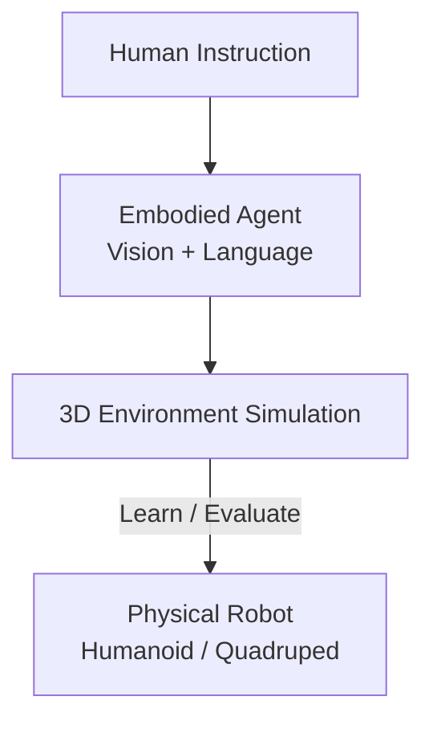

---
# ─────────────────────────────────────────────────────────────
# EXPLORATORY RESEARCH ENTRY — SIMA
#
# Category:  Physical AI → Exploratory Research
# Type:      Exploratory Research (a study/exploration, NOT an
#            engineering implementation and NOT a claim of authorship
#            of the SIMA system).
#
# Content is being added incrementally. Section I (Problem Statement /
# Research Motivation) is written. Remaining planned sections (do NOT
# fill these in yet unless asked):
#   - What I Read
#   - What I Understood
#   - Research Notes
#   - Architectural Observations
#   - Related Research
#   - Experiments / Thought Experiments
#   - Connections to Physical AI
#   - Open Research Questions
#   - Diagrams
#   - References
#
# Section numbering uses Roman numerals: top level I, II, III …
# with sub-sections I.I, I.II, I.III …
#
# DIAGRAM SUPPORT: figures from the SIMA paper (raw_data/SIMA.pdf) are
# NOT added yet. When explicitly requested ("Add the diagram from the
# SIMA paper"), place the extracted figure inside the "Diagrams"
# section with a descriptive, keyword-aware alt text and a caption that
# attributes the source paper/figure number. Do not invent diagrams.
# ─────────────────────────────────────────────────────────────

layout: learning-paper

# ── Page header (mirrors engineering implementation article headers) ──
title: "Exploring SIMA: Generalist Instructable Agents Across Simulated Worlds"
research_type: "Exploratory Research"
status: "In Progress"

# ── SEO metadata structure (values are real but content is not) ──
seo_title: "SIMA (Scalable Instructable Multiworld Agent): Exploring DeepMind's Generalist Embodied Agent"
description: "Research notes on SIMA, Google DeepMind's Scalable, Instructable, Multiworld Agent: a generalist embodied AI agent that follows language across 3D worlds."
slug: sima-scalable-instructable-multiworld-agent
excerpt: "An exploratory study of SIMA — DeepMind's generalist, instructable, multiworld embodied agent — and what it means for Physical AI."
keywords: "SIMA, SIMA 2, Google DeepMind SIMA, SIMA agent, Scalable Instructable Multiworld Agent, Gemini agent, embodied AI, Physical AI, generalist embodied agents, self-improving agents"

# Taxonomy
category: exploratory-research
tags:
  - "SIMA"
  - "SIMA 2"
  - "Google DeepMind"
  - "Gemini"
  - "Embodied AI"
  - "Physical AI"
  - "Generalist Agents"
  - "Instructable Agents"
  - "Simulated Worlds"

# ── Reference material / attribution (source paper) ──
# Confirmed from the paper's title page (raw_data/SIMA.pdf).
paper_title: "Scaling Instructable Agents Across Many Simulated Worlds"
paper_authors: "SIMA Team, Google DeepMind"
paper_link: "https://arxiv.org/abs/2404.10179"
paper_venue: "arXiv preprint (Google DeepMind)"
paper_year: 2024

# ── Media (drives head.html OG + Twitter card and the listing card) ──
image: "/assets/exploratory-research/sima/sima-overview-figure-1.png"

order: 0
mathjax: true

# Collection documents have no implicit date. This one is set explicitly so the
# entry can be merged into the /blog/ listing and sorted alongside site.posts.
date: 2026-09-12

# Shown on the blog card in place of the post category label.
meta: "Physical AI • Exploratory Research"
---

## I. Problem Statement / Research Motivation

### Building Embodied AI Systems That Can Generalize Across Environments

**SIMA (Scalable, Instructable, Multiworld Agent)** demonstrates a software agent capable of following arbitrary natural-language instructions across diverse 3D environments. The agent takes **visual observations and language instructions as input and produces keyboard-and-mouse actions as output**, learning to ground language in perception and embodied interaction across multiple virtual worlds.

This raises a broader question for **Physical AI**: *what if the environments used for training embodied agents could be recreated, simulated, and varied before deploying those capabilities into the physical world?*

### I.I What SIMA Demonstrates Today

*Figure 1 — Overview of SIMA. A large, diverse dataset of gameplay is collected from both curated research environments and commercial video games. This dataset trains agents to follow open-ended language instructions from pixel inputs, producing keyboard-and-mouse action outputs. Agents are then evaluated across a broad range of skills. Source: SIMA Team, Google DeepMind, "Scaling Instructable Agents Across Many Simulated Worlds," [arXiv:2404.10179](https://arxiv.org/abs/2404.10179) (2024), Figure 1. Reproduced here for research commentary.*

SIMA operates in virtual 3D environments. It grounds language in what it sees and acts through the same interface a human would use — keyboard and mouse — rather than a task-specific API.

The value is generality: one agent following open-ended instructions across many worlds, instead of a separate policy trained per game or per task.

### I.II The Physical AI Research Question

With the rapid development of **humanoid and quadruped robots**, increasingly capable simulation platforms, and advances in vision-language-action models, there is a potential path toward building training environments that represent challenging real-world scenarios.

For example, a disaster-affected environment could be reconstructed as a 3D simulation containing buildings, roads, obstacles, debris, and other environmental constraints. An embodied agent could then be instructed through natural language to perform tasks within that environment — navigating a specified area, searching a building, inspecting locations, or remaining in a designated region for a set period.

The important research direction is not that the virtual environment would perfectly reproduce reality. **It would provide a controllable approximation of the physical environment in which an agent could learn, evaluate, and generalize behaviors before those behaviors are transferred to a physical robotic system.**

This creates a potential bridge:

### I.III SIMA Is the Starting Point, Not the Claim

SIMA itself does **not** demonstrate this physical-robot transfer. The original work operates in virtual 3D environments and explicitly discusses the relationship between simulated environments and future robotic embodiments. The idea explored here is therefore a **research hypothesis inspired by SIMA**, rather than a capability claimed by the SIMA system.

The longer-term question is whether the same principle of **language-grounded, visually driven, multi-environment learning** can become part of a Physical AI stack in which robots receive human-level instructions, perceive their surroundings, reason about tasks, and execute those tasks in environments that have previously been represented and explored in simulation.

### I.IV The Core Idea

> **Can multiworld, language-grounded agents such as SIMA provide a foundation for training embodied robots in reconstructed and simulated real-world scenarios before those capabilities are deployed in the physical world?**

SIMA is the starting point; Physical AI transfer is the research question.

## II. Introduction: What SIMA Tries to Solve

### II.I The Gap in General AI

Modern AI can write computer programs and play chess at super-human level. Yet its ability to *perceive and act* in the world remains far below human level.

This is the well-known paradox that what is easy for AI is often hard for humans, and vice versa. Competence in language alone is easier for a model than grounded perception and behavior.

The hard problem, then, is not language fluency. It is connecting language to the embodied world we actually inhabit.

### II.II Why Grounding Language Matters

Language is most useful for the abstractions it conveys about the world. Those abstractions enable more efficient learning and generalization.

Once learned, language can unlock planning, reasoning, and communication about grounded situations and tasks. Grounding, in turn, makes a system's understanding of the language itself more systematic and generalizable.

This raises the core questions SIMA is built around:

- How do we bridge the divide between the symbols of language and their external referents?
- How do we connect the generality of language to grounded perception and action?
- How do we do this in a **safe and scalable** way?

### II.III The SIMA Approach

The Scalable, Instructable, Multiworld Agent aims to build a system that follows *arbitrary* language instructions to act in *any* virtual 3D environment — using keyboard-and-mouse actions, from custom research environments to a broad range of commercial video games.

There is a long history of agents that play games or follow instructions in narrow settings. SIMA's bet is different, and it borrows the central lesson of large language models: training on a broad distribution of data is the most effective route to general capability.

### II.IV Deliberately Harder Design Choices

SIMA makes several decisions that make the learning problem harder, but the resulting agent far more general:

- **Rich, open-ended games** with hundreds of objects and a large space of possible interactions.
- **Asynchronous environments** that do not pause while the agent computes its next action.
- **One GPU per game instance**, so the massively parallel actor counts common in reinforcement learning are not available.
- **Human-like observations only** — the agent sees the same screen a person would, with no access to internal game state, rewards, or privileged information.
- **Human-like controls** — keyboard and mouse, not handcrafted action spaces or high-level APIs.
- **Instruction-following as the objective**, rather than maximizing a win-rate or producing plausible behavior.
- **Open-ended natural language**, not simplified grammars or fixed command sets.

The payoff is generality. The same interface works across every environment, with no per-game control or observation design. Because the interface is human-compatible, agents can learn directly by imitating human behavior and can potentially transfer learned skills zero-shot to never-before-seen games.

It is also safe to explore. If the agent crashes a spaceship in a video game, you just restart the game — the lessons still transfer to visually rich real-world domains such as robotics, without the risk and cost of real-world testing.

### II.V Progress So Far

SIMA so far is an agent that performs short-horizon tasks from user-provided language instructions, across a portfolio of over ten 3D environments spanning research environments and commercial video games.

Evaluation is handled differently per setting: research environments use ground-truth state, while commercial games — which do not report task completion — rely on optical character recognition of on-screen text and human review of recorded agent behavior.

The stated ultimate goal is an instructable agent that can accomplish anything a human can do in any simulated 3D environment.

## III. Related Work

### III.I Video Games as a Research Setting

For the last decade, video games have been an increasingly important setting for embodied agents that perform visuomotor control in rich environments — from Atari to DoTA and StarCraft II.

SIMA narrows this to games that most closely resemble 3D physical embodiment: those where the player interacts with a 3D world from a first-person or over-the-shoulder pseudo-first-person view. That focus deliberately excludes much of the prior game-AI work.

First-person embodied games have driven useful techniques, notably learning from video by labeling frames with estimated keyboard-and-mouse actions via inverse dynamics models. More recent work grounds large language models in games that expose an API, or through a lower-level controller. SIMA's difference is breadth: many diverse games rather than a single title.

### III.II Research Environments

A parallel line of work builds custom, controlled environments for research. Many target specific domains of real-world knowledge — AI2-THOR, VirtualHome, ProcTHOR, AI Habitat, ALFRED, and Behavior simulate embodied agents in naturalistic rendered scenes, while CARLA simulates autonomous driving.

For low-level control, physics simulators such as MuJoCo, PyBullet, and Isaac Gym underpin manipulation benchmarks like Meta-World and Ravens.

The Playhouse and WorldLab environments are built in Unity, and procedurally generated task distributions have been used to train broad, shared skills. SIMA uses Playhouse, WorldLab, and ProcTHOR, and introduces a new environment of its own, the **Construction Lab**.

### III.III Robotics and Sim-to-Real Transfer

Robotics is a central setting for embodied intelligence. Many projects train in simulation and transfer to real robots, though usually within a single, constrained setting.

More recent work pushes toward environment-generality by scaling robot learning datasets across many tasks and embodiments. This is the same generality SIMA pursues, but in diverse virtual worlds rather than on physical hardware.

### III.IV Connecting Language to Embodied Action

Several works learn to follow instructions from semi-natural synthetic language, or by imitating human interactions in a virtual house. Others connect language to embodied action as a hierarchy directed by a language model.

SIMA shares the view that language is an ideal interface for directing an agent, but extends the scope beyond a single controlled environment. It overlaps with generalist models trained to span actions, vision, and language, while remaining distinct in three ways:

1. A **language-first** perspective — every training experience is language-driven.
2. A **unified, human-like interface** across environments, mapping vision and language to keyboard-and-mouse control.
3. A **broad range** of visually rich, diverse, human-compatible environments affording many complex skills.

### III.V Language and Grounding Reinforce Each Other

A key motivation for SIMA is that learning language and learning about environments are mutually reinforcing.

Even when language is not required to solve a task, learning it can help agents form generalizable representations, explore more efficiently, and compose known goals into new ones. Predicting natural-language explanations, descriptions, or plans can further improve efficiency and out-of-distribution generalization.

The reverse holds too. Human language is deeply integrated with our understanding of grounded situations, so richer grounding should support deeper language understanding. Empirically, agents grounded in more embodied environments show more systematic compositional generalization. This mutual reinforcement is why SIMA aims to learn language and its grounding together.

## IV. Approach

What distinguishes the SIMA project is its focus on **language-conditional behavior** across a diverse range of visually and mechanically complex simulated environments that afford a rich set of skills.

*Figure 2 — Environments. SIMA uses over ten 3D environments, spanning commercial video games and research environments. Their diversity shows in the wide range of visual observations and affordances, yet all share basic 3D embodied interaction such as navigation. Commercial games offer richer interactions and visual fidelity, while research environments serve as a controlled testbed for probing agent capabilities. Source: SIMA Team, Google DeepMind, "Scaling Instructable Agents Across Many Simulated Worlds," [arXiv:2404.10179](https://arxiv.org/abs/2404.10179) (2024), Figure 2. Reproduced here for research commentary.*

### IV.I Environments

SIMA aims to ground language across many rich 3D environments. The team deliberately selected environments that offer a broad range of open-ended interactions, because those afford the possibility of rich and deep language interaction.

The focus is on environments viewed either in **first-person**, or in **third-person with the camera over the player's shoulder**. To achieve both diversity and depth of experience, SIMA draws on a mix of commercial video games and environments built specifically for agent research.

Each type has distinct advantages. Commercial games provide open-ended, diverse experience, while research environments allow targeted assessment of specific skills. The portfolio spans deliberately different settings — from mundane tasks in semi-realistic worlds, to playing a mischievous goat in a world with exaggerated physics, to exploring mythological worlds and science-fiction universes.

> **Research extension (my hypothesis, not part of the SIMA paper).**
> The same principle — a diverse portfolio of 3D environments used to train language-conditioned embodied agents — could be pointed at high-stakes **disaster response and defense** scenarios, where real-world training is dangerous, slow, or impossible.
>
> Concrete environments I would explore:
>
> - **Emergency response in open-world games.** A game such as *GTA V* already models dense cities, traffic, and vehicles. It could serve as a sandbox for training agents on ambulance and emergency-response behaviors — reaching an incident, navigating traffic, and following instructed protocols.
> - **Reconstructed disaster zones.** A region prone to earthquakes, such as parts of Nepal, could be rebuilt as a 3D simulation with collapsed structures, blocked roads, and debris, so agents can practice search-and-rescue navigation and inspection before any physical deployment.
> - **Hazardous urban operations for humanoid robots.** Complex urban environments could train humanoid and quadruped robots to move through rubble, cluttered interiors, and other high-risk settings under natural-language instruction.
>
> The point is not photorealism. It is a controllable approximation in which embodied agents can learn, be evaluated, and generalize *before* transferring to physical robots — connecting back to the bridge in [Section I](#i-problem-statement--research-motivation).

*My concept illustration (not from the SIMA paper). Two example simulated scenarios where language-instructed embodied agents could be trained and evaluated before physical deployment: disaster search-and-rescue, and navigation, inspection, and mapping in a complex urban environment. Capabilities shown are non-combat — understanding complex environments, search and detection, navigation and mapping, situation assessment, and human-robot collaboration. Simulated environments can help train and evaluate embodied agents for challenging real-world scenarios.*

#### IV.I.I Commercial Video Games

Commercial video games offer open-ended worlds full of visual richness and the potential for complex interactions. SIMA partners with game developers whose titles are used for training agents, and continues to build new developer relationships.

The selection favors open-world and sandbox games with diverse skills, while deliberately **avoiding games with harmful content such as extreme violence or bias**. The team also seeks a broad variety of worlds and stories, with a preference for games that offer genuine depth of mechanics.

As a result, the portfolio poses a wide range of perception-and-action challenges — from flying a spaceship to mining minerals or crafting armor — alongside common core skills like navigation and gathering resources. Games also introduce interactions rarely found in research environments, such as menu use and interfaces closer to those of everyday computer use.

## V. Results

The SIMA paper reports how well a single generalist agent follows language instructions across its portfolio of 3D virtual environments. The results below are all measured in simulation, on the seven environments for which quantitative evaluations exist. They describe what SIMA demonstrates as software; they are not claims about physical robots.

### V.I Qualitative Behavior Across Environments

*Figure 5 — Agent Trajectories. The SIMA agent performs a range of language-instructed tasks across diverse 3D virtual environments, shown here as representative filmstrips in commercial video games. Notably, the agent can reach targets that are not initially in view, such as "go to the spaceship" and "go to the HUB." These are virtual-environment behaviors, not physical-robot deployments. Source: SIMA Team, Google DeepMind, "Scaling Instructable Agents Across Many Simulated Worlds," [arXiv:2404.10179](https://arxiv.org/abs/2404.10179) (2024), Figure 5. Reproduced here for research commentary.*

Despite the visual diversity of these worlds, the same agent interface — pixels in, keyboard-and-mouse out — produces coherent navigation and tool-use behavior. The paper highlights that the agent can locate an instructed target even when it starts off-screen, which requires search rather than a single reflexive action.

### V.II Success Rate by Environment

*Figure 6 — Average Success Rate of the SIMA Agent by Environment. Success rates are averaged across many tasks and three training runs with different random seeds; error bars are 95% confidence intervals. Bar color indicates the evaluation method used for that environment: ground-truth state, human evaluation, or OCR combined with human evaluation. Source: SIMA Team, Google DeepMind, "Scaling Instructable Agents Across Many Simulated Worlds," [arXiv:2404.10179](https://arxiv.org/abs/2404.10179) (2024), Figure 6. Reproduced here for research commentary.*

The paper reports notable but far-from-perfect success, with clear variation across environments. The simpler research environments Playhouse and WorldLab score highest, while the more complex commercial games score lower. Construction Lab is a notable exception among research environments, scoring low and marking it as a deliberately hard testbed.

Two details matter for reading this chart honestly. First, the color coding is about **evaluation**, not input: **optical character recognition (OCR) appears here as a way to detect task completion, not as something the agent perceives**. Second, the authors note that humans would not score 100% on some of these tasks either, so the ceiling is not a clean 100%.

### V.III Success Rate by Skill Category

*Figure 7 — Average Success Rate of the SIMA Agent by Skill Category. Skills are grouped into clusters (shown by color) derived from the evaluation tasks. Performance is uneven across skills. Source: SIMA Team, Google DeepMind, "Scaling Instructable Agents Across Many Simulated Worlds," [arXiv:2404.10179](https://arxiv.org/abs/2404.10179) (2024), Figure 7. Reproduced here for research commentary.*

Breaking results down by skill shows an intuitive pattern. Movement and navigation skills are relatively reliable, while skills that demand precise action or spatial understanding — combat, tool use, and building — are the hardest. The paper cautions that even seemingly simple clusters can hide nontrivial interactions, so the labels should not be read as difficulty tiers.

### V.IV What Actually Drives Performance

*Figure 8 — Aggregate Relative Performance. Bars show performance relative to an environment-specialized expert agent, which is normalized to 100% (the solid line). The generalist SIMA agent outperforms the specialists, the no-pretraining ablation is weaker, and the no-language ablation is dramatically worse. Source: SIMA Team, Google DeepMind, "Scaling Instructable Agents Across Many Simulated Worlds," [arXiv:2404.10179](https://arxiv.org/abs/2404.10179) (2024), Figure 8. Reproduced here for research commentary.*

This ablation is the most informative result for anyone thinking about generalist embodied agents. The paper reports three findings:

- **Training across many worlds beats specializing.** The single SIMA agent outperforms agents trained on one environment each, by roughly 67% on average — evidence of positive transfer across environments.
- **Internet-scale pretraining helps.** Removing the pretrained visual and language encoders lowers performance, showing that broad prior knowledge supports grounded learning.
- **The agent genuinely uses language.** The no-language ablation collapses to a small fraction of SIMA's performance. This is important: it shows the evaluation tasks cannot be solved by language-agnostic behavioral priors, so the agent is really following instructions rather than replaying plausible motions.

> **Reading these results against my Physical AI hypothesis (not a SIMA paper claim).** These numbers describe an agent in virtual worlds. What makes them interesting for the direction in [Section IV](#iv-approach) is the ablation evidence: breadth of environments and genuine language grounding are what carry performance. If those two properties are what matter, then a diverse portfolio of reconstructed real-world simulations, paired with language instructions, is a plausible ingredient for training embodied agents before physical deployment. SIMA does not demonstrate that transfer; it motivates the question.

## VI. SIMA 2: A Gemini-Powered Agent That Reasons and Self-Improves

Everything above describes the original SIMA, from the 2024 technical report. In **November 2025, Google DeepMind announced SIMA 2**, a successor that embeds a **Gemini model as the agent's core**. This section is based on the DeepMind announcement blog, which is a research preview rather than a peer-reviewed paper, so the claims here are the authors' reported results, not independently verified benchmarks.

*SIMA 2 acting across four different 3D virtual game worlds. Source: SIMA Team, Google DeepMind, "SIMA 2: An Agent that Plays, Reasons, and Learns With You in Virtual 3D Worlds," announcement blog, November 13, 2025. Reproduced here for research commentary. The blog also includes inline video clips of the agent in action; those are hosted by DeepMind and are best viewed on the [original page](https://deepmind.google/blog/sima-2-an-agent-that-plays-reasons-and-learns-with-you-in-virtual-3d-worlds/).*

### VI.I From Instruction-Follower to Reasoning Companion

The original SIMA learned over 600 language-following skills — "turn left," "climb the ladder," "open the map" — by looking at the screen and driving a virtual keyboard and mouse, with no access to game internals.

SIMA 2 keeps that human-like interface but changes the brain behind it. With **Gemini embedded as its core**, the agent moves beyond executing instructions to **reasoning about them**. The blog reports that SIMA 2 can:

- Understand a high-level goal and plan the steps to reach it.
- Hold a conversation with the user about what it is doing and why.
- Describe its own intended actions, because it was trained on human demonstration videos with language labels **plus Gemini-generated labels**.

The authors describe the experience as closer to collaborating with a companion than issuing commands.

### VI.II A Leap in Generalization

The Gemini core also improved generalization to games the agent was never trained on, such as the Viking survival game **ASKA** and **MineDojo**, a research implementation of Minecraft.

*Task completion success rates on an expanded, harder evaluation set across training environments. SIMA 2 (65%) roughly doubles SIMA 1 (31%) and closes much of the gap to the human baseline. The SIMA 1 number here reflects the new, more difficult evaluations, so it is not directly comparable to the figures in [Section V](#v-results). Source: SIMA Team, Google DeepMind, SIMA 2 announcement blog, November 13, 2025. Reproduced here for research commentary.*

The blog highlights **concept transfer** as the key driver: SIMA 2 can take an idea like "mining" learned in one game and apply it to "harvesting" in another. It also reports understanding of multimodal prompts, including sketches drawn on the screen, as well as instructions given in different languages and even emojis.

*Held-out generalization: on games never seen during training, SIMA 2 improves over SIMA 1 by roughly +12% on ASKA and +13% on MineDojo. Source: SIMA Team, Google DeepMind, SIMA 2 announcement blog, November 13, 2025. Reproduced here for research commentary.*

### VI.III Playing in Newly-Imagined Worlds

To stress-test generalization, DeepMind paired SIMA 2 with **Genie 3**, a world model that generates real-time 3D environments from a single image or text prompt.

Placed in these freshly generated worlds, the agent could orient itself, interpret instructions, and take meaningful actions toward goals despite never having seen anything like them. This coupling of a generalist agent with a generative world model is the part of the announcement most relevant to my Physical AI hypothesis, and I return to it below.

### VI.IV Self-Improvement Through Self-Directed Play

The most novel capability in the announcement is **self-improvement**. The reported loop works like this:

*The SIMA 2 self-improvement cycle. A Gemini task setter proposes a task, the agent attempts it, and a Gemini reward model estimates how well it did. That experience is stored in a bank of self-generated data used to train the next, more capable generation — without new human demonstrations. Source: SIMA Team, Google DeepMind, SIMA 2 announcement blog, November 13, 2025. Reproduced here for research commentary.*

After an initial phase of learning from human demonstrations, SIMA 2 can enter a new game and keep improving **through self-directed play alone**, using Gemini to set tasks and estimate rewards. The blog reports this even worked inside Genie-generated environments, which the authors frame as a step toward open-ended learners that need little human intervention.

### VI.V Reported Limitations

The announcement is explicit that SIMA 2 is a research effort with real limits:

- **Long-horizon tasks.** Complex, multi-step goals that need sustained reasoning and goal verification remain hard.
- **Short memory.** The agent uses a limited context window to keep interaction low-latency, so it does not remember much of a session.
- **Low-level control and perception.** Executing precise keyboard-and-mouse actions and robustly understanding complex 3D scenes are still open problems.

### VI.VI What SIMA 2 Changes for My Physical AI Hypothesis

Two developments here matter for the research direction in [Section IV](#iv-approach), and the blog itself makes a robotics connection.

- **The authors' own framing.** DeepMind states that SIMA 2 "offers a strong path toward application in robotics," describing skills like navigation, tool use, and collaborative task execution as building blocks for physical embodiment. This is the paper authors' stated view, not an independent result.
- **My reading (hypothesis, not a DeepMind claim).** The SIMA 2 plus Genie 3 pairing is the concrete version of the bridge I sketched earlier. A generative world model produces varied environments; a reasoning agent learns and self-improves inside them. If reconstructed real-world scenarios could stand in for Genie's generated worlds, this is a plausible pipeline for training embodied agents before physical deployment. SIMA 2 still runs in virtual worlds with a keyboard-and-mouse interface, so it does not demonstrate transfer to physical robots. It sharpens the open question rather than answering it.
