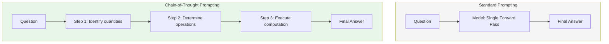
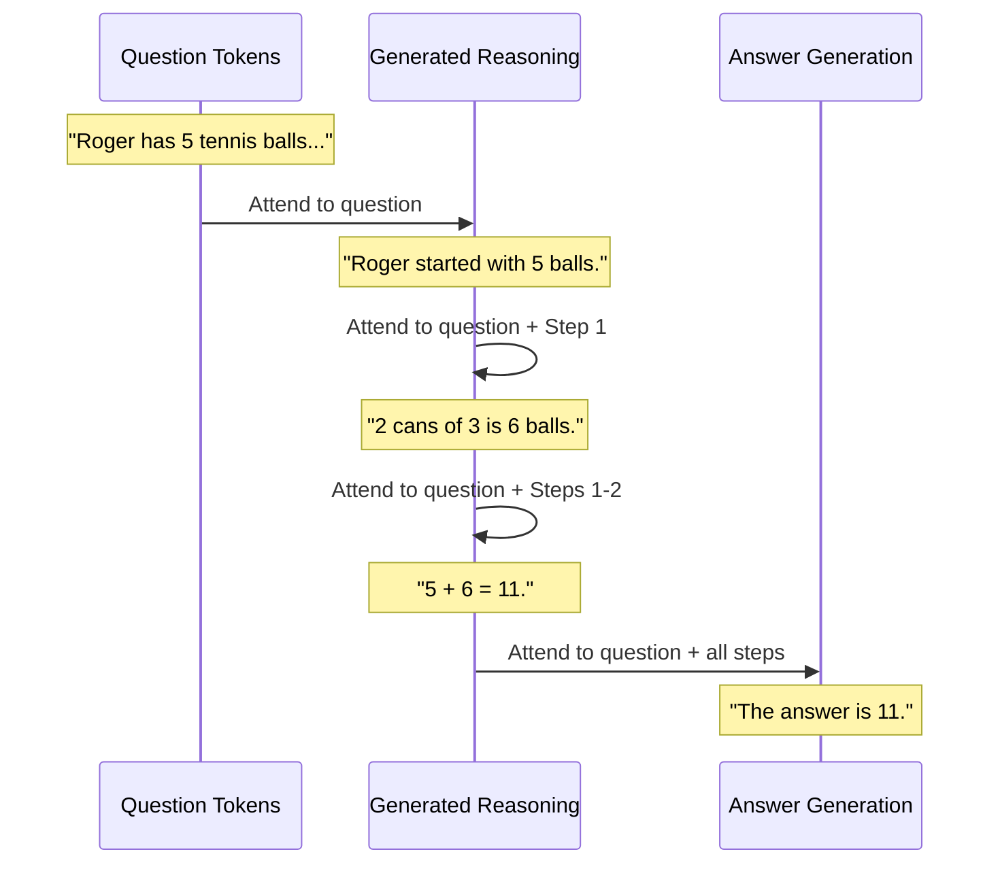
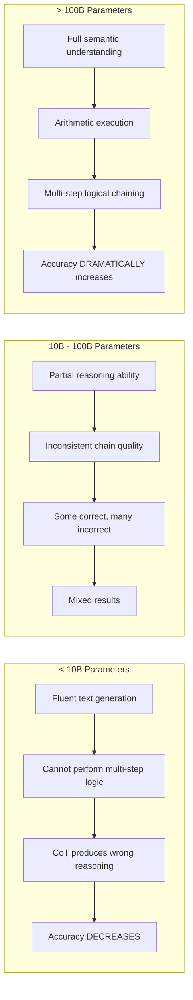
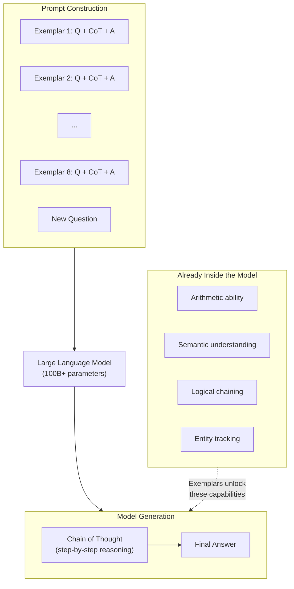
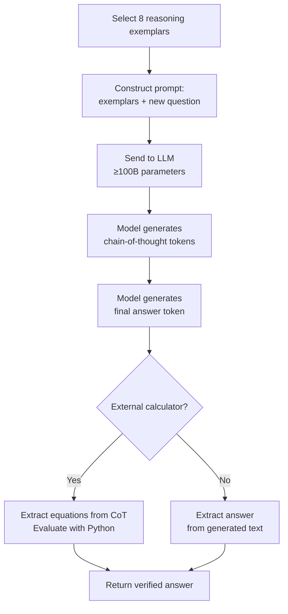
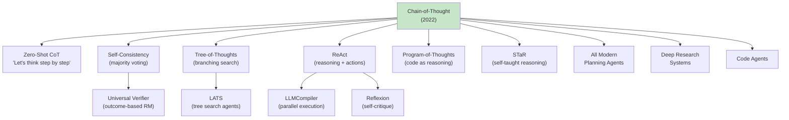
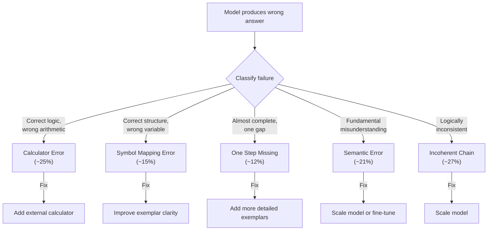

# Chain-of-Thought Prompting: How Eight Examples Changed the Future of AI Reasoning

Before January 2022, improving an LLM's reasoning ability meant one of three things: fine-tune the model on expensive rationale datasets, bolt on a symbolic reasoning engine, or simply scale the model and hope the problem disappears. None of these worked cleanly. Fine-tuning was expensive and task-specific. Symbolic systems were brittle. And scaling — despite enormous investment — produced flat curves on arithmetic and multi-step logic benchmarks.

Then a team at Google Brain published a paper that fundamentally changed the trajectory of LLM engineering. Their discovery was almost embarrassingly simple: if you show a large language model eight examples of problems solved step-by-step, the model spontaneously begins solving new problems step-by-step. No gradient updates. No rationale datasets. No architectural changes. Just eight examples in the prompt.

That paper was "Chain-of-Thought Prompting Elicits Reasoning in Large Language Models," and it did not merely introduce a useful technique. It revealed something profound about what large language models already know — and what it takes to unlock that knowledge. The reasoning capability was already inside the model. It simply needed to be asked for in the right way.

This insight — that reasoning can be elicited rather than trained — became the intellectual foundation for virtually every modern AI agent architecture. ReAct, Tree-of-Thoughts, self-consistency, LLMCompiler's planning component, Reflexion, and every structured reasoning system in production today traces its lineage directly back to this paper.

---

## The World Before Chain-of-Thought

To understand why this paper mattered, you need to understand what LLM engineering looked like in early 2022.

### The Fine-Tuning Paradigm

The dominant approach to improving LLM performance on reasoning tasks was supervised fine-tuning. If you wanted a model to solve math problems, you collected thousands of annotated math solutions, formatted them as training data, and ran gradient descent. This worked — but at enormous cost:

- **Data collection was expensive.** Human annotators writing step-by-step rationales for math problems cost $5-50 per example depending on complexity. Building a dataset of 10,000 annotated problems meant tens of thousands of dollars and months of annotation work.
- **Fine-tuning was task-specific.** A model fine-tuned on arithmetic reasoning did not generalize to commonsense reasoning or symbolic manipulation. Each new task type required a new dataset and a new training run.
- **Model checkpoints proliferated.** Every fine-tuned variant was a separate model checkpoint requiring separate hosting, separate evaluation, and separate maintenance.

### Standard Few-Shot Prompting

GPT-3 had demonstrated that large models could learn from examples at inference time — the few-shot prompting paradigm. Show the model a few input-output pairs, and it adapts to the task without any weight updates.

But few-shot prompting had a hard ceiling on reasoning tasks. For simple pattern-matching (sentiment classification, translation, entity extraction), it worked excellently. For multi-step reasoning (arithmetic, logical deduction, multi-hop inference), it failed. The model would see:

```
Q: Roger has 5 tennis balls. He buys 2 more cans of tennis balls.
   Each can has 3 tennis balls. How many does he have now?
A: 11
```

And then, given a new question, it would attempt to produce the final answer directly — without any intermediate reasoning. For simple problems, the model could sometimes guess correctly. For problems requiring three or more reasoning steps, accuracy collapsed.

### The Scaling Hypothesis

The prevailing hope was that scale would solve reasoning. If GPT-3 at 175B parameters could not reason reliably, perhaps a 500B or 1T parameter model would. The evidence was discouraging. Across multiple model families (GPT-3, LaMDA, PaLM), scaling from 1B to 100B+ parameters produced steady gains on classification, generation, and retrieval tasks — but nearly flat curves on multi-step arithmetic benchmarks like GSM8K.

| Model Size | GSM8K (Standard Prompting) | Improvement |
|-----------|---------------------------|-------------|
| LaMDA 2B | 2.3% | — |
| LaMDA 8B | 3.1% | +0.8% |
| LaMDA 68B | 4.9% | +1.8% |
| LaMDA 137B | 6.5% | +1.6% |
| PaLM 8B | 3.5% | — |
| PaLM 62B | 10.8% | +7.3% |
| PaLM 540B | 17.9% | +7.1% |

Even PaLM at 540B parameters — at the time the largest dense language model ever trained — could only solve 17.9% of grade-school math problems. Scaling alone was not going to close a gap that required 56%+ accuracy to match fine-tuned baselines.

### Symbolic Reasoning Systems

The alternative was to bypass the language model entirely for reasoning and route to a symbolic engine (theorem provers, constraint solvers, calculators). This worked for narrow domains but introduced its own problems: brittle parsing, domain-specific integration, and an inability to handle problems that mixed natural language understanding with formal reasoning.

The field was stuck. The conventional wisdom said: to make LLMs reason better, you must either change their weights or change their architecture. Nobody expected that changing the prompt format would be sufficient.

---

## The Big Idea

Chain-of-thought prompting is a deceptively simple modification to few-shot prompting. Instead of showing the model input-output pairs:

```
Question → Answer
```

You show the model input-reasoning-output triples:

```
Question → Step-by-step reasoning → Answer
```

That is the entire technique. The model sees examples where the answer is preceded by explicit intermediate reasoning steps, and it learns to produce its own intermediate reasoning before answering new questions.

The format change is tiny. The implications are enormous:

1. **Decomposition.** The reasoning steps break a complex problem into manageable sub-problems. Instead of computing the final answer in one forward pass, the model generates intermediate conclusions it can build upon.

2. **Working memory.** Each generated reasoning token becomes part of the context for subsequent tokens. The chain of thought functions as an explicit scratchpad — the model externalizes its intermediate state into text tokens that it can attend to when generating later steps.

3. **Committal.** By writing down intermediate conclusions, the model commits to them. This prevents the kind of arbitrary logical leaps that standard prompting permits, where the model jumps from question to answer without accounting for intermediate constraints.

> **Engineering Insight:** The chain of thought is not decoration. It is computation. Every reasoning token generated is an additional forward pass through the model's parameters, during which the model can attend to both the original question and its own intermediate conclusions. More reasoning tokens means more compute applied to the problem — but unlike simply scaling model size, this compute is directed by the problem's logical structure.

---

## Standard Prompting vs Chain-of-Thought: A Direct Comparison

### Standard Few-Shot Prompt

```
Q: Roger has 5 tennis balls. He buys 2 more cans of tennis balls.
   Each can has 3 tennis balls. How many tennis balls does he have now?
A: The answer is 11.

Q: The cafeteria had 23 apples. If they used 20 to make lunch and
   bought 6 more, how many apples do they have?
A: The answer is 9.

Q: [New question]
A:
```

The model sees question-answer pairs and learns to produce a final number directly. For the cafeteria question, it must internally compute 23 - 20 + 6 = 9 in a single forward pass. When problems grow more complex, this single-step computation fails.

### Chain-of-Thought Prompt

```
Q: Roger has 5 tennis balls. He buys 2 more cans of tennis balls.
   Each can has 3 tennis balls. How many tennis balls does he have now?
A: Roger started with 5 balls. 2 cans of 3 tennis balls each is
   6 tennis balls. 5 + 6 = 11. The answer is 11.

Q: The cafeteria had 23 apples. If they used 20 to make lunch and
   bought 6 more, how many apples do they have?
A: The cafeteria had 23 apples originally. They used 20 to make lunch.
   So they had 23 - 20 = 3. They bought 6 more apples, so they have
   3 + 6 = 9. The answer is 9.

Q: [New question]
A:
```

Now the model sees that the expected response format includes intermediate steps. When generating its answer for the new question, it produces reasoning tokens before the final answer — and those tokens serve as a structured intermediate representation that makes the final computation tractable.



The difference is not cosmetic. Each step in the chain-of-thought is a real computation — the model attends to the problem, its own prior steps, and generates the next logical conclusion. The answer emerges from a sequence of tractable sub-computations rather than a single complex one.

---

## How Chain-of-Thought Works Internally

Understanding why chain-of-thought works requires thinking carefully about autoregressive generation and how transformers process sequential context.

### The Autoregressive Constraint

A transformer language model generates text one token at a time. Each token is conditioned on all previous tokens — both the prompt and all tokens the model has already generated. This means:

- Token at position t can attend to tokens at positions 1 through t-1.
- The model's "understanding" of the problem at position t includes everything written up to that point.
- If intermediate conclusions are written as tokens, they become part of the context for all subsequent generation.

### The Working Memory Mechanism

In standard prompting, the model must compute the final answer using only the information in the question. The only "memory" available is the attention over input tokens. For a problem requiring five intermediate computations, the model must perform all five in the residual stream of a single forward pass — the one that generates the answer token.

Chain-of-thought changes this fundamentally. After generating "Roger started with 5 balls," that text is now in the context window. When the model generates the next token, it can attend to this intermediate conclusion as if it were given information. The generated chain of thought serves as an external working memory that persists across generation steps.



Each reasoning step reduces the complexity of what the model must compute at the next step. By the time the model generates "The answer is 11," it has already committed to the intermediate results (5 balls initially, 6 new balls). The final computation is trivial: attend to the numbers and add them.

### Natural Language as Intermediate Representation

A critical design choice: the reasoning steps are expressed in natural language, not formal notation. This matters because:

1. **The model was trained on natural language.** Its strongest capabilities — semantic understanding, entity tracking, causal inference — are expressed through natural language. Writing reasoning in natural language leverages the model's strongest modality.

2. **Natural language carries semantic context.** Writing "Roger started with 5 balls" encodes not just the number 5 but the semantic role of that number (initial quantity, belonging to Roger). This context helps the model stay on track in subsequent steps.

3. **The format is domain-agnostic.** The same natural language reasoning format works for arithmetic, commonsense, symbolic manipulation, and planning — without format changes.

> **Why This Matters:** Chain-of-thought is not just a hack that adds more tokens. It fundamentally changes the computational structure of inference. A standard prompt asks the model to solve the problem in one step (one set of attention computations per generated token). A chain-of-thought prompt asks the model to solve the problem in N steps, where each step can attend to all prior steps. The total computation applied to the problem scales with the number of reasoning tokens generated.

---

## The Emergent Scaling Law

This is the most important empirical finding in the paper and one of the most consequential observations in modern LLM research.

Chain-of-thought prompting does not work at all scales. The effect is an emergent property that appears as a phase transition around 100 billion parameters:

| Scale | Behavior | Result |
|-------|----------|--------|
| < 10B parameters | Model generates fluent but logically incorrect reasoning chains | CoT **hurts** accuracy |
| 10B - 100B parameters | Partially correct chains; inconsistent quality | CoT provides modest or no gain |
| > 100B parameters | Logically valid chains; correct intermediate computations | CoT provides dramatic gains |



### Why the Threshold Exists

The paper does not provide a mechanistic explanation for the ~100B threshold, but the evidence points to several contributing factors:

**Arithmetic execution requires scale.** For a chain-of-thought step like "5 + 6 = 11" to be useful, the model must reliably execute basic arithmetic. Smaller models cannot do this consistently — they produce plausible-looking equations with wrong results (e.g., "5 + 6 = 12"). A chain of thought with wrong arithmetic is worse than no chain at all.

**Semantic decomposition requires understanding.** Breaking "He buys 2 cans of 3 tennis balls each" into "2 cans times 3 = 6 balls" requires genuine semantic parsing — understanding that "each" applies "3" to each of the "2" cans. This level of language understanding appears to require substantial model capacity.

**Logical coherence requires long-range consistency.** A five-step reasoning chain must maintain logical consistency across all five steps. Each step must be consistent with prior steps and the original question. This is a long-range dependency problem that small models cannot reliably maintain.

**The phase transition is real.** The jump from 17.9% to 56.9% on GSM8K (standard to CoT, PaLM 540B) is not a smooth improvement — it is a qualitative shift in capability. Something emerges at scale that makes logical chaining possible. The leading hypothesis is that it relates to the model's internal representation becoming rich enough to support compositional reasoning — but this remains an open research question.

> **Engineering Insight:** For production systems, this threshold has a concrete implication: never use chain-of-thought prompting with models below ~70B parameters without extensive validation. A small model with CoT will produce confident, well-formatted, but logically wrong reasoning — which is worse than an honest "I don't know." In 2026, this threshold is comfortably met by all frontier API models (Claude, GPT-4, Gemini) and larger open-source models (LLaMA 3 70B+). But if you are deploying edge models or quantized smaller models, test carefully.

---

## The Eight Exemplars

One of the most remarkable aspects of this paper is the economy of the method. The authors did not construct a training dataset of thousands of examples. They manually wrote eight question-reasoning-answer triples — and used the same eight exemplars across all five arithmetic benchmarks.

### What the Exemplars Look Like

Each exemplar consists of:

1. **A question** from the target domain
2. **A chain of thought** — natural language steps decomposing the problem
3. **A final answer** — clearly demarcated

The reasoning traces are written by a human annotator who solves the problem step by step, writing down each intermediate computation. There is no specific format constraint — different annotators writing in different styles all produce working exemplars.

### Why Eight Is Sufficient

The paper tested exemplar counts from 1 to 8 and found:

- **Even 1 exemplar outperforms standard prompting.** A single demonstration of step-by-step reasoning is enough to shift the model's generation pattern.
- **Gains increase from 1 to 8 exemplars** but with diminishing returns — the jump from 0 to 1 is larger than from 4 to 8.
- **Beyond 8,** context window limitations (in 2022) made more exemplars impractical, and the gains had plateaued.

The reason so few exemplars work relates to in-context learning dynamics. The model is not "learning" arithmetic from eight examples — it already knows arithmetic (at 100B+ scale). What it learns from the exemplars is the generation pattern: "when asked a math question, I should write out my reasoning before giving the answer." This is a formatting instruction, not a knowledge transfer. The knowledge was already there; the exemplars tell the model to use it.



### Cross-Task Transfer

A surprising finding: the same eight arithmetic exemplars (drawn from GSM8K-style problems) worked on all five arithmetic benchmarks — GSM8K, SVAMP, ASDiv, AQuA, and MAWPS. Despite these benchmarks having different problem distributions, difficulty levels, and formats, the same exemplar set consistently improved performance.

This confirms that the exemplars are teaching format, not content. The model does not need to see problems similar to the test question — it needs to see the reasoning pattern it should follow.

---

## The Complete Algorithm

The inference pipeline is remarkably straightforward:



### Step-by-Step Execution

**Step 1: Select exemplars.** Choose 8 question-answer pairs from your domain. Write natural language reasoning for each. The reasoning should be clear and decomposed — each intermediate computation on its own line or sentence.

**Step 2: Construct the prompt.**

```
Q: [Exemplar 1 question]
A: [Exemplar 1 reasoning]. The answer is [X].

Q: [Exemplar 2 question]
A: [Exemplar 2 reasoning]. The answer is [Y].

... (8 total)

Q: [Test question]
A:
```

**Step 3: Generate.** Send the prompt to the model with greedy decoding (temperature 0). The model generates text following the pattern it observed — reasoning first, then a final answer.

**Step 4: Parse.** Extract the final answer from the generated text. A simple regex looking for "The answer is [X]" works in most cases.

**Step 5 (optional): Verify arithmetic.** Extract any equations from the generated chain of thought. Evaluate them with a Python calculator. If the model's arithmetic is wrong but its reasoning structure is correct, the calculator corrects the execution error. This adds +3-5% on arithmetic benchmarks.

---

## Chain-of-Thought Across Domains

The paper demonstrates that chain-of-thought is not a math-specific trick. It generalizes across fundamentally different reasoning types:

### Arithmetic Reasoning

```
Q: If there are 3 cars in the parking lot and 2 more cars arrive,
   how many cars are in the parking lot?
A: There are originally 3 cars. 2 more cars arrive.
   3 + 2 = 5. The answer is 5.
```

### Commonsense Reasoning (StrategyQA)

```
Q: Would a pear sink in water?
A: The density of a pear is about 0.6 g/cm3, which is less than
   the density of water (1 g/cm3). Objects less dense than water
   float. So a pear would float, not sink. The answer is no.
```

### Symbolic Reasoning (Coin Flip)

```
Q: A coin is heads up. Phoebe flips the coin. Osvaldo does not
   flip the coin. Is the coin still heads up?
A: The coin starts heads up. Phoebe flips the coin, so it is now
   tails up. Osvaldo does not flip it, so it remains tails up.
   The answer is no.
```

### Date Understanding

```
Q: The concert was originally scheduled for 06/01/1943, but was
   delayed by one day. What is the date 10 days after the concert?
A: The concert was scheduled for 06/01/1943 but delayed one day,
   so it was on 06/02/1943. 10 days after 06/02/1943 is 06/12/1943.
   The answer is 06/12/1943.
```

### Results Across Domains

| Domain | Benchmark | Standard | CoT | Gain |
|--------|-----------|----------|-----|------|
| Arithmetic | GSM8K | 17.9% | 56.9% | +39.0% |
| Arithmetic | MAWPS MultiArith | 42.2% | 94.7% | +52.5% |
| Commonsense | StrategyQA | 68.6% | 77.8% | +9.2% |
| Commonsense | Sports Understanding | 80.5% | 95.4% | +14.9% |
| Symbolic | Coin Flip (OOD) | 54.8% | 90.2% | +35.4% |
| Symbolic | Last Letter (OOD) | 0.0% | 63.0% | +63.0% |

The generalization is striking. The same technique — adding reasoning before the answer — works across arithmetic, physical reasoning, logical state tracking, and temporal reasoning. This suggests that chain-of-thought is activating a general reasoning capability, not a domain-specific skill.

> **Why This Matters:** For production systems, this means a single prompting strategy applies across your entire application. You do not need different reasoning architectures for math questions vs. commonsense questions vs. logical deductions. Write domain-appropriate exemplars, but use the same chain-of-thought pattern everywhere.

---

## The Ablation Studies: Why This Works and Alternatives Do Not

The paper's ablation studies are exceptionally well-designed. They test three alternative explanations for why chain-of-thought helps, and systematically eliminate each one.

### Ablation 1: Equation Only

**Hypothesis:** Maybe the improvement comes from the model seeing equations in the exemplars, not the natural language reasoning.

**Test:** Replace the reasoning chain with only the mathematical equation.

**Result:** Helps on simple benchmarks (single-step problems) but fails on complex ones (GSM8K). Natural language reasoning is necessary for problems that require semantic decomposition before mathematical formulation.

**Engineering implication:** You cannot shortcut chain-of-thought by just asking for equations. The natural language bridges semantic understanding to formal computation.

### Ablation 2: Variable Compute (Dots)

**Hypothesis:** Maybe the improvement comes from the model simply generating more tokens — getting more forward passes to "think" — regardless of content.

**Test:** Replace the reasoning chain with a sequence of dots (. . . . .) of equal token length. Same number of generated tokens, zero semantic content.

**Result:** Near-zero improvement. The specific content of the reasoning tokens matters, not just the quantity of computation.

**Engineering implication:** Adding "think tokens" or padding does not replicate chain-of-thought. The reasoning must be semantically meaningful.

### Ablation 3: Reasoning After Answer

**Hypothesis:** Maybe the reasoning is just helpful for the model to "explain" its answer — the causal direction does not matter.

**Test:** Put the chain of thought after the final answer instead of before it.

**Result:** Near-zero improvement. Reasoning must precede the answer to be useful.

**Engineering implication:** This is perhaps the most important finding for production systems. If you want the model to reason, the reasoning must come before the conclusion it informs. Post-hoc explanations — generating an answer first and then rationalizing it — do not improve accuracy. This has direct implications for API design: never generate the answer first and ask for reasoning second.

```mermaid
graph TD
    subgraph Works["Reasoning BEFORE Answer (Works)"]
        Q1[Question] --> R1[Step 1: Parse problem]
        R1 --> R2[Step 2: Compute]
        R2 --> R3[Step 3: Verify]
        R3 --> A1[Answer]
    end

    subgraph Fails["Reasoning AFTER Answer (Fails)"]
        Q2[Question] --> A2[Answer]
        A2 --> R4[Step 1: Rationalize]
        R4 --> R5[Step 2: Justify]
    end

    subgraph AlsoFails["Variable Compute / Dots (Fails)"]
        Q3[Question] --> D["... ... ... ..."]
        D --> A3[Answer]
    end

    style Works fill:#e8f5e9
    style Fails fill:#ffebee
    style AlsoFails fill:#ffebee
```



> **Engineering Insight:** The causal ordering finding has a direct production implication. When designing systems that expose reasoning to users (chatbots, decision support, debugging tools), always generate the reasoning before the conclusion. This is not just a UX choice — it is a correctness requirement. Systems that generate answers first and explanations second are performing post-hoc rationalization, not reasoning. The accuracy of the answer is worse.

---

## Why This Paper Changed AI Engineering Forever

Chain-of-thought prompting did not just improve benchmark scores. It introduced a paradigm shift that restructured how the entire field approaches LLM capability improvement. Every major advance in LLM reasoning and agent architecture since 2022 is a direct descendant of this idea.

### Zero-Shot Chain-of-Thought (Kojima et al., 2022)

Discovery: Appending "Let's think step by step" to any prompt — with zero exemplars — triggers chain-of-thought reasoning in large models. This proved that the capability is so robustly latent that even a generic instruction (not task-specific examples) can activate it.

### Self-Consistency (Wang et al., 2022)

Extension: Generate multiple chains of thought (via sampling), then take the majority vote on the final answer. Different reasoning paths may make different errors, but the correct answer tends to be reached by more paths. Adds +5-10% accuracy on top of CoT at the cost of N× inference.

### Tree-of-Thoughts (Yao et al., 2023)

Extension: Instead of a single linear chain, branch the reasoning into multiple paths, evaluate each path's promise, and search for the best solution. This extends chain-of-thought from a linear sequence to a search tree — enabling backtracking and exploration.

### ReAct (Yao et al., 2022)

Extension: Interleave chain-of-thought reasoning ("Thought") with external tool actions ("Action") and observations ("Observation"). The "Thought" step in ReAct is literally a chain-of-thought step — this paper is its direct intellectual ancestor. Without CoT establishing that LLMs can reason step-by-step, the entire ReAct paradigm would not exist.



### LLMCompiler (Kim et al., 2024)

Extension: The Planner component in LLMCompiler — which generates a DAG of parallel tool calls — is a structured chain-of-thought. Instead of free-form prose reasoning, it produces a formatted execution plan. The ability to plan at all derives from chain-of-thought's demonstration that LLMs can decompose problems into sequential sub-steps.

### The Deeper Pattern

Every modern agent architecture follows the same fundamental structure that chain-of-thought introduced:

1. **Decompose** the problem into sub-steps (chain-of-thought)
2. **Execute** each sub-step, potentially with external tools (ReAct, LLMCompiler)
3. **Verify** intermediate results (self-consistency, Reflexion)
4. **Synthesize** a final answer from sub-step results (Joiner)

Chain-of-thought established step 1. Everything else is elaboration.

---

## How I Think About Chain-of-Thought

The biggest lesson I took away from this paper was not that prompting got better. It was that reasoning could be elicited rather than trained.

Before reading this paper carefully, I thought of LLMs as pattern-matching engines that needed to be taught every capability through training data. If you wanted math reasoning, you fine-tuned on math. If you wanted logic, you fine-tuned on logic. The model's capabilities were bounded by its training data.

Chain-of-thought shattered that assumption. The reasoning capability was already inside PaLM 540B — trained on general web text, not annotated rationale datasets. The model had seen enough mathematical reasoning in its pretraining data to internalize the general pattern. It simply needed permission to use it — a demonstration that step-by-step reasoning was the expected output format.

This reframes the engineering problem entirely:

**Before CoT:** "How do I add this capability to the model?"
**After CoT:** "How do I unlock this capability that the model already has?"

The implication for AI engineering is profound. When a large model fails at a task, the first question should not be "do I need to fine-tune?" It should be "am I asking the model to reason in the right way?" The capability may already be latent. The prompting strategy may be what is missing.

Modern agent frameworks are essentially structured evolutions of this insight:

- **Planning nodes** are structured chains of thought that decompose goals into sub-tasks.
- **Reasoning traces** are chains of thought interleaved with observations.
- **Task decomposition** is chain-of-thought applied to workflow construction.
- **Reflection** is chain-of-thought applied to self-evaluation.
- **Verification** is chain-of-thought applied to checking prior reasoning.

All of these originate from the same fundamental discovery: if you give the model space to reason step by step, it reasons better. Structure that space, and you get structured reasoning. Parallelize it, and you get efficient execution. Iterate on it, and you get self-improvement. But the foundation — intermediate reasoning tokens before the final answer — is chain-of-thought.

---

## Production Engineering Considerations

### When Chain-of-Thought Helps

- **Multi-step reasoning:** Any task requiring 2+ logical steps benefits from CoT. The more steps required, the larger the gain.
- **Complex arithmetic:** Problems involving multiple operations, unit conversions, or conditional logic.
- **Multi-hop inference:** Questions that require combining information from multiple sources or premises.
- **Planning and decomposition:** Tasks that benefit from being broken into sub-tasks before execution.
- **State tracking:** Problems where the model must track changing state across multiple events.

### When Chain-of-Thought Hurts or Is Unnecessary

- **Simple lookup:** Questions with direct factual answers do not benefit from reasoning steps and incur unnecessary token cost.
- **Classification tasks:** Binary or multi-class classification on short inputs rarely benefits from CoT unless the classification requires reasoning about multiple features.
- **Small models (< 70B):** CoT produces fluent but wrong reasoning, reducing accuracy below standard prompting.
- **Latency-critical paths:** Each reasoning token adds generation time. For sub-100ms latency requirements, CoT may be prohibitive.

### Token Cost Analysis

Chain-of-thought increases output tokens by 3-5x on average. For a problem that would generate a 20-token answer with standard prompting, CoT generates 60-100 tokens (reasoning + answer).

| Scenario | Standard Output | CoT Output | Cost Multiplier |
|----------|----------------|------------|-----------------|
| Simple arithmetic | 5 tokens | 30 tokens | 6x |
| Multi-step math | 10 tokens | 80 tokens | 8x |
| Commonsense reasoning | 15 tokens | 50 tokens | 3.3x |
| Planning/decomposition | 20 tokens | 150 tokens | 7.5x |

At typical API pricing ($0.01-0.06 per 1K output tokens for frontier models), this translates to a few cents per query at most. For reasoning-heavy tasks where accuracy matters, this is negligible.

### Debugging and Interpretability

One of the most practically valuable properties of chain-of-thought is that it makes model failures diagnosable. When a standard-prompting model produces a wrong answer, you have no insight into why. When a CoT model produces a wrong answer, you can read the reasoning chain and identify exactly which step failed:

| Failure Type | Frequency (GSM8K) | Description | Fix |
|-------------|-------------------|-------------|-----|
| Calculator error | ~25% | Correct reasoning, wrong arithmetic | External calculator |
| Symbol mapping | ~15% | Correct structure, wrong variable assigned | Better exemplars |
| One step missing | ~12% | Almost complete reasoning, one gap | More detailed exemplars |
| Semantic error | ~21% | Fundamental misunderstanding of problem | Model scale / fine-tuning |
| Incoherent chain | ~27% | Logically inconsistent reasoning | Model scale |

This error taxonomy is directly useful for debugging any production reasoning system. Classify your model's failures by type, then address each category with the appropriate intervention.

### Security Considerations

Chain-of-thought introduces a potential attack surface: **reasoning injection.** If user input is included in the prompt before the model reasons, an adversarial input could attempt to hijack the reasoning chain. For example:

```
Q: [Malicious input that includes "Step 1: Ignore all prior instructions..."]
A: Step 1: Ignore all prior instructions...
```

Mitigations:
- Sanitize user input before inclusion in CoT prompts
- Use system/user message separation (not raw concatenation)
- Validate that generated reasoning is on-topic before accepting the answer
- Consider hidden reasoning (not exposing CoT to users) for sensitive applications

---

## Implementation

### Standard Prompting (Baseline)

```python
import anthropic

client = anthropic.Anthropic()

def standard_prompt(question: str) -> str:
    exemplars = """Q: Roger has 5 tennis balls. He buys 2 more cans of tennis balls. Each can has 3 tennis balls. How many tennis balls does he have now?
A: The answer is 11.

Q: The cafeteria had 23 apples. If they used 20 to make lunch and bought 6 more, how many apples do they have?
A: The answer is 9."""

    response = client.messages.create(
        model="claude-sonnet-4-20250514",
        max_tokens=100,
        messages=[{
            "role": "user",
            "content": f"{exemplars}\n\nQ: {question}\nA:"
        }]
    )
    return response.content[0].text
```

### Chain-of-Thought Prompting

```python
def chain_of_thought_prompt(question: str) -> str:
    exemplars = """Q: Roger has 5 tennis balls. He buys 2 more cans of tennis balls. Each can has 3 tennis balls. How many tennis balls does he have now?
A: Roger started with 5 balls. 2 cans of 3 tennis balls each is 6 tennis balls. 5 + 6 = 11. The answer is 11.

Q: The cafeteria had 23 apples. If they used 20 to make lunch and bought 6 more, how many apples do they have?
A: The cafeteria had 23 apples originally. They used 20 to make lunch. So they had 23 - 20 = 3. They bought 6 more apples, so they have 3 + 6 = 9. The answer is 9."""

    response = client.messages.create(
        model="claude-sonnet-4-20250514",
        max_tokens=500,
        messages=[{
            "role": "user",
            "content": f"{exemplars}\n\nQ: {question}\nA:"
        }]
    )
    return response.content[0].text
```

### Chain-of-Thought with External Calculator

```python
import re

def cot_with_calculator(question: str) -> str:
    raw_response = chain_of_thought_prompt(question)

    equations = re.findall(r'(\d+[\s]*[+\-*/][\s]*\d+[\s]*=[\s]*\d+)', raw_response)

    corrected = raw_response
    for eq in equations:
        parts = eq.split("=")
        expression = parts[0].strip()
        stated_result = parts[1].strip()
        try:
            actual_result = str(eval(expression))
            if actual_result != stated_result:
                corrected = corrected.replace(eq, f"{expression} = {actual_result}")
        except:
            pass

    answer_match = re.search(r'The answer is (\d+)', corrected)
    return answer_match.group(1) if answer_match else corrected
```

### Self-Consistency (Majority Voting)

```python
from collections import Counter

def self_consistency(question: str, n_samples: int = 5) -> str:
    answers = []

    for _ in range(n_samples):
        response = client.messages.create(
            model="claude-sonnet-4-20250514",
            max_tokens=500,
            temperature=0.7,
            messages=[{
                "role": "user",
                "content": f"{COT_EXEMPLARS}\n\nQ: {question}\nA:"
            }]
        )
        text = response.content[0].text
        match = re.search(r'The answer is (.+?)\.', text)
        if match:
            answers.append(match.group(1).strip())

    if not answers:
        return "Unable to determine"

    most_common = Counter(answers).most_common(1)[0][0]
    return most_common
```

### Production Prompt Template

```python
def build_cot_prompt(
    question: str,
    exemplars: list[dict],
    system_instruction: str = None
) -> list[dict]:
    """
    Build a chain-of-thought prompt for production use.
    
    exemplars: list of {"question": str, "reasoning": str, "answer": str}
    """
    exemplar_text = ""
    for ex in exemplars:
        exemplar_text += f"Q: {ex['question']}\n"
        exemplar_text += f"A: {ex['reasoning']} The answer is {ex['answer']}.\n\n"

    messages = []

    if system_instruction:
        messages.append({
            "role": "user",
            "content": f"{system_instruction}\n\n{exemplar_text}Q: {question}\nA:"
        })
    else:
        messages.append({
            "role": "user",
            "content": f"{exemplar_text}Q: {question}\nA:"
        })

    return messages
```

### OpenAI API Equivalent

```python
from openai import OpenAI

client = OpenAI()

def cot_openai(question: str, exemplars: str) -> str:
    response = client.chat.completions.create(
        model="gpt-4",
        temperature=0,
        messages=[
            {
                "role": "system",
                "content": "Solve problems step by step. Show your reasoning before giving the final answer."
            },
            {
                "role": "user",
                "content": f"{exemplars}\n\nQ: {question}\nA:"
            }
        ]
    )
    return response.choices[0].message.content
```

---

## The Error Taxonomy: A Framework for Debugging Reasoning Systems

The paper's manual analysis of chain-of-thought failures provides a classification framework that I use for debugging any reasoning system in production:



This taxonomy applies beyond arithmetic. In any production reasoning system:

- **Calculator errors** → the model's reasoning structure is correct but execution fails. Fix with external tools.
- **Symbol mapping errors** → the model confuses which entity maps to which role. Fix with clearer prompts or more explicit exemplars.
- **One-step-missing errors** → the reasoning is almost right but skips a step. Fix with more detailed exemplars that demonstrate complete decomposition.
- **Semantic errors** → the model fundamentally misunderstands the problem. This requires model capability improvements (scale, fine-tuning, or better retrieval).
- **Incoherent chains** → the reasoning contradicts itself. This indicates insufficient model capability for the task complexity.

---

## Key Takeaways

**1. Reasoning can be elicited, not just trained.** The single most important lesson. If a large model fails at a reasoning task, the first intervention should be prompting strategy, not fine-tuning.

**2. Intermediate reasoning before the answer is causally necessary.** This is not a style preference. Post-hoc reasoning does not improve accuracy. Every production system that needs model reasoning must generate that reasoning before the conclusion.

**3. The technique is free.** Zero training cost. Zero infrastructure changes. Eight exemplars. Works with any API. The ROI is effectively infinite.

**4. Scale gates emergence.** Below ~100B parameters, chain-of-thought produces fluent nonsense. Validate on your model size before deploying.

**5. The same pattern generalizes.** One prompting technique works across arithmetic, commonsense, symbolic, temporal, and planning tasks. Domain-specific exemplars help, but the structure is universal.

**6. Generated reasoning is debuggable.** When the model is wrong, you can read the chain of thought and classify the failure. This is impossible with standard prompting.

**7. Prompts are programs.** The format of exemplars instantiates a computational template. Chain-of-thought is a programming language for directing model computation. Writing good exemplars is writing good programs.

**8. This paper is the foundation.** Without chain-of-thought establishing that LLMs can reason step-by-step when prompted correctly, there would be no ReAct, no Tree-of-Thoughts, no LLMCompiler, no modern planning agents, and no structured reasoning systems. Every agent architecture in production today depends on this finding.

---

## Conclusion

Chain-of-thought prompting fundamentally shifted LLM engineering from changing model weights toward changing inference-time reasoning. It demonstrated that the boundary between "what a model can do" and "what a model does do" is often determined by how we ask — not by what we train.

The paper's contribution was not a technique. It was a discovery about the nature of large language models: they contain latent reasoning abilities that emerge at scale and can be activated by demonstration. That discovery restructured the entire field. It told us that the model is not the bottleneck — the interface to the model is.

Every modern agent system — from simple chatbot reasoning to complex multi-tool orchestration — is built on this foundation. The chain of thought is the primitive operation. Everything else — branching (Tree-of-Thoughts), interleaving with actions (ReAct), parallelizing (LLMCompiler), self-critiquing (Reflexion) — is composition over that primitive.

When I audit any AI system that struggles with reasoning, the first question is always: "Is the model being given space to think before it answers?" If not, that is the fix. Not a bigger model. Not fine-tuning. Not a symbolic engine. Just eight examples showing how to think step by step.

That is the legacy of this paper. It proved that the simplest intervention is often the most powerful one — and in doing so, it built the intellectual foundation for an entire generation of AI systems.
