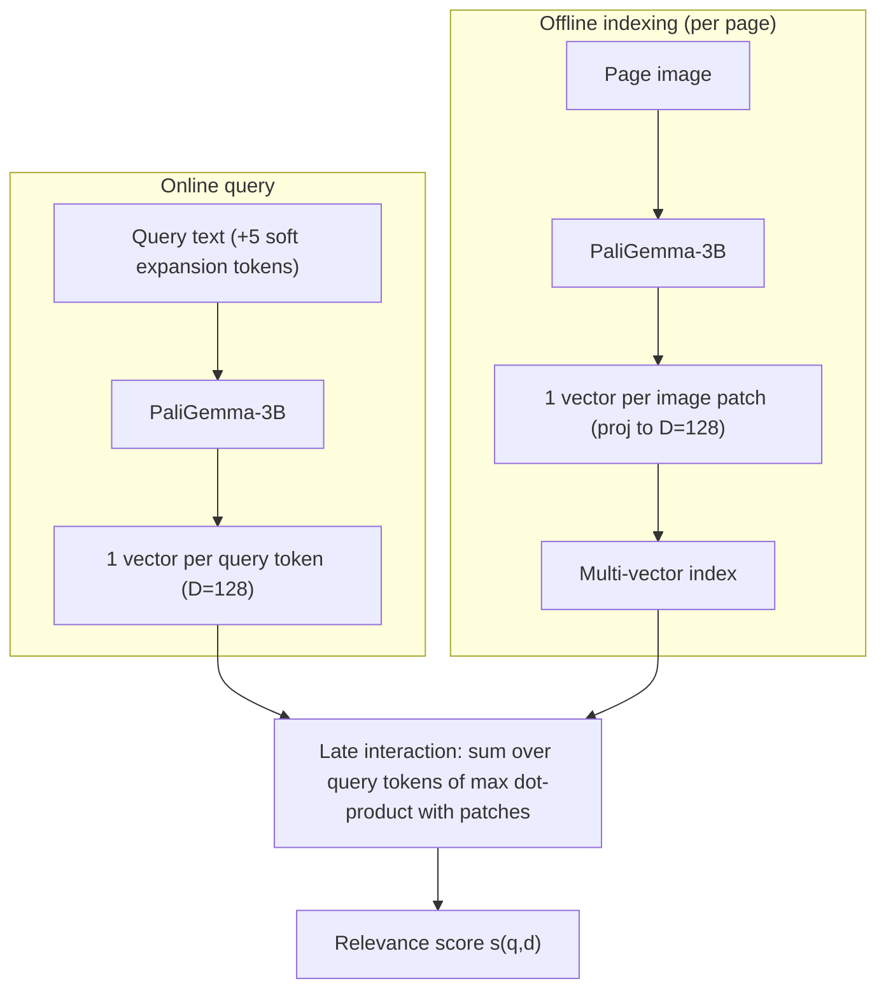

This is a technical dissection of **ColPali** — Faysse et al.'s vision-language document retriever. The focus is the engineering system: why the real bottleneck in document retrieval is the data-ingestion pipeline rather than the embedding model, how ColPali deletes that pipeline by embedding the page image directly, the late-interaction matching that makes multi-vector image embeddings work, the architecture and training recipe, and the storage and latency trade-offs that come with the design.

We are not reproducing the full ViDoRe benchmark. The nDCG tables matter here only as evidence that embedding page images beats the OCR-and-chunk pipeline it replaces.

**Attribution convention.** Because this article mixes what the paper says with my own reasoning, every non-obvious technical claim is tagged:

- **[Paper]** — stated explicitly in ColPali (arXiv:2407.01449).
- **[Derived]** — a mathematical or logical consequence of the paper's setup, worked out here.
- **[Interpretation]** — my explanation or engineering reasoning, written for the reader; not a claim the paper makes.

---

## Why This Paper Matters

The insight that reframes the whole problem: in practical retrieval, the performance bottleneck is **not the embedding model — it is the ingestion pipeline that runs before it**. **[Paper]** The paper finds that optimizing the ingestion pipeline yields far more benefit on visually rich documents than optimizing the text embedding model, and that BM25 and a SOTA neural encoder (BGE-M3) land within a point of each other — proof the embedding model is not where the signal is being lost. **[Paper]**

That pipeline — OCR, layout detection, table reconstruction, chunking, and sometimes captioning — is "lengthy and brittle," and captioning approaches can take dozens of seconds per page. **[Paper]** ColPali's move is to **delete the pipeline**: feed the page image straight into a vision-language model and index the output embeddings, capturing text, layout, figures, and tables in one forward pass. **[Interpretation]** The result outperforms the pipeline-based systems while being simpler, faster to index, and end-to-end trainable. **[Paper]**

## The Baseline Problem: Retrieval Bottlenecked Before Embedding

The paper sets three industrial requirements a retriever must satisfy: **(R1)** strong retrieval quality, **(R2)** fast online querying, **(R3)** high-throughput offline indexing. **[Paper]** Standard systems split into an offline indexing phase and an online querying phase; the online side is already fast (~22 ms/query), so the pain is R3. **[Paper]**

Indexing a PDF the standard way is a chain of fragile stages: **[Paper]**

```
PDF → OCR / parser (extract words)
    → layout detection (titles, paragraphs, tables, figures)
    → table reconstruction
    → chunking (group coherent passages)
    → [optional] captioning of visual elements via a VLM
    → text embedding
```

Each stage is a model or heuristic that can fail, and each adds latency. **[Interpretation]** The empirically damning finding: retrieval quality moves far more when you improve this pipeline (add OCR-on-figures, add captioning) than when you swap the embedding model — the visual information is being lost *before* embedding, no matter how good the encoder is. **[Paper]**

## The Core Idea: Retrieval in Vision Space

Instead of converting a page to text and embedding the text, embed the **image of the page**. **[Paper]** A vision-language model already understands text, layout, tables, and figures jointly, so its output embeddings carry the visual cues the OCR pipeline throws away. **[Interpretation]** Indexing collapses to a single forward pass over the page image — no OCR, no layout model, no chunking, no captioning. **[Paper]**

The one complication this creates: a page image is naturally *many* patch embeddings, not one vector. Reconciling that with fast retrieval is what late interaction is for. **[Interpretation]**

## Late Interaction: Matching Many Vectors to Many Vectors

ColPali borrows the **late-interaction** paradigm from ColBERT. **[Paper]** Rather than pool a document into a single vector (bi-encoder) or jointly attend query and document at runtime (cross-encoder, which needs $|D|$ online passes), late interaction keeps **one embedding per token/patch**, computed offline, and does a cheap per-token matching at query time. **[Paper]**

For a query with multi-vector representation $E_q \in \mathbb{R}^{N_q \times D}$ and a document $E_d \in \mathbb{R}^{N_d \times D}$, the late-interaction score is: **[Paper]**

$$
\text{LI}(q, d) = \sum_{i \in [1, N_q]} \max_{j \in [1, N_d]} \; E_q^{(i)} \cdot E_d^{(j)}
$$

Reading it piece by piece:

- **$E_q^{(i)} \cdot E_d^{(j)}$** — the dot product between the $i$-th query vector and the $j$-th document (patch) vector. **[Paper]**
- **$\max_{j}$** — for each query term, take its *best-matching* document patch. This is the "MaxSim": each query token finds the page region most relevant to it. **[Paper]**
- **$\sum_i$** — sum those best matches over all query terms to get the document score. **[Derived]**

The design captures fine-grained query-patch interaction (a cross-encoder strength) while keeping document embeddings **precomputed and indexed offline** (a bi-encoder strength). **[Paper]** Crucially, the whole operator is differentiable, so the encoder can be trained end-to-end for it. **[Paper]**



## The Architecture: PaliGemma + a Projection Head

ColPali extends **PaliGemma-3B** — a VLM that projects SigLIP-So400m/14 patch embeddings into Gemma-2B's text vector space. **[Paper]** It is chosen for its small size, its many resolution/task checkpoints, and one specific property: its text model uses **full-block attention over the prefix** (the instruction text and image tokens), which suits building rich patch representations. **[Paper]**

The only architectural addition is a **projection layer** mapping each output token embedding — text *or* image — down to **$D = 128$** dimensions (the ColBERT dimension), keeping the multi-vector representation lightweight. **[Paper]** Because image patches are fed *through the language model*, they land in the same latent space as query text, which is exactly what makes cross-modal late interaction work. **[Paper]**

The paper builds this up as an ablation, and each rung earns its place: **[Paper]**

| Model | What it adds | ViDoRe avg (nDCG@5) |
|---|---|---|
| SigLIP (vanilla) | contrastive VLM, single vector | 51.4 |
| BiSigLIP | fine-tune SigLIP text side on retrieval data | 58.6 |
| BiPali | feed patches through Gemma LLM, mean-pool to one vector | 58.8 |
| **ColPali** | **multi-vector + late interaction** | **81.3** |

The jump from BiPali (58.8) to ColPali (81.3) is the paper's central result: going from a single pooled vector to **multi-vector late interaction** is a step-change, not an increment. **[Paper]** Notably BiPali barely beats BiSigLIP on English yet improves French — passing patches through the LLM adds multilingual text understanding even though training is English-only. **[Paper]**

## Training Recipe

The training is deliberately cheap, which is part of the engineering point. **[Interpretation]**

- **Data:** 118,695 query-page pairs — 63% from open academic datasets, 37% synthetic (web-crawled PDF pages with Claude-3-Sonnet-generated pseudo-questions). **[Paper]** Fully **English by design**, so non-English performance is genuine zero-shot generalization. **[Paper]** Multi-page documents are checked to not overlap between train and the ViDoRe benchmark to prevent contamination. **[Paper]**
- **Objective:** in-batch contrastive loss — softmaxed cross-entropy of each positive late-interaction score $s_k^+ = \text{LI}(q_k, d_k)$ against the hardest in-batch negative $s_k^- = \max_{l\neq k}\text{LI}(q_k, d_l)$, reformulated via the numerically stable softplus: **[Paper]**

$$
\mathcal{L} = \frac{1}{b}\sum_{k=1}^{b} \log\!\big(1 + \exp(s_k^- - s_k^+)\big)
$$

- **Compute:** **1 epoch**, bfloat16, **LoRA** adapters ($\alpha = 32$, $r = 32$) on the LLM transformer layers plus the randomly-initialized projection layer, paged AdamW-8bit optimizer, 8 GPUs data-parallel, LR $5\times10^{-5}$, batch size 32. **[Paper]**
- **Query augmentation:** 5 `<unused>` tokens appended to every query as a soft, differentiable query-expansion / re-weighting mechanism. **[Paper]**

The training stack is itself a nice cross-reference: ColPali is adapted with [LoRA](/engineering/lora-low-rank-adaptation-of-large-language-models/) plus an 8-bit optimizer, so the whole retriever is fine-tuned on top of a frozen 3B VLM without paying full fine-tuning's memory cost — a concrete instance of why parameter-efficient adaptation matters in practice. **[Interpretation]** The contrastive fine-tune is **five orders of magnitude smaller** than SigLIP's original contrastive pretraining, yet suffices to convert PaliGemma into a strong retriever. **[Paper]**

## The Negative Results Are the Interesting Ones

The paper is unusually candid about what *didn't* work, and the failures explain the design. **[Interpretation]** **ColSigLIP** (late interaction directly on SigLIP patch embeddings) gives "abysmal" performance — because SigLIP's contrastive pretraining only ever optimizes a *pooled* representation, so individual patch embeddings were never trained to be meaningful. **[Paper]** A hybrid using SigLIP image vectors with PaliGemma text vectors is also badly inferior, revealing a **misalignment** between SigLIP and Gemma embedding spaces after PaliGemma training. **[Paper]** The lesson: late interaction only works when the encoder was trained such that *per-patch* (not just pooled) embeddings are aligned across modalities — which is precisely what passing patches through PaliGemma's LLM achieves. **[Interpretation]**

## Latency & Storage Economics

This is where the multi-vector design shows its costs and where the pipeline-deletion shows its wins. **[Interpretation]**

- **Online querying (R2):** ColPali encodes a query in ~30 ms (vs ~22 ms for BGE-M3), and late interaction adds only ~1 ms per 1000 corpus pages — negligible, and scalable to millions of documents with optimized late-interaction engines. **[Paper]**
- **Offline indexing (R3):** the decisive win. Skipping OCR/layout/chunking makes indexing far faster despite the larger model, and because a page is one forward pass, **VRAM depends only on the fixed patch count** — enabling clean batching and use of Flash Attention. **[Paper]**
- **Storage:** the multi-vector cost. Each page stores one 128-dim vector per patch — **~257.5 KB/page** — far heavier than a single-vector bi-encoder. **[Paper]** This is the real trade-off of late interaction: retrieval quality bought with index size. **[Interpretation]**

## Token Pooling: Buying Back the Storage

The mitigation for the storage cost exploits redundancy: many image patches (e.g. white background) carry duplicate information. **[Paper]** Hierarchical mean **token pooling** merges redundant patches, and at a pool factor of 3 it cuts the vector count by **66.7%** while retaining **97.8%** of retrieval quality — and it is CRUD-compliant (documents can be added/deleted). **[Paper]** The one caveat: the most text-dense dataset (Shift) degrades more, because information-dense pages have fewer redundant patches to pool away. **[Paper]**

## Engineering Trade-offs

- **Index size vs. quality.** Multi-vector storage is ~257.5 KB/page before compression — the price of late interaction's fine-grained matching. Token pooling and ColBERT-style compression claw most of it back. **[Paper]**
- **Bigger encoder, smaller pipeline.** ColPali's model is larger than a text bi-encoder, but deleting the OCR/layout/chunking stages nets a large *indexing* speedup — the cost moves from many brittle CPU stages to one GPU forward pass. **[Interpretation]**
- **Alignment is a prerequisite, not an afterthought.** Late interaction fails outright (ColSigLIP) unless per-patch embeddings are cross-modally aligned — so the encoder choice is load-bearing. **[Paper]**
- **Query encoding is now a model call.** Online query latency rises modestly (22→30 ms) because a 3B VLM encodes the query rather than a small text encoder. **[Paper]**

## Did It Work?

On ViDoRe (nDCG@5), ColPali reaches **81.3 average**, versus ~65-67 for the strongest Unstructured+OCR / +Captioning pipelines and 51.4 for vanilla SigLIP. **[Paper]** The margin is widest exactly where the visual pipeline suffers most — InfographicVQA, ArxivQA (figures), and TabFQuAD (tables) — but ColPali also wins on text-centric documents across every domain and both languages tested. **[Paper]** It does this while indexing faster and remaining end-to-end trainable. **[Paper]**

## Engineering Takeaway

ColPali is a case of solving the right bottleneck:

- The retrieval problem was diagnosed as an **ingestion-pipeline** problem, not an embedding-model problem — the visual signal was being destroyed by OCR/chunking before any encoder saw it. **[Paper]**
- The fix is to **embed the page image directly** through a VLM, capturing text and layout in one pass and deleting the fragile pipeline. **[Paper]**
- Many patch vectors are reconciled with fast retrieval by **ColBERT late interaction** — offline per-patch embeddings, a sum-of-max-dot-products at query time, fully differentiable. **[Paper]**
- The costs are honest: a heavier index (~257.5 KB/page) and a slightly slower query encode, both mitigable via **token pooling** and compression. **[Paper]**

The lasting idea is the reframing — **"retrieval in vision space."** **[Interpretation]** For documents whose meaning lives in their layout, figures, and tables, the most faithful representation is the page as an image, and the engineering task is making that representation cheap enough to index and fast enough to search. Late interaction is what makes that trade-off land.
