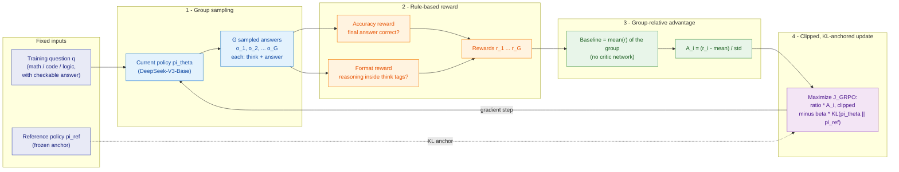
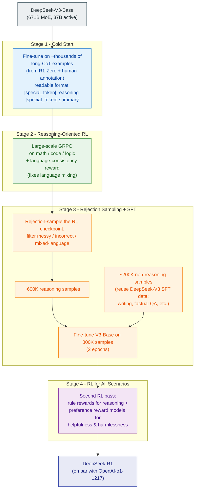
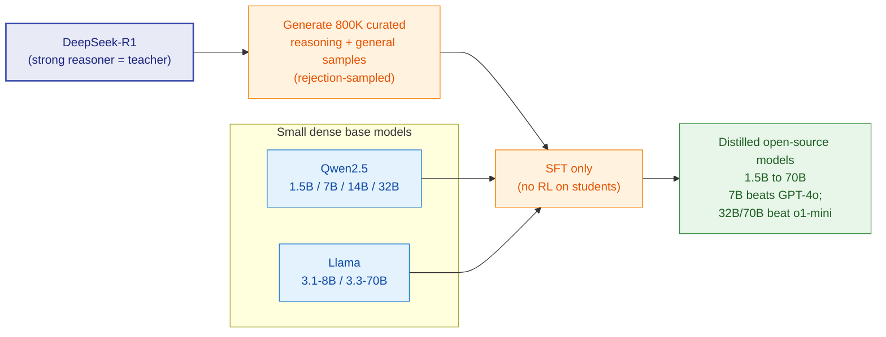

This is a technical dissection of **DeepSeek-R1** — a reasoning model that matches **OpenAI-o1-1217** on math, code, and reasoning benchmarks, and whose real contribution is a claim about *training*, not architecture: **reasoning can be incentivized in a large language model by reinforcement learning alone, without any supervised fine-tuning as a first step.**

There are really two models in the paper, and keeping them separate is the whole key to reading it:

1. **DeepSeek-R1-Zero** — pure RL applied directly to a base model. No supervised examples of reasoning are ever shown to it. It is the *scientific* result: proof that reasoning behaviour can emerge from reward alone.
2. **DeepSeek-R1** — the *product*. It wraps that RL in a multi-stage pipeline (a little cold-start data, then RL, then supervised refinement, then more RL) to fix R1-Zero's rough edges and push quality to the frontier.

Both are built on **[DeepSeek-V3-Base](/engineering/deepseek-v3-auxiliary-loss-free-moe-mtp-fp8-training/)** (the 671B / 37B-activated MoE) and driven by **[GRPO](/engineering/grpo-deepseekmath-group-relative-policy-optimization/)**, the critic-free RL algorithm from DeepSeekMath. This article does **not** re-derive GRPO's full PPO lineage — it links to that dissection and spends its depth on what R1 does *with* GRPO and why the pipeline is shaped the way it is.

**Attribution convention.** Because this article mixes what the paper reports with my own reasoning, every non-obvious technical claim is tagged:

- **[Paper]** — stated explicitly in DeepSeek-R1 (arXiv:2501.12948).
- **[Derived]** — a mathematical or logical consequence of the paper's equations, worked out here.
- **[Interpretation]** — my explanation or engineering reasoning, written for the reader; not a claim the paper makes.

---

## Reasoning / Why I Studied This Paper

I came to DeepSeek-R1 with one question: **is reasoning a thing you have to teach a model, or a thing you can let it discover?** **[Interpretation]**

Every prior recipe for "make the model reason" leans on *supervised* reasoning data. Chain-of-Thought prompting shows the model worked examples; instruction tuning and RLHF fine-tune on human-written demonstrations first, then align. The unstated assumption is that the model needs to be *shown* what good reasoning looks like before it can produce it. **[Interpretation]**

R1-Zero is interesting precisely because it removes that assumption. It takes a base model, gives it nothing but a reward that says "was the final answer correct, and did you put your thinking in the right place," and lets RL do the rest. If reasoning emerges from that — longer chains, self-checking, backtracking — then reasoning was *latent* in the base model all along, and the job of training is not to teach it but to **incentivize** it. **[Interpretation]**

That reframes the whole problem. The mental model I settled on:

- **The base model already contains the capability; RL surfaces it.** The reward doesn't inject reasoning steps — it just makes the model's own good reasoning trajectories more likely and its bad ones less likely.
- **Test-time compute is something the model *chooses* to spend.** Nobody tells R1-Zero to write longer answers. It learns, on its own, that thinking longer earns more reward — so response length grows over training. Inference-time scaling becomes an *emergent* behaviour, not a hand-coded decoding trick. **[Interpretation]**
- **The pipeline (R1) exists only to make the emergent thing usable.** R1-Zero works but is ugly — mixed languages, unreadable chains. Everything R1 adds (cold-start data, a language reward, supervised refinement) is engineering to keep the raw RL capability while making the output fit for humans. **[Interpretation]**

That framing — *R1-Zero is the discovery, R1 is the productization* — is the thread this article follows.

## I. The Problem: Can Reasoning Be Learned Without Being Taught?

Post-training — the stage after pretraining — is where reasoning accuracy, alignment with human values, and adaptation to user preferences are won, and it is cheap relative to pretraining. **[Paper]** OpenAI's o1 series was the first to push reasoning by **inference-time scaling**: increasing the length of the chain-of-thought reasoning process so the model spends more compute *while answering*, rather than relying solely on compute spent during training. **[Paper]** Longer, more deliberate reasoning reliably improves math, coding, and scientific reasoning. **[Paper]**

The open question the paper names: **how do you get that reasoning capability, and can you get it *without* supervised data?** **[Paper]** Prior open efforts to match o1-style reasoning leaned on process reward models, search (MCTS), and supervised reasoning traces. **[Paper]** DeepSeek's bet is more radical:

> The goal is to explore the potential of LLMs to develop reasoning capabilities **without any supervised data**, focusing on their **self-evolution through a pure RL process**. **[Paper]**

Concretely: take **DeepSeek-V3-Base** and apply **GRPO** directly, with no SFT warm-up. **[Paper]** That is DeepSeek-R1-Zero. The payoff, if it works, is enormous — it means you don't need to *collect* reasoning demonstrations (expensive, slow, human-bottlenecked); you only need a way to *score* answers.

*Figure 1 (from the paper). The headline I read here is the pairing on the reasoning bars: on **AIME 2024** (79.8) and **MATH-500** (97.3), DeepSeek-R1 (hatched blue) sits level with or just above **OpenAI-o1-1217** (solid grey), and on **Codeforces** percentile (96.3) it is in the same band. The gap from **DeepSeek-V3** (far-right light bar in each group) to R1 is the size of what RL-for-reasoning buys on top of the same base model — e.g. AIME jumps from 39.2 (V3) to 79.8 (R1). The one place R1 does not dominate is **SWE-bench Verified**, and the paper is honest that engineering tasks were under-served by RL.* **[Paper]**

## II. DeepSeek-R1-Zero: Pure RL on the Base Model

R1-Zero is the minimal experiment: base model + RL, nothing else. To run RL you need three things — a way to *sample* answers, a way to *score* them, and an *update rule*. The scoring is rule-based (Section IV); the update rule is GRPO (Section III). The only other ingredient is the prompt template that shapes the output.

The template is deliberately thin — it constrains *format*, not *content*: **[Paper]**

> A conversation between User and Assistant. The user asks a question, and the Assistant solves it. The assistant first thinks about the reasoning process in the mind and then provides the user with the answer. The reasoning process and answer are enclosed within `<think> </think>` and `<answer> </answer>` tags, respectively, i.e., `<think> reasoning process here </think> <answer> answer here </answer>`. User: *prompt*. Assistant:

The paper is explicit about *why* the template is this minimal: it constrains the model only to put its reasoning between the tags, and **deliberately avoids any content-specific bias** — no "reflect on your answer," no "use this strategy" — so that the model's reasoning strategy is whatever RL discovers, not what a human seeded. **[Paper]** That restraint is the point: if you scripted the reasoning, you couldn't claim it *emerged*. **[Interpretation]**

## III. GRPO: Why Reasoning RL Drops the Critic

The reason large-scale RL-for-reasoning is even affordable is the choice of algorithm. Standard policy-gradient RL (PPO) runs **two** large networks at once: the **policy** (generates answers) and a **critic/value model** (estimates how good each partial answer is), and the critic is typically the same size as the policy. **[Interpretation]** For a 671B policy, a comparably-sized critic roughly doubles the memory and compute of every RL step. **[Interpretation]**

**GRPO deletes the critic.** **[Paper]** Its insight: you don't need a learned value function to know whether an answer is above or below average — you can just *sample a group of answers to the same question and compare them to each other.* **[Interpretation]** The group becomes its own baseline.

The mechanics, in the paper's terms: **[Paper]**

- **Group sampling.** For a question $q$, sample a group of $G$ outputs $\{o_1, \dots, o_G\}$ from the current (old) policy.
- **Score them.** Each output gets a reward $r_i$ from the rule-based reward.
- **Group-relative advantage.** Convert rewards into advantages by normalizing *within the group*:

$$
A_i = \frac{r_i - \mathrm{mean}(\{r_1, r_2, \dots, r_G\})}{\mathrm{std}(\{r_1, r_2, \dots, r_G\})}
$$

Here $A_i$ is the advantage of the $i$-th answer, $r_i$ its reward, and the mean/std are taken over the $G$ rewards in the group. **[Paper]** The reading is simple: **an answer that beats the group average gets a positive advantage (make it more likely); one that trails the average gets a negative advantage (make it less likely).** **[Interpretation]** Subtracting the mean is the variance-reduction the critic used to provide; dividing by the std just puts every question's advantages on a common scale so easy and hard questions contribute comparably. **[Derived]**

Those advantages feed the GRPO objective the policy maximizes: **[Paper]**

$$
J_{GRPO}(\theta) = \mathbb{E}_{q \sim P(Q),\, \{o_i\}_{i=1}^{G} \sim \pi_{\theta_{old}}(O \mid q)} \left[ \frac{1}{G} \sum_{i=1}^{G} \left( \min\left( \frac{\pi_\theta(o_i \mid q)}{\pi_{\theta_{old}}(o_i \mid q)} A_i,\; \mathrm{clip}\!\left( \frac{\pi_\theta(o_i \mid q)}{\pi_{\theta_{old}}(o_i \mid q)}, 1-\varepsilon, 1+\varepsilon \right) A_i \right) - \beta\, D_{KL}(\pi_\theta \,\Vert\, \pi_{ref}) \right) \right]
$$

Term by term, this is "make good answers more likely" with two safety rails: **[Interpretation]**

- **The policy ratio** $\dfrac{\pi_\theta(o_i \mid q)}{\pi_{\theta_{old}}(o_i \mid q)}$ measures how much the new policy has changed the probability of output $o_i$ relative to the policy that generated it. Multiplied by $A_i$, it means: push up the probability of above-average answers, push down below-average ones. **[Paper]**
- **Clipping (safety rail #1)** bounds that ratio to $[1-\varepsilon,\, 1+\varepsilon]$. It is a *speed limit* on how far a single update can move the policy, so one batch can't destabilize the model. **[Interpretation]**
- **The KL penalty (safety rail #2)** $\beta\, D_{KL}(\pi_\theta \Vert \pi_{ref})$ anchors the policy to a reference (the pre-RL model), so it improves at the reward without drifting into gibberish. **[Interpretation]** In R1 this KL uses the unbiased estimator

$$
D_{KL}(\pi_\theta \,\Vert\, \pi_{ref}) = \frac{\pi_{ref}(o_i \mid q)}{\pi_\theta(o_i \mid q)} - \log \frac{\pi_{ref}(o_i \mid q)}{\pi_\theta(o_i \mid q)} - 1
$$

which is always non-negative and equals zero exactly when the two policies agree. **[Paper]**

The whole R1-Zero loop is that cycle repeated: sample a group, score by rule, compute group-relative advantages, take one clipped, KL-anchored gradient step, repeat.

*The R1-Zero training loop. The thing to notice is what is **absent**: there is no critic/value network anywhere. The baseline that PPO would learn is replaced by the group mean (green), computed fresh from $G$ sampled answers each step. That single substitution is why RL at this scale is affordable. **[Interpretation]** The reward (orange) is two rules, not a neural model — the subject of the next section.*

## IV. Rule-Based Rewards: The Signal That Avoids Reward Hacking

In RL the reward is the source of the training signal — it decides the direction the policy moves. **[Paper]** R1-Zero uses a **rule-based reward system** with two components: **[Paper]**

- **Accuracy reward** — is the final answer correct? For math, the model must give the answer in a specified format (e.g. inside a box) so a rule can check it; for code, a compiler/test-suite verifies against predefined cases. **[Paper]**
- **Format reward** — did the model put its reasoning between `<think>` and `</think>`? This enforces the structure without judging the content of the thinking. **[Paper]**

The design decision I find most important is what they *refused* to use: **[Interpretation]**

> We do **not** apply the outcome or process neural reward model in developing DeepSeek-R1-Zero, because we find that the neural reward model may suffer from **reward hacking** in the large-scale reinforcement learning process, and retraining the reward model needs additional training resources and complicates the whole training pipeline. **[Paper]**

This is the crux. A *learned* reward model is itself a network the policy can exploit — over enough RL steps the policy finds inputs that score high with the reward model but are actually bad (reward hacking). **[Interpretation]** A *rule* — "does this equation evaluate correctly," "do these unit tests pass" — cannot be gamed the same way, because it is grounded in ground truth rather than a fallible approximation of it. **[Interpretation]** The cost is that rule-based rewards only work where correctness is *checkable* — which is exactly why R1-Zero's RL focuses on math, code, and logic. **[Interpretation]**

## V. Self-Evolution and the "Aha Moment"

With that setup, the striking result is what R1-Zero does *on its own* over training. Two curves tell the story.

*Figure 2 (from the paper). This is the self-evolution curve. With no supervised reasoning data at all, R1-Zero's AIME 2024 pass@1 (blue) climbs from **15.6% to 71.0%** over training, reaching OpenAI-o1-0912's level. **[Paper]** The red **cons@16** curve — the majority-vote answer over 16 samples — climbs higher still, to **86.7%**, above o1-0912's cons@64 line. **[Paper]** The reading: RL doesn't just make one answer better, it makes the *distribution* of answers better, so aggregating several samples (majority voting) squeezes out even more accuracy. **[Interpretation]** The gap between the two curves is the room that test-time aggregation buys on top of the trained policy. **[Interpretation]***

*Figure 3 (from the paper). Nobody told the model to write longer answers — the reward only cares about correctness and format. Yet average response length climbs from a few hundred tokens toward ~10,000 over training. **[Paper]** This is **inference-time scaling emerging from RL**: the model discovers on its own that spending more tokens — exploring, re-checking, backtracking — earns more reward, so it learns to think longer. **[Interpretation]** Test-time compute here is not a decoding knob a human turns; it is a behaviour the policy grows into. **[Interpretation]***

Inside that lengthening, qualitatively new behaviours appear without being programmed: **reflection** (the model revisits and re-evaluates earlier steps) and **exploration of alternative approaches**. **[Paper]** The paper's vivid example is the **"aha moment"** — in an intermediate checkpoint, R1-Zero, mid-solution, writes something like *"Wait, wait. Wait. That's an aha moment I can flag here. Let's reevaluate this step-by-step..."* and restarts its approach. **[Paper]** As the paper frames it, the model **learns to allocate more thinking time to a problem by reevaluating its initial approach.** **[Paper]** That self-correction was never demonstrated to it; it fell out of maximizing a correctness reward. **[Interpretation]**

**But R1-Zero has two real flaws**, and naming them motivates everything that follows: **[Paper]**

- **Poor readability** — the raw reasoning is hard for a human to follow (no consistent structure, no summary).
- **Language mixing** — the chain-of-thought mixes languages, especially when prompts span multiple languages.

R1-Zero proves the *capability* exists. It is not yet a *usable product*. That is the job of DeepSeek-R1.

## VI. From R1-Zero to R1: The Multi-Stage Pipeline

DeepSeek-R1 keeps R1-Zero's RL engine but surrounds it with stages that (a) give the RL a readable starting point and (b) fold in general capabilities (writing, factual QA, safety) that pure reasoning RL ignores. **[Interpretation]** The pipeline, as I map it from the paper and reconstruct from my own notes:

*The four-stage DeepSeek-R1 pipeline. Read top to bottom, each stage patches a specific weakness of the one before it. **[Interpretation]** This diagram is my reconstruction of the flow I sketched while reading, aligned to the paper's Section 2.3.*

**Stage 1 — Cold start.** Rather than starting RL from the raw base model (which produces the unreadable chains of R1-Zero), fine-tune V3-Base on a small set (thousands) of high-quality long chain-of-thought examples first. **[Paper]** These are gathered from R1-Zero outputs plus human annotation/refinement, and — critically — reformatted into a *readable* pattern: **[Paper]**

> We define the output format as `|special_token|<reasoning_process>|special_token|
`, where the reasoning process is the CoT for the query, and the summary is used to summarize the reasoning results. **[Paper]**

This cold-start data gives RL a well-behaved starting point — readable, with a summary at the end — so the subsequent RL improves reasoning *within* a human-friendly structure rather than reinventing formatting from scratch. **[Interpretation]**

**Stage 2 — Reasoning-oriented RL.** The same large-scale GRPO as R1-Zero, on well-defined tasks (math, code, logic with clear solutions). **[Paper]** The new ingredient fixes the language-mixing flaw: a **language-consistency reward**, computed as *the proportion of target-language words in the CoT.* **[Paper]** Ablations show this slightly *lowers* raw benchmark accuracy — but the paper keeps it anyway because it aligns with human preference for readable, single-language reasoning. **[Paper]** That trade — a little accuracy for a lot of usability — is exactly the kind of product decision R1-Zero didn't have to make. **[Interpretation]**

**Stage 3 — Rejection sampling + SFT.** When Stage-2 RL converges, use that checkpoint to *generate* a new, large supervised dataset. **[Paper]** For reasoning, **rejection-sample**: prompt the model, keep correct/clean trajectories, filter out messy chains, mixed-language ones, and wrong answers — collecting **~600K reasoning samples**. **[Paper]** Correctness is sometimes judged by a **generative reward model** (feeding ground-truth and prediction into DeepSeek-V3 to judge). **[Paper]** Then add **~200K non-reasoning samples** — writing, factual QA, self-cognition, translation — largely reusing DeepSeek-V3's existing SFT pipeline. **[Paper]** Fine-tune V3-Base on the combined **~800K samples for two epochs.** **[Paper]** The purpose of this stage: re-broaden the model beyond pure reasoning so it's good at general tasks too, using RL-quality reasoning data it just produced. **[Interpretation]**

**Stage 4 — RL for all scenarios.** A final RL pass to align with human preferences across *all* use cases — reasoning *and* general. **[Paper]** It combines signals: **rule-based rewards** for reasoning tasks (as before), and **preference reward models** for helpfulness and harmlessness on general prompts. **[Paper]** The paper notes helpfulness is evaluated on the final *summary* (not the whole chain), while harmlessness is checked over the *entire* response. **[Paper]** The output is **DeepSeek-R1**, on par with OpenAI-o1-1217. **[Paper]**

## VII. Distillation: Teaching Small Models to Reason

Having a frontier reasoner, DeepSeek uses it as a **teacher**. The same **800K samples** curated in Stage 3 are used to fine-tune smaller *dense* base models — Qwen2.5 (1.5B, 7B, 14B, 32B) and Llama (3.1-8B, 3.3-70B). **[Paper]** The deliberate choice: **distillation is SFT only — no RL is applied to the students** — specifically to *isolate* and demonstrate the effectiveness of distillation. **[Paper]**

*Distillation flow. The teacher's reasoning is transferred purely through supervised examples — the students never run RL. The reason that matters is the comparison in Section VIII: it lets the paper ask, cleanly, "is it better to distil a big reasoner into a small model, or to run RL directly on the small model?"* **[Interpretation]**

## VIII. Evaluation

I'll read the important experiments through six questions each: **what** was tested, **why**, the **baseline**, **what changed**, the **result**, and **why it matters**.

### R1-Zero vs OpenAI o1 (Table 2)

- **What / why:** does *pure RL* (no SFT) actually produce competitive reasoning? This is the core scientific claim. **[Paper]**
- **Baseline:** OpenAI-o1-mini and o1-0912 on AIME, MATH-500, GPQA Diamond, LiveCodeBench, CodeForces. **[Paper]**
- **What changed:** R1-Zero is trained by GRPO on V3-Base with rule rewards only. **[Paper]**
- **Result:** AIME 2024 pass@1 **71.0** (cons@64 **86.7**), MATH-500 **95.9** — matching o1-0912. **[Paper]**
- **Why it matters:** it establishes that reasoning is *incentivizable* by RL alone. The capability does not require supervised reasoning traces to exist — only to be rewarded. **[Interpretation]**

### DeepSeek-R1 vs frontier models (Table 4)

- **What / why:** does the full pipeline reach the frontier across reasoning, knowledge, and general tasks? **[Paper]**
- **Baseline:** Claude-3.5-Sonnet, GPT-4o, DeepSeek-V3, OpenAI o1-mini, OpenAI-o1-1217. **[Paper]**
- **What changed:** the four-stage cold-start → RL → SFT → RL pipeline. **[Paper]**
- **Result:** MMLU **90.8**, MMLU-Pro **84.0**, GPQA Diamond **71.5**, AIME 2024 **79.8**, MATH-500 **97.3**, CNMO 2024 **78.8**, LiveCodeBench **65.9**, Codeforces rating **2029** (96.3 percentile). **[Paper]** On par with o1-1217 on reasoning; well above DeepSeek-V3 on knowledge (MMLU 90.8 vs 88.5, GPQA 71.5 vs 59.1). **[Paper]**
- **Why it matters:** the emergent capability from Stage-2 RL survives being folded back into a general-purpose model — R1 is a frontier reasoner *and* a usable general assistant, not one at the expense of the other. **[Interpretation]** The size of the V3→R1 gap on reasoning is the clearest measure of what the RL pipeline adds on a fixed base. **[Interpretation]**

### Distilled models vs comparable models (Table 5)

- **What / why:** does R1's reasoning transfer into small dense models by SFT alone? **[Paper]**
- **Baseline:** GPT-4o-0513, Claude-3.5-Sonnet, o1-mini, QwQ-32B-Preview. **[Paper]**
- **What changed:** Qwen/Llama base models fine-tuned on R1's 800K samples, no RL. **[Paper]**
- **Result:** DeepSeek-R1-Distill-Qwen-**7B** hits AIME **55.5** / MATH-500 **92.8** — beating GPT-4o (9.3 / 74.6) and comparable-scale models; Distill-Qwen-**32B** reaches AIME 72.6 / MATH-500 94.3, and the **70B** Llama distill lands MATH-500 94.5 — both surpassing o1-mini on most benchmarks. **[Paper]**
- **Why it matters:** reasoning is *transferable*. A 7B model can be made to out-reason a much larger general model, purely by imitating a strong reasoner's traces — no RL infrastructure needed on the student side. **[Interpretation]**

### Distillation vs RL on a small model (Table 6)

- **What / why:** the sharpest question — if you have a small model, should you distil from a big reasoner, or just run large-scale RL on the small model directly? **[Paper]**
- **Baseline:** QwQ-32B-Preview, and **DeepSeek-R1-Zero-Qwen-32B** (Qwen-32B-Base trained with large-scale RL, 10K+ steps). **[Paper]**
- **What changed:** compared against **DeepSeek-R1-Distill-Qwen-32B** (same base, distilled from R1 instead of RL'd). **[Paper]**
- **Result:** RL-on-32B (R1-Zero-Qwen-32B) reaches roughly QwQ-32B-Preview level (AIME 47.0, MATH-500 91.6), but the **distilled** 32B is far better (AIME **72.6**, MATH-500 **94.3**). **[Paper]**
- **Why it matters:** two conclusions the paper draws. **(1)** Distilling a more powerful model into a smaller one yields excellent results, whereas the small model relying on the large-scale RL described here needs enormous compute and *may not even reach* the distilled performance. **[Paper]** **(2)** But distillation has a ceiling: to advance *beyond* the teacher — toward the frontier — you still need a more powerful base model and larger-scale RL. **[Paper]** Distillation propagates intelligence cheaply; it doesn't create new intelligence. **[Interpretation]**

## IX. What Didn't Work: PRM and MCTS

A rare and valuable part of the paper is its honesty about failed directions. Both are approaches other o1-replication efforts leaned on, and DeepSeek reports they did *not* pay off at scale. **[Paper]**

**Process Reward Model (PRM)** — reward each *intermediate* reasoning step, not just the final answer. It failed for three reasons: **(1)** it's hard to define a fine-grained, consistent "step" in general reasoning; **(2)** it's hard to judge whether an intermediate step is correct — automated (model-based) annotation is noisy and manual annotation doesn't scale; and **(3)** a model-based PRM invites **reward hacking**, and retraining it adds resources and pipeline complexity. **[Paper]** PRM is useful for *reranking* top-N responses or guided search, but its overhead outweighed the gains in large-scale RL. **[Paper]**

**Monte Carlo Tree Search (MCTS)** — inspired by AlphaGo/AlphaZero, break answering into a search over partial-reasoning-state nodes guided by a value model. It failed because **(1)** token generation has a search space *exponentially larger* than a board game — capping the branching to make it tractable pushes the model into local optima; and **(2)** training a fine-grained value model good enough to guide the search is intrinsically hard, so the iterative self-improvement that worked for AlphaGo didn't bootstrap here. **[Paper]**

The engineering lesson I take: both PRM and MCTS add a *learned or searched* structure on top of RL, and both reintroduce exactly the fragilities (reward hacking, value-model error, search blow-up) that R1-Zero's **simple, rule-based, critic-free** recipe was designed to avoid. **[Interpretation]** Simpler and grounded beat elaborate and approximate — at scale.

## X. Trade-offs and Limitations

The paper is direct about R1's edges: **[Paper]**

- **General capability gaps.** R1 still trails DeepSeek-V3 on some tasks — function calling, multi-turn conversation, complex role-playing, and structured JSON output. **[Paper]**
- **Language mixing.** R1 is optimized for Chinese and English; it may reason or respond in English even when the query is in another language. **[Paper]**
- **Prompt sensitivity.** R1 is sensitive to prompting; **few-shot prompting consistently degrades its performance.** The recommendation is zero-shot — describe the problem and output format directly. **[Paper]** This is a genuinely different operating regime from most LLMs, where few-shot usually helps. **[Interpretation]**
- **Software-engineering tasks.** Long evaluation times made large-scale RL inefficient on SWE tasks, so it wasn't applied extensively there; R1's gain over V3 on SWE benchmarks is limited. **[Paper]** The fix named for future work: rejection sampling on SWE data and/or asynchronous evaluations during RL. **[Paper]**

## XI. Engineer's Takeaway

DeepSeek-R1's core lesson is that **reasoning is a latent capability you incentivize, not a curriculum you teach** — provided you can *check* answers cheaply. **[Interpretation]**

- **The reward is the design.** R1-Zero works because its reward is rule-based and ungameable (correctness + format), which is what lets RL run at scale without a reward model hacking itself. Where you can verify answers programmatically, you can grow reasoning from reward alone. **[Interpretation]**
- **Drop the critic when the group can be its own baseline.** GRPO's group-relative advantage is the move that makes reasoning RL affordable — no second large network. If you're doing RL where you can sample several answers per prompt, you may not need a value model at all. **[Interpretation]**
- **Emergence needs productization.** The raw RL result (R1-Zero) is a discovery; the usable model (R1) is four stages of engineering around it — a readable cold start, a language reward, supervised re-broadening, and a final alignment RL. Capability and usability are separate problems. **[Interpretation]**
- **Distil to spread, RL to advance.** Distillation cheaply moves a strong reasoner's ability into small dense models (a 7B beating GPT-4o on math), but pushing the *frontier* still needs a powerful base and large-scale RL. Know which of the two problems you're solving. **[Interpretation]**

The broadest way to hold it: **DeepSeek-R1-Zero proves reasoning can be *incentivized* rather than *demonstrated*; DeepSeek-R1 proves that incentivized reasoning can be made readable, general, and safe; and distillation proves it can then be handed down to models small enough to run anywhere.** **[Interpretation]**

---

## Related Reading

- [GRPO (DeepSeekMath)](/engineering/grpo-deepseekmath-group-relative-policy-optimization/) — the critic-free RL algorithm that powers R1, derived in full from its PPO lineage; read this if the objective and advantage math above felt compressed.
- [DeepSeek-V3](/engineering/deepseek-v3-auxiliary-loss-free-moe-mtp-fp8-training/) — the 671B MoE base model that R1 and R1-Zero are trained on top of.
- [Chain-of-Thought Prompting](/engineering/chain-of-thought-prompting-elicits-reasoning/) — the origin of step-by-step reasoning that R1 internalizes into the model itself instead of eliciting by prompt.
- [Self-Consistency](/engineering/self-consistency-improves-chain-of-thought-reasoning/) — the majority-vote-over-samples idea behind R1-Zero's cons@16 / cons@64 numbers.
- [InstructGPT (RLHF)](/engineering/instructgpt-training-language-models-to-follow-instructions/) — the reward-model-based alignment paradigm R1 deliberately avoids for reasoning, and partially reintroduces only in its final all-scenarios stage.
