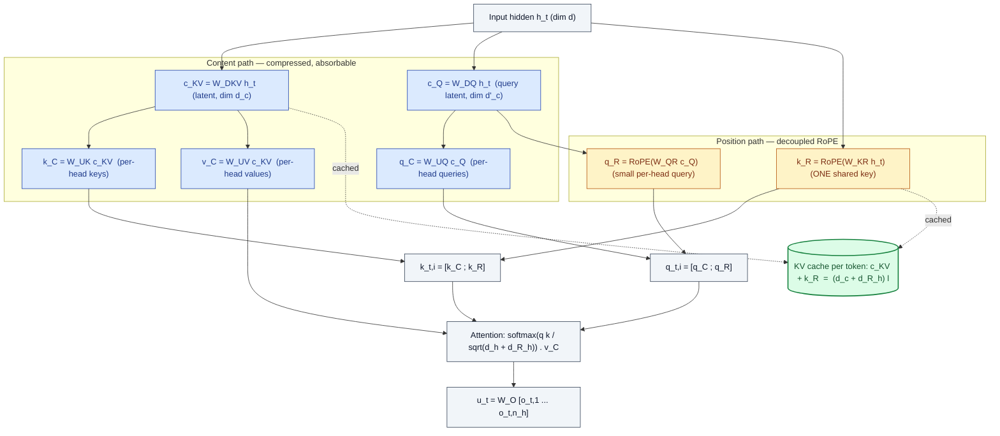
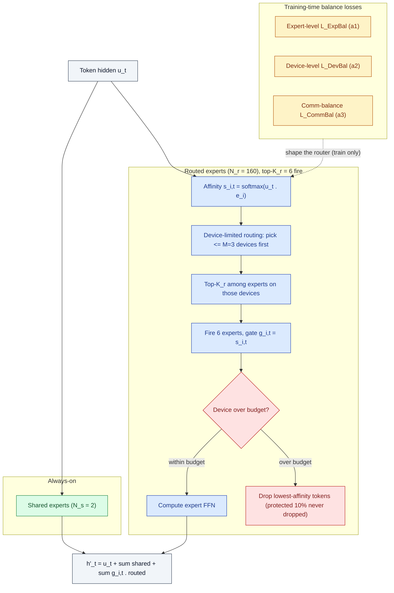
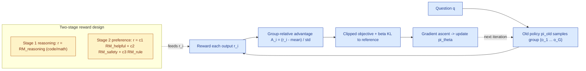

This is a technical dissection of **DeepSeek-V2** — a 236-billion-parameter Mixture-of-Experts (MoE) language model that **activates only 21B parameters per token** and serves a 128K context window. The focus is on the two engineering ideas that make that possible: **Multi-head Latent Attention (MLA)**, which attacks the memory cost of serving, and **DeepSeekMoE**, which attacks the compute cost of training. Everything else in the model — the pretraining recipe, the long-context extension, the alignment stack — exists to turn those two ideas into a model you can actually train cheaply and serve at high throughput.

I am not reproducing the paper's section order or its full benchmark suite. The numbers here appear only as **evidence for specific claims**: that compressing the KV cache is a real win rather than a lossy shortcut, and that fine-grained sparsity buys quality per FLOP.

**Attribution convention.** Because this article mixes what the paper reports with my own reasoning, every non-obvious technical claim is tagged:

- **[Paper]** — stated explicitly in DeepSeek-V2 (arXiv:2405.04434).
- **[Derived]** — a mathematical or logical consequence of the paper's equations, worked out here.
- **[Interpretation]** — my explanation or engineering reasoning, written for the reader; not a claim the paper makes.

---

## Reasoning / Why I Studied This Paper

I came to DeepSeek-V2 from a specific question: **how do you make a genuinely large model cheap to both train and serve at the same time?** **[Interpretation]** Those two costs usually pull in opposite directions. Making a model bigger buys quality, but a dense model pays for every parameter twice — once in training FLOPs and again in the memory and compute of every single inference step.

My mental model going in had two halves. **[Interpretation]**

- **Serving cost is dominated by the KV cache.** During generation, every new token must attend over the keys and values of all previous tokens, so those keys and values are cached in GPU memory. That cache grows with sequence length and with batch size, and on long-context workloads it — not the model weights — is what caps how many requests you can run at once. So the lever on *inference* cost is: **shrink the KV cache per token.**
- **Training cost is dominated by activated compute.** A dense model runs its full feed-forward stack for every token. So the lever on *training* cost is: **don't activate the whole network per token** — which is exactly what Mixture-of-Experts buys, *if* you can keep the routing cheap and balanced.

DeepSeek-V2 is interesting because it pulls **both** levers in one model. MLA is its answer to the KV-cache half. DeepSeekMoE is its answer to the activated-compute half. This article connects those two intuitions to what the model actually implements — the compression math, the absorption trick that makes it free at inference, the routing machinery, and the evidence that none of it costs quality.

## I. The Problem: A Large Model You Cannot Afford to Serve

The headline configuration is deliberately lopsided: **236B total parameters, 21B activated per token, 128K context.** **[Paper]** The gap between 236B and 21B is the whole point — it is a model with the *knowledge capacity* of a very large network but the *per-token compute* of a mid-sized one.

*Figure 1 (from the paper). Left — MMLU accuracy plotted against **activated** parameters. DeepSeek-V2 (the red star) sits at the top-left: it matches or beats models like LLaMA 3 70B and Mixtral 8x22B while activating far fewer parameters per token. Right — three efficiency bars against dense DeepSeek 67B: training cost drops 42.5%, KV cache per token drops 93.3%, and maximum generation throughput rises to 576% (i.e. **5.76x**). The left panel is the quality claim; the right panel is the cost claim. The paper's entire argument is that you can have both at once.* **[Paper]**

The reason a dense model can't do this is structural. **[Interpretation]** In a dense transformer, the two dominant costs both scale with the *full* parameter count:

- **Training** runs the full FFN for every token, so cost scales with total parameters.
- **Inference** stores a KV cache whose size scales with the number of attention heads, the head dimension, and the number of layers — and that cache is read back in full at every decoding step.

DeepSeek-V2 breaks each of those couplings with a separate mechanism. The rest of this article is those two mechanisms and the systems work that makes them hold up at 8.1-trillion-token scale.

## II. Attention and the KV-Cache Bottleneck

Start with standard **Multi-Head Attention (MHA)**, because MLA is defined as a modification of it. For a token with hidden state $\mathbf{h}_t \in \mathbb{R}^d$, MHA projects into queries, keys, and values, slices each into $n_h$ heads, and for each head $i$ computes a causal softmax-weighted sum of values: **[Paper]**

$$
\mathbf{o}_{t,i} = \sum_{j=1}^{t}\mathrm{Softmax}_j\!\left(\frac{\mathbf{q}_{t,i}^\top \mathbf{k}_{j,i}}{\sqrt{d_h}}\right)\mathbf{v}_{j,i},
\qquad
\mathbf{u}_t = W^{O}\,[\mathbf{o}_{t,1};\,\mathbf{o}_{t,2};\dots;\mathbf{o}_{t,n_h}]
$$

Here $\mathbf{q}_{t,i},\mathbf{k}_{t,i},\mathbf{v}_{t,i}\in\mathbb{R}^{d_h}$ are the per-head query, key, and value; $d_h$ is the per-head dimension; $n_h$ is the number of heads; and $W^{O}\in\mathbb{R}^{d\times d_h n_h}$ is the output projection. **[Paper]** The lower summation limit $j=1\dots t$ is the entire problem: to produce token $t$ you need the keys and values of **every earlier position**. **[Interpretation]**

So the system caches them. For MHA the KV cache holds **$2 n_h d_h l$ elements per token**, where $l$ is the number of layers (the $2$ is one copy for keys, one for values). **[Paper]** For a deep, wide model this is enormous, and it grows linearly with sequence length and batch size. That number — cache elements per token — is the quantity every attention variant is trying to shrink.

### The pre-MLA design space: MQA and GQA

Before MLA, the standard moves traded quality for a smaller cache by **sharing keys and values across heads**. **[Interpretation]**

*Figure 3 (from the paper). The three left panels are the classic trade-off. **MHA** gives every query head its own key/value pair — best quality, biggest cache. **MQA** collapses to a single shared key and value for all heads — smallest cache, weakest quality. **GQA** is the compromise: heads share keys/values within groups. The rightmost panel is MLA's different idea: the keys and values for every head are **reconstructed by projection from one small compressed latent vector**, which is the only thing cached. So MLA doesn't share keys and values across heads — it stores a compressed summary and expands it on demand.* **[Paper]**

The KV-cache-per-token cost of each is worth writing down side by side, because it makes MLA's claim precise: **[Paper]**

| Attention mechanism | KV cache per token (# elements) | Capability |
|---|---|---|
| Multi-Head Attention (MHA) | $2 n_h d_h l$ | Strong |
| Grouped-Query Attention (GQA) | $2 n_g d_h l$ | Moderate |
| Multi-Query Attention (MQA) | $2 d_h l$ | Weak |
| **MLA (this paper)** | $(d_c + d^R_h)\,l \approx \frac{9}{2} d_h l$ | **Stronger** |

*Table 1 (from the paper). $n_g$ is the number of GQA groups. The key line is the last one: MLA's cache is roughly $\frac{9}{2}d_h l$, which equals **GQA with only 2.25 groups** — near the cheap end of the spectrum — yet the paper reports its quality is **stronger than MHA**, the expensive end.* **[Paper]** That combination — MQA-scale cache with better-than-MHA quality — is what MQA and GQA cannot offer, and it is the entire pitch for MLA. **[Interpretation]**

## III. Multi-head Latent Attention (MLA)

MLA's core is a **low-rank joint compression of keys and values**. Instead of storing full keys and values, it stores one small latent vector per token and reconstructs keys and values from it. **[Paper]**

### Low-rank KV compression

$$
\mathbf{c}^{KV}_t = W^{DKV}\,\mathbf{h}_t
$$

$$
\mathbf{k}^{C}_t = W^{UK}\,\mathbf{c}^{KV}_t,
\qquad
\mathbf{v}^{C}_t = W^{UV}\,\mathbf{c}^{KV}_t
$$

Reading these term by term: **[Paper]**

- $\mathbf{c}^{KV}_t \in \mathbb{R}^{d_c}$ is the **compressed latent vector** for both keys and values. $d_c$ is the *KV compression dimension*, chosen so that $d_c \ll d_h n_h$.
- $W^{DKV}\in\mathbb{R}^{d_c\times d}$ is a **down-projection** that squeezes the hidden state into that latent.
- $W^{UK},W^{UV}\in\mathbb{R}^{d_h n_h\times d_c}$ are **up-projections** that reconstruct the full multi-head keys and values from the latent.

Why it matters: **at inference, the only thing cached is $\mathbf{c}^{KV}_t$**, so the cache holds $d_c\,l$ elements instead of $2 n_h d_h l$. **[Paper]** With DeepSeek-V2's numbers ($d_c = 512$, $n_h = 128$, $d_h = 128$), the latent is a ~500-element vector standing in for what would otherwise be tens of thousands of key/value elements per token. **[Derived]**

### The absorption trick — why the up-projections are free

The obvious objection is that you've just moved the work: you save memory but now pay to run $W^{UK}$ and $W^{UV}$ at every step to reconstruct keys and values. The paper's key observation is that **you never have to actually reconstruct them.** **[Paper]**

Because matrix multiplication is associative, $W^{UK}$ can be **absorbed into the query projection** $W^{UQ}$, and $W^{UV}$ can be **absorbed into the output projection** $W^{O}$. **[Paper]** Concretely, the query–key score $\mathbf{q}^\top \mathbf{k}^{C} = \mathbf{q}^\top (W^{UK}\mathbf{c}^{KV}) = (W^{UK\top}\mathbf{q})^\top \mathbf{c}^{KV}$ — so the up-projection folds into the query side once, offline, and attention scores are computed **directly against the cached latent**. **[Derived]** The same argument on the value/output side removes $W^{UV}$. So at inference **the keys and values are never materialized at all**: the model stores latents and attends to them. **[Interpretation]** That is what turns a compression scheme that would normally trade memory for compute into one that is nearly free on both axes.

### Query compression (a training-memory optimization, not a cache one)

MLA also compresses the queries, but for a different reason: **[Paper]**

$$
\mathbf{c}^{Q}_t = W^{DQ}\,\mathbf{h}_t,
\qquad
\mathbf{q}^{C}_t = W^{UQ}\,\mathbf{c}^{Q}_t
$$

$\mathbf{c}^{Q}_t\in\mathbb{R}^{d'_c}$ is a compressed query latent ($d'_c = 1536$ in DeepSeek-V2). This does **not** reduce the KV cache — queries aren't cached across tokens. It reduces the **activation memory during training**, which is a real cost when you're running a 236B model. **[Paper]** It's worth flagging the distinction explicitly because it's easy to assume every compression in MLA is about the cache; this one is not. **[Interpretation]**

### Decoupled RoPE — the wrinkle that forces a second key

There is one thing the absorption trick cannot survive: **Rotary Position Embedding (RoPE)**. **[Paper]** RoPE injects position by multiplying keys and queries by a position-dependent rotation matrix. If you apply RoPE to $\mathbf{k}^{C}_t = W^{UK}\mathbf{c}^{KV}_t$, then a position-specific rotation matrix sits *between* $W^{Q}$ and $W^{UK}$ — and because matrix multiplication does not commute, $W^{UK}$ can **no longer be absorbed into $W^{Q}$**. **[Paper]** You would be forced to recompute the keys for every prefix token at every step, which destroys the entire efficiency gain. **[Interpretation]**

DeepSeek-V2's fix is the **decoupled RoPE** strategy: carry position on a *separate, small* pathway that is allowed to be recomputed, and keep the compressed pathway position-free so it stays absorbable. **[Paper]**

$$
\mathbf{q}^{R}_t = \mathrm{RoPE}\!\left(W^{QR}\,\mathbf{c}^{Q}_t\right),
\qquad
\mathbf{k}^{R}_t = \mathrm{RoPE}\!\left(W^{KR}\,\mathbf{h}_t\right)
$$

$$
\mathbf{q}_{t,i} = \left[\mathbf{q}^{C}_{t,i};\,\mathbf{q}^{R}_{t,i}\right],
\qquad
\mathbf{k}_{t,i} = \left[\mathbf{k}^{C}_{t,i};\,\mathbf{k}^{R}_{t}\right]
$$

$$
\mathbf{o}_{t,i} = \sum_{j=1}^{t}\mathrm{Softmax}_j\!\left(\frac{\mathbf{q}_{t,i}^\top \mathbf{k}_{j,i}}{\sqrt{d_h + d^R_h}}\right)\mathbf{v}^{C}_{j,i},
\qquad
\mathbf{u}_t = W^{O}\,[\mathbf{o}_{t,1};\dots;\mathbf{o}_{t,n_h}]
$$

What each piece is doing: **[Paper]** **[Interpretation]**

- $\mathbf{q}^{R}_{t,i}$ are **extra multi-head queries** (per head, dimension $d^R_h = 64$) that carry RoPE.
- $\mathbf{k}^{R}_{t}$ is a **single shared key** (one per token, not per head) that also carries RoPE. Sharing it across heads keeps its cache cost tiny.
- Each final query and key is the **concatenation** of a position-free compressed part ($\cdot^{C}$, which stays absorbable) and a position-carrying part ($\cdot^{R}$, which does not). The attention score therefore has two additive terms — content matching from the compressed part and positional matching from the RoPE part — and the $\sqrt{d_h + d^R_h}$ normalizer accounts for the concatenated dimension.

The cost of this fix is one extra cached vector: the decoupled key $\mathbf{k}^{R}_t$ must also be cached. So the **total KV cache is $(d_c + d^R_h)\,l$ elements per token** — the $d_c$ from the compressed latent plus the small $d^R_h$ from the shared RoPE key. **[Paper]** That is exactly the Table 1 figure. The decoupled RoPE is the price MLA pays to keep both position information *and* the absorption trick; it's the least obvious and most important engineering detail in the whole mechanism. **[Interpretation]**

### MLA as a data flow

The diagram below traces one MLA layer, separating the **content path** (compressed, cached as a latent, absorbable) from the **position path** (decoupled RoPE, small, also cached) and marking what is stored versus recomputed.

The engineering reading of this diagram: **only the two green-linked vectors ($\mathbf{c}^{KV}_t$ and $\mathbf{k}^{R}_t$) ever enter the KV cache.** **[Interpretation]** Everything else — the per-head keys, values, and queries — is either absorbed away at inference or recomputed cheaply for the current token only. The split into a blue content path and a yellow position path is the structural reason MLA can be both small in memory and correct about position. **[Interpretation]**

## IV. DeepSeekMoE: Cheap Compute Through Fine-Grained Sparsity

MLA fixes the memory half of the problem. **DeepSeekMoE** fixes the compute half by replacing the dense FFN with a Mixture-of-Experts layer that runs only a few small experts per token. **[Paper]** Its two ideas are **fine-grained expert segmentation** (many small experts instead of a few big ones, for sharper specialization) and **shared-expert isolation** (a few always-on experts that absorb common knowledge so the routed experts don't waste capacity re-learning it). **[Paper]**

The FFN output for token $t$ is: **[Paper]**

$$
\mathbf{h}'_t = \mathbf{u}_t + \sum_{i=1}^{N_s}\mathrm{FFN}^{(s)}_i(\mathbf{u}_t) + \sum_{i=1}^{N_r} g_{i,t}\,\mathrm{FFN}^{(r)}_i(\mathbf{u}_t)
$$

$$
g_{i,t} =
\begin{cases}
s_{i,t}, & s_{i,t}\in \mathrm{Topk}\big(\{s_{j,t}\mid 1\le j\le N_r\},\,K_r\big)\\
0, & \text{otherwise}
\end{cases},
\qquad
s_{i,t} = \mathrm{Softmax}_i\!\left(\mathbf{u}_t^\top \mathbf{e}_i\right)
$$

Term by term: **[Paper]**

- $N_s$ **shared experts** ($\mathrm{FFN}^{(s)}$) always run, for every token.
- $N_r$ **routed experts** ($\mathrm{FFN}^{(r)}$), of which only the **top $K_r$** run for a given token — those get a nonzero gate $g_{i,t}$; the rest are gated to zero and never computed.
- $s_{i,t}$ is the **token-to-expert affinity**: a softmax over the dot product of the token with each expert's learned centroid $\mathbf{e}_i$. The router picks the $K_r$ highest-affinity experts.

In DeepSeek-V2 this is **2 shared + 160 routed experts, with 6 routed experts activated per token**, and the MoE layers replace every FFN except the first. **[Paper]** That is where "236B total, 21B activated" comes from: the parameters are all *present* (in the 160 experts × 60 layers), but only a handful *fire* per token. **[Interpretation]**

### Keeping sparsity cheap: routing, balance, and dropping

Sparse routing has three well-known failure modes, and DeepSeekMoE has a countermeasure for each. **[Interpretation]**

**Device-limited routing** bounds communication. With fine-grained experts spread across devices, a token could otherwise scatter its $K_r$ experts across many machines, and MoE communication cost scales with the number of devices touched. So for each token, the router first picks at most $M$ devices (by top affinity), then does top-$K_r$ selection only among experts on those devices. The paper finds **$M \ge 3$ recovers the quality of unrestricted routing**; DeepSeek-V2 uses $M=3$. **[Paper]**

**Three balance losses** prevent routing collapse (a few experts hogging all tokens while others starve). The expert-level loss is representative: **[Paper]**

$$
\mathcal{L}_{\mathrm{ExpBal}} = \alpha_1 \sum_{i=1}^{N_r} f_i P_i,
\quad
f_i = \frac{N_r}{K_r T}\sum_{t=1}^{T}\mathbb{1}(\text{token } t \text{ selects expert } i),
\quad
P_i = \frac{1}{T}\sum_{t=1}^{T} s_{i,t}
$$

$f_i$ is the **fraction of tokens routed to expert $i$** and $P_i$ is the **average affinity mass** it received; multiplying and summing penalizes any expert that is both over-selected and over-weighted, nudging load toward uniform. **[Paper]** The **device-level** loss ($\mathcal{L}_{\mathrm{DevBal}}$) applies the same idea to groups of experts pinned to devices, and the **communication-balance** loss ($\mathcal{L}_{\mathrm{CommBal}}$) balances how many tokens each device *receives* (device-limited routing already bounds what each device *sends*). DeepSeek-V2 uses small factors $\alpha_1=0.003$, $\alpha_2=0.05$, $\alpha_3=0.02$ — large enough to balance, small enough not to distort the primary objective. **[Paper]**

**Device-level token dropping** handles the residual imbalance the losses can't fully remove. Each device gets a compute budget (capacity factor 1.0); tokens with the lowest affinity on an over-full device are dropped — except that tokens from ~10% of training sequences are **never** dropped, which keeps training and inference behavior consistent. **[Paper]**

The diagram traces one token through the whole routing pipeline, from affinity scoring through the two throttles to the combined output.

## V. The Full Block: How MLA and DeepSeekMoE Fit Together

Zooming out, one DeepSeek-V2 transformer block is the standard **RMSNorm → Attention → RMSNorm → FFN** with residuals, but with **MLA in the attention slot** and **DeepSeekMoE in the FFN slot**. **[Paper]** The paper's architecture figure shows both substitutions in place.

![Figure 2: the DeepSeek-V2 transformer block. Left, the block is RMSNorm to Attention to RMSNorm to Feed-Forward Network with residual adds. Top-right expands the FFN into DeepSeekMoE: input hidden routed through a router with Top-K_r selection to routed experts plus always-on shared experts, summed into the output hidden. Bottom-right expands Attention into MLA: input hidden compressed into latent c_KV and c_Q, expanded into per-head keys/values/queries, concatenated with decoupled RoPE query and shared key, fed to multi-head attention; only the latent KV and shared RoPE key are marked cached during inference](/assets/blogs/deepseek-v2/fig2_architecture.png)

*Figure 2 (from the paper). The left column is an ordinary transformer block. The top-right box expands the FFN into **DeepSeekMoE** — the router sends each token's hidden through Top-$K_r$ routed experts (blue) plus always-on shared experts (green), and sums them. The bottom-right box expands Attention into **MLA** — the input hidden is compressed to the latent $\mathbf{c}^{KV}_t$ and query latent $\mathbf{c}^{Q}_t$, expanded into per-head keys/values/queries, and concatenated with the decoupled-RoPE query $\mathbf{q}^{R}$ and shared key $\mathbf{k}^{R}$ before multi-head attention. Crucially, the shaded "Cached During Inference" boxes sit **only** on the compressed latent KV and the single shared RoPE key — a visual restatement of the $(d_c + d^R_h)\,l$ cache cost.* **[Paper]** **[Interpretation]**

The two mechanisms are independent but complementary: **MLA makes each block cheap to *serve*, DeepSeekMoE makes each block cheap to *train and run per token*.** **[Interpretation]** You could adopt either alone; DeepSeek-V2's result is what happens when you adopt both at once and engineer around their interactions (chiefly the decoupled RoPE and the routing balance).

## VI. Pretraining at Scale

DeepSeek-V2 is pretrained on **8.1T tokens** with a BBPE tokenizer (100K vocab), on a corpus with ~12% more Chinese than English tokens. **[Paper]** The model shape: **60 layers, hidden dim 5120, $n_h=128$ heads of $d_h=128$**, with MLA dims $d_c=512$, $d'_c=1536$, $d^R_h=64$, and MoE layers of 2 shared + 160 routed experts (intermediate dim 1536), 6 routed activated per token. **[Paper]**

The infrastructure is where the sparsity actually pays off. Training runs on the internal **HAI-LLM** framework over an NVIDIA H800 cluster (8 GPUs per node, NVLink/NVSwitch intra-node, InfiniBand inter-node), using **16-way zero-bubble pipeline parallelism, 8-way expert parallelism, and ZeRO-1 data parallelism**. **[Paper]** Two decisions stand out as direct consequences of the architecture: **[Interpretation]**

- **No tensor parallelism.** Because only 21B parameters activate per token (and some operators are recomputed to save activation memory), the model fits and trains without TP — which removes a large chunk of communication overhead that dense models of comparable capacity would pay. **[Paper]**
- **Computation/communication overlap.** The shared-expert computation is overlapped with the expert-parallel all-to-all communication, and custom CUDA kernels handle routing and cross-expert linear ops; MLA runs on an improved FlashAttention-2. **[Paper]**

The payoff is the Figure 1 headline: **172.8K GPU-hours per trillion tokens versus 300.6K for dense DeepSeek 67B — a 42.5% training-cost reduction.** **[Paper]**

## VII. Stretching to 128K: Long-Context via YaRN

The model pretrains at a 4K sequence length, then extends to **128K context** using **YaRN**, applied *only to the decoupled shared key $\mathbf{k}^{R}_t$* — the one component that carries RoPE. **[Paper]** YaRN's settings here: scale $s=40$, $\alpha=1$, $\beta=32$, target length 160K. **[Paper]** Because MLA's attention is structured differently from vanilla attention, DeepSeek-V2 adjusts YaRN's length scaling factor to modulate attention entropy:

$$
\sqrt{t} = 0.0707\,\ln s + 1
$$

This factor rescales the RoPE angles so they grow more slowly with position, which keeps attention scores well-behaved at long range and minimizes perplexity. **[Paper]** Only **1000 additional training steps** at 32K sequence length (batch 576) are needed — and even though training only reaches 32K, the model generalizes to the full 128K. **[Paper]**

*Figure 4 (from the paper). The "Needle In A Haystack" test hides a fact at a given depth in a context of a given length and asks the model to retrieve it. Green is a perfect score; the grid is **almost entirely green across all lengths up to 128K**, with only a few slightly weaker cells. The engineering claim this supports: the long-context extension is not cosmetic — the model genuinely attends across the full 128K window, so MLA's compressed cache did not cost it long-range retrieval.* **[Paper]** **[Interpretation]**

## VIII. Alignment: SFT then Two-Stage GRPO

The base model is turned into **DeepSeek-V2 Chat** in two phases. **[Paper]**

**Supervised fine-tuning (SFT)** on **1.5M instances** (1.2M helpfulness + 0.3M safety), for 2 epochs at learning rate $5\times10^{-6}$. **[Paper]**

**Reinforcement learning** uses **Group Relative Policy Optimization (GRPO)** — the same critic-free method used in DeepSeekMath. Its defining move is to **drop the value/critic model** (normally as large as the policy, so expensive) and instead estimate the baseline from a *group* of sampled outputs. **[Paper]** For each question $q$, the old policy samples a group $\{o_1,\dots,o_G\}$, and the policy is optimized to maximize:

$$
\mathcal{J}_{GRPO}(\theta) = \mathbb{E}\!\left[\frac{1}{G}\sum_{i=1}^{G}\min\!\left(\frac{\pi_\theta(o_i\mid q)}{\pi_{\theta_{old}}(o_i\mid q)}A_i,\ \mathrm{clip}\!\left(\frac{\pi_\theta(o_i\mid q)}{\pi_{\theta_{old}}(o_i\mid q)},1-\varepsilon,1+\varepsilon\right)A_i\right) - \beta\, D_{KL}(\pi_\theta\|\pi_{ref})\right]
$$

$$
A_i = \frac{r_i - \mathrm{mean}(\{r_1,\dots,r_G\})}{\mathrm{std}(\{r_1,\dots,r_G\})}
$$

The advantage $A_i$ is simply **how much better output $i$'s reward is than the group average**, in standard deviations. **[Paper]** Outputs above the group mean get their probability pushed up; below-mean outputs get pushed down; the clip keeps updates conservative and the KL term keeps the policy near a reference. That's the whole reason it can skip a critic — the group's own reward spread *is* the baseline. **[Interpretation]**

RL runs in **two stages** because reasoning and general preferences behave differently under RL. **[Paper]** Stage 1 (**reasoning alignment**) trains a code/math reward model $RM_{reasoning}$ and optimizes against it — math and coding keep improving over long training. Stage 2 (**human-preference alignment**) combines three reward models:

$$
r_i = c_1\cdot RM_{helpful}(o_i) + c_2\cdot RM_{safety}(o_i) + c_3\cdot RM_{rule}(o_i)
$$

## IX. Evaluation: Does the Efficiency Cost Quality?

The central risk in DeepSeek-V2's design is that its two cost-cutting mechanisms — compressing the KV cache and activating only 21B parameters — quietly degrade the model. The evaluations exist to show they don't. I'll walk the experiments that provide the load-bearing evidence, each as: *what was tested, why, against what baseline, what changed, the result, and why it matters.*

### 1. Base-model quality at a fraction of the activated params (Table 2)

- **What was tested:** DeepSeek-V2 base vs DeepSeek 67B, Qwen1.5 72B, Mixtral 8x22B, LLaMA 3 70B across English, code, math, and Chinese benchmarks.
- **Why:** to check whether a sparse 21B-activated model can hang with dense/large models.
- **Baselines:** the strongest open-source models of the time, dense (67B–72B) and MoE (Mixtral, 39B activated).
- **What changed:** the architecture (MoE + MLA) and the 8.1T-token corpus; evaluation setting held constant across all models.
- **Result:** DeepSeek-V2 lands **top-tier** — e.g. MMLU 78.5, competitive on BBH/DROP, and **best-in-class on Chinese** (C-Eval 81.7, CMMLU 84.0) — while activating only 21B parameters. **[Paper]**
- **Why it matters:** this is the Figure-1(a) frontier made concrete. Quality did not have to be sacrificed for sparsity. **[Interpretation]**

### 2. The efficiency triple (Figure 1b)

- **What was tested:** training GPU-hours, KV cache per token, and max generation throughput, vs dense DeepSeek 67B.
- **Why:** to quantify the actual cost savings, not just claim them.
- **Baseline:** DeepSeek 67B (dense), same lab, same data pipeline — so the comparison isolates the *architecture*.
- **Result:** **−42.5% training cost, −93.3% KV cache, 5.76x max generation throughput.** **[Paper]**
- **Why it matters:** these are three different bottlenecks (training FLOPs, serving memory, serving throughput) and the architecture moves all three at once — MoE drives the training and throughput numbers, MLA drives the KV-cache number. **[Interpretation]**

### 3. MLA vs MHA — the controlled ablation (Table 9)

This is the single most important experiment, because it tests MLA's boldest claim: *smaller cache **and** better quality.* **[Interpretation]**

| Model (hard benchmarks) | KV cache / token | BBH | MMLU | C-Eval | CMMLU |
|---|---|---|---|---|---|
| Small MoE **w/ MHA** | 110.6K | 37.9 | 48.7 | **51.6** | 52.3 |
| Small MoE **w/ MLA** | **15.6K** | **39.0** | **50.0** | 50.9 | **53.4** |
| Large MoE **w/ MHA** | 860.2K | 46.6 | 57.5 | 57.9 | 60.7 |
| Large MoE **w/ MLA** | **34.6K** | **50.7** | **59.0** | **59.2** | **62.5** |

- **What was tested:** identical MoE models differing *only* in the attention mechanism (MLA vs MHA), at two scales (~16B and ~250B total).
- **Why:** to separate MLA's effect from everything else.
- **Result:** MLA uses **~14% of MHA's cache at small scale and ~4% at large scale**, and **still scores higher** on nearly every benchmark (sweeping all four at large scale). **[Paper]**
- **Why it matters:** it rules out the "you get what you pay for" explanation. The low-rank compression is not a lossy compromise; at the scales that matter it is *both* cheaper and better. **[Interpretation]**

### 4. Why not just use MQA/GQA? (Table 8)

- **What was tested:** 7B dense models, identical except for attention (MHA vs GQA-8 vs MQA).
- **Result:** MHA > GQA > MQA on hard benchmarks (e.g. MMLU 45.2 / 41.2 / 37.9). **[Paper]**
- **Why it matters:** this is the *motivation* for MLA. The cheap options (MQA/GQA) that shrink the cache also **cost quality**. MLA is the point of the whole design — it reaches the cheap end of the cache spectrum (Table 1: "2.25 GQA groups") without paying that quality tax. Tables 8 and 9 together make the argument airtight: cheap attention normally hurts (Table 8), except MLA doesn't (Table 9). **[Interpretation]**

### 5. Chat quality and long context

- **Open-ended chat:** DeepSeek-V2 Chat (RL) reaches **38.9 length-controlled win rate on AlpacaEval 2.0, 8.97 on MT-Bench, and 7.91 on AlignBench** — top-tier among open-source chat models and, in Chinese, beating all open-source and most closed-source models. RL measurably lifts SFT on math, code, and open-ended benchmarks. **[Paper]**
- **Long context:** the NIAH heatmap (Figure 4) is near-perfect across the full 128K window, confirming the YaRN extension works end to end. **[Paper]**

## X. Trade-offs and Limitations

No design is free, and the paper is fairly direct about the edges. **[Interpretation]**

- **MLA adds architectural complexity.** The decoupled-RoPE path is a genuine extra mechanism — two attention sub-pathways, an extra cached key, and inference-time matrix absorption that must be implemented correctly. It is more moving parts than plain MHA. **[Interpretation]**
- **MoE brings routing fragility and communication overhead.** Fine-grained sparsity only works with the full apparatus of device-limited routing, three balance losses, and token dropping. Get the balance factors wrong and you risk routing collapse or wasted compute; the all-to-all communication is real and must be overlapped to stay hidden. **[Interpretation]**
- **Token dropping means some training tokens are computed then discarded**, and the training/inference-consistency guarantee (protecting ~10% of sequences) is a deliberate patch over that. **[Paper]** **[Interpretation]**
- **Data debiasing has a measurable cost.** The paper notes DeepSeek-V2 underperforms on value-sensitive subsets (e.g. MMLU Humanity-Moral) as a direct result of filtering contentious/regional content from the corpus — an honest acknowledgment that its data choices show up in specific benchmarks. **[Paper]**

## XI. Engineer's Takeaway

DeepSeek-V2's lesson is that **the two dominant costs of a large model — training compute and serving memory — can be attacked separately, with different mechanisms, in the same architecture.** **[Interpretation]**

- **MLA** reframes the KV cache from "store every key and value" to "store one small latent and reconstruct on demand — for free, via matrix absorption." The decoupled-RoPE detail is the price of keeping that trick alive under rotary position embeddings, and it's the part most worth understanding, because it's where a naive implementation would quietly lose all the savings. **[Interpretation]**
- **DeepSeekMoE** turns parameter count and activated compute into independent knobs: 236B of capacity, 21B of per-token work — but only because the routing is disciplined by device limits, balance losses, and token dropping. **[Interpretation]**
- The **evidence that matters most** is the MLA-vs-MHA ablation (Table 9): the same model, same everything, with a ~4–14% cache and *higher* scores. That is the result that turns MLA from "a clever compression" into "the default choice." **[Interpretation]**

The broadest way to hold it: **DeepSeek-V2 is a bet that the right response to "big models are expensive" is not a smaller model, but a differently-factored one** — sparse where compute is wasted, compressed where memory is wasted — and the numbers (42.5% cheaper to train, 93.3% smaller cache, 5.76x throughput, at frontier quality) are the argument that the bet paid off. **[Interpretation]**

---

## Related Reading

- [Switch Transformers](/engineering/switch-transformers-scaling-to-trillion-parameter-models/) — the top-1 MoE routing that DeepSeekMoE refines with fine-grained + shared experts and multi-loss balancing.
- [GRPO](/engineering/grpo-deepseekmath-group-relative-policy-optimization/) — the critic-free RL method DeepSeek-V2 uses for alignment, explained in depth.
- [vLLM & PagedAttention](/engineering/vllm-pagedattention-efficient-memory-management-for-llm-serving/) — the serving-side view of the same KV-cache bottleneck MLA attacks at the architecture level.
