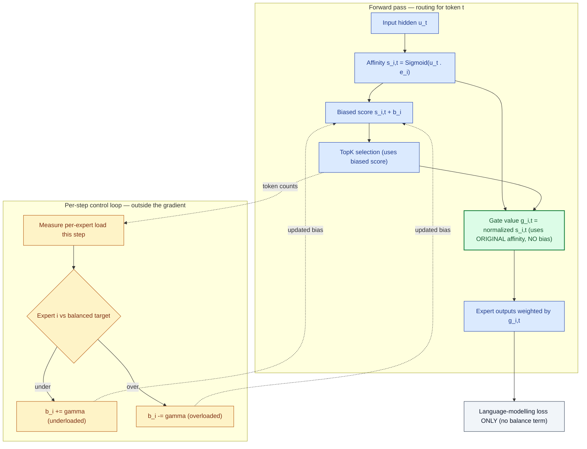
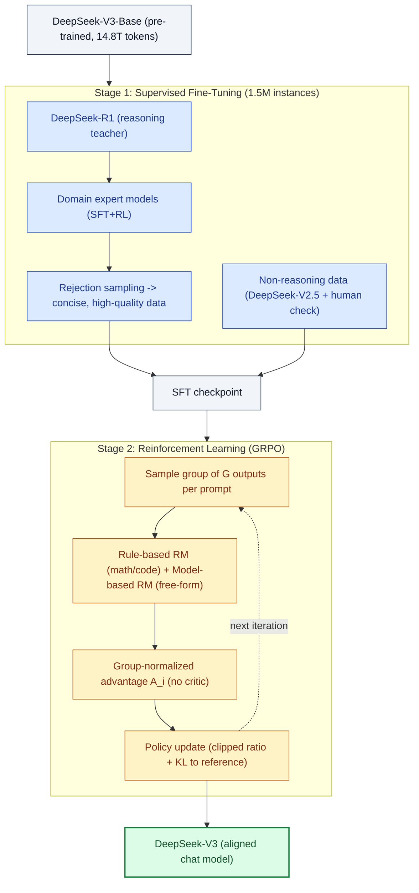

This is a technical dissection of **DeepSeek-V3** — a **671-billion-parameter Mixture-of-Experts (MoE)** language model that **activates only 37B parameters per token**, is trained on **14.8 trillion tokens**, and cost roughly **$5.6M** in GPU time to train. It reaches quality comparable to GPT-4o and Claude-3.5-Sonnet while being fully open-source.

DeepSeek-V3 keeps the two architectural pillars of [DeepSeek-V2](/engineering/deepseek-v2-mixture-of-experts-mla-language-model/) — **Multi-head Latent Attention (MLA)** for a small KV cache and **DeepSeekMoE** for cheap activated compute — almost unchanged. So this article does **not** re-derive those; it links to the V2 dissection and spends its depth on what is genuinely new in V3, which is where the interesting engineering lives:

1. **Auxiliary-loss-free load balancing** — a bias-based routing trick that replaces V2's three balance losses.
2. **Multi-Token Prediction (MTP)** — a training objective that predicts more than one future token per position.
3. **FP8 mixed-precision training** — the first successful validation of FP8 at this scale.
4. **DualPipe** and custom all-to-all kernels — the systems work that hides cross-node communication so no tensor parallelism is needed.

**Attribution convention.** Because this article mixes what the paper reports with my own reasoning, every non-obvious technical claim is tagged:

- **[Paper]** — stated explicitly in DeepSeek-V3 (arXiv:2412.19437).
- **[Derived]** — a mathematical or logical consequence of the paper's equations, worked out here.
- **[Interpretation]** — my explanation or engineering reasoning, written for the reader; not a claim the paper makes.

---

## Reasoning / Why I Studied This Paper

I came to DeepSeek-V3 with a specific question: **once you have a good MoE architecture, what actually stops you from scaling it further?** **[Interpretation]** V2 already solved the two headline costs — memory (MLA) and activated compute (sparsity). So V3 is the more interesting engineering problem: the paper reads like a list of *second-order* costs that only bite once the first-order ones are gone.

My mental model going in was that a big sparse model has three quieter enemies. **[Interpretation]**

- **Load balancing corrupts the objective.** MoE needs balanced expert usage, but the standard way to get it — an auxiliary loss — adds a gradient that is *not* the language-modelling gradient. At small scale that tax is tolerable; at 671B and 256 experts per layer it is a real drag on quality.
- **The training signal is thin.** Next-token prediction gives one supervision signal per position. When you have 14.8T tokens and want every one to count, one signal per token starts to feel wasteful.
- **Communication and precision dominate the bill.** With 37B activated across experts spread over 8 nodes, the all-to-all traffic and the FP32/BF16 arithmetic — not the FLOPs themselves — become what you actually pay for.

DeepSeek-V3 attacks exactly these three: the **auxiliary-loss-free** trick removes the balancing tax, **MTP** densifies the signal, and **FP8 + DualPipe** attack the precision and communication bills. That framing — *V2 solved the obvious costs, V3 solves the hidden ones* — is the thread this article follows. **[Interpretation]**

## I. The Problem: Scaling a Sparse Model Without the Second-Order Costs Exploding

The configuration is deliberately extreme: **671B total parameters, 37B activated per token, 14.8T training tokens, 128K context.** **[Paper]** For scale relative to V2 that is roughly 3x the total parameters and 2x the activated parameters, on nearly double the data.

*Figure 1 (from the paper). DeepSeek-V3 (hatched blue) against strong open- and closed-source chat models. The bars I read as the headline claim are the **math and reasoning** ones — MATH-500 at 90.2 and AIME 2024 at 39.2 are well clear of every other model shown, including GPT-4o and Claude-3.5-Sonnet, and Codeforces percentile (51.6) roughly doubles the next-best. The point of the figure is not that V3 wins everywhere — it trails Claude on SWE-bench — but that an open-source MoE with 37B activated parameters is now in the same conversation as frontier closed models.* **[Paper]**

What makes the headline numbers *cheap* is the same lopsided design as V2 — knowledge capacity of a huge network, per-token compute of a mid-sized one — but the cost table is the part worth internalising: **[Paper]**

| Training phase | H800 GPU-hours | Cost (@ $2/GPU-hr) |
| --- | --- | --- |
| Pre-training (14.8T tokens) | 2,664K | $5.328M |
| Context extension (to 128K) | 119K | $0.238M |
| Post-training | 5K | $0.010M |
| **Total** | **2,788K** | **$5.576M** |

*Table 1 (from the paper). The number I keep coming back to is **180K GPU-hours per trillion tokens** of pre-training. **[Paper]** That a 671B model trains for under $6M is the entire economic argument of the paper — and it is a claim about **engineering** (FP8, DualPipe, no tensor parallelism), not about the architecture alone.* **[Interpretation]**

The rest of this article is the machinery behind that number.

## II. What Carries Over from V2: MLA and DeepSeekMoE

Two things are essentially unchanged from V2, so I will state them compactly and point to the [DeepSeek-V2 dissection](/engineering/deepseek-v2-mixture-of-experts-mla-language-model/) for the derivations.

*Figure 2 (from the paper). The block is exactly V2's shape. **Left**: the standard pre-norm Transformer block — RMSNorm → Attention → residual, RMSNorm → FFN → residual, repeated L times. **Bottom right (MLA)**: the input hidden $\mathbf{h}_t$ is compressed into a small latent $\mathbf{c}^{KV}_t$ (and a query latent $\mathbf{c}^Q_t$), and only the shaded vectors — the latent and one decoupled RoPE key $\mathbf{k}^R_t$ — are cached at inference. **Top right (DeepSeekMoE)**: a router picks the top-$K_r$ of many routed experts, run alongside a few always-on shared experts, and their outputs are summed into the block output.* **[Paper]**

- **MLA** compresses each token's keys and values into one small latent vector, caches only that latent plus a single decoupled RoPE key, and absorbs the up-projection matrices into the query/output projections at inference so the reconstruction is effectively free. V3's MLA config: 128 heads, per-head dim 128, KV compression dim $d_c = 512$, query compression dim $d'_c = 1536$, decoupled key/query dim $d^R_h = 64$. **[Paper]** *(Why the decoupled RoPE key is necessary — because rotary embeddings break the absorption trick — is the subtle part, covered in the V2 article.)*

- **DeepSeekMoE** replaces the dense FFN with **1 shared expert + 256 routed experts**, of which **8 are activated per token**. **[Paper]** Fine-grained experts specialise sharply; the shared expert absorbs common knowledge so routed capacity is not wasted. V3 substitutes MoE layers for the FFN in all but the first three layers. **[Paper]**

Everything from Section III onward is where V3 diverges.

## III. Auxiliary-Loss-Free Load Balancing (the Headline Idea)

This is the change I find most elegant, because it fixes a problem by *removing* a mechanism rather than adding one.

### Why load balancing is a problem at all

An MoE layer routes each token to a few experts. If routing is left to itself, a handful of experts get most of the traffic and the rest starve — **routing collapse** — which wastes capacity and, under expert parallelism, creates stragglers that stall the whole batch. **[Interpretation]** The standard fix (used in Switch Transformers, and in V2) is an **auxiliary balance loss**: a term added to the training objective that penalises imbalanced expert usage.

The trouble is what that term *is*. **[Interpretation]** It is a gradient that does not come from "predict the next token better" — it comes from "spread the tokens more evenly." Those two objectives are not aligned. A large balance loss keeps experts busy but drags on model quality; a small one protects quality but risks imbalance. V3's insight is that you never actually wanted a *gradient* for balance — you wanted a *thermostat*. **[Interpretation]**

### The mechanism: sigmoid affinity, then a bias that only touches routing

First, V3 changes the gate itself. Each token's affinity to expert $i$ is a **sigmoid** (V2 used a softmax over experts): **[Paper]**

$$
s_{i,t} = \mathrm{Sigmoid}\!\left(\mathbf{u}_t^\top \mathbf{e}_i\right)
$$

where $\mathbf{u}_t$ is the token's input hidden and $\mathbf{e}_i$ is expert $i$'s centroid. The move from softmax to sigmoid matters: a softmax couples all experts (raising one affinity lowers the others), whereas a sigmoid scores each expert independently, so the later normalization and the bias trick can act cleanly. **[Interpretation]** The gate value that actually weights the expert output is the top-$K_r$ affinities, renormalised to sum to 1: **[Paper]**

$$
g_{i,t} = \frac{g'_{i,t}}{\sum_{j=1}^{N_r} g'_{j,t}}
$$

Now the trick. Routing — *which* experts fire — uses the affinity **plus a per-expert bias** $b_i$; but the gate value $g'_{i,t}$ that scales the output still comes from the **original** affinity $s_{i,t}$: **[Paper]**

$$
g'_{i,t} =
\begin{cases}
s_{i,t}, & s_{i,t} + b_i \in \mathrm{TopK}\bigl(\{\,s_{j,t} + b_j \mid 1 \le j \le N_r\,\},\; K_r\bigr) \\[4pt]
0, & \text{otherwise}
\end{cases}
$$

Read this carefully, because the whole idea is in the split: **[Interpretation]**

- **The bias $b_i$ only enters the `TopK` comparison** — it decides *selection*.
- **The gate value is still $s_{i,t}$, the un-biased affinity** — it decides *weighting*.

So the bias can push traffic toward a starved expert without ever changing the number the model multiplies its output by. There is **no balance term in the loss at all**, hence "auxiliary-loss-free."

### How the bias is set: a per-step thermostat

The bias is not learned by gradient descent. It is adjusted by a fixed rule at the end of each training step: **[Paper]**

- If an expert was **overloaded** this step, decrease its bias by a fixed step $\gamma$ (so it is less likely to be selected next step).
- If an expert was **underloaded**, increase its bias by $\gamma$.

V3 uses $\gamma = 0.001$ for the first 14.3T tokens, then sets $\gamma = 0$ for the final 500B tokens to let the model settle. **[Paper]** This is a genuine control loop — measure load, compare to the balanced target, nudge the bias in the correcting direction — and it lives entirely outside the differentiable graph.

The engineering reading of this diagram: **the bias (yellow) steers selection, but the gate value (green) is computed from the un-biased affinity and never sees the bias.** **[Interpretation]** The balance controller is a dotted side-channel that reads token counts and writes biases; it never touches the loss. That separation is exactly why V3 can be balanced *and* not pay the quality tax that a balance-loss gradient imposes. **[Interpretation]**

### The one small loss that remains

There is a single tiny safety net: a **complementary sequence-wise balance loss** with a very small weight $\alpha = 0.0001$, present only to prevent extreme imbalance *within any single sequence* (the bias controller balances over the whole batch, which can still leave one sequence lopsided). **[Paper]** For a per-expert normalised load $f_i$ and mean gate mass $P_i$ over the $T$ tokens of a sequence:

$$
\mathcal{L}_{\text{Bal}} = \alpha \sum_{i=1}^{N_r} f_i\, P_i
$$

The weight is ~two orders of magnitude smaller than a normal balance loss — it is a guardrail, not a driver. **[Interpretation]**

### Batch-wise vs sequence-wise: why this even helps quality

The paper's ablation (§4.5.3) explains *why* removing the loss improves quality rather than merely matching it. **[Paper]** A sequence-wise balance loss forces every sequence to use experts evenly, which prevents experts from **specialising** by domain — a code-heavy sequence *should* lean on code experts. The bias controller balances at the **batch** level (a looser constraint), so within a sequence experts are free to specialise. Figure 9 in the paper shows exactly this: the aux-loss-free model develops much sharper per-domain expert specialisation. And the validation-loss numbers make the causal point cleanly — on a 1B MoE, sequence-wise aux loss gives 2.258, while both aux-loss-free and a *batch-wise* aux loss give 2.253. **[Paper]** In other words, the win is really about **batch-wise vs sequence-wise scope**, and the bias trick is a clean, gradient-free way to get batch-wise balance.

## IV. Multi-Token Prediction (MTP)

The second new idea attacks a different waste: standard training gives one supervision signal per position. MTP extends the prediction to **additional future tokens**, densifying the signal. **[Paper]**

*Figure 3 (from the paper). Read it left to right. The **Main Model** predicts token $t_{i+1}$ as usual. **MTP Module 1** takes the main model's representation of token $i$, combines it with the embedding of the already-known next token $t_{i+1}$, and predicts $t_{i+2}$ — the "next-2" token. **MTP Module 2** does the same one step further. The green **Embedding Layer** and **Output Head** are drawn once and shared across all modules (the dotted "Shared" links). Each module produces its own cross-entropy loss.* **[Paper]**

### The one design choice that matters: sequential, causal modules

The natural way to predict multiple tokens (Gloeckle et al., 2024) is **parallel independent heads** — bolt $D$ output heads onto the trunk. V3 does the opposite: **sequential modules that keep the full causal chain.** **[Paper]** Module $k$ builds on module $k{-}1$'s representation, so the prediction of the next-2 token is conditioned on a real hidden state that saw the next-1 token, not on an independent projection of the trunk. **[Interpretation]** For token $i$ at depth $k$: **[Paper]**

$$
\mathbf{h}'^{k}_i = M_k\left[\,\mathrm{RMSNorm}(\mathbf{h}^{k-1}_i)\;;\;\mathrm{RMSNorm}(\mathrm{Emb}(t_{i+k}))\,\right]
$$

Here $\mathbf{h}^{k-1}_i$ is the representation from the previous depth ($\mathbf{h}^0_i$ is the main model's output), $\mathrm{Emb}(t_{i+k})$ is the embedding of the token this depth is conditioned on, $[\,\cdot\,;\,\cdot\,]$ is concatenation, and $M_k \in \mathbb{R}^{d \times 2d}$ projects the concatenation back to width $d$. **[Paper]** That combined vector goes through this depth's Transformer block, and the **shared** output head turns the result into a distribution over the vocabulary. Each depth gets a cross-entropy loss $\mathcal{L}^k_{\text{MTP}}$, and the MTP objective is their average, scaled by a weight $\lambda$: **[Paper]**

$$
\mathcal{L}_{\text{MTP}} = \frac{\lambda}{D}\sum_{k=1}^{D} \mathcal{L}^k_{\text{MTP}}
$$

V3 uses $D = 1$ (one extra token), with $\lambda = 0.3$ for the first 10T tokens and $\lambda = 0.1$ for the remaining 4.8T. **[Paper]** The weight is annealed down because the dense signal helps most early in training. **[Interpretation]**

### Two payoffs from one mechanism

- **Better main model.** The MTP loss is only a *training* objective; at inference you discard the MTP modules and the main model runs normally. The ablation (Table 4) shows MTP consistently lifts benchmark scores — e.g. on the large MoE baseline, HumanEval rises 44.5 → 53.7 and GSM8K 72.3 → 74.0 — at **zero inference cost**, since the modules are dropped. **[Paper]**
- **Free speculative decoding.** Alternatively, *keep* the MTP module and use it as a draft head for speculative decoding. The next-2 token's acceptance rate is **85–90%**, which yields **1.8x** the decode throughput (TPS). **[Paper]** Same weights, two different uses depending on whether you optimise for quality or latency. **[Interpretation]**

## V. Training at Scale: DualPipe, All-to-All Kernels, and FP8

The architecture explains the quality; this section explains the **$5.576M**. V3 trains on **2048 H800 GPUs** with **16-way pipeline parallelism, 64-way expert parallelism (across 8 nodes), and ZeRO-1 data parallelism — and crucially, no tensor parallelism.** **[Paper]** Getting there needs three pieces of systems work.

### DualPipe: overlap computation with cross-node communication

Cross-node expert parallelism has a brutal property: the all-to-all that ships each token to its experts' nodes gives a **computation-to-communication ratio of about 1:1** — you spend as long moving tokens as computing on them. **[Paper]** **DualPipe** hides that by splitting each forward/backward chunk into four components — **attention, all-to-all dispatch, MLP, all-to-all combine** — and scheduling a forward chunk's compute over a backward chunk's communication (and vice versa), while manually tuning how many GPU SMs go to communication vs computation. **[Paper]** It also runs a **bidirectional** pipeline (micro-batches fed from both ends) to cut pipeline bubbles further. The result: both all-to-all and pipeline-parallel communication are **fully hidden**, and the paper notes that as long as the compute-to-comm ratio holds, you can keep scaling experts across nodes at **near-zero all-to-all overhead**. **[Paper]** The cost is keeping two copies of parameters, which is cheap given the large expert-parallel size. **[Paper]**

### Custom all-to-all kernels

To make DualPipe's overlap real, V3 hand-writes cross-node all-to-all kernels co-designed with the network topology. **[Paper]** NVLink (intra-node, ~160 GB/s) is ~3.2x faster than InfiniBand (inter-node, ~50 GB/s), so each token is limited to **at most 4 nodes**; it is sent over IB to the same in-node GPU index on each target node, then forwarded over NVLink to the specific expert GPU — so IB and NVLink transfers overlap and each token reaches an average of **3.2 experts per node** for free. **[Paper]** Using **warp specialisation**, only **20 of the H800's 132 SMs** (partitioned into 10 communication channels) are needed to saturate both interconnects, leaving the rest for compute. **[Paper]** This is the kind of detail that does not show up in the architecture but is exactly why the training bill is what it is. **[Interpretation]**

### FP8 mixed-precision training

The last lever is arithmetic precision. V3 is, per the paper, the **first successful validation of FP8 training at extreme scale.** **[Paper]** The idea: run the expensive matrix multiplies in 8-bit, keep the sensitive parts higher-precision.

*Figure 6 (from the paper). The three GEMMs of a linear layer — **Fprop** (forward), **Dgrad** (gradient w.r.t. input), **Wgrad** (gradient w.r.t. weights) — all run in **FP8**, which theoretically doubles GEMM throughput vs BF16. Inputs are cast "To FP8" right before each GEMM; outputs come out in **BF16**; accumulation happens in **FP32**. On the right, the durable state — **Master Weight** and **Optimizer States** — is kept in high precision and only cast down to feed the GEMMs. The design principle is visible in the arrows: **compute in FP8, remember in high precision.*** **[Interpretation]**

Four details make FP8 actually work at scale: **[Paper]**

1. **Fine-grained quantisation.** A single scale per tensor is destroyed by one outlier. V3 scales **activations per 1×128 tile** (per token, per 128 channels) and **weights per 128×128 block**, so a local outlier only rescales its own small group. This mirrors the "microscaling" formats that next-gen NVIDIA GPUs support natively.
2. **High-precision accumulation on CUDA cores.** The H800's Tensor Cores accumulate FP8 GEMMs at only ~14-bit precision — enough to cause ~2% relative error at inner dimension $K = 4096$. V3 promotes partial sums to FP32 registers on the CUDA cores every $N_C = 128$ elements, recovering precision while keeping Tensor Cores busy (two WGMMA groups overlap so one promotes while the other computes).
3. **E4M3 everywhere.** Prior FP8 work used E5M2 for gradients (more exponent range); V3's fine-grained scaling shares exponent bits within each group, so it can afford **E4M3 (more mantissa) on all tensors** for higher precision.
4. **Kept in high precision.** Embeddings, the output head, MoE gating, normalisation, and attention operators stay in BF16/FP32, and master weights, gradients, and optimizer moments are stored in higher precision.

The validation number is the one that matters: across two model scales trained ~1T tokens, the **relative loss error stays below 0.25%** vs a BF16 baseline — well within training noise. **[Paper]** That is the evidence that FP8 is not a lossy shortcut here.

## VI. Pre-Training and Long-Context Extension

- **Data.** 14.8T tokens, with a higher share of math and code than V2 and broader multilingual coverage; a document-packing pipeline and a Fill-in-Middle (FIM) objective at rate 0.1. **[Paper]** Tokeniser: byte-level BPE, 128K vocabulary. **[Paper]**
- **Optimiser / schedule.** AdamW; 4K sequence length in pre-training; a warmup-then-constant-then-cosine-decay learning-rate schedule peaking at $2.2\times10^{-4}$; batch size ramped 3072 → 15360 over the first 469B tokens. **[Paper]**
- **Long context.** Two YaRN phases after pre-training (4K → 32K → 128K), applied only to the decoupled shared key $\mathbf{k}^R_t$ — the same recipe as V2. The NIAH ("needle in a haystack") test shows solid retrieval across the full 128K window. **[Paper]**

## VII. Post-Training: SFT, R1 Distillation, and GRPO

Post-training is cheap (5K GPU-hours) but does a lot of the reasoning heavy-lifting. **[Paper]** Two stages:

**Supervised fine-tuning (1.5M instances).** The interesting part is **distilling reasoning from DeepSeek-R1.** **[Paper]** R1 produces highly accurate but over-long, poorly formatted chains of thought. V3 builds domain expert models (via a combined SFT+RL pipeline), uses them to generate two SFT sample types — `<problem, original response>` and `<system prompt, problem, R1 response>` — and then rejection-samples high-quality, concise data for the final model. **[Paper]** The ablation (Table 9) shows the R1 distillation lifting MATH-500 from 74.6 → 83.2 and LiveCodeBench 31.1 → 37.4, at the cost of longer responses — an explicit accuracy-vs-length trade-off. **[Paper]**

**Reinforcement learning with GRPO.** Same critic-free method as V2 (see the [GRPO dissection](/engineering/grpo-deepseekmath-group-relative-policy-optimization/)). For each prompt, sample a group of $G$ outputs from the old policy and optimise: **[Paper]**

$$
\mathcal{J}_{\text{GRPO}}(\theta) = \mathbb{E}\!\left[\frac{1}{G}\sum_{i=1}^{G} \min\!\left(\frac{\pi_\theta(o_i|q)}{\pi_{\theta_{old}}(o_i|q)}A_i,\; \mathrm{clip}\!\left(\frac{\pi_\theta(o_i|q)}{\pi_{\theta_{old}}(o_i|q)}, 1-\varepsilon, 1+\varepsilon\right)A_i\right) - \beta\, \mathbb{D}_{KL}(\pi_\theta \Vert \pi_{ref})\right]
$$

The advantage needs **no critic model** — it is just the group-normalised reward: **[Paper]**

$$
A_i = \frac{r_i - \mathrm{mean}(\{r_1,\dots,r_G\})}{\mathrm{std}(\{r_1,\dots,r_G\})}
$$

Rewards come from a **rule-based RM** where possible (math answers in a box, LeetCode via a compiler — resistant to reward hacking) and a **model-based RM** for free-form answers, trained from V3 SFT checkpoints with chain-of-thought reward signals. **[Paper]**

The reading of this pipeline: **R1's reasoning is transferred into V3 through data, not weights** — R1 generates the chains, expert models clean and compress them, and rejection sampling keeps only the good ones, so V3 inherits reasoning quality without inheriting R1's verbosity. GRPO then aligns the model with a critic-free loop where the "baseline" is just the mean reward of a sampled group. **[Interpretation]**

## VIII. Evaluation: What the Ablations Actually Prove

I care less about the leaderboard and more about the **controlled ablations**, because those isolate the contribution of each new idea. For each, the six questions: *what was tested, why, against what baseline, what changed, what happened, and why it matters.*

### MTP ablation (Table 4)

- **What / why:** does the MTP objective actually help, at zero inference cost? **[Paper]**
- **Baseline / change:** an MoE baseline (tested at 15.7B and 228.7B total params) vs the same model with a 1-depth MTP module appended; the module is **discarded at inference**, so inference cost is identical. **[Paper]**
- **Result:** MTP lifts most benchmarks — on the large model, HumanEval 44.5 → 53.7, GSM8K 72.3 → 74.0, DROP 68.5 → 70.6. **[Paper]**
- **Why it matters:** it is a **free** quality gain — the densified training signal improves the main model, and you pay nothing at serving time (or, if you keep the module, you get 1.8x decode speed instead). **[Interpretation]**

### Auxiliary-loss-free ablation (Table 5)

- **What / why:** is removing the balance loss actually better, or just cheaper? **[Paper]**
- **Baseline / change:** a baseline that uses **auxiliary losses** for balance (same sigmoid gate + top-K normalisation, same aux-loss strength as V2) vs the **aux-loss-free** bias strategy, everything else held fixed, at 15.7B and 228.7B scales. **[Paper]**
- **Result:** aux-loss-free wins consistently — on the large model, GSM8K 70.7 → 74.5, HumanEval 40.2 → 46.3, BBH 66.7 → 67.9. **[Paper]**
- **Why it matters:** this is the causal evidence that the balance-loss *gradient* was costing quality. Removing it (while keeping balance via the bias thermostat) is strictly better, which is why it becomes the default. **[Interpretation]**

### Base-model comparison (Table 3) and chat comparison (Table 6)

- **Base:** DeepSeek-V3-Base beats DeepSeek-V2-Base, Qwen2.5-72B-Base, and **LLaMA-3.1-405B-Base** on most benchmarks — despite LLaMA activating **11x** as many parameters per token — and is especially strong on math and code (MATH 61.6, HumanEval 65.2). **[Paper]** And it does so at **180K GPU-hours per trillion tokens**, far cheaper than a 72B or 405B dense model. **[Paper]**
- **Chat:** DeepSeek-V3 is the strongest open-source chat model and competitive with GPT-4o and Claude-3.5-Sonnet — MATH-500 90.2, AIME 39.2, Codeforces 51.6 percentile (roughly double the closed models shown), and 85.5 on Arena-Hard (first open model past 85%). **[Paper]** It trails Claude on SWE-bench engineering tasks. **[Paper]**

The causal thread: the **architecture** (MLA + DeepSeekMoE) buys the capacity-per-FLOP; **aux-loss-free + MTP** convert that into higher scores at fixed compute; **R1 distillation** supplies the reasoning; and **FP8 + DualPipe** make the whole thing affordable. Each table isolates one link in that chain. **[Interpretation]**

## IX. Trade-offs and Limitations

The paper is direct about the edges. **[Interpretation]**

- **The deployment unit is large.** To serve efficiently, V3's recommended prefill unit is 32 GPUs and its decode unit is **320 GPUs** (with redundant-expert deployment to keep experts load-balanced online). **[Paper]** That is a real burden for small teams — the model is cheap to *train* per token but not trivial to *serve*. **[Paper]**
- **The systems work is hardware-specific.** DualPipe's SM budgeting, the FP8 CUDA-core accumulation trick, and the IB/NVLink-aware kernels are tuned to the H800; the paper even devotes a section to *hardware suggestions* (higher FP8 accumulation precision, native tile/block quantisation, fused online quantisation) because current chips make this harder than it should be. **[Paper]** The efficiency is not free — it is bought with deep, non-portable engineering. **[Interpretation]**
- **Aux-loss-free relies on large batches.** Batch-wise balancing only works because expert- and data-parallelism guarantee large micro-batches; the sequence-wise guardrail loss and online redundant-expert deployment exist to patch the cases where that assumption weakens. **[Paper]** **[Interpretation]**
- **R1 distillation trades length for accuracy.** The reasoning gain comes with longer responses, and the settings were hand-tuned to balance the two. **[Paper]**

## X. Engineer's Takeaway

DeepSeek-V3's lesson is that **once the first-order costs of a big sparse model are solved, the wins come from removing frictions, not adding capacity.** **[Interpretation]**

- **Auxiliary-loss-free balancing** is the idea I would carry to any MoE: you never wanted a balance *gradient*, you wanted a *controller*. Separating "which experts fire" (biased) from "how much they count" (un-biased) gives you balance for free and, because it permits batch-wise specialisation, actually *raises* quality. **[Interpretation]**
- **MTP** is a rare mechanism with two payoffs from one change: a denser training signal for a better main model, or a built-in draft head for 1.8x faster decoding. **[Interpretation]**
- **FP8 + DualPipe** are the reminder that at this scale the model *is* the systems work. The $5.576M headline is a claim about hidden precision and communication costs — attacked with fine-grained quantisation, CUDA-core accumulation, and computation-communication overlap — far more than about the architecture. **[Interpretation]**

The broadest way to hold it: **DeepSeek-V2 proved you can factor a large model to be cheap; DeepSeek-V3 proves that the remaining costs — the balancing tax, the thin training signal, the arithmetic and the wires — are each separately attackable, and that doing so lets an open 37B-activated model stand next to the frontier for under $6M.** **[Interpretation]**

---

## Related Reading

- [DeepSeek-V2](/engineering/deepseek-v2-mixture-of-experts-mla-language-model/) — the MLA and DeepSeekMoE foundations V3 inherits, derived in full; start here if the attention/routing math above felt compressed.
- [Switch Transformers](/engineering/switch-transformers-scaling-to-trillion-parameter-models/) — the top-1 MoE routing and auxiliary balance loss that V3's aux-loss-free strategy is explicitly reacting against.
- [GRPO](/engineering/grpo-deepseekmath-group-relative-policy-optimization/) — the critic-free RL objective used in V3's post-training, explained in depth.
- [vLLM & PagedAttention](/engineering/vllm-pagedattention-efficient-memory-management-for-llm-serving/) — the serving-side view of the KV-cache and throughput concerns that MLA and MTP-speculative-decoding address at the model level.
