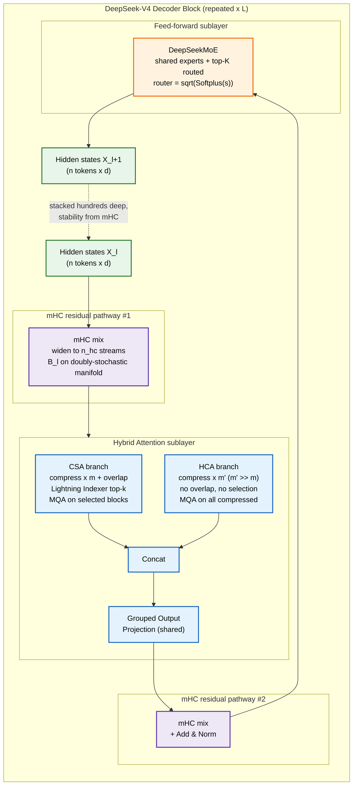
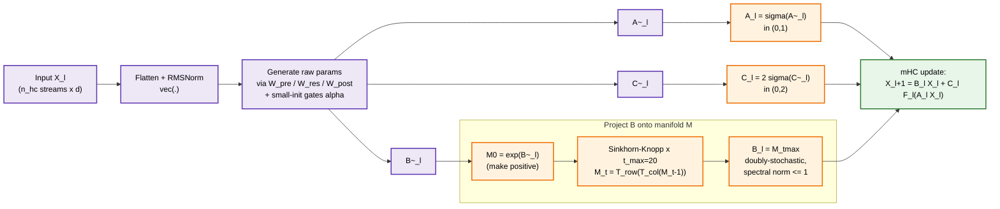
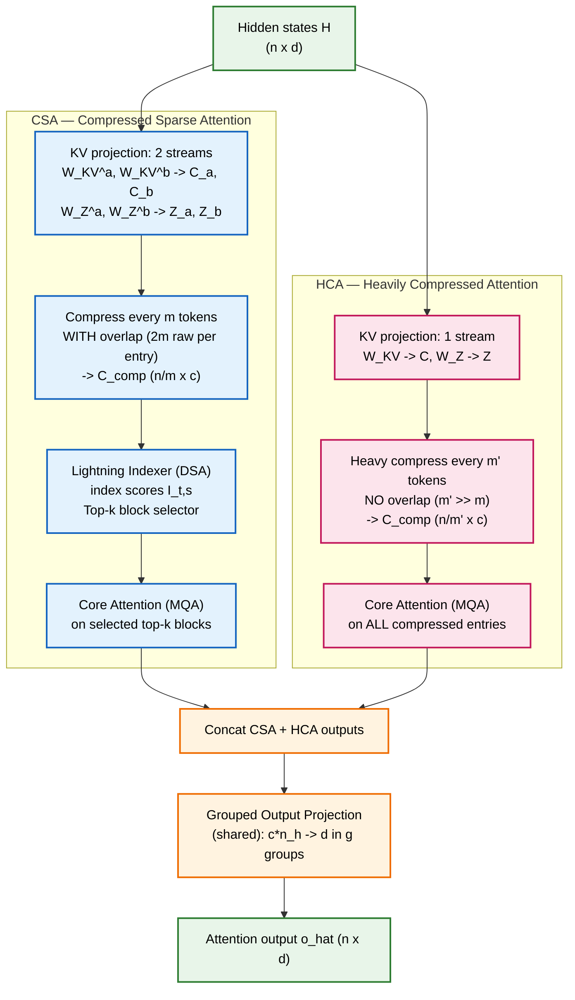
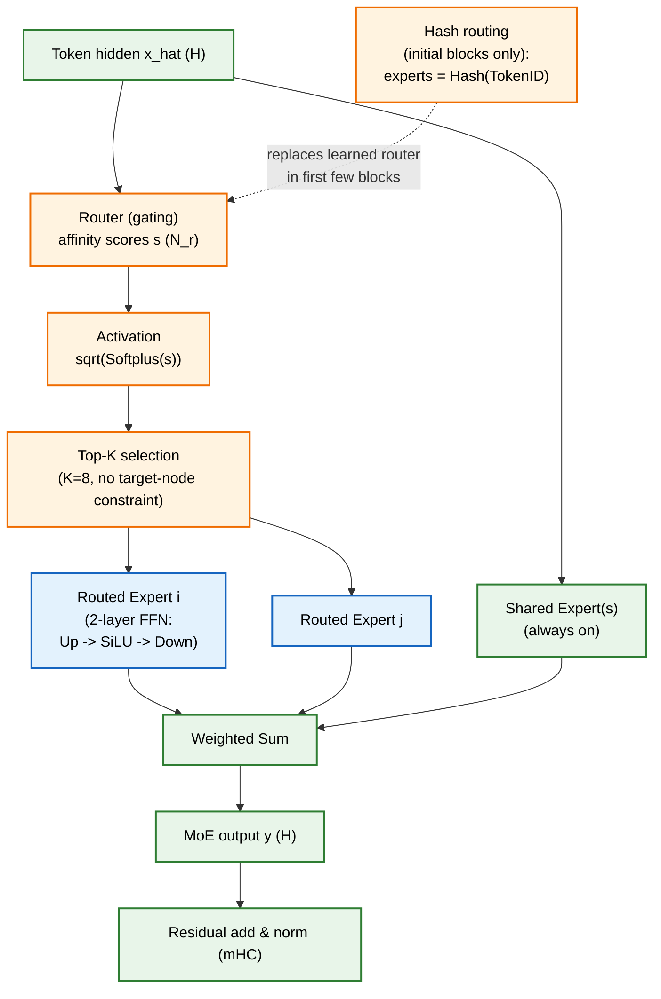

This is a technical dissection of the **DeepSeek-V4** architecture — the next step in the DeepSeek line after [DeepSeek-V2](/engineering/deepseek-v2-mixture-of-experts-mla-language-model/) and [DeepSeek-V3](/engineering/deepseek-v3-auxiliary-loss-free-moe-mtp-fp8-training/). Where V2 attacked the **KV-cache memory** wall with Multi-head Latent Attention and V3 attacked the **second-order** training costs (load balancing, thin signal, FP8/comms), **V4 attacks the last first-order cost that neither touched: the $O(n^2)$ attention computation itself**, and the **depth-stability** ceiling that limits how tall you can stack a transformer.

It does this with four moves:

1. **Hybrid Attention** — two compressed attention mechanisms, **Compressed Sparse Attention (CSA)** and **Heavily Compressed Attention (HCA)**, running in parallel inside each block.
2. **Manifold-Constrained Hyper-Connections (mHC)** — a widened, *stability-guaranteed* replacement for the plain residual connection.
3. **DeepSeekMoE with a $\sqrt{\text{Softplus}}$ router** — the same shared + routed expert design, with a non-saturating routing activation.
4. **The Muon optimizer** — a matrix-aware training algorithm that replaces scalar-rate AdamW on the 2D weight matrices.

> **A note on sources.** This dissection is built **primarily from my own study notes and the synthesized architecture diagrams I drew while working through DeepSeek-V4**, cross-checked against the equations those notes carry. It is *not* a line-by-line reading of a published PDF — so I have been deliberately careful to explain the *mechanisms and the reasoning* and to **avoid inventing benchmark numbers**. Where the notes give an exact form (an equation, a dimension, a hyperparameter range) I mark it **[Notes]**; where I work out a consequence I mark it **[Derived]**; where I am adding engineering reasoning for the reader I mark it **[Interpretation]**.

**Attribution convention.**

- **[Notes]** — stated explicitly in my DeepSeek-V4 study notes / diagrams.
- **[Derived]** — a mathematical or logical consequence of those equations, worked out here.
- **[Interpretation]** — my explanation or engineering reasoning, written for the reader.

---

## Reasoning / Why I Studied This

I came to V4 with one question: **what is actually left to optimize once MLA and sparse MoE are done?** **[Interpretation]** V2 and V3 already made the *memory* and the *activated compute* cheap. But two costs survive both of them:

- **Attention is still quadratic.** Even with a tiny KV cache, computing the $n \times n$ attention matrix is $O(n^2)$ in the sequence length. At 128K+ context that term dominates everything else. Shrinking the *cache* does not shrink the *score computation*.
- **Depth is capped by stability.** You cannot just keep stacking layers: in very deep stacks the residual signal drifts, and gradients explode or vanish. The residual connection is the load-bearing wall, and a plain identity residual eventually stops being enough.

So V4 reads, to me, as the "**attack the two things V3 left standing**" release: make attention **sub-quadratic** without throwing away long-range information, and make the **residual pathway itself** provably stable so depth stops being the limiter. Everything else (MoE, MTP, a better optimizer) is in service of scaling that taller, longer-context model efficiently. **[Interpretation]**

---

## I. The Problem: The $O(n^2)$ Attention Wall

Start from standard Multi-Head Attention. For a query, key, value triple the core operation is:

$$
\text{Attention}(Q, K, V) = \text{softmax}\!\left(\frac{Q K^\top}{\sqrt{c}}\right) V
$$

Here $Q, K, V \in \mathbb{R}^{n \times c}$ for sequence length $n$ and head dimension $c$. **[Notes]** The product $Q K^\top$ is an $n \times n$ matrix — one score for **every pair of tokens**. That single fact sets three costs: **[Derived]**

$$
\underbrace{O(n^2 c)}_{\text{attention compute}} \qquad \underbrace{O(n)}_{\text{KV cache per layer}} \qquad \underbrace{O(n^2)}_{\text{scores per query} \times n}
$$

MLA (V2) already shrank the **middle** term — the KV cache. But the **left** term, the $n \times n$ score matrix, is untouched by cache compression: you still compare every query against every key. At long context the score computation and the memory bandwidth needed to stream $K, V$ are what you actually pay for. **[Interpretation]**

The V4 insight is blunt: **most of those $n^2$ comparisons are wasted.** If you first **compress** the KV sequence by a factor $m$ (so there are only $n/m$ things to attend to) and then, for each query, **select only the few compressed blocks that matter** (top-$k$), the attention cost collapses toward $O(k)$ per query with $k \ll n/m \ll n$. That is the entire thesis of Hybrid Attention. **[Notes]**

The naming used throughout the rest of this article (kept consistent with the diagrams):

| Symbol | Meaning |
| --- | --- |
| $n$ | sequence length (tokens in context) |
| $d$ | hidden size (model dimension) |
| $c$ | head dimension |
| $n_h$ | number of query heads |
| $n_{ih}$ | number of indexer heads (CSA only) |
| $m$ | CSA compression factor ($m > 1$) |
| $m'$ | HCA compression factor ($m' \gg m$) |
| $k$ | number of top-$k$ compressed blocks selected (CSA) |
| $n_{win}$ | sliding-window size (tokens) |
| $g$ | number of groups in the output projection |

*[Notes] — notation table carried directly from the Hybrid Attention diagram.*

---

## II. The DeepSeek-V4 Decoder Block at a Glance

V4 is a decoder-only transformer, but two of its blocks are non-standard: the **residual connection** is replaced by **mHC**, and the **attention sublayer** is replaced by **Hybrid Attention**. The FFN sublayer is **DeepSeekMoE**.

*The full-stack view I drew while studying V4: token embedding at the bottom, then a stack of decoder blocks, each wrapping **Hybrid Attention** and a **MoE** feed-forward in **mHC** residual pathways, with **Multi-Token Prediction** heads at the top and **Muon** as the training optimizer. The rest of this article is essentially a walk up this diagram, one component at a time.* **[Notes]**

Here is the same block as a data-flow graph — this is the mental model to hold for the whole article:

Two sublayers, two mHC pathways, and a hybrid attention core. Now each piece in turn.

---

## III. Manifold-Constrained Hyper-Connections (mHC)

### III.1 Why the plain residual is not enough at depth

A standard residual is $X_{l+1} = X_l + F_l(X_l)$ — one identity pathway. **Hyper-Connections (HC)** generalize this: they **widen the residual stream** from $\mathbb{R}^d$ to $\mathbb{R}^{n_{hc} \times d}$, giving $n_{hc}$ parallel pathways that the layer can read from and write to. **[Notes]** The HC update rule is:

$$
X_{l+1} = B_l\, X_l + C_l\, F_l\!\left(A_l\, X_l\right)
$$

Reading the three pieces (this decomposition is the key to understanding mHC): **[Notes]**

- $A_l \in \mathbb{R}^{1 \times n_{hc}}$ **collapses** the $n_{hc}$ streams into a single $d$-dimensional input for the layer $F_l$ (so the inner layer is unchanged).
- $B_l \in \mathbb{R}^{n_{hc} \times n_{hc}}$ **mixes information among the streams** — this is the residual transformation, the dangerous part.
- $C_l \in \mathbb{R}^{n_{hc} \times 1}$ **writes the layer's output back** to all streams.

The upside: you decouple residual *width* ($n_{hc}$) from hidden *size* ($d$), with low overhead since $n_{hc} \ll d$. The problem: **$B_l$ is unconstrained**, and stacking many unconstrained mixing matrices is numerically unstable — repeated multiplication can blow the signal up or crush it to zero. **[Notes]** That is exactly the depth-stability ceiling from Section I.

*My full mHC breakdown. The left column motivates it with a "hiking on a mountain" analogy — HC gives you **many trails** (pathways) but you can wander off the safe ridge; mHC keeps the **same many trails but adds guardrails** (the manifold) so you stay on the stable path. The middle explains the HC update rule; the right shows how the constraint is actually computed. The whole point of the diagram is the one-liner at the top: keep information flowing through many pathways, but constrain **how** they mix so the signal stays stable even in very deep models.* **[Notes]**

### III.2 The constraint: a doubly-stochastic manifold

mHC's fix is to force $B_l$ to live on the **manifold of doubly-stochastic matrices** (the Birkhoff polytope):

$$
\mathcal{M} = \left\{ M \in \mathbb{R}^{n \times n} \ \middle|\ M \mathbf{1}_n = \mathbf{1}_n,\ \ \mathbf{1}_n^\top M = \mathbf{1}_n^\top,\ \ M \ge 0 \right\}
$$

In words: **every row sums to 1, every column sums to 1, all entries are non-negative.** **[Notes]** Why this specific set? Because a doubly-stochastic matrix **redistributes** information across streams rather than **amplifying** it. Its spectral norm satisfies $\lVert B_l \rVert \le 1$ (non-expansive), so:

$$
\lVert B_l\, X_l \rVert \ \le\ \lVert X_l \rVert
$$

The residual mixing can **never grow the signal**. That single inequality is what buys stability in both the forward pass and backpropagation, which is what lets V4 stack "hundreds of layers" without the signal drifting. **[Notes]** This is the "guardrail on the mountain trail": still many pathways, but the mixing is balanced. **[Interpretation]**

### III.3 How the constraint is enforced each step

The raw parameters $\tilde{A}_l, \tilde{B}_l, \tilde{C}_l$ are **generated dynamically from the input** $X_l$ (flatten, RMSNorm, then learnable projections with small-initialized gates $\alpha$), so mHC is input-dependent, not a fixed set of weights. **[Notes]** Then each is projected onto its constraint:

- **Input/output mappings** get squashed to safe ranges: $A_l = \sigma(\tilde{A}_l) \in (0,1)$ and $C_l = 2\,\sigma(\tilde{C}_l) \in (0,2)$, where $\sigma$ is the sigmoid — this keeps values bounded and avoids signal cancellation. **[Notes]**
- **The residual matrix** $B_l$ is projected onto $\mathcal{M}$ in two steps: first made positive via $M^{(0)} = \exp(\tilde{B}_l)$, then iterated to double-stochasticity with **Sinkhorn-Knopp**:

$$
M^{(t)} = T_r\!\left(T_c\!\left(M^{(t-1)}\right)\right), \qquad B_l = M^{(t_{\max})}
$$

where $T_c(\cdot)$ normalizes each **column** to sum to 1 and $T_r(\cdot)$ normalizes each **row** to sum to 1; alternating them converges to a doubly-stochastic matrix. In practice $t_{\max} = 20$ iterations. **[Notes]** This is cheap because $n_{hc}$ is small.

The engineering takeaway I keep: **mHC = many highways (hyper-connections) + guardrails (the manifold constraint)** → fast, expressive, and stable even for extremely deep transformers. **[Notes]**

---

## IV. Hybrid Attention: CSA and HCA in Parallel

The attention sublayer runs **two** compressed attention mechanisms **side by side** and concatenates their outputs:

*The Hybrid Attention block. Embedding → **CSA** and **HCA** in parallel → **Concat** → **Grouped Output Projection** → residual add & norm → FFN/MoE. Four techniques are shared inside both branches: **RMSNorm** on queries and compressed KV entries, **partial RoPE** (only the last 64 dims), a **sliding-window** branch for recent tokens, and a per-head learnable **attention sink**. The design intent is that CSA and HCA are complementary — one keeps quality with moderate compression + selection, the other buys extreme memory savings for very long context.* **[Notes]**

Why two mechanisms instead of one? Because they occupy different points on the same trade-off curve: **[Interpretation]**

- **CSA** compresses *moderately* ($m$), keeps *overlap* between compressed blocks (so no information falls in the cracks), and is *sparse* (top-$k$ selection) — this is the **quality-preserving** path.
- **HCA** compresses *aggressively* ($m' \gg m$), uses *no overlap*, and is *dense over the tiny compressed set* — this is the **ultra-cheap memory** path for very long contexts.

Running both and concatenating lets the model draw from a high-fidelity local/selected view **and** a heavily-compressed global view in the same block. **[Interpretation]** In the notes, **CSA is used in most layers** (better quality) and **HCA in some layers** (ultra-low memory for long contexts). **[Notes]**

Both branches finish with the **same shared Grouped Output Projection** and both use **MQA** (all heads share one compressed $K, V$), so the KV cache is shared across heads. **[Notes]** Now each branch in detail.

---

## V. Compressed Sparse Attention (CSA)

CSA's high-level idea: **compress the KV cache by a factor $m$, select the top-$k$ compressed entries for each query via a Lightning Indexer, then run core attention in MQA fashion.** **[Notes]**

*My step-by-step CSA breakdown. The pipeline is: KV projection (two streams) → compression with overlap → Lightning Indexer (top-$k$ selection) → MQA core attention → grouped output projection. The comparison table at the bottom is the payoff: MHA keeps $n$ KV entries at $O(n)$ memory and $O(n)$ attention cost; CSA keeps $n/m$ entries at $O(n/m)$ memory and $O(k)$ attention cost with $k \ll n/m \ll n$.* **[Notes]**

### V.1 Compression with overlap

CSA projects the hidden states into **two KV streams** ($C_a, C_b$ via $W_{KV}^a, W_{KV}^b$) and **two compression-weight streams** ($Z_a, Z_b$ via $W_Z^a, W_Z^b$). Two streams give **diversity**; the $Z$ streams produce the **compression scores**. **[Notes]** Every $m$ tokens are pooled into one compressed entry, but **with overlap** — each compressed entry $C_i^{comp}$ draws on $2m$ raw KV entries (block $i-1$ and block $i$), so information near a block boundary is never lost. The pooling weights are a row-wise softmax over the $Z$ scores plus a learnable positional bias, and the compressed entry is their weighted sum:

$$
C_i^{comp} = \sum_{j=m_i}^{m_{(i+1)}-1} S_j^{a} \odot C_j^{a} \ +\ \sum_{j=m_{(i-1)}}^{m_i - 1} S_j^{b} \odot C_j^{b}
$$

The result is $C^{comp} \in \mathbb{R}^{n/m \times c}$ — the sequence length is cut by roughly $m\times$. **[Notes]** ($\odot$ is element-wise product; $S$ are the softmax pooling weights over $Z + \text{bias}$.)

### V.2 The Lightning Indexer (DSA): top-$k$ selection

Compression alone gives $n/m$ entries; **sparsity** comes from selecting only the $k$ most relevant compressed blocks per query. The **Lightning Indexer** builds low-rank indexer keys $K^{I,comp} \in \mathbb{R}^{n/m \times c_I}$ (same compression applied to keys) and low-rank indexer queries $q_t^I$, then scores each preceding compressed block $s$ for query token $t$:

$$
I_{t,s} = \sum_{h=1}^{n_{ih}} w_{t,h}^{I}\, \cdot\, \text{ReLU}\!\left(q_{t,h}^{I} \cdot K_s^{I,comp}\right)
$$

The sum runs over $n_{ih}$ **indexer heads**, each with a learned weight $w_{t,h}^I$; the ReLU keeps only positive matches. A **top-$k$ selector** then keeps the highest-scoring blocks: $C_t^{Sprs,comp} = \{ C_s^{comp} \mid I_{t,s} \in \text{Top-}k(I_{t,:}) \}$. **[Notes]** The indexer is deliberately **low-rank and cheap** — it is a fast pre-filter whose only job is to pick which $k$ blocks the expensive core attention will actually look at. **[Interpretation]**

### V.3 Core attention and grouped output

Core attention then runs **only over the selected $k$ blocks**, in **MQA** form — all heads share the same compressed $K, V$, so the cache holds one copy instead of $n_h$. **[Notes]** Finally the **Grouped Output Projection** maps the concatenated head outputs ($c \cdot n_h$ dimensions) back to $d$: it splits the heads into $g$ groups, projects each group with a smaller matrix ($d_g < c\,n_h / g$), and concatenates — cutting the cost of the output projection. **[Notes]**

The cost ledger, which is the whole reason CSA exists: **[Notes]**

| Method | KV entries | KV-cache memory | Attention cost / query |
| --- | --- | --- | --- |
| MHA (full) | $n$ | $O(n)$ | $O(n)$ |
| **CSA** | $n/m$ | $O(n/m)$ | $O(k)$, with $k \ll n/m \ll n$ |

Typical settings in the notes: $m = 4\text{–}8$, $k = 16\text{–}64$, $n_{ih} = 128\text{–}256$, $n_h = 4\text{–}8$, $g = 8\text{–}16$. **[Notes]**

```mermaid
flowchart LR
    H["H (n x d)"] --> KV["KV proj: 2 streams<br/>C_a,C_b + Z_a,Z_b"]
    KV --> COMP["Compress x m WITH overlap<br/>C_comp (n/m x c)"]
    COMP --> IDX["Lightning Indexer<br/>I_t,s = sum_h w ReLU(q . K)"]
    IDX --> TOPK["Top-k selector<br/>keep k blocks"]
    TOPK --> CORE["Core Attention (MQA)<br/>over k selected blocks"]
    CORE --> GOP["Grouped Output Projection<br/>g groups, d_g < c*n_h/g"]
    GOP --> O["o_hat (n x d)"]

    classDef step fill:#e3f2fd,stroke:#1565c0,stroke-width:2px,color:#000;
    classDef sel fill:#fff3e0,stroke:#ef6c00,stroke-width:2px,color:#000;
    classDef io fill:#e8f5e9,stroke:#2e7d32,stroke-width:2px,color:#000;
    class KV,COMP,CORE,GOP step;
    class IDX,TOPK sel;
    class H,O io;
```

---

## VI. Heavily Compressed Attention (HCA)

HCA is CSA's aggressive sibling. It **compresses much harder** ($m' \gg m$), uses **no overlap**, and does **not** do sparse selection — every query attends to **all** compressed KV entries (MQA). **[Notes]**

*My HCA breakdown. Single KV stream (vs CSA's two), heavy compression factor $m'$ with no overlap, and — crucially — **no top-$k$ selection**: because the compressed set is already tiny ($n/m'$ entries), you can afford to attend to all of it densely. The comparison box makes the contrast explicit: CSA is *overlap + factor $m$ + top-$k$*; HCA is *no overlap + factor $m'$ + dense*.* **[Notes]**

The compression is a single-stream version of CSA's: project to KV entries $C$ and compression weights $Z$, then pool every $m'$ **non-overlapping** tokens with a row-wise softmax over $Z$ plus positional bias:

$$
C_i^{comp} = \sum_{j = m'i}^{m'(i+1)-1} S_j^{comp} \odot C_j, \qquad C^{comp} \in \mathbb{R}^{n/m' \times c}
$$

Then core attention is dense over that tiny set — all heads share it (MQA): **[Notes]**

$$
o_{t,i} = \text{CoreAttn}\!\left(\text{query} = q_{t,i},\ \text{key} = C^{comp},\ \text{value} = C^{comp}\right)
$$

Because $m'$ is large (the notes give $m' = 32\text{–}128$), the KV cache and attention cost are both $O(n/m')$ — a very low memory footprint, and dead simple because there is no indexer or selection to maintain. **[Notes]** That simplicity is the point: HCA is the stable, cheap "background" attention that handles very long context, while CSA does the high-fidelity work. **[Interpretation]**

Putting the three side by side (the summary table from the notes): **[Notes]**

| Aspect | MHA (full) | CSA (sparse) | HCA (heavy) |
| --- | --- | --- | --- |
| KV entries used | $n$ | $n/m$ | $n/m'$ |
| Sparsity | no | yes (top-$k$) | no (dense over compressed) |
| Compression | none | overlap + factor $m$ | no overlap + factor $m' \gg m$ |
| Attention / query | $O(n)$ | $O(k)$ | $O(n/m')$ |
| KV memory | $O(n)$ | $O(n/m)$ | $O(n/m')$ |

---

## VII. DeepSeekMoE with a $\sqrt{\text{Softplus}}$ Router

The feed-forward sublayer keeps the **DeepSeekMoE** design inherited from V2/V3 — a set of always-on **shared experts** plus a large pool of fine-grained **routed experts**, of which only the top-$K$ fire per token. What changes in V4 is the **routing activation**.

*My FFN/MoE breakdown. The router computes affinity scores over $N_r$ routed experts; the **top-$K$** (K = 8 typical) are combined with $N_s$ **shared experts** (always on) via a weighted sum, then added back through the residual. Each expert is a two-layer FFN with up-projection, SiLU/GeLU, and down-projection. Two V4-specific twists appear here: the **$\sqrt{\text{Softplus}}$ routing activation** and **Hash routing** in the initial several blocks.* **[Notes]**

### VII.1 Why $\sqrt{\text{Softplus}}$ instead of Sigmoid

V3 computed routing affinity with a **Sigmoid**. V4 replaces it with:

$$
\text{affinity} = \sqrt{\text{Softplus}(s)} = \sqrt{\log\!\left(1 + e^{s}\right)}
$$

The reason is entirely about **gradient flow**. A sigmoid **saturates**: for $s \ll 0$ or $s \gg 0$ its derivative $\sigma(s)(1-\sigma(s)) \to 0$, so experts with large-negative scores receive almost no gradient and are rarely explored — routing gets stuck. **[Notes]** Compare the derivatives:

$$
\frac{d}{ds}\,\sigma(s) = \sigma(s)\bigl(1 - \sigma(s)\bigr) \qquad\text{vs}\qquad \frac{d}{ds}\sqrt{\text{Softplus}(s)} = \frac{1}{2\sqrt{\log(1+e^{s})}}\cdot\frac{1}{1 + e^{-s}}
$$

The $\sqrt{\text{Softplus}}$ form is **always positive, smooth, and non-saturating for large $|s|$**: its gradient does **not** vanish for large-negative scores, so under-used experts keep getting a learning signal. **[Notes]** The practical effect the notes call out: **smoother, more stable routing updates, better expert exploration, and improved load balance and convergence.** **[Interpretation]**

### VII.2 The rest of the MoE, and what carries over from V3

The other V4 MoE choices, from the notes: **[Notes]**

- **Load balancing:** auxiliary-loss-free (V3's bias trick) **plus** a sequence-wise balance loss.
- **No constraint on routing target nodes**, with a redesigned, more flexible parallelism strategy.
- **Hash routing in the initial several blocks:** the first few transformer blocks replace the dense FFN with an MoE whose routing is a deterministic hash of the token ID (`target_experts = Hash(TokenID)`) rather than a learned router.
- **MTP is unchanged from V3** (see next section).
- **Expert dimensions (example):** $d_{\text{model}} = H = 6144$, expansion $d_{\text{esp}} = r \cdot H$ with $r \approx 8/3 \text{–} 3.5$, top-$K = 8$, $N_r = 256\text{–}512$ routed experts, $N_s = 1\text{–}8$ shared experts.

During backprop, $\partial L / \partial y$ flows to the **selected routed experts and the shared experts**, then back through the gating weights to the router, which is updated via the chain rule through $\sqrt{\text{Softplus}}$ — and because that gradient never dies, the router keeps improving. **[Notes]**

---

## VIII. Multi-Token Prediction (MTP)

MTP in V4 is **the same as in V3**: alongside the main next-token head, additional MTP modules predict further-out tokens (next, next-next, …), and the MTP loss is optimized **jointly** with the standard language-modeling loss. **[Notes]** This densifies the training signal (more supervision per position) and, kept at inference, enables speculative decoding for faster generation.

Because this is unchanged, I will not re-derive it here — the full treatment (the sequentially-causal chain, the shared trunk, the acceptance-rate speedup) is in the [DeepSeek-V3 dissection](/engineering/deepseek-v3-auxiliary-loss-free-moe-mtp-fp8-training/). **[Interpretation]**

---

## IX. The Muon Optimizer

V4's fourth pillar is not architectural — it is the **training algorithm**. Muon is a **matrix-aware** optimizer: instead of treating each parameter as a scalar with a scalar learning rate (Adam/SGD), it treats each weight $W \in \mathbb{R}^{n \times m}$ as a **2D object** and preconditions the update using second-order structure. **[Notes]**

*My Muon breakdown. The core is a **hybrid Newton-Schulz iteration** that approximates $X^{-1/2}$ (the inverse square root of a matrix built from the gradient), which acts as a **preconditioner** — directions with large curvature get smaller updates and vice versa. The notes list exactly where it is applied (2D matrices) and where it is not (biases, norms, scalars), and note it is a **training-only** optimizer with no role in inference.* **[Notes]**

### IX.1 The update, step by step

For each 2D weight matrix, per training step: **[Notes]**

$$
G_t = \nabla_W L_t(W_{t-1}) \qquad M_t = \mu M_{t-1} + G_t
$$

$$
O'_t = \text{HybridNewtonSchulz}\!\left(\mu M_t + G_t\right) \qquad O_t = O'_t \cdot \sqrt{\max(n, m)} \cdot \gamma
$$

$$
W_t = W_{t-1}\,(1 - \eta\lambda) \ -\ \eta\, O_t
$$

Reading it: $M_t$ is the **momentum buffer**; feeding $\mu M_t + G_t$ into the preconditioner is the **Nesterov lookahead** (use a gradient estimate one step ahead); the $\sqrt{\max(n,m)}\cdot\gamma$ factor is **RMS rescaling** that keeps the update magnitude sane regardless of matrix shape; and the final line applies **decoupled weight decay** ($1-\eta\lambda$) before the gradient step. **[Notes]**

### IX.2 The hybrid Newton-Schulz core

The preconditioner approximates $X^{-1/2}$ for the symmetric positive-definite matrix

$$
X = \frac{\tilde{M}_t\, \tilde{M}_t^\top}{m}\ \ (n \ge m) \qquad\text{or}\qquad X = \frac{\tilde{M}_t^\top\, \tilde{M}_t}{n}\ \ (n < m)
$$

using an iteration that needs only matrix multiplies (no eigendecomposition): initialize $Y_0 = X/\text{scale}$, $Z_0 = I$, then for $k = 0,1,\dots,K-1$

$$
T_k = \tfrac{1}{2}\bigl(3I - Z_k Y_k\bigr), \qquad Y_{k+1} = Y_k T_k, \qquad Z_{k+1} = T_k Z_k
$$

after $K$ steps $Z_K \approx X^{-1/2}$. **[Notes]** The "hybrid" variant adds a gradient-descent correction step to stay stable on ill-conditioned matrices. In practice $K = 5\text{–}10$ steps (a speed/accuracy trade-off). **[Notes]**

### IX.3 What Muon touches — and what it doesn't

Muon is applied to the **2D weight matrices**: the attention projections (all the $W_Q, W_K, W_V, W_{KV}, W_Z, W_{DQ}, W_{UQ}, W_O$ of CSA/HCA), the MoE router and expert projections, the FFN linear layers, and the embedding/output head. It is **not** applied to biases, LayerNorm/RMSNorm scale-and-shift parameters, positional-bias tables, or any scalar/1D tensor — those stay on **AdamW**. **[Notes]** And it is **training-only**: the KV-cache compression (CSA/HCA) is an inference-time concern; Muon plays no part there. **[Notes]**

Hyperparameters from the notes: learning rate $\eta = 1\text{e-}4$ to $3\text{e-}4$ (warmup + cosine decay), momentum $\mu = 0.95\text{–}0.98$, weight decay $\lambda = 0.01$, rescale factor $\gamma = 0.1\text{–}1.0$, Newton-Schulz steps $K = 5\text{–}10$. **[Notes]** Why it fits V4: matrix-aware and scale-invariant updates give **better conditioning across the many layers** that mHC now lets you stack, with **stable, fast convergence** — complementary to the hybrid attention + DeepSeekMoE design. **[Interpretation]**

---

## X. How It All Fits Together

The four pillars are not independent — they reinforce each other. **[Interpretation]**

- **mHC** removes the depth ceiling, so you can stack more layers…
- …which is only affordable because **Hybrid Attention** made each layer's attention sub-quadratic ($O(n/m)$ memory, $O(k)$ or $O(n/m')$ compute)…
- …and **DeepSeekMoE** keeps the per-token *compute* flat even as total parameters grow, with the $\sqrt{\text{Softplus}}$ router keeping all those experts actually trainable…
- …while **Muon** keeps the whole tall, wide, sparse model **well-conditioned during training**, and **MTP** squeezes more signal out of every token.

Put differently: V2 made the model *fit in memory*, V3 made it *cheap to train*, and V4 makes it *deep and long-context* without either of those regressing. **[Interpretation]**

---

## XI. Trade-offs and Limitations

Being honest about the costs, several of which the notes make explicit and some of which are my reading: **[Interpretation]**

- **Compression can drop information.** CSA's overlap and top-$k$ selection are bets that the discarded blocks did not matter for a given query. For tasks needing exact recall of an arbitrary distant token (needle-in-a-haystack style), heavy compression — especially HCA at $m' = 128$ — is a real risk. The two-branch design is partly insurance against this. **[Interpretation]**
- **The Lightning Indexer is another moving part.** Top-$k$ selection is only as good as the indexer's scores; a bad pre-filter silently starves core attention of the right blocks, and the indexer adds its own parameters and compute. **[Interpretation]**
- **mHC adds per-step cost.** Twenty Sinkhorn-Knopp iterations per mHC block, every forward pass, is not free — it is cheap only because $n_{hc}$ is small. **[Derived]**
- **Muon's Newton-Schulz costs matrix multiplies.** $K = 5\text{–}10$ iterations of matrix products per 2D weight per step is more per-step optimizer work than AdamW; the bet is that better conditioning pays it back in fewer steps and higher stability. **[Interpretation]**
- **This is an architecture study, not a benchmarked result here.** I have deliberately not attached accuracy or throughput numbers, because my notes are about *mechanism*, not a reproduction of published evaluations. Treat the "$m\times$ / $O(n/m)$" claims as the *design intent*, and verify against the official release before quoting figures. **[Interpretation]**

---

## XII. Engineer's Takeaway

If I compress DeepSeek-V4 to a few sentences: **it is the DeepSeek recipe finally attacking the $O(n^2)$ attention term and the depth-stability ceiling at the same time.** **[Interpretation]** Hybrid Attention says *you do not need to compare every token to every token — compress, then select* — and hedges its compression with two branches at different fidelities. mHC says *widen the residual into many pathways, but keep the mixing on a manifold where nothing can blow up*, which is what makes stacking that many layers safe. The $\sqrt{\text{Softplus}}$ router and Muon are the quieter enablers: keep every expert learnable, and keep every matrix well-conditioned.

The pattern worth stealing, regardless of DeepSeek: **when a cost is quadratic, do not optimize the constant — change what you compute.** Compress the thing you are attending over, then spend your attention budget only where an cheap indexer says it will matter. **[Interpretation]**

---

## Related Reading

- [DeepSeek-V3: Auxiliary-Loss-Free MoE, MTP, and FP8 Training](/engineering/deepseek-v3-auxiliary-loss-free-moe-mtp-fp8-training/) — the direct predecessor; V4 inherits DeepSeekMoE and MTP from here and changes the router activation.
- [DeepSeek-V2: Mixture-of-Experts and Multi-head Latent Attention](/engineering/deepseek-v2-mixture-of-experts-mla-language-model/) — where the KV-cache-compression lineage (MLA) that Hybrid Attention descends from begins.
- [DeepSeek-R1: Incentivizing Reasoning via Reinforcement Learning](/engineering/deepseek-r1-incentivizing-reasoning-via-reinforcement-learning/) — the reasoning line built on the same base models.
