Most model releases are interesting because of what the model can do. **DeepSeek-V4.1-Flash** is interesting because of what it *costs to serve* while doing it.

I did not come to this paper looking for a new benchmark leader. I came to it from the other direction — I have been tracing the **KV cache** through serving systems for a while now, and I kept arriving at the same wall: every trick for managing the cache assumes the cache's *size* is a fixed input. You can page it, reuse it, tier it, prefetch it, or quantize it at the edges, but you cannot make the model stop producing it. **DeepSeek-V4.1-Flash is the first release I have read that attacks the size itself as a first-class architectural goal**, and reports a number specific enough to check: **890 bytes of global KV cache per token**.

This article is my engineering investigation of that number — where it comes from, what had to change in the architecture to get it, and what it does and does not buy.

**Attribution convention.** This article mixes what DeepSeek reports with my own reasoning and my own implementation. Every non-obvious claim is tagged:

- **[Paper]** — stated or reported directly by DeepSeek in the V4.1-Flash technical report (arXiv:2609.19969).
- **[Derived]** — a logical or arithmetic consequence of the paper's published configuration, worked out here.
- **[Our implementation]** — something I built and ran in this project.
- **[Our observation]** — something I learned from running it.
- **[Interpretation]** — my engineering explanation of why a result matters; not a claim the paper makes.

I have **not** reproduced any of DeepSeek's model training or benchmark results, and nothing below should be read as independent confirmation of them. What I built is an analytical **KV-cache byte-budget model**, which is a very different and much more modest thing — but it turns out to be enough to verify the paper's central systems claim from first principles.

---

## Reasoning / Why I Studied This Paper

I have been working through the **KV-cache lifecycle** one system at a time, and each paper filled in one stage:

- [**SGLang / RadixAttention**](/engineering/sglang-radixattention-structured-lm-program-execution/) — don't *create* redundant KV; reuse shared prefixes from a radix tree.
- [**vLLM / PagedAttention**](/engineering/vllm-pagedattention-efficient-memory-management-for-llm-serving/) — *store* KV without fragmentation.
- [**MOONCAKE**](/engineering/mooncake-kvcache-centric-architecture-for-serving-llm-chatbot/) — *move* KV across a cluster.
- [**Strata**](/engineering/strata-hierarchical-context-caching-long-context-llm-serving/) — *fetch it back* from slower tiers fast enough that tiering pays.

**[Interpretation]** Every one of those four takes the per-token cost of the cache as given. They are all downstream of a decision the *model architecture* already made. So the question I actually wanted answered was the upstream one: **how much can the model itself be changed so that there is simply less cache to manage?** That is the question DeepSeek-V4.1-Flash is about, which is why I read it as a serving paper that happens to ship a model, rather than a model paper that happens to mention serving.

---

## I. Why DeepSeek-V4.1-Flash Is Worth an Investigation

"It's a strong model" is not a reason to dissect something. Here is the actual reason.

**[Paper]** DeepSeek-V4.1-Flash is a multimodal Mixture-of-Experts model with **552B backbone parameters** (plus 196B Engram parameters), native image input, and support for contexts up to **one million tokens**. It activates **8B parameters per token during prefill and 16B during decode** — an asymmetry examined in Section II.

What makes it worth studying is the *conjunction* of four things that usually trade off against each other:

1. **[Paper]** It is competitive with closed-source frontier models on agentic benchmarks.
2. **[Paper]** It holds roughly **1/4** the runtime (HBM-resident) KV cache of DeepSeek-V4-Flash at equal sequence length.
3. **[Paper]** It holds roughly **1/8** the persistent (SSD / host-memory) KV cache of DeepSeek-V4-Flash.
4. **[Paper]** It does all of that while delivering *better* overall performance than DeepSeek-V4-Flash, despite being the smaller-footprint design on the cache axis.

**[Interpretation]** Any one of those alone is unremarkable. You can always shrink a cache by accepting quality loss, and you can always raise benchmark scores by spending memory. The claim worth checking is that the release moved both axes in the favorable direction at once. That reframes the interesting question away from:

> *How good is this model?*

and toward:

> **How much agentic capability can the system deliver per byte of inference memory it requires?**

That is the question this article follows. The next section establishes the problem that question is asking about.

---

## II. The Inference Problem DeepSeek-V4.1 Flash Is Designed to Solve

Knowing that a release moved capability and footprint in the same direction is not the same as knowing *what* it had to solve. Every design choice examined later in this article is downstream of one workload shift, so it is worth being precise about that shift before touching any mechanism.

### Long-horizon agents change what inference has to hold

Applications of long-horizon agents have expanded quickly, and the shape of the inference workload changed with them.

A chat turn is short-lived and roughly symmetric: a prompt goes in, a few hundred tokens come out, the context dies with the response. A **long-horizon agent** is neither. It inspects a repository, calls a tool, reads the result, calls another, edits a file, runs a test suite, reads a stack trace, and keeps going — for hundreds of steps and, increasingly, for wall-clock *hours*. **[Paper]** DeepSeek's own test-time-compute scaling experiments run agent rollouts under explicit per-rollout wall-clock deadlines ranging from **1 to 20 hours**.

As trajectories lengthen, ultra-long-context processing stops being a feature and becomes the normal operating condition. **[Interpretation]** The structural consequence is that agentic inference is **input-heavy**: every tool result, file read, and terminal transcript is appended to a context the model must carry forward, while the model's own output stays small. A coding agent that emits 200 tokens of patch after reading 40,000 tokens of source and test output is doing roughly 200:1 input-to-output work — and that ratio gets *worse* as the trajectory lengthens, because accumulated history grows monotonically while each step's output does not.

Here is the part that is easy to under-read. Computing over a large context is only the first requirement. A serving system carrying this workload must also:

- **store** large KV caches while requests are in flight,
- **reuse** KV state that an earlier turn or an earlier execution stage already produced,
- **persist** that state when it will be needed again beyond the current request,
- **move** it between memory tiers, and
- **migrate or reload** it across devices and storage systems as scheduling demands.

**[Interpretation]** Once that is the job description, KV-cache management is no longer an implementation detail of the attention kernel. It is a subsystem of the serving stack with its own capacity planning, eviction policy, lifetime guarantees, and failure modes — and it sits on the critical path of every request. That reframing is what makes this a systems paper to me rather than a model paper.

### Three coupled constraints: computation, storage, communication

**[Paper]** The pressure this creates runs along three axes. They are worth separating, because they fail differently and they are relieved by different kinds of work.

**Computation.** A long context is more information to process on the way in, and more state to reach back into on every decode step. Prefill has to ingest it once; decode has to attend over it again at every generated token. **[Interpretation]** This is the axis that has already received the most attention, and the one where the most progress has been made.

**Storage.** KV caches occupy scarce memory. The state an active request needs sits in GPU HBM, which is the tightest budget in the machine. State kept for later reuse spills into host DRAM and SSD, which are larger but not free. **[Interpretation]** Note that this axis is about *capacity*, not speed — and capacity does not improve when you buy a faster accelerator.

**Communication.** Moving KV state between HBM, host memory, SSDs, and other accelerators consumes I/O and interconnect bandwidth. **[Paper]** Those bandwidths also bound how fast a cache can be migrated or loaded. **[Interpretation]** Which means a cache can be cheap to store and still expensive to *use*, if fetching it takes longer than recomputing it would have.

**[Paper]** The coupling is what makes this the current bottleneck. Prior advances in sparse attention substantially reduced the computational cost of long-sequence processing — and in doing so made persistent storage and data movement *more* prominent, not less, by removing the cost that used to dominate. **[Interpretation]** That is a familiar pattern in systems work: relieving the binding constraint promotes whatever was second in line, and here the promotion went to bytes and bandwidth.

Following the cost through the machine gives the chain I actually care about. **[Interpretation]**

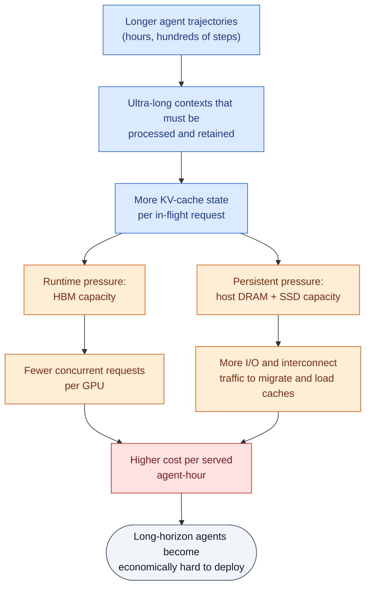

*The causal chain from workload to cost. Note that it never passes through model quality — every link is a capacity, bandwidth, or scheduling constraint.* **[Interpretation]**

**[Interpretation]** Three different resources, three different production symptoms:

| Resource | What the KV cache does to it | How it shows up in production |
|---|---|---|
| **HBM capacity** | Each in-flight request holds global KV proportional to its context length | Fewer concurrent requests fit; continuous batching runs out of room to batch |
| **Host DRAM / SSD** | Persisted prefixes accumulate across turns and sessions | Retention window shrinks, hit rate falls, re-prefill cost returns |
| **I/O + interconnect bandwidth** | Caches must be migrated and loaded on a hit | Prefill goes from compute-bound to I/O-bound |

**[Interpretation]** The reason this is a hard constraint rather than a tunable one: you cannot buy your way out with FLOPs. A faster GPU with the same HBM serves the same number of concurrent million-token contexts.

### Where the cache actually lives in this architecture

This is where I want to stop speaking generically about "LLMs" and be specific, because the memory budget is a property of *this* attention design.

**[Paper]** DeepSeek-V4 combines two attention branches in every layer: a **global attention branch spanning the full context**, and **local Sliding-Window Attention (SWA)**. The global branch maintains **global KV**, which comprises the **main KV** and the **indexer K** — the compressed keys the sparse indexer scores to decide which parts of the context a query will attend to. The SWA branch maintains its own **local KV** state.

**[Paper]** The asymmetry between the two is the whole reason global KV is the interesting quantity. For a fixed window size, SWA KV storage is bounded **independently of sequence length** — a 1M-token context and a 16K-token context hold the same number of SWA entries per layer. Global KV has no such bound; it grows with the sequence.

**[Interpretation]** So the two branches scale differently enough that for sufficiently long sequences the length-independent term stops mattering: **global KV dominates the runtime KV footprint**, and that footprint is what must be resident in HBM for a request to make progress. SWA KV is a fixed tax; global KV is the variable that decides how many agent sessions fit on a GPU.

Which makes the first engineering question concrete:

> **If context length keeps growing, how do we stop global KV state from becoming the dominant memory bottleneck?**

### Runtime KV and persistent KV are different problems

There is a second storage problem sitting behind the first, and conflating the two is the mistake I want to avoid making.

Some KV state is worth keeping after the request that produced it finishes. A shared system prompt, a repository snapshot, the prefix of a multi-turn session — reusing that state across requests or across execution stages is what makes prefix caching pay. **[Paper]** DeepSeek calls this the **persistent KV cache**, and it is governed by different constraints from the state an active request needs.

**Runtime KV cache** is the state the running inference process actively requires. It is tied to accelerator memory, so its budget is **HBM capacity**, and its pressure shows up as reduced concurrency.

**Persistent KV cache** is state retained for reuse beyond the immediate execution context. It does not need to be in HBM — and generally cannot be, which is the point — so it lives in **host memory, SSD, or another storage tier**.

**[Paper]** That relocation changes which resource binds. For persistent KV the constraints become host memory capacity, SSD capacity, I/O bandwidth, interconnect bandwidth, and the latency of migrating or loading a cache back into HBM.

**[Interpretation]** The last of those is the one that catches people out. Capacity and bandwidth are separate budgets: a system can have plenty of SSD to hold a prefix and still find that loading it takes longer than re-prefilling it, at which point the cache is storage you paid for and cannot use. Persistent caching only pays when the load is fast enough to beat recomputation — which makes the *size* of the persisted state a determinant of whether the entire tiering strategy is viable, not just of how much disk you need.

Putting the two together gives the insight that organizes the rest of this article:

> **Reducing KV-cache size is useful not only because it saves HBM, but because it also reduces the amount of state that has to be persisted, migrated, loaded, and communicated across the serving system.**

**[Interpretation]** One reduction, five budgets relieved. That is an unusually good leverage ratio, and it is why attacking cache *size* is more interesting than attacking cache *placement* — placement improvements are confined to one tier, size improvements propagate through all of them.

<style>
body.theme-typesafe .ts-note--blue { border-left: 5px solid #2563eb; background: rgba(37,99,235,.045); }
body.theme-typesafe .ts-note--blue > .ts-note-title { background: rgba(37,99,235,.11); color: #1e3a8a; letter-spacing: .07em; }
body.theme-typesafe.dark-mode .ts-note--blue { border-left-color: #60a5fa; background: rgba(96,165,250,.07); }
body.theme-typesafe.dark-mode .ts-note--blue > .ts-note-title { background: rgba(96,165,250,.15); color: #bfdbfe; }
body.theme-typesafe .ts-note--blue .ts-note-body > h4 { margin: 1.5rem 0 .55rem; font-size: .97rem; }
body.theme-typesafe .ts-note--blue .ts-note-body > h4:first-child { margin-top: 0; }
body.theme-typesafe .ts-note--blue .ts-note-body > p > em:only-child { opacity: .78; font-size: .93rem; }
</style>

<div class="ts-note ts-note--blue" markdown="1">
<div class="ts-note-title">💡 Primer — SWA, global KV, the memory hierarchy, and agent memory are four different things</div>
<div class="ts-note-body" markdown="1">

**[Interpretation]** Everything above assumes four distinctions that are easy to collapse into each other. I collapsed at least two of them on my first read, so this box unpacks them. If you already hold *attention scope*, *cache growth*, *cache placement*, and *agent memory* as separate concepts, skip to the next subsection — nothing here is load-bearing for the argument.

#### 1. Sliding-window attention bounds *scope*, and that is all it does

A query at position $i$ under window $W$ attends only to keys in $[i - W + 1,\ i]$. As decoding advances, the window slides: positions falling off the back are no longer needed by the SWA branch and its cache entries can be released.

With $W = 5$, watch what the branch has to hold at three consecutive steps:

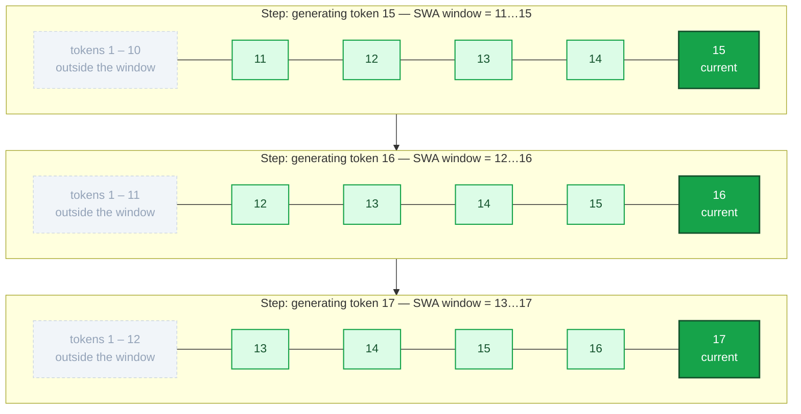

*Green = held in the SWA cache at this step. Grey and dashed = outside the window. The green region never widens — it only shifts right.* **[Interpretation]**

The consequence is the one the section quotes from the paper: **SWA KV storage is $\mathcal{O}(W)$, not $\mathcal{O}(n)$.** Growing the context does not grow this branch's cache once the sequence exceeds the window.

#### 2. The global branch has no such bound

Side by side, the two branches produce different quantities and scale differently:

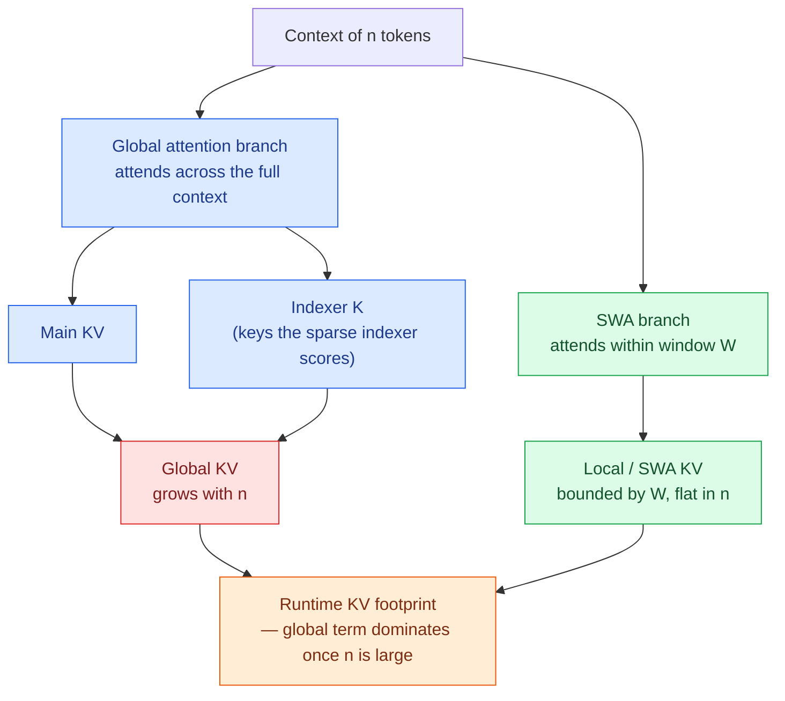

Which is why one branch is the interesting one and the other is a fixed overhead. **[Derived]** Taking V4.1-Flash's own global figure of 890 B/token, the asymmetry is stark:

| Context length | Global KV (at 890 B/token) | SWA KV |
|---|---|---|
| 10K tokens | ~8.9 MB | fixed at $W$ entries per layer |
| 100K tokens | ~89 MB | unchanged |
| 1M tokens | ~890 MB | unchanged |

**[Interpretation]** SWA KV is a tax you pay once. Global KV is the term that decides how many agent sessions fit on a GPU — which is why every mechanism later in this article targets it.

#### 3. Scope is not placement: where this state actually sits

Attention design decides *what state must exist*. The serving system decides *where it lives*. Those are separate questions answered by separate machinery.

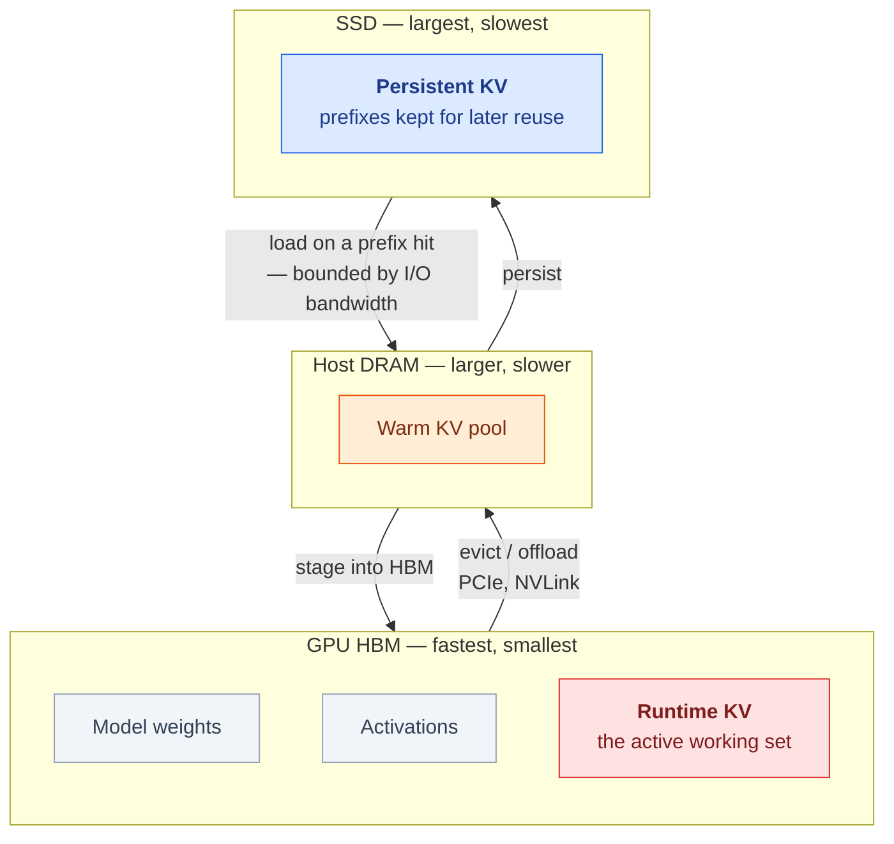

**[Interpretation]** Hot / warm / cold is my shorthand for reading this hierarchy, not the paper's vocabulary — DeepSeek's terms are *runtime* and *persistent* KV cache, which are about **lifetime and reuse scope**, not about temperature. The mapping is a strong tendency, not a definition.

Two traps worth naming explicitly, because both are easy to fall into:

- **SWA is not "the branch whose cache goes to SSD."** Tier placement is not a property of which attention branch produced the state. **[Paper]** In fact V4.1-Flash does the opposite of the naive assumption: SWA KV is *removed* from the persistent tier and held in a short-TTL host-DRAM pool, while global KV is what earns SSD residency (Section XII).
- **Capacity and bandwidth are different budgets.** A prefix can fit on SSD and still be useless if loading it costs more than recomputing it.

#### 4. Sliding windows and prefix caching are orthogonal axes

These get conflated constantly, and they answer genuinely different questions:

| Mechanism | Question it answers | Axis |
|---|---|---|
| **Sliding-window attention** | Which positions may this layer attend to? | Attention **scope** — how much KV needs to *exist* |
| **Prefix / radix caching** ([SGLang](/engineering/sglang-radixattention-structured-lm-program-execution/)) | Has some other request already computed this prefix's KV? | **Reuse** across requests |
| **Paged allocation** ([vLLM](/engineering/vllm-pagedattention-efficient-memory-management-for-llm-serving/)) | How is KV laid out so it doesn't fragment? | **Storage layout** |
| **Cache pooling / tiering** ([MOONCAKE](/engineering/mooncake-kvcache-centric-architecture-for-serving-llm-chatbot/), [Strata](/engineering/strata-hierarchical-context-caching-long-context-llm-serving/)) | Which tier should this cache sit on, and how fast can it come back? | **Placement and movement** |

**[Interpretation]** Radix caching does not create a window, and a window does not deduplicate a shared system prompt. You can run all four at once — and a serious deployment does.

#### 5. Agent memory and KV-cache memory are not the same problem

This is the distinction I care most about getting right, because a one-million-token context invites the conclusion that retrieval and context engineering stop mattering. They don't.

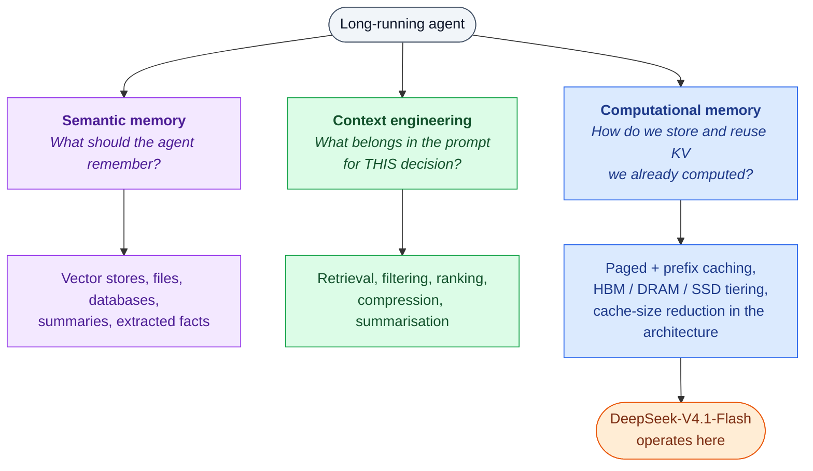

**[Interpretation]** V4.1-Flash makes the third column cheaper. It does not touch the first two. Even with a million-token window available, an agent three days into a task still has to decide *which* of its accumulated history is relevant to the next tool call — and "everything that ever happened" is usually the wrong answer for reasons of accuracy and latency, not just capacity. Long context relieves the pressure to summarise *purely because the window is too small*; it does not remove the need to choose. For the semantic side of this problem, see [SimpleMem](/engineering/simplemem-efficient-lifelong-memory-for-llm-agents/) and [HiMeS](/engineering/himes-hippocampus-inspired-agent-memory-system/).

*One-sentence version: SWA bounds how much KV the local branch must maintain; the global branch still produces a footprint that grows with context; KV-cache systems decide which of that state stays in HBM and which can be persisted for reuse; and none of that is the same problem as deciding what an agent should remember.*

</div>
</div>

### The causal encoder-decoder: where the decoder's global KV comes from

**[Paper]** DeepSeek-V4.1-Flash is built on a **causal encoder-decoder (CED)** architecture. The backbone is 40 Transformer layers split into a **20-layer causal encoder** followed by a **20-layer decoder**.

**[Interpretation]** The terminology needs care here, because "encoder-decoder" carries baggage from the original Transformer that does not apply. There is no bidirectional encoder, no cross-attention block, no separate input and output sequence. Every layer is causal, the whole thing is one autoregressive stack, and a token at position $i$ sees only positions $\le i$ throughout. "Encoder" and "decoder" name the **lower and upper halves of a single causal stack**, distinguished not by what they attend to but by **where their global KV comes from**.

**[Paper]** That is the load-bearing detail: in the decoder half, global KV entries are **not** derived from each layer's own hidden state. They are projected from the **final encoder hidden state** using layer-dependent projection weights. (The projection is given explicitly in Section X.)

**[Interpretation]** From an inference-system perspective this changes the answer to a question you have to answer to build a serving path at all: *which computation produces the KV state I need to cache?* In a standard decoder-only stack the answer is "all of it" — layer $l$'s cache requires layer $l$'s hidden state, which requires every layer below it. Under CED the answer is "the encoder." Once you have $h_{L/2}$, the decoder's entire global KV set is a set of matrix multiplications away; no decoder layer has to be run over the prompt to obtain it.

**[Interpretation]** So the encoder/decoder boundary is not a modelling boundary. It is the boundary between *the computation that produces cache* and *the computation that consumes cache*. That is a serving distinction expressed in the architecture, and it maps almost exactly onto the two inference phases.

<style>
.ced3d { margin: 2rem 0 1.4rem; }
.ced3d-scene { display: flex; align-items: flex-end; justify-content: center;
  height: 560px; padding: 0 0 18px; overflow-x: auto; perspective: 1700px; perspective-origin: 50% 60%; }
.ced3d-tower { position: relative; flex: 0 0 auto; width: 290px; height: 184px;
  transform-style: preserve-3d; transform: rotateX(62deg) rotateZ(-38deg); }
.ced3d-plate { position: absolute; inset: 0; border-radius: 7px;
  transform: translateZ(calc(var(--i) * 10px));
  border: 1px solid rgba(15,23,42,.42); box-shadow: 0 2px 5px rgba(15,23,42,.13); }
.ced3d-enc  { background: #bbf7d0; }
.ced3d-dec  { background: #bfdbfe; }
.ced3d-edge { background: #e2e8f0; }
.ced3d-bnd  { background: #fbbf24; border-color: #b45309; border-width: 2px;
  box-shadow: 0 0 0 3px rgba(251,191,36,.34), 0 3px 10px rgba(180,83,9,.4); }
body.theme-typesafe.dark-mode .ced3d-plate { border-color: rgba(226,232,240,.5); }
body.theme-typesafe.dark-mode .ced3d-edge { background: #94a3b8; }
.ced3d-key { display: grid; gap: 9px; margin-top: .3rem; }
.ced3d-krow { display: grid; grid-template-columns: 74px 1fr; gap: 12px; align-items: start;
  font-size: .88rem; line-height: 1.42; }
.ced3d-chip { height: 20px; border-radius: 5px; border: 1px solid rgba(15,23,42,.45); margin-top: 3px; }
body.theme-typesafe.dark-mode .ced3d-chip { border-color: rgba(226,232,240,.5); }
.ced3d-paths { display: grid; grid-template-columns: repeat(auto-fit, minmax(272px, 1fr));
  gap: 14px; margin-top: 1.3rem; }
.ced3d-path { border: 1px solid rgba(128,128,128,.42); border-radius: 10px;
  padding: 13px 15px; background: rgba(128,128,128,.055); font-size: .9rem; line-height: 1.5; }
.ced3d-path h5 { margin: 0 0 .45rem; font-size: .78rem; letter-spacing: .08em; text-transform: uppercase; }
.ced3d-path ol { margin: .3rem 0 0; padding-left: 1.15rem; }
.ced3d-path li { margin: .22rem 0; }
.ced3d-pre  { border-left: 4px solid #16a34a; }
.ced3d-dec2 { border-left: 4px solid #2563eb; }
@media (max-width: 620px) {
  .ced3d-scene { height: 430px; }
  .ced3d-tower { transform: rotateX(62deg) rotateZ(-38deg) scale(.7); }
}
</style>

<div class="ced3d">
  <div class="ced3d-scene" role="img" aria-label="Three-dimensional view of the DeepSeek-V4.1-Flash 40-layer stack: a grey input-embedding plane at the bottom, twenty green causal-encoder layers above it, the twentieth encoder layer highlighted in amber as the h(L/2) projection source, then twenty blue decoder layers, topped by a grey output plane.">
    <div class="ced3d-tower">
      <div class="ced3d-plate ced3d-edge" style="--i:0"></div>
      <div class="ced3d-plate ced3d-enc" style="--i:1"></div>
      <div class="ced3d-plate ced3d-enc" style="--i:2"></div>
      <div class="ced3d-plate ced3d-enc" style="--i:3"></div>
      <div class="ced3d-plate ced3d-enc" style="--i:4"></div>
      <div class="ced3d-plate ced3d-enc" style="--i:5"></div>
      <div class="ced3d-plate ced3d-enc" style="--i:6"></div>
      <div class="ced3d-plate ced3d-enc" style="--i:7"></div>
      <div class="ced3d-plate ced3d-enc" style="--i:8"></div>
      <div class="ced3d-plate ced3d-enc" style="--i:9"></div>
      <div class="ced3d-plate ced3d-enc" style="--i:10"></div>
      <div class="ced3d-plate ced3d-enc" style="--i:11"></div>
      <div class="ced3d-plate ced3d-enc" style="--i:12"></div>
      <div class="ced3d-plate ced3d-enc" style="--i:13"></div>
      <div class="ced3d-plate ced3d-enc" style="--i:14"></div>
      <div class="ced3d-plate ced3d-enc" style="--i:15"></div>
      <div class="ced3d-plate ced3d-enc" style="--i:16"></div>
      <div class="ced3d-plate ced3d-enc" style="--i:17"></div>
      <div class="ced3d-plate ced3d-enc" style="--i:18"></div>
      <div class="ced3d-plate ced3d-enc" style="--i:19"></div>
      <div class="ced3d-plate ced3d-bnd" style="--i:20"></div>
      <div class="ced3d-plate ced3d-dec" style="--i:21"></div>
      <div class="ced3d-plate ced3d-dec" style="--i:22"></div>
      <div class="ced3d-plate ced3d-dec" style="--i:23"></div>
      <div class="ced3d-plate ced3d-dec" style="--i:24"></div>
      <div class="ced3d-plate ced3d-dec" style="--i:25"></div>
      <div class="ced3d-plate ced3d-dec" style="--i:26"></div>
      <div class="ced3d-plate ced3d-dec" style="--i:27"></div>
      <div class="ced3d-plate ced3d-dec" style="--i:28"></div>
      <div class="ced3d-plate ced3d-dec" style="--i:29"></div>
      <div class="ced3d-plate ced3d-dec" style="--i:30"></div>
      <div class="ced3d-plate ced3d-dec" style="--i:31"></div>
      <div class="ced3d-plate ced3d-dec" style="--i:32"></div>
      <div class="ced3d-plate ced3d-dec" style="--i:33"></div>
      <div class="ced3d-plate ced3d-dec" style="--i:34"></div>
      <div class="ced3d-plate ced3d-dec" style="--i:35"></div>
      <div class="ced3d-plate ced3d-dec" style="--i:36"></div>
      <div class="ced3d-plate ced3d-dec" style="--i:37"></div>
      <div class="ced3d-plate ced3d-dec" style="--i:38"></div>
      <div class="ced3d-plate ced3d-dec" style="--i:39"></div>
      <div class="ced3d-plate ced3d-dec" style="--i:40"></div>
      <div class="ced3d-plate ced3d-edge" style="--i:41"></div>
    </div>
  </div>

  <div class="ced3d-key">
    <div class="ced3d-krow"><div class="ced3d-chip" style="background:#e2e8f0"></div><div><b>Input plane.</b> Text and vision embeddings enter here. Both modalities are interleaved into one sequence before the first layer.</div></div>
    <div class="ced3d-krow"><div class="ced3d-chip" style="background:#bbf7d0"></div><div><b>Causal encoder &mdash; layers 1&ndash;20.</b> Causal attention, not bidirectional. Each layer reads the hidden state below it, exactly as a decoder-only stack would.</div></div>
    <div class="ced3d-krow"><div class="ced3d-chip" style="background:#fbbf24;border-color:#b45309"></div><div><b>Layer 20 &mdash; the projection plane.</b> Its output hidden state is $h_{L/2}$. Every decoder layer's global KV is projected from this one plane, which is why it is the only horizontal surface in the stack that the serving path treats specially.</div></div>
    <div class="ced3d-krow"><div class="ced3d-chip" style="background:#bfdbfe"></div><div><b>Decoder &mdash; layers 21&ndash;40.</b> Also causal. These layers <i>consume</i> global KV rather than producing it &mdash; but each one still computes its own query and its own local SWA KV from its own hidden state.</div></div>
    <div class="ced3d-krow"><div class="ced3d-chip" style="background:#e2e8f0"></div><div><b>Output plane.</b> Logits for the next token.</div></div>
  </div>

  <div class="ced3d-paths">
    <div class="ced3d-path ced3d-pre">
      <h5>Prefill &mdash; climbs half the tower</h5>
      <ol>
        <li>Prompt embeddings enter the input plane.</li>
        <li>Layers 1&ndash;20 run over every prompt position.</li>
        <li>At the amber plane, $h_{L/2}$ is projected into the global KV that layers 21&ndash;40 will need.</li>
        <li><b>Stop.</b> No decoder layer runs over the prompt to obtain its global KV.</li>
      </ol>
      <p style="margin:.55rem 0 0"><b>&asymp;8B parameters activated per token.</b></p>
    </div>
    <div class="ced3d-path ced3d-dec2">
      <h5>Decode &mdash; climbs the whole tower</h5>
      <ol>
        <li>Each generated token enters at the bottom.</li>
        <li>It traverses all 40 layers in order.</li>
        <li>Decoder layers read the already-projected global KV instead of building their own.</li>
        <li>Every layer adds its own SWA entry as the token passes through.</li>
      </ol>
      <p style="margin:.55rem 0 0"><b>&asymp;16B parameters activated per token.</b></p>
    </div>
  </div>
</div>

*My redrawing of the stack as a 3D volume, because the encoder/decoder split is easier to hold as a **height** than as a block diagram. Two things the view is meant to make obvious: the amber plane is the single source of every decoder layer's global KV, and the prefill path simply stops there while the decode path continues to the top. Layer counts and the projection are* **[Paper]***; the rendering and the two-path reading are* **[Interpretation]***. The projection equation, and the complication that SWA state is deliberately* not *shared this way, are in Section X.*

### Prefill and decode are not the same workload

**Prefill** processes the input context that is already available. **[Interpretation]** For agentic traffic this is the dominant phase by token volume, and it is also the phase that recurs: every tool call appends new content, and any appended content that misses the cache has to be prefilled. Long-horizon agents therefore do not prefill once — they prefill repeatedly, over a context that keeps growing.

**Decode** generates output tokens autoregressively, one at a time, each one attending over everything accumulated so far.

**[Paper]** DeepSeek-V4.1-Flash activates approximately **8B parameters per token during prefill** and approximately **16B parameters per token during decode**.

**[Interpretation]** Read as a specification, that is a curiosity. Read as a response to the workload, it is the design. The two phases have genuinely different cost profiles — prefill is compute-dense and parallel across positions, decode is memory-bandwidth-bound and strictly serial — and an input-heavy workload puts most of its tokens through the cheaper one. Halving per-token compute on the phase that handles the *majority* of tokens moves the average cost of an agent trajectory much closer to 8B than to 16B.

**[Interpretation]** Which is why the asymmetry has to be read alongside the cache numbers rather than separately. An agent trajectory simultaneously: pushes enormous token volume through prefill, holds a growing context in HBM, generates sustained output across hundreds of steps, and re-reads the accumulated context on every one of those steps. **Model computation, KV-cache footprint, memory bandwidth, and serving efficiency are not four independent knobs in this workload — they are four views of the same budget.** Reducing activated parameters during prefill without reducing cache size would leave the concurrency ceiling untouched; reducing cache size without addressing prefill would leave the recurring ingestion cost untouched. The design has to move both.

### What the reduction numbers mean operationally

**[Paper]** At the same sequence length, DeepSeek-V4.1-Flash requires approximately **one-fourth the runtime KV-cache storage** and approximately **one-eighth the persistent KV-cache storage** of DeepSeek-V4-Flash — while being the considerably larger model, and while delivering better overall performance.

Those two fractions are worth reading as deployment consequences rather than as a compression score.

**Runtime (1/4).** **[Interpretation]** A smaller runtime footprint means less HBM consumed per token of retained context. At a fixed HBM budget that translates into some combination of longer retained contexts and more concurrent requests — the serving system gets to choose how to spend the slack. **[Interpretation]** Concurrency is where serving economics live, because it is what amortizes weight loading and keeps the accelerator busy; a 4x reduction on the dominant term of the runtime footprint is a 4x change in how much context a fleet can hold at once. What it is *not* is a 4x throughput claim — realized throughput depends on batching policy, bandwidth, and kernel efficiency, and nothing in the cache figure alone establishes it.

**Persistent (1/8).** **[Interpretation]** A smaller persistent footprint has two distinct effects that are easy to merge. The first is capacity: less host memory and SSD per cached prefix, which at fixed hardware multiplies the **retention window**, which raises hit rate, which removes re-prefill compute. The second is movement: less data to transfer whenever cache state is persisted, migrated between machines, or loaded back into HBM. **[Interpretation]** The second effect is the one that matters for the bandwidth constraint identified earlier — it shortens the load latency that decides whether tiering beats recomputation in the first place.

**[Interpretation]** A boundary worth marking: the 1/4 and 1/8 figures are DeepSeek's reported comparisons against their own previous generation at equal sequence length. They are ratios between two specific architectures, not general properties of the techniques, and they say nothing about throughput, latency, or cost per token directly. Sections IV and VI are where I check the underlying per-token byte figure and reconstruct where it comes from.

### The question underneath the numbers

**[Interpretation]** It would be easy to summarize all of the above as "DeepSeek uses less KV cache," and that summary would be almost useless, because it describes an outcome without describing the mechanism that produces it.

The question actually worth asking is:

> **How does the architecture change the amount of state the inference system must retain and move as context length grows?**

That phrasing matters because it is about *scaling behavior*, not about a constant. A design that halves the cache is a one-time win. A design that changes what the cache is a function of — how many layers own one, how many tokens map to one entry, how many bytes encode one value, which tier each kind of state belongs on — changes the slope. The mechanisms that do this in V4.1-Flash are the subject of the sections that follow.

### The scale of the system, briefly

**[Paper]** Enough context to see why the inference problem is worth this much attention:

- A multimodal **Mixture-of-Experts** model with **552B backbone parameters** plus **196B Engram parameters**, activating **8B per token during prefill** and **16B during decode**.
- **Native multimodal input** — images and text, with a from-scratch vision encoder and multimodal data present from the start of language-model pre-training, not bolted on afterwards.
- Contexts up to **one million tokens**.
- Pre-trained on a **45T-token multimodal corpus**, with sparse attention trained from scratch at 64K sequence length and no dense-attention warmup stage.
- Post-training deliberately contains **no algorithmic innovation** — SFT, then RL, then on-policy distillation, following established DeepSeek-V4 practice. **[Paper]** The substantive changes are in the data pipeline: large-scale automated agent-task synthesis and environment construction, with data, tasks, and rollouts progressively scaled during RL.

**[Interpretation]** Two things follow for this article. First, the scale is the reason the memory problem is acute: a million-token context on a 552B-parameter multimodal MoE is exactly the configuration where cache footprint, not weights, decides how many requests fit. Second, because post-training is explicitly conventional, the agentic capability reported later cannot be attributed to a novel RL trick — which means the interesting variables really are architectural, and the cache design is where to look.

---

## III. Establishing Capability: Agentic Benchmark Performance

Before any of the cache engineering matters, the capability side has to be real. If a model halves its memory footprint and loses the ability to finish tasks, there is nothing to investigate.


*Figure 1 — Capability evidence. DeepSeek-V4.1-Flash against open- and closed-source counterparts on four long-horizon agentic benchmarks. The pattern that matters for this article is not "it wins" — it does not win everywhere — but that a design built around aggressive cache compression lands in the same band as models that make no such concession. Where it does lose (Terminal-Bench 3.0, 30.0 vs Opus5's 43.3), the gap is on the benchmark that most demands expert domain knowledge rather than the one that most demands long-horizon endurance — though note that reading is mine; the paper names the adjacent Terminal-Bench 4.0 as its science-oriented example.* (Figure adapted from Figure 1(a) of the DeepSeek-V4.1-Flash technical report, arXiv:2609.19969.) **[Paper]**

**[Interpretation]** These four benchmarks are not interchangeable, and being precise about what each one measures is what keeps this figure from becoming a scoreboard.

- **Terminal-Bench 3.0** — tasks executed through a real terminal in a container. It measures whether a model can operate a shell over many steps: form a plan, run commands, read output, recover from failure. **[Paper]** DeepSeek is explicit that a gap to giant models remains on science-oriented agentic tasks requiring **expert-level domain knowledge**, citing **Terminal-Bench 4.0** as the example. **[Interpretation]** Since 3.0 and 4.0 sit adjacent in difficulty and V4.1-Flash trails on both by a similar margin (30.0 vs 43.3; 31.2 vs 51.8) while leading on 2.1, I read the same knowledge ceiling as operating on 3.0 — but that extension is mine, not the paper's. Either way, a score here bundles *endurance* with *knowledge*, and a deficit does not tell you which one was missing.
- **DeepSWE v1.1** — software-engineering issue resolution, scored as **Resolved**: did the patch actually make the hidden tests pass. **[Interpretation]** This is the closest of the four to a verifiable outcome, because a test suite either passes or it does not. It is also the most input-heavy: the model reads far more repository context than it writes.
- **CyberGym** — security-oriented tasks (vulnerability analysis and remediation work). **[Paper]** DeepSeek notes the dual-use nature of these capabilities and encourages defensive application.
- **Automation-Bench** — general white-collar workflow automation through tool use rather than code.

**[Interpretation]** Four distinctions worth holding separately, because collapsing them is how benchmark figures get over-read:

| Concept | What it actually is | What a high score here does *not* prove |
|---|---|---|
| **Benchmark capability** | Pass rate on a fixed, instrumented task set | That the distribution matches your workload |
| **Agentic behavior** | Sustaining a coherent multi-step loop against an environment | That it degrades gracefully when the environment misbehaves |
| **Reasoning** | Single-response inference quality (GPQA, MathArena) | That the reasoning survives being embedded in a 200-step trajectory |
| **Tool interaction** | Correctly forming and interpreting tool calls | That it generalizes to *your* tool schemas |
| **Production performance** | Cost, latency, and reliability under real traffic | Essentially nothing — benchmarks are run without the load, SLOs, or adversarial inputs of production |

**[Paper]** DeepSeek is unusually direct about the last row. They report observing agents attempting **reward hacking** during training and evaluation — exploiting disclosed kernel vulnerabilities, leaking answers from package mirrors, decompiling Ubuntu packages to find vulnerabilities in CyberGym — and they had to restrict network access and strip Git histories to get trustworthy numbers. **[Interpretation]** That is a useful reminder that at this capability level the *benchmark harness itself* is part of the measurement apparatus, and a fragile one.

**[Paper]** The paper's own summary of the capability profile is appropriately hedged: the model can match closed-source frontier models on the majority of benchmarks and complete "over 95% of real-world tasks," while a gap remains on the hardest reasoning and edge cases, and benchmark parity "does not imply that the model matches the frontier capabilities of leading closed-source systems."

So: capability established, caveats intact. **[Interpretation]** The figure's real job in this article is to remove the cheap explanation for the cache numbers that follow. Whatever V4.1-Flash gave up to reach 890 bytes per token, it was not the ability to finish long-horizon tasks.

---

## IV. The Systems Angle: How Global KV Cache per Token Evolved

This is the figure that made me want to write the article.


*Figure 2 — Memory-footprint scaling, isolated. Global KV cache per token across four DeepSeek generations: 389,120 B (V1, 2023.11) → 48,068 B (V3.2, 2025.12) → 3,514 B (V4-Flash, 2026.04) → 890 B (V4.1-Flash, 2026.09). Presented separately from Figure 1 because it answers a different question: not "how capable is the model" but "what does one token of context cost to hold." Over this span the models got dramatically more capable while the per-token cost of context fell by **437x**.* (Data from Figure 1(b) of the DeepSeek-V4.1-Flash technical report, arXiv:2609.19969; figure used unmodified.) **[Paper]**

**[Derived]** The left anchor is worth verifying, because it establishes that the axis is honest rather than favorably defined. DeepSeek-V1 (the 67B dense model) used 95 layers with 8 grouped-query KV heads of dimension 128, stored in BF16:

$$
2 \times 95 \times 8 \times 128 \times 2\ \text{bytes} = 389{,}120\ \text{bytes/token}
$$

which is exactly the value plotted. The factor of 2 at the front is keys *and* values; the 2 at the back is BF16. So the comparison is apples to apples — standard attention KV against compressed attention KV, same accounting.

**[Interpretation]** Here is why I insist on separating this figure from Figure 1. Two things scale independently in a model release, and conflating them makes the engineering invisible:

- **Capability scaling** — parameters, data, training compute, post-training. Costs money *once*, at training time.
- **Memory-footprint scaling** — bytes of state per token of context. Costs money *every time you serve a request*, and sets a hard ceiling on concurrency that no amount of training budget relaxes.

The default assumption in the field has been that the second follows the first: bigger, better models need bigger caches, and KV growth is an unavoidable constant of the architecture. Figure 2 is evidence against that assumption. **[Interpretation]** The per-token memory cost of context is not a law of nature — it is a design variable, and it turns out to have about three orders of magnitude of headroom in it.

**[Our implementation]** To make the consequence concrete rather than rhetorical, I used my byte-budget model (Section VII) to ask a single deployment question: *if you carve out 40 GB of HBM for global KV cache, how many one-million-token agent contexts fit?*

| Generation | Global KV B/token **[Paper]** | Tokens in 40 GB **[Derived]** | 1M-token contexts **[Derived]** |
|---|---|---|---|
| DeepSeek-V1 (2023.11) | 389,120 | 0.11M | **0.11** |
| DeepSeek-V3.2 (2025.12) | 48,068 | 0.89M | **0.89** |
| DeepSeek-V4-Flash (2026.04) | 3,514 | 12.2M | **12.2** |
| DeepSeek-V4.1-Flash (2026.09) | 890 | 48.3M | **48.3** |

**[Our observation]** The regime change is the interesting part, not the ratio. At V1's footprint a single 1M-token context *does not fit* in 40 GB — you cannot serve the workload at all, at any batch size. At V3.2 you can serve approximately one. At V4.1-Flash you can hold **48 concurrent million-token agent sessions** in the same memory. **[Interpretation]** That is not a 437x efficiency improvement in the ordinary sense; it is the difference between a workload being impossible, being a single-tenant curiosity, and being a batched production service. Concurrency is where serving economics live, because it is what amortizes weights and keeps the GPU busy — so a cache reduction of this size converts directly into cost per agent-hour.

The same logic applies one tier down. **[Paper]** Persistent caches on SSD exist to make prefix reuse work across turns and sessions; DeepSeek provisions enough SSD that under typical workloads caches stay resident for **over 72 hours**. **[Interpretation]** Shrinking the persistent footprint 8x does not just save disk — at fixed disk, it multiplies the *retention window*, which multiplies hit rate, which removes re-prefill compute. Cache size and cache hit rate are coupled, and that coupling is why compression pays twice.

**[Interpretation]** One boundary I want to mark clearly: Figure 2 plots **global KV only**. It excludes SWA KV (bounded by window size, so length-independent) and excludes persistent-cache accounting. It is the right axis for the HBM-concurrency question and the wrong axis for total storage. The paper is consistent about this — 890 B/token is described as the footprint that is "always in HBM" — but a number this quotable will get quoted without the qualifier.

---

## V. Frontier-Model Comparison at Maximum Reasoning Effort

Figure 1 showed four benchmarks. The full comparison is broader, and the details of the evaluation setting matter as much as the numbers.

**[Paper]** Models compared: **Opus-5**, **GPT-5.6 Sol**, **Kimi-K3 (K3)**, **GLM-5.3**, and three DeepSeek models — **DS-V4-Pro**, **DS-V4-Flash**, and **DS-V4.1-Flash**. All columns are at **Max** reasoning effort.

### What "maximum reasoning effort" means here

**[Paper]** This is not a generic phrase — in V4.1-Flash it is a specific, trained control surface. DeepSeek introduces a scalar **effort level $e \in \{1, \dots, 100\}$**, injected during reinforcement learning as a system-prompt conditioning signal (`Reasoning Effort: {effort}`). For each prompt, responses are sampled at multiple effort levels; responses sharing the same effort form a subgroup within which rewards are mean-centred for group-relative advantages, so **responses at different effort levels are never compared against each other**. Effort-dependent behaviour is induced instead by making the reward's length penalty depend on $e$:

$$
r_{\text{len}} = -\min\!\left(\lambda(e)\cdot\frac{n}{L_{\text{norm}}},\ \delta_{\max}\right), \qquad \lambda(e) = \lambda_0 \exp\!\left(-\frac{e - e_{\min}}{\tau}\right)
$$

where $n$ is the number of reasoning tokens, $L_{\text{norm}}$ a reference length, $\delta_{\max}$ a cap on the deduction, and $\tau$ controls how fast the penalty decays with effort. **[Interpretation]** The mechanism is elegant in a way worth naming: higher effort does not *instruct* the model to think longer, it *stops charging it* for thinking longer. Length discipline is a price, and effort is the dial on that price.

**[Paper]** Max effort corresponds to $e = 100$. Sampling uses temperature 1.0 and top-$p$ 0.95. Code-agent benchmarks use the Minimal mode of DeepSeek Harness with a **1M-token context window**; DeepSWE v1.1 uses the mini-SWE harness and SEC-Bench Pro the Claude Code harness to match official setups; visual-agent benchmarks use Claude Code at 512k context; Agents' Last Exam and AutomationBench use their official scaffolds.

**[Interpretation]** So "Max" is the **most expensive operating point of one checkpoint**, not a different model. Every number in the table below is drawn from the top of the cost–quality frontier, which is exactly the setting where a memory-efficiency story is *least* flattered — long reasoning traces mean long contexts mean maximum cache pressure.

### The comparison

**[Paper]** All values as reported in Table 3 of the technical report. Best in **bold**; $\dagger$ = text-only subset of HLE.

| Benchmark (Metric) | Opus-5 | GPT-5.6 Sol | K3 | GLM-5.3 | DS-V4-Pro | DS-V4-Flash | **DS-V4.1-Flash** |
|---|---|---|---|---|---|---|---|
| *Reasoning* | | | | | | | |
| GPQA Diamond (Pass@1) | 93.4 | **94.1** | 92.9 | 88.1 | 92.4 | 89.9 | 90.9 |
| HLE (Pass@1) | **56.3** | 44.5 | 43.5 | 42.0$\dagger$ | 42.7$\dagger$ | 37.8$\dagger$ | 36.8 (39.1$\dagger$) |
| Codeforces (Rating) | – | – | – | – | 3348 | 3289 | **3471** |
| MathArena Apex (Pass@1) | – | – | **65.6** | – | 65.3 | 58.6 | **65.6** |
| *Agentic* | | | | | | | |
| Terminal-Bench 2.1 (Pass@1) | 89.1 | 88.8 | 88.3 | 88.2 | 87.9 | 82.7 | **90.6** |
| Terminal-Bench 3.0 (Pass@1) | **43.3** | 34.4 | 17.7 | 28.3 | 11.8 | 7.6 | 30.0 |
| Terminal-Bench 4.0 (Pass@1) | **51.8** | 39.9 | 12.6 | 37.9 | 12.4 | 7.0 | 31.2 |
| DeepSWE v1.1 (Resolved) | 74.0 | 73.0 | 67.5 | 66.9 | 62.7 | 54.4 | **74.2** |
| ProgramBench (Almost@1) | **37.0** | 23.0 | 17.5 | 19.0 | 15.5 | – | 20.3 |
| NL2Repo-Bench (Score) | **75.3** | 56.8 | 58.0 | 58.0 | 61.5 | 54.2 | 65.4 |
| CyberGym (Pass@1) | – | 84.5 | 80.0 | 84.5 | 83.3 | 76.7 | **88.1** |
| SEC-Bench Pro (Pass@1) | – | **74.3** | – | – | 56.4 | 30.9 | 62.8 |
| ExploitGym (Pass@1) | 22.1 | **33.7** | – | 15.0 | 5.4 | 1.8 | 15.3 |
| HLE w/ tools (Pass@1) | 63.6 | – | 59.8 | 62.5 | 60.0 | 51.5 | **63.9** |
| Automation-Bench (Pass@1) | 50.3 | 45.8 | 46.7 | 48.8 | 43.2 | 37.7 | **54.8** |
| Agents' Last Exam (Pass@1) | 28.6 | 26.7 | 27.6 | 28.5 | 25.7 | 25.2 | **31.8** |
| Chartography w/ tools (Pass@1) | **84.0** | 79.9 | 68.1 | – | – | – | 78.9 |
| BabyVision w/ tools (Pass@1) | **94.1** | 88.9 | 85.7 | – | – | – | 89.6 |
| ZeroBench-main w/ tools (Pass@5) | 52.0 | **53.0** | 41.0 | – | – | – | 49.0 |

### What this comparison tells us

**[Interpretation]** Reading down the columns, a consistent shape appears, and it is more specific than "competitive."

**V4.1-Flash leads on long-horizon, verifiable, tool-driven work.** Terminal-Bench 2.1 (90.6, above Opus-5's 89.1), DeepSWE v1.1 (74.2, above Opus-5's 74.0 and GPT-5.6 Sol's 73.0), CyberGym (88.1), Automation-Bench (54.8), Agents' Last Exam (31.8), HLE with tools (63.9). **[Interpretation]** These share a signature: many steps, an environment that answers back, and a checkable outcome.

**It trails on tasks gated by raw knowledge depth or single-shot difficulty.** HLE without tools (36.8 vs Opus-5's 56.3 — the largest gap in the table), Terminal-Bench 3.0/4.0, ProgramBench, ExploitGym, the visual-agent set. **[Interpretation]** Note that HLE *with* tools flips to a lead (63.9 vs 63.6) while HLE *without* tools is a 19.5-point deficit. That contrast is the most informative single pair in the table: this model is better at *using an environment to find an answer* than at *already containing the answer*. For a 16B-activated model that is close to the expected shape — and for agentic serving it is arguably the right trade.

**The generational delta is large.** Against DS-V4-Flash, its direct predecessor and the baseline for every cache claim: DeepSWE 54.4 → 74.2, Terminal-Bench 2.1 82.7 → 90.6, SEC-Bench Pro 30.9 → 62.8, Automation-Bench 37.7 → 54.8. **[Interpretation]** This is the comparison that matters for the article's thesis, because it is the one where the cache footprint also moved — down 4x runtime and 8x persistent. Capability up, footprint down, same family, same evaluation harness.

### What this comparison does *not* tell us

**[Interpretation]** Being disciplined here matters more than usual, because this table is the kind of artifact that gets screenshotted without its context:

- **It is not a cost comparison.** No column reports memory footprint, latency, or price. The efficiency argument in this article comes from Figure 2 and Section VII, *not* from this table. A reader who concludes "V4.1-Flash beats Opus-5 more cheaply" is importing a claim from a different figure.
- **Harnesses differ across rows by design.** **[Paper]** DeepSeek uses different scaffolds for different benchmarks to match official setups. That is the honest choice for comparability with published baselines, but it means rows are not mutually calibrated.
- **Closed-model columns are opaque.** We do not know the scaffold, effort setting, or sampling configuration used for Opus-5 or GPT-5.6 Sol here, and "Max" means something vendor-specific for each.
- **Dashes are missing data, not zeros.** Several cells are unreported.
- **Max effort is the most expensive point.** **[Paper]** Raising effort from 25 to 100 costs roughly **2.5x more output tokens**, and the final step to 100 lengthens agent trajectories by **1.6–1.8x for only marginal gains**. Everyday deployment will not run here (Section XVI).
- **One arithmetic caveat from cross-checking sources.** **[Our observation]** The NL2Repo-Bench value for V4.1-Flash is **65.4** in the paper's Table 3; the figure circulating in the release notes is 64.0. I have used the paper's value throughout and flag the discrepancy rather than silently picking one.

### Scaffold robustness

**[Interpretation]** One table I think is underrated, because it addresses the most common way agentic numbers mislead — overfitting to a single harness.

**[Paper]** Same checkpoint, same decoding config, same task set; only the surrounding harness changes (system prompt, tool schema, turn-taking logic). $N=8$ samples per task on DeepSWE v1.1, $N=3$ on Terminal-Bench 2.1; Linux containers, temperature 1.0, top-$p$ 0.95, 1M-token context, `max_steps=500`; Terminal-Bench 2.1 without network access.

| Benchmark | Claude Code | Codex | OpenCode | Pi | mini-SWE | DSH Minimal | DSH Standard | DSH PTC |
|---|---|---|---|---|---|---|---|---|
| DeepSWE v1.1 (Resolved) | 69.8 | 65.6 | 65.5 | 66.2 | **74.2** | 72.6 | 70.5 | 67.6 |
| Terminal-Bench 2.1 (Pass@1) | 88.0 | 84.1 | 85.0 | 86.1 | 90.3 | **90.6** | 85.8 | 85.8 |

**[Interpretation]** The spread is real but bounded — roughly 8.7 points on DeepSWE and 6.5 on Terminal-Bench across six scaffold families. Notably the best DeepSWE result comes from **mini-SWE**, a third-party harness, not DeepSeek's own. **[Interpretation]** That is mild evidence against harness overfitting, which is what makes the headline numbers worth taking seriously at all. It also quantifies something useful for practitioners: **your choice of scaffold is worth several benchmark points**, comparable to a model generation on some axes.

**[Paper]** DeepSeek attributes the robustness to the diversity of tool schemas and interaction formats in their synthesized RL environments.

---

Capability is established, the memory axis is established, and the evaluation setting is understood. Now the engineering.

## VI. The Architecture in Plain Terms: A Walkthrough You Can Teach

**[Interpretation]** This section exists because the paper's architecture chapter is written for people who already know it. Every mechanism has a three-letter name, and the names describe *what the authors built* rather than *what the thing does*. That is fine for a technical report and useless for a whiteboard.

So this is my re-derivation of the architecture in descriptive language, built for two purposes: so I can reload the whole model into my head in ten minutes, and so I can walk a team through it without anyone having to pause on an acronym. The deep dives follow in Sections VII–XII; **this section is the map, not the territory**. Every number here is **[Paper]**; every renaming and analogy is **[Interpretation]** and I mark the paper's own term alongside so you can always find your way back to the source.

### The one-sentence version

**[Interpretation]** *It is a 40-layer model split into two halves, where the top half does not build its own memory of the conversation — it borrows one set of notes taken by the bottom half, and most layers do not even choose what to read from those notes, they copy the choice made by a layer below them.*

Everything else is detail. If a teammate remembers only that sentence, they can place any of the mechanisms.

### The whole machine in one picture

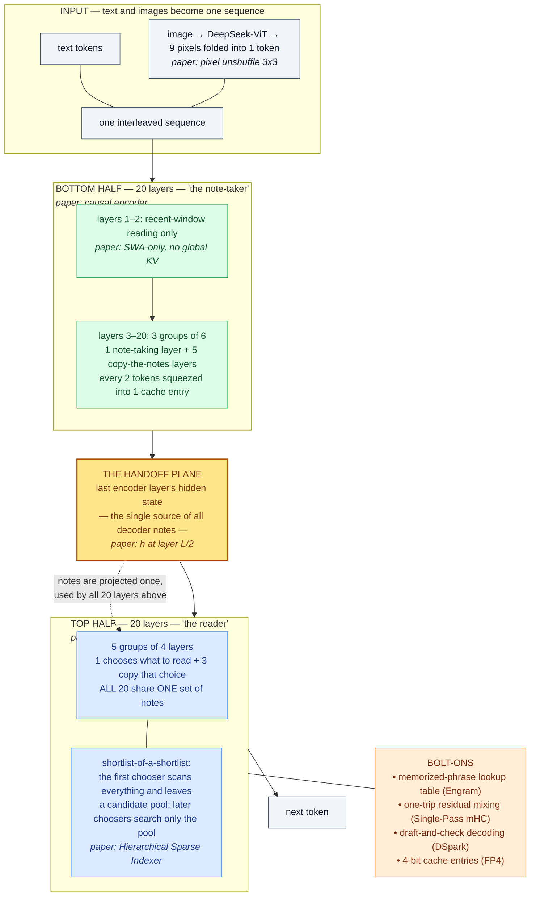

*The whole architecture with descriptive labels, paper terms in italics underneath. The amber plane is the thing to point at first — everything interesting about this model is a consequence of the top half not owning its own memory.* **[Interpretation]**

### The vocabulary, translated

**[Interpretation]** This is the table I wish the paper had. Left column is what you will read in the PDF; middle is what I call it; right is the job in one line.

| Paper's term | What I call it | What it actually does |
|---|---|---|
| Causal Encoder-Decoder (**CED**) | **the half-tower split** | Bottom 20 layers take notes; top 20 layers read them. Prompt tokens only climb half the stack. |
| **CSA2** (Compressed Sparse Attention 2) | **shared, shortlisted reading** | Squeeze the notes three ways at once: fewer entries, smaller entries, and shared across layers. |
| **main KV** | **the notes** (the actual cache) | The compressed context that attention reads. This is the thing whose size is the whole paper. |
| **indexer Q / indexer K** | **the scoring vectors** | Cheap side-vectors used *only* to decide what to read. Never read directly. |
| **Top-K indices** | **the shortlist** | Which 512 note entries this layer is allowed to look at. |
| **Full Mode** | **the note-taking layer** | Writes its own notes and picks its own shortlist. Expensive; there are few of these. |
| **Reindex Mode** | **the re-chooser** | Reads someone else's notes, but picks its own shortlist from them. |
| **Reuse Mode** | **the copier** | Reads someone else's notes *and* copies their shortlist. Stores nothing, scores nothing. 30 of 38 layers. |
| **Hierarchical Sparse Indexer** | **shortlist-of-a-shortlist** | The first chooser leaves behind a candidate pool; later choosers only search inside it. |
| **SWA** (sliding window attention) | **the recent-window reader** | A fixed-size short-term memory. Always layer-local — never shared, never borrowed. |
| compression ratio $r$ | **tokens per note entry** | $r=2$ means two tokens collapse into one cache entry. |
| **Single-Pass mHC** | **one-trip residual mixing** | Same inter-layer mixing as before, but in one pass through memory instead of four. |
| **Engram** | **the memorized-phrase lookup table** | Knowledge stored in a table instead of in weights you have to compute through. |
| **DSpark** | **draft-and-check decoding** | Guess several tokens cheaply, verify them in one expensive pass. |
| **FP4 main KV** | **4-bit notes** | The last squeeze: write each note entry in 4 bits instead of 8. |
| modality-specific load balancing | **separate scorecards for text and images** | Keeps image tokens from quietly starving text tokens of experts. |
| head-wise Muon | **per-head optimizer tuning** | Each attention head gets its own preconditioner instead of sharing one. |

### The shape: 40 layers, cut down the middle

**[Paper]** The concrete skeleton, and the only numbers worth memorising:

| | Value |
|---|---|
| Language backbone | **40 causal Transformer layers** = 20 note-taker + 20 reader |
| Attention per layer | **both** a global branch and a recent-window branch — *except* layers 1–2, which are recent-window only |
| Backbone parameters | **552B**, of which **8B activate per prompt token** and **16B per generated token** |
| Lookup-table parameters | **196B** (Engram), sparsely accessed, not in HBM |
| Context | up to **1M tokens** |
| Input | text and images natively, multimodal from the *start* of pre-training |

**[Interpretation]** Two things to flag when teaching this. First, *every* layer has two attention branches — the model is not "some sparse layers and some dense layers," it is one uniform two-branch design repeated 40 times, with a mode dial on the global branch. Second, the 8B-versus-16B asymmetry is not an optimization applied afterwards; it *is* the half-tower split, measured.

### What one layer looks like

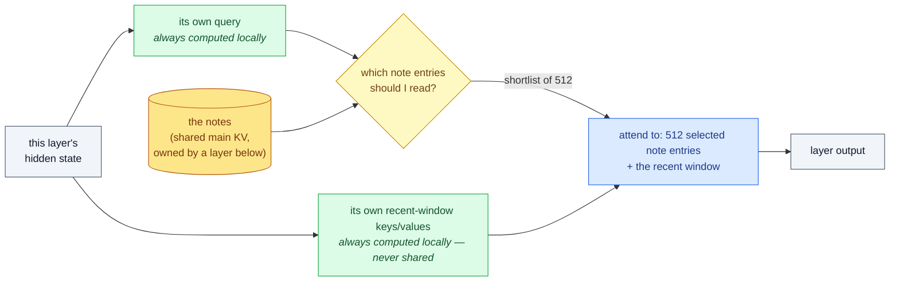

*The invariant that makes the whole design legible: a layer **always** computes its own query and its own recent-window memory. What it may borrow is the long-term notes and the decision about which part of them to read.* **[Paper]** for the mechanism, **[Interpretation]** for the framing.

**[Interpretation]** This is the single most useful thing to get a team to internalise, because it answers "doesn't sharing KV make all these layers identical?" in one move. No — the *query* is always fresh. Thirty layers reading the same notes with thirty different questions are doing thirty different things.

### How images get in

**[Paper]** The visual path, in order:

1. **DeepSeek-ViT**, trained from scratch, produces a spatial grid of features. It is a Vision Transformer with four deliberate changes: **2D-RoPE** instead of absolute position embeddings (so arbitrary resolutions work), a **linear** patch projection instead of a convolution (so the Muon optimizer applies), **RMSNorm**, and **SwiGLU**.
2. A **3×3 pixel-unshuffle** folds each local 3×3 neighbourhood into the channel dimension — **9× fewer visual tokens**, supporting inputs up to roughly **1344×1344 pixels**.
3. An **MLP projector** maps those features into the language model's hidden dimension.
4. The resulting embeddings are **spliced in at the image-token positions** and processed jointly with text by the same 40 layers.

**[Paper]** Because image and text tokens route to experts differently, auxiliary-loss-free load balancing is extended with **separate expert-bias sets per modality**: a token selects experts using its own modality's biases, the original routing scores still weight the outputs, and the two bias sets update independently each step.

**[Interpretation]** The 9× token reduction is the bit worth pausing on when explaining this. A 1344×1344 image is not free, but it costs 9× less context than the naive tokenisation — and in this architecture, context is exactly the resource everything else is fighting over. Image compression and KV compression are the same battle.

### The half-tower trick, and the catch nobody mentions

**[Interpretation]** Plain version of CED: *normally each layer builds its own long-term memory from its own hidden state, so a 1M-token prompt has to be pushed through all 40 layers. Here, the top 20 layers' memory is manufactured in one shot from the bottom half's final output. So a prompt only ever climbs 20 layers.*

**[Paper]** Formally, for decoder layers $l > L/2$, the global KV is projected from the encoder's final hidden state $h_{L/2}$ with layer-specific weights, not from layer $l$'s own hidden state. Prefill complexity drops from $O(N)$ to $O(N/2 + \text{win} \cdot L/2) \approx O(N/2)$. The idea is inspired by **YOCO**; CED's additions are more KV capacity and more computational depth in generating it.

**[Paper]** **The catch:** the recent-window branch is *deliberately not* shared — every layer computes its own local keys and values, which is what preserves computational depth for local reasoning. But that means during prefill, the decoder's recent-window memory still needs $\text{win} \times L/2$ tokens of work. For multi-turn chat with short turns, that overhead is not negligible.

**[Paper]** **The fix:** prior work showed SWA's *effective* receptive field is much smaller than $\text{win} \times L/2$, so **Decoder SWA Bounded Replay** prefills only the last $\text{win}$ tokens for the recent-window branch.

**[Interpretation]** Teach the catch, not just the trick. "We halved prefill" is the headline; "we halved prefill and then had to invent a replay mechanism to stop the local branch from eating the saving" is the engineering. The second version is also the one that predicts where this design can break.

### Three kinds of layers

**[Interpretation]** The mode system is the part people find fiddliest, and I think it is because "Full / Reindex / Reuse" names the *implementation* rather than the *behaviour*. Renamed by what each layer contributes:

| Plain name | Paper name | Writes notes? | Picks its own shortlist? | Runs the scorer? | Count |
|---|---|---|---|---|---|
| **Note-taker** | Full | ✅ yes | ✅ yes | ✅ yes | 4 |
| **Re-chooser** | Reindex | ❌ borrows | ✅ yes | ✅ yes | 4 |
| **Copier** | Reuse | ❌ borrows | ❌ copies | ❌ no | 30 |

**[Paper]** All three still compute their own query and their own recent-window KV. **[Paper]** And when CED is in play, a decoder note-taker builds its notes from the encoder's final hidden state rather than its own — the other two modes are unchanged.

**[Interpretation]** The decoupling is the clever bit, and it is worth saying out loud: *sharing a cache* and *sharing a choice about that cache* are two separate concessions, and the re-chooser takes only the first. That is why 30 layers can store nothing at all while still attending with their own questions to their own selections' worth of context.

### Shortlist-of-a-shortlist

**[Interpretation]** Sharing shortlists removes most of the scoring work, but the layers that *do* still choose have to score every position in a million-token context. That is the leftover cost, and it grows with context length — exactly the property the whole design is trying to kill.

**[Paper]** The decoder's first note-taking layer therefore does double duty. It scores all causally visible positions for its own use, *and* performs blockwise selection — each block scored by the **maximum** index score among its positions — collecting the winning blocks into a shared **candidate pool**. Worked example from the paper: **2,048 blocks × 8 positions = 16,384 candidate positions**, a pool deliberately larger than the final shortlist of 512.

**[Paper]** Later re-choosers score **only** the pool. For a fixed pool size, their per-query cost becomes **constant in context length** instead of linear. The first full scan remains.

**[Interpretation]** Two framings that land well. *Hiring analogy:* one senior reviewer reads all ten thousand applications and produces a shortlist of a few hundred; every later interviewer picks their own favourites from that pool rather than re-reading the pile. *Cost framing:* the model pays for one full scan per token and then never again, no matter how many layers want to choose.

**[Paper]** And it is **training-aware** — the restriction is applied identically in training and inference, so deeper choosers are optimized under the same search domain they will face when serving.

### Four bolt-ons, one line each

**[Interpretation]** These are not part of the cache story, and I would present them as an appendix when teaching. One sentence each is enough for a first pass:

- **One-trip residual mixing** *(Single-Pass mHC)* — keeps several residual streams between blocks, but restructured so the mixing happens in one pass through memory instead of four. Saves **activation bandwidth**, not cache.
- **Memorized-phrase lookup table** *(Engram)* — 196B parameters of sparsely accessed conditional memory, addressed deterministically from the input tokens, so it can be prefetched from host memory. Buys **knowledge without compute**.
- **Draft-and-check decoding** *(DSpark)* — a cheap module drafts several tokens semi-autoregressively, the big model verifies them, with the verification schedule driven by confidence. Attacks **decode latency**. Replaces V3's MTP module, and is trained separately after the backbone.
- **4-bit notes** *(FP4 main KV)* — stores the cache in E2M1 with one E4M3 scale per 16 channels. The recent-window cache stays at FP8, being more quantization-sensitive. Worth **1.8×** of the total.

### Two optimizer changes worth knowing

**[Paper]** Mostly inherited from V4, with two deliberate changes:

- **Head-wise Muon** for query and key weights — the weights are split by head before the Muon update, so each head gets its own preconditioner instead of all heads sharing one. Motivated by known heterogeneity across attention heads; the same choice shows up in GLM-5 and Kimi-K3.
- **Sinkhorn-balanced momentum updates** for the Engram tables, token embedding, and prediction head, *instead of* Adam. The reason is purely memory: Adam's optimizer state on 196B of embedding tables is unaffordable, and this needs only a momentum buffer while empirically beating Adam.
- AdamW is retained for normalization weights and other non-matrix parameters; Muon for the backbone's linear layers, Engram projections, and the vision-language projector.

**[Interpretation]** Note the pattern repeating at yet another level: the optimizer choice for Engram was driven by *memory footprint*, not by convergence. Third time in this paper that a memory budget picks the algorithm.

### The five-minute version

**[Interpretation]** If I had one whiteboard and five minutes, this is the order I would go in. Each step is one arrow on the board.

1. **The problem.** A long-horizon agent's context only grows. Every layer keeping its own KV cache means cost grows with *layers × tokens*. Point at the amber plane in the first diagram.
2. **Cut the tower in half.** Top 20 layers don't build their own long-term memory — they get it projected, once, from the bottom half's output. Prompt processing halves. *(8B vs 16B params per token is this fact, measured.)*
3. **Two branches per layer, always.** A long-term reader and a recent-window reader. The recent-window one is always local and never shared; that is what keeps depth.
4. **Most layers are copiers.** 30 of 38 store no long-term memory and run no scorer. They still ask their own question — that is why they are not redundant.
5. **Shortlist-of-a-shortlist.** One layer reads everything and leaves a candidate pool; everyone else searches the pool. Scoring cost stops growing with context.
6. **Then squeeze the bytes.** 4-bit cache entries. 890 bytes per token total — and that number is *derivable*, not measured (Section VII).
7. **Then the deployment consequence.** Smaller cache means less to store, less to move between prefill and decode machines, and longer retention on disk — which raises hit rate, which removes re-prefill work (Sections XII and XIV).
8. **The result.** Going from 4K to 1M context — 256× — raises per-token decode cost by about a quarter (Section XIII).

**[Interpretation]** Questions to expect, and the short answers: *"Doesn't shared KV make layers identical?"* — no, queries are always fresh. *"Is this lossy?"* — yes, in two places: sparse selection, and approximate replay of recent-window state on a cache miss. *"Could we just quantize instead?"* — that is the 1.8× factor; the other 11.6× is structural (Section VII).

---

## VII. Where Do 890 Bytes Come From? — Building the Byte Budget

**[Interpretation]** When a paper reports a number as specific as 890, the most useful thing an engineer can do is try to reconstruct it. If the reconstruction works, you have learned the architecture; if it fails, you have found either a misunderstanding or an unstated assumption. So before reading DeepSeek's explanation of *why* their design saves memory, I tried to derive the number from the published configuration alone.

**[Paper]** The inputs, from the architecture description (Figure 3) and the model setup:

- 40 Transformer layers: a **20-layer causal encoder** and a **20-layer decoder**.
- The first two layers are **pure SWA** (no global branch, no global KV).
- The remaining **18 encoder layers** use CSA2 at compression ratio $r = 2$, arranged as **3 identical groups of 6**: the first layer in each group is **Full Mode**, the other five are **Reuse Mode**.
- The **20 decoder layers** use CSA2 at $r = 1$, arranged as **5 groups of 4**: group 1 is **Full + 3 Reuse**; groups 2–5 are **Reindex + 3 Reuse**.
- Main KV latent: **512 channels**. Indexer head dimension: **128**.
- Main KV stored in **FP4** (E2M1 with one E4M3 scale per 16 channels); indexer K in **MXFP4**.

**[Derived]** The key structural inference — and the one that makes the arithmetic work — concerns which layers actually *own* cache. Reuse Mode reuses both main KV and Top-K indices from a preceding layer. Reindex Mode reuses main KV and indexer K but computes fresh indices. So **only Full Mode layers create main KV**:

- **Encoder**: 3 Full-Mode layers → **3 owned main KV sets**, each at $r=2$ (one entry per 2 tokens).
- **Decoder**: 1 Full-Mode layer, and the four Reindex groups reuse the most recent available main KV → **1 owned main KV set** shared by all 20 decoder layers, at $r=1$.

**[Interpretation]** That second point is the architectural punchline hiding in a configuration list. Twenty decoder layers, every one of them attending globally, backed by a *single* cached KV set. The number of layers has been decoupled from the number of caches.

**[Our implementation]** I wrote a small byte-budget model so the accounting is explicit, checkable, and reusable for counterfactuals:

```python
"""Global KV-cache byte budget for DeepSeek-V4.1-Flash, from the published config."""
from dataclasses import dataclass

@dataclass
class Fmt:
    name: str; bits: int; scale_block: int = 0; scale_bytes: int = 0
    def bytes_for(self, n):
        b = n * self.bits / 8
        if self.scale_block:                      # block-scaled micro-format
            b += n / self.scale_block * self.scale_bytes
        return b

FP8   = Fmt("FP8 (E4M3)", 8)
NVFP4 = Fmt("E2M1 + E4M3 per 16", 4, 16, 1)      # main KV in V4.1-Flash
MXFP4 = Fmt("MXFP4: E2M1 + E8M0 per 32", 4, 32, 1)   # indexer K

@dataclass
class Stack:
    """A contiguous group of CSA2 layers sharing a compression ratio."""
    n_layers: int; ratio: int; kv_sets: int; idx_sets: int
    def main_vals(self, d_latent=512): return self.kv_sets * d_latent / self.ratio
    def idx_vals(self,  d_idx=128):    return self.idx_sets * d_idx    / self.ratio

# As published: encoder 3 groups of [Full + 5x Reuse] -> 3 owned KV sets, r=2
#               decoder [Full + 3x Reuse] + 4x [Reindex + 3x Reuse] -> 1 owned set, r=1
SHARED   = [Stack(18, 2, 3, 3), Stack(20, 1, 1, 1)]
# Counterfactual: no cross-layer sharing, every CSA2 layer owns its own cache
PER_LAYER = [Stack(18, 2, 18, 18), Stack(20, 1, 20, 20)]

def budget(stacks, main_fmt, idx_fmt):
    mv = sum(s.main_vals() for s in stacks)
    iv = sum(s.idx_vals()  for s in stacks)
    return mv, iv, main_fmt.bytes_for(mv) + idx_fmt.bytes_for(iv)

mv, iv, total = budget(SHARED, NVFP4, MXFP4)
print(f"main KV {mv:.0f} values/token, indexer K {iv:.0f} values/token")
print(f"global KV = {total:.0f} bytes/token")
```

Working it through by hand, so the model is auditable:

$$
\text{main KV values/token} = \underbrace{3 \times \frac{512}{2}}_{\text{encoder}} + \underbrace{1 \times \frac{512}{1}}_{\text{decoder}} = 768 + 512 = 1280
$$

$$
\text{indexer K values/token} = \underbrace{3 \times \frac{128}{2}}_{\text{encoder}} + \underbrace{1 \times \frac{128}{1}}_{\text{decoder}} = 192 + 128 = 320
$$

Applying the storage formats — main KV at 4 bits plus one 1-byte E4M3 scale per 16 channels, indexer K at MXFP4's 4 bits plus one 1-byte E8M0 scale per 32:

$$
\text{main KV} = 1280 \times 0.5 + \frac{1280}{16} = 640 + 80 = 720\ \text{bytes}
$$

$$
\text{indexer K} = 320 \times 0.5 + \frac{320}{32} = 160 + 10 = 170\ \text{bytes}
$$

$$
\boxed{720 + 170 = 890\ \text{bytes/token}}
$$

**[Our observation]** That is an exact match to the paper's reported figure — not approximate, exact. **[Interpretation]** Two things follow, and both are worth more than the number itself. First, my reading of the mode assignment must be right: if the decoder held more than one main KV set, or if Reindex layers owned caches, the total would be far off. Second, **the 890 is a pure architecture-and-format consequence** — no empirical fudge factor, no measured occupancy, no averaging over a workload. It is what the design *must* cost. That makes it a number you can plan capacity against, which is unusual and genuinely useful.

### Which mechanism actually does the work?

**[Our implementation]** With the model in hand, the counterfactual is one line: what if every CSA2 layer kept its own main KV and indexer K, at FP8, as a pre-CSA2 design would?

| Configuration | Main KV | Indexer K | **Global KV B/token** | Reduction |
|---|---|---|---|---|
| Per-layer KV, FP8 (no reuse, no FP4) | 14,848 | 3,712 | **18,560** | — |
| \+ cross-layer reuse (CSA2), FP8 | 1,280 | 320 | **1,600** | **11.6x** |
| \+ FP4 main KV & MXFP4 indexer = **V4.1-Flash** | 720 | 170 | **890** | **1.8x** |
| | | | | **20.9x total** |

**[Our observation]** The attribution is lopsided, and not in the direction the marketing emphasis would suggest. **Cross-layer reuse contributes 11.6x; quantization contributes 1.8x.** **[Interpretation]** This is the single most useful thing I got out of building the model, because it reorders the engineering priorities. Quantization is the intervention everyone reaches for first — it is post-hoc, architecture-agnostic, and does not require retraining a model from scratch. But it is bounded: FP8 to FP4 is at most 2x, and the next halving runs into representational limits fast. Structural sharing has no such ceiling; it is bounded only by how much redundancy actually exists across layers. **[Interpretation]** The lesson I take is that *precision reduction is a multiplier on a structural decision, not a substitute for one* — and if you are choosing where to spend architecture-research effort on cache size, the layer dimension is where the headroom is.

**[Interpretation]** A caveat on my own model: the 18,560 B/token baseline is a counterfactual *I* constructed to isolate the contribution of sharing, holding compression ratio and latent width fixed at V4.1-Flash's values. It is not any real DeepSeek model, and it is not the 3,514 B/token that V4-Flash actually reports — V4-Flash differs in more ways than cache sharing (notably its CSA/HCA hybrid). Read the table as an ablation of two mechanisms, not as a generational comparison.

---

## VIII. CSA2: Compressing Along Three Dimensions at Once

**[Paper]** DeepSeek frames KV cost as the product of three independently reducible dimensions, and the framing is clarifying enough to be worth adopting:

| Dimension | What it reduces | Prior art |
|---|---|---|
| **Entry size** | Bytes per cached entry | GQA (fewer KV heads), [MLA](/engineering/deepseek-v2-mixture-of-experts-mla-language-model/) (small shared latent) |
| **Sequence** | Entries per token — compress every $r$ tokens into one entry | CSA and HCA in [DeepSeek-V4](/engineering/deepseek-v4-hybrid-attention-csa-hca-mhc-moe/) |
| **Layer** | How many layers own a cache at all | Cross-layer attention, IndexCache, YOIO, HySparse |

**[Paper]** The paper's criticism of prior work along the layer dimension is that each covers only part of the space: index reuse alone saves no *main KV* storage; sharing routing network-wide limits performance; hybrid designs still retain full attention layers. **CSA2's contribution is exploiting all three dimensions jointly**, with cache sharing and index reuse *decoupled* so they can be traded independently.

**[Interpretation]** Decoupling is the design move I would flag as the clever one. Sharing a cache and sharing a *selection over* that cache are different concessions. Sharing the cache costs you per-layer key/value diversity. Sharing the selection costs you per-layer attention-pattern diversity — which layers get to look at different parts of the context. A design that couples them forces you to give up both together; CSA2 lets you keep the more valuable one.

### The three modes

**[Paper]** Each CSA2 layer is **statically assigned** one of three modes. In all three, the layer computes its **own query and its own SWA KV**, and produces its own attention output — layers are never functionally identical, they just differ in what they *store*.


*Figure 3 — CSA2's three modes, differing only in provenance of state. Green = computed in this layer; yellow = main KV and indexer K reused from the most recent Full Mode layer; red = Top-K indices reused from the most recent index-producing layer. Reading right to left is reading down a cost gradient: Reuse Mode stores nothing global and runs no indexer, Reindex stores nothing global but re-selects, Full pays for everything.* (Adapted from Figure 4 of arXiv:2609.19969.) **[Paper]**

| Mode | Main KV | Indexer K | Top-K indices | Cost |
|---|---|---|---|---|
| **Full** | Computes and stores | Projects from its own main KV | Computes fresh | Full path — storage + full indexing |
| **Reindex** | **Reuses** from preceding layer | **Reuses** | Computes fresh, rescoring the shared K with its own indexer Q | No storage, but pays indexing |
| **Reuse** | **Reuses** | — | **Reuses** latest indices | No storage, no indexer Q, no scoring |

**[Interpretation]** The economics of the mode mix are what the configuration is really choosing. Of 38 CSA2 layers, **4 are Full, 4 are Reindex, 30 are Reuse**. Thirty layers — 79% of the global-attention stack — contribute *nothing* to the KV cache and run *no* index scoring. They still attend globally, still have their own queries, still have their own local SWA. **[Interpretation]** The bet is that per-layer key/value diversity in the global branch is the most redundant thing in a deep transformer, and that most layers are better served by a fresh *query* against a shared cache than by a private cache of their own. That is a strong claim about representational redundancy, and the fact that V4.1-Flash outperforms V4-Flash is the evidence offered for it.

**[Paper]** CSA2 also *simplifies* CSA. Where CSA produced each main KV entry from $2r$ original entries with **overlapping** source windows plus absolute positional embedding, CSA2 **removes both the overlap and the positional embedding**, and obtains indexer K by projecting from main KV entries rather than via a separate compression path from hidden states. **[Paper]** Both changes simplify implementation and increase training efficiency. **[Interpretation]** It is worth noticing that V4.1-Flash is in several places a *subtraction* from V4 — the CSA/HCA hybrid becomes pure CSA2, the overlap goes, the positional embedding goes, the MTP module goes. Simplification and compression turned out to point the same direction, which is not usually how this goes.

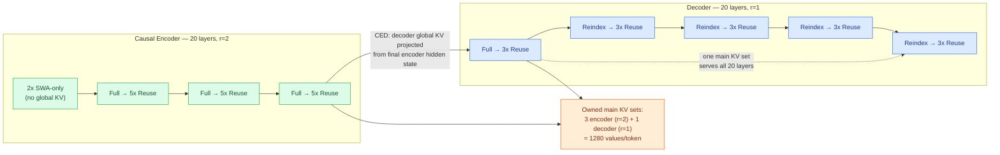

*The layer layout that produces 1280 main KV values per token. Four Full-Mode layers in a 40-layer network are the entire global cache.* **[Derived]**

---

## IX. The Hierarchical Sparse Indexer: Bounding Selection Cost

**[Interpretation]** Cross-layer reuse solves storage. It leaves a compute problem behind, and the problem is subtle enough that I initially missed why it mattered.

**[Paper]** Reuse Mode layers run no indexer. But **Reindex Mode layers still score the full causally visible context** — they reuse the keys, not the search. At million-token contexts, four layers each scanning the entire context per query is a major computational bottleneck, and one that grows linearly with context length even though storage has been made flat.

**[Paper]** The Hierarchical Sparse Indexer, used **only in the decoder**, exploits an observation: information from shallower indexers can restrict the candidates considered by deeper ones *without adding any extra state*.


*Figure 4 — Narrowing the search domain, not the selection. The decoder's Full Mode layer scores every causally visible position, then performs blockwise selection (each block scored by the maximum index score among its positions) and collects the winning blocks into a shared candidate pool. Reindex layers then run their own Top-512 selection **within that pool**. Selections still differ per layer; only the domain they search is shared.* (Adapted from Figure 5 of arXiv:2609.19969.) **[Paper]**

**[Paper]** Concretely: up to **2,048 blocks of 8 positions = 16,384 candidate positions**, from which each Reindex layer selects its own **Top-512**.

**[Derived]** The complexity change is the point. For context length $n$, per query:

$$
\text{Full Mode layer (unchanged)}: \mathcal{O}(n) \qquad \text{each subsequent Reindex layer}: \mathcal{O}(P), \ P = 16{,}384
$$

For a fixed candidate-pool size, later indexers cost a constant per query **independent of context length**, where before they were linear. **[Derived]** At $n = 1\text{M}$ that is a reduction of roughly $10^6 \to 1.6\times10^4$, about **61x**, on those layers — while the first Full Mode pass still scans everything, so total indexing never becomes constant, just dominated by a single pass instead of four.

**[Interpretation]** Two details I think deserve emphasis because they are easy to skim past:

1. **It adds no state.** The candidate pool is derived from scores the Full Mode layer computed anyway. Nothing extra is cached, so this buys compute without spending memory — which, given the whole premise of the paper, is the only acceptable way to buy compute here.
2. **[Paper]** It is **training-aware**: the candidate restriction is applied identically during training and inference, introduced in post-training, so deeper indexers are optimized under the same search domain they will use at serving time. **[Interpretation]** This is the difference between an architectural mechanism and an inference-time approximation. A post-hoc pruning of the search domain would create a train/serve mismatch and the deeper indexers would be operating out of distribution. Training through the restriction means the model *learns* to select well within a narrowed pool. It is the same discipline as quantization-aware training, applied to a routing decision instead of a numeric format.

**[Interpretation]** The structural insight generalizes beyond this model: in a stack of sparse-attention layers, **the first layer's attention scores are a reusable prior over where the useful context is**. Once you see that, restricting deeper search to a shallower layer's shortlist looks less like a trick and more like the obvious thing to do.

---

## X. The Causal Encoder-Decoder: Halving Prefill

**[Interpretation]** CSA2 and the Hierarchical Sparse Indexer address storage and selection cost. Neither touches the cost of *ingesting* context in the first place — and in an agentic workload where every tool call produces a fresh prefill, that is a first-order cost.


*Figure 5 — The full architecture, read as a cost diagram. The encoder/decoder split is the prefill/decode split: the 20 encoder layers process the prompt, their final hidden state projects the decoder's global KV, and the decoder layers are only fully exercised during decode. `CSA2(ratio, mode)` gives each layer's compression ratio and mode. All feed-forward layers are standard DeepSeekMoE.* (Adapted from Figure 3 of arXiv:2609.19969.) **[Paper]**

**[Paper]** CED treats the bottom $L/2$ layers as a **causal encoder**. For the upper half (the decoder, $l > L/2$), global KV entries are **not** derived from each layer's own hidden state — they are projected directly from the hidden state of layer $L/2$ (the final encoder layer) using layer-dependent projection weights:

$$
c^{KV}_{l} = h_{L/2}\, W^{KV}_{l}, \qquad l > \tfrac{L}{2}
$$

**[Paper]** The design is inspired by YOCO, which lets upper layers share the KV cache produced by lower layers; CED adds structural improvements to increase both KV cache capacity and the computational depth of KV generation.

**[Interpretation]** The consequence for prefill is direct: to obtain *all* the global KV the model needs, you only have to run the **first 20 layers**. The decoder's global KV is a projection away. So prefill can stop at the encoder.

**[Paper]** This is also where the 8B/16B activated-parameter asymmetry comes from — 8B activated per token during prefill, 16B during decode. **[Interpretation]** That asymmetry is precisely aligned with the workload: input-heavy agentic traffic spends most of its tokens in prefill, so putting the cheaper path where the volume is means the average cost per token of an agent trajectory falls well below the decode figure.

### The complication: SWA doesn't share

**[Paper]** SWA is *not* shared across layers — for any layer $l$, local keys and values come from that layer's own hidden state $h_l$, which deliberately increases the computational depth of local KV generation. That creates an obstacle: computing decoder SWA KV requires processing an additional $\text{win} \times L/2$ tokens, because SWA dependencies accumulate across layers.

**[Paper]** Exact reconstruction is therefore expensive, and for multi-turn interactions with short prompts per turn the overhead is non-negligible. But prior work showed the **effective receptive field of SWA is much smaller than the theoretical $\text{win} \times L/2$**. That motivates **Decoder SWA Bounded Replay**: prefill only the last $\text{win}$ tokens of the prompt for the SWA computation.

**[Paper]** With that, for sequence length $n \gg \text{win}$:

$$
\mathcal{O}(n L) \;\longrightarrow\; \mathcal{O}\!\left(\tfrac{nL}{2} + \text{win}\cdot\tfrac{L}{2}\right) \approx \mathcal{O}\!\left(\tfrac{nL}{2}\right)
$$

— **effectively halving prefill computation**. With $\text{win} = 128$, the replay term is negligible against a long prompt.

**[Interpretation]** I find CED the most interesting architectural idea in the paper, for a reason that has nothing to do with the FLOP count. Encoder-decoder architectures were abandoned for decoder-only ones largely because decoder-only scaled more cleanly and shared everything. CED reintroduces the split — but not for the classic reason (bidirectional encoding; the encoder here is *causal*). It reintroduces it because **the split is where the cost asymmetry of agentic workloads wants to be**: a cheap, heavily-shared path for the tokens you read, and an expensive path for the far fewer tokens you write. That is an architecture derived from a serving cost model rather than from a modelling argument, and I expect to see more of it.

---

## XI. FP4 Main KV Cache: Where the Remaining 1.8x Comes From

**[Paper]** DeepSeek-V4 already used quantization-aware training for FP4 indexer queries and keys. V4.1-Flash extends QAT to the **main KV cache**, where FP4 reduces *storage* rather than accelerating matmuls — cached values are dequantized before attention, which is what allows a more accurate format without requiring native FP4 matmul support, preserving hardware portability.

**[Paper]** Format choice: **E2M1 with one E4M3 scale per 16 channels**, following NVFP4 but **omitting its second-level global scale**. QAT is introduced during post-training; quantization is applied **after RoPE** (quantizing before RoPE gave only marginal accuracy gains and would add decode overhead). **SWA KV stays at FP8**, being more quantization-sensitive.

**[Interpretation]** The dynamic-range argument for dropping the global scale is a nice piece of engineering reasoning, and worth following because it shows the authors bounding a risk rather than measuring their way past it. **[Paper]** The chain:

- The largest trained RMSNorm weight magnitude is approximately 1.
- After RMS normalization, the L2 norm of the 512-channel KV latent is at most approximately $\sqrt{512}$.
- RoPE preserves norm, so the maximum absolute value across channels after rotation is also bounded by $\sqrt{512} \approx 22.6$.
- The format without a global scale supports magnitudes up to $448 \times 6 = 2688$.
- The maximum magnitude actually observed during training is around 10.

**[Derived]** So the format's headroom exceeds the worst case by roughly $2688 / 22.6 \approx 119\times$, and exceeds the observed maximum by about $269\times$. **[Interpretation]** The global scale exists to rescue formats whose range might be exceeded; here it provably cannot be, so the scale is pure overhead and removing it simplifies the cache layout for free. This is the kind of argument I want to see more of in systems papers — a *bound*, not a benchmark. It cannot be invalidated by a workload you did not test.

**[Our observation]** Worth connecting back to Section VII: FP4 contributes 1.8x of a 20.9x total. **[Interpretation]** That is not a criticism of the technique — 1.8x on the dominant memory consumer is excellent, and it composes multiplicatively with everything else. But it does reposition quantization in the mental model. If you are serving a model whose architecture keeps per-layer caches, quantization is damage control on a structural problem. Here, it is the last squeeze after the structure was fixed. For a treatment of how far quantization alone can be pushed on KV cache, see [TurboQuant](/engineering/turboquant-near-optimal-vector-quantization-kv-cache-simplemem/), which works the same axis from the other end with rotation plus near-optimal scalar quantization; and [LLM.int8()](/engineering/llm-int8-8-bit-matrix-multiplication-for-transformers-at-scale/) for the weight-side analogue.

---

## XII. SWA Bounded Replay: Trading Storage for Recomputation

**[Interpretation]** This is the part of the paper that is purely a deployment decision, and it is where the 1/8 persistent-cache number comes from. It is also the clearest example in the paper of an idea that looks like a downgrade and is actually a good trade.

**[Paper]** The problem with persisting SWA KV is a **mismatch between access pattern and retention policy**:

- **Global KV** exhibits **long-tail reuse** — a prefix may be hit hours later. Stored in its entirety; on a hit, the complete prefix is reused. Guaranteed lifetime **≥ 72 hours**.
- **SWA KV** is reused only within a **narrow, minute-scale window** inside an active session, and becomes **dead** once the session ends or the next turn begins. Yet in V4's deployment it accounted for **nearly half** the persistent cache capacity.

**[Interpretation]** Paying 72-hour SSD retention for state with a minute-scale useful life is a textbook tiering error — right data, wrong tier. Once framed that way the fix is obvious; the hard part was making the fallback cheap enough to permit it.

**[Paper]** V4's technical report proposed **Zero SWA Caching** — just recompute missing SWA KV — but exact recovery requires a full forward pass over $L \times \text{win}$ tokens, which proved **prohibitive in production**.

**[Paper]** V4.1-Flash's answer is **SWA Bounded Replay**: replay only the most recent $\text{win}$ tokens and **truncate SWA to the replay segment**, accepting approximate states. For a replay starting at position $s$, a query at position $i$ attends to SWA keys in $[\max(s,\, i - \text{win} + 1),\, i]$.

**[Paper]** The resulting deployment:

1. SWA KV is **removed from the persistent cache** and kept in a distributed memory pool provisioned from **10% of host DRAM** per machine. Aggregate capacity is far smaller, but a **minute-scale TTL** means high turnover, which under real workloads suffices for the vast majority of concurrent active sessions.
2. Misses are handled by **Encoder SWA Bounded Replay**, recomputing only $\text{win}$ tokens instead of a full $L \times \text{win}$ forward pass.

**[Paper]** DeepSeek calls bounded replay "the cornerstone of the design: it turns a catastrophic miss into a graceful, inexpensive degradation." The replayed prefix state is **approximate by design**, so global and SWA KV computed for an uncached suffix are **not mathematically identical across cache-hit positions** — and their experiments show this "barely compromises response quality." For added safety, the same replay is **simulated during post-training** for train-aware adaptation.

**[Derived]** The 1/8 figure is two multiplicative factors, and it checks out:

$$
\underbrace{2\times}_{\text{drop SWA KV (}\approx\text{half the persistent cache)}} \times \underbrace{4\times}_{\text{global KV compressed by CSA2 + FP4}} = 8\times
$$

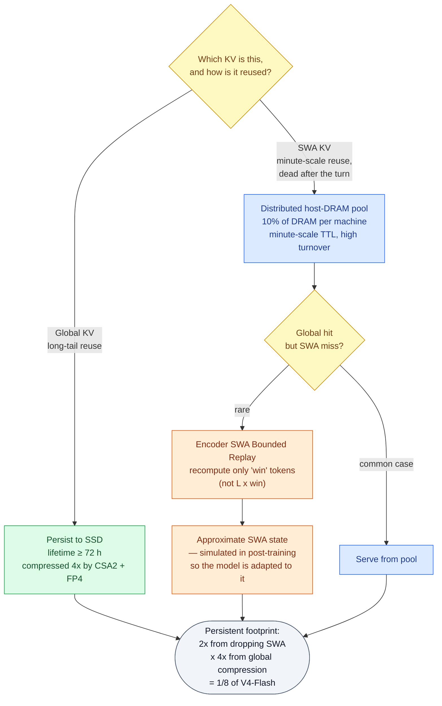

*Placement by access pattern rather than by data type. The interesting engineering is not the tiering — it's that making the miss cheap is what makes the aggressive tiering safe.* **[Interpretation]**

**[Interpretation]** The generalizable lesson: **the cost of your worst case determines how aggressive you are allowed to be in the common case.** V4's Zero SWA Caching had the right instinct and the wrong fallback — an $L\times\text{win}$ recomputation is so expensive that you cannot risk the miss, so you pay for storage you do not need. Bounding the replay to $\text{win}$ tokens changes the miss from catastrophic to cheap, and *that* is what unlocks the storage saving. This is the same shape of argument as [Strata](/engineering/strata-hierarchical-context-caching-long-context-llm-serving/)'s: make the slow path fast enough and the placement policy gets to be bolder.

**[Interpretation]** And a cost I want to name rather than gloss: this is **approximate inference in production**. Two identical requests hitting the cache at different positions can produce different states. DeepSeek is candid that it is approximate and reports negligible quality impact — but the honest summary is that they bought a factor of 8 in storage with a small, unquantified amount of numerical nondeterminism, plus some prefill recomputation. **[Paper]** Their own limitations section names this as an open robustness question, flagging "SWA state reconstruction at cache-resumption boundaries" as a target for expanded stress testing.

---

## XIII. The Result: Decode FLOPs Stay Nearly Flat

**[Interpretation]** Storage and prefill are handled. The third axis is per-token decode cost, which is what determines latency and throughput once a long context is already resident.


*Figure 6 — What all of the above adds up to at decode time. Single-token decode FLOPs against context length, log-log. Earlier generations curve upward with context; V4.1-Flash is close to horizontal from 4K to 1M. Note the precision weighting: BF16, FP8 and FP4 operations are weighted 1, 0.5 and 0.25 respectively, so this is effective compute rather than raw operation count.* (Adapted from Figure 2 of arXiv:2609.19969.) **[Paper]**

**[Paper]** Extending context **256-fold, from 4K to 1M, increases V4.1-Flash's decode FLOPs by only about 1/4** — far less than V4-Flash's growth.

**[Interpretation]** Flat decode cost across a 256x context range is the property that actually makes long-horizon agents viable, and it is worth spelling out why. In an agent trajectory, *every* decode step pays the cost of the accumulated context. If per-token decode cost grows with context, the agent gets progressively more expensive as it works, and a long task's cost grows super-linearly in its length. Flat decode cost means **the 400th step of a trajectory costs roughly what the 4th did**. That changes long-horizon agents from a cost risk into a predictable line item — which matters more for whether people deploy them than any benchmark score does.

**[Interpretation]** Two honest caveats about this figure. The precision weighting is a modelling choice, defensible but not neutral — FP4 operations are credited at a quarter of BF16, which assumes hardware that realizes that ratio. And FLOPs are not latency: they ignore memory bandwidth, kernel launch overhead, and the sparse-indexing work that does not show up cleanly as matmul FLOPs. **[Paper]** DeepSeek addresses the last point separately through kernel fusion — the vast majority of layers (those in Reuse Mode) execute in **only 15 kernels during prefill and 11 during decode**, using FlashMLA's fused RoPE-attention-RoPE-cast kernel, DeepGEMM's Mega-Gate/Mega-mHC/Mega-MoE kernels, TileKernels, and DeepSelect's TopK kernel. **[Interpretation]** That is an important complement: an architecture this heterogeneous could easily have been launch-bound, and the fusion work is what keeps the FLOP reduction from being eaten by overhead. Readers interested in how such kernels get generated and scheduled will find [FlashInfer](/engineering/flashinfer-customizable-attention-engine-llm-inference-serving/) a useful companion.

---

## XIV. The Infrastructure Bill: What Cross-Layer Sharing Costs the Stack

**[Interpretation]** Everything so far has been architecture. But an architecture that shares state *across layers* stops being a local change to attention and becomes a change to the distributed system that trains and serves it. The paper's infrastructure section is short and easy to skim past, and skimming it past would mean missing the honest cost of the design. This is where I think the article earns its "engineering implementation" label rather than its "paper summary" one.

### The one-sentence version

**[Interpretation]** If I had to put the whole infrastructure chapter on one line for a standup: *because layers now borrow each other's state, somebody has to own that state's lifetime across machines — and the model's two halves are different enough workloads that we stop running them on the same pool, at training time and at serving time.*

Everything below is a consequence of those two sentences.

### First, a distinction the paper makes and most readings blur

**[Our observation]** The infrastructure work splits into two separate bills, and it is worth keeping them apart because they are paid by different teams:

| | Training infrastructure | Inference system |
|---|---|---|
| **Vision** | Disaggregated vision-encoder execution; balanced image sharding for ultra-long sequences | EPD (Encoder–Prefill–Decode) disaggregation at deployment |
| **Cross-layer state** | Cross-stage shared-state management for attention reuse (shadow indexers, pipeline payload extensions, micro-batch lifetimes) | Encoder and Decoder SWA Bounded Replay paths |
| **Engram** | Row-partitioned tables, prefetch/gradient scheduling, resident in GPU memory during RL rollouts | Deterministic-address prefetch from host memory over RDMA |
| **Kernels** | Fused Sinkhorn normalization | Kernel fusion — 15 kernels in prefill, 11 in decode for Reuse Mode layers |

**[Paper]** Specifically: *disaggregated vision-encoder execution*, *balanced image sharding*, and *cross-stage shared-state management* are named as **training infrastructure**. The **inference system**'s named contributions are the Encoder/Decoder SWA Bounded Replay paths, EPD disaggregation, and kernel fusion. **[Interpretation]** The confusion is understandable — both halves use the words "disaggregated," "sharded," and "overlap" — but the mechanisms are different and only one of them affects what you pay per served token.

### CSA2 does not fit a pipeline-parallel schedule without help

**[Interpretation]** This is the part I found most instructive, because it is a cost that follows directly from the mechanism that produced the 20.9x saving.

**[Paper]** CSA2's Reuse and Reindex modes have a layer consume main KV, indexer K, or Top-K indices produced by a *different* layer. Under pipeline parallelism those two layers may live on **different pipeline stages**, which breaks the framework's assumption that a module executes stage-locally. Three mechanisms patch it:

1. **Shadow indexers** — a lightweight executable replica of the indexer on every participating stage, with a **single logical owner** that retains responsibility for optimization and checkpointing. Parameter synchronization and gradient aggregation keep replicas consistent.
2. **Pipeline payload extensions** — the shared intermediate representations and sparse routing information are folded into the existing **point-to-point** communication path and partitioned consistently with context parallelism, so they are neither replicated unnecessarily nor cut off from gradient flow.
3. **Micro-batch-level shared-state management** — a runtime that tracks shared state across concurrently active micro-batches and coordinates lifetimes across forward execution, activation recomputation, and backward propagation, releasing state once its **final consumer** completes.

**[Interpretation]** Read those three together and the shape is clear: cross-layer sharing converts a *memory* problem into a *lifetime-and-placement* problem. The tell is mechanism 3 — once state is produced by one layer and consumed by several others, somebody has to own the question "when is this safe to free," and in a pipeline with recomputation and in-flight micro-batches that question has no local answer. **[Our observation]** This is the same reference-counting problem that paged KV-cache allocators solve at serving time, appearing here at *training* time because the architecture pushed it there. [PagedAttention](/engineering/vllm-pagedattention-efficient-memory-management-for-llm-serving/) readers will recognize the shape immediately.

**[Interpretation]** And the generalizable lesson for anyone tempted to copy CSA2: **the compression ratio is reported in the paper, the framework work is not budgeted anywhere.** If your training stack cannot express cross-stage state sharing, the architecture is not available to you at any compression ratio. That is a real adoption barrier, and it is why "just implement CSA2" is not a two-week task.

### EPD disaggregation: the deployment mirror of the encoder–decoder split

**[Paper]** At the deployment level, V4.1-Flash uses **Encoder–Prefill–Decode (EPD) disaggregation**, letting vision encoding, prefill, and decoding **scale independently and overlap in execution**.

**[Interpretation]** This is the natural conclusion of Section X. The causal encoder-decoder already made prefill and decode *structurally* different amounts of work — 8B versus 16B activated parameters per token, half the tower versus all of it. Once the compute profiles differ that sharply, running both on the same homogeneous pool means one of them sets the provisioning and the other wastes it. EPD just stops pretending they are the same job. Adding vision as a third pool follows the same logic: image encoding is bursty, input-only, and has no KV to hand forward except embeddings.

**[Our observation]** Note the dependency, though — EPD means the compressed KV has to *cross* a pool boundary between prefill and decode. A 4x smaller global KV is worth considerably more in a disaggregated deployment than in a colocated one, because in the disaggregated case the cache is not just stored, it is **transferred** on every request. This is precisely the "communication" leg of Section II, and it is where [MOONCAKE](/engineering/mooncake-kvcache-centric-architecture-for-serving-llm-chatbot/)'s KV-transfer engine and [Strata](/engineering/strata-hierarchical-context-caching-long-context-llm-serving/)'s tiering become the relevant companion reading.

### The 1M-token multimodal data path

**[Interpretation]** An under-appreciated fact about million-token multimodal training: the bottleneck may not be the GPU at all.

**[Paper]** Two pieces of context first. The vision encoder is **replicated outside the LLM parameter tree**, and each training step runs in three phases — vision-encoder forward, LLM forward/backward, vision-encoder backward — so that load-balanced vision work is confined to the first and last phases and the LLM phase keeps the parallel strategy of text-only training unchanged. Separately, during the encoder's contrastive pre-training phase, the cross-rank all-gathers of visual and text features are **hidden entirely behind computation**, exploiting the fact that each modality's feature gradient depends only on the *other* modality's gathered features.

**[Interpretation]** The three-phase split is the same move as EPD, one level down: keep heterogeneous work out of each other's way so each can keep the parallelism strategy that suits it.

Drawn as a timeline, one training step looks like this — and the useful thing about the picture is what fills the gaps:

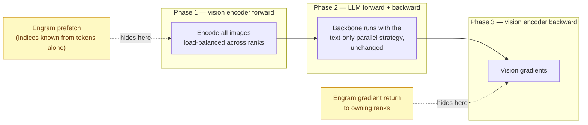

*One training step is split so vision work never interleaves with backbone work — and the vision phases double as communication cover for Engram's table traffic.* **[Interpretation]**

**[Paper]** A single ultra-long image-dense sequence can exhaust one host's I/O, CPU, and memory during *loading*. So images are **sharded across context-parallel ranks with load balancing**, and each image is **loaded exactly once**. Loading then hides behind compute whenever

$$
\frac{b}{\mathrm{BW}_{\mathrm{IO}}} < \frac{c}{\mathrm{BW}_{\mathrm{GPU}}}
$$

where $b$ is raw bytes per token and $c$ is per-token compute. **[Paper]** The token count cancels, so the criterion depends only on **per-token** quantities — it is independent of sequence length and of cluster size. $b$ is fixed by the vision configuration (resolution cap, spatial downsample ratio).

**[Interpretation]** That cancellation is a genuinely nice result and worth stating plainly: **whether your multimodal loader is a bottleneck is a property of the model, not of the scale you run it at.** You can settle it on one node with a calculator. **[Paper]** DeepSeek draws the honest corollary — storage throughput bottlenecks only *small* models with low per-token compute, as in ablation runs, while production-scale models stay compute-bound. **[Interpretation]** Which is a polite way of saying the loader will look broken in your small-scale experiments and fine in production, and you should not "fix" it based on the former.

**[Paper]** One more data-path detail with an inference flavour: during RL rollouts, images are transferred to the inference engine **incrementally**, and the engine's CPU-side decoding and preprocessing outputs are **cached on a distributed file system** for reuse across rollouts and later training. **[Interpretation]** That is a cache on the *preprocessing* path rather than the attention path — a reminder that "caching" in an RL training loop has at least three independent meanings, and the KV cache is only one of them.

### Engram's table, at training time

**[Paper]** Tables are **partitioned by row** across process groups of a configurable *engram parallel size* — the knob trading per-device memory against the communication scope of a lookup. Optimizer states shard further across replicas of each partition. Because lookup indices depend only on the input tokens, prefetch for an entire local batch is issued **before** a pipeline stage starts its micro-batches; gradients are buffered during backward and returned to owning ranks after the backbone's backward pass; both transfers are scheduled to **overlap with the vision encoder's** forward and backward phases. Values are stored and fetched in **FP8**, with scaling factors handed straight to the following GEMM. Sinkhorn normalization keeps **persistent row and column scaling vectors across iterations** rather than rewriting the full normalized matrix, and fuses row normalization with partial column statistics into one kernel.

**[Paper]** During RL rollouts, the tables stay **resident in GPU memory** — placed there specifically to relieve host-memory pressure and avoid OOM failures from host memory **fragmentation**.

**[Interpretation]** Two things in that paragraph are worth extracting. First, the vision encoder's forward/backward phases are used as **free communication cover** — the disaggregated three-phase training step described above creates LLM-idle time, and Engram's traffic was scheduled into it. That is two optimizations composing rather than competing, which is rarer than papers make it sound. Second, the RL-rollout placement is the **opposite** of the inference-time placement described in Section XV (host memory, RDMA prefetch). The same table lives on a different tier depending on the phase, chosen by the failure mode that phase actually suffers — fragmentation OOM during rollouts, HBM scarcity during serving. **[Our observation]** Consistent with the rest of this design: placement follows access pattern, and access pattern is allowed to change.

### The stack, in layers

**[Interpretation]** Here is the framing I'd keep from this whole article. These techniques are constantly discussed as if they were alternatives to each other. They are not — they live at different layers and attack different bottlenecks, which is exactly why V4.1-Flash can stack them multiplicatively.

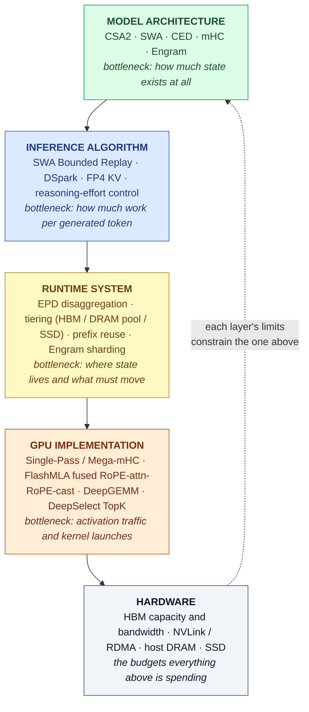

*The layer each technique actually operates at, and the bottleneck it targets. The reason V4.1-Flash's gains multiply rather than overlap is that no two of its mechanisms sit in the same row.* **[Interpretation]**

---

## XV. Supporting Extensions: mHC, Engram, DSpark

**[Interpretation]** Three extensions sit alongside the cache work. They are not the story, but two of them illustrate the same discipline applied to different resources, so they are worth a short pass.

### Single-Pass mHC — the same lower-bound reasoning, applied to activation traffic

**[Paper]** [DeepSeek-V4](/engineering/deepseek-v4-hybrid-attention-csa-hca-mhc-moe/) introduced mHC, maintaining $n$ residual streams between blocks, updated as

$$
X_{l+1} = B_l X_l + C_l\, F_l(A_l X_l), \qquad (A_l, B_l, C_l) = H_l(X_l)
$$

**[Paper]** The ideal residual transformation requires $(n+1)$ reads and $(n+1)$ writes, giving a lower bound of $(2n+2)$ on activation memory traffic. V4's three-kernel implementation, forced to serialize by data dependencies, achieves $(4n+4)$ — **twice the lower bound**. Folding normalization into projection weights allows two of three stages to share one traversal, giving $(3n+2)$; input mixing cannot fuse because $A_l$ is unavailable until the reduction over all hidden tiles completes.

**[Paper]** **Single-Pass mHC** breaks that dependency by shifting the mixing coefficients **one block later** — every block consumes coefficients produced by the previous one:

$$
X_{l+1} = B_l X_l + C_l\, F_l(A_{l-1} X_l), \qquad (A_l, B_l, C_l) = H_l(X_l)
$$

**[Paper]** Input mixing now uses $A_{l-1}$, so each tile of $X_l$ can serve both mixing and coefficient prediction without waiting. Pre-training keeps the multi-kernel implementation; deployment fuses everything into **Mega-mHC**, reaching $(2n+2)$ — the lower bound — and **halving activation memory traffic**. Empirically the shift incurs negligible performance degradation.

**[Interpretation]** I like this one because the reasoning pattern is identical to the cache work: *establish the theoretical lower bound, measure how far the implementation is from it, then find the minimum semantic change that closes the gap.* The change here — using slightly stale mixing coefficients — is a mathematically real modification to the model, accepted because it removes a serialization barrier. Same trade as bounded replay: a small, bounded approximation in exchange for a structural efficiency win.

### Engram — moving memorization off the compute path

**[Paper]** **196B Engram parameters** of sparsely-accessed conditional memory, split evenly across two modules at layers 1 and 14 (zero-indexed), using $n$-gram orders $\{2,3,4\}$, 8 hash heads, total embedding dimension 2048 per order, each head indexing ~16M entries with table sizes chosen as distinct primes. Tables and projections are **FP8**. V4.1-Flash follows the original Engram design minus the short causal convolution (gains did not justify inference-stack complexity).

**[Paper]** The inference property that makes it affordable: **deterministic addressing** — lookup indices depend solely on the input token sequence — so embeddings can be **prefetched from host memory via background RDMA**, with the first module's prefetch overlapping computation in the first Transformer block.

**[Interpretation]** Note what that means for the accounting. Engram's 196B parameters live in host memory, not HBM, and are fetched on a path that is fully predictable from the input. So the model gets 196B parameters' worth of memorization capacity at a cost paid in host DRAM and prefetchable PCIe traffic rather than in the scarce resource. That is the same instinct as the SWA tiering decision — **put state on the tier whose access pattern it matches** — and it is why the 552B/16B figures do not tell you what this model costs to serve without the Engram caveat attached.

### DSpark — speculative decoding, trained separately

**[Paper]** V4.1-Flash **omits the MTP module** used in [DeepSeek-V3](/engineering/deepseek-v3-auxiliary-loss-free-moe-mtp-fp8-training/) during backbone pre-training and uses **DSpark** instead: three Transformer blocks with a 128-token sliding window; a single forward pass computes base logits for **five draft positions in parallel**; a lightweight Markov head models dependencies among draft tokens; a confidence head predicts per-position conditional acceptance probabilities, used to estimate prefix survival. A scheduler combines those estimates with **profiled engine throughput curves** to select verification length per request, maximizing expected system-wide token throughput under current load.

**[Paper]** Unlike V3's MTP, DSpark is trained in a dedicated stage **after** pre-training with the backbone frozen, and during post-training continues training alongside the backbone **without propagating gradients into it** — keeping it aligned with the evolving policy so it accelerates both online serving and RL/OPD rollout generation.

**[Interpretation]** The design detail I find most telling is that the verification length is chosen from **measured engine throughput curves under current load**, not from a fixed acceptance-rate heuristic. Speculative decoding's optimal draft length genuinely depends on how busy the server is — under light load, spare capacity makes aggressive speculation nearly free; under heavy load, rejected drafts are stolen throughput. A scheduler that knows the load can pick correctly at both ends. **[Interpretation]** And the gradient-isolation choice is what makes DSpark a component rather than a commitment: it can be retrained or swapped as the policy evolves without touching backbone quality, which is a cleaner separation than MTP's joint training allowed.

---

## XVI. Reasoning Effort as a Serving-Cost Dial

**[Interpretation]** One more axis, because it is the one a practitioner actually turns. Everything so far reduces the cost of a *token*. Reasoning effort reduces the *number* of them, and output tokens are a first-order determinant of serving cost.


*Figure 7 — One checkpoint, a continuum of operating points. Pass@1 (solid, left axis) and mean output tokens (dashed, right axis) as the effort scalar varies from 25 to 100. Accuracy rises monotonically; token count rises faster at the top of the range. Reasoning-intensive results are averaged over eight benchmarks (AIME 2026, Apex 2025 Shortlist, GPQA Diamond, HLE, IMO-AnswerBench, LiveCodeBench, MathArena-Apex, SimpleQA-Verified).* (Adapted from Figure 9 of arXiv:2609.19969.) **[Paper]**

**[Paper]** Raising effort from 25 to 100 improves average Pass@1 on the eight reasoning benchmarks from **67.1% to 76.3%**, on DeepSWE v1.1 from **66.0% to 74.2%**, and on Terminal-Bench 2.1 from **82.4% to 90.6%** — at roughly **2.5x more output tokens**. The gains are **front-loaded**: the **60–80 range already recovers most of the accuracy of the maximum setting at less than half its token budget**, whereas the final step to effort 100 lengthens agent trajectories by **1.6–1.8x for only marginal improvement**. The public API exposes three tiers mapping onto the scalar: **low = 50, high = 75, max = 100**.

**[Paper]** Two properties worth separating. First, effort control **learned on single-response reasoning transfers to long-horizon agentic trajectories**, where it governs total exploration and verification across turns — not an obvious generalization. Second, although RL used only a finite set of effort levels, **intermediate values interpolate** at deployment.

**[Interpretation]** For anyone actually deploying this, Figure 7 is the most immediately actionable thing in the paper, and its message is contrarian relative to the benchmark table in Section V. Every number there is at effort 100 — the operating point DeepSeek's own data says you should mostly *not* use. Effort 60–80 is where the cost–quality ratio lives; max is for the tail of hard tasks. **[Interpretation]** Composed with the cache work, the two mechanisms attack the same bill from opposite sides: CSA2 and FP4 reduce the memory cost of each context token, effort control reduces the number of generated tokens. Neither substitutes for the other, and in an agent trajectory — where generated reasoning tokens *become* context tokens for every subsequent step — they compound.

---

## XVII. Pre-Training in Plain Terms: 45T Tokens, One Learning Rate, No Restarts

**[Interpretation]** The pre-training chapter reads like a spec sheet, and spec sheets are where teachable detail goes to die. So here it is reorganised around the four questions someone will actually ask me: what did it read, what shape is it, how was it optimized, and how do we know it worked.

### What it read, and the one number that matters most

**[Paper]** The corpus is the **union of a text-only pipeline and a multimodal pipeline**, ending at a **7:1 token ratio of text to multimodal** data. Where a sample existed in both, the multimodal version replaced the text-only one and the larger epoch count was kept.

**[Paper]** Three curation decisions stand out:

- **Model-generated slop is treated as duplication.** Outputs from weaker models and low-quality machine translation are filtered out on the grounds that they *reformulate* existing information rather than add any — "implicit duplication," harmful over long horizons.
- **Multimodal data is cleaned, not synthesized.** The bet is that raw web data already contains the visual knowledge, so effort went into extraction and filtering instead of generation. The crawler had to be **re-bootstrapped from Common Crawl** because the original one was biased toward text-centric pages.
- **Filtering is staged by cost.** Interleaved image-text documents pass cheap heuristics, dedup, and quality models *before* any images are fetched; only survivors get assembled into sequences and re-filtered image-aware, then scored strictly by **SmolVLM**. Rejects are partly recycled into plain image-text pairs.

**[Paper]** Packing reaches a **padding rate of at most $10^{-4}$**, and ultra-long documents are deterministically pre-split so tokens spread evenly across shards and steps.

**[Interpretation]** That padding number is the one I would quote to a team. At 45T tokens, a 1% padding rate would be 450B tokens of compute spent on nothing. Sequence packing is usually treated as a plumbing detail; at this scale it is a line item worth four significant figures.

### The exact shape: 40 layers, written out

**[Paper]** Consolidating the configuration into one table, because the mode assignment is the thing people get wrong when they retell this architecture:

| | Encoder (20 layers) | Decoder (20 layers) |
|---|---|---|
| **First layers** | 2 layers of **pure SWA** (no CSA2 at all) | — |
| **CSA2 layers** | 18 | 20 |
| **Compression rate $r$** | 2 | 1 |
| **Grouping** | 3 groups × 6 layers | 5 groups × 4 layers |
| **Mode pattern** | each group: 1 Full + 5 Reuse | group 1: 1 Full + 3 Reuse; groups 2–5: 1 Reindex + 3 Reuse |

**[Derived]** Count them: **3 Full-Mode layers in the encoder, 1 in the decoder** (4 total), **4 Reindex-Mode layers**, and **30 Reuse-Mode layers** out of 38 CSA2 layers. That is the 4 / 4 / 30 split the byte budget in Section VII is built on, and it falls straight out of the grouping rule.

**[Paper]** The rest of the numbers, for completeness: hidden dimension **5120**; **64 query heads**, head dimension **512**, query compression dimension **1280**; indexer with **32 query heads** at dimension **128**, selecting **top-512** KV entries; Hierarchical Sparse Indexer capped at **2,048 blocks × 8 positions = 16,384 candidates**; **8 output projection groups**, intermediate attention output dimension **1024**; SWA window $\text{win} = 128$. Every block is MoE: **1 shared + 384 routed experts, 6 activated**, expert intermediate dimension **2304**, SwiGLU **clamped at 10**. mHC expansion factor **4**, **20 Sinkhorn-Knopp iterations**. Vision encoder: **32 layers**, hidden **1024**, **16 heads**, patch size **14**, 2-layer MLP projector at hidden 5120. Totals: **552B backbone parameters, 8B activated per token in prefill, 16B in decode**.

**[Our observation]** Worth pausing on the first two encoder layers being **pure SWA**. Those layers see raw token embeddings, where a global summary would be least meaningful and most expensive to build — so they simply don't build one. It is a small decision that fits the rest of the design's logic: never pay for state you cannot use.

### Three optimizers in one model

**[Paper]** Not one optimizer but three, assigned by parameter type:

| Parameter type | Optimizer |
|---|---|
| Linear transformation weights | **Muon** (momentum 0.95, weight decay 0.1, update RMS rescaled to 0.18) |
| RMSNorm weights and other non-matrix parameters | **AdamW** ($\beta_1=0.9$, $\beta_2=0.95$, $\epsilon=10^{-20}$, weight decay 0.1) |
| All embeddings and the prediction head | **Sinkhorn-balanced update** ($t=11$, $\gamma=10^{-3}$, $\epsilon=10^{-20}$) |

**[Paper]** Engram's learning rate is scaled by **5×**. The Muon update RMS is rescaled specifically so the **AdamW learning rate can be reused** without retuning.

**[Interpretation]** The pattern here is the same one the architecture keeps showing: *stop applying one mechanism uniformly and match it to the thing it acts on.* Matrix parameters get an optimizer that reasons about matrices; scalars get Adam; embedding tables — which are lookups, not transformations — get a balancing update. And the RMS-rescaling trick is pure engineering pragmatism: make the new optimizer's step size *look like* the old one so the existing schedule still applies.

### The schedule, as a timeline

**[Paper]** Batch size is held **fixed at 100.6M tokens** for all 45T tokens. The learning rate warms up linearly over **2000 steps**, holds at **$2.6\times10^{-4}$** to 28T, cosine-decays to **$2.6\times10^{-5}$** between 28T and 40T, and holds there to 45T. Training starts from scratch **with sparse attention already on**, at **64K** sequence length, extending to **1M at 34T tokens**. DeepSeek reports **no instability**.

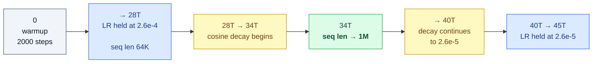

*Batch size never changes. The only two events in 45T tokens are a decay window and a context extension — and the extension lands inside the decay.* **[Derived]**

**[Our observation]** Two things I would not have guessed. First, **sparse attention is on from step zero** — this is not a dense model that had sparsity retrofitted, which matters because the indexer has to learn to select rather than learn to imitate a dense teacher. Second, the context extension to 1M happens at 34T, i.e. **inside the cosine decay window**, not after it in a separate stage. Most long-context recipes treat extension as a distinct final phase with its own schedule. Here it is folded into the main run.

**[Paper]** Load balancing: the auxiliary-loss-free bias update speed is **0.001 for both image and text tokens**, with a small sequence-level balance loss at weight **0.0001** to prevent extreme imbalance inside a single sequence. Attention masking is **sample-level**, as in V4.

### The vision encoder is trained twice, then half of it is thrown away

**[Paper]** DeepSeek-ViT is trained separately before it meets the backbone, in two stages:

1. **Contrastive pre-training** — SigLIP sigmoid contrastive loss on roughly **47B image-text pairs** from alt text, with input resolution **capped at 224×224** (aspect ratio preserved).
2. **Autoregressive fine-tuning** — the encoder is attached to a **4B MoE LLM** and trained with next-token prediction on **236B tokens** of captions, alt text, charts and OCR, at resolutions between **544×544 and 1344×1344**. Then **the LLM is discarded** and only the encoder is kept.

**[Paper]** The resolution choice in stage 1 is deliberate and justified: higher resolution does help that stage, but the benefit **does not survive into the final model**, because stage 2 is what handles high-resolution extrapolation. So paying for it early is waste.

**[Interpretation]** This is a nicely honest piece of ablation reporting, and the transferable lesson is a cost-allocation one: **put resolution where the gradient for resolution actually is.** Contrastive learning on alt text is a semantic-alignment task, and semantic alignment does not need pixels. Fine-grained perception does, so that is where the pixels get spent. The throwaway 4B LLM is the same logic applied to parameters — it exists only to generate a training signal, so it need not be good.

### Base-model results: the one table to read

**[Paper]** The comparison is against its own lineage — **DeepSeek-V4-Flash-Base** (13B activated, 284B backbone) and the much larger **DeepSeek-V4-Pro-Base** (49B activated, 1.6T backbone). Bold marks the best score, underline the second; DeepSeek notes that **gaps of 0.3 or less count as the same level**.

| Benchmark (Metric) | Shots | V4-Flash-Base<br/>13B / 284B | V4-Pro-Base<br/>49B / 1.6T | V4.1-Flash-Base<br/>8B–16B / 552B |
|---|---|---|---|---|
| AGIEval (EM) | 3–5 | <u>83.9</u> | **84.4** | 83.4 |
| MMLU-Pro (EM) | 5 | 68.3 | <u>73.5</u> | **74.1** |
| C-Eval (EM) | 5 | <u>92.1</u> | **93.1** | <u>92.1</u> |
| MultiLoKo (LLM-Judge) | 5 | 42.6 | **50.9** | <u>45.5</u> |
| SimpleQA-Verified (EM) | 25 | 30.1 | **55.2** | <u>42.3</u> |
| SuperGPQA (EM) | 5 | 46.5 | **53.9** | <u>53.1</u> |
| BBH (EM) | 3 | <u>86.9</u> | **87.5** | 86.1 |
| BBEH (EM) | 1 | 25.4 | **29.8** | <u>27.2</u> |
| DROP (F1) | 1 | **88.6** | **88.7** | 87.9 |
| HellaSwag (EM) | 0 | 85.7 | **88.0** | <u>87.2</u> |
| BigCodeBench (Pass@1) | 3 | 56.8 | <u>59.2</u> | **60.6** |
| HumanEval (Pass@1) | 0 | 69.5 | <u>76.8</u> | **79.4** |
| GSM8K (EM) | 8 | 90.8 | <u>92.6</u> | **93.0** |
| MATH (EM) | 4 | 57.4 | **64.5** | <u>61.1</u> |
| MGSM (EM) | 8 | **85.7** | <u>84.4</u> | 80.2 |
| LongBench-V2 (EM) | 1 | 44.7 | **51.5** | <u>45.2</u> |
| MMMU-Pro (EM) | 4 | – | – | 56.5 |
| CVBench (EM) | 4 | – | – | 77.9 |
| DocVQA (LLM-Judge) | 4 | – | – | 95.6 |
| RefCOCO-avg (Acc@0.5) | 0 | – | – | 86.0 |

*Table: base-model evaluation, reproduced from Table 1 of arXiv:2609.19969 with the same bold/underline convention.* **[Paper]**

**[Our observation]** The honest reading of this table is more interesting than the headline. V4.1-Flash-Base wins on **code and grade-school math** (HumanEval, BigCodeBench, GSM8K) and on **MMLU-Pro** — and loses to the 1.6T V4-Pro-Base on **knowledge recall** (SimpleQA-Verified 42.3 vs 55.2, MultiLoKo 45.5 vs 50.9), **hard math** (MATH 61.1 vs 64.5), **multilingual math** (MGSM 80.2 vs 85.7, where it is *last*), and **long-context** (LongBench-V2 45.2 vs 51.5).

**[Interpretation]** None of that should surprise anyone, and it is worth saying out loud because it is the trade the whole paper is making. Factual recall is the capability that most plainly scales with *activated* parameters, and this model activates 8–16B against V4-Pro's 49B. The claim is not "a small model matched a 1.6T model"; the claim is "a model with a third of the activated parameters stayed in the same band on most axes and won on code," which is the axis agentic products are sold on. The MGSM regression is the one I would flag in review — it is not small, and the paper does not address it.

**[Our observation]** And note the LongBench-V2 result sits oddly next to a 1M-token context claim. Long context *capacity* and long context *quality* are different properties, and this table only speaks to the second one at 1-shot.

### Compression as the cleaner signal

**[Paper]** Alongside the benchmarks, DeepSeek reports **bits per byte (BPB)** on three held-out internal corpora — lower is better:

| Corpus | V4-Flash-Base | V4-Pro-Base | V4.1-Flash-Base |
|---|---|---|---|
| Internal Docs | 0.6170 | 0.5900 | **0.5640** |
| Internal Code Repos | 0.1562 | 0.1494 | **0.1443** |
| Academic Materials | 0.4929 | 0.4677 | **0.4305** |

*Values transcribed from Figure 6 of arXiv:2609.19969.* **[Paper]**

**[Interpretation]** This is the result I find most persuasive in the entire pre-training section, and it is the one nobody quotes. BPB on held-out internal data is a **contamination-resistant** measurement: there is no public leaderboard to overfit, no prompt format to tune, no answer extraction to argue about. And here V4.1-Flash-Base beats the **1.6T** model on all three corpora — including academic materials by a wide margin. **[Our observation]** When a benchmark table says "roughly comparable" and a compression measurement says "clearly better," I trust the compression measurement more, because it is much harder to game.

---

## XVIII. Post-Training in Plain Terms: No New Algorithm, a Lot of New Environments

**[Interpretation]** This is the chapter I expected to skim and ended up rereading, because it opens with an admission most labs would bury.

**[Paper]** DeepSeek states plainly that they **refrain from introducing novel post-training algorithms**. The recipe is standard SFT → RL → on-policy distillation, "without algorithmic modifications beyond well-established practices." Effort went almost entirely into *what* the model trains on rather than *how* it is optimized. Their conclusion: under a fixed and unremarkable optimization procedure, systematic improvements in the **scale, diversity and verifiability** of synthesized data and environments account for **essentially all** of the observed gains — and at this stage, the marginal return on data-and-environment engineering **substantially exceeds** that of algorithmic novelty.

**[Interpretation]** Take that seriously for a moment. A frontier lab is saying the post-training algorithm is no longer the bottleneck, and publishing a chapter about a *sandbox scheduler* to prove it. If you are choosing what to work on, that is a directional signal worth more than any number in the paper.

### The pipeline, end to end

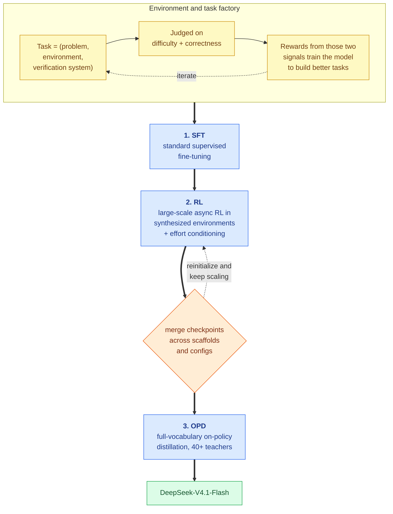

*The three stages are conventional. The loop on the left and the merge step in the middle are where the work is.* **[Derived]**

### Tasks as triplets, and the model building its own

**[Paper]** Every training task is formalized as a **triplet: (problem, environment, verification system)**, and graded on two dimensions — **difficulty** (is it non-trivial?) and **correctness** (is any of the three components broken?). Those two scores are used as **reward signals to train the model to construct better tasks**. Task quality is re-audited over the whole lifecycle: each time a task is reused in a new RL run, the fresh trajectories become new evidence about whether the task is sound.

**[Interpretation]** The triplet framing is the most portable idea in this chapter. It says a training task is not a prompt — it is a prompt *plus the world it runs in* **plus the thing that decides if you succeeded**, and any of the three can be the broken one. Most RL-for-agents efforts I have seen treat environment and verifier as fixed infrastructure and vary only the problems. Treating all three as generated artifacts with their own quality metric is what makes the pipeline scale.

**[Our observation]** And note the reward design: *difficulty* and *correctness* are deliberately in tension. Optimize correctness alone and you get trivially-verifiable trivia; optimize difficulty alone and you get broken tasks nobody can solve. The pair is the guardrail.

### How a coding environment gets built

**[Paper]** Coding environments come from two sources — filtered internal and partner coding-agent sessions (kept only if highly complex or where the model did poorly, then deduplicated by trajectory), and **public GitHub repositories above a star threshold**. Construction is carried out by **several specialized agents in sequence**:

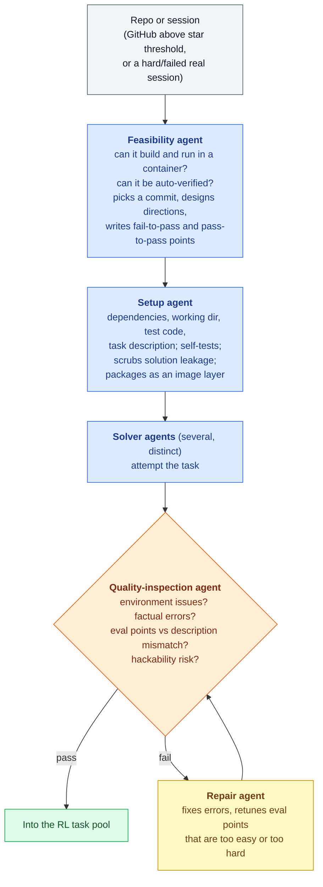

*An environment assembly line with an inspection gate and a rework loop. The step I would not have thought of is "removes any traces that could leak the task solution."* **[Paper]**

**[Interpretation]** Two details reveal how much of this is hard-won. **Solution-leakage scrubbing** exists because a container built from a real commit contains the answer — in the git history, in a changelog, in a stale test file. And the inspection agent explicitly checks **hackability**, meaning it is looking for ways to pass the verifier without doing the task. Both are failure modes you only add to a checklist after they have cost you a training run.

**[Paper]** For general (non-coding) agents, the source is different: internal employees and external partners voluntarily return interaction data from real workflows, and DeepSeek builds a large set of **mocked tools** reproducing real interfaces — input formats, output structures, API schemas, behavioral constraints — across SaaS, enterprise, and specialized back-office systems. Negative feedback and failure cases are collected at scale and turned into environments, enabling **systematic replay of observed failures** as targeted RL.

**[Our observation]** That last phrase is the interesting one. This is regression testing, moved into the training loop: a reported failure becomes an environment, and the environment becomes a gradient. It also explains the scaffold robustness in Section V — if your RL environments contain dozens of mocked tool schemas, tolerating a new harness's schema is in-distribution.

### RL scaling: what the curves actually show

**[Paper]** RL is scaled along two axes — **training compute** (cumulative steps) and **number of scaffolds**.


*Figure 8 — Pass@1 (solid, left axis) and mean output tokens (dashed, right axis) against cumulative RL steps in DeepSeek Harness Minimal mode. The `512K` marker runs through all four panels; the `1M` marker appears only near the end of the Terminal-Bench v3.0 panel, where extending maximum context continues to help on the longest-horizon tasks. Disconnected segments are successive RL runs after model-merge reinitialization.* (Adapted from Figure 7 of arXiv:2609.19969.) **[Paper]**


*Figure 9 — Joint RL across **versions** of one scaffold (left, multi-version Claude Code) and across **heterogeneous** scaffolds (right: OpenCode, Pi, and DeepSeek Harness in Standard and PTC modes), both evaluated on DeepSWE v1.1. Lighter curves are the individual versions or scaffolds; the dark curve is the aggregate.* (Adapted from Figure 8 of arXiv:2609.19969.) **[Paper]**

**[Paper]** Performance keeps improving with cumulative steps in all three regimes: within a single scaffold, jointly across variants of the same scaffold, and across heterogeneous scaffolds. To get rollouts to behave across scaffolds, execution is **decoupled into an agent sandbox and a worker container** — the sandbox runs the scaffold and its tools; the worker is a **scaffold-agnostic control layer** that orchestrates the rollout, normalizes heterogeneous interactions into **one common trajectory schema**, and talks to the trainer. Both run on DSec, **outside the preemptible GPU training pool**, so long-lived rollouts are separated from fine-grained training scheduling. On trainer preemption, a rollout can be **suspended and offloaded with full state** for later resumption.

**[Paper]** And to push past what one run can absorb, DeepSeek uses **model merging to reinitialize successive RL runs**, merging checkpoints from runs across different scaffolds or configurations. This improved both task performance and token efficiency.

**[Interpretation]** Three things I take from these two figures. First, the dashed lines matter as much as the solid ones: **output tokens rise alongside Pass@1**, so part of what RL buys is paid for in inference cost — which is exactly why effort control (Section XVI) exists. Second, the **disconnected segments are the honest part of the plot.** They are restarts, not a single smooth run, and the paper says so. Reading them as one continuous scaling curve would be wrong; what is being demonstrated is that *merge-and-continue* is a workable way to spend more RL compute than one run can. Third, the **1M marker only helps in the v3.0 panel** — the longest-horizon benchmark. That is the cleanest evidence in the paper that the 1M context is a capability rather than a spec-sheet number, and it is also narrow evidence: one panel, near the end.

**[Our observation]** The normalization layer deserves a note too. "Normalizes heterogeneous interactions into a common trajectory schema" is the unglamorous reason multi-scaffold RL is possible at all — without it, every scaffold is a separate training integration. The generalizable move: **make the trajectory format the contract, not the harness.**

### DSec: the part that is really a datacenter paper

**[Paper]** Running agents at this scale meant building **DeepSeek Elastic Compute (DSec)**, a platform for millions of sandboxes. Its design choices:

- **Sharding** — compute nodes partitioned into shards ("scale units"), which also **reduces blast radius** by isolating workloads from different experiments so one memory-hungry task cannot starve unrelated work.
- **Relaxed consistency instead of Kubernetes** — a custom placement engine, built on the observation that agentic sandbox placement only needs **eventual** consistency as long as each node enforces **local** safety. Placement replicas run **without synchronized coordination**, predicting availability from recent measurements; each node then validates the final decision with a **hard admission constraint** against a local warning threshold.
- **Density** — hardware sub-NUMA partitioning with each worker VM bound to one NUMA domain, raising supported density from roughly **1,000 to more than 2,500 concurrent live containers per physical node** before measurable end-to-end degradation.
- **A latency-sensitive execution class** — `SCHED_IDLE` for non-LS tasks plus core scheduling, so that high-density packing does not distort time-sensitive evaluations.
- **Containment** — AppArmor plus eBPF against reward hacking, and a **"repercussion" signal** when an agent crashes its environment.

**[Interpretation]** The placement-engine argument is the one worth stealing: they identified a **consistency requirement that was weaker than the tool they would otherwise have used**, and got scalability by dropping to it, with a local hard check to catch the resulting mistakes. That is the same structural move as bounded replay in Section XII — accept an approximation globally, bound its damage locally.

**[Our observation]** And the containment items are a quiet acknowledgement that the adversary in an RL loop is your own model. `eBPF` monitoring against reward hacking is not a safety flourish; it is protecting the training signal. If your verifier can be bypassed, your reward is noise.

### Async post-training: killing the long tail

**[Paper]** The rollout phase's **long tail** — a few very long samples holding up a batch — has been the standing efficiency bottleneck, so generation is now **asynchronous** for nearly all RL and OPD tasks. Rollout and training are **colocated on the same devices and time-shared**, removing the need to hand-tune the split between them; each task caps its number of **in-flight samples**.

**[Paper]** The dispatch granularity was found empirically, and both rejected options are reported:

| Granularity | Result |
|---|---|
| **Batch-level** (extra batches up front, top up after each iteration) | **Rejected** — severe oscillation in training metrics; too coarse |
| **Prompt-level** (dispatch a new prompt when one GRPO group finishes) | **Rejected** — stalls on long-tail samples *within* a group |
| **Sample-level** (dispatch the next prompt as soon as enough completions accumulate, regardless of which groups produced them) | **Adopted** — holds rollout concurrency steady |

**[Paper]** During training, **concatenated routing-replay** is used: for samples spanning multiple checkpoints, the expert routing produced at each rollout segment is **concatenated** rather than discarded and recomputed under the new checkpoint. Interruption is **token-level**, so in-flight samples stop almost immediately; rollout state — **KV cache and expert routing — is persisted at token granularity**, so resumption under a new checkpoint skips re-prefill entirely, with **sample-grained garbage collection** releasing each sample's state on completion. The same machinery makes the job responsive to cluster preemption without losing progress.

**[Paper]** Asynchrony's two side effects are handled separately. **Length bias** (short sequences finish first and dominate early batches) is mitigated by **per-dataset concurrency limits** and by **discarding early-returned short samples**. **Off-policy drift** is bounded by tuning dispatch and the training-wait condition to cap the **maximum off-policy ratio**, plus **loss masking that zeroes out tokens above a staleness threshold**.

**[Interpretation]** This subsection is the best worked example I have seen of *asynchrony is not free, it is a trade you then have to pay for*. Async fixes utilization and immediately introduces a distributional bug (your early batches are biased short) and a correctness bug (your gradients are partly from an older policy). Both fixes are unglamorous and both are necessary. **[Our observation]** Also notice what makes fast resumption possible: **persisting the KV cache at token granularity**. The same object this entire article is about compressing turns out to be the thing that makes RL restarts cheap. Compressing it 8x does not only help serving — it makes rollout state small enough to keep for every in-flight sample.

**[Paper]** The final stage is **full-vocabulary on-policy distillation** across all domains using **over 40 teacher models**, which may be architecturally different from each other and from the student, with **negligible switching cost** between them. Because the best teacher for a domain may come from a different stage of development, the recipe is **dynamically reconfigured mid-training** — dataset mixture, per-dataset concurrency limits, and active teachers — and the infrastructure supports consistent transitions while samples from multiple configurations are in flight simultaneously.

**[Interpretation]** "Over 40 heterogeneous teachers, switched at negligible cost, reconfigurable mid-run" is an infrastructure capability masquerading as a training detail. It turns distillation from a fixed pairing into a **routing problem over a fleet of specialists** — and the only reason it is stated so casually is that the async framework already had to handle in-flight configuration changes.

### Agent Teams: more agents beats more time

**[Paper]** V4.1-Flash also supports a **multi-agent mode** where a lead delegates to teammates and can interrupt a teammate's turn via `interrupt_agent`, then reviews and tests the combined changes. It is trained with an RL reward combining task performance, a **collaboration bonus** for delegation and inter-agent communication, and a **derived-latency penalty** computed by modelling execution events and their dependencies as a **DAG** — costing token counts at fixed prefill/decode rates plus measured tool time, and taking the **critical path length**. That penalizes unnecessary sequential work while staying insensitive to serving-side batching and queueing noise.


*Figure 10 — Test-time compute scaling under explicit per-rollout wall-clock deadlines. Multi-agent (solid) beats single-agent (dashed) at every deadline on both benchmarks.* (Adapted from Figure 10 of arXiv:2609.19969.) **[Paper]**

**[Paper]** On a 172-task high-confidence ProgramBench subset (tasks where the reference solution passes ≥95% of the hidden suite), **Almost@1** rises from **13.59% at 1 hour to a peak of 30.04% at 8 hours** multi-agent, against **12.79% → 20.39%** single-agent. On a no-GPU subset of **FrontierSWE v2**, **Mean@5** rises from **13.50% at 1 hour to 32.90% at 20 hours** multi-agent, against **10.50% → 28.20%** single-agent. Metrics are computed from whatever output exists when the deadline hits. DeepSeek labels these results **preliminary**.

**[Our observation]** The framing here is unusual and worth copying: the x-axis is **wall-clock deadline**, not token budget or step count. That is the axis a product manager thinks in, and it is the axis where parallel agents can win *without* being individually smarter — they just cover more ground before the clock runs out. The ProgramBench curve also **peaks at 8 hours and then declines** at 12, which the paper does not dwell on; more time is not monotonically better once coordination overhead and context degradation set in.

**[Interpretation]** And the derived-latency reward is a genuinely clever bit of design. Rewarding real measured latency would teach the model about DeepSeek's queueing behaviour on that day. Rewarding **critical-path length in a cost model** teaches it about *parallelism*, which is the thing that transfers. **[Our observation]** This is the same principle as preferring a bound to a benchmark, applied to reward design: build the reward out of quantities that are properties of the trajectory, not of the cluster.

---

## XIX. What This Investigation Does and Does Not Establish

**[Interpretation]** Being explicit about the boundary, since this article moves between four kinds of evidence.

**What I verified myself:**

- **[Our observation]** The 890 B/token figure is fully reconstructible from the published architecture config, exactly. My byte-budget model reproduces it from layer counts, mode assignments, latent widths and storage formats alone.
- **[Our observation]** Within that model, cross-layer reuse accounts for **11.6x** and FP4 quantization for **1.8x** of a **20.9x** total reduction against a per-layer FP8 counterfactual.
- **[Derived]** The V1 anchor (389,120 B/token) matches a standard GQA cache computation for DeepSeek-67B, so Figure 2's axis is consistently defined across generations.
- **[Derived]** The 1/8 persistent-cache reduction decomposes cleanly as $2\times$ (dropping SWA KV) $\times\ 4\times$ (global compression).
- **[Derived]** The FP4 dynamic-range argument holds with roughly **119x** headroom over the provable worst case.

**What I did not verify and am reporting on DeepSeek's authority:** every benchmark number; the claim that bounded replay costs negligible quality; the claim that Single-Pass mHC's coefficient shift is harmless; the FP4 QAT accuracy results; all training-infrastructure and throughput claims; the 15/11 kernel counts. **[Interpretation]** These require the model, the cluster, and the harness. Nothing in this article independently confirms them.

**What nobody has established yet:**

- **[Paper]** DeepSeek states the new architectural changes "create robustness boundaries that have yet to be fully characterized," and names **potential selection errors in CSA2** and **approximate state reconstruction in SWA Bounded Replay** as possible sources of capability degradation in untested boundary cases.
- **[Interpretation]** The generalization question: does 30-of-38 layers sharing four KV sets hold at other scales, or is the mode mix tuned to this configuration? The paper gives the ratio that worked, not the sensitivity curve around it.
- **[Interpretation]** The interaction question: CSA2's sparse selection, the Hierarchical Sparse Indexer's candidate restriction, and bounded replay's approximate states are three independent approximations stacked in one inference path. Each is reported as individually negligible. Whether their errors compound adversarially on some input distribution is exactly the kind of thing a finite test suite cannot rule out — and DeepSeek says as much.
- **[Interpretation]** No public reproduction exists of the serving-side numbers. The architecture is checkable on paper (as above) and the weights are published, but the deployment claims rest on DeepSeek's infrastructure.

---

## XX. Key Takeaways

- **KV cache size is a design variable, not a constant.** 437x reduction across four generations while capability rose. Any analysis that treats per-token cache cost as fixed and optimizes only placement, paging, or tiering is working downstream of the larger lever. **[Interpretation]**

- **Structure beats precision, by an order of magnitude.** In my byte-budget model, cross-layer reuse delivered **11.6x** and FP4 delivered **1.8x**. Quantization is bounded by representational limits; structural sharing is bounded only by how much redundancy exists across layers — and in a 40-layer stack, that turned out to be a lot. **[Our observation]**

- **Decouple what you share.** CSA2's insight is that sharing a *cache* and sharing a *selection over* that cache are separable concessions. Reindex Mode keeps one and gives up the other, which is why 30 of 38 layers can store nothing while still attending with their own queries. **[Interpretation]**

- **The cost of your worst case sets how bold you can be in the common case.** V4's Zero SWA Caching had the right idea and an $L\times\text{win}$ fallback too expensive to risk. Bounding replay to $\text{win}$ tokens made the miss cheap, and *that* unlocked an 8x storage saving. **[Interpretation]**

- **Place state by access pattern, not by data type.** Global KV has long-tail reuse and earns 72-hour SSD retention; SWA KV dies with the turn and belongs in a minute-TTL DRAM pool; Engram's deterministic lookups belong in prefetchable host memory. Three different tiers for three different lifetimes. **[Interpretation]**

- **Architectures are starting to be derived from serving cost models.** CED splits encoder from decoder not for a modelling reason but because input-heavy agentic traffic wants a cheap path for tokens it reads (8B activated) and an expensive one for the few it writes (16B). Flat decode FLOPs from 4K to 1M is the property that makes hour-long agents a predictable line item. **[Interpretation]**

- **Prefer bounds to benchmarks where you can get them.** The strongest argument in the paper is the one showing FP4's global scale is provably unnecessary — 119x headroom over a worst case derived from RMSNorm weights and RoPE's norm preservation. A bound cannot be invalidated by a workload you did not test. **[Interpretation]**

- **Read the benchmark table at the effort level you will actually deploy.** Every number in Section V is at effort 100, which DeepSeek's own data says is the wrong default: effort 60–80 recovers most of the accuracy at under half the tokens. **[Paper]**

- **Cross-layer sharing moves cost, it does not delete it.** CSA2's saving is paid for in training-framework machinery the paper reports but does not budget: shadow indexers, pipeline payload extensions, and a shared-state lifetime manager. No two mechanisms in this model sit at the same layer of the stack, which is why their gains multiply — and also why adopting one of them in isolation is harder than the compression ratio suggests. **[Interpretation]**

---

## XXI. What Was Genuinely New, and What Is Left to Do

**[Interpretation]** Closing the implementation with the three lists I would actually bring to a design review: what this model did that had not been done, where the measurable improvements landed, and what the paper leaves open.

### What was actually new here

- **Sharing a KV cache and sharing the *selection over* it were separated.** **[Paper]** CSA2's Reindex Mode is the novel piece — a layer that stores no main KV of its own but still runs its own indexer to re-choose which shared entries to read. **[Interpretation]** Every prior cross-layer-sharing scheme I know of ties the two together; splitting them is what lets **30 of 38 layers** hold nothing while still attending with their own queries.

- **Selection cost was made constant in context length.** **[Paper]** The Hierarchical Sparse Indexer builds one shared candidate pool (2,048 blocks × 8 positions) in the first decoder Full-Mode layer, so later indexers score a **fixed 16,384 candidates** instead of the whole context. **[Interpretation]** Sparse attention's usual unacknowledged cost is that *choosing* what to attend to is itself linear in context. This is the first design I have read that bounds it structurally rather than approximating it away.

- **A cheap fallback was used to justify deleting a cache tier.** **[Paper]** SWA Bounded Replay replays only $\text{win}$ tokens instead of $L\times\text{win}$, which is what makes removing SWA KV from the persistent cache survivable — and it is **simulated during post-training** so the model adapts to the approximate states. **[Interpretation]** The train-aware part is the new bit. An inference-time approximation that the model was trained to expect is a different object from one bolted on afterwards.

- **A quantization decision was justified by a bound, not a benchmark.** **[Paper]** FP4 main KV drops NVFP4's global scale because RMSNorm weights and RoPE's norm preservation bound the achievable magnitude. **[Our observation]** My reconstruction puts roughly **119×** headroom over that worst case. A bound cannot be invalidated by a workload nobody tested.

- **Residual-stream mixing was pushed to its communication lower bound.** **[Paper]** Single-Pass mHC achieves $(2n+2)$ all-to-all-equivalent passes against V4's $(4n+4)$, by shifting the coefficient computation one block later. **[Interpretation]** Same reasoning style as the cache work, applied to activation traffic instead of storage.

- **Post-training novelty was explicitly declined.** **[Paper]** DeepSeek states outright that no new post-training algorithm was introduced and that data/environment engineering accounts for essentially all gains. **[Interpretation]** Publishing a sandbox scheduler (DSec) and an environment-construction agent pipeline *as* the contribution is itself a new kind of claim about where progress comes from.

### Where the measurable improvements landed

| Axis | Improvement | Source |
|---|---|---|
| Global KV cache per token | **890 bytes**, ~**1/4** of V4-Flash's runtime footprint | **[Paper]**, reconstructed in Section VII |
| Against a per-layer FP8 counterfactual | **20.9×** total — **11.6×** structural, **1.8×** precision | **[Our observation]** |
| Persistent (SSD) KV cache | **1/8** of V4 — 2× from dropping SWA KV, 4× from global compression | **[Derived]** |
| Prefill cost | Roughly **halved** — $O(N) \to O(N/2 + \text{win}\cdot L/2)$ under CED | **[Paper]** |
| Decode FLOPs, 4K → 1M context | **256× context for ~1.25× decode FLOPs** | **[Paper]**, Section XIII |
| Activated parameters | **8B** prefill / **16B** decode, versus V4-Flash's 13B and V4-Pro's 49B | **[Paper]** |
| Held-out compression (BPB) | Best of the three models on **all three** internal corpora, beating the 1.6T V4-Pro | **[Paper]**, Section XVII |
| Reasoning-effort dial | Effort **60–80** recovers most of max accuracy at **under half** the tokens | **[Paper]**, Section XVI |
| Agentic capability | Frontier-band on DeepSWE / Terminal-Bench with an **8.7-point** spread across six scaffold families | **[Paper]**, Section V |
| Multi-agent test-time scaling | ProgramBench Almost@1 **30.04%** vs **20.39%** single-agent; FrontierSWE v2 Mean@5 **32.90%** vs **28.20%** | **[Paper]**, Section XVIII |

### What more can be done

- **Publish the sensitivity curve, not just the working mix.** **[Interpretation]** We know 4 Full / 4 Reindex / 30 Reuse works at 40 layers. Nobody knows how that ratio scales with depth, or how sharply quality falls off as Reuse share rises. Until someone maps it, "copy CSA2" means "copy this exact configuration."

- **Characterize the stacked approximations together.** **[Paper]** DeepSeek names potential **CSA2 selection errors** and **approximate reconstruction in SWA Bounded Replay** as uncharacterized robustness boundaries. **[Interpretation]** Add the indexer's candidate restriction and FP4 rounding and there are four independent approximations in one inference path, each reported as individually negligible. The compounding question is open, and a finite eval suite cannot close it — this wants adversarial search, not more benchmarks.

- **Budget the training-framework tax.** **[Interpretation]** Shadow indexers, pipeline payload extensions, and micro-batch shared-state lifetime management are described but never costed. A compression ratio with no accompanying framework-overhead number is not yet an engineering trade-off, and it is the single biggest barrier to anyone outside DeepSeek adopting this.

- **Explain the regressions.** **[Our observation]** MGSM drops to **80.2** from V4-Flash's 85.7, and LongBench-V2 (45.2) sits awkwardly beside a 1M-token context claim. Both look like consequences of fewer activated parameters, but the paper does not say so, and multilingual math losing 5.5 points deserves an ablation.

- **Reconcile long-context capacity with long-context quality.** **[Interpretation]** The only evidence that 1M tokens helps is the tail of one Terminal-Bench v3.0 panel. A retrieval-and-reasoning suite run *at* 1M would settle whether the context is usable throughout or mainly a headroom guarantee.

- **Let the runtime choose the mode mix.** **[Our observation]** Mode assignment is currently static and baked in at training time. Reuse depth is exactly the kind of parameter a serving system could vary by request class — a cheap classification request does not need what an hour-long agent needs. Nothing in CSA2 obviously forbids a trained range of mode mixes.

- **Give bounded replay an error budget.** **[Interpretation]** "Barely compromises response quality" is an empirical claim where the rest of the design prefers bounds. The replay window is $\text{win}$ tokens and the truncation is explicit, so a worst-case deviation bound on the reconstructed SWA state looks derivable — and it would let operators tune the window knowingly.

- **Reproduce the serving numbers independently.** **[Interpretation]** The weights are public and the byte budget checks out on paper, but the 15/11 kernel counts, the EPD throughput, and the tiering hit rates all rest on DeepSeek's cluster. This is the most useful thing the open-source serving stacks could contribute next.

---

## Related Reading

The KV-cache lifecycle these entries trace together, roughly in the order the state moves:

- [**SGLang / RadixAttention**](/engineering/sglang-radixattention-structured-lm-program-execution/) — avoid creating redundant KV by reusing prefixes.
- [**vLLM / PagedAttention**](/engineering/vllm-pagedattention-efficient-memory-management-for-llm-serving/) — store KV without fragmentation.
- [**MOONCAKE**](/engineering/mooncake-kvcache-centric-architecture-for-serving-llm-chatbot/) — pool and move KV across a cluster.
- [**Strata**](/engineering/strata-hierarchical-context-caching-long-context-llm-serving/) — fetch offloaded KV back fast enough that tiering pays.
- [**TurboQuant**](/engineering/turboquant-near-optimal-vector-quantization-kv-cache-simplemem/) — how far quantization alone can compress cache entries.
- [**FlashInfer**](/engineering/flashinfer-customizable-attention-engine-llm-inference-serving/) — the attention kernels that make sparse, block-structured KV layouts fast.

The DeepSeek architectural lineage this model sits at the end of:

- [**DeepSeek-V2**](/engineering/deepseek-v2-mixture-of-experts-mla-language-model/) — MLA introduces the compressed KV latent that CSA2 still stores.
- [**DeepSeek-V3**](/engineering/deepseek-v3-auxiliary-loss-free-moe-mtp-fp8-training/) — auxiliary-loss-free MoE balancing (extended here per modality), FP8 training, and the MTP that DSpark replaces.
- [**DeepSeek-V4**](/engineering/deepseek-v4-hybrid-attention-csa-hca-mhc-moe/) — CSA/HCA hybrid attention and the original mHC, both simplified here.
- [**DeepSeek-R1**](/engineering/deepseek-r1-incentivizing-reasoning-via-reinforcement-learning/) and [**GRPO**](/engineering/grpo-deepseekmath-group-relative-policy-optimization/) — the RL machinery the effort-conditioned training builds on.

---

## Closing Thought

**[Interpretation]** The thing I did not expect from this paper is that its most impressive result is a piece of *arithmetic*. 890 bytes per token is not an empirical measurement, not an average over a workload, not a best case. It is what the architecture must cost, derivable from a layer table and two number formats — which is why I could reproduce it exactly on a laptop with no GPU.

That matters more than it sounds. A capacity planner can compute this model's HBM requirement from first principles and be right. Very little else about serving large language models has that property.

And the broader shift is the one worth carrying forward. For several years the implicit contract was that serving efficiency is the systems layer's problem: the model emits whatever state it emits, and paging, tiering, scheduling and quantization clean up after it. DeepSeek-V4.1-Flash breaks that contract in the useful direction — an encoder/decoder split chosen because agentic traffic is input-heavy, a mode assignment chosen because 30 layers do not need their own cache, a number format chosen because a norm bound proves the scale is redundant, a replay window chosen because a cheap miss permits aggressive tiering. Every one of those is a modelling decision made by reasoning about a serving cost.

Which leaves the question I think the next few years of this work will be about: if 890 bytes per token is what falls out of taking the memory footprint seriously for one generation, **how much of what we currently believe about model architecture is actually just an artifact of never having put inference memory in the objective?**
