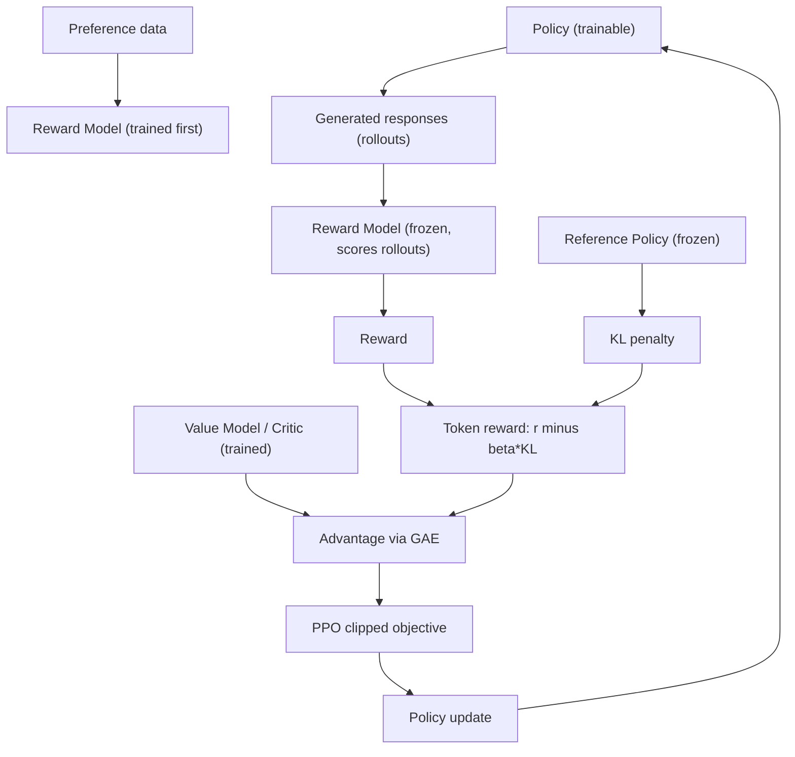
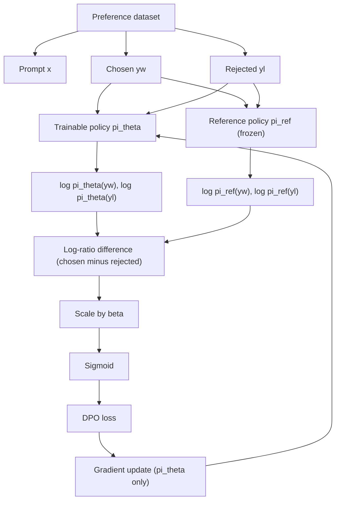

This is a technical dissection of **Direct Preference Optimization (DPO)** — "Your Language Model is Secretly a Reward Model." The focus is deliberately narrow: **how DPO turns a static preference dataset directly into a loss that trains the policy**, and how that differs, component by component, from the PPO-based RLHF pipeline it replaces. The goal is that this page is reconstructable later — someone should be able to come back, read it, and rebuild in their head exactly what $\pi_\theta$ and $\pi_{ref}$ are, where the preference data enters, how the log-probabilities are computed, why the ratio exists, how the implicit reward emerges, how the loss is formed, and how gradients update the policy. **[Interpretation]**

We are not writing a generic RLHF tutorial. PPO is covered only insofar as it is the thing DPO reformulates, and the KL machinery only insofar as it is the thing that makes DPO's derivation possible. **[Interpretation]**

**Attribution convention.** Because this article mixes what the paper states with my own reasoning, every non-obvious technical claim is tagged:

- **[Paper]** — stated explicitly in Rafailov et al. (arXiv:2305.18290).
- **[Derived]** — a mathematical consequence of the paper's equations, worked out here.
- **[Interpretation]** — my explanation or engineering framing, written for the reader; not a claim the paper makes.

---

## Why DPO? Starting From the RLHF Pipeline

The problem DPO addresses is the operational weight of the standard preference-alignment recipe. Conventional RLHF is a **two-stage** process. **[Paper]**

**Stage 1 — train a reward model.** You collect human preference data: a prompt, two candidate responses, and a human judgment of which is better. You train a separate neural network — the **reward model (RM)** — to output a scalar $r(x,y)$ that predicts how good a response $y$ is for a prompt $x$, fitting it so that the preferred response scores higher than the rejected one. **[Paper]**

**Stage 2 — optimize the policy with PPO.** With the reward model frozen, you use reinforcement learning (PPO) to update the language model so it produces responses the reward model scores highly, while a KL penalty keeps it from drifting too far from the starting model. **[Paper]**

Written out, the pipeline is:

```
SFT model
    │
    ▼
Reward Model            (train on human preferences)
    │
    ▼
Sample responses        (rollouts from the current policy)
    │
    ▼
Reward                  (RM scores each rollout)
    │
    ▼
Value model / advantage (critic estimates the baseline)
    │
    ▼
PPO update
    │
    ▼
Updated policy
```

That machinery is real. PPO-based RLHF needs, simultaneously:

- a **policy model** (the LLM being trained),
- a **reference model** (frozen, for the KL penalty),
- a **reward model** (frozen, scores rollouts),
- a **value model / critic** (estimates the baseline for the advantage),
- **rollout generation** (sample responses online during training),
- **advantage estimation** (GAE over the reward and value),
- the **PPO optimization** itself (clipped surrogate).

**PPO is not "bad."** It is a powerful, established approach and it works. **[Paper]** The point is only that it requires a comparatively complicated *online* RL system: multiple large models held in memory at once, and a rollout-and-score loop running throughout training. **[Interpretation]**

So DPO asks a single, sharp question: **can we use the human preference data to optimize the policy directly — without explicitly training a separate reward model and then running PPO against it?** **[Paper]** The answer the paper gives is yes, and it is a mathematical result rather than a heuristic. **[Interpretation]**

## DPO vs PPO — The Big Picture

The two mental models to hold side by side:

**PPO (RLHF):**

```
Prompt
 ↓
Policy → Response → Reward Model → Reward
 ↓
Value Model → Advantage
 ↓
PPO update → Updated Policy
```

**DPO:**

```
Prompt
 ↓
Chosen / Rejected responses (from a fixed dataset)
 ↓
Compare πθ against πref on each response
 ↓
Implicit reward difference
 ↓
DPO loss → Updated Policy
```

The single most important thing to state precisely — because it is the most common misunderstanding — is this: **DPO does not merely delete "one model" from PPO.** It changes the *optimization formulation*. It derives, mathematically, a relationship between the optimal policy and the reward function, and uses that relationship to express the preference objective in terms of the policy itself. The reward model does not need to exist as a separate network because its role has been folded into the policy's own log-ratio against a frozen reference. **[Paper]** That reformulation is what lets DPO train directly on a static preference dataset. **[Interpretation]**

## The Preference Data

DPO trains on a dataset of preference triples. Each example is: **[Paper]**

- **$x$** — the prompt,
- **$y_w$** — the **chosen** (preferred, "winning") response,
- **$y_l$** — the **rejected** ("losing") response.

A concrete, illustrative example (not the paper's actual dataset):

- **Prompt $x$:** "Explain why the sky appears blue."
- **Chosen $y_w$:** a clear, correct explanation invoking Rayleigh scattering.
- **Rejected $y_l$:** a vague or incorrect explanation.

The essential property: DPO learns from a **relative** preference, $y_w \succ y_l$, not from an absolute scalar score attached to either response. **[Paper]** There is no "this answer is worth $+2.4$" anywhere in the data — only "for this prompt, this response was preferred over that one." That relativity is what the whole method is built around. **[Interpretation]**

## The Reference Policy — The Part to Get Right

Two policies appear throughout, and conflating them is the fastest way to misunderstand DPO. **[Interpretation]**

- **$\pi_\theta$** — the **trainable policy**. This is the LLM whose parameters are being updated. It is *continuously changing* during training. **[Paper]**
- **$\pi_{ref}$** — the **frozen reference policy**. In the standard DPO setup this is the **SFT model / initial policy**: you start from the supervised-fine-tuned model, snapshot a frozen copy as $\pi_{ref}$, and initialize $\pi_\theta$ from that same checkpoint — so at the start $\pi_\theta = \pi_{ref}$, and from then on only $\pi_\theta$ moves. **[Paper]**

Do not confuse the SFT model (a fixed checkpoint) with the policy (the thing being trained). $\pi_{ref}$ is fixed; $\pi_\theta$ is not. **[Interpretation]**

Why does a reference policy exist at all? It provides the **baseline distribution** against which the trainable policy is measured. This is the point that makes DPO click: the model is **not** being told

> "make the chosen response probable."

It is being trained toward

> "make the chosen response *relatively more likely than the rejected response*, **compared with the reference policy**." **[Paper]**

That distinction is the difference between plain likelihood maximization and preference optimization, and it is enforced entirely by the reference. **[Interpretation]**

### Why the Ratio, Not Just the Probability

The quantity DPO actually cares about for a response $y$ is the **log-ratio**

$$
\log \frac{\pi_\theta(y \mid x)}{\pi_{ref}(y \mid x)}
$$

Compare it across the two responses:

- For the **chosen** response, we want $\pi_\theta$ to raise its probability *relative to $\pi_{ref}$* — the ratio should go up.
- For the **rejected** response, we want $\pi_\theta$ to lower its probability *relative to $\pi_{ref}$* — the ratio should go down.

The reference is the **anchor**. Without it, the objective could be satisfied by trivially inflating the probability of *everything* the SFT model already liked, or by collapsing onto the chosen strings regardless of what that does to the rest of the distribution. Measuring against $\pi_{ref}$ ties every update to a change *away from the starting model* — which is exactly the KL-regularization idea, surfacing here as a ratio rather than as an explicit penalty term. **[Interpretation]** This is why the reference cannot simply be dropped, and why DPO is not "maximize $\log \pi_\theta(y_w \mid x)$." **[Paper]**

## Token-Level Language-Model Probability

DPO compares *whole responses*, but a language model does not emit a whole response at once. So we need to be precise about what $\pi(y \mid x)$ means for an autoregressive model. **[Interpretation]**

A response $y = (y_1, y_2, \dots, y_T)$ is generated one token at a time, each token conditioned on the prompt and everything generated so far. Its probability factorizes autoregressively:

$$
\pi(y \mid x) = \prod_{t=1}^{T} \pi(y_t \mid x,\, y_{<t})
$$

- **$y_t$** — the token emitted at step $t$.
- **$y_{<t}$** — all tokens before position $t$.
- **$\pi(y_t \mid x, y_{<t})$** — the probability the model assigned to the token it actually produced at step $t$.

Taking logs turns the product into a sum, which is what is actually computed in practice:

$$
\log \pi(y \mid x) = \sum_{t=1}^{T} \log \pi(y_t \mid x,\, y_{<t})
$$

This is the bridge between "DPO compares responses" and "DPO is implemented with a language model." **[Interpretation]** To get the sequence log-probability of a chosen or rejected response, you run one forward pass, read off the log-probability of each actual next token, and sum them. The chain is:

$$
\text{sequence probability} \;\to\; \text{token probabilities} \;\to\; \text{log-probabilities} \;\to\; \text{summed log-probability} \;\to\; \text{DPO comparison}
$$

Every $\pi_\theta(y \mid x)$ and $\pi_{ref}(y \mid x)$ in the DPO objective below is this summed token log-probability, computed once for the policy and once for the reference. **[Derived]**

## The DPO Objective

Here is the core objective (the paper's Equation 7). This is the equation to be able to return to and immediately understand, so nothing is glossed. **[Paper]**

$$
\mathcal{L}_{DPO}(\pi_\theta;\, \pi_{ref}) = -\,\mathbb{E}_{(x,\, y_w,\, y_l)\sim \mathcal{D}} \left[ \log \sigma\!\left( \beta \log \frac{\pi_\theta(y_w \mid x)}{\pi_{ref}(y_w \mid x)} - \beta \log \frac{\pi_\theta(y_l \mid x)}{\pi_{ref}(y_l \mid x)} \right) \right]
$$

Term by term:

- **$\mathbb{E}_{(x, y_w, y_l)\sim\mathcal{D}}$** — an expectation over preference triples drawn from the dataset $\mathcal{D}$. Nothing is sampled from the model here; the responses come from the *fixed* dataset. This is the offline part. **[Paper]**
- **$x$** — the prompt. **[Paper]**
- **$y_w$** — the chosen (preferred) response. **[Paper]**
- **$y_l$** — the rejected response. **[Paper]**
- **$\pi_\theta$** — the trainable policy. **[Paper]**
- **$\pi_{ref}$** — the frozen reference policy. **[Paper]**
- **$\log \dfrac{\pi_\theta(y \mid x)}{\pi_{ref}(y \mid x)}$** — the log-ratio for a response: how much *more* (positive) or *less* (negative) likely the current policy makes that response compared with the reference. Computed as the summed token log-probabilities from the previous section. **[Derived]**
- **$\beta$** — a positive scalar controlling the strength of the deviation from the reference policy. It scales the log-ratios, acting like a temperature on the implicit reward: a larger $\beta$ makes the objective more sensitive to small changes in the ratio (tighter coupling to the reference), a smaller $\beta$ allows the policy to move further. **[Paper]**
- **The difference** — chosen log-ratio *minus* rejected log-ratio. This is the **preference signal**: the amount by which the policy prefers the chosen response over the rejected one, *relative to the reference*. **[Derived]**
- **$\sigma$** — the logistic sigmoid. It maps the (unbounded) preference margin into a probability in $(0,1)$: the model's estimated probability that $y_w$ is indeed preferred over $y_l$. **[Paper]**
- **$-\log \sigma(\cdot)$** — negative log-likelihood. Minimizing it *maximizes* the probability the model assigns to the correct preference ordering. When the margin is large and positive (chosen strongly favored), $\sigma \to 1$ and the loss $\to 0$; when the margin is negative (the policy has the pair backwards), the loss is large. **[Derived]**

Read as one sentence: **push the chosen response's policy-vs-reference log-ratio above the rejected response's, by a margin, and pass that margin through a sigmoid trained with logistic loss.** **[Interpretation]**

## The Implicit Reward — "Secretly a Reward Model"

The paper's title is a precise mathematical statement, not a slogan. Define the **implicit reward** as

$$
\hat{r}(x, y) = \beta \log \frac{\pi_\theta(y \mid x)}{\pi_{ref}(y \mid x)}
$$

Substituting this into the objective, the DPO loss is exactly

$$
\mathcal{L}_{DPO} = -\,\mathbb{E}\big[\log \sigma\big(\hat{r}(x, y_w) - \hat{r}(x, y_l)\big)\big]
$$

which is the standard maximum-likelihood loss for a **Bradley-Terry preference model** whose reward *is* $\hat{r}$. In other words: **[Derived]**

```
Implicit reward(chosen)  −  Implicit reward(rejected)
                    ↓
        Preference probability  (sigmoid)
                    ↓
                 DPO loss
```

The language model, through its log-ratio against the reference, *is* the reward model. There is no separate network parameterizing $r$; the reward is read off the policy. **[Paper]**

Be careful about what this does and does not claim. It does **not** say that the abstract concept of a reward has disappeared, or that no reward exists in any setup. It says: the specific reward implied by the KL-constrained RLHF problem can be written as $\beta \log(\pi_\theta/\pi_{ref})$, so it can be optimized *directly* from preference comparisons without instantiating and training a distinct reward network. **[Paper]** The reward is implicit *in the policy*, which is precisely the sense in which "your language model is secretly a reward model." **[Interpretation]**

## How DPO Is Derived

The result above is not asserted — it follows from the RLHF objective itself. The derivation is the mathematical heart of the paper, and it is worth walking through the transformations (without reproducing every line of algebra). **[Paper]**

**Step 1 — the KL-constrained reward-maximization objective.** RLHF does not maximize reward outright, because a policy left free to chase a reward model will exploit it and drift into degenerate outputs. So the objective is regularized: maximize reward *while staying close to the reference*. **[Paper]**

$$
\max_{\pi} \; \mathbb{E}_{x\sim\mathcal{D},\, y\sim\pi(\cdot\mid x)}\big[r(x,y)\big] \;-\; \beta\, D_{KL}\big(\pi(y\mid x)\,\Vert\,\pi_{ref}(y\mid x)\big)
$$

Two forces pull against each other: the first term wants higher reward; the KL term penalizes moving away from $\pi_{ref}$. $\beta$ sets their balance. **[Paper]**

**Step 2 — the closed-form optimal policy.** This is the pivotal fact. For *this particular* objective (reward minus KL penalty), the optimal policy is not something you must search for with RL — it has a **closed form**: **[Paper]**

$$
\pi^{*}(y \mid x) = \frac{1}{Z(x)}\, \pi_{ref}(y \mid x)\, \exp\!\left(\frac{1}{\beta}\, r(x,y)\right)
$$

where $Z(x) = \sum_{y} \pi_{ref}(y \mid x)\exp\!\big(\tfrac{1}{\beta} r(x,y)\big)$ is a **partition function** that normalizes the distribution over all possible responses. **[Paper]** *What changed:* instead of "given a reward, run PPO to find the policy," mathematics hands us the optimal policy in terms of the reward and the reference. *What it buys us:* a direct algebraic link between $\pi^\*$, $r$, and $\pi_{ref}$. **[Interpretation]** *Why we can do it:* the KL-regularized objective is exactly the form whose optimum is a reference-weighted softmax over rewards — a standard result. **[Interpretation]** The catch is $Z(x)$: it sums over every possible response, so it is intractable to compute, which is why you *cannot* just sample from $\pi^\*$ directly. **[Derived]**

**Step 3 — invert to express the reward through the policy.** Take logs of Step 2 and rearrange to solve for $r(x,y)$: **[Paper]**

$$
r(x,y) = \beta \log \frac{\pi^{*}(y \mid x)}{\pi_{ref}(y \mid x)} + \beta \log Z(x)
$$

*What changed:* the reward is now written entirely in terms of the (optimal) policy, the reference, and a prompt-only term $\beta\log Z(x)$. *What it buys us:* we no longer need a separate model to *represent* the reward — the policy already encodes it. **[Derived]** The remaining nuisance is $Z(x)$, which is still intractable — but notice it depends only on $x$, not on $y$. Hold that thought. **[Interpretation]**

**Step 4 — substitute into the Bradley-Terry preference model.** Human preferences are modeled with Bradley-Terry: the probability that $y_w$ is preferred over $y_l$ depends only on the *difference* of their rewards, squashed by a sigmoid: **[Paper]**

$$
P(y_w \succ y_l \mid x) = \sigma\big(r(x, y_w) - r(x, y_l)\big)
$$

Now substitute the Step-3 expression for $r$ into *both* terms. Because the preference model uses the **difference** $r(x,y_w) - r(x,y_l)$, and the intractable $\beta\log Z(x)$ term depends only on $x$, it appears in both and **cancels exactly**: **[Derived]**

$$
r(x, y_w) - r(x, y_l) = \beta \log \frac{\pi^{*}(y_w \mid x)}{\pi_{ref}(y_w \mid x)} - \beta \log \frac{\pi^{*}(y_l \mid x)}{\pi_{ref}(y_l \mid x)}
$$

*What changed:* the partition function — the one intractable object — is gone. *What it buys us:* a preference probability written purely in terms of policy and reference log-probabilities, with nothing left to estimate separately. **[Derived]** This cancellation is the technical crux of the whole method. **[Interpretation]**

**Step 5 — the DPO loss.** Replace the optimal $\pi^\*$ with the trainable $\pi_\theta$ and fit it by maximum likelihood on the preference dataset (minimize the negative log-likelihood of the observed preferences). That is exactly the DPO objective from the earlier section. **[Paper]** The chain in full:

```
KL-constrained reward maximization
        ↓  (closed-form optimum)
π*(y|x) ∝ πref(y|x) · exp(r(x,y)/β)
        ↓  (take logs, solve for r)
r(x,y) = β·log(π*/πref) + β·log Z(x)
        ↓  (substitute into Bradley-Terry; Z(x) cancels)
P(yw ≻ yl | x) = σ( β·log(π/πref)[yw] − β·log(π/πref)[yl] )
        ↓  (maximum-likelihood fit of πθ)
DPO loss
```

## Connection to KL-Constrained RL

The KL term is not decoration — it is *why the derivation exists*. **[Interpretation]** The reason RLHF regularizes toward $\pi_{ref}$ is to stop the policy from exploiting the reward into degeneracy; the reason DPO *works* is that this exact regularized objective has the closed-form solution of Step 2. **[Paper]** Change the objective (drop the KL, or regularize differently) and the clean closed form — and therefore the clean DPO loss — no longer follows. So DPO does not "ignore" the KL constraint that PPO enforces explicitly; it **bakes the same constraint into the loss** through the reference-policy ratio. The KL that PPO applies as a running penalty during rollouts, DPO applies *analytically*, once, in the algebra. **[Interpretation]** That is the whole trick, and it is why only as much KL machinery as this is needed to understand DPO. **[Interpretation]**

## DPO vs PPO — Detailed Engineering Comparison

The two pipelines, laid out at the component level:

**PPO pipeline:**

```
Preference data
→ Reward Model            (train)
→ Policy rollout          (generate responses online)
→ Reward                  (RM scores rollouts)
→ Value Model             (critic)
→ Advantage / GAE
→ PPO clipping
→ Policy update
```

**DPO pipeline:**

```
Preference dataset
→ Chosen / rejected responses   (already in the data)
→ Reference policy              (frozen)
→ Policy log-probabilities      (one policy + one reference forward pass)
→ DPO loss
→ Gradient update
```

Component by component:

| Component | PPO | DPO |
|---|---|---|
| Preference dataset | ✓ | ✓ |
| Separate reward model | ✓ | ✗ |
| Rollout generation for the training objective | ✓ | ✗ |
| Value / critic model | ✓ | ✗ |
| Advantage estimation (GAE) | ✓ | ✗ |
| PPO clipping | ✓ | ✗ |
| Reference policy | ✓ | ✓ |
| Direct preference optimization | ✗ | ✓ |
| Offline training on a static preference set | rollout-based by construction | ✓ |

A precise word on that last row: it is **not** accurate to reduce PPO to "requires online data" and stop there. The substantive point is that PPO's objective is *fundamentally rollout-based* — it needs fresh samples from the current policy, scored by the reward model, to estimate the advantage each step. DPO's objective is defined on a **fixed** set of preference pairs, so it needs no rollouts and no online reward scoring: it can train directly from a static dataset. **[Interpretation]**

### Mermaid — PPO Pipeline



Note the *two* trained models — policy **and** critic — plus a separately trained reward model, and the online rollout loop feeding the advantage.

### Mermaid — DPO Pipeline



Everything the loss needs is one forward pass through $\pi_\theta$ and one through the frozen $\pi_{ref}$, on the chosen and rejected responses already in the dataset. Gradients flow **only** into $\pi_\theta$.

### Mermaid — DPO vs PPO

```mermaid
graph TD
    subgraph PPO
        A1["Preference data"] --> A2["Reward Model"]
        A2 --> A3["Rollouts"]
        A3 --> A4["Rewards"]
        A4 --> A5["Value Model"]
        A5 --> A6["Advantage"]
        A6 --> A7["PPO"]
        A7 --> A8["Policy"]
    end
    subgraph DPO
        B1["Preference data"] --> B2["Chosen / Rejected"]
        B2 --> B3["pi_theta + pi_ref"]
        B3 --> B4["Implicit reward difference"]
        B4 --> B5["DPO loss"]
        B5 --> B6["Policy"]
    end
```



The left column is a multi-model online RL system; the right column is a single loss on a fixed dataset with a frozen reference. That is the architectural difference in one picture. **[Interpretation]**

## Why DPO Can Be Simpler

The engineering advantage follows directly from the component table. DPO avoids explicitly maintaining: **[Paper]**

- a **separate reward model** (the reward is implicit in the policy),
- a **value model / critic** (there is no advantage to estimate),
- the **rollout + advantage** machinery (the objective is offline).

So the training system reduces, conceptually, to:

```
Preference dataset  +  Trainable policy  +  Frozen reference policy
```

instead of PPO's:

```
Preference dataset + Reward model + Policy + Value model
    + Rollout infrastructure + Advantage estimation + PPO
```

This can simplify **memory, training infrastructure, the optimization pipeline, and implementation complexity**. **[Interpretation]**

But do **not** overstate it: DPO is *not* computationally free. Each step still requires **forward passes through both the policy and the reference model** for the chosen *and* rejected responses — so two models are still evaluated, and the reference model still occupies memory. **[Paper]** What DPO removes is the reward model, the value model, and the online rollout loop — not the reference model, and not all forward passes. **[Interpretation]**

## What DPO Is Actually Optimizing

This deserves its own statement, because the most common wrong summary is "DPO maximizes the likelihood of the chosen response." It does not. **[Interpretation]** The quantity inside the sigmoid is built from two *relative* scores: **[Derived]**

- **Chosen, relative to reference:** $\;\log \pi_\theta(y_w \mid x) - \log \pi_{ref}(y_w \mid x)$
- **Rejected, relative to reference:** $\;\log \pi_\theta(y_l \mid x) - \log \pi_{ref}(y_l \mid x)$

and the loss acts on their **difference**:

$$
\big[\log \pi_\theta(y_w\mid x) - \log \pi_{ref}(y_w\mid x)\big] - \big[\log \pi_\theta(y_l\mid x) - \log \pi_{ref}(y_l\mid x)\big]
$$

(then scaled by $\beta$ and passed through the sigmoid). The optimizer can lower the loss by raising the chosen response's relative score, by lowering the rejected response's relative score, or both. What it is *forbidden* from doing is inflating chosen-response probability in isolation with no regard to the rejected response or the reference distribution — because the objective only ever sees the margin between the two relative scores. **[Derived]** That margin is the central mathematical intuition of DPO. **[Interpretation]**

There is a useful detail hidden in the gradient. The gradient of the DPO loss weights each example by $\sigma(\hat{r}(x,y_l) - \hat{r}(x,y_w))$ — i.e. by *how wrong* the implicit reward currently has the pair ordered. Examples the model already ranks correctly contribute little; examples it ranks *incorrectly* (rejected currently scored above chosen) get a large gradient. **[Paper]** So DPO automatically concentrates learning on the pairs it is currently getting wrong. **[Interpretation]**

## Numerical Intuition

A small illustrative example with **clearly fictional numbers** (not from the paper), to make the margin concrete. Suppose we look at the log-ratios $\log(\pi/\pi_{ref})$ for one preference pair, before and after some training. **[Interpretation]**

At the **reference** (start, where $\pi_\theta = \pi_{ref}$, so both log-ratios are $0$ — shown here perturbed slightly for illustration):

| | chosen $y_w$ | rejected $y_l$ | margin |
|---|---|---|---|
| log-ratio | $0.2$ | $-0.1$ | $0.3$ |

After the **policy** has trained:

| | chosen $y_w$ | rejected $y_l$ | margin |
|---|---|---|---|
| log-ratio | $0.8$ | $-0.3$ | $1.1$ |

The chosen response's relative score rose ($0.2 \to 0.8$) and the rejected response's fell ($-0.1 \to -0.3$), so the **margin grew from $0.3$ to $1.1$**. With $\beta = 1$, the preference probability the model assigns rose from $\sigma(0.3) \approx 0.57$ to $\sigma(1.1) \approx 0.75$. **[Derived]** The policy has become more confident, *relative to the reference*, that the chosen response is the preferred one — which is exactly the behaviour the loss is designed to produce. **[Interpretation]**

## Engineering Implementation

How DPO maps onto an actual training loop. **[Interpretation]** (This is the high-level shape; specific hyperparameters and code are not invented here.)

```
Load SFT model
        ↓
Copy and freeze it as the reference model  (πref)
        ↓
Initialize the trainable policy from the same checkpoint  (πθ)
        ↓
Load the preference dataset  (x, yw, yl)
        ↓
For each batch:
    take chosen responses yw and rejected responses yl
        ↓
    forward pass through πθ  → sequence log-probs of yw and yl
        ↓
    forward pass through πref → sequence log-probs of yw and yl   (no gradient)
        ↓
    compute chosen and rejected log-ratios
        ↓
    compute the margin, scale by β, apply sigmoid → DPO loss
        ↓
    backpropagate through πθ ONLY
        ↓
    update πθ
        ↓
    keep πref frozen
```

The gradient flow is the thing to be exact about: **[Interpretation]**

- **$\pi_\theta$ — trainable.** Receives gradients; updated every step.
- **$\pi_{ref}$ — frozen.** Used only to compute reference log-probabilities. **No gradients flow into it.** Its forward pass can run under `no_grad`, and because it never changes, its log-probs for a fixed dataset can even be **precomputed and cached** to avoid keeping it resident in memory during the update — an optimization, not a change to the method. **[Interpretation]**

Gradients never flow into $\pi_{ref}$. If a diagram or implementation shows the reference being updated, it is wrong. **[Interpretation]**

## Memory / System Implications

The memory story must be stated carefully, because it is easy to overclaim. **[Interpretation]**

DPO removes the need for a separately trained **reward model** and a **value/critic model** — that is a genuine reduction, since in PPO the critic is typically a model comparable in size to the policy. **[Paper]**

However, the **reference model still has to be available** to compute reference log-probabilities (unless the implementation precomputes/caches them, as noted above). **[Interpretation]** So DPO does **not** mean "only one model exists in memory." The conceptual setup is still:

```
Trainable policy  πθ   +   Reference policy  πref
```

both involved during training. What DPO eliminates is the reward model, the value model, and the online rollout/advantage infrastructure — not the second (reference) model. This distinction is exactly what the paper is careful about, and it is the one to remember. **[Paper]**

## Why DPO Works

Not as a slogan ("it directly optimizes preferences") but as a mechanism, link by link: **[Interpretation]**

```
Preference data says          chosen ≻ rejected
        ↓
Reference policy provides     a fixed anchor / baseline distribution
        ↓
Policy-vs-reference ratio     β·log(πθ/πref)  =  an implicit reward signal
        ↓
Chosen ratio − rejected ratio the preference margin
        ↓
Sigmoid                       margin → preference probability
        ↓
Negative log-likelihood       a differentiable training objective
        ↓
Gradient descent              updates πθ (weighted toward mis-ranked pairs)
```

Each arrow is a step we justified above: the closed-form optimum (Step 2) is what makes the log-ratio a valid reward; the Bradley-Terry substitution with the cancelling $Z(x)$ (Step 4) is what makes the margin a valid preference model; the maximum-likelihood fit (Step 5) is what makes it trainable by ordinary gradient descent. **[Derived]** DPO works because the RLHF objective it targets is *the same one PPO targets* — it just solves it analytically instead of by online RL. **[Interpretation]**

## Limitations / Trade-offs

Kept short, since the article's purpose is understanding the method: **[Interpretation]**

- **Preference-data quality.** DPO optimizes exactly the preferences in the dataset; noisy or biased labels are learned faithfully. **[Interpretation]**
- **Sensitivity to $\beta$.** $\beta$ controls how tightly the policy is bound to the reference; too small allows over-drift, too large under-fits the preferences. It is a real knob to tune. **[Interpretation]**
- **Offline / fixed distribution.** The chosen/rejected pairs are a static sample; they may not cover the regions of response space the trained policy eventually moves into, unlike PPO's fresh online rollouts. **[Interpretation]**
- **Reference-policy dependence.** The whole objective is defined relative to $\pi_{ref}$; a poor reference (e.g. a weak SFT model) is a poor anchor. **[Interpretation]**
- **Not a cure for reward misspecification.** DPO makes optimizing preferences simpler; it does not make the preferences themselves correct. **[Interpretation]**

## Results

Only enough to show that the reformulation holds up in practice — not a benchmark survey. **Results reported in the DPO paper** (Rafailov et al., arXiv:2305.18290), *not* experiments reproduced here: **[Paper]**

- On **controlled sentiment generation**, DPO reaches a better **reward/KL frontier** than PPO — higher reward at the same divergence from the reference. **[Paper]**
- On **summarization (TL;DR)**, DPO's win rate under GPT-4 evaluation **matches or exceeds** PPO-based RLHF. **[Paper]**
- On **single-turn dialogue (Anthropic HH)**, DPO is competitive with or better than the RLHF baselines while being substantially simpler to train. **[Paper]**

The takeaway the results support is the paper's central claim: a single closed-form loss on preference data can match the PPO pipeline it replaces, without the reward model, the value model, or the rollout loop. **[Paper]** (These are the paper's reported findings; specific numbers beyond these qualitative comparisons are not reproduced here to avoid misattribution.) **[Interpretation]**

## How This Connects to the Rest of the Stack

- **[InstructGPT](/engineering/instructgpt-training-language-models-to-follow-instructions/)** is the canonical two-stage RLHF pipeline — train a reward model on human preferences, then optimize the policy with PPO. It is precisely the pipeline DPO reformulates: DPO keeps InstructGPT's *goal* (align a policy to human preferences under a KL constraint) but removes its reward-model + PPO *machinery*. **[Interpretation]**
- **[GRPO](/engineering/grpo-deepseekmath-group-relative-policy-optimization/)** sits on the same PPO lineage but changes a *different* part of it. A helpful — but easily overstated — way to relate them is **PPO → GRPO → DPO**: **[Interpretation]**
  - **GRPO** keeps PPO's online, clipped policy-optimization loop and changes the **advantage/value-model side** — it removes the *critic*, deriving the advantage from a group of sampled outputs instead of a learned value function. It is still online RL with a reward signal. **[Interpretation]**
  - **DPO** changes the **preference-learning pipeline itself** — it removes the *reward model* and the online rollout, deriving a direct offline loss on preference pairs. **[Interpretation]**

  These are **not** sequential versions of one method, and neither is simply "the next step" after the other. They are distinct modifications of PPO that touch *different components*: GRPO the advantage estimator, DPO the whole reward-and-rollout formulation. Both keep a **frozen reference policy** and both enforce closeness to it via KL — GRPO as an explicit penalty in the loss, DPO analytically through the log-ratio. **[Interpretation]**

## Engineering Takeaway

- DPO replaces **train-a-reward-model-then-run-PPO** with a **single closed-form loss on preference pairs**, derived by solving the KL-constrained RLHF objective and substituting the result into the Bradley-Terry model — where the intractable partition function cancels. **[Paper]**
- It optimizes a **relative** preference: chosen-vs-reference log-ratio minus rejected-vs-reference log-ratio, through a sigmoid. It is **not** raw chosen-response likelihood maximization. **[Derived]**
- The **implicit reward** $\hat{r}(x,y) = \beta\log(\pi_\theta/\pi_{ref})$ is the paper's title made precise — the reward lives inside the policy's log-ratio, so no separate reward network is needed. **[Paper]**
- DPO removes the **reward model, value model, and rollout loop** — but **keeps the frozen reference model**, which is still needed (or cached) for reference log-probabilities. Gradients flow into $\pi_\theta$ only. **[Paper]**
- It is simpler and often cheaper than PPO in this setting, but not free, and the paper does **not** claim it universally dominates PPO. **[Paper]**

The single sentence to carry away: **DPO solves the same KL-constrained RLHF objective PPO does, but analytically — turning the policy's log-ratio against a frozen reference into an implicit reward, so a preference dataset becomes a direct training loss instead of a reward model and an RL loop.** **[Interpretation]**
