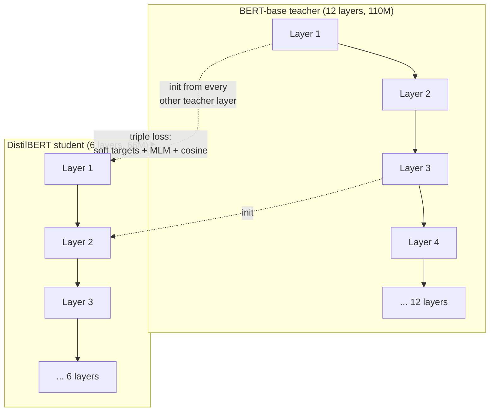

This is a technical dissection of **DistilBERT** — Sanh et al.'s "a distilled version of BERT: smaller, faster, cheaper and lighter." The engineering focus is a compression method that runs at the *pre-training* stage rather than per task: distill a big [BERT](/engineering/bert-pretraining-deep-bidirectional-transformers/) teacher into a **general-purpose** student that can then be fine-tuned on anything, at 40% of the size and 60% of the latency, keeping 97% of the quality. **[Interpretation]**

The central bet: the expensive thing about BERT is depth, and much of a trained model's value lives not in its hard predictions but in the **full soft distribution** it produces — so if a smaller model is taught to mimic that distribution (and initialized from the teacher's own weights), it can inherit most of the capability cheaply. **[Interpretation]**

**Attribution convention.** Because this article mixes what the paper reports with my own reasoning, every non-obvious technical claim is tagged:

- **[Paper]** — stated explicitly in Sanh et al. (arXiv:1910.01108).
- **[Derived]** — a mathematical or logical consequence of the paper's setup, worked out here.
- **[Interpretation]** — my explanation or engineering reasoning, written for the reader; not a claim the paper makes.

---

## Why This Paper Matters

By 2019 the direction of travel was unambiguous: bigger pre-trained models kept winning, and training even larger ones kept improving downstream performance. **[Paper]** But that trend carried two costs the paper names directly: the **environmental/compute cost** of exponentially scaling training, and the **memory/latency cost** that blocks running these models **on-device and in real time**. **[Paper]**

Most prior compression work distilled **task-specific** models — take a fine-tuned BERT and shrink it for one task. **[Paper]** DistilBERT's contribution is to move distillation **into the pre-training phase**, producing a *general-purpose* small model that keeps BERT's defining flexibility: fine-tune the one student on any downstream task. **[Paper]** The result is a model small enough to weigh 207 MB and run on an iPhone. **[Paper]** This is the practical counterweight to the [scaling](/engineering/scaling-laws-for-neural-language-models/) trend — the same years that pushed models bigger also needed a way to make them deployable. **[Interpretation]**

## The Core Idea: Learn from Soft Targets, Not Hard Labels

Standard supervised training minimizes cross-entropy against a **one-hot** label: all probability on the gold class, zero elsewhere. **[Paper]** But a well-trained teacher doesn't output one-hot — its "near-zero" probabilities on the *wrong* classes are not all equal, and their relative sizes encode how the model **generalizes**. **[Paper]**

The paper's own example: for "I think this is the beginning of a beautiful `[MASK]`", BERT puts high mass on *day* and *life*, and a long informative tail on *future, story, world*… **[Paper]** A one-hot label throws all of that away; the soft distribution keeps it. This tail is the "dark knowledge" distillation transfers. **[Interpretation]**

## The Distillation Loss and the Temperature Trick

The student is trained with a distillation loss over the teacher's **soft target probabilities**: **[Paper]**

$$
L_{ce} = -\sum_{i} t_i \cdot \log(s_i)
$$

- **$t_i$** — probability the *teacher* assigns to class $i$. **[Paper]**
- **$s_i$** — probability the *student* assigns to class $i$. **[Paper]**
- The sum over all classes means the student is scored on matching the teacher's **entire distribution**, not just its top pick — that's the richer signal. **[Paper]**

To make the informative tail visible, both models use a **softmax with temperature** $T$: **[Paper]**

$$
p_i = \frac{\exp(z_i / T)}{\sum_j \exp(z_j / T)}
$$

- **$z_i$** — the model's raw logit (score) for class $i$. **[Paper]**
- **$T$** — the temperature: larger $T$ flattens the distribution, lifting the small probabilities so the student is forced to learn them. **[Paper]**
- The **same $T$** is applied to teacher and student during training; at inference $T$ is reset to 1 to recover an ordinary softmax. **[Paper]**

At $T=1$ the teacher's tail is nearly invisible next to its top class; heating it up is what surfaces the generalization structure to be copied. **[Interpretation]**

## The Triple Loss

DistilBERT combines three terms linearly: **[Paper]**

$$
L = \alpha\, L_{ce} + \beta\, L_{mlm} + \gamma\, L_{cos}
$$

- **$L_{ce}$ — distillation loss.** Match the teacher's soft distribution (above). **[Paper]**
- **$L_{mlm}$ — masked language modeling loss.** The ordinary BERT supervised objective on the gold masked tokens. **[Paper]**
- **$L_{cos}$ — cosine embedding loss.** Aligns the *directions* of the student's and teacher's hidden-state vectors, so the student learns not just to match outputs but to organize its internal representations like the teacher. **[Paper]**

The ablation (below) shows every term earns its place — but not equally. **[Paper]**

## The Student: Fewer Layers, Not Thinner Ones

**Architecture.** The student shares BERT's general architecture but: **[Paper]**

- **Token-type embeddings and the pooler are removed.** **[Paper]**
- **The number of layers is halved** (6 vs BERT-base's 12). **[Paper]**

Crucially, the paper reduces **depth, not width.** Its reasoning is a hardware observation: linear layers and layer-norm — which scale with the hidden (last) dimension — are **already highly optimized** in modern linear-algebra frameworks, so shrinking the hidden size buys little wall-clock speedup for a fixed parameter budget. **[Paper]** Cutting *layers* removes whole sequential steps and actually speeds inference. **[Interpretation]**

**Initialization.** The student is initialized **from the teacher, taking one layer out of two** — exploiting the shared dimensionality so the student starts from weights that already work, rather than random. **[Paper]** The paper flags this as "an important element" of the recipe, and the ablation proves it. **[Paper]**

## The Training Recipe

Following RoBERTa best practices: DistilBERT is trained on **very large batches** (up to 4K examples via **gradient accumulation**), with **dynamic masking**, and **without the next-sentence-prediction objective**. **[Paper]**

- **Data:** the *same corpus as BERT* — English Wikipedia + Toronto Book Corpus. **[Paper]**
- **Compute:** 8× 16GB V100 GPUs for ~90 hours. **[Paper]** For contrast, RoBERTa needed a full day on **1024× 32GB V100** — DistilBERT is "cheaper to pre-train" by orders of magnitude. **[Paper]**

## Results: 97% of BERT at 60% of the Size

- **GLUE (dev):** DistilBERT scores **77.0 macro vs BERT-base's 79.5** — retaining **97%** of the performance with **40% fewer parameters**, and always on par with or beating the ELMo baseline (up to +19 points on STS-B). **[Paper]**
- **IMDb sentiment:** within **0.6 points** of full BERT. **[Paper]**
- **SQuAD v1.1:** within **3.9 points**; a *second* round of distillation during fine-tuning (teacher = a SQuAD-tuned BERT) narrows it to within ~3 points (79.8 F1 / 70.4 EM). **[Paper]**
- **Size & speed:** **66M vs 110M** parameters (40% smaller), and **60% faster** at inference. **[Paper]** On CPU (Xeon, batch size 1, GLUE STS-B) the student's full-pass time drops well below BERT's. **[Paper]**
- **On-device:** on an iPhone 7 Plus the QA app runs **71% faster** than BERT-base (excluding tokenization), with the whole model weighing **207 MB** — further reducible with quantization. **[Paper]**

## The Ablation: Initialization Beats Any Single Loss

The most instructive table is the ablation — deltas on GLUE macro-score relative to the full triple-loss + teacher-init model: **[Paper]**

| Change | Δ GLUE |
|---|---|
| Remove distillation loss $L_{ce}$ | **−2.96** |
| Remove cosine loss $L_{cos}$ | **−1.46** |
| Remove masked-LM loss $L_{mlm}$ | **−0.31** |
| Random init instead of teacher init | **−3.69** |

Two takeaways: **[Interpretation]**

1. **Initialization is the single biggest lever** (−3.69) — starting from the teacher's every-other layer matters more than any individual loss term. Distillation isn't only about the loss; it's about *where the student starts*. **[Interpretation]**
2. **The two distillation losses ($L_{ce}$, $L_{cos}$) carry most of the signal, while the plain MLM loss barely matters** (−0.31). **[Paper]** The teacher's soft distribution is a far richer target than the gold masked token alone. **[Interpretation]**

## Engineering Trade-offs & Limitations

- **Distillation vs. quantization/pruning — orthogonal axes.** DistilBERT cuts the *number of parameters*; quantization cuts *bits per parameter*; pruning removes *redundant weights/heads*. The paper is explicit that these are complementary and can be stacked. **[Paper]** DistilBERT + [8-bit inference](/engineering/llm-int8-8-bit-matrix-multiplication-for-transformers-at-scale/) compound. **[Interpretation]**
- **Needs a trained teacher.** The student is only as good as what it can copy; distillation transfers capability, it doesn't create it. **[Interpretation]**
- **97%, not 100%.** The retained-capability framing is honest but real — the biggest per-task gaps show on harder tasks (RTE, SQuAD), where the lost 3% concentrates. **[Interpretation]**
- **Depth-cut is architecture-specific reasoning.** "Reduce layers not width" follows from *today's* kernels being width-optimized; on different hardware the optimal cut could differ. **[Interpretation]**

## How This Connects to the Rest of the Stack

- **[BERT](/engineering/bert-pretraining-deep-bidirectional-transformers/)** is literally the teacher: DistilBERT copies its architecture (minus token-type embeddings and pooler), its corpus, and its masked-LM objective, and initializes from its weights. Read BERT first. **[Interpretation]**
- **[LLM.int8()](/engineering/llm-int8-8-bit-matrix-multiplication-for-transformers-at-scale/)** is the complementary compression axis the paper calls out as orthogonal — fewer parameters (distillation) × fewer bits (quantization). **[Interpretation]**
- **[Scaling Laws](/engineering/scaling-laws-for-neural-language-models/)** is the trend DistilBERT reacts against: if bigger is always better at training time, distillation is how you claw back deployability at inference time. **[Interpretation]**

## Engineering Takeaway

- Distill **during pre-training** to get a *general-purpose* small model, not a task-specific one — it keeps BERT's fine-tune-on-anything flexibility at 40% of the size. **[Paper]**
- The signal is the teacher's **soft distribution**, surfaced by a **softmax temperature**; the objective is a **triple loss** (soft-target CE + MLM + cosine). **[Paper]**
- **Cut layers, not hidden width** — depth is where the latency lives on optimized kernels. **[Paper]**
- **Initialize the student from the teacher** (every other layer): the ablation shows this matters more than any single loss term. **[Paper]**
- Distillation is **orthogonal to quantization and pruning** — stack them for edge deployment. **[Paper]**

The single sentence to carry away: **a smaller model taught to mimic a bigger one's full probability distribution — and started from its weights — inherits most of the capability at a fraction of the cost.** **[Interpretation]**
