<!--
SEO METADATA (reference — mirrors the frontmatter above)

SEO Title:          DistServe Explained: Prefill-Decode Disaggregation for LLM Serving and KV Cache
Meta Description:   DistServe explained: prefill-decode disaggregation for LLM serving, KV cache transfer, tensor and pipeline parallelism, and goodput-optimized GPU placement. (156 chars)
URL Slug:           /engineering/distserve-prefill-decode-disaggregation-llm-serving/
Date:               January 2024 (paper) — article September 2026
Author:             Trisham Patil
Difficulty Tier:    🟡 Tier 2 — Intermediate

Primary Keyword:    prefill decode disaggregation
Secondary Keywords: DistServe, LLM serving, LLM inference, KV cache, LLM inference optimization,
                    distributed LLM serving, goodput, GPU parallelism, tensor parallelism, pipeline parallelism
-->


Every LLM request is really two jobs: a compute-heavy **prefill** that reads the prompt, and a memory-bound **decode** that streams tokens one at a time. Most serving systems run both on the same GPUs and pay for it with latency, or with extra hardware. **[Interpretation]**

**Prefill decode disaggregation** is DistServe's answer: run the two phases on separate GPUs, give each its own parallelism, and move the KV cache between them. **[Paper]**

This engineering implementation explains why that split works, how DistServe picks GPU placements that maximize **per-GPU goodput**, and what the paper's experiments show: up to **7.4× more requests** or **12.6× tighter SLOs** than vLLM and DeepSpeed-MII. **[Paper]**

**Scope.** This article focuses on the ideas: the TTFT/TPOT trade-off, the queueing math for prefill, the memory math for decode, and the two placement algorithms. The running example (a 70B model on H100s) and the Python placement code are **my own illustrations**, driven by a toy simulator. They do not reproduce the paper's C++/CUDA engine or its measured numbers.

**Attribution convention.** Every non-obvious technical claim is tagged:

- **[Paper]** — stated explicitly in DistServe (OSDI '24 / arXiv:2401.09670).
- **[Derived]** — a mathematical or logical consequence of the paper's equations, worked out here.
- **[Interpretation]** — my explanation or engineering reasoning, written for the reader; not a claim the paper makes.

---

## Reasoning / Why I Studied DistServe

My earlier serving write-ups were all about the **KV cache inside one engine**. [vLLM](/engineering/vllm-pagedattention-efficient-memory-management-for-llm-serving/) made it fit. [SGLang](/engineering/sglang-radixattention-structured-lm-program-execution/) made it reusable. [TensorRT-LLM](/engineering/tensorrt-llm-inference-serving-engine-kv-cache-scheduling/) scheduled it tightly. **[Interpretation]**

All of them still batch prefill and decode together. When I read [Mooncake](/engineering/mooncake-kvcache-centric-architecture-for-serving-llm-chatbot/), which splits the two phases into separate clusters, I wanted the paper that made the case for that split from first principles. That paper is DistServe. **[Interpretation]**

What drew me in is that DistServe's argument is mostly **queueing theory and GPU arithmetic**, not a new kernel. That makes it one of the most transferable ideas in LLM serving. **[Interpretation]**

---

## I. Preface — Different Lenses on the KV Cache Problem

Every modern LLM serving system fights the same constraint. The **KV cache** grows with every token, lives in scarce GPU memory, and has to be read on every decode step. **[Interpretation]**

Different systems attack that constraint from different angles. Some manage the memory better, some reuse it, some move it. DistServe changes **where the two phases of inference run**. Before diving in, it helps to see these approaches side by side. **[Interpretation]**


*The diagram shows one shared bottleneck (the KV cache) viewed through four lenses. Each system optimizes a different quantity, so they are complementary, not ranked.* **[Interpretation]**

### DistServe: Prefill and Decode Disaggregation

DistServe runs prefill and decode on **separate GPU instances**. The prefill GPU computes the KV cache and hands it to a decode GPU. **[Paper]**

It optimizes **TTFT and TPOT independently**, and chooses each phase's resources and parallelism to maximize goodput per GPU. **[Paper]**

### Mooncake: KV Cache as a Distributed Resource

Mooncake also disaggregates prefill and decode. Then it goes further: it pools **CPU DRAM, SSD and RDMA** into a global KV cache store, so a prefix computed once can be reused across requests and machines. **[Interpretation]**

Its lens is *trading storage for compute*: fetch a cached KV block instead of recomputing it.

### vLLM: Memory-Efficient KV Cache Management

vLLM's **PagedAttention** stores the KV cache in fixed-size blocks addressed through a block table, like OS virtual memory. That removes most fragmentation, so more requests fit in one batch. **[Interpretation]**

Its lens is *GPU memory efficiency inside one engine*. DistServe uses PagedAttention inside every instance. **[Paper]**

### SGLang: KV Cache Reuse and the Serving Runtime

SGLang's **RadixAttention** keeps KV caches in a radix tree so requests sharing a prefix (system prompts, few-shot examples, agent loops) skip recomputing it. A cache-aware scheduler orders requests to maximize those hits. **[Interpretation]**

Its lens is *serving-runtime efficiency*: do less prefill work in the first place.

These lenses stack. A production stack can page its KV cache (vLLM), reuse prefixes (SGLang), pool caches across machines (Mooncake), **and** disaggregate phases (DistServe). **[Interpretation]**

DistServe's lens matters because it is the one that addresses **latency SLOs directly**. The others make each GPU hold or reuse more. DistServe decides which GPUs each phase should run on in the first place. **[Interpretation]**

---

## II. Introduction — The Prefill–Decode Serving Problem

Serving an LLM request looks like one job from the outside: prompt in, tokens out. Inside the GPU, it is two very different jobs. **[Interpretation]**

DistServe is built on that observation. This section frames the problem it targets and why its answer is **prefill–decode disaggregation**. **[Interpretation]**

### The Two Stages of LLM Inference: Prefill and Decode

- **Prefill** processes the whole prompt and produces the **first output token in a single step**. **[Paper]**
- **Decode** then generates the rest of the response **one token per step**, each step conditioned on the tokens generated so far, until a termination token. **[Paper]**

The two stages stress the GPU differently. Prefill is **compute-intensive**. A single decoding job is **heavily memory-bandwidth-bound**, so decode relies on batching many requests to use the GPU well. **[Paper]**

### Latency SLOs: TTFT for Prefill, TPOT for Decode

Because the stages are distinct, LLM serving latency is measured by two metrics, one per stage: **[Paper]**

| Stage | Latency SLO | What it measures |
|---|---|---|
| Prefill | **Time to First Token (TTFT)** | Duration of the prefill phase — how long until the first token appears |
| Decode | **Time Per Output Token (TPOT)** | Average time to generate each subsequent token of a request (excluding the first) |

TPOT is closely related to what other serving work calls **Time Between Tokens (TBT)**: both describe the pace of token streaming after the first token. **[Interpretation]**

Applications weight the two differently. A real-time chatbot cares most about a low TTFT. Document summarization cares more about a low TPOT. **[Paper]**

### The Problem with Colocated LLM Serving

Existing LLM serving systems **colocate** both stages on the same GPUs. They batch prefill and decode steps across all requests to maximize overall throughput. **[Paper]**

The catch is that both stages now draw on **the same GPU resources**. **[Paper]** Throughput is not the goal under latency constraints. Meeting both a stringent TTFT and a stringent TPOT is. **[Interpretation]**

To hit both SLOs, a colocated system has to **over-provision compute**, adding GPUs until the stricter of the two latencies is met. **[Paper]** More GPUs per request served means a **higher serving cost** per query. **[Paper]**

Colocation also **couples resource allocation and parallelism**. Both stages must share one parallelism configuration, tuned for whichever SLO is more demanding, even when that is a poor fit for the other stage. **[Paper]**

### Prefill–Decode Interference

The deeper issue is that the two stages actively slow each other down: **[Paper]**

- **Prefill delays decode.** A prefill step takes much longer than a decode step. When they share a batch, the decode requests wait for the prefill to finish, which inflates **TPOT**.
- **Decode delays prefill.** Adding decode work to a batch also lengthens the prefill step, which inflates **TTFT**.
- **Separate scheduling doesn't fix it.** Running the stages in turn on the same GPUs still makes them compete: decode jobs queue behind ongoing prefill jobs, and vice versa.
- **Prioritization only moves the pain.** Prioritizing one stage hurts the latency SLO of the other.

So scheduling both stages on shared GPUs forces a **trade-off between TTFT and TPOT**. Batching strategies can shift the balance between the two metrics, but they cannot remove the interference. **[Paper]**

### DistServe's Answer: Prefill–Decode Disaggregation

DistServe removes the shared resource instead of trying to schedule around it. **[Interpretation]**

1. **Disaggregate.** Prefill and decode run on **separate GPUs**, as separate prefill and decoding instances. This eliminates prefill–decode interference by construction. **[Paper]**
2. **Allocate independently.** Each stage gets its own GPU allocation and **parallelism strategy**, tailored to its own latency SLO: TTFT for prefill, TPOT for decode. **[Paper]**
3. **Place with an algorithm.** A **placement algorithm** takes the model, the cluster, the workload, and the TTFT/TPOT requirements. It chooses the resource allocation and parallelism configuration for each stage, and places the instances with the cluster's bandwidth in mind to limit the cost of moving the KV cache between them. **[Paper]**

The optimization target is **per-GPU goodput**: the maximum request rate each provisioned GPU can sustain while meeting the SLO attainment goal (e.g., 90% of requests within both TTFT and TPOT). **[Paper]** Maximizing goodput per GPU, instead of throughput, is what lets DistServe meet both SLOs **without unnecessary over-provisioning**. **[Interpretation]**

### How DistServe Is Built

DistServe is implemented as an **orchestration layer on top of the LLM inference engine**. It does not replace the GPU execution stack underneath. **[Paper]** The system has four parts: **[Paper]**

- **Placement algorithm module** — the optimization component. Given a model and cluster setting, it searches allocation and parallelism configurations (backed by a simulator) and outputs the placement decision: how many prefill and decoding instances to run, with what parallelism, and on which GPUs.
- **RESTful API frontend** — an OpenAI API-compatible interface for incoming requests.
- **Orchestration layer** — manages the prefill and decoding instances at runtime: request dispatching, **KV cache transmission** from prefill to decode, and result delivery.
- **Parallel execution engine** — the GPU-side layer that actually executes LLM inference and manages the KV cache across GPU workers.

The split to take away: the placement algorithm decides **where and how** each stage runs. The orchestration layer carries out that decision above the execution engine, which does the GPU work. **[Interpretation]**

---

## III. Background and Motivation — Why Disaggregate Prefill and Decode?

Section II named the symptoms. This section examines the causes: four structural problems that come from running prefill and decode on the same GPUs. Together they make the case for disaggregation. **[Interpretation]**

One fact sits under all four. Most LLM inference engines colocate the two phases because both use the same **model weights** and the same **KV cache** in GPU memory, even though their compute characteristics are very different. **[Paper]**

### 1. Prefill–Decode Interference

When prefill and decode share a GPU, each phase slows the other down: **[Paper]**

- **Prefill inflates TPOT.** Decode requests batched with a prefill job must wait for the much longer prefill to finish. The longer the prompt, the worse the slowdown.
- **Decode inflates TTFT.** Adding decode jobs to a prefill batch increases the time to complete the prefill, especially when the GPU is already at capacity.
- **Separate scheduling doesn't solve it.** Unbatching the phases and running them one after the other still leaves decode jobs queuing behind ongoing prefill jobs. Decode-only batches also tend to underutilize the GPU.
- **Priority scheduling just moves the damage.** Prioritizing either phase hurts the latency of the other.

On shared GPUs, the system can improve TTFT or TPOT, but only at the other's expense. Interference turns the two SLOs into a **trade-off**. **[Paper]**


*Figure 2 from the paper: batch execution time for a 13B LLM as batch size grows. Orange is decode-only; blue adds one prefill job to the batch.* **[Paper]**

- **Decoding slowdown** (the gap between orange and blue). With a 128-token input, one prefill roughly doubles a small decode batch's step time, from ≈ 7 ms to ≈ 14 ms. With a 1,024-token input, it jumps from ≈ 10 ms to ≈ 120 ms, **more than 10×**. **[Paper]**
- **Prefill slowdown** (blue rising above the dashed line). As more decode jobs join, the prefill itself also finishes later. **[Paper]**

Longer prompts make interference much worse. That is why summarization, with its long inputs, gains the most from disaggregation later in the evaluation. **[Interpretation]**

### 2. Resource and Parallelism Coupling

The two phases do not just interfere. They also *want different hardware configurations*: **[Paper]**

| | Prefill | Decode |
|---|---|---|
| **Bottleneck** | Compute-bound for non-trivial prompts | Memory-bandwidth-bound: processes one new token per step, yet moves weights and KV cache through memory like prefill |
| **What helps** | More **intra-operator parallelism** to cut execution time and meet a tight TTFT | **Batching** many requests to raise GPU utilization; best parallelism depends on the running batch size |
| **Latency SLO** | TTFT | TPOT |

Colocation forces both phases to share **one resource allocation and one parallelism plan**. In practice that plan is tuned to whichever of TTFT and TPOT is more demanding, and it may be a poor fit for the other phase. **[Paper]**

As a result, the system **cannot optimize each phase independently** for its own workload and its own SLO. **[Paper]**

### 3. The Continuous Batching Trade-off

Current serving systems use **continuous batching**: the prefill of new requests is batched together with the decoding of ongoing requests. **[Paper]**

This is a sound strategy for its own objective. It raises GPU utilization and maximizes **overall throughput**, measured as tokens per second across all users. **[Paper]** But putting both phases in one batch is exactly what creates the interference above, so continuous batching pays for throughput with TTFT or TPOT. **[Paper]**

**Chunked prefill with piggybacking** is the main mitigation. It splits a long prefill into chunks and batches each chunk with a few decode jobs. **[Paper]** It reduces the slowdown of decode, but it has limits: **[Paper]**

- **It does not remove the interference.** It essentially trades TTFT for TPOT.
- **The chunk size is a no-win knob.** Small chunks leave prefill competing with decode for the GPU, which lengthens prefill. Chunks large enough to saturate the GPU leave little room for piggybacked decode tokens.
- **It adds memory traffic to prefill.** Each new chunk must reload the KV cache of all earlier chunks from HBM, and this overhead grows with context length.

In short, batching prefill and decode together always compromises either TTFT or TPOT. **[Paper]**

### 4. Over-Provisioning: The Cost of Meeting Both SLOs

A colocated system must satisfy TTFT **and** TPOT **at the same time**. Interference and coupling push both latencies up, so the system typically meets both only by **provisioning extra GPUs**. **[Paper]**

Those extra GPUs raise the **cost per query**. The system is paying to overcome a conflict that its own architecture creates. **[Interpretation]**

### 5. The Central Motivation of DistServe

Each of the four problems comes from the phases **sharing GPUs**. DistServe's response is to stop sharing them: **[Interpretation]**

- **Disaggregate.** Prefill and decode run on **separate GPU resources**, as **prefill instances** and **decoding instances**, each holding its own copy of the model weights. **[Paper]**
- **Optimize each phase for its own SLO.** Prefill is tuned for TTFT and decode for TPOT, with no shared compromise. **[Paper]**
- **Choose resources and parallelism independently.** Each phase gets its own GPU allocation and its own parallelism strategy. Because decoding often underutilizes a GPU, multiple prefill instances can feed one decoding instance, so decode can batch more jobs. **[Paper]**
- **Eliminate interference.** With no shared batch and no shared queue, prefill cannot stall decode and decode cannot slow prefill. **[Paper]**
- **Maximize per-GPU goodput.** The target is the highest request rate per provisioned GPU that still meets the TTFT and TPOT SLOs, not raw throughput. **[Paper]**

The one new cost is communication: the prefill instance must send its intermediate state, mainly the **KV cache**, to the decoding instance. **[Paper]**

**Colocated serving: both phases share one batch on the same GPUs.**

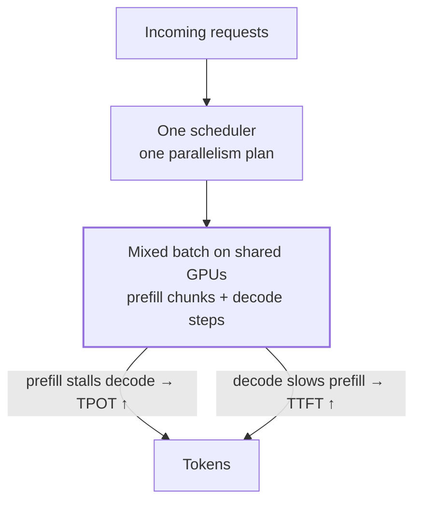

**Disaggregated serving: each phase gets its own GPUs, joined by a KV cache transfer.**

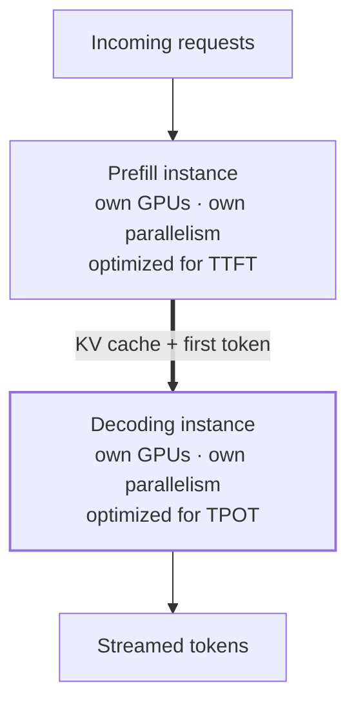

In the colocated design, both SLOs depend on one shared batch, so every scheduling choice trades TTFT against TPOT. In the disaggregated design, each SLO depends only on its own instance. The single new edge, the KV cache transfer, is the price. **[Interpretation]**

> **The central principle:** *Disaggregation turns one coupled optimization problem into two independently optimizable serving problems.*

---

## IV. Tradeoff Analysis — Batching and Parallelism for Prefill and Decode Instances

Disaggregation does more than remove interference. It lets each phase be **analyzed on its own**. Prefill and decode can now be scaled and scheduled independently, each against its own latency requirement. **[Paper]**

That also **expands the design space**. Every phase now needs its own answers to two questions: *how should it batch?* and *how should it parallelize?* **[Paper]** This section works through both questions for each instance type, then covers the two practical problems that show up in real deployments. **[Paper]**

The goal per instance is simple to state: **[Paper]**

- **Prefill instance:** meet the **TTFT** requirement at a given arrival rate using the **fewest resources**.
- **Decoding instance:** meet the **TPOT** requirement using the **fewest resources**.

### The Setup: Models and GPUs Used in the Paper

The paper's analysis and evaluation use the **OPT** model family on **NVIDIA A100-80GB** GPUs in FP16. **[Paper]**

| Where | Model | Hardware | Used for |
|---|---|---|---|
| §3 batching analysis | OPT-13B | 1× A100 | Prefill / decode throughput vs batch size (Figure 3) |
| §3 prefill parallelism | OPT-66B | 2× A100 | TTFT under inter-op vs intra-op (Figure 4) |
| §3 decode parallelism | OPT-13B | A100s, batch 128 | TPOT and throughput vs parallel degree (Figure 5) |
| §6 evaluation | OPT-13B / 66B / 175B | 4 nodes × 8 A100-SXM-80GB, NVLINK in-node, 25 Gbps cross-node | End-to-end serving |

OPT was chosen on purpose. It uses classic **multi-head attention (MHA)**, which produces a large KV cache and so **puts real pressure on the KV-cache transfer** that disaggregation introduces. **[Paper]**

### Our Running Example: A 70B Model on Two H100 GPUs

To make the math concrete, we follow one modern configuration through the whole section. **[Interpretation]** These are assumptions for the example, not numbers from the paper:

| Parameter | Value (assumed) |
|---|---|
| Model | 70B-parameter dense decoder (Llama-2/3-70B class) |
| Layers $n_L$ | 80 |
| Hidden size $d$ | 8192 |
| Attention | GQA: 64 query heads, **8 KV heads** $n_{kv}$, head dim $d_h = 128$ |
| Precision | BF16 (2 bytes per value) |
| GPU | NVIDIA H100 SXM, 80 GB HBM3 |
| H100 peak compute | ≈ 989 TFLOPS dense BF16 |
| H100 memory bandwidth | ≈ 3.35 TB/s |
| H100 NVLink | ≈ 900 GB/s aggregate (≈ 450 GB/s per direction) |

**First constraint: the model does not fit on one GPU.** **[Derived]**

$$
\text{Weights} = 70 \times 10^{9} \times 2 \ \text{bytes} = 140 \ \text{GB} \; > \; 80 \ \text{GB}
$$

So every instance, prefill or decode, needs **at least two H100s**. How those two GPUs split the model is exactly the parallelism question this section answers.

**Second constraint: the KV cache per token.** Every layer stores one key and one value vector per KV head: **[Derived]**

$$
s_{kv} = 2 \times n_L \times n_{kv} \times d_h \times 2 \ \text{bytes} = 2 \times 80 \times 8 \times 128 \times 2 = 327{,}680 \ \text{bytes} \approx 320 \ \text{KiB per token}
$$

We will reuse $s_{kv}$ for decode memory budgeting and for KV-cache transfer cost.

**The two H100s in our running example, and the resource each phase is bound by.**

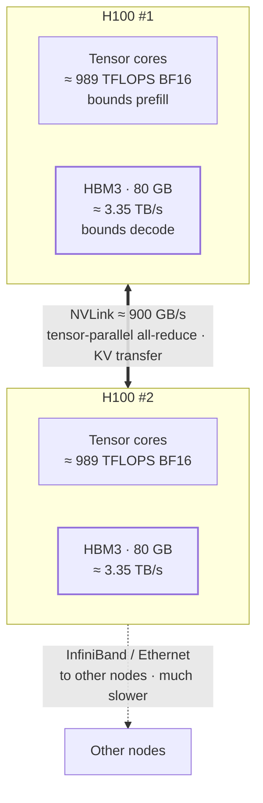

Three numbers drive the whole analysis. **[Derived]**

- **Tensor-core FLOPS** limit prefill, which is compute-bound.
- **HBM bandwidth and capacity** limit decode. Bandwidth sets TPOT; capacity (160 GB total minus 140 GB of weights) sets the batch size.
- **Link bandwidth** decides how fast KV caches can move between instances. NVLink inside a node is far faster than the network between nodes, and that gap is what separates Algorithm 1 from Algorithm 2 later.

### Parallelism Primer: Pipeline vs Tensor vs Data Parallelism

The paper uses two forms of **model parallelism**: **inter-operator** and **intra-operator**. **[Paper]** They split the *model*, not the *requests*.

Take **3 prompts of 128 tokens each** on **2 GPUs**, with a 60-layer model. **[Interpretation]**

#### Pipeline Parallelism (Inter-Op): Split the Layers

Each GPU holds a contiguous block of **layers**. A request's activations flow from stage to stage. **[Paper]**

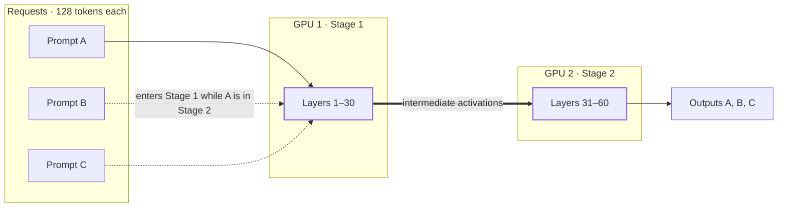

- GPU 1 runs Prompt A through layers 1–30 and passes the **activations** to GPU 2.
- While GPU 2 finishes A, GPU 1 **starts on B**. Both GPUs stay busy.
- The inter-stage communication is small, so a single request's latency stays roughly the same as on one device. **Capacity doubles.** **[Paper]**

#### Tensor Parallelism (Intra-Op): Split the Operations Inside Each Layer

Each GPU holds **a slice of every layer's weight matrices**. All GPUs work on **the same tokens at the same time**. **[Paper]**

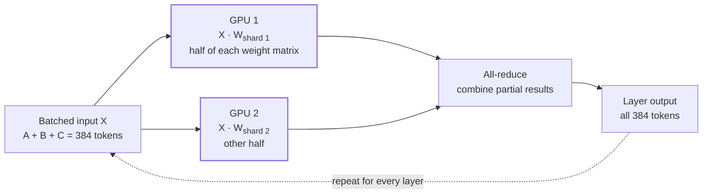

- Both GPUs process **all three prompts together**, each computing a different part of the same matrix multiplications.
- Execution time drops, which directly cuts **latency**, but every layer ends in a **collective communication**. That requires high-bandwidth links such as NVLINK. **[Paper]**

#### Data Parallelism (Replication): Split the Requests

Sending Prompt A to GPU 1 and Prompt B to GPU 2, each with a **full copy of the model**, is **data parallelism**, not tensor parallelism. The paper calls this **replication**. **[Interpretation]** It only applies when the model fits on one GPU, which our 70B example does not.

| | Pipeline (inter-op) | Tensor (intra-op) | Replication (data) |
|---|---|---|---|
| **What is split** | Layers | Operations inside each layer | Requests |
| **Per-request latency** | ≈ unchanged (small inter-stage cost) | **Lower** (by a factor $K < 2$ at degree 2) | Unchanged |
| **Rate capacity** | Scales **≈ linearly** | Scales sub-linearly | Scales linearly |
| **Communication** | Activations between stages (light) | Collective every layer (heavy, needs NVLINK) | None between replicas |
| **Memory per GPU** | Weights of its layers | Slice of all weights | Full model |

The paper points out one more benefit of model parallelism: **shorter execution time also reduces queuing delay**, in both phases. **[Paper]** That is where the queueing math below comes in.

---

### IV.A The Prefill Instance

#### Batching Strategy: The Compute-Bound Threshold $L_m$

Prefill is **compute-intensive**. For a 13B model on an A100, a **single 512-token sequence** already fully engages the GPU. **[Paper]**

Once the GPU is compute-bound, **batching more requests does not raise efficiency**. It only stretches the batch's processing time and delays every request in it. **[Paper]**

So DistServe profiles each model–GPU pair ahead of time to find a critical input length $L_m$: **[Paper]**

- If a request's input length is **below $L_m$**, batching more prefill requests can still help.
- **Above $L_m$**, prefill is compute-bound, so batching hurts.
- User prompts typically average **hundreds of tokens**, so prefill batch sizes stay **small** in practice.


*Figure 3(a) from the paper: prefill throughput (tokens/s) for a 13B model as batch size grows, one curve per input length.* **[Paper]**

- **Short prompts (128 tokens)** keep gaining throughput until a batch of about 16, where they plateau near **≈ 9,300 tokens/s**. Batching helps them.
- **512-token prompts** are almost flat from a batch of 4, at about **7,000 tokens/s**. The GPU is already compute-bound.
- **1,024-token prompts** plateau lowest, at about **5,400 tokens/s**, because attention cost grows with length.

The flat curves are $L_m$ made visible: past the threshold, a bigger batch only makes every request wait longer. **[Interpretation]**

**Running example: where does $L_m$ land on an H100?** **[Derived]** A rough first estimate comes from **arithmetic intensity**. A dense layer processing $L$ tokens does about $2L$ FLOPs per weight while reading each 2-byte weight once:

$$
\text{AI}_{\text{prefill}} \approx \frac{2 \, N \, L}{2 \, N} = L \ \ \text{FLOP/byte},
\qquad
\text{ridge}_{\text{H100}} \approx \frac{989 \ \text{TFLOPS}}{3.35 \ \text{TB/s}} \approx 295
$$

So on an H100, prefill turns compute-bound somewhere around **a few hundred tokens**. A 512-token prompt is already past the ridge. This is only an estimate that ignores attention and kernel effects; the paper's point is that you **profile** $L_m$, not derive it. **[Interpretation]**

#### Parallelism Plan: Prefill as an M/D/1 Queue

To compare the two parallelism strategies, the paper serves **OPT-66B on two A100s**. It assumes **uniform 512-token inputs** and **Poisson arrivals**. **[Paper]**

The observation (Figure 4a): **intra-op wins at low arrival rates, inter-op wins as the rate rises.** **[Paper]**

Why? After disaggregation, a prefill instance behaves like an **M/D/1 queue**: Poisson arrivals, deterministic service time (uniform lengths), one server. That means closed-form queueing theory applies. **[Paper]**

**Notation.** **[Paper]**

- $D$ — execution time of one request on a single device (constant, since lengths are uniform)
- $R$ — Poisson arrival rate (requests/s)
- Scheduling is **FCFS without batching**, since one request already saturates the GPU
- Stability requires $RD < 1$

**Eq. 1 — single device, no parallelism.** **[Paper]**

$$
\overline{\text{TTFT}} = \underbrace{D}_{\text{execution}} + \underbrace{\frac{R D^{2}}{2(1 - RD)}}_{\text{queuing delay}}
$$

The first term is the time spent **computing**. The second is the time spent **waiting**, and it blows up as $RD \to 1$. **[Paper]**

**Eq. 2 — 2-way inter-op (pipeline) parallelism.** **[Paper]** Request-level latency becomes $D_s$, and the slowest stage takes $D_m$. Inter-layer activation traffic is negligible, so $D \approx D_s \approx 2 D_m$:

$$
\overline{\text{TTFT}}_{\text{inter}} = D_s + \frac{R D_m^{2}}{2(1 - R D_m)} = D + \frac{R D^{2}}{4(2 - RD)}
$$

Pipelining **does not shorten execution** (the first term is still $D$). It **shrinks the queuing term**, because the queue now drains at the rate of the *slowest stage*, $D_m = D/2$. **[Derived]**

**Eq. 3 — 2-way intra-op (tensor) parallelism.** **[Paper]** A speedup coefficient $K$, with $1 < K < 2$, captures the imperfect speedup caused by intra-op communication. Execution time becomes $D_s = D/K$:

$$
\overline{\text{TTFT}}_{\text{intra}} = \frac{D}{K} + \frac{R D^{2}}{2K(K - RD)}
$$

Tensor parallelism **shortens execution** (first term $D/K$) but gives a smaller capacity gain than pipelining, because $K < 2$. **[Derived]**

**Reading the equations side by side:** **[Paper]**

- **Low rates → execution time dominates → intra-op wins.** It is the only option that reduces the first term.
- **High rates → queuing dominates → inter-op wins.** It shrinks the second term more.
- **A more stringent TTFT SLO favors intra-op**, since only it reduces execution time.
- **Lower $K$ weakens intra-op.** $K$ depends on input length, model architecture, communication bandwidth, and placement.

The stability conditions make the capacity difference explicit: **[Derived]**

| Configuration | Stable while | Max rate (as a multiple of $1/D$) |
|---|---|---|
| Single device | $RD < 1$ | $1$ |
| Intra-op, degree 2 | $RD < K$ | $K$ (between 1 and 2) |
| Inter-op, degree 2 | $RD < 2$ | $2$ |

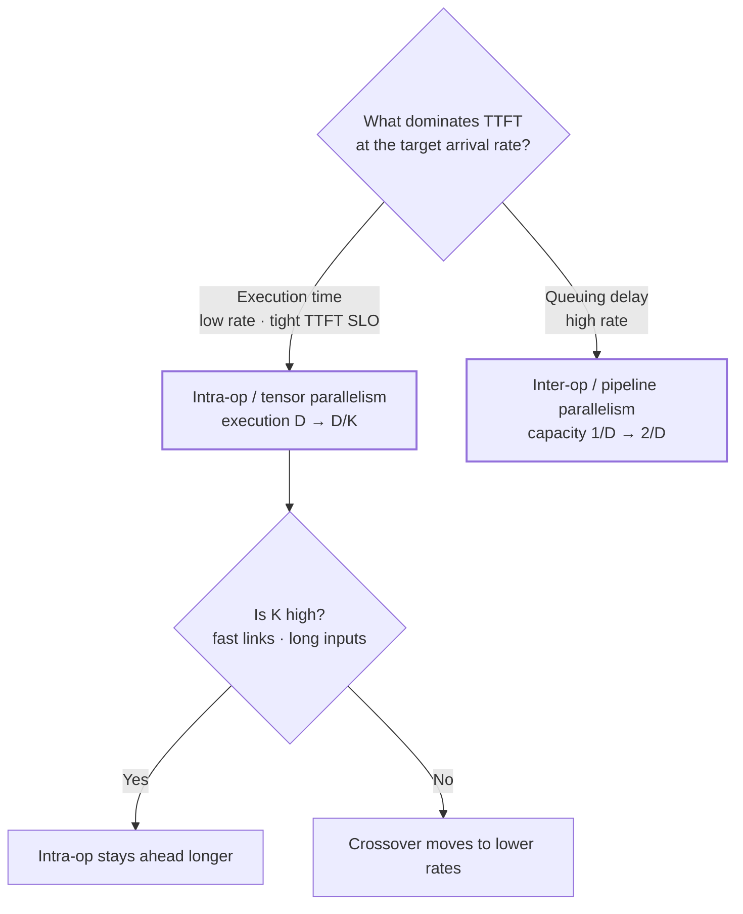


*Figure 4 from the paper: average TTFT for OPT-66B on two A100s. (a) measured inter-op vs intra-op; (b) modeled intra-op curves for K from 1.5 to 1.9.* **[Paper]**

- **(a)** Intra-op (orange) has lower TTFT up to about **3 req/s**. Past that, its queue explodes and it passes 1 s near 4 req/s. Inter-op (blue) starts higher but stays under **0.7 s** at 4.5 req/s. **[Paper]**
- **(b)** A higher $K$ pushes the intra-op curve right, so it stays competitive to higher rates. A low $K$ makes intra-op lose early. **[Paper]**

This is exactly the crossover our worked example below computes for two H100s. **[Interpretation]**

#### Worked Example: 70B Prefill on Two H100 GPUs

Now apply Eqs. 1–3 to the running example: a prefill instance of **two H100s**, with 512-token prompts. **[Derived]**

**Step 1 — estimate $D$.** A forward pass costs about $2N$ FLOPs per token. Attention FLOPs at 512 tokens are small next to that, so we ignore them:

$$
\text{FLOPs} \approx 2 \times 70 \times 10^{9} \times 512 \approx 7.17 \times 10^{13}
$$

Assume **50% model-FLOPs utilization (MFU)** on one H100 (≈ 495 TFLOPS effective):

$$
D \approx \frac{7.17 \times 10^{13}}{4.95 \times 10^{14}} \approx 0.145 \ \text{s} \;\approx\; 0.15 \ \text{s}
$$

$D$ is a **notional** single-device time. 140 GB does not fit on one H100, but the queueing model only needs $D$ as the reference unit that both parallel configurations are measured against. **[Interpretation]**

**Step 2 — pick $K$.** Assume $K = 1.6$: a good-but-imperfect tensor-parallel speedup over NVLink. **[Interpretation]**

**Step 3 — evaluate.** Average TTFT in seconds, with $D = 0.15$ s and $K = 1.6$: **[Derived]**

| Arrival rate $R$ (req/s) | Single device (Eq. 1) | Inter-op PP=2 (Eq. 2) | Intra-op TP=2 (Eq. 3) |
|---|---|---|---|
| 0.5 | 0.156 | 0.151 | **0.096** |
| 2 | 0.182 | 0.157 | **0.105** |
| 4 | 0.262 | 0.166 | **0.122** |
| 6 | 0.825 | 0.181 | **0.154** |
| 8 | unstable ($RD > 1$) | **0.206** | 0.234 |
| 10 | unstable | **0.262** | 0.797 |

The curves **cross at ≈ 7.3 req/s**. Below it, tensor parallelism gives lower TTFT. Above it, pipeline parallelism does, and tensor parallelism is heading for its stability limit at $R = K/D \approx 10.7$ req/s. Pipeline parallelism stays stable until $R = 2/D \approx 13.3$ req/s. **[Derived]**

**Step 4 — add the SLO.** What is the maximum arrival rate each configuration can sustain while keeping *average* TTFT within the SLO? **[Derived]**

| TTFT SLO | Inter-op PP=2 | Intra-op TP=2 ($K = 1.6$) |
|---|---|---|
| 0.12 s (stringent) | **0 req/s**: can never meet it, since execution alone is $D = 0.15$ s | **≈ 3.8 req/s** |
| 0.20 s | ≈ 7.6 req/s | ≈ 7.4 req/s |
| 0.30 s (relaxed) | **≈ 10.7 req/s** | ≈ 8.7 req/s |

This is the paper's claim in numbers. **A stringent SLO makes intra-op the only viable choice. A relaxed SLO at high load favors inter-op.** **[Derived]**

**Step 5 — sensitivity to $K$.** The crossover rate moves with $K$: **[Derived]**

| $K$ | Crossover rate | TP=2 TTFT at $R = 4$ |
|---|---|---|
| 1.3 (slow links) | ≈ 4.1 req/s | 0.165 s |
| 1.6 | ≈ 7.3 req/s | 0.122 s |
| 1.9 (near-ideal) | ≈ 10.8 req/s | 0.097 s |

The best prefill parallelism is not a fixed rule. It depends on **rate, SLO, and $K$** together, which is why DistServe searches for it instead of hard-coding it. **[Interpretation]**

---

### IV.B The Decoding Instance

A decoding instance has a different computational pattern. It **receives the KV cache and the first output token** from a prefill instance, then generates the remaining tokens **one at a time**. **[Paper]**

#### Batching Strategy: Amortizing Memory Bandwidth

A single decoding job is **heavily bandwidth-bound**. Each step reads all the weights to produce **one token per request**. **Batching** is the key to avoiding low GPU utilization, and therefore to high per-GPU goodput. **[Paper]**

**Why batching is nearly free for decode.** **[Derived]** In the memory-bound regime, one decode step costs roughly the time to stream the weights plus the batch's KV cache from HBM:

$$
t_{\text{step}}(B) \approx \frac{W + B \cdot L \cdot s_{kv}}{\text{BW}_{\text{HBM}}},
\qquad
\text{TPOT} \approx t_{\text{step}},
\qquad
\text{throughput} \approx \frac{B}{t_{\text{step}}}
$$

Here $W$ is the weight bytes, $B$ is the batch size, and $L$ is the context length per request. The weights are read **once per step no matter how large $B$ is**, so adding requests barely moves TPOT while throughput grows almost linearly.

For a dense layer in decode, the arithmetic intensity is about $B$ FLOP/byte. Decode stays **memory-bound until $B$ approaches the ridge point**. The paper puts that ridge at **156 on an A100-80GB**. **[Paper]** On an H100 it is **≈ 295**. **[Derived]**


*Figure 3(b) from the paper: decode throughput for the same 13B model and input lengths.* **[Paper]**

- At small batches, decode throughput is **tiny**: a few hundred tokens/s at most, versus thousands for prefill. The GPU is mostly waiting on memory.
- Throughput keeps **climbing with batch size** all the way to 128 (≈ 3,200 tokens/s for 128-token inputs). There is no plateau in sight.
- **Longer contexts** climb more slowly, and their curves stop early because their KV caches run out of memory first.

Prefill saturates at a batch of a few requests; decode wants as many as memory allows. That asymmetry is the strongest argument for giving them separate GPUs. **[Interpretation]**

**Why colocation caps the decode batch.** When prefill and decode share GPUs, growing the decode batch conflicts with meeting latency goals, especially at high request rates. More arrivals mean more prefill jobs. Prioritizing those jobs for TTFT hurts TPOT. **[Paper]**

Disaggregation solves this by letting **several prefill instances feed one decoding instance**. The decoding instance then accumulates a **large batch on dedicated GPUs** without sacrificing TPOT. **[Paper]**

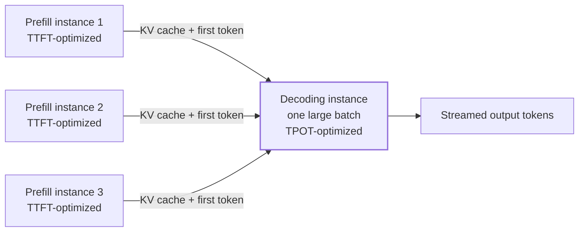

#### Parallelism Plan: How Decode Uses Multiple GPUs

Take **3 requests** that have finished prefill. Each has **its own KV cache** and its first output token. Parallelism applies to the **decoding computation**. It does not simply hand each request's KV cache to a different GPU. **[Interpretation]**

1. **Batching:** all 3 requests form **one decoding batch**. Each generates its next token by attending over **its own** KV cache.
2. **Tensor parallelism (intra-op):** the weight matrices are split across GPUs, and **both GPUs cooperate on every token for all 3 requests**. The KV cache is partitioned the same way the attention heads are.
3. **Pipeline parallelism (inter-op):** GPU 1 runs the early layers, GPU 2 the later ones. **Each GPU stores the KV cache only for its own layers.**

**Tensor parallelism (TP = 2): every GPU holds a slice of every layer.**

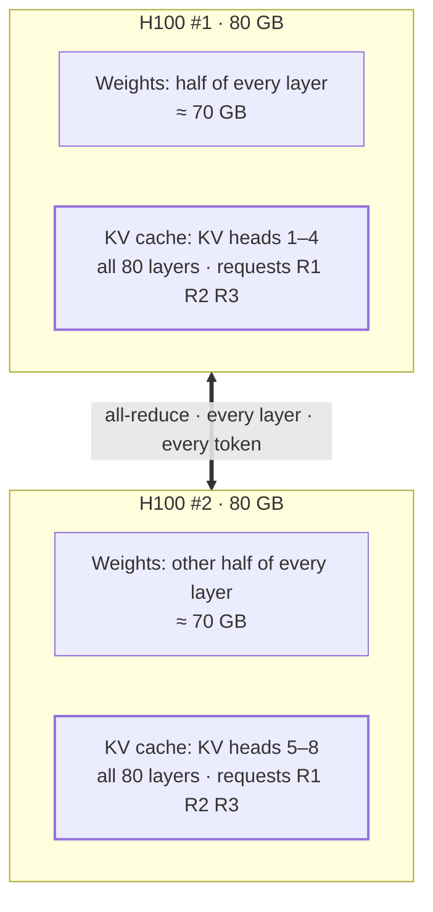

**Pipeline parallelism (PP = 2): every GPU holds all of some layers.**

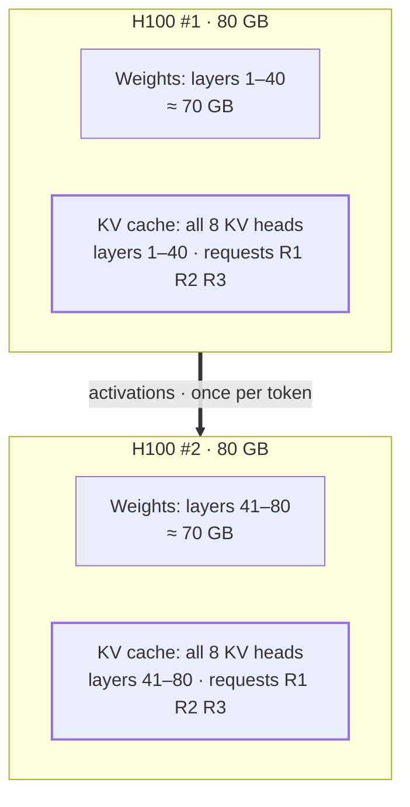

**Memory caps the batch.** After disaggregation, the decode batch size can be **limited by GPU memory**, because the KV cache of every active request must stay resident. Model parallelism, and KV-cache techniques such as **PagedAttention** and **GQA**, let the batch grow toward the compute-bound regime. **[Paper]**

**Running example: the decode memory budget on two H100s.** **[Derived]** Either way the model is split, the pair of GPUs holds 140 GB of weights:

$$
\text{KV budget} \approx 2 \times 80 - 140 = 20 \ \text{GB}
\;\;\Rightarrow\;\;
\frac{20 \times 10^{9}}{327{,}680} \approx 61{,}000 \ \text{tokens}
$$

At a **1,024-token context** per request, that is **≈ 59 concurrent requests**. This is an upper bound: it ignores activations, workspace, and fragmentation. It sits **well below the ≈ 295 ridge**, so on two H100s this decode instance is **memory-capacity-bound long before it becomes compute-bound**. That is exactly the constraint the paper describes. **[Derived]**

**Running example: TPOT and throughput vs batch size.** **[Derived]** Use a 1,024-token context and the memory-bound step model above. "Notional single device" means one hypothetical GPU with H100 bandwidth holding the whole model; "TP=2 (ideal)" halves the bytes each GPU streams and ignores all-reduce cost.

| Batch $B$ | Bytes per step | Notional single device | TP=2 (ideal) TPOT | TP=2 throughput |
|---|---|---|---|---|
| 1 | ≈ 140.3 GB | 41.9 ms | 20.9 ms | ≈ 48 tok/s |
| 8 | ≈ 142.7 GB | 42.6 ms | 21.3 ms | ≈ 376 tok/s |
| 32 | ≈ 150.7 GB | 45.0 ms | 22.5 ms | ≈ 1,422 tok/s |

Going from $B = 1$ to $B = 32$ raises TPOT by **~8%** and throughput by **~30×**. That is why disaggregated decode wants the largest batch memory allows. **[Derived]**

**Tensor vs pipeline for decode.** The paper tests large batches (Figure 5) and finds: **[Paper]**

- **Intra-op parallelism reduces latency, with diminishing returns**, due to communication and lower per-GPU utilization after partitioning.
- **Inter-op parallelism scales throughput almost linearly.**
- So when the **TPOT SLO is stringent, intra-op is essential** to meet it. Beyond that point, **inter-op is preferable** for adding throughput.

In the running example at $B = 32$: **[Derived]**

- **TP=2** gives TPOT ≈ **22.5 ms** in the ideal case, somewhat higher in practice because of the per-layer all-reduce.
- **PP=2** does not shorten a token's path. The token still crosses all 80 layers, so TPOT stays ≈ **45 ms**. What PP adds is overlap: running **two micro-batches** keeps both GPUs busy, which lifts aggregate throughput.
- With a **30 ms TPOT SLO**, only TP=2 meets it. With a **60 ms SLO**, both do, and PP's near-linear throughput scaling becomes attractive as the instance grows.


*Figure 5 from the paper: decode latency (left) and throughput (right) for a 13B model, batch size 128, input length 256, from 1 to 8 GPUs.* **[Paper]**

- **Latency (left).** Intra-op cuts per-step latency from ≈ 61 ms to ≈ 40 ms at 2 GPUs, but only to ≈ 31 ms at 8. Inter-op stays flat at ≈ 61 ms. **[Paper]**
- **Throughput (right).** Inter-op tracks the linear-scaling line, reaching ≈ 15,000 tokens/s on 8 GPUs. Intra-op flattens around ≈ 4,000 tokens/s. **[Paper]**

Read together: **use just enough tensor parallelism to meet TPOT, then add pipeline stages for throughput.** Our TP=2 vs PP=2 numbers above follow the same pattern. **[Interpretation]**

#### Replication: The Third Lever

When a model **fits on one GPU**, **replication** is also a competitive option for both instance types. It scales rate capacity linearly and cuts queuing delay by replacing $R$ with $R/N$ in Eq. 1, assuming requests are spread evenly over $N$ replicas. The cost is **another full copy of the weights** per replica. **[Paper]**

For our 70B model, one replica already needs two H100s. Replication therefore works at the **instance** level (more 2-GPU instances), not the single-GPU level. **[Derived]**

---

### IV.C Practical Problems in Disaggregated Deployment

The analysis above assumed uniform prompts and free communication. Real deployments break both assumptions. **[Paper]**

#### Problem 1 — Variable Prefill Lengths Create Pipeline Bubbles

Real prompt lengths are **non-uniform**. With inter-op parallelism, pipeline-stage execution times vary from request to request, which creates **pipeline bubbles**: idle time on some stages. The system then deviates somewhat from what the M/D/1 model predicts. **[Paper]**

DistServe handles this two ways. It **searches parallelism configurations against the actual workload**, and it uses **scheduling to minimize bubbles**. Both are covered in later sections. **[Paper]**

```mermaid
gantt
    title Prefill with PP = 2 — mixed prompt lengths leave stages idle
    dateFormat x
    axisFormat %L ms
    section GPU 1 · Stage 1
    A · 512 tok          :a1, 0, 100
    B · 2048 tok         :b1, 100, 500
    C · 256 tok          :c1, 500, 550
    idle                 :crit, i1, 550, 900
    section GPU 2 · Stage 2
    idle                 :crit, i2, 0, 100
    A · 512 tok          :a2, 100, 200
    bubble · waits for B :crit, i3, 200, 500
    B · 2048 tok         :b2, 500, 900
    C · 256 tok          :c2, 900, 950
```

The timings in this diagram are illustrative, not measured. **[Interpretation]** Stage 2 finishes A and then sits idle for 300 ms while Stage 1 works through the long prompt B. Short prompt C then waits behind B at Stage 2. With uniform lengths, the stages would hand off in lockstep and neither GPU would idle.

#### Problem 2 — KV-Cache Transfer Overhead

Disaggregation's one new cost is moving the KV cache from prefill to decode. It is **not negligible**. **[Paper]**

The transfer bandwidth needed to hide it is simply the arrival rate times the KV-cache size per request: **[Derived]**

$$
\text{BW}_{\text{required}} = R \times S_{kv},
\qquad
S_{kv} = s_{kv} \times L_{\text{in}} = 2 \, n_L \, n_{kv} \, d_h \, b \, L_{\text{in}}
$$

where $b$ is the number of bytes per value.

**The paper's example: OPT-66B.** **[Paper]**

- One **512-token** request produces **≈ 1.13 GB** of KV cache.
- At **10 requests/s**, that is **11.3 GB/s**, or **≈ 90 Gbps**, of sustained transfer just to keep the overhead invisible.

Checking with the formula: OPT-66B has 64 layers, hidden size 9216, and full MHA, so $2 \times 64 \times 9216 \times 2 \times 512 \approx 1.21 \times 10^{9}$ bytes $\approx 1.13$ GiB. ✓ **[Derived]**

**Running example: 70B with GQA.** **[Derived]**

$$
S_{kv} = 327{,}680 \times 512 \approx 168 \ \text{MB},
\qquad
\text{BW}_{\text{required}} = 10 \times 168 \ \text{MB/s} \approx 1.68 \ \text{GB/s} \approx 13.4 \ \text{Gbps}
$$

That is **~7× less** than OPT-66B, because only **8 KV heads** are cached instead of full-width keys and values. The paper anticipates this: models using **GQA and MQA** shrink the KV cache and so **lower the transmission overhead**, which is why it deliberately evaluates on MHA-based OPT. **[Paper]**

**How long does one 168 MB transfer take?** **[Derived]**

| Link | Bandwidth | Transfer time per request |
|---|---|---|
| H100 NVLink (intra-node, per direction) | ≈ 450 GB/s | ≈ 0.37 ms |
| InfiniBand 400 Gbps (cross-node) | ≈ 50 GB/s | ≈ 3.4 ms |
| 25 Gbps Ethernet (the paper's cross-node testbed) | ≈ 3.1 GB/s | ≈ 54 ms |

Over NVLink the transfer is invisible. Over a 25 Gbps cross-node link it costs **more than two decode steps** of TPOT, per request. For MHA models it would cost about 7× more again. **[Derived]**

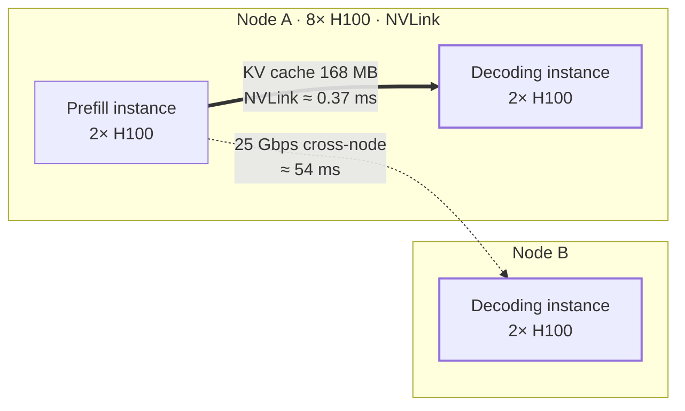

The paper's answer depends on the cluster: **[Paper]**

- Many modern LLM clusters have **InfiniBand (e.g., 800 Gbps)**, which makes cross-node transfer cheap.
- Where cross-node bandwidth is limited, DistServe relies on **intra-node NVLINK** (600 GB/s peak between A100s), which again makes the transfer negligible.
- That reliance **constrains where prefill and decoding instances can be placed**. Placement becomes part of the optimization.

**What §3.3 is *not* about.** Pre-allocating KV-cache memory for the maximum sequence length wastes GPU memory, but that is a **memory fragmentation** problem, addressed by techniques such as **PagedAttention**. It is not one of the two deployment problems the paper raises here. The paper's decode constraint is **capacity**: how many requests' KV caches fit at once. **[Interpretation]**

---

### What the Tradeoff Analysis Sets Up

The analysis leaves a set of interacting knobs: **[Paper]**

- **Workload pattern** — input/output lengths, arrival rate
- **Placement constraints** — which links connect prefill and decoding instances
- **SLO requirements** — TTFT and TPOT targets
- **Parallelism strategies** — intra-op and inter-op degree, per phase
- **Resource allocation** — how many GPUs and instances per phase

No single rule of thumb resolves all five together. Choosing the configuration that **maximizes per-GPU goodput** means **searching** this space automatically. That search is the job of DistServe's placement algorithms, covered in the next section. **[Paper]**

---

## V. DistServe Method: Goodput-Optimized Placement

Section IV showed that the best parallelism for each phase depends on rate, SLO and hardware. It gave no single rule. DistServe's method turns that analysis into a **search**. **[Interpretation]**

Given the model, the workload, the latency SLOs and the SLO-attainment target, DistServe decides three things: **[Paper]**

1. **Parallelism**: the tensor and pipeline parallelism degrees for prefill instances and for decoding instances.
2. **Instance count**: how many instances of each type to deploy.
3. **Physical placement**: which GPUs and nodes each instance occupies.

The paper calls that solution a **placement**. The goal is the placement that **maximizes per-GPU goodput**. **[Paper]**

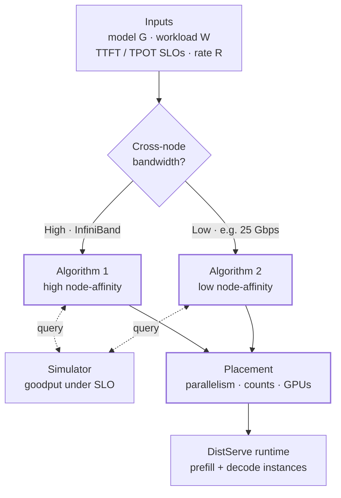

Both algorithms share one objective. They differ only in **which configurations they are allowed to select**, and that is set by the KV-cache transfer bandwidth. **[Interpretation]**

### Problem Formulation: Maximizing Per-GPU Goodput

**Inputs.** Both algorithms take the same six inputs: **[Paper]**

| Symbol | Meaning |
|---|---|
| $G$ | the LLM (its size and architecture) |
| $N$ | maximum number of nodes one instance may span |
| $M$ | GPUs per node (typically 8) |
| $C$ | memory capacity of one GPU |
| $W$ | workload: arrival process and input/output length distributions |
| $R$ | required traffic rate (req/s) |

**Goodput of one configuration.** SLO attainment is the fraction of requests that meet the latency target. For a configuration, goodput is the highest rate that still reaches the attainment target (90% in the paper): **[Paper]**

$$
\text{goodput}(\text{config}) = \max \big\{\, r \;:\; \text{attainment}(\text{config},\, r) \ge 90\% \,\big\}
$$

For a prefill instance, attainment counts requests that meet the TTFT SLO. For a decoding instance, it counts requests that meet the TPOT SLO. **[Paper]**

**Objective.** Configurations are compared by **goodput per GPU**, not raw goodput. This is the quantity that sets cost per query: **[Paper]**

$$
\text{config}^{*} = \arg\max_{\text{config}} \; \frac{\text{config.goodput}}{\mathrm{config.num\_gpus}},
\qquad
\mathrm{config.num\_gpus} = \mathrm{inter\_op} \times \mathrm{intra\_op}
$$

**Memory feasibility.** A configuration is only considered if each GPU's weight shard fits in memory: **[Paper]**

$$
\frac{G.\text{size}}{\mathrm{inter\_op} \times \mathrm{intra\_op}} < C
$$

**Replication.** Once the best configuration for a phase is found, DistServe replicates it until the traffic rate is covered: **[Paper]**

$$
n = \left\lceil \frac{R}{\text{config}_p.\text{goodput}} \right\rceil,
\qquad
m = \left\lceil \frac{R}{\text{config}_d.\text{goodput}} \right\rceil
$$

For example, if $R = 100$ req/s, a prefill instance sustains 20 req/s and a decoding instance 25 req/s, DistServe deploys $\lceil 100/20 \rceil = 5$ prefill instances and $\lceil 100/25 \rceil = 4$ decoding instances. **[Derived]**

### Simulator-Based Goodput Estimation

Every comparison above needs $\text{config.goodput}$. That number has **no simple closed form**. Real workloads have diverse input and output lengths and irregular arrivals, so SLO attainment cannot be written down analytically. Profiling every candidate on a real testbed would take far too long. **[Paper]**

DistServe estimates it with a **simulator** instead. **[Paper]**

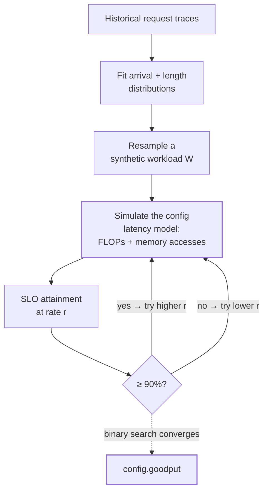

1. **Workload model.** Short-term arrivals are unpredictable, but workload patterns over hours or days usually are. DistServe fits a distribution to historical traces and resamples new traces from it. **[Paper]**
2. **Latency model.** The simulator counts the FLOPs and memory accesses of the prefill and decoding phases. A latency model then turns those counts into execution time. **[Paper]**
3. **Binary search.** DistServe searches for the highest rate at which simulated attainment still meets the target. That rate is the configuration's goodput. **[Paper]**

The approach works because DNN execution is highly predictable. The paper measures simulator error below **2%** against the real system (Table 2, Section VIII). **[Paper]**

### The Paper's Pseudocode: Algorithms 1 and 2


*Algorithms 1 and 2 as printed in the DistServe paper (Zhong et al., OSDI '24).*

Both are enumeration loops. Each loop contains a memory check, a call to the simulator, and a "keep the best goodput per GPU" update. **[Interpretation]**

### Algorithm 1: Placement for High Node-Affinity Clusters

**When it applies.** The cluster has fast cross-node networking, such as InfiniBand. KV-cache transfer across nodes is then negligible, so prefill and decoding instances can sit on **any two nodes** without constraint. **[Paper]**

**The idea: two levels.** First, optimize each phase's parallelism **separately**, to reach phase-level optimal per-GPU goodput. Then use **replication** to match the traffic rate. **[Paper]**

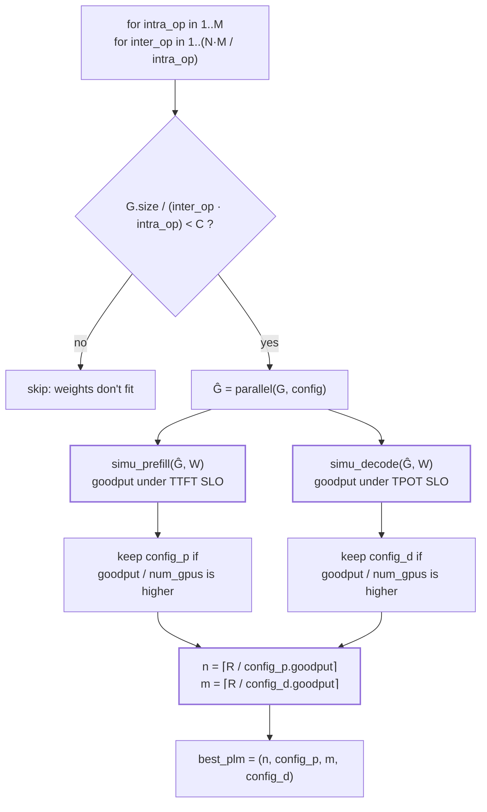

**Step 1 — Initialize.** Set $\text{config}_p$ and $\text{config}_d$ to empty. They hold the best prefill and decoding configurations found so far. **[Paper]**

**Step 2 — Enumerate parallelism.** The outer loop sets the tensor-parallel (intra-op) degree, from 1 to $M$. The inner loop sets the pipeline-parallel (inter-op) degree, up to $N \cdot M / \text{intra\_op}$, so one instance never uses more than $N \times M$ GPUs. **[Paper]**

With 2 nodes of 8 GPUs, one instance can use at most 16 GPUs. At TP = 4, PP can therefore go up to 4 stages. **[Derived]**

**Step 3 — Check memory.** Discard any configuration whose per-GPU weight shard exceeds $C$. **[Paper]**

**Step 4 — Simulate each phase separately.** $\texttt{simu\_prefill}$ returns the maximum rate that meets the TTFT SLO. $\texttt{simu\_decode}$ returns the maximum rate that meets the TPOT SLO. Each phase keeps the configuration with the higher **goodput per GPU**. **[Paper]**

The two phases can therefore end up with **completely different parallelism**. **[Interpretation]**

**Step 5 — Replicate.** Compute $n$ and $m$ with the ceiling formulas above and return $(n, \text{config}_p, m, \text{config}_d)$. **[Paper]**

**Cost.** The paper states the complexity as $O(NM^2)$. The search space is small, and solving takes under **1.3 minutes** in the largest setting. **[Paper]**

**Python implementation** (a direct translation of Algorithm 1; the simulators are defined in the worked use case below): **[Derived]**

```python
import math
from dataclasses import dataclass


@dataclass(frozen=True)
class Config:
    inter_op: int                # pipeline-parallel degree
    intra_op: int                # tensor-parallel degree
    goodput: float = 0.0         # max req/s meeting the SLO

    @property
    def num_gpus(self):
        return self.inter_op * self.intra_op


def per_gpu(cfg):
    return cfg.goodput / cfg.num_gpus if cfg else -1.0


def valid(pp, tp):
    # the paper's memory check, plus layer/head divisibility a real model needs
    return N_LAYERS % pp == 0 and N_HEADS % tp == 0 and MODEL_BYTES / (pp * tp) < C


def algorithm_1(N, M, R):
    config_p = config_d = None
    for intra_op in range(1, M + 1):
        for inter_op in range(1, N * M // intra_op + 1):
            if valid(inter_op, intra_op):
                c = Config(inter_op, intra_op, simu_prefill(inter_op, intra_op))
                if per_gpu(config_p) < per_gpu(c):
                    config_p = c
                c = Config(inter_op, intra_op, simu_decode(inter_op, intra_op))
                if per_gpu(config_d) < per_gpu(c):
                    config_d = c
    n = math.ceil(R / config_p.goodput)
    m = math.ceil(R / config_d.goodput)
    return n, config_p, m, config_d
```

### Algorithm 2: Placement for Low Node-Affinity Clusters

**When it applies.** GPUs inside a node share fast NVLink, but cross-node bandwidth is limited. The paper's own testbed is like this, with **25 Gbps** between nodes. **[Paper]** Section IV.C showed that at this bandwidth, KV-cache transfer is far from free.

**Why simple colocation fails.** The obvious fix is to always put a prefill instance and its decoding instance on the same node. For large models, that pair may not fit: **[Paper]**

$$
\text{OPT-175B: } \; 350 \ \text{GB} \times 2 = 700 \ \text{GB} \; > \; 8 \times 80 \ \text{GB} = 640 \ \text{GB}
$$

**The key insight: instance segments.** KV-cache transfer happens **only between corresponding layers** of the prefill and decoding instances. DistServe uses pipeline parallelism to split each instance into **segments**, one per pipeline stage. It then **colocates the prefill and decoding segments of the same stage on one node**. All KV traffic stays on NVLink, and only small activations cross nodes. **[Paper]**

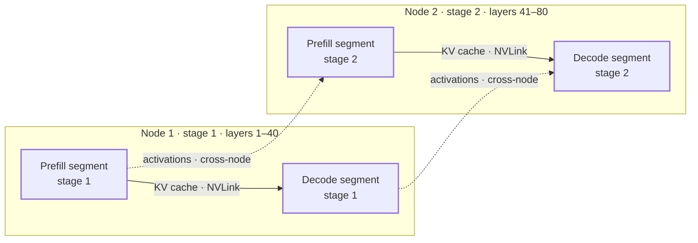

Inside a node, all segments of the same instance share the same parallelism and resource allocation. With about 8 GPUs per node, the per-node options can simply be enumerated. **[Paper]**

**Step 1 — Enumerate pipeline degrees.** $\text{inter\_op}$ ranges only up to $N$, because each pipeline stage lives on its own node. **[Paper]**

**Step 2 — Get per-node segment options.** $\texttt{get\_intra\_node\_configs}(G, M, C, \text{inter\_op})$ returns the feasible GPU configurations for one stage, subject to memory and the GPUs available in one node. **[Paper]**

**Step 3 — Pick prefill and decode together.** This is the real difference from Algorithm 1. Both segments must fit on **one node**: **[Paper]**

$$
P_p.\mathrm{num\_gpus} + P_d.\mathrm{num\_gpus} \le M
$$

On an 8-GPU node, 4 + 4 is feasible and 4 + 8 is not. **[Derived]**

**Step 4 — Simulate the pair jointly.** Placement couples the phases, so one call, $\texttt{simulate}(\hat{G}_p, \hat{G}_d, W)$, evaluates the combined prefill–decode unit. **[Paper]**

**Step 5 — Keep the best goodput per GPU**, using the same comparison as Algorithm 1. **[Paper]**

**Step 6 — Replicate the unit.** Compute $n = \lceil R / \text{config}^{\ast}.\text{goodput} \rceil$ and return $(n, \text{config}^{\ast})$. **[Paper]**

**Python implementation** (a direct translation of Algorithm 2; `simulate` scores the unit by its slower phase): **[Derived]**

```python
@dataclass(frozen=True)
class Segment:
    intra_op: int                # GPUs for this stage's segment on one node

    @property
    def num_gpus(self):
        return self.intra_op


def get_intra_node_configs(M, inter_op):
    # one pipeline stage per node; that stage's weight shard must fit on its GPUs
    return [Segment(tp) for tp in range(1, M + 1) if valid(inter_op, tp)]


def simulate(inter_op, Pp, Pd):
    # one prefill + one decode instance: the unit is limited by its slower phase
    return min(simu_prefill(inter_op, Pp.intra_op), simu_decode(inter_op, Pd.intra_op))


def algorithm_2(N, M, R):
    best = None
    for inter_op in range(1, N + 1):
        P = get_intra_node_configs(M, inter_op)
        for Pp in P:
            for Pd in P:
                if Pp.num_gpus + Pd.num_gpus <= M:
                    gpus = inter_op * (Pp.num_gpus + Pd.num_gpus)
                    g = simulate(inter_op, Pp, Pd)
                    if best is None or g / gpus > best[3] / best[4]:
                        best = (inter_op, Pp, Pd, g, gpus)
    n = math.ceil(R / best[3])
    return n, best
```

### Algorithm 1 vs Algorithm 2 at a Glance

| | Algorithm 1 | Algorithm 2 |
|---|---|---|
| Network | Fast cross-node (InfiniBand) | Limited cross-node, fast NVLink in-node |
| Optimization | Prefill and decode **separately** | Prefill and decode **jointly** |
| Placement | Anywhere in the cluster | Same-stage segments on the same node |
| Simulation | Two independent simulations | One combined simulation |
| Replication | Each phase separately ($n$, $m$) | The combined unit ($n$) |
| Objective | Max goodput per GPU under SLOs | Max goodput per GPU under SLOs |

The objective is the same in both. Only the **placement constraint imposed by KV-transfer bandwidth** differs. **[Interpretation]**

### Worked Use Case: Placing a 70B Model on an H100 Cluster

Now run both algorithms end to end. We reuse the Section IV running example (a 70B model with GQA on H100s) and scale it to a production target. **[Interpretation]** Every number below is an assumption or comes from the script. None of it is from the paper.

| Parameter | Value (assumed) |
|---|---|
| Model | 70B, 80 layers, 64 heads, 8 KV heads, BF16 (140 GB) |
| Cluster | $M = 8$ H100-80GB per node; an instance may span $N = 2$ nodes |
| Workload | 512 input tokens, 256 output tokens, Poisson arrivals |
| SLOs | TTFT ≤ 0.25 s, TPOT ≤ 50 ms |
| Target rate | $R = 200$ req/s |

**The toy simulator.** DistServe's simulator is a discrete-event model. As a stand-in, we reuse the closed-form models from Section IV: **[Derived]**

- **Prefill** uses the M/D/1 queue, generalized to $PP \times TP$. Execution time is $D_s = D/K$ with $K = TP^{0.678}$, so $K(2) = 1.6$. The stage time is $D_m = D_s / PP$:

$$
\overline{\text{TTFT}} = D_s + \frac{r\, D_m^{2}}{2\,(1 - r\, D_m)}
$$

- **Decode** grows the batch until either GPU memory runs out or the SLO is hit. Each step costs the larger of its memory time and its compute time:

$$
\text{TPOT} = \max\!\left(\frac{\text{weights} + b \cdot \text{ctx} \cdot s_{kv}}{\text{HBM BW} \cdot TP^{0.9}},\; \frac{2N \cdot b}{\text{FLOP/s} \cdot TP^{0.9}}\right)
$$

- Each extra pipeline stage adds 2% overhead. Prompt lengths are uniform, so the toy has **no pipeline bubbles**, which is the real problem from Section IV.C.

```python
GiB = 1e9
MODEL_BYTES = 140 * GiB          # 70B params x 2 bytes (BF16)
C = 80 * GiB                     # H100 memory
HBM_BW = 3.35e12                 # bytes/s
S_KV = 327_680                   # KV bytes per token (80 layers, 8 KV heads, d_h 128, BF16)
D_PREFILL = 0.145                # notional single-GPU prefill time, 512 tokens at 50% MFU
PEAK_EFF = 989e12 * 0.5          # effective FLOP/s per GPU at 50% MFU
N_LAYERS, N_HEADS = 80, 64
IN_LEN, OUT_LEN = 512, 256
TTFT_SLO, TPOT_SLO = 0.25, 0.05  # seconds
ETA = 0.678                      # TP efficiency exponent: K(tp) = tp**ETA, so K(2) = 1.6
PP_OVERHEAD = 0.02               # 2% extra per extra pipeline stage


def max_rate(meets_slo, hi=1_000.0, iters=60):
    """Binary search for the largest rate that still meets the SLO."""
    lo = 0.0
    for _ in range(iters):
        mid = (lo + hi) / 2
        lo, hi = (mid, hi) if meets_slo(mid) else (lo, mid)
    return lo


def simu_prefill(pp, tp):
    ds = D_PREFILL / tp**ETA * (1 + PP_OVERHEAD * (pp - 1))   # execution time
    dm = ds / pp                                                # slowest-stage time

    def ttft(r):                                                # M/D/1, generalizes Eqs. 1-3
        return math.inf if r * dm >= 1 else ds + r * dm**2 / (2 * (1 - r * dm))

    return max_rate(lambda r: ttft(r) <= TTFT_SLO)


def simu_decode(pp, tp):
    kv_budget = pp * tp * C - MODEL_BYTES
    ctx = IN_LEN + OUT_LEN
    best = 0.0
    for b in range(1, 4097):                                   # requests per micro-batch
        if pp * b * ctx * S_KV > kv_budget:                    # memory caps the batch
            break
        mem = (MODEL_BYTES + b * ctx * S_KV) / (HBM_BW * tp**0.9)       # read weights + KV
        compute = 2 * 70e9 * b / (PEAK_EFF * tp**0.9)                   # 2N FLOPs per token
        tpot = max(mem, compute) * (1 + PP_OVERHEAD * (pp - 1))
        if tpot > TPOT_SLO:
            break
        best = pp * b / tpot / OUT_LEN                         # req/s = tokens/s / tokens per request
    return best


if __name__ == "__main__":
    N, M, R = 2, 8, 200.0          # up to 2 nodes per instance, 8 H100s per node, 200 req/s

    n, cp, m, cd = algorithm_1(N, M, R)
    print(f"Algorithm 1: {n} x prefill(PP={cp.inter_op}, TP={cp.intra_op}) "
          f"@ {cp.goodput:.1f} req/s, {per_gpu(cp):.2f} req/s/GPU")
    print(f"             {m} x decode (PP={cd.inter_op}, TP={cd.intra_op}) "
          f"@ {cd.goodput:.1f} req/s, {per_gpu(cd):.2f} req/s/GPU")
    print(f"             total GPUs = {n * cp.num_gpus + m * cd.num_gpus}")

    n2, (pp, Pp, Pd, g, gpus) = algorithm_2(N, M, R)
    print(f"Algorithm 2: {n2} x unit(PP={pp}, prefill TP={Pp.intra_op}, decode TP={Pd.intra_op}) "
          f"@ {g:.1f} req/s, {g / gpus:.2f} req/s/GPU, total GPUs = {n2 * gpus}")
```

Paste the three code blocks into one file, in any order with the `__main__` block last, and it runs as-is. The output is: **[Derived]**

```text
Algorithm 1: 8 x prefill(PP=5, TP=1) @ 27.3 req/s, 5.47 req/s/GPU
             4 x decode (PP=2, TP=2) @ 50.5 req/s, 12.62 req/s/GPU
             total GPUs = 56
Algorithm 2: 7 x unit(PP=2, prefill TP=4, decode TP=2) @ 32.2 req/s, 2.68 req/s/GPU, total GPUs = 84
```

**What the search saw.** These are the top candidates per phase, ranked by goodput per GPU: **[Derived]**

| Rank | Prefill (PP × TP) | Goodput | Per GPU | Decode (PP × TP) | Goodput | Per GPU |
|---|---|---|---|---|---|---|
| 1 | **5 × 1** | 27.3 | **5.47** | **2 × 2** | 50.5 | **12.62** |
| 2 | 4 × 1 | 21.7 | 5.42 | 4 × 2 | 97.2 | 12.14 |
| 3 | 8 × 1 | 43.1 | 5.39 | 1 × 4 | 48.0 | 12.01 |
| … | 1 × 4 | 15.4 | 3.85 | … | | |
| … | 1 × 8 | 26.1 | 3.26 | … | | |

**Reading the result.** **[Interpretation]**

- **Prefill picks deep pipelining (PP = 5, TP = 1).** The 0.25 s TTFT SLO is loose compared with the ≈ 0.15 s execution time. As in Section IV.A, when queuing dominates, inter-op wins. Tighten the TTFT SLO to 0.18 s and the search adds tensor parallelism (PP = 5, TP = 2), because execution time itself must shrink and only intra-op can do that.
- **Decode picks TP = 2 × PP = 2.** TP = 2 alone leaves only $2 	imes 80 - 140 = 20$ GB for KV cache. Doubling to 4 GPUs with a second pipeline stage raises that to 180 GB, so the batch can grow toward the compute-bound regime. This is Section IV.B's "memory caps the batch", resolved by search.
- **The phases disagree.** Prefill and decode end up with different parallelism and a 2 : 1 GPU ratio (40 prefill GPUs, 16 decode GPUs). No single shared configuration can express that.

**Versus a naive "one config for both phases" deployment:** **[Derived]**

| Deployment | Prefill | Decode | Total H100s |
|---|---|---|---|
| Same TP = 2 for both phases | 24 × 2 GPUs | 17 × 2 GPUs | 82 |
| Same TP = 4 for both phases | 13 × 4 GPUs | 5 × 4 GPUs | 72 |
| Same TP = 8 for both phases | 8 × 8 GPUs | 3 × 8 GPUs | 88 |
| **Algorithm 1 (per-phase search)** | 8 × 5 GPUs | 4 × 4 GPUs | **56** |
| Algorithm 2 (node-constrained) | — | — | 84 (7 units × 12) |

In this toy, the per-phase search saves **22%** of GPUs over the best shared configuration, and that is before counting any interference. The paper's measured gains over colocated systems are larger, because colocation also pays for interference (Section VIII). **[Derived]**

**Why Algorithm 2 costs more here.** As printed, its pseudocode pairs exactly **one** prefill segment with **one** decode segment per stage. In this workload, a unit's decode side can sustain 50.5 req/s but its prefill side only 32.2 req/s, so about 36% of decode capacity sits idle. Each node also uses only 6 of its 8 GPUs (4 prefill + 2 decode). That is the price of keeping KV traffic on NVLink. **[Interpretation]**

**Does Algorithm 1's cluster need fast networking?** Each prefill instance serves 25 req/s, and each request's KV cache is $512 \times s_{kv} \approx 168$ MB. So every prefill instance ships **≈ 4.2 GB/s** of KV cache to decode instances. That is easy over 400 Gbps InfiniBand (50 GB/s) but impossible over 25 Gbps (3.1 GB/s). This one number decides which algorithm the cluster can use. **[Derived]**

---

## VI. Online Scheduling and the DistServe Runtime

The placement algorithm decides the layout once. The runtime then has to serve live, uneven traffic on that layout. **[Interpretation]**


*Figure 6 from the paper: a central controller, prefill instances and decoding instances, each with its own parallel runtime over several GPUs, joined by KV cache transfer.* **[Paper]**

### Request Flow Through the System

DistServe uses a simple **first-come-first-served (FCFS)** policy. **[Paper]**

1. **Arrive.** Every request reaches a **centralized controller**. **[Paper]**
2. **Prefill.** The controller sends it to the prefill instance with the **shortest queue**. **[Paper]**
3. **Hand off.** The prefill instance computes the first token and keeps the KV cache in its GPU memory. **[Paper]**
4. **Decode.** The request is dispatched to the **least-loaded decoding instance**, which pulls the KV cache and generates the remaining tokens. **[Paper]**

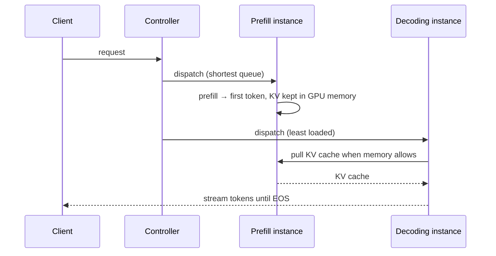

The policy is deliberately simple. The optimizations below handle real-world messiness. **[Paper]**

### Reducing Pipeline Bubbles

Non-uniform prompt lengths make pipeline stages run for different times, which leaves stages idle (Section IV.C). DistServe balances the **execution time of every batch** in the pipeline. **[Paper]**

The key observation: for both instance types, **the number of new tokens in a batch reliably predicts its execution time**. **[Paper]**

- **Prefill.** Profile the shortest prompt length $L_m$ that saturates the GPU. Build batches whose **total length is close to $L_m$**: batch several short prompts together, and schedule prompts longer than $L_m$ alone. **[Paper]**
- **Decode.** Each request contributes one new token per step, so $L_m$ is simply the **largest batch size**. **[Paper]**

Equal-sized batches mean equal-length pipeline steps, so no stage waits on a slower neighbor. **[Interpretation]**

### Combating Burstiness

A burst of arrivals produces a burst of KV caches, which could overflow a decoding instance's memory. **[Paper]**

DistServe therefore **pulls** KV caches instead of pushing them. Decoding instances fetch a KV cache only when they have room, and the **prefill instance's GPU memory acts as the queue**. **[Paper]**

Prefill keeps processing new prompts while it holds finished KV caches. Each instance type runs at its own pace, with no complex coordination. **[Paper]**

### Replanning

A placement is tuned to one workload pattern and can go stale when that pattern shifts. **[Paper]**

A **workload profiler** tracks the average input length, output length and arrival rate. When it detects a significant shift, DistServe **reruns the placement algorithm** on recent history. **[Paper]**

This is cheap enough to do routinely. The search runs in seconds to about a minute, and reloading weights takes minutes, while real workloads tend to shift on an **hourly** scale. **[Paper]**

### Preemption and Fault Tolerance

DistServe does **not** implement preemption or fault tolerance. The paper discusses how they would fit and leaves both as future work. **[Paper]**

- **Convoy effect.** Under FCFS, a long prompt blocks shorter ones behind it in the prefill queue. Preemptive scheduling could fix this and fits the architecture. **[Paper]**
- **Fault propagation.** In a replicated, colocated system, one failed replica does not affect the others. In DistServe, prefill and decode instances depend on each other. One failed decoding instance fed by several prefill instances could **cripple the whole service**. **[Paper]**

---

## VII. Implementation Details: How DistServe Is Built

DistServe is an end-to-end distributed LLM serving system with four parts. **[Paper]**

| Component | Language / size | Responsibility |
|---|---|---|
| Placement algorithm module | Python | Algorithms 1–2 plus the simulator; outputs the placement |
| RESTful API frontend | Python | OpenAI-compatible API; clients set max output length, temperature, etc. |
| Orchestration layer | Python | Request dispatch, KV cache transmission, result delivery |
| Parallel execution engine | C++/CUDA | Ray-actor GPU workers that run inference and manage the distributed KV cache |

The three Python components total about **6.5K lines**; the execution engine is about **8.1K lines** of C++/CUDA. **[Paper]**

**KV cache transport.** The orchestration layer uses **NCCL** for cross-node GPU communication and **asynchronous `cudaMemcpy`** within a node, so a transfer never blocks GPU computation. **[Paper]**

**Inside each instance.** The engine integrates **continuous batching**, **FlashAttention** and **PagedAttention**, and supports OPT and LLaMA models. **[Paper]** Disaggregation sits *above* these optimizations; it does not replace them. **[Interpretation]**

The sketch below shows the two runtime ideas from Section VI in plain Python: **token-budget batching** to avoid pipeline bubbles, and **pull-based KV transfer** with shortest-queue / least-loaded dispatch. It is my simplification, not the paper's code. **[Interpretation]**

```python
from collections import deque
from dataclasses import dataclass, field


@dataclass
class Request:
    rid: int
    prompt_len: int
    kv_bytes: int = 0


def build_prefill_batches(queue, L_m):
    """Group prompts so each batch has close to L_m tokens (balanced pipeline steps)."""
    batches, current, tokens = [], [], 0
    for req in queue:
        if req.prompt_len >= L_m:              # long prompt: schedule it alone
            batches.append([req])
            continue
        if tokens + req.prompt_len > L_m and current:
            batches.append(current)
            current, tokens = [], 0
        current.append(req)
        tokens += req.prompt_len
    if current:
        batches.append(current)
    return batches


@dataclass
class PrefillInstance:
    name: str
    queue: deque = field(default_factory=deque)
    finished: deque = field(default_factory=deque)   # KV caches held in GPU memory (the buffer)

    def run(self, L_m, s_kv):
        for batch in build_prefill_batches(list(self.queue), L_m):
            for req in batch:
                req.kv_bytes = req.prompt_len * s_kv
                self.finished.append(req)            # keep KV locally; do not push
        self.queue.clear()


@dataclass
class DecodeInstance:
    name: str
    free_bytes: int
    active: list = field(default_factory=list)

    def pull(self, prefill):
        """Fetch KV caches only while memory allows: the 'pull' side of burst handling."""
        while prefill.finished and prefill.finished[0].kv_bytes <= self.free_bytes:
            req = prefill.finished.popleft()
            self.free_bytes -= req.kv_bytes
            self.active.append(req)


class Controller:
    def __init__(self, prefills, decodes):
        self.prefills, self.decodes = prefills, decodes

    def submit(self, req):
        min(self.prefills, key=lambda p: len(p.queue)).queue.append(req)   # shortest queue

    def step(self, L_m, s_kv):
        for p in self.prefills:
            p.run(L_m, s_kv)
            while p.finished:
                target = max(self.decodes, key=lambda d: d.free_bytes)      # least loaded
                before = len(p.finished)
                target.pull(p)
                if len(p.finished) == before:      # no room anywhere: KV waits on the prefill GPU
                    break


if __name__ == "__main__":
    S_KV = 327_680                                 # bytes per token, 70B GQA running example
    ctrl = Controller([PrefillInstance("P0"), PrefillInstance("P1")],
                      [DecodeInstance("D0", free_bytes=10**9)])
    for i, n in enumerate([300, 900, 120, 2048, 450, 60]):
        ctrl.submit(Request(i, n))
    ctrl.step(L_m=512, s_kv=S_KV)
    for d in ctrl.decodes:
        print(d.name, "decoding", [r.rid for r in d.active], "free GB", round(d.free_bytes / 1e9, 2))
    for p in ctrl.prefills:
        print(p.name, "holding KV for", [r.rid for r in p.finished])
```

With a 1 GB decode budget, the decoding instance pulls requests 0, 2, 4 and 1. The 2,048-token request 3 does not fit, so it and request 5 behind it stay on P1. The remaining KV caches **stay parked on the prefill GPUs** until memory frees up, which is exactly how DistServe absorbs a burst. **[Interpretation]**

---

## VIII. Evaluation: Does DistServe Improve LLM Serving Goodput?

A brief tour of the paper's experiments: the conditions first, then how DistServe compares with colocated serving.

### The Naive Baseline: Per-GPU Goodput of Colocated Serving

A request's total latency is its TTFT plus TPOT for every generated token after the first: **[Paper]**

$$
\text{latency} = \text{TTFT} + \text{TPOT} \times (\text{number of generated tokens})
$$

**Per-GPU goodput** is the maximum request rate that can be served within the SLO-attainment goal (say 90%), divided by the number of GPUs provisioned. Higher per-GPU goodput directly means lower cost per query. **[Paper]**


*Figure 1 from the paper: a 13B model on one A100-80GB, with input length 512 and output length 64.*

This figure is the whole argument in miniature: **[Paper]**

| Setup | Goodput under both SLOs | GPUs | Per-GPU goodput |
|---|---|---|---|
| Colocated (existing systems) | ≈ 1.6 req/s | 1 | **1.6** |
| Prefill-only | 5.6 req/s | 1 | — |
| Decode-only | 10 req/s | 1 | — |
| **Disaggregated: 2 prefill + 1 decode** | 10 req/s | 3 | **3.3 (2.1×)** |

The colocated system is capped by whichever SLO is harder to meet. Splitting the phases lets each one run at its own limit. **[Paper]**

### Experimental Setup: Models, Workloads and Baselines

| Condition | Value **[Paper]** |
|---|---|
| Cluster | 4 nodes × 8 NVIDIA SXM A100-80GB = 32 GPUs, NVLink inside a node |
| Cross-node bandwidth | 25 Gbps, so DistServe uses **Algorithm 2** (low affinity) except in the ablation |
| Models | OPT-13B, OPT-66B, OPT-175B, FP16 |
| Why OPT | Classic MHA puts maximum pressure on KV transfer; GQA/MQA models would transfer less |
| Arrivals | Poisson, at varying rates |
| Metric | SLO attainment; per-GPU goodput at the **90%** target (99% in the appendix) |

**Baselines:** **[Paper]**

- **vLLM** — continuous batching and PagedAttention, but it colocates prefill and decode. It only supports intra-op parallelism, set to TP = 1 / 4 / 8 for the three OPT sizes.
- **DeepSpeed-MII** — chunked prefill. This mitigates, but cannot eliminate, prefill–decode interference. It cannot serve OPT-175B because of a kernel constraint on vocab size.


*Table 1: the three applications and their SLOs. Code completion has a tight TTFT; summarization has a loose TTFT but a tight TPOT.*


*Figure 7: prompt lengths vary widely. LongBench averages ≈ 1,738 input tokens, while HumanEval averages ≈ 171.*

### End-to-End Results: DistServe vs vLLM and DeepSpeed-MII

"Higher rate" means per-GPU goodput at 90% attainment. "Tighter SLO" means how far both SLOs can be scaled down while still reaching 90% attainment. **[Paper]**

| Workload | vs vLLM: rate | vs vLLM: SLO | vs DeepSpeed-MII: rate | vs DeepSpeed-MII: SLO |
|---|---|---|---|---|
| Chatbot (ShareGPT, 13B–175B) | **2.0–4.6×** | 1.8–3.2× | 1.6–7.4× | 1.7–1.8× |
| Code completion (HumanEval, 66B) | **5.7×** | 1.4× | 1.6× | 1.4× |
| Summarization (LongBench, 66B) | **4.3×** | **12.6×** | 1.8× | 2.6× |


*Figure 8: chatbot results. The top row varies the rate and the bottom row varies the SLO scale. Vertical lines mark the 90% attainment point.*


*Figure 9: code completion (left pair) and summarization (right pair) on OPT-66B.*

**Why DistServe wins, per workload:** **[Paper]**

- **Chatbot.** vLLM meets TTFT for most requests, but prefill interference inflates TPOT, which drags attainment down. For OPT-175B, DistServe chose **prefill PP = 3, TP = 3** and **decode PP = 3, TP = 4**. The paper notes that a placement like this is hard to find by hand.
- **Code completion.** Tight TTFT dominates. DistServe removes decode interference and automatically raises prefill TP, which is Section IV.A's rule applied by the search.
- **Summarization.** Long prompts plus a tight TPOT punish colocation the most, because long prefills stall decoding. That gives the biggest SLO gain, **12.6×**.
- Under the stricter **99%** target, DistServe still sustains **3–8×** higher rate than vLLM (appendix).

### Latency Breakdown: Is KV Cache Transfer a Bottleneck?


*Figure 10: left, the share of each stage in total time for OPT-175B; right, the CDF of KV-cache transmission time.*

Even for OPT-175B, the model with the largest KV cache, **transmission is under 0.1% of total latency**. Over **95% of requests** see less than **30 ms** of transfer, despite 25 Gbps between nodes. The reason is Algorithm 2: same-stage segments share a node, so KV moves over NVLink. **[Paper]**

This is the empirical answer to Section IV.C's KV-transfer worry. **[Interpretation]**

### Simulator Accuracy


*Table 2: simulated vs real SLO attainment.*

The simulator's error stays **under 2%** in every case, so the placement search optimizes against numbers it can trust. **[Paper]**

### Ablation: Disaggregation vs Smarter Parallelism


*Figure 11: OPT-66B on ShareGPT, run in simulation.*

- **vLLM++** searches vLLM's parallelism for the best setting. It performs the **same as vLLM**, because the default TP = 4 was already best. Tuning parallelism **cannot** fix interference; only disaggregation can. **[Paper]**
- **DistServe-High** (Algorithm 1) beats **DistServe-Low** (Algorithm 2). Without the same-node constraint, each phase gets its ideal configuration. This matches the use-case result in Section V. **[Paper]**

### Placement Algorithm Running Time


*Figure 12: search time on a 96-core CPU instance as the GPUs per instance ($N \times M$) grow.*

The search takes **minutes at most** (under ≈ 1.3 minutes at 32 GPUs). It does not depend on model size, because the simulator only models discrete events. Low is slower because it must enumerate prefill–decode combinations jointly. **[Paper]** One quirk: §6.5's text swaps the two labels relative to §6.4, but the explanation (Low enumerates more) matches the figure. **[Interpretation]**

### Parallelism Strategies Chosen by DistServe

| Model | Dataset | Prefill TP | Prefill PP | Decode TP | Decode PP |
|---|---|---|---|---|---|
| OPT-13B | ShareGPT | 2 | 1 | 1 | 1 |
| OPT-66B | ShareGPT | 4 | 1 | 2 | 2 |
| OPT-66B | LongBench | 4 | 1 | 2 | 2 |
| OPT-66B | HumanEval | 4 | 1 | 2 | 2 |
| OPT-175B | ShareGPT | 3 | 3 | 4 | 3 |

*Table 3 (paper appendix): the configurations DistServe chose in the end-to-end experiments.* **[Paper]**

In every row, **prefill and decode choose differently**. Prefill leans on more tensor parallelism; decode mixes TP and PP to fit bigger batches. That is the resource/parallelism coupling from Section III, made visible. **[Interpretation]**

### What the Results Add Up To

- **Disaggregation itself is the win.** Parallelism tuning alone (vLLM++) gains nothing while interference remains. **[Paper]**
- **The search is what makes disaggregation practical.** Configurations like 3 × 3 prefill with 4 × 3 decode are not what an engineer would guess. **[Interpretation]**
- **KV transfer is manageable** with bandwidth-aware placement, even on 25 Gbps networking. **[Paper]**
- **Gains grow with SLO strictness and prompt length.** The largest numbers come from summarization and tight SLOs. **[Paper]**

---

## IX. Trade-offs and Limitations of Disaggregated LLM Serving

The paper is explicit that disaggregation is **not a one-size-fits-all** answer. It targets goodput under latency SLOs on large clusters. **[Paper]**

| Scenario | Why DistServe struggles | Better choice |
|---|---|---|
| **Throughput-optimized / offline** | Without tight SLOs, goodput stops mattering; filling every batch matters more | Chunked prefill with piggybacking, which keeps each batch at the compute-bound threshold **[Paper]** |
| **Resource-constrained (one or a few GPUs)** | The design space collapses: little room to vary parallelism or instance counts | A simpler colocated system such as vLLM **[Paper]** |
| **Long context (≈ 1M tokens)** | KV transfer grows linearly with prompt length | Still promising: prefill compute grows quadratically, so transfer shrinks relative to prefill, and interference worsens **[Paper]** |

Further engineering costs, beyond the paper's own list: **[Interpretation]**

- **Duplicate weights.** Every prefill and decode instance holds its own copy of the model, which reduces the memory left for KV caches.
- **Imbalance.** If the prefill:decode ratio is wrong for the current traffic, one side idles while the other queues. Replanning only corrects this on an hourly scale.
- **Network dependence.** Without fast interconnects, Algorithm 2's same-node constraint limits the placements available (Section V).
- **New failure modes.** Paired instances fail together, and there is no preemption to protect short requests from long ones.

---

## X. Where DistServe Sits: vLLM, Chunked Prefill, and Mooncake (Related Work)

DistServe positions itself against four lines of work. **[Paper]**

| Line of work | Examples | Relation to DistServe |
|---|---|---|
| **Colocated LLM serving** | Orca (continuous batching), vLLM (PagedAttention), SARATHI (chunked prefill), FastServe (preemptive scheduling) | All colocate prefill and decode, so all suffer interference. DistServe reuses their in-engine techniques **[Paper]** |
| **Concurrent disaggregation** | Splitwise, TetriInfer, DéjàVu | Same core idea. DistServe focuses more on **goodput** and **network bandwidth** **[Paper]** |
| **Goodput-optimized systems** | Pollux, Sia, Clockwork, Shepherd, AlpaServe | Earlier work targeted DL training jobs, small models, or non-autoregressive generation. DistServe claims the **first goodput optimization for autoregressive LLM inference** **[Paper]** |
| **Resource disaggregation / training parallelism** | CXL-style disaggregated data centers; Megatron, Alpa | Same philosophy of independently scaled pools; parallelism advances can plug into the placement search **[Paper]** |

Since publication, disaggregation has gone mainstream. [Mooncake](/engineering/mooncake-kvcache-centric-architecture-for-serving-llm-chatbot/) runs it in production and adds a distributed KV cache store. Major serving stacks now ship prefill–decode disaggregation modes. **[Interpretation]**

The clearest contrast is with **chunked prefill**. It keeps the phases together and slices prefill to limit the damage. DistServe separates them so there is no damage to limit, at the cost of a KV transfer. **[Interpretation]**

---

## XI. My Engineering Takeaway

### What Clicked

The moment it clicked was realizing that **TTFT and TPOT are bounded by different hardware resources**. Prefill hits the tensor-core ceiling; decode hits the HBM ceiling. Putting them in one batch means one of them is always running on the wrong bottleneck. **[Interpretation]**

The second click was **per-GPU goodput**. Throughput rewards piling everything into one batch. Goodput per GPU rewards meeting both SLOs cheaply, and that metric is what makes disaggregation obviously right.

### What Confused Me Initially

I first read disaggregation as "just use more GPUs". It isn't. The **2P+1D** example in Figure 1 uses 3 GPUs to get **2.1× the goodput per GPU** of one colocated GPU. The win comes from each GPU doing the work it is best at, not from adding hardware. **[Interpretation]**

I also found the prefill queueing math confusing at first: why would pipeline parallelism, which does not reduce latency, ever lower TTFT? The answer is that at high load, **queueing delay dominates TTFT**, and pipelining halves the service interval that sets the queue.

### How I Simplified It Mentally

I now think of it as **two factories joined by a conveyor belt**. The prefill factory is sized for how fast it can stamp out first tokens (TTFT). The decode factory is sized for how many streams it can keep flowing (TPOT). The conveyor belt is the KV transfer. **[Interpretation]**

The placement algorithm answers three questions: how big each factory is (parallelism), how many copies to build (replication), and **whether the belt can run between buildings** (Algorithm 1) or must stay inside one (Algorithm 2).

### What I Think Is Underrated

- **The simulator is the real contribution.** A search is only as good as its cost model, and a simulator accurate to under 2% is what makes the placement search trustworthy. **[Interpretation]**
- **Pull-based KV transfer** is a small design choice with a big effect: it turns prefill GPU memory into a burst buffer for free.
- **The M/D/1 analysis** is a reusable tool. It explains *when* tensor parallelism beats pipeline parallelism, for any compute-bound serving stage.
- **KV transfer is not the bottleneck people assume.** Under 0.1% of latency with bandwidth-aware placement, even on 25 Gbps networking. **[Paper]**

### Critique and Open Questions

- **OPT-only evaluation.** OPT uses full multi-head attention, which makes KV transfer look as bad as possible (a deliberate choice), but modern GQA/MoE models were not tested. **[Paper] / [Interpretation]**
- **The 1:1 pairing in Algorithm 2** can waste capacity, as our use case showed (≈ 36% idle decode). A mixed prefill:decode ratio per node seems like an obvious extension. **[Interpretation]**
- **No preemption or fault tolerance.** Both are hard problems in a system where instances depend on each other. **[Paper]**
- **Hourly replanning** does not help with second-scale bursts beyond what the pull buffer absorbs.
- **Open question:** once the KV cache moves between GPUs anyway, should it also be *stored* and *reused* across requests, as Mooncake does? **[Interpretation]**

---

## Key Takeaways

- **Prefill is compute-bound; decode is memory-bandwidth-bound.** Colocating them causes prefill–decode interference and forces one parallelism plan on two very different workloads.
- **Prefill decode disaggregation** gives each phase its own GPUs, parallelism and replica count, so TTFT and TPOT can be optimized independently.
- **The right metric is per-GPU goodput**: the highest request rate each GPU sustains while meeting the SLO attainment target. Maximizing it minimizes cost per query.
- **Placement is a search, not a rule.** A simulator-driven search picks tensor/pipeline parallelism per phase; Algorithm 2 keeps KV transfer on NVLink when cross-node bandwidth is low.
- **The results are large:** up to 7.4× more requests or 12.6× tighter SLOs than vLLM and DeepSpeed-MII, with KV transfer under 0.1% of latency.

---

## Related Engineering Implementations

- [**MOONCAKE**](/engineering/mooncake-kvcache-centric-architecture-for-serving-llm-chatbot/) — production prefill–decode disaggregation, plus a distributed CPU/DRAM/SSD KV cache pool for reuse across requests
- [**vLLM / PagedAttention**](/engineering/vllm-pagedattention-efficient-memory-management-for-llm-serving/) — the paged KV cache manager that DistServe runs inside every prefill and decode instance
- [**SGLang / RadixAttention**](/engineering/sglang-radixattention-structured-lm-program-execution/) — prefix-sharing KV cache reuse that shrinks the prefill work DistServe has to place
- [**TensorRT-LLM**](/engineering/tensorrt-llm-inference-serving-engine-kv-cache-scheduling/) — an optimized colocated engine with in-flight batching: the kind of system DistServe's interference analysis targets
- [**FlashInfer**](/engineering/flashinfer-customizable-attention-engine-llm-inference-serving/) — the attention kernels underneath; faster kernels change the latency profiles DistServe's simulator must model
- [**Strata**](/engineering/strata-hierarchical-context-caching-long-context-llm-serving/) — hierarchical KV caching for long context, where DistServe expects disaggregation to matter even more

---

## Conclusion

DistServe's contribution is simple to state. **Prefill and decode are different workloads, so stop serving them as one.** Disaggregating the two phases removes prefill–decode interference and decouples their parallelism. A simulator-driven placement search then turns that freedom into measurably higher per-GPU goodput: up to **7.4× higher rate** or **12.6× tighter SLOs** than colocated serving. **[Paper]**

It is best read as **a first step** in LLM inference optimization, not the last word. [vLLM](/engineering/vllm-pagedattention-efficient-memory-management-for-llm-serving/) made the KV cache memory-efficient inside a GPU. DistServe asks a different question: *which GPUs should each phase run on, and how should they be parallelized?* The two are complementary. DistServe itself runs PagedAttention and continuous batching inside every instance. **[Interpretation]**

Much is left open: **[Interpretation]**

- **KV reuse across requests.** [Mooncake](/engineering/mooncake-kvcache-centric-architecture-for-serving-llm-chatbot/) and [SGLang](/engineering/sglang-radixattention-structured-lm-program-execution/) avoid recomputing prefill at all.
- **Preemption and fault tolerance.** The paper leaves both as future work, and fault propagation between paired instances is a new failure mode.
- **Faster replanning.** Placement adapts to hourly workload shifts, not to second-scale bursts.
- **Cheaper KV caches.** GQA/MQA and KV compression shrink exactly the transfer cost that constrains Algorithm 2.

Disaggregation made each phase optimizable on its own terms. The next question is how far the same idea goes. **Once prefill, decode and the KV cache are independent resources, what else in the serving stack should be pulled apart?**
