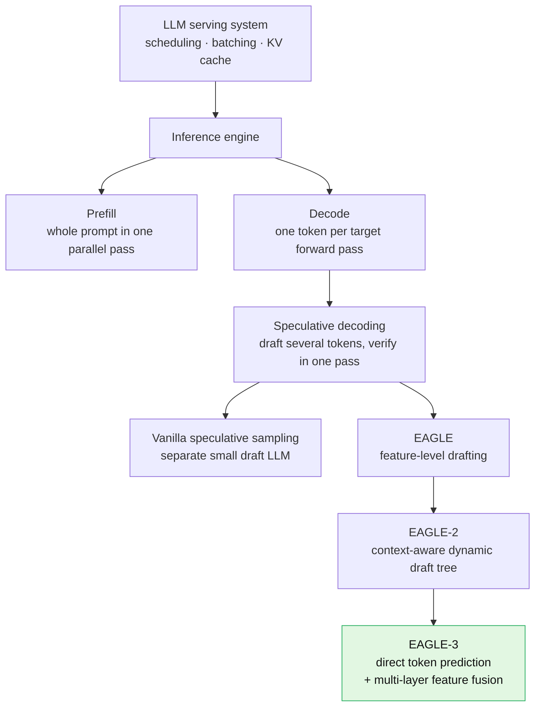
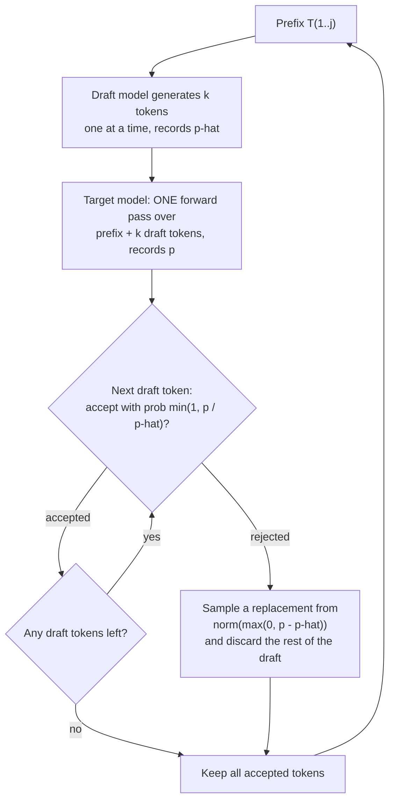
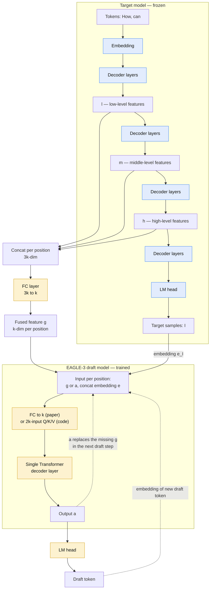
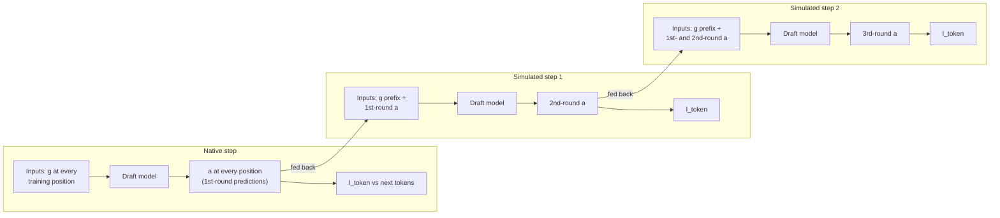

<!--
SEO METADATA (reference — mirrors the frontmatter above)

SEO Title:          EAGLE-3 Explained: Speculative Decoding, Training-Time Test & PyTorch Implementation
Meta Description:   EAGLE-3 speculative decoding explained and implemented: multi-layer feature fusion, training-time test, PyTorch draft model and LLM inference benchmarks. (153 chars)
URL Slug:           /engineering/eagle-3-speculative-decoding-llm-inference-acceleration/
Date:               April 2025 (paper, arXiv v3) — article October 2026
Author:             Trisham Patil
Difficulty Tier:    🟡 Tier 2 — Intermediate

Primary Keyword:    EAGLE-3 speculative decoding
Secondary Keywords: EAGLE-3 implementation, EAGLE-3 inference acceleration, EAGLE-3 architecture,
                    PyTorch EAGLE-3, speculative sampling, training-time test, LLM inference optimization,
                    LLM inference acceleration, LLM serving

Source of truth:    EAGLE-3 paper (arXiv:2503.01840v3). Code: https://github.com/SafeAILab/EAGLE
Status:             COMPLETE — all sections written. PyTorch code (VIII–XII, Appendix C) tested
                    on CPU with a toy LLaMA target; see XI.6.
Figures:            assets/blogs/eagle-3/ — cropped from the paper PDF (Figures 1–7).
-->

In autoregressive generation, every token an LLM produces requires accessing all of the model's parameters. That makes long answers, and especially long reasoning traces, slow and expensive to serve. **[Paper]**

**EAGLE-3 speculative decoding** reduces that cost. A lightweight draft model proposes several tokens, and the target model checks all of them in a single forward pass, with no change to the output distribution. **[Paper]**

This engineering implementation goes from vanilla autoregressive decoding through speculative sampling and EAGLE to EAGLE-3's architecture and training-time test. It then rebuilds EAGLE-3 in PyTorch and benchmarks it.

**Scope.** Sections I–VII explain the mechanism, and XII–XVI cover training, benchmarks and results, all grounded in the paper (arXiv:2503.01840).

Sections VIII–XI build a PyTorch implementation, and XII.8 trains it. The code is my own reconstruction, following the official [SafeAILab/EAGLE](https://github.com/SafeAILab/EAGLE) code where the paper is silent.

I tested it for **correctness**, including token-for-token losslessness, on a small target model on CPU. It does not reproduce the paper's measured speedups.

Every table of results below is the paper's, not mine.

**Attribution convention.** Every non-obvious technical claim is tagged:

- **[Paper]** — stated explicitly in EAGLE-3 (arXiv:2503.01840).
- **[Derived]** — a mathematical or logical consequence of the paper's description, worked out here.
- **[Interpretation]** — my explanation or engineering reasoning; not a claim the paper makes.
- **[Code]** — read from the official [SafeAILab/EAGLE](https://github.com/SafeAILab/EAGLE) repository (commit `cb7e084`), used only where the paper is silent.
- **[Our implementation]** — my PyTorch reconstruction in Sections VIII–XII, and results from running it.

---

## I. Introduction

### Why Autoregressive LLM Inference Is Slow

Each generated token requires accessing all model parameters. **[Paper]** Token $t+1$ cannot start until token $t$ exists, so $N$ output tokens cost $N$ sequential passes over the weights. **[Derived]**

The paper describes this decoding as **memory-bound**, with redundant computational power left over (§4.3). **[Paper]** Speculative decoding spends that spare compute. **[Interpretation]**

For background on the prefill and decode phases, see [LLM inference optimization](/2026/04/19/llm-inference-optimization/#understanding-llm-inference).

### Why LLM Inference Acceleration Matters: TTFT, TBT and SLOs

The paper's motivation is test-time scaling. Reasoning models such as o1 and DeepSeek-R1 reason at length before answering. **[Paper]**

That makes them extremely costly, the longer response time severely hurts user satisfaction, and they account for a growing share of inference cost. **[Paper]**

The paper measures acceleration as speedup ratio, acceptance length and throughput. It never uses the serving terms TTFT, TBT or SLO. The mapping below is my own. **[Interpretation]**

| Serving metric | What it measures | Phase | Does EAGLE-3 target it? |
| --- | --- | --- | --- |
| **TTFT** (time to first token) | Prompt arrival → first output token | Prefill | Not directly. The first token still comes from the target model's own prefill pass. |
| **TBT / TPOT** (time between tokens) | Gap between streamed output tokens | Decode | Yes. Several accepted tokens per target forward pass lower the *average* time per output token. Tokens arrive in bursts, one burst per drafting-verification cycle. |
| **SLO attainment** | Share of requests meeting latency targets | Both | Indirectly, through TBT. The benefit shrinks as batch size grows (paper §4.3, Table 3). |

Long reasoning outputs are dominated by decode, so TBT is where EAGLE-3 has its effect. **[Interpretation]** For how TTFT and TPOT work as serving SLOs, see [DistServe](/engineering/distserve-prefill-decode-disaggregation-llm-serving/).

### What Is Speculative Sampling?

In speculative sampling, a small **draft model** generates several candidate tokens autoregressively. The large **target model** then verifies all of them in one parallel forward pass. **[Paper]**

The paper's formulation (§2.1): the draft model generates $k$ tokens $\hat{T}_{j+1:j+k}$ and records its probability $\hat{p}$ for each one. The target model evaluates the draft and records its own probability $p$. **[Paper]**

```text
Draft model: propose k tokens, one at a time (cheap)
        ↓
Target model: score all k draft tokens in ONE forward pass (parallel)
        ↓
Walk the draft front to back: accept or reject each token
        ↓
First rejection: sample a replacement token, discard the rest of the draft
        ↓
Next drafting cycle starts after the last kept token
```

Three details are easy to get wrong:

- **Scoring is parallel, the decision is sequential.** The target scores every draft position at once. Acceptance is then decided front to back: token $\hat{t}_{j+i}$ is accepted with probability $\min(1, p_{j+i}(\hat{t}_{j+i}) / \hat{p}_{j+i}(\hat{t}_{j+i}))$. **[Paper]**
- **"Matching" is the greedy special case.** At temperature 0 the target distribution is one-hot, so the rule reduces to accepting the draft token only if it equals the target's top choice. **[Derived]**
- **A rejection does not re-run anything.** The rejected position gets a replacement token sampled from $\text{norm}(\max(0, p_{j+i} - \hat{p}_{j+i}))$, and the remaining draft tokens are discarded. **[Paper]** Every cycle therefore keeps at least one token. **[Derived]**

Speculative sampling is **not** the LLM generating several full outputs and choosing the best one. Nothing is ranked or judged for quality. **[Interpretation]**

The target only checks whether each draft token is consistent with its own distribution. The acceptance rule guarantees the output matches vanilla autoregressive decoding, which is why the method is lossless. **[Paper]**

The speedup comes from producing multiple tokens per target forward pass (§1). **[Paper]** The full acceptance rule is worked through in [§III](#iii-vanilla-speculative-sampling).

### What EAGLE Does: Reusing Target-Model Top-Layer Features

EAGLE keeps the draft-then-verify loop but changes what the draft model predicts. **[Paper]**

<div class="ts-note ts-note--key" markdown="1">
<div class="ts-note-title">💡 What does "feature" mean here?</div>
<div class="ts-note-body" markdown="1">

A **feature** is the numerical vector that represents a token's internal state inside the Transformer. **[Interpretation]**

Take the prefix **"How can I"**. The target model passes these tokens through its decoder layers, and at every layer each token has its own vector representation. **[Interpretation]**

The **top-layer feature** is a token's vector after the *final* decoder layer, just before the LM head. **[Paper]** Each feature is $k$-dimensional, where $k$ is the target model's hidden size (§3.1). **[Paper]**

```text
Token → Transformer decoder layers → feature vector → LM head → next-token probabilities
```

EAGLE works on that feature vector rather than on the token itself: it autoregressively predicts the **next feature**. **[Paper]**

</div>
</div>

- EAGLE reuses the target model's **top-layer features**: the features immediately before the LM head. **[Paper]**
- The EAGLE draft model autoregressively predicts the **next feature**, not the next token. **[Paper]**
- The target model's **LM head** converts each predicted feature into a draft token. **[Paper]**
- The target model then verifies the resulting draft tokens, as in vanilla speculative sampling. **[Paper]**

```text
Target model
    ↓
Top-layer features (just before the LM head)
    ↓
EAGLE draft model
    ↓
Predicted next feature
    ↓
Target LM head
    ↓
Draft token
    ↓
Target verification
```

EAGLE also feeds in the already-sampled token sequence, shifted by one step. This resolves the uncertainty that sampling introduces at the feature level (§2.2). **[Paper]**

EAGLE does **not** run part of the target network, such as its feed-forward/MLP blocks, as a fast drafter. What it reuses is the top-layer feature representation, plus the target's LM head to decode it. **[Interpretation]** The details are in [§IV](#iv-from-speculative-sampling-to-eagle).

### What EAGLE-3 Changes

In short, EAGLE-3 makes two changes (§1, §6):

1. **Direct token prediction instead of feature prediction.** EAGLE-3 removes the feature-prediction loss $l_{\text{fea}}$, so the draft model predicts tokens directly. A technique called **training-time test** makes this work: it simulates multi-step drafting during training. **[Paper]**
2. **Multi-layer feature fusion instead of top-layer features only.** The draft model's input fuses low-, middle- and high-level features from the target model. **[Paper]**

Why this matters: EAGLE gained little from more training data, because the feature-prediction constraint limited the draft model's expressiveness. With both changes, EAGLE-3's speedup keeps rising as training data grows. **[Paper]**

Reported results:

- Up to **6.5x** speedup over vanilla autoregressive decoding.
- About **1.4x** over EAGLE-2 at batch size 1.
- **1.38x** throughput in SGLang at batch size 64.

**[Paper]** The architecture is covered in [§V](#v-eagle-3-architecture) and training-time test in [§VII](#vii-training-time-test).

---

## II. Where EAGLE-3 Speculative Decoding Fits in LLM Serving

EAGLE-3 is a **decode-phase** optimization. It does not change how requests are scheduled, how the KV cache is paged, or where prefill runs. What it changes is how many tokens each target-model decode step produces. **[Interpretation]**

The rest of this site covers the layers around it, so this section only places EAGLE-3 among them.



*Where EAGLE-3 sits in the LLM serving stack. The EAGLE → EAGLE-2 → EAGLE-3 lineage is* **[Paper]***; the stack framing is* **[Interpretation]***.*

### II.1 Autoregressive LLM Inference

An LLM generates one token at a time, and each token is conditioned on every token before it. Each new token requires accessing all model parameters. **[Paper]**

This site already covers the mechanics in [Mastering LLM inference optimization](/2026/04/19/llm-inference-optimization/). The point to carry forward is that the cost is *per token*, and it is paid in sequence.

### II.2 Prefill and Decode

**Prefill** processes the whole prompt in one parallel pass and produces the first output token. **Decode** then produces one token per forward pass. **[Interpretation]** For the full treatment, see [prefill and decode phases](/2026/04/19/llm-inference-optimization/#understanding-llm-inference) and [DistServe](/engineering/distserve-prefill-decode-disaggregation-llm-serving/).

One detail matters for EAGLE-3. In the paper's example, the target's prefill pass over "How can" both samples the next token "I" *and* produces the features EAGLE-3 needs (§3.1). **[Paper]**

So EAGLE-3 gets its inputs from a pass the target was running anyway. **[Interpretation]**

### II.3 Why Decode Is Sequential

Token $t+1$ cannot be computed until token $t$ exists. **[Derived]** The paper describes decoding as **memory-bound**, with redundant computational power left over (§4.3). **[Paper]**

That spare compute is the resource speculative decoding spends. The paper also notes that the redundancy shrinks as batch size grows (§4.3). **[Paper]** This is the most important constraint on EAGLE-3 in production, and it returns in [§XVI](#xvi-eagle-3-in-llm-serving-frameworks).

### II.4 Speculative Decoding

The paper uses the term **speculative sampling**: a lossless technique that alternates between a cheap drafting stage and a parallel verification stage (§2.1). **[Paper]** Serving engines usually call the same idea *speculative decoding*.

For how a production engine exposes it, see [TensorRT-LLM: speculative decoding](/engineering/tensorrt-llm-inference-serving-engine-kv-cache-scheduling/#xxvi-speculative-decoding).

### II.5 Draft Model and Target Model

| Role | Vanilla speculative sampling | EAGLE family |
| --- | --- | --- |
| **Target model** | The large model whose output distribution must be preserved | Same. EAGLE-3 does not modify its weights (§4). |
| **Draft model** | A separate, smaller LLM from the same series, e.g. Vicuna-68M drafting for Vicuna-13B (Figure 2 caption) | A lightweight head that reads the target's own features. EAGLE-3's is a single Transformer decoder layer (§3.2). |
| **Relationship** | The draft runs independently of the target (§1) | The draft depends on the target's hidden states |

All cells are **[Paper]**.

### II.6 Parallel Verification

The target appends the draft tokens to the prefix as extra positions and runs **one** forward pass. Because attention is causal, each position's output depends only on the prefix plus the draft tokens before it. **[Derived]**

That is exactly the context the target would have seen if it had generated those tokens itself. So one pass gives the target's distribution at every draft position. **[Derived]**

For tree-shaped drafts, EAGLE uses **tree attention** to verify every branch in parallel (§2.2). **[Paper]**

### II.7 Where EAGLE-3 Fits

The paper positions EAGLE-3 among other methods (§1, §2.2, §3.2): **[Paper]**

- **Medusa** and **EAGLE** reuse the target's top-layer features.
- **HASS** and **Falcon** follow EAGLE in predicting the next feature.
- **HASS** also simulates multi-step drafting during training, but keeps the feature-prediction loss.
- **EAGLE** inspired the multi-token prediction used in DeepSeek-V3 pre-training. That design is covered in [DeepSeek-V3: MTP](/engineering/deepseek-v3-auxiliary-loss-free-moe-mtp-fp8-training/).
- **EAGLE-3** is fully compatible with EAGLE-2's dynamic drafting tree.

---

## III. Vanilla Speculative Sampling

Speculative sampling alternates **drafting** (cheap) and **verification** (parallel). **[Paper]** The paper's notation (§2.1):

| Symbol | Meaning |
| --- | --- |
| $t_i$ | The $i$-th token |
| $T_{a:b}$ | The token sequence $t_a, t_{a+1}, \dots, t_b$ |
| $T_{1:j}$ | The current prefix |
| $\hat{T}_{j+1:j+k}$ | The $k$ draft tokens |
| $\hat{p}$ | Draft-model probabilities |
| $p$ | Target-model probabilities |



*One drafting-verification cycle of vanilla speculative sampling. Rules are* **[Paper]** *(§2.1); the flowchart is my rendering.*

### III.1 Draft Generation

The draft model autoregressively generates $k$ tokens $\hat{T}_{j+1:j+k}$ and records its probability $\hat{p}$ for each. **[Paper]**

This is still $k$ sequential passes, just through a much smaller network. **[Derived]**

### III.2 Target Verification

The target model evaluates the draft $\hat{T}_{j+1:j+k}$ and records its probability $p$ at each position. **[Paper]**

### III.3 Causal Masking

The draft tokens are appended to the prefix, and a standard causal mask is applied. Position $j+i$ sees $T_{1:j}$ and $\hat{t}_{j+1}, \dots, \hat{t}_{j+i-1}$, and nothing after. **[Derived]**

### III.4 Parallel Logit Computation

One target forward pass over the $k$ appended tokens yields the target's next-token distribution at every draft position. All the $p_{j+i}$ come out of a single pass. **[Derived]**

### III.5 Acceptance and Rejection

Acceptance is decided **sequentially, front to back** (§2.1). **[Paper]** Draft token $\hat{t}_{j+i}$ is accepted with probability:

$$P\big(\text{accept } \hat{t}_{j+i}\big) = \min\left(1,\ \frac{p_{j+i}(\hat{t}_{j+i})}{\hat{p}_{j+i}(\hat{t}_{j+i})}\right)$$

If it is rejected, a replacement token is sampled from the residual distribution, and every later draft token is discarded: **[Paper]**

$$t_{j+i} \sim \text{norm}\Big(\max\big(0,\ p_{j+i} - \hat{p}_{j+i}\big)\Big)$$

The paper cites Appendix A.1 of Leviathan et al. (2023) for the proof that this matches the vanilla autoregressive distribution. **[Paper]**

**Worked example.** Suppose the target gives a draft token probability 0.6 and the draft gave it 0.8. The token is accepted with probability $0.6 / 0.8 = 0.75$. **[Interpretation]**

If the draft had been *under*-confident instead (0.4 vs the target's 0.6), the token is always accepted. **[Interpretation]**

### III.6 Why It Is Faster

Each cycle commits between 1 and $k$ tokens for a single target forward pass. **[Derived]** Because decode is memory-bound, scoring $k$ extra positions costs far less than $k$ separate decode steps. **[Interpretation]**

What standard implementations do when *all* $k$ tokens are accepted (typically sampling one bonus token) is not discussed in the paper. **[Interpretation]**

As a baseline for what follows: vanilla speculative sampling on Vicuna 13B averages **1.92x** speedup with $\tau = 2.24$ at temperature 0 (Table 1). **[Paper]**

---

## IV. From Speculative Sampling to EAGLE


*Figure 3 (adapted from arXiv:2503.01840) — three drafting designs, top to bottom:*

- *EAGLE: predicts features $\hat{f}$ under both $l_{\text{fea}}$ and $l_{\text{token}}$.*
- *EAGLE with $l_{\text{fea}}$ simply removed: trained on step 1 only, so step 2 sees an out-of-distribution input $\hat{a}_{t+1}$ and mispredicts.*
- *EAGLE-3: training-time test feeds $\hat{a}_{t+1}$ back in during training.*

*Here $f$ is a feature, $t$ a token, and $a$ an unconstrained draft output.*

### IV.1 EAGLE Architecture

EAGLE performs autoregression at the **feature level**. **[Paper]**

The draft model reads the target's top-layer features $f_1, \dots, f_t$ and predicts the next feature $\hat{f}_{t+1}$. The target's LM head then turns $\hat{f}_{t+1}$ into the draft token $\hat{t}_{t+2}$ (Figure 3, top). **[Paper]**

### IV.2 Reusing Target-Model Features

A small draft model struggles to approximate a large target. EAGLE gives it the target's top-layer features as extra information, which simplifies drafting (§2.2). **[Paper]**

The paper argues why top-layer features are such a good signal. For an LM head with a full-rank weight matrix, top-layer features map uniquely to the next token's logits (§1). **[Paper]**

### IV.3 Feature-Level Autoregression

EAGLE trains with two losses: a **feature prediction loss** $l_{\text{fea}}$ and a **token prediction loss** $l_{\text{token}}$ (§1). **[Paper]**

Sampling introduces uncertainty at the feature level, because the feature alone does not say which token was actually sampled. EAGLE resolves this by also feeding in the sampled token sequence, advanced by one time step (§2.2). **[Paper]**

EAGLE drafts a **tree** rather than a chain, with multiple candidates at the same position, and verifies it with tree attention. EAGLE-2 makes the tree dynamic: it estimates acceptance from draft confidence and prunes the tree at the end of drafting (§2.2). **[Paper]**

### IV.4 Limitations of EAGLE

The paper identifies three problems:

1. **It does not scale with data.** EAGLE-2's speedup barely moves as training data grows 1x → 8x (Figure 1). The paper attributes this to the feature-prediction constraint, which limits the draft model's expressiveness. **[Paper]**
2. **Simply dropping $l_{\text{fea}}$ breaks multi-step drafting.** Without feature prediction, the first draft token's acceptance (0-α) improves. But the step-1 output $\hat{a}_{t+1}$ is far from the true $f_{t+1}$, so the step-2 input leaves the training distribution and 1-α collapses (Figure 4). **[Paper]**
3. **Top-layer features mostly describe the next token.** That makes them a poor basis for predicting the token after it. **[Paper]**


*Figure 4 (adapted from arXiv:2503.01840) — first-token (0-α, left) and second-token (1-α, right) acceptance rates as training data grows relative to ShareGPT.*

*"EAGLE without fea pred" wins on 0-α but collapses to roughly 0.2–0.3 on 1-α. EAGLE-3 stays around 0.70–0.78 (values read from the plot).*

---

## V. EAGLE-3 Architecture

EAGLE-3 alternates drafting and verification like any speculative method. The difference from EAGLE lies **only in the drafting stage** (§3.1). **[Paper]**


*Figure 5 (adapted from arXiv:2503.01840) — the EAGLE-3 inference pipeline.*

- *Left: the frozen target model (snowflakes) runs on "How can", exposes $l$, $m$, $h$ at each position, and samples "I".*
- *Centre: per-position concat and FC produce $g_{\text{how}}$ and $g_{\text{can}}$.*
- *Right: three draft steps, separated by red dashed lines, produce "do" and then "it".*



*The EAGLE-3 architecture as a dataflow graph. Blue = frozen target components, yellow = drawn as draft-side components in Figure 5. Structure is* **[Paper]** *(§3.1, Figure 5); the graph layout is mine.*

### V.1 Target Model

The target model is **frozen**: Figure 5 marks its embedding, decoder layers and LM head with snowflakes, and EAGLE-3 does not modify its weights (§4). **[Paper]**

Its only extra job is to **expose intermediate hidden states** during the forward passes it already runs: prefill, and each verification step. **[Paper]**

### V.2 Low-, Middle-, and High-Level Features

During the target's forward pass, EAGLE-3 records three feature sequences: **low** ($l$), **middle** ($m$) and **high** ($h$). Each is $k$-dimensional, where $k$ is the target's hidden size (§3.1). **[Paper]**

These are **per token position**, not one tensor for the whole prompt. For "How can":

| | How | can |
| --- | --- | --- |
| Low | $l_{\text{how}}$ | $l_{\text{can}}$ |
| Middle | $m_{\text{how}}$ | $m_{\text{can}}$ |
| High | $h_{\text{how}}$ | $h_{\text{can}}$ |

Figure 5 draws more decoder layers between $h$ and the LM head. So the "high-level" feature is not necessarily the final-layer feature that EAGLE used. **[Interpretation]**

The paper does not state which layers are tapped. The official code uses the hidden states entering decoder layers 2, $L/2$ and $L-3$, i.e. layers 2, 16 and 29 on a 32-layer target ([§IX](#ix-implementing-multi-layer-feature-fusion)). **[Code]**

### V.3 Multi-Layer Feature Fusion

The three vectors at each position are concatenated into one $3k$-dimensional vector (§3.1). **[Paper]**

$$\big[\,l_{\text{how}} ;\ m_{\text{how}} ;\ h_{\text{how}}\,\big] \in \mathbb{R}^{3k}$$

Why fuse? Top-layer features are tied to the next token, so they carry limited information for predicting further ahead. Low-, middle- and high-level features capture semantic information from different layers (§1). **[Paper]**

Fusion is only possible *because* $l_{\text{fea}}$ was removed. There is no longer a requirement that the draft input look like a top-layer feature (§1). **[Paper]**

### V.4 Fully Connected Layer

An FC layer maps the $3k$-dimensional concatenation back to $k$ dimensions (§3.1). **[Paper]** It is applied independently at each position. **[Derived]**

### V.5 Fused Feature g

The FC output is the fused feature $g$, one per position: $g_{\text{how}}$ and $g_{\text{can}}$ (§3.1). **[Paper]**

$g$ exists **only for tokens the target model has already processed**. This is why later draft steps need a substitute ([§VI.6](#vi6-autoregressive-draft-steps)). **[Derived]**

### V.6 Token Embedding

$g$ alone cannot tell the draft model which token was actually sampled. So, as in EAGLE, EAGLE-3 adds the embedding $e$ of the sampled token (§3.1). **[Paper]**

Figure 5 pairs each feature with the embedding of the *following* token: $g_{\text{how}}$ with $e_{\text{can}}$, and $g_{\text{can}}$ with $e_{\text{I}}$. **[Paper]** This is the same one-step shift EAGLE uses. **[Interpretation]**

### V.7 Draft Model

The draft model works as follows (§3.1, §3.2): **[Paper]**

1. Concatenate $[\,g ; e\,]$, or $[\,a ; e\,]$ in later steps.
2. Pass it through an FC layer that reduces it to $k$ dimensions.
3. Feed it into a **single Transformer decoder layer**, whose output is $a$.

The paper gives only the output width. If the embedding width equals the hidden size $k$, as in the LLaMA-family targets used, this FC is $2k \rightarrow k$. **[Derived]**

The official code differs here. There is **no separate FC**: the decoder layer's Q/K/V projections read the $2k$ vector directly, and the residual stream carries only $g$ or $a$ ([§VIII.3](#viii3-draft-model-inputs)). **[Code]**

### V.8 Direct Token Prediction

$a$ goes into the LM head, and the draft token is sampled from the result. **[Paper]**

Nothing forces $a$ to match any target feature. Figure 3's caption calls $a$ an "unconstrained vector". **[Paper]** That freedom is the whole point of removing $l_{\text{fea}}$.

| | EAGLE | EAGLE-3 |
| --- | --- | --- |
| Feature source | Top-layer features $f$ | Fused low/mid/high features $g$ |
| Draft predicts | The next **feature** $\hat{f}$ | An unconstrained vector $a$, read as a **token** |
| Training loss | $l_{\text{fea}} + l_{\text{token}}$ | $l_{\text{token}}$ only |
| Later-step input | Its own predicted features $\hat{f}$ | Its own outputs $a$ |
| Training | Native step only | Training-time test (simulated steps) |
| More training data | Little gain (Figure 1) | Speedup keeps rising (Figure 1) |

All rows are **[Paper]**.

---

## VI. EAGLE-3 Inference Pipeline

The paper walks through one example (§3.1): the prefix **"How can"**. **[Paper]** The flow:

```text
Target model ("How can")
    ↓
Low / Middle / High features per position (l, m, h)
    ↓
Feature fusion (concat → 3k)
    ↓
FC layer (3k → k)
    ↓
Fused feature g
    ↓
+ Token embedding e
    ↓
EAGLE-3 draft model
    ↓
Draft tokens ("do", "it", …)
    ↓
Target verification
```

<div class="ts-note ts-note--key" markdown="1">
<div class="ts-note-title">💡 Which model produces which token?</div>
<div class="ts-note-body" markdown="1">

**"I" comes from the target model.** It is the token the target samples from its own LM head during prefill or the previous verification step. The draft model never predicts it. **[Paper]**

**"do", "it", … come from the EAGLE-3 draft model.** These are the speculative tokens. **[Paper]**

```text
Target:  How can → I
Draft:              I → do → it
                         ↑     ↑
                       draft  draft
```

The paper says $g_{\text{I}}$ is unavailable "because the token 'I' has not yet been checked by the target model". I read "checked" as *processed as an input*: "I" is already a target sample, but the target has not yet run a forward pass with "I" in its context. **[Interpretation]**

In the next verification pass, "I" goes in as input alongside the draft tokens. That pass produces $g_{\text{I}}$ and the distribution used to check "do". **[Derived]**

</div>
</div>

### Step-Through Diagram: "How can" → "I" → "do" → "it"

Click through the steps. Each one shows which tensors exist at that point and where they came from.

<style>
.e3s{margin:1.6rem 0;border:1px solid rgba(128,128,128,.42);border-radius:12px;padding:14px 16px 12px;background:rgba(128,128,128,.04);}
.e3s>input{position:absolute;opacity:0;pointer-events:none;}
.e3s-tabs{display:flex;flex-wrap:wrap;gap:6px;margin-bottom:14px;}
.e3s-tabs label{cursor:pointer;font-size:.76rem;line-height:1.2;padding:5px 10px;border-radius:999px;border:1px solid rgba(128,128,128,.55);user-select:none;}
.e3s-tabs label:hover{border-color:#27ae60;}
#e3s-1:checked~.e3s-tabs label[for="e3s-1"],#e3s-2:checked~.e3s-tabs label[for="e3s-2"],#e3s-3:checked~.e3s-tabs label[for="e3s-3"],#e3s-4:checked~.e3s-tabs label[for="e3s-4"],#e3s-5:checked~.e3s-tabs label[for="e3s-5"],#e3s-6:checked~.e3s-tabs label[for="e3s-6"],#e3s-7:checked~.e3s-tabs label[for="e3s-7"],#e3s-8:checked~.e3s-tabs label[for="e3s-8"],#e3s-9:checked~.e3s-tabs label[for="e3s-9"]{background:#27ae60;border-color:#27ae60;color:#fff;}
#e3s-1:focus-visible~.e3s-tabs label[for="e3s-1"],#e3s-2:focus-visible~.e3s-tabs label[for="e3s-2"],#e3s-3:focus-visible~.e3s-tabs label[for="e3s-3"],#e3s-4:focus-visible~.e3s-tabs label[for="e3s-4"],#e3s-5:focus-visible~.e3s-tabs label[for="e3s-5"],#e3s-6:focus-visible~.e3s-tabs label[for="e3s-6"],#e3s-7:focus-visible~.e3s-tabs label[for="e3s-7"],#e3s-8:focus-visible~.e3s-tabs label[for="e3s-8"],#e3s-9:focus-visible~.e3s-tabs label[for="e3s-9"]{outline:2px solid #27ae60;outline-offset:2px;}
.e3s-panel{display:none;}
#e3s-1:checked~.e3s-panels .e3s-p1,#e3s-2:checked~.e3s-panels .e3s-p2,#e3s-3:checked~.e3s-panels .e3s-p3,#e3s-4:checked~.e3s-panels .e3s-p4,#e3s-5:checked~.e3s-panels .e3s-p5,#e3s-6:checked~.e3s-panels .e3s-p6,#e3s-7:checked~.e3s-panels .e3s-p7,#e3s-8:checked~.e3s-panels .e3s-p8,#e3s-9:checked~.e3s-panels .e3s-p9{display:block;}
.e3s-h{font-weight:700;font-size:.95rem;margin:0 0 .7rem;}
.e3s-flow{display:flex;flex-wrap:wrap;align-items:center;gap:7px;margin:.4rem 0 .8rem;}
.e3s-c{display:inline-block;padding:5px 10px;border-radius:6px;font-size:.84rem;font-weight:600;line-height:1.25;border:1px solid rgba(15,23,42,.35);color:#111;text-align:center;}
.e3s-c sub{font-size:.7em;}
.e3s-tok{background:#fff;}
.e3s-tgt{background:#fff;border:2px solid #2563eb;}
.e3s-dft{background:#e9d5ff;border:2px solid #7c3aed;}
.e3s-op{background:#e2ecfd;border-color:#3b82f6;}
.e3s-tr{background:#fdf2d0;border-color:#d4a017;}
.e3s-l{background:#dcfce7;}.e3s-m{background:#fef3c7;}.e3s-hh{background:#fed7aa;}
.e3s-g{background:#fde2d4;}.e3s-e{background:#bfdbfe;}.e3s-a{background:#e5e7eb;}
.e3s-pair{display:inline-flex;flex-direction:column;gap:2px;}
.e3s-pair .e3s-c{padding:3px 9px;}
.e3s-ar{opacity:.6;font-size:1.05rem;}
.e3s-grid{display:inline-grid;grid-template-columns:auto auto auto;gap:5px;align-items:center;margin:.2rem 0 .7rem;}
.e3s-grid .e3s-lab{font-size:.78rem;opacity:.75;text-align:right;padding-right:4px;}
.e3s-note{font-size:.9rem;line-height:1.5;margin:.3rem 0 .6rem;}
.e3s-nav{display:flex;justify-content:space-between;gap:10px;font-size:.8rem;margin-top:.5rem;}
.e3s-nav label{cursor:pointer;color:#27ae60;font-weight:600;}
.e3s-legend{display:flex;flex-wrap:wrap;gap:6px;margin-top:12px;padding-top:10px;border-top:1px dashed rgba(128,128,128,.4);font-size:.74rem;}
</style>
<div class="e3s" role="group" aria-label="Interactive step-through of the EAGLE-3 speculative decoding inference pipeline for the prefix How can">
<input type="radio" name="e3s" id="e3s-1" checked aria-label="Step 1: target forward pass">
<input type="radio" name="e3s" id="e3s-2" aria-label="Step 2: tap l, m, h">
<input type="radio" name="e3s" id="e3s-3" aria-label="Step 3: target samples I">
<input type="radio" name="e3s" id="e3s-4" aria-label="Step 4: concatenate">
<input type="radio" name="e3s" id="e3s-5" aria-label="Step 5: FC to g">
<input type="radio" name="e3s" id="e3s-6" aria-label="Step 6: draft step 1">
<input type="radio" name="e3s" id="e3s-7" aria-label="Step 7: draft step 2">
<input type="radio" name="e3s" id="e3s-8" aria-label="Step 8: draft step 3">
<input type="radio" name="e3s" id="e3s-9" aria-label="Step 9: target verification">
<div class="e3s-tabs">
<label for="e3s-1">1 · Target pass</label>
<label for="e3s-2">2 · Tap l, m, h</label>
<label for="e3s-3">3 · Target samples "I"</label>
<label for="e3s-4">4 · Concat (3k)</label>
<label for="e3s-5">5 · FC → g</label>
<label for="e3s-6">6 · Draft step 1 → "do"</label>
<label for="e3s-7">7 · Draft step 2 → "it"</label>
<label for="e3s-8">8 · Draft step 3 …</label>
<label for="e3s-9">9 · Verify</label>
</div>
<div class="e3s-panels">
<div class="e3s-panel e3s-p1">
<p class="e3s-h">Step 1 — The frozen target model runs over the prefix</p>
<div class="e3s-flow"><span class="e3s-c e3s-tok">How</span><span class="e3s-c e3s-tok">can</span><span class="e3s-ar">→</span><span class="e3s-c e3s-op">Embedding ❄</span><span class="e3s-ar">→</span><span class="e3s-c e3s-op">Decoder layers ❄</span><span class="e3s-ar">→</span><span class="e3s-c e3s-op">Decoder layers ❄</span><span class="e3s-ar">→</span><span class="e3s-c e3s-op">Decoder layers ❄</span><span class="e3s-ar">→</span><span class="e3s-c e3s-op">LM head ❄</span></div>
<p class="e3s-note">This is the target's normal forward pass: prefill for a new request, or the previous verification step. <b>[Paper]</b> Nothing EAGLE-3-specific is computed yet. Tokens are embedded and flow up through the decoder stack, one vector per token position.</p>
<div class="e3s-nav"><span></span><label for="e3s-2">Next: tap l, m, h →</label></div>
</div>
<div class="e3s-panel e3s-p2">
<p class="e3s-h">Step 2 — Record low, middle and high features at every position</p>
<div class="e3s-grid">
<span></span><span class="e3s-c e3s-tok">How</span><span class="e3s-c e3s-tok">can</span>
<span class="e3s-lab">high</span><span class="e3s-c e3s-hh">h<sub>how</sub></span><span class="e3s-c e3s-hh">h<sub>can</sub></span>
<span class="e3s-lab">middle</span><span class="e3s-c e3s-m">m<sub>how</sub></span><span class="e3s-c e3s-m">m<sub>can</sub></span>
<span class="e3s-lab">low</span><span class="e3s-c e3s-l">l<sub>how</sub></span><span class="e3s-c e3s-l">l<sub>can</sub></span>
</div>
<p class="e3s-note">The target's hidden states are read out at a low, a middle and a high decoder layer. Each one is a <b>k-dim vector per token position</b>, where k is the target's hidden size. <b>[Paper]</b> There is no single l for the whole prompt: "How" and "can" each get their own l, m, h. Which layer indices are used is not stated in the paper.</p>
<div class="e3s-nav"><label for="e3s-1">← Back</label><label for="e3s-3">Next: target samples "I" →</label></div>
</div>
<div class="e3s-panel e3s-p3">
<p class="e3s-h">Step 3 — The target model samples the next token: "I"</p>
<div class="e3s-flow"><span class="e3s-c e3s-hh">h<sub>can</sub></span><span class="e3s-ar">→</span><span class="e3s-c e3s-op">Decoder layers ❄</span><span class="e3s-ar">→</span><span class="e3s-c e3s-op">LM head ❄</span><span class="e3s-ar">→</span><span class="e3s-c e3s-tgt">I</span></div>
<p class="e3s-note">The same pass finishes at the target's LM head, which produces <b>"I"</b>. <b>"I" is a target-model token, not a draft.</b> <b>[Paper]</b> It is the only token in this example that comes from the target. Everything EAGLE-3 drafts next starts from it.</p>
<div class="e3s-nav"><label for="e3s-2">← Back</label><label for="e3s-4">Next: concatenate →</label></div>
</div>
<div class="e3s-panel e3s-p4">
<p class="e3s-h">Step 4 — Concatenate l, m, h per position into a 3k vector</p>
<div class="e3s-flow"><span class="e3s-pair"><span class="e3s-c e3s-hh">h<sub>how</sub></span><span class="e3s-c e3s-m">m<sub>how</sub></span><span class="e3s-c e3s-l">l<sub>how</sub></span></span><span class="e3s-ar">=</span><span class="e3s-c e3s-tok">[l<sub>how</sub> ; m<sub>how</sub> ; h<sub>how</sub>] ∈ ℝ<sup>3k</sup></span></div>
<div class="e3s-flow"><span class="e3s-pair"><span class="e3s-c e3s-hh">h<sub>can</sub></span><span class="e3s-c e3s-m">m<sub>can</sub></span><span class="e3s-c e3s-l">l<sub>can</sub></span></span><span class="e3s-ar">=</span><span class="e3s-c e3s-tok">[l<sub>can</sub> ; m<sub>can</sub> ; h<sub>can</sub>] ∈ ℝ<sup>3k</sup></span></div>
<p class="e3s-note">Concatenation happens <b>per position</b>. Positions are never mixed here, so for a prefix of length T the result has shape [T, 3k]. <b>[Paper]</b> (shape: <b>[Derived]</b>)</p>
<div class="e3s-nav"><label for="e3s-3">← Back</label><label for="e3s-5">Next: FC → g →</label></div>
</div>
<div class="e3s-panel e3s-p5">
<p class="e3s-h">Step 5 — The FC layer projects 3k → k, giving the fused feature g</p>
<div class="e3s-flow"><span class="e3s-c e3s-tok">[l ; m ; h]<sub>how</sub></span><span class="e3s-ar">→</span><span class="e3s-c e3s-tr">FC 3k→k</span><span class="e3s-ar">→</span><span class="e3s-c e3s-g">g<sub>how</sub></span></div>
<div class="e3s-flow"><span class="e3s-c e3s-tok">[l ; m ; h]<sub>can</sub></span><span class="e3s-ar">→</span><span class="e3s-c e3s-tr">FC 3k→k</span><span class="e3s-ar">→</span><span class="e3s-c e3s-g">g<sub>can</sub></span></div>
<p class="e3s-note">g integrates information from several layers of the target model, back at the hidden size k. <b>[Paper]</b> Note what is <i>missing</i>: there is no g<sub>I</sub>. The target has produced "I" but has not yet run "I" through its layers, so no features exist for it.</p>
<div class="e3s-nav"><label for="e3s-4">← Back</label><label for="e3s-6">Next: draft step 1 →</label></div>
</div>
<div class="e3s-panel e3s-p6">
<p class="e3s-h">Step 6 — Draft step 1: g + next-token embedding → "do"</p>
<div class="e3s-flow"><span class="e3s-pair"><span class="e3s-c e3s-g">g<sub>how</sub></span><span class="e3s-c e3s-e">e<sub>can</sub></span></span><span class="e3s-pair"><span class="e3s-c e3s-g">g<sub>can</sub></span><span class="e3s-c e3s-e">e<sub>I</sub></span></span><span class="e3s-ar">→</span><span class="e3s-c e3s-tr">FC</span><span class="e3s-ar">→</span><span class="e3s-c e3s-tr">Decoder layer</span><span class="e3s-ar">→</span><span class="e3s-c e3s-a">a<sub>can</sub></span><span class="e3s-c e3s-a">a<sub>I</sub></span><span class="e3s-ar">→</span><span class="e3s-c e3s-tr">LM head (a<sub>I</sub>)</span><span class="e3s-ar">→</span><span class="e3s-c e3s-dft">do</span></div>
<p class="e3s-note">Each feature is paired with the embedding of the <i>next</i> token: g<sub>how</sub> with e<sub>can</sub>, and g<sub>can</sub> with e<sub>I</sub>. This tells the draft which token was actually sampled. <b>[Paper]</b> The pair is concatenated and passed through one decoder layer to give a. The paper puts an FC layer down to k first; the official code instead has the attention read the 2k vector directly. The last output, a<sub>I</sub>, goes to the LM head, which samples the first draft token <b>"do"</b>.</p>
<div class="e3s-nav"><label for="e3s-5">← Back</label><label for="e3s-7">Next: draft step 2 →</label></div>
</div>
<div class="e3s-panel e3s-p7">
<p class="e3s-h">Step 7 — Draft step 2: a<sub>I</sub> stands in for the missing g<sub>I</sub> → "it"</p>
<div class="e3s-flow"><span class="e3s-pair"><span class="e3s-c e3s-g">g<sub>how</sub></span><span class="e3s-c e3s-e">e<sub>can</sub></span></span><span class="e3s-pair"><span class="e3s-c e3s-g">g<sub>can</sub></span><span class="e3s-c e3s-e">e<sub>I</sub></span></span><span class="e3s-pair"><span class="e3s-c e3s-a">a<sub>I</sub></span><span class="e3s-c e3s-e">e<sub>do</sub></span></span><span class="e3s-ar">→</span><span class="e3s-c e3s-tr">FC</span><span class="e3s-ar">→</span><span class="e3s-c e3s-tr">Decoder layer</span><span class="e3s-ar">→</span><span class="e3s-c e3s-a">a<sub>do</sub></span><span class="e3s-ar">→</span><span class="e3s-c e3s-tr">LM head</span><span class="e3s-ar">→</span><span class="e3s-c e3s-dft">it</span></div>
<p class="e3s-note">Ideally the new position would use g<sub>I</sub>, but the target hasn't processed "I". EAGLE-3 uses the draft's own output <b>a<sub>I</sub></b> in its place, paired with e<sub>do</sub>. <b>[Paper]</b> The first two positions are the same as in step 1, so their outputs don't change and can be cached. <b>[Derived]</b> Training-time test (§VII) is what makes the draft robust to inputs like a<sub>I</sub>.</p>
<div class="e3s-nav"><label for="e3s-6">← Back</label><label for="e3s-8">Next: draft step 3 →</label></div>
</div>
<div class="e3s-panel e3s-p8">
<p class="e3s-h">Step 8 — Draft step 3 and beyond: the same rule repeats</p>
<div class="e3s-flow"><span class="e3s-pair"><span class="e3s-c e3s-g">g<sub>how</sub></span><span class="e3s-c e3s-e">e<sub>can</sub></span></span><span class="e3s-pair"><span class="e3s-c e3s-g">g<sub>can</sub></span><span class="e3s-c e3s-e">e<sub>I</sub></span></span><span class="e3s-pair"><span class="e3s-c e3s-a">a<sub>I</sub></span><span class="e3s-c e3s-e">e<sub>do</sub></span></span><span class="e3s-pair"><span class="e3s-c e3s-a">a<sub>do</sub></span><span class="e3s-c e3s-e">e<sub>it</sub></span></span><span class="e3s-ar">→</span><span class="e3s-c e3s-tr">FC → Decoder → LM head</span><span class="e3s-ar">→</span><span class="e3s-c e3s-dft">…</span></div>
<p class="e3s-note">g<sub>do</sub> doesn't exist either, so a<sub>do</sub> is paired with e<sub>it</sub>. <b>[Paper]</b> Drafting continues until the draft budget is used. In the paper's main experiments, EAGLE-3 uses EAGLE-2's context-aware dynamic draft <i>tree</i> with depth 8, not a single chain (Appendix A). <b>[Paper]</b></p>
<div class="e3s-nav"><label for="e3s-7">← Back</label><label for="e3s-9">Next: verify →</label></div>
</div>
<div class="e3s-panel e3s-p9">
<p class="e3s-h">Step 9 — The target verifies the draft in one forward pass</p>
<div class="e3s-flow"><span class="e3s-c e3s-tgt">I</span><span class="e3s-c e3s-dft">do</span><span class="e3s-c e3s-dft">it</span><span class="e3s-ar">→</span><span class="e3s-c e3s-op">Target model ❄ (one pass)</span><span class="e3s-ar">→</span><span class="e3s-c e3s-tok">accept / reject "do", "it" front to back</span><span class="e3s-ar">→</span><span class="e3s-c e3s-tok">new l, m, h → new g</span></div>
<p class="e3s-note">The target takes "I" plus the draft tokens and scores every position at once. It applies the speculative-sampling rule from §III to "do" and then "it": accept with probability min(1, p / p̂), and on the first rejection sample a replacement and discard the rest. <b>[Paper]</b> The same pass yields fresh l, m, h for the kept tokens, so the next drafting cycle starts with real g features again. <b>[Derived]</b></p>
<div class="e3s-nav"><label for="e3s-8">← Back</label><label for="e3s-1">Restart ↺</label></div>
</div>
</div>
<div class="e3s-legend"><span class="e3s-c e3s-op">frozen target ❄</span><span class="e3s-c e3s-tr">draft-side layer</span><span class="e3s-c e3s-l">l</span><span class="e3s-c e3s-m">m</span><span class="e3s-c e3s-hh">h</span><span class="e3s-c e3s-g">g</span><span class="e3s-c e3s-e">e (embedding)</span><span class="e3s-c e3s-a">a (draft output)</span><span class="e3s-c e3s-tgt">target token</span><span class="e3s-c e3s-dft">draft token</span></div>
</div>

*My interactive redrawing of Figure 5, one step at a time. The mechanism is* **[Paper]** *(§3.1); the stepping, colours and shape notes are* **[Interpretation]***.*

### VI.1 Target Forward Pass

The pipeline starts with an ordinary target forward pass over "How can", during prefill or the previous verification stage. **[Paper]**

EAGLE-3 adds no extra target passes. It only reads hidden states that the pass computes anyway. **[Derived]**

### VI.2 Extracting l, m, h

During that pass, the low-, middle- and high-level feature sequences are recorded. **[Paper]** For a prefix of length $T$, each is a $[T, k]$ tensor. **[Derived]**

### VI.3 Feature Concatenation

Concatenating per position gives a $[T, 3k]$ tensor. **[Derived]**

### VI.4 FC Projection

The FC layer gives $g$, a $[T, k]$ tensor: $g_{\text{how}}$ and $g_{\text{can}}$. **[Paper]**

### VI.5 Generating the First Draft Token

1. Pair each $g$ with the next token's embedding: $(g_{\text{how}}, e_{\text{can}})$ and $(g_{\text{can}}, e_{\text{I}})$.
2. Concatenate, apply the FC, and run one decoder layer, giving $a_{\text{can}}$ and $a_{\text{I}}$.
3. Pass $a_{\text{I}}$ through the LM head and sample **"do"**.

**[Paper]**

### VI.6 Autoregressive Draft Steps

In step 2, the prefix is "How can I", and the ideal input would include $g_{\text{I}}$. It doesn't exist yet, so $a_{\text{I}}$ replaces it, concatenated with $e_{\text{do}}$. That gives $a_{\text{do}}$, and the LM head samples **"it"**. **[Paper]**

Step 3 repeats the rule with $(a_{\text{do}}, e_{\text{it}})$. **[Paper]**

Positions from earlier steps see identical inputs under a causal mask, so a real implementation would cache the draft layer's K/V for them. Figure 5 draws them recomputed. **[Interpretation]**

### VI.7 Draft Sequence

Figure 5 shows a chain for clarity. In the paper's experiments, EAGLE-3 adopts EAGLE-2's **context-aware dynamic draft tree**. **[Paper]**

That tree estimates acceptance from draft confidence and prunes at the end of drafting. With EAGLE-3, its depth is raised from 6 to 8 while the node count stays the same as EAGLE-2 (Appendix A). **[Paper]**

### VI.8 Target Verification

The target verifies the draft in parallel using the acceptance rule from [§III.5](#iii5-acceptance-and-rejection). EAGLE-3 does not change this stage. **[Paper]**

The verification pass produces fresh $l$, $m$, $h$ for the accepted tokens, which seed the next drafting cycle. **[Derived]**

---

## VII. Training-Time Test

Training-time test is how EAGLE-3 makes direct token prediction work across **multiple draft steps**. **[Paper]**

### VII.1 Training vs Inference

At inference time, the draft model's input mixes two kinds of vectors (§3.2): **[Paper]**

- **Real features** from the target: $g_1, \dots, g_t$.
- **Its own outputs**: $a_{t+1}, \dots, a_{t+j}$.

A draft trained only on real features has never seen the second kind. **[Derived]**

### VII.2 The Training / Inference Mismatch

Figure 3 (middle) shows the failure. With $l_{\text{fea}}$ removed and training only on step 1, the step-1 output $\hat{a}_{t+1}$ is far from the ground truth $f_{t+1}$. **[Paper]**

So at step 2 the input $f_1, \dots, f_t, \hat{a}_{t+1}$ deviates significantly from the training distribution. The second draft token's acceptance rate (1-α) is very low (Figure 4). **[Paper]**

### VII.3 Simulating Test Steps During Training

The fix is to **run the test-time process during training**. The draft model generates $a$ and feeds it back into itself for further training (§3.2). **[Paper]**

Figure 3 (bottom) shows step 2 trained on $f_1, \dots, f_t, \hat{a}_{t+1}$ with the same $l_{\text{token}}$ objective. **[Paper]**

Figure 6 illustrates one native step plus two simulated steps. The paper does not state how many steps its training runs use. The official training code unrolls **7** (one native and six simulated). **[Code]**

### VII.4 Feeding Draft Predictions Back



One detail only the code shows: what feeds back is the draft's **feature** $a$, while the **token embeddings stay ground truth** (the training sequence, shifted one position per step). The draft learns to cope with its own imperfect features, not its own wrong tokens. **[Code]**

*Training-time test unrolled for the three steps drawn in Figure 6. Every training position gets a prediction in each round, in parallel. Mechanism* **[Paper]** *(§3.2, Figures 3 and 6); layout* **[Interpretation]***.*

### VII.5 Attention Mask


*Figure 6 (adapted from arXiv:2503.01840) — attention masks during training-time test. Grey = training-data tokens, blue = first-round draft predictions, yellow = second-round predictions. Arrows in the trees show which token each prediction follows.*

The paper explains the mask with tokens rather than features, for clarity (§3.2). **[Paper]**

**Native step.** The training sequence "How can I" has normal sequential dependency, so the mask is **lower-triangular**. **[Paper]**

**First simulated step.** The outputs at the three positions are "are", "we" and "do". They have a **tree-like** relationship with "How", "can" and "I": each one is a prediction made *at* one ground-truth position. **[Paper]**

When "are", "we" and "do" are fed back as inputs, the mask must follow that tree (Figure 6, top right): **[Paper]**

- "are" attends to How and itself.
- "we" attends to How, can and itself.
- "do" attends to How, can, I and itself.

**Second simulated step.** The rule extends (Figure 6, bottom): **[Paper]**

- "you" attends to How, are, you.
- "help" attends to How, can, we, help.
- "it" attends to How, can, I, do, it.

Each simulated token sees its own **ground-truth prefix plus its own chain of earlier predictions**, and never a sibling prediction made at a different position. **[Derived]**

**Efficiency trick.** Every mask over the simulated tokens is **diagonal**, except where the original training data is the key. A full matrix multiply there would mostly compute masked-out scores, so the paper computes **vector dot products only for the positions that matter** (§3.2). **[Paper]**

### VII.6 Training-Time Test Architecture

The draft model's core is a Transformer decoder layer. Apart from self-attention, no component interacts with the context, so **only self-attention needs modification** for training-time test (§3.2). **[Paper]**

HASS makes a similar attention change, but the paper stresses that the two methods differ (§3.2): **[Paper]**

| | HASS | EAGLE-3 |
| --- | --- | --- |
| Motivation | Reduce error accumulation from inaccurate feature predictions in EAGLE | Remove unnecessary constraints to increase the draft model's expressiveness |
| Feature prediction loss $l_{\text{fea}}$ | Kept | Removed |
| Draft input | Top-layer features | Free: fused low/mid/high features |
| Data scaling law | Not reported | New scaling law observed (Figure 1) |

---

## VIII. Implementing the EAGLE-3 Draft Model

The paper describes the draft model in two paragraphs. Building one means answering questions it leaves open, so wherever it is silent I follow the official [SafeAILab/EAGLE](https://github.com/SafeAILab/EAGLE) code, read at commit `cb7e084`. **[Code]**

The module below is my own reconstruction, tested on a small LLaMA target (results in [§XI.6](#xi6-complete-pytorch-implementation)). **[Our implementation]**

| Open question | Paper | Official code **[Code]** |
| --- | --- | --- |
| Which layers are $l$, $m$, $h$? | Not stated | Hidden states *entering* decoder layers 2, $L/2$ and $L-3$ |
| What happens to $[\,g ; e\,]$? | "an FC layer" reduces it to $k$ | No separate FC. The attention's Q/K/V projections read the $2k$ input directly |
| Token embedding | "the embedding $e$" | A copy of the target's embedding table, **frozen** |
| LM head | "the LM head" | **Draft-owned**, after a final RMSNorm, over a **reduced draft vocabulary** (32,000 of LLaMA-3.1's 128,256 tokens) |
| Training-time-test steps | Not stated | **7** |
| Loss | $l_{\text{token}}$ | Soft cross-entropy against the target's distribution, step $s$ weighted $0.8^s$ |

### VIII.1 Transformer Decoder Layer

The draft is **one LLaMA-style decoder layer** (§3.2). **[Paper]** It differs from a normal layer in having **two input streams**: the token embedding $e$, and the feature stream $x$, which is $g$ at real positions and $a$ at drafted ones. **[Code]**

```python
class DraftDecoderLayer(nn.Module):
    """One LLaMA-style decoder layer over two input streams: e (token) and x (g or a)."""

    def __init__(self, k, n_heads, n_kv_heads, inter, rope_theta, eps):
        super().__init__()
        self.input_norm = RMSNorm(k, eps)        # normalises the token embedding e
        self.hidden_norm = RMSNorm(k, eps)       # normalises the feature stream x
        self.attn = DraftAttention(k, n_heads, n_kv_heads, rope_theta)
        self.post_norm = RMSNorm(k, eps)
        self.gate = nn.Linear(k, inter, bias=False)
        self.up = nn.Linear(k, inter, bias=False)
        self.down = nn.Linear(inter, k, bias=False)

    def _attn_in(self, e, x):
        return torch.cat([self.input_norm(e), self.hidden_norm(x)], -1)   # [B, T, 2k]

    def _finish(self, x, attn_out):
        x = x + attn_out                         # residual stream is x, not e
        h = self.post_norm(x)
        return x + self.down(F.silu(self.gate(h)) * self.up(h))

    def forward(self, e, x, pos, cache=None):
        a, cache = self.attn(self._attn_in(e, x), pos, cache)
        return self._finish(x, a), cache

    def forward_ttt(self, e, x, pos, ttt):
        a, ttt = self.attn.forward_ttt(self._attn_in(e, x), pos, ttt)
        return self._finish(x, a), ttt
```

Three details are easy to miss. All three are **[Code]**:

- **Each stream has its own RMSNorm** (`input_norm` for $e$, `hidden_norm` for $x$) before the two are concatenated to $2k$.
- **The residual stream is $x$ only.** The embedding enters through attention, but is never added to the residual, so the layer's output $a$ stays a $k$-dim feature.
- **The MLP is a standard SwiGLU** over $k$. It never sees $e$ directly.

### VIII.2 Self-Attention

This is the only component that interacts with context, and so the only one training-time test has to modify (§3.2). **[Paper]**

The class has two forward paths. `forward` is ordinary causal attention with a KV cache, used at inference. `forward_ttt` is the Figure 6 attention, used in training. **[Our implementation]**

```python
class DraftAttention(nn.Module):
    """Self-attention whose Q/K/V projections read the 2k-wide [e ; x] input.

    The paper says "concat, then an FC layer down to k". The official code has
    no separate FC: q/k/v_proj take the 2k input directly.
    """

    def __init__(self, k, n_heads, n_kv_heads, rope_theta):
        super().__init__()
        self.h, self.kvh, self.d = n_heads, n_kv_heads, k // n_heads
        self.theta = rope_theta
        self.q_proj = nn.Linear(2 * k, n_heads * self.d, bias=False)
        self.k_proj = nn.Linear(2 * k, n_kv_heads * self.d, bias=False)
        self.v_proj = nn.Linear(2 * k, n_kv_heads * self.d, bias=False)
        self.o_proj = nn.Linear(n_heads * self.d, k, bias=False)

    def qkv(self, x2k, pos):
        B, T, _ = x2k.shape
        q = self.q_proj(x2k).view(B, T, self.h, self.d).transpose(1, 2)
        k = self.k_proj(x2k).view(B, T, self.kvh, self.d).transpose(1, 2)
        v = self.v_proj(x2k).view(B, T, self.kvh, self.d).transpose(1, 2)
        q, k = rope(q, pos, self.theta), rope(k, pos, self.theta)
        rep = self.h // self.kvh                                    # grouped-query attention
        return q, k.repeat_interleave(rep, 1), v.repeat_interleave(rep, 1)

    def out(self, o):
        B, H, T, d = o.shape
        return self.o_proj(o.transpose(1, 2).reshape(B, T, H * d))

    def forward(self, x2k, pos, cache=None):
        """Inference: causal attention over cached + new positions."""
        q, k, v = self.qkv(x2k, pos)
        if cache is not None:
            k = torch.cat([cache["k"], k], 2)
            v = torch.cat([cache["v"], v], 2)
        T, S = q.shape[2], k.shape[2]
        mask = torch.ones(T, S, dtype=torch.bool, device=q.device).tril(S - T)
        o = F.scaled_dot_product_attention(q, k, v, attn_mask=mask)
        return self.out(o), {"k": k, "v": v}

    def forward_ttt(self, x2k, pos, ttt):
        """Training-time test attention (paper §3.2, Figure 6).

        ttt["k"][0]: keys of the native step, one per position, causal.
        ttt["k"][s], s >= 1: keys of simulated step s, visible only to the
        query at the SAME position (the diagonal). Diagonal scores are vector
        dot products, not a matmul.
        """
        q, k, v = self.qkv(x2k, pos)
        ks, vs = ttt["k"] + [k], ttt["v"] + [v]
        T, scale = q.shape[2], 1.0 / math.sqrt(self.d)
        causal = torch.ones(T, T, dtype=torch.bool, device=q.device).tril()
        s0 = (q @ ks[0].transpose(2, 3) * scale).masked_fill(~causal, float("-inf"))
        diag = [(q * ki).sum(-1, keepdim=True) * scale for ki in ks[1:]]   # [B,H,T,1] each
        w = torch.softmax(torch.cat([s0] + diag, -1).float(), -1).to(q.dtype)
        o = w[..., :T] @ vs[0]
        for i, vi in enumerate(vs[1:]):
            o = o + w[..., T + i: T + i + 1] * vi
        return self.out(o), {"k": ks, "v": vs}
```

How `forward_ttt` maps onto Figure 6: **[Derived]**

- **`ttt["k"][0]`** holds the native-step keys: one per training position, attended causally.
- **Each later step $s$** appends one more key per position. A query at position $i$ sees *only* key $i$ from those steps, which is the diagonal.
- **Diagonal scores** are computed as `(q * k_s).sum(-1)`, one dot product per position. This is the paper's "vector dot products instead of matrix multiplication" (§3.2). **[Paper]**

**Check.** I compared `forward_ttt` against standard attention over all steps' keys concatenated, with Figure 6's mask built explicitly. The maximum absolute difference was **1.19e-7** at every step, i.e. float32 rounding. **[Our implementation]**

### VIII.3 Draft Model Inputs

At each position, the input is $[\,e ; x\,]$ with $e$ the embedding of the *next* token (§V.6):

- At **real** positions, $x = g$.
- At **drafted** positions, $x = a$, the draft's previous output.

**[Paper]**

The paper describes an FC layer that reduces this $2k$ vector to $k$ before the decoder layer. The official code has that FC **commented out**. Instead, `q_proj`, `k_proj` and `v_proj` are $2k \rightarrow$ head-dim projections. **[Code]**

The two are closely related. An FC $W_{fc} \in \mathbb{R}^{k \times 2k}$ followed by $W_q \in \mathbb{R}^{d \times k}$ is the same as one projection $W_q W_{fc}$ of rank at most $k$. The code's layout drops that rank limit, and keeps $e$ out of the residual stream. **[Derived]**

### VIII.4 Token Embeddings

The draft copies the target's embedding table and **freezes** it. **[Code]** Draft tokens and target tokens therefore live in the same embedding space, and the embedding adds no trainable parameters.

```python
class Eagle3Draft(nn.Module):
    def __init__(self, k, n_heads, n_kv_heads, inter, target_embed,
                 draft_vocab_ids=None, rope_theta=500000.0, eps=1e-5):
        super().__init__()
        vocab = target_embed.shape[0]
        self.vocab = vocab
        self.fc = nn.Linear(3 * k, k, bias=False)                    # [l; m; h] -> g
        self.embed = nn.Embedding.from_pretrained(target_embed.detach().clone(), freeze=True)
        self.layer = DraftDecoderLayer(k, n_heads, n_kv_heads, inter, rope_theta, eps)
        self.norm = RMSNorm(k, eps)
        if draft_vocab_ids is None:
            draft_vocab_ids = torch.arange(vocab)
        ids = torch.as_tensor(draft_vocab_ids).long().sort().values
        self.register_buffer("d2t", ids)                             # draft id -> target id
        in_draft = torch.zeros(vocab, dtype=torch.bool)
        in_draft[ids] = True
        self.register_buffer("in_draft", in_draft)                   # target id in draft vocab?
        self.lm_head = nn.Linear(k, len(ids), bias=False)            # draft-owned head

    def fuse(self, lmh):
        """[B, T, 3k] concatenated target features -> fused feature g [B, T, k]."""
        return self.fc(lmh)

    def logits(self, a):
        """Draft output a [B, T, k] -> logits over the draft vocabulary [B, T, Vd]."""
        return self.lm_head(self.norm(a))

    def to_target_vocab(self, draft_probs):
        """Scatter draft-vocab probabilities [..., Vd] into the target vocab [..., V]."""
        out = draft_probs.new_zeros(*draft_probs.shape[:-1], self.vocab)
        return out.scatter(-1, self.d2t.expand_as(draft_probs), draft_probs)
```

### VIII.5 Draft Prediction

The decoder layer's output is $a$, $[B, T, k]$. `logits(a)` applies the final RMSNorm and the LM head, which gives draft-vocabulary logits $[B, T, V_d]$. **[Code]**

At inference, only the last position's logits are sampled. During training, every position is supervised. **[Our implementation]**

### VIII.6 LM Head

The LM head is **owned by the draft model and trained**, so it is not the target's frozen head. It projects to a **reduced draft vocabulary**. **[Code]**

The official recipe picks the $N$ most frequent tokens in the training responses ($N$ = 32,000 in the LLaMA-3.1-8B config). It stores a `d2t` mapping back to target token IDs. **[Code]**

The point is cost. A $4096 \times 128{,}256$ head would hold 525M parameters, while $4096 \times 32{,}000$ holds 131M, and it runs at every draft step. **[Derived]**

Is the restriction lossy? **No.** A draft that can never propose a rare token just gets that position rejected. The target then emits the token itself, from the residual or bonus distribution. **[Derived]**

`to_target_vocab` scatters draft probabilities into the full vocabulary, so that `verify` compares $p$ and $q$ over the same support. **[Our implementation]** (The official code stores `d2t` as offsets; I store absolute IDs, which is equivalent.)

### VIII.7 Tensor Shapes

Instantiated at LLaMA-3.1-8B scale on PyTorch's `meta` device (no memory allocated), with $k = 4096$, 32 heads, 8 KV heads, MLP width 14,336 and a 32,000-token draft vocabulary:

| Component | Shape | Parameters |
| --- | --- | --- |
| `fc` (fusion) | $12288 \rightarrow 4096$ | 50.3M |
| Attention (Q/K/V from $2k$, O) | $8192 \rightarrow 4096 / 1024 / 1024$, $4096 \rightarrow 4096$ | 67.1M |
| MLP (SwiGLU) | $4096 \rightarrow 14336 \rightarrow 4096$ | 176.2M |
| `lm_head` | $4096 \rightarrow 32000$ | 131.1M |
| **Trainable total** | | **424.7M** |
| Embedding (frozen copy) | $128256 \times 4096$ | 525.3M |

Parameter counts are **[Our implementation]**, measured.

That is about 5% of an 8B target's parameters, for **one** decoder layer. The MLP and LM head dominate. **[Derived]**

---

## IX. Implementing Multi-Layer Feature Fusion

### IX.1 Low-Level Features

The official code reads the hidden state **entering decoder layer 2**, i.e. after two layers. **[Code]**

In HuggingFace's convention, `hidden_states[i]` is the input to decoder layer `i`, where `hidden_states[0]` is the embedding output. So this is `hidden_states[2]`. **[Code]**

### IX.2 Middle-Level Features

The middle tap is the hidden state entering layer $\lfloor L/2 \rfloor$. **[Code]**

### IX.3 High-Level Features

The high tap is the hidden state entering layer $L-3$. That is **three layers below the top, not the final layer**. **[Code]** It agrees with Figure 5, which draws further decoder layers between $h$ and the LM head. **[Derived]**

For a 32-layer target such as LLaMA-3.1-8B, the taps are layers **2, 16 and 29**. **[Derived]**

### IX.4 Concatenation

The three taps are concatenated per position into $[B, T, 3k]$. No position mixing happens here. **[Code]**

### IX.5 FC Projection

`fc` is a bias-free `Linear(3k, k)`. **[Code]** It applies **only to target features**.

The draft's own output $a$ is already $k$-wide, so it bypasses the fusion FC. The official inference code switches on the input width. **[Code]**

### IX.6 PyTorch Implementation

```python
def tap_layers(num_layers):
    """Official choice: hidden states entering decoder layers 2, L//2 and L-3."""
    return (2, num_layers // 2, num_layers - 3)


@torch.no_grad()
def target_forward(target, input_ids, cache=None):
    """One target pass -> (logits, [l; m; h] per position, cache).

    HuggingFace convention: hidden_states[i] is the input to decoder layer i.
    """
    out = target(input_ids=input_ids, past_key_values=cache,
                 use_cache=True, output_hidden_states=True)
    taps = tap_layers(target.config.num_hidden_layers)
    lmh = torch.cat([out.hidden_states[i] for i in taps], -1)       # [B, T, 3k]
    return out.logits, lmh, out.past_key_values
```

`target_forward` is the only place the target model is touched, during both prefill and verification. EAGLE-3 needs no extra target pass: `output_hidden_states=True` exposes states the forward pass computes anyway. **[Derived]**

### IX.7 Tensor Shape Walkthrough

These shapes are from running the code on the test target (8 layers, $k = 64$) with the two-token prefix "How can": **[Our implementation]**

```text
tap_layers(8)            -> (2, 4, 5)
[l; m; h]   lmh          -> (1, 2, 192)      # [B, T, 3k]
g = fc(lmh)              -> (1, 2, 64)       # [B, T, k]
[e; g]      attention in -> (1, 2, 128)      # [B, T, 2k]
a = layer(e, g)          -> (1, 2, 64)       # [B, T, k]
draft K/V cache          -> (1, 4, 2, 16)    # [B, heads, T, head_dim]
draft logits             -> (1, 2, 96)       # [B, T, V_d]
```

At LLaMA-3.1-8B scale, the same pipeline is $[1, T, 4096] \times 3 \rightarrow [1, T, 12288] \rightarrow [1, T, 4096]$. **[Derived]**

---

## X. Implementing Speculative Verification

Verification is unchanged from vanilla speculative sampling (§III.5). EAGLE-3 only changes how the draft is produced. **[Paper]**

```python
def probs(logits, temperature):
    """Next-token distribution. temperature == 0 means greedy (one-hot argmax)."""
    if temperature == 0:
        return F.one_hot(logits.argmax(-1), logits.shape[-1]).float()
    return torch.softmax(logits.float() / temperature, -1)


def sample(p):
    return torch.multinomial(p, 1).squeeze(-1)


def verify(draft_tokens, q, p):
    """Speculative sampling acceptance, front to back (paper §2.1).

    draft_tokens: [n]       draft tokens d_1..d_n
    q:            [n, V]    draft distributions each d_i was sampled from
    p:            [n+1, V]  target distributions at the same positions, plus one more
    Returns (number of accepted draft tokens, next token from the target's distribution).
    """
    for i, t in enumerate(draft_tokens.tolist()):
        if torch.rand(()) < torch.clamp(p[i, t] / q[i, t], max=1.0):
            continue                                                 # accept d_i
        residual = torch.clamp(p[i] - q[i], min=0.0)                 # reject: resample
        return i, sample(residual / residual.sum()).item()
    return len(draft_tokens), sample(p[-1]).item()                   # all accepted: bonus
```

### X.1 Target Forward Pass

The target runs **once** over the block `[pending, d_1, …, d_k]`. Here `pending` is the token the target sampled last cycle ("I"), and `d_i` are the drafts ("do", "it", …). **[Our implementation]**

The pass returns logits $[k+1, V]$:

- Position 0 scores $d_1$, position $i-1$ scores $d_i$.
- The last position gives the bonus distribution.

It also returns the new $[\,l ; m ; h\,]$ for every block position. **[Derived]**

### X.2 Draft Token Probabilities

`probs` converts logits to a distribution: softmax at temperature $T$, or a one-hot argmax at $T = 0$. **[Our implementation]**

The draft's $q$ is scattered into the target vocabulary first, so $p$ and $q$ share a support. **[Our implementation]**

### X.3 Acceptance Probability

Each draft token $d_i$ is accepted with probability $\min(1, p_i(d_i) / q_i(d_i))$, front to back. **[Paper]**

$q_i(d_i) > 0$ always holds, because $d_i$ was sampled from $q_i$. **[Derived]**

### X.4 Rejection

The first rejection ends the cycle. Every later draft token is discarded, even ones that would have matched. **[Paper]**

### X.5 Replacement Sampling

On rejection, the token is resampled from $\text{norm}(\max(0, p_i - q_i))$. **[Paper]**

The residual can't be all zeros. A rejection means $p_i(d_i) < q_i(d_i)$, and since both distributions sum to 1, $p_i$ must exceed $q_i$ somewhere else. **[Derived]**

### X.6 Accepted Token Sequence

`verify` returns `(n_acc, next_token)`. The committed tokens are `pending` plus the first `n_acc` drafts. `next_token` becomes the new `pending`: either the replacement, or a **bonus** token sampled from the last position if all drafts were accepted. **[Our implementation]**

The paper does not discuss the bonus token. It is the standard choice, and it is still a sample from the target's distribution. **[Interpretation]**

**Check.** I ran 200,000 trials with random $p$ and $q$ over 8 tokens. The emitted token's distribution was within total-variation distance **0.0024** of the target's $p$, which is sampling noise at that trial count. **[Our implementation]**

---

## XI. Complete EAGLE-3 Inference Engine

### XI.1 End-to-End Pipeline

```text
prefill:   target("How can")  ->  logits, [l;m;h]   ->  pending = "I"  (target token)
                                                         g = fc([l;m;h])
loop:
  1. catch-up   draft over (g_i, e_{t_{i+1}}) for new real positions   -> a at last position
  2. draft      a -> LM head -> d1;  (a, e_d1) -> a' -> d2;  ...        -> d1..dk, q1..qk
  3. verify     target([pending, d1..dk])  -> p, new [l;m;h]
                accept front to back       -> n_acc, next pending
  4. commit     ids += pending + d1..d_n_acc
                crop target KV to the committed length
                keep g only for committed positions; drop the draft's speculative K/V
```

This is a **chain** draft: one candidate per position. The paper's runs use EAGLE-2's dynamic **tree** (Appendix A). **[Paper]**

The SGLang and vLLM studies also used chains, of length 3 and 2 (§4.3, §4.4), so a chain is a faithful starting point. The tree is the next extension. **[Paper]**

### XI.2 Drafting Loop

Step 2 of the loop is §VI.5–VI.6 in code. The first draft token comes from $a$ at the last real position (`a_I` → "do"). Each later token feeds back `(a, e_d)` at the next position. **[Our implementation]**

The draft's K/V cache grows during this loop, but those entries are **speculative**.

### XI.3 Verification Loop

Step 3 runs one target pass and one `verify` call. Whatever `verify` decides, the same pass already produced real features for every position it kept. **[Derived]**

### XI.4 Accepted Tokens

Two caches have to be rolled back after each cycle. **[Our implementation]**

- **Target KV:** the target cached all $k+1$ block positions, so `crop` drops the rejected tail.
- **Draft KV:** restored to the snapshot taken after catch-up. That snapshot contains only positions built from **real** $g$. Positions built from $a$ are thrown away, even if accepted, because those tokens now have real features.

### XI.5 Next Drafting Cycle

The next catch-up feeds the newly committed positions with their real $g$, paired with the embedding of each next token. For the last one, that's the new `pending`. **[Our implementation]**

This is §VI.8 in code: verification refreshes the features that drafting consumed. **[Derived]**

### XI.6 Complete PyTorch Implementation

```python
@torch.no_grad()
def generate(target, draft, prompt_ids, max_new_tokens=64, n_draft=4,
             temperature=0.0, eos_token_id=None):
    """EAGLE-3 decoding, batch size 1. SIMPLIFIED: a chain draft, not EAGLE-2's tree.

    Returns (generated token ids, accepted-draft count per cycle).
    """
    from transformers import DynamicCache

    prompt_len = prompt_ids.shape[1]
    ids = prompt_ids[0].tolist()              # committed tokens t_0 .. t_{n-1}

    # Prefill: the target reads the prompt and samples the next token ("How can" -> "I").
    logits, lmh, t_cache = target_forward(target, prompt_ids, DynamicCache())
    pending = sample(probs(logits[0, -1], temperature)).item()     # target token, not a draft
    new_g = draft.fuse(lmh)                   # g for positions the draft has not seen yet
    d_cache, d_len = None, 0                  # draft K/V, only for positions with REAL g
    accepted = []

    while len(ids) - prompt_len < max_new_tokens:
        n = len(ids)

        # 1) Catch the draft up: positions d_len..n-1 get (g_i, e_{t_{i+1}}).
        nxt = torch.tensor([ids[d_len + 1:] + [pending]])
        x, d_cache = draft.layer(draft.embed(nxt), new_g, torch.arange(d_len, n), d_cache)
        d_len, committed = n, d_cache
        a = x[:, -1:]                         # a at position n-1, e.g. a_I

        # 2) Draft n_draft tokens: each step feeds back (a, e_{draft token}).
        d_tokens, q = [], []
        for j in range(n_draft):
            qj = draft.to_target_vocab(probs(draft.logits(a)[0, -1], temperature))
            dj = sample(qj).item()
            d_tokens.append(dj)
            q.append(qj)
            if j + 1 < n_draft:
                pos = torch.tensor([n + j])
                a, d_cache = draft.layer(draft.embed(torch.tensor([[dj]])), a, pos, d_cache)

        # 3) Verify: one target pass over [pending, d_1..d_k].
        block = torch.tensor([[pending] + d_tokens])
        logits, lmh, t_cache = target_forward(target, block, t_cache)
        p = probs(logits[0], temperature)                            # [k+1, V]
        n_acc, nxt_tok = verify(torch.tensor(d_tokens), torch.stack(q), p)

        # 4) Commit, then roll both caches back to what is now real.
        ids += [pending] + d_tokens[:n_acc]
        pending = nxt_tok
        drop = t_cache.get_seq_length() - len(ids)
        if drop > 0:
            t_cache.crop(-drop)                                      # drop rejected positions
        new_g = draft.fuse(lmh[:, : 1 + n_acc])                      # g for the kept positions
        d_cache = {key: val[:, :, :d_len] for key, val in committed.items()}
        accepted.append(n_acc)
        if eos_token_id is not None and eos_token_id in ids[n:] + [pending]:
            break

    out = (ids + [pending])[prompt_len:prompt_len + max_new_tokens]
    if eos_token_id is not None and eos_token_id in out:
        out = out[: out.index(eos_token_id) + 1]
    return out, accepted
```

**Usage** with a HuggingFace LLaMA-style target:

```python
target = AutoModelForCausalLM.from_pretrained(path).eval()
c = target.config
draft = Eagle3Draft(c.hidden_size, c.num_attention_heads, c.num_key_value_heads,
                    c.intermediate_size, target.model.embed_tokens.weight,
                    draft_vocab_ids=None, rope_theta=500000.0)   # LLaMA-3.x RoPE base
# ... train the draft with ttt_loss (§XII.8), then:
out, accepted = generate(target, draft, prompt_ids, max_new_tokens=256, n_draft=4, temperature=0.0)
```

My module names differ from the official ones, so loading an official EAGLE-3 checkpoint would need a key-name mapping. I don't provide one. **[Our implementation]**

**Test results.** Everything in this section ran on CPU against a small, randomly initialised LLaMA target. **[Our implementation]**

- **Target:** 8 layers, $k = 64$, 4 heads, 2 KV heads, vocabulary 96.
- **Sharpened output head:** its weights were scaled by 8, so next-token distributions look more like a real LM's than a near-uniform random model's.
- **Draft:** trained for 800 steps of `ttt_loss` on 64 sequences the target generated itself, with a 64-token draft vocabulary.

| Test | Result |
| --- | --- |
| TTT dot-product attention vs explicit Figure 6 mask | Max abs. difference 1.19e-7 |
| `verify` output distribution vs target $p$ (200K trials) | Total-variation distance 0.0024 |
| Greedy EAGLE-3 vs plain greedy target, **untrained** draft | Identical output; 0.00 drafts accepted per cycle |
| Greedy EAGLE-3 vs plain greedy target, **trained** draft | Identical output; 0.74 drafts accepted per cycle (1.74 tokens per target pass) |
| Temperature 1, untrained → trained draft | 0.73 → 1.55 drafts accepted per cycle |

The two greedy rows are the key correctness check. Whatever the draft proposes, the output equals plain greedy decoding of the target, token for token. **[Our implementation]**

These are **correctness tests, not performance results**. A 64-wide toy target on CPU says nothing about GPU speedups, and none were measured. The temperature-1 acceptance is high even untrained because the toy's distributions are broad. **[Interpretation]**

Simplifications compared with a production engine: **[Our implementation]**

- Batch size 1.
- Chain draft instead of a tree.
- No CUDA graphs or fused kernels.
- Python-level verification.

The official engine defaults to a tree budget of `total_token=60`, `depth=7`, `top_k=10`. **[Code]** The paper's experiments used depth 8 (Appendix A). **[Paper]**

The complete file, with imports and helpers, is in [Appendix C](#c-pytorch-implementation).

---

## XII. Training EAGLE-3

Everything in this section comes from §4 ("Implementation") unless marked otherwise.

### XII.1 Training Data

The training data is **ShareGPT** (about 68K entries) plus **UltraChat-200K** (about 464K entries). **[Paper]**

EAGLE-3 is trained with roughly **8x more data than EAGLE** (§1), and Figure 1's x-axis measures data scale relative to ShareGPT. **[Paper]**

### XII.2 Target-Generated Training Data

The paper calls the **target model to generate the responses**, rather than training on a fixed dataset's answers. **[Paper]** The draft therefore learns the target's own output distribution, which is exactly what verification will test it against. **[Interpretation]**

For the reasoning model **DeepSeek-R1-Distill-LLaMA 8B**, the **OpenThoughts-114k-math** dataset is added. **[Paper]** The paper suggests this is why that model reaches its highest speedup on GSM8K (§4.1). **[Paper]**

### XII.3 Training-Time Test

Training simulates multi-step drafting, as described in [§VII](#vii-training-time-test). **[Paper]**

### XII.4 Training Objective

The objective is the **token prediction loss** $l_{\text{token}}$ only. The feature prediction loss $l_{\text{fea}}$ is removed. **[Paper]** Figure 3 (bottom) applies $l_{\text{token}}$ at both the native step and the simulated step. **[Paper]**

The paper gives no formula. The official code makes it concrete: a **soft cross-entropy** against the target's own next-token distribution, at each of 7 steps, with step $s$ weighted $0.8^s$. **[Code]**

$$\mathcal{L} = \sum_{s=0}^{6} 0.8^{\,s} \cdot \frac{1}{BT}\sum_{b,i} m^{(s)}_{b,i} \Big( -\sum_{v \in V_d} p^{(s)}_{b,i}(v)\, \log q^{(s)}_{b,i}(v) \Big)$$

Here $p$ is the target's distribution renormalised over the draft vocabulary $V_d$, and $q$ is the draft's. **[Code]**

The mask $m$ keeps assistant-response positions whose target top-1 token is inside $V_d$. **[Code]**

The decaying weights put most of the gradient on early steps, which is reasonable: a draft token at step $s$ only matters if every earlier one was accepted. **[Interpretation]**

### XII.5 Optimizer

**AdamW** with $(\beta_1, \beta_2) = (0.9, 0.95)$ and learning rate $5 \times 10^{-5}$. **[Paper]**

### XII.6 Gradient Clipping

Gradient clipping at **0.5**. **[Paper]**

### XII.7 Training Configuration

| Setting | Value | Source |
| --- | --- | --- |
| Optimizer | AdamW, $\beta = (0.9, 0.95)$ | §4 **[Paper]** |
| Learning rate | 5e-5 | §4 **[Paper]** |
| Gradient clipping | 0.5 | §4 **[Paper]** |
| Data | ShareGPT (~68K) + UltraChat-200K (~464K), responses regenerated by the target | §4 **[Paper]** |
| Extra data (DeepSeek-R1-Distill-LLaMA 8B) | OpenThoughts-114k-math | §4 **[Paper]** |
| Loss | $l_{\text{token}}$ only, with training-time test | §3.2 **[Paper]** |
| Trainable parts | Draft model only; target frozen | Figure 5, §4 **[Paper]** |
| Training-time-test steps | 7, step weights $0.8^s$ | **[Code]** |
| Epochs | 40 | **[Code]** (repo default) |
| Batch | 1 sequence per GPU × 2 gradient-accumulation steps | **[Code]** (repo default) |
| Max sequence length | 2048 | **[Code]** (repo default) |
| LR schedule | WarmupDecayLR: 12,000 warmup steps to 5e-5, 800,000 total | **[Code]** (repo default) |
| Precision / parallelism | fp16, DeepSpeed ZeRO-2 | **[Code]** (repo default) |
| Draft vocabulary | 32,000 most frequent target tokens in the training responses | **[Code]** |
| Training hardware | Not stated | **Gap** |

The **[Code]** rows are the public repository's defaults. They are not necessarily the exact settings behind the paper's tables. **[Interpretation]**

### XII.8 Training-Time Test in PyTorch

This is the training-time test loop from §VII in code, following the official recipe. **[Our implementation]**

```python
def shift_left(t):
    """t[:, i] <- t[:, i+1], zero-padded at the end (official `padding(left=False)`)."""
    return torch.cat([t[:, 1:], torch.zeros_like(t[:, :1])], 1)


def ttt_loss(target, draft, input_ids, loss_mask, steps=7, decay=0.8):
    """Training-time test loss for one batch.

    Official recipe: 7 steps, step s weighted 0.8**s, soft cross-entropy against
    the target's distribution restricted to the draft vocabulary.
    """
    with torch.no_grad():
        out = target(input_ids=input_ids, output_hidden_states=True)
        taps = tap_layers(target.config.num_hidden_layers)
        lmh = torch.cat([out.hidden_states[i] for i in taps], -1)
        tgt = out.logits.float()

    x = draft.fuse(lmh)                                      # native step input: g
    pos = torch.arange(input_ids.shape[1])
    ids, tgt = shift_left(input_ids), shift_left(tgt)        # position i: e_{t_{i+1}}, predict t_{i+2}
    mask = loss_mask.float()                                 # (official: not shifted before step 0)
    ttt, total, per_step = {"k": [], "v": []}, 0.0, []

    for s in range(steps):
        x, ttt = draft.layer.forward_ttt(draft.embed(ids), x, pos + s, ttt)
        logp = F.log_softmax(draft.logits(x).float(), -1)                     # [B, T, Vd]
        p_t = F.softmax(tgt[..., draft.d2t], -1)                              # target on draft vocab
        m = mask * draft.in_draft[tgt.argmax(-1)].float()                     # skip out-of-vocab targets
        loss = -(m[..., None] * p_t * logp).sum(-1).mean()
        total = total + decay ** s * loss
        per_step.append(loss.item())
        ids, tgt, mask = shift_left(ids), shift_left(tgt), shift_left(mask)  # x stays: a feeds back
    return total, per_step
```

How each line maps to the paper and the code:

- **Before step 0:** inputs and targets shift by one, so position $i$ sees $e_{t_{i+1}}$ and is trained to predict $t_{i+2}$. That is the $(g_{\text{can}}, e_{\text{I}}) \rightarrow$ "do" alignment from Figure 5. **[Code]**
- **Each further step** shifts tokens and targets one more position. `x` is *not* reset: the draft's own output $a$ becomes the next step's feature input. **[Code]**
- **RoPE positions** advance by $s$ per step (`pos + s`), as in the official attention. **[Code]**

A training step is then ordinary PyTorch:

```python
opt = torch.optim.AdamW([p for p in draft.parameters() if p.requires_grad],
                        lr=5e-5, betas=(0.9, 0.95))              # paper §4
loss, per_step = ttt_loss(target, draft, input_ids, loss_mask)
opt.zero_grad()
loss.backward()
torch.nn.utils.clip_grad_norm_(draft.parameters(), 0.5)          # paper §4
opt.step()
```

**A negative result worth reporting.** On the toy target from §XI.6, I trained one draft with 7 steps and one with 1 step (no training-time test). At temperature 0, both had nearly identical per-position acceptance (0-α ≈ 0.32–0.34, 1-α ≈ 0.40–0.44) and the same accepted drafts per cycle (0.88 vs 0.90). **[Our implementation]**

The toy target's outputs fall into repetitive loops, which makes later positions easy for any draft. So this setup **cannot test** the paper's Figure 7 claim. Reproducing it needs a real target and real data. **[Interpretation]**

---

## XIII. Benchmarking EAGLE-3

The goal of the experiments is to test whether EAGLE-3 makes generation **faster** while keeping the **same output distribution**. **[Interpretation]**

### XIII.1 Experimental Setup

- **Vanilla baseline:** HuggingFace Transformers models with the PyTorch backend and a pre-allocated KV cache. Every other method uses these models as its base (Appendix A). **[Paper]**
- **Weights:** the same weights are used for every task, with no per-task fine-tuning (§4). **[Paper]**

| Method | Configuration (Appendix A) |
| --- | --- |
| Standard speculative sampling | HuggingFace Transformers "assisted generation" |
| PLD, Lookahead, Medusa, Hydra | Default settings, officially released weights |
| EAGLE | Official weights for Vicuna and LLaMA2-Chat; LLaMA3-Instruct trained on ShareGPT |
| EAGLE-2 | Total draft tokens 60 / 50 / 48 for 7B (8B) / 13B / 70B; tree depth 6; 10 nodes selected in expansion |
| EAGLE-3 | Tree depth raised to 8, same number of nodes as EAGLE-2 |

All rows are **[Paper]**. **Gap:** the paper does not state the GPU used for the main Table 1 experiments.

### XIII.2 Target Models

The target models are **Vicuna 13B**, **LLaMA-Instruct 3.1 8B**, **LLaMA-Instruct 3.3 70B** and **DeepSeek-R1-Distill-LLaMA 8B**. **[Paper]**

The 405B and 671B models were not tested because of GPU constraints. **[Paper]**

### XIII.3 Evaluation Tasks

| Task | Dataset |
| --- | --- |
| Multi-turn conversation | MT-bench |
| Code generation | HumanEval |
| Mathematical reasoning | GSM8K |
| Instruction following | Alpaca |
| Summarization | CNN/Daily Mail |

**[Paper]** The task suite follows EAGLE and Spec-Bench. **[Paper]**

### XIII.4 Vanilla Autoregressive Baseline

Vanilla autoregressive decoding is the **1.00x** reference. **[Paper]**

Generation quality is **not** evaluated, for two reasons: EAGLE-3 does not modify the target's weights, and it uses strict speculative-sampling acceptance. Acceleration is therefore lossless by construction. **[Paper]**

### XIII.5 Speedup Ratio

The speedup ratio is the actual test speedup relative to vanilla autoregressive decoding. **[Paper]** As a formula: **[Derived]**

$$\text{Speedup} = \frac{\text{wall-clock time, vanilla autoregressive decoding}}{\text{wall-clock time, EAGLE-3}}$$

Higher is better.

### XIII.6 Average Acceptance Length

The **average acceptance length** $\tau$ is the average number of tokens generated per drafting-verification cycle, i.e. the number of draft tokens accepted. **[Paper]**

**Example.** **[Interpretation]**

```text
Context:  How can I          ("I" was sampled by the target)
Draft:    do → it → now → …
Target:   ✓     ✓     ✗
                       → "now" rejected, replacement sampled, rest discarded
Accepted from this draft: 2   ("do", "it")
```

$\tau$ is this count averaged over every cycle in the run. Higher $\tau$ means fewer target forward passes per output token.

### XIII.7 Acceptance Rate

The **acceptance rate** $n$-$\alpha$ is the proportion of draft tokens accepted when the draft's input already contains $n$ of its own estimates, given that all earlier estimated tokens were accepted. **[Paper]**

- For EAGLE, the inputs are $f_1, \dots, f_i, \hat{f}_{i+1}, \dots, \hat{f}_{i+n}$.
- For EAGLE-3, they are $g_1, \dots, g_i, a_{i+1}, \dots, a_{i+n}$.

**[Paper]**

Following EAGLE, acceptance rate is measured with a **chain** draft, not a tree. **[Paper]**

$n$-$\alpha$ is the most direct test of training-time test: it shows how well the draft copes as more of its own input is self-generated. **[Interpretation]**

---

## XIV. EAGLE-3 Results

### XIV.1 Overall Speedup

On every task and target model, EAGLE-3 achieves the **highest speedup ratio and average acceptance length**. That is about **3.0x–6.5x** over vanilla decoding and **20–40%** over EAGLE-2 (§4.1). **[Paper]**


*Figure 2 (adapted from arXiv:2503.01840) — speedup at temperature 0. Chat models are measured on MT-bench and the reasoning model on GSM8K. Standard speculative sampling uses Vicuna-68M as the draft for Vicuna-13B.*

**Table 1 — speedup and average acceptance length $\tau$** (reproduced from the paper). Abbreviations:

- **Models:** V = Vicuna, L31 = LLaMA-Instruct 3.1, L33 = LLaMA-Instruct 3.3, DSL = DeepSeek-R1-Distill-LLaMA.
- **SpS:** standard speculative sampling, with Vicuna-68M as the draft.

**Temperature = 0**

| Model | Method | MT-bench | τ | HumanEval | τ | GSM8K | τ | Alpaca | τ | CNN/DM | τ | Mean | τ |
| --- | --- | --- | --- | --- | --- | --- | --- | --- | --- | --- | --- | --- | --- |
| V 13B | SpS | 1.93x | 2.27 | 2.23x | 2.57 | 1.77x | 2.01 | 1.76x | 2.03 | 1.93x | 2.33 | 1.92x | 2.24 |
| V 13B | PLD | 1.58x | 1.63 | 1.85x | 1.93 | 1.68x | 1.73 | 1.16x | 1.19 | 2.42x | 2.50 | 1.74x | 1.80 |
| V 13B | Medusa | 2.07x | 2.59 | 2.50x | 2.78 | 2.23x | 2.64 | 2.08x | 2.45 | 1.71x | 2.09 | 2.12x | 2.51 |
| V 13B | Lookahead | 1.65x | 1.69 | 1.71x | 1.75 | 1.81x | 1.90 | 1.46x | 1.51 | 1.46x | 1.50 | 1.62x | 1.67 |
| V 13B | Hydra | 2.88x | 3.65 | 3.28x | 3.87 | 2.93x | 3.66 | 2.86x | 3.53 | 2.05x | 2.81 | 2.80x | 3.50 |
| V 13B | EAGLE | 3.07x | 3.98 | 3.58x | 4.39 | 3.08x | 3.97 | 3.03x | 3.95 | 2.49x | 3.52 | 3.05x | 3.96 |
| V 13B | EAGLE-2 | 4.26x | 4.83 | 4.96x | 5.41 | 4.22x | 4.79 | 4.25x | 4.89 | 3.40x | 4.21 | 4.22x | 4.83 |
| V 13B | **EAGLE-3** | **5.58x** | **6.65** | **6.47x** | **7.54** | **5.32x** | **6.29** | **5.16x** | **6.17** | **5.01x** | **6.47** | **5.51x** | **6.62** |
| L31 8B | EAGLE-2 | 3.16x | 4.05 | 3.66x | 4.71 | 3.39x | 4.24 | 3.28x | 4.12 | 2.65x | 3.45 | 3.23x | 4.11 |
| L31 8B | **EAGLE-3** | **4.40x** | **6.13** | **4.85x** | **6.74** | **4.48x** | **6.23** | **4.82x** | **6.70** | **3.65x** | **5.34** | **4.44x** | **6.23** |
| L33 70B | EAGLE-2 | 2.83x | 3.67 | 3.12x | 4.09 | 2.83x | 3.69 | 3.03x | 3.92 | 2.44x | 3.55 | 2.85x | 3.78 |
| L33 70B | **EAGLE-3** | **4.11x** | **5.63** | **4.79x** | **6.52** | **4.34x** | **6.15** | **4.30x** | **6.09** | **3.27x** | **5.02** | **4.12x** | **5.88** |
| DSL 8B | EAGLE-2 | 2.92x | 3.80 | 3.42x | 4.29 | 3.40x | 4.40 | 3.01x | 3.80 | 3.53x | 3.33 | 3.26x | 3.92 |
| DSL 8B | **EAGLE-3** | **4.05x** | **5.58** | **4.59x** | **6.38** | **5.01x** | **6.93** | **3.65x** | **5.37** | **3.52x** | **4.92** | **4.16x** | **5.84** |

**Temperature = 1**

| Model | Method | MT-bench | τ | HumanEval | τ | GSM8K | τ | Alpaca | τ | CNN/DM | τ | Mean | τ |
| --- | --- | --- | --- | --- | --- | --- | --- | --- | --- | --- | --- | --- | --- |
| V 13B | SpS | 1.62x | 1.84 | 1.72x | 1.97 | 1.46x | 1.73 | 1.52x | 1.78 | 1.66x | 1.89 | 1.60x | 1.84 |
| V 13B | EAGLE | 2.32x | 3.20 | 2.65x | 3.63 | 2.57x | 3.60 | 2.45x | 3.57 | 2.23x | 3.26 | 2.44x | 3.45 |
| V 13B | EAGLE-2 | 3.80x | 4.40 | 4.22x | 4.89 | 3.77x | 4.41 | 3.78x | 4.37 | 3.25x | 3.97 | 3.76x | 4.41 |
| V 13B | **EAGLE-3** | **4.57x** | **5.42** | **5.15x** | **6.22** | **4.71x** | **5.58** | **4.49x** | **5.39** | **4.33x** | **5.72** | **4.65x** | **5.67** |
| L31 8B | EAGLE-2 | 2.44x | 3.16 | 3.39x | 4.39 | 2.86x | 3.74 | 2.83x | 3.65 | 2.44x | 3.14 | 2.80x | 3.62 |
| L31 8B | **EAGLE-3** | **3.07x** | **4.24** | **4.13x** | **5.82** | **3.32x** | **4.59** | **3.90x** | **5.56** | **2.99x** | **4.39** | **3.45x** | **4.92** |
| L33 70B | EAGLE-2 | 2.73x | 3.51 | 2.89x | 3.81 | 2.52x | 3.36 | 2.77x | 3.73 | 2.32x | 3.27 | 2.65x | 3.54 |
| L33 70B | **EAGLE-3** | **3.96x** | **5.45** | **4.36x** | **6.16** | **4.17x** | **5.95** | **4.14x** | **5.87** | **3.11x** | **4.88** | **3.95x** | **5.66** |
| DSL 8B | EAGLE-2 | 2.69x | 3.41 | 3.01x | 3.82 | 3.16x | 4.05 | 2.64x | 3.29 | 2.35x | 3.13 | 2.77x | 3.54 |
| DSL 8B | **EAGLE-3** | **3.20x** | **4.49** | **3.77x** | **5.28** | **4.38x** | **6.10** | **3.16x** | **4.30** | **3.08x** | **4.27** | **3.52x** | **4.89** |

*Table 1 values are* **[Paper]***.* Medusa-style methods relax acceptance under non-greedy sampling and are not lossless, so the paper does not compare them at temperature 1. **[Paper]**

### XIV.2 Acceptance Length

EAGLE-3 has the highest $\tau$ in every row. It peaks at **7.54** on HumanEval with Vicuna 13B, which the paper rounds to "up to 7.5". **[Paper]**

The table also shows something the paper doesn't comment on: **speedup grows less than $\tau$**. At temperature 0, the mean speedup-to-$\tau$ ratio is: **[Derived]**

- EAGLE-3: 0.70–0.83.
- EAGLE-2: 0.75–0.87.

My reading is that EAGLE-3's deeper tree (depth 8 vs 6) makes each drafting cycle more expensive. So part of the extra acceptance is spent on extra drafting. **[Interpretation]**

### XIV.3 Task-Dependent Performance

Different tasks affect the draft model's acceptance rate, so both $\tau$ and speedup are task-dependent. **[Paper]**

**Code** (HumanEval) is easiest to draft because it has many fixed templates. That is where EAGLE-3 is strongest: up to **6.47x** speedup and $\tau$ = 7.54. **[Paper]**

```text
Code
 ↓  many fixed templates
Draft model predicts well
 ↓
More tokens accepted per cycle
 ↓
Higher speedup
```

**DeepSeek-R1-Distill-LLaMA 8B** is the exception. Its best task is GSM8K (5.01x), plausibly because its draft was trained with OpenThoughts-114k-math (§4.1). **[Paper]**

**CNN/DM** (summarization) is the weakest task for most models. **[Derived]** from Table 1.

### XIV.4 Comparison with EAGLE-2

EAGLE-3's mean speedup over EAGLE-2, computed from Table 1's Mean columns: **[Derived]**

| Target model | T = 0 | T = 1 |
| --- | --- | --- |
| Vicuna 13B | 1.31x | 1.24x |
| LLaMA-Instruct 3.1 8B | 1.37x | 1.23x |
| LLaMA-Instruct 3.3 70B | 1.45x | 1.49x |
| DeepSeek-R1-Distill-LLaMA 8B | 1.28x | 1.27x |

The paper summarizes this as "20%–40%" (§4.1) and "about 1.4x" at batch size 1 (§1). **[Paper]**

The largest model, LLaMA-Instruct 3.3 70B, gains the most at both temperatures. **[Derived]**

### XIV.5 Training Data Scaling


*Figure 1 (adapted from arXiv:2503.01840) — speedup (top) and acceptance length (bottom) on MT-bench with LLaMA-Instruct 3.1 8B. The x-axis is training data scale relative to ShareGPT.*

This is the paper's headline discovery: a **scaling law for inference acceleration**. With the EAGLE-3 architecture, more draft training data gives a proportional increase in speedup. That was not observed for the original EAGLE architecture. **[Paper]**

Reading the plot (values approximate): **[Interpretation]**

| Data scale | EAGLE-2 speedup | EAGLE-3 speedup | EAGLE-2 τ | EAGLE-3 τ |
| --- | --- | --- | --- | --- |
| 1x | ≈3.16 | ≈3.71 | ≈4.05 | ≈5.21 |
| 2x | ≈3.27 | ≈3.99 | ≈4.15 | ≈5.59 |
| 4x | ≈3.29 | ≈4.24 | ≈4.17 | ≈5.91 |
| 8x | ≈3.30 | ≈4.40 | ≈4.19 | ≈6.13 |

**Cross-check.** The 8x EAGLE-3 point (4.40x, τ 6.13) matches Table 1's L31 8B MT-bench entry and Table 2's final row exactly. The 1x EAGLE-2 point matches Table 2's EAGLE-2 row. **[Derived]**

The paper expects larger data to improve the speedup further. **[Paper]**

---

## XV. Ablation Study

EAGLE-3's improvement has two sources: **removing the feature regression constraint**, and **fusing low/mid/high features instead of reusing only top-layer features**. **[Paper]**

The ablation runs on LLaMA-Instruct 3.1 8B (§4.2). **[Paper]**

**Table 2 — ablation (reproduced from the paper)**

| Method | MT-bench speedup | MT-bench τ | GSM8K speedup | GSM8K τ |
| --- | --- | --- | --- | --- |
| EAGLE-2 | 3.16x | 4.05 | 3.39x | 4.24 |
| + remove fea con | 3.82x | 5.37 | 3.77x | 5.22 |
| + fused features (EAGLE-3) | **4.40x** | **6.13** | **4.48x** | **6.23** |

"Remove fea con" removes the feature prediction constraint. "Fused features" replaces top-layer features with low/mid/high fusion. Both are **[Paper]**.

### XV.1 Removing Feature Prediction

Removing the feature constraint (with training-time test): **[Derived]**

| Benchmark | Speedup | τ |
| --- | --- | --- |
| MT-bench | 3.16x → 3.82x (+21%) | +1.32 |
| GSM8K | 3.39x → 3.77x (+11%) | +0.98 |

### XV.2 Multi-Layer Feature Fusion

Adding fused features on top: **[Derived]**

| Benchmark | Speedup | τ |
| --- | --- | --- |
| MT-bench | 3.82x → 4.40x (+15%) | +0.76 |
| GSM8K | 3.77x → 4.48x (+19%) | +1.01 |

Both changes contribute substantially. Which one matters more depends on the task: on MT-bench removing the constraint helps more, on GSM8K fusion does. **[Derived]**

```text
Remove feature constraint  +  Fuse low/mid/high features
                    ↓
            Better draft model
                    ↓
        More tokens accepted per cycle
                    ↓
              Higher speedup
```

### XV.3 EAGLE vs EAGLE-3


*Figure 7 (adapted from arXiv:2503.01840) — acceptance rate $n$-$\alpha$ on MT-bench with LLaMA-Instruct 3.1 8B, where $n$ is the number of self-estimated inputs and all earlier estimates were accepted.*

As the draft's input contains more of its own predictions, **EAGLE's acceptance rate drops significantly**, from about 0.71 at 0-α to about 0.51–0.53 by 6-α/7-α. **EAGLE-3's stays almost unchanged**, at roughly 0.78–0.81. **[Paper]** (values read from the plot)

```text
EAGLE:    more self-predicted inputs  →  acceptance falls
EAGLE-3:  more self-predicted inputs  →  acceptance stays flat
```

### XV.4 Effect of Training-Time Test

The paper presents Figure 7 as evidence of training-time test's effectiveness. **[Paper]** Figure 4 adds the counterfactual: drop $l_{\text{fea}}$ *without* training-time test, and 1-α collapses to about 0.2–0.3. **[Paper]**

The lesson: train the draft model on inputs that look like the ones it will receive at inference time. **[Interpretation]**

**Caveat.** Table 2 has no row that isolates training-time test on its own, because "remove fea con" already includes it. Figures 4 and 7 are therefore the evidence for its effect. **[Derived]**

---

## XVI. EAGLE-3 in LLM Serving Frameworks

Speculative methods reduce memory accesses and latency during memory-bound decoding by using redundant compute. As batch size grows that redundancy shrinks, and so does the benefit. Gains are also harder to get in highly optimized production frameworks (§4.3). **[Paper]**

Related on this site: [SGLang / RadixAttention](/engineering/sglang-radixattention-structured-lm-program-execution/) and [vLLM / PagedAttention](/engineering/vllm-pagedattention-efficient-memory-management-for-llm-serving/).

### XVI.1 SGLang

The SGLang team evaluated EAGLE-3 in **SGLang v0.4.4** with these settings: **[Paper]**

- One **H100**, LLaMA-Instruct 3.1 8B, MT-Bench.
- **No tree**, chain length **3**.

**Table 3 — SGLang throughput vs batch size** (baseline = SGLang without speculative sampling, 1.00x)

| Batch size | 2 | 4 | 8 | 16 | 24 | 32 | 48 | 56 | 64 |
| --- | --- | --- | --- | --- | --- | --- | --- | --- | --- |
| EAGLE | 1.40x | 1.38x | 1.23x | 1.02x | 0.93x | 0.94x | 0.88x | 0.99x | 0.99x |
| EAGLE-3 | **1.81x** | **1.82x** | **1.62x** | **1.48x** | **1.39x** | **1.32x** | **1.38x** | **1.34x** | **1.38x** |

**[Paper]** EAGLE reduces throughput from batch size 24. EAGLE-3 still gives a **38%** throughput improvement at batch size 64. **[Paper]**

### XVI.2 vLLM

The vLLM study uses LLaMA-Instruct 3.1 8B on MT-Bench, with **no tree** and maximum chain length **2**. **[Paper]**

**Table 5 — vLLM throughput vs batch size** (baseline = vLLM without speculative sampling, 1.00x)

| Batch size | 2 | 4 | 8 | 16 | 24 | 32 | 48 | 56 |
| --- | --- | --- | --- | --- | --- | --- | --- | --- |
| EAGLE | 1.30x | 1.25x | 1.21x | 1.10x | 1.03x | 0.93x | 0.82x | 0.71x |
| EAGLE-3 | **1.75x** | **1.68x** | **1.58x** | **1.49x** | **1.42x** | **1.36x** | **1.21x** | **1.01x** |

**[Paper]**

The paper says EAGLE shows "the maximum throughput improvement at a batch size of 24, while EAGLE-3 shows this at 56". From the table, I read this as the largest batch size at which each method still beats the baseline: EAGLE at 1.03x, EAGLE-3 at 1.01x. **[Interpretation]**

**Hardware discrepancy:** the §4.4 text says RTX3090, but the Table 5 caption says A100.

### XVI.3 Batch Size

In both frameworks, the gain falls as batch size rises, as §4.3 predicts. **[Paper]**

EAGLE-3 stays above 1.0x across the whole tested range in both frameworks. EAGLE falls below 1.0x from batch size 24 in SGLang and from 32 in vLLM. **[Derived]**

### XVI.4 Throughput

At large batch sizes, the method that wins is the one whose acceptance is high enough to pay for the drafting compute it now competes for. **[Interpretation]**

At batch size 64 in SGLang that gives 1.38x, which the paper also rounds to "40%" (§1). **[Paper]**

### XVI.5 Latency

**Table 4 — SGLang throughput at batch size 1** (H100, LLaMA-Instruct 3.1 8B, MT-Bench; run by the SGLang team)

| Method | Throughput (bs = 1) | Time per token | vs SGLang |
| --- | --- | --- | --- |
| SGLang, no speculation | 158.34 tokens/s | 6.32 ms | 1.00x |
| SGLang + EAGLE-2 | 244.10 tokens/s | 4.10 ms | 1.54x |
| SGLang + EAGLE-3 | **373.25 tokens/s** | **2.68 ms** | **2.36x** |

Throughput values are **[Paper]**. Time per token and ratios are **[Derived]**.

At batch size 1, throughput and per-request token rate are the same thing, so this is effectively a latency result. **[Interpretation]**

The time per token is an *average*: tokens arrive in bursts, one burst per drafting-verification cycle. **[Interpretation]**

---

## XVII. Engineering Trade-offs

The paper supplies the data points. The reasoning around them is mine. **[Interpretation]**

### XVII.1 Draft Model Cost

Each draft step runs an FC layer, one decoder layer and an LM head (§3.1). **[Paper]**

The decoder layer is small next to a full target. But the LM head is a projection over the whole vocabulary, which is not small. **[Interpretation]**

### XVII.2 Acceptance Rate

Speedup depends on $\tau$, and $\tau$ is task-dependent: code drafts well, summarization less so (Table 1). **[Paper]** A deployment's real speedup depends on its traffic mix, not on the paper's mean column. **[Interpretation]**

### XVII.3 Draft Length

EAGLE-3's higher acceptance justified a deeper tree: depth 8 instead of 6 (Appendix A). **[Paper]**

The serving studies use short chains instead (3 in SGLang, 2 in vLLM). **[Paper]** Deeper drafts pay off only while acceptance stays high, and Figure 7 suggests EAGLE-3's does. **[Interpretation]**

### XVII.4 Batch Size

Spare compute shrinks with batch size (§4.3). **[Paper]** For a high-batch, throughput-oriented deployment, the useful question is where EAGLE-3's gain approaches 1.0x on your hardware. In vLLM that was batch size 56 (Table 5). **[Interpretation]**

### XVII.5 GPU Memory

**The paper reports no memory measurements.** EAGLE-3 adds the following, but none of it is quantified in the paper: **[Interpretation]**

- The draft's own weights.
- The draft's KV cache.
- The extra target KV positions for draft tokens during verification.
- A transient $3k$-wide activation per position for fusion.

### XVII.6 Inference Latency

At batch size 1, EAGLE-3 cuts average time per token from 6.32 ms to 2.68 ms in SGLang (Table 4). **[Derived]**

TTFT is not reported. Prefill is still the target's own pass, plus the cost of reading out three feature tensors. **[Interpretation]**

### XVII.7 Throughput

EAGLE-3 stays above baseline throughput up to batch size 64 in SGLang and 56 in vLLM, the largest batch sizes each study tested. EAGLE turns negative much earlier (Tables 3 and 5). **[Derived]**

---

## XVIII. Conclusion

EAGLE-3 makes two changes to EAGLE (§6): **[Paper]**

1. It **removes the feature prediction constraint** and predicts draft tokens directly, made workable by **training-time test**.
2. It **replaces top-layer features with a fusion of low-, middle- and high-level features**.

Together they let the draft model keep improving as training data grows, reaching up to **6.5x** speedup. **[Paper]**

The engineering lesson is broader than speculative decoding: **a model trained only on clean inputs will fail on its own outputs, so train it on the inputs it will actually see.** **[Interpretation]**

**What we implemented** (Sections VIII–XII): **[Our implementation]**

- **The draft model:** a two-stream decoder layer, Figure 6 training-time-test attention, a frozen copied embedding and a draft-owned LM head over a reduced vocabulary.
- **Fusion:** taps at layers 2, $L/2$, $L-3$, followed by the fusion FC.
- **Inference:** lossless verification and a chain-draft engine with correct cache rollback.
- **Training:** the official 7-step training-time-test loss.

Tests confirm that the dot-product attention trick is exact, that verification preserves the target distribution, and that greedy output matches the target token for token.

**Key engineering lessons:** **[Interpretation]**

- The paper's two-paragraph architecture hides four decisions you must make to build it: which layers to tap, where the $2k \rightarrow k$ reduction lives, who owns the LM head, and how many training-time-test steps to unroll.
- Correctness lives in verification and cache bookkeeping, not in the draft model. Any draft, even a random one, must give exactly the target's output.

### Key Takeaways

- **The target produces "I"; the draft produces "do", "it", ….** EAGLE-3 only changes the drafting stage. Verification is ordinary lossless speculative sampling.
- **Features are per token position.** $[\,l ; m ; h\,]$ (3k, from layers 2, $L/2$, $L-3$ in the official code) goes through an FC layer to give $g$ (k). The draft runs on $[\,g ; e\,]$, or on $[\,a ; e\,]$ once real features run out.
- **The draft is cheap in layers, not in parameters.** At 8B scale it has about 425M trainable parameters (MLP 176M, LM head 131M) for a single decoder layer.
- **Removing $l_{\text{fea}}$ alone breaks step 2.** Training-time test fixes this by feeding the draft its own outputs during training, using a tree-shaped, mostly diagonal attention mask.
- **EAGLE-3 scales with data.** Speedup rises from about 3.7x to 4.4x as data grows 1x → 8x, while EAGLE-2 stays flat around 3.3x.
- **3.0x–6.5x over vanilla decoding** and 1.23x–1.49x over EAGLE-2 on Table 1's mean columns. Code tasks benefit most.
- **Batch size is the production limit.** EAGLE-3 holds 1.38x at batch size 64 in SGLang, while EAGLE falls below 1.0x from batch size 24.

### Related Engineering Implementations

- [TensorRT-LLM: speculative decoding in a production serving engine](/engineering/tensorrt-llm-inference-serving-engine-kv-cache-scheduling/#xxvi-speculative-decoding)
- [DeepSeek-V3: Multi-Token Prediction](/engineering/deepseek-v3-auxiliary-loss-free-moe-mtp-fp8-training/). The paper notes that EAGLE inspired DeepSeek-V3's MTP.
- [SGLang / RadixAttention](/engineering/sglang-radixattention-structured-lm-program-execution/). EAGLE-3 is integrated and evaluated in SGLang.
- [vLLM / PagedAttention](/engineering/vllm-pagedattention-efficient-memory-management-for-llm-serving/)
- [DistServe: prefill-decode disaggregation](/engineering/distserve-prefill-decode-disaggregation-llm-serving/)
- [FlashInfer: attention engine for LLM inference serving](/engineering/flashinfer-customizable-attention-engine-llm-inference-serving/)
- [Mastering LLM inference optimization](/2026/04/19/llm-inference-optimization/)

---

## Appendix

### A. Mathematical Notation

| Symbol | Meaning | Source |
| --- | --- | --- |
| $t_i$, $T_{a:b}$ | The $i$-th token; the token sequence $t_a \dots t_b$ | §2.1 |
| $\hat{T}_{j+1:j+k}$ | The $k$ draft tokens after prefix $T_{1:j}$ | §2.1 |
| $p$, $\hat{p}$ | Target and draft probabilities | §2.1 |
| $f$, $\hat{f}$ | EAGLE's top-layer feature and its prediction | §1, Figure 3 |
| $l$, $m$, $h$ | Low-, middle-, high-level target features, $k$-dim, per position | §3.1 |
| $g$ | Fused feature: $\text{FC}([\,l ; m ; h\,])$, $k$-dim | §3.1 |
| $e$ | Token embedding | §3.1 |
| $a$ | Draft-model output, an unconstrained vector | §3.1, Figure 3 |
| $k$ | Target model hidden size | §3.1 |
| $l_{\text{fea}}$, $l_{\text{token}}$ | Feature and token prediction losses | §1 |
| $\tau$ | Average acceptance length | §4 |
| $n$-$\alpha$ | Acceptance rate with $n$ self-estimated inputs | §4 |

### B. Tensor Shapes

For one sequence with a prefix of length $T$ and target hidden size $k$: **[Derived]** from §3.1, confirmed by running the §VIII–XI code. **[Our implementation]**

| Tensor | Shape | Notes |
| --- | --- | --- |
| $l$, $m$, $h$ | $[T, k]$ each | Read from three target decoder layers |
| $[\,l ; m ; h\,]$ | $[T, 3k]$ | Per-position concat |
| $g$ | $[T, k]$ | After FC $3k \rightarrow k$ |
| $e$ | $[T, k]$ | Embeddings of the next tokens (shifted by one) |
| Draft input $[\,e ; g\,]$ | $[T, 2k]$ | Becomes $[\,e ; a\,]$ for drafted positions; read directly by Q/K/V in the official code |
| $a$ | $[T, k]$ | Single decoder layer output |
| Draft LM head output | $[T, V_d]$ | $V_d$ = draft vocabulary (32,000 in the official LLaMA-3.1 config) |
| Verification logits | $[k_{\text{draft}} + 1, V]$ | One target pass over `[pending, d_1..d_k]` |

### C. PyTorch Implementation

The complete single-file reconstruction used and tested in Sections VIII–XII. **[Our implementation]**

<details markdown="1">
<summary><code>eagle3.py</code> — full listing (click to expand)</summary>

```python
"""
eagle3.py — a minimal, readable EAGLE-3 reconstruction in PyTorch.

Not the official implementation (github.com/SafeAILab/EAGLE). Where the paper is
silent, the layout follows the official code. Simplifications are marked
SIMPLIFIED. Target model: any HuggingFace LLaMA-style causal LM.
"""
import math

import torch
import torch.nn as nn
import torch.nn.functional as F


# ----------------------------------------------------------------- building blocks
class RMSNorm(nn.Module):
    def __init__(self, dim, eps=1e-5):
        super().__init__()
        self.weight = nn.Parameter(torch.ones(dim))
        self.eps = eps

    def forward(self, x):
        dtype = x.dtype
        x = x.float()
        x = x * torch.rsqrt(x.pow(2).mean(-1, keepdim=True) + self.eps)
        return self.weight * x.to(dtype)


def rope(x, pos, theta):
    """Rotary position embedding. x: [B, H, T, d], pos: [T] integer positions."""
    d = x.shape[-1]
    inv = 1.0 / (theta ** (torch.arange(0, d, 2, device=x.device).float() / d))
    ang = pos.float()[:, None] * inv[None, :]                       # [T, d/2]
    cos = torch.cat([ang.cos(), ang.cos()], -1).to(x.dtype)
    sin = torch.cat([ang.sin(), ang.sin()], -1).to(x.dtype)
    x1, x2 = x[..., : d // 2], x[..., d // 2:]
    return x * cos + torch.cat([-x2, x1], -1) * sin


# ----------------------------------------------------------------- draft attention
class DraftAttention(nn.Module):
    """Self-attention whose Q/K/V projections read the 2k-wide [e ; x] input.

    The paper says "concat, then an FC layer down to k". The official code has
    no separate FC: q/k/v_proj take the 2k input directly.
    """

    def __init__(self, k, n_heads, n_kv_heads, rope_theta):
        super().__init__()
        self.h, self.kvh, self.d = n_heads, n_kv_heads, k // n_heads
        self.theta = rope_theta
        self.q_proj = nn.Linear(2 * k, n_heads * self.d, bias=False)
        self.k_proj = nn.Linear(2 * k, n_kv_heads * self.d, bias=False)
        self.v_proj = nn.Linear(2 * k, n_kv_heads * self.d, bias=False)
        self.o_proj = nn.Linear(n_heads * self.d, k, bias=False)

    def qkv(self, x2k, pos):
        B, T, _ = x2k.shape
        q = self.q_proj(x2k).view(B, T, self.h, self.d).transpose(1, 2)
        k = self.k_proj(x2k).view(B, T, self.kvh, self.d).transpose(1, 2)
        v = self.v_proj(x2k).view(B, T, self.kvh, self.d).transpose(1, 2)
        q, k = rope(q, pos, self.theta), rope(k, pos, self.theta)
        rep = self.h // self.kvh                                    # grouped-query attention
        return q, k.repeat_interleave(rep, 1), v.repeat_interleave(rep, 1)

    def out(self, o):
        B, H, T, d = o.shape
        return self.o_proj(o.transpose(1, 2).reshape(B, T, H * d))

    def forward(self, x2k, pos, cache=None):
        """Inference: causal attention over cached + new positions."""
        q, k, v = self.qkv(x2k, pos)
        if cache is not None:
            k = torch.cat([cache["k"], k], 2)
            v = torch.cat([cache["v"], v], 2)
        T, S = q.shape[2], k.shape[2]
        mask = torch.ones(T, S, dtype=torch.bool, device=q.device).tril(S - T)
        o = F.scaled_dot_product_attention(q, k, v, attn_mask=mask)
        return self.out(o), {"k": k, "v": v}

    def forward_ttt(self, x2k, pos, ttt):
        """Training-time test attention (paper §3.2, Figure 6).

        ttt["k"][0]: keys of the native step, one per position, causal.
        ttt["k"][s], s >= 1: keys of simulated step s, visible only to the
        query at the SAME position (the diagonal). Diagonal scores are vector
        dot products, not a matmul.
        """
        q, k, v = self.qkv(x2k, pos)
        ks, vs = ttt["k"] + [k], ttt["v"] + [v]
        T, scale = q.shape[2], 1.0 / math.sqrt(self.d)
        causal = torch.ones(T, T, dtype=torch.bool, device=q.device).tril()
        s0 = (q @ ks[0].transpose(2, 3) * scale).masked_fill(~causal, float("-inf"))
        diag = [(q * ki).sum(-1, keepdim=True) * scale for ki in ks[1:]]   # [B,H,T,1] each
        w = torch.softmax(torch.cat([s0] + diag, -1).float(), -1).to(q.dtype)
        o = w[..., :T] @ vs[0]
        for i, vi in enumerate(vs[1:]):
            o = o + w[..., T + i: T + i + 1] * vi
        return self.out(o), {"k": ks, "v": vs}


# ----------------------------------------------------------------- draft decoder layer
class DraftDecoderLayer(nn.Module):
    """One LLaMA-style decoder layer over two input streams: e (token) and x (g or a)."""

    def __init__(self, k, n_heads, n_kv_heads, inter, rope_theta, eps):
        super().__init__()
        self.input_norm = RMSNorm(k, eps)        # normalises the token embedding e
        self.hidden_norm = RMSNorm(k, eps)       # normalises the feature stream x
        self.attn = DraftAttention(k, n_heads, n_kv_heads, rope_theta)
        self.post_norm = RMSNorm(k, eps)
        self.gate = nn.Linear(k, inter, bias=False)
        self.up = nn.Linear(k, inter, bias=False)
        self.down = nn.Linear(inter, k, bias=False)

    def _attn_in(self, e, x):
        return torch.cat([self.input_norm(e), self.hidden_norm(x)], -1)   # [B, T, 2k]

    def _finish(self, x, attn_out):
        x = x + attn_out                         # residual stream is x, not e
        h = self.post_norm(x)
        return x + self.down(F.silu(self.gate(h)) * self.up(h))

    def forward(self, e, x, pos, cache=None):
        a, cache = self.attn(self._attn_in(e, x), pos, cache)
        return self._finish(x, a), cache

    def forward_ttt(self, e, x, pos, ttt):
        a, ttt = self.attn.forward_ttt(self._attn_in(e, x), pos, ttt)
        return self._finish(x, a), ttt


# ----------------------------------------------------------------- the draft model
class Eagle3Draft(nn.Module):
    def __init__(self, k, n_heads, n_kv_heads, inter, target_embed,
                 draft_vocab_ids=None, rope_theta=500000.0, eps=1e-5):
        super().__init__()
        vocab = target_embed.shape[0]
        self.vocab = vocab
        self.fc = nn.Linear(3 * k, k, bias=False)                    # [l; m; h] -> g
        self.embed = nn.Embedding.from_pretrained(target_embed.detach().clone(), freeze=True)
        self.layer = DraftDecoderLayer(k, n_heads, n_kv_heads, inter, rope_theta, eps)
        self.norm = RMSNorm(k, eps)
        if draft_vocab_ids is None:
            draft_vocab_ids = torch.arange(vocab)
        ids = torch.as_tensor(draft_vocab_ids).long().sort().values
        self.register_buffer("d2t", ids)                             # draft id -> target id
        in_draft = torch.zeros(vocab, dtype=torch.bool)
        in_draft[ids] = True
        self.register_buffer("in_draft", in_draft)                   # target id in draft vocab?
        self.lm_head = nn.Linear(k, len(ids), bias=False)            # draft-owned head

    def fuse(self, lmh):
        """[B, T, 3k] concatenated target features -> fused feature g [B, T, k]."""
        return self.fc(lmh)

    def logits(self, a):
        """Draft output a [B, T, k] -> logits over the draft vocabulary [B, T, Vd]."""
        return self.lm_head(self.norm(a))

    def to_target_vocab(self, draft_probs):
        """Scatter draft-vocab probabilities [..., Vd] into the target vocab [..., V]."""
        out = draft_probs.new_zeros(*draft_probs.shape[:-1], self.vocab)
        return out.scatter(-1, self.d2t.expand_as(draft_probs), draft_probs)


# ----------------------------------------------------------------- target features
def tap_layers(num_layers):
    """Official choice: hidden states entering decoder layers 2, L//2 and L-3."""
    return (2, num_layers // 2, num_layers - 3)


@torch.no_grad()
def target_forward(target, input_ids, cache=None):
    """One target pass -> (logits, [l; m; h] per position, cache).

    HuggingFace convention: hidden_states[i] is the input to decoder layer i.
    """
    out = target(input_ids=input_ids, past_key_values=cache,
                 use_cache=True, output_hidden_states=True)
    taps = tap_layers(target.config.num_hidden_layers)
    lmh = torch.cat([out.hidden_states[i] for i in taps], -1)       # [B, T, 3k]
    return out.logits, lmh, out.past_key_values


# ----------------------------------------------------------------- verification
def probs(logits, temperature):
    """Next-token distribution. temperature == 0 means greedy (one-hot argmax)."""
    if temperature == 0:
        return F.one_hot(logits.argmax(-1), logits.shape[-1]).float()
    return torch.softmax(logits.float() / temperature, -1)


def sample(p):
    return torch.multinomial(p, 1).squeeze(-1)


def verify(draft_tokens, q, p):
    """Speculative sampling acceptance, front to back (paper §2.1).

    draft_tokens: [n]       draft tokens d_1..d_n
    q:            [n, V]    draft distributions each d_i was sampled from
    p:            [n+1, V]  target distributions at the same positions, plus one more
    Returns (number of accepted draft tokens, next token from the target's distribution).
    """
    for i, t in enumerate(draft_tokens.tolist()):
        if torch.rand(()) < torch.clamp(p[i, t] / q[i, t], max=1.0):
            continue                                                 # accept d_i
        residual = torch.clamp(p[i] - q[i], min=0.0)                 # reject: resample
        return i, sample(residual / residual.sum()).item()
    return len(draft_tokens), sample(p[-1]).item()                   # all accepted: bonus


# ----------------------------------------------------------------- inference engine
@torch.no_grad()
def generate(target, draft, prompt_ids, max_new_tokens=64, n_draft=4,
             temperature=0.0, eos_token_id=None):
    """EAGLE-3 decoding, batch size 1. SIMPLIFIED: a chain draft, not EAGLE-2's tree.

    Returns (generated token ids, accepted-draft count per cycle).
    """
    from transformers import DynamicCache

    prompt_len = prompt_ids.shape[1]
    ids = prompt_ids[0].tolist()              # committed tokens t_0 .. t_{n-1}

    # Prefill: the target reads the prompt and samples the next token ("How can" -> "I").
    logits, lmh, t_cache = target_forward(target, prompt_ids, DynamicCache())
    pending = sample(probs(logits[0, -1], temperature)).item()     # target token, not a draft
    new_g = draft.fuse(lmh)                   # g for positions the draft has not seen yet
    d_cache, d_len = None, 0                  # draft K/V, only for positions with REAL g
    accepted = []

    while len(ids) - prompt_len < max_new_tokens:
        n = len(ids)

        # 1) Catch the draft up: positions d_len..n-1 get (g_i, e_{t_{i+1}}).
        nxt = torch.tensor([ids[d_len + 1:] + [pending]])
        x, d_cache = draft.layer(draft.embed(nxt), new_g, torch.arange(d_len, n), d_cache)
        d_len, committed = n, d_cache
        a = x[:, -1:]                         # a at position n-1, e.g. a_I

        # 2) Draft n_draft tokens: each step feeds back (a, e_{draft token}).
        d_tokens, q = [], []
        for j in range(n_draft):
            qj = draft.to_target_vocab(probs(draft.logits(a)[0, -1], temperature))
            dj = sample(qj).item()
            d_tokens.append(dj)
            q.append(qj)
            if j + 1 < n_draft:
                pos = torch.tensor([n + j])
                a, d_cache = draft.layer(draft.embed(torch.tensor([[dj]])), a, pos, d_cache)

        # 3) Verify: one target pass over [pending, d_1..d_k].
        block = torch.tensor([[pending] + d_tokens])
        logits, lmh, t_cache = target_forward(target, block, t_cache)
        p = probs(logits[0], temperature)                            # [k+1, V]
        n_acc, nxt_tok = verify(torch.tensor(d_tokens), torch.stack(q), p)

        # 4) Commit, then roll both caches back to what is now real.
        ids += [pending] + d_tokens[:n_acc]
        pending = nxt_tok
        drop = t_cache.get_seq_length() - len(ids)
        if drop > 0:
            t_cache.crop(-drop)                                      # drop rejected positions
        new_g = draft.fuse(lmh[:, : 1 + n_acc])                      # g for the kept positions
        d_cache = {key: val[:, :, :d_len] for key, val in committed.items()}
        accepted.append(n_acc)
        if eos_token_id is not None and eos_token_id in ids[n:] + [pending]:
            break

    out = (ids + [pending])[prompt_len:prompt_len + max_new_tokens]
    if eos_token_id is not None and eos_token_id in out:
        out = out[: out.index(eos_token_id) + 1]
    return out, accepted


# ----------------------------------------------------------------- training-time test
def shift_left(t):
    """t[:, i] <- t[:, i+1], zero-padded at the end (official `padding(left=False)`)."""
    return torch.cat([t[:, 1:], torch.zeros_like(t[:, :1])], 1)


def ttt_loss(target, draft, input_ids, loss_mask, steps=7, decay=0.8):
    """Training-time test loss for one batch.

    Official recipe: 7 steps, step s weighted 0.8**s, soft cross-entropy against
    the target's distribution restricted to the draft vocabulary.
    """
    with torch.no_grad():
        out = target(input_ids=input_ids, output_hidden_states=True)
        taps = tap_layers(target.config.num_hidden_layers)
        lmh = torch.cat([out.hidden_states[i] for i in taps], -1)
        tgt = out.logits.float()

    x = draft.fuse(lmh)                                      # native step input: g
    pos = torch.arange(input_ids.shape[1])
    ids, tgt = shift_left(input_ids), shift_left(tgt)        # position i: e_{t_{i+1}}, predict t_{i+2}
    mask = loss_mask.float()                                 # (official: not shifted before step 0)
    ttt, total, per_step = {"k": [], "v": []}, 0.0, []

    for s in range(steps):
        x, ttt = draft.layer.forward_ttt(draft.embed(ids), x, pos + s, ttt)
        logp = F.log_softmax(draft.logits(x).float(), -1)                     # [B, T, Vd]
        p_t = F.softmax(tgt[..., draft.d2t], -1)                              # target on draft vocab
        m = mask * draft.in_draft[tgt.argmax(-1)].float()                     # skip out-of-vocab targets
        loss = -(m[..., None] * p_t * logp).sum(-1).mean()
        total = total + decay ** s * loss
        per_step.append(loss.item())
        ids, tgt, mask = shift_left(ids), shift_left(tgt), shift_left(mask)  # x stays: a feeds back
    return total, per_step
```

</details>

### D. Benchmark Configuration

| Item | Value | Source |
| --- | --- | --- |
| Target models | Vicuna 13B, LLaMA-Instruct 3.1 8B, LLaMA-Instruct 3.3 70B, DeepSeek-R1-Distill-LLaMA 8B | §4 |
| Tasks | MT-bench, HumanEval, GSM8K, Alpaca, CNN/DM | §4 |
| Temperatures | 0 and 1 | Table 1 |
| Vanilla baseline | HF Transformers, PyTorch backend, pre-allocated KV cache | Appendix A |
| EAGLE-2 draft budget | 60 / 50 / 48 draft tokens for 7B (8B) / 13B / 70B; depth 6; 10 nodes in expansion | Appendix A |
| EAGLE-3 draft budget | Depth 8, same node count as EAGLE-2 | Appendix A |
| Acceptance-rate measurement | Chain draft | §4 |
| SGLang study | v0.4.4, 1× H100, chain length 3, MT-Bench | §4.3 |
| vLLM study | Chain length 2, MT-Bench; RTX3090 (text) vs A100 (caption) | §4.4, Table 5 |

### E. Reproducibility

The official code is [SafeAILab/EAGLE](https://github.com/SafeAILab/EAGLE). **[Paper]**

| Detail | Source |
| --- | --- |
| Architecture, inference pipeline, training-time test, optimizer, data, all benchmark numbers | **[Paper]** |
| Layer taps (2, $L/2$, $L-3$), no separate $2k \rightarrow k$ FC, frozen copied embedding, draft-owned reduced-vocab LM head, 7 steps, $0.8^s$ weights, soft cross-entropy loss, repo training defaults | **[Code]**, commit `cb7e084` |
| Chain draft (no tree), batch size 1, cache-rollback scheme, bonus-token sampling, absolute-ID `d2t`, test suite | **[Our implementation]** |
| Hardware for the main Table 1 runs and for training | Not stated anywhere (**Gap**) |

The test harness used a randomly initialised `LlamaForCausalLM` from HuggingFace Transformers. The library versions were PyTorch 2.14.1 (CPU) and Transformers 5.18.0. **[Our implementation]**
