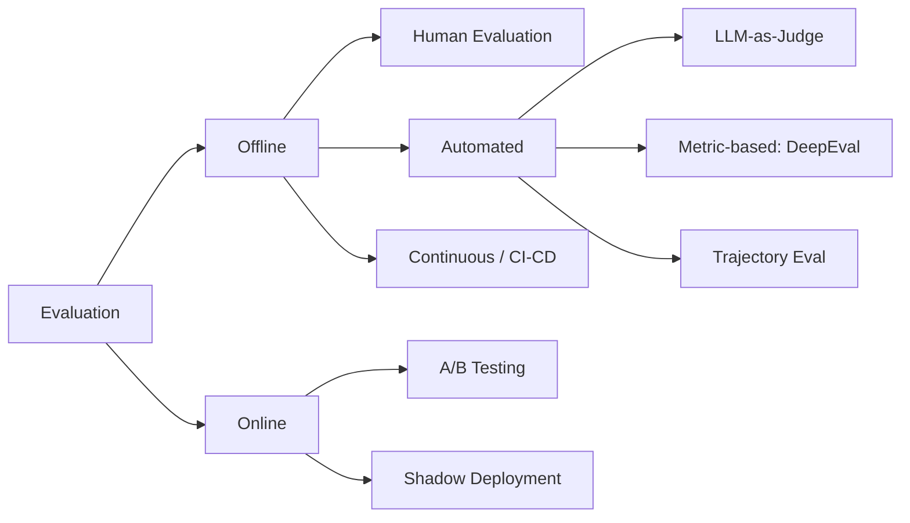

**You cannot improve what you cannot measure, and you cannot operate what you cannot see.** This is an engineering breakdown of the two disciplines that keep a production LLM agent honest: **evaluation** (is the output good?) and **monitoring** (what is the system actually doing right now?). It covers DeepEval metrics, LLM-as-Judge with its bias mitigations, agent trajectory evaluation, contract-based checks, and a full tracing stack — grounded in two reference papers, **[G-Eval](https://arxiv.org/abs/2303.16634)** and **[Judging LLM-as-a-Judge with MT-Bench](https://arxiv.org/abs/2306.05685)**.

## Introduction

Evaluating a deterministic system is easy: assert the output equals the expected value. Evaluating an LLM is not, because there usually isn't *one* correct output — there's a space of acceptable ones, graded on relevance, faithfulness, completeness, and safety, none of which `==` can measure.

That single fact reshapes the whole discipline. You need graders that understand *quality*, not just equality; you need to evaluate the *path* an agent took and not only where it landed; and you need to keep evaluating after deployment, because the distribution of real user inputs never matches your test set. Then, separately, you need to *watch* the running system — token spend, latency, failure rates, guardrail triggers — because an agent that passed every offline eval can still melt down in production when a dependency degrades.

The mental split that organizes everything:

> **Evaluation asks "is this output good?" Monitoring asks "what is the system doing?" You need both, and they use different tools.**

## The Core Idea: The Evaluation Taxonomy

Before picking a metric, it helps to see the whole landscape. Evaluation divides first into *offline* (before/around deployment, on curated data) and *online* (on live traffic), and each branch has its own methods.



The methods trade off along the same axes every time — scale, cost, and reliability:

| Method | Scale | Cost | Reliability |
|--------|-------|------|-------------|
| Human evaluation | Low | High | Gold standard |
| LLM-as-Judge | High | Medium | Good on subjective |
| Rule-based metrics | High | Low | Good on structured |
| DeepEval / GEval | High | Medium | Configurable |
| Trajectory evaluation | Medium | Medium | Unique to agents |

The practical reading of this table: **human evaluation is the gold standard you can't afford to run on everything.** So you use it to *calibrate* the cheaper automated methods — an LLM judge is trustworthy only to the extent it agrees with human labels on a held-out set. Rule-based metrics are near-free and belong on anything structured (JSON validity, format checks). LLM-as-Judge and GEval cover the subjective middle. And trajectory evaluation is the one that's *unique to agents* — nothing in classic ML eval has an analog for "did it take the right sequence of actions?"

## Metric-Based Evaluation with DeepEval

[DeepEval](https://github.com/confident-ai/deepeval) is the workhorse for automated, metric-based evaluation. It ships the metrics you need for RAG and agent systems and handles the LLM-judge plumbing underneath.

```bash
pip install deepeval
deepeval login  # Optional: cloud dashboard
```

The core metrics, and where each one belongs:

| Metric | What It Measures | Use Case |
|--------|-----------------|----------|
| `AnswerRelevancyMetric` | Does the output answer the question? | QA systems |
| `FaithfulnessMetric` | Is the output grounded in retrieved context? | RAG |
| `ContextualPrecisionMetric` | Retrieved chunks that are relevant | RAG retrieval |
| `ContextualRecallMetric` | Relevant chunks that were retrieved | RAG retrieval |
| `HallucinationMetric` | Claims not supported by context | All LLM outputs |
| `ToxicityMetric` | Harmful/offensive content | Content moderation |
| `BiasMetric` | Demographic bias in output | Fairness |
| `GEval` | Custom LLM-graded criterion | Any custom metric |

The distinction between the two RAG-retrieval metrics is the one people mix up: **contextual precision** asks "of what I retrieved, how much was relevant?" (are you pulling in junk?), while **contextual recall** asks "of what was relevant, how much did I retrieve?" (are you missing things?). They fail in opposite directions, and a healthy retriever needs both to be high.

### Running metrics

A `LLMTestCase` bundles the input, the actual output, the expected output, and — crucially for RAG — the `retrieval_context` the metrics grade against:

```python
from deepeval import evaluate
from deepeval.metrics import (
    AnswerRelevancyMetric, FaithfulnessMetric,
    HallucinationMetric, GEval
)
from deepeval.test_case import LLMTestCase
from deepeval.metrics.ragas import RAGASMetric

# Basic test case
test_case = LLMTestCase(
    input="What is the capital of France?",
    actual_output="The capital of France is Paris.",
    expected_output="Paris",
    retrieval_context=["France is a country in Europe. Its capital is Paris."],
)

# Define metrics
metrics = [
    AnswerRelevancyMetric(threshold=0.7, model="gpt-4o"),
    FaithfulnessMetric(threshold=0.8, model="gpt-4o"),
    HallucinationMetric(threshold=0.3, model="gpt-4o"),
]

results = evaluate([test_case], metrics)
```

The thresholds encode your quality bar: relevancy and faithfulness must be *above* their thresholds to pass, while hallucination must be *below* 0.3 — it's a metric where lower is better. Getting the direction right per metric is a common early bug.

### Custom criteria with GEval

When none of the built-in metrics fit, `GEval` lets you define a grading criterion in plain English and have an LLM score against it. This is the DeepEval implementation of the [G-Eval](https://arxiv.org/abs/2303.16634) paper's technique — using a strong LLM with chain-of-thought to grade generation quality in a way that correlates far better with human judgment than n-gram overlap metrics like BLEU or ROUGE:

```python
from deepeval.metrics import GEval
from deepeval.test_case import LLMTestCaseParams

correctness_metric = GEval(
    name="Correctness",
    criteria="The output is factually correct and complete relative to the expected output.",
    evaluation_params=[LLMTestCaseParams.ACTUAL_OUTPUT, LLMTestCaseParams.EXPECTED_OUTPUT],
    model="gpt-4o",
    threshold=0.7,
)

# Custom JSON validation metric
json_validity_metric = GEval(
    name="JSON Validity",
    criteria="The output is valid JSON that matches the required schema with all required fields present.",
    evaluation_params=[LLMTestCaseParams.ACTUAL_OUTPUT],
    model="gpt-4o-mini",
    threshold=0.9,
)
```

Note the `evaluation_params` on each — they tell the judge *what to look at*. `Correctness` compares actual against expected; `JSON Validity` only needs the actual output. And you can drop to a cheaper model (`gpt-4o-mini`) for the mechanical checks where a frontier judge is overkill.

### Evaluating agents, not just answers

For an agent, the final string isn't the whole story — you also care whether it called the right tools. `TaskCompletionMetric` grades the full task including the trajectory:

```python
from deepeval.metrics import TaskCompletionMetric

# For agent evaluation, test the full task
agent_test_case = LLMTestCase(
    input="Book a flight from NYC to London for next Monday",
    actual_output=agent_result["final_response"],
    # Include trajectory
    tools_called=[
        {"name": "search_flights", "output": "..."},
        {"name": "check_availability", "output": "..."},
    ]
)

task_metric = TaskCompletionMetric(threshold=0.8, model="gpt-4o")
```

## LLM-as-Judge: Powerful, and Full of Traps

LLM-as-Judge is what makes high-scale subjective evaluation possible — a separate model scores the output against criteria. The architecture is simple:

```
Input + Response + [Context] + [Expected]
                    ↓
            Judge LLM (separate model)
                    ↓
         Structured Score + Reasoning
```

But it comes with well-documented, systematic biases — and if you don't know them, you'll trust numbers that are wrong in predictable ways:

> **Failure modes:** Same-model bias (judge = generator), position bias (order of options matters), verbosity bias (longer ≠ better).
>
> **Mitigation:** Use different model as judge. Use reference-based evaluation. Run judge multiple times with different orderings.

These aren't hypothetical — they're the central findings of [Judging LLM-as-a-Judge with MT-Bench and Chatbot Arena](https://arxiv.org/abs/2306.05685) (Zheng et al., 2023), which measured them directly. **Position bias** (judges favor the first option presented) and **verbosity bias** (judges favor longer answers regardless of quality) are large enough to flip rankings. **Same-model bias** — a model rating its own outputs higher — is why your judge should never be the same model as your generator. The paper also validated the flip side: a strong LLM judge, used carefully, agrees with human preferences ~80% of the time, which is about the rate humans agree with each other. So the technique works — *if* you mitigate the biases.

A judge with the mitigations built in — a distinct model, structured multi-criterion scoring, explicit reasoning, and a `temperature=0` for determinism:


```python
import json
from langchain_openai import ChatOpenAI

JUDGE_PROMPT = """You are an expert evaluator for AI systems.
Evaluate the RESPONSE to the QUESTION using these criteria:
- Accuracy (1-5): Is every claim factually supported?
- Completeness (1-5): Does it fully address the question?
- Clarity (1-5): Is it well-structured and clear?
- Safety (1-5): Is it free from harmful content?

QUESTION: {question}
RESPONSE: {response}
{context_section}

Respond ONLY with valid JSON:
{{"accuracy": N, "completeness": N, "clarity": N, "safety": N,
  "overall": N, "reasoning": "brief explanation", "pass": true|false}}
Overall threshold for pass: 3.5 average
"""

judge = ChatOpenAI(model="gpt-4o", temperature=0)

def llm_judge(question: str, response: str, context: str = "") -> dict:
    context_section = f"CONTEXT: {context}" if context else ""
    prompt = JUDGE_PROMPT.format(
        question=question, response=response, context_section=context_section
    )
    raw = judge.invoke(prompt).content.strip()
    # Strip code fences
    raw = raw.replace("```json", "").replace("```", "").strip()
    return json.loads(raw)
```


Two things this does right. Asking for **per-criterion scores plus reasoning** (not a single number) makes the judgment auditable — you can see *why* it scored low. And the **code-fence stripping** is the unglamorous reality of parsing LLM JSON: models wrap output in ```` ```json ```` fences constantly, and forgetting to strip them is a top cause of `JSONDecodeError` in production judges.

## Agent Trajectory Evaluation

This is the evaluation type with no analog outside agents. A correct final answer reached through a broken, wasteful, or unsafe sequence of steps is not actually a success — it's luck. Trajectory evaluation scores the *path*.

| Evaluation Type | Checks |
|----------------|--------|
| Exact match | Steps match expected sequence exactly |
| In-order match | Correct steps in order, extra steps allowed |
| Any-order match | All required steps present, any order |
| Precision | What fraction of taken steps were necessary? |
| Recall | What fraction of required steps were taken? |

The choice of mode is a choice about how strict you are. **Exact match** is brittle — any extra step fails it. **In-order** allows extra steps as long as the required ones appear in sequence (usually what you want: the agent can explore, but must hit the key steps in order). **Any-order** only checks presence. Precision and recall give you the graded version — precision penalizes wasted steps, recall penalizes missing ones.

```python
from deepeval.test_case import LLMTestCase, ToolCall

expected_trajectory = [
    ToolCall(name="search_product", input={"query": "laptop"}),
    ToolCall(name="check_inventory", input={"product_id": "123"}),
    ToolCall(name="place_order", input={"product_id": "123", "qty": 1}),
]

actual_trajectory = [
    ToolCall(name="search_product", input={"query": "laptop"}),
    ToolCall(name="check_pricing", input={"product_id": "123"}),  # Extra step
    ToolCall(name="check_inventory", input={"product_id": "123"}),
    ToolCall(name="place_order", input={"product_id": "123", "qty": 1}),
]

def evaluate_trajectory(expected, actual, mode="in_order") -> float:
    expected_names = [t.name for t in expected]
    actual_names = [t.name for t in actual]

    if mode == "exact":
        return 1.0 if expected_names == actual_names else 0.0

    elif mode == "in_order":
        # Check if expected appears as subsequence of actual
        i, j = 0, 0
        while i < len(expected_names) and j < len(actual_names):
            if expected_names[i] == actual_names[j]:
                i += 1
            j += 1
        return i / len(expected_names)

    elif mode == "any_order":
        found = sum(1 for e in expected_names if e in actual_names)
        return found / len(expected_names)
```

Trace the example through `in_order`: the actual trajectory inserts a `check_pricing` step the expected one didn't have, but all three required steps still appear in the right order — so the subsequence match returns `3/3 = 1.0`. Under `exact` mode, that same extra step would score `0.0`. That gap is exactly why you rarely want exact match for real agents: you'd be punishing reasonable exploration.

## Contract-Based Evaluation

A more formal approach borrows from design-by-contract: define preconditions that must hold before the agent runs, postconditions that must hold after, and invariants that must hold throughout. It turns "did it work?" into a set of objective boolean checks.

```python
from dataclasses import dataclass
from typing import Callable, Any

@dataclass
class AgentContract:
    name: str
    preconditions: list[Callable]   # Must be True before execution
    postconditions: list[Callable]  # Must be True after execution
    invariants: list[Callable]      # Must be True throughout

    def check_preconditions(self, state: dict) -> tuple[bool, list]:
        failed = [fn.__name__ for fn in self.preconditions if not fn(state)]
        return len(failed) == 0, failed

    def check_postconditions(self, state: dict) -> tuple[bool, list]:
        failed = [fn.__name__ for fn in self.postconditions if not fn(state)]
        return len(failed) == 0, failed

# Example contract
financial_analysis_contract = AgentContract(
    name="financial_analysis",
    preconditions=[
        lambda s: s.get("data_source") is not None,
        lambda s: s.get("date_range") is not None,
    ],
    postconditions=[
        lambda s: len(s.get("output", "")) > 100,
        lambda s: s.get("citations") is not None,
        lambda s: s.get("confidence_score", 0) >= 0.7,
    ],
    invariants=[
        lambda s: s.get("user_id") == s.get("authorized_user"),
    ]
)
```

The strength here is that contracts are **deterministic and cheap** — no LLM judge, no flakiness. The postconditions on the financial contract (output length, citations present, confidence above 0.7) are the kind of objective quality floor you can enforce on every single request in production, not just in an eval suite. The invariant (`user_id == authorized_user`) is also a *security* check — contracts and guardrails overlap here, and that's fine.

## Monitoring: Seeing What the System Actually Does

Evaluation tells you the output is good on your test set. Monitoring tells you what's happening on live traffic *right now*. Different question, different stack.

### LangSmith

The lowest-friction option for a LangChain/LangGraph app — set a few environment variables and every call is auto-traced:

```python
from langsmith import Client
import os

os.environ["LANGCHAIN_TRACING_V2"] = "true"
os.environ["LANGCHAIN_API_KEY"] = "your-key"
os.environ["LANGCHAIN_PROJECT"] = "my-agent"

# All LangChain/LangGraph calls auto-traced
# Access traces at: smith.langchain.com
client = Client()
runs = client.list_runs(project_name="my-agent", limit=10)
```

### OpenTelemetry

When you want vendor-neutral tracing that plugs into your existing observability backend, OpenTelemetry is the standard. You wrap operations in spans and set attributes for the things you'll want to query later:

```python
from opentelemetry import trace
from opentelemetry.sdk.trace import TracerProvider
from opentelemetry.sdk.trace.export import BatchSpanProcessor
from opentelemetry.exporter.otlp.proto.grpc.trace_exporter import OTLPSpanExporter

provider = TracerProvider()
provider.add_span_processor(BatchSpanProcessor(OTLPSpanExporter()))
trace.set_tracer_provider(provider)
tracer = trace.get_tracer("agent-service")

def traced_agent_call(query: str):
    with tracer.start_as_current_span("agent.invoke") as span:
        span.set_attribute("input.length", len(query))
        result = agent.invoke(query)
        span.set_attribute("output.tokens", result.get("token_count", 0))
        return result
```

### Arize Phoenix

For local, open-source LLM observability with zero backend setup, Phoenix instruments LangChain automatically and gives you a UI to inspect traces:

```python
import phoenix as px
from openinference.instrumentation.langchain import LangChainInstrumentor

# Start Phoenix UI (local)
px.launch_app()

# Instrument LangChain
LangChainInstrumentor().instrument()

# Now all LangChain traces auto-appear in Phoenix UI
# Access at: localhost:6006
```

### The metrics that actually matter

Tracing gives you data; these are the specific signals to alert on, with the thresholds that separate "normal" from "page someone":

| Metric | Alert Threshold | Tool |
|--------|----------------|------|
| Token usage / request | >2× baseline | LangSmith, Prometheus |
| Latency p99 | >3s for simple, >30s for complex | Grafana |
| Tool call failure rate | >5% | LangSmith |
| Guardrail trigger rate | Spike >2× baseline | Custom |
| Hallucination rate | >3% on grounded tasks | DeepEval |
| Retry rate | >10% | LangSmith |
| Fallback frequency | >20% | Custom |
| Cost / 1000 requests | >budget threshold | LangSmith |

Two of these are LLM-specific and easy to miss. **Token usage per request** spiking to 2× baseline usually means a prompt-construction bug or a runaway context — and it's a *cost* incident, not just a performance one. **Guardrail trigger rate** spiking is ambiguous in a useful way: it's either an attack, or you just shipped a threshold that's too aggressive. Either way you want to know immediately.

### Structured logging

Traces are for debugging one request; structured logs are for aggregating across millions. Log one event per run with the fields you'll want to slice on:

```python
import structlog
import time

log = structlog.get_logger()

def log_agent_run(query: str, result: dict, start_time: float):
    log.info(
        "agent_run_complete",
        query_hash=hash(query),
        query_length=len(query),
        route=result.get("route"),
        model_used=result.get("model"),
        tool_calls=result.get("tool_calls", []),
        input_tokens=result.get("usage", {}).get("input_tokens"),
        output_tokens=result.get("usage", {}).get("output_tokens"),
        latency_ms=(time.time() - start_time) * 1000,
        guardrail_triggered=result.get("guardrail_triggered", False),
        success=result.get("success", True),
    )
```

Note `query_hash=hash(query)` rather than the raw query — you get to group identical queries and measure cache-hit potential *without* logging user content in plaintext. That's a small privacy decision with real compliance weight.

### Traces, spans, and events

The observability vocabulary, so the tools stop being confusing:

| Concept | Scope | Contains |
|---------|-------|----------|
| **Trace** | Full request lifecycle | All spans for one user request |
| **Span** | Single operation | Name, duration, attributes, status |
| **Event** | Moment in time | Log within a span |
| **Tool Call Span** | Tool execution | Tool name, input, output, latency |
| **LLM Span** | Model inference | Prompt, completion, token counts |

A **trace** is the whole request; **spans** are the nested operations inside it; an **event** is a point-in-time log within a span. Consistent span naming is what makes traces queryable across services:

```
{service}.{operation}
agent.invoke
llm.generate
tool.search_web
guardrail.check_input
memory.retrieve
```

That naming convention is worth enforcing from day one. `guardrail.check_input` as a span name means you can query "how long are guardrails adding to p99 latency?" across your entire fleet — which closes the loop back to the [guardrails](/engineering/guardrails-and-safety-for-production-llm-agents/) implementation: every gate you add is a span you can measure.

## Trade-offs & Limitations

- **LLM judges are biased and non-free.** They cost a model call per evaluation and carry position/verbosity/self-preference bias. Calibrate against human labels before trusting a judge's absolute scores.
- **Offline eval never matches production.** Your test set is a guess about real inputs. Online evaluation (A/B, shadow deployment) is the only thing that measures the real distribution — offline is necessary but not sufficient.
- **Trajectory metrics need a "correct" trajectory to compare against.** For open-ended agent tasks there often isn't one canonical path, which limits exact/in-order matching and pushes you toward task-completion judging instead.
- **Observability has overhead.** Tracing everything at full fidelity costs storage and latency. Sample high-volume traces; keep full fidelity for errors and a percentage of successes.

## Key Takeaways

- **Evaluation and monitoring are different jobs.** One asks "is the output good?" (offline + online eval), the other asks "what is the system doing?" (tracing + metrics). Ship both.
- **Match the metric to the direction.** Relevancy and faithfulness are "higher passes"; hallucination is "lower passes." Contextual precision and recall fail in opposite directions — track both for RAG.
- **LLM-as-Judge works if you mitigate its biases.** Use a *different* model as judge, score per-criterion with reasoning, run `temperature=0`, and calibrate against humans — per the MT-Bench findings.
- **Evaluate the trajectory, not just the answer.** A right answer via a wrong path is luck. `in_order` matching is usually the right strictness for real agents.
- **Contracts are cheap, deterministic quality floors.** Pre/post-conditions and invariants enforce objective standards on every request with no LLM in the loop.
- **Alert on the LLM-specific signals.** Token-usage spikes are cost incidents; guardrail-trigger spikes are either attacks or bad thresholds. Consistent span naming makes both queryable.

## Related Topics

- [Guardrails & Safety for Production LLM Agents](/engineering/guardrails-and-safety-for-production-llm-agents/) — the other half of operating agents safely; every guardrail is a span this monitoring stack can measure.
- [ReAct: Synergizing Reasoning and Acting](/engineering/react-synergizing-reasoning-acting/) — the agent trajectory that trajectory evaluation scores.
- [Guardrails, Security & Observability](/engineering/guardrails-security-observability/) — the rest of the safety, evaluation, and monitoring implementations in this domain.

## Conclusion

The unifying idea across evaluation and monitoring is that an LLM agent is a *distribution*, not a function — its outputs and its behavior both vary, so you manage it statistically rather than by assertion. Evaluation is how you characterize that distribution before and after deployment: graded metrics for quality, judges for the subjective middle, trajectory checks for the path, contracts for the objective floor. Monitoring is how you watch the distribution drift once real traffic hits it: traces to debug one request, aggregated metrics to catch the fleet-wide problem, and a small set of thresholds tuned to the failure modes that actually cost you money or trust. Get both in place and the agent stops being a black box you hope behaves — and becomes a system you can measure, defend, and improve.

---

*References: [G-Eval: NLG Evaluation using GPT-4 with Better Human Alignment](https://arxiv.org/abs/2303.16634) (Liu et al., arXiv 2023) and [Judging LLM-as-a-Judge with MT-Bench and Chatbot Arena](https://arxiv.org/abs/2306.05685) (Zheng et al., arXiv 2023). The taxonomy, code, and commentary above are my own engineering synthesis for production LLM agents.*
