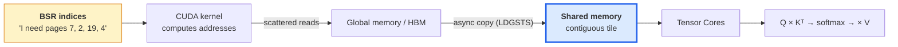
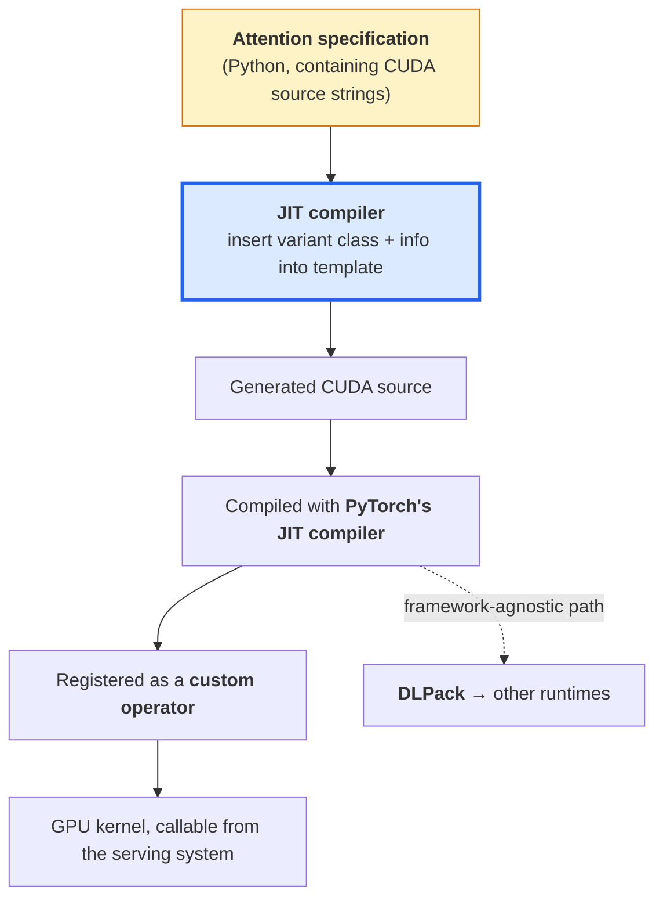
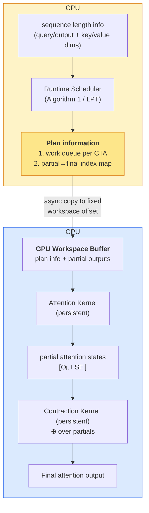
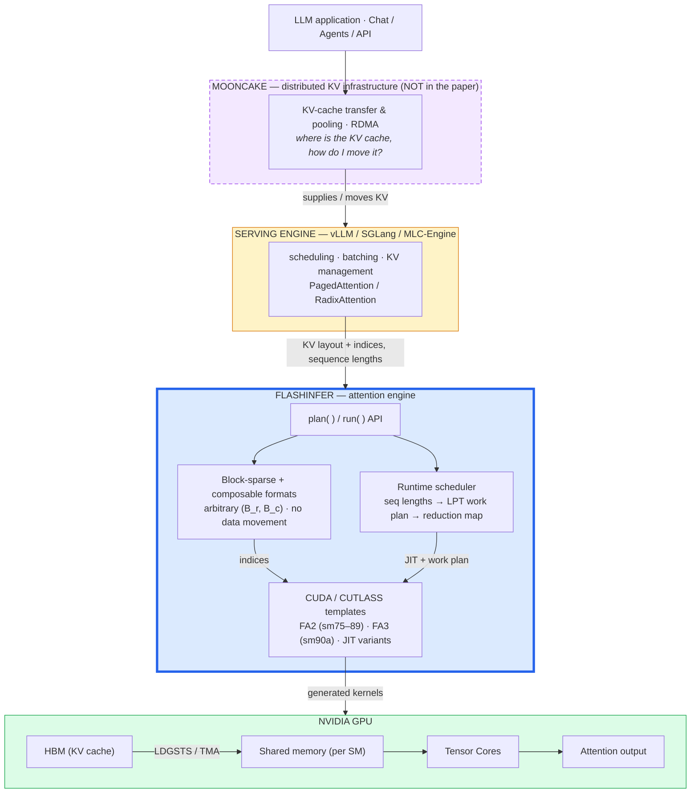

This is an engineering dissection of **FlashInfer** — a *customizable, block-sparse attention engine for LLM inference serving*. These are my own understanding notes, promoted into an implementation walkthrough: the goal is to go from **paper concept → my understanding → engineering interpretation → data/control flow → CUDA/C++ → GPU behavior**, so that by the end the reader can reconstruct not just *what* FlashInfer proposes but *how* the idea becomes an actual kernel running on an SM.

FlashInfer is the layer *underneath* a serving system. It has been integrated into **vLLM**, **SGLang**, and **MLC-Engine**, and can act as an attention backend inside **TensorRT-LLM**. It does not own the model, the requests, or the KV-cache policy — it owns *attention execution*. Holding that boundary straight is half of understanding the paper, so I keep returning to it.

**Attribution convention.** Because this mixes what the paper states with my own reasoning and teaching code, non-obvious claims are tagged:

- **[Paper]** — stated in the FlashInfer paper (§ references are to the paper's sections/figures).
- **[Interpretation]** — my engineering reasoning, written for the reader.
- **[Educational]** — a worked example or representative kernel written here to build intuition; not a verbatim FlashInfer source listing.
- **[Explanatory CUDA]** — general CUDA/GPU knowledge used to ground something the paper assumes, not something the paper specifies.

Where my explanation and the paper's framing diverge, I keep my explanation and make the distinction explicit rather than silently rewriting it.

---

## I. The One Distinction That Matters Most: Engine, Not Kernel

Before anything technical, the single idea that everything else hangs off. FlashInfer is **not** changing the Transformer architecture, and it is **not** replacing the attention mechanism mathematically. The model still does exactly what it always did:

```
Q, K, V → attention scores → softmax / variant → weighted V → output
```

What FlashInfer changes is **how that attention computation is implemented on the GPU**. **[Interpretation]**

```
LLM / Transformer
       │
       ▼
   Attention
       │
       │  "I need attention(Q, KV-cache)"
       ▼
 ┌─────────────────┐
 │    FlashInfer   │
 │                 │
 │ KV-cache layout │
 │ GPU kernel      │
 │ scheduling      │
 │ memory movement │
 └─────────────────┘
       │
       ▼
   Attention output
```

So for Llama, Qwen, DeepSeek, etc., the model's attention *concept* has not fundamentally changed. The **backend executing attention** has. This is also why the paper's title says **"Attention Engine"** rather than *"new attention architecture."* **[Paper]**

### Why serving needs an engine and training got by with a kernel

The setup from the paper's introduction: in LLM serving, the attention mechanism **reads from the KV cache** (the stored historical context) and computes outputs based on the **current query**. The efficiency of this attention operator is *paramount* to overall inference performance. But creating high-performance attention kernels **tailored for serving** introduces challenges not encountered in training. **[Paper]**

That third point is the hinge of the whole paper. The attention math is the same as in training, but the *serving* setting is different: **[Interpretation]**

```
        Training                         Serving
   ─────────────────────           ─────────────────────
   fixed, known shapes             query = "now", KV = all history
   uniform sequence lengths        wildly varying lengths per request
   contiguous tensors              paged / shared / reused KV cache
   one static kernel is fine       one static kernel is not enough
```

So the problem statement isn't "attention is slow." It's: **attention in serving is performance-critical *and* its shapes, layouts, and variants are far less predictable than in training** — which is precisely why a *kernel* isn't enough and an *engine* is needed.

### Scope check: FlashInfer does not own the Q/K/V projections

"FlashInfer implements attention on the GPU" can be read too widely. The Q, K, V projections are plain matrix multiplications against the learned weights:

$$
Q = X W_Q, \qquad K = X W_K, \qquad V = X W_V
$$

Those are ordinary linear layers. FlashInfer is concerned with the attention computation **after** the Q/K/V tensors already exist — specifically, efficient attention *over the KV cache*. **[Paper]** The mental model is not "FlashInfer → computes QKV projections." It is:

```
Input
  │
  ├── Q projection ──► Q
  ├── K projection ──► K ──► KV Cache
  └── V projection ──► V ──► KV Cache
                              │
                              ▼
                         FlashInfer
                              │
                    Attention(Q, K_cache, V_cache)
                              │
                              ▼
                           Output
```

### The four contributions, and where each lives in this article

The paper's formal contribution list, mapped onto the sections below: **[Paper]**

| Contribution | Paper section | Where here |
| --- | --- | --- |
| Block-sparse **and composable** formats for KV-cache heterogeneity | §3.1 | IV |
| Customizable attention template + JIT compilation | §3.2 | VI, VII |
| Dynamic scheduling framework, CUDAGraph-compatible | §3.3 | VIII |
| Comprehensive evaluation | §4 | XI |

One word in that first bullet is easy to skim past: **composable**. It is not a synonym for block-sparse — it is the second half of the format story, and it is what makes splitting a long KV sequence into chunks and merging the partial results *exact* rather than approximate. That merge is the ⊕ operator of Section III, so I have to establish ⊕ before the format work makes sense.

---

## II. Background: The Attention Math FlashInfer Inherits

FlashInfer builds on FlashAttention. To understand what FlashInfer *adds*, I first have to be clear about what it *inherits* and therefore does not re-invent.

### II.1 What FlashAttention solves

Textbook attention materializes the score matrix: **[Interpretation]**

```
S = Q Kᵀ          →  write  S  to global memory   (l_qo × l_kv)
P = softmax(S)    →  read S, write P to global memory
O = P V           →  read P
```

For sequence length `n`, `S` and `P` are **n × n**. Two problems:

1. **Memory:** O(n²) global memory, purely for intermediates that get thrown away.
2. **Bandwidth:** the matrix is written to HBM and read back repeatedly. Attention is *memory-bandwidth bound*, not compute bound — the GPU sits waiting on HBM while the Tensor Cores idle.

The key realisation is that this is **not a FLOP problem**. The arithmetic is unavoidable; the *data movement* isn't. FlashAttention is an **IO-aware** algorithm: same math, far fewer trips to HBM. During the forward pass it employs the **online-softmax trick**, updating attention outputs on-the-fly using a **constant amount of on-chip memory**, thus avoiding materializing the attention matrix in global memory. **[Paper]**

### II.2 The online-softmax recurrence

The obstacle to fusing everything into one pass is that softmax appears to need the **whole row** before it can normalise (you need the row max for stability and the row sum to divide by). Online softmax removes that dependency by carrying **running statistics** and *retroactively rescaling* what's already accumulated. Per tile of K/V, maintaining a running max `m` and running sum `l`: **[Interpretation]**

```
m_i = max(m_{i-1}, rowmax(S_i))

l_i = e^(m_{i-1} - m_i) · l_{i-1}  +  rowsum(e^(S_i - m_i))
      └──── rescale old ────┘         └──── add new ────┘

O_i = e^(m_{i-1} - m_i) · O_{i-1}  +  e^(S_i - m_i) · V_i
      └──── rescale old ────┘         └─── add new ───┘
```

When a later tile reveals a larger max, the previously accumulated output is simply **scaled by `e^(m_old − m_new)`** to correct it. So the result is **exact** — not an approximation, not a sparse or low-rank shortcut. That's why the paper stresses the word *exact*. The loop:

```
for each block of Q:                 ← stays in on-chip SRAM
    for each block of K, V:          ← streamed in, one tile at a time
        S_ij = Q_i K_jᵀ              ← computed in SRAM, never written to HBM
        update m, l, O               ← running stats, constant memory
    write O_i to HBM                 ← one write per Q block, that's it
```

I flag this recurrence now because it is exactly the machinery that makes **chunked KV + partial outputs** viable in Section III: if you can rescale-and-merge across tiles *inside* one kernel, you can also rescale-and-merge across *CTAs*. Same trick, wider scope. **[Interpretation]**

### II.3 Operational intensity — the quantitative reason decode is memory-bound

This is where the paper stops describing FlashAttention and starts explaining *why serving is the hard case*. Its claim: the operational intensity of FlashAttention is **[Paper]**

$$
O\!\left(\frac{1}{\dfrac{1}{l_{qo}} + \dfrac{1}{l_{kv}}}\right)
$$

where $l_{qo}$ is the query length and $l_{kv}$ the KV-cache length. **Operational (arithmetic) intensity** is

$$
\text{intensity} = \frac{\text{FLOPs performed}}{\text{bytes moved from memory}}
$$

Low intensity means **memory-bound** — starved waiting on HBM, Tensor Cores idle. High intensity means **compute-bound**, which is where you *want* to be.

That expression is the **harmonic mean** of $l_{qo}$ and $l_{kv}$, up to a factor of 2: **[Interpretation]**

$$
\frac{1}{\dfrac{1}{l_{qo}} + \dfrac{1}{l_{kv}}} = \frac{l_{qo}\, l_{kv}}{l_{qo} + l_{kv}}
$$

The important property of that form is that it is **dominated by the smaller of the two**. Let $l_{kv} \to \infty$ with $l_{qo}$ fixed:

$$
\lim_{l_{kv} \to \infty} \frac{l_{qo}\, l_{kv}}{l_{qo} + l_{kv}} = l_{qo}
$$

So no matter how enormous the KV cache grows, the intensity **saturates at $l_{qo}$**. Growing history buys you nothing. And in serving, query length is either **equal to** the KV length (prefill) or **smaller** (decode) — never larger. So $\min(l_{qo}, l_{kv}) = l_{qo}$ always, and the intensity simplifies to $O(l_{qo})$. Substitute the decode case, where exactly one token is generated ($l_{qo}=1$):

$$
O(l_{qo}) = O(1)
$$

That single line is the whole reason this paper exists. **Constant** operational intensity: you stream the entire KV cache out of HBM and do a *constant* amount of arithmetic per byte loaded.

```
prefill:  l_qo = l_kv = n     →  intensity O(n)     →  compute-bound, Tensor Cores fed
decode:   l_qo = 1            →  intensity O(1)     →  memory-bound, HBM is the wall
```

### II.4 Why batching does not rescue decode, but GQA does

Batching is the standard fix for memory-bound GPU work everywhere else, and the paper states flatly that it **does not alter** attention's operational intensity. The distinction is **what gets shared across the batch**: **[Paper]**

| Operation | Batched over B requests | Shared data? | Effect on intensity |
| --- | --- | --- | --- |
| Linear layer ($XW$) | $B$ tokens against the **same** $W$ | Yes — one weight matrix serves all | Rises with $B$ ✓ |
| Attention | $B$ queries against **$B$ different KV caches** | No — every request has its own history | Flat ✗ |

Batching a GEMM amortises the weight load; batching attention grows FLOPs **and** bytes in lockstep because request $i$'s query cannot reuse request $j$'s KV cache. What *does* help is **GQA/MQA**: grouping query heads so several share the same KV entries. With group size $g = H_{qo}/H_{kv}$, one loaded KV tile serves $g$ query heads, so intensity rises by exactly that factor: **[Paper]**

$$
O(l_{qo}) \;\longrightarrow\; O(g \cdot l_{qo})
$$

```
MHA  (g = 1)   :  1 query head  per KV head   →  load KV, use it once
GQA  (g = 8)   :  8 query heads per KV head   →  load KV, use it 8 times
MQA  (g = H)   :  all heads share one KV head →  maximum reuse
```

The practical instruction that falls out: a decode kernel should load a KV tile once and immediately run **all $g$ query heads of that group against it** while it's resident in shared memory. Loading the same tile $g$ separate times throws the GQA benefit away. This reappears in Section VI as a concrete tile-selection input.

> My own arithmetic, not the paper's: even at $g=8$, decode intensity is single-digit FLOP/byte, while an H100's ridge point is in the hundreds. So GQA moves decode meaningfully *up* the roofline but nowhere near off the memory-bound slope — which is why the rest of the paper spends its effort on **memory access patterns and scheduling** rather than raw FLOP throughput. **[Interpretation]**

### II.5 FA2 and FA3 — same math, better choreography

FlashAttention-2 and -3 don't change the algorithm; they change how it maps to hardware. **[Paper]** FA2 optimizes loop ordering and pipeline design:

| Change | Why it helps |
| --- | --- |
| **Swapped loop order** — Q blocks outer, K/V inner | Output tile stays resident; no repeated rescaling/reloading of `O` |
| **Fewer non-matmul FLOPs** | Rescaling deferred to the end; non-matmul ops run far slower than Tensor Core matmuls |
| **Parallelise over sequence length**, not just batch × heads | Long-context serving has *small* batch and few heads — otherwise SMs sit idle |
| **Better warp-level partitioning** | Cuts shared-memory traffic and warp sync |

That third row is the one that matters most here: **long context with small batch** *is* the serving regime, and it's the same "keep all SMs busy" concern FlashInfer's scheduler attacks (Section VIII) — just at a different level. FA3 adds Hopper-specific pipelining: **warp specialisation** (producer warps issue TMA, consumer warps run WGMMA), **overlapping matmul with softmax**, and **FP8** support. The through-line:

```
FA-1 :  don't touch HBM more than you must     (IO-awareness)
FA-2 :  keep every SM and Tensor Core busy     (parallelism + instruction mix)
FA-3 :  overlap everything you can, per-arch   (async pipelining, warp specialisation)
```

FlashInfer inherits all of this. What it *adds* is: making it work over **heterogeneous KV-cache layouts** (BSR), **generating** the right kernel per variant/layout via JIT, and **balancing many wildly different shapes** across CTAs at runtime. **[Interpretation]**

---

## III. Attention Composition: The ⊕ Operator That Makes Attention Partitionable

This section is §2.2 of the paper, and it is the mathematical *permission slip* for everything in Sections IV and VIII. The one-line version: **[Paper]**

> Instead of computing attention over the entire KV cache in one shot, split the KV cache into pieces, compute **partial attention** for each piece, and then mathematically combine those partial results into **exactly** the same final attention output.

Two misreadings to rule out immediately: **this is not padding** (nothing is filled or made uniform) and **this is not approximation** (the composed result is bit-for-bit the same computation, up to floating-point rounding). **[Interpretation]**

### III.1 The obstacle: each chunk has its own softmax denominator

For a single query $q$ over four key/value pairs, ordinary attention is

$$
O = \sum_i \frac{e^{q \cdot k_i}}{\sum_j e^{q \cdot k_j}} v_i
$$

In inference the KV cache can be enormous, so the natural question is: *"Why can't I divide the KV cache into chunks and have different GPU workgroups process different chunks?"* You can compute `Attention(q, k1,k2, v1,v2)` and `Attention(q, k3,k4, v3,v4)` independently — but you **cannot average the two outputs**, because each was normalised by its *own* local denominator restricted to its own chunk. Each partial output is a weighted mean over the wrong population. Fixing that is the entire content of §2.2. **[Interpretation]**

### III.2 A worked numeric example

Deliberately tiny. Let $q=[1,0]$ and $k_1..k_4 = [1,0],[2,0],[3,0],[4,0]$, so scores $qK^\top = [1,2,3,4]$, and take scalar values $V=[10,20,30,40]$. Ground truth in one shot:

$$
O = \mathrm{softmax}([1,2,3,4]) \cdot [10,20,30,40] \approx 34.93
$$

Split into two chunks:

```
                 KV Cache
                    │
             ┌──────┴──────┐
             ▼             ▼
          Chunk A        Chunk B
          k1,k2          k3,k4
             │             │
             ▼             ▼
        Partial Attn   Partial Attn
             │             │
             ▼             ▼
         State A        State B
             └──────┬──────┘
                    ▼
               Compose ⊕
                    │
                    ▼
              Final Output
```

**Chunk A** — scores $[1,2]$, values $[10,20]$: $O_A \approx 17.31$, $\mathrm{LSE}_A = \log(e^1+e^2) \approx 2.313$.
**Chunk B** — scores $[3,4]$, values $[30,40]$: $O_B \approx 37.31$, $\mathrm{LSE}_B = \log(e^3+e^4) \approx 4.313$.

Each partial is *locally* correct and *globally* wrong. They're numerically close (17.31 vs 37.31) even though chunk B deserves vastly more weight — averaging would give ≈27.3, nowhere near 34.93. So each chunk must carry **two** numbers, not one. That pair is the **Attention State**:

$$
\boxed{\;[\,O(\mathcal{I}),\; \mathrm{LSE}(\mathcal{I})\,]\;}, \qquad \mathrm{LSE}(\mathcal{I}) = \log \sum_{i \in \mathcal{I}} e^{q \cdot k_i}
$$

the attention *output* together with its attention *scale* (log-sum-exp of that index set's scores).

### III.3 Composing with ⊕

The paper's operator: **[Paper]**

$$
\begin{bmatrix} O(\mathcal{I} \cup \mathcal{J}) \\ \mathrm{LSE}(\mathcal{I} \cup \mathcal{J}) \end{bmatrix}
=
\begin{bmatrix} O(\mathcal{I}) \\ \mathrm{LSE}(\mathcal{I}) \end{bmatrix}
\oplus
\begin{bmatrix} O(\mathcal{J}) \\ \mathrm{LSE}(\mathcal{J}) \end{bmatrix}
$$

$$
O = \frac{e^{\mathrm{LSE}_A} O_A + e^{\mathrm{LSE}_B} O_B}{e^{\mathrm{LSE}_A} + e^{\mathrm{LSE}_B}},
\qquad
\mathrm{LSE} = \log\!\left(e^{\mathrm{LSE}_A} + e^{\mathrm{LSE}_B}\right)
$$

Substituting: $e^{2.313}\approx 10.107$, $e^{4.313}\approx 74.684$, so

$$
O \approx \frac{10.107 \times 17.31 + 74.684 \times 37.31}{10.107 + 74.684} \approx 34.93
$$

— **identical** to computing attention over all four keys at once. The formula stops looking arbitrary once you notice $e^{\mathrm{LSE}(\mathcal{I})}$ **is** the chunk's unnormalised softmax denominator. So ⊕ is mundane: un-normalise each partial by multiplying its own denominator back in, sum the numerators, divide by the *global* denominator (the sum of the local ones). A **weighted mean of weighted means, reweighted by population size**. That is *why* the LSE has to be carried at all — output alone is insufficient; output + scale is sufficient. **[Interpretation]**

### III.4 Engineering interpretation: ⊕ is the reduction operator for attention

The sentence with the widest consequences: **[Paper]**

> In FlashInfer, the **Attention State** is adopted as the **canonical output** of an attention operation, and **⊕ serves as the standard reduction operator** (analogous to summation in GEMM) on these states.

| Tiled GEMM | FlashInfer attention |
| --- | --- |
| Partial products | Partial attention states $[O, \mathrm{LSE}]$ |
| Reduce with `+` | Reduce with `⊕` |
| Associative, commutative → any order | Associative, commutative → any order |
| Enables arbitrary tiling/parallelisation | Enables arbitrary KV-chunking/parallelisation |

Because ⊕ is associative and commutative, attention states compose **in any order** — which is exactly what parallel reduction requires. A 100,000-token KV cache splits across CTAs, each emitting `[partial output, partial LSE]`, then reduced. This is what makes **arbitrary KV partitioning legal**, and it is the same operator that reappears for a *completely different reason* (memory-tier decomposition) in Section IV.

### III.5 How ⊕ looks in CUDA

The recurrence in §II.2 and the ⊕ formula are the same computation viewed two ways. Here is a representative device-side merge of two attention states, subtracting a running max exactly as online softmax does (naive $e^{\mathrm{LSE}}$ overflows for realistic scores — the boxed formula is the mathematical statement, not the floating-point recipe). **[Educational]**

```cpp
// One attention state per (query, head): output accumulator O[D] plus its scale m (running max) and l (running sum).
// Merging two states is the ⊕ operator, made numerically safe with a shared max.
template <int D>
__device__ void merge_state(
    float*       O_a, float& m_a, float& l_a,   // state A, updated in place → A ⊕ B
    const float* O_b, float  m_b, float  l_b)   // state B (read-only)
{
    // New shared max across both chunks.
    const float m_new = fmaxf(m_a, m_b);

    // Rescale each chunk's denominator into the shared frame.
    const float scale_a = __expf(m_a - m_new);   // e^(m_a - m_new)
    const float scale_b = __expf(m_b - m_new);

    const float l_new = l_a * scale_a + l_b * scale_b;   // combined denominator

    // Rescale and add the (still-unnormalised) outputs. Note O holds l·(weighted V),
    // i.e. the numerator — normalisation by l is deferred to the very end.
    #pragma unroll
    for (int d = 0; d < D; ++d) {
        O_a[d] = O_a[d] * scale_a + O_b[d] * scale_b;
    }

    m_a = m_new;
    l_a = l_new;
}
```

Mapping to the paper: `m` and `l` together *are* the LSE ($\mathrm{LSE} = m + \log l$); carrying the pair `(m, l)` instead of a single $\mathrm{LSE}$ is the overflow-safe encoding of the same attention state. A parallel reduction tree over many partial states is just repeated `merge_state` calls — and because the operation is associative, the tree can have any shape. **[Interpretation]**

### III.6 The catch that Section VIII inherits: determinism

⊕ is *mathematically* associative, but floating-point addition **isn't** associative in finite precision. So the obvious implementation — reduce partials with atomics in whatever order they finish — gives run-to-run variation in the output logits. The paper deliberately deviates from Stream-K here: **[Paper]**

> because LLM serving requires deterministic outputs, we did **not** incorporate atomic aggregation ... The scheduling algorithm generates **deterministic aggregation order** when provided with identical sequence length information.

```
Free to partition (⊕ is associative)      →  license to chunk KV across CTAs
NOT free to reorder at runtime (FP)        →  the schedule pins one reduction order
```

Same sequence lengths in → same reduction order → bitwise-reproducible out. That constraint is why the scheduler in Section VIII emits an explicit *reduction map* rather than letting CTAs race.

---

## IV. Block-Sparse KV Cache: The Unified Format

This is the paper's first contribution and §3.1. The claim FlashInfer makes is that wildly different KV-cache organizations — paged caches, radix trees, tree-attention masks, importance masks — can all be represented as **one** data structure, a block-sparse matrix, so the kernel below doesn't need to know which one it came from. **[Paper]**

### IV.1 From sparse matrix to BSR

Start from ordinary (unstructured) sparsity — individual zero elements scattered anywhere — and cut the matrix into **blocks** instead: **[Interpretation]**

```
┌───────┬───────┐
│ 1  2  │ 0  0  │        USED     EMPTY
│ 5  6  │ 0  0  │        BLOCK    BLOCK
├───────┼───────┤
│ 0  0  │ 11 12 │        EMPTY    USED
│ 0  0  │ 15 16 │        BLOCK    BLOCK
└───────┴───────┘
```

The bookkeeping changes character. Instead of "element (1,3) is zero, (1,4) is zero…" you say "**this whole block is absent — skip it.**" That's **BSR (Block Compressed Sparse Row)**: non-zero elements grouped into contiguous $(b_r, b_c)$ matrices. **[Paper]** Two corrections that change what you'd write in a kernel:

**Correction 1 — "structured" ≠ "triangular".** A causal mask is a structured pattern expressible in BSR, but triangularity is a *special case*, not the definition. Any block-level occupancy pattern qualifies. This matters because prefix-sharing and tree-attention patterns are **not** triangular — if BSR only handled triangular masks it couldn't unify the layouts on the left of Figure 1. **[Interpretation]**

**Correction 2 — the win is *not executing*, not "zeros are cheap".** A zero multiply costs a Tensor Core exactly as much as a non-zero one; there is no arithmetic discount.

$$
\boxed{\text{don't perform unnecessary computation}}
\qquad \text{not} \qquad
\boxed{\text{zero multiplication is easier}}
$$

The gain comes from the block never being **loaded, issued, or executed** at all. And block-level granularity beats scattered individual zeros because the GPU makes **one decision per block** rather than thousands of tiny per-element decisions. The bookkeeping is what kills unstructured sparsity on a GPU, not the arithmetic. **[Interpretation]**

### IV.2 Why FlashInfer wants BSR specifically, and the arbitrary-$B_c$ refinement

GPUs are far better at contiguous blocks than scattered elements. The paper's reasoning: BSR gives better **register reuse** than CSR, compatibility with **hardware matrix-multiply units** (`mma`), and the ability to **skip empty blocks**. That alignment sets the block sizes: **[Paper]**

```
tensor core mma minimum dim        = 16  (larger on newer GPUs)
   ↓
most block-sparse kernels use       multiples of (16, 16)
   ↓
many attention libraries restrict   multiples of (128, 128)
```

That (128,128) restriction is **bad for fine-grained sparsity** — KV-cache access isn't naturally 128-aligned. The route around it, which FlashInfer builds on: tensor cores can still be used with much smaller blocks — **(16,1)** or **(1,16)**, *vector-sparse* — by **gathering the relevant rows/columns into contiguous shared memory first**, then running **dense** tensor-core ops on that now-contiguous data. FlashInfer supports blocks with **arbitrary column size $B_c$**. **[Paper]**

```
scattered KV blocks in global memory
        │  gather
        ▼
contiguous tile in shared memory
        │  dense tensor-core mma
        ▼
      attention math
```

This is the single most important idea to carry into the CUDA: **the selection is sparse, the execution is dense.**

$$
\textbf{sparse at the data-selection level} \;\longrightarrow\; \textbf{dense at the hardware-compute level}
$$

The GPU's matrix units never see sparsity. By the time they run, the data is a contiguous dense tile — the sparsity was spent earlier, deciding *what to gather*.

### IV.3 What FlashInfer actually represents with BSR

The key thing not to misread: FlashInfer is **not** taking the attention *score* matrix and making it sparse. It uses block-sparsity to represent **the KV-cache access pattern** — which queries touch which KV-cache pages. Non-zero blocks correspond to the KV-cache pages accessed by the queries; an empty block means *"this query does not need this KV region"*, so the kernel skips it outright. **[Paper]**

Crucially, the "zero" blocks are KV regions that **aren't part of the required attention pattern** — *not* a dense matrix with explicitly stored zeros waiting to be multiplied. Nobody allocates the zeros. There is nothing to skip *over*; there is simply nothing there. **[Interpretation]** A concrete KV walkthrough — a query needing 4 of 8 blocks:

```
KV Cache   needed?          What runs
Block 0    ✓                B0 B1    B3          B6
Block 1    ✓                │  │     │           │
Block 2    ✗       ──►      ██ ██    ██          ██     ← 4 blocks loaded, not 8
Block 3    ✓
Block 4    ✗                (dense would load all 8)
Block 5    ✗
Block 6    ✓
Block 7    ✗
```

Half the global-memory traffic, half the arithmetic, same answer. Since decode is memory-bound (intensity $O(g\cdot l_{qo})$ from §II), the halved *traffic* is the part that buys latency.

### IV.4 A page table *is* a block-sparse matrix (Figure 2)

This is the figure that makes "diverse KV-cache structures unify under BSR" stop being a slogan. First, the mechanism it draws on — **paged KV cache**. The naive KV cache reserves each request's worst case up front (huge internal waste). PageAttention instead cuts the cache into **fixed-size pages** handed out on demand, so a request's logical KV is a *chain* of physical pages that need not be adjacent. A **page table** records where each logical block physically lives. **[Paper]**

Paged memory is not new — it is the classic OS virtual-memory mechanism. The diagrams below are standard multi-level page tables (illustrative context, **not** FlashInfer's own figure) — the exact structure FlashInfer borrows to reason about "logical → physical, non-contiguous" KV storage: **[Explanatory CUDA]**


*A first-level page table indexes into second-level tables whose entries are physical addresses (or DISK). The KV-cache analogue: a request's logical block index maps, through the page table, to whatever physical KV page the allocator had free — the mapping, not adjacency, defines the layout.*


*The same idea end to end: a logical/virtual address is split into page-table indices plus an offset; translation walks the tables to a physical page number, and the offset is contiguous within that page. FlashInfer keeps exactly this shape — scatter at **page** granularity, contiguous **within** a page (the head dimension).*

Now the move Figure 2 makes: that page table can be *interpreted* as a sparse matrix whose **rows are query tiles** and **columns are physical KV pages**. **[Paper]**

```
             Physical KV pages
             P0 P1 P2 P3 P4 P5 ...
           ┌────────────────────────
Request 1  │  ✓  ✗  ✓  ✗  ✗  ✓         →  [ 1 0 1 0 0 1 ]
Request 2  │  ✗  ✓  ✓  ✗  ✓  ✗
Request 3  │  ✓  ✗  ✗  ✓  ✗  ✗
           └────────────────────────
                Block Sparse Matrix
```

One rule reads the whole figure: **a non-zero block means "this query tile accesses this physical KV page."** The `1`s mean *access these*; the `0`s are an **absence of work**, not stored zeros. The two block-size parameters: **[Paper]**

| Symbol | Meaning | Who chooses it |
| --- | --- | --- |
| $B_r$ | **Query tile size** — queries grouped into one row block | FlashInfer / kernel config |
| $B_c$ | **KV block (page) size** | The **KV-cache management algorithm** (serving system) |

Figure 2 uses $B_r=4$, $B_c=1$. And crucially, **FlashInfer supports arbitrary $(B_r,B_c)$** — because $B_c$ is *someone else's* decision, the kernel cannot dictate the page size and must handle whatever the memory manager picked. That is exactly the arbitrary-$B_c$ point from §IV.2, now with a name for the parameter. **[Paper]**

One more thing Figure 2 shows: the **Q/O tensors are ragged (jagged), stored without padding**, so requests with 8, 4, 4 query tokens pack compactly into one tensor. K/V *start* as ragged tensors too (sharing Q's index pointers, since all come from $W_q,W_k,W_v$ on the same input) and only afterwards get incorporated into the KV cache. **[Paper]** So:

| Tensor | Format | Why |
| --- | --- | --- |
| Q / O | **Ragged** (row-offset indexed) | Variable *query* lengths, packed with no waste |
| KV cache | **BSR** (block-sparse) | Variable, *non-contiguous* physical placement |

### IV.5 This is not sparse GEMM — the misreading to avoid

The tempting reading is "$QK^\top$ where $K$ is sparse, so do a sparse matrix multiply." Wrong. The BSR structure supplies an **access pattern**; the computation over the *selected* data stays **dense**. Nothing is copied or rearranged either — given `L0→P7, L1→P2, L2→P15`, FlashInfer keeps the KV cache where it is and consults the mapping. Confirmed in §3.2.1: the composable-format approach *"doesn't require data movement in the KV cache; instead, we compute the indices and index pointer arrays for the sparse submatrices."* **[Paper]**

> The page table telling me where my KV blocks live can itself be represented as a BSR structure. The attention kernel then uses that structure to decide which physical KV blocks each query tile should access. **[Interpretation]**

### IV.6 Composable formats (Figure 3): the *second* reason ⊕ exists

A single BSR format is stuck with a **fixed block size**, and $B_r$ is doing double duty: **[Paper]**

| Larger $B_r$ | Smaller $B_r$ |
| --- | --- |
| ✅ Better shared-memory/register reuse for requests **within** the same block | ✅ Less fragmentation |
| ❌ More fragmentation | ❌ No cross-query reuse |

The insight that made Figure 3 click for me: **$B_r$ is really a memory-tier selector.** Queries in the same block are in the same threadblock, and a threadblock owns a shared-memory allocation — so $B_r$ decides *which level of the hierarchy serves the KV data*. **[Interpretation]**

```
        Throughput ▲
            │       ┌──────┐
            │       │ Reg  │
            │      ┌┴──────┴┐
            │      │  SMEM  │   ◄── B_r = 3: three queries share one KV tile here
            │     ┌┴────────┴┐
            │     │ L2 Cache │
            │    ┌┴──────────┴┐
            │    │   Global   │  ◄── B_r = 1: each query fetches its own KV, from here
            └────┴────────────┴──►
```

So `B_r = 3` vs `B_r = 1` is the difference between reading a KV tile **once from SMEM for three queries** and reading it **three times from global memory**. Rather than picking one $B_r$ and living with the trade-off, **composable formats** use *several* BSR matrices, each with the block size suited to its structure. Shared prefixes are the obvious case: if requests share a prefix, the corresponding rows/columns form a **dense submatrix**, which a large $B_r$ is good at. **[Paper]**

```
Full KV-cache sparse matrix
            │  decompose on known structure
            ▼
  ┌─────────────────────┬──────────────────────┐
  │  shared prefix      │  unique suffix        │
  │  (dense submatrix)  │  (genuinely sparse)   │
  │  BSR, B_r = 3       │  BSR, B_r = 1         │
  │  → SMEM / registers │  → global / L2        │
  └─────────────────────┴──────────────────────┘
```

Two corrections again: **nothing is grouped or copied** — the paper is explicit that it *"doesn't require data movement in the KV cache; instead, we compute the indices and index pointer arrays."* Two *views* are constructed over the same physical bytes. And **FlashInfer never inspects tokens** — the serving system's radix tree/page table already knows which requests share a prefix; FlashInfer just turns that relationship into BSR indices a kernel can exploit. **[Paper]**

Now the part I hadn't anticipated: **this is *why* ⊕ exists.** The two block-sparse matrices produce **separate attention states** that must be combined:

```
 Block size (1,1)          Block size (3,1)
 unique KV-Cache            shared KV-Cache
        │                          │
        ▼                          ▼
   [O₁, lse₁]        ⊕        [O₂, lse₂]
        └─────────────┬────────────┘
                      ▼
              [O_all, lse_all]
```

So decomposing the format **forces** a recombination step, and the operator is exactly §III's ⊕. This reframes ⊕ for me — I had filed it under "load balancing." It has two independent motivations, one operator: **[Interpretation]**

| Use of ⊕ | What's being split | Why |
| --- | --- | --- |
| §3.3 scheduler | One KV sequence → chunks across CTAs | Load balance / SM occupancy |
| §3.1.2 composable formats | One KV matrix → submatrices by block size | Memory-tier optimisation |

That is why the paper's first contribution reads "block-sparse **and composable** formats" as *one* item, and why ⊕ had to be established in the background rather than alongside the scheduler: **composability is a property of the format, and ⊕ is what makes the format decomposable at all.**

### IV.7 The division of labour that keeps recurring

PageAttention/RadixAttention/tree-attention are **producers of a layout**, not prerequisites of the engine. The paper lists page tables, radix trees, tree attention (speculative decoding), and importance masks as patterns BSR can represent; separately, it lists vLLM/SGLang/MLC-Engine as integration targets — it never joins the two into a one-pattern-per-system table, and I shouldn't either. **[Paper]** The accurate statement, weaker and more correct than "FlashInfer replaces the KV-cache manager":

> FlashInfer provides a common block-sparse representation for different KV-cache storage/access patterns, allowing the same attention engine to handle them efficiently. The serving system chooses the *policy* (allocation, eviction, reuse); FlashInfer executes the *consequence*. **[Interpretation]**

---

## V. From BSR to a CUDA Kernel: Indexing, Gather, and Shared Memory

Section IV is the abstraction; this section is where `col_indices[idx]` becomes a physical address and scattered pages become a dense tile in shared memory. I'll build it in the order I actually understood it: a deliberately tiny kernel that isolates the *one* idea (BSR indexing), then the exact list of what a real kernel adds, then the paper's real data path (§3.2.1).

### V.1 Expressing Figure 2's BSR rows as index arrays

Setup: `H=1` head, `D=4` head dim, `B_c=1` token per page, `B_r=4` queries per tile. Request 1's logical KV maps to scattered physical pages `L0→P3, L1→P5, L2→P1` — logical order `L0→L1→L2`, physical order `P3→P5→P1`. That's the non-contiguity. With two query tiles, the occupancy matrix becomes two flat arrays — the entire page table: **[Educational]**

```cpp
// BSR row pointers: tile i owns col_indices[row_ptr[i] .. row_ptr[i+1])
int row_ptr[]     = { 0, 3, 5 };          // tile 0 → [0,3), tile 1 → [3,5)
// Physical KV page ids for each non-zero BSR block.
int col_indices[] = { 3, 5, 1,   2, 4 };  // tile 0 → P3,P5,P1 ; tile 1 → P2,P4
```

`row_ptr` says *how many* pages a tile touches; `col_indices` says *which ones*.

### V.2 The toy kernel

Not FlashInfer's actual kernel — the point is to isolate BSR indexing, then map every gap to a real feature. **[Educational]**

```cpp
#include <cuda_runtime.h>
#include <cmath>

// Br = queries per tile, D = head dimension. Both are template parameters (not runtime
// args) because output[D] is a register array, and register arrays need a compile-time bound.
template <int Br, int D>
__global__ void block_sparse_attention(
    const float* __restrict__ Q,            // [num_queries, D]
    const float* __restrict__ K_cache,      // [num_pages,   D]
    const float* __restrict__ V_cache,      // [num_pages,   D]
    const int*   __restrict__ row_ptr,      // [num_query_tiles + 1]
    const int*   __restrict__ col_indices,  // physical KV page ids
    float*       __restrict__ O,            // [num_queries, D]
    int num_query_tiles)
{
    const int tile_id = blockIdx.x;
    if (tile_id >= num_query_tiles) return;

    const int query_start = tile_id * Br;
    const int start = row_ptr[tile_id];        // this tile's BSR row: the slice of
    const int end   = row_ptr[tile_id + 1];    // col_indices it owns

    for (int q_local = 0; q_local < Br; ++q_local) {
        const int    q_id = query_start + q_local;
        const float* q    = &Q[q_id * D];

        float output[D];
        for (int d = 0; d < D; ++d) output[d] = 0.0f;
        float denominator = 0.0f;

        // Iterate ONLY over the non-zero BSR blocks.
        for (int idx = start; idx < end; ++idx) {
            const int physical_page = col_indices[idx];   // ← BSR becomes a physical address
            const float* K = &K_cache[physical_page * D];
            const float* V = &V_cache[physical_page * D];

            float score = 0.0f;                            // ---- Q · K ----
            for (int d = 0; d < D; ++d) score += q[d] * K[d];
            score /= sqrtf(static_cast<float>(D));

            const float weight = expf(score);              // ---- softmax (naive; see V.3) ----
            denominator += weight;

            for (int d = 0; d < D; ++d) output[d] += weight * V[d];   // ---- weight * V ----
        }
        for (int d = 0; d < D; ++d) O[q_id * D + d] = output[d] / denominator;  // normalize
    }
}
// Launch: one block per query tile → block_sparse_attention<4,4><<<num_query_tiles, 1>>>(...);
```

The one line that matters is `const int physical_page = col_indices[idx];` — the abstract BSR structure becoming a concrete KV-cache address. The kernel is completely indifferent to the pages being non-adjacent; it follows the mapping. And **the zeros were never represented** — the loop bound *is* the sparsity: `for (idx = start; idx < end; ++idx)` runs 3 iterations, not 6, and never issues a load for the absent pages. That is concretely what *"skip empty blocks, reducing computational overhead"* means.

### V.3 What the toy gets wrong — the map to a real kernel

Each gap is a real FlashInfer feature: **[Interpretation]**

| Gap in the toy | What a real kernel does |
| --- | --- |
| **One thread per block** — `threadIdx` never used | Warps cooperate; threads split the $D$ loop and the page loop |
| **Unsafe softmax** — `expf(score)` overflows | Online softmax with a running max (§II.2 recurrence) |
| **No shared memory** — each of $B_r$ queries re-reads the same page from global | Gather the page into shared memory **once**, reuse across all $B_r$ queries |
| **Scalar FMA loops** for $Q\cdot K$ and weight·$V$ | Tensor Core `mma` on tiles |
| **One CTA owns the whole BSR row** | Split long rows across CTAs, emit $[O,\mathrm{LSE}]$, contract with ⊕ (§VIII) |

That third row is the important one: re-reading a page $B_r$ times throws away exactly the reuse BSR was chosen to enable — the memory-tier point from §IV.6, now visible as a concrete kernel defect.

### V.4 The real data path (§3.2.1): gather scattered global → contiguous shared

Stripped of jargon, §3.2.1 answers one question: *if my KV cache is scattered around GPU memory, how do I efficiently get the pieces I need into the fast memory where Tensor Cores can compute?* The contradiction: the computation wants dense tiles, the storage is scattered, and the pages one query needs are **not adjacent**. **[Interpretation]**

First, the memory vocabulary, because "global → shared" is meaningless without it: **global memory ≈ HBM** (large, slow, all SMs see it — the KV cache lives here), and **shared memory belongs to an SM** (not one giant pool). A block on SM0 uses SM0's SMEM. This is *exactly* the hardware fact that made Figure 3 work — "requests in different blocks cannot access each other's shared memory" isn't a software rule, it's this partition. **[Explanatory CUDA]**

Why can't Tensor Cores just read the scattered pages? Because MMA instructions operate on **fixed matrix tile shapes**, and the paper states the constraint precisely: **[Paper]**

> Tensor core inputs for a **single MMA instruction can originate from different blocks** within a block-sparse matrix.

So the gather isn't an optimisation, it's a *correctness enabler*: one instruction's operand spans blocks that aren't neighbours. The end-to-end flow:



The paper is specific about the mechanics. **Sparse KV addresses come from the BSR `indices` arrays; dense ones use row-index affine transformations** — same kernel, different address arithmetic. That is the only difference between the two halves of Figure 4: **[Paper]**

| KV cache is… | Address computation | Meaning |
| --- | --- | --- |
| **Sparse / non-contiguous** | `page = indices[i]` | explicit mapping — a lookup |
| **Dense / contiguous** | `address = base + row * stride` | affine — no page table needed |

Here is the gather-into-shared-memory + online-softmax structure the toy kernel was missing, written as a representative sketch — the sparse/dense split is a **compile-time** template parameter (see §VII), and the head-dimension load is 128-byte-wide and asynchronous: **[Educational]**

```cpp
// Representative decode microkernel: gather scattered KV pages into shared memory ONCE,
// then run online-softmax attention over the contiguous tile. IS_SPARSE picks the
// address arithmetic at compile time — "variations only in data loading modules".
template <int Br, int D, bool IS_SPARSE>
__global__ void attention_gather(
    const float* __restrict__ Q, const float* __restrict__ K_cache,
    const float* __restrict__ V_cache, const int* __restrict__ row_ptr,
    const int* __restrict__ col_indices, float* __restrict__ O, int num_tiles)
{
    extern __shared__ float smem[];        // [tile_kv * D] staging for one KV tile
    float* K_sh = smem;

    const int tile = blockIdx.x;
    const int start = row_ptr[tile], end = row_ptr[tile + 1];

    float m = -INFINITY, l = 0.0f;          // running max, running denominator (the LSE encoding)
    float acc[D];
    #pragma unroll
    for (int d = 0; d < D; ++d) acc[d] = 0.0f;

    for (int idx = start; idx < end; ++idx) {
        // --- data-loading module: the ONLY part that differs sparse vs dense ---
        int page;
        if constexpr (IS_SPARSE) page = col_indices[idx];        // lookup
        else                     page = idx;                     // affine: base + row*stride
        const float* K_src = &K_cache[page * D];

        // Coalesced, 128B-wide async copy of the head vector into shared memory.
        // Threads of the warp cooperate; the last dim (D) is contiguous, so this is one wide txn.
        for (int d = threadIdx.x; d < D; d += blockDim.x)
            K_sh[d] = K_src[d];              // stand-in for cp.async / LDGSTS
        __syncthreads();

        // --- from here down, sparse and dense CONVERGE: identical FlashAttention math ---
        float score = 0.0f;
        for (int d = 0; d < D; ++d) score += Q[d] * K_sh[d];
        score *= rsqrtf((float)D);

        const float m_new = fmaxf(m, score);           // online-softmax update (§II.2)
        const float corr  = __expf(m - m_new);
        const float w     = __expf(score - m_new);
        l = l * corr + w;
        const float* V_src = &V_cache[page * D];
        #pragma unroll
        for (int d = 0; d < D; ++d) acc[d] = acc[d] * corr + w * V_src[d];
        m = m_new;
        __syncthreads();
    }
    #pragma unroll
    for (int d = 0; d < D; ++d) O[d] = acc[d] / l;      // deferred normalisation
}
```

The paper gives the concrete data-movement facts this sketch stands in for: **[Paper]**

- Tiles move from scattered global memory into contiguous shared memory using **`LDGSTS`** (load-global-store-shared, async, no register round-trip) at **128 B width** to maximize bandwidth.
- The **last dimension of the KV cache stays contiguous** (head dimension $d$, commonly 128 or 256), preserving **coalesced** access that fits cache lines. So the scatter is at *page* granularity while each page is internally contiguous — which is why `&K_cache[page * D]` is a sensible access shape, not a pathological one.
- Hopper's **TMA** is used only for *contiguous* KV cache, since it doesn't support non-affine access; sparse cases fall back to Ampere-style async copies.

Notice the pattern: **the same distinction — affine vs indexed — determines the address math, the copy instruction (`LDGSTS` vs TMA), and the hardware unit.** One property, three consequences. And the payoff line that justifies the entire BSR bet: **[Paper]**

> Post-transfer to shared memory, the sparse and dense FlashAttention implementations **converge**, allowing consistent kernel usage with **variations only in data loading modules**.

**The abstraction boundary is the shared-memory load.** Above it, layout diversity — page tables, radix trees, tree attention, importance masks. Below it, one FlashAttention kernel. All the flexibility lives in *how the KV address is computed*; none of it leaks into the math.

---

## VI. The Microkernel and Tile Selection (§3.2.2)

One sentence: **FlashInfer does not use one fixed-size chunk of Q/K/V for every workload. It chooses a tile size that fits the particular workload and GPU.** **[Paper]**

### VI.1 Why not always (128, 64)?

Traditional FA2 uses a limited set of tile sizes (e.g. `(128, 64)` — 128 query rows × 64 KV positions), *optimal for prefill but inefficient for shorter-query-length decoding*, and one architecture's ideal tile may not suit another (Ada/sm89 has limited shared memory, hurting occupancy with large tiles). **[Paper]** Two independent reasons — *workload* and *hardware*. **Prefill** has query ≈ KV ≈ 1024: a large tile pays off because loaded data gets reused many times. **Decode** has query length **1** and KV maybe 10,000:

```
you have:            1 query
tile is built for:   128 queries
                     ────────────
                     127/128 wasted
```

This is the operational-intensity result from §II showing up as a concrete tile-shape decision. Decode is $O(1)$ intensity; a prefill-shaped tile assumes it isn't. So FlashInfer supports many tile sizes: **[Paper]**

$$
(1, 16, 32, 64, 128) \times (32, 64, 128)
$$

Query tile sizes × KV tile sizes — 15 combinations, selected by **heuristics on hardware resources and workload intensity**. The odd gap (1, then jumping to 16) is not a coincidence: query tile size **1** uses a **CUDA Cores** template because the tensor-core `mma` minimum row count is 16 (§VII). Below 16 there are no Tensor Cores to use.

### VI.2 The two heuristic steps

**Step 1 — look at the batch.** Determine **average query length** per batch, choose the **minimal query tile size meeting or exceeding it**. For queries `1,2,1,4` the average is 2, so the minimal size ≥ 2 from `{1,16,32,64,128}` is **16**, not 128. **[Paper]** A wrinkle I'd have missed: for **GQA the query length is fused with the head-group dimension**, so the effective query length is $l_{qo}\times g$. A decode step with $l_{qo}=1$, $g=8$ has effective query length 8, not 1 — the same $O(g\cdot l_{qo})$ trick from §II reappearing as a *tile-selection input*. GQA doesn't just improve the roofline; it changes which microkernel gets picked. **[Paper]**

**Step 2 — fit the hardware.** Formulate **register and shared-memory constraints as functions of K/V tile size**, maximizing SM occupancy. A small tile leaves room for many resident CTAs (good latency hiding); a large tile means one resident CTA (nothing to hide stalls behind) but more data reuse. **[Paper]**

```
          TILE SIZE
       ┌──────┴──────┐
   Smaller        Larger
       ▼             ▼
 Less memory     More memory
 Less reuse      More data reuse
 More CTAs       Fewer CTAs
 (occupancy)     (arithmetic efficiency)
```

This is the *third* appearance of the same reuse-vs-capacity tension: $B_r$ in Figure 3 (reuse vs fragmentation), tile size here (reuse vs occupancy). Same physics, different knob. **[Interpretation]**

### VI.3 The connection to keep: $B_r = T_q$

Tile size and BSR block size are **not** the same thing, but the paper deliberately aligns them: *the block row size $B_r$ is aligned with the query tile size $T_q$.* **[Paper]** So choosing $T_q=16$ lets the BSR representation use $B_r=16$. This closes a loop from §IV: $B_r$ "comes from the query tile size," and now I know what sets $T_q$ — the §VI.2 heuristics from workload and hardware. **The compute side picks $B_r$; the serving system picks $B_c$.** The layout parameter isn't free-floating — half of it is a scheduling/compile decision. And critically, **tile sizes resolve at compile time**, so the specialization is baked into which kernel gets generated, not a runtime `if (arch==sm90a)` branch. That is the bridge to the JIT compiler. **[Paper]**

---

## VII. The JIT Compiler and Customizable Functors (§3.2.3)

§3.2.1 handled *where the data is*, §3.2.2 handled *how big the tile is*. This subsection handles *what the attention rule is* — and it's where "customizable attention engine" stops being a slogan. The mechanism: **one CUDA template with holes, and a JIT compiler that fills the holes with user-supplied code.**

### VII.1 The template with holes

The skeleton never changes; the bracketed pieces do:

```
              CUDA TEMPLATE
       ┌─────────────────────────┐
       │ Load Q                  │  ← §3.2.1 machinery
       │ Load K                  │
       │ Load V                  │
       │                         │
       │ [CUSTOM Q TRANSFORM]    │
       │                         │
       │ Q × K                   │  ← §3.2.2 tile machinery
       │                         │
       │ [CUSTOM LOGITS]         │
       │ [CUSTOM MASK]           │
       │                         │
       │ Softmax  (optional!)    │
       │                         │
       │ × V                     │
       │                         │
       │ [CUSTOM OUTPUT]         │
       └─────────────────────────┘
```

The paper calls the bracketed pieces **functors**, and pins the contract precisely: **[Paper]**

> Each functor has a **fixed signature** that takes the kernel parameters, input and current query/key/head index as input, and returns the output. Those variant functions are specified as member of a **user-defined variant class** which creates a **closure** for the variant functors.

The fixed signature is what makes it work: the template can call a hole without knowing what fills it, and the closure carries per-variant state (scale, bias, window size) alongside. A functor here is just *a small piece of CUDA/C++ logic that performs one customizable operation inside the attention kernel.*

### VII.2 The six customization points

| Functor | Where it acts | Example use |
| --- | --- | --- |
| `QueryTransform` | Q, before attention | RoPE, normalization, projection |
| `KeyTransform` | K, before attention | RoPE, normalization, projection |
| `ValueTransform` | V, before attention | — |
| `LogitsTransform` | on $S = QK^\top$, before softmax | logits soft-cap, sigmoid |
| `LogitsMask` | on $S$, before softmax | causal, sliding window, custom masks |
| `OutputTransform` | on $O$, before returning | post-scaling etc. |

Three of these earn a specific paper-credited win: **[Paper]**

- **Q/K/V transforms → fusion.** The query/key transformation functors make it possible to **fuse normalization, RoPE, and projection into the attention kernel** — eliminating separate kernel launches and HBM round-trips for what would otherwise be their own passes.
- **LogitsMask → masks as computation, not memory.** Causal, sliding-window, and custom masks become a predicate evaluated in-register (`can attend? no → S[i,j] = -∞`). For long context this is the difference between an $O(l^2)$ mask tensor and *no tensor at all*.
- **Softmax is optional.** The one I didn't expect: **[Paper]**

  > FlashInfer has an option of **using softmax or not** in the attention variant specification, which makes it capable of supporting attention variants that **don't use softmax**, such as FlashSigmoid.

  So "attention engine" is scoped more broadly than "softmax attention engine" — the online-softmax machinery from FA2 (§II) is itself behind a switch. `LogitsTransform` and `LogitsMask` are the two the paper credits directly to **FlexAttention**, the intellectual debt for this subsection.

### VII.3 How the JIT part runs

Ask for FlashSigmoid and the specification says, in effect: `LogitsTransform = scale, bias, sigmoid; Softmax = NO`. Then:



Which is what puts the "Just-In-Time" in JIT: **the kernel doesn't exist until the variant is known.** Two details that matter more than they look: **[Paper]**

- The spec **accepts raw CUDA code** to define the functors, which *"enables user to use advanced PTX instructions or even their own libraries."* The extension point isn't a fixed menu — it's an arbitrary code-injection site. Much stronger than "configurable."
- Compilation to **other runtime systems** is supported through the framework-agnostic **DLPack** interface, so PyTorch isn't the only path.

### VII.4 Reading Figure 5: FlashSigmoid concretely

Figure 5 maps FlashSigmoid across five panels — the Python spec on the left, and the four places its pieces land in generated CUDA: **kernel parameters class**, **kernel traits class**, **kernel body**, **PyTorch custom-op registration**. The variant class (abridged from the figure): **[Paper]**

```cpp
template <typename Params_, typename KernelTraits_>
struct FlashSigmoid {
    using Params       = Params_;
    using KernelTraits = KernelTraits_;

    static constexpr bool use_softmax = false;   // ← the softmax switch

    float scale, bias;

    __device__ FlashSigmoid(const Params& params, int batch_idx, uint8_t* smem_ptr) {
        // Copy from CUDA constant memory to registers
        scale = params.scale;
        bias  = params.bias;
    }

    __device__ float LogitsTransform(const Params& params,
                                     float logit_score,
                                     int b_idx, int q_idx, int kv_idx,
                                     int qo_head_idx, int kv_head_idx) {
        return 1.f / (1.f + expf(-(logit_score * scale + bias)));
    }
};
```

So instead of `logits → softmax`, FlashSigmoid does `logits → scale × logits + bias → sigmoid`. The constructor is where *"creates a closure"* becomes concrete: `scale` and `bias` are pulled from constant memory into registers **once**, then reused by every `LogitsTransform` call. The kernel body invokes it per element of the in-register logits tile:

```cpp
// Iterate over all elements inside the thread logits tile
for (int i = 0; i < num_elements; ++i) {
    auto [qo_idx, kv_idx] = get<i>(logits_tile);     // register index → (q, kv)
    logits_tile(i) = attn.LogitsTransform(params, logits_tile(i),
                                          batch_idx, qo_idx, kv_idx,
                                          qo_head_idx, kv_head_idx);
}
```

Note *where*: on `logits_tile`, **already in registers**. The transform never touches HBM — that's why fusing a variant here is nearly free, and why the functor needs the index arguments (it must reconstruct which $(q, kv)$ pair a register slot maps to). The traits class carries the compile-time facts:

```cpp
struct KernelTraits : AttentionSpec {
    static constexpr HEAD_DIM  = {{head_dim}};
    static constexpr IS_SPARSE = {{is_sparse}};
};
```

`IS_SPARSE` is the sighting that closes §V: **the sparse/dense split is a `constexpr` template parameter, not a runtime branch.** *"Variations only in data loading modules"* is literally a compile-time constant. Then the whole thing is instantiated and registered as a Torch custom op:

```cpp
auto kernel = KernelTemplate<FlashSigmoid<Params, KernelTraits>>;
TORCH_LIBRARY_IMPL("FlashSigmoid", CUDA, m) {
    m.impl("run", &attention_custom);
}
```

Same skeleton, different attention rule.

### VII.5 Why generation instead of hand-writing

The specialization axes multiply: `attention variants × 15 tile combinations × head dimensions × GPU architecture (FA2/FA3) × dense/sparse`. Writing that product by hand is hopeless; generating it is routine. The JIT compiler is not a convenience feature — it's the only tractable way to cover the cross-product that §VI and §V create. **[Interpretation]**

---

## VIII. The Dynamic Load-Balanced Scheduler (§3.3)

The previous three subsections built a fast, customizable kernel. This one asks the *serving* question: given a batch where one request has 30 tokens of KV and another has 30,000, and where those lengths change **every generated token**, how do you keep every SM busy — without breaking CUDAGraph? The paper's own framing of the constraint pair: **[Paper]**

> FlashInfer employs a dynamic load-balanced scheduling framework to handle input dynamism … while maintaining compatibility with **CUDAGraph's requirement for constant configurations**.

Two forces pulling opposite ways:

```
dynamism wants:      a different launch every step (lengths changed)
CUDAGraph wants:     the exact same launch every step (that's the whole point)
```

CUDAGraph captures a fixed graph of kernel launches to kill per-launch CPU overhead — so the launch configuration *cannot* change per step. The scheduler's job is to absorb all the dynamism **without touching the launch**.

### VIII.1 Why chunking is what makes balancing possible

Four requests of wildly different KV lengths are four lumpy work units — hand them to four CTAs and the long one runs while three sit idle. Chunking (legal *only* because ⊕ is associative — §III) splits each request's KV into bounded pieces, so the scheduler holds many small units instead of a few lumpy ones. This is the **second, independent** use of ⊕: not merging paged KV for one query (§IV), but splitting one long sequence for load balance. Same operator, different motive. **[Interpretation]**

### VIII.2 Algorithm 1 = LPT greedy

The cost model, with $\alpha,\beta$ hyperparameters, and the max KV chunk size given query tile $T_q$ and CTA count: **[Paper]**

$$
\mathrm{cost}(l_q, l_{kv}) = \alpha \, l_q + \beta \, l_{kv}
\qquad
L_{kv} \leftarrow \frac{\sum_i \left\lceil \dfrac{l_{qo}(i)}{T_q} \right\rceil \cdot l_{kv}(i)}{\#\mathrm{CTA}}
$$

That numerator is **total work across the batch**; dividing by `#CTA` gives the *ideal* per-CTA share — so the chunk size is derived from "what would perfect balance look like," not picked arbitrarily. Then the assignment loop:

1. Split each query tile's KV into chunks of at most $L_{kv}$; each chunk is a work item.
2. Sort all work items **descending by length**.
3. Put the CTAs in a **min-priority-queue keyed by accumulated cost**.
4. Repeatedly: pop the least-loaded CTA, pop the largest remaining work item, assign it, push the CTA back with updated cost.

```
sort work descending  +  always give it to the emptiest CTA
        = Longest-Processing-Time-first greedy (LPT)
```

The standard greedy approximation for multiprocessor scheduling; the paper credits **Stream-K** (Osama et al., 2023) as inspiration. As a representative CPU-side sketch of the plan step: **[Educational]**

```cpp
// Runs on the CPU, once per generation step. Produces the plan the GPU kernels read.
struct WorkItem { int req_id, kv_start, kv_len; };     // one KV chunk
struct CTA      { float cost; int id; };
struct CTACmp   { bool operator()(const CTA& a, const CTA& b) const { return a.cost > b.cost; } };

std::vector<std::vector<WorkItem>> plan_lpt(
    const std::vector<int>& l_qo, const std::vector<int>& l_kv,
    int Tq, int num_ctas, float alpha, float beta)
{
    // L_kv = total work / #CTA  → the ideal per-CTA share
    long total = 0;
    for (size_t i = 0; i < l_kv.size(); ++i)
        total += (long)std::ceil((double)l_qo[i] / Tq) * l_kv[i];
    const int L_kv = std::max(1L, total / num_ctas);

    // 1. chunk every request's KV into pieces of at most L_kv
    std::vector<WorkItem> work;
    for (size_t r = 0; r < l_kv.size(); ++r)
        for (int s = 0; s < l_kv[r]; s += L_kv)
            work.push_back({(int)r, s, std::min(L_kv, l_kv[r] - s)});

    // 2. sort work items DESCENDING by length (the "Longest-Processing-Time-first")
    std::sort(work.begin(), work.end(),
              [](const WorkItem& a, const WorkItem& b){ return a.kv_len > b.kv_len; });

    // 3. min-heap of CTAs keyed by accumulated cost
    std::priority_queue<CTA, std::vector<CTA>, CTACmp> heap;
    for (int c = 0; c < num_ctas; ++c) heap.push({0.f, c});

    // 4. always hand the next-largest item to the emptiest CTA — DETERMINISTIC given same lengths
    std::vector<std::vector<WorkItem>> queues(num_ctas);
    for (const auto& w : work) {
        CTA least = heap.top(); heap.pop();
        queues[least.id].push_back(w);
        least.cost += alpha * l_qo[w.req_id] + beta * w.kv_len;   // cost(l_q, l_kv)
        heap.push(least);
    }
    return queues;   // work queue per CTA — half the plan; the other half is the reduction map
}
```

### VIII.3 Determinism: no atomics

The paper deviates from Stream-K deliberately: **[Paper]**

> because LLM serving requires **deterministic outputs**, we did **not** incorporate atomic aggregation … The scheduling algorithm generates **deterministic aggregation order** when provided with identical sequence length information.

Atomics would be the obvious way to reduce partials, but floating-point addition **isn't associative** in finite precision, so a race-determined order gives run-to-run variation in the output logits. FlashInfer pins the aggregation order in the plan: same lengths in → same reduction order → bitwise-reproducible out. Note the exact tension: ⊕ is *mathematically* associative (which makes partitioning legal), but only *approximately* so in floating point (which is why the schedule fixes one order). **Free to partition, not free to reorder at runtime.**

### VIII.4 CPU plans, GPU computes

The natural fear — partial states shipped to the CPU for reduction, catastrophic for latency — is **not** what happens:



The CPU computes the **plan** and async-copies it to a fixed region of the GPU workspace. It never computes $QK^\top$, never computes $\mathrm{softmax}(QK^\top)V$, never performs the reduction — its entire contribution is *"here is the work schedule."* And the paper inverts the naive expectation about the attention kernel's output: **[Paper]**

> The attention kernel do**es** not produce the final output directly because some long KV are split into multiple chunks, and the final output is the **contraction** … of all chunks' partial outputs.

So the attention kernel's *declared* output is a partial state $[O_i, \mathrm{LSE}_i]$; producing final answers is a separate stage's job.

### VIII.5 The reduction map (Figure 6)

The scheduler emits **two** things: a work queue per CTA, *and* an index mapping between partial and final outputs — the **reduction map**. Figure 6's shape: **[Paper]**

```
final 0 ← partial [8]          final 3 ← partial [4]
final 1 ← partial [1, 2]       final 4 ← partial [5, 6]
final 2 ← partial [3]
```

The structural point: **some final outputs come from a single partial, others from several.** A short request was never split, so its partial *is* its answer; a long request was split, so its answer is a ⊕-contraction. The map is what lets one uniform kernel handle both — variable-length aggregation.

### VIII.6 Plan reuse and CUDAGraph compatibility

The scheduler runs per generation step, but a 32-layer model doesn't need 32 planning passes — **every layer in a step attends over the same sequence lengths**, so the plan is computed once and reused across all layers, amortizing the cost. **[Paper]** And the CUDAGraph loop finally closes:

| Requirement | How it's met |
| --- | --- |
| Constant grid size | Attention + contraction use **persistent kernels**; grid fixed at compile time |
| Constant kernel arguments | **Fixed offsets** in the workspace buffer — the *pointers* never change |
| Varying workload | Dynamism lives in the workspace *contents* (the plan), not the launch config |

FlashInfer even **merges attention and contraction into one persistent kernel** to eliminate intra-kernel overhead. And the `plan`/`run` split (the **Inspector-Executor** model): `plan` runs on the CPU and is **not** captured by CUDAGraph; `run` is the captured graph, replayed each step reading the new plan from the workspace. **[Paper]**

```
per generation step:
    plan(seqlen_info)     ← CPU, not captured
    graph.replay()        ← GPU, fixed launch, reads the new plan from workspace
```

The synchronisation point (a final output waits on all its partials) doesn't vanish — FlashInfer makes it **cheap** rather than absent: chunk, distribute via LPT, emit partials, contract on-GPU with persistent fixed-grid kernels. Continuous batching governs requests entering/leaving the workload; the scheduler governs keeping the SMs saturated *within* a step. Different levels, not the same job.

---

## IX. Figure 1: The Whole System on One Page

Everything above is one box in Figure 1 (page 2), the paper's system-design overview. It's drawn as **two panels split by a dashed diagonal**, and that divide is the paper's central separation — *what the workload is* vs *how the GPU executes it*.


<p align="center"><em>FlashInfer's design in one figure: heterogeneous KV-cache layouts (page table, radix tree, sparse mask) collapse into a single block-sparse representation on the left; a JIT compiler (compile time) and a load-balancing scheduler (run time) feed one attention kernel on the right.</em></p>

### IX.1 The left panel — layout diversity collapses to one representation

Three visually *different* KV-cache organizations — a **page table**, a **radix tree**, a **sparse mask** — all funnel into **one** data structure: a block-sparse matrix. That's §3.1 stated pictorially: the kernel below doesn't need to know *which* of the three it came from. The alternative — the thing FlashInfer refuses to do — is maintain a `RadixAttention` kernel *and* a `PagedAttention` kernel *and* a `TreeAttention` kernel *and* a `SparseMask` kernel, each separately optimized. **One abstraction in, one kernel path out.** (These are *access patterns*, not system name-tags — the figure isn't labelling one per engine.) **[Interpretation]**

### IX.2 The right panel — two feeders, fed at different times

Query and KV flow into a single **Attention Kernel** producing the **Output** — but that kernel isn't a fixed artifact. Two boxes feed it, at different times: **[Paper]**

| Box | Fed by | When |
| --- | --- | --- |
| **JIT Compiler** | attention-variant spec, task information, KV-cache layout spec | **compile time** |
| **Load-balancing Scheduler** | sequence length information | **run time** |

The paper's caption says exactly this. The three compile-time inputs, one at a time: **(1) Attention Variant Specification** — *what kind* of attention (grouped heads, custom masks, custom score computation)? **(2) Task Information** — *what workload* (prefill/decode, head dim, query/KV length, target hardware, tile config, sparse/dense)? **(3) KV-Cache Layout Specification** — the box that stitches the two panels together, because layout determines the generated **data-loading code** (dense → affine addressing; sparse → `indices`/`indptr` → gather). **[Paper]**

Both the compiler and scheduler live inside the **Workspace Buffer** — FlashInfer's own persistent working memory holding plan information and partial attention outputs. That persistence is exactly what keeps the launch config constant for CUDAGraph (§VIII.6).

### IX.3 The split that is the real idea

```
known ahead of time  ──►  JIT compile it away        (variant, layout, tiles)
changes every step   ──►  schedule it at runtime     (sequence lengths → CTA work chunks)
```

So Figure 1 isn't really an architecture diagram — it's the paper's *argument* in picture form: **unify the layouts, generate the kernel, schedule the work.** Mapped onto the four-stage chain: **[Interpretation]**

```
Left panel                    Right panel
────────────                  ─────────────────────────────────────
BSR for the KV cache    →     CUDA/CUTLASS templates + JIT compiler  →  load-balancing scheduler
   (§3.1)                              (§3.2)                               (§3.3)
   memory dimension                 compute dimension                     dynamism
```

---

## X. Where FlashInfer Sits: Two Dimensions, Not Two Teams

A tempting-but-wrong summary: *"TensorRT-LLM and SGLang work the memory side, FlashInfer works the hardware side."* That's not the paper's split. It separates two **dimensions of the problem**, and FlashInfer sits across both. **[Interpretation]**

- **Dimension 1 — memory/data:** how is the KV cache represented and accessed? (paged attention, radix trees, block-sparse, prefix sharing). FlashInfer owns this via BSR.
- **Dimension 2 — compute/hardware:** how is attention executed efficiently? (CUDA/CUTLASS templates, tile sizes, Tensor Cores, shared memory, scheduling). FlashInfer owns this via §3.2–3.3.

The paper's claim for why it must span both: *different KV-cache organizations create memory-access problems, **and** different GPU workloads require different kernel implementations.* You can't fix one without the other — a perfect kernel over a badly-expressed layout still does scattered global reads; a unified layout with one rigid kernel still wastes Tensor Cores. **[Paper]**

### X.1 The deployment boundary

FlashInfer is designed to slot **underneath** an existing serving system, not replace it. Two mechanisms (both §3.2.3): PyTorch stacks get generated CUDA compiled with PyTorch's JIT and **registered as a custom operator**; everything else uses the framework-agnostic **DLPack** interface. So: *serving framework handles the model and request side → FlashInfer handles attention execution → CUDA runs it on the GPU.* **[Paper]**

### X.2 Isn't this TensorRT-LLM's in-flight batching?

Half right — in-flight batching (IFB) *does* attack dynamism, but at a **different layer**. The two questions don't overlap: **[Paper]**

> **TensorRT-LLM IFB asks:** "Which requests should I execute together in this iteration?"
>
> **FlashInfer's scheduler asks:** "Given the work I have, how do I distribute it across CTAs so no SM idles?"

IFB governs *request admission* (Level 1); FlashInfer's scheduler governs *CTA-level load balance within a step* (Level 2). They compose — TensorRT-LLM can use **FlashInfer as an attention backend** in its PyTorch backend, the same relationship as SGLang and vLLM.

### X.3 The full stack (my synthesis, beyond the paper's scope)

**Calibration:** the FlashInfer paper's scope stops at the serving-engine interface — it names vLLM, SGLang, MLC-Engine as integration targets and says nothing about distributed KV infrastructure. **Mooncake is my own addition** to place FlashInfer in its ecosystem, not something the paper claims. **[Interpretation]**



| Layer | Owns | Does **not** own |
| --- | --- | --- |
| Mooncake | KV placement/movement across devices | which requests run |
| vLLM / SGLang | admission, batching, KV organisation | how attention executes |
| **FlashInfer** | attention execution: layout → kernel → schedule | what to cache, what to admit |
| CUDA / GPU | instruction execution | any of the above |

Five independent routes led to the same line — the scope check on Q/K/V projections, "producers not prerequisites," "CPU plans / GPU computes," custom-op registration, and §5.1's shared-prefix table — all say: **FlashInfer is the execution layer, and deliberately not anything above it.**

---

## XI. Evaluation: A Validation Matrix, Not a Scoreboard

The thing *not* to write: *"they tested it on A100 and H100 and it was faster."* What §4 actually is: **each experiment validates one architectural contribution.** Setup: FlashInfer v0.2, A100 40GB / H100 80GB, CUDA 12.4, PyTorch 2.4.0, FP16 storage + compute. **[Paper]**

| §  | Experiment | Mechanism it tests | Metric | Result |
| --- | --- | --- | --- | --- |
| 4.1 | End-to-end serving (SGLang) | the whole system | ITL, TTFT | **29–69% lower ITL** vs Triton backend |
| 4.2 | Input dynamism | §3.3 scheduler + §3.2.2 tiles | bandwidth / FLOPs util. | beats FA2+FA3; gap largest on skewed |
| 4.3 | Long-context (Streaming-LLM) | §3.2.3 JIT / fused RoPE | ITL, bandwidth util. | **28–30% lower latency**, **1.6–3.7× bandwidth** |
| 4.4 | Parallel generation (MLC-Engine) | §3.1.2 composable formats | speedup | **13–17% speedup** |

The metric choice is itself the §II argument: **bandwidth utilization for decode, FLOPs utilization for prefill** — decode is $O(1)$ intensity so bandwidth is the ceiling; reporting FLOPs for decode would measure the wrong wall. **[Interpretation]**

Three details worth keeping over the raw numbers: **[Paper]**

- **4.1** holds a **P99 TTFT < 200 ms** SLO fixed and finds the sustainable request rate — how serving systems are actually operated, not latency at an arbitrary load.
- **4.2's** win *gradient* is the real evidence: constant lengths → small gap (nothing to balance), skewed lengths → largest gap (most imbalance to fix). A uniform win would make the scheduling attribution suspect. And the baseline is FlashAttention's main branch (FA2 **and** FA3), not a straw man.
- **4.3's** "20 additional lines for a fused RoPE kernel" is the paper's only direct evidence for the *customizable* half of the title — a usability claim, separate from speed. The 28–30% is measured against their *own strengthened* Streaming-LLM implementation, not the weakest baseline.

§4.1 and §4.4 run in **two different serving systems** (SGLang, MLC-Engine), which incidentally demonstrates the integration claim as a side effect. What to preserve from Figures 7–12: *setup + metric + headline + which mechanism caused it* — not individual bars.

---

## XII. Related Work: Where FlashInfer Sits (Compressed)

The paper's own one-line identity: **[Paper]**

> FlashInfer extends the FlashAttention 2 & 3 template to support **sparse** attention kernels, while using **StreamK-like** optimizations on **variable-length** sequences.

That's the whole thesis: *FA2/3 template + sparsity + StreamK generalized to variable lengths.* "Variable length" is load-bearing — LeanAttention already did StreamK, but only for **fixed** lengths, exactly the assumption LLM serving breaks. Three positioning points that sharpen the contribution: **[Paper]**

- **Shared-prefix competitors** (RelayAttention, Hydragen, ChunkAttention, Parrot) require *separate KV-cache management for prefixes and suffixes*. FlashInfer's composable formats use *unified page-table management* — integrating "without modifying memory management modules." This retroactively confirms the §IV correction: "no data movement, only indices" is the property that lets FlashInfer drop into an existing system. The difference between a library and a rewrite.
- **Arbitrary $(B_r, B_c)$** is the stated delta against the entire vector-sparse line (Chen et al., TC-GNN, Magicube) — *"FlashInfer improves upon these to support any block size in FlashAttention."* Not an incidental convenience.
- **FlexAttention** is the closest neighbour: same variant-programming spirit, but FlexAttention targets **Triton** while FlashInfer targets **CUDA/CUTLASS** (blunt justification: Triton still underperforms CUDA in many cases), and adds vector sparsity + load balancing. They're complementary — **FlashInfer can be FlexAttention's forward-pass backend.**

Two serving-system rows are more interesting than the rest: **[Interpretation]**

- **vAttention** most threatens the premise — use GPU virtual memory to make KV contiguous in *virtual* address space, and you don't need sparse kernels. The paper's answer isn't rebuttal but composition: generate kernels for **contiguous** KV — the dense/affine path from §V that gets `base + row*stride` and TMA. vAttention routes the workload down FlashInfer's *faster* branch.
- **Quest** (dynamic KV sparsity — deciding at runtime which entries matter) is the forward-looking one: BSR handles it unchanged. That's the strongest argument the abstraction *generalizes* rather than merely covering today's cases.

---

## XIII. Closing: What Changed in the Understanding

The starting instinct — *"TensorRT-LLM and SGLang work the memory side while FlashInfer works the hardware side"* — was wrong. The corrected picture:

> **FlashInfer is an attention *engine*: it takes whatever KV-cache layout a serving system produces, represents it as block-sparse matrices, generates a CUDA kernel specialised to the hardware and the attention variant, and schedules the resulting work across CTAs so no SM sits idle — without owning the cache, the requests, or the model.**

The five corrections that got there, each easy to get wrong unprompted:

1. **BSR isn't about cheap zero-multiplies** — it's about *not executing* empty blocks at all (the loop bound *is* the sparsity — §V.2).
2. **Composable formats move nothing** — they build a second set of index arrays over the same bytes (§IV).
3. **The CPU plans; it never computes** — the ⊕ contraction happens on the GPU, in the same persistent kernel (§VIII.4).
4. **PageAttention / RadixAttention are producers of a layout**, not prerequisites of the engine (§X).
5. **$B_r$ isn't a tile-shape detail** — it selects which memory tier serves the KV data, which is why composable formats work at all (§IV.6, §VI.3).

And the single structural idea everything else hangs off:

> **The abstraction boundary is the shared-memory load.** Above it, layout diversity — page tables, radix trees, tree attention, importance masks, shared prefixes at two block sizes. Below it, one FlashAttention kernel. All the flexibility lives in *how the KV address is computed*; none of it leaks into the math.

That's the sentence to keep if you had to throw the rest away.


