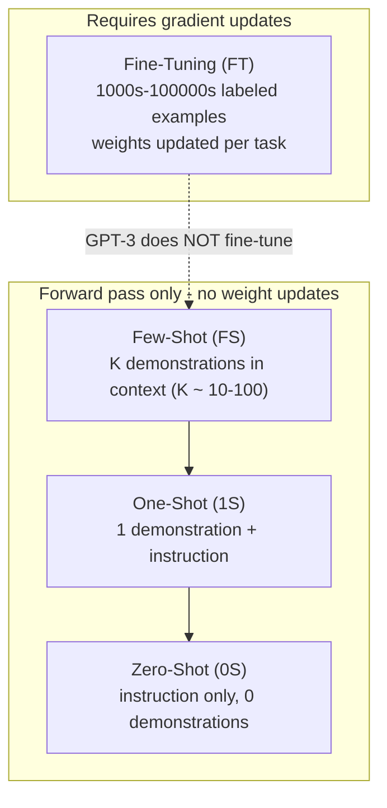

This is a technical dissection of **GPT-3** — OpenAI's "Language Models are Few-Shot Learners." The engineering focus is the shift it introduced: task specification moves out of gradient-based fine-tuning and into the **forward pass**, as a prompt. GPT-3 contributes no new architecture; its contribution is what happens when you take a plain autoregressive Transformer, follow the scaling laws, and push it to 175 billion parameters — and then discover the model can *learn a task from its context* with no weight updates at all. **[Interpretation]**

We are not reproducing the two dozen benchmark tables. They matter here only as evidence for two claims: that in-context learning is real, and that it strengthens with scale. **[Interpretation]**

**Attribution convention.** Because this article mixes what the paper reports with my own reasoning, every non-obvious technical claim is tagged:

- **[Paper]** — stated explicitly in Brown et al. (arXiv:2005.14165).
- **[Derived]** — a mathematical or logical consequence of the paper's setup, worked out here.
- **[Interpretation]** — my explanation or engineering reasoning, written for the reader; not a claim the paper makes.

---

## Why This Paper Matters

The prior paradigm — pre-train, then **fine-tune on thousands of labeled examples per task** — worked but had a structural cost: every new task needed a new dataset and a new training run, and fine-tuning on a narrow distribution can generalize poorly. **[Paper]** Humans don't work that way: a short instruction or a couple of examples is usually enough. **[Paper]**

GPT-3's thesis is that **scale unlocks that human-like flexibility**. **[Paper]** A large enough language model, given a task described in text and a few demonstrations *in its context window*, can perform the task by simply predicting what comes next — **no gradient updates, no fine-tuning**. **[Paper]** The paper calls this **in-context learning**, tests it across 8 model sizes up to 175B, and shows the ability grows sharply with scale. **[Paper]** That reframing — the prompt as the interface — is the intellectual root of the entire prompting era. **[Interpretation]**

## The Core Idea: In-Context Learning

The mental model the paper offers is **meta-learning with two loops**: **[Paper]**

- **Outer loop** — ordinary SGD pre-training, during which the model "develops a broad set of skills and pattern-recognition abilities."
- **Inner loop** — **in-context learning**: at inference, within a single forward pass, the model conditions on the prompt and adapts to (or recognizes) the task.

Crucially the inner loop involves **no parameter change** — the "learning" is the model using its fixed weights to condition on the demonstrations present in the context. **[Paper]** The paper is careful to flag the open question this raises: it is unclear whether few-shot learning acquires a task *de novo* at inference time or merely *recognizes* a task pattern seen during pre-training — likely both, varying by task. **[Paper]**

## Four Settings on a Spectrum

The paper defines four ways to specify a task, differing in how much task-specific data they use: **[Paper]**

The three settings GPT-3 actually uses (few-, one-, zero-shot) all live **inside the forward pass**: demonstrations are packed into the context window ($n_{\text{ctx}} = 2048$ tokens, typically fitting 10–100 examples), and the model is asked to complete the final example. **[Paper]** GPT-3 is deliberately **not** fine-tuned in this work — the whole point is task-agnostic performance. **[Paper]**

## The Architecture — Deliberately Unremarkable

GPT-3 uses **the same architecture as GPT-2** — modified initialization, pre-normalization, reversible BPE tokenization — with one change: **alternating dense and locally-banded sparse attention** patterns, à la the Sparse Transformer. **[Paper]** It is a decoder-only autoregressive Transformer; the paper introduces no new modeling mechanism. **[Interpretation]** Standard shape rules apply: the feed-forward width is $d_{\text{ff}} = 4\,d_{\text{model}}$, and every model uses $n_{\text{ctx}} = 2048$. **[Paper]**

Eight sizes span three orders of magnitude — chosen partly for GPU load-balancing, since scaling laws say loss is insensitive to exact shape within a broad range: **[Paper]**

| Model | Params | $n_{\text{layers}}$ | $d_{\text{model}}$ | Batch (tokens) | Learning rate |
|---|---|---|---|---|---|
| GPT-3 Small | 125M | 12 | 768 | 0.5M | $6.0\times10^{-4}$ |
| GPT-3 Medium | 350M | 24 | 1024 | 0.5M | $3.0\times10^{-4}$ |
| GPT-3 Large | 760M | 24 | 1536 | 0.5M | $2.5\times10^{-4}$ |
| GPT-3 XL | 1.3B | 24 | 2048 | 1M | $2.0\times10^{-4}$ |
| GPT-3 2.7B | 2.7B | 32 | 2560 | 1M | $1.6\times10^{-4}$ |
| GPT-3 6.7B | 6.7B | 32 | 4096 | 2M | $1.2\times10^{-4}$ |
| GPT-3 13B | 13B | 40 | 5140 | 2M | $1.0\times10^{-4}$ |
| **GPT-3 175B** | **175B** | **96** | **12288** | **3.2M** | **$0.6\times10^{-4}$** |

Read the last two columns as a scaling rule: **bigger models take larger batches and smaller learning rates**. **[Paper]** The batch size is not guessed — it is set using the measured **gradient noise scale**, the signal-to-noise of the gradient that tells you how large a batch is useful before you're wasting compute. **[Paper]**

## Training: Data, Sampling, and the Scaling Bet

**Data mixture.** Training used **300B tokens** total, drawn from a weighted blend: **[Paper]**

| Dataset | Quantity (tokens) | Weight in mix | Epochs at 300B |
|---|---|---|---|
| Common Crawl (filtered) | 410B | 60% | 0.44 |
| WebText2 | 19B | 22% | 2.9 |
| Books1 | 12B | 8% | 1.9 |
| Books2 | 55B | 8% | 0.43 |
| Wikipedia | 3B | 3% | 3.4 |

The load-bearing detail: **datasets are sampled NOT in proportion to their size.** **[Paper]** High-quality sources (Wikipedia, WebText2) are sampled 2–3× per training run, while the giant-but-noisier Common Crawl and Books2 are seen *less than once*. **[Paper]** This deliberately "accepts a small amount of overfitting in exchange for higher quality training data" — a direct quality-over-quantity sampling choice. **[Paper]** Common Crawl itself was aggressively filtered (45 TB → 570 GB) by similarity to high-quality reference corpora, plus fuzzy document-level dedup to protect the held-out set. **[Paper]** The paper is candid that a **filtering bug left some benchmark contamination**, too expensive to fix by retraining. **[Paper]**

**The scaling bet.** GPT-3 explicitly follows the [scaling laws](/engineering/scaling-laws-for-neural-language-models/): it trains a **much larger model on many fewer tokens** than convergence would want. **[Paper]** The paper's own illustration: GPT-3 XL (~1.3B) and RoBERTa-Large (355M) consumed comparable compute (~50 PF-days) despite the size gap, and GPT-3 175B consumed **several thousand petaflop/s-days** (1 PF-day $=8.64\times10^{19}$ FLOPs). **[Paper]** Systems-wise, the 175B model is split with **model parallelism both within each matrix multiply and across layers**, trained on V100s on a Microsoft cluster. **[Paper]** This is the practical embodiment of "build the big model and stop short of convergence" — and precisely the regime where memory-partitioning systems like [ZeRO](/engineering/zero-memory-optimization-training-large-models/) earn their keep. **[Interpretation]**

## What Scale Bought: Results

The headline pattern is not any single score but a *slope*: **few-shot performance rises faster with model size than zero-shot**, so the gap between them widens with scale — larger models are better in-context learners. **[Paper]**

- **Closed-book QA:** on TriviaQA, GPT-3 goes 64.3 → 68.0 → 71.2 (zero/one/few-shot); the few-shot number is **state-of-the-art versus fine-tuned closed-book systems**. **[Paper]** On CoQA it reaches 85.0 F1 few-shot. **[Paper]**
- **Emergent arithmetic.** GPT-3 175B few-shot: **100% on 2-digit addition, 98.9% on 2-digit subtraction, 80.4% on 3-digit addition**, degrading to 25–26% at 4 digits and ~29% on 2-digit multiplication. **[Paper]** The striking part is the *discontinuity*: the 13B model — second-largest — solves 2-digit add/subtract only ~half the time and everything else under 10%. **[Paper]** Arithmetic is essentially **absent below a scale threshold and present above it** — one of the paper's clearest "abilities emerge with scale" signals. **[Interpretation]**
- **Synthetic news** generated few-shot was hard for human evaluators to distinguish from human-written articles. **[Paper]**

## Where It Fails — and Why That's Engineering-Useful

The Limitations section is unusually forthright, and each failure maps to a design decision. **[Interpretation]**

- **No bidirectionality.** GPT-3 is autoregressive by choice (easy to sample and score), so it has **no bidirectional/denoising objective**. **[Paper]** The paper attributes its weak few-shot scores on *comparison* tasks — WIC (same word-sense?), ANLI (does one sentence entail another?), and reading-comprehension sets like RACE/QuAC — to exactly this. **[Paper]** This is the direct flip side of what [BERT](/engineering/bert-pretraining-deep-bidirectional-transformers/) and [T5](/engineering/t5-text-to-text-transfer-transformer/) buy with bidirectional/denoising objectives: strength on "look back and compare" tasks. **[Interpretation]**
- **The objective is flat.** Predicting every token with equal weight has no notion of what matters most, and the model is **not grounded** in non-text experience. **[Paper]** The paper even forecasts the fix — "learning the objective function from humans... fine-tuning with reinforcement learning" — which is precisely the [InstructGPT](/engineering/instructgpt-training-language-models-to-follow-instructions/) / RLHF program that followed. **[Interpretation]**
- **Inference is expensive and inconvenient at 175B.** The paper names this as a practical barrier and points to **distillation** as a future direction. **[Paper]** This is the exact problem that inference-side systems — quantization such as [LLM.int8()](/engineering/llm-int8-8-bit-matrix-multiplication-for-transformers-at-scale/), and distillation — were built to attack. **[Interpretation]**
- **Poor sample efficiency, weak calibration, inherited data bias.** GPT-3 sees far more text than a human lifetime, is not well-calibrated on novel inputs, and retains the biases of its corpus. **[Paper]**

## Engineering Trade-offs

- **Zero fine-tuning cost vs. per-query prompt cost.** In-context learning removes the training run per task but pays for it at inference: every query re-processes the demonstrations in-context, and a 175B forward pass is not cheap. **[Interpretation]**
- **Quality-weighted data vs. mild overfitting.** Sampling Wikipedia 3.4× and Common Crawl <1× trades a little memorization for a lot of quality — a deliberate, documented choice. **[Paper]**
- **Autoregressive simplicity vs. comparison-task weakness.** Choosing a decoder-only LM made sampling and scoring easy and scaling clean, at the cost of the bidirectional strengths BERT/T5 enjoy. **[Paper]**
- **Scale-forward vs. deployability.** Following scaling laws produced the capabilities but also a model too large to serve conveniently — the tension that inference-optimization research exists to resolve. **[Interpretation]**

## Engineering Takeaway

- GPT-3's contribution is **not architecture but demonstration**: at sufficient scale, a plain autoregressive Transformer performs new tasks from a **prompt**, in-context, with no weight updates. **[Paper]**
- In-context ability **strengthens with scale** — the few-shot/zero-shot gap widens with model size, and some abilities (arithmetic) appear only above a size threshold. **[Paper]**
- It is a faithful **application of the scaling laws**: a huge model, quality-weighted data, and far fewer tokens than convergence. **[Paper]**
- Its honestly-stated limits — no bidirectionality, a flat objective, expensive inference — each name a research program that followed (RLHF, distillation, quantization). **[Interpretation]**

## How This Connects to the Rest of the Stack

- **[Scaling Laws](/engineering/scaling-laws-for-neural-language-models/)** is the theory GPT-3 tests in practice — "train much larger models on many fewer tokens" is Kaplan et al.'s compute-optimal recipe made concrete. **[Interpretation]**
- **[BERT](/engineering/bert-pretraining-deep-bidirectional-transformers/)** and **[T5](/engineering/t5-text-to-text-transfer-transformer/)** are the bidirectional/denoising counterpoint: GPT-3 explicitly blames its comparison-task weaknesses on lacking what they have. **[Interpretation]**
- **[InstructGPT](/engineering/instructgpt-training-language-models-to-follow-instructions/)** is the forecasted sequel — GPT-3's "learn the objective from humans / fine-tune with RL" limitation is RLHF's mission statement. **[Interpretation]**
- **[LLM.int8()](/engineering/llm-int8-8-bit-matrix-multiplication-for-transformers-at-scale/)** answers GPT-3's "inference is expensive at this scale" limitation directly — 8-bit inference for models of exactly this size. **[Interpretation]**

The single sentence to carry away: **scale turns a language model from a thing you fine-tune into a thing you prompt** — and that shift, not any new layer, is why GPT-3 reorganized the field. **[Interpretation]**
