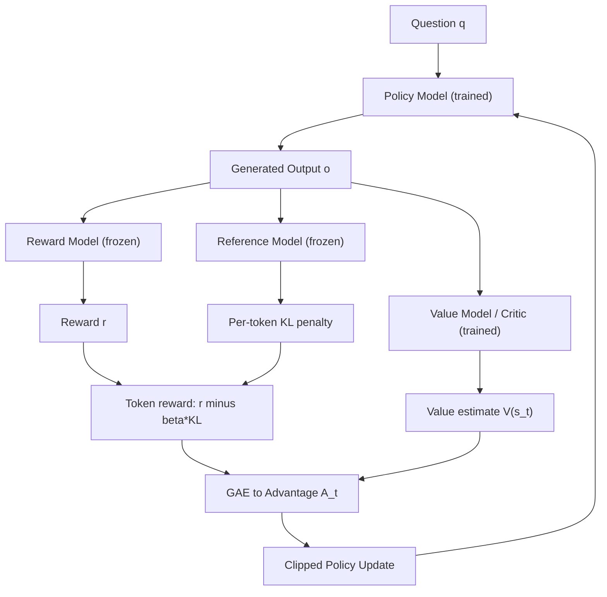
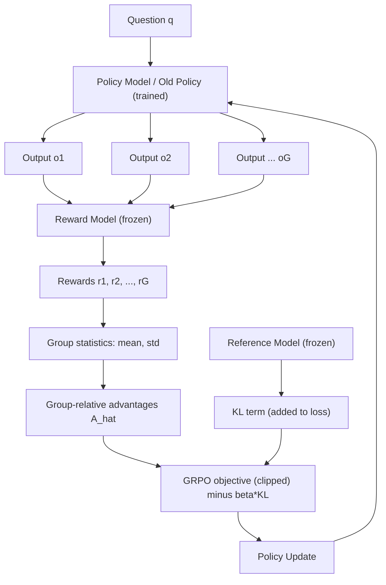

This is a technical dissection of **Group Relative Policy Optimization (GRPO)** — the reinforcement learning algorithm introduced in DeepSeekMath. The focus is the RL mechanism itself: PPO as the starting point, why the value model is expensive, the central GRPO idea, group-relative advantage, the objective, outcome vs. process supervision, iterative RL, and an engineering interpretation of why it works.

We are not reproducing the whole paper. The pre-training corpus, the full benchmark suite, and the pre-training ablations matter here only insofar as they establish _which model enters the RL stage_.

**Attribution convention.** Because this article mixes what the paper says with my own reasoning, every non-obvious technical claim is tagged:

- **[Paper]** — stated explicitly in DeepSeekMath (arXiv:2402.03300).
- **[Derived]** — a mathematical consequence of the paper's equations, worked out here.
- **[Interpretation]** — my explanation or engineering reasoning, written for the reader; not a claim the paper makes.

---

## The Model That Enters RL

Before we can reason about what reinforcement learning _adds_, we need to be precise about what it starts from. DeepSeekMath applies RL at the very end of a pipeline, to a model that is already a competent mathematical reasoner. Understanding that starting point is the whole purpose of this section.

### From a Code Model to DeepSeekMath-Base 7B

The main model in the RL pipeline is **DeepSeekMath-Base 7B**, and it was not initialized from a general-purpose language model. It was initialized from **DeepSeek-Coder-Base-v1.5 7B**, a code-trained model, and then continued with mathematical pre-training. **[Paper]**

The paper reports this as an empirical choice: starting from the code-trained model was a better initialization for mathematical training than starting from a general LLM. **[Paper]** It is worth stating the limits of that claim carefully. The paper does _not_ argue that code training universally makes a model good at mathematics in some general sense — the supported statement is narrower: in their setup, the code-trained checkpoint was the preferable place to begin continued mathematical pre-training. **[Interpretation]**

The full progression looks like this:

```
DeepSeek-Coder-Base-v1.5 7B      (code-trained initialization)
        │
        ▼  mathematical pre-training
DeepSeekMath-Base 7B
        │
        ▼  mathematical instruction tuning
DeepSeekMath-Instruct 7B
        │
        ▼  reinforcement learning (GRPO)
DeepSeekMath-RL 7B
```

### A Note on Parameter Counts

One detail is easy to get wrong. The model discussed throughout the RL pipeline is **7B**. **[Paper]**

The paper _also_ runs a separate set of experiments with a **1.3B** model to compare different mathematical training corpora. **[Paper]** That 1.3B model is an experimental probe for data-selection questions — it is **not** the DeepSeekMath model that undergoes instruction tuning and RL. When this article says "DeepSeekMath," it means the 7B model, unless stated otherwise.

### The Path to an RL-Ready Model

The stages leading into RL are:

1. **DeepSeekMath-Base 7B** — the code-initialized, mathematically pre-trained base model. **[Paper]**
2. **Mathematical instruction tuning** — supervised fine-tuning (SFT) on mathematical instruction data, covering both chain-of-thought and tool-integrated (program-assisted) reasoning. **[Paper]**
3. **DeepSeekMath-Instruct 7B** — the resulting instruction-tuned model. **[Paper]**
4. **Reinforcement learning** — GRPO applied on top of the instruction-tuned model. **[Paper]**
5. **DeepSeekMath-RL 7B** — the final model after RL. **[Paper]**

The key takeaway is this: by the time we reach the RL stage, we already have a reasonably strong instruction-tuned mathematical model. The interesting engineering question is not "can this model do math at all?" but rather "how far can reinforcement learning push its reasoning ability past what supervised fine-tuning already achieved?" **[Interpretation]**

### The Improvement RL Reports

DeepSeekMath's Table 5 measures the same model before and after RL — DeepSeekMath-Instruct 7B vs. DeepSeekMath-RL 7B — across four benchmarks, under two evaluation settings: chain-of-thought reasoning and tool-integrated reasoning. The numbers below are reproduced from the paper as reported evidence of the improvement; they are **not** results we ran or recomputed. **[Paper]**

**Chain-of-Thought Reasoning**

| Benchmark | DeepSeekMath-Instruct 7B | DeepSeekMath-RL 7B | Change |
|---|---|---|---|
| GSM8K   | 82.9% | 88.2% | +5.3 |
| MATH    | 46.8% | 51.7% | +4.9 |
| MGSM-zh | 73.2% | 79.6% | +6.4 |
| CMATH   | 84.6% | 88.8% | +4.2 |

**Tool-Integrated Reasoning**

| Benchmark | DeepSeekMath-Instruct 7B | DeepSeekMath-RL 7B | Change |
|---|---|---|---|
| GSM8K   | 83.7% | 86.7% | +3.0 |
| MATH    | 57.4% | 58.8% | +1.4 |
| MGSM-zh | 72.0% | 78.4% | +6.4 |
| CMATH   | 84.3% | 87.6% | +3.3 |

The direction is consistent: RL improves the instruction-tuned model across every benchmark in both settings. **[Paper]** The gains are larger under chain-of-thought than under tool-integrated reasoning, but they are present everywhere.

We now have the model that will actually enter the RL stage — a strong instruction-tuned mathematical reasoner that RL then improves further. The next question is the real subject of this article: how do we improve its reasoning policy using reinforcement learning, and why did DeepSeek replace the conventional PPO value-model setup with GRPO?

---

## Starting From PPO

GRPO is best understood as a **variant of Proximal Policy Optimization (PPO)** — it keeps most of PPO's machinery and changes exactly one part. **[Paper]** So the honest way to explain GRPO is to first be precise about the PPO setup it modifies.

The question PPO is really asking, at every generated token, is simple: _the model just produced this answer — was it better or worse than what we expected?_ **[Interpretation]** That word "expected" is the crux. To turn "better or worse than expected" into a gradient, PPO needs a notion of the _expected_ reward to compare against. In classic PPO that expectation comes from a **separate critic**, also called the **value model**, and the comparison is the **advantage**:

$$
A = R - V(s)
$$

- $R$ — the actual reward received for the output. **[Paper]**
- $V(s)$ — the critic's prediction of the expected reward from state $s$. **[Paper]**
- $A$ — the advantage: how much better (or worse) the outcome was than the critic predicted. **[Paper]**

The problem is an engineering one: **you have to train and maintain that critic/value model alongside the LLM policy.** **[Paper]** Hold onto that — it is the exact cost GRPO removes.

### The Models in the PPO Loop

DeepSeekMath's PPO setup has roughly four components. **[Paper]** A question $q$ goes into the **policy model**, which generates an output $o$; that output is then scored by a **reward model**, evaluated by a **value model**, and compared against a **reference model**:

1. **Policy model $\pi_\theta$** — the model you are actually training. It is the LLM whose parameters are being updated. It starts from the SFT model: Base LLM → SFT → policy model. **[Paper]**
2. **Reward model $r_\varphi$** — answers "how good is this output?" It maps an output to a scalar reward, $o \rightarrow r$. It is typically trained beforehand on preference data (e.g. prompt → answer A / answer B, human says "A is better," and the model learns $r_\varphi(q, A) > r_\varphi(q, B)$). **[Paper]**
3. **Value model / critic** — estimates "how good did we _expect_ this output to be?", i.e. $V(s)$, the baseline the advantage is measured against. **[Paper]**
4. **Reference model $\pi_{ref}$** — a **frozen copy** of the starting SFT policy. We begin RL from $\pi_{SFT}$, snapshot a frozen copy as $\pi_{ref}$, and train the policy $\pi_\theta$ from that same initialization — so initially $\pi_\theta = \pi_{ref}$. During RL the reference stays frozen while the policy is updated. **[Paper]**

> **A note on rewards for math.** In general RLHF, the reward model is essential because "quality" is subjective. For a domain like mathematics, you may not strictly need a learned reward model at all — a rule-based, _verifiable_ reward works: $r = 1$ if the final answer is correct, $0$ otherwise. **[Interpretation]** DeepSeekMath itself does train a reward model for its RL stage, so this rule-based framing is a way to build intuition about the reward _signal_, not a description of DeepSeekMath's exact reward source. **[Paper]**

There is also a fifth object worth naming explicitly because it is easy to conflate with $\pi_\theta$ and $\pi_{ref}$: the **old policy $\pi_{\theta_{old}}$** — the snapshot of the policy that _generated_ the current batch of samples, before this update's gradient steps. PPO optimizes $\pi_\theta$ against samples drawn from $\pi_{\theta_{old}}$.

## The PPO Objective

DeepSeekMath writes the PPO objective as a clipped surrogate over the generated tokens. To keep it readable, define the **per-token probability ratio**:

$$
\rho_t(\theta) = \frac{\pi_\theta(o_t \mid q, o_{<t})}{\pi_{\theta_{old}}(o_t \mid q, o_{<t})}
$$

Then the objective is:

$$
J_{PPO}(\theta) = \mathbb{E}_{q \sim P(Q),\, o \sim \pi_{\theta_{old}}(\cdot \mid q)} \left[ \frac{1}{|o|} \sum_{t=1}^{|o|} \min\Big( \rho_t(\theta)\, A_t,\; \mathrm{clip}\big(\rho_t(\theta),\, 1-\varepsilon,\, 1+\varepsilon\big)\, A_t \Big) \right]
$$

Let's take it term by term.

**$\pi_\theta(o_t \mid q, o_{<t})$ — the policy's token probability.** This is where "the policy is a language model" matters. An autoregressive LLM produces an output $o$ one token at a time; at step $t$ it outputs a probability distribution over the vocabulary for the next token, conditioned on the question $q$ and everything generated so far, $o_{<t}$. The scalar $\pi_\theta(o_t \mid q, o_{<t})$ is the probability the current policy assigned to the token it actually emitted. **[Interpretation]** In RL terms, the "state" at step $t$ is $(q, o_{<t})$ and the "action" is the token $o_t$ — so each generated token is one action, and a full solution is a trajectory of actions. **[Interpretation]**

**The probability ratio $\rho_t(\theta)$.** This compares the _current_ policy $\pi_\theta$ with the _old_ policy $\pi_{\theta_{old}}$ that generated the sample, on the exact same token. If $\rho_t > 1$, the updated policy has become _more_ likely to emit that token than the policy that sampled it; if $\rho_t < 1$, it has become _less_ likely. **[Derived]** PPO compares against $\pi_{\theta_{old}}$ rather than optimizing raw probabilities because the data was sampled from $\pi_{\theta_{old}}$: the ratio is an importance-sampling correction that lets us reuse those samples for several gradient steps while still measuring change _relative to the distribution that produced them_. **[Interpretation]**

**The advantage $A_t$.** This is the learning signal. Its **sign** decides the direction of the update: if $A_t > 0$, the action was better than expected and the objective pushes $\pi_\theta$ to _increase_ that token's probability; if $A_t < 0$, it was worse than expected and the objective pushes the probability _down_. **[Derived]** Its **magnitude** scales how strongly. In PPO, $A_t$ is produced from the reward and the value model's baseline (via GAE) — which is precisely the component that requires the critic. **[Paper]**

### Reading the Clipping Carefully

"Clipping prevents large updates" is true but useless on its own. Here is what it actually does. Inside the objective is:

$$
\min\Big( \rho_t(\theta)\, A_t,\; \mathrm{clip}\big(\rho_t(\theta),\, 1-\varepsilon,\, 1+\varepsilon\big)\, A_t \Big)
$$

- **$\rho_t(\theta)$** — the probability ratio above.
- **$\varepsilon$** — a small constant (e.g. $0.2$) defining the trust region. **[Paper]**
- **$\mathrm{clip}(\rho_t, 1-\varepsilon, 1+\varepsilon)$** — the ratio forced to stay inside $[1-\varepsilon,\, 1+\varepsilon]$ (e.g. $[0.8,\, 1.2]$). Anything above $1+\varepsilon$ becomes $1+\varepsilon$; anything below $1-\varepsilon$ becomes $1-\varepsilon$.
- **The two terms and the $\min$** — one term is the raw $\rho_t A_t$, the other is the clipped version. Taking the minimum makes the objective **pessimistic**: it removes the incentive to move the ratio far outside the trust region.

The behavior differs by the sign of $A_t$. Take $\varepsilon = 0.2$ and $A_t = +1$ (a good token):

- If $\rho_t = 1.5$ (policy already made this token much more likely), the terms are $1.5 \times 1 = 1.5$ and $\mathrm{clip}(1.5) \times 1 = 1.2$; the $\min$ picks $1.2$. The reward for pushing the probability even higher is **capped** — the gradient from moving further is killed. **[Derived]**

Now $A_t = -1$ (a bad token):

- If $\rho_t = 0.5$ (policy already made this token much less likely), the terms are $0.5 \times (-1) = -0.5$ and $\mathrm{clip}(0.5) \times (-1) = 0.8 \times (-1) = -0.8$; the $\min$ picks $-0.8$. Again the update is **capped** — the objective stops rewarding the model for suppressing the token even harder. **[Derived]**

In both cases the clip only bites in the direction that would move the policy _further_ from $\pi_{\theta_{old}}$ than the trust region allows. When the update is still small ($\rho_t$ near $1$), clipping does nothing and the ordinary policy-gradient signal flows through. The point is not "stability" as a slogan — it is that a single batch of samples cannot drag the policy arbitrarily far from the distribution that generated it. **[Interpretation]**

## Why PPO Becomes Expensive Here

PPO works — DeepSeekMath treats it as the established RL baseline, not as something broken. **[Paper]** The issue is the **cost of the value model** in the LLM setting.

The value function in PPO is usually **another model of comparable size to the policy**. **[Paper]** When the policy is a 7B-parameter LLM, the critic is effectively a second large model that must be held in memory, run on every rollout, and trained with its own loss. Concretely that means:

- **Additional memory** — a second large network's parameters, gradients, and optimizer state. **[Paper]**
- **Additional computation** — extra forward/backward passes for value estimation on every training step. **[Paper]**
- **Additional training complexity** — a second model with its own objective and failure modes to tune and stabilize. **[Interpretation]**

There is also a subtler, structural difficulty the paper raises. The value model is expected to produce a **per-token** value estimate, but in this setting the reward is generally associated with the **final output** — often only the last token receives a score from the reward model. **[Paper]** Training a critic that is accurate at _every_ intermediate token, when the actual reward signal lives almost entirely at the end of the sequence, is awkward. **[Interpretation]** So the value model is not just expensive — it is being asked to do the hardest possible version of its job.

This is the pressure point. Keep PPO's clipped policy update; find a cheaper way to get the advantage.

## Introducing GRPO

The central idea is a change of baseline:

- **PPO:** learn a value function to estimate the baseline, then compute $A = R - V(s)$.
- **GRPO:** for the same question, **sample several outputs**, and derive the baseline from _their own rewards_. **[Paper]**

Instead of asking a critic "how good did we expect this to be?", GRPO asks "how good was this answer _compared to the other answers the model gave to the same question_?" The group of sampled outputs becomes its own baseline — no separate value model required. **[Paper]** The word **relative** in "Group Relative Policy Optimization" is exactly this: the advantage is measured relative to the group, not against a learned value function.

The conceptual flow:

```
Question q
      │
      ▼
Old Policy (πθ_old)
      │
 ┌────┬────┬────┬────┐
 ▼    ▼    ▼    ▼    ▼
o1   o2   o3   ...  oG        (G outputs for the SAME question)
 │    │    │         │
 ▼    ▼    ▼         ▼
r1   r2   r3   ...  rG        (one reward per output)
      │
      ▼
Group statistics (mean, std)
      │
      ▼
Relative advantages  Â_i
      │
      ▼
GRPO policy update (PPO-style clip)
```

The single most important detail: **all $G$ outputs are generated for the same question $q$.** That shared question is what makes their rewards comparable, and it is what "group relative" means. **[Interpretation]**

### PPO Architecture (Engineering View of Figure 4)



Note the two trained models (policy **and** critic) and that the KL penalty is folded into the per-token reward before the advantage is computed.

### GRPO Architecture (Engineering View of Figure 4 + Algorithm 1)



The visual difference is the whole point: **GRPO has no value model.** The advantage no longer comes from a learned critic and GAE — it comes from group statistics over multiple samples. The KL term also moves out of the reward and into the loss directly (explained below).

## The GRPO Objective

DeepSeekMath's GRPO objective (Equation 3) keeps the PPO clipped surrogate and adds the group averaging. With the per-output-token ratio

$$
\rho_{i,t}(\theta) = \frac{\pi_\theta(o_{i,t} \mid q, o_{i,<t})}{\pi_{\theta_{old}}(o_{i,t} \mid q, o_{i,<t})}
$$

the objective is:

$$
J_{GRPO}(\theta) = \mathbb{E}_{q,\, \{o_i\}_{i=1}^{G} \sim \pi_{\theta_{old}}} \left[ \frac{1}{G} \sum_{i=1}^{G} \frac{1}{|o_i|} \sum_{t=1}^{|o_i|} \Big( \min\big( \rho_{i,t}(\theta)\hat{A}_{i,t},\; \mathrm{clip}(\rho_{i,t}(\theta), 1-\varepsilon, 1+\varepsilon)\hat{A}_{i,t} \big) - \beta\, D_{KL}[\pi_\theta \,\Vert\, \pi_{ref}] \Big) \right]
$$

Decomposed:

- **$\mathbb{E}_{q, \{o_i\}}$** — expectation over questions $q$, and over a group of $G$ outputs sampled from the old policy for each question. **[Paper]**
- **$\frac{1}{G}\sum_{i=1}^{G}$** — average over the $G$ outputs in the group. **[Paper]**
- **$\frac{1}{\lvert o_i \rvert}\sum_{t=1}^{\lvert o_i \rvert}$** — average over the tokens of output $i$. **[Paper]**
- **$\rho_{i,t}(\theta)$** — the same probability ratio as PPO, now indexed by output $i$ and token $t$. **[Paper]**
- **$\hat{A}_{i,t}$** — the **group-relative** advantage (next section), replacing PPO's value-based $A_t$. **[Paper]**
- **$\min(\ldots,\, \mathrm{clip}(\ldots))$** — the identical PPO clipping mechanism, with the same $\varepsilon$. **[Paper]**
- **$\beta\, D_{KL}[\pi_\theta \Vert \pi_{ref}]$** — a KL-regularization term, weighted by $\beta$, added **directly to the objective** rather than into the reward (discussed under KL Regularization). **[Paper]**

The conceptual takeaway must be stated exactly: **GRPO retains PPO's clipped policy-optimization mechanism and changes only how the advantage/baseline is obtained.** It is not a different family of policy optimization — it is PPO with the value-based advantage swapped for a group-relative one, and the KL moved into the loss. **[Interpretation]**

## The Group-Relative Advantage

This is the heart of GRPO. Under **outcome supervision** — one reward per whole output — DeepSeekMath normalizes rewards within the group (Equation 5). For a group of rewards $\mathbf{r} = \{r_1, \dots, r_G\}$:

$$
\hat{A}_{i,t} = \tilde{r}_i = \frac{r_i - \mathrm{mean}(\mathbf{r})}{\mathrm{std}(\mathbf{r})}
$$

and this same value is assigned to **every token** $t$ of output $i$. **[Paper]** Reading it piece by piece:

- **$\mathrm{mean}(\mathbf{r})$** — the average reward across the group. This _is_ the baseline: the role the value model $V(s)$ played in PPO is now played by the group mean. **[Interpretation]**
- **$r_i - \mathrm{mean}(\mathbf{r})$** — the **relative performance** of output $i$ against the other answers to the same question. Positive means "better than the group's typical answer," negative means "worse." **[Derived]**
- **$\mathrm{std}(\mathbf{r})$** — normalizes that difference by the spread of rewards in the group, putting the advantage on a consistent scale regardless of whether this question produced a wide or narrow range of outcomes. **[Interpretation]**

### A Worked Example (Illustrative)

Take one question and sample $G = 8$ outputs, using a simple correct/incorrect (rule-based) reward. Suppose the rewards come out as:

$$
\mathbf{r} = [\,1,\, 1,\, 0,\, 1,\, 0,\, 0,\, 0,\, 1\,]
$$

The group mean — the baseline — is

$$
\mathrm{mean}(\mathbf{r}) = \frac{1+1+0+1+0+0+0+1}{8} = 0.5
$$

Ignoring the std term for a moment to isolate the intuition:

- **A correct answer** gets advantage $1 - 0.5 = +0.5$ → its tokens are reinforced.
- **An incorrect answer** gets advantage $0 - 0.5 = -0.5$ → its tokens are suppressed.

_(These reward values are an illustrative example to show the mechanism — they are not measurements from the DeepSeekMath experiments.)_ The learning signal is entirely **relative**: "correct" is only rewarded because, on this question, some answers were wrong. If all eight answers had been correct, the mean would be $1$, every advantage would be $0$, and there would be nothing to learn from that question — which is exactly the desired behavior. **[Interpretation]** The full formula additionally divides by $\mathrm{std}(\mathbf{r})$, which is why the paper's advantage is the normalized $\tilde{r}_i$ rather than the raw difference. **[Paper]**

## Why GRPO Over PPO — In This Setting

To be precise: the paper does **not** claim GRPO universally dominates PPO for all RL problems. It identifies concrete advantages **for the LLM mathematical-reasoning setting it studies.** **[Paper]**

1. **No separate value model.** GRPO removes the critic that PPO relies on for the baseline. **[Paper]**
2. **Lower memory/compute burden.** Because the removed critic was a model comparable in size to the policy, eliminating it removes a large chunk of memory and per-step computation — which matters precisely because the policy is already a large LLM. **[Paper]**
3. **Group-relative baseline.** The baseline comes directly from multiple sampled answers to the same problem, not a learned function that must itself be trained to per-token accuracy. **[Paper]**
4. **Differential reinforcement.** Within a group, outputs receive _different_ positive and negative relative advantages, rather than every correct answer being reinforced by the same amount. Better-than-typical answers are pushed up, worse-than-typical answers pushed down. **[Derived]**
5. **Alignment with comparative reward models.** Reward models are usually trained on _comparisons_ (A is better than B), so a group-relative, comparison-based advantage matches how the reward model was built in the first place. **[Paper]**
6. **Process supervision.** When step-level (process) rewards are available, GRPO can build finer-grained, per-token advantages from reasoning-step rewards (next section). **[Paper]**
7. **Online sampling.** GRPO samples fresh outputs from the current policy during training (online), in contrast to offline methods that learn from a fixed set of samples generated once. **[Paper]**

| | PPO | GRPO |
|---|---|---|
| Policy model | ✓ | ✓ |
| Reward model | ✓ | ✓ |
| Value model / critic | ✓ | ✗ |
| Reference model (KL) | ✓ | ✓ |
| Advantage source | Learned value function / GAE | Group-relative rewards |
| Multiple samples per question | Not fundamental | Central |
| KL placement | Folded into the reward | Added directly to the loss |
| Main benefit in this setting | Established RL baseline | Removes value-model overhead |

## KL Regularization

Three "policies" appear in GRPO and must not be conflated:

- **$\pi_\theta$** — the current, trainable policy being updated right now. **[Paper]**
- **$\pi_{\theta_{old}}$** — the policy snapshot that _generated_ the sampled outputs for the current update. It is what the probability ratio $\rho$ compares against. **[Paper]**
- **$\pi_{ref}$** — the frozen reference policy (the original SFT model) used only for KL regularization. **[Paper]**

The reference model answers a natural question: _how far has the RL-trained policy drifted from the original, competent SFT model?_ That drift is measured with the KL divergence $D_{KL}[\pi_\theta \,\Vert\, \pi_{ref}]$; if the policy changes too much, the penalty grows and pulls it back. **[Paper]** During RL the reference is frozen and the policy is updated, so the KL genuinely measures accumulated drift from the starting point. **[Paper]**

**Where the KL lives is a real difference between PPO and GRPO.** PPO adds the KL as a **per-token penalty inside the reward** (Equation 2), so it flows through the value function and GAE into the advantage:

$$
r_t = r_\varphi(q, o_{\le t}) - \beta\, \log \frac{\pi_\theta(o_t \mid q, o_{<t})}{\pi_{ref}(o_t \mid q, o_{<t})}
$$

GRPO instead adds the KL **directly to the loss as its own term**, keeping it out of the advantage entirely, and estimates it with an **unbiased estimator** (Equation 4) that is guaranteed non-negative:

$$
D_{KL}[\pi_\theta \,\Vert\, \pi_{ref}] = \frac{\pi_{ref}(o_{i,t} \mid q, o_{i,<t})}{\pi_\theta(o_{i,t} \mid q, o_{i,<t})} - \log \frac{\pi_{ref}(o_{i,t} \mid q, o_{i,<t})}{\pi_\theta(o_{i,t} \mid q, o_{i,<t})} - 1
$$

Conceptually, the KL term regularizes the trained policy toward the reference policy: RL is free to sharpen the model's reasoning, but not to walk away from the competent SFT model it started as. Separating it from the reward (rather than mixing it into the per-token signal that also carries the advantage) keeps the reward signal and the drift penalty cleanly distinct. **[Interpretation]**

## Outcome vs. Process Supervision

DeepSeekMath formulates GRPO under two reward granularities. **[Paper]**

**Outcome supervision** gives a single reward at the _end_ of each output. As shown above, the normalized outcome reward $\tilde{r}_i$ is assigned to every token of output $i$ (Equation 5) — every token in a good solution is reinforced equally, every token in a bad one is suppressed equally. **[Paper]**

**Process supervision** gives rewards at the end of each _reasoning step_, which is a finer signal for multi-step math. **[Paper]** All step-rewards across the group are normalized together, and the advantage of a token is the **sum of the normalized rewards of the steps that come at or after that token** (Equation 6):

$$
\hat{A}_{i,t} = \sum_{\mathrm{index}(j) \,\ge\, t} \tilde{r}_{i,\,\mathrm{index}(j)}
$$

So a token's advantage reflects the quality of the reasoning steps that follow it, letting the model localize credit to the parts of the derivation that actually lead somewhere, instead of crediting the whole solution uniformly. **[Interpretation]**

## Iterative GRPO

As the policy improves, a **fixed** reward model gradually falls out of distribution — it was trained on the old policy's outputs, and the new policy produces different ones. **[Interpretation]** Iterative GRPO addresses this. **[Paper]** The conceptual loop:

```
initial policy
   → sample questions
   → old policy generates G outputs per question
   → reward model scores them
   → group-relative advantages
   → GRPO update
   → refresh reward model (with replay) + update reference model
   → next iteration
```

DeepSeekMath continually **retrains the reward model** on samples from the current policy, using a **replay mechanism that mixes in ~10% of historical data** to avoid forgetting, then **sets the reference model to the current policy** and continues training the policy against the refreshed reward model. **[Paper]** The reason to refresh the reward model is exactly the distribution-shift point above: keeping the evaluator calibrated to the policy it is now grading. **[Interpretation]**

## The Engineering Interpretation

Stripping it to the core mental model:

- PPO's core policy-optimization machinery — the clipped, trust-region update on token probabilities — is genuinely useful, and GRPO keeps it. **[Interpretation]**
- The expensive, awkward component is the **learned value-function pathway** used to construct the advantage — a second large model, asked to produce accurate per-token values when the reward really lives at the end of the sequence. **[Paper]**
- GRPO **removes that separate value model** and instead gets a relative learning signal by **comparing several candidate solutions to the same problem**: the group mean is the baseline, and each answer's deviation from it is the advantage. **[Paper]**
- That relative signal then **plugs straight back into the PPO-style clipped objective**, with KL to the frozen reference keeping the policy anchored to the SFT model it started from. **[Interpretation]**

Read this way, GRPO is not an exotic new algorithm — it is a targeted deletion. It identifies the single most expensive part of PPO for the LLM setting and replaces it with something the model can compute for free from samples it is already generating. **[Interpretation]**
