# Harness Engineering: Inside the Runtime of Production Coding Agents (and How to Build One)

**Harness engineering** is the discipline of building the runtime around a language model: the loop that calls it, the tools it can use, the context it sees, the rules it must obey, and the machinery that recovers when it goes wrong. Swap the model inside a coding agent and you keep most of the product. Swap the harness and you have a different product.

This article is an engineering guide to that runtime. It is built on one source: *Harness Engineering: Anatomy, Architecture, and Evolution of Coding Agents — A Source-Code Study of Eleven Systems* (Barbaste, Darrigol, Vu, Wiltberger; July 2026). The paper reads the source of eleven production coding harnesses (Claude Code, Codex CLI, Gemini CLI, Mistral Vibe, OpenHands, Aider, Mini-SWE-Agent, Hermes, Pi, OpenCode, OpenClaw) and one meta-harness (Omnigent). It maps each one onto seven subsystems.

I am not summarizing the paper. I use its source-level observations as case studies and turn each one into a pattern you can implement. The last third of the article builds a **reference harness** in Python: stdlib only, 55 passing tests, with every component traceable to a design the paper documents.

> **Source discipline — three kinds of claim, kept apart.**
>
> - **Observed** — what the paper reports from source code, cited as *[HE §x]* (section of the paper). These are statements about a specific corpus pinned to July 2026 releases, not laws about all agents.
> - **Engineering interpretation** — my reading of *why* a design looks the way it does. Labelled as interpretation.
> - **Proposed implementation** — the reference harness accompanying this article (`harness_engineering/reference-harness/`). Code labelled this way is mine, was run, and is covered by tests. It is *not* the source of any studied system.
>
> Two caveats the paper itself makes [HE §15.6]. First, its Claude Code analysis is based on a publicly circulated source snapshot from March 2026, not an official release, so the shipping binary may differ. Second, the study reads code and does not benchmark it. The SWE-bench figures it mentions are self-reported and not comparable across systems. I don't use any of them as evidence of quality.

---

## I. Introduction: The Agent Is Not the Model

The paper opens with one line of algebra: **an agent is a model plus a harness** [HE §1, §2.1]. The model supplies the intelligence. The harness turns that intelligence into work.

Here is the engineering problem the harness solves. A model emits tokens. A coding task needs a sequence of *actions* with consequences: read a file, change it, run the tests, notice the failure, change it again, prove it works. Between "the model said something" and "the repository is correct" sits a runtime that has to:

```text
LLM
 ↓  reason           (what should happen next?)
 ↓  act              (turn a tool call into a side effect - safely)
 ↓  observe          (turn the side effect back into tokens)
 ↓  recover          (malformed call, failed tool, overflowing context, a loop)
 ↓  continue         (decide whether another turn is warranted)
 ↓  verify           (is the work actually done, or does the model only say so?)
```

Every arrow in that diagram is harness code. The model never touches the filesystem, never sees the context window fill up, and never decides on its own authority that `rm -rf` is acceptable. The harness owns all of that.

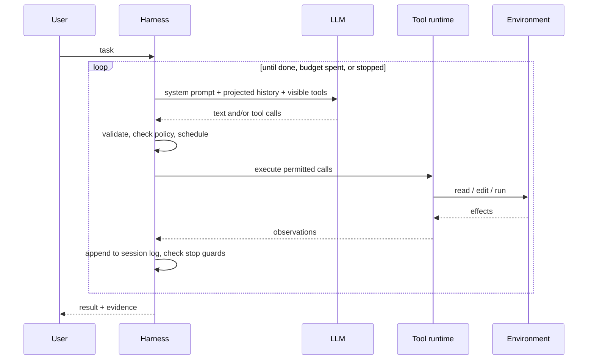
```mermaid
sequenceDiagram
    participant U as User
    participant H as Harness
    participant M as LLM
    participant T as Tool runtime
    participant E as Environment
    U->>H: task
    loop until done, budget spent, or stopped
        H->>M: system prompt + projected history + visible tools
        M-->>H: text and/or tool calls
        H->>H: validate, check policy, schedule
        H->>T: execute permitted calls
        T->>E: read / edit / run
        E-->>T: effects
        T-->>H: observations
        H->>H: append to session log, check stop guards
    end
    H-->>U: result + evidence
```

**Model capability alone does not produce a reliable agent.** The paper's sharpest evidence is Observation 1 [HE §5]. The eleven systems span three orders of magnitude in code size and target similar tasks, *yet loop sophistication does not predict benchmark performance*. Mini-SWE-Agent's linear loop reports results in the same range as OpenHands' event-sourced engine. Most of the extra code in production systems goes to concerns "orthogonal to task completion: safety, user experience, extensibility — and increasingly clients and transport". For example, roughly three-fifths of OpenCode's non-test source is client code (TUI, web, desktop, SDK), not the harness proper.

**Engineering interpretation.** That finding is easy to misread as "the harness doesn't matter". The opposite is true. A benchmark measures one slice: can the loop finish a well-posed task in a disposable container? A product also has to survive a user's real repository, a 3-hour session, a prompt injection buried in a README, a model that announces success without running the tests, and a security team asking what the agent did last Tuesday. The harness is where those requirements live.

---

## II. What Exactly Is a Harness?

The paper's definition [HE §2.1]: *the harness is everything except the model — the runtime that couples an LLM to the world: its loop, its tools, its context, its safety controls, its orchestration, and its extension surfaces.* Harness engineering is the discipline of designing and evolving that runtime. The term entered circulation in February 2026 [HE §2.1].

Most confusion comes from neighbouring terms. The paper separates four boundary cases [HE §2.2]:

| Term | What it wraps | Who imports whom | Example (from the paper) |
|---|---|---|---|
| **Model** | nothing — it is the inference engine | — | the LLM behind any harness |
| **Agent** | model + harness | — | "Claude Code running Claude" |
| **Harness** | a model, to make it act on a repository | the developer *works inside* it | Claude Code, Codex CLI, Mini-SWE-Agent |
| **Scaffold** | near-synonym; the structural code (loop, registries) inside a harness | — | "Mini-SWE-Agent's scaffold is 100 lines of Python" |
| **Agentic framework** | a library for building agents | the developer *imports* it | LangChain, AutoGen, CrewAI |
| **Evaluation harness** | an *agent*, to run it against tasks | opposite direction of wrapping | the SWE-bench harness |
| **Orchestrator / meta-harness** | one or more *harnesses*, from above | implements no editing loop of its own | Omnigent |

**Why a harness is a runtime, not a prompt wrapper.** A prompt wrapper is a pure function: `prompt → completion`. A harness is stateful and long-lived. It holds a session that can outlive the context window. It owns processes with side effects. It enforces policies the model cannot override. It persists events that must still make sense after a crash. Look at where the code goes in the systems the paper studies: concurrency control, sandboxes, permission engines, compaction, event logs, plugin hosts, client/server transports. That is runtime engineering, the same kind of code you find in a database or a container orchestrator, applied to an LLM execution loop.

---

## III. The Seven-Subsystem Anatomy

The paper's central structural claim is that every system in the corpus takes a position on the same seven subsystems, "even when that position is deliberate absence" [HE §2.3]. That holds from the 100-line research baseline to the million-line production CLI. Two cross-cutting surfaces sit alongside them: the **interface layer** (TUI, CLI flags, IDE protocol, HTTP server, SDK) and the **session substrate** (transcripts, persistence, resume/fork).

This anatomy is the backbone of the rest of the article.

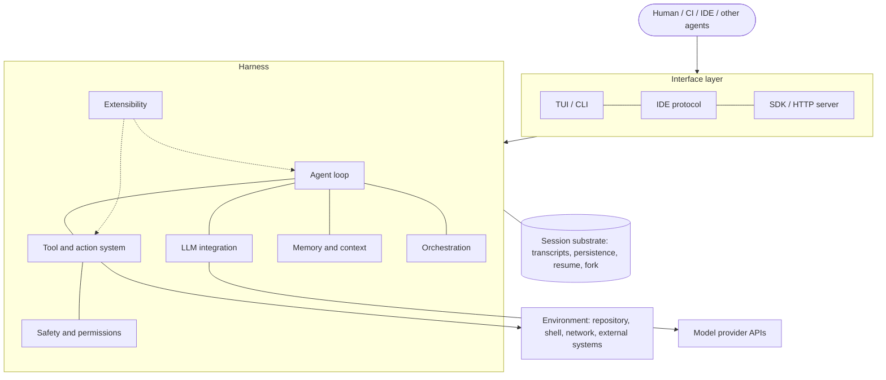
```mermaid
flowchart TD
    Human([Human / CI / IDE / other agents]) --> IF
    subgraph IF[Interface layer]
        direction LR
        TUI[TUI / CLI] --- IDE[IDE protocol] --- SDK[SDK / HTTP server]
    end
    IF --> H
    subgraph H[Harness]
        LOOP[Agent loop]
        LLM[LLM integration]
        TOOLS[Tool and action system]
        MEM[Memory and context]
        SAFE[Safety and permissions]
        ORCH[Orchestration]
        EXT[Extensibility]
        LOOP --- LLM
        LOOP --- TOOLS
        LOOP --- MEM
        TOOLS --- SAFE
        LOOP --- ORCH
        EXT -.-> TOOLS
        EXT -.-> LOOP
    end
    H --- SUB[(Session substrate: transcripts, persistence, resume, fork)]
    TOOLS --> ENV[Environment: repository, shell, network, external systems]
    LLM --> PROV[Model provider APIs]
```

Table 1 of the paper gives the observed minimal and maximal form of each subsystem [HE §2.3, Table 1]:

| Subsystem | Role | Minimal form observed | Maximal form observed |
|---|---|---|---|
| Agent loop | alternates inference with action; owns stop conditions and recovery | Mini-SWE-Agent: a linear `while` over one bash tool | OpenHands: event-sourced conversation over a persistent event log, parallel action batches |
| LLM integration | speaks provider protocols; assembles the prompt; caching, thinking, routing | Mini-SWE-Agent: one LiteLLM call, one Jinja template | Hermes: five owned transports, 29 provider profiles; Codex: server-delivered model catalog |
| Tools & actions | defines and executes what the agent can do, file editing above all | Mini-SWE-Agent: bash only | Claude Code: 43 typed tools with deferred loading; Codex: tool calls as V8-executed code |
| Memory & context | rations the context window; persists knowledge across turns and sessions | Mini-SWE-Agent: unbounded linear history | Codex: agent-maintained cross-session memory; Gemini CLI: graph-based context distillation |
| Safety & permissions | decides what runs, what asks, what is forbidden; isolates execution | Mini-SWE-Agent: cost and step limits | Codex: policy rules + LLM approval reviewer + three-platform OS sandbox |
| Orchestration | spawns and coordinates sub-agents | Aider: none (single-agent by design) | Claude Code: recursive composition; Omnigent: cross-vendor coordination |
| Extensibility | lets users and ecosystems add capability | Mini-SWE-Agent: structural typing (Python protocols) | Pi: everything-is-an-extension runtime; Codex: marketplace-distributed plugins |

### III.1 Subsystem by subsystem: what you actually have to decide

For each subsystem: what it is responsible for, the smallest viable version, what production adds, how it fails, and the core trade-off. The "production" column comes from the observed systems. The failure modes and trade-offs are **engineering interpretation**, grounded in the mechanisms each production system adds.

**1. Agent loop.**
- *Responsibility:* turn ordering, stop conditions, error recovery.
- *MVP:* `while True: query → execute → append` (Mini-SWE-Agent).
- *Production:* streaming, batched and parallel tool execution, middleware turn policies (Mistral Vibe), budgets with grace turns and stop guards (Hermes), event sourcing (OpenHands), log-as-queue resumability (OpenCode).
- *Failure modes:* infinite loops, premature "done", unrecoverable crash mid-turn, silent truncation of tool arguments.
- *Trade-off:* every feature added to the loop body is coupled to every other one. Production systems keep the body simple and move policy into components the loop calls.

**2. LLM integration.**
- *Responsibility:* wire protocol, prompt assembly, caching, thinking/effort knobs, routing.
- *MVP:* one SDK call and a template.
- *Production:* static/dynamic cache boundaries (Claude Code, OpenHands), per-model prompts (Codex, OpenCode), model routing (Gemini CLI), owned transports with failover (Hermes).
- *Failure modes:* cache invalidation from a timestamp in the prefix, prompt drift across model generations, provider outages.
- *Trade-off:* provider-native optimizations versus portability. The paper's revised view (Observation 2) is that this is less about capability than about "who pays the per-provider conditional-code cost" and "who controls the update loop".

**3. Tool and action system.**
- *Responsibility:* tool schemas, validation, execution, editing semantics.
- *MVP:* one bash tool.
- *Production:* typed tools that declare validation, permissions and concurrency safety (Claude Code); deferred loading (Claude Code, Codex, Hermes); model-specific edit formats (Aider, OpenCode).
- *Failure modes:* ambiguous edits, line-number drift, prompt bloat from too many tool schemas, races between parallel writes.
- *Trade-off:* surface area. More tools give the model more leverage but cost prompt tokens and add decision noise.

**4. Memory and context.**
- *Responsibility:* what is in the window this turn, and what survives past the session.
- *MVP:* unbounded linear history.
- *Production:* threshold compaction with incremental summaries (seven of eleven systems), JIT repository context, bounded or agent-maintained persistent memory.
- *Failure modes:* context overflow, "context rot" in long windows, losing the original task after compaction, cache-hostile memory writes.
- *Trade-off:* summary fidelity versus window headroom.

**5. Safety and permissions.**
- *Responsibility:* allow/ask/deny decisions and isolation.
- *MVP:* step and cost limits.
- *Production:* layered permission systems (Claude Code: hooks → classifier → dialog), policy-as-code (Codex Starlark rules), OS sandboxes (Codex, Gemini CLI), content-borne threat scanning (Hermes).
- *Failure modes:* destructive commands, prompt injection through files and tool output, approval fatigue, a YOLO switch that a prompt can flip.
- *Trade-off:* safety versus autonomy [HE §13.4, Axis 2].

**6. Orchestration.**
- *Responsibility:* spawning, isolating and coordinating sub-agents.
- *MVP:* none.
- *Production:* recursive composition with forked context (Claude Code), depth-tracked thread trees (Codex), parallel child sessions (OpenHands, OpenCode).
- *Failure modes:* token blow-up, recursion without limits, children escalating permissions, results that never make it back to the parent.
- *Trade-off:* parallel context isolation versus the cost of tokens and coordination.

**7. Extensibility.**
- *Responsibility:* letting users and ecosystems add capability without forking.
- *MVP:* structural typing.
- *Production:* hooks (9 of 11 systems), SKILL.md skills (9/11), MCP (8/11), plugins and marketplaces.
- *Failure modes:* supply-chain attacks, prompt bloat from eager loading, plugins that bypass the safety layer.
- *Trade-off:* ecosystem velocity versus a trusted computing base.

### III.2 Mini-SWE-Agent versus production: code size is not capability

Do not equate code size with agent capability. The paper is explicit that Mini-SWE-Agent "implements all seven subsystems in roughly 100 lines" and reports SWE-bench Verified results "in the same range as systems three orders of magnitude larger". It also notes that those figures are self-reported, obtained with different models at different dates [HE §2.4]. What separates the floor from the production systems "is not task completion but everything else": safety, recovery, cost management, extensibility, and the platform surfaces.

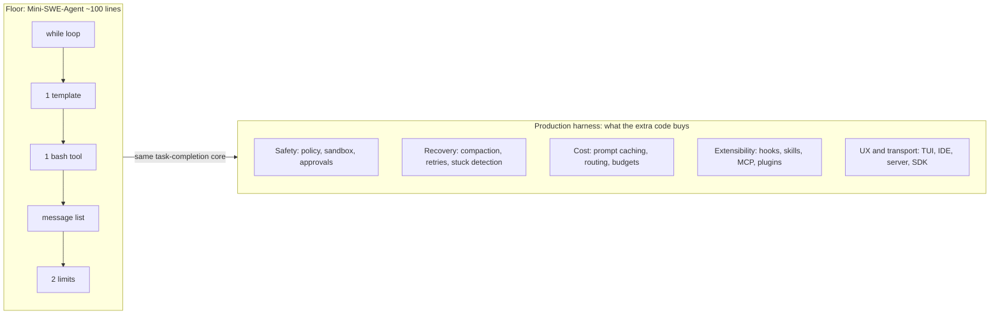
```mermaid
flowchart LR
    subgraph FLOOR["Floor: Mini-SWE-Agent ~100 lines"]
        A1[while loop] --> A2[1 template] --> A3[1 bash tool] --> A4[message list] --> A5[2 limits]
    end
    subgraph PROD["Production harness: what the extra code buys"]
        B1[Safety: policy, sandbox, approvals]
        B2[Recovery: compaction, retries, stuck detection]
        B3[Cost: prompt caching, routing, budgets]
        B4[Extensibility: hooks, skills, MCP, plugins]
        B5[UX and transport: TUI, IDE, server, SDK]
    end
    FLOOR -->|same task-completion core| PROD
```

The useful mental model is the paper's **scaffold-capability frontier**, which it offers as "a guiding intuition rather than a formal hypothesis" [HE §15.5]. Below a floor the agent cannot operate at all. A small set of structural elements (a bash tool, read/write tools, a Markdown context file) raises success rapidly. Beyond that, further scaffold work pays off in operational concerns rather than completion rate.

Two numbers support that intuition. The paper cites Lin et al.'s Agentic Harness Engineering result: starting from a bash-only seed, automatic harness evolution reaches 71.9% on SWE-Bench Verified. Their ablation attributes the gains to tools (+3.3 pp), middleware (+2.2 pp) and long-term memory (+5.6 pp), while the system prompt alone *regresses* (−2.3 pp) [HE §3.1, §15.5]. Structure carries the improvement; prose does not.

---

## IV. Case Study #1 — Mini-SWE-Agent: The Minimum Viable Harness

### Architecture

Mini-SWE-Agent (Python, v2.4.5) is the corpus's floor: "all seven subsystems, minimally" [HE Table 4]. It has:

- one bash tool, executed through `subprocess.Popen(shell=True)` and wrapped only to kill the process group on timeout [HE §8.2];
- Jinja2 templates embedded in YAML, rendered once at session start [HE §7.2];
- one LiteLLM call per turn, with no streaming [HE §7.4];
- a message list that "grows linearly and unboundedly, relying entirely on the LLM's native context window" [HE §6.2];
- Python `Protocol`s for `Model`, `Agent` and `Environment` as the entire extension story. Any conforming class can be substituted with no registration and no manifest [HE §12.2].

Execution environments are pluggable (Docker, Singularity, Bubblewrap) [HE Table 8]. Safety is resource limits only: `step_limit`, `cost_limit`, plus a wall-clock limit and a cap on consecutive malformed responses added in v2.4 [HE §10.10].

### Problem It Solves

It is a research baseline, and the paper calls the minimalism deliberate: "the design intentionally isolates LLM capability from agent scaffolding complexity, to see how much of one can substitute for the other" [HE §6.2]. The engineering problem it answers is: *what is the least harness that can still drive a frontier model through a real repository task?*

### Implementation

The loop, condensed from the paper's Listing 1 [HE §6.2]:

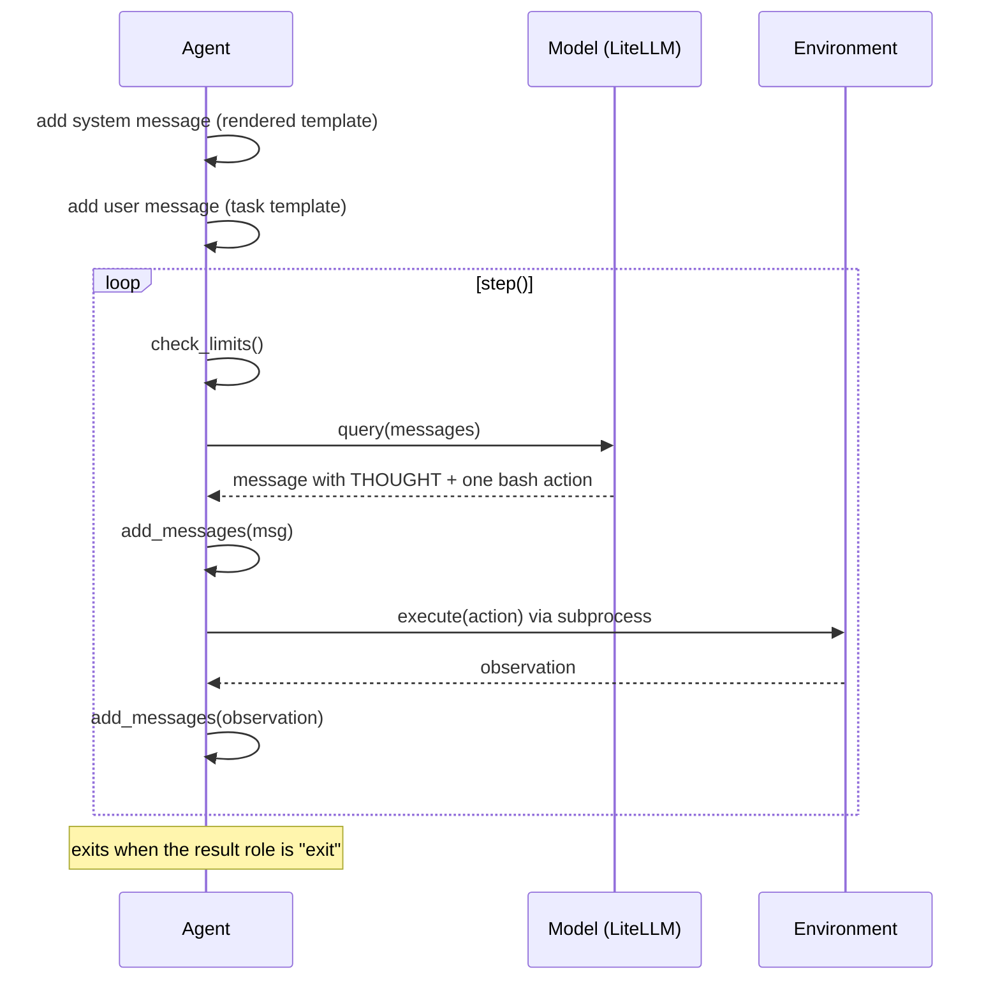
```mermaid
sequenceDiagram
    participant A as Agent
    participant M as Model (LiteLLM)
    participant E as Environment
    A->>A: add system message (rendered template)
    A->>A: add user message (task template)
    loop step()
        A->>A: check_limits()
        A->>M: query(messages)
        M-->>A: message with THOUGHT + one bash action
        A->>A: add_messages(msg)
        A->>E: execute(action) via subprocess
        E-->>A: observation
        A->>A: add_messages(observation)
    end
    Note over A: exits when the result role is "exit"
```

The prompt makes the contract structural: exactly one THOUGHT block followed by one bash command per turn. Because every call runs in a fresh subshell, directory and environment changes must be prefixed inline (`MY_VAR=val cd /path && ...`) [HE §7.3]. That is a tool-design decision expressed in the prompt.

### Code-Level Pattern

The shape of the paper's Listing 1, re-expressed. Format-error handling, cost accounting and trajectory saving are omitted, as they are in the paper's own condensation:

```python
class Agent:
    def run(self, task: str):
        self.add_message("system", render(system_template))
        self.add_message("user", render(instance_template, task=task))
        while True:
            result = self.step()
            if result.role == "exit":
                return result

    def step(self):
        self.check_limits()                      # step_limit, cost_limit, wall clock
        msg = self.model.query(self.messages)
        self.add_message(msg)
        for action in msg.actions:               # in practice: one bash command
            obs = self.env.execute(action)       # subprocess, killed on timeout
            self.add_message(format_observation(obs))
```

### Why This Design?

Nothing in this loop is *wrong*. It is missing everything that is not task completion. What is intentionally absent [HE §6.2, §9.2]:

- **no state machine.** The only state is the message list;
- **no event sourcing.** The trajectory is the record;
- **no concurrency.** One action at a time, so there are no races to reason about;
- **no compaction.** The paper notes this "enables perfect reproducibility and straightforward trajectory analysis";
- **no orchestration and no extension mechanism** beyond protocols.

Even the floor drifts upward. The v2.4 line added a wall-clock limit and an abort after N consecutive format errors: "the corpus's minimal system has acquired a minimal stuck detector" [HE §6.2].

### Trade-offs

| Gains | Sacrifices |
|---|---|
| Comprehensible in one sitting; trivially reproducible | No safety beyond limits ("inadequate for production use", [HE §10.10]) |
| Every behaviour attributable to the model, not the scaffold | Context overflow on long tasks; no recovery path |
| Zero framework, zero infrastructure | No parallelism, no permissions, no persistence beyond the trajectory |

### What We Can Reuse

Start here. The paper's Recommendation 1 is literally "start with a linear while loop" [HE §16.1], and Recommendation 3 is "begin with just a bash tool; add more tools only in response to observed failure modes". The reference harness in §XIX keeps the same loop shape. Every production concern is added *around* it, not *into* it.

### What Not To Copy

`shell=True` with no policy layer, and unbounded history. Both are fine for a disposable benchmark container and dangerous on a developer's machine. Also do not copy the conclusion people draw from it. A minimal scaffold matching larger systems on a benchmark says the benchmark doesn't measure safety, UX or long-session robustness. It does not say those are unnecessary.

---

## V. Case Study #2 — Claude Code: Concurrency Semantics, Deferred Tools, and Cache-Aware Composition

> Source caveat from the paper: the Claude Code analysis is based on a circulated source snapshot from March 2026. The paper calls this "the weakest link on reproducibility", and the July shipping binary may differ [HE §15.6].

### Architecture

Claude Code (TypeScript) is described in the paper as "the reference others copy" [HE Table 4]. The observed architecture [HE §6.2, §7.2, §8.2–8.3, §10.1, §11.2]:

- **Streaming loop** over the Anthropic Messages API, with fine-grained SSE events (`content_block_start`, `content_block_delta`, `content_block_stop`). It stops on `end_turn` and has no automated stuck detection ("None (manual)", Table 5).
- **43 typed tools.** Each declares validation, permission checking, concurrency safety and UI rendering as separate interface concerns.
- **Concurrency-partitioned tool batching** through a single-pass reduce over `isConcurrencySafe`, max 10 concurrent via a semaphore [HE Table 18].
- **Deferred tool loading** (`shouldDefer` + `ToolSearchTool`).
- **Modular prompt with a cache boundary** (`SYSTEM_PROMPT_DYNAMIC_BOUNDARY`).
- **Three-layer permissions**: PreToolUse hook rules → LLM permission classifier → interactive dialog.
- **Recursive sub-agents** via `AgentTool` with six-dimension context forking, plus a coordinator mode.
- **Isolation:** an opt-in OS sandbox (Anthropic's `sandbox-runtime`: Bubblewrap/Seatbelt, network restrictions) and git worktrees for branch isolation.
- **Threshold compaction** at a 13,000-token buffer below the effective window.

### Problem It Solves

Three distinct problems, each with its own mechanism:

1. **Latency on independent reads.** Models often request several reads at once, and running them serially wastes wall-clock time.
2. **Prompt economics.** Forty-plus tool schemas, MCP instructions and memory all compete for the context window, and every byte in the prefix affects cache hits.
3. **Safe delegation.** Sub-agents need isolation (they must not corrupt the parent's state) while sharing what is expensive to rebuild (the cached prompt).

### Implementation

**Tool batching.** "Tool calls are partitioned into batches by concurrency safety via a single-pass reduce algorithm. Tools default to `isConcurrencySafe = false` (the safe default), and must explicitly opt in" [HE §6.2]. Read-only tools (grep, glob, file read) opt in; write tools (edit, bash) do not. Consecutive safe tools are batched and unsafe tools run solo [HE Table 18].

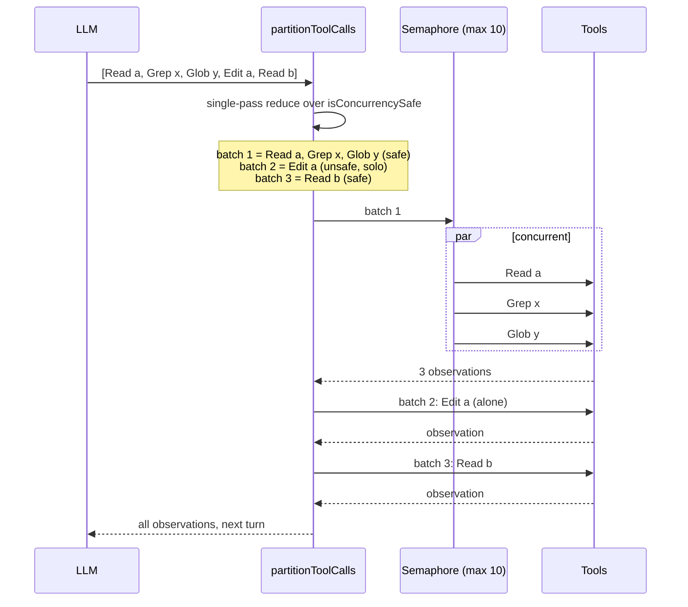
```mermaid
sequenceDiagram
    participant M as LLM
    participant P as partitionToolCalls
    participant S as Semaphore (max 10)
    participant T as Tools
    M->>P: [Read a, Grep x, Glob y, Edit a, Read b]
    P->>P: single-pass reduce over isConcurrencySafe
    Note over P: batch 1 = Read a, Grep x, Glob y (safe)<br/>batch 2 = Edit a (unsafe, solo)<br/>batch 3 = Read b (safe)
    P->>S: batch 1
    par concurrent
        S->>T: Read a
        S->>T: Grep x
        S->>T: Glob y
    end
    T-->>P: 3 observations
    P->>T: batch 2: Edit a (alone)
    T-->>P: observation
    P->>T: batch 3: Read b
    T-->>P: observation
    P-->>M: all observations, next turn
```

**Deferred tools.** Tools marked `shouldDefer = true` are excluded from the initial system prompt. The model discovers them through `ToolSearchTool`, which supports keyword search and direct selection (`select:<tool_name>`). The deferred set is cached via `getDeferredToolsCacheKey()` and invalidated when it changes [HE §8.3]. The paper credits this with an initial-prompt reduction of about 40% [HE §16.3, Table 18].

**Cache boundary.** The prompt is assembled from 12–15 named sections divided by `SYSTEM_PROMPT_DYNAMIC_BOUNDARY`. Sections before it (identity, system rules, task guidance, tool patterns, tone) are static and cached via Blake2b hashing with global scope. Sections after it (session guidance, memory, environment, MCP instructions, language, scratchpad) are computed per turn with memoization [HE §7.2].

**Sub-agents.** When `AgentTool` spawns a child, the parent's context is forked along six dimensions [HE §11.2.2]:

| Dimension | Fork behaviour |
|---|---|
| AbortController | new controller linked to parent: parent abort → child abort, not vice versa |
| File state cache | LRU cache cloned to prevent concurrent mutation |
| Permission prompts | suppressed for async agents |
| App state | no-op for async agents (prevents mutating a dead session) |
| Denial tracking | fresh local state |
| Tool decisions | fresh map per agent |

The parent's `renderedSystemPrompt` is frozen at fork time and passed verbatim to the child, so the prompt cache survives fork and resume boundaries [HE §11.2.2].

In **coordinator mode** (enabled by environment variable or feature gate), a lead agent orchestrates workers that are restricted to a 16-tool whitelist (`ASYNC_AGENT_ALLOWED_TOOLS`). Workers report back through `<task-notification>` XML blocks, and the coordinator synthesizes their findings before delegating the next phase: Research → Synthesis → Implementation → Verification [HE §6.4, §11.2.3].

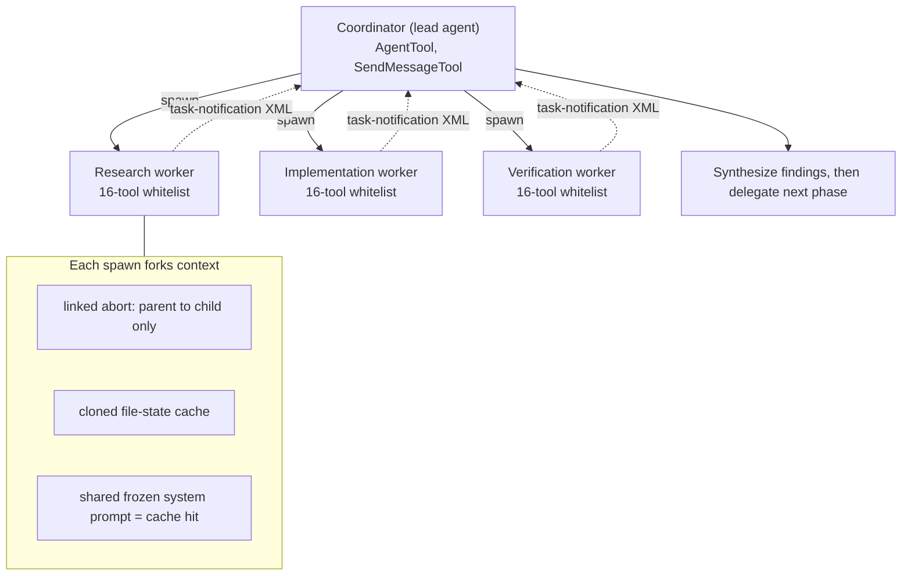
```mermaid
flowchart TD
    C["Coordinator (lead agent)<br/>AgentTool, SendMessageTool"]
    C -->|spawn| R["Research worker<br/>16-tool whitelist"]
    C -->|spawn| I["Implementation worker<br/>16-tool whitelist"]
    C -->|spawn| V["Verification worker<br/>16-tool whitelist"]
    R -.->|task-notification XML| C
    I -.->|task-notification XML| C
    V -.->|task-notification XML| C
    C --> S[Synthesize findings, then delegate next phase]
    subgraph FORK["Each spawn forks context"]
        F1[linked abort: parent to child only]
        F2[cloned file-state cache]
        F3[shared frozen system prompt = cache hit]
    end
    R --- FORK
```

**Permissions.** Three layers, ordered fastest-but-least-context to slowest-but-most-reliable: static PreToolUse hook rules, an LLM-based permission classifier (allow/ask/deny), and an interactive dialog. Background and forked sub-agents get only layers 1–2, so their would-be prompts resolve to denials. Unresolvable cases escalate to the parent coordinator, and denials are counted per session [HE §10.1].

### Code-Level Pattern

The core insight: **parallelism is not "run every tool concurrently". Tool execution needs concurrency semantics.** A tool has to declare whether it is safe to overlap, and, if you want finer granularity than Claude Code's boolean, *what it touches*. The abstraction below is the reference harness's `Tool` (proposed implementation; `harness/tools/registry.py`). It combines Claude Code's boolean opt-in with OpenHands' declared resources:

```python
@dataclass
class Tool:
    name: str
    description: str
    parameters: dict[str, Any]          # JSON-schema subset
    handler: Handler                    # async (args, ctx) -> ToolResult
    permission: PermissionLevel = PermissionLevel.READ
    concurrency_safe: bool = False      # safe default: opt in to parallelism
    accesses: AccessFn | None = None    # declared resources; None = unknown -> exclusive
    defer: bool = False                 # hidden until discovered via tool_search
```

A Claude-Code-style partition (`policy="boolean"` in the reference scheduler) is a few lines. Consecutive safe calls accumulate; an unsafe call flushes and runs alone:

```python
for c in calls:
    tool = registry.get(c.name)
    if tool.concurrency_safe:
        current.calls.append(c)
    else:
        flush()
        batches.append(Batch([c], exclusive=True))
flush()
```

§XXI extends this into a resource-aware scheduler.

### Why This Design?

**Engineering interpretation.**
- *Safe-by-default concurrency* turns a correctness bug (two edits racing on one file) into a performance bug (a tool someone forgot to mark safe runs serially). That is the right failure direction.
- *Deferred loading* is a recognition that tool schemas are prompt tokens, and that most tools are irrelevant to most turns.
- *The cache boundary and the frozen fork prompt* follow from multi-agent economics. The paper cites Anthropic's own report that multi-agent systems use about 15× more tokens than chat, and links this directly to Claude Code's prompt-cache-sharing fork mechanism: "without those optimizations the cost would be prohibitive" [HE §15.1].

### Trade-offs

| Gains | Sacrifices |
|---|---|
| Lower latency on read bursts without risking write races | Boolean safety is coarse: two writes to *different* files still serialize |
| Smaller initial prompt; tools scale past dozens | An extra round-trip whenever a deferred tool is needed |
| Cheap sub-agents via cache sharing | Tight coupling to provider-specific caching and thinking features [HE §7.1] |
| Layered permissions that degrade safely for background agents | No automated stuck detection; relies on the user |

### What We Can Reuse

- `concurrency_safe=False` as the default, and opt-in parallelism.
- `tool_search` with `select:` for deferred tools.
- A static/dynamic prompt split.
- Fork semantics: a linked abort, a cloned file-state cache, and suppressed prompts for background children.
- Whitelisted worker toolsets.
- Structured result envelopes (`<task-result>` in our implementation).

### What Not To Copy

Don't copy 43 tools on day one. The paper's own Recommendation 4 sets the deferred-loading threshold at "∼15 tools", and says to start with bash [HE §16.3]. Coordinator mode is gated by a flag for good reason. The paper reports that coordinator-worker patterns in coding are "mostly used for breadth-first exploration phases (parallel codebase research) rather than for parallel implementation" [HE §15.1]. Default to a single agent.

---

## VI. Case Study #3 — Codex CLI: An Async Runtime With OS-Level Guarantees

### Architecture

Codex (Rust, ~1.12M lines across 126 crates in the July snapshot, up from 621K lines and 89 crates in April [HE §14.5]):

- **Loop:** a Tokio-based async state machine. A `Session` orchestrates turns by consuming streaming `ResponseItem` events from the OpenAI Responses API, deserialized from SSE or WebSocket frames. Entry points are `Codex::spawn()`, `submit_with_id()` and `next_event()`; the older monolithic `codex.rs` has been split into `session/` modules and a `CodexThread` abstraction [HE §6.2].
- **Transport:** WebSocket primary with SSE fallback, connection prewarm (`generate=false`), and turn state via an `x-codex-turn-state` header [HE §7.4].
- **Tools:** tool invocations are processed through `FuturesOrdered` for ordered parallel execution, factored through a dedicated `ToolCallRuntime`. A per-tool `supports_parallel` flag (default false) gates an execution lock, and "concurrency-unsafe tools run exclusively" [HE Table 18]. The registry stores `Arc<dyn CoreToolRuntime>`, now in a standalone `codex-tools` crate [HE §8.2].
- **Editing:** a custom `*** Begin Patch` DSL with a Lark-grammar-constrained variant [HE Table 7].
- **Deferral:** `defer_loading` flags (MCP tools by default) plus a BM25 `tool_search` [HE §8.3].
- **Sub-agents:** a hierarchical thread tree (§11.3).
- **Memory:** an agent-maintained cross-session pipeline (§9.6).
- **Safety:** a four-layer stack — Starlark policy, hooks, an LLM reviewer, an OS sandbox (§10.2).

### Problem It Solves

Codex optimizes for **isolation and guaranteed containment at scale**. Where Claude Code's posture is layered review, Codex's original philosophy was, in the paper's words, "sandboxed-emergent — safety guaranteed at the OS level, workflow organization left to the model". The paper notes it has since grown prescriptive structure of its own [HE §11.11].

### Implementation

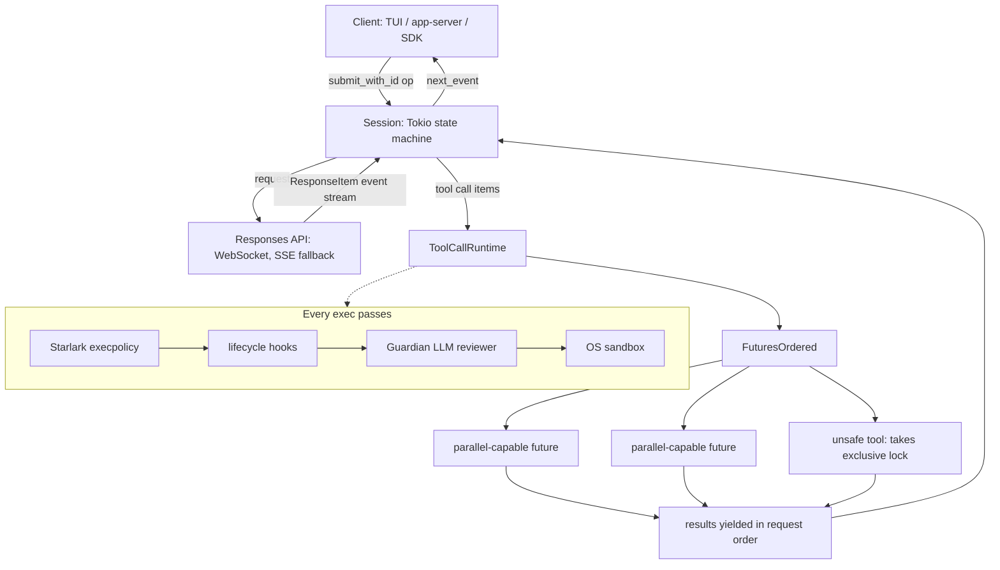
```mermaid
flowchart TD
    UI[Client: TUI / app-server / SDK] -->|submit_with_id op| SES[Session: Tokio state machine]
    SES -->|request| API[Responses API: WebSocket, SSE fallback]
    API -->|ResponseItem event stream| SES
    SES -->|tool call items| TCR[ToolCallRuntime]
    TCR --> FO[FuturesOrdered]
    FO --> P1[parallel-capable future]
    FO --> P2[parallel-capable future]
    FO --> X1[unsafe tool: takes exclusive lock]
    P1 --> RES[results yielded in request order]
    P2 --> RES
    X1 --> RES
    RES --> SES
    SES -->|next_event| UI
    subgraph SAFETY["Every exec passes"]
        L1[Starlark execpolicy] --> L2[lifecycle hooks] --> L3[Guardian LLM reviewer] --> L4[OS sandbox]
    end
    TCR -.-> SAFETY
```

**Ordered parallelism.** `FuturesOrdered` runs futures concurrently but yields their results *in submission order*. That matters because the model's next request must pair each result with the call it asked for. A harness that appends results in completion order makes history nondeterministic across runs.

**Thread tree** [HE §11.3]. `AgentControl` is the control plane, and `AgentRegistry` tracks live agents. `spawn_agent_internal()` reserves a spawn slot, *inherits the parent's sandbox and execution policy*, resolves the fork mode, creates a thread with the right history, and emits a session-started notification. `SpawnAgentForkMode` is `FullHistory` or `LastNTurns(N)`. Forked history is filtered by `keep_forked_rollout_item()` to "system/developer/user messages and final assistant answers, filtering out intermediate tool calls and reasoning". Inter-agent messages are typed `InterAgentCommunication` records (Spawn / Message / Followup / Result) flowing through the session's input queue. Topology is persisted by an `agent-graph-store` crate. For map-reduce, `spawn_agents_on_csv` launches one sub-agent per CSV row under a shared JSON-schema result contract.

**Policy-as-code** [HE §10.2]. Rules are Starlark: `prefix_rule(pattern=[...], decision="allow|prompt|forbidden", match=[...], not_match=[...])` plus `network_rule(...)`. The inline `match`/`not_match` examples are validated at parse time: executable test cases inside the policy file. The paper's Listing 2 shows a rule allowing `git status`, with `git push` as a not-match example.

**Guardian.** When a command would require approval, a dedicated Guardian session re-assesses the exact planned action against a policy prompt. It uses a compact transcript reconstruction, returns a strict-JSON verdict, fails closed on timeout or malformed output, and carries a per-turn rejection circuit breaker.

**OS sandbox.**
- *Linux:* vendored Bubblewrap via C FFI (`--ro-bind / /`, writable roots via `--bind`, `--unshare-net`, user/PID namespaces), with Landlock demoted to a legacy fallback.
- *macOS:* Seatbelt via `sandbox-exec`.
- *Windows:* restricted tokens.
- *Protected paths* (`.git`, `.agents`, `.codex`) are re-marked read-only even inside a writable root.

**Memory** [HE §9.6]. A background two-phase pipeline:
1. Per-rollout LLM extraction into a SQLite state database, with leased jobs, retry backoff and secret redaction.
2. Consolidation into a git-baselined `~/.codex/memories/` by a sandboxed internal sub-agent (no approvals, no network, local-write-only) that reviews a git-style diff.

Memories are injected into new sessions with citation tracking and usage-based ranking.

### Code-Level Pattern

The ordered-parallel contract, expressed in Python. This is an illustration of the pattern, not Codex source. Parallel-capable calls share an execution lock; an unsafe call takes it exclusively; results come back in request order:

```python
class ExecLock:
    """Many shared holders, or exactly one exclusive holder."""

    def __init__(self):
        self._cond, self._shared, self._exclusive = asyncio.Condition(), 0, False

    async def acquire(self, exclusive: bool):
        async with self._cond:
            if exclusive:
                await self._cond.wait_for(lambda: not self._exclusive and self._shared == 0)
                self._exclusive = True
            else:
                await self._cond.wait_for(lambda: not self._exclusive)
                self._shared += 1

    async def release(self, exclusive: bool):
        async with self._cond:
            if exclusive:
                self._exclusive = False
            else:
                self._shared -= 1
            self._cond.notify_all()


async def run_ordered(calls, execute, supports_parallel):
    lock = ExecLock()

    async def one(c):
        exclusive = not supports_parallel(c)
        await lock.acquire(exclusive)
        try:
            return await execute(c)
        finally:
            await lock.release(exclusive)

    return await asyncio.gather(*(one(c) for c in calls))   # results in request order
```

> **Engineering note.** A lock like this guarantees mutual exclusion, not *order*: a read submitted after a write can still win the race for the lock. If a later call may depend on an earlier one, use the order-preserving batch planner of §XXI, which never lets a call overtake a conflicting predecessor.

### Why This Design?

**Engineering interpretation.** When safety is enforced by the kernel, the loop can be more permissive about *what* the model tries, because the blast radius is bounded regardless. That is why Codex can leave workflow organization to the model. The Rust/Tokio choice fits the same philosophy: the paper's Axis 4 describes Codex's workspace as optimizing "for type safety and performance" [HE §13.4].

### Trade-offs

| Gains | Sacrifices |
|---|---|
| Containment that does not depend on the model behaving | The paper calls OS sandboxing "one of the most code-expensive capabilities in the corpus" [HE Obs. 6] |
| Deterministic, ordered tool results under parallelism | A million lines of Rust; the paper notes six-figure line counts in transports, plugins and voice that "no benchmark will ever measure" [HE Obs. 1] |
| Typed inter-agent records; persisted topology | Tight coupling to one provider's wire format and server-delivered catalog [HE §7.1] |
| Autonomous long-term memory | The memory write path is governed by an agent, not a human |

### What We Can Reuse

- Ordered result delivery.
- Fork modes with filtered inheritance.
- Children inheriting the parent's policy and sandbox.
- Policy rules with inline self-tests.
- Protected paths inside writable roots.
- Fail-closed LLM reviewers.

The reference harness implements the first five; §XXIII shows the self-testing rules.

### What Not To Copy

Don't vendor Bubblewrap before you know your deployment context. The paper's Recommendation 10 reserves OS sandboxing for enterprise, shared and automated contexts, and notes that Gemini CLI reaches a cross-platform sandbox at lower cost by reusing OS binaries [HE §16.6]. Don't copy autonomous memory consolidation unless you are prepared to audit what an agent writes into the next session's prompt.

---

## VII. Case Study #4 — Gemini CLI: A Tool State Machine and Two-Tier Loop Detection

### Architecture

Gemini CLI (TypeScript, v0.50.0, the last major open-source state before the transition to a closed-source Antigravity CLI [HE §3.7]):

- **Loop:** an async generator. Each iteration yields typed `ServerGeminiStreamEvent` tuples to the UI, runs the active model through a `ModelRouterService`, streams the response via the `@google/genai` SDK, and dispatches function calls through a state-machine `Scheduler` [HE §6.2].
- **Streaming resilience:** a four-attempt mid-stream retry loop (`MidStreamRetryOptions`) recovers from content, network and invalid-stream errors. Extended-thinking parts are kept out of persisted history so they don't pollute cache lookups [HE §7.4].
- **Routing:** a chain of pluggable strategies — fallback, override, approval-mode, three classifier strategies (one can run a local Gemma model), and default. "Routing layers exist precisely to absorb model churn so the loop does not" [HE §7.1].
- **Loop detection:** a hybrid `LoopDetectionService` (below), plus a session turn limit (default 100).
- **Hooks:** eleven lifecycle events, including BeforeAgent/AfterAgent, BeforeModel/AfterModel, BeforeToolSelection and PreCompress.
- **Safety:** an `ApprovalMode` enum (PLAN / DEFAULT / AUTO_EDIT / YOLO) [HE §10.5]. A three-platform sandbox (Docker/Bubblewrap/gVisor/LXC on Linux, Seatbelt on macOS, restricted tokens on Windows) runs under per-mode TOML policies, and environment variables matching TOKEN/SECRET/KEY/AUTH/CREDENTIAL are scrubbed before each command [HE §8.5].
- **Orchestration:** the corpus's only A2A server [HE §11.6].

### Problem It Solves

Two problems:

1. **Make tool execution inspectable and interruptible.** Each invocation has a lifecycle the UI and extensions can observe.
2. **Catch degenerate loops without paying an LLM call per turn.**

### Implementation

**The scheduler** walks every tool invocation through "deterministic Validating → Executing → Completed/Errored phases" [HE §8.2]. Calls run in parallel, but since v0.45 the scheduler partitions by concurrency safety: file-mutating tools (`edit`, `write_file`) and `update_topic` are hard-forced to sequential execution. Uniquely in the corpus, the model gets a concurrency knob: an auto-injected `wait_for_previous` boolean on every tool schema, through which it can serialize any call. Live output streams to the UI through an `outputUpdateHandler` [HE §6.2].

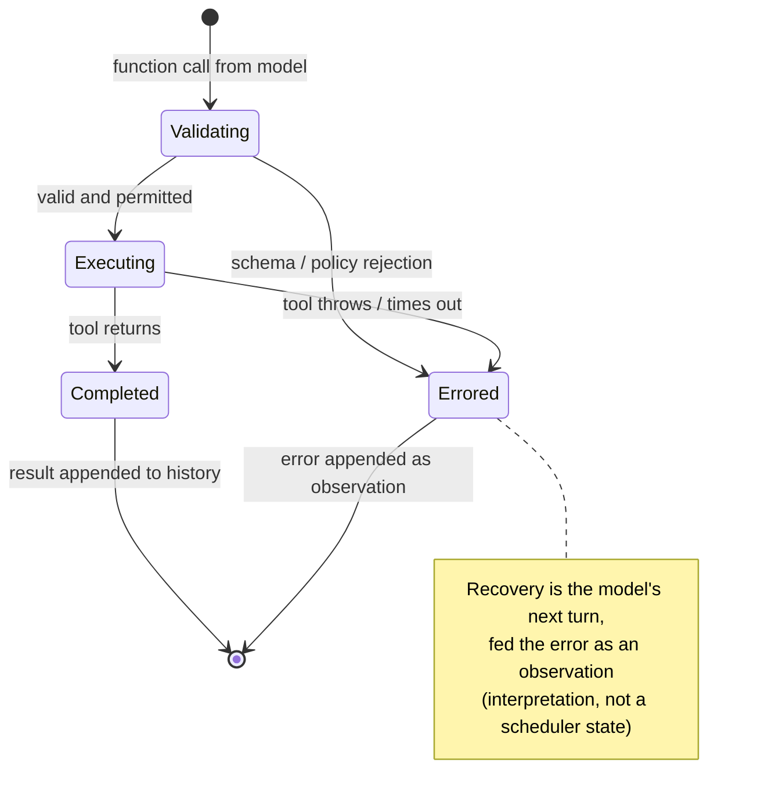
```mermaid
stateDiagram-v2
    [*] --> Validating: function call from model
    Validating --> Errored: schema / policy rejection
    Validating --> Executing: valid and permitted
    Executing --> Completed: tool returns
    Executing --> Errored: tool throws / times out
    Completed --> [*]: result appended to history
    Errored --> [*]: error appended as observation
    note right of Errored
        Recovery is the model's next turn,
        fed the error as an observation
        (interpretation, not a scheduler state)
    end note
```

> **Source note.** The paper documents the four phases. It does not describe a retry state inside the scheduler. Recovery comes from other mechanisms: the mid-stream retry loop at the transport layer, and the LLM edit-fixer subcall inside the `edit` tool [HE §8.4]. The note in the diagram is my interpretation of how an Errored result is consumed.

**Hybrid loop detection** [HE §6.2]: "SHA-256 hashing catches the common failure modes cheaply (five identical tool calls or ten identical content chunks abort the loop), and after thirty turns in a single prompt an LLM-based self-check runs at an adaptive interval."

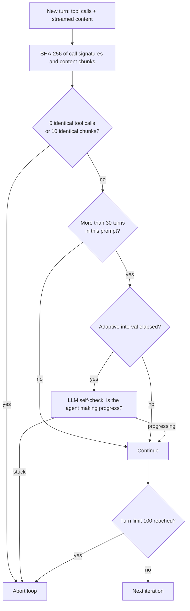
```mermaid
flowchart TD
    T[New turn: tool calls + streamed content] --> H[SHA-256 of call signatures and content chunks]
    H --> C1{"5 identical tool calls<br/>or 10 identical chunks?"}
    C1 -->|yes| ABORT[Abort loop]
    C1 -->|no| C2{"More than 30 turns<br/>in this prompt?"}
    C2 -->|no| CONT[Continue]
    C2 -->|yes| C3{Adaptive interval elapsed?}
    C3 -->|no| CONT
    C3 -->|yes| LLM[LLM self-check: is the agent making progress?]
    LLM -->|stuck| ABORT
    LLM -->|progressing| CONT
    CONT --> CAP{Turn limit 100 reached?}
    CAP -->|yes| ABORT
    CAP -->|no| NEXT[Next iteration]
```

### Code-Level Pattern

The cheap tier is a hash and a counter. In the reference harness (`harness/core/stuck.py`, proposed implementation), the hard stop counts identical calls (Gemini-style) and warnings count identical *failures* (Hermes-style, §X):

```python
def observe(self, calls: list[ToolCall]) -> tuple[bool, dict[str, str]]:
    warnings, halt = {}, False
    for c in calls:
        h = hashlib.sha256(c.signature().encode()).hexdigest()   # name + sorted-JSON args
        self._recent.append(h)
        if self.halt_at is not None and self._recent.count(h) >= self.halt_at:
            halt = True
        if self._failed.count(h) >= self.warn_at:
            warnings[c.id] = "<stuck-warning>This exact call already failed ... </stuck-warning>"
    return halt, warnings
```

The model-visible knob costs one schema property. The reference loop injects it into every visible tool, and the scheduler flushes the current batch when it sees it:

```python
params["properties"] = {**params.get("properties", {}), "wait_for_previous": WAIT_FOR_PREVIOUS}
...
if c.args.get("wait_for_previous") is True:
    flush()   # model-requested serialization
```

### Why This Design?

**Deterministic detection is cheaper than an LLM for every loop decision.** A hash comparison costs microseconds and catches the overwhelmingly common failure: the identical call, repeated. An LLM judgement costs a model round-trip, adds latency to every turn, and is itself fallible. Gemini CLI's split is the sensible one: deterministic checks every turn, and the expensive semantic check only after the session is old enough (30 turns) that subtle non-progress becomes plausible, then only at an interval.

The explicit state machine makes each phase a hook point. Validation errors never reach execution, and the UI can render "validating / running / done" without parsing logs.

### Trade-offs

| Gains | Sacrifices |
|---|---|
| Cheap, predictable loop breaking | Hash detection misses near-identical loops (same intent, different args) |
| Semantic check for subtle non-progress | LLM self-check adds cost and nondeterminism late in long sessions |
| `wait_for_previous` lets the model express ordering the harness can't infer | Trusts the model to use the knob correctly |
| Routing absorbs model churn | Routing decisions are another source of behavioural variance |

### What We Can Reuse

Explicit per-call phases (the reference executor is a linear version of Validating → Executing → Completed/Errored), hash-based stuck caps, the `wait_for_previous` knob, approval modes, environment scrubbing, and a router behind the model interface (`harness/llm/routing.py`).

### What Not To Copy

The paper's Recommendation 18 is explicit: "do not over-engineer stuck detection", and it classifies Gemini CLI's hybrid service and OpenHands' five-scenario detector as "platform-tier investments" [HE §16.9]. Ship the hash caps first and add the LLM tier only if you observe loops the caps miss.

---

## VIII. Case Study #5 — Aider: The Reflection Loop

### Architecture

Aider (Python, v0.86.3.dev, now in community-maintenance mode [HE §3.7]) is the only system in the corpus "whose main loop is reflection-shaped" [HE §6.3]:

- `run_one()` implements a nested loop. After each LLM response it applies edits, then checks for lint errors, test failures and unresolved file mentions.
- The lint stage is a three-step Python pipeline: syntax check → compile check → flake8. Its output uses `TreeContext` from `grep_ast` "to show code context around error lines".
- If issues are detected, a `reflected_message` re-invokes the LLM with corrective context, up to a configurable maximum (default: 3 reflections).
- There is no tool-call loop at all. A turn ends when the completion stream finishes, and `run_one` exits when no reflection is pending or the cap is reached.

Aider is also the polymorphic-edit pioneer: 13 registered edit formats selected per model through a `Coder.create()` factory, `RelativeIndenter` for indentation-robust matching, and fuzzy matching via `diff_match_patch` [HE §7.2, §8.4]. It has the corpus's only ranked repository map: tree-sitter symbols with PageRank-style ranking under a token budget (`map_tokens`, default 1024) [HE §9.7].

### Problem It Solves

Models produce edits that *look* right and are syntactically or semantically broken. Aider's answer is to stop asking the model whether its work is correct, and to *measure* correctness with deterministic tools and feed the measurement back.

### Implementation

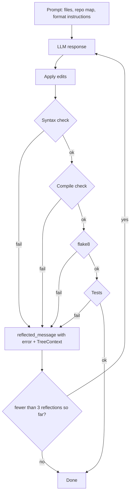
```mermaid
flowchart TD
    P[Prompt: files, repo map, format instructions] --> L[LLM response]
    L --> A[Apply edits]
    A --> S{Syntax check}
    S -->|fail| R[reflected_message with error + TreeContext]
    S -->|ok| C{Compile check}
    C -->|fail| R
    C -->|ok| F{flake8}
    F -->|fail| R
    F -->|ok| T{Tests}
    T -->|fail| R
    T -->|ok| D[Done]
    R --> N{"fewer than 3 reflections so far?"}
    N -->|yes| L
    N -->|no| D
```

### Code-Level Pattern

The general pattern is a **reflection loop**: deterministic signals become the next prompt. Here is a production-style sketch (proposed implementation; the per-edit version ships in `harness/verification/reflection.py`, the end-of-task version in `harness/verification/engine.py`):

```python
def syntax_feedback(path: Path) -> str | None:
    """Cheapest check first; show the offending lines, not just the message."""
    if path.suffix != ".py" or not path.is_file():
        return None
    source = path.read_text(encoding="utf-8")
    try:
        compile(source, str(path), "exec")
    except SyntaxError as e:
        lines = source.splitlines()
        lo, hi = max(0, (e.lineno or 1) - 3), min(len(lines), (e.lineno or 1) + 2)
        window = "\n".join(f"{'>' if i + 1 == e.lineno else ' '}{i + 1:5}: {lines[i]}"
                           for i in range(lo, hi))
        return f"<diagnostics>\nSyntaxError: {e.msg} (line {e.lineno})\n{window}\n</diagnostics>"
    return None
```

The hook appends that block to the edit tool's result, so the model sees the diagnosis in the same observation as the edit. Heavier checks (tests, linters, type checkers) are `CommandValidator`s whose exit code is the verdict:

```python
@dataclass
class CommandValidator:
    name: str
    argv: list[str]
    timeout_s: float = 300

    async def check(self, session, runner) -> Evidence:
        res = await runner.run(self.argv, timeout_s=self.timeout_s)
        tail = (res.stdout + "\n" + res.stderr).strip()[-3000:]
        return Evidence(self.name, res.exit_code == 0 and not res.timed_out, tail, session.state.turns)
```

### Why This Design?

**Why this is different from "please check your work".** A self-check prompt asks the same model, with the same blind spots, to grade its own output. It produces a confident "looks good" at exactly the moments it is wrong. A compiler, a linter and a test runner are independent of the model, deterministic, and specific: they say *which line* and *what failed*. The paper places Aider's integration in the line of Reflexion, Self-Refine, CRITIC and Self-Debug, and says its contribution is that "lint and test signals are routed back into the loop as the corrective feedback those papers theorize about" [HE §6.3].

The paper names three "structural cousins": Gemini CLI's LLM edit-fixer, OpenCode's LSP diagnostics appended to every edit result, and Hermes' verify-on-stop, which performs the check once at turn exit instead of per iteration [HE §6.3].

### Trade-offs

| Gains | Sacrifices |
|---|---|
| Ground-truth feedback with locality | Costs a test run per reflection; slow suites make the loop slow |
| Bounded (3 reflections) | A project with no tests gets only lint-level verification |
| Implicit safety: errors caught before they propagate [HE §10.10] | Single-agent, no sandbox, sequential; Aider's scope is pair programming |

### What We Can Reuse

Two placements of the same idea:

- **Cheap checks per edit.** Syntax and LSP diagnostics go in the tool result.
- **Expensive checks at the stop boundary.** Tests run at verify-on-stop (§X).

Bound both, and always show locality (file, line, surrounding context), not just a message.

### What Not To Copy

Running the full test suite after every edit. Aider's loop is per response, and a harness with dozens of edits per task cannot afford a full suite each time. Put the expensive check where Hermes puts it: at the moment the agent claims to be done.

---

## IX. Case Study #6 — OpenHands: Event Sourcing as the Session Substrate

### Architecture

OpenHands (Python, V1 SDK v1.34.0) is the corpus's maximal loop [HE Table 1]. Since the mid-2026 restructuring its loop lives in the `software-agent-sdk` repository [HE §6.2]:

- A `LocalConversation` drives `Agent.step()`.
- **Every event is appended to a persistent `EventLog`**: one file per event through a `FileStore`, with flock-based locking and secret redaction through a `SecretRegistry`.
- **The LLM's view of history is a cached projection of the active branch.** Conversation state is a tree with a movable head, so replay, fork and branch navigation are first-class.
- Each `step()` makes one LLM call but executes all of the response's tool calls as an **action batch**. They can run in parallel through a `ParallelToolExecutor`, governed by a `tool_concurrency_limit` (default 1, Table 5) and a **resource-lock manager keyed on each tool's declared resources** (files, terminal session, browser), "so only same-resource calls serialize".
- A **`StuckDetector`** covers five scenarios: repeating action-observation pairs, repeating actions with errors, monologue loops, alternating patterns, and context-window error loops. Thresholds are configurable and it is enabled by default.

Around the loop:

- **Condensers.** Three implementations (NoOp, LLMSummarizing, Pipeline) over a `RollingCondenser`, consolidated from ten in V0. Condensation is itself event-sourced (`CondensationRequest`/`Condensation` events), and overflow errors trigger condensation instead of a crash [HE §9.4].
- **Security analyzers.** An ensemble with worst-case-wins semantics, where broken child analyzers fail closed to HIGH. Repository context is wrapped in `<UNTRUSTED_CONTENT>` markers [HE §10.3].
- **Outer loop.** A `/goal` LLM judge runs after each run and either re-prompts or stops [HE §11.4].
- **Hosting.** An `ACPAgent` hosts rival harnesses (Claude Code, Codex, Gemini CLI) as interchangeable step backends [HE §13.3].

### Problem It Solves

A long-running agent session is a distributed-systems problem in miniature: it must survive crashes, be inspectable after the fact, support "go back and try differently", and keep secrets out of the record. A mutable message list cannot do any of that.

### Implementation

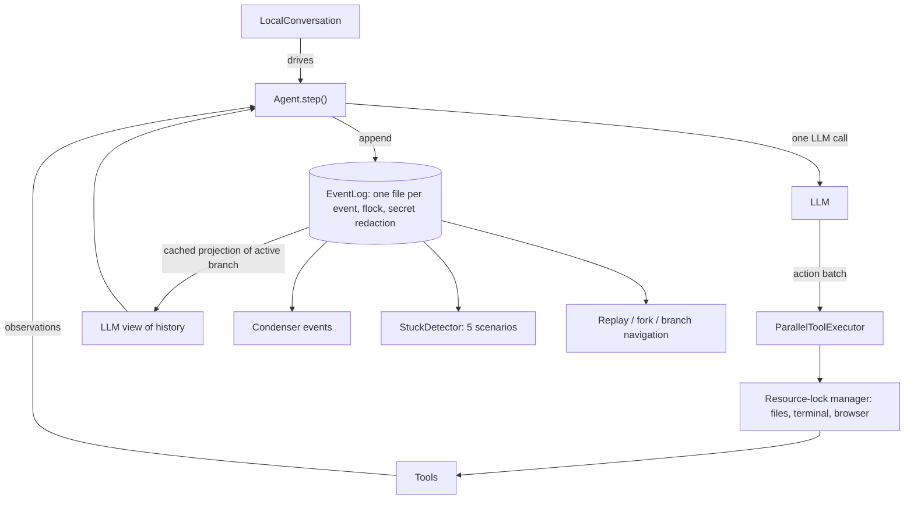
```mermaid
flowchart TD
    CONV[LocalConversation] -->|drives| STEP["Agent.step()"]
    STEP -->|one LLM call| LLM[LLM]
    LLM -->|action batch| PTE[ParallelToolExecutor]
    PTE --> LOCK[Resource-lock manager: files, terminal, browser]
    LOCK --> TOOLS[Tools]
    TOOLS -->|observations| STEP
    STEP -->|append| LOG[(EventLog: one file per event, flock, secret redaction)]
    LOG -->|cached projection of active branch| VIEW[LLM view of history]
    VIEW --> STEP
    LOG --> COND[Condenser events]
    LOG --> STUCK[StuckDetector: 5 scenarios]
    LOG --> REPLAY[Replay / fork / branch navigation]
```

The session is a tree of events:

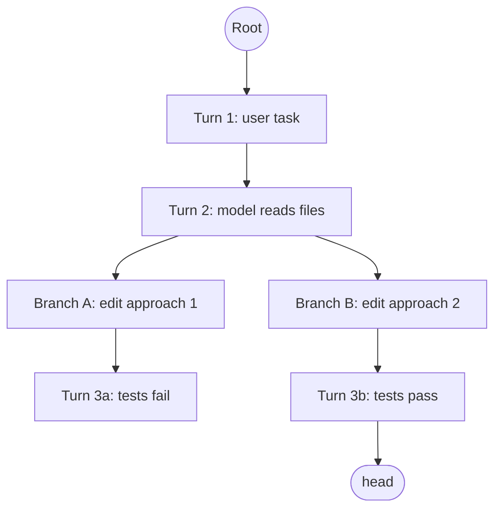
```mermaid
flowchart TD
    ROOT((Root)) --> T1[Turn 1: user task]
    T1 --> T2[Turn 2: model reads files]
    T2 --> BA[Branch A: edit approach 1]
    T2 --> BB[Branch B: edit approach 2]
    BA --> A3[Turn 3a: tests fail]
    BB --> B3[Turn 3b: tests pass]
    B3 --> HEAD([head])
```

Moving the head to Turn 2 and appending creates Branch B. Branch A stays in the log, available for replay and comparison.

### Code-Level Pattern

The reference harness's event log (`harness/core/events.py`, proposed implementation) has the same three properties at small scale: append-only, parent pointers, and a movable head.

```python
def append(self, kind: EventKind, payload: dict[str, Any]) -> Event:
    ev = Event(id=len(self._events) + 1, parent_id=self.head, kind=kind,
               payload=self.redactor(payload))           # redact before disk
    self._events[ev.id] = ev
    self.head = ev.id
    if self.path is not None:
        with self.path.open("a", encoding="utf-8") as f:
            f.write(ev.to_json() + "\n")
    for listener in self._listeners:                     # observability hook
        listener(ev)
    return ev

def checkout(self, event_id: int) -> None:               # fork / rewind
    self.head = event_id

def active_path(self) -> list[Event]:                    # root -> head
    path, cursor = [], self.head
    while cursor is not None:
        ev = self._events[cursor]
        path.append(ev)
        cursor = ev.parent_id
    return list(reversed(path))
```

The model's history is a *projection* of `active_path()` (`Session.messages()`). The projection starts at the latest `COMPACTION` event, so compaction never rewrites the log.

### Why This Design?

What event sourcing buys an agent:

- **Replay:** reconstruct exactly what the model was shown at any step. Our test reloads a log from disk and asserts the projected history is identical.
- **Debugging:** an incident review is a log query, not guesswork.
- **Recovery:** a crashed process resumes from the log, because the state *is* the log.
- **Auditability:** permission decisions are events, so "who approved this command?" has an answer.
- **Branching:** alternatives are cheap; nothing is overwritten.
- **Resumability:** with the log as the source of truth, any client can attach and catch up (see OpenCode, §XII).

### Trade-offs

| Gains | Sacrifices |
|---|---|
| Full history, replay, fork, audit | Storage grows without bound; needs retention policy |
| Condensation becomes replayable | Projection logic is a second source of bugs (what the model sees ≠ what's stored) |
| Resource-scoped parallelism | Declaring resources correctly is the tool author's burden |
| Crash-safe | More code; the paper notes loop sophistication does not predict benchmark results [HE Obs. 1] |

### What We Can Reuse

Everything structural: an append-only log, parent pointers with a movable head, redaction before disk, history as a projection, compaction as an event, permission decisions as events, and resource-keyed scheduling.

### What Not To Copy

One file per event is a deployment decision, made to suit OpenHands' remote workspace and server topology. A single JSONL file is enough for a local CLI (Pi's session is exactly that [HE §9.5]). The five-scenario stuck detector is a platform-tier investment [HE Rec. 18].

---

## X. Case Study #7 — Hermes: Budgets, Stop Guards, and Verify-on-Stop

### Architecture

Hermes (Nous Research, Python, ~642K lines) is "the fastest-growing harness on GitHub" and a hybrid: a multi-channel personal-assistant gateway (Telegram, Discord, Slack, WhatsApp, Signal, CLI) that also ships a full native coding toolset [HE §1, §4.1]. The observed mechanisms [HE §6.2, §9.5–9.6, §10.7, §11.7, §12.5]:

- **`IterationBudget`.** Thread-safe, default 90 iterations, with `execute_code` iterations refunded and "a final grace call that lets the model summarize when the budget expires".
- **Exits, not the loop body, are the design.** There are eleven enumerated turn-exit reasons and two stop-guards that can veto a premature final answer.
- **Stuck detection.** SHA-256 over tool name plus sorted-JSON arguments; "warning after two identical failures and halting after eight — but the hard stop ships disabled". The default posture is warnings appended to tool results.
- **Tool batching.** A pool of eight workers, used "only when every call is read-only-safe or path-scoped with non-overlapping prefixes".
- **Mid-turn steering.** User input is spliced into the last tool result behind an anti-injection marker.
- **Lineage compaction.** Compaction *ends the session* and rotates to a child session chained by `parent_session_id`.
- **Self-improving skills.** A background-review agent creates and patches skills from completed tasks, with a curator maintaining the collection. A Skills Hub carries trust tiers, pre-install scanning and quarantine.
- **Safety.** "config.yaml IS the security policy". A twelve-pattern hardline floor survives `--yolo`, and the YOLO variable is frozen at import. The threat model is content-borne: promptware scanning, plus `<untrusted_tool_result>` delimiters. There are no OS isolation primitives; containment is delegated to six execution backends.

### Problem It Solves

The model says **"I am done."** The harness has to ask: *do we have evidence the task is actually complete?*

### Implementation

The verify-on-stop guard "rewrites a text-only response into a continuation whenever the turn mutated code files without producing fresh verification evidence — the reflection loop's function, relocated from inside the loop to its stop condition, at a fraction of the cost" [HE §6.2].

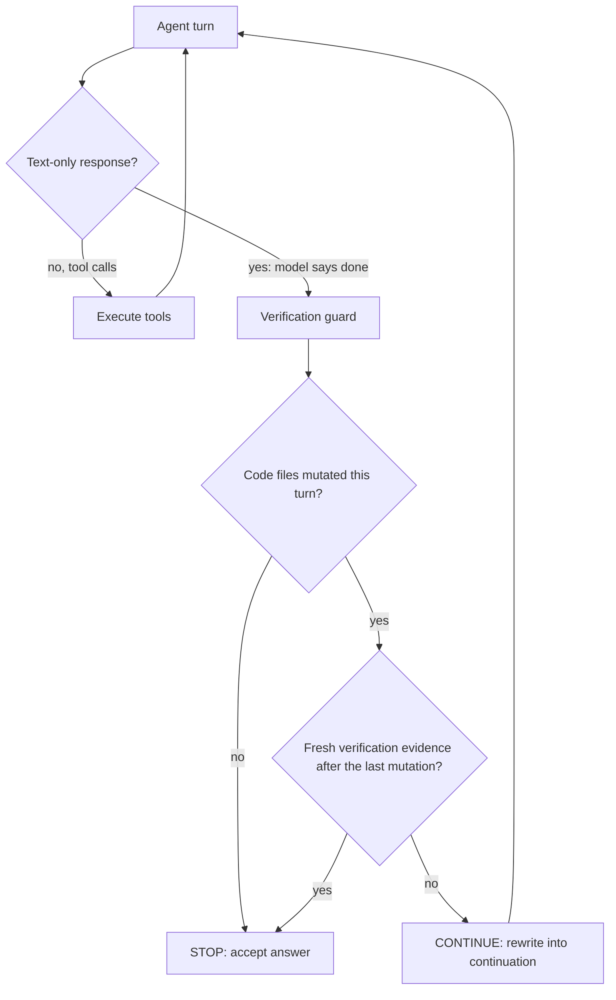
```mermaid
flowchart TD
    AG[Agent turn] --> RESP{Text-only response?}
    RESP -->|no, tool calls| TOOLS[Execute tools] --> AG
    RESP -->|yes: model says done| G[Verification guard]
    G --> M{Code files mutated this turn?}
    M -->|no| STOP[STOP: accept answer]
    M -->|yes| EV{Fresh verification evidence after the last mutation?}
    EV -->|yes| STOP
    EV -->|no| CONT[CONTINUE: rewrite into continuation]
    CONT --> AG
```

Lineage compaction:

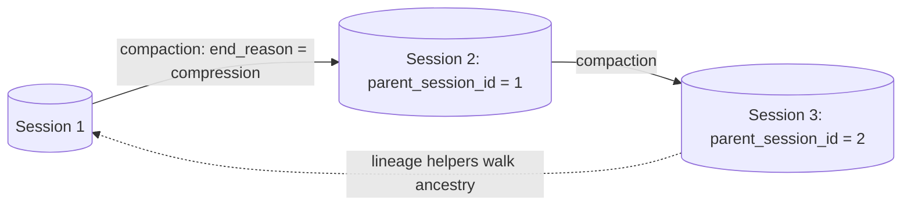
```mermaid
flowchart LR
    S1[(Session 1)] -->|"compaction: end_reason = compression"| S2[(Session 2: parent_session_id = 1)]
    S2 -->|compaction| S3[(Session 3: parent_session_id = 2)]
    S3 -.->|lineage helpers walk ancestry| S1
```

The paper gives the parameters: trigger at 50% of context minus max-tokens (64K floor), protect the first three messages plus a token-budgeted tail, and cap the iterative auxiliary-model summary at min(5% of context, 12K tokens) [HE §9.5].

### Code-Level Pattern

The reference harness's guard (`harness/verification/engine.py`, proposed implementation) generalizes Hermes' rule into two modes:

- **With validators configured:** the harness *runs* them, Aider-style deterministic signals evaluated at Hermes' position.
- **Without validators:** it applies Hermes' rule — the model must have produced a passing check after its last mutation.

Freshness uses a logical clock, so "verified *after* the last edit" is unambiguous.

```python
async def __call__(self, session: Session) -> str | None:
    st = session.state
    if not st.has_unverified_changes:              # nothing mutated since last verification
        return None
    if not self.engine.validators:                 # Hermes mode: demand evidence
        if st.last_evidence_tick > st.last_mutation_tick:
            st.mark_verified()
            return None
        evidence_msg = "You modified files but ran no passing check afterwards."
    else:                                          # harness-run mode
        results = await self.engine.run(session)
        failed = [e for e in results if not e.passed]
        if not failed:
            return None
        evidence_msg = "\n\n".join(f"[{e.validator}] FAILED\n{e.details}" for e in failed)
    st.verification_attempts += 1
    if st.verification_attempts > self.max_attempts:
        st.stop_reason = "verification_failed"     # stop, reported as UNVERIFIED - never success
        return None
    return f"<verification-failed ...>\n{evidence_msg}\n</verification-failed>\n..."
```

The loop calls it at exactly one point, when the response has no tool calls:

```python
if not resp.tool_calls:
    veto = await self.stop_guard(s) if self.stop_guard else None
    if veto:
        s.log.append(EventKind.USER_MESSAGE, {"content": veto, "synthetic": True})
        continue
    return self._finish("completed", resp.text)
```

### Why This Design?

**Why verification sometimes belongs outside the inner loop.** Inside the loop, verification competes with the model's own plan. The model decides when to run tests, and it can decide not to. At the stop boundary, verification is a *precondition of exit* that the model cannot route around. It is also cheaper than per-edit reflection: one check per claimed completion instead of one per edit.

The paper connects this to a broader outer-loop pattern. OpenHands' `/goal` judge and Hermes' guard are "harness features whose only purpose is to close an outer loop around the inner one" [HE §6.1]. It also notes Hermes is the only system that *mechanizes* the "never claim tests pass" demand that other systems express as prompt text [HE §7.3].

**Why the hard stop ships disabled** (interpretation). A false-positive halt kills a legitimate session; a warning costs a few tokens. Hermes trusts the model to read the warning.

### Trade-offs

| Gains | Sacrifices |
|---|---|
| "Done" requires evidence | Needs a definition of evidence; projects without tests need custom validators |
| Cheap: runs once per claimed completion | A bad validator (flaky test) can trap the agent; needs an attempt cap |
| Budget + grace call ends runs gracefully | Grace summary is still model-written |
| Lineage compaction never destroys history | Sessions multiply; search must dedupe across lineage |

### What We Can Reuse

- Verify-on-stop with an attempt cap.
- Report *unverified* rather than success when the cap is hit. Our loop returns `status="unverified"`, and the test asserts it.
- An iteration budget with a tool-less grace turn.
- Warn-first stuck detection.
- A hardline floor that survives YOLO.
- Untrusted-output delimiting.

### What Not To Copy

Don't copy the self-improving skill loop without review. An agent that writes its own capability bundles is an agent that writes its own future prompt, and Hermes pairs it with trust tiers, scanning and quarantine for that reason. Don't copy zero OS isolation either, unless containment is genuinely delegated to a backend you trust.

---

## XI. Case Study #8 — Pi: Minimal Core, Maximal Extensibility

### Architecture

Pi (TypeScript, v0.80.6) is "the poster child of the opposite, minimal-core countertrend" [HE §3.7]. The observed design [HE §6.2, §8.2, §10.8, §11.8, §12.1]:

- **A ~790-line functional core** "with no planner, no reflection step, no turn cap, no stuck detection, and no cost kill-switch". The loop runs until the model stops calling tools, and every one of those absences is "a documented design refusal".
- **Steering queues.** `steer()` injects messages after the current turn's tool calls. `followUp()` drains only when the agent would otherwise stop.
- **Parallel by default.** Tool calls run under `Promise.all`, with a **realpath-keyed per-file mutation queue** serializing edits to the same file.
- **Truncation-poisoning guard.** When the assistant message was cut off at the length limit, *all* of its tool calls are failed unexecuted, "because salvage-parsed streaming arguments can validate while being silently incomplete".
- **Layered recovery.** A ~40-pattern transient-error retry allowlist, and a one-shot compact-and-retry on context overflow.
- **Seven tools built, four exposed by default.** Each has a pluggable **`Operations`** interface (`BashOperations`, `EditOperations`, …): "the single remoting seam through which SSH, container, and micro-VM extensions relocate execution without touching the tools".
- **An extension host.** Runtime-loaded TypeScript modules work against an API of ~33 typed events. They span session lifecycle, tool interception (blocking and in-place argument mutation), whole-context rewriting, and raw provider I/O (`before_provider_request`, `after_provider_response`). The repo ships 78 examples that are "feature for feature, other harnesses' built-ins". Sub-agents, sandboxing and permission gates all live in extension space.
- **Session tree.** An append-only JSONL tree with id/parentId and a movable leaf pointer. `/tree`, `/fork` and `/clone` unify checkpointing, rewind and exploration [HE §9.5].

### Problem It Solves

How can a very small core support a large ecosystem? Pi's answer is that the core should own only what cannot be an extension: the loop, the event bus, the session tree, and the remoting seam.

### Implementation

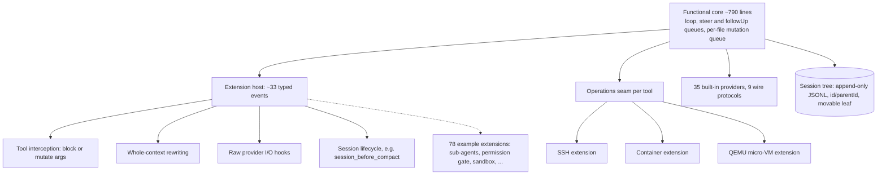
```mermaid
flowchart TD
    CORE["Functional core ~790 lines<br/>loop, steer and followUp queues, per-file mutation queue"]
    BUS["Extension host: ~33 typed events"]
    CORE --> BUS
    BUS --> TI[Tool interception: block or mutate args]
    BUS --> CTX[Whole-context rewriting]
    BUS --> PIO[Raw provider I/O hooks]
    BUS --> LIFE[Session lifecycle, e.g. session_before_compact]
    CORE --> OPS["Operations seam per tool"]
    OPS --> SSH[SSH extension]
    OPS --> CONT[Container extension]
    OPS --> VM[QEMU micro-VM extension]
    CORE --> PROV["35 built-in providers, 9 wire protocols"]
    CORE --> SESS[("Session tree: append-only JSONL, id/parentId, movable leaf")]
    BUS -.-> EXT["78 example extensions: sub-agents, permission gate, sandbox, ..."]
```

The two queues change the conversational contract. A user can redirect the agent mid-run without killing it (`steer`), or queue the next instruction for when it finishes (`followUp`).

### Code-Level Pattern

Two Pi patterns appear in the reference harness. The **truncation guard**, in `harness/llm/streaming.py` and the loop:

```python
def is_truncated(resp: ModelResponse) -> bool:
    """True when tool arguments cannot be trusted."""
    return resp.stop_reason == "max_tokens" and bool(resp.tool_calls)

# in AgentLoop.run():
if is_truncated(resp):  # never execute possibly-incomplete arguments
    for c in resp.tool_calls:
        s.log.append(EventKind.TOOL_RESULT, {"call_id": c.id, "name": c.name,
                                             "content": TRUNCATED_ERROR, "is_error": True})
    continue
```

And an **Operations-style seam**. In the reference harness, every process goes through one `CommandRunner`, so relocating execution (Bubblewrap, a container, a remote host) is a change in one place:

```python
class CommandRunner:
    async def run(self, argv, cwd=None, timeout_s=None) -> RunResult:
        ...
        full = [program, *argv[1:]]
        if self.use_bubblewrap:
            full = bubblewrap_argv(full, self.workspace)    # the seam
        proc = await asyncio.create_subprocess_exec(*full, cwd=str(cwd), env=scrubbed_env(), ...)
```

A per-file mutation queue keyed on `realpath` is what the reference scheduler's resource keys do: `path:<resolved absolute path>` with write mode serializes same-file edits and lets different files proceed.

### Why This Design?

**Engineering interpretation.** A minimal core has a small attack surface, a small review burden, and stable semantics, and the ecosystem moves without core releases. The paper notes Pi's position on security is a principled argument, not an omission: a partial in-process sandbox "would be easy to misunderstand as a security boundary", so isolation arrives as extensions (Anthropic's sandbox-runtime, a QEMU micro-VM) through the Operations seam [HE §10.8]. Similarly Pi rejects MCP ("build CLI tools with READMEs") while implementing skills. That is what broke the skills-vs-MCP tie in skills' favour, 9/11 to 8/11 [HE §12.4–12.5].

### Trade-offs

| Gains | Sacrifices |
|---|---|
| Small, auditable core; fast iteration in user space | Defaults are thin: no turn cap, no stuck detection, no sandbox out of the box |
| Every built-in of every other harness is reproducible as an extension | Safety depends on which extensions the user installs |
| Session tree unifies rewind/fork/clone | Filesystem state is *not* restored on branch navigation [HE §9.5] |
| Steering without interruption | Extensions with raw provider I/O access are powerful and risky |

### What We Can Reuse

The truncation guard (cheap, clearly correct). Per-resource mutation serialization. One execution seam. Steering as an explicit queue rather than an interrupt. A hook API with veto and argument mutation; ours has `block` and `updated_args`.

### What Not To Copy

Pi's posture is deliberately "no turn cap, no cost kill-switch". That is a defensible stance for an expert's personal harness and a poor default for anything unattended. The paper's own MVH ships a turn limit and a cost cap [HE §16.10]. **Harness mimicry** — presenting another vendor's client identity to ride a consumer subscription [HE §7.1] — is documented by the paper as observed behaviour. It is not a pattern to adopt; it raises obvious terms-of-service questions.

---

## XII. Case Study #9 — OpenCode: The Harness as a Server

### Architecture

OpenCode (TypeScript, v1.17.18, the most-starred dedicated coding agent at ~184k stars) has "the corpus's most thoroughgoing client/server architecture" [HE §1]. Observed [HE §6.2, §7.2, §7.4, §10.9, §14.1]:

- **An embedded HTTP server** publishing an OpenAPI spec and a generated SDK. Every UI is a client: TUI, desktop, web, IDE plugin, CI action. Roughly three-fifths of the non-test source is client code.
- **Persisted streaming.** Token-granular part deltas are persisted and re-served over SSE "so every client (TUI, web, IDE) replays the same stream".
- **A log-as-queue loop.** A literal `while(true)` where "the message log doubles as the work queue": pending sub-agent spawns and compactions are persisted message parts dequeued one per iteration, "which makes the loop trivially resumable across process restarts, since the queue is the transcript".
- **Retry and limits.** No default step cap; when a configured cap is reached, the harness appends an assistant message declaring tools disabled. Retry is harness-level with retry-after-aware exponential backoff. Context overflow is never retried; it flips to compaction.
- **Doom-loop detection through permissions.** Three consecutive byte-identical tool calls raise a `doom_loop` permission ask: "the user, not the harness, decides whether the repetition is a bug".
- **Syntax-aware permissioning** (below), with a permissive default (`"*": allow` inside the project).
- **LSP diagnostics.** About 25 auto-downloaded LSP servers feed diagnostics into edit results.
- **A model-family prompt matrix.** Nine base prompts dispatched by model-id substring. The system prompt is capped at two messages, matching the two cache-breakpoint slots it emits **in six providers' cache dialects simultaneously** (cache-dialect fanout).

### Problem It Solves

A harness embedded in a TUI is a harness you can only drive from a TUI. OpenCode separates the runtime from every presentation layer, which makes the agent embeddable (IDE, CI, web) and resumable.

### Implementation

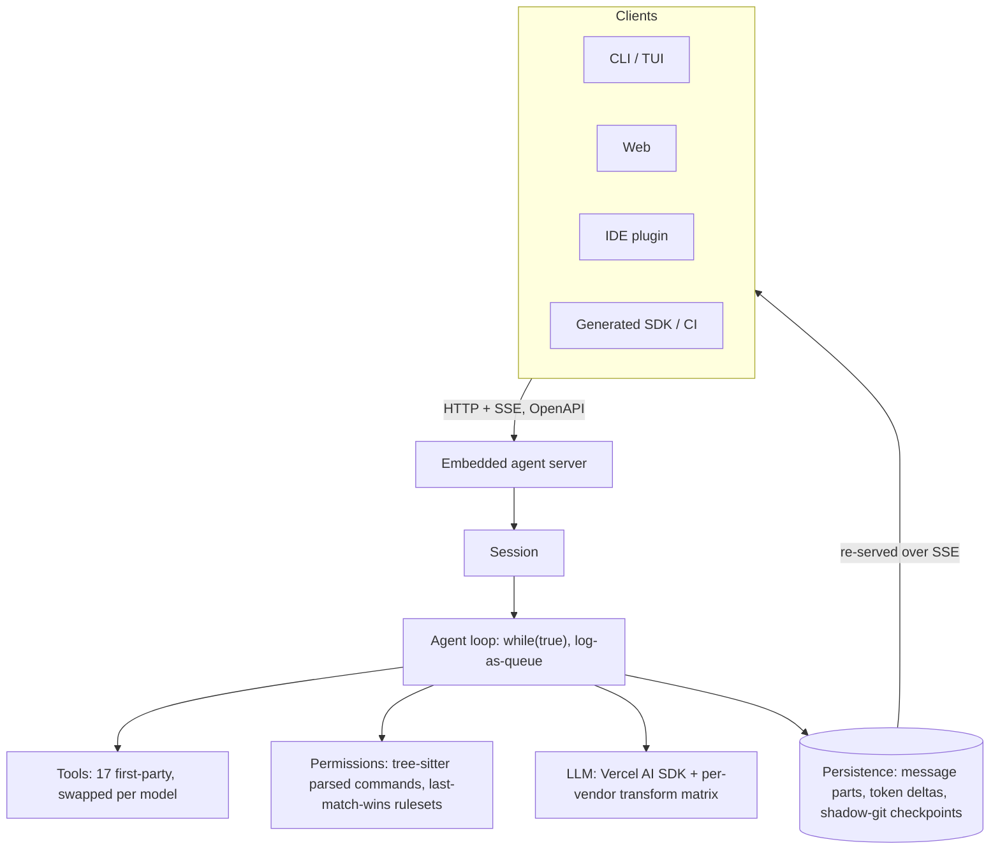
```mermaid
flowchart TD
    subgraph CLIENTS[Clients]
        TUI[CLI / TUI]
        WEB[Web]
        IDE[IDE plugin]
        SDKC[Generated SDK / CI]
    end
    CLIENTS -->|HTTP + SSE, OpenAPI| SRV[Embedded agent server]
    SRV --> SESSION[Session]
    SESSION --> LOOP["Agent loop: while(true), log-as-queue"]
    LOOP --> TOOLS[Tools: 17 first-party, swapped per model]
    LOOP --> PERM["Permissions: tree-sitter parsed commands, last-match-wins rulesets"]
    LOOP --> LLMS["LLM: Vercel AI SDK + per-vendor transform matrix"]
    LOOP --> PERSIST[(Persistence: message parts, token deltas, shadow-git checkpoints)]
    PERSIST -->|re-served over SSE| CLIENTS
```

**Syntax-aware command permissioning** [HE §10.9]:
- Every bash command is parsed with web-tree-sitter (bash and PowerShell grammars), and the exact command text becomes the ask pattern.
- "Always allow" grants are scoped by a ~130-entry, LLM-generated command-arity dictionary (`git`→2, `npm run`→3), producing grants like `git commit *` rather than blanket approval.
- File-manipulating commands get their argument paths resolved, and out-of-project paths raise `external_directory` asks.
- Rules are `{permission, pattern, action}` with last-match-wins over glob wildcards, layered defaults → built-in agent → user config → per-agent → per-session.
- Denying `"*"` for a tool removes it from the LLM's view entirely: tool availability itself is permission-derived.

### Code-Level Pattern

Client/server in the reference harness (`harness/interface/server.py`, proposed implementation) is deliberately thin. Clients never talk to the loop; they read the event log the loop writes:

```python
def do_GET(self) -> None:
    ...
    after = int(parse_qs(url.query).get("after", ["0"])[0])
    harness, done = server.sessions[parts[1]]
    events = [{"id": e.id, "kind": e.kind.value, "payload": e.payload}
              for e in harness.session.log.all_events() if e.id > after]
    self._send(200, {"events": events, "done": done.is_set()})
```

Arity-scoped grants (`harness/safety/policy.py`):

```python
ARITY = {("git",): 2, ("npm", "run"): 3, ("python", "-m"): 3, ("pytest",): 1}

def grant_key(argv: list[str]) -> tuple[str, ...]:
    for prefix, n in sorted(ARITY.items(), key=lambda kv: -len(kv[0])):
        if tuple(argv[: len(prefix)]) == prefix:
            return tuple(argv[:n])
    return tuple(argv[:1])
# "always allow" on `python -m unittest -q` grants `python -m unittest *`, not `python *`
```

### Why This Design?

**Engineering interpretation.** Separating the harness runtime from the UI changes three things:

1. **State moves to the server.** The session must be serializable, so persistence stops being optional.
2. **Resumability becomes nearly free.** If the queue *is* the transcript, restart is "read the log and continue".
3. **Approvals become a protocol.** A human approving from an IDE is just another client message.

The paper reads this as part of the platform turn: "a runtime with clients, SDKs, and hosted tiers is not a tool with an ecosystem; it is a platform with distribution" [HE §14.1].

### Trade-offs

| Gains | Sacrifices |
|---|---|
| One runtime, many front-ends; CI and IDE for free | A server is attack surface; needs auth beyond localhost |
| Crash-resumable loop | No OS isolation: "policy-only" [HE Table 8] |
| Fine-grained, explainable grants | Permissive default (`"*": allow`); headless runs auto-reject asks |
| Six cache dialects at once | A ~1,400-line per-vendor transform matrix to maintain [HE §7.1] |

### What We Can Reuse

Event log as the client protocol. Arity-scoped grants. Doom-loop-to-ask as a human-in-the-loop alternative to auto-abort. Overflow-to-compaction instead of retry. Permission-derived tool visibility. LSP diagnostics in edit results.

### What Not To Copy

Uncapped steps and uncapped parallelism as defaults. Also note one detail the paper records: OpenCode's edit-tool description claims read-before-edit enforcement, "but no runtime read-tracking exists in the tool's source; the description overclaims, a reminder that prompt text is a behavioral wish, not a mechanism" [HE §7.3]. The reference harness enforces it in code and tests it.

---

## XIII. Case Study #10 — Mistral Vibe: Turn-Level Middleware

### Architecture

Mistral Vibe (Python, v2.19.1) runs an async/await iterative loop "in which turn-level policies are factored out into a composable middleware pipeline" [HE §6.2]. Each iteration first walks a stack of middleware pre-turn checks, then yields events to the caller as they complete. Six middlewares ship:

| Middleware | Policy |
|---|---|
| `TurnLimitMiddleware` | cap turns |
| `PriceLimitMiddleware` | cost cap per session |
| `TokenLimitMiddleware` | session-total token cap |
| `AutoCompactMiddleware` | summarize at a token threshold |
| `ContextWarningMiddleware` | warn as the conversation nears the window limit |
| `ReadOnlyAgentMiddleware` | gate write tools for read-only profiles |

User cancellation is handled inline, not as a middleware. Tool calls within a response run concurrently as `asyncio.create_task()` tasks, with events yielded as they finish. **The same loop powers six registered agent profiles** (default, plan, accept-edits, auto-approve, explore, lean) "simply by swapping the middleware composition" [HE §6.2]. Plan mode is structural: a plan file is the profile's only writable target, and `exit_plan_mode` emits a `PlanReviewRequestedEvent` that gates the return to write-capable profiles.

Compaction runs as middleware. The routine re-injects prior user messages into the compacted envelope "so original task goals survive resets", falls back to a tool-less summarizer, and fires reactively on mid-turn overflow [HE §9.5]. A `RewindManager` checkpoints the filesystem per user message.

### Problem It Solves

Turn-level policies multiply: limits, budgets, compaction, warnings, mode gates. Inlined into the loop body, each one is a branch that interacts with every other branch. Multiple agent profiles make it worse. Without middleware, every profile is an `if` in the loop.

### Implementation

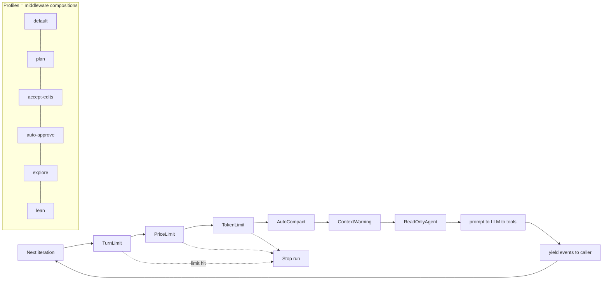
```mermaid
flowchart LR
    START[Next iteration] --> M1[TurnLimit] --> M2[PriceLimit] --> M3[TokenLimit] --> M4[AutoCompact] --> M5[ContextWarning] --> M6[ReadOnlyAgent]
    M6 --> CORE[prompt to LLM to tools]
    CORE --> EV[yield events to caller]
    EV --> START
    M1 -.->|limit hit| STOP[Stop run]
    M2 -.-> STOP
    M3 -.-> STOP
    subgraph PROFILES["Profiles = middleware compositions"]
        P1[default] --- P2[plan] --- P3[accept-edits] --- P4[auto-approve] --- P5[explore] --- P6[lean]
    end
```

### Code-Level Pattern

The reference harness's middleware interface (`harness/core/middleware.py`, proposed implementation) is one method returning an optional action:

```python
@dataclass
class TurnAction:
    stop: str | None = None     # end the run with this reason
    inject: str | None = None   # append a synthetic user message first

@dataclass
class CostLimit:
    max_usd: float

    async def before_turn(self, loop) -> TurnAction | None:
        if loop.session.state.cost_usd >= self.max_usd:
            return TurnAction(stop=f"cost_limit(${self.max_usd:.2f})")
        return None
```

The loop never knows which policies exist:

```python
for mw in self.middlewares:
    action = await mw.before_turn(self)
    if action and action.stop:
        return self._finish(action.stop)
    if action and action.inject:
        s.log.append(EventKind.USER_MESSAGE, {"content": action.inject, "synthetic": True})
```

### Why This Design?

This is the standard middleware argument (web frameworks, RPC interceptors) applied to an agent turn. Policies are orthogonal to the loop body, composable per profile, and testable in isolation. The paper turns it into Recommendation 1: "once you need three or more independent turn-level policies … adopt Mistral Vibe's middleware pipeline pattern — each policy becomes a composable middleware, not a new branch in the loop body" [HE §16.1]. The middleware design is "unique in the corpus" [HE §6.2].

### Trade-offs

| Gains | Sacrifices |
|---|---|
| New policies without touching the loop | Ordering between middlewares becomes a configuration concern |
| Profiles become data | Pre-turn checks can't see mid-turn events; per-call policy still needs the permission layer |
| Easy to test one policy at a time | Another indirection to trace when debugging |

### What We Can Reuse

The interface exactly as above. In the reference harness `TurnLimit`, `TokenLimit`, `CostLimit`, `AutoCompact` and `ContextWarning` are middlewares. Read-only mode is the `PLAN` policy mode, enforced *per call* in the executor, so it shows up in the audit log. That is a deliberate deviation: a pre-turn check can't stop a write the model requests mid-turn, but the policy engine can. Compaction keeps Vibe's two trigger paths, proactive threshold and reactive overflow, sharing one routine.

### What Not To Copy

Don't use middleware for anything that needs per-call granularity, such as permissions or path rules. Mistral Vibe itself gates writes through a separate five-level permission hierarchy, not only through middleware [HE §10.6].

---

## XIV. Case Study #11 — OpenClaw: The Harness Concept Beyond Coding

### Architecture

OpenClaw (TypeScript, v2026.6.11) is the paper's external contrast point. Its README describes "a personal AI assistant gateway, not a coding agent", spanning 20+ messaging platforms (WhatsApp, Slack, Discord, Signal, iMessage, Matrix, …), and it "ships no native code-editing tool" [HE §4.1]. Observed:

- **Gateway delegation.** Coding tasks are delegated to dedicated SWE agents through plugins (`opencode`, `kimi-coding`, `github-copilot`, `copilot-proxy`) [HE §4.1].
- **A plugin architecture**, the most mature in the corpus. It is manifest-driven (`openclaw.plugin.json`), loaded dynamically via `jiti`, with typed contracts:
  - channel plugins (`ChannelEntry`: receive, send, status, configure);
  - provider plugins (`ProviderEntry`: inference stream);
  - skill plugins.

  Strict import boundaries apply: plugins may import only the public SDK surface [HE §12.1].
- **ACP.** A translator bridges the gateway wire protocol to agent processes. Sub-agents are child processes with RPC binding and their own JSONL transcripts, communicating through ACP delta events [HE §11.10].
- **Active Memory.** A plugin runs a dedicated memory sub-agent immediately before the main reply [HE §9.6]. OpenClaw is the one system with embeddings on by default (hybrid sqlite-vec KNN + FTS5/BM25), and only for chat recall, never for code [HE §13.2].
- **Safety.** Scope-based authorization (operator/node roles over namespaced scopes), per-IP/token rate limiting, SSRF policy, DM allowlists with pairing approval, exec approval gates, and a 2 MB `MAX_PROMPT_BYTES` limit [HE §10.4].

### Problem It Solves

How do you put one assistant behind many channels and many capabilities, *without* re-implementing each capability? OpenClaw consumes coding agents rather than being one.

### Implementation

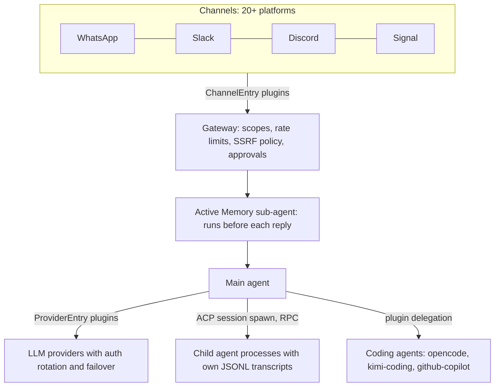
```mermaid
flowchart TD
    subgraph CH[Channels: 20+ platforms]
        WA[WhatsApp] --- SL[Slack] --- DC[Discord] --- SG[Signal]
    end
    CH -->|ChannelEntry plugins| GW["Gateway: scopes, rate limits, SSRF policy, approvals"]
    GW --> AM[Active Memory sub-agent: runs before each reply]
    AM --> AGENT[Main agent]
    AGENT -->|ProviderEntry plugins| PROV[LLM providers with auth rotation and failover]
    AGENT -->|ACP session spawn, RPC| SUBS[Child agent processes with own JSONL transcripts]
    AGENT -->|plugin delegation| SWE["Coding agents: opencode, kimi-coding, github-copilot"]
```

### Code-Level Pattern

The pre-reply memory sub-agent, sketched with the reference coordinator. This illustrates the pattern, not OpenClaw's code; `MEMORY_AGENT` would be a read-only `AgentSpec` you define (the reference harness ships explorer, implementer and verifier):

```python
async def reply(user_msg: str, coordinator, main_harness):
    recall = await coordinator.run_worker(MEMORY_AGENT, f"What do we know that is relevant to: {user_msg}")
    return await main_harness.run(f"<recalled-memory>\n{recall.summary}\n</recalled-memory>\n\n{user_msg}")
```

### Why This Design?

**Engineering interpretation.** OpenClaw shows that the seven subsystems are not specific to coding. A gateway still needs a loop, LLM integration, tools (channel actions), memory, safety (scopes and rate limits instead of sandboxes), orchestration (ACP spawn) and extensibility (plugins). What changes is the dominant threat model and the tool surface. The paper includes it precisely to separate "extensibility patterns that are SWE-specific from those that belong to a broader agentic-platform category" [HE §4.1], and reports both 11-system and 10-coding-harness counts for that reason.

### Trade-offs

| Gains | Sacrifices |
|---|---|
| One assistant, many channels and capabilities | Code quality is whatever the delegated agent provides |
| Strict plugin boundaries | A Zod config with "hundreds of nested structures" [HE §12.3] |
| Memory sub-agent keeps recall out of the main prompt until needed | An extra model call before every reply |

### What We Can Reuse

Delegation to specialized harnesses over a protocol. Import-boundary discipline for plugins. Pre-turn agentic recall *as an option* when memory is large.

### What Not To Copy

The embedding-on-by-default memory is a reasonable choice for chat history. It is not evidence for embeddings over code, which no studied system uses (§XVII).

---

## XV. The Meta-Harness — Omnigent

### Agent harness versus meta-harness

A harness wraps a *model*. A meta-harness wraps *harnesses*. Omnigent (Databricks, open-sourced June 2026, Apache 2.0, ~1M lines, ~312K of production Python) "is not a twelfth harness; it is a bet that the harness has become a commodity component and that the durable value sits one layer up" [HE §14.4]. It "implements no editing loop of its own", so the paper treats scoring it on the seven dimensions as "a category error" [HE §4.1].

Observed:

- **Topology.** Four process tiers: server ⇄ host daemon ⇄ runner ⇄ per-conversation harness subprocess. The adapter boundary is "a recursive subset of Omnigent's own public REST API".
- **Adapters.** A registry of 23 canonical harness adapters (Claude Code, Codex, Cursor, OpenCode, Hermes, Pi, Goose, Qwen, Kimi, Kiro, Copilot, Antigravity, …) across five integration modes: `sdk-in-process`, `cli-subprocess`, `acp-subprocess`, `native-tui`, `native-server`.
- **A conformance bench** that probes basic turns, tool calling, streaming, interrupts, model override and policy denial. "Harnesses are tested like hardware."
- **What it adds above the boundary:**
  - *composition* — any harness can be a sub-agent of any other;
  - *cross-harness policy* — session → agent → admin levels; CEL, Python or LLM-classifier evaluators; enforced through each vendor's own hooks or ACP permission requests, fail-closed;
  - *a uniform sandbox and egress stack* — including an L7 MITM egress proxy with a secretless credential proxy;
  - *shareable sessions* — multi-device sync, ACLs, review comments, fork, and mid-session harness switching.
- **Polly**, its flagship example, is a Claude Code-brained orchestrator that writes no code. It fans work out to six vendor harnesses in per-task git worktrees, and its prompt mandates that the reviewer be a different vendor than the implementer.

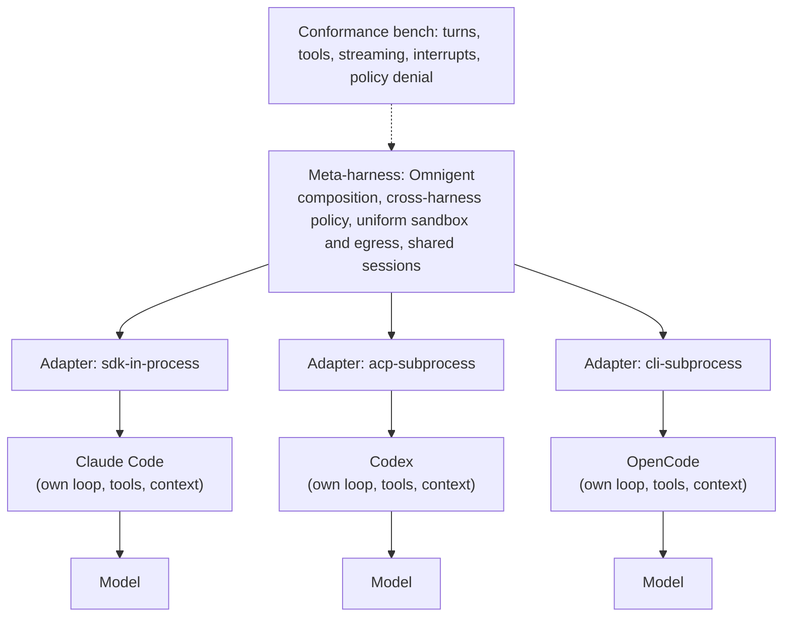
```mermaid
flowchart TD
    MH["Meta-harness: Omnigent<br/>composition, cross-harness policy, uniform sandbox and egress, shared sessions"]
    MH --> A1[Adapter: sdk-in-process]
    MH --> A2[Adapter: acp-subprocess]
    MH --> A3[Adapter: cli-subprocess]
    A1 --> H1["Claude Code<br/>(own loop, tools, context)"]
    A2 --> H2["Codex<br/>(own loop, tools, context)"]
    A3 --> H3["OpenCode<br/>(own loop, tools, context)"]
    H1 --> M1[Model]
    H2 --> M2[Model]
    H3 --> M3[Model]
    BENCH[Conformance bench: turns, tools, streaming, interrupts, policy denial] -.-> MH
```

### Why this matters for the platformization thesis

The paper's thesis is that in the first half of 2026 "the coding harness completed a turn from tool to platform" [HE §1, §14]. The meta-harness is the strongest evidence:

- **It re-implements the expensive parts.** Sandbox and policy are paid "a second time, one layer up".
- **It arbitrages the proprietary parts.** Each vendor's hooks and session stores become its adapter surface.

Equally informative is what it *doesn't* factor out. It implements no editing loop, repository context or edit strategy (the D3/D4 core stays below the line). It applies sandboxing inconsistently by design, wrapping the Claude CLI in its own sandbox while delegating to Codex's native modes. The paper takes this as "evidence that OS-level isolation resists being factored out as a shared service" [HE §14.4]. And the twin absences hold here too: no agentic framework and no RAG, except that its baseline dependencies are `claude-agent-sdk` and `openai-agents`. The frameworks of 2026 are harness SDKs [HE §14.2].

**Engineering interpretation.** If you build a harness today, assume something may host it. Expose a clean session API, honour interrupts, surface permission requests as protocol messages, and keep hooks stable. The paper's Recommendation 13 is to ship an ACP server because it "makes your harness consumable by hosts and meta-orchestrators" [HE §16.7].

---

## XVI. The Pattern Catalog: 29 Patterns, Seven Engineering Categories

The paper catalogs 29 recurring design patterns across the eleven systems: seventeen from its April edition with updated membership, plus twelve contributed or crystallized by the July corpus [HE §13.1, Tables 11–12]. Below they are regrouped by the engineering problem they solve. For each: the problem, the naive approach, the production approach, who uses it (per the paper), why it works, the trade-off, and where to find a minimal version in the reference harness.


```mermaid
flowchart TD
    ROOT[29 harness patterns]
    ROOT --> CF[Control flow]
    ROOT --> CX[Context and memory]
    ROOT --> TL[Tools and editing]
    ROOT --> ST[State and sessions]
    ROOT --> LI[LLM integration]
    ROOT --> EX[Extensibility]
    ROOT --> SA[Safety]
    CF --> CF1[Middleware pipeline] & CF2[Reflection loop] & CF3[Outer verification loop] & CF4[Stuck detection] & CF5[Recursive composition] & CF6[Template method]
    CX --> CX1[JIT repo context] & CX2[LLM summarization] & CX3[Lineage compaction] & CX4[Context forking] & CX5[Agent-maintained memory]
    TL --> TL1[Deferred loading] & TL2[Polymorphic edits] & TL3[Protocol interfaces]
    ST --> ST1[Event sourcing] & ST2[Session-tree version control] & ST3[Turn-level checkpoint] & ST4[Client/server harness]
    LI --> LI1[Prompt caching] & LI2[Model-family prompt matrix] & LI3[Cache-dialect fanout] & LI4[Harness mimicry]
    EX --> EX1[Skills] & EX2[Conditional activation] & EX3[Self-improving skill loop] & EX4[Minimal core / extension host]
    SA --> SA1[Policy-as-code] & SA2[Syntax-aware command permissioning] & SA3[Untrusted-content delimiting]
```

### XVI.1 Control flow

**Middleware pipeline** — *Mistral Vibe*
- *Problem:* turn-level policies (limits, compaction, warnings) multiply and tangle the loop.
- *Naive:* `if` branches in the loop body.
- *Production:* a pre-turn stack of composable middlewares, with profiles as compositions.
- *Why it works:* policies are orthogonal to the loop and testable alone.
- *Trade-off:* ordering becomes configuration, and it's blind to mid-turn events.
- *Sketch:* `harness/core/middleware.py`.

**Reflection loop** — *Aider; cousins: Gemini CLI edit fixer, OpenCode LSP feedback*
- *Problem:* edits that look right but don't parse, lint or pass tests.
- *Naive:* "please double-check your work".
- *Production:* deterministic signals (syntax, compile, lint, tests) become the next prompt, bounded to N reflections.
- *Why it works:* the feedback is independent of the model and points at a location.
- *Trade-off:* costs a check per iteration.
- *Sketch:* `harness/verification/reflection.py`.

**Outer verification loop** — *OpenHands (`/goal` judge + critics), Hermes (verify-on-stop)*
- *Problem:* premature "done".
- *Naive:* trust the final message.
- *Production:* a scaffold-level guard or judge that vetoes the exit when evidence is missing.
- *Why it works:* verification becomes a precondition of exit, not a suggestion.
- *Trade-off:* needs a definition of evidence and an attempt cap.
- *Sketch:* `VerifyOnStop` in `harness/verification/engine.py`.

**Stuck detection** — *OpenHands (5 scenarios), Gemini CLI (hash + LLM), Hermes (warn-first signatures), OpenCode (doom-loop ask), Mini-SWE-Agent (format-error cap)*
- *Problem:* repeated identical actions burn budget.
- *Naive:* rely on the turn cap.
- *Production:* hash call signatures; warn, ask, or abort at thresholds.
- *Why it works:* the common failure is the exact repeat, which is cheap to detect.
- *Trade-off:* misses near-duplicates; false halts kill good sessions.
- *Sketch:* `harness/core/stuck.py`.

**Recursive composition** — *Claude Code, Codex, OpenHands, OpenClaw; config-gated in Hermes, opt-in in OpenCode*
- *Problem:* breadth-first exploration overflows one context.
- *Naive:* one long session.
- *Production:* sub-agents with forked or linked context, filtered tools, structured results.
- *Why it works:* parallel context isolation, with the parent receiving only summaries.
- *Trade-off:* token cost (≈15× chat, per Anthropic's report cited in [HE §3.6]) and coordination failures.
- *Sketch:* `harness/orchestration/`.

**Template method** — *Aider (`Coder`), OpenHands (`Agent`)*
- *Problem:* several agent variants share a flow but differ in parsing and formatting.
- *Naive:* copy-paste loops.
- *Production:* a base class owns the flow, and subclasses override parse/format hooks.
- *Why it works:* variants stay consistent.
- *Trade-off:* inheritance hierarchies resist change.
- *Sketch:* our equivalent is composition: one `AgentLoop`, with behaviour injected through components.

### XVI.2 Context and memory

**JIT repo context** — *Claude Code, Codex, Gemini CLI, Mistral Vibe, Hermes, Pi, OpenCode, OpenHands*
- *Problem:* project conventions must reach the model without bloating every prompt.
- *Naive:* paste everything up front.
- *Production:* hierarchical Markdown context files (AGENTS.md, CLAUDE.md, GEMINI.md). The root goes in the prompt; nested files are attached when a tool touches their subtree.
- *Why it works:* relevance is decided by where the agent actually works.
- *Trade-off:* context files are an injection surface (Hermes scans them; Pi explicitly accepts the risk).
- *Sketch:* `harness/context/repo_context.py`.

**LLM summarization** — *9 systems (all but Mini-SWE-Agent; Aider partial)*
- *Problem:* history exceeds the window.
- *Naive:* truncate the oldest messages.
- *Production:* threshold-triggered summary with a verbatim tail; incremental merge with the previous summary (Pi, OpenCode); task re-injection (Mistral Vibe); reactive firing on overflow.
- *Why it works:* it keeps decisions while dropping transcript bulk.
- *Trade-off:* summary fidelity, plus an extra model call.
- *Sketch:* `harness/context/compaction.py`.

**Lineage compaction** — *Hermes*
- *Problem:* compaction destroys history.
- *Naive:* rewrite the transcript in place.
- *Production:* compaction ends the session and rotates to a child chained by `parent_session_id`.
- *Why it works:* context management and persistence become one mechanism, and "no history is ever destroyed" [HE §9.5].
- *Trade-off:* session search must dedupe across lineage.
- *Sketch:* our `COMPACTION` event achieves the same no-destruction property within one log.

**Context forking** — *Claude Code, Codex, Hermes (cache-sharing background fork)*
- *Problem:* children need some parent context, but must not corrupt parent state.
- *Naive:* share the message list.
- *Production:* fork along explicit dimensions (abort linkage, file cache, permissions, history mode).
- *Why it works:* isolation by construction.
- *Trade-off:* getting each dimension right is subtle.
- *Sketch:* `harness/orchestration/worker.py` (`inherited_messages`, `linked_cancel`).

**Agent-maintained memory** — *Codex (two-phase, git-baselined); human-gated variant in Gemini CLI*
- *Problem:* knowledge should persist across sessions.
- *Naive:* append everything to a file.
- *Production:* a background sub-agent extracts and consolidates memories over a versioned store, optionally through a human review inbox.
- *Why it works:* curation scales.
- *Trade-off:* an agent is writing your future prompts; governance is the real design choice (Observation 5).
- *Sketch:* the reference ships the *bounded* model-direct variant (`harness/context/memory.py`, Hermes-style frozen snapshot).

### XVI.3 Tools and editing

**Deferred loading** — *Claude Code, Codex (BM25 `tool_search`), Hermes (BM25 bridge tools), + 8 skills implementations*
- *Problem:* tool schemas eat the prompt.
- *Naive:* send every schema every turn.
- *Production:* hide deferred tools and expose a search/select tool; loaded schemas join the next request.
- *Why it works:* most tools are irrelevant most turns.
- *Trade-off:* an extra turn to discover a tool; worth it above ~15 tools [HE Rec. 4].
- *Sketch:* `ToolRegistry.search`, `harness/tools/builtins/meta.py`.

**Polymorphic edits** — *Aider (prompt factory), OpenCode (tool registry)*
- *Problem:* models differ in which edit format they produce reliably.
- *Naive:* one format for all models.
- *Production:* select the edit format or toolset per model.
- *Why it works:* it matches the format to the model's output habits.
- *Trade-off:* N formats to maintain and test.
- *Sketch:* swap `FS_TOOLS` entries per model in `build_harness`.

**Protocol interfaces** — *Mini-SWE-Agent (Python protocols), Pi (per-tool Operations seam)*
- *Problem:* components must be swappable.
- *Naive:* inheritance or hard-coded classes.
- *Production:* structural typing or a single seam.
- *Why it works:* zero registration cost.
- *Trade-off:* no discovery or metadata.
- *Sketch:* the `Model`, `Validator`, `Approver` and `ToolServer` protocols.

### XVI.4 State and sessions

**Event sourcing** — *OpenHands; Pi (session log-as-tree); OpenCode (log-as-queue)*
- *Problem:* crash recovery, audit, replay.
- *Naive:* a mutable message list.
- *Production:* an append-only event log, with history as a projection.
- *Why it works:* state is derivable, so recovery is replay.
- *Trade-off:* storage growth, and projection bugs.
- *Sketch:* `harness/core/events.py`, `Session.messages()`.

**Session-tree version control** — *Pi; OpenHands (conversation tree)*
- *Problem:* "try a different approach" without losing the first.
- *Naive:* start over.
- *Production:* parent pointers with a movable head; fork, rewind and branch summaries.
- *Why it works:* exploration is never lost.
- *Trade-off:* Pi explicitly does not restore the filesystem on branch moves.
- *Sketch:* `EventLog.checkout()`.

**Turn-level checkpoint** — *Mistral Vibe (per user message), OpenCode (shadow-git per step), Hermes (shadow-git store), Pi (conversation-only)*
- *Problem:* undo file changes, not just conversation.
- *Naive:* rely on the user's git.
- *Production:* snapshot the filesystem per turn or step (OpenCode uses a separate `--git-dir` over the real worktree).
- *Why it works:* conversation and filesystem revert together.
- *Trade-off:* disk and time per snapshot.
- *Sketch:* not implemented in the reference; a shadow-git snapshot hook on `POST_TOOL_USE` for write tools is the natural place.

**Client/server harness** — *OpenCode; OpenHands (agent server)*
- *Problem:* one runtime, many front-ends.
- *Naive:* the UI and the loop in one process.
- *Production:* an embedded API server; every UI is a client; persisted parts are re-served.
- *Why it works:* embeddability and resumability.
- *Trade-off:* auth and attack surface.
- *Sketch:* `harness/interface/server.py`.

### XVI.5 LLM integration

**Prompt caching** — *Claude Code, Codex, OpenHands (cache tiers), Hermes (prefix normalization), Pi (breakpoints + TTL), OpenCode (dialect fanout)*
- *Problem:* re-paying for the same prefix every turn.
- *Naive:* rebuild the prompt with a timestamp.
- *Production:* a byte-stable static prefix, a dynamic suffix after the boundary, date-only timestamps, sorted JSON (Hermes normalizes for bit-perfect prefixes).
- *Why it works:* provider prefix caches hit.
- *Trade-off:* the prompt structure serves the cache, not just the logic.
- *Sketch:* `SystemPrompt(static, dynamic)`; a test asserts the static part is identical across turns.

**Model-family prompt matrix** — *Codex (server catalog), OpenCode (9 prompts), Hermes (gated blocks)*
- *Problem:* one prompt doesn't fit every model.
- *Naive:* one prompt.
- *Production:* distinct base prompts or blocks per model family or generation; Hermes cites observed per-model failures in comments.
- *Why it works:* it addresses model-specific failure modes.
- *Trade-off:* a combinatorial maintenance and test matrix.
- *Sketch:* key `STATIC_PREAMBLE` by model name.

**Cache-dialect fanout** — *OpenCode*
- *Problem:* a multi-provider harness wants caching everywhere.
- *Naive:* cache only on one provider.
- *Production:* emit all providers' cache-control dialects simultaneously; cap the system prompt to match breakpoint slots.
- *Why it works:* one code path for all.
- *Trade-off:* coupling to six providers' cache semantics.
- *Sketch:* adapter-level; not in the reference.

**Harness mimicry** — *Pi*
- *Problem (as Pi frames it):* use a consumer subscription backend.
- *Production:* present a first-party harness's identity on the wire.
- **Not recommended.** The paper documents it as an observed pattern. Copying another vendor's client identity raises terms-of-service concerns and breaks when the vendor changes its checks. It is listed here for completeness, and the reference harness does not implement it.

### XVI.6 Extensibility

**Skills (capability bundles)** — *9 systems (all but Aider, Mini-SWE-Agent)*
- *Problem:* package procedural knowledge without code.
- *Naive:* a giant system prompt.
- *Production:* `SKILL.md` directories with YAML frontmatter; metadata eager, body on demand (8 of 9 adopters).
- *Why it works:* progressive disclosure keeps the prompt small.
- *Trade-off:* supply chain. Hermes uses trust tiers, scanning and quarantine; OpenClaw uses provenance verification.
- *Sketch:* `harness/extensions/skills.py`.

**Conditional activation** — *Claude Code (`paths`), OpenHands (PathTrigger), OpenClaw (`requires`)*
- *Problem:* irrelevant skills pollute the prompt.
- *Naive:* list them all.
- *Production:* activate on file touch, or filter by environment requirements.
- *Why it works:* it pushes JIT context into the extension layer, "a structural advance over MCP, which treats every connected server symmetrically" [HE §12.5].
- *Trade-off:* hidden coupling between paths and skills.
- *Sketch:* `SkillRegistry.on_file_touched`, `requires` gating.

**Self-improving skill loop** — *Hermes; partial: Gemini CLI (extraction inbox)*
- *Problem:* lessons from completed tasks are lost.
- *Naive:* nothing persists.
- *Production:* an agent authors and patches skills, curated (Hermes) or human-reviewed (Gemini CLI).
- *Why it works:* capability compounds.
- *Trade-off:* the agent writes its own future instructions. Human review is the conservative default.
- *Sketch:* not implemented; an extraction worker writing to a review directory is the safe first step.

**Minimal core / extension host** — *Pi*
- *Problem:* the core grows without bound.
- *Naive:* ship every feature built in.
- *Production:* a tiny core plus a typed event bus; safety, sub-agents and plan mode live in extensions.
- *Why it works:* a small trusted core and an ecosystem that moves without releases.
- *Trade-off:* thin defaults.
- *Sketch:* `HookBus` + `PluginAPI`.

> **Related mechanisms outside the 29.** MCP (8/11 systems) is the external-process protocol layer. Plugin registries and marketplaces, and trust tiers (Hermes builtin/trusted/community), are the distribution layer around skills and plugins [HE §12.4–12.5, §14.3]. The paper's guidance: skills for capability templates, MCP for external integrations, "in that order of priority" [HE Rec. 14].

### XVI.7 Safety

**Policy-as-code** — *Codex (Starlark with validated inline examples), Claude Code (hooks), Gemini CLI (TOML modes), Hermes (config-as-policy + hardline floor), OpenCode (rulesets), Pi (extension hooks)*
- *Problem:* safety rules hidden in imperative code or in prompt prose.
- *Naive:* "never run destructive commands" in the system prompt.
- *Production:* declarative rules evaluated by the harness, with a floor that no mode bypasses.
- *Why it works:* rules are auditable, testable and survive refactors [HE Rec. 11].
- *Trade-off:* expressiveness versus readability.
- *Sketch:* `harness/safety/policy.py`.

**Syntax-aware command permissioning** — *OpenCode; Mistral Vibe (parse-validation), Hermes (deobfuscated matching)*
- *Problem:* string-matching commands is trivially bypassed, and blanket "always allow" is too broad.
- *Naive:* regex on the raw string.
- *Production:* parse the command (tree-sitter); scope grants by arity; resolve path arguments.
- *Why it works:* the policy reasons about structure.
- *Trade-off:* a parser and an arity dictionary to maintain.
- *Sketch:* `parse_command` (shlex, with shell operators rejected outright) + `grant_key`.

**Untrusted-content delimiting** — *Hermes, OpenHands (`<UNTRUSTED_CONTENT>`)*
- *Problem:* prompt injection through tool output and repository content.
- *Naive:* concatenate output into history.
- *Production:* wrap it in taint markers and defang lookalike delimiters.
- *Why it works:* the model is told what is data.
- *Trade-off:* a mitigation, not a guarantee.
- *Sketch:* `harness/safety/untrusted.py`.

> **Related mechanisms outside the 29:**
> - *OS sandboxing* (Codex, Gemini CLI, opt-in in Claude Code) — the paper treats it as a deployment-context choice [HE Obs. 6, Rec. 10].
> - *Approval workflows* — Gemini CLI's four modes, Claude Code's dialog layer, OpenCode's headless auto-reject.
> - *LLM approval reviewers* — Claude Code's classifier, Codex's Guardian, Hermes' `_smart_approve`.

---

## XVII. The Twin Absences: No Agentic Frameworks, No Code RAG

Two technologies that "the broader LLM-application literature treats as central to any production agent turn out to be missing from all eleven systems" [HE §13.2]. The finding "survived a threefold corpus expansion and a three-month re-audit" (Observation 9).

### Absence 1: agentic frameworks in the runtime

The authors inspected every dependency manifest and grepped every source tree for LangChain, LangGraph, LlamaIndex, AutoGen, CrewAI, Pydantic AI, Genkit, Haystack agents, Semantic Kernel, Google's ADK, and smaller libraries (Smolagents, Swarm, Agno). Across roughly 4M lines of Python, TypeScript and Rust, "no production agent code path imports any of them". Gemini CLI uses neither of Google's own frameworks. Two boundary cases are noted precisely:
- Aider's optional `/help` extra can install llama-index for doc-RAG over Aider's own documentation. That is a feature dependency, not loop orchestration.
- OpenCode delegates its inner LLM/tool plumbing to Vercel's AI SDK, a provider-abstraction layer with an in-house replacement behind a flag.

Instead, "every loop is hand-rolled in the host language's native primitives": asyncio, blocking Python, Promise/async iterators, Tokio. Every tool registry is custom-built around Pydantic, Zod, TypeBox, Effect Schema or Rust enums [HE §13.2].

The paper's own limit on this claim: the check covered manifests and imports, not internal forks, dynamic `importlib`/`require`, or transpiled distributions. "We would be surprised, but not shocked" [HE §15.6].

### Absence 2: embedding-based retrieval over code

A parallel search covered vector stores (Chroma, Pinecone, Weaviate, Qdrant, Milvus, FAISS, LanceDB, sqlite-vec, Elasticsearch in vector mode), embedding libraries, and `rag`/`embedding`/`vector_store`-named files. For **code** retrieval the count is zero across eleven systems. The embeddings that do appear serve **conversation memory**: OpenClaw's default hybrid memory search, and Hermes' opt-in memory plugins. Hermes' core conversation search is deliberately lexical: SQLite FTS5 with BM25 plus trigram indexing, "no LLM calls anywhere" [HE §9.6, §13.2].

What the systems use instead [HE Table 13]:

```mermaid
flowchart LR
    Q[Agent needs code context] --> RG[ripgrep keyword search]
    Q --> GL[glob / fd file discovery]
    Q --> TS[tree-sitter symbols: Aider RepoMap with PageRank-style ranking]
    Q --> FS[On-demand file reads]
    Q --> MD[Auto-discovered Markdown context files]
    Q --> LSP[LSP diagnostics after edits: OpenCode, Hermes]
    T[Agent needs a tool] --> BM[BM25 over tool specs: Codex, Hermes]
    M[Agent needs past conversation] --> FTS[SQLite FTS5 + BM25: Hermes]
    M --> HYB[Hybrid embeddings + FTS5 over chat history: OpenClaw only]
```

### Why the absences make sense — and the narrower conclusion

The paper's reasoning for code retrieval [HE §13.2]:
- Code "carries dense deterministic structural metadata — file paths, language servers, tree-sitter parses, type information — that semantic-similarity retrieval cannot replicate".
- Code "changes minute to minute, so pre-indexed embeddings are stale almost by construction".
- "Every coding environment already ships a near-optimal retrieval system in the form of ripgrep, find, and glob."

For frameworks: "debuggability and prompt transparency outweigh framework reuse when the failure mode is mutating real code" (Observation 9). This matches Anthropic's December 2024 guidance against framework layers that "obscure the underlying prompts and responses".

**Do not turn this into "vector databases are bad".** The defensible conclusion is narrower: *for coding-agent runtime retrieval, deterministic, just-in-time repository retrieval is what the studied systems use, uniformly.* The paper itself points at where semantic retrieval does pay:
- CodeRAG-Bench finds retrieval gains "substantial for documentation-lookup and library-use scenarios but marginal or absent" when the model already has the knowledge [HE §13.2].
- Conversation memory is where the only default embedding deployment lives (OpenClaw).

**Engineering interpretation — when semantic retrieval still makes sense:**
- Natural-language corpora with no structural index: design docs, tickets, chat history, support knowledge bases.
- Very large monorepos where the agent doesn't know *what words to grep for* (concept search). Even then, the paper's Recommendation 16 sets the bar: "first prove it improves over ripgrep+tree-sitter on a held-out task set before adding the infrastructure".
- Cross-repository discovery, where no single filesystem exists to traverse.
- Tool discovery at very large catalog sizes, though lexical BM25 is what the corpus actually uses here.

The framework absence has a historical resolution in the paper: harnesses "did not adopt the frameworks; they replaced them, became importable themselves". The Claude Agent SDK, the openai-codex SDK and the OpenHands agent SDK are on one side; LangChain's Deep Agents, Pydantic AI Harness and the Strands harness-sdk are on the other. Both converge on the same shape: loop + tools + skills + sub-agents + hooks + MCP + sessions [HE §14.2].

---

## XVIII. Implementation — Building Our Own Harness

Everything from here on is a **proposed reference implementation**. It is not a port of any studied system. Each component is *inspired by* a mechanism the paper documents, and the docstring of every module says which. The code is stdlib-only Python (developed and tested on 3.13), about 4,200 lines including tests and examples. The 55 tests run with `python -m unittest discover -s tests`, and a scripted demo runs with no API key.

### Reference architecture

```mermaid
flowchart TD
    U([User / CI / IDE]) --> IFC["Interface: cli.py, server.py"]
    IFC --> SM["Session manager: session.py + events.py"]
    SM --> LOOP["Agent loop: loop.py"]
    LOOP --> MW["Middleware: turn, token, cost limits; auto-compact; context warning"]
    LOOP --> LLMA["LLM adapter: provider.py, anthropic_provider.py, routing.py"]
    LOOP --> CTXM["Context manager: static/dynamic prompt, JIT repo context"]
    LOOP --> SCH["Tool scheduler: resource-aware batches"]
    SCH --> EXE["Tool executor: validate, hooks, policy, approval, audit, run"]
    EXE --> REG["Tool registry: typed tools, deferred discovery"]
    EXE --> PERM["Permission engine: modes, rules, hardline floor, grants"]
    EXE --> RUN["Command runner: exec, no shell, scrubbed env"]
    LOOP --> VER["Verification engine: validators + verify-on-stop"]
    LOOP --> STK[Stuck detector]
    CTXM --> MEMS["Memory: bounded frozen snapshot"]
    CTXM --> CMP["Compactor: incremental summaries"]
    LOOP --> ORC["Orchestrator: coordinator + workers"]
    ORC -.->|child harnesses| LOOP
    EXT["Extension manager: hooks, skills, plugins, MCP-style servers"] -.-> EXE
    EXT -.-> CTXM
    SM --> LOG[("Event log: JSONL, tree-shaped, redacted")]
```

### Repository layout

The suggested layout, plus a `verification/` package: verification is a subsystem of its own, not a tool.

```text
harness/
├── app.py                  # composition root: the only place subsystems are wired
├── core/
│   ├── loop.py             # AgentLoop: ordering + stop conditions, nothing else
│   ├── session.py          # Session: log + state + projection to messages
│   ├── events.py           # append-only tree-shaped EventLog, redaction
│   ├── state.py            # budgets, read/modified files, logical clock
│   ├── middleware.py       # turn-level policies
│   └── stuck.py            # hash-based stuck detection
├── llm/
│   ├── provider.py         # Model protocol, ModelResponse, ScriptedModel
│   ├── streaming.py        # stream accumulation + truncation guard
│   ├── routing.py          # strategy-chain router
│   └── anthropic_provider.py  # optional Claude adapter
├── tools/
│   ├── registry.py         # Tool, Access, validation, BM25 search
│   ├── executor.py         # the per-call pipeline
│   ├── scheduler.py        # concurrency-aware batching
│   ├── permissions.py      # PermissionLevel, Decision
│   └── builtins/           # fs.py, shell.py, meta.py (tool_search)
├── context/
│   ├── manager.py          # prompt assembly, token budget, JIT hook
│   ├── compaction.py       # threshold compaction, incremental summaries
│   ├── repo_context.py     # AGENTS.md / CLAUDE.md discovery
│   └── memory.py           # bounded persistent memory
├── safety/
│   ├── policy.py           # modes, rules with self-tests, floor, grants
│   ├── sandbox.py          # CommandRunner (hygiene, not a boundary)
│   ├── approval.py         # approvers
│   └── untrusted.py        # injection scan + delimiting
├── verification/
│   ├── engine.py           # validators, VerificationEngine, VerifyOnStop
│   └── reflection.py       # post-edit syntax diagnostics
├── orchestration/
│   ├── coordinator.py      # spawn_agent tool + phased pipeline
│   └── worker.py           # AgentSpec, inheritance, linked cancellation
├── extensions/
│   ├── hooks.py            # HookBus (Claude Code vocabulary)
│   ├── skills.py           # SKILL.md discovery, progressive disclosure
│   └── plugins.py          # PluginAPI, MCP-style ToolServer adapter
└── interface/
    ├── cli.py              # run / replay / tree
    └── server.py           # client/server over the event log
```

### The composition root

One function builds everything, so the architecture reads in one screen. Excerpt from `harness/app.py`:

```python
def build_harness(workspace, model, config=None, approver=None, *, depth=0, allowed_tools=None,
                  parent_session_id=None) -> Harness:
    cfg = config or HarnessConfig()
    ws = workspace.resolve()
    log = EventLog(ws / ".harness" / "sessions" / f"{sid}.jsonl" if cfg.persist else None,
                   redactor=secret_redactor(cfg.secrets))
    session = Session(ws, log, session_id=sid, parent_id=parent_session_id,
                      budget=IterationBudget(cfg.max_iterations))

    hooks, skills, memory = HookBus(), SkillRegistry([ws / ".agents" / "skills"]), MemoryStore(...)
    registry = ToolRegistry()
    for t in [*FS_TOOLS, *SHELL_TOOLS, memory.tool(), *cfg.extra_tools]:
        registry.register(t)
    for server in cfg.tool_servers:
        for t in mcp_tools(server):            # deferred by default
            registry.register(t)
    registry.register(make_tool_search(registry))
    if allowed_tools is not None:              # sub-agents: whitelist
        registry = registry.subset(allowed_tools | {"tool_search"})

    context = ContextManager(ws, RepoContext(ws), memory, skills, ContextBudget(...))
    context.attach(hooks)                      # JIT context as a PostToolUse hook
    attach_reflection(hooks, ws)               # syntax diagnostics as a PostToolUse hook
    policy = PolicyEngine(mode=cfg.mode)       # frozen
    executor = ToolExecutor(registry, policy, hooks, approver or DenyAll())
    scheduler = ToolScheduler(executor, cfg.max_concurrency, cfg.scheduler_policy)
    verifier = VerificationEngine(list(cfg.validators), CommandRunner(ws))
    loop = AgentLoop(session=session, model=model, registry=registry, scheduler=scheduler,
                     context=context, compactor=Compactor(model, cfg.keep_tail), hooks=hooks,
                     tool_ctx=ToolContext(session, runner), middlewares=[...],
                     stop_guard=VerifyOnStop(verifier, cfg.max_verification_attempts),
                     stuck=StuckDetector(halt_at=cfg.stuck_halt_at))
    ...
    if cfg.enable_subagents and depth < cfg.max_depth:
        harness.coordinator = Coordinator(harness, max_depth=cfg.max_depth)
        registry.register(harness.coordinator.spawn_tool())
    return harness
```

Note the default approver is `DenyAll`. A harness built without someone to ask refuses every ASK, the same posture OpenCode takes for headless runs [HE §10.9].

---

## XIX. Implementation Step 1 — The Minimal Loop

Start with Mini-SWE-Agent's shape and nothing else: prompt → LLM → tool calls → execution → observations → next iteration. This is the complete runnable file (`examples/minimal_loop.py`):

```python
async def minimal_loop(model: Model, tools: dict[str, ToolFn], schemas: list[dict[str, Any]],
                       task: str, max_turns: int = 20) -> str:
    system = SystemPrompt("You are a coding agent. Use tools; answer without tools when done.", "")
    messages: list[dict[str, Any]] = [{"role": "user", "content": task}]
    for _ in range(max_turns):                                   # stop condition 1: turn cap
        resp = await model.complete(system, messages, schemas)
        messages.append({"role": "assistant", "content": resp.text,
                         "tool_calls": [{"id": c.id, "name": c.name, "args": c.args} for c in resp.tool_calls]})
        if not resp.tool_calls:                                  # stop condition 2: model is done
            return resp.text
        for c in resp.tool_calls:                                # act, then observe
            try:
                out = await tools[c.name](**c.args)
            except Exception as e:                               # errors are observations, not crashes
                out = f"ERROR: {type(e).__name__}: {e}"
            messages.append({"role": "tool", "tool_call_id": c.id, "name": c.name, "content": str(out)[:25_000]})
    return "stopped: turn limit reached"
```

Three decisions are already here. All three survive into the full loop:

1. **Two stop conditions.** The model stops calling tools, or a cap is hit. Never only the first.
2. **Tool exceptions become observations.** The model can recover from an error; it cannot recover from a crashed harness.
3. **Output is capped.** The 25,000-character cap matches the paper's 90-line scaffold [HE Listing 3].

The production `AgentLoop.run()` (`harness/core/loop.py`) keeps exactly this skeleton. Each new concern is a call at a fixed point:

```python
while True:
    if self.cancel.is_set():
        return self._finish("cancelled")
    for mw in self.middlewares:                       # turn policies (Step 4, XIII)
        ...
    if s.budget.exhausted:
        return await self._grace_and_finish()         # tool-less summary turn (Hermes)
    s.budget.consume(); s.state.turns += 1

    system = self.context.system_prompt(self.registry.visible(set()))
    try:
        resp = await self.model.complete(system, s.messages(), self.request_tools())
    except ContextOverflowError:
        await self.compact("overflow")                # reactive compaction
        continue
    self._record(resp)                                # MODEL_RESPONSE event

    if not resp.tool_calls:
        veto = await self.stop_guard(s) if self.stop_guard else None   # verify-on-stop (Step 6)
        ...
        return self._finish("completed", resp.text)
    if is_truncated(resp):                            # Pi's truncation guard
        ...
        continue
    halt, warnings = self.stuck.observe(resp.tool_calls)
    if halt:
        return self._finish("stuck")
    results = await self.scheduler.run(resp.tool_calls, self.tool_ctx)   # Steps 2-3, 5
    for c, r in results:                              # appended in the order the model asked
        self.stuck.record(c, r.is_error)
        s.log.append(EventKind.TOOL_RESULT, {...})
```

The loop owns ordering and stop conditions. Everything else is injected.

---

## XX. Implementation Step 2 — The Tool Registry

A tool is a contract with five parts: a **schema** (what the model may send), a **handler** (what runs), **permission metadata** (what kind of side effect it has), **concurrency metadata** (whether it may overlap), and **resource scope** (what it touches). In `harness/tools/registry.py`:

```python
@dataclass(frozen=True)
class Access:
    """A resource a tool call touches, and how. Resources are path-like strings."""
    resource: str
    mode: str  # "r" | "w"

    def conflicts_with(self, other: "Access") -> bool:
        if "w" not in (self.mode, other.mode):
            return False  # concurrent reads never conflict
        a, b = self.resource.rstrip("/"), other.resource.rstrip("/")
        return a == b or a.startswith(b + "/") or b.startswith(a + "/")


@dataclass
class Tool:
    name: str
    description: str
    parameters: dict[str, Any]          # JSON-schema subset (object/properties/required)
    handler: Handler
    permission: PermissionLevel = PermissionLevel.READ
    concurrency_safe: bool = False      # safe default: opt in to parallelism
    accesses: AccessFn | None = None    # declared resources; None = unknown -> exclusive
    defer: bool = False                 # hidden until discovered via tool_search
    keywords: tuple[str, ...] = ()
    timeout_s: float = 60.0
    prompt_snippet: str = ""            # per-tool guidance; prompt co-varies with toolset (Pi)
```

Concrete tools declare their resources from their arguments. Paths are resolved, so `a/../b.py` and `b.py` collide as they should:

```python
Tool("read_file", "Read a text file from the workspace with line numbers.",
     _obj({"path": S, "offset": I, "limit": I}, ["path"]), read_file,
     PermissionLevel.READ, concurrency_safe=True, accesses=_path_access("r")),
Tool("edit_file", "Replace an exact, unique substring in a file you have read.",
     _obj({"path": S, "old_string": S, "new_string": S, "replace_all": B}, ["path", "old_string", "new_string"]),
     edit_file, PermissionLevel.WRITE, accesses=_path_access("w")),
Tool("run_command", "Run one program (no shell operators) in the workspace, ...",
     {...}, run_command, PermissionLevel.EXECUTE, concurrency_safe=False, accesses=None),
```

`run_command` declares `accesses=None`. A process can touch anything, and pretending otherwise is how races are born.

**Validation runs before anything else.** The validator is a deliberately small JSON-schema subset: required fields, types, enums, and no unexpected properties. It also rejects arguments that arrived as invalid JSON from a stream:

```python
def validate_args(schema: dict[str, Any], args: dict[str, Any]) -> list[str]:
    errors: list[str] = []
    if "__invalid_json__" in args:
        return ["arguments were not valid JSON"]
    props = schema.get("properties", {})
    for req in schema.get("required", []):
        if req not in args:
            errors.append(f"missing required argument '{req}'")
    for key, value in args.items():
        if key == "wait_for_previous":
            continue  # harness-injected scheduling knob
        if key not in props:
            if schema.get("additionalProperties", False) is False:
                errors.append(f"unexpected argument '{key}'")
            continue
        ...
    return errors
```

**The executor** is the per-call pipeline (`harness/tools/executor.py`). Its order is the design. A test asserts that a malformed call never reaches the human approver:

```python
async def execute(self, call: ToolCall, ctx: ToolContext) -> ToolResult:
    log.append(EventKind.TOOL_CALL, {...})                                   # 1. record the request
    tool = self.registry.get(call.name)                                      # 2. lookup (+ deferred check)
    errors = validate_args(tool.parameters, call.args)                       # 3. schema
    pre = await self.hooks.emit(HookEvent.PRE_TOOL_USE, {...})               # 4. hooks may block/rewrite
    verdict = self.policy.evaluate(tool.name, tool.permission, args)         # 5. policy AFTER hooks
    if verdict.decision == Decision.ASK:
        answer = await self.approver(ApprovalRequest(...))                   # 6. human (or DenyAll)
    self._audit(ctx, call, decision.value, verdict.reason, verdict.rule,
                verdict.decision.value, approved)                            # 7. audit before execution
    result = await asyncio.wait_for(tool.handler(args, ctx), tool.timeout_s) # 8. run with timeout
    post = await self.hooks.emit(HookEvent.POST_TOOL_USE, {...})             # 9. JIT context, diagnostics
    result.content = cap(result.content)                                     # 10. output cap
    return result
```

Policy is evaluated *after* PreToolUse hooks, so a hook that rewrites arguments can't smuggle a call past the rules. The audit event is written *before* execution, so a crash mid-tool still leaves a record.

---

## XXI. Implementation Step 3 — Concurrency-Aware Tool Execution

The goal:

```text
read_file  → safe parallel        edit_file  → serialized (per resource)
grep       → safe parallel        write_file → serialized (per resource)
glob       → safe parallel        run_command → policy dependent; always alone here
```

The reference scheduler is an **order-preserving single pass**. It accumulates calls into the current batch and opens a new batch only on a real conflict:

- *a write against any access to an overlapping path;*
- *a tool with undeclared resources*, which always runs alone;
- *a `wait_for_previous` request from the model.*

It combines Claude Code's safe-by-default partition [HE §6.2], OpenHands' resource locks [HE §6.2], Hermes' non-overlapping path prefixes [HE §6.2] and Gemini CLI's model-visible knob. From `harness/tools/scheduler.py`:

```python
def plan(self, calls: list[ToolCall], ctx: ToolContext) -> list[Batch]:
    batches, current = [], Batch()

    def flush():
        nonlocal current
        if current.calls:
            batches.append(current)
        current = Batch()

    for c in calls:
        tool = self.executor.registry.get(c.name)
        if self.policy == "serial" or tool is None:
            flush(); batches.append(Batch([c], exclusive=True)); continue
        if c.args.get("wait_for_previous") is True:
            flush()                                  # model-visible serialization knob
        if self.policy == "boolean":                 # Claude Code-style partition
            ...
            continue
        accesses = tool.declared_accesses(c.args, ctx)
        if accesses is None:                         # undeclared side effects -> run alone
            flush(); batches.append(Batch([c], exclusive=True)); continue
        if current.conflicts(accesses):
            flush()
        current.calls.append(c)
        current.accesses.extend(accesses)
    flush()
    return batches

async def run(self, calls, ctx):
    self.last_plan = self.plan(calls, ctx)
    sem = asyncio.Semaphore(self.max_concurrency)    # 10, as in Claude Code
    results = {}

    async def one(c):
        async with sem:
            results[c.id] = await self.executor.execute(c, ctx)

    for batch in self.last_plan:                     # batches in order; calls inside overlap
        await asyncio.gather(*(one(c) for c in batch.calls))
    return [(c, results[c.id]) for c in calls]       # original order, always
```

```mermaid
flowchart TD
    IN["Model emits: read a, read b, edit a, edit c, run tests, read c"] --> P[Single pass, in order]
    P --> B1["Batch 1: read a + read b (no conflict)"]
    B1 --> X1{"edit a writes path:a, conflicts with read a"}
    X1 --> B2["Batch 2: edit a + edit c (disjoint writes)"]
    B2 --> X2{"run tests declares no resources"}
    X2 --> B3["Batch 3: run tests (alone)"]
    B3 --> B4["Batch 4: read c (after the command)"]
    B4 --> OUT[Results returned in the model's original order]
```

**Why never reorder.** The planner never moves a call ahead of an earlier call it conflicts with. Batches run strictly in sequence, and only calls *within* a batch overlap, so every read observes every earlier write. It is cheap to state, and it is the property a lock-based executor doesn't give you (see the note in §VI).

The tests pin the behaviour down. Two reads and a search share a batch. A read, a write and a read of the same file give three batches. Writes to disjoint files share a batch. `src` versus `src/x.py` conflicts. And the same five calls give four batches under `boolean` and one under `resource`:

```python
calls = [read a, read b, write c, write d, read e]
plan(calls, "boolean")  == [[read a, read b], [write c], [write d], [read e]]
plan(calls, "resource") == [[read a, read b, write c, write d, read e]]
```

**Engineering interpretation.** `boolean` is the right default for a harness with only a few tools and no resource declarations. `resource` pays off once you have multi-file edits; the cost is that every write tool must declare its resources correctly. When in doubt, declare `None` and accept serialization.

---

## XXII. Implementation Step 4 — Context Engineering

**Why context belongs to the harness.** The model cannot see its own window filling up. It doesn't know which nested `AGENTS.md` applies to the file it is about to edit, and it can't keep its own prefix byte-stable for caching. All three are runtime facts. The paper's corpus treats them that way: seven of eleven systems run threshold compaction, and eight implement JIT repo context [HE Obs. 5, Table 11].

```mermaid
flowchart TD
    subgraph PROMPT["System prompt per turn"]
        ST["Static prefix: identity, rules, tool notes<br/>byte-stable for the whole session"]
        DY["Dynamic suffix: env (date only), root AGENTS.md,<br/>frozen memory snapshot, skills index"]
    end
    HIST["History = projection of active branch,<br/>starting at latest COMPACTION event"]
    TOOLRES[Tool result] --> JIT{"Touched a file under a<br/>directory with AGENTS.md?"}
    JIT -->|yes, first time| APP[Append nested context to the tool result]
    JIT -->|no| PLAIN[Result as-is]
    BUD{"tokens >= window - buffer?"} -->|yes| CMP["Compactor: merge previous summary,<br/>keep verbatim tail, re-inject task"]
    CMP --> EVT[(COMPACTION event)]
    EVT --> HIST
    OVF[Provider overflow error] --> CMP
```

**Hierarchical discovery** (`harness/context/repo_context.py`):
- The user scope and the workspace root go into the prompt.
- Nested files are attached just in time, root-to-leaf, at most once each.
- Neighbours' filenames are read too (`AGENTS.md`, then `CLAUDE.md`), first found wins per directory.
- Every file is scanned for injection patterns before it is loaded.

```python
def on_file_touched(self, path: Path) -> str:
    """Context files between the root (exclusive) and the file's directory,
    root-to-leaf, each injected at most once per session."""
    path = path.resolve()
    if self.workspace not in path.parents:
        return ""
    chain, d = [], path.parent
    while d != self.workspace:
        chain.append(d)
        d = d.parent
    parts = []
    for directory in reversed(chain):
        p = self._first_in(directory)
        if p is not None and p.resolve() not in self.injected:
            rendered = self._load(p)              # injection-scanned; blocked files never load
            if rendered:
                parts.append(rendered)
    return "\n\n".join(parts)
```

It is wired as a `PostToolUse` hook, so nested context arrives *in the tool result*, not in the system prompt. That keeps the cached prefix untouched, the same reason Hermes and OpenCode attach it there [HE §9.7].

**The cache-stable prompt** (`harness/context/manager.py`). The static part is computed once per session, from non-deferred tools only, so loading a deferred tool never changes it. The date is a date, not a timestamp:

```python
def system_prompt(self, base_tools) -> SystemPrompt:
    if self._static is None:
        snippets = sorted({t.prompt_snippet for t in base_tools if t.prompt_snippet and not t.defer})
        self._static = STATIC_PREAMBLE + ("\n\nTool notes:\n- " + "\n- ".join(snippets) if snippets else "")
    if self._startup_context is None:
        self._startup_context = self.repo.startup()
    dynamic = [f"<env>\nworkspace: {self.workspace.as_posix()}\ndate: {_dt.date.today().isoformat()}\n</env>"]
    ...
    return SystemPrompt(self._static, "\n\n".join(dynamic))
```

A test asserts `requests[0].system.static == requests[2].system.static`.

**Compaction** (`harness/context/compaction.py`) follows Recommendation 7 [HE §16.5]:
- trigger at a buffer below the window;
- keep a verbatim tail;
- merge the previous summary instead of re-summarizing (Pi, OpenCode);
- use mandated sections (OpenCode's Objective / Important Details / Work State / Next Move / Relevant Files);
- carry the cumulative file lists (Pi);
- fire reactively on overflow;
- never start the tail on an orphaned tool result.

```python
async def compact(self, session: Session, reason: str) -> Event:
    msgs = session.messages()
    prev = self._previous(session)
    if prev is not None:
        msgs = msgs[2:]                 # drop previous envelope; it is merged below
    cut = max(0, len(msgs) - self.keep_tail)
    while 0 < cut < len(msgs) and msgs[cut]["role"] == "tool":
        cut -= 1                        # never orphan a tool result from its call
    head, tail = msgs[:cut], msgs[cut:]
    prompt = ((f"<previous-summary>\n{prev.payload['summary']}\n</previous-summary>\n\n" if prev else "")
              + f"<transcript>\n{_render(head)}\n</transcript>\n\n"
              + f"Files read: {sorted(state.files_read)}\nFiles modified: {sorted(state.files_modified)}\n"
              + "Write the merged summary now.")
    resp = await self.model.complete(SystemPrompt(COMPACTOR_SYSTEM, ""), [{"role": "user", "content": prompt}], [])
    return session.log.append(EventKind.COMPACTION, {"reason": reason, "task": session.task(),
                                                     "summary": resp.text, "tail": tail, ...})
```

The projection re-injects the original task ahead of the summary, which is Mistral Vibe's "context envelope" [HE §9.5]. The test checks that after two compactions the first message the model sees is still the original task.

**Memory** is Hermes' bounded, model-direct variant: a 2,200-character `MEMORY.md` frozen at session start. A `remember` tool writes to disk, but the change is visible only from the *next* session, so the prompt cache survives [HE §9.6]. Writes are injection-scanned.

---

## XXIII. Implementation Step 5 — Safety

Every tool call passes through the same gauntlet:

```mermaid
flowchart TD
    REQ[Tool request] --> SV{Schema validation}
    SV -->|invalid| ERR1[Error observation: human never asked]
    SV -->|valid| HK{PreToolUse hooks}
    HK -->|block| ERR2[Denied by hook, audited]
    HK -->|pass or rewrite args| PP{"Permission policy:<br/>parse, hardline floor, mode default, rules, grants"}
    PP -->|deny| ERR3[Denied, audited]
    PP -->|ask| AP{Approver}
    AP -->|refused| ERR3
    AP -->|approved, optionally always| RP
    PP -->|allow| RP{"Resource policy:<br/>path inside workspace, protected paths"}
    RP -->|escape| ERR4[PermissionError observation]
    RP -->|ok| SB["Command runner: exec without shell, scrubbed env,<br/>cwd confined, timeout, output cap"]
    SB --> EX[Execution]
    EX --> AUD[(Audit: PERMISSION_DECISION + TOOL_RESULT events)]
```

**The policy engine** (`harness/safety/policy.py`) evaluates, in order:

1. **Command parsing.** Shell operators are rejected outright.
2. **The hardline floor.** It runs before the mode, so it survives YOLO.
3. **The mode default** for the tool's permission level.
4. **Rules.** They may tighten anything, but may only relax ASK. They cannot unlock what PLAN mode denies.
5. **Arity-scoped session grants.**

```python
def evaluate(self, tool_name, permission, args) -> PolicyDecision:
    argv = None
    if permission == PermissionLevel.EXECUTE:
        try:
            argv = parse_command(str(args.get("command", "")))   # rejects ; & | < > ` $ newline
        except PolicyError as e:
            return PolicyDecision(D, str(e), "parse")
        violation = hardline_violation(argv)
        if violation:                                             # the floor
            return PolicyDecision(D, f"blocked by hardline floor: {violation}", "hardline")
    path = args.get("path")
    decision = MODE_DEFAULTS[self.mode][permission]
    for rule in self.rules:
        if not rule.applies(tool_name, permission, argv, path):
            continue
        if rule.decision == D:
            return PolicyDecision(D, f"denied by rule {rule.id}", rule.id)
        if rule.decision == Q and decision == A and self.mode != Mode.YOLO:
            decision = Q                                          # tighten
        if rule.decision == A and decision == Q:
            decision = A                                          # relax ASK only
    if decision == Q and argv is not None and grant_key(argv) in self.session_grants:
        return PolicyDecision(A, "session grant", "grant")
    return PolicyDecision(decision, ..., grant_key(argv) if argv else None)
```

The engine is a **frozen dataclass**. The mode cannot be reassigned at runtime, the same defence Hermes uses when it freezes its YOLO flag at import [HE §10.7]. Rules carry Codex-style inline examples that are checked when the policy is constructed. A rule whose own examples fail refuses to load:

```python
Rule("allow-git-read", A, tool="run_command", command_prefix=("git", "status"),
     match=(("git", "status"), ("git", "status", "--short")), not_match=(("git", "push"),)),
```

The three required examples, from the demo's output against one engine:

```text
read_file    {'path': 'pkg/calc.py'}               -> allow (mode=auto_edit default for read)
write_file   {'path': '.git/config'}               -> deny  (denied by rule protect-git)
run_command  {'command': 'git status'}             -> allow (allowed by rule allow-git-read)
run_command  {'command': 'git push origin main'}   -> deny  (denied by rule deny-git-push)
run_command  {'command': 'rm -rf /'}               -> deny  (blocked by hardline floor: recursive delete of root/home/cwd)
run_command  {'command': 'cat a.txt | sh'}         -> deny  (shell operators ... are not supported; run one program per call)
```

In DEFAULT mode, a write is `ask`. The test drives one refusal and one approval, and asserts the audit trail records `("ask", False, "deny")` then `("ask", True, "allow")`.

**The executor is not a shell.** `run_command` calls `asyncio.create_subprocess_exec` on a parsed argv. No shell is ever invoked, the working directory is confined to the workspace, and environment variables matching TOKEN/SECRET/KEY/AUTH/CREDENTIAL/PASSWORD are scrubbed (the pattern Gemini CLI applies [HE §8.5]). This is **process hygiene, not a security boundary**, and the module says so in its first line, taking Pi's warning seriously [HE §10.8]. For untrusted workloads, `bubblewrap_argv()` wraps the argv with the Linux namespace flags the paper lists for Codex (`--ro-bind / /`, `--unshare-net`, `--unshare-user`, `--unshare-pid`). Its argv construction is unit-tested; it was not executed on the Windows machine this was developed on.

**Content-borne threats.**
- Context files, memory writes and MCP tool descriptions are scanned against a small injection-pattern list. A match blocks the content.
- MCP results are wrapped in `<untrusted_content>` with lookalike delimiters defanged (Hermes, OpenHands [HE §10.3, §10.7]).

The pattern list is labelled what it is: an illustrative floor, not a detector to rely on.

---

## XXIV. Implementation Step 6 — Verification

The `VerificationEngine` runs a list of validators, each returning `Evidence(validator, passed, details, turn)`, and records each one as a `VERIFICATION_RESULT` event. The validators in `harness/verification/engine.py`:

| Validator | Verdict | Typical use |
|---|---|---|
| `CommandValidator(name, argv)` | exit code 0 within timeout | tests, lint, type check (`["python", "-m", "unittest", "-q"]`, `["ruff", "check"]`, `["mypy", "."]`) |
| `DiffValidator` | non-empty `git diff --stat` (or modified files, without git) | "done" with no change is suspicious for a fix-it task |
| `ExpectedFilesValidator(paths)` | all paths exist | scaffolding / generation tasks |
| `CallableValidator(name, fn)` | custom async predicate | task-specific checks: "endpoint returns 200", "schema migrates" |

```mermaid
flowchart TD
    A[Agent] --> I[Implementation: edits, commands]
    I --> D["Model replies with no tool calls: I am done"]
    D --> G{"Changes since last verification?<br/>(logical clock)"}
    G -->|no| S[STOP: completed]
    G -->|yes| V[Run validators]
    V --> E[(Evidence events)]
    E --> P{All passed?}
    P -->|yes| S
    P -->|no| N{"Attempts left?"}
    N -->|yes| R["Inject verification-failed with the failing output"]
    R --> A
    N -->|no| U[STOP: status = unverified, never success]
```

**Verify-on-stop, as implemented.** The guard (shown in §X) is called only when the model returns a text-only response. Three details matter:

1. **Freshness is a logical clock, not turn counts.** Every mutation, passing command and verification takes a tick, so "verified after the last edit" holds even when an edit and a test run happen in the same turn.
2. **The cap reports honestly.** After `max_attempts` failures the loop stops with `status="unverified"`. A run that couldn't prove its result is never reported as a success.
3. **No validators means Hermes mode.** If the project configured no validators, the guard accepts a zero-exit `run_command` by the model after its last mutation as evidence. It does not accept the model's word.

The scripted demo shows the veto working. The model fixes half the bug and claims completion. The guard runs the tests and injects the failure, and the model finishes the fix:

```text
 12 model_response       -> [edit_file]
 15 tool_result          edit_file: 'edited pkg/calc.py (1 replacement)'
 16 model_response       Fixed the off-by-one in mean().
 17 verification_result  unit-tests FAIL
 18 user_message         {"content": "<verification-failed attempt=\"1/3\">\n[unit-tests] FAILED\n...
 19 model_response       -> [edit_file, run_command]
      scheduler batches: [edit_file] | [run_command]
 26 model_response       mean() now divides by len(values) and raises ValueError on empty input. Tests pass.
 27 verification_result  unit-tests PASS
 28 session_completed    {"status": "completed", "turns": 5, ...}
```

**Where else verification lives.** The per-edit tier is the reflection hook from §VIII: syntax diagnostics appended to the edit result. The two tiers together are Aider's reflection loop split by cost. Cheap checks go per edit; expensive checks go at the stop boundary.

---

## XXV. Implementation Step 7 — Event Sourcing

Every meaningful step is an event in one append-only JSONL file per session (`.harness/sessions/<id>.jsonl`):

| Event | Written by | Payload (abridged) |
|---|---|---|
| `USER_MESSAGE` | loop (task, middleware injections, verification vetoes) | content, synthetic flag |
| `MODEL_RESPONSE` | loop | text, tool_calls, stop_reason, usage, raw provider blocks |
| `TOOL_CALL` | executor, before anything else | call_id, name, args |
| `PERMISSION_DECISION` | executor, before execution | decision, policy verdict, approved, reason, rule |
| `TOOL_RESULT` | loop, in request order | call_id, name, content, is_error |
| `VERIFICATION_RESULT` | verification engine | validator, passed, details |
| `COMPACTION` | compactor | task, merged summary, verbatim tail, reason |
| `SUBAGENT_STARTED` / `SUBAGENT_COMPLETED` | coordinator | agent, child session id, status |
| `SESSION_COMPLETED` | loop | status, turns, final text |

```mermaid
sequenceDiagram
    participant L as Loop
    participant X as Executor
    participant V as Verifier
    participant G as EventLog
    participant O as Observers
    L->>G: USER_MESSAGE
    L->>G: MODEL_RESPONSE
    X->>G: TOOL_CALL
    X->>G: PERMISSION_DECISION
    L->>G: TOOL_RESULT (request order)
    V->>G: VERIFICATION_RESULT
    L->>G: SESSION_COMPLETED
    G-->>O: every append is pushed to subscribers
    Note over G: redaction runs before the line hits disk
```

What this enables, concretely, in the reference code:

- **Replay.** `EventLog(path)` reloads a session, and `Session(ws, log).messages()` reproduces exactly what the model saw. A test asserts byte-identical JSON across the reload and an identical projection.
- **Debugging.** `python -m harness.interface.cli replay <log>` prints a one-line-per-event trace like the excerpt above.
- **Auditing.** "Who approved this command?" is a filter over `PERMISSION_DECISION`. The event records both what the policy said (`ask`) and what happened (`approved: true`).
- **Recovery.** State is derivable from the log, so a crashed run can be inspected, and in principle resumed, from its last event. The reference does not ship an automatic resume command; OpenCode's log-as-queue (§XII) shows the full version.
- **Branching.** `log.checkout(event_id)` moves the head; the next append starts a branch, and `cli tree <log>` prints it. The demo forks just before the premature "done" and shows both branches coexisting.
- **Observability.** `log.subscribe(fn)` streams events to a terminal, an OTLP exporter, or the HTTP server. Gemini CLI and Mistral Vibe both emit OpenTelemetry for the loop and tools [HE §7.5].
- **Secrets.** `secret_redactor(secrets)` rewrites payloads *before* they are written. A test reads the raw file and asserts the secret is absent.

**Engineering interpretation.** The log is the most underrated part of a harness. Every hard question about agents in production is a log query: why did it stop, what did it see, who allowed that, what did it cost. It is also what makes the client/server split (§XII) and outer verification loops cheap to add later.

---

## XXVI. Implementation Step 8 — Sub-Agents

Coordinator-worker emerges independently across the corpus [HE Obs. 7]. The paper's own guidance is caution: "stay single-agent until you can point to a concrete breadth-first exploration phase where parallel context isolation clearly beats serial search" [HE Rec. 12]. So in the reference harness, sub-agents are **off by default** (`enable_subagents=False`), and every limit is explicit.

```mermaid
flowchart TD
    P["Parent harness: depth 0"] -->|spawn_agent| C[Coordinator]
    C --> L1{"worker cap, depth limit,<br/>parallelism semaphore"}
    L1 --> R1["Explorer worker: PLAN mode, read-only tools,<br/>DenyAll approver, runs in parallel"]
    L1 --> R2["Explorer worker: parallel"]
    L1 --> IM["Implementer worker: write tools,<br/>mode = stricter(spec, parent), parent approver, runs alone"]
    L1 --> VE["Verifier worker: run_command, no edit tools"]
    R1 -.->|task-result envelope| P
    R2 -.->|task-result envelope| P
    IM -.->|task-result envelope| P
    VE -.->|task-result envelope| P
    P -.->|cancel propagates down only| R1
    subgraph CHILD["Each worker = a full child harness"]
        CS[(Own session log, parent_id set)]
        CT["Tools = spec whitelist ∩ parent tools,<br/>no spawn_agent at depth limit"]
        CB[Own iteration budget]
    end
    R1 --- CHILD
```

The design decisions, each traceable to the paper:

| Concern | Reference behaviour | Inspired by |
|---|---|---|
| **Context inheritance** | `fresh`, `last_n`, or `full`; inherited history keeps only user messages and final assistant answers | Codex `SpawnAgentForkMode` + `keep_forked_rollout_item` [HE §11.3] |
| **Context isolation** | each worker is a separate harness with its own session log, linked by `parent_id` | Codex thread tree, OpenHands child conversations |
| **Tool isolation** | `spec.tools ∩ parent tools`; `spawn_agent` removed at the depth limit | Hermes ("subagent must not gain tools the parent lacks"), Claude Code worker whitelist |
| **Permission isolation** | child mode = `stricter(spec.mode, parent.mode)`; read-only background workers get `DenyAll` | Claude Code: background agents' prompts resolve to denials [HE §10.1] |
| **Result communication** | `<task-result agent=... status=... session=...>` envelope as the tool result | Claude Code `<task-notification>`, OpenCode `<task_result>` |
| **Cancellation** | parent cancel → child cancel, never the reverse | Claude Code's linked AbortController [HE §11.2.2] |
| **Recursion limits** | `max_depth=1` default; child configs get `enable_subagents=False` at the limit | Hermes depth 1 default; OpenCode recursion off by default |
| **Budgets** | per-worker `max_iterations`; per-run `max_workers=8`; `max_parallel=3` | Hermes: 3 concurrent children, 50-iteration budgets |

The worker launch (`harness/orchestration/coordinator.py`):

```python
async def run_worker(self, spec: AgentSpec, task: str) -> WorkerResult:
    if self.spawned >= self.max_workers:
        return WorkerResult(spec.name, "refused", f"worker cap ({self.max_workers}) reached", "-")
    self.spawned += 1
    p = self.parent
    allowed = set(spec.tools) & set(p.registry.names())          # never gain tools the parent lacks
    config = p.config.child(mode=stricter(spec.mode, p.config.mode),
                            max_iterations=spec.max_iterations,
                            enable_subagents=p.depth + 1 < self.max_depth)
    approver = DenyAll() if spec.read_only else p.approver       # background workers can't ask
    async with self._sem:
        child = build_harness(p.session.workspace, model, config, approver,
                              depth=p.depth + 1, allowed_tools=allowed, parent_session_id=p.session.id)
        p.session.log.append(EventKind.SUBAGENT_STARTED, {...})
        async with linked_cancel(p.loop.cancel, child.loop.cancel):
            result = await child.run(render_handoff(p.session.messages(), spec, task))
    p.session.log.append(EventKind.SUBAGENT_COMPLETED, {...})
    return WorkerResult(spec.name, result.status, result.final_text, child.session.id)
```

The scheduler gives parallelism for free. `spawn_agent` declares no resources for read-only agents (`[]`), so two explorer spawns land in one batch, while implementer spawns declare `None` and always run alone. A test asserts that two explorer spawns form a single batch, and that neither child can see `spawn_agent` or `edit_file`.

For pipelines where the phases are known up front, `run_phases()` drives Research (parallel explorers) → Synthesis (a curated hand-off) → Implementation → Verification in code. That is the workflow the paper reports Claude Code's coordinator follows [HE §6.4]. Here it is deterministic: no LLM decides the phase order.

**What is deliberately missing.** Unlimited recursion. Children that prompt the user. Mid-run parent-child messaging (Pi doesn't have it either [HE §11.8]). Per-worker git worktrees: Claude Code and Omnigent isolate implementers that way, and it is the next thing to add if implementers ever run in parallel.

---

## XXVII. Implementation Step 9 — Extensibility

Four mechanisms, ordered by how often you'll reach for them.

**Hooks** (`harness/extensions/hooks.py`). The event names follow Claude Code's vocabulary, which Codex adopted near-verbatim [HE §10.2]: `SessionStart`, `UserPromptSubmit`, `PreToolUse`, `PostToolUse`, `PreCompact`, `Stop`, `SubagentStop`. Handlers run sequentially, the way OpenCode runs its plugin hooks [HE §12.1]:
- a PRE hook can block a call or rewrite its arguments;
- a POST hook can append context;
- a STOP hook can veto the exit.

The harness uses its own hook bus internally: JIT context and syntax diagnostics are both PostToolUse hooks.

```python
async def emit(self, event: HookEvent, payload: dict[str, Any]) -> HookResult:
    merged = HookResult()
    for reg in self._hooks:
        if reg.event != event or not fnmatch.fnmatch(str(payload.get("tool", "*")), reg.matcher):
            continue
        res = await reg.fn(payload)
        if res is None:
            continue
        if res.updated_args is not None:
            payload = {**payload, "args": res.updated_args}
            merged.updated_args = res.updated_args
        if res.append:
            merged.append = (merged.append + "\n" + res.append).strip()
        if res.block:
            merged.block, merged.reason = True, res.reason
            break                                    # first blocker wins
    return merged
```

**Skills** (`harness/extensions/skills.py`). `.agents/skills/<name>/SKILL.md` with `name`/`description` frontmatter: the agentskills.io layout accepted by six systems [HE §12.5].
- Only the index (`<available_skills>`) enters the prompt. Bodies load through `load_skill`.
- `paths: [db/*]` frontmatter emits a one-time `<skill-hint>` when a matching file is touched (Claude Code's `paths`, OpenHands' PathTrigger).
- `requires: [kubectl]` drops skills whose binaries are missing (OpenClaw's eligibility gating).

**Plugins** (`harness/extensions/plugins.py`). A plugin gets a `PluginAPI` (registry + hooks) and nothing else, which is OpenClaw's import-boundary discipline. Loading code is an explicit trust decision: `load_plugins(..., trusted=True)`. Pi likewise trust-gates repo-controlled extensions [HE §10.8].

**MCP-style tool servers.** `mcp_tools(server)` adapts any object with `list_tools()` / `call_tool()`:
- tools are namespaced `server__tool` (Mistral Vibe namespaces as `{server}_{tool}`);
- they are **deferred by default** (Codex defers MCP tools [HE §8.3]);
- descriptions are injection-scanned before registration (Hermes scans MCP tool descriptions);
- results come back wrapped as untrusted content.

The reference uses an in-process stand-in. A real MCP client would sit behind the same two methods.

### Deferred tool discovery

Once tool count grows, the system prompt fills with schemas the model will never call this turn. The paper puts the threshold at roughly 15 tools [HE Rec. 4]. Hermes switches automatically when MCP and plugin schemas would exceed 10% of the context window [HE §8.3].

```mermaid
sequenceDiagram
    participant M as Model
    participant L as Loop
    participant R as Registry
    L->>M: tools = core tools + tool_search (deferred tools hidden)
    M->>L: deploy_preview()
    L-->>M: ERROR not loaded, call tool_search select:deploy_preview
    M->>L: tool_search("preview deploy")
    L->>R: BM25 over name + description + keywords
    R-->>L: deploy_preview (+ schema)
    L->>L: state.loaded_tools += deploy_preview
    L-->>M: loaded, callable from your next turn
    L->>M: tools = core + tool_search + deploy_preview
    M->>L: deploy_preview()
    L-->>M: deployed
```

```python
def search(self, query: str, limit: int = 5) -> list[Tool]:
    """`select:a,b` direct selection, else BM25 over name/description/keywords."""
    if query.startswith("select:"):
        wanted = [q.strip() for q in query[len("select:"):].split(",")]
        return [self._tools[w] for w in wanted if w in self._tools]
    docs = self.deferred()
    tokenized = [_tokens(f"{t.name} {t.description} {' '.join(t.keywords)}") for t in docs]
    return [docs[i] for i in _bm25_rank(_tokens(query), tokenized)[:limit]]
```

Two details keep it cache-friendly. Visible tools are emitted in a stable sorted order, and the static prompt's tool notes are computed from non-deferred tools only. Loading a tool changes the tool list for later turns, but never the static prefix.

---

## XXVIII. Production Architecture

One diagram with every component is unreadable, so here are six focused views of the same system. Together they are the reference harness's full architecture.

### 1. Runtime architecture

```mermaid
flowchart TD
    IFACE["Interface: CLI, HTTP server, SDK"] --> SESS["Session: log + state + projection"]
    SESS --> LOOP[Agent loop]
    LOOP --> MWS[Middleware stack]
    LOOP --> LLMX["LLM adapter + router"]
    LOOP --> TEX["Tool scheduler + executor"]
    LOOP --> GUARD["Stop guards: verify-on-stop, Stop hooks"]
    LOOP --> STUCKX[Stuck detector]
    LOOP --> CTXX[Context manager]
    LOOP --> ORCX[Orchestrator]
    SESS --> EVL[(Event store)]
    EVL --> OBS["Observability: subscribers, OTLP, replay CLI"]
```

### 2. Tool execution architecture

```mermaid
flowchart LR
    CALLS[Tool calls from one response] --> TG{"Truncated response?"}
    TG -->|yes| FAILALL[Fail all calls unexecuted]
    TG -->|no| SD[Stuck detector]
    SD --> PLAN["Planner: order-preserving batches by declared resources"]
    PLAN --> BATCH["Batch k: gather under semaphore"]
    BATCH --> PIPE["Per-call pipeline: validate, hooks, policy, approval, audit, run, post-hooks, cap"]
    PIPE --> ORDER[Results in request order]
    ORDER --> LOGX[(TOOL_RESULT events)]
```

### 3. Context architecture

```mermaid
flowchart TD
    STATIC["Static prefix: frozen per session"] --> REQ[Request]
    DYN["Dynamic suffix: env, root context, memory snapshot, skills index"] --> REQ
    TOOLSV["Visible tool schemas: core + loaded deferred, sorted"] --> REQ
    PROJ["Projected history from latest COMPACTION"] --> REQ
    JITX["JIT nested context + skill hints: inside tool results"] --> PROJ
    BUDGET{Threshold or overflow} --> COMPX[Compactor] --> PROJ
```

### 4. Multi-agent architecture

```mermaid
flowchart TD
    PARENT[Parent loop] -->|spawn_agent tool or run_phases| COORD["Coordinator: caps, depth, semaphore"]
    COORD --> W1[Explorer: read-only, parallel]
    COORD --> W2[Implementer: writes, exclusive]
    COORD --> W3[Verifier: checks, no edits]
    W1 & W2 & W3 --> ENV["task-result envelopes"]
    ENV --> PARENT
    PARENT -.->|linked cancel| W1 & W2 & W3
    W1 & W2 & W3 --> CLOGS[("Child session logs with parent_id")]
```

### 5. Safety architecture

```mermaid
flowchart TD
    MODE["Frozen mode: PLAN / DEFAULT / AUTO_EDIT / YOLO"] --> ENG[Policy engine]
    RULES["Rules as data, self-tested at load"] --> ENG
    FLOOR["Hardline floor: survives YOLO"] --> ENG
    GRANTS["Arity-scoped session grants"] --> ENG
    ENG --> DEC{allow / ask / deny}
    DEC -->|ask| APPR["Approver: console, scripted, DenyAll for background"]
    DEC --> AUDX[(PERMISSION_DECISION)]
    EXEC["Command runner: no shell, workspace cwd, env scrub"] --> OSB["Optional OS sandbox: bubblewrap argv"]
    UNTR["Untrusted content: scan + delimit"] --> CTXIN[Context and tool results]
```

### 6. Session and event architecture

```mermaid
flowchart LR
    EV1[USER_MESSAGE] --> EV2[MODEL_RESPONSE] --> EV3[TOOL_CALL] --> EV4[PERMISSION_DECISION] --> EV5[TOOL_RESULT]
    EV5 --> EV6[VERIFICATION_RESULT] --> EV7[SESSION_COMPLETED]
    EV5 --> BR[checkout: new branch from any event]
    EV2 -.-> RED[redactor before disk]
    EV7 --> CONS["Consumers: replay, tree, HTTP clients, audit queries"]
```

---

## XXIX. Engineering Trade-offs

| Design decision | Simple option | Production option | Benefits | Costs | When to use the production option |
|---|---|---|---|---|---|
| Loop structure | linear `while` | event-sourced loop | replay, audit, fork, crash recovery | storage, projection logic | any session longer than a demo, any audit need |
| Tool execution | sequential | parallel with concurrency semantics | latency on read bursts | tool authors must declare safety/resources | models routinely emit several independent reads |
| Tool exposure | all tools static | deferred loading + search | smaller prompt; scales past dozens of tools | an extra discovery turn | more than ~15 tools [HE Rec. 4], or any MCP fleet |
| Context | linear history | threshold compaction + JIT context | long sessions; relevant context only | summary fidelity; extra model calls | tasks that outgrow the window; repos with nested conventions |
| Agents | single agent | coordinator + sub-agents | parallel context isolation | ≈15× tokens vs chat (Anthropic, cited [HE §3.6]); coordination failures | breadth-first research phases [HE Rec. 12] |
| Safety rules | prompt instructions | policy-as-code + floor | enforceable, auditable, testable | rules to maintain | always; prompt text is "a behavioral wish, not a mechanism" [HE §7.3] |
| Isolation | process hygiene | OS sandbox (bwrap/Seatbelt/tokens) | kernel-enforced containment | "one of the most code-expensive capabilities" [HE Obs. 6] | shared, enterprise or unattended execution [HE Rec. 10] |
| State | in-memory | persistent event log | resumability, audit | disk, retention policy | anything a human may ask about later |
| LLM I/O | synchronous request | streaming | responsiveness; live progress; long outputs | partial-argument handling (truncation guard) | interactive UIs and long generations |
| Runtime | agentic framework | hand-rolled loop | debuggability, prompt transparency | you own the code | 0 of 11 studied harnesses use a framework [HE Obs. 9]; harness SDKs are the 2026 "framework" [HE §14.2] |
| Code retrieval | vector index | deterministic JIT retrieval (ripgrep, glob, tree-sitter, context files) | always fresh; exact; no infrastructure | no concept search | coding-agent runtime retrieval; prove embeddings beat it before adding them [HE Rec. 16] |
| Verification | trust "done" | verify-on-stop + per-edit diagnostics | evidence-backed completion | check runtime; needs validators | any task with a checkable outcome |
| Stuck handling | turn cap only | hash caps (+ LLM check late) | cheap loop breaking | false positives | ship the cheap caps always [HE Rec. 18]; LLM tier only if observed |

---

## XXX. What I Would Build Today

**This section is engineering judgment**, informed by the paper's evidence but not stated by it.

**Build first:**

1. **A linear loop with two stop conditions and a budget.** Errors become observations, and outputs are capped. (Mini-SWE-Agent, Hermes.)
2. **Streaming with the truncation guard.** Never execute arguments from a response that hit the length limit. (Pi.)
3. **An event log from day one.** Append-only, redacted, tree-shaped. Retrofitting persistence is far harder than starting with it, and every later feature (audit, resume, server, outer loops) reads it. (OpenHands, Pi.)
4. **Typed tools with safe-by-default concurrency.** Start with the boolean partition. Add resource declarations when multi-file edits appear. (Claude Code → OpenHands.)
5. **Policy-as-code with a floor.** Modes, rules with self-tests, a hardline floor that survives YOLO, a frozen engine, and an audit event per decision. Never put safety only in the prompt. (Codex, Hermes, Gemini CLI.)
6. **Hierarchical repo context.** Root files in the prompt, nested ones attached just in time, neighbours' filenames read too. (Eight systems.)
7. **Threshold compaction with incremental summaries and task re-injection**, sharing one routine between the threshold path and the overflow path. (Seven systems.)
8. **Verify-on-stop with an attempt cap and an honest "unverified" status**, plus cheap per-edit diagnostics. (Hermes + Aider.)
9. **A cache-stable prompt.** Static/dynamic split, date-only timestamps, sorted tool lists. (Claude Code, OpenHands, Hermes.)
10. **Hooks and skills.** They are the dominant extension substrates (9/11 each). Deferred tool loading once you pass ~15 tools.
11. **Observability through log subscribers**, not ad-hoc prints.

**Build later, when a failure mode demands it:**
- *Sub-agents.* Read-only explorers first; parallel implementers only with per-worker worktrees.
- *OS sandboxing.* When execution becomes shared or unattended.
- *An ACP server.* When an editor or host wants to embed you.
- *A client/server split.* When a second front-end appears.
- *A model router.* When a second model is in the mix.

**Don't build initially:**
- a vector index over code;
- an agentic framework in the runtime;
- autonomous memory consolidation or self-authoring skills without human review;
- an LLM-based stuck detector;
- per-model prompt matrices before you support a second model family;
- harness mimicry, ever.

The paper's 90-line scaffold makes the same bet in fewer lines. It implements ten of its eighteen recommendations and deliberately omits sandboxing, multi-agent orchestration and MCP/skills as deployment- or extensibility-specific [HE §16.10]. Its closing advice is the right operating principle: "Start here, measure, add the minimum that your observed failure modes demand."

---

## XXXI. Final Reference Architecture

**Production AI Agent Harness — Reference Architecture**

```mermaid
flowchart TD
    subgraph INTERFACE[Interface layer]
        CLI[CLI / TUI] --- HTTP[HTTP server] --- SDKI[SDK / ACP]
    end
    INTERFACE --> SESSION
    subgraph SESSION[Session substrate]
        LOGF[("Event log: append-only, tree, redacted")] --- PROJX[History projection] --- STATEX["State: budgets, clock, files"]
    end
    SESSION --> CORE
    subgraph CORE[Agent loop]
        MID[Middleware] --> CALLM[Model call] --> BRANCH{Tool calls?}
        BRANCH -->|no| STOPG[Stop guards: verify-on-stop, hooks]
        BRANCH -->|yes| TRUNC[Truncation guard + stuck detector]
    end
    CALLM --> LLMG["LLM integration: adapter, router, cache-stable prompt"]
    TRUNC --> TOOLSYS
    subgraph TOOLSYS[Tool and action system]
        SCHED[Resource-aware scheduler] --> EXECP[Executor pipeline] --> REGX[Typed registry + deferred search]
    end
    EXECP --> SAFETYX
    subgraph SAFETYX[Safety and permissions]
        POL["Policy engine: modes, rules, floor, grants"] --- APR[Approvals] --- RUNR["Runner: no shell, env scrub, optional OS sandbox"]
    end
    CORE --> CONTEXTX
    subgraph CONTEXTX[Memory and context]
        PRM[Static/dynamic prompt] --- JITC[JIT repo context] --- CMPX[Compaction] --- MEMX[Bounded memory]
    end
    STOPG --> VERX["Verification: validators, evidence, attempt cap"]
    CORE --> ORCHX["Orchestration: coordinator, workers, limits"]
    EXTX["Extensibility: hooks, skills, plugins, MCP servers"] -.-> TOOLSYS
    EXTX -.-> CONTEXTX
    LOGF --> OBSX["Observability: subscribers, replay, audit"]
    RUNR --> ENVX[(Repository / shell / external systems)]
```

| Subsystem | MVP | Production | Example from the paper |
|---|---|---|---|
| Agent loop | `while` + two stop conditions + caps | middleware, budgets with grace, stop guards, truncation guard, event-sourced history | Mini-SWE-Agent → Mistral Vibe (middleware), Hermes (stop guards), OpenHands (event-sourced) |
| LLM integration | one SDK call, one prompt | streaming, static/dynamic cache split, routing, per-model prompts | Claude Code (cache boundary), Gemini CLI (router), Codex (server catalog) |
| Tools & actions | bash | typed tools, safe-by-default concurrency, resource locks, deferred loading, exact-match edits | Claude Code (43 tools, deferred), OpenHands (resource locks), Codex (BM25 tool_search) |
| Memory & context | linear history | JIT hierarchical context, threshold compaction with incremental merge, bounded or governed memory | Codex (AGENTS.md hierarchy, agent-maintained memory), OpenCode (anchored summaries), Hermes (frozen snapshot) |
| Safety & permissions | step and cost limits | policy-as-code, hardline floor, approvals, untrusted-content handling, OS sandbox | Codex (Starlark + Guardian + sandbox), Hermes (floor survives YOLO), OpenCode (syntax-aware grants) |
| Orchestration | none | depth-limited coordinator-worker with filtered tools and forked context | Claude Code (recursive composition), Codex (thread tree), Hermes (intersected toolsets) |
| Extensibility | protocols | hooks, skills with progressive disclosure, plugins, MCP, registries with trust tiers | Pi (extension host), Claude Code (hooks, skills), Hermes (Skills Hub) |
| *Session substrate* | trajectory file | append-only tree log, fork, replay, resume | OpenHands (EventLog), Pi (JSONL tree), OpenCode (log-as-queue) |
| *Interface* | CLI | client/server with SDK, ACP server | OpenCode (embedded server), Mistral Vibe / OpenCode / Hermes (ACP) |

---

## XXXII. Conclusion: Harness Engineering Is Systems Engineering

The difficult part of an agent is increasingly not just the model. The harness determines:

- **what the model can see** — prompt assembly, JIT context, compaction, memory;
- **what it can do** — the tool registry and editing contract;
- **what it is allowed to do** — policy, approvals, isolation;
- **how it remembers** — session logs and persistent memory;
- **how it recovers** — error observations, retries, overflow compaction, stuck detection;
- **how it verifies** — reflection and verify-on-stop;
- **how it collaborates** — sub-agents and protocols;
- **how it is extended** — hooks, skills, plugins, MCP;
- **how it becomes a reliable software system** — event sourcing, observability, client/server.

None of that is prompt engineering. It is concurrency control, policy evaluation, storage design, process isolation, protocol design and cache economics: classic systems engineering, applied to a runtime whose central component is nondeterministic. The paper's corpus shows the discipline crystallizing in real time. Across eleven independently written codebases the same seven subsystems recur and the same 29 patterns converge, and by July 2026 patterns were diffusing from harness to harness "in weeks" [HE §14.5]. The paper's closing judgment is that "the competitive unit of the field is no longer the agent loop; it is the ecosystem surface around it" [HE Obs. 12].

That is the argument for treating harness engineering as its own discipline. The model will keep improving and the floor will keep dropping. A 100-line loop already drives a frontier model through real tasks. What the floor will never give you is a system you can trust with a real repository, explain after the fact, and extend without forking. That is the harness's job.

---

## Key Takeaways

- **Agent = Model + Harness.** Benchmarks barely separate a ~100-line harness from a million-line one; production differs in safety, recovery, cost, extensibility and transport.
- **Seven subsystems, always.** Loop, LLM integration, tools, memory/context, safety, orchestration, extensibility, plus an interface layer and a session substrate. Every studied system takes a position on each, even if the position is "none".
- **Parallelism needs semantics.** Safe-by-default concurrency, declared resources, an order-preserving plan, and results in request order.
- **Verification belongs at the exit.** Verify-on-stop turns "done" from a claim into a checked condition, and a capped failure must be reported as unverified.
- **Policy is code, and the floor is non-negotiable.** Rules as data with self-tests, a frozen mode, a hardline floor that survives YOLO, and an audit event for every decision.
- **The twin absences are a design signal.** Hand-rolled loops and deterministic JIT retrieval, not frameworks and code embeddings, across every harness studied.

## Related Reading

- [ReAct: Synergizing Reasoning and Acting](/engineering/react-synergizing-reasoning-acting/) — the action–observation loop every harness in the corpus implements.
- [LLMCompiler: Parallel Function Calling](/engineering/llm-compiler-parallel-function-calling/) — DAG-planned parallel tool execution; compare with the per-response batch planner in §XXI.
- [Guardrails and Safety for Production LLM Agents](/engineering/guardrails-and-safety-for-production-llm-agents/) — the safety layer in more depth.
- [Evaluation and Monitoring for Production LLM Agents](/engineering/evaluation-and-monitoring-for-production-llm-agents/) — what to build on top of the event log.
- [HiMeS: Hippocampus-Inspired Agent Memory](/engineering/himes-hippocampus-inspired-agent-memory-system/) and [SimpleMem](/engineering/simplemem-efficient-lifelong-memory-for-llm-agents/) — memory architectures beyond the bounded snapshot used here.
- [Prompt, Context, Loop, Graph: Why Context Engineering Doesn't Go Away](/ai%20engineering/2026/08/22/context-engineering-loop-graph-engineering/) — context engineering as a layer.
- [Agent-to-Agent Communication with Google's A2A Protocol](/ai%20engineering/2026/07/21/agent-to-agent-communication-google-a2a-protocol/) — the cross-vendor mesh protocol Gemini CLI alone serves in the corpus.
- [Agent SRE with JEV](/ai%20engineering/2026/10/07/agent-sre-ai-incident-response-jev/) — an applied agent system built on these runtime ideas.

## References

- P. Barbaste, T. Darrigol, G. Vu, T. Wiltberger. *Harness Engineering: Anatomy, Architecture, and Evolution of Coding Agents — A Source-Code Study of Eleven Systems.* arXiv:2609.00006, July 2026. All *[HE §x]* citations refer to this paper; system details are as of its July 2026 pins (Claude Code: March 2026 source snapshot).
- Reference implementation accompanying this article: `harness_engineering/reference-harness/` (stdlib Python, 55 tests). It is an independent design inspired by the paper's observations, not code from any studied system.
- Works the paper cites and this article quotes through it: Schluntz & Zhang, *Building Effective Agents* (Anthropic, 2024); Rajasekaran et al., *Effective Context Engineering for AI Agents* (Anthropic, 2025); Hadfield et al., *How We Built Our Multi-Agent Research System* (Anthropic, 2025); Lin et al., *Agentic Harness Engineering* (arXiv:2604.25850); Wang et al., *CodeRAG-Bench* (NAACL Findings 2025).
