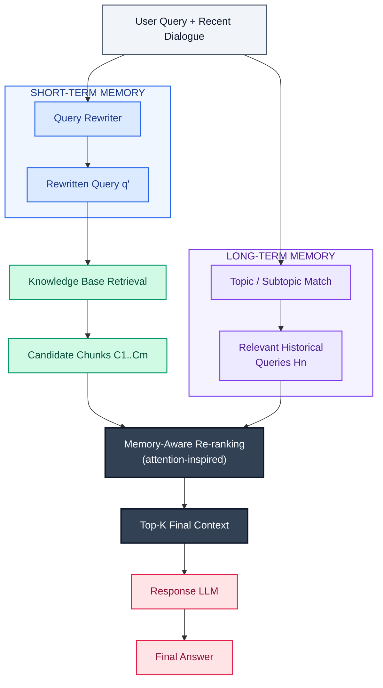
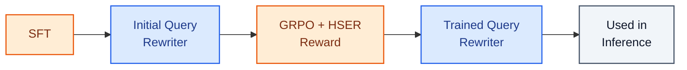
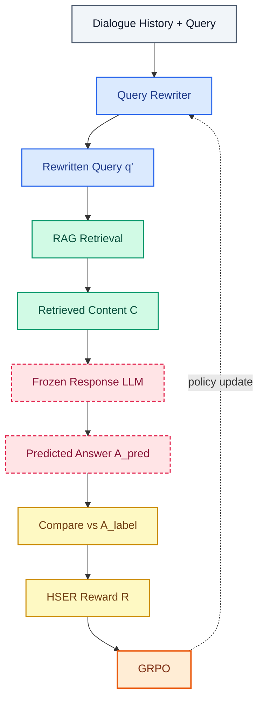
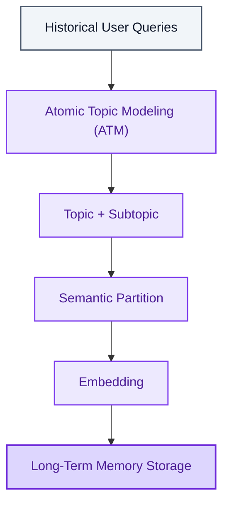
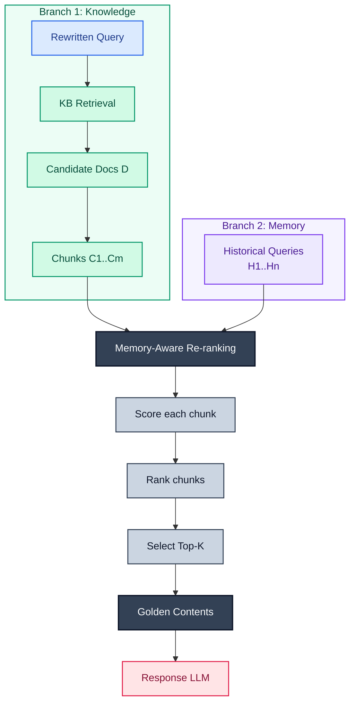
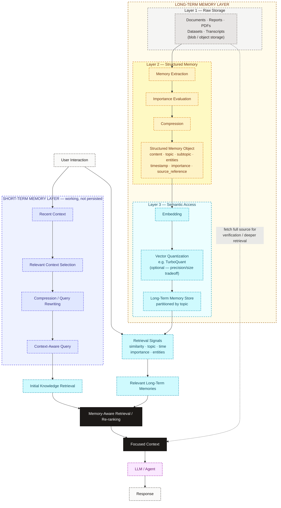

**How should an autonomous AI agent remember?** This is an engineering dissection of **HiMeS**, a hippocampus-inspired **agent memory system**, followed by my own interpretation of how I would build short-term and long-term memory for financial, legal, and deep-research AI agents. Two layers, kept deliberately separate throughout: *what the paper proposes*, and *what I would explore building* on top of it.

## Introduction

I recently came across a Lex Fridman conversation with Demis Hassabis, the CEO of Google DeepMind. Hassabis has a background in neuroscience, and his career has moved across neuroscience, artificial intelligence, and scientific research — he is also associated with the Nobel Prize-winning work on protein structure prediction.

The idea that caught my attention wasn't a specific technical claim. It was the connection he kept returning to: the relationship between neuroscience and artificial intelligence.

Modern neural networks were originally inspired, at least conceptually, by our understanding of biological neural systems. Because of his background in neuroscience, Hassabis naturally sees parallels between biological intelligence and the artificial intelligence systems we are building — parallels that most of us building systems day to day don't really think about, because we're working a few abstraction layers above that.

That got me thinking.

The neuroscience connection landed with me because I had already been stuck on a practical engineering problem in the AI agents I was building.

In recent projects involving AI agents, particularly in the financial domain and the legal domain, I kept coming back to the same question:

**How should an autonomous AI agent remember?**

Not the shallow version of that question. Not "give the LLM a vector database and call it memory." I was thinking about where memory actually fits into an agent pipeline, and how an agent is supposed to distinguish between:

- information that matters right now,
- information from the recent conversation,
- information that should persist over time,
- and historical information that may suddenly become relevant again.

That last category is where things got difficult for me, and it's a problem I ran into directly.

### The long-term memory problem

While working on a financial-domain AI agent involving oil-price prediction and analysis, I started thinking about historical events.

Imagine an important geopolitical, economic, or market event that happened five or ten years ago. That event may be extremely relevant to something happening today.

The question is:

**How does the agent know that this particular event from years ago is important right now?**

Storing that information in a long-term memory system does not solve the problem. The hard part isn't storing memories. The hard part is knowing when an old memory should become relevant again.

And the naive workaround makes things worse. If I retrieve everything from long-term memory and put all of it into the model context, I've traded one problem for another: the context becomes overloaded with historical information that isn't relevant to the current task, the genuinely important information gets diluted among irrelevant memories, and I've introduced retrieval noise and a higher risk of poorly grounded or hallucinated responses.

So long-term memory cannot mean:

Store everything → retrieve everything → put everything into the prompt.

The real problem is:

**How do we retrieve the right memory at the right time?**

For an agent working in finance, law, research, or any other knowledge-intensive domain, something that happened years ago can become highly relevant the moment the current situation resembles or connects to that past event. The memory system therefore needs to do more than preserve history. It needs to connect the current situation with the relevant information from the past.

### The short-term memory problem

The same problem shows up at the other end of the timescale.

During an ongoing conversation, the user's latest query often can't be understood in isolation. Its meaning may depend on:

- what was discussed a few turns ago,
- entities or events mentioned earlier,
- the user's current objective,
- constraints established during the conversation,
- and the immediate context surrounding the current interaction.

If a conversation has been working through oil markets, a specific geopolitical event, or a particular legal case, a short follow-up question may only make sense when interpreted against the previous turns.

So the problem isn't whether the agent has access to conversation history. It usually does. The problem is:

**How do we effectively use recent conversational context without blindly passing the entire conversation into every prompt?**

The system needs some way to preserve and extract the part of the recent interaction that actually matters for understanding the current query — which is a different operation from just appending history.

### The limitations of a simple sequential pipeline

Thinking about both of those problems led me to a third one: the shape of the pipeline itself.

Simplified, most agent and RAG pipelines look something like:

Query → Retrieval → Prompt Assembly → Response

It's a largely sequential process. The current query goes into retrieval. Relevant documents come back. Those documents are assembled into the model context. The model generates a response.

Each step is reasonable on its own, and the structure still has real limitations where memory is concerned.

First, recent conversational context is not fully exploited before retrieval happens. The retriever mostly operates on the current query, even though the preceding conversation contains information that could significantly change what should have been retrieved in the first place.

Second, long-term memory may exist somewhere in the system, but storing historical information is a different thing from knowing when to retrieve it and how to use it once retrieved.

This is where the problem got more interesting to me. I wasn't really asking:

**How do I give an AI agent memory?**

I was asking:

**How do I design a memory system that can understand what matters now, preserve what matters over time, and bring an old memory back when it becomes relevant again?**

### Human memory as an architectural analogy

Which is where I started thinking about how humans handle this.

We don't seem to treat every interaction as completely independent. When we interact with someone for the first time, we rely primarily on the immediate information and conversational cues available in that interaction. When we interact with someone we've dealt with before, our understanding is also shaped by accumulated memories, impressions, and previous interactions.

And something that happened years ago can suddenly resurface when the current situation provides the right cue.

That's an interesting architectural analogy for AI systems, because it implies recent context and persistent memory serve different purposes. Recent information helps us understand what is happening now. Longer-term memory allows information from the past to become useful again when the right situation appears.

This is what made me think about the relationship between short-term and long-term memory in the brain — specifically, the conceptual relationship between the **prefrontal cortex** and the **hippocampus** as an architectural inspiration.

At the level this analogy needs, the prefrontal cortex can be thought of as associated with working with current context, planning, and reasoning. The hippocampus provides the inspiration for thinking about encoding, associating, and retrieving memories.

I'm not making strong biological claims here, and this isn't meant to be a neuroscience lecture. The part of the analogy I actually care about is:

- recent context helps interpret the current situation,
- important information can be encoded and consolidated over time,
- and information from the past can become useful again when the current context provides the right retrieval cues.

### Discovering HiMeS

This line of thinking eventually led me to the paper **HiMeS: Hippocampus-inspired Memory System for Personalized AI Assistants**.

What caught my attention was not that HiMeS adds memory to an LLM. It's that the architecture separates short-term and long-term memory and lets those two mechanisms participate at *different stages* of the information pipeline.

It gave me a concrete way to think about the exact questions I'd been circling:

How should an agent use what just happened?

How should it preserve information from the past?

And more importantly:

**How can the system determine which memories are actually relevant right now?**

> **A note on layers.** Everything from here until *"From the Paper to My Own Implementation"* is a faithful dissection of what the HiMeS paper proposes. After that point, the article shifts into my own engineering interpretation — clearly labelled, and not to be read as claims from the paper.

## What HiMeS Is Actually Trying to Solve

HiMeS addresses the problems above by combining two memory systems:

1. **Short-term memory**
2. **Long-term memory**

The paper frames its work as a fourfold contribution. Rather than list them as contributions, here's what each one is actually doing.

### Short-term memory through dialogue compression

HiMeS uses a short-term memory extractor that is trained end-to-end with reinforcement learning.

The goal here is not summarization. It's easy to read "compress recent dialogue" and assume this is a summarizer, but that's not quite it. Recent dialogue is compressed into a **refined query** — something that captures the contextual information actually needed for retrieval. That refined query is then used to proactively pull relevant documents from the knowledge base.

The core idea I want to communicate:

> Instead of sending the current user query to retrieval in isolation, the system first looks at recent conversational context and converts that context into a more meaningful retrieval query.

The training setup matters. The short-term memory module goes through supervised fine-tuning first, then reinforcement learning. The reason the RL stage exists is alignment: with SFT alone, you're optimizing the rewrite to look like a reference rewrite. That's a proxy objective. What you actually care about is whether the rewrite leads to a better final response. The RL stage uses an end-to-end reward involving response quality along with retrieval-related signals, so the rewriting behavior is optimized against downstream outcomes rather than against surface similarity to a gold rewrite.

I'll come back to the implementation implications of this later — for now the important part is the shape of the idea.

### Partitioned long-term memory

The second major piece is the long-term memory system.

HiMeS stores user-specific historical information in a **partitioned** memory structure. Historical queries are organized into topic-specific partitions rather than being treated as one flat collection. When a new query comes in, the relevant historical memories get activated.

Here's the part I find most interesting, and it's the design decision I keep thinking about:

Those activated memories are not simply dumped into the LLM's context window. Instead, they're used to **re-rank the documents retrieved from the knowledge base**.

That's a meaningfully different role for long-term memory than what most agent memory implementations do. Long-term memory here participates in retrieval and ranking — it's part of the information-selection process, not just extra text prepended to a prompt.

Mechanically, the paper represents stored historical queries semantically, then uses the similarity between those historical memories and the retrieved document chunks to perform an additional re-ranking stage. The paper describes this as an attention-inspired mechanism.

### Short-term and long-term memory work together

The architectural idea that matters isn't "there are two databases, one called short-term and one called long-term." It's that the two mechanisms operate at *different stages of the pipeline*.

Conceptually:

```text
Recent conversation
  → short-term memory compression
    → refined query
      → knowledge retrieval
        → long-term memory activation
          → re-ranking and filtering of retrieved information
            → response generation
```

Which gives each memory system a clear job:

- **Short-term memory** helps the system understand **what the user currently means**.
- **Long-term memory** helps the system understand **what information about this user, or their previous interactions, may still matter**.

That split is the thing I want to hold onto. When I've thought about memory for autonomous agents before, I've tended to treat it as one problem — a store you write to and read from. Separating "understanding the current intent" from "deciding what historical context is still relevant" gives you two smaller problems, each of which has a clearer place in an agent pipeline.

### Why the results matter

The paper evaluates the architecture on a real-world industrial dataset and reports improvements over conventional cascaded RAG pipelines. The ablations also support the claim that the two memory modules are doing different work — they contribute separately, and the system performs best when both are present.

I'm not going to go deep into the numbers here. The point of mentioning the evaluation at all is that this isn't purely a conceptual architecture: the authors built it, measured it, and found improvements in context-aware and question-answering performance.

## Walking Through the HiMeS Architecture

Everything from here on follows the structure of the study reference I put together while reading the paper: the same diagrams, the same order, the same formulas — just expanded into something readable rather than a set of boxes and equations.

One thing to keep straight before starting, because it's the easiest thing to confuse when reading about this system: **training and inference are separate.** GRPO, HSER, and the reward formula exist only during training of the query rewriter. At inference time there are no rewards, no policy updates, and no GRPO — just a rewriter, a retriever, a memory store, a reranker, and a response model. I'll flag which regime each section is describing.

A note on the color language used across all the diagrams below, since it's consistent throughout:

- **grey** — inputs and outputs
- **blue** — short-term memory components
- **purple** — long-term memory components
- **green** — retrieval and the knowledge base
- **orange / yellow** — training and reinforcement learning components (training-time only)
- **dark slate** — the fusion point where the two memory paths meet
- **rose** — the response model and the final answer

## 1. The Big Picture: Complete HiMeS Inference Pipeline

*Inference only. No rewards, no GRPO, no HSER in this diagram.*



Walking through it step by step.

**The input forks immediately.** The user's current query plus the recent dialogue goes to *two* places at once — the short-term memory module and the long-term memory module. This fork is the first structurally interesting thing about HiMeS. In a conventional pipeline the query goes one place: the retriever.

**Short-term memory enters at the front, before retrieval.** The query rewriter consumes the recent dialogue and the current query and produces a rewritten query `q'`. This happens *upstream* of retrieval, which means short-term memory gets to change what the system searches for in the first place.

**The rewritten query drives knowledge-base retrieval.** `q'` — not the raw user query — is what hits the knowledge base. Retrieval returns candidate documents, which get broken into candidate chunks `C1..Cm`. This is the "knowledge" branch of the pipeline.

**Long-term memory enters in the middle, after retrieval.** In parallel, the query is matched to a topic/subtopic partition of the long-term memory store, and the relevant historical queries `Hn` are pulled out of that partition. Note what does *not* happen here: `Hn` is not injected into the prompt, and it does not trigger its own retrieval pass over the knowledge base.

**The two paths meet at re-ranking.** The candidate chunks (from the knowledge branch) and the activated historical memories (from the memory branch) both feed the memory-aware re-ranking step. This is the fusion point of the whole architecture — the place where "what the user means now" and "what has mattered to this user before" get combined into a single ranking decision.

**Top-K context goes to the response LLM.** Re-ranking selects a focused subset of chunks, and only that subset reaches the response model, which generates the final answer.

So the two memory systems are separate because they answer different questions at different stages. Short-term memory shapes the *query*. Long-term memory shapes the *ranking*. Putting both in the same place would collapse that distinction — and it's exactly the distinction that lets long-term memory be useful without flooding the context window.

The relationship, stated compactly: short-term memory produces a *better retrieval query*; long-term memory supplies *relevance signals*; re-ranking *fuses* both to pick the context the response LLM actually sees.

### The key architectural idea

HiMeS is not:

`conversation → vector database → LLM`

The architecture treats memory as an active participant in retrieval and information selection rather than as a passive store that gets read into a prompt. Short-term memory helps interpret the current request. Long-term memory helps determine which retrieved information is most relevant given past interactions. The paper combines these two mechanisms for context-aware retrieval and response generation, and the combination is the contribution — not either mechanism on its own.

## 2. Short-Term Memory Module

*Inference.*


The thing to get past first: **this module is not a summarizer.**

It receives the current user query, the recent dialogue history, and the surrounding contextual information. Its job is to emit a rewritten query that carries the context needed to retrieve well, while dropping the parts of the conversation that don't help. Compression here is in service of retrieval, not in service of brevity.

The intuition is easiest to see with a broken query. A real user turn tends to contain pronouns, omitted subjects, references to something said three turns ago, or a request that is only half-stated. "What about the second one?" is a perfectly clear thing to say to a human mid-conversation and a completely useless thing to hand to a retriever. The rewriter's job is to produce the version of that query that actually represents the information need.

Why this matters for RAG specifically: a retriever can only work with the representation of the query it is given. If the critical piece of the user's intent lives in a previous dialogue turn and never makes it into the query embedding, the retrieval stage is operating on an incomplete picture of what the user wants — and no amount of re-ranking downstream can recover a document that was never retrieved. Errors at this stage are unrecoverable, which is why it's worth putting a trained model here rather than a template.

Two details from the reference worth keeping explicit:

- **The conversation history *is* the short-term memory.** There is no separate short-term store being written to and read from. The recent dialogue is the memory, and it's consumed on the fly.
- **The rewriter does not persist `q'` as a memory.** `q'` is a transient artifact used for this turn's retrieval. Nothing about it is stored for later.

What the module produces, then, is a query optimized for downstream retrieval — resolving pronouns, filling in omissions, disambiguating, and capturing multi-turn intent.

That's inference. Training is a separate story.

## 3. Training the Query Rewriter

*Training only.*

The lifecycle is SFT first, then RL.



### Supervised fine-tuning

The rewriting model is first trained on high-quality multi-turn dialogue rewriting examples. The mapping being learned is straightforward:

`dialogue history + current query → context-aware rewritten query`

This stage teaches the model the *format and behavior* of rewriting. The kinds of behavior it picks up include context memorization, coreference resolution, ellipsis completion, multi-turn clarification, resistance to irrelevant historical context, recognizing when previous context matters, and — importantly — recognizing when rewriting is unnecessary and the query should be left mostly alone.

That last one is easy to overlook. A rewriter that always rewrites is a rewriter that will damage queries that were already fine.

### Reinforcement learning

So why isn't SFT enough?

Because a rewritten query can be linguistically correct, faithful to the dialogue, and close to a reference rewrite — and still retrieve worse documents than the original query did. Similarity to a reference rewrite is a proxy objective. The thing anyone actually cares about is whether the rewrite improved the final answer.

HiMeS handles this by evaluating the rewrite *through the downstream system*:

`dialogue history + current query → query rewriter → rewritten query → retrieval → retrieved context → response model → generated answer → reward signal → update query rewriter`

The optimization target shifts from "does this rewrite look like the reference rewrite?" to "did this rewrite lead to better retrieval and a better answer?" That's the whole reason RL shows up in a system that is otherwise a retrieval pipeline.

## 4. The RL Optimization Loop

*Training only.*



Step by step:

1. The query rewriter receives the dialogue history and the current query.
2. It generates rewritten query candidates.
3. Each rewritten query goes through the retrieval pipeline.
4. Relevant documents or chunks come back as retrieved content `C`.
5. A **frozen** downstream response model generates an answer `A_pred`.
6. `A_pred` is compared against the evaluation signals — the reference answer `A_label` and the retrieved content `C`.
7. A reward `R` is computed (the HSER reward, covered in §6).
8. GRPO uses that reward to update the query rewriter.

The architectural separation here is the part worth being precise about, because it's easy to describe this loosely and end up saying something false.

**The response LLM is frozen. Only the query rewriter is updated.** The response model functions as a downstream task evaluator — a fixed, effectively black-box judge of whether the rewrite produced a context that a competent reader could answer from. The gradient never touches it.

So "trained end-to-end with reinforcement learning" means *the reward is computed at the end of the pipeline*, not *the whole LLM stack is being trained*. Nothing here backpropagates through the retriever or the response model. It can't — retrieval is a discrete top-k selection and the response model is frozen. The pipeline between the rewriter's output and the reward is non-differentiable, which is precisely the situation RL is for: you can score the outcome, but you can't differentiate your way to it.

## 5. GRPO: Why Group Relative Policy Optimization?

*Training only.*

The question this section answers: **why use reinforcement learning to optimize a query rewriter, when the quality of a rewrite is determined by things that happen later in the pipeline?**

Start with the shape of the problem. For a given dialogue, the rewriter can produce many plausible rewrites. Each one leads to a different retrieval result, a different context, a different answer, and therefore a different reward. But that reward only exists *after* the full pipeline has run, and there's no differentiable path back from it. What you have is a scoring function you can call, not a loss you can differentiate. That's a policy optimization problem.

The obvious approach — PPO — needs a learned critic (a value network) to estimate how good a given state is, so it can compute advantages. That's an extra model to train, extra memory, and extra instability.

GRPO avoids it. The paper describes GRPO as a lightweight PPO variant that **compares samples within a group instead of learning a separate critic.** In this setting:

- For the same dialogue history and current query, sample a *group* of candidate rewrites.
- Run each one through the pipeline and compute its HSER reward.
- Score each candidate *relative to the others in its group* — rewrites that outperformed their peers get pushed up, rewrites that underperformed get pushed down.
- Update the rewriter from those relative comparisons.

The group itself supplies the baseline. Since all candidates in a group share the same dialogue and query, they share the same difficulty — so comparing them against each other is a fair comparison, and no critic network is needed to guess what a "good" reward would have been for this input.

That fits the query rewriting problem well. "Is this rewrite good?" is a hard question to answer in absolute terms. "Is this rewrite better than these four other rewrites of the same turn?" is a much easier question, and it's the only question GRPO needs answered.

The division of labor to hold onto:

- **HSER** defines *what* a good outcome is — it's the reward.
- **GRPO** defines *how* the rewriter is optimized from that reward — it's the optimizer.

## 6. Understanding the Reward Formula (HSER)

*Training only.*

The HSER reward:

$$
R = F1_h + \alpha \cdot EM_h + \beta \cdot Hit
$$

Three signals, two weights. Each term one at a time.

### $F1_h$ — graded answer similarity

The Rouge-L F1 score between:

- $A_{pred}$: the answer generated by the downstream (frozen) response model,
- $A_{label}$: the reference or target answer.

This is the *graded* component. It doesn't ask whether the answer was right, it asks how much of the reference answer's content the prediction managed to overlap with. A rewrite that got the system most of the way there scores better than one that got nowhere, and that partial credit is what makes the reward learnable — a purely binary reward gives almost no gradient signal early in training, when nearly everything is wrong.

### $EM_h$ — exact match

$$
EM_h =
\begin{cases}
1, & \text{if } A_{pred} = A_{label} \\
0, & \text{otherwise}
\end{cases}
$$

A binary bonus for getting the answer exactly right. Where $F1_h$ rewards being close, $EM_h$ rewards being *correct*, and specifically rewards rewrites that lead to precisely-grounded answers rather than approximately-right ones. In domains where the answer is a number, a date, a name, or a citation, "close" isn't worth much — this term is what expresses that.

### $Hit$ — retrieval grounding

$$
Hit =
\begin{cases}
1, & \text{if } A_{pred} \in C \\
0, & \text{otherwise}
\end{cases}
$$

Checks whether the generated answer appears in — or is supported by — the RAG-retrieved content $C$, per the paper's formulation.

This is the term that ties the reward back to *retrieval* rather than just to answer text, and it's the one I find most interesting from a design standpoint. Without it, a rewrite could score well because the frozen response model happened to know the answer from its parameters, with the retrieved context contributing nothing. That would reward the rewriter for the wrong reason. $Hit$ pushes toward rewrites whose retrieved context actually contains the answer — which is what you want from a query rewriter, since its entire job is to make retrieval land on the right material.

### $\alpha$ and $\beta$ — the weights

Weighting coefficients that control how much exact matching and retrieval grounding count relative to the graded Rouge-L F1 component. They're set experimentally in the paper. There's nothing derived about them; they're a knob for balancing "be close," "be exactly right," and "be grounded in what you retrieved."

### Reward summary

| Term | Meaning |
|---|---|
| $F1_h$ | Answer similarity to reference (Rouge-L F1) |
| $EM_h$ | Exact-match reward: 1 if $A_{pred} = A_{label}$, else 0 |
| $Hit$ | 1 if the answer / relevant info is in retrieved content $C$, else 0 |
| $\alpha, \beta$ | Weighting coefficients (set experimentally) |

Intuitively, the reward isn't scoring the rewritten query at all. It's scoring the *consequences* of the rewrite, by asking three questions:

- Did the system produce an answer close to the target?
- Did it match exactly where it should have?
- Was that answer actually supported by what got retrieved?

A rewrite is good if and only if the pipeline downstream of it did well. That's the whole idea.

## 7. Long-Term Memory Module

*Offline organization.*

HiMeS does not treat long-term memory as one undifferentiated pool. Historical queries are organized into partitions by topic and subtopic, using a predefined topic taxonomy — the paper calls this process **Atomic Topic Modeling (ATM)**.



The storage flow:

`historical user interaction → topic classification → topic + subtopic assignment → semantic embedding → store inside the relevant memory partition`

So instead of one flat memory pool, historical queries are organized into fine-grained topic/subtopic semantic partitions, and *then* embedded for retrieval within that structure.

And at query time:

`current query → topic classification → relevant memory partition → retrieve relevant historical queries → use those memories during re-ranking`

From an engineering standpoint, the interesting property is what this does to the search space. Rather than comparing the current query against every historical memory in one flat space, the system first narrows to the relevant partitions and searches inside them. The paper argues this reduces the candidate set and improves retrieval efficiency.

It also changes what "relevant" means in a subtle way. In a flat store, a semantically similar-looking memory from a completely unrelated topic can surface on raw embedding similarity alone. Partitioning by topic gives the system a coarse structural filter before similarity is ever computed.

I'm deliberately not saying anything here about which database, index type, or storage engine to use — the paper describes the organization, not the infrastructure, and I'd rather keep those separate until I get to my own implementation thinking.

## 8. Long-Term Memory Retrieval

*Inference.*

Storing memories is the easy half. The question this stage answers is the hard half:

**which historical memories should become active for the current query?**


Given the current query $q$ and the historical memory collection $H$, the system retrieves the top-$n$ historical queries by semantic similarity:

$$
H_n = \operatorname{top}_n \big( H, \; \operatorname{sim}(E(q), E(H)) \big)
$$

which yields an activated set:

$$
H_n = \{h_1, h_2, \ldots, h_n\}
$$

The components:

- $q$ — the current query (the current or rewritten query, depending on where in the pipeline the match happens)
- $H$ — the historical memory collection
- $H_n$ — the top-$n$ activated historical memories
- $E(\cdot)$ — the embedding function
- $\operatorname{sim}(\cdot, \cdot)$ — the semantic similarity function
- $\operatorname{top}_n$ — take the $n$ highest-scoring items

The intuition: long-term memory is not loading every past interaction into the prompt. It first *activates* a small set of historical memories that look semantically relevant to the current situation, and that activated set is what participates in the next stage.

The critical detail, and the one that separates HiMeS from most memory implementations I've seen: **these historical queries act as signals for re-ranking retrieved chunks — they are not directly inserted into the prompt.** `Hn` never becomes context. It becomes a scoring function.

## 9. Attention-Inspired Memory-Aware Re-ranking

*Inference. This is where the two branches meet.*



Step by step.

**First, retrieve.** The rewritten query pulls an initial set of documents $D$ from the knowledge base.

**Then, chunk.** Those documents are split into smaller pieces:

$$
C = \bigcup_{d \in D} \operatorname{chunk}(d)
$$

- $D$ — the initially retrieved documents
- $\operatorname{chunk}(d)$ — breaking a document into smaller pieces
- $C$ — the union of all resulting chunks, the candidate pool to be ranked

Chunking matters here for a reason that's easy to miss: re-ranking at document granularity would be too coarse. A long retrieved document can be 90% irrelevant and 10% exactly what's needed. Scoring at chunk level is what lets the system keep the useful 10% and discard the rest.

**Then, score each chunk against the activated memories.** For each chunk $c_i$, compute its mean semantic similarity to the activated historical memories:

$$
score(c_i) = \operatorname{mean}_{h \in H_n} \operatorname{sim}\big(E(c_i), E(h)\big) = \frac{1}{|H_n|} \sum_{h \in H_n} \operatorname{sim}\big(E(c_i), E(h)\big)
$$

Every term:

- $c_i$ — an individual document chunk
- $H_n$ — the activated historical memories from §8
- $h$ — an individual historical memory
- $E(c_i)$ — the semantic embedding of the chunk
- $E(h)$ — the semantic embedding of a historical memory
- $\operatorname{sim}$ — semantic similarity
- $\operatorname{mean}$ / $\frac{1}{|H_n|}\sum$ — aggregation of that similarity across all activated memories
- $|H_n|$ — the number of activated memories

So a chunk scores highly when it resembles the things this user has historically asked about — averaged across the whole activated memory set, so that one coincidentally-similar memory can't dominate the score on its own.

**Then, select.** The highest-scoring chunks become the refined context:

$$
golden\_contents = \operatorname{top}_k(C, score)
$$

And those are what reach the response model.

The source algorithm, compressed to four steps:

1. retrieve relevant historical queries,
2. chunk the pre-retrieved documents,
3. calculate chunk scores using similarity to the historical memories,
4. re-rank and select the top chunks.

### One important clarification

**"Attention-inspired" does not mean Transformer multi-head attention.** Conceptually, the historical queries act as a relevance signal deciding which chunks matter most — which is attention-*like* in spirit, in that a set of queries weights a set of values. But mechanically this is embedding similarity, averaging, and re-ranking. There are no learned projections, no softmax over attention logits, no attention heads. Worth being precise about, because "attention" is a loaded word and it would be easy to read far more machinery into this than is actually there.

### Why this is the idea I keep coming back to

The current query determines what enters the initial retrieval stage. But the user's relevant historical interactions provide a *second, independent* signal for deciding which parts of that retrieved information deserve attention.

Which produces the distinction that made this paper worth writing about for me:

> **Long-term memory does not simply add more context. It influences which context survives.**

That's a fundamentally different role than the one long-term memory plays in most agent implementations, where "memory" means "text that gets prepended to the prompt." Here, memory never enters the prompt at all. It changes the *shape of the filter* that decides what does. Which also means the cost of adding more long-term memory is not paid in context window — it's paid in scoring compute, and that's a much better trade to be making.

## 10. End-to-End Summary

The full pipeline, in order:

`recent dialogue → short-term memory compression → context-aware rewritten query → initial knowledge retrieval → long-term memory activation → retrieval of relevant historical interactions → document chunking → memory-aware similarity scoring → attention-inspired re-ranking → focused context selection → final response generation`

Per module:

| Module | Flow |
|---|---|
| **Short-Term Memory** | conversation history → query rewriting → better retrieval query |
| **Training** | downstream answer quality → HSER reward → GRPO → improved rewriter |
| **Long-Term Memory** | historical queries → ATM → partitioned semantic storage → retrieve relevant memories $H_n$ |
| **Memory-Aware Re-ranking** | $H_n$ + candidate chunks → similarity scoring → Top-K context → Response LLM |

Stated as the three questions each part answers:

- **Short-term memory:** what does the user mean right now, given the recent context?
- **Long-term memory:** what information from the past may matter for this user and this situation?
- **Re-ranking:** out of everything retrieved, which information is most relevant once historical memory is taken into account?

And the three things I'd want to remember if I came back to this in six months:

- Short-term memory is **learned query rewriting**.
- HSER is the **reward**; GRPO is the **optimizer** — both training-time only.
- Long-term memory is **retrieve relevant historical queries and use them to re-rank knowledge chunks**.

## From the Paper to My Own Implementation

> **Layer 2 begins here.** Everything above is HiMeS as the paper presents it. Everything below is *my own engineering interpretation* — how I would think about building a memory system inspired by these ideas. None of the design decisions in this section are claims from the HiMeS paper.

At this point I'm no longer trying to summarize HiMeS.

What I'm actually interested in is the next question: how would I implement a memory architecture inspired by these ideas for the agents I build — financial agents, legal-domain agents, and the autonomous pipelines where memory has to survive across sessions and across tasks?

Everything that follows is my interpretation and my own implementation thinking. Where I make a design decision, that decision is mine, not something the HiMeS authors proposed. The paper gives me a structure worth borrowing: separate the mechanism that understands the current turn from the mechanism that decides what history still matters, and give the long-term one a role in ranking rather than just a slot in the prompt.

That's the foundation. The rest is working out what it looks like in practice.

## How I Would Think About Implementing This

Everything in this section is mine, not the paper's. HiMeS gave me an architectural framework for thinking about short-term and long-term memory; it did not tell me how to represent a memory, where to put a 200-page PDF, or what metadata to attach to anything. Those are my questions, and the ideas below are how I would start exploring them — not a system I have built and validated.

The distinction I want to lead with, because it's the one that unlocked the rest of my thinking:

> **Memory architecture and memory representation are two separate decisions.**

HiMeS answers the first one — where memory enters the pipeline and what job each memory system does. It doesn't answer the second — what a memory physically *is* on disk, and how it's addressed at retrieval time. I think a lot of confusion in agent memory discussions comes from collapsing those two questions into one, which is how you end up with "memory" meaning "a vector database" by default.

So I'd keep them apart, and reason about representation and storage on their own terms.

### My approach to short-term memory

For short-term memory, I'd explore a combination of recent conversational context, a compression step, a query or context rewriting mechanism, and semantic representations where they actually help.

The part I feel reasonably confident about is that I would **not** treat the entire recent conversation as permanent memory. Short-term memory, in my reading of HiMeS, is a *working* layer — something the system consumes to interpret the present turn, not something it accumulates.

Conceptually:

```text
Recent conversation
      ↓
Identify relevant context
      ↓
Compress or rewrite
      ↓
Context-aware representation
      ↓
Use for retrieval and reasoning
```

If semantic search across recent memory turned out to be useful — for example, pulling something from earlier in a long session that keyword or recency heuristics would miss — I could represent selected short-term items as embeddings.

But I want to be careful about how I say that, because it's easy to slide into a claim I don't actually believe:

> **Embeddings are a representation and a retrieval mechanism. They are not memory by themselves.**

The hard part isn't producing a vector. It's deciding what information deserves to be preserved and how it should influence the current request. An embedding is what you do *after* you've made that decision. Every agent memory system I've seen that felt disappointing got this backwards — it embedded everything and hoped similarity search would sort out relevance later.

### My approach to long-term memory

For long-term memory, I'd explore storing memories as **structured records** rather than treating long-term memory as only a vector store.

A conceptual memory object might carry the memory content, a compressed representation or summary, a semantic embedding, a timestamp, topic and subtopic, entities, source information, some importance or relevance signal, and a reference back to the original source.

Sketched out, something in the spirit of:

```json
{
  "memory_id": "...",
  "content": "...",
  "compressed_memory": "...",
  "embedding": "...",
  "timestamp": "...",
  "topic": "...",
  "subtopic": "...",
  "entities": [],
  "importance": "...",
  "source_reference": "..."
}
```

That is an illustration of how I'd *think about* a memory object, not a schema I'm proposing. The field names would almost certainly change once real data hit it, and some of these fields might turn out to be dead weight.

The idea I actually care about is this: **I would not choose between structured metadata and embeddings. I'd expect to use both.**

They answer different questions. Structured metadata answers:

- When did this happen?
- What topic and subtopic does it belong to?
- What entities are involved?
- Where did this information come from?

Embeddings answer a different question entirely:

- Is this memory semantically relevant to the current situation?

An embedding flattens a memory into a point in vector space, and in doing so it throws away exactly the things I'd most want for a financial or legal agent — dates, sources, entity identity, memory type, importance, and any explicit relationship between one event and another. Cosine similarity has no notion of "five years ago" or "this came from a regulatory filing rather than a news summary."

So a memory would have both a structured representation and a semantic representation, and I'd expect retrieval to use both.

This is also, I think, where my thinking connects back to the paper without overclaiming: HiMeS partitions historical memories by topic and then uses semantic similarity within that structure. The partition is structure; the similarity is semantics. The paper doesn't prescribe JSON records or metadata fields — but the shape of what it does is consistent with structure and semantics playing different roles.

### Raw storage is not memory

Here's a distinction I'd want to build into the system from the start:

> **Raw information is not memory. A compressed, structured, retrievable representation of information is memory.**

An entire PDF, news article, financial report, dataset, or multi-hour conversation transcript does not need to be — and probably shouldn't be — a single memory object. So I'd likely separate the system into layers.

#### Layer 1: Raw information storage

The original artifacts, preserved as-is: documents, reports, PDFs, datasets, long conversation transcripts, external research, source material. For large artifacts I'd explore blob or object storage, since the access pattern is "fetch the whole thing occasionally," not "search inside it constantly."

The purpose of this layer is preservation and provenance. Nothing else.

#### Layer 2: Structured memory

Rather than pushing raw information into the agent context over and over, I'd extract or compress the part worth remembering into a structured memory object — compressed memory, plus metadata, entities, topic, timestamp, and a reference back to the source artifact in Layer 1.

This becomes the persistent representation the memory system actually reasons about.

#### Layer 3: Semantic access

The memory object also gets an embedding, which is what makes semantic similarity search possible over the structured layer. This is also the layer where vector compression would live if the store grows large enough to need it — see the note on quantization below.

End to end:

```text
Raw information
      ↓
Memory extraction
      ↓
Compression
      ↓
Structured memory object
      ↓
Metadata + embedding
      ↓
Long-term memory
```

The property I like about this shape is that the raw source stays available for verification or deeper retrieval, while the memory system does its day-to-day work on something much smaller and more structured. For a legal or financial agent, being able to walk a memory back to the exact source document isn't a nice-to-have — it's most of the reason anyone would trust the output.

None of this three-layer split is from HiMeS. It's my own way of organizing the storage question that the paper leaves open.

### Memory compression

I'd also explore a dedicated compression mechanism — and again, this is my extension, not something the paper implements beyond the query rewriting already described.

My intuition is that there are two distinct kinds of compression here, operating on different timescales and with different goals.

**Short-term compression:**

```text
Recent dialogue
      ↓
Context selection
      ↓
Compression / query rewriting
      ↓
Context-aware representation
```

The goal is to carry forward what matters for the current interaction without pushing the entire conversation history through the pipeline on every turn. This is essentially what HiMeS's query rewriter does, so I'd treat the paper's approach as the starting point here.

**Long-term compression:**

```text
Raw interaction or document
      ↓
Memory extraction
      ↓
Importance evaluation
      ↓
Compression
      ↓
Structured memory
      ↓
Embedding + metadata
      ↓
Long-term storage
```

This one is the piece I'd spend the most time on, because it contains a decision most memory systems skip: an **importance evaluation** step that decides whether something is worth remembering at all.

The question I'd be trying to answer isn't:

**How do I store everything?**

It's:

**What is worth turning into a durable memory representation?**

Storing every raw conversation forever, as an equal-weight memory, seems like a way to guarantee the retrieval problem gets harder over time. Every low-value memory added to the store is another candidate competing for top-$k$ slots. So I'd experiment with whether a compression and extraction stage can turn large volumes of raw information into a smaller number of memory units that are genuinely easier to retrieve over and reason about.

I don't know yet what the right importance signal is, or whether it should be a model judgment, a heuristic, a downstream feedback signal, or some combination. That's an open question I'd want to test rather than guess at.

### A third thing also called compression: the vectors themselves

Something I had to untangle in my own head: the word "compression" is doing two completely different jobs in this architecture, and they operate on different objects.

**Semantic compression** takes raw information and produces a shorter durable memory. It is lossy *in meaning* — a model decides what to keep and what to drop, and the output is text. That's Layer 2, and it's what the two subsections above are about.

**Vector compression** takes an embedding — a high-dimensional float array — and produces a smaller numerical representation of the same vector. It is lossy *in precision*, not in meaning; the goal is to preserve distances and inner products as closely as possible while using far fewer bits. That's Layer 3, and it's a codec problem rather than a modeling problem.

This is where something like **TurboQuant** would sit in my architecture — vector quantization for the embeddings, at the semantic access layer. Not a replacement for memory extraction or importance evaluation, which happen upstream in the structured layer and are about deciding *what a memory is*. By the time TurboQuant would apply, that decision has already been made; the only question left is how cheaply the embedding of that memory can be stored and searched.

Why I'd care about it in this specific architecture, rather than as a generic "make the vector store smaller" optimization: long-term memory in a HiMeS-style system is the part that grows without bound. Short-term memory is transient and small, so quantizing it buys nothing. But the long-term store accumulates a memory record per interaction worth remembering, forever, and every one of those carries an embedding.

More importantly, the re-ranking stage from §9 is *made of* similarity computations:

$$
score(c_i) = \frac{1}{|H_n|} \sum_{h \in H_n} \operatorname{sim}\big(E(c_i), E(h)\big)
$$

That's an inner-product / cosine estimation over every candidate chunk against every activated memory. So quantization error doesn't just affect storage size — it propagates directly into the ranking that decides which context reaches the model. If quantized memory embeddings distort those similarities, the ranking degrades, and I'd be paying for memory savings in answer quality without it being obvious where the regression came from.

That's exactly the tradeoff I'd want to measure, and it's the reason a quantization method with strong distortion guarantees on inner-product estimation is interesting here rather than one that only optimizes reconstruction error. The experiment I'd actually run: hold the pipeline fixed, quantize the long-term memory embeddings at several bit budgets, and watch what happens to top-$k$ re-ranking agreement against full-precision embeddings — not just recall on the vector store in isolation, since re-ranking is where the error would show up.

**Two caveats I want to be honest about.** First, TurboQuant is a compression technique for embeddings — nothing about it is proposed by or connected to the HiMeS paper, and using it is entirely my own idea. Second, I should verify the method's exact guarantees and API against the actual paper before writing anything specific about it in the published version; I'd also want to confirm whether "TurboVec" is a distinct algorithm or whether I'm thinking of the same work under a different name, because I'm not confident those are two separate things.

### How I would think about memory retrieval

Storage alone doesn't solve anything. The more interesting question — and the one that got me into this whole line of thinking back in the introduction — is how the system decides *which memories become active*.

If I were implementing this, I'd explore multiple retrieval signals rather than relying on semantic similarity alone:

```text
Current query
      +
Semantic similarity
      +
Topic / domain
      +
Timestamp / temporal relevance
      +
Importance
      +
Entity relationships
      ↓
Memory selection
```

This is the kind of retrieval architecture I'd investigate, not a design I've settled on. I don't know how these signals should be combined — weighted score, hard filters before similarity, a learned ranker, something else — and I'd want that to be an experiment rather than an assumption.

But the motivation is concrete, and it goes straight back to the oil-price problem. An event from ten years ago might be highly relevant to the current situation on semantic grounds alone. Temporal metadata would let the system reason about *when* it happened rather than treating it as timeless. Importance metadata could plausibly help separate a major geopolitical disruption from a routine market observation that happens to use similar language. Entity relationships could connect an event to the specific producers, regions, or instruments involved.

Semantic similarity by itself can't make any of those distinctions. That's the reason I keep coming back to structure *and* semantics rather than picking one.

### A HiMeS-Inspired Memory Architecture I Would Explore

**My implementation direction — not the HiMeS architecture.** Dashed borders throughout are a deliberate signal that this is proposed, not built. The three storage layers are drawn as nested groups so the raw / structured / semantic separation is visible.



Reading it as a flow: the user interaction feeds the short-term layer, which selects and compresses recent context into a context-aware query. That query drives initial knowledge retrieval. In parallel, the long-term layer has already been built offline — raw artifacts in Layer 1, extracted and compressed into structured memory objects in Layer 2, embedded and partitioned for semantic access in Layer 3. At query time, multiple retrieval signals activate a set of relevant long-term memories, those memories plus the retrieved content go through memory-aware re-ranking, and only the focused context reaches the agent. The dashed edge back from raw storage is the escape hatch: when the agent needs the full source rather than a compressed memory, the original is still there.

The part I'd borrow most directly from HiMeS is the position of the re-ranking step — long-term memory shaping *which context survives* rather than being pasted into the prompt. Everything about the three layers, the structured records, the importance evaluation, and the multi-signal retrieval is my own.

### Where the line is

To be explicit about attribution, since this matters more to me than it might seem:

**From the HiMeS paper:** short-term memory as a trained query rewriter; SFT followed by GRPO with the HSER reward; a frozen downstream response model as evaluator; topic/subtopic partitioning of historical queries via Atomic Topic Modeling; top-$n$ memory activation by semantic similarity; attention-inspired chunk re-ranking using mean similarity to activated memories; top-$k$ selection of golden contents.

**Mine, and unvalidated:** structured JSON-style memory records; the specific metadata fields; blob or object storage for raw artifacts; the three-layer raw / structured / semantic split; a separate long-term compression and extraction stage; the importance evaluation step; multi-signal retrieval combining similarity with topic, time, importance, and entity relationships; vector quantization of the long-term memory embeddings, and the idea of evaluating something like TurboQuant for it.

And deliberately still open: no specific database, vector store, cloud provider, or embedding model. The architecture is the thing worth getting right first — the technology choices should follow from it, not the other way around, and I'd rather write those down once I've actually tested something. The one concrete technique I've named, TurboQuant, is named as a candidate to evaluate at a specific layer, not as a decision I've made.

That's where my thinking currently sits. HiMeS gave me the architectural idea; this is the beginning of turning it into a memory system I could actually run behind an autonomous agent.

## Key Takeaways

- **HiMeS splits memory by pipeline stage, not by database.** Short-term memory shapes the *query* before retrieval; long-term memory shapes the *ranking* after it. That separation is the contribution.
- **Short-term memory is a trained query rewriter** — SFT for behavior, then GRPO with the HSER reward for downstream outcomes. Both GRPO and HSER are training-time only; inference is just rewrite → retrieve → activate → re-rank → generate.
- **Long-term memory never enters the prompt.** Activated historical queries act as an attention-inspired relevance signal that re-ranks retrieved chunks — memory decides *which context survives* rather than adding more of it.
- **Structure and semantics answer different questions.** In my own interpretation, metadata answers *when / what topic / which entities / from where*, embeddings answer *is this relevant*, and a serious memory system needs both.
- **Raw information is not memory.** My three-layer split — raw storage, structured memory, semantic access — keeps the source available for provenance while the agent reasons over something small and structured.
- **Retrieval is a multi-signal problem.** Semantic similarity alone can't tell a decade-old geopolitical shock from routine market chatter; time, importance, and entity relationships are what make an old memory activate at the right moment.

## Related Topics

- [ReAct and the Birth of Agent Memory](/engineering/react-synergizing-reasoning-acting/) — where working memory first entered LLM agents, the conceptual ancestor of this discussion.
- [Retrieval-Augmented Generation](/learning-lab/retrieval-augmented-generation/) — the retrieval backbone HiMeS's query rewriter and re-ranker sit on top of.
- [Memory & Context Systems](/engineering/memory-context/) — the rest of the agent-memory and context-compression implementations in this domain.

## Conclusion

HiMeS is worth studying less for its benchmark numbers and more for a single architectural move: it stops treating memory as text you paste into a prompt and starts treating it as an active participant in retrieval and ranking. Short-term memory decides what to search for; long-term memory decides what of the results actually matters. That division is small to state and surprisingly deep to build.

My own extension of it — raw / structured / semantic layers, importance-gated compression, and multi-signal retrieval — is unvalidated on purpose. The point isn't that I have the answer. It's that once you separate *memory architecture* from *memory representation*, the real engineering questions finally become askable: what is worth remembering, how should it be stored, and what should have to be true for an old memory to wake up? Those are the questions I'd want an autonomous financial or legal agent to be able to answer — and HiMeS is the clearest starting point I've found for asking them.

---

*Source: HiMeS — [Hippocampus-inspired Memory System for Personalized AI Assistants](https://arxiv.org/abs/2601.06152) (arXiv, 2026). The paper dissection above reflects that work; the implementation direction from "From the Paper to My Own Implementation" onward is my own engineering interpretation.*
