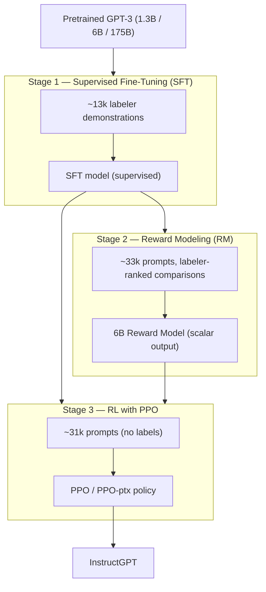

This is a technical dissection of **InstructGPT** — the reinforcement-learning-from-human-feedback (RLHF) pipeline from Ouyang et al. The focus is the engineering system: why next-token prediction is the wrong objective for "follow the user's instruction," the three-stage pipeline that fixes it, the data-collection process that feeds it, the reward model and the batching decision that makes it trainable, the PPO stage and its two regularizers, and the trade-offs the design accepts.

This is the paper that turned GPT-3 into something you could instruct — the direct ancestor of the chat models that followed. **[Interpretation]** We are not reproducing the full evaluation suite; the benchmark tables matter here only as evidence that the pipeline does what it claims.

**Attribution convention.** Because this article mixes what the paper says with my own reasoning, every non-obvious technical claim is tagged:

- **[Paper]** — stated explicitly in InstructGPT (arXiv:2203.02155).
- **[Derived]** — a mathematical or logical consequence of the paper's setup, worked out here.
- **[Interpretation]** — my explanation or engineering reasoning, written for the reader; not a claim the paper makes.

---

## Why This Paper Matters

There is one result that reframes the entire paper: outputs from the **1.3B** InstructGPT model are preferred by human labelers to outputs from the **175B** GPT-3 — a model with more than 100× the parameters. **[Paper]** Whatever RLHF is doing, it is worth more on this distribution than a two-order-of-magnitude increase in scale. **[Interpretation]**

The reason is an objective mismatch. GPT-3 is trained to **predict the next token** on internet text. But the thing we actually want — "follow the user's instruction helpfully, honestly, and harmlessly" — is a different objective. **[Paper]** The language-modeling objective is _misaligned_ with the deployment objective, and no amount of scale closes that gap on its own; a bigger next-token predictor is still a next-token predictor. **[Interpretation]** InstructGPT is the engineering answer to "how do you change the objective a pretrained model is optimizing, after the fact, using humans as the signal."

## The Baseline Problem: Prompting and Scale Don't Fix Intent

Before RLHF, the two levers were scale and prompting. The paper measures both and finds them insufficient. **[Paper]** A well-crafted few-shot prefix ("GPT-3 prompted") improves over raw GPT-3, and each subsequent stage improves further — but prompting alone leaves a large gap to a trained model. **[Paper]** The 175B InstructGPT is preferred to few-shot GPT-3 **71 ± 4%** of the time, and to raw GPT-3 **85 ± 3%** of the time. **[Paper]**

The problem with prompting is that it is a way of _asking_ a next-token predictor to imitate instruction-following, not a way of _changing what it optimizes_. **[Interpretation]** RLHF changes the optimization target directly.

## The Core Idea: Human Preferences as the Reward Signal

You cannot write a differentiable loss for "helpful, honest, harmless." **[Interpretation]** RLHF's move is to **learn** that loss: collect human judgments about which outputs are better, train a model to predict those judgments, and then use that learned model as the reward function for reinforcement learning. **[Paper]** Human preference becomes the objective — indirectly, through a reward model that stands in for the humans at RL scale.

## The Three-Stage Pipeline



The stages feed each other: SFT produces the policy the RM is built on _and_ the policy RL starts from; the RM becomes the reward function _and_ initializes the RL value function. **[Paper]** Steps 2 and 3 can be iterated — collect fresh comparisons on the current best policy, retrain the RM, retrain the policy. **[Paper]**

## The Data Pipeline

The data is the product here, and the paper treats prompt collection as an engineering pipeline with real hygiene. **[Interpretation]** Prompts come from two sources: text submitted to early InstructGPT models on the OpenAI API Playground, plus labeler-written prompts (Plain, Few-shot, and User-based) used to **bootstrap** the very first models before API traffic existed. **[Paper]**

Processing steps applied to the prompts: **[Paper]**

```
API + labeler-written prompts
   → heuristic dedup (drop prompts sharing a long common prefix)
   → cap at 200 prompts per user ID
   → split train / val / test by user ID (no user spans splits)
   → filter personally identifiable information (PII)
```

Two of these are quietly important. Splitting **by user ID** rather than by prompt means the validation and test sets contain no data from any user seen in training — the generalization numbers are not inflated by user-specific leakage. **[Interpretation]** The PII filter is a deployment-safety requirement, not an ML one. **[Interpretation]**

Three datasets fall out, one per stage: **[Paper]**

| Dataset | Size (train prompts) | Labels | Feeds |
|---|---|---|---|
| SFT | ~13k | human demonstrations | Stage 1 |
| RM | ~33k | human rankings of outputs | Stage 2 |
| PPO | ~31k | **none** (prompts only) | Stage 3 |

The dataset is over 96% English, and the use-case mix is dominated by **generation** (45.6%), open QA (12.4%), and brainstorming (11.2%) — mostly open-ended generation rather than classification or extraction. **[Paper]** That composition is why public NLP benchmarks turn out to be a poor proxy for this distribution (discussed below). **[Interpretation]**

Behind the data are ~40 screened contractors (Upwork and ScaleAI). Inter-annotator agreement is 72.6 ± 1.5% among training labelers and 77.3 ± 1.3% among held-out labelers — the ceiling any reward model can be expected to hit. **[Paper]**

## Stage 1 — Supervised Fine-Tuning

SFT fine-tunes GPT-3 on the labeler demonstrations with standard supervised learning: 16 epochs, cosine learning-rate decay, residual dropout 0.2. **[Paper]** A revealing detail: the SFT model **overfits validation loss after a single epoch**, yet training for many more epochs still improves both the RM score and human preference ratings. **[Paper]** Validation loss is itself a misaligned proxy here — the thing you actually care about keeps improving after the proxy says to stop, so final model selection is done on **RM score on the validation set**, not on loss. **[Paper]**

## Stage 2 — The Reward Model

The RM starts from the SFT model **with the final unembedding layer removed**, replaced by a head that maps (prompt, response) to a single scalar reward. **[Paper]** Two engineering decisions define this stage.

### Why 6B, not 175B

The paper only uses **6B** reward models. Not for quality reasons — because 175B RM training "could be unstable and thus was less suitable to be used as the value function during RL," and the smaller RM saves substantial compute. **[Paper]** This is a pure systems trade-off: the reward model is queried on every RL rollout and used to initialize the value function, so its stability and cost matter more than squeezing out the last accuracy point. **[Interpretation]**

### The comparison loss

Labelers don't score outputs absolutely; they **rank** them, which is easier and more consistent. **[Interpretation]** The RM is trained on pairwise comparisons with a logistic loss: **[Paper]**

$$
\text{loss}(\theta) = -\frac{1}{\binom{K}{2}} \, \mathbb{E}_{(x,\,y_w,\,y_l)\sim D}\Big[\, \log \sigma\big(r_\theta(x, y_w) - r_\theta(x, y_l)\big) \,\Big]
$$

- **$r_\theta(x, y)$** — the scalar reward for prompt $x$ and completion $y$. **[Paper]**
- **$y_w, y_l$** — the labeler-preferred ("winner") and dispreferred ("loser") completion in a pair. **[Paper]**
- **$\sigma(r_\theta(x, y_w) - r_\theta(x, y_l))$** — the modeled probability that $y_w$ beats $y_l$; the reward _difference_ is the log-odds of preference. **[Paper]**
- **$\binom{K}{2}$** — the number of pairs formed from the $K$ ranked responses for a prompt (next section). **[Paper]**

Training pushes the reward gap between preferred and dispreferred completions to be large and correctly signed — it never needs an absolute quality scale, only a consistent ordering. **[Derived]**

### The batching decision that makes it work

To speed comparison collection, labelers rank **$K = 4$ to $9$** responses per prompt at once, yielding $\binom{K}{2}$ comparisons from a single labeling session. **[Paper]** The obvious implementation — shuffle all comparisons into one flat dataset — **overfits after a single epoch**, because the comparisons from one prompt are highly correlated and each completion gets reused in up to $K-1$ separate gradient updates. **[Paper]**

The fix is to treat **all $\binom{K}{2}$ comparisons from one prompt as a single batch element**. **[Paper]** This is both a regularization fix and an efficiency win:

- **Compute:** each of the $K$ completions needs only **one** RM forward pass, not $\binom{K}{2}$ — the shared completions are embedded once and reused across all pairs. **[Paper]**
- **Overfitting:** no completion is revisited across scattered mini-batches, so the single-epoch overfit disappears and validation accuracy and log-loss improve. **[Paper]**

This is the kind of detail that reads as trivia but is the difference between the RM training and not. **[Interpretation]** Finally, because the loss is invariant to a constant shift in reward, the RM is normalized with a bias so that labeler demonstrations score a mean of **0** before RL — giving the downstream reward a stable zero point. **[Paper]**

## Stage 3 — Reinforcement Learning with PPO

RL fine-tunes the SFT policy in a **bandit environment**: a random prompt is presented, the policy emits a full response, the RM scores it, and the episode ends. **[Paper]** Single step, single reward — there is no multi-turn dynamics. **[Interpretation]** The value function is **initialized from the RM**. **[Paper]** The full objective, maximized during RL: **[Paper]**

$$
\text{objective}(\phi) = \mathbb{E}_{(x,y)\sim D_{\pi_\phi^{RL}}}\Big[\, r_\theta(x,y) - \beta \log\frac{\pi_\phi^{RL}(y\mid x)}{\pi^{SFT}(y\mid x)} \,\Big] + \gamma\, \mathbb{E}_{x\sim D_{\text{pretrain}}}\Big[\, \log \pi_\phi^{RL}(x) \,\Big]
$$

Three terms, three jobs:

- **$r_\theta(x,y)$** — the learned reward. This is what RL is actually maximizing: get responses the RM (and by proxy the humans) rate highly. **[Paper]**
- **$-\beta \log\big(\pi_\phi^{RL}(y\mid x)/\pi^{SFT}(y\mid x)\big)$** — a **per-token KL penalty** anchoring the RL policy to the SFT model, weighted by $\beta$. **[Paper]** It exists to mitigate **over-optimization of the reward model**: the RM is an imperfect proxy, so a policy free to wander will find adversarial outputs that score high on the RM but are actually bad. The KL leash keeps the policy in the region where the RM is still trustworthy. **[Interpretation]**
- **$\gamma\, \mathbb{E}_{x\sim D_{\text{pretrain}}}\big[\log \pi_\phi^{RL}(x)\big]$** — the **pretraining mix**, weighted by $\gamma$. Setting $\gamma = 0$ gives the plain "PPO" model; a positive $\gamma$ gives **"PPO-ptx"**, which is what "InstructGPT" refers to. **[Paper]** Its job is discussed next.

## The Alignment Tax and PPO-ptx

Optimizing purely for human preference causes **performance regressions on public NLP datasets** — an "alignment tax." **[Paper]** The composition explains why: the API distribution is mostly open-ended generation, so a policy tuned hard toward it drifts away from the narrow benchmark tasks. **[Interpretation]** PPO-ptx pays the tax down by **mixing pretraining gradients back into the PPO update** ($\gamma > 0$), pulling the policy toward the original data distribution while it optimizes for preference. **[Paper]** Notably, adding the pretraining mix does **not** meaningfully change labeler preference — it recovers benchmark performance largely for free. **[Paper]**

## Connection to GRPO

InstructGPT and [GRPO](/engineering/grpo-deepseekmath-group-relative-policy-optimization/) are the same family viewed two years apart. **[Interpretation]** Both fine-tune an SFT policy with a PPO-style objective, both keep a frozen reference model for a KL penalty, both use a learned reward model. The component InstructGPT relies on — a **value function initialized from the RM**, a second large network — is exactly the component GRPO later **removes**, replacing the learned baseline with group-relative statistics over sampled outputs. **[Interpretation]** Reading them together, InstructGPT establishes the RLHF template and GRPO is a targeted deletion of its most expensive part. **[Interpretation]**

## Engineering Trade-offs

- **Proxy reward, not truth.** The policy optimizes the RM, not human preference directly; the KL penalty exists precisely because the proxy can be gamed. **[Paper]** Alignment is only as good as the RM, which is only as good as ~40 labelers' judgments. **[Interpretation]**
- **A specific group's preferences.** The pipeline aligns to the stated preferences of the labelers and researchers, not to any broader notion of human values — the paper is explicit about this. **[Paper]**
- **Alignment tax.** Preference optimization degrades benchmark tasks; PPO-ptx mitigates but the tension is real. **[Paper]**
- **Pipeline complexity.** Three models (SFT, RM, policy) plus a frozen reference and a value function — far heavier than supervised fine-tuning. **[Interpretation]**

## Did It Work?

The reported evidence is consistent across cuts: **[Paper]**

- 1.3B InstructGPT preferred over 175B GPT-3; 175B InstructGPT preferred to GPT-3 85 ± 3% and to few-shot GPT-3 71 ± 4% of the time.
- Preferred over instruction-tuned baselines FLAN (78 ± 4%) and T0 (79 ± 4%).
- Fewer hallucinations on closed-domain tasks, better at following explicit constraints, more appropriate as a customer assistant.
- **Generalizes past its training labelers:** held-out labelers show the same preference, and 5-fold cross-validated RMs predict held-out labeler preferences at 69.6 ± 0.9% vs 72.4 ± 0.4% on their own training group — a small drop, not a collapse. **[Paper]**

## Engineering Takeaway

InstructGPT is best understood as a machine for **converting cheap human rankings into a differentiable objective, then optimizing a pretrained model against it under a leash.** **[Interpretation]** The pieces that make it an engineering artifact rather than an idea:

- Rankings, not scores — humans are consistent at ordering, not at absolute grading, so the RM loss is pairwise. **[Interpretation]**
- The $\binom{K}{2}$-as-one-batch-element trick — the unglamorous decision that keeps the RM from overfitting and cuts its forward passes from $\binom{K}{2}$ to $K$. **[Paper]**
- A 6B RM chosen over 175B for stability and cost, because the RM is on the RL hot path. **[Paper]**
- Two regularizers with distinct jobs: the KL penalty stops reward over-optimization; the pretraining mix pays the alignment tax. **[Paper]**

The lasting lesson is the first result restated: on the objective users actually care about, **aligning a small model beat scaling an unaligned one by 100×.** **[Interpretation]** That is why every capable instruction-following model that followed is built on some descendant of this pipeline.
