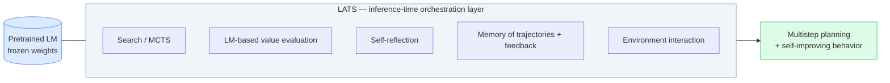
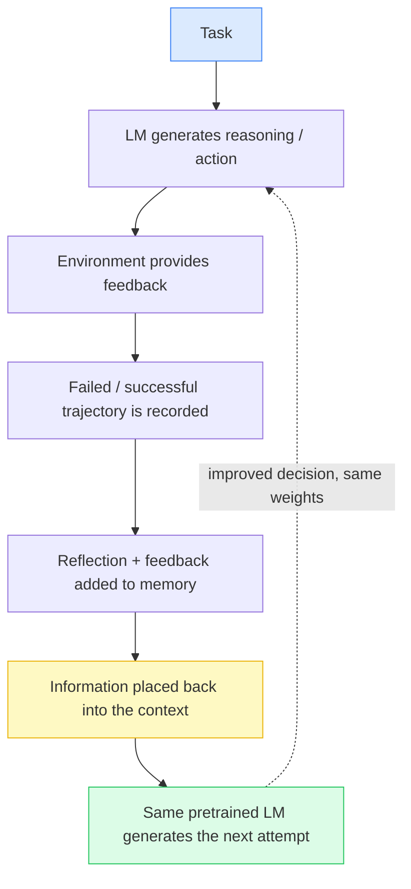
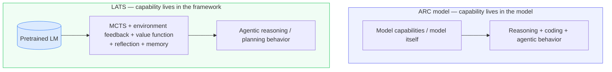
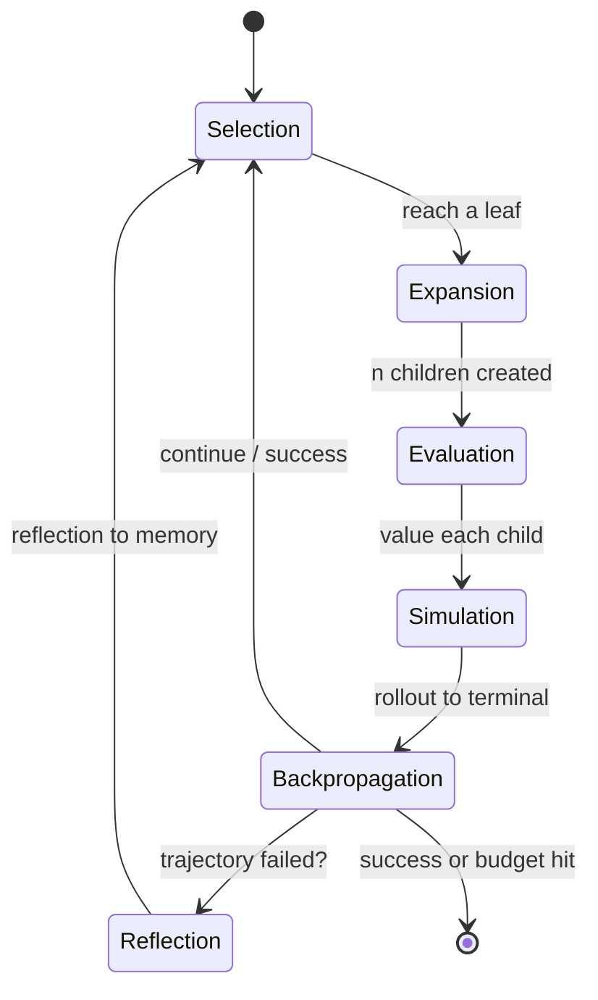
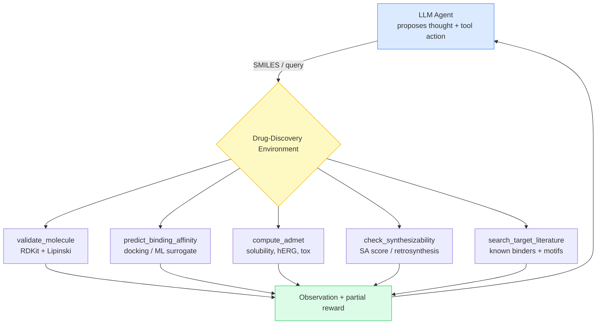
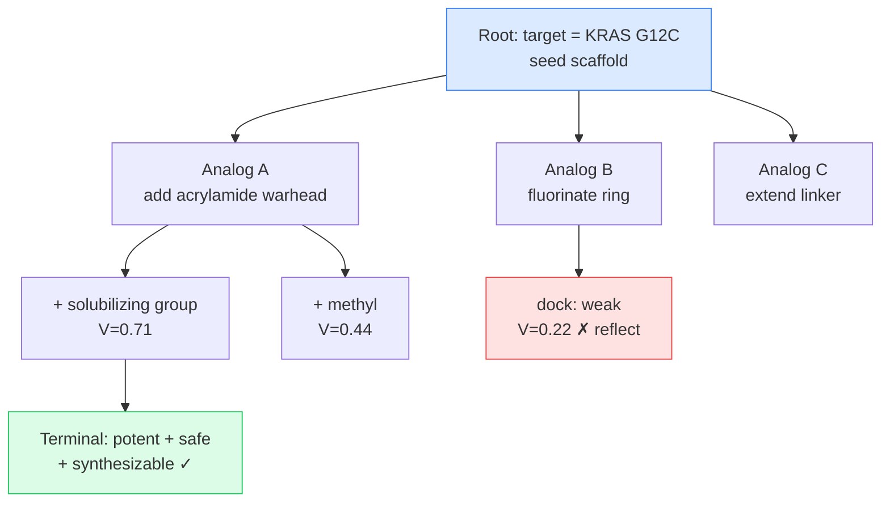
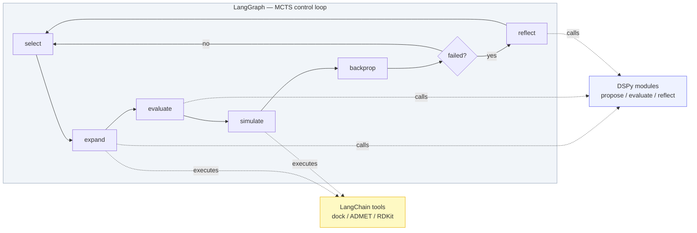

# LATS: Language Agent Tree Search for Multistep Planning and Reasoning

Most language-model agents I have built share the same shape: the model reasons, takes an action, observes the result, reasons again, and eventually commits to an answer. That loop — the ReAct pattern — is powerful, but it walks **a single trajectory** through the problem. If an early decision was wrong, the whole path inherits that mistake, and there is no built-in way to back up, try a different branch, and compare.

**LATS — Language Agent Tree Search — fixes that.** This entry is the version I would want to have read before an interview: the core idea, the six operations, the math that actually matters, and a complete implementation for a real domain — **AI-driven drug discovery** — using LangChain, DSPy, and LangGraph. By the end you should be able to whiteboard LATS, defend every design choice, and show code.

---

## The Core Problem: One Trajectory Is Not Enough

A traditional LM agent is **reflexive**. It reads the current context, produces the next thought or action, and moves on. That is fine for short, forgiving tasks. It breaks the moment a task needs any of:

- **Considering multiple possible paths.** The first plausible action is rarely the best. A reflexive agent never sees the alternatives it skipped.
- **Planning ahead.** Choosing step 2 well depends on where steps 3–5 could lead. A single forward pass cannot weigh futures it has not explored.
- **Incorporating environment feedback.** Real tasks live against an external world — a code interpreter, a search API, a docking simulator. That world returns signal, and the agent should act on it, not narrate around it.
- **Improving after failure.** When a trajectory fails, a reflexive agent cannot learn from *that specific failure* within the same task. It stops or blindly retries.

The paper frames the same gaps as three weaknesses of prior prompting methods — **flexibility** (they sample one continuation and ignore alternatives), **sensibility** (reasoning-only methods hallucinate because they never touch the environment), and **adaptability** (they cannot reuse experience or learn from trial and error). LATS is built to close all three at once.

---

## What LATS Actually Combines

The cleanest description I can give: LATS is a **synthesis**. It takes ingredients that existed separately and wires them into one loop.

- **Language-model reasoning** — the model still produces the thoughts and intermediate steps.
- **Acting in an external environment** — actions are executed against real tools, and observations come back.
- **Multistep planning** — decisions are made with lookahead, not greedily.
- **Monte Carlo Tree Search (MCTS)** — the search backbone that picks which branch to explore and balances trying new paths against exploiting good ones.
- **LM-based value evaluation** — instead of training a value network, LATS asks the LM itself to score how promising a state is.
- **Self-reflection** — when a trajectory fails, the model writes *why*, and that becomes context for later attempts.
- **Memory of previous trajectories and feedback** — past attempts, observations, and reflections are retained and reused.

The paper's Table 1 makes the lineage vivid: ReAct has reasoning + acting but no planning; Tree-of-Thought plans over reasoning but never touches an environment; Reflexion adds self-reflection but still refines a single trajectory. **LATS is the first to hold reasoning, acting, planning, self-reflection, and memory in one framework** — which is exactly why it does things none of the pieces can do alone.

Here is the paper's own overview of how these parts form a loop:


*Figure 1 (LATS paper). The LLM agent proposes actions into the environment; observations and rewards flow back into the context; evaluation and self-reflection write to memory; the tree search consumes those values and hands the best node back to the agent. Language is the interface between every box.*

### The Idea That Matters Most: LATS Trains Nothing

This is the point to land hardest, because it reframes everything.

> **LATS is not a new model. It is an inference-time search-and-feedback loop wrapped around a pretrained language model.**

No fine-tuning. No gradient updates. No new weights. You take an off-the-shelf LM — the same one you would call for a normal completion — and place an orchestration layer around it that lets the model explore multiple candidate trajectories, evaluate them, and feed prior attempts back in.

All of the "learning" inside a LATS run happens **in the context window**, not in the parameters. The paper is explicit that this adapts planning to the environment *without additional training*, and even reports gradient-free performance comparable to gradient-based fine-tuning on web navigation. From an engineering standpoint that is the whole appeal: planning and self-improvement become a **systems property of the loop**, not something you had to train into a model.



---

## In-Context Learning as the Adaptation Mechanism

If the weights never change, how does the agent "get better" during a task? The answer is **in-context learning**, and it is worth being precise, because the phrase is overloaded.

Here, in-context learning is **not** a training procedure and **not** an architecture. It is simply this: the LM conditions its next output on whatever you place in its context. Put useful information in front of the model — what it tried, what happened, what failed — and its next generation reflects that. No parameter update. The context *is* the mechanism of adaptation.

So "memory" and "improvement" in LATS are engineered by deciding **what to put back into the context** on the next attempt: the original task, previous trajectories, environment observations, failure/success outcomes, self-reflections, and retrieved memory.



The loop always returns to **the same model**. Attempt two is not produced by a smarter model — it is the *same* model reading a *richer* context. This is also why LATS can use the LM *as its own value function*: rather than training a scorer, it prompts the LM to judge how promising a partial trajectory looks. Language becomes the shared interface between search, evaluation, reflection, and memory.

> **Key point:** in-context learning here is the mechanism through which the same pretrained LM conditions its next decision on previous attempts, feedback, and reflections. LATS decides what goes into the context; the model just reads it.

---

## LATS vs ARC / Agentic Reasoning and Coding Models

Interviewers love to probe whether you can separate *a model* from *a system around a model*. Get this crisp.

**An ARC / Agentic Reasoning and Coding model refers to the model itself** — a model capable of, or optimized for, agentic reasoning, coding, and tool-oriented problem solving. When you say "ARC model," you mean a *capability that lives in the parameters*.

**LATS is not that.** LATS is an **inference-time framework — an agent architecture you place around a pretrained LM.** The underlying LM still does the language generation; LATS does not replace or retrain it. What LATS adds is the orchestration layer: tree search, trajectory management, environment interaction, value evaluation, reflection, and memory. The model's intelligence stays where it was; LATS adds intelligence to the *system*.



Rule of thumb I use: **an ARC model is a *what* — a model with certain abilities. LATS is a *how* — a way of orchestrating any capable model so it plans, searches, and self-corrects.** They are not competitors: a stronger model makes a LATS wrapper better, and a LATS wrapper extracts more from whatever model sits underneath. To be explicit — **LATS itself is not an ARC model**; it is the framework layer.

### LATS as an Early Example of Inference-Time Reasoning

Zoom out and LATS is an early, concrete instance of a bigger idea: **inference-time reasoning and search.** The default way to use an LM is to ask once and take the answer. Inference-time search says: **spend additional compute at inference exploring multiple trajectories, evaluate them, and select the better ones.** You trade extra inference cost for higher-quality decisions. LATS is exactly that trade made explicit for agents, and it is the same intuition that later test-time-compute methods lean on — *how much you search at inference can matter as much as how good the base model is*. (I keep the ARC contrast strictly conceptual; all LATS-specific claims come from the paper.)

---

## The Six Operations (How the Search Actually Runs)

This is the mechanical heart. The hero figure at the top of the page shows all six; here is what each one *does* and *why it exists*, in engineering terms. Each node in the tree is a **state** $s = [x, a_{1:i}, o_{1:i}]$ — the original input $x$ plus the action and observation sequences so far.



**1) Selection.** Start at the root and walk down, at each level picking the child with the highest UCT score, until you hit a leaf. UCT is the exploration/exploitation knob:

$$\text{UCT}(s) = V(s) + w \sqrt{\frac{\ln N(p)}{N(s)}}$$

$V(s)$ is the estimated value of the node, $N(s)$ its visit count, $p$ its parent, and $w$ the exploration weight (the paper uses $w=1$). High-value nodes are exploited; rarely visited nodes get an exploration bonus.

**2) Expansion.** From the selected leaf, sample $n$ actions from the LM ($n=5$ in the paper), execute each against the environment, and attach the $n$ resulting children (each carrying its observation) to the tree. Sampling multiple actions — instead of greedily decoding one — is what gives the search branches to compare.

**3) Evaluation.** Assign a scalar value to each new child. LATS does **not** train a value network. Instead:

$$V(s) = \lambda \cdot \text{LM}(s) + (1-\lambda)\cdot \text{SC}(s)$$

$\text{LM}(s)$ is a self-generated score: prompt the LM to reason about the state *after seeing the environment feedback* and end with a correctness score. $\text{SC}(s)$ is a self-consistency score: actions that get sampled repeatedly at the same state tend to be more reliable. $\lambda$ trades the two off (0.5 for QA/math, 0.8 for programming/web in the paper). Ablating this evaluator cost the paper a **0.26** drop in exact match — the value function is not optional garnish, it is the steering wheel.

**4) Simulation.** Roll the selected node forward — repeatedly expanding and evaluating, but preferring the highest-value child — until a terminal state is reached. A terminal state gives *objective* feedback: did the task succeed? If yes, stop. If not, the next two operations kick in.

**5) Backpropagation.** Push the terminal reward $r$ back up the path. For each node $s_i$ from leaf to root, update the visit count and the running average value:

$$N(s_i) \leftarrow N(s_i) + 1, \qquad V(s_i) \leftarrow \frac{V(s_i)\,(N(s_i)-1) + r}{N(s_i)}$$

These updated values feed straight back into UCT, so the next Selection is smarter.

**6) Reflection.** On a *failed* terminal node, prompt the LM with the trajectory and its reward to produce a **verbal self-reflection** — a written diagnosis of what went wrong and a better strategy. Store the failed trajectory and its reflection in memory; on later iterations they are injected as extra context for both the agent and the value function. The paper's phrase is the one to memorize: this is a **"semantic gradient signal more useful than a scalar value"** — you get the directionality of gradient descent without any gradient descent.

---

## Grounding It in a Domain: AI-Driven Drug Discovery

Why drug discovery? Because it satisfies exactly the conditions LATS needs, and it makes every operation concrete:

- **A rich action space** — propose a molecule, modify a scaffold, dock it, predict ADMET, check synthesizability.
- **Real external feedback** — docking scores, toxicity predictions, and synthesizability are *tools*, not the model's imagination. This is precisely the "sensibility" LATS is built to exploit.
- **Sparse, delayed reward** — a candidate is only "good" after clearing potency *and* safety *and* synthesizability. One-shot generation almost never nails all three; you need to search and backtrack.
- **Reversibility** — you can always revert to an earlier molecular state by resetting the context. That is the one assumption MCTS-over-LMs requires, and hit-to-lead optimization satisfies it.

The task: *given a protein target, propose a small molecule that is potent against it, passes basic safety/ADMET filters, is drug-like, and is synthesizable.*



Each candidate molecule is a node. LATS grows a tree of molecular design decisions, scores partial designs with the LM value function, rolls promising ones out to a full candidate, and reflects on the failures ("adding a halogen near the basic amine improved affinity but triggered hERG liability — avoid that next time").



---

## The Architecture: Three Frameworks, Three Jobs

I like to keep responsibilities cleanly separated. This is also a strong interview answer to "how would you actually build this?":

| Layer | Framework | Responsibility |
|-------|-----------|----------------|
| **Cognition** | **DSPy** | The LM-powered pieces — action proposal, state evaluation, reflection — as typed, *optimizable* modules |
| **Environment** | **LangChain** | The drug-discovery tools (docking, ADMET, RDKit) exposed as a uniform tool interface |
| **Control / Search** | **LangGraph** | The MCTS loop — selection, expansion, evaluation, simulation, backprop, reflection — as an explicit state graph |



### 1. The Environment — LangChain Tools

The environment is just a set of tools with a uniform interface. In production these wrap real engines (AutoDock/Vina, an ADMET model, a retrosynthesis service); here they are stubbed but structurally correct.

```python
from langchain_core.tools import tool
from rdkit import Chem
from rdkit.Chem import Descriptors, QED

@tool
def validate_molecule(smiles: str) -> dict:
    """Validate a SMILES string and report drug-likeness (Lipinski + QED)."""
    mol = Chem.MolFromSmiles(smiles)
    if mol is None:
        return {"valid": False, "reason": "unparseable SMILES"}
    mw   = Descriptors.MolWt(mol)
    logp = Descriptors.MolLogP(mol)
    hbd  = Descriptors.NumHDonors(mol)
    hba  = Descriptors.NumHAcceptors(mol)
    lipinski_ok = (mw <= 500 and logp <= 5 and hbd <= 5 and hba <= 10)
    return {
        "valid": True, "mol_weight": round(mw, 1), "logp": round(logp, 2),
        "lipinski_pass": lipinski_ok, "qed": round(QED.qed(mol), 3),
    }

@tool
def predict_binding_affinity(smiles: str, target: str) -> dict:
    """Predicted binding affinity (pKd; higher = stronger). Wraps a docking/ML surrogate."""
    score = _docking_surrogate(smiles, target)      # e.g. Vina / a trained regressor
    return {"target": target, "pKd": round(score, 2), "strong": score >= 7.0}

@tool
def compute_admet(smiles: str) -> dict:
    """ADMET liabilities: solubility, hERG cardiotoxicity risk, hepatotoxicity."""
    p = _admet_model(smiles)
    return {"solubility_logS": p["logS"], "herg_risk": p["herg"], "tox_flag": p["tox"]}

@tool
def check_synthesizability(smiles: str) -> dict:
    """Synthetic accessibility (1 = easy, 10 = hard) + a short retrosynthetic sketch."""
    sa = _sa_score(smiles)
    return {"sa_score": round(sa, 2), "synthesizable": sa <= 6.0}

@tool
def search_target_literature(target: str) -> str:
    """Retrieve known binders, pharmacophores, and SAR notes for the target."""
    return _kb_retrieve(target)                      # RAG over ChEMBL / PubMed

DRUG_TOOLS = [validate_molecule, predict_binding_affinity,
              compute_admet, check_synthesizability, search_target_literature]
TOOLS_BY_NAME = {t.name: t for t in DRUG_TOOLS}
```

The **environment** wraps those tools, executes an action string, and returns an observation plus a partial reward. Terminal success = a valid, potent, safe, synthesizable candidate.

```python
import re, json

class DrugDiscoveryEnv:
    """External world for the LATS agent. Executes tool actions, scores candidates."""

    def __init__(self, target: str):
        self.target = target

    def step(self, action: str) -> tuple[str, float, bool]:
        """Returns (observation, reward, is_terminal)."""
        name, kwargs = self._parse(action)
        if name not in TOOLS_BY_NAME:
            return (f"Unknown tool '{name}'.", 0.0, False)

        result = TOOLS_BY_NAME[name].invoke(kwargs)
        obs = f"{name} -> {json.dumps(result)}"

        # A "propose final candidate" action triggers full scoring + terminality.
        if name == "predict_binding_affinity":
            reward, done = self._score_candidate(kwargs.get("smiles", ""))
            return (obs, reward, done)
        return (obs, 0.0, False)

    def _score_candidate(self, smiles: str) -> tuple[float, bool]:
        v = TOOLS_BY_NAME["validate_molecule"].invoke({"smiles": smiles})
        if not v.get("valid") or not v.get("lipinski_pass"):
            return (0.0, True)                        # invalid -> failed terminal
        aff = TOOLS_BY_NAME["predict_binding_affinity"].invoke(
            {"smiles": smiles, "target": self.target})
        adm = TOOLS_BY_NAME["compute_admet"].invoke({"smiles": smiles})
        syn = TOOLS_BY_NAME["check_synthesizability"].invoke({"smiles": smiles})

        # Composite reward in [0,1]: potency, safety, synthesizability, drug-likeness.
        reward = (
            0.40 * min(aff["pKd"] / 10.0, 1.0)
          + 0.25 * (0.0 if adm["tox_flag"] or adm["herg_risk"] == "high" else 1.0)
          + 0.20 * (1.0 if syn["synthesizable"] else 0.0)
          + 0.15 * v["qed"]
        )
        success = reward >= 0.75
        return (round(reward, 3), success)

    @staticmethod
    def _parse(action: str):
        m = re.match(r"(\w+)\((.*)\)", action.strip(), re.DOTALL)
        if not m:
            return (action.strip(), {})
        name, argstr = m.group(1), m.group(2)
        kwargs = dict(re.findall(r"(\w+)\s*=\s*['\"]?([^,'\"]+)['\"]?", argstr))
        return (name, kwargs)
```

### 2. Cognition — DSPy Modules

DSPy gives us the three LM-powered pieces as **typed signatures**. The payoff: the same code can later be *compiled/optimized* against a metric (e.g., candidate success rate) instead of hand-tuning prompts — which is the natural way to improve a training-free system.

```python
import dspy

class ProposeAction(dspy.Signature):
    """Propose the next reasoning thought and ONE concrete tool action to move
    toward a potent, safe, synthesizable candidate for the target."""
    task: str          = dspy.InputField()
    trajectory: str    = dspy.InputField(desc="prior thoughts / actions / observations")
    reflections: str   = dspy.InputField(desc="lessons distilled from past failed trajectories")
    thought: str       = dspy.OutputField(desc="brief reasoning")
    action: str        = dspy.OutputField(desc="one tool call, e.g. predict_binding_affinity(smiles=..., target=...)")

class EvaluateState(dspy.Signature):
    """Score how promising this partial trajectory is for yielding a viable drug
    candidate. Consider the latest environment feedback. Return value in [0,1]."""
    task: str          = dspy.InputField()
    trajectory: str    = dspy.InputField()
    observation: str   = dspy.InputField(desc="latest tool feedback")
    reasoning: str     = dspy.OutputField()
    value: float       = dspy.OutputField(desc="scalar in [0,1]")

class Reflect(dspy.Signature):
    """Diagnose why this trajectory failed and propose a concretely better strategy
    (which scaffold moves to try or avoid). This becomes context for future trials."""
    task: str             = dspy.InputField()
    failed_trajectory: str = dspy.InputField()
    reward: float          = dspy.InputField()
    reflection: str        = dspy.OutputField()

class Cognition:
    """The frozen LM, exposed as three optimizable modules. No weights are trained."""
    def __init__(self, lm: dspy.LM, n_expand: int = 5, lam: float = 0.7):
        dspy.configure(lm=lm)
        self.propose  = dspy.ChainOfThought(ProposeAction)
        self.evaluate = dspy.ChainOfThought(EvaluateState)
        self.reflect  = dspy.ChainOfThought(Reflect)
        self.n_expand = n_expand
        self.lam = lam

    def sample_actions(self, task, trajectory, reflections):
        """Expansion: sample n diverse (thought, action) pairs from the same LM."""
        out = []
        for _ in range(self.n_expand):
            r = self.propose(task=task, trajectory=trajectory,
                             reflections=reflections, config={"temperature": 0.9})
            out.append((r.thought, r.action))
        return out

    def value(self, task, trajectory, observation, k: int = 3) -> float:
        """V(s) = λ·LM(s) + (1−λ)·SC(s): mean LM score blended with self-consistency."""
        scores = [float(self.evaluate(task=task, trajectory=trajectory,
                                      observation=observation).value) for _ in range(k)]
        lm_score = sum(scores) / len(scores)
        # self-consistency: agreement of the sampled scores (low variance -> high SC)
        var = sum((s - lm_score) ** 2 for s in scores) / len(scores)
        sc_score = max(0.0, 1.0 - var)
        return self.lam * lm_score + (1 - self.lam) * sc_score

    def reflection(self, task, failed_trajectory, reward) -> str:
        return self.reflect(task=task, failed_trajectory=failed_trajectory,
                            reward=reward).reflection
```

### 3. The Tree and the Six Operations — Core LATS

Framework-agnostic core: the `Node`, UCT selection, and backprop. This is the code I would write on a whiteboard.

```python
import math
from dataclasses import dataclass, field

@dataclass
class Node:
    thought: str
    action: str
    observation: str
    parent: "Node | None" = None
    children: list = field(default_factory=list)
    visits: int = 0
    value: float = 0.0          # running average V(s)
    reward: float = 0.0
    is_terminal: bool = False

    def uct(self, w: float = 1.0) -> float:
        if self.visits == 0:
            return float("inf")               # always try an unvisited node first
        exploit = self.value
        explore = w * math.sqrt(math.log(self.parent.visits) / self.visits)
        return exploit + explore

    def trajectory_text(self) -> str:
        path, node = [], self
        while node and node.parent is not None:
            path.append(f"Thought: {node.thought}\nAction: {node.action}\n"
                        f"Observation: {node.observation}")
            node = node.parent
        return "\n".join(reversed(path))

def select(root: Node, w: float = 1.0) -> Node:
    """Walk down by max-UCT until a leaf (Operation 1)."""
    node = root
    while node.children:
        node = max(node.children, key=lambda c: c.uct(w))
    return node

def backpropagate(node: Node, reward: float):
    """Push reward up the path, updating visits and running-average value (Operation 5)."""
    while node is not None:
        node.visits += 1
        node.value += (reward - node.value) / node.visits   # incremental mean
        node = node.parent
```

### 4. The Control Loop — LangGraph

LangGraph makes the search **explicit**: the graph state carries the tree, the frontier node, and the reflection memory; each node is one of the six operations; a conditional edge decides whether to reflect. This is the orchestration story an interviewer wants to hear — *cognition (DSPy) and environment (LangChain) are called from inside a transparent control graph*.

```python
from typing import TypedDict
from langgraph.graph import StateGraph, END

class LATSState(TypedDict):
    task: str
    root: Node
    frontier: Node
    reflections: list[str]
    best: Node | None
    iters: int
    budget: int          # k roll-outs
    solved: bool

def build_lats_graph(cog: Cognition, env: DrugDiscoveryEnv):

    def n_select(state: LATSState):
        return {"frontier": select(state["root"])}

    def n_expand_eval(state: LATSState):
        """Expansion + Evaluation (Operations 2 & 3)."""
        parent = state["frontier"]
        refl = "\n".join(state["reflections"][-3:])
        traj = parent.trajectory_text()
        for thought, action in cog.sample_actions(state["task"], traj, refl):
            obs, reward, done = env.step(action)
            child = Node(thought=thought, action=action, observation=obs,
                         parent=parent, reward=reward, is_terminal=done)
            child.value = reward if done else cog.value(state["task"],
                          child.trajectory_text(), obs)
            parent.children.append(child)
        return {"frontier": parent}

    def n_simulate(state: LATSState):
        """Roll the highest-value child forward to a terminal state (Operation 4)."""
        node = max(state["frontier"].children, key=lambda c: c.value)
        depth = 0
        while not node.is_terminal and depth < 6:
            refl = "\n".join(state["reflections"][-3:])
            best_child, best_v = None, -1.0
            for thought, action in cog.sample_actions(
                    state["task"], node.trajectory_text(), refl):
                obs, reward, done = env.step(action)
                child = Node(thought, action, obs, parent=node,
                             reward=reward, is_terminal=done)
                child.value = reward if done else cog.value(
                    state["task"], child.trajectory_text(), obs)
                node.children.append(child)
                if child.value > best_v:
                    best_child, best_v = child, child.value
            node, depth = best_child, depth + 1
        return {"frontier": node}

    def n_backprop(state: LATSState):
        """Backpropagation (Operation 5) + track the best terminal candidate."""
        leaf = state["frontier"]
        backpropagate(leaf, leaf.reward)
        best = state["best"]
        if leaf.is_terminal and (best is None or leaf.reward > best.reward):
            best = leaf
        solved = leaf.is_terminal and leaf.reward >= 0.75
        return {"best": best, "iters": state["iters"] + 1, "solved": solved}

    def n_reflect(state: LATSState):
        """Reflection (Operation 6): a semantic gradient for the next trial."""
        leaf = state["frontier"]
        r = cog.reflection(state["task"], leaf.trajectory_text(), leaf.reward)
        return {"reflections": state["reflections"] + [r]}

    def route_after_backprop(state: LATSState):
        if state["solved"] or state["iters"] >= state["budget"]:
            return END
        # reflect only on failed terminal trajectories, else keep searching
        return "reflect" if state["frontier"].is_terminal else "select"

    g = StateGraph(LATSState)
    g.add_node("select", n_select)
    g.add_node("expand_eval", n_expand_eval)
    g.add_node("simulate", n_simulate)
    g.add_node("backprop", n_backprop)
    g.add_node("reflect", n_reflect)

    g.set_entry_point("select")
    g.add_edge("select", "expand_eval")
    g.add_edge("expand_eval", "simulate")
    g.add_edge("simulate", "backprop")
    g.add_conditional_edges("backprop", route_after_backprop,
                            {"reflect": "reflect", "select": "select", END: END})
    g.add_edge("reflect", "select")
    return g.compile()
```

Driving it end to end:

```python
def discover(target: str, budget: int = 8) -> Node | None:
    lm  = dspy.LM("openai/gpt-4o")          # any pretrained LM — frozen
    cog = Cognition(lm, n_expand=5, lam=0.7)
    env = DrugDiscoveryEnv(target=target)
    graph = build_lats_graph(cog, env)

    root = Node(thought="root", action="", observation=f"target={target}")
    final = graph.invoke({
        "task": f"Design a potent, safe, synthesizable inhibitor of {target}.",
        "root": root, "frontier": root, "reflections": [],
        "best": None, "iters": 0, "budget": budget, "solved": False,
    }, {"recursion_limit": 100})

    return final["best"]        # highest-reward candidate trajectory found

# best = discover("KRAS G12C")
# print(best.trajectory_text(), best.reward)
```

**Read the architecture back:** LangGraph is the MCTS skeleton (the six operations as nodes/edges); DSPy is the frozen LM's cognition (propose / evaluate / reflect, each optimizable); LangChain is the external world (docking, ADMET, RDKit). Swap the tools and the reward, and the *same* LATS engine plans in a different domain — that modularity is exactly what the paper calls out as an advantage.

---

## Trade-offs and Limitations (Say These Out Loud)

Interviewers respect candidates who volunteer the costs.

- **Compute.** LATS is markedly more expensive than ReAct or Reflexion: many LM calls per step (expansion sampling, $k$ evaluation samples, simulation rollouts). The paper's honest guidance: use it for hard problems where quality beats latency. The number of expanded actions $n$ is the dial — set $n=1$ and it degrades gracefully toward ReAct/CoT-SC.
- **Reversibility assumption.** MCTS needs to revert to earlier states. That is trivially true for LM tasks (reset the context) and for drug design (recall an earlier molecule), but *not* universal — a truly irreversible environment (a real synthesis, a sent email) breaks the assumption. Know which side of that line your environment sits on.
- **Feedback quality is the ceiling.** LATS shines because it uses *external* feedback. If your environment signal is noisy or biased — a badly calibrated docking surrogate — the search happily optimizes the wrong thing. Garbage reward, garbage plan.
- **Value-function reliability.** The LM-as-evaluator can be miscalibrated. Removing it cost 0.26 EM in the paper, so it matters a lot — which also means a bad evaluator hurts a lot. The self-consistency term is the cheap hedge.

---

## Interview-Ready Talking Points

- **One-liner:** "LATS wraps a frozen LM in MCTS plus environment feedback, an LM value function, and self-reflection, so the agent plans over a tree of trajectories and learns from failures at inference time — no training."
- **Why MCTS and not BFS/DFS (ToT)?** UCT gives a principled exploration/exploitation trade-off and backpropagation reuses reward signal across the tree; ToT's uninformed search wastes budget. Crucially, ToT never uses environment feedback.
- **Where does 'learning' happen?** In the context, via in-context learning — reflections and past trajectories are re-injected. No gradients.
- **What is the value function?** $V(s)=\lambda\,\text{LM}(s)+(1-\lambda)\,\text{SC}(s)$ — an LM self-score blended with self-consistency, evaluated *after* environment feedback.
- **What is a reflection, precisely?** A verbal, written failure diagnosis stored in memory — a "semantic gradient" that is richer than a scalar reward.
- **Model vs framework?** An ARC model has agentic ability in its weights; LATS is a framework around any model. LATS is not a model.
- **Biggest weakness?** Cost, and the requirement that the environment be reversible with trustworthy feedback.

---

## Key Takeaways

- **LATS = ReAct + planning + evaluation + reflection + memory**, unified by MCTS — the first framework to combine all five.
- **It trains nothing.** The intelligence is in the loop and the accumulating context, not in new weights.
- **Six operations** — selection, expansion, evaluation, simulation, backpropagation, reflection — turn one trajectory into a searched tree.
- **In-context learning is the adaptation mechanism**; **self-reflection is the semantic gradient**; **the LM value function is the steering wheel** (worth 0.26 EM in the ablation).
- **It is an early inference-time-search method:** spend more compute exploring trajectories to get better decisions from the same model.
- **Clean engineering split:** LangChain (environment/tools) + DSPy (optimizable cognition) + LangGraph (MCTS control) — a template you can lift into drug discovery or any domain with reversible states and real feedback.

The mechanics above are the six operations shown in the hero figure. If you can rebuild this loop, defend the value function, and name the trade-offs, you can walk into a LATS conversation and lead it.
