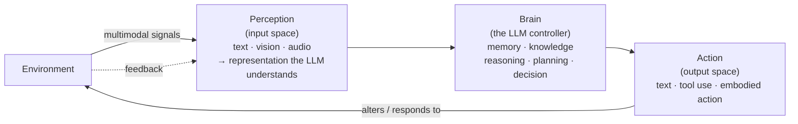

This is a technical dissection of **"The Rise and Potential of LLM-Based Agents: A Survey"** (Xi et al., Fudan NLP). A survey has no single method to reverse-engineer, so the engineering payoff is different: it gives you a **shared vocabulary and a decomposition** for a field that was, in 2023, a scatter of one-off systems. The one idea worth carrying is the **Brain–Perception–Action framework** — a way to look at *any* agent (ReAct, AutoGPT, Voyager, a tool-calling API wrapper) and say precisely which part it implements and which it leaves out. **[Interpretation]**

I'm not reproducing the survey's 600+ citations. I'm extracting the framework, the multi-agent and human-agent taxonomies, and the open problems — the parts an engineer designing an agent actually reuses. **[Interpretation]**

**Attribution convention.** Because this article mixes what the survey states with my own reasoning, every non-obvious claim is tagged:

- **[Paper]** — stated explicitly in Xi et al. (arXiv:2309.07864).
- **[Derived]** — a logical consequence of the survey's setup, worked out here.
- **[Interpretation]** — my explanation or engineering framing, written for the reader; not a claim the survey makes.

---

## Why This Survey Matters

For decades, agent research chased **specific capabilities on specific tasks** — symbolic reasoning, or mastering Go and Chess — and improved *algorithms and training strategies* rather than a model's general abilities. **[Paper]** What the field lacked was a **general, powerful starting point**: one model versatile enough to anchor agents across diverse scenarios. **[Paper]**

LLMs changed that. Their broad capabilities make them a plausible foundation for *general* agents, and a wave of LLM-agent systems followed. **[Paper]** But that wave was chaotic — every project reinvented memory, planning, and tool use in its own idiom. The survey's contribution is to impose **structure**: trace the concept of "agent" from philosophy through AI, argue why an LLM is a suitable agent *brain*, and then give a framework that makes disparate systems comparable. **[Paper]** For a builder, that framework is a **design checklist**. **[Interpretation]**

### Why an LLM makes a good "brain"

The classic AI agent senses its environment, decides, and acts. **[Paper]** The survey argues LLMs supply the decision core because they bring, out of the box: natural-language **interaction**, stored **knowledge** and world understanding, **reasoning and planning**, and **generalization** to unseen tasks via in-context and continual learning. **[Paper]** Those are exactly the "inherent general abilities" prior agent work neglected. **[Interpretation]**

## The Core Framework: Brain, Perception, Action

The survey decomposes an LLM agent into **three modules**, and the framework "can be tailored" — not every agent uses every part. **[Paper]**

- **Brain — the controller.** Primarily the LLM. It stores memory, information, and knowledge, and performs the indispensable work: information processing, decision-making, reasoning, and planning. It is "the key determinant of whether the agent can exhibit intelligent behaviors." **[Paper]**
- **Perception — the input space.** The agent's sensory organs. Its job is to **expand the perceptual space from text-only to multimodal** — text, visual, auditory, and beyond — and convert those signals into a representation the LLM can consume. **[Paper]**
- **Action — the output space.** The agent's limbs. It **expands the action space** so the agent can produce text, **use tools**, and take **embodied actions** — responding to, and even reshaping, the environment. **[Paper]**

**The workflow is a loop.** The survey's own example: a human asks whether it will rain → *perception* converts the instruction into an LLM-readable form → *brain* reasons over current weather plus internet reports → *action* responds and hands over an umbrella. Repeat, and the agent **continuously takes feedback and interacts** with its environment. **[Paper]** This perceive-think-act loop is the spine every concrete agent hangs off of. **[Interpretation]**

## Inside the Brain: Memory and Planning Are the Hard Parts

The brain subsumes several capabilities, but two are where most engineering effort actually goes. **[Interpretation]**

**Memory.** An LLM's context window is finite, so long-horizon agents need explicit memory. The survey groups the techniques into three practical moves: **[Paper]**

- **Summarizing memory** — condense past observations, thoughts, and actions into summaries (e.g. Generative Agents, Reflexion). **[Paper]**
- **Compressing memory with vectors or data structures** — store embeddings or structured records for scalable recall (e.g. ChatDev, GITM, ChatDB). **[Paper]**
- **Retrieval** — automated or interactive lookup to pull the relevant memory back into context when needed. **[Paper]**

Related brain problems it catalogs: **editing wrong/outdated knowledge**, **mitigating hallucination**, and **raising the Transformer length limit** — all recognizably the pain points of production agents. **[Interpretation]**

**Reasoning and planning.** The survey splits this into: **[Paper]**

- **Reasoning** — the [Chain-of-Thought](/engineering/chain-of-thought-prompting-elicits-reasoning/) family, [Self-Consistency](/engineering/self-consistency-improves-chain-of-thought-reasoning/), Self-Refine, Selection-Inference. **[Paper]**
- **Plan formulation** — decompose a goal into steps (Least-to-Most, Tree-of-Thoughts, HuggingGPT, LLM+P). **[Paper]**
- **Plan reflection** — revise the plan against feedback ([ReAct](/engineering/react-synergizing-reasoning-acting/), Inner Monologue, Voyager, SelfCheck). **[Paper]**

Read this way, the reasoning-prompting and agent papers already in this collection aren't rivals — they're **modules that plug into the brain's reasoning/planning slot**. **[Interpretation]**

## Perception and Action: Expanding the Two Spaces

The framing that makes perception and action click is **spaces**: **[Interpretation]**

- **Perception widens the *input* space** — from text to visual, auditory, and other modalities, so the agent can ground decisions in richer signals. **[Paper]** (This is exactly the axis a video-grounding VLM like [Molmo2](/engineering/molmo2-open-vision-language-models-video-grounding/) pushes on.) **[Interpretation]**
- **Action widens the *output* space** — beyond emitting text to **tool use** (call an API, a calculator, a retriever) and **embodied action** (move a robot arm). **[Paper]** [Toolformer](/engineering/toolformer-language-models-can-teach-themselves-to-use-tools/) is the "learned tool use" instance of this module; ReAct is the "prompted, interactive" instance. **[Interpretation]**

A single frozen LLM does neither natively — perception and action are the **adapters** that connect the brain to the world. **[Interpretation]**

## Multi-Agent Systems: A Clean Taxonomy

When you compose several agents, the survey offers a taxonomy worth memorizing: **cooperative** vs **adversarial**. **[Paper]**

**Cooperative — disordered.** Three or more agents speak freely, giving feedback with no fixed sequence or workflow. **[Paper]** Effective but messy: a **coordinating agent** can consolidate the responses, though distilling signal from a flood of feedback is itself hard; **majority voting** is another aggregation option (e.g. nine "supreme justice" agents voting on rulings). **[Paper]**

**Cooperative — ordered.** Agents follow rules — speak in sequence, each attending only to the upstream output — which sharply improves efficiency. **[Paper]** CAMEL's role-playing user/assistant dialogue and **MetaGPT** (encoding the software-engineering waterfall into agent prompts, standardizing I/O as engineering documents) are the exemplars. **[Paper]**

**Adversarial.** Borrowing from game theory and self-play (à la AlphaGo Zero), agents **debate, argue, and compete**; by "abandoning rigid beliefs" and reflecting, response quality improves. **[Paper]**

The load-bearing warning: **without rules, frequent agent-to-agent interaction can amplify minor hallucinations indefinitely** — MetaGPT surfaced exactly this, and the survey points to **cross-validation and timely external feedback** as mitigations. **[Paper]** For anyone building multi-agent pipelines, that's the failure mode to design against first. **[Interpretation]**

## Human-Agent Collaboration: Two Paradigms

- **Instructor-Executor.** The human instructs; the agent executes and refines through interaction. **[Paper]** To reduce the human burden, the agent acts autonomously and the human only supplies **feedback** — **quantitative** (binary/rating/comparative scores, easy to collect but can oversimplify intent) or **qualitative** (natural-language critique, richer but harder for the agent to parse). **[Paper]** Combining feedback types works better, and re-training on multi-round feedback is continual learning. **[Paper]**
- **Equal Partnership.** The agent participates as a peer — an **empathetic communicator** that detects and expresses emotion, and a **human-level participant** cooperating from a human perspective. **[Paper]**

The engineering takeaway: your feedback channel is a **design decision**, not an afterthought — its granularity directly shapes how fast and how faithfully the agent aligns to intent. **[Interpretation]**

## Open Problems (the honest limits)

The survey's open problems double as a risk register for anyone shipping agents: **[Interpretation]**

- **Are LLM agents a path to AGI?** Genuinely contested — proponents point to emergent understanding from next-token prediction at scale; opponents argue autoregressive models are merely reactive and need a **world model** to reason about how the world works. **[Paper]**
- **Virtual → physical gap.** Simulated environments are bounded, task-specific, and guarantee that actions execute; the real world is boundless and **hardware (sensors, robot arms) may not faithfully execute an instruction**. **[Paper]**
- **Collective intelligence.** More agents does **not** guarantee smarter collectives — you must actively coordinate to avoid **groupthink** and cognitive bias. **[Paper]**
- **Agent-as-a-Service (AaaS/LLMAaaS).** Because agents are more complex than raw LLMs, serving them as a cloud service (like IaaS/PaaS/SaaS) is an emerging deployment model with its own scaling and interface challenges. **[Paper]**

## How This Connects to the Rest of the Stack

The framework's real value here is that it **situates the other agent papers in this collection** as modules: **[Interpretation]**

- **[ReAct](/engineering/react-synergizing-reasoning-acting/)** — the perceive-think-act *loop* itself, with reasoning traces (brain) interleaved with actions (action module). **[Interpretation]**
- **[Toolformer](/engineering/toolformer-language-models-can-teach-themselves-to-use-tools/)** — the **action** module's tool-use, learned into the weights rather than prompted. **[Interpretation]**
- **[Chain-of-Thought](/engineering/chain-of-thought-prompting-elicits-reasoning/)** and **[Self-Consistency](/engineering/self-consistency-improves-chain-of-thought-reasoning/)** — the **brain's reasoning** slot; Self-Consistency's majority vote even reappears as a multi-agent aggregation strategy. **[Interpretation]**
- **[Molmo2](/engineering/molmo2-open-vision-language-models-video-grounding/)** — the **perception** module widened to video, plus grounded action outputs. **[Interpretation]**

## Engineering Takeaway

- Decompose every agent into **Brain (controller) + Perception (input space) + Action (output space)**, connected by a **perceive-think-act feedback loop** — then check which module each design choice touches. **[Paper]**
- The brain's **memory** (summarize / compress / retrieve) and **reasoning-planning** (reason → formulate plan → reflect) are where most engineering effort lands. **[Paper]**
- Multi-agent design splits into **cooperative (disordered vs ordered) and adversarial (debate/self-play)** — and unrules cooperation **amplifies hallucination**, so add cross-validation and external feedback. **[Paper]**
- The **feedback channel** in human-agent collaboration (quantitative vs qualitative) is a first-class design choice. **[Interpretation]**
- The unsolved parts — the **virtual-to-physical gap** and **coordinating many agents into collective intelligence** — are where the hard engineering still is. **[Paper]**

The single sentence to carry away: **an LLM agent is a brain (the model) wired through perception and action into a feedback loop with its world — and almost every agent paper is really about improving one of those three boxes.** **[Interpretation]**
