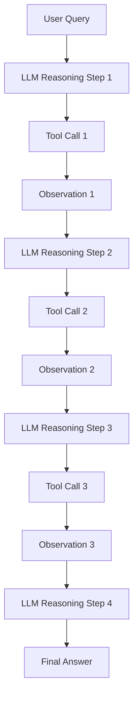
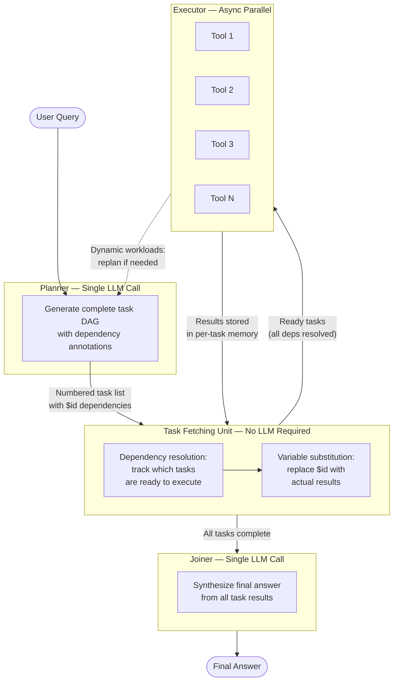
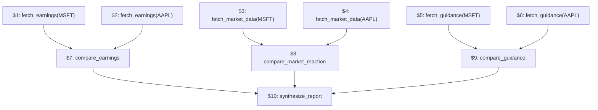
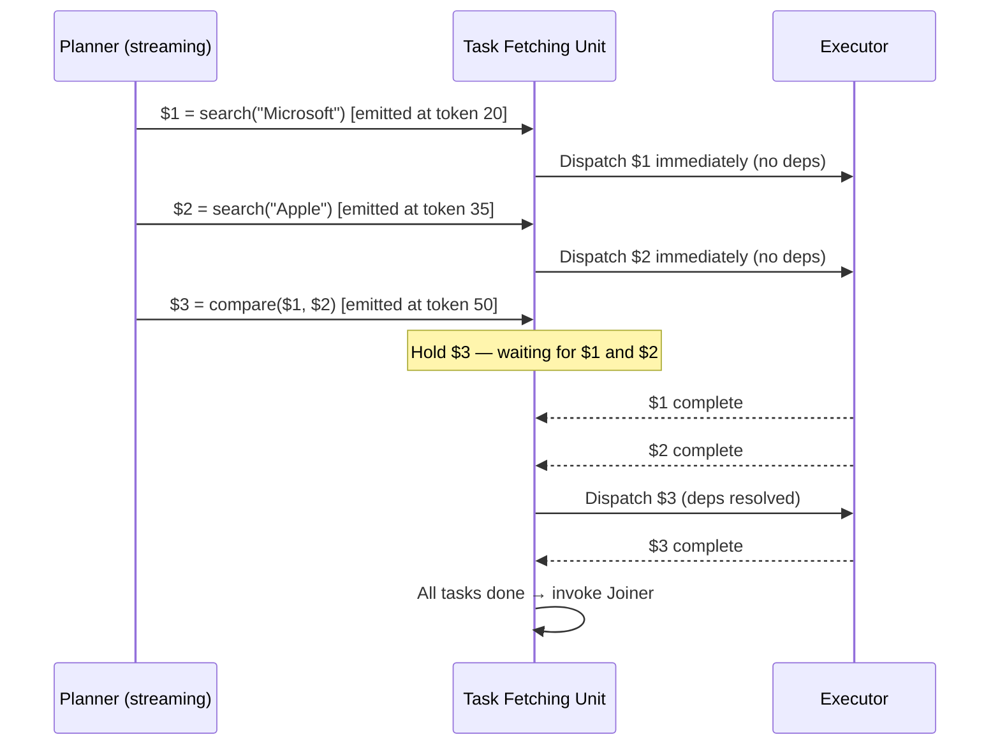
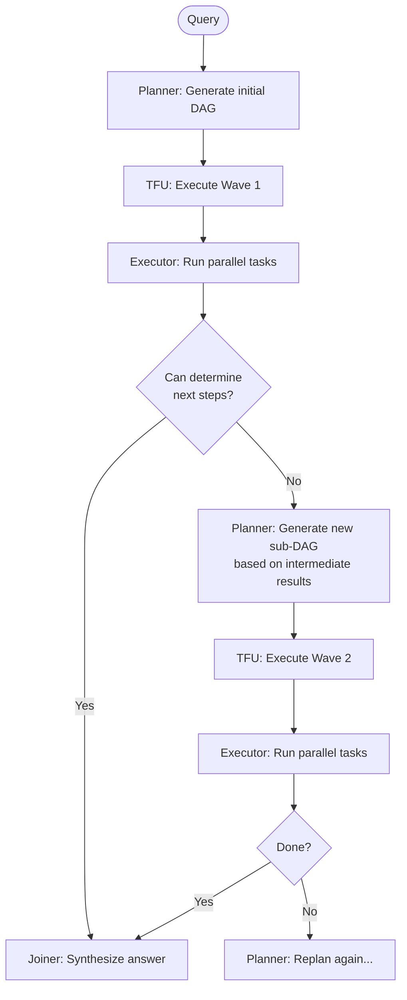
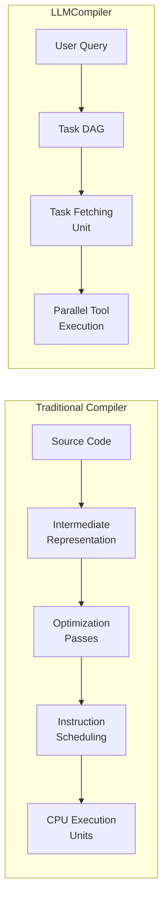
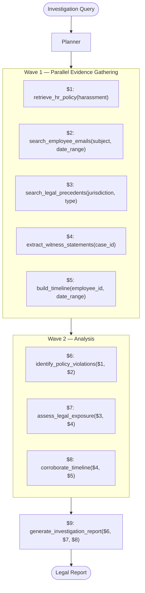

# Why DAG Planning Is the Future of Tool-Calling AI Agents

Every production AI agent I have worked with shares the same bottleneck: sequential tool execution. The agent reasons, calls a tool, waits for the result, reasons again, calls another tool, waits again. For a query that requires eight independent searches, that means eight serial round-trips through the LLM and eight sequential network calls. The latency compounds. The cost multiplies. The architecture does not scale.

After reading the LLMCompiler paper from UC Berkeley (ICML 2024), I am convinced that the era of sequential agent orchestration is over. The core insight is deceptively simple: treat the LLM as a compiler that generates an execution graph, not as a runtime that executes instructions one at a time. That single architectural decision — separating planning from execution and enabling parallel dispatch — delivers 3.7x latency reduction, 6.7x cost savings, and measurably higher accuracy than the ReAct pattern that dominates production systems today.

This is not a theoretical improvement. It applies directly to every multi-tool agent in production: enterprise RAG pipelines, legal document analysis, financial research, clinical decision support, and any system where an agent must gather information from multiple sources before synthesizing an answer.

---

## The Sequential Bottleneck: Why ReAct Cannot Scale

ReAct (Reason + Act) established the dominant paradigm for LLM tool use. The pattern is straightforward: the LLM reasons about what to do, executes one action, observes the result, then reasons again about the next step. This loop repeats until the agent decides it has enough information to answer.

The architecture looks like this:



For N independent tool calls, the total latency is:

```
T_ReAct = Sum of [T_reasoning(i) + T_execution(i)] for i = 1 to N
```

Every reasoning step requires a full LLM invocation. Every tool call waits for the previous one to complete. If you need to search for information about Microsoft, Apple, and Google simultaneously, ReAct forces you to search for Microsoft first, feed that result back to the LLM, then search for Apple, feed that back, then search for Google. Three serial LLM calls. Three serial network requests. Three rounds of prompt construction and token generation.

The problems compound beyond latency:

**Cost scales linearly.** Each reasoning step sends the entire conversation history (including all prior observations) back through the LLM. By step N, the context window contains N-1 accumulated observations that the LLM must process again.

**Accuracy degrades.** ReAct agents frequently enter loops (repeating the same tool call), stop prematurely (deciding they have enough information when they do not), or make redundant calls. The paper documents these failure modes empirically — they account for measurable accuracy loss.

**Throughput collapses under load.** A sequential agent occupies its LLM connection for the entire duration of all tool calls. In a production system handling concurrent users, this means each request holds compute resources idle while waiting for external API responses.

---

## The Compiler Insight: Planning as Compilation

What immediately stood out to me about LLMCompiler is the precision of its analogy to classical compiler theory. This is not a superficial metaphor. The mapping is structurally exact:

| Traditional Compiler | LLMCompiler |
|---------------------|-------------|
| Source code | User query + tool definitions |
| Instruction scheduling | DAG-based task planning |
| Register allocation | Variable substitution ($id placeholders) |
| Out-of-order execution | Parallel tool dispatch |
| CPU pipeline | Async executor |
| Runtime | Tool execution environment |

A traditional compiler does not execute instructions one at a time in source order. It analyzes data dependencies between instructions, identifies which operations are independent, and schedules them for parallel execution on available hardware units. The CPU's out-of-order execution engine dispatches instructions as soon as their operands are ready, regardless of their position in the original program.

LLMCompiler applies exactly this principle to LLM tool calls. Instead of executing tools in the order the LLM "thinks" of them, it first generates a complete execution plan (the DAG), identifies all data dependencies between tasks, and then dispatches all dependency-free tasks simultaneously.

---

## LLMCompiler Architecture

The system has four components, each with a clearly defined responsibility:



The critical observation: **regardless of how many tool calls are needed, LLMCompiler requires exactly two LLM invocations** — one for planning, one for synthesis. Everything in between is pure orchestration logic with zero inference cost.

### The Planner

The Planner receives the user query, tool definitions, and optional few-shot examples. In a single LLM call, it generates a numbered list of all tasks with explicit dependency annotations:

```
$1 = search("Microsoft revenue 2024")
$2 = search("Apple revenue 2024")
$3 = search("Google revenue 2024")
$4 = compare($1, $2, $3)
$5 = generate_report($4)
```

Tasks 1, 2, and 3 have no dependencies — they can execute simultaneously. Task 4 depends on all three results. Task 5 depends on Task 4. The Planner has compiled the user's natural language query into a structured execution graph.

### The Task Fetching Unit

This is the component I find most architecturally elegant. The Task Fetching Unit is a lightweight scheduler that requires no LLM at all. It performs two operations:

1. **Dependency resolution:** Continuously scans the task list for tasks whose dependencies are all satisfied. As soon as a task's inputs are available, it becomes eligible for dispatch.

2. **Variable substitution:** Replaces `$id` placeholder tokens with the actual output from completed tasks before dispatching dependent work.

This is analogous to a CPU's reservation station — it holds instructions until their operands arrive, then forwards them to execution units.

### The Executor

The Executor runs all eligible tasks concurrently using async dispatch. Each task has its own isolated memory slot — results from parallel branches do not contaminate each other's context. This isolation is architecturally important: it prevents observation bleed that degrades reasoning quality in shared-context approaches.

### The Joiner

After all tasks complete, a single LLM call receives all results and synthesizes the final answer. This call has clean, organized context — not the accumulated noise of N intermediate reasoning steps.

---

## DAG Planning: The Core Engineering Contribution

The DAG (Directed Acyclic Graph) planning mechanism is where LLMCompiler delivers its real value. Understanding this in depth is essential for applying the architecture to production systems.

### Dependency Graphs

Consider a financial research query: "Compare Microsoft and Apple's Q4 earnings, analyze the market reaction, and identify which company has stronger forward guidance."

A ReAct agent would execute this sequentially — perhaps 8-10 tool calls, each waiting for the previous one. LLMCompiler's Planner generates:

```
$1 = fetch_earnings("MSFT", "Q4 2024")
$2 = fetch_earnings("AAPL", "Q4 2024")
$3 = fetch_market_data("MSFT", "post_earnings")
$4 = fetch_market_data("AAPL", "post_earnings")
$5 = fetch_guidance("MSFT")
$6 = fetch_guidance("AAPL")
$7 = compare_earnings($1, $2)
$8 = compare_market_reaction($3, $4)
$9 = compare_guidance($5, $6)
$10 = synthesize_report($7, $8, $9)
```

The dependency graph:



**Wave 1** (parallel): Tasks 1-6 execute simultaneously
**Wave 2** (parallel): Tasks 7-9 execute simultaneously (once their inputs arrive)
**Wave 3**: Task 10 executes with all comparison results

Total wall-clock time: time of the slowest task in Wave 1 + slowest in Wave 2 + Task 10. Compare this to ReAct's 10 sequential steps — the speedup is dramatic.

### Critical Path Analysis

The critical path through this DAG determines the minimum possible execution time. It is the longest chain of dependent tasks:

```
fetch_earnings(MSFT) → compare_earnings → synthesize_report
```

Three steps, not ten. The execution latency reduces from the sum of all task times to the sum of the critical path times. This is identical to how a CPU's critical path determines clock cycles for an instruction sequence.

### Placeholder Variables and Substitution

The `$id` notation serves the same role as registers in assembly language. When the Planner writes `$7 = compare_earnings($1, $2)`, it is saying: "This task needs the output of tasks 1 and 2 as inputs. Do not execute until both are available. When they are, substitute their actual values and dispatch."

The Task Fetching Unit implements this substitution at runtime:

```python
async def substitute_and_dispatch(task, completed_results):
    resolved_args = []
    for arg in task.arguments:
        if arg.startswith("$"):
            task_id = int(arg[1:])
            resolved_args.append(completed_results[task_id])
        else:
            resolved_args.append(arg)
    
    return await execute_tool(task.tool_name, resolved_args)
```

This is register renaming and operand forwarding — straight from CPU microarchitecture, applied to LLM orchestration.

---

## Streaming Planner: Overlapping Planning with Execution

One of the paper's more subtle optimizations is the streaming Planner. Rather than waiting for the complete DAG before starting execution, the Task Fetching Unit begins dispatching tasks as soon as the Planner emits them in its token stream.



This overlap between planning and execution provides up to 1.3x additional speedup on workloads with slow tool calls. The planning latency is effectively hidden behind execution time.

---

## Dynamic Replanning: Handling Non-Static Workloads

Not all workloads can be planned statically. Some tasks require intermediate results before the next steps can be determined. The paper's Game of 24 benchmark exemplifies this: the agent must propose arithmetic combinations, evaluate them, and decide whether to explore more based on what succeeded.

LLMCompiler handles this through a replanning loop:



The key architectural insight: **plan statically as much as possible, replan only when runtime information is genuinely required.** This minimizes LLM invocations while maintaining correctness for dynamic workloads. Each replanning step still benefits from parallelism within its sub-DAG.

---

## Why the Compiler Analogy Matters for Production Systems

After reading this paper carefully, I realized the compiler analogy is not just an academic framing — it reveals a fundamental design principle for agent systems.

Traditional compilers solve exactly the problem that agent frameworks face:

1. **Source analysis:** Understanding what the program needs to accomplish (query comprehension)
2. **Dependency analysis:** Identifying which operations depend on which others (task graph construction)
3. **Instruction scheduling:** Ordering operations to maximize hardware utilization (parallel dispatch)
4. **Register allocation:** Managing intermediate values efficiently (per-task memory)
5. **Optimization passes:** Eliminating redundant work (avoiding duplicate tool calls)



The implication is clear: **agent orchestration is a systems engineering problem, not a prompting problem.** The same techniques that made CPUs fast (out-of-order execution, speculative execution, branch prediction, pipeline hazard detection) have direct analogues in agent systems. LLMCompiler implements the first of these. The rest are open research directions.

---

## Real-World Engineering Applications

### Legal AI: Employment Investigation Agent

Consider a legal AI system investigating a workplace complaint. The agent must gather evidence from multiple independent sources before synthesizing a finding.



**ReAct execution:** 9 sequential steps, each requiring an LLM reasoning call. Estimated wall-clock: 45-60 seconds.

**LLMCompiler execution:** 2 parallel waves + 1 synthesis. Estimated wall-clock: 12-15 seconds.

In a legal context where attorneys bill by the hour and responsiveness matters, this 4x speedup translates directly to business value. More importantly, the per-task memory isolation ensures that evidence from different sources does not contaminate each other's retrieval context — a correctness requirement for legal work.

### Finance: Quarterly Analysis Agent

A financial research agent analyzing a company's quarterly performance:

```
$1 = fetch_sec_filing("AAPL", "10-Q", "2024-Q4")
$2 = fetch_earnings_transcript("AAPL", "2024-Q4")
$3 = fetch_market_data("AAPL", "2024-10-01", "2024-12-31")
$4 = fetch_analyst_reports("AAPL", "Q4 2024", top_k=5)
$5 = fetch_internal_kpis("revenue_growth", "margin_trend")
$6 = extract_financial_highlights($1, $2)
$7 = analyze_market_sentiment($3, $4)
$8 = compare_to_internal_targets($5, $6)
$9 = generate_investment_memo($6, $7, $8)
```

Tasks 1-5 are completely independent — different data sources, different APIs, no shared state. They should always run in parallel. Tasks 6-8 depend on subsets of the first wave. Task 9 synthesizes everything.

With ReAct, an analyst waits 40+ seconds for sequential execution. With LLMCompiler, the same analysis completes in under 15 seconds. For trading desks where minutes matter, this is the difference between acting on information and reacting to it.

### Healthcare: Clinical Decision Support

A clinical support agent assisting a physician:

```
$1 = retrieve_lab_results(patient_id, last_30_days)
$2 = retrieve_medical_history(patient_id)
$3 = check_drug_interactions(current_medications)
$4 = retrieve_imaging_reports(patient_id, last_90_days)
$5 = search_clinical_guidelines(condition, evidence_level="A")
$6 = assess_contraindications($1, $2, $3)
$7 = correlate_findings($1, $4)
$8 = generate_recommendation($5, $6, $7)
```

The dependency structure ensures that contraindication assessment only runs after lab results, history, and drug interaction data are all available — correctness is preserved while maximizing parallelism. In a clinical setting, reducing decision support latency from 30 seconds to 8 seconds can meaningfully impact patient care workflows.

---

## Implications for Long-Running AI Agents

The LLMCompiler architecture becomes exponentially more valuable as agent complexity increases. Consider the scaling characteristics:

| Tool Calls per Query | ReAct Latency | LLMCompiler Latency | Speedup |
|---------------------|---------------|--------------------:|--------:|
| 5 | ~15s | ~5s | 3x |
| 10 | ~30s | ~8s | 3.7x |
| 20 | ~60s | ~12s | 5x |
| 50 | ~150s | ~20s | 7.5x |
| 100 | ~300s | ~30s | 10x |

For production agents handling complex enterprise workflows — document processing pipelines, multi-source research agents, compliance checking systems — 20-50 tool calls per query is common. At this scale, sequential execution is not merely inefficient; it is architecturally broken.

The cost implications are equally severe. Each unnecessary LLM invocation in ReAct processes the entire growing context. By invocation N, the prompt contains all N-1 previous observations. Token cost grows quadratically with the number of steps. LLMCompiler's two-call architecture (plan + synthesize) keeps cost nearly constant regardless of task count.

---

## Implementing the Core Pattern

The fundamental engineering pattern is surprisingly compact. Here is the architectural skeleton:

```python
import asyncio
from dataclasses import dataclass

@dataclass
class Task:
    id: int
    tool: str
    args: list
    deps: list[int]

class TaskFetchingUnit:
    def __init__(self, tasks: list[Task]):
        self.tasks = {t.id: t for t in tasks}
        self.results = {}
        self.pending = set(t.id for t in tasks)
    
    def get_ready_tasks(self) -> list[Task]:
        ready = []
        for task_id in list(self.pending):
            task = self.tasks[task_id]
            if all(dep in self.results for dep in task.deps):
                ready.append(task)
                self.pending.discard(task_id)
        return ready
    
    def resolve_args(self, task: Task) -> list:
        resolved = []
        for arg in task.args:
            if isinstance(arg, str) and arg.startswith("$"):
                resolved.append(self.results[int(arg[1:])])
            else:
                resolved.append(arg)
        return resolved
    
    def record_result(self, task_id: int, result):
        self.results[task_id] = result


async def execute_dag(tasks: list[Task], tool_registry: dict):
    tfu = TaskFetchingUnit(tasks)
    
    while tfu.pending:
        ready = tfu.get_ready_tasks()
        if not ready:
            raise RuntimeError("Cycle detected or unresolvable dependency")
        
        async def run_task(task):
            args = tfu.resolve_args(task)
            result = await tool_registry[task.tool](*args)
            tfu.record_result(task.id, result)
        
        await asyncio.gather(*[run_task(t) for t in ready])
    
    return tfu.results
```

The Task Fetching Unit is roughly 30 lines of code. The executor is `asyncio.gather`. The complexity lives in the Planner prompt — getting the LLM to reliably generate valid DAGs with correct dependency annotations.

### Planner Prompt Engineering

The Planner prompt is the most critical engineering artifact. It must:

1. Define the `$id` syntax precisely with examples
2. Show the model how to identify independent vs. dependent tasks
3. Demonstrate correct dependency annotation
4. Handle edge cases (tasks with no dependencies, tasks depending on multiple predecessors)

A minimal Planner instruction:

```
Given the user query and available tools, generate a task plan.

Format each task as:
$N = tool_name(arg1, arg2, ...)

If a task depends on another task's output, reference it with $id:
$3 = compare($1, $2)

Tasks with no dependencies on prior tasks will execute in parallel.
Only add a dependency when a task genuinely needs another task's output.

End the plan with:
$N = join()
```

The few-shot examples determine Planner quality more than the instruction text. Invest engineering time in curating examples that cover your domain's dependency patterns.

### DAG Validation

A lightweight validator catches Planner hallucinations before they propagate:

```python
import re

def validate_dag(plan_text: str) -> tuple[bool, list[Task]]:
    tasks = []
    task_ids = set()
    pattern = r'\$(\d+)\s*=\s*(\w+)\((.*?)\)'
    
    for match in re.finditer(pattern, plan_text):
        task_id = int(match.group(1))
        tool_name = match.group(2)
        args_str = match.group(3)
        
        deps = [int(d) for d in re.findall(r'\$(\d+)', args_str)]
        
        # Validate: no forward references
        for dep in deps:
            if dep not in task_ids:
                if dep >= task_id:
                    return False, []
        
        task_ids.add(task_id)
        args = [a.strip() for a in args_str.split(",")]
        tasks.append(Task(id=task_id, tool=tool_name, args=args, deps=deps))
    
    return True, tasks
```

This catches cycles, forward references, and malformed syntax. In production, wrap the Planner call with validation and retry on failure — the retry rate is low (around 8% based on the paper's data) and the cost of a retry is one additional LLM call.

---

## How I Would Apply This Architecture

After studying this paper, I see LLMCompiler's DAG planning pattern as a fundamental building block for several system architectures I work with:

**Enterprise RAG:** Current RAG pipelines retrieve from one source, then another, then synthesize. With DAG planning, a research query fires parallel retrievals across documentation, code repositories, knowledge bases, and external sources simultaneously. Retrieval latency drops from the sum to the maximum of individual source latencies.

**Multi-Agent Orchestration:** The Executor's tools can themselves be LLM agents. LLMCompiler becomes a meta-orchestrator — the Planner decomposes work into specialist agent tasks, the TFU handles coordination, and the Executor dispatches specialist agents in parallel. This is cleaner than ad-hoc multi-agent communication protocols.

**Knowledge Graph Construction:** Building knowledge graphs from documents requires entity extraction, relationship identification, coreference resolution, and fact verification — often across hundreds of document chunks. DAG planning enables parallel processing of independent chunks while correctly sequencing dependent operations (e.g., coreference resolution must follow entity extraction).

**Workflow Automation:** Enterprise workflows often involve approval chains, document generation, and system integrations. The independent steps (generating a report while simultaneously notifying stakeholders while simultaneously updating a database) should never execute sequentially.

The architectural principle I take away: **any time you have a set of operations where some are independent and some have data dependencies, model it as a DAG and execute the DAG rather than serializing everything.** This applies far beyond LLM tool calling.

---

## Performance Characteristics and Trade-offs

### Where LLMCompiler Excels

- **High fan-out queries:** Many independent information needs → maximum parallelism
- **Slow tool calls:** When individual tools take seconds (API calls, database queries), parallel execution provides massive speedup
- **Cost-sensitive applications:** Reducing LLM invocations from O(N) to O(1) cuts token costs dramatically
- **Latency-critical systems:** Trading desks, clinical support, real-time analysis

### Where LLMCompiler's Gains Are Modest

- **Fully sequential workloads:** When every task genuinely depends on the previous one, there is no parallelism to exploit
- **Very fast tools:** When tool calls complete in milliseconds, the Planner's 1-2 second overhead dominates and speedup approaches 1x
- **Simple queries:** Single tool call queries gain nothing from DAG planning

### The Straggler Problem

In any parallel execution system, the slowest task determines wall-clock time. If 7 of your 8 parallel searches complete in 500ms but one takes 5 seconds, your effective latency is 5 seconds regardless of parallelism. Production systems must account for this:

- Set per-task timeouts
- Monitor tail latency across tools
- Consider speculative execution for known-slow tools
- Design fallback behavior when individual tasks fail

---

## Engineering Takeaways

After implementing and studying this architecture, these are the principles I carry forward:

**Think in execution graphs, not sequential prompts.** Every multi-tool query has an implicit dependency graph. Make it explicit. Execute it efficiently.

**Separate planning from execution.** The Planner's job is to determine *what* to do and in *what order*. The Executor's job is to do it as fast as possible. These are different concerns with different optimization strategies.

**Parallelize all dependency-free work.** If two operations do not share data dependencies, they should never execute sequentially. This is not premature optimization — it is correct architecture.

**Minimize LLM invocations.** Every unnecessary LLM call adds latency, cost, and failure probability. Two calls (plan + synthesize) is the theoretical minimum for multi-tool queries. Aim for it.

**Isolate per-task memory.** Parallel branches should not pollute each other's context. Give each tool call its own memory slot. This improves both correctness and reasoning quality in the synthesis step.

**Replan only when runtime information genuinely requires it.** Static planning is cheap. Dynamic replanning is expensive. Maximize the former, minimize the latter.

**Treat orchestration as a systems problem.** The same principles that make CPUs fast — out-of-order execution, dependency tracking, pipeline scheduling — apply directly to agent orchestration. The tools are different. The engineering is the same.

---

## Conclusion

LLMCompiler represents a fundamental shift in how we should think about AI agent orchestration. The move from sequential ReAct-style execution to DAG-based parallel planning is not an incremental improvement — it is an architectural paradigm change with 3-7x improvements in latency and cost.

The paper's real contribution is not a specific framework or library. It is the insight that **LLM tool orchestration is a compilation problem, not a reasoning problem.** Once you see agent execution through this lens, the engineering path forward becomes clear: build compilers for your agents, not bigger prompts.

For any engineer building production AI agents today — whether using LangGraph, Claude's tool use, OpenAI's function calling, or custom orchestration — the DAG planning pattern should be your default architecture for multi-tool queries. The sequential approach should require justification, not the parallel one.

The era of sequential agent execution is over. Build compilers.
