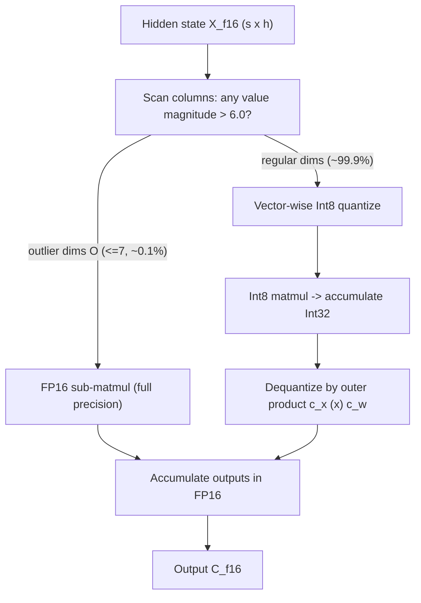

This is a technical dissection of **LLM.int8()** — Dettmers, Lewis, Belkada, and Zettlemoyer's 8-bit matrix-multiplication procedure for large transformers. The focus is the engineering system: why the obvious way to quantize a model to 8 bits silently collapses once the model gets large, the finer-grained quantization that buys some headroom, the surprising empirical phenomenon that explains the collapse, and the decomposition that works around it while keeping almost everything in Int8.

We are not reproducing the full benchmark suite. The perplexity and zero-shot tables matter here only as evidence that the memory saving is genuinely free of accuracy cost.

**Attribution convention.** Because this article mixes what the paper says with my own reasoning, every non-obvious technical claim is tagged:

- **[Paper]** — stated explicitly in LLM.int8() (arXiv:2208.07339).
- **[Derived]** — a mathematical or logical consequence of the paper's equations, worked out here.
- **[Interpretation]** — my explanation or engineering reasoning, written for the reader; not a claim the paper makes.

---

## Why This Paper Matters

The headline is an access result: a 175B-parameter model stored in 16/32-bit can be loaded, converted to Int8 on the fly, and used **immediately for inference with no performance degradation** — halving the memory it takes to serve. **[Paper]** In concrete terms, that is the difference between OPT-175B/BLOOM needing an enterprise 8×A100 (80GB) box and fitting on a single server of consumer RTX 3090s. **[Paper]**

The reason this was hard is the interesting part. Naive 8-bit quantization does not gently lose a point of accuracy at scale — it **falls off a cliff** at a specific model size, and the paper's real contribution is explaining *why*: a systematic, emergent outlier phenomenon that appears at ~6.7B parameters and destroys quantization precision. **[Interpretation]** LLM.int8() is the engineering built around that discovery.

## The Baseline Problem: Quantization That Works Small Breaks at Scale

The target of quantization is well chosen. In transformers at and beyond 6.7B parameters, the feed-forward and attention-projection matrix multiplications account for **95% of parameters and 65-85% of compute**. **[Paper]** Halving those to 8-bit halves the memory that matters.

The trouble is precision. Prior 8-bit methods reduced memory but degraded quality, often needed post-training tuning, and had only been validated below 350M parameters. **[Paper]** The structural defect is granularity: **a single scaling constant per tensor** means one large-magnitude value stretches the quantization range so far that most bins go empty and small values round to zero — information is "extinguished." **[Paper]** The fix direction is more constants per tensor, so an outlier's damage is confined. **[Paper]**

## Background: Two Ways to Map Floats into Int8

**Absmax (symmetric) quantization** scales a tensor into $[-127, 127]$ by dividing by its absolute maximum and multiplying by 127: **[Paper]**

$$
X_{i8} = \left\lfloor \frac{127}{\max_{ij}(|X_{f16}^{ij}|)} \, X_{f16} \right\rceil = \lfloor s_{xf16}\, X_{f16} \rceil
$$

- **$\max_{ij}(|X_{f16}^{ij}|)$** — the single largest magnitude in the *whole* tensor; this is the one number that sets the scale for every element. **[Paper]**
- **$s_{xf16} = 127/\max(|X|)$** — the scaling constant; $\lfloor\cdot\rceil$ rounds to nearest integer. **[Paper]**
- The weakness is exactly here: one huge value inflates $\max(|X|)$, shrinking $s_x$ so that ordinary values collapse toward zero. **[Interpretation]**

**Zeropoint (asymmetric) quantization** shifts the distribution by a learned zeropoint so the *full* $[-127,127]$ range is used even for one-sided distributions (e.g. ReLU outputs, where absmax wastes the entire negative half). **[Paper]** It is more precise for skewed data, but it needs a special fused multiply instruction to be efficient; on GPUs/TPUs that instruction is unavailable, so the multiply must be unrolled into several Int16/32 terms — making it slow in practice, which is why it is rarely used despite its precision. **[Paper]**

## The Int8 Matmul with 16-bit Inputs and Outputs

The whole scheme keeps a 16-bit *interface* and only drops to Int8 *inside* the multiply. For hidden states $X_{f16} \in \mathbb{R}^{s\times h}$ and weights $W_{f16}\in\mathbb{R}^{h\times o}$: **[Paper]**

$$
X_{f16} W_{f16} \approx \frac{1}{c_{xf16}\, c_{wf16}}\, C_{i32} = S_{f16}\cdot A_{i8} B_{i8} = S_{f16}\cdot Q(X_{f16})\,Q(W_{f16})
$$

- **$Q(\cdot)$** — quantize to Int8 (absmax or zeropoint). **[Paper]**
- **$A_{i8}B_{i8} = C_{i32}$** — the Int8 matmul, accumulated in **Int32** to avoid overflow. **[Paper]**
- **$S_{f16} = 1/(c_{xf16}\,c_{wf16})$** — the dequantization factor that turns the Int32 accumulator back into FP16. **[Paper]**

The inputs arrive in FP16 and the output leaves in FP16; the low precision lives entirely between quantize and dequantize. **[Interpretation]**

## Part 1 — Vector-wise Quantization

The first half of LLM.int8() attacks the granularity problem. View a matmul as a grid of independent inner products between rows of $X$ and columns of $W$. Then assign a **separate scaling constant per row of $X$ and per column of $W$** — a vector $c_x\in\mathbb{R}^s$ and $c_w\in\mathbb{R}^o$ — instead of one constant for the whole tensor. **[Paper]** Dequantization becomes a division by the **outer product** $c_x \otimes c_w$: **[Paper]**

$$
C_{f16} \approx \frac{1}{c_{xf16}\otimes c_{wf16}}\, C_{i32} = S\cdot A_{i8}B_{i8}
$$

The payoff: a large value now only distorts the scale of the *one row or column* it lives in, not the entire matrix. **[Interpretation]** This is enough to preserve quality up to ~2.7B parameters. **[Paper]** Beyond that it is no longer sufficient — and the reason is the phenomenon the next section is about.

## The Heart of the Paper: Emergent Outlier Features

This is the empirical discovery that everything else follows from. As transformers scale, **large-magnitude outlier features emerge** in the hidden state — values up to 20× larger than typical — and they are anything but random noise. **[Paper]**

The key finding is that they are **systematic and sparse**: **[Paper]**

- They live in the *feature* dimension $h$ (columns), affecting **almost all** sequence positions but only a **handful of hidden dimensions**. **[Paper]**
- At the 6.7B scale (2048-token sequence), there are **~150,000 outliers per sequence** — yet they are concentrated in only **6 hidden dimensions** across the entire transformer. Up to 13B, no more than **7** dimensions are involved ($|O|\leq 7$). **[Paper]**

And there is a **phase shift**. Measured against parameter count, emergence is sudden: between 6B and 6.7B, the fraction of layers with outliers jumps from 65% to **100%**, and affected sequence positions from 35% to **75%** — and this jump co-occurs exactly with where quantization starts to fail. **[Paper]** Measured against *perplexity*, though, the same emergence looks **smooth and exponential** — and the outlier count is **strictly monotonic in perplexity** while only non-monotonic in size. **[Paper]** The paper's inference: **perplexity, not raw parameter count, determines the phase shift** — size is one covariate among several (data amount, data quality). **[Paper]**

Then the result that makes them non-negotiable. Zero out these ≤7 outlier dimensions before the attention projections and: **[Paper]**

- top-1 attention softmax probability mass drops from ~40% to ~20%,
- validation perplexity worsens by **600-1000%**,

even though the outliers are ~0.1% of all features. Zero out 7 *random* dimensions instead and top-1 changes by 0.02-0.3% and perplexity by ~0.1%. **[Paper]** These few dimensions are load-bearing for the whole model. **[Interpretation]**

The mechanism connecting this to quantization: once outlier magnitudes shoot up (Figure 4a), the quantization range is stretched so far that most bins are empty and small values quantize to zero — precisely the single-outlier failure, now firing in every layer at once. **[Paper]**

## Part 2 — Mixed-Precision Decomposition

The second half of LLM.int8() turns the sparsity of the outliers into the fix. Define the outlier dimension set by a simple magnitude threshold: **[Paper]**

$$
O = \{\, i \in \mathbb{Z} : 0 \le i \le h,\ \exists\ |X^{i}| > \alpha \,\}, \qquad \alpha = 6.0
$$

Then split the matmul so those columns go through **16-bit** and everything else through **Int8**: **[Paper]**

$$
C_{f16} \approx \sum_{h\in O} X_{f16}^{h}\, W_{f16}^{h} \;+\; S_{f16}\cdot \sum_{h\notin O} X_{i8}^{h}\, W_{i8}^{h}
$$

- **$\sum_{h\in O} X_{f16}^h W_{f16}^h$** — the outlier dimensions, kept in full FP16 precision. **[Paper]**
- **$S_{f16}\cdot\sum_{h\notin O} X_{i8}^h W_{i8}^h$** — the other **99.9%** of dimensions, in vector-wise Int8. **[Paper]**
- **$\alpha = 6.0$** — the threshold at which perplexity degradation drops to ~zero. **[Paper]**

Because $|O|\leq 7$, this "16-bit escape hatch" adds only about **0.1% extra memory** while eliminating the degradation — so the ~50% memory saving of Int8 is essentially preserved (BLOOM-176B footprint falls by 1.96×). **[Paper]**

LLM.int8() is exactly this combination: **absmax vector-wise quantization + mixed-precision decomposition.** **[Paper]**

## Why It Works — and Why Zeropoint's Edge Vanishes

A clean piece of evidence ties the whole story together. In the scaling benchmark, zeropoint quantization outperforms absmax — because the outliers are **strictly asymmetric** (nearly all positive or all negative), and zeropoint's asymmetric range handles them well. **[Paper]** But once mixed-precision decomposition pulls the outliers out into 16-bit, **zeropoint's advantage disappears** — proof that its edge was entirely about coping with those asymmetric outliers, which are now handled directly. **[Paper]** What remains is that vector-wise still beats row-wise on the leftover values, showing the extra weight-side precision is what recovers the final points of accuracy. **[Paper]**

## Systems & Memory Economics

The point of the method is deployment reach, and the paper tabulates it directly. **[Paper]**

| Hardware | GPU memory | Largest in 16-bit | Largest in **8-bit** |
|---|---|---|---|
| 8× A100 | 80 GB | OPT-175B / BLOOM | OPT-175B / BLOOM |
| 8× RTX 3090 | 24 GB | OPT-66B | **OPT-175B / BLOOM** |
| Colab Pro | 15 GB | GPT-J-6B | **OPT-66B** |
| Free Colab | 12 GB | GPT-2 1.3B | **OPT-13B** |

The 8-bit column moves an entire tier of models onto hardware that could not hold them before. **[Interpretation]** On runtime: LLM.int8() is about **2× faster** for the large matmuls of a 175B-scale model, though for models below 6.7B the quantization overhead can *slow* inference — but those already fit on most GPUs, so quantization is less needed there anyway. **[Paper]**

This is the inference-time counterpart to a train-time memory method like [LoRA](/engineering/lora-low-rank-adaptation-of-large-language-models/): LoRA shrinks the *per-task* checkpoint and training footprint by freezing the base and learning a tiny update; LLM.int8() shrinks the *base model's own* inference footprint by half. They attack the "won't fit in VRAM" wall from opposite sides and compose cleanly. **[Interpretation]**

## Engineering Trade-offs & Limitations

- **Int8 only.** The analysis is confined to Int8, the only 8-bit type GPUs support; the authors expect FP8 to be better but couldn't run it. **[Paper]**
- **Attention *function* is not quantized.** Only the FFN and projection layers are — the parameter-free attention computation would have needed extra quantization machinery for little memory gain. **[Paper]**
- **Inference, not training.** The method is for serving; Int8 training/fine-tuning at scale is left as a hard open problem (precision vs. speed vs. complexity). **[Paper]**
- **A moving target.** Validated to 175B; larger models might exhibit new emergent properties that break the scheme. **[Paper]**
- **A little irregularity.** Extracting outlier columns is a data-dependent, dynamic operation — cheap here because outliers are so few and so systematic, but it is not a plain dense matmul. **[Interpretation]**

## Did It Work?

The C4 perplexity table is the cleanest evidence — watch the 13B column, where the older methods break: **[Paper]**

| Method (C4 perplexity) | 125M | 6.7B | 13B |
|---|---|---|---|
| 32-bit Float (reference) | 25.65 | 13.30 | **12.45** |
| Int8 absmax | 87.76 | 14.59 | **19.08** (worse than 6.7B) |
| Int8 zeropoint | 56.66 | 13.49 | 13.94 |
| **LLM.int8() (vector-wise + decomp)** | 25.83 | 13.24 | **12.45** |

Plain absmax at 13B is *worse* than at 6.7B — the cliff. LLM.int8() matches the 32-bit reference exactly. **[Paper]** Zero-shot accuracy on OPT tells the same story: the 8-bit baseline degenerates toward random once outliers emerge, while LLM.int8() tracks the 16-bit baseline from 125M all the way to 175B. **[Paper]**

## Engineering Takeaway

LLM.int8() is a case study in letting an empirical discovery drive the engineering:

- The naive failure is granularity — one scale per tensor lets a single value ruin everything, so go **vector-wise** (per row, per column). **[Paper]**
- Vector-wise still breaks at ~6.7B because of a real phenomenon, not a bug: **systematic outlier features** that occupy ≤7 hidden dimensions, appear in all layers after a phase shift, and are essential to the model. **[Paper]**
- The fix exploits their sparsity — a **magnitude threshold of 6.0** peels ~0.1% of dimensions into a **16-bit** matmul while 99.9% stay in Int8, so accuracy is recovered *and* the memory saving survives. **[Paper]**

The lasting idea is the reframing of quantization as an **outlier problem**, not a rounding problem. **[Interpretation]** Most values in a large transformer quantize to 8 bits without complaint; a vanishingly small, structured set of features carry disproportionate weight and simply must stay in high precision. Recognize and isolate them, and a 175B model fits — losslessly — in half the memory.
