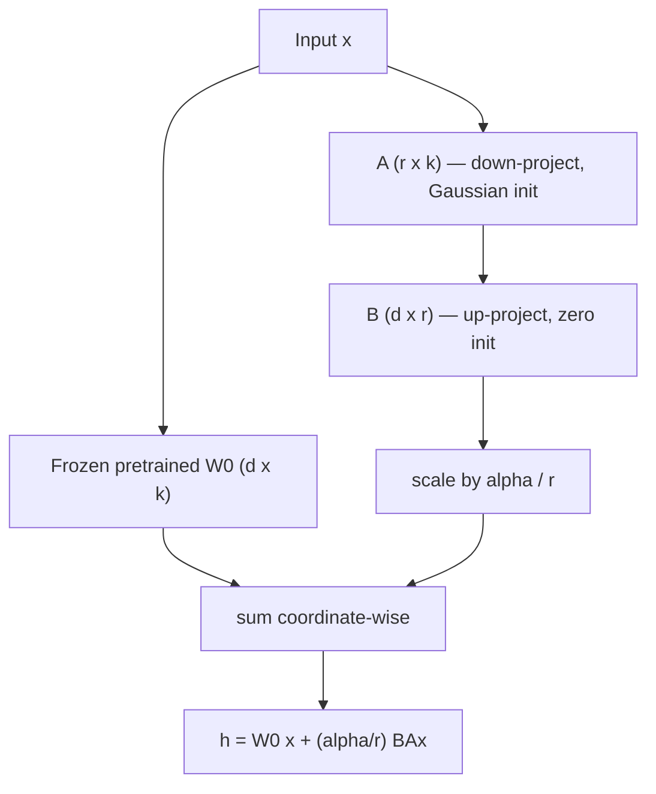
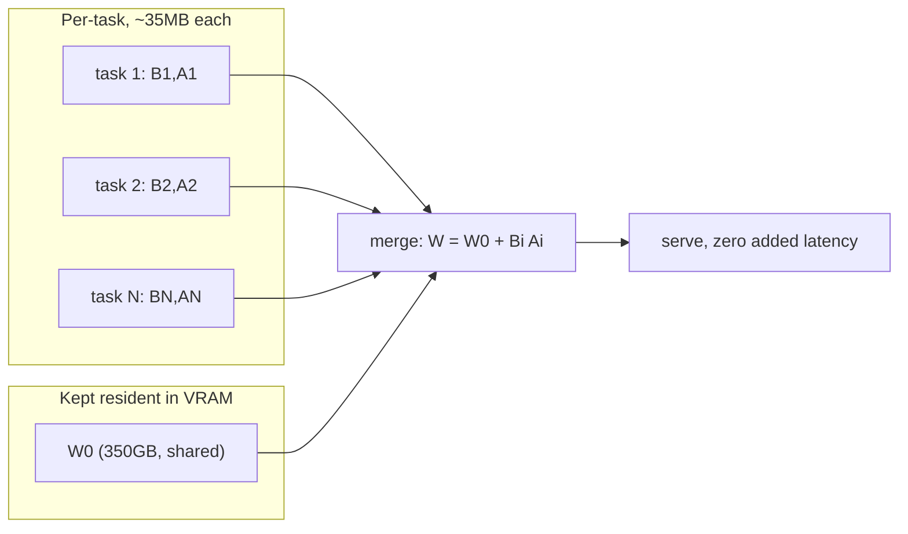

This is a technical dissection of **Low-Rank Adaptation (LoRA)** — the parameter-efficient fine-tuning method from Hu et al. The focus is the engineering mechanism: why full fine-tuning of a large model is a _deployment_ problem before it is a training problem, why the two dominant efficient-adaptation strategies each break in a production setting, the low-rank reparametrization itself, why it costs nothing at inference, the memory and storage economics, and the paper's own evidence for why the update can be so aggressively compressed.

We are not reproducing the full benchmark suite. The GLUE, E2E, and GPT-3 tables matter here only as evidence that the compression does not cost quality — the engineering story is the reparametrization and its deployment consequences.

**Attribution convention.** Because this article mixes what the paper says with my own reasoning, every non-obvious technical claim is tagged:

- **[Paper]** — stated explicitly in LoRA (arXiv:2106.09685).
- **[Derived]** — a mathematical consequence of the paper's equations, worked out here.
- **[Interpretation]** — my explanation or engineering reasoning, written for the reader; not a claim the paper makes.

---

## Why This Paper Matters

The headline number is easy to misread. LoRA reduces the trainable parameters for adapting GPT-3 175B by up to **10,000×** and the GPU memory required by about **3×**. **[Paper]** It is tempting to file that under "training is cheaper now." That is true but secondary.

The problem LoRA actually attacks is a **deployment** problem. **[Interpretation]** Full fine-tuning produces a new model whose parameter count equals the original — for GPT-3 that is a fresh 175-billion-parameter, ~350GB checkpoint _per task_. **[Paper]** If you serve ten fine-tuned variants, you store and load ten 350GB models. That is the wall LoRA is built to get around, and understanding it is the whole point of the next section.

## The Deployment Problem: Fine-Tuning Doesn't Scale With Tasks

Full fine-tuning starts from pretrained weights $\Phi_0$ and follows the gradient of the language-modeling objective to a new set $\Phi_0 + \Delta\Phi$: **[Paper]**

$$
\max_{\Phi} \sum_{(x,y)\in Z} \sum_{t=1}^{|y|} \log P_{\Phi}\big(y_t \mid x, y_{<t}\big)
$$

- $Z = \{(x_i, y_i)\}$ — the task's context–target pairs (e.g. article → summary, NL question → SQL). **[Paper]**
- $\Phi$ — **every** parameter of the model, updated. **[Paper]**

The structural defect is in the dimensionality of the increment: for each downstream task you learn a $\Delta\Phi$ with $|\Delta\Phi| = |\Phi_0|$. **[Paper]** The per-task cost is not "a bit of adaptation" — it is a second copy of the entire model. For GPT-3's 175B parameters, "storing and deploying many independent instances of fine-tuned models can be challenging, if at all feasible." **[Paper]**

LoRA reframes the objective so the task-specific increment is produced by a **much smaller** parameter set $\Theta$: **[Paper]**

$$
\max_{\Theta} \sum_{(x,y)\in Z} \sum_{t=1}^{|y|} \log P_{\Phi_0 + \Delta\Phi(\Theta)}\big(y_t \mid x, y_{<t}\big), \qquad |\Theta| \ll |\Phi_0|
$$

The pretrained $\Phi_0$ is frozen; only $\Theta$ is learned, and on GPT-3 175B $|\Theta|$ can be as small as **0.01%** of $|\Phi_0|$. **[Paper]** Everything else in the paper is about what $\Delta\Phi(\Theta)$ should be so that this stays cheap _without_ losing quality or adding latency.

## Why the Existing Efficient Methods Break in Production

The paper is careful not to claim parameter-efficient adaptation is new — it argues the existing families each fail a specific production constraint. **[Paper]** There are two dominant strategies.

### Adapter layers add inference latency

Adapter tuning inserts small bottleneck MLP layers inside each Transformer block. The parameter count is tiny (sometimes <1% of the model), so the intuition is "negligible cost." **[Paper]** That intuition is wrong in the latency-sensitive case, and the reason is a systems reason, not a FLOPs reason. **[Interpretation]**

Adapter layers **extend the depth** of the network and must be processed **sequentially** — they cannot be folded into the existing matmuls. Large models keep latency low by exploiting hardware parallelism; a sequential extra block defeats that, and it bites hardest exactly where it hurts most: **online inference with batch size one.** **[Paper]** The paper measures this on GPT-2 medium:

| Setting (batch × seq) | Fine-Tune / LoRA | AdapterL | AdapterH |
|---|---|---|---|
| 32 × 512 | 1449.4 ms | +2.2% | +3.0% |
| 16 × 256 | 338.0 ms | +5.0% | +8.4% |
| 1 × 128 | 19.8 ms | **+20.7%** | **+30.3%** |

_(Latency of a single forward pass, ms, NVIDIA Quadro RTX8000.)_ **[Paper]** The gap widens as the batch shrinks — precisely the regime real-time serving lives in. It gets worse under model sharding, where the extra depth means more synchronous `AllReduce`/`Broadcast` operations. **[Paper]**

### Prefix / prompt tuning eats the context window

The other family optimizes soft tokens prepended to the input rather than model weights. It has two problems the paper reports: it is "difficult to optimize" and its performance is **non-monotonic** in the number of trainable tokens, and — more structurally — every token reserved for adaptation is a token **subtracted from the usable sequence length** for the actual task. **[Paper]** You are paying for adaptation out of the same budget you need for the prompt.

The scorecard LoRA is implicitly writing:

| Method | Extra inference latency | Shrinks usable context | Merges into base weights |
|---|---|---|---|
| Full fine-tuning | none | no | n/a (is the weights) |
| Adapter layers | **yes** (sequential depth) | no | no |
| Prefix / prompt tuning | some | **yes** | no |
| LoRA | **none** (by construction) | no | **yes** |

LoRA's design goal falls straight out of this table: get adapter-level parameter efficiency **without** the sequential latency and **without** touching the sequence length. **[Interpretation]**

## The Core Idea: The Update Has Low Intrinsic Rank

LoRA's hypothesis is borrowed from prior work showing over-parametrized models live on a low intrinsic dimension: the **change in weights during adaptation** — not the weights themselves — has a low "intrinsic rank." **[Paper]**

This is the load-bearing insight, so it is worth stating precisely. The pretrained matrix $W_0$ is full-rank and stays full-rank. The claim is only about $\Delta W$, the _difference_ between the adapted and pretrained weights: fine-tuning may move millions of numbers, but the movement is largely confined to a low-dimensional subspace. **[Interpretation]** If that is true, you do not need to store a full-rank $\Delta W$ — you can store its low-rank factors.

## The Reparametrization

For a pretrained weight matrix $W_0 \in \mathbb{R}^{d \times k}$, LoRA constrains the update to a **rank decomposition**: **[Paper]**

$$
W_0 + \Delta W = W_0 + BA, \qquad B \in \mathbb{R}^{d \times r},\ A \in \mathbb{R}^{r \times k},\ r \ll \min(d, k)
$$

$W_0$ is frozen (no gradients); only $A$ and $B$ are trained. Since $W_0$ and $\Delta W = BA$ multiply the **same** input and their outputs are summed, the modified forward pass is: **[Paper]**

$$
h = W_0 x + \Delta W x = W_0 x + B A x
$$

Reading it component by component:

- **$A \in \mathbb{R}^{r \times k}$** — projects the $k$-dimensional input _down_ to the tiny rank-$r$ subspace. Initialized to a **random Gaussian**. **[Paper]**
- **$B \in \mathbb{R}^{d \times r}$** — projects that $r$-dimensional representation _back up_ to the $d$-dimensional output. Initialized to **zero**. **[Paper]**
- **$BA$** — the full-shape ($d \times k$) update, but built from only $r(d+k)$ numbers instead of $dk$. **[Derived]**

The initialization is not incidental. With $B = 0$, we have $\Delta W = BA = 0$ at step zero, so **the adapted model starts exactly equal to the pretrained model** and only departs from it as training moves $B$ off zero. **[Paper]** Adaptation is a controlled perturbation of a known-good starting point, not a fresh optimization. **[Interpretation]**

### The α/r scaling

LoRA scales the update by a constant factor before adding it: $\Delta W x$ is scaled by $\tfrac{\alpha}{r}$, where $\alpha$ is a constant in $r$. **[Paper]** The paper's reasoning is pragmatic: with Adam, tuning $\alpha$ is roughly equivalent to tuning the learning rate, so they set $\alpha$ to the first $r$ they try and never tune it again. **[Paper]** The engineering value of the scaling is that it **decouples the choice of $r$ from the rest of the hyperparameters** — you can vary the rank without re-tuning the learning rate. **[Interpretation]**

### Architecture — the parallel path



The single most important structural fact: the low-rank path runs **in parallel** to the frozen weight, not in series after it. **[Interpretation]** That parallelism is exactly what the adapter layers lack, and it is what makes the next section possible.

## Applying LoRA to the Transformer

In principle LoRA applies to any dense layer. In their experiments the authors restrict it to the self-attention projection matrices — $W_q, W_k, W_v, W_o$ — and freeze the MLP blocks entirely, for simplicity and parameter-efficiency. **[Paper]** In most experiments they adapt only $W_q$ and $W_v$. **[Paper]**

The trainable-parameter count is fully determined by the rank and how many matrices you adapt: **[Paper]**

$$
|\Theta| = 2 \times \hat{L}_{\text{LoRA}} \times d_{\text{model}} \times r
$$

- **$\hat{L}_{\text{LoRA}}$** — the number of weight matrices LoRA is attached to (across all layers). **[Paper]**
- **factor of 2** — each attached matrix contributes both $A$ ($r \times d_{\text{model}}$) and $B$ ($d_{\text{model}} \times r$). **[Derived]**
- **linear in $r$** — the whole budget is a dial you turn with $r$. **[Derived]**

For GPT-3 175B, $d_{\text{model}} = 12{,}288$; a rank as small as **1 or 2** is enough even though the full dimension is that large. **[Paper]** With $r = 4$ on $\{W_q, W_v\}$ across 96 layers, the whole adapter is ~18M parameters (~35MB in FP16). **[Paper]**

## No Added Inference Latency — the Merge Trick

This is the property that separates LoRA from adapters, and it is a direct consequence of the parallel linear design. Because $W_0$ and $BA$ have the **same shape** ($d \times k$) and are simply summed, at deployment you can precompute: **[Paper]**

$$
W = W_0 + BA
$$

and run inference with the single merged matrix $W$ exactly as you would an ordinary fine-tuned model. There is no extra layer, no sequential dependency, **no added latency by construction.** **[Paper]**

Task-switching becomes arithmetic on weights, not a redeploy: **[Paper]**

```
Serving task 1:   W = W0 + B1 A1
Switch to task 2: W  ->  (W - B1 A1) + B2 A2 = W0 + B2 A2
```

Subtract the current low-rank term, add the next one — "a quick operation with very little memory overhead." **[Paper]** The heavy $W_0$ never moves; only the tiny $BA$ factors are swapped.



## Systems & Memory Economics

The parameter reduction is what people quote; the memory and storage consequences are what actually change deployment. **[Interpretation]** All figures below are the paper's, for GPT-3 175B.

- **Training VRAM: 1.2TB → 350GB.** The largest saving is not the activations — it is that Adam no longer needs to hold **gradients and optimizer states for the frozen parameters**. VRAM drops by up to 2/3 when $r \ll d_{\text{model}}$. **[Paper]**
- **Checkpoint: 350GB → 35MB** (≈10,000×), with $r = 4$ on $W_q, W_v$. **[Paper]** Hosting 100 adapted models costs $350\text{GB} + 100 \times 35\text{MB} \approx 354\text{GB}$, versus $100 \times 350\text{GB} \approx 35\text{TB}$ for 100 full fine-tunes. **[Paper]**
- **Throughput: ~25% faster training.** No gradient computation for the vast majority of parameters. On GPT-3 175B: 32.5 tokens/s per V100 for full fine-tuning vs **43.1 tokens/s per V100** for LoRA, at the same model-parallel sharding. **[Paper]**

| Quantity (GPT-3 175B) | Full fine-tuning | LoRA ($r=4$, $W_q,W_v$) |
|---|---|---|
| Trainable parameters | 175B | ~18M (~10,000× fewer) |
| Training VRAM | ~1.2TB | ~350GB |
| Per-task checkpoint | ~350GB | ~35MB |
| Training throughput (per V100) | 32.5 tok/s | 43.1 tok/s |
| Added inference latency | none | none |

The reason the checkpoint number matters most: it turns "one deployed model per task" into "one shared base + a swappable folder of tiny adapters." **[Interpretation]** That is the difference between LoRA being a training trick and being a serving architecture.

## Engineering Trade-offs

LoRA's limitation is the mirror image of its strength. **[Interpretation]** Once you **merge** $BA$ into $W_0$ to get zero latency, the model is specialized to one task — so you cannot cleanly batch inputs for **different** tasks (different $A, B$) through a single forward pass. **[Paper]** You either keep the adapters unmerged and dynamically select per-sample (accepting some latency) or merge and serve one task per weight copy. **[Paper]** For a request stream dominated by one task this is free; for a heterogeneous multi-task batch it is a real constraint.

## Why the Design Works — the Paper's Own Evidence

Section 7 is where LoRA stops being a heuristic and earns the low-rank hypothesis empirically. Three questions, three answers. **[Paper]**

**Which matrices to adapt?** Under a fixed 18M-parameter budget on GPT-3 (so $r=8$ for one weight type, $r=4$ for two), adapting **both $W_q$ and $W_v$** beats spending the whole budget on a single type at higher rank. **[Paper]** The engineering lesson: given a budget, **spread low rank across more matrices** rather than concentrate high rank on one. Even $r=4$ captures enough of $\Delta W$. **[Paper]**

**What rank is actually needed?** Surprisingly, $r = 1$ or $2$ is competitive for $\{W_q, W_v\}$. **[Paper]** To check this isn't luck, they SVD the learned $A$ at $r=8$ and $r=64$ and measure subspace overlap (a Grassmann-based similarity): the **top singular directions coincide**, while the extra directions unlocked by $r=64$ are largely uncorrelated noise. **[Paper]** Higher rank does not buy a more meaningful subspace — evidence that the intrinsic rank of the update genuinely is tiny. **[Interpretation]**

**What is $\Delta W$ doing to $W$?** Projecting $\Delta W$ onto $W$'s singular subspace and comparing Frobenius norms, they find $\Delta W$ correlates with $W$ far more than a random matrix would — but it does **not** repeat $W$'s top directions. Instead it **amplifies directions already present in $W$ but under-emphasized during pretraining**, with an amplification factor of roughly **21.5** at $r=4$ (from $6.91/0.32$, $W_q$, layer 48). **[Paper]**

That last result is the mechanism, stated plainly: adaptation is not teaching the model new features from scratch — it is **turning up features the pretrained model already latently learned but did not foreground for the general objective.** **[Interpretation]** A task-specific gain of that kind genuinely can live in a handful of directions, which is exactly why a rank-1 or rank-2 update suffices. **[Interpretation]**

## Engineering Takeaway

Read as a system, LoRA is a sequence of tight engineering choices, each solving the failure of the previous option:

- Full fine-tuning is rejected because the per-task artifact is a full model copy — a storage and serving problem, not a training one. **[Interpretation]**
- Adapters are rejected because sequential depth adds latency in the batch-size-one regime that matters. **[Paper]**
- Prompt/prefix tuning is rejected because it spends the context window and optimizes poorly. **[Paper]**
- LoRA keeps the frozen base, learns a **parallel low-rank** update $BA$, initializes it to zero so training starts from the pretrained model, scales by $\alpha/r$ to decouple rank from learning rate, and **merges** at deploy time so inference is byte-for-byte a normal fine-tuned model. **[Paper]**

The reason it holds up is the amplification result: the useful part of adaptation is low-rank because it is mostly re-weighting features the model already has. **[Interpretation]** LoRA is not a smaller model — it is the recognition that the _difference_ between a pretrained model and a fine-tuned one is small in the only dimension that matters, and an architecture built to store exactly that difference and nothing else.
