There are three things worth getting straight before you read Mamba's CUDA kernel, and two of them are terminology problems dressed up as technical ones.

First, *why* anyone wants a state space model — which requires understanding what attention costs, and why earlier attempts to escape that cost didn't land on language. Second, that the paper (Gu & Dao, *Mamba: Linear-Time Sequence Modeling with Selective State Spaces*) uses four terms — SSM, S4, S6, Mamba — sitting at four different levels of abstraction, so treating them as synonyms hides the actual contribution. Third, that "linear time" and "runs well on a GPU" are not the same property, and closing that gap is where most of the paper's engineering lives.

- **Part I** builds the motivation.
- **Part II** fixes the vocabulary, deriving the chain from a continuous system down to the scan.
- **Part III** is the execution problem: how a recurrence runs fast on a GPU.
- **Part IV** is the evidence — §4's experiments across text, DNA, and audio, plus the paper's own conclusion.
- **Part V** asks the obvious follow-up: if Mamba is 5× faster, why is the industry still on Transformers?
- **Part VI** is the direction I want to build in.

Section numbers throughout (§2, §3.1, Appendix B.3, Table 7, …) point back into the paper so claims can be checked against the source.

---

# Part I — Why We're Here: The Cost of Attention

## 1. Why vanilla attention is expensive

In self-attention, every token interacts with every other token. For a sequence of length `L`:

$$
Q = XW_Q, \qquad K = XW_K, \qquad V = XW_V
$$

$$
\mathrm{Attention}(Q,K,V) = \mathrm{softmax}\!\left(\frac{QK^\top}{\sqrt d}\right)V
$$

*(Standard Transformer background from Vaswani et al. 2017, not a Mamba-paper result — included because the rest of Part I is a response to it.)*

The problem term is `QK^⊤`. With `L` tokens it is an `L × L` matrix:

$$
O(L^2)
$$

```text
     10 tokens →              100 interactions
  1,000 tokens →        1,000,000 interactions
100,000 tokens →   10,000,000,000 interactions
```

The Mamba paper's framing of this is even-handed, and worth keeping that way. Its introduction attributes attention's effectiveness to its ability to route information densely within the context window — a genuine strength, not an accident. The costs are presented as consequences of the same property: the model cannot see outside its finite window, and compute grows quadratically with window length.

§3.1 restates this in inference terms. Attention performs no compression of context at all: autoregressive decoding requires keeping the whole context available as a KV cache, which is what makes Transformer inference slow in a way that grows with sequence length, and training quadratic.

## 2. Linear attention: swap the matrix for a running state

The question the linear-attention line of work asks:

> Can we keep attention's ability to pull in information from the past, without ever materializing the `L × L` matrix?

The answer is to restructure the computation so past information is **accumulated into a running state** rather than recomputed pairwise.

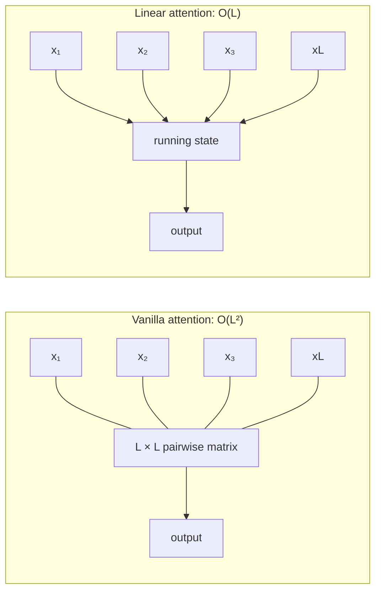

The paper's characterization (§2, *SSM Architectures*) is that linear attention (Katharopoulos et al. 2020) approximates self-attention through a recurrence, and can be regarded as a degenerate linear SSM. Appendix B.4 credits that line with popularizing kernel attention and establishing the link to recurrent autoregressive models.

Note the scope of that claim, and keep it narrow in your own notes. The paper says linear attention *can be viewed as* a recurrence — not that every linear-attention variant is literally Mamba's SSM. It makes model-specific statements instead (Appendix B.2): RetNet builds on linear attention and resembles H3, but collapses the inner S4 layer to state dimension `N = 1`, so its recurrence is a special case of a linear SSM; RWKV descends from the attention-free Transformer, and its WKV mechanism uses time-invariant recurrences expressible as a ratio of two SSMs. Different models, different mappings.

## 3. The RNN intuition: state as compression

If linear attention lands on a recurrence, RNN intuition applies. An RNN keeps

$$
h_t = f(h_{t-1}, x_t)
$$

`h_t` is a compressed summary of everything seen so far. You never store the tokens, so you get `O(L)` scaling and a constant-size state during autoregressive inference.

And immediately the tradeoff appears:

> If you compress all of history into a fixed-size state, have you thrown away something you'll need later?

The paper elevates this into its organizing principle (§3.1): sequence modelling is fundamentally a problem of compressing context into a smaller state. That gives one axis on which to place both families:

- **Attention** does not compress → effective, but expensive (KV cache, quadratic training).
- **Recurrent models** compress into a finite state → efficient (constant time per step at inference, linear-time training), but bounded by how well that state captured the context.

The paper's summary of the bind: efficiency demands a small state, effectiveness demands a state holding everything the context will later require. Everything Mamba does is an attempt to win both halves of that sentence at once.

## 4. Gating: deciding what gets into the state

Gated RNNs — LSTMs, GRUs — are the classical answer to *what* to keep. In its simplest form:

$$
h_t = (1 - g_t)\,h_{t-1} + g_t\,x_t
$$

`g_t ≈ 0` keeps the old state; `g_t ≈ 1` overwrites it with the current input.

This matters for Mamba because the paper *proves* the connection. **Theorem 1**: with `N = 1`, `A = −1`, `B = 1`, `s_Δ = Linear`, and `τ_Δ = softplus`, the selective SSM recurrence reduces exactly to

$$
g_t = \sigma(\mathrm{Linear}(x_t)), \qquad h_t = (1-g_t)h_{t-1} + g_t x_t
$$

Classical RNN gating is a special case of Mamba's selection mechanism. The authors' position (§3.5.1) is that SSM discretization is the principled foundation from which heuristic gating mechanisms follow, rather than the reverse.

### The trap in the word "gating"

Appendix A is worth reading before using this word, because it has drifted into meaning two different things:

| | What it does | Acts along sequence axis? |
|---|---|---|
| **RNN gating** (LSTM/GRU, eq. 5) | controls whether an input enters the hidden state, shaping how signal propagates through time and letting inputs interact along sequence length | **yes** |
| **Multiplicative / architectural gating** (GLU, GAU) | any elementwise multiplicative interaction, with no interaction along sequence length | **no** |

The paper's judgement is that these two senses carry very different meaning despite sharing a name. Its counterexample is deflating: take a diagonal linear layer `y = Dx` and generate the diagonal from the input, `D = σ(Wx)`. Because `D` is diagonal, the whole thing collapses to `y = σ(Wx) ∘ x` — a GLU. That technically qualifies as gating (multiplicative branch), as a hypernetwork (one layer generates another's parameters), and as data-dependent (it depends on `x`) — yet it is so trivial it is normally regarded as an activation function rather than a meaningful layer.

Hence the deliberate word choice: the authors avoid "gating" in favour of **selection**, reserving it for the mechanistic act of selecting or ignoring inputs *along the sequence dimension*.

**Practical test:** does the mechanism act along the sequence axis? If not, it isn't selection, however data-dependent it looks. Appendix B.2 applies exactly this test to a model sharing the name — Selective S4 uses S4 to produce a binary mask multiplied onto the input, which the authors classify as architectural gating rather than selection, and predict would fail Selective Copying, since masking irrelevant tokens does nothing about the *spacing* between the relevant ones.

## 5. What actually separates linear attention from gated RNNs

Both reach `O(L)` by keeping a running state instead of an `L × L` matrix. But they are not the same family, and the related work makes the split precise.

**The linear attention family** (LA, RFA, Performer, H3, RetNet, RWKV) reaches a recurrence by kernelizing or removing the softmax. Those recurrences are typically **time-invariant** — RWKV's WKV uses LTI recurrences; RetNet's is a linear SSM with `N = 1`. Appendix B.1 closes the door on the class as a whole: every structured SSM the authors were aware of, across all these variants, had been non-selective and generally strictly LTI. They bought efficiency and kept fixed dynamics.

**Gated RNNs** went the other way. Appendix B.3 is blunt: QRNN, SRU, and strongly-typed RNNs are gated RNNs without time-wise nonlinearities, and because gating and selection are connected, these can be regarded as instances of selective SSMs — and therefore, in a sense, **more powerful** than the LTI structured SSM family.

Read that again, because it reverses the naive story. Gated RNNs were *not* missing selection. They had a form of it. What they were missing:

1. **State expansion.** They operate with `N = 1` and no selective `B`, `C` — both of which the ablations show matter (§4.6). LTI SSMs, by contrast, exploit recurrent–convolutional duality to expand the effective state by a factor of `N ≈ 10–100`, far beyond traditional RNNs, without an efficiency penalty (§3.3.1).
2. **Principled parameterization.** Their gates are heuristic. Mamba derives the same behaviour as a consequence of selection plus discretization (Theorem 1), and the connection to SSM theory yields better parameterizations and initializations (§3.6).
3. **Efficiency.** Older RNNs suffered both slow training and vanishing gradients, both traceable to their sequential nature. The speed problem is addressable with a parallel scan; the gradient problem was hard to fix before the theory developed for SSMs.

The honest four-way summary:

| Family | Dynamics | State | Gets you |
|---|---|---|---|
| Attention | content-dependent, no compression | grows with `L` (KV cache) | effective, `O(L²)` |
| Linear attention family | **time-invariant** recurrence | expandable (`N` large) | efficient, but not content-selective |
| Gated RNNs | **input-dependent** | tiny (`N = 1`), heuristic | selective, but small-state and slow to train |
| **Selective SSM (Mamba)** | **input-dependent** | expanded (`N` large), principled | both — via a hardware-aware scan |

That bottom row is the contribution. Mamba is neither "RNNs again" nor "attention made cheap": it takes selection from the gated-RNN lineage and the expanded state plus principled discretization from the SSM lineage, and pays for the combination with a custom kernel.

## 6. The modality gap: where SSMs worked, and where they didn't

This is the empirical fact that sets up the whole paper, and it is easy to skim past.

By 2023 there were many SSM variants — S4 and its descendants, DSS, S4D, S5, Mega, the linear-recurrence line — and they were genuinely successful, but *selectively* so. They performed well on domains built from **continuous signals**: audio waveforms, vision, speech, time series. The introduction and §2 note this pattern across a long list of prior work, and Mamba's own results continue it — audio pretraining and DNA modelling both improve with longer context (§4.3, §4.4).

Where the same models fell short was **discrete, information-dense data such as text**. That phrase is the crux. Audio is dense in samples but locally smooth and heavily redundant; a fixed set of dynamics summarizes it well. Language is the opposite: adjacent tokens can matter wildly differently, a single token can carry information that must survive thousands of steps, and there is little local redundancy to lean on.

| | Continuous signals (audio, vision) | Discrete, information-dense (text) |
|---|---|---|
| Local structure | smooth, highly redundant | abrupt, low redundancy |
| Token importance | roughly uniform across samples | varies enormously |
| Fixed dynamics? | summarize the signal well | inadequate — need per-token decisions |
| Result | **LTI SSMs already strong** | **LTI SSMs lag attention** |

So the gap was not "SSMs are weak." It was that time-invariant dynamics happen to suit one kind of data and not the other. Mamba's abstract makes exactly this claim: the subquadratic architectures — linear attention, gated convolutions, recurrent models, structured SSMs — were built to fix Transformer inefficiency on long sequences, but had not matched attention on important modalities, language in particular.

## 7. Mamba's diagnosis: selection

The identified cause is the inability to select data in an input-dependent way — to focus on or ignore a particular input. Consider what a model must do here:

```text
The cat sat on the mat.
Ignore ignore ignore ignore.
Important: the password is 48291.
Ignore ignore ignore.
What was the password?

     important information  → KEEP
     irrelevant information → DISCARD
```

An LTI model applies the *same* update at every position. It cannot look at a token and decide "this one matters, keep it."

The paper makes this rigorous with three synthetic tasks laid out in **Figure 2** (§3.1), and the figure is worth reading as a difficulty ladder rather than three unrelated benchmarks.


*Figure 2 (Mamba paper). Three panels. *Left:* standard Copying — coloured input tokens, constant spacing between input and output. *Right top:* Selective Copying — the same coloured tokens, but now separated by randomly many white "noise" tokens. *Right bottom:* Induction Heads — a black token appears, and the model must produce the token that followed it the last time it was seen.*


### Panel 1 (left) — Copying: solvable *without looking at the data*

The spacing between input and output is constant:

```text
Input:   A  B  C  D  ░░░░░░░░░░░░░░░░  _  _  _  _
Output:                                A  B  C  D
                     └─ fixed offset ─┘
```

An LTI model handles this, and the reason is worth stating precisely. Because the same `Ā, B̄, C` apply at every step, the model can only implement a rule of the form "reproduce whatever appeared `k` positions ago." That is *exactly* what this task requires. The paper's caption makes the sharper point: LTI models solve it perfectly **without needing to look at the actual inputs at all**.

That is the tell. A task solvable while ignoring content is not testing memory — it's testing whether you can build a delay line. A convolution kernel with a spike at the right offset does the job.

### Panel 2 (right top) — Selective Copying: the spacing is randomized

```text
Input:   ░ A ░ ░ B  C ░ ░ D ░░░░░  _  _  _  _
           ↑     ↑  ↑    ↑
          keep  keep    keep         → recall A B C D
         (░ = noise, randomly many)
```

Now "reproduce what appeared `k` steps ago" is useless, because `k` differs per example and per token. The model must instead decide, per token, *this one is content, that one is noise*. The paper's framing: random spacing requires time-varying models that can selectively remember or ignore inputs **depending on their content**.

This is the pivotal panel. Note what it demands — and what it does not. It does not demand a bigger state. It demands that the *state update itself* vary with the input. No amount of extra state capacity rescues a model whose dynamics are fixed, because the fixed dynamics cannot express "skip this one."

### Panel 3 (right bottom) — Induction Heads: associative recall

Harder again, because now the retrieval cue is content, not position:

```text
...  A → B  ...........  A → ?      answer: B
```

Having seen "Harry Potter," predict "Potter" when "Harry" reappears. The paper calls this associative recall — retrieving an answer based on context — and flags it as a key ability for LLMs, which is why it's the panel that connects the synthetic story to in-context learning.

### The ladder

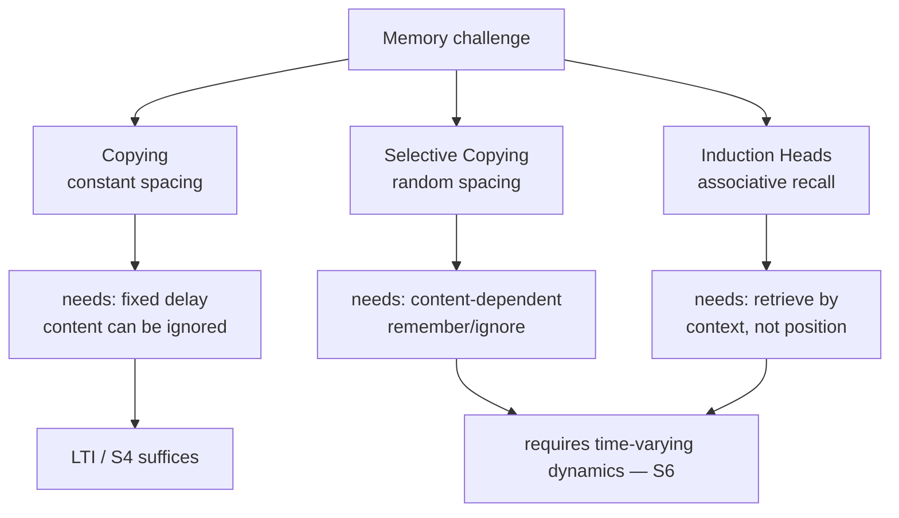

A neat diagnostic in Appendix B.3 confirms LTI is the binding constraint rather than any particular architecture: orthogonal and unitary RNNs solve standard Copying perfectly yet struggle on Selective Copying — because they, too, are LTI.

### One caution about the word "compression"

Since §3.1's framing is that sequence modelling compresses context into a state, it's easy to over-read it. The claim is *not* that Mamba stores a long sequence losslessly inside a small vector — that isn't possible, and the paper doesn't say it. The claim is that a recurrent model represents history in its state, and if the compression mechanism is fixed, it has no way to know which parts of that history were worth the capacity.

So the correct one-liner isn't "compress the context." It's:

> **Compress the context — but make the compression content-dependent.**

Selective Copying is precisely the test of whether a model can learn what deserves to survive that compression.

## 8. The move

> What if we keep the efficient state-space recurrence, but make the state update depend on the input?

Instead of fixed `Δ, B, C`, let them be functions of `x_t`. Exact forms are in Part II §5, where `A` turns out to need care. The stated payoff is that the model can discard irrelevant information and retain relevant information indefinitely.

The whole arc:

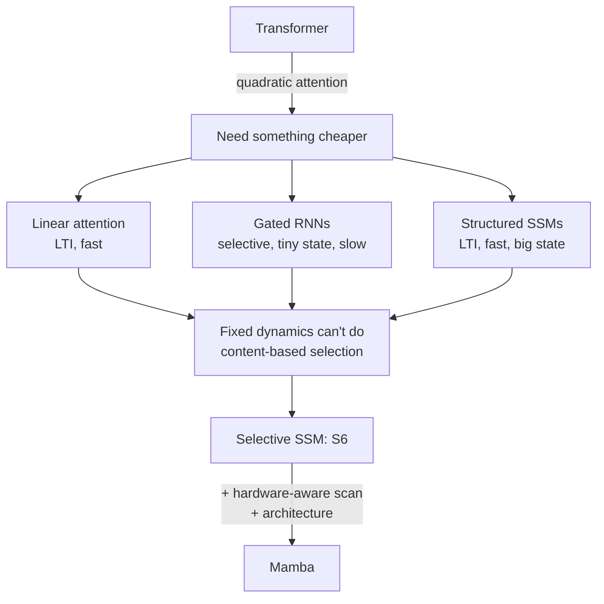

Which brings us to the vocabulary problem.

---

# Part II — The Terminology: SSM → S4 → S6 → Mamba

This section is dense in the paper because it moves between continuous-time systems, discrete recurrence, convolution, LTI, and GPU efficiency very quickly. So let's slow the chain down and build it one link at a time.

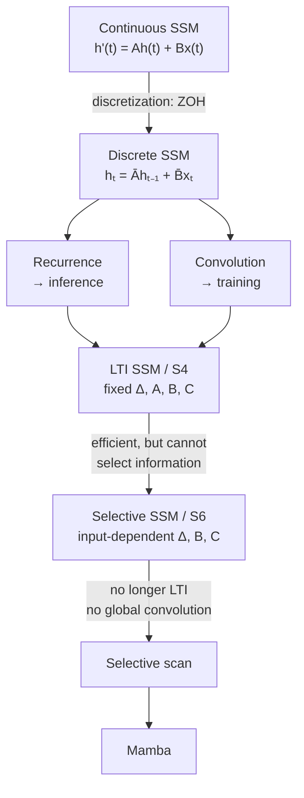

That chain is the conceptual backbone of the whole paper. The important transition isn't "S4 → Mamba" — it is **LTI SSM → input-dependent SSM → time-varying recurrence → selective scan**.


*Figure 1 (Mamba paper). Figure 1 is the single most useful diagram in the paper, and it's worth studying alongside this whole section. It shows a structured SSM mapping each of `D` input channels independently to an output through a higher-dimensional latent state of size `N` — so the effective state is `DN`, multiplied again by batch size and sequence length. Its caption makes the paper's central tension explicit: earlier SSMs dodged ever materializing that large state by taking alternate computation paths that *require* time-invariance, with `(Δ, A, B, C)` constant across time. Mamba's selection mechanism restores input-dependent dynamics, and therefore needs a careful hardware-aware algorithm that only materializes the expanded state in the faster levels of the GPU memory hierarchy. Everything in Part III is a consequence of that sentence.*


## 1. Start with the simplest SSM

Before any discretization, the paper starts from a **continuous-time** system (eqs. 1a–1b), mapping a 1-D signal `x(t) ∈ ℝ` to `y(t) ∈ ℝ` through a latent state `h(t) ∈ ℝ^N`:

$$
h'(t) = A\,h(t) + B\,x(t)
$$

$$
y(t) = C\,h(t)
$$

Read the pieces as:

| Symbol | Role |
|---|---|
| `x(t)` | input signal |
| `h(t)` | internal memory / state |
| `y(t)` | output |
| `A` | how existing memory evolves on its own |
| `B` | how new input enters memory |
| `C` | how memory produces output |

This describes a system evolving in continuous time. But a neural network receives tokens:

```text
x₁, x₂, x₃, x₄, ...
```

So the continuous system has to be turned into something taking one discrete step at a time. That is what **discretization** does.

## 2. What Δ actually means

`Δ` is the **step size** — how much continuous time one discrete update represents.

```text
continuous:  ───────|───────|───────|───────
                    Δ       Δ       Δ
discrete:           x₁      x₂      x₃
```

So the question is: given `A, B` describing continuous dynamics and a step size `Δ`, what should the *discrete* update matrices be? Call them `Ā, B̄` — the bars are easy to miss in the PDF's typography, and losing them makes the rest of the paper unreadable.

The discrete SSM is then (eqs. 2a–2b):

$$
h_t = \bar A\,h_{t-1} + \bar B\,x_t, \qquad y_t = C\,h_t
$$

`Δ` is a genuine parameter, not a numerical detail. It governs how much of the current input enters the state — which is exactly why making it input-dependent later turns out to be the most important single change.

## 3. ZOH is just one way to do that conversion

The paper's default rule is **zero-order hold** (eq. 4):

$$
\bar A = \exp(\Delta A), \qquad \bar B = (\Delta A)^{-1}\big(\exp(\Delta A) - I\big)\cdot \Delta B
$$

Don't be intimidated by the second expression. The conceptual content is only:

$$
(\Delta, A, B) \;\longrightarrow\; (\bar A, \bar B)
$$

The paper notes that discretization has deeper connections — to continuous-time systems, resolution invariance, proper normalization, and RNN gating — but also says that mechanically you can simply treat it as the first computation step in the forward pass:

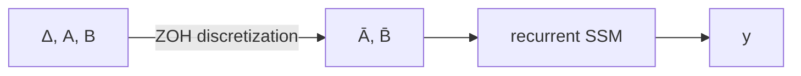

§2 also mentions some SSM variants skip discretization entirely and parameterize `(Ā, B̄)` directly, which can be easier to reason about.

## 4. The same SSM is also a convolution

This is one of the most important ideas in the section, and it's worth deriving rather than accepting.

Take `h_t = Ā h_{t−1} + B̄ x_t` with `h₀ = 0` and expand:

$$
h_1 = \bar B x_1
$$

$$
h_2 = \bar A\bar B x_1 + \bar B x_2
$$

$$
h_3 = \bar A^2\bar B x_1 + \bar A\bar B x_2 + \bar B x_3
$$

Apply `y_t = C h_t`:

$$
y_1 = C\bar B x_1
$$

$$
y_2 = C\bar A\bar B x_1 + C\bar B x_2
$$

$$
y_3 = C\bar A^2\bar B x_1 + C\bar A\bar B x_2 + C\bar B x_3
$$

Now look at the coefficients. They're the same sequence every time, just shifted — which means they form a fixed kernel (eqs. 3a–3b):

$$
\bar K = \big(C\bar B,\; C\bar A\bar B,\; C\bar A^{2}\bar B,\; \dots\big), \qquad y = x * \bar K
$$

So one mathematical transformation, two ways to compute it:

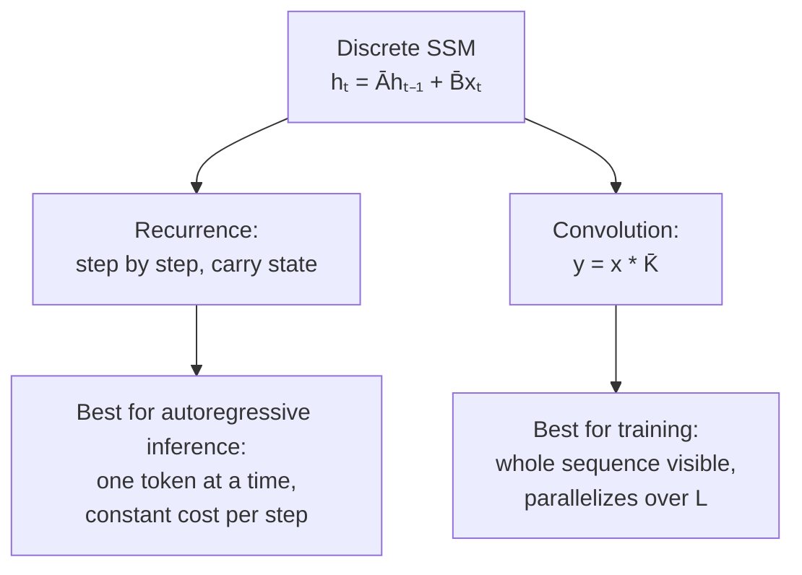

The paper describes exactly this division of labour: convolutional mode for parallelizable training, recurrent mode for efficient autoregressive inference. That duality is what made S4 practical.

**And note the hidden benefit**, because it becomes the crux later: the convolutional path never materializes the state at all. It builds a kernel of size `(B, L, D)` and skips the `(B, L, D, N)` state entirely.

## 5. LTI — and the condition that makes the duality work

The kernel derivation above quietly assumed something. Look again at where `Ā`, `B̄`, `C` appeared: the *same* matrices at every timestep.

```text
t₁:  Δ A B C
t₂:  Δ A B C      ← identical
t₃:  Δ A B C
t₄:  Δ A B C
```

That condition is **linear time invariance (LTI)**, and the paper treats it as an umbrella term for any linear recurrence or convolution. If the parameters varied by position, there would be no single `K̄` to convolve with.

So the dependency runs:

$$
\text{LTI} \;\Longrightarrow\; \text{fixed kernel exists} \;\Longrightarrow\; \text{convolutional training possible}
$$

The paper is clear this was a constraint rather than a preference: all structured SSMs to that point had been LTI because of fundamental efficiency requirements, and removing that constraint while keeping the efficiency is what it sets out to do.

### S4: structure, and why it's needed

Structured SSMs get their name because efficient computation requires imposing structure on `A` (§2). The common choice is **diagonal**:

$$
A = \begin{bmatrix} a_1 & 0 & 0 \\ 0 & a_2 & 0 \\ 0 & 0 & a_3 \end{bmatrix}
$$

A full `A ∈ ℝ^{N×N}` needs `N²` numbers; a diagonal one needs `N`. With that structure, `A`, `B ∈ ℝ^{N×1}`, and `C ∈ ℝ^{1×N}` are each represented by `N` numbers.

**One line:** S4 is a particular structured SSM whose dynamics are time-invariant — which is exactly what enables the convolutional form.

### The dimensions that create the whole problem

Now count. With batch `B`, length `L`, channels `D`, and state dimension `N`, the input and output are

$$
x, y \in \mathbb{R}^{B \times L \times D}
$$

but the SSM is applied *independently to each channel*, so every channel carries its own `N`-dimensional state:

$$
h \in \mathbb{R}^{B \times L \times D \times N}
$$

The hidden state is `DN` per input, and materializing it over the sequence costs `O(BLDN)` time and memory. Concretely, with `B = 8`, `L = 4096`, `D = 1024`, `N = 16`:

$$
8 \times 4096 \times 1024 \times 16 \approx 5.37 \times 10^{8} \text{ elements}
$$

That's roughly 1 GB in fp16, 2 GB in fp32 — for *one* layer's intermediate state. Remember this number. It is the bottleneck everything in Part III is built around, and it is the reason Figure 1's caption talks about which level of the memory hierarchy the state gets materialized in.

## 6. S6: the *selective* SSM

The fix (§3.2) is one sentence long: make the parameters governing interaction along the sequence into functions of the input. Comparing Algorithm 1 (SSM/S4) with Algorithm 2 (SSM + Selection/S6):

| Parameter | S4 (Algorithm 1) | S6 (Algorithm 2) |
|---|---|---|
| `A` | `(D, N)` parameter | `(D, N)` parameter — **unchanged** |
| `B` | `(D, N)` parameter | `(B, L, N)` ← `s_B(x)` |
| `C` | `(D, N)` parameter | `(B, L, N)` ← `s_C(x)` |
| `Δ` | `(D)` parameter | `(B, L, D)` ← `τ_Δ(`Parameter `+ s_Δ(x))` |
| `Ā, B̄` | `(D, N)` | `(B, L, D, N)` |
| Computation | recurrence **or** convolution | recurrence (**scan**) only |

with the specific choices

$$
s_B(x) = \mathrm{Linear}_N(x), \quad s_C(x) = \mathrm{Linear}_N(x), \quad s_\Delta(x) = \mathrm{Broadcast}_D(\mathrm{Linear}_1(x)), \quad \tau_\Delta = \mathrm{softplus}
$$

### The two algorithms, side by side

The paper prints these as a pair on p. 6, and the diff between them is the entire contribution. Transcribed with the paper's shapes and my own annotations:

**Algorithm 1 — SSM (S4)**

```text
Input:   x : (B, L, D)
Output:  y : (B, L, D)

1:  A : (D, N)      ← Parameter          # represents a structured N × N matrix
2:  B : (D, N)      ← Parameter
3:  C : (D, N)      ← Parameter
4:  Δ : (D)         ← τ_Δ(Parameter)
5:  Ā, B̄ : (D, N)   ← discretize(Δ, A, B)
6:  y               ← SSM(Ā, B̄, C)(x)    # time-invariant: recurrence OR convolution
7:  return y
```

**Algorithm 2 — SSM + Selection (S6)**

```text
Input:   x : (B, L, D)
Output:  y : (B, L, D)

1:  A : (D, N)        ← Parameter          # unchanged — still a plain parameter
2:  B : (B, L, N)      ← s_B(x)            # ← now a function of the input
3:  C : (B, L, N)      ← s_C(x)            # ← now a function of the input
4:  Δ : (B, L, D)      ← τ_Δ(Parameter + s_Δ(x))
5:  Ā, B̄ : (B, L, D, N) ← discretize(Δ, A, B)
6:  y                 ← SSM(Ā, B̄, C)(x)    # time-varying: recurrence (SCAN) only
7:  return y
```

Read the diff and three things fall out at once:

1. **Lines 2–4 gain a `(B, L, …)` prefix.** The parameters acquire batch and length axes — they are now produced *per position* rather than stored once.
2. **Line 1 does not change.** `A` stays `(D, N)`.
3. **Line 5 explodes, and line 6 loses an option.** `Ā, B̄` go from `(D, N)` to `(B, L, D, N)` — the `N`-fold blowup — and the annotation on line 6 drops "or convolution." Those two consequences are the same event seen from two sides, and together they are Part III's entire workload.

Note also what *doesn't* change: the input and output signatures are identical, `(B, L, D)` in both. S6 is a drop-in replacement for S4 as a sequence transformation. All the cost is interior.

Two details worth getting right, since they are commonly garbled:

- **`A` itself is not made input-dependent.** §3.5.2 addresses this directly: `A` influences the model only through its interaction with `Δ` via `Ā = exp(ΔA)`, so selectivity in `Δ` already induces selectivity in `(Ā, B̄)`, and is the primary source of improvement. The authors expect a selective `A` would perform similarly and omit it for simplicity. So the *effective* `Ā_t` does vary with `t` — but through `Δ_t`; `A` stays a learned parameter. Writing `A_t` alongside `B_t, C_t, Δ_t` is the most common error in secondhand summaries.
- **The new `L` dimension is the whole point.** In S4 the parameters have no length axis; in S6 they do. That is the formal content of "time-invariant → time-varying."

What selectivity buys, per §3.5.2:

- **`Δ`** controls how much to attend to versus ignore the current input. Large `Δ` resets the state and concentrates on `x_t`; small `Δ` preserves the state and passes over `x_t`. This is the parameter Theorem 1 converts into an RNN gate (Part I §4). Table 7 confirms `Δ` is the single most important selective parameter — though `Δ`, `B`, and `C` together work best.
- **`B` and `C`** give finer control over whether an input enters the state, and whether the state reaches the output — modulating the recurrence by content and by context respectively.
- **Boundary resetting.** Where a Transformer separates concatenated sequences with an attention mask, LTI models leak information across the boundary. Selective SSMs can reset state instead — useful for packed documents or RL episode boundaries.

And the name: **S6** is shorthand. Remark 3.1 explains it as S4 *plus* a selection mechanism *and* computed with a scan — hence the numbering.

### Selection is a mechanism, not a Mamba-specific trick

Worth noting how §3.5 opens, because it's more modest than the marketing: selection mechanisms are described as a **broader concept**, applicable in other ways — to more traditional RNNs or CNNs, to different parameters (`A` in Algorithm 2 is named explicitly), or with different transformations `s(x)`.

So the paper is not claiming to have invented input-dependent information control. Theorem 1 already conceded that LSTM/GRU gating is an instance of it (Part I §4). The claim is narrower and more defensible:

> Selection is a general mechanism. This paper applies it **to structured SSMs**, and — critically — works out how to compute the result efficiently.

That framing also tells you where the design space still is. `A` unselective, `s_B`/`s_C` as plain linear maps, `τ_Δ = softplus` — these are choices, not necessities, and §3.5 says so.

**One line:** S6 is an input-dependent (selective) SSM — S4 with `Δ, B, C` made functions of the input, hence time-varying.

## 7. What breaks

Now the two threads meet. The kernel `K̄` existed *because* the parameters were identical at every step. Once `Δ_t, B_t, C_t` depend on the input, each position has its own dynamics and there is no single kernel to convolve with. Algorithm 2's annotation says it plainly: time-varying means recurrence via *scan* only. §3.2 puts it as losing the equivalence to convolutions, with consequences for efficiency.

So selection removes the very mechanism that made structured SSMs fast — and re-exposes the `(B, L, D, N)` state the convolutional path had been dodging. §3.3 states the historical consequence directly: this is why S4 and all its derivatives stayed LTI and non-selective.

Which is Part III's problem.

## 8. Mamba: the architecture

Selective SSMs, like structured SSMs, are standalone sequence transformations that can be dropped into a neural network (§3.4). A sequence transformation is not an architecture — you still need projections, nonlinearities, normalization, and residuals to get something trainable.

The paper simplifies prior deep sequence architectures by merging the SSM-block design of H3 with the Transformer's MLP block into a **single, homogeneous block** that is simply repeated. Relative to H3, Mamba replaces the first multiplicative gate with an activation; relative to an MLP block, it adds an SSM to the main branch. Appendix E.2.2 offers the most compact description: the Mamba block is a standard SwiGLU block with an extra conv → SSM path.


*Figure 3 (Mamba paper). Shows the H3 block and the gated MLP block side by side, and Mamba as their fusion.*


Here is the same block as a diagram:

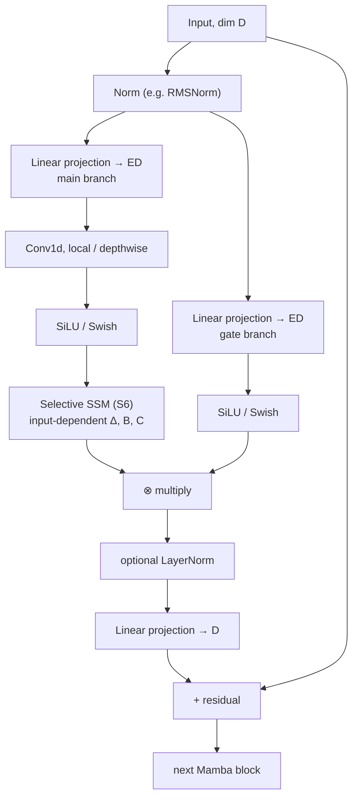

And zooming into the SSM node, which is where selection lives:

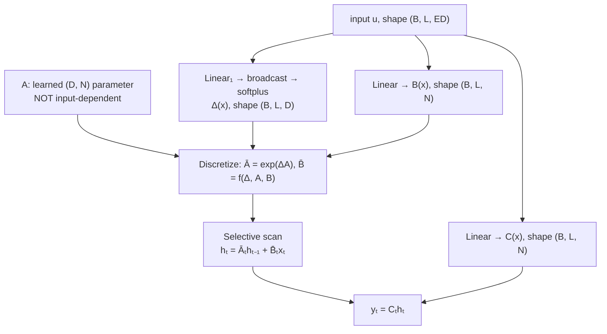

Parameter budget, per §3.4:

- Model dimension `D` is expanded by a controllable factor `E`, fixed to `E = 2` in the experiments; two stacked blocks match a Transformer's `12D²` from interleaved MHA + MLP.
- Most parameters — `3ED²` per block — sit in the linear projections (`2ED²` in, `ED²` out). The inner SSM parameters `Δ, B, C, A` are far smaller by comparison. This matters for Part III: the bulk of the *parameters*, and the bulk of the well-behaved GPU work, is in matmuls.
- `σ` is SiLU/Swish, making the gated branch a SwiGLU variant; the optional LayerNorm is motivated by RetNet's placement of one.
- Blocks are interleaved with standard normalization and residual connections.

Note what is absent: no attention, and no separate MLP block.

---

## The distinction in four lines

| Term | What it is | Dynamics |
|---|---|---|
| **SSM** | the underlying state-space sequence modeling framework (in this paper, the S4 family) | — |
| **S4** | a particular *structured* SSM (structure imposed on `A`, typically diagonal) | time-invariant (LTI) → recurrence **or** convolution |
| **S6** | the *selective* SSM: `Δ, B, C` become functions of the input | time-varying → scan only |
| **Mamba** | the neural network architecture that uses the selective SSM | — |

One more terminology trap, from §2 (*General State Space Models*): "state space model" is extremely broad in ordinary usage, covering essentially any recurrent process with a latent state — Kalman filters, HMMs, MDPs, linear dynamical systems, RNNs. The paper pins it down, stating that throughout, "SSM" refers exclusively to structured SSMs, i.e. the S4 class. So when the paper writes "SSM," read "S4-family structured SSM." When *you* write it, decide which you mean.

The ablations confirm architecture and selectivity are separate axes. Table 6 shows that swapping among LTI inner layers — Hyena, S4 real, S4 complex — barely moves perplexity (roughly 10.2–10.8), while switching the inner layer to S6 produces a large jump (8.69 in the Mamba block, 8.95 in H3). Meanwhile the block itself matters comparatively little: Mamba performs similarly to H3 while being simpler. On Selective Copying (§4.1.1), gated architectures alone only partially help; it is the S4 → S6 change that solves the task, best of all combined with the stronger architectures.

§4.1.1 also warns against the shortcut of assuming architectural gating supplies data-dependence — the authors find that explanation inadequate, since such gating doesn't interact along the sequence axis and can't affect token spacing, and they state directly that architecture gating is not an instance of a selection mechanism.

That is precisely why you need distinct words for them.

---

## What it buys

The paper's own summary of why selective SSMs — and by extension Mamba — suit a general sequence-model backbone comes down to three properties:

1. **Quality.** Selectivity delivers strong performance on dense modalities such as language and genomics.
2. **Fast training and inference.** Compute and memory scale linearly in sequence length during training, and autoregressive decoding needs only constant time per step, because there is no cache of previous elements to consult.
3. **Long context.** Quality and efficiency together yield real improvements out to sequence length 1M.

Validated across modalities:

- **Synthetics.** Copying and induction heads aren't just solved — solutions extrapolate indefinitely, past 1M tokens. Concretely (§4.1.2, Table 11), a 74K-parameter Mamba trained at sequence length `2⁸ = 256` holds perfect accuracy all the way to `2²⁰ = 1048576`, roughly 4000× its training length. No baseline gets past `2⁹` — Hyena reaches exactly 2× and stops; the attention variants run out of memory entirely at long lengths, which is itself the point.
- **Audio and genomics.** Beats prior state of the art including SaShiMi, Hyena, and Transformers on audio waveforms and DNA, in both pretraining quality and downstream metrics — more than halving FID on a hard speech-generation dataset — and improves with longer context up to million-length sequences.
- **Language modelling.** Presented as the first linear-time sequence model to genuinely reach Transformer-quality performance in both pretraining perplexity and downstream evaluation. With scaling laws to 1B parameters it beats a wide range of baselines, including strong modern LLaMa-based Transformer recipes. Generation throughput is about 5× that of a similarly sized Transformer, and Mamba-3B matches Transformers twice its size — around 4 points higher average on common-sense reasoning than Pythia-3B, and ahead of Pythia-7B.
- **State size pays off cheaply — but only with selection.** Increasing state size `N` buys over 1.0 perplexity for roughly 1% more parameters. The condition attached to that is the most interesting single result in the ablations, and it gets its own treatment in Part IV §6.

---

# Part III — The Execution Problem: How a Recurrence Runs Fast on a GPU

Part II ended with selection destroying the convolutional path. This part is what the paper does about it, and it's the most transferable material in the paper for anyone doing CUDA or inference work.

## 1. "Linear time" and "sequential" are different properties

Start by separating two things that get conflated.

$$
h_t = \bar A h_{t-1} + \bar B x_t
$$

has `L` steps, so it is **linear in `L`** — that's a statement about total work. But executed literally, step `t` waits for step `t−1`, so it is **sequential in execution** — a statement about the dependency graph.

```text
x₁ → h₁ → h₂ → h₃ → h₄ → ...
        ↑     ↑     ↑
       each waits on the previous
```

These aren't contradictory, and the second is the problem on a GPU. A GPU wants thousands of independent work items; a literal recurrence offers one at a time, and a per-step kernel launch pattern wastes nearly all the machine. This is a large part of why classical RNNs were a poor fit for GPUs, quite apart from any question of model quality.

So the goal is not to eliminate the recurrence. It is to **execute the recurrence efficiently in parallel**.

> Mamba's trick is not making an RNN magically parallel. It is exploiting the algebraic structure of the recurrence, plus the GPU memory hierarchy, to execute a genuinely recurrent computation efficiently.

The paper names three techniques (§3.3.2): **kernel fusion, parallel scan, and recomputation.**

## 2. Parallel scan: why a recurrence isn't as sequential as it looks

Take the scalar version of the recurrence:

$$
h_t = a_t h_{t-1} + b_t
$$

Substituting `h₁` into `h₂`:

$$
h_2 = a_2(a_1 h_0 + b_1) + b_2 = (a_2 a_1) h_0 + (a_2 b_1 + b_2)
$$

and again:

$$
h_3 = (a_3 a_2 a_1) h_0 + (a_3 a_2 b_1 + a_3 b_2 + b_3)
$$

Notice the *shape* is preserved: every partial composition is still an affine map `h ↦ αh + β`. So define a composition operator on pairs:

$$
(a_1, b_1) \oplus (a_2, b_2) = (a_2 a_1,\; a_2 b_1 + b_2)
$$

This operator is **associative** — and associativity is exactly the property a parallel scan requires. It means you may combine adjacent chunks in any grouping and get the same answer, so the computation can be organized as a tree rather than a chain. The paper's own term for what it leverages is a **parallel associative scan** (Appendix D), and "associative" there is carrying precisely this weight.

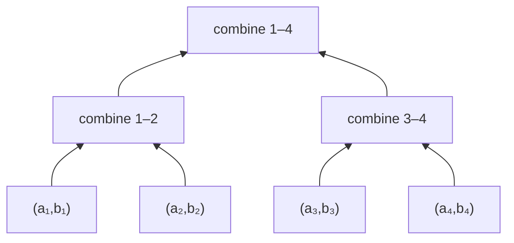

Depth drops from `O(L)` to `O(log L)` while total work stays `O(L)` — which is what "work-efficient" means. This is the same family of algorithms as prefix sums, except the operator is affine composition rather than addition. The paper cites Blelloch 1990, Martin & Cundy 2018, and Smith et al. 2023 for the work-efficient parallel scan, and Appendix B.1 credits S5 as the first S4 model computed recurrently via such a scan; S6 shares the scan but adds selection, keeps SISO dimensions for a larger effective state, and adds the hardware-aware algorithm.

**The key realization:** a recurrence does not have to be executed one timestep at a time. It only has to respect its dependency structure — and an associative operator lets you reassociate that structure into a tree.

## 3. The bigger problem is memory traffic, not arithmetic

The scan solves the dependency issue. It does not solve the more expensive problem.

Recall the shapes from Part II §5. The input and output are `(B, L, D)`, but the state is `(B, L, D, N)` — larger by a factor of `N`. Our worked example came to roughly 537M elements, about 1 GB in fp16, for one layer.

If you materialize that in HBM you move an enormous amount of data. And GPUs are not only limited by arithmetic. Appendix D states the governing fact with a parenthetical worth memorizing: on modern accelerators, most operations **except matrix multiply** are bounded by memory bandwidth, and the scan is one of them. Once you're bandwidth-bound, FLOPs stop being the metric that matters and bytes moved becomes the metric.

Hold on to that exception — it's why Part III §6 insists that the projections, which *are* matmuls, are a different kind of work from the scan.

### §3.3.1 states the objective in one line

Before the techniques, the paper states the goal cleanly, and it's the sentence to keep in mind while reading the kernel: recurrent models trade expressivity against speed, larger hidden state should mean more effective but slower, so the aim is to **maximize hidden state dimension without paying speed and memory costs**.

It also settles the relationship between the two computational modes more precisely than "they're equivalent." The recurrence is the *more flexible* of the two, because the convolution is derived by expanding it — the direction of derivation matters. The convolution was introduced not because it is more general but because it is a shortcut: it bypasses computing the state altogether and materializes a kernel of size only `(B, L, D)`, dodging the `(B, L, D, N)` latent state that is larger by a factor of `N`.

Which reframes the history. Prior LTI models used the recurrent–convolutional duality to push the effective state dimension up by a factor of `N ≈ 10–100`, far past traditional RNNs, **without efficiency penalties** — the duality was the mechanism that made a large state free. Selection removes the duality. So Mamba has to buy that large state back with engineering rather than get it for free from an algebraic identity.

> **S4 got a big state for free because it was LTI. Mamba wants the same big state without being LTI, so it has to pay for it in the memory hierarchy.**

## 4. So the kernel is fused, and the state stays in SRAM

The naive implementation writes intermediates to HBM between every stage:

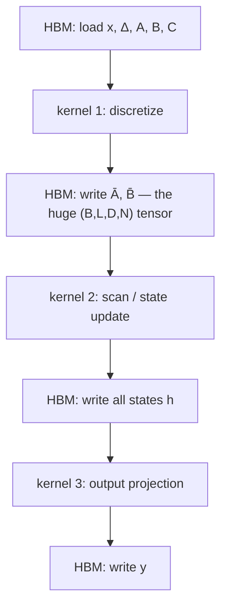

Every one of those HBM round-trips moves the `N`-times-expanded tensor. What the paper does instead (§3.3.2) is load only the SSM parameters `(Δ, A, B, C)` from HBM into fast SRAM, perform the discretization *and* the recurrence there, and write back only the `(B, L, D)` outputs:

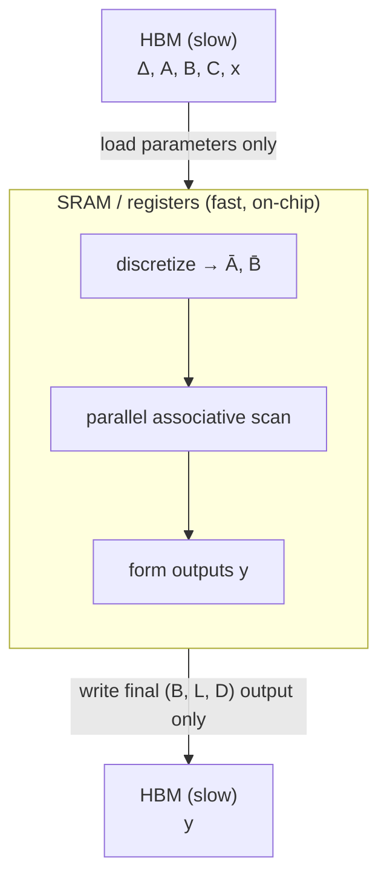

The expanded state never lands in slow memory. That is what "hardware-aware" means in the title of Figure 1, and it's the difference between a correct implementation and a usable one.

Appendix D spells the fused kernel out in four steps, and the byte counts are the whole argument:

1. Read `(Δ, A, B, C)` from slow HBM into fast SRAM — `O(BLD + DN)` bytes.
2. Discretize in SRAM to produce `Ā, B̄` of size `(B, L, D, N)`.
3. Run the parallel associative scan in SRAM, yielding intermediate states of size `(B, L, D, N)`.
4. Multiply and sum with `C`, producing `(B, L, D)` outputs, and write *those* to HBM.

Compare with the standard implementation, which prepares `Ā, B̄` of size `(B, L, D, N)` in HBM, calls a scan that writes `(B, L, D, N)` back to HBM, then multiplies by `C` — reads and writes on the order of `O(BLDN)`.

$$
O(BLDN) \;\longrightarrow\; O(BLD + DN) \quad \text{— an } O(N) \text{ reduction in memory I/O}
$$

That factor-of-`N` I/O reduction is the entire speed result. The paper attributes the measured 20–40× speedup to precisely this.

**Chunking, for when the sequence doesn't fit.** SRAM is much smaller than HBM, so for large `L` the sequence is split into chunks and the fused scan runs per chunk. The scan continues across a chunk boundary as long as the intermediate scan state is carried forward. That is the same trick as FlashAttention's tiling, and worth noticing: the *state* is what makes it easy here — a recurrence hands you a natural, exact chunk boundary for free, where attention needs online-softmax rescaling to stitch tiles together.

**Recomputation** completes the picture, and it does two jobs rather than one. The backward pass needs the `(B, L, D, N)` intermediate states, and storing them would undo everything above — so they aren't stored. They're recomputed in the backward pass when the inputs are reloaded HBM→SRAM. The inputs `Δ, A, B, C` and the output gradient are `O(BLN + DN)`, as are the input gradients, so recomputation avoids reading `O(BLND)` elements from HBM. Which means it isn't merely a memory saving — the paper notes recomputing is **faster** than storing and re-reading, because the re-read is what costs. Bandwidth-bound reasoning inverts the usual intuition that recomputation buys memory at the price of time.

The same technique is applied across the whole block, not just the scan: activations that are memory-hungry but cheap to recompute — activation function outputs, the short convolution — are simply not saved.

And the payoff is quantified in bytes of activation memory per token, in mixed precision:

| Layer | Activation memory per token |
|---|---|
| Attention layer (with FlashAttention) | ~12 bytes |
| MLP layer | ~20 bytes |
| **Attention + MLP together** | **~32 bytes** |
| Selective SSM layer | ~16 bytes |

So two selective SSM layers cost roughly what one attention layer plus one MLP layer costs. Since Part II §8 already established that two Mamba blocks match a Transformer's `12D²` parameter budget for interleaved MHA + MLP, the correspondence lines up on both axes — parameters and activation memory. Mamba isn't buying its speed by being a smaller model.

## 5. This is the FlashAttention philosophy applied to a recurrence

If the shape of that argument feels familiar, it should. FlashAttention asks: why materialize the huge intermediate attention matrix in HBM at all? Tile the computation, keep intermediates on-chip, recompute what you need in the backward pass.

Mamba asks the same question about a different intermediate:

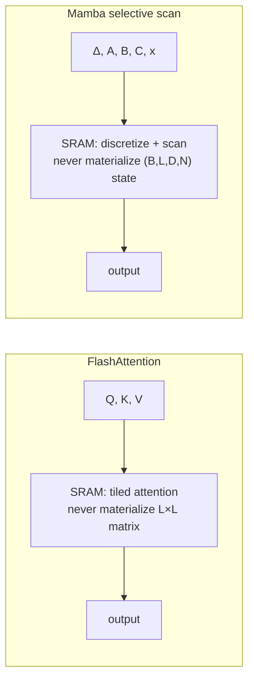

The computations are entirely different. The **systems philosophy is the same**: identify the intermediate tensor that dominates memory traffic, refuse to write it to HBM, tile or scan so it can live on-chip, and recompute in the backward pass rather than storing it.

The comparison is not just an analogy the paper leaves implicit, either — §4.5 benchmarks directly against FlashAttention-2, and the fused scan is faster past sequence length 2K, and 20–40× faster than a naive scan written in PyTorch. Appendix D's own summary states the headline both ways: up to **7× faster than attention at sequence length 32K**, and **as memory-efficient as the best attention implementation**, naming FlashAttention. Note the shape of that claim — it doesn't beat FlashAttention on memory, it *matches* it, and wins on time.

So a useful way to file these next to each other for CUDA study:

| | Dominant intermediate | Strategy |
|---|---|---|
| **FlashAttention / FlashInfer** | the `L × L` attention matrix | tiling, on-chip softmax, recomputation |
| **Mamba selective scan** | the `(B, L, D, N)` expanded state | fusion, parallel scan in SRAM, recomputation |

And the question I'd take into the kernel source: **how does the selective scan achieve FlashAttention-grade efficiency despite carrying a sequential dependency that attention doesn't have?**

## 6. Where matrix multiplication fits — a mental-model correction

A tempting but wrong model is that Mamba somehow converts the whole recurrence into one giant matmul the way attention does. It doesn't. Efficiency comes from several mechanisms working together:

- **Linear projections.** Most parameters in the block — `3ED²` — are in projections (Part II §8). These are ordinary matmuls and ideal GPU work.
- **Parallel scan.** The recurrence itself, reassociated into a tree.
- **Kernel fusion.** One kernel spanning projection → `Δ` computation → discretization → state update → output, instead of five kernels with HBM round-trips between them.
- **SRAM residency.** Keep the expanded state on-chip rather than materializing it in HBM.

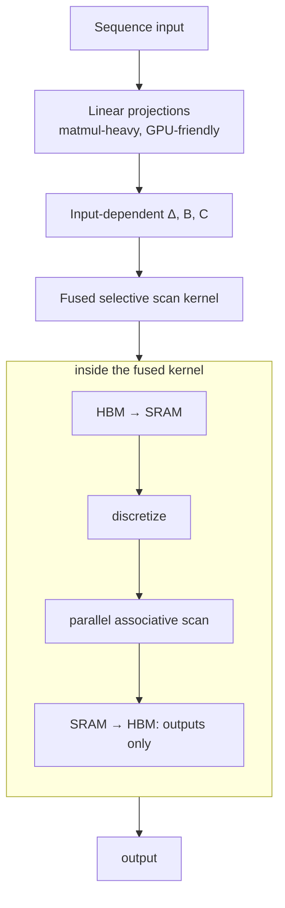

Worth knowing where this goes next: the original Mamba scan does *not* run on tensor cores, because a scan isn't a matmul. **Mamba-2** (Dao & Gu, arXiv:2405.21060) reformulates the computation through structured state space duality so most of the work becomes matrix multiplications — which is precisely how it gets faster. That is beyond the original paper's scope, but it's the natural next stop if the kernel engineering is what interests you.

## 7. Why choose the recurrence at all, given the FLOP counts?

One statement in §3.3.2 looks backwards at first: naive recurrent computation is `O(BLDN)` FLOPs, while the convolution is `O(BLD log L)`. If the recurrence is also sequential, why prefer it?

Because the recurrence has a **lower constant factor**, so for long sequences and modest `N` it can genuinely use fewer FLOPs. FLOPs were never the binding constraint. The real ones were:

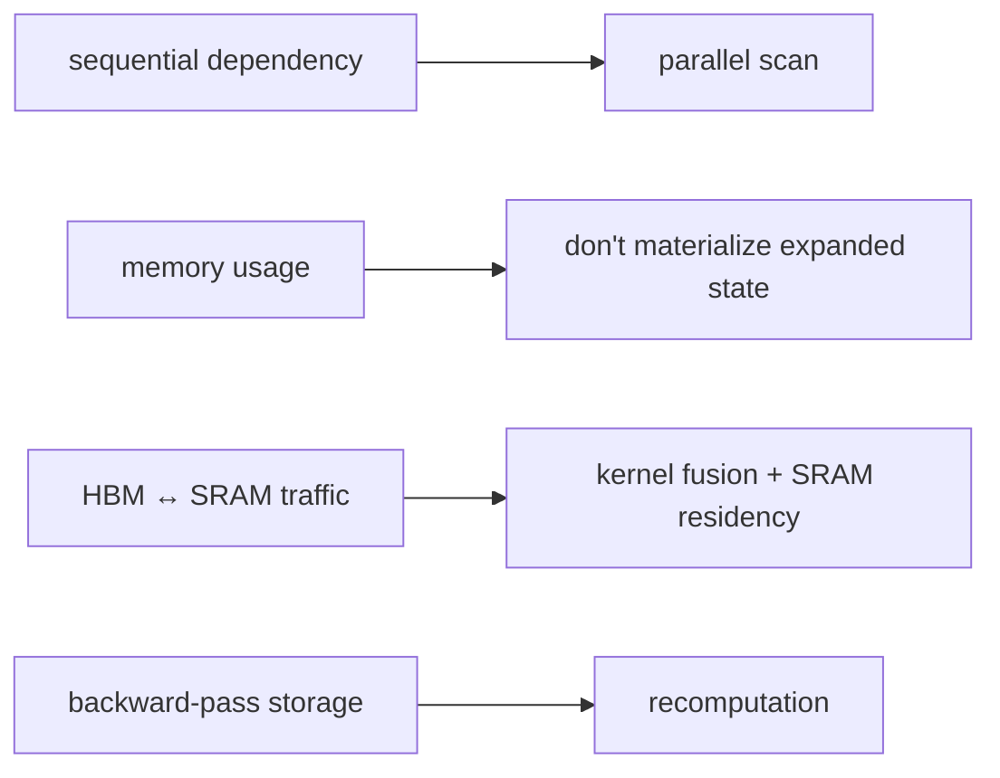

Measured results (§4.5, Appendix D): linear scaling in sequence length against pseudo-linear for convolution-based SSMs, up to 3× faster than convolution on A100 GPUs, faster than FlashAttention-2 past 2K rising to roughly 7× faster than attention at 32K, and 20–40× faster than a naive PyTorch scan.

Appendix D also frames the motivation exactly this way: SSM scans are *theoretically* efficient at `O(BLDN)` FLOPs scaling linearly in `L`, but training real models demands they be efficient **on actual hardware** too. The gap between those two sentences is the whole appendix — and, arguably, the reason the paper worked when earlier selective recurrences didn't.


*Figure 8 (Mamba paper). Left: scan vs. convolution vs. attention timing on an A100 80GB PCIe. Right: inference throughput across batch sizes.*


**The takeaway for a CUDA reader:** the interesting problem was never "implement an SSM." A time-invariant SSM is an FFT-based convolution. The interesting problem is implementing a **time-varying** SSM without paying `N×` in memory traffic:

$$
\boxed{\text{Selective SSM} + \text{Parallel Scan} + \text{Kernel Fusion} + \text{GPU Memory Hierarchy}}
$$

## 8. The whole of §3 in one map

Parts I–III have now covered all of the paper's §3. Since it moves fast and each subsection answers a different kind of question, here is the chain in one place:

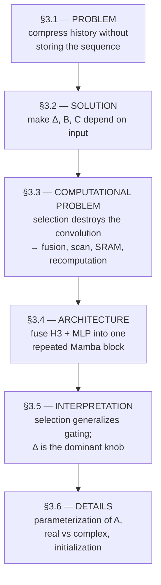

One label to get right, because it's easy to mis-remember: **§3.6 is not "why selection matters."** It's *Additional Model Details* — the parameterization of `A`, real versus complex state, initialization, how `Δ` is projected. Mundane but load-bearing; the audio results in Part IV §4 turn out to be the one place where the real-versus-complex choice flips.

And the three levels of the taxonomy, each in its own voice:

> **S4:** "I have a fixed mechanism for compressing history."
> **S6:** "I'll make that compression depend on the input."
> **Mamba:** "I'll build a simple architecture around that selective SSM, and implement its recurrence efficiently on GPUs."

---

# Part IV — The Evidence: What §4 Actually Shows

Part I claimed LTI SSMs did well on continuous signals and badly on discrete, information-dense data. §4 is where that claim gets tested, so it's worth reading by *domain* rather than by table number — the domains are the argument.

The paper's evaluation spans synthetic tasks, language, DNA, and audio. Compressed below, with the cross-domain comparison figures marked for insertion.

## 1. Synthetics: the ablation that isolates selection

**Table 1 (Selective Copying)** is the cleanest experiment in the paper, because it varies architecture and inner layer independently:

| Architecture | Inner layer | Accuracy |
|---|---|---|
| No gate | S4 | 18.3 |
| No gate | **S6** | **97.0** |
| H3 | S4 | 57.0 |
| H3 | Hyena | 30.1 |
| H3 | **S6** | **99.7** |
| Mamba | S4 | 56.4 |
| Mamba | Hyena | 28.4 |
| Mamba | **S6** | **99.8** |

Read the columns, not the rows. Changing the *architecture* moves you from 18.3 → 57.0 → 56.4 — real but nowhere near solving it. Changing the *inner layer* to S6 moves you to 97.0 → 99.7 → 99.8 regardless of which architecture wraps it. Selection is doing the work; the architecture is a modest multiplier on top.

This is also the direct refutation of the tempting shortcut that gated architectures supply the needed data-dependence. They don't (Part I §4).

**Table 2 (Induction Heads)** trains at length `2⁸ = 256` and tests out to `2²⁰ = 1048576`. Mamba holds accuracy flat across the entire range. The attention variants (MHA-Absolute, MHA-RoPE, MHA-xPos), H3, and Hyena all decay toward chance within an order of magnitude or two, and the attention models eventually run out of memory entirely.

## 2. Language: text


*Figure 4 (Mamba paper). Two panels, sequence length 2048 and 8192, models ~125M to ~1.3B on the Pile, perplexity against FLOPs on log-log axes. Baselines: Hyena, RWKV, Transformer, RetNet, H3++, Transformer++, Mamba.*


The headline: Mamba scales better than every attention-free baseline, and is the **first attention-free model to match the strong "Transformer++" recipe** — the modern PaLM/LLaMa-style baseline with rotary embeddings, SwiGLU MLP, RMSNorm, no linear bias, higher learning rates. The advantage grows with sequence length, which is exactly what the selectivity argument predicts.

An easily-missed detail with real weight: full results at context length 8K are **missing for RWKV and RetNet**, because those implementations ran out of memory or would have needed unrealistic compute. Efficiency is not a separate concern from quality here — it determined which baselines could be run at all.

**Table 3 (zero-shot downstream)** compares against Pythia and RWKV trained on the same tokenizer, dataset, and token count. Compressed to the pattern:

| Model | Pile ppl ↓ | Average acc ↑ |
|---|---|---|
| Pythia-1.4B | 7.51 | 55.2 |
| **Mamba-1.4B** | **6.80** | **59.7** |
| Pythia-2.8B | 6.73 | 59.1 |
| **Mamba-2.8B** | **6.22** | **63.3** |
| Pythia-6.9B | 6.51 | 61.7 |
| RWKV-7.4B | 6.31 | 62.5 |
| GPT-J-6B | — | 63.0 |
| OPT-6.7B | — | 62.9 |

Two things fall out. Mamba-1.4B (59.7) beats Pythia-2.8B (59.1) — the twice-the-size claim, verified. And Mamba-2.8B (63.3) exceeds *every* ~7B model in the table, including Pythia-6.9B, RWKV-7.4B, OPT-6.7B, and GPT-J-6B. The paper's summary is that Mamba is best-in-class at every size and generally matches baselines at twice the model size.

This is also where the abstract's "4 points higher than Pythia-3B, exceeds Pythia-7B" resolves: 63.3 − 59.1 = 4.2 against the 2.8B, and 63.3 > 61.7 against the 6.9B.

## 3. DNA: discrete, and extremely long


*Figure 5 (Mamba paper). Two panels on the human genome. *Left:* fixed context 1024, model size ~200K → ~40M, comparing HyenaDNA, Transformer++, Mamba. *Right:* fixed model size, sequence length `2¹⁰` → `2²⁰`, comparing HyenaDNA-1.4M, Mamba-1.4M, Mamba-7M.*


**Left panel — parameter efficiency.** Mamba's perplexity improves smoothly with model size and scales better than both baselines. At the largest size tested (~40M), Mamba matches Transformer++ and HyenaDNA with roughly **3–4× fewer parameters**.

**Right panel — and this is the single most important plot in the paper for the thesis.** Hold model size and total tokens fixed, sweep context length from 1K to 1M:

- **Mamba gets better** as context grows, all the way to 1M.
- **HyenaDNA gets worse** as context grows.

A baseline degrading with *more* context looks paradoxical until you apply Part I's argument, which the paper does explicitly: an LTI model cannot selectively ignore anything. From the convolutional view, a very long fixed kernel is aggregating everything across the sequence — including a great deal of noise. More context means more noise forced into the same fixed aggregation. Selection is what converts extra context from a liability into an asset.

If you want one experimental result that justifies the entire paper, it's this panel.


*Figure 6 (Mamba paper). Fine-tuning accuracy against sequence length `2¹⁰` → `2²⁰`, for HyenaDNA-1.4M, Mamba-1.4M, Mamba-7M, against a random baseline.*


The downstream task is classifying which of five great apes — human, chimpanzee, gorilla, orangutan, bonobo — a random DNA segment came from. These species share about **99% of their DNA**, which is what makes it hard: the discriminative signal is sparse and scattered, so accuracy should improve with longer context only if the model can pick out the rare informative regions. Mamba's accuracy climbs with sequence length; the baseline's does not reliably.

## 4. Audio: the continuous modality


*Figure 7 (Mamba paper). Bits per byte against training sequence length `2¹³ = 8192` → `2²⁰ ≈ 10⁶`, comparing S4+FFN and Mamba, at fixed computation.*


Here the comparison is against **SaShiMi**, the prior state of the art for audio waveforms — a U-Net backbone with alternating S4 and MLP blocks. The experiment replaces those S4+MLP blocks with Mamba blocks. Both improve with longer context, but Mamba is better throughout and the **gap widens at longer lengths**.

**Table 4 (SC09 speech generation)** — autoregressive generation of spoken digits "zero" through "nine" — has a small Mamba-UNet outperforming the state of the art and much larger GAN- and diffusion-based baselines (WaveNet, SampleRNN, WaveGAN, DiffWave, SaShiMi). A parameter-matched larger Mamba improves fidelity metrics dramatically further.

**Table 5** ablates which block goes where in the U-Net, and the ordering is informative: Mamba beats S4+MLP in the outer stages, and in the center stage **Mamba > S4+MLP > MHA+MLP**. Attention is the *worst* of the three at the center — a useful corrective to any assumption that attention is a universal upgrade.

One detail with a footnote in Part III: audio is the **only** experiment in the paper where the authors switched from real to complex parameterization (§3.6). That's the mundane-details section earning its place.

## 5. The cross-domain picture

This is the comparison worth keeping in one view, because the story is that *the same layer wins in domains that have nothing in common*:

| Domain | Data type | Compared against | Result |
|---|---|---|---|
| Selective Copying | synthetic, discrete | S4, Hyena inner layers | 18–57% → **97–99.8%** |
| Induction Heads | synthetic, discrete | MHA variants, H3, Hyena | flat accuracy to **1M tokens**; ~4000× extrapolation |
| Language (Pile) | discrete, dense | Transformer++, RWKV, RetNet, Hyena, H3++ | **first attention-free model to match Transformer++** |
| Language (downstream) | discrete, dense | Pythia, RWKV, OPT, GPT-J | Mamba-2.8B **> all ~7B baselines** shown |
| DNA (model size) | discrete, long | HyenaDNA, Transformer++ | matches with **3–4× fewer parameters** |
| DNA (context) | discrete, long | HyenaDNA | **improves to 1M** where baseline *degrades* |
| DNA (great apes) | discrete, 99% shared | HyenaDNA | accuracy rises with context length |
| Audio pretraining | **continuous** | SaShiMi (S4+MLP) | better throughout, gap widens with length |
| Audio generation | **continuous** | WaveNet, DiffWave, SaShiMi, GANs | small Mamba beats much larger models |
| Efficiency | — | FlashAttention-2, conv SSMs, PyTorch scan | ~7× at 32K; 20–40× vs naive scan |

Note the shape of that table. Mamba wins on the discrete modalities where LTI SSMs were weak — which is the point of selection — *and* holds up on audio, the continuous modality where LTI SSMs were already strong. That second half is the less obvious achievement, and §5 immediately complicates it.

## 6. The ablation that ties it together

Most ablations confirm what you'd expect. Two are genuinely informative.

**Table 9 — how expressive does `Δ` need to be?** `Δ` is produced by projecting the input. Sweeping the projection dimension, with `N = 16` fixed:

| `Δ` projection size | Params (M) | Perplexity |
|---|---|---|
| none | 358.9 | 9.12 |
| 1 | 359.1 | **8.97** |
| 8 | 360.5 | 8.83 |
| 32 | 365.2 | 8.80 |
| 64 | 371.5 | 8.71 |

The jump from *no projection* to a **rank-one** projection is the big one (9.12 → 8.97). Everything after is incremental. Making `Δ` input-dependent at all is what matters; how richly you parameterize it is a secondary tuning decision.

**Table 10 — and this is the result I'd put on a slide.** Increasing the state dimension `N`, run twice: once with constant `B, C`, once with selective `B, C`.

| `N` | Constant `B, C` | Selective `B, C` |
|---|---|---|
| 1 | 9.88 | 9.73 |
| 2 | 9.86 | 9.40 |
| 4 | 9.82 | 9.09 |
| 8 | 9.82 | 8.84 |
| 16 | 9.81 | **8.71** |

Look at the left column: `N` from 1 to 16 buys **0.07 perplexity**. Essentially nothing. Now the right column: the same sweep buys **1.02**. For about 1% more parameters (367.1M → 371.5M).

So state expansion and selection are not two independent improvements that happen to stack. **State capacity is close to worthless unless the model can decide what to put in it.** That is Part I §5's four-way table — linear attention had the big state without selection, gated RNNs had selection without the big state — turned into a controlled experiment. It also explains why the LTI SSM line could keep raising `N` without proportionate gains.

## 7. No free lunch — the paper's own caveats (§5)

§5 is short and unusually candid, and skipping it produces an overconfident reading of everything above.

**The continuous–discrete spectrum.** Structured SSMs originated as discretizations of continuous systems, giving them a strong inductive bias toward perceptual signals like audio and video. Selection overcomes their weakness on discrete modalities such as text and DNA — but the paper states plainly that it can **conversely impede performance on the data LTI SSMs excel at**. Selection is a trade, not a free upgrade. Their audio ablations examine that tradeoff directly.

This is the honest amendment to Part I §6: the modality gap doesn't simply close, it partially *moves*.

**Downstream affordances.** Transformer LLMs come with an ecosystem — fine-tuning, adaptation, prompting, in-context learning, instruction tuning, RLHF, quantization. Whether SSMs support the same properties and interaction modes is flagged as an open question, not an answered one. Part V picks this up, since it turned out to be where the practical friction lives.

**Scaling.** The paper says outright that its evaluation is limited to model sizes **below** most strong open-source LLMs, that RWKV and RetNet have been evaluated at 7B and beyond, that whether Mamba compares favourably at those sizes remains to be assessed, and that scaling SSMs may involve engineering challenges the paper does not discuss.

Worth pausing on, because the loud version of the Mamba story tends to omit it. The authors did not claim to have settled the frontier-scale question. Part V is largely about what happened when someone did test it.

## 8. The paper's conclusion (§6)

Paraphrased, the closing claim is deliberately scoped:

- A selection mechanism is introduced into structured SSMs, letting them do context-dependent reasoning while still scaling linearly in sequence length.
- Placed in a simple **attention-free** architecture, Mamba reaches state-of-the-art results across a diverse set of domains, matching or exceeding strong Transformers.
- The authors are optimistic about selective SSMs as foundation-model backbones generally, and single out **emerging modalities needing long context — genomics, audio, video**.
- The stated conclusion is that Mamba is a **strong candidate** for a general sequence model backbone.

Note the register. "Strong candidate," not "replacement." Given §5's three caveats, that's the appropriate strength of claim — and it's a more accurate summary of the paper than most secondhand accounts give.

---

# Part V — So Why Hasn't Mamba Replaced the Transformer?

If Mamba is 5× faster with better scaling, the obvious question is why the frontier labs still ship Transformers. The answer is not that Mamba is slow. It is that **throughput is one axis, and Mamba trades away capabilities that happen to matter a great deal for general-purpose LLMs.**

## 1. What "5× faster" actually measures

Read §4.5 carefully, because the number is narrower than it sounds.

The benchmark measures **end-to-end generation throughput** on an A100 80GB PCIe with prompt length 2048. The reported gain is 4–5× over a Transformer of similar size, and the *reason* is the interesting part: without a KV cache, Mamba can run at much larger batch sizes. The authors' illustration is striking — an untrained Mamba-6.9B would out-throughput a Transformer-1.3B, a model five times smaller.

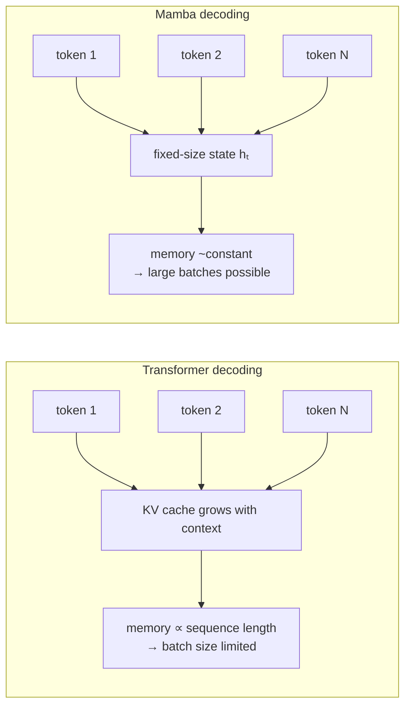

That is a real and large deployment advantage. But note what the claim is *not*: it is not "every Mamba operation is 5× faster than every Transformer operation." It is a throughput measurement under specific conditions, driven substantially by a memory-footprint property that permits larger batches. The architectural claims the paper actually makes are constant time per step during decoding and linear-time training.

$$
5\times \;\ne\; \text{uniformly 5× faster at everything}
$$

## 2. What a fixed state gives up

Consider:

> "The employee's ID is 739284." … 5,000 tokens of unrelated discussion … "What was the employee's ID?"

A Transformer still has every one of those tokens in its KV cache. Attention can form a direct link between the query and the token holding the answer — retrieval by construction.

Mamba has compressed those 5,000 tokens into a fixed-size state. Its question is different:

> "Did I keep the information I would later need, inside a state of bounded size?"

Sometimes yes — that is what selection is for, and Induction Heads shows it can be done spectacularly well when the task is clean. But it is a fundamentally different memory mechanism, and it is not as reliable as explicit retrieval over a preserved context. This is the compression tradeoff from §3.1 arriving as a practical limitation.

## 3. What happened at 8B scale

The original paper's language experiments run up to 1.3B parameters, and as Part IV §7 noted, §5 says outright that this is below the scale of strong open-source LLMs and that whether Mamba compares favourably at 7B+ remains to be assessed. So this isn't a gap critics found — it's a gap the authors flagged. A larger controlled study later closed it.

**Waleffe et al., "An Empirical Study of Mamba-based Language Models"** (arXiv:2406.07887, June 2024 — a collaboration including Mamba's own authors, Dao and Gu, with NVIDIA) trained 8B-parameter Mamba, Mamba-2, Transformer, and hybrid models on identical data, up to 3.5T tokens. Findings:

- Pure SSM models **matched or exceeded** Transformers on many standard tasks.
- They **lagged** on tasks needing strong copying, in-context learning (e.g. 5-shot MMLU, Phonebook-style retrieval), and long-context reasoning — exactly the capabilities §2 predicts will be hardest for a compressed state.
- A **Mamba-2-Hybrid** — roughly 43% Mamba-2 layers, 7% attention, 50% MLP — beat the Transformer on all 12 standard tasks evaluated, by about 2.65 points on average, while being projected to generate tokens up to 8× faster. It stayed competitive across 23 further long-context tasks from 16K to 128K.

So the empirical direction is not "Transformer out, Mamba in" but:

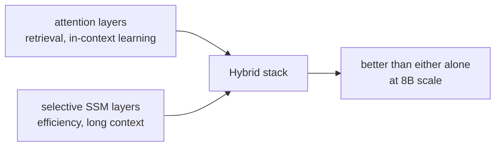

A handful of attention layers restores the retrieval capability, and the SSM layers carry the efficiency. You keep most of the throughput win because attention is now a small fraction of the stack.

## 4. A wrinkle: the original paper's own hybrid ablation

Worth flagging, because it complicates the tidy story. Appendix E.2.2 ablates interleaving Mamba blocks with MHA blocks at small scale, and finds the Mamba-MHA variant only *slightly* better than homogeneous Mamba — which the authors themselves call somewhat surprising, given that other work had found combining LTI SSMs with attention gave substantial gains.

Two readings, and the paper doesn't settle between them: the benefit of hybridization may only emerge at larger scale and longer context than the ~350M / 2K-context ablation probes, or it may depend on placement and ratio. The 8B study suggests the former. Either way, treat "just add a few attention layers" as an empirical result at scale rather than something the original paper established.

## 5. Throughput is one metric among many

Tokens per second matters; it is not what a frontier model is judged on. The list also includes pretraining efficiency, training stability, reasoning quality, retrieval, in-context learning, coding, long-context reasoning, instruction following, tool use, multimodal integration, and scaling behaviour.

A model 5× cheaper to serve but materially worse at in-context learning is not automatically the better model — and in-context learning is precisely where the 8B study found pure SSMs weakest.

## 6. The better framing

Recall Part I: linear attention, gated RNNs, and SSMs are all attacking one question.

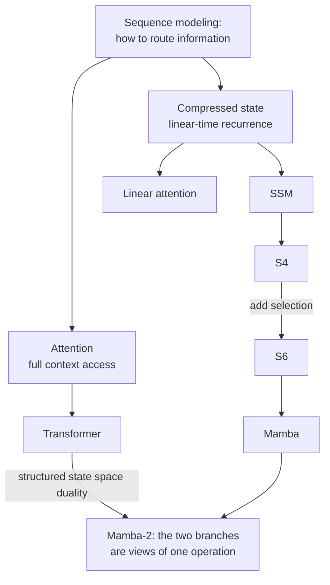

The two branches turned out closer than they looked. **Mamba-2** (Dao & Gu, "Transformers are SSMs: Generalized Models and Efficient Algorithms Through Structured State Space Duality," arXiv:2405.21060) develops a framework connecting SSMs to variants of attention and uses it to design a faster layer. If attention and SSMs are two views of one structured operation, "Transformer vs. Mamba" is the wrong axis. The better question:

> What is the best way to route sequence information under a fixed compute and memory budget?

And per Part III, Mamba's advantage does not live in the equations alone. A large share of it comes from how the selective recurrence is mapped onto the GPU memory hierarchy. The paper's own framing of its second contribution says as much: selection is a simple change that breaks computational efficiency, and the hardware-aware algorithm is what makes it viable. That co-design is arguably the most transferable thing in the paper.

---

# Part VI — My Implementation: Mamba + Domain-Aware Hierarchical Memory

This is the direction I want to build, framed as a research question rather than a reimplementation.

## 1. The hypothesis, stated carefully

The tempting version is wrong:

> ~~Add external memory to Mamba and you get Transformer-equivalent results.~~

There is no reason to expect equivalence, and claiming it makes the project unfalsifiable. The defensible version:

> **Use Mamba as the efficient sequence-processing backbone, and give it an external hierarchical memory that compensates for the representation bottleneck of its fixed-size state — while preserving the linear-time, constant-state inference properties that made it attractive.**

Or as a question:

> Can domain-specific hierarchical memory offset the information-compression limits of a selective SSM without giving back its efficiency advantage?

That is testable, and the second clause is what makes it hard.

## 2. Why the paper's own framing invites this

§3.1 casts sequence modelling as compressing context into a smaller state, and states the bind explicitly: efficient models need small states, effective models need states holding everything the context will later require. Mamba's answer is to compress *better* — selectively. An external memory attacks the same bind from the other side: don't compress everything in the first place.

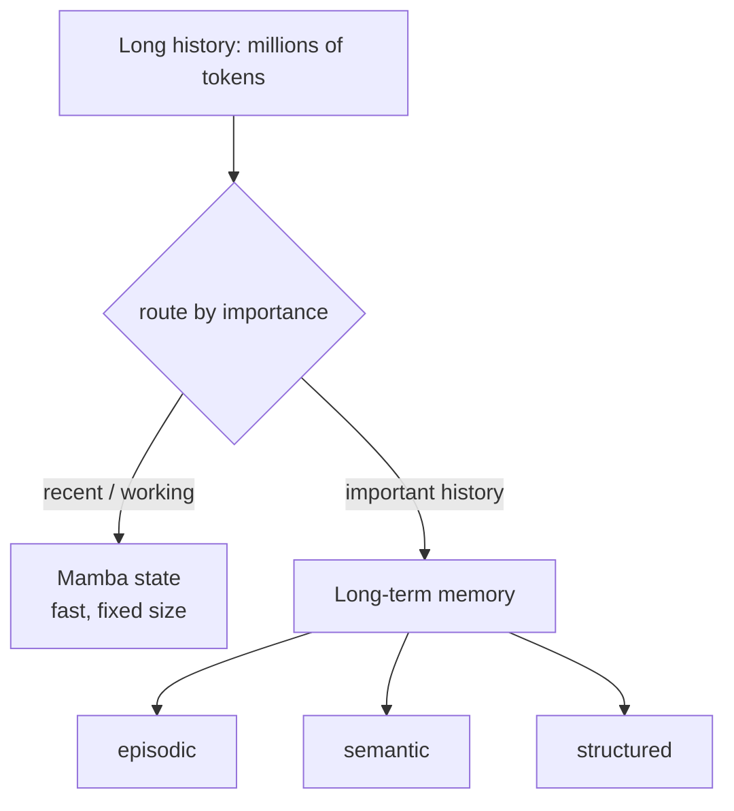

Mamba then only holds the *current working state*, while the memory system holds what must survive for months.

## 3. Memory tiers

**Fast / working memory** — processed continuously by the Mamba backbone: recent transactions, current conversation, the application in flight, present financial state.

**Episodic memory** — discrete events worth recalling: *took a home loan in March*; *salary rose four months ago*; *unusually large transaction in May*.

**Semantic memory** — compressed persistent facts, updated rather than appended:

```text
monthly_income          ≈ ₹1.25L
loan_status             = active
avg_credit_utilization  = 0.38
risk_profile            = moderate
```

**Structured memory** — what a banking domain gives you for free and generic LM setups don't have:

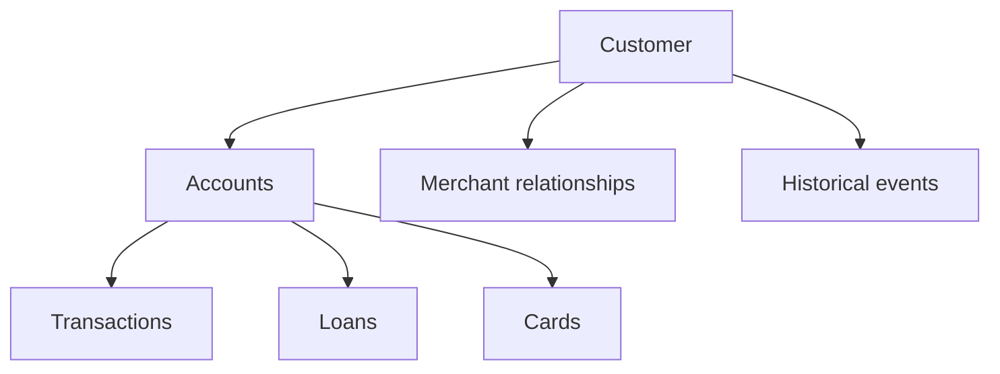

## 4. Worked example

```text
January   Salary ₹1.2L
February  Credit-card payment ₹40K
March     Loan application
April     Salary ₹1.25L
May       Large transaction ₹8L
June      Credit utilization rises
```

A naive system feeds the whole history into context. Under this design, a query like *"why did this customer's risk score increase?"* does not require three years of transactions in the model's context. The memory system retrieves the relevant evidence — the March loan, the May transaction, the June utilization trend — and Mamba reasons over that selected set.

This is the same idea as selection, applied one level up. The SSM selects at token granularity inside the recurrence; the memory system selects at event granularity outside it.

## 5. The domain advantage: importance is definable

In general language modelling, "important" has to be learned. In banking it can be *specified*:

```text
₹500 grocery purchase   → low importance, aggregate away
₹12L unusual transfer   → high importance, episodic memory
loan default            → critical, permanent
salary change           → semantic memory (update the fact)
repeated merchant use   → aggregate into semantic memory
```

So retrieval need not rest on generic embedding similarity alone:

$$
\text{importance} = f(\text{recency},\ \text{amount},\ \text{frequency},\ \text{risk},\ \text{entity},\ \text{event type},\ \text{query relevance})
$$

That hand-specified signal is a legitimate advantage over general-purpose long-context methods, and it's the part a generic benchmark wouldn't capture.

## 6. System sketch

```mermaid
flowchart TB
  ST["Banking event stream"] --> MB["Mamba backbone"]
  MB --> SS["selective state"]
  SS --> J{"important?"}
  J -->|"no"| DR["discard / aggregate"]
  J -->|"yes"| MW["memory writer"]
  MW --> EP["episodic"]
  MW --> SE["semantic"]
  MW --> STM["structured"]
  QY["query"] --> RT["memory retrieval<br/>sparse, chunked, top-k"]
  EP --> RT
  SE --> RT
  STM --> RT
  RT --> MB2["Mamba reasons over<br/>retrieved evidence"]
  MB2 --> AN["answer"]
```

## 7. Two levels of selection — and the agentic analogy

Here is the framing that makes this project coherent rather than a pile of components. There is a real structural parallel between what Mamba does inside a layer and what an agentic system does around a model:

| | Mamba | Agentic system (e.g. a coding agent) |
|---|---|---|
| What's too big | the sequence | the conversation, codebase, tool outputs |
| Mechanism | learned selective state update | retrieval, summarization, context management |
| Where it lives | **inside the architecture** | **outside the model, in the system** |
| Granularity | per token, per channel | per file, per message, per tool result |
| Question asked | what deserves persistent state? | what deserves to be in the context window? |

Both are answering *what information from the past is worth carrying forward*. But they are not the same mechanism, and conflating them is the mistake to avoid. Mamba learns `h_t = f(h_{t−1}, x_t)` as part of the network, trained end to end. A system-level context manager is code operating on a model that has no idea the management is happening.

The useful phrasing:

> **Mamba addresses context compression at the architecture level; agentic frameworks address context management at the system level.**

Which suggests doing both, deliberately, at different granularities:

```mermaid
flowchart TB
  RAW["Raw domain stream<br/>millions of events"] --> L1["LEVEL 1 — semantic selection<br/>domain router, outside the model"]
  L1 -->|"what deserves computation?"| RED["Reduced / packed sequence"]
  RED --> L2["LEVEL 2 — neural selection<br/>selective SSM, inside the model"]
  L2 -->|"what deserves persistent state?"| ST["Mamba state"]
  ST --> L3["LEVEL 3 — hardware<br/>fused kernel, scan, SRAM residency"]
  L3 -->|"how do we execute it cheaply?"| OUT["Output"]
```

Three layers, three distinct questions. Level 2 is the paper's contribution; level 3 is the paper's Appendix D. Level 1 is where a domain project can actually add something, because banking semantics are available to me and were not available to Gu & Dao.

## 8. The router: what actually does level-1 selection

The tempting version is to call a frontier model per event. Don't — that inverts the entire cost argument:

```text
every event → large LLM → Mamba        ✗  the router is now the bottleneck
1,000 events → cheap router → 20 kept  ✓  router cost amortized over a chunk
```

If the goal is efficiency, the router must be cheap relative to what it saves. Reasonable candidates, roughly in order of how much I'd trust them to stay cheap:

- **A gradient-boosted classifier (XGBoost/LightGBM) over hand-built features** — amount, z-scored amount, merchant category, recency, entity type, event type, frequency. Milliseconds per batch, trivially explainable, and importance in banking really is largely a function of tabular features. This is where I'd start.
- **A small distilled transformer classifier** if text fields (descriptions, notes) carry signal the tabular features miss.
- **A frontier model as a *teacher*, not a component** — use it during development to label events `retain / compress / discard`, distil into the cheap router, then never call it at inference. This gets semantic judgement into the system without paying for it per event.

```mermaid
flowchart TB
  EV["Event chunk"] --> FE["Feature extraction<br/>amount, recency, category, entity"]
  FE --> RT["Cheap router<br/>GBM / small classifier"]
  RT -->|"high importance"| FULL["Keep at full resolution"]
  RT -->|"low importance"| COMP["Compress to summary"]
  RT -->|"noise"| DROP["Drop"]
  FULL --> PK["Packed sequence → Mamba"]
  COMP --> PK
  TEACH["Frontier model<br/>offline, development only"] -.->|"distil labels"| RT
```

Note the three-way output rather than keep/drop. Binary deletion is the risky design — if the router is wrong, the information is gone with no recovery path. A compressed-summary tier degrades gracefully instead, and it's the same insight as the memory tiers in §3: unimportant history becomes a *smaller* representation, not an absent one.

## 9. Chunk-level, not token-level — and this is a hardware argument

This is the design decision I'd defend most strongly, and it comes straight out of Part III.

Suppose the router selects scattered individual events:

```text
x₁ x₂ x₃ x₄ x₅ x₆ x₇ x₈ ... x₁₀₀₀₀₀₀
   ↑           ↑        ↑
   keep        keep     keep      → scattered gather
```

You've now created a **gather problem**. The GPU must collect non-contiguous elements from HBM, and uncoalesced access is exactly the pattern that wastes memory bandwidth — the resource Appendix D established as the binding constraint. So the naive expectation fails:

$$
\text{50\% fewer tokens} \;\ne\; \text{50\% faster}
$$

Route at **chunk** granularity instead:

```text
[chunk 1: x₁…x₂₅₆]  → KEEP      contiguous
[chunk 2: x₂₅₇…x₅₁₂] → COMPRESS
[chunk 3: x₅₁₃…x₇₆₈] → KEEP      contiguous
[chunk 4: x₇₆₉…x₁₀₂₄] → KEEP     contiguous
```

Now every retained region is a contiguous span, so reads coalesce and the packed sequence is dense.

And there's a reason this is more than a convenience: **Appendix D already chunks.** When `L` is too large for SRAM, the fused kernel splits the sequence and scans chunk by chunk, carrying the intermediate state across the boundary. So chunk-level routing lines up with a boundary the kernel *already has*. Choose the routing granularity to match the kernel's chunk size and level-1 selection becomes "skip some chunks in a loop the kernel is already running," rather than a separate gather pass bolted on front.

That alignment — routing granularity = kernel chunk granularity — is the part of this design I think is genuinely worth writing up.

## 10. The traps to design around

**Trap 1: reintroducing quadratic cost.** Bolt unrestricted attention over a large external memory and you're back to the cost you were avoiding, having built a slower Transformer with extra steps. The memory mechanism must be selective and hardware-efficient in its own right — chunked, hierarchical, top-k, with a bounded amount ever reaching the model. That is the same constraint Mamba solved one level down with the fused scan (Part III §4), and RAMba is the published example of solving it one level up.

**Trap 2: claiming sublinearity I don't have.** This one matters for how the work gets described. The honest accounting is:

$$
\text{Cost} = \underbrace{C_\text{router}(L)}_{\text{sees everything}} + \underbrace{C_\text{gather/pack}}_{} + \underbrace{C_\text{Mamba}(L')}_{L' \ll L}
$$

If the router examines every event, it is `O(L)`, so **the pipeline stays linear in `L`** no matter how small `L'` gets. What I'd have reduced is the *constant factor* on the expensive stage — cheap tabular router over `L`, expensive neural scan over `L'` — which is a real and useful engineering win, but not a complexity result.

So the correct label is **adaptive sequence reduction** or **domain-aware chunk routing**, not "sublinear Mamba." A genuine complexity claim would need a router that doesn't touch every event — hierarchical or index-based pre-filtering — and that's a separate, harder project.

**Trap 3: stuffing selected context into the prompt.** One version of this idea is to prepend the important facts as a header:

```text
[IMPORTANT CONTEXT]  outstanding loan; salary +20%; large transfer
[STREAM]  x₁ x₂ x₃ x₄ …
```

That's cheap to try and worth having as a baseline, but it's weak by construction: Mamba still processes the header *sequentially*, so you're hoping the facts survive thousands of subsequent state updates. That is precisely the compression bottleneck this whole design exists to avoid. Retrieval into the state at the point of need is the better mechanism; prompt-prefixing is the control condition.

## 11. What this looks like on an H100

The H100 is a good platform for level 3 specifically, because it's where a theoretical token reduction either does or doesn't become wall-clock time. High HBM bandwidth, large on-chip shared memory, and good fused-kernel support mean the memory-hierarchy argument from Part III is testable rather than notional.

The comparison I'd actually run:

```text
(a) Full Mamba over L                       ← baseline
(b) Router + Mamba over L'                  ← does reduction help end to end?
(c) Router + chunk-aligned fused kernel     ← does the alignment in §9 pay?
```

And the instrumentation, because "faster" is not a measurement:

| Measure | Why |
|---|---|
| Sequence reduction `L → L'` | the claimed mechanism |
| End-to-end latency | the only number that settles it |
| Mamba kernel latency alone | separates level-3 gains from level-1 gains |
| Router latency | is the router actually cheap? |
| Achieved HBM bandwidth | Part III says this is the binding resource |
| SM occupancy | catches the uncoalesced-gather failure in §9 |
| Peak memory | the constant-state property must survive |
| Task accuracy | the thing being traded away |

The single most informative plot is accuracy against retention:

```text
accuracy
   │─────────╮
   │          ╲
   │           ╲___
   │
   └──────────────────────── fraction of context retained
              ↑
        the knee — how much can be discarded almost for free
```

Finding that knee is the actual result. If it's at 10% retention, the design is strong; if accuracy degrades linearly from the start, the router isn't finding real structure and the honest conclusion is that a small hybrid was the better engineering choice.

Which reframes the research question one last time. Not *"can I make Mamba faster?"* — Gu & Dao already did the hard part there. Rather:

> **How much domain context can be eliminated or compressed before the selective SSM ever sees it, while preserving task accuracy — and does that reduction translate into real H100 throughput once gather costs and kernel alignment are accounted for?**

## 12. Related work — this is an active direction

Four things to read first, all verified:

- **Wang et al., "Mamba with Hierarchical Memory: Solving Representation Bottleneck in Long Sequence Modeling"** (arXiv:2608.02347, August 2026). Hierarchical Memory Mamba starts from a pretrained Mamba backbone and adds working plus persistent long-term memory, explicitly targeting the representation bottleneck of recurrent linear-attention models, with reported long-context retrieval gains for a small parameter increase. Closest published thing to the idea above — read it both for what it does and for what it leaves open in a domain-specific setting.
- **Hu et al., "Hardware-aligned Hierarchical Sparse Attention for Efficient Long-term Memory Access"** (arXiv:2504.16795, NeurIPS 2025). Their RAMba system pairs Mamba with hierarchical sparse attention: chunk the input, select top-k chunks, aggregate hierarchically. They report perfect passkey retrieval across 64M-token contexts despite pretraining at only 4K, with a nearly constant memory footprint. Note the title in circulation is often the earlier v1 phrasing; the v2 title is the one above. This is the reference design for §9 and §10 — chunked, hardware-aligned memory access, i.e. the same philosophy as Part III applied to retrieval rather than to the scan.
- **Ma et al., "Recall with Reasoning: Chain-of-Thought Distillation for Mamba's Long-Context Memory and Extrapolation"** (EMNLP 2025). Distils chain-of-thought summarization from a teacher and prepends it during fine-tuning, teaching Mamba to actively recall and reason over long contexts — improving long-context performance against Transformer and hybrid baselines *without architectural change*. Useful as a baseline: how far does training alone get you before adding machinery?
- **Waleffe et al. (arXiv:2406.07887)** and **Dao & Gu (arXiv:2405.21060)** from Part V, for the scale evidence and the SSM–attention duality respectively.

Two things follow. First, the intuition is a real research direction, not a novice guess. Second, novelty won't come from "Mamba plus memory" as such — that exists. It has to come from the domain-aware part: importance defined by banking semantics rather than learned similarity, and a structured entity memory that generic long-context benchmarks don't model.

## 13. What I'd measure on the capability side

§11 covers the systems instrumentation. These are the capability measurements, and the two sets have to be reported together or the result means nothing:

1. **Retrieval accuracy vs. distance** — a passkey/needle probe over real transaction records, sweeping how far back the evidence sits. Compare Mamba alone, Mamba + memory, a small hybrid, and a Transformer baseline.
2. **Peak memory and throughput at inference** — measured, not assumed. If constant-state behaviour is lost, the premise is gone. §4.5's methodology (fixed prompt length, throughput swept across batch sizes) is the template.
3. **Ablate the memory tiers** — episodic / semantic / structured, one at a time, in the style of Table 7's selective-parameter ablation. If structured memory carries the domain advantage, it shows up here.
4. **Ablate the importance function** — hand-specified weights against plain embedding similarity. The direct test of the domain-knowledge claim, and the likeliest home for the project's actual contribution.
5. **Check for short-context regression** — added machinery shouldn't degrade ordinary short-sequence performance, the property the RwR paper is careful to preserve.

The honest null result to prepare for: memory helps retrieval but costs enough throughput that a small hybrid would have been the better engineering choice. That is worth knowing, and it's why measurement 2 is not optional.

---

# Conclusion

Six parts, so here is what I'd want to still hold a month from now.

**The terminology was never cosmetic.** SSM is a framework, S4 is a structured SSM with time-invariant dynamics, S6 is the selective SSM where `Δ, B, C` become functions of the input, and Mamba is the architecture built around S6. Collapsing those four into "SSM" hides the one sentence that explains the whole paper: **S4 got a large state for free because it was LTI, and Mamba wants that large state without being LTI, so it has to pay for it in the memory hierarchy.** Selection removes the recurrent–convolutional duality, and Appendix D is the bill.

**The contribution is a combination, not a single idea.** Selection alone was not new — Theorem 1 shows LSTM gating is a special case, and Appendix B.3 concedes that gated RNNs can be viewed as selective SSMs and are "more powerful in a sense" than LTI structured SSMs. State expansion alone was not new either; the LTI line had been doing it for years. What was missing was both at once, and Table 10 shows why that matters more than it sounds: raising `N` from 1 to 16 buys 0.07 perplexity with constant `B, C` and 1.02 with selective `B, C`. **State capacity is nearly worthless unless the model can decide what goes in it.**

**Half the paper is a systems paper.** "Linear time" and "runs well on a GPU" are different properties, and closing that gap is where the engineering lives: an associative recurrence reassociated into a tree, a fused kernel that keeps the `(B, L, D, N)` state in SRAM, an `O(N)` reduction in memory I/O, and recomputation that is *faster* than storing because the re-read is what costs. The transferable lesson isn't about SSMs at all — it's find the intermediate tensor that dominates memory traffic and refuse to write it to HBM. FlashAttention did it for the `L × L` matrix; Mamba did it for the expanded state.

**The empirical case is strong and the paper is honest about its edges.** The same layer wins on synthetic recall, language, DNA, and audio — and the DNA context-length panel, where Mamba improves to 1M tokens while HyenaDNA *degrades*, is the cleanest single demonstration that selection is what turns extra context from a liability into an asset. But §5 states that selection can impede performance on the continuous data LTI SSMs excel at, that Transformer downstream affordances are an open question, and that evaluation stopped below frontier scale. The conclusion claims a "strong candidate for a general sequence model backbone" — not a replacement. That's the right strength of claim, and the 8B study bore it out: pure SSMs matched Transformers on many tasks, lagged on copying and in-context learning, and a hybrid beat both.

**So the framing I'd carry forward isn't "Transformer vs. Mamba."** Mamba-2's structured state space duality suggests the two are views of one structured operation, which makes the real question *what is the best way to route sequence information under a fixed compute and memory budget?*

That's also why the direction in Part VI interests me. Mamba answers that question at the architecture level; agentic systems answer a version of it at the system level; a domain-aware router answers it at the semantic level. Three levels, one question. The part I actually want to test is whether routing granularity can be aligned with the fused kernel's existing chunk boundary — so that discarding context costs nothing extra, because the kernel was already chunking anyway. If that works, it's the same trick as the rest of the paper: not a new equation, just a refusal to move data you didn't need to move.

*All section references above point into Gu & Dao, "Mamba: Linear-Time Sequence Modeling with Selective State Spaces," so the claims can be checked against the source.*
