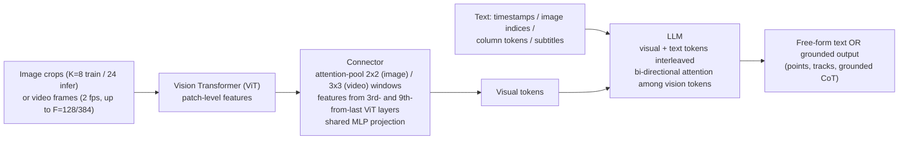
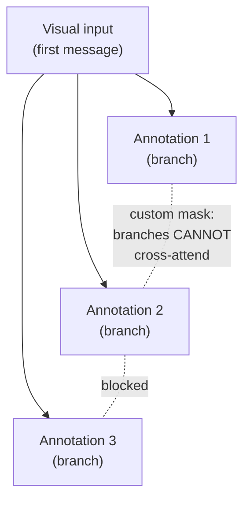

This is a technical dissection of **Molmo2** — the Allen Institute's "Open Weights and Data for Vision-Language Models with Video Understanding and Grounding." The engineering focus is two-fold: the **architecture** that turns a text LLM into a video-grounding model (a ViT + connector + LLM composition), and the **systems recipe** that makes training on wildly uneven multimodal data tractable — token weighting, sequence packing, and a message-tree attention scheme that yields a 15× throughput gain. **[Interpretation]**

The distinguishing capability is **grounding in video**: not just answering "what is happening" but emitting **points and tracks in pixels, across space and time** — where and *when* an event occurs. That, done in a **fully open** model (weights, data, and code, with no distillation from proprietary VLMs), is the contribution. **[Paper]**

**Attribution convention.** Because this article mixes what the paper reports with my own reasoning, every non-obvious technical claim is tagged:

- **[Paper]** — stated explicitly in Clark et al. (arXiv:2601.10611).
- **[Derived]** — a mathematical or logical consequence of the paper's setup, worked out here.
- **[Interpretation]** — my explanation or engineering reasoning, written for the reader; not a claim the paper makes.

---

## Why This Paper Matters

The strongest video-language models are **proprietary** — closed weights, data, and recipe. **[Paper]** The strongest *open-weight* ones either **distill from proprietary VLMs** (so they inherit, rather than advance, the frontier) or **don't disclose their data or training recipe**. **[Paper]** Either way, the open community lacks the foundations to actually *improve on* the state of the art. **[Paper]**

Molmo2's answer is to be **fully open and independent**: all data is constructed **without distilling from closed models**, and weights, data, and code are released. **[Paper]** On top of that it targets a capability even proprietary systems mostly miss — **video grounding**. Image grounding (pointing to an object in a frame) is standard; **video** grounding (pointing to *when and where* an event happens, or *tracking* an object as it moves) is barely supported anywhere. **[Paper]** Grounding is what lets a model answer "How many times does the robot grasp the red block?" by emitting a point per grasp in space and time. **[Paper]**

## The Core Idea: Grounding as Plain Text

The elegant move is that **grounding outputs are just text**. **[Interpretation]** A point is encoded as a compressed plain-text token sequence carrying: **[Paper]**

- **normalized x, y** coordinates,
- a **timestamp** (for video) or **image index** (for multi-image),
- and an **integer object ID** that is unique per distinct object — which is what makes **tracking and counting** possible.

Points are **sorted by time/index, then x, then y**. **[Paper]** Because the whole thing is text, tracking ("emit this object's position in every frame it appears") and counting ("emit one point per distinct object") both reduce to **ordinary next-token prediction** — no bounding-box regression head, no separate tracker. **[Interpretation]** The same LLM that writes a caption writes the coordinates.

## The Architecture: ViT → Connector → LLM

Molmo2 follows the now-standard **pre-trained LLM + ViT + connector** composition. **[Paper]** The interesting engineering is in how visual input is prepared:

- **Cropping (images).** A single downscaled crop plus up to **$K$ overlapping tiling crops** for higher resolution — **$K=8$ during training, $K=24$ at inference** (you can afford more crops when you're not backpropagating). **[Paper]**
- **Frame sampling (video).** Frames are sampled at **$S = 2$ fps** as single crops, capped at **$F = 128$** frames (**$F = 384$** in the long-context stage); longer videos are uniformly subsampled. The **last frame is always kept** — video players freeze on it, so it may carry special meaning for the user. **[Paper]**
- **The connector.** It reads features from the **third-to-last and ninth-from-last ViT layers**, then **attention-pools** patches (a **2×2** window for images, a coarser **3×3** for video frames to cut token count), and projects through a **shared MLP** — the same connector parameters serve both images and video. **[Paper]**
- **The LLM interface.** Visual tokens are interleaved with **text timestamps** (video) or **image indices** (multi-image), plus **column tokens** to signal a multi-crop image's aspect ratio, and subtitles appended as timestamped text. **[Paper]** Crucially, image/frame tokens are allowed to **forward-attend to one another** — **bi-directional attention over vision tokens** — which the paper finds improves performance. **[Paper]**

Molmo2 ships in **4B, 8B, and O-7B** variants, the last built on the fully-open [OLMo](/engineering/olmo-open-language-model-architecture-and-training/) lineage; the **8B** is the best-in-class open model. **[Paper]**

## Training: Three Stages

The pipeline is deliberately simple in shape: **[Paper]**

1. **Image-only pre-training.** Dense captioning (with length conditioning) + transcript prediction on PixMo-Cap, **image pointing** data (PixMo-Points/Count, CoSyn-Point), and filtered **NLP data** (Tulu, English-only, no code) to preserve language ability. Mix: **60% captioning / 30% image pointing / 10% NLP**; **32k steps, batch 128** (~4 epochs of PixMo-Cap). All parameters trained, with **separate learning rates for ViT, connector, and LLM**. **[Paper]** Adding pointing *during pre-training* gives better, more stable pointing. **[Paper]**
2. **Joint image/video SFT.** The integrated multimodal mixture (PixMo + the 9 new Molmo2 datasets + Tulu + open video/image sets). Categories get hand-tuned sampling rates; within a category, datasets are sampled **proportional to the square root of their size** (with manual rebalancing to downsample large synthetic sets). **30k steps, batch 128, sequence length 16,384**. **[Paper]**
3. **Short long-context SFT.** Same data, but **sequence length 36,864, $F = 384$**, only **2k steps**. Uses **context parallelism** (each example split across a group of **8 GPUs**) with **Ulysses attention** — chosen because its all-gather is flexible enough to handle the custom attention masks the packing/message-tree system needs — and distributes vision-encoder + pooling work across the CP group to cut memory. Kept short because long-context training is expensive. **[Paper]**

## The Systems Innovations (the real engineering)

Multimodal data is *pathologically uneven*: a multiple-choice answer is one token; a dense video caption is **4,000+** tokens. **[Paper]** Three techniques handle this.

### Token weighting — stop long captions from eating the loss

Left alone, the rare-but-enormous caption examples dominate the total loss and degrade short-answer/multiple-choice performance. **[Paper]** So example losses are reweighted: a **fixed 0.1 for video captions**, **0.2 for pointing** (both long, dense outputs), and for everything else a heuristic based on the number of answer tokens $n$: **[Paper]**

$$
w = \frac{4}{n}
$$

- **$n$** — the number of answer (output) tokens in the example. **[Paper]**
- A one-token multiple-choice answer gets weight 4; a 400-token answer gets weight 0.01 — so **long and short examples contribute comparably** to the gradient rather than by raw token count. **[Interpretation]**

The ablation confirms it: token-weighting boosts QA, though it slightly lowers caption quality — a real trade the authors accept. **[Paper]**

### Packing — no wasted padding

Examples range from hundreds to 16K+ tokens, so naive batching wastes enormous padding. **[Paper]** Molmo2 uses **on-the-fly packing**: from a small in-memory pool of examples, a solver builds a maximally full packed sequence. **[Paper]** It picks the subset maximizing **[Paper]**

$$
\max \ \Big( T + \sum_i w_i \Big) \quad \text{subject to} \quad T \leq 16384,\quad I \leq 128
$$

- **$T$** — total text tokens in the chosen subset. **[Paper]**
- **$I$** — total image crops. **[Paper]**
- **$w_i = 30$** — a per-example bonus that discourages leaving the sequence half-empty. **[Paper]**

It runs on a token-count-quantized (rounded to multiples of 32) version of the problem, inside each PyTorch **DataLoader** worker independently — so it drops into a standard training loop. **[Paper]** More than ~48 pool examples gives diminishing returns. **[Paper]**

### Message trees — one example, many annotations, one sequence

A single video often has **multiple annotations** (a caption, several QA pairs, pointing queries). Rather than duplicate the (expensive) visual tokens per annotation, Molmo2 encodes the example as a **message tree**: the **visual input is the root message**, and **each annotation is a branch**. **[Paper]** The tree is linearized into one sequence with a **custom attention mask that prevents branches from cross-attending** — so every annotation sees the shared visual context but not the other annotations. **[Paper]**

With ~4 annotations per example on average, packing fits **3.8 examples into a 16,384-token sequence**, giving a **~15× training-efficiency gain**. **[Paper]** This is the workhorse behind training on all that dense video data at reasonable cost. **[Interpretation]**

## Results

Molmo2 is **state-of-the-art among open-weight-and-data models** and closes much of the gap to proprietary systems: **[Paper]**

- **Video pointing:** **38.4 vs Gemini 3 Pro's 20.0 F1** — nearly double a top proprietary model. **[Paper]**
- **Video tracking:** **56.2 vs 41.1 J&F**, again beating Gemini 3 Pro. **[Paper]**
- **Video counting:** **35.5 vs Qwen3-VL's 29.6**. **[Paper]**
- The **8B** model leads its open class on short videos, counting, and captioning, and is competitive on long videos. **[Paper]**

## What the Ablations Teach

- **Bi-directional attention over vision tokens and token-weighting both boost QA** (token-weighting slightly hurts captioning — the accepted trade). **[Paper]**
- **Time tokens matter:** removing frame timestamps hurts both QA and captioning — temporal information is load-bearing, especially for captions. **[Paper]**
- **Pointing is the key ingredient for counting:** a "**point then count**" strategy beats counting directly (34.5 vs 28.1 on Molmo2-VideoCount). **[Paper]** Grounding isn't just an output format — it's a *reasoning scaffold* for numeric questions. **[Interpretation]**
- **Coarser pooling is fine for high-level video QA but costs caption quality:** growing the video pool from 3×3 to 4×4 barely changes QA but drops captioning — which is why the authors insist on tracking the fine-grained caption metric, not just benchmark accuracy. **[Paper]**
- **Task transfer is real:** video QA data helps captioning and vice versa; pointing data helps tracking. **[Paper]**

## The Data Contribution

The recipe rests on **9 new fully-open datasets** built without any proprietary-model distillation: video pointing/tracking (520k), dense video captions (104k videos, far longer than prior GPT-generated captions), long-form QA (212k), long-*video* QA (~1.3M), and multi-image sets. **[Paper]** The captioning pipeline is clever: **humans narrate clips by voice** (far more detail than typing), transcripts are **enriched with frame-level details from Molmo** so nothing is missed. **[Paper]** For medium-length videos, their *own* captioner summarizes clips and a text model formulates QA from those captions plus subtitles — self-bootstrapping without a closed teacher. **[Interpretation]**

## Engineering Trade-offs & Limitations

- **Open-but-independent costs data engineering.** Refusing to distill from proprietary VLMs means *building* the datasets — the bulk of the paper is data pipelines, not modeling. **[Interpretation]**
- **Long-context is expensive, so it's brief.** Stage 3 is only 2k steps precisely because 36K-token sequences with 384 frames add heavy overhead. **[Paper]**
- **Pooling is a fidelity knob.** Coarser video pooling saves tokens but loses small-detail understanding — the caption metric is the canary. **[Paper]**
- **Token-weighting is a compromise, not a free win** — it trades a little caption quality for much better short-answer behavior. **[Paper]**

## How This Connects to the Rest of the Stack

- **[OLMo](/engineering/olmo-open-language-model-architecture-and-training/)** — the Molmo2-O-7B variant builds on AI2's fully-open OLMo backbone, and the two share the same open-science ethos: release weights *and* data *and* code, no hidden recipe. **[Interpretation]**
- The **ViT + connector + LLM** composition is the same "attach a modality encoder to a frozen-ish LLM via a small learned bridge" pattern that defines modern multimodal models — Molmo2's contribution is extending it into **video and grounding**, not inventing the composition. **[Interpretation]**

## Engineering Takeaway

- **Represent grounding as plain text** — normalized coordinates + timestamp/index + object ID — so pointing, counting, and tracking become next-token prediction with no specialized heads. **[Paper]**
- The hard part of multimodal training is **uneven sequence lengths**; **token weighting** (a $4/n$ heuristic + fixed caption/pointing weights) keeps long captions from dominating the loss. **[Paper]**
- **Message-tree encoding + packing** shares expensive visual tokens across an example's annotations and fills sequences densely — **~15× training efficiency**. **[Paper]**
- **Bi-directional attention over vision tokens** and **temporal time-tokens** each give measurable, ablation-verified gains. **[Paper]**
- Being **fully open with no proprietary distillation** is a data-engineering commitment, and it's what lets the community build *on* the frontier rather than copy it. **[Interpretation]**

The single sentence to carry away: **turn video grounding into text the LLM can emit, then spend your engineering on the data pipeline and the packing that makes training on it affordable.** **[Interpretation]**
