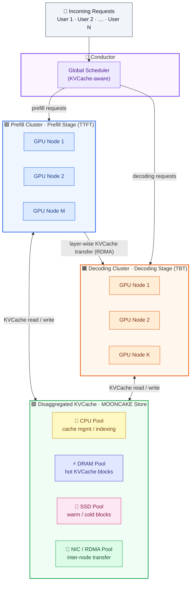
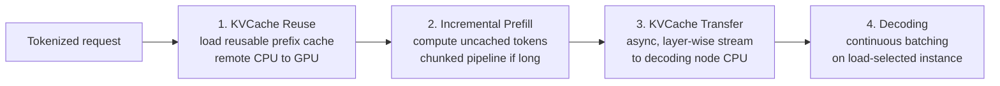

This is a technical dissection of **MOONCAKE** — Moonshot AI's KVCache-centric disaggregated architecture for serving Kimi, their LLM chatbot. The focus is the serving *system*: why prefill and decoding are pulled apart into separate clusters with separate latency objectives, how a disaggregated global KVCache reuses computation instead of repeating it, how requests are scheduled against that cache, and how the whole thing stays inside its Service Level Objectives while pushing throughput.

We are not reproducing the full benchmark suite. The capacity and latency numbers matter here only as evidence that "trading more storage for less computation" is a real win under production SLOs.

**Attribution convention.** Because this article mixes what the paper says with my own reasoning, every non-obvious technical claim is tagged:

- **[Paper]** — stated explicitly in MOONCAKE (USENIX FAST '25).
- **[Derived]** — a mathematical or logical consequence of the paper's equations, worked out here.
- **[Interpretation]** — my explanation or engineering reasoning, written for the reader; not a claim the paper makes.

---

## Reasoning / Why I Studied This Paper

I have been studying **LLM inference systems** — specifically how massive LLMs are actually served to users through chatbots and other applications while maintaining the **Service Level Objectives (SLOs)** defined by the serving system. **[Interpretation]**

That line of study led me directly to **MOONCAKE** by Moonshot AI, the serving platform for **Kimi**. **[Interpretation]**

The SLOs are what make this concrete. A request in MOONCAKE is logically divided into two stages, and each stage is measured by a different latency metric: **[Paper]**

- The **prefill** stage is primarily concerned with **Time To First Token (TTFT)**. **[Paper]**
- The **decoding** stage is concerned with **Time Between Tokens (TBT)**. **[Paper]**

In the paper's evaluation, the **TTFT threshold is 30 seconds**, and the **TBT thresholds are 100 ms, 200 ms, and 300 ms** depending on the scenario. **[Paper]** A request that satisfies **both** its respective TTFT and TBT thresholds is counted as an **effective request**, and the proportion of effective requests among all requests is the **effective request capacity** — the metric the whole system is optimized against. **[Paper]**

## I. The Problem MOONCAKE Solves and the Architecture It Introduces

**MOONCAKE is the serving platform developed by Moonshot AI for Kimi, and it uses a KVCache-centric disaggregated architecture.** **[Paper]** The rest of this section explains its serving objective, why disaggregation is needed, the disaggregated KVCache it engineers, its three resource pools, how it schedules around the KVCache, and the resource-utilization argument that ties it all together.

### MOONCAKE's Objective

Given the two SLOs above (TTFT for prefill, TBT for decoding), MOONCAKE's objective is precise: **maximize effective throughput — the number of effective requests served — while staying inside both thresholds**. **[Paper]** It is a throughput goal *subject to* latency constraints, not a latency-minimization goal, and that distinction is what the deployment numbers reflect. **[Interpretation]**

In production this shows up as **capacity, not speed**: Kimi handles **115% more requests on NVIDIA A800 clusters** and **107% more on H800 clusters** than the previous system — more requests served *within the same SLOs*, not lower latency per request. **[Paper]**


*Figure 1 (from the paper). Under the real-world conversation workload, MOONCAKE reaches near-100% effective request capacity at much tighter TBT SLOs than the vLLM baselines. The gains at the three thresholds range from **+498%** at Threshold I (100 ms) down to **+59%** at Threshold III (300 ms) — this conversation curve is exactly where the paper's headline "59%–498%" range comes from.* **[Paper]**

### Why Disaggregation Is Needed

Traditional GPU servers such as **DGX/HGX-style systems are highly integrated nodes**, where the different resources are tightly coupled together. **[Paper]** To serve LLMs well it is necessary to decouple and restructure them into several **disaggregated resource pools**, each optimized for different but collaborative goals. **[Paper]**

**Disaggregated resource pools** are distinct, separated groups of hardware resources decoupled from the traditional all-in-one server node and restructured into specialized but cooperative components — so instead of every GPU server doing every task identically, each pool is optimized for a different part of LLM serving. **[Interpretation]**

### MOONCAKE's Disaggregated KVCache Architecture

MOONCAKE engineers a **disaggregated KVCache** by pooling the **CPU, DRAM, SSD, and RDMA/NIC** resources associated with the GPU cluster. This distributed KVCache system is called **MOONCAKE Store**. **[Paper]**

Why this matters from an engineering perspective: when the GPUs are primarily occupied with computation, other resources — CPU, DRAM, SSD, and network — can be **underutilized**. **[Paper]** MOONCAKE puts those otherwise-idle resources to work, using them to provide additional KVCache capacity and high-bandwidth KVCache movement across systems, so previously computed KVCache can be reused instead of recomputed. **[Paper]**

### The Three Disaggregated Pools

MOONCAKE decouples the cluster into three main disaggregated pools: **[Paper]**

- **Prefill Pool** — a cluster of nodes optimized specifically for the **computation-intensive Prefill stage** of LLM serving. It processes the input tokens and focuses on minimizing TTFT, which ties it directly to the **TTFT SLO** objective. **[Paper]**
- **Decoding Pool** — a cluster of nodes responsible for **autoregressive token generation**. It focuses on efficient token generation and maintaining the **TBT SLO**. **[Paper]**
- **Distributed KVCache Pool / MOONCAKE Store** — a massive global cache created by pooling underutilized **CPU, DRAM, SSD, and RDMA/NIC** resources. It stores and transfers KVCache blocks across systems so that previously computed KVCache can be reused instead of repeatedly recomputing the same prefix. **[Paper]**


*The three disaggregated pools — the Prefill cluster, the Decoding cluster, and the CPU / DRAM / SSD / NIC (RDMA) resources pooled into MOONCAKE Store.*



### KVCache-centric Scheduling

Scheduling the KVCache is central to LLM serving in MOONCAKE, because the system must decide **where a request should be processed while considering both computation and cached data** — not just which node has spare compute, but where the reusable KVCache already lives. **[Paper]**


*Figure 2 (from the paper). This diagram shows how the pieces work together: the **KVCache-centric Conductor** (with a cache-aware prefill scheduler, a KVCache-balance scheduler, and a load-balance decoding scheduler) dispatches each request; the **Prefill Pool** runs the GPU/VRAM prefill instances under the goal "max Cache Reuse s.t. TTFT SLO"; the **Decoding Pool** runs the decoding instances under "max Throughput s.t. TBT SLO"; the **distributed KVCache pools** live in CPU/DRAM/SSD alongside both; and the central **KVCache Transfer Engine** moves KVCache blocks between all of them over RDMA.* **[Paper]**

### Resource Utilization and Throughput

The net effect of this split is that each resource does what it is best at: the GPUs stay focused on computation, while the pooled CPU/DRAM/SSD/network carry the **distributed KVCache storage and movement**. **[Paper]** That is what buys **higher effective throughput within the SLOs** — the payoff the rest of this article backs up with numbers. **[Interpretation]**

## II. How a Request Actually Runs: Prefill and Decoding

Each LLM inference request is logically divided into two stages: the **Prefill stage** and the **Decoding stage**. **[Paper]**

- During the **Prefill stage**, all input tokens are processed in parallel, making this stage **computationally expensive**. **[Paper]**
- The Prefill stage generates the first output token while **storing the intermediate results of the computed K and V representations**, referred to as the **KVCache**. **[Paper]**
- The **Decoding stage** then uses this KVCache to **autoregressively generate new tokens**. **[Paper]**
- A widely used optimization during the Decoding stage is **continuous batching**, which keeps the GPU busy by adding new sequences to the batch when another sequence has completed. **[Paper]**
- Running both the Prefill and Decoding stages on the **same node can be inefficient**, because the Prefill stage is **compute-bound** while the Decoding stage is **memory-bandwidth-bound**. **[Paper]**
- MOONCAKE therefore **logically and physically separates these stages into different resource pools**, orchestrated by the **Conductor**. **[Paper]**

## III. KVCache Reuse

To meet stringent SLOs, a commonly adopted solution is to **cache previously generated KVCache and reuse it when a new request contains a matching prefix**. **[Paper]**

For a current request with prompt length $n$ that shares a common prefix of length $p$ with cached KVCache, its prefill process can be optimized as: **[Paper]**

$$
q[p:n],\; k[p:n],\; v[p:n]
=
\mathrm{MLP}(\mathrm{hidden}[p:n])
$$

$$
k[1:n],\; v[1:n]
\leftarrow
\mathrm{KVCache} + \left(k[p:n],\; v[p:n]\right)
$$

$$
o[p:n]
=
\mathrm{Attn}\left(q[p:n],\; k[1:n],\; v[1:n]\right)
$$

$$
\mathrm{KVCache}
\leftarrow
\left(k[1:n],\; v[1:n]\right)
$$

At a high level, these equations mean: **[Interpretation]**

- The already cached prefix KV values are reused.
- Only the uncached portion of the prompt (positions $p$ to $n$) needs to go through the relevant computation.
- The cached prefix is combined with the newly computed K and V values.
- Attention is then performed over the complete K/V sequence.
- The resulting K/V state becomes the KVCache for the request.

## IV. Prefill Computation Cost

The computation cost of the Prefill stage, as a function of input length $n$, is: **[Paper]**

$$
\mathrm{FLOPs}(n)
=
l\left(an^2d + bnd^2\right)
$$

Here $l$ is the number of layers, $d$ is the model dimension, and $a$ and $b$ are the constant coefficients in the equation. **[Paper]**

So reusing a prefix of length $p$ saves approximately $l\cdot(a p^2 d + b p d^2)$ of computation. **[Derived]** But that reuse is not free: the cached KVCache must be transferred into the prefill GPU's HBM, at a size of $p \times l \times (2d/gqa) \times s$ (where $gqa$ is the query-to-KV head ratio and $s$ is the tensor element size). **[Paper]**

Let $G$ be the GPU's computation throughput and $B$ the KVCache loading speed (the minimum of host-to-device and NIC bandwidth). Reusing KVCache is beneficial for TTFT when: **[Paper]**

$$
\frac{B}{G} > \frac{2ds}{gqa \cdot (a p d + b d^2)}
$$

For LLaMA3-70B on 8×A800 with a prefix length of 8192, this yields a minimum required $B$ of about **6 GB/s** (rising to ~19 GB/s on 8×H800). **[Paper]** A fully utilized **100 Gbps NIC per A800 HGX node is enough** to meet the criterion — which is the whole argument for building a *global* KVCache rather than caching only in local HBM. **[Paper]** The criterion is also easier to satisfy for larger $d$ (larger models), so the strategy scales up well. **[Paper]**

## V. Engineering Motivation

The two equations above collapse into the design in one line. The FLOPs equation says recomputing a shared prefix is pure wasted work that grows with prefix length, and the $B/G$ inequality says that — for a large model on a 100 Gbps-class network — **loading** that prefix from cache is cheaper than **recomputing** it. **[Derived]** So MOONCAKE spends storage and bandwidth to skip prefill compute (KVCache reuse), and because the compute-bound prefill stage and the memory-bandwidth-bound decoding stage would otherwise contend on a shared node, it runs them in **separate pools** — with continuous batching keeping the decoding GPUs saturated. **[Interpretation]**

That single trade — **more storage for less computation** — is the thesis the entire system is engineered to exploit. **[Interpretation]**

## VI. The Request Workflow (Four Steps)

Once a request is tokenized, the **Conductor** (the global scheduler) selects a pair of prefill and decoding instances and runs four steps: **[Paper]**



1. **KVCache Reuse.** The selected prefill node loads the reusable prefix KVCache from remote CPU memory into GPU memory to bootstrap the request; skipped if no prefix cache exists. This selection balances three things — reusing as much KVCache as possible, balancing prefill-node load, and guaranteeing the TTFT SLO — which is exactly what makes the scheduling *KVCache-centric*. **[Paper]**
2. **Incremental Prefill.** The prefill node computes the uncached tokens and stores the newly generated incremental KVCache back to CPU memory. If the number of uncached tokens exceeds a threshold (chosen so each chunk is comfortably larger than ~1000 tokens), the prefill is split into chunks and executed in a **pipelined** manner across nodes. **[Paper]**
3. **KVCache Transfer.** MOONCAKE Store streams the KVCache asynchronously — overlapped with the incremental-prefill step, **layer by layer** — to the destination decoding node's CPU memory, hiding the transfer behind compute. **[Paper]**
4. **Decoding.** Once the KVCache is in the decoding node's CPU memory, the request joins the continuous batching process. The decoding instance is pre-selected by Conductor based on its current load, so it does not violate the TBT SLO. **[Paper]**

## VII. MOONCAKE Store: A Distributed Global KVCache

Central to MOONCAKE is **MOONCAKE Store**, a distributed global cache of KVCache pooled from **CPU, DRAM, SSD and RDMA** resources across the GPU cluster. **[Paper]** The point is that restricting caching to local HBM/DRAM caps you at only up to ~50% of the theoretical cache hit rate — a global cache is what unlocks the rest. **[Paper]**

**Management.** KVCache is stored as **paged blocks**. The block size (tokens per block) is set by the model and the optimal transfer size, typically **16 to 512 tokens** (256 in the evaluation). Each block is keyed by a hash of **both its own contents and its prefix**, which enables deduplication; the same hash key may have replicas on different nodes to relieve hot-cache contention. Eviction is **LRU**, unless a block is being actively used. **[Paper]**

**Interface.** MOONCAKE Store exposes object-based APIs — `put`, `get`, and `change_replica` (Conductor uses the last to tune replica counts per block). Transfers work for both DRAM and GPU VRAM (via GPU Direct RDMA) on pre-registered memory, and completion is monitored asynchronously through `getTransferStatus`. **[Paper]**

**Transfer engine.** A high-performance, zero-copy transfer system built to exploit **multiple RDMA NICs per machine**. It uses **topology-aware path selection** (a per-server topology matrix classifies NICs into preferred/secondary lists so transfers stay on the local NUMA/PCIe path where possible), splits each request into **16 KB slices** across all NICs, and manages connections with **endpoint pooling** evicted by the **SIEVE** algorithm. On failure it re-routes to an alternative reachable NIC. The network is RoCEv2, with 100/200 Gbps NICs on A800 and 200/400 Gbps on H800, up to 8×400 Gbps aggregate. **[Paper]**

## VIII. Chunked Pipeline Parallelism for Long Context

Context lengths have grown from 8k to 128k and beyond, and for such requests the input can be 10–100× larger than the output — so the TTFT of long prefill dominates and needs more than one node. **[Paper]** The two conventional options both have costs: **Tensor Parallelism (TP)** across nodes needs two expensive RDMA all-reduces per layer (lowering MFU), and **Sequence Parallelism (SP)** requires frequent cross-node communication that competes with KVCache transfer for network. **[Paper]**

MOONCAKE instead uses **Chunked Pipeline Parallelism (CPP)**: group every $X$ nodes in the prefill cluster into a pipelined node group, partition a request's input into chunks, and process different chunks on different nodes simultaneously. **[Paper]** CPP's advantages: **[Paper]**

- Cross-node communication happens only at **pipeline stage boundaries**, which overlaps easily with computation → better MFU, less contention with KVCache transfer.
- It fits **both short and long contexts** with no significant short-context overhead, avoiding frequent dynamic node repartitioning.

The paper notes this pipeline-acceleration idea is established in *training* systems, but MOONCAKE is, to their knowledge, the **first to apply it in the inference stage**. **[Paper]**

## IX. Scheduling: How It Happens

Scheduling in MOONCAKE has two coupled parts — **prefill global scheduling** (where to run each request) and **cache load balancing** (how to distribute the reusable cache so scheduling stays effective). Both are driven by the Conductor. **[Paper]**

### Prefill Global Scheduling

Previous research on LLM serving typically uses a **load-balancing** strategy that evaluates the load on each instance based on the **number of assigned requests**. In MOONCAKE, the selection of prefill instances considers additional factors — not just load, but also the **prefix cache hit length** and the **distribution of reusable KVCache blocks**. **[Paper]** There is a preference to route requests to prefill instances with **longer prefix cache lengths** to reduce computation cost, but it may still be beneficial to schedule them to other nodes to ensure overall system balance and meet TTFT SLOs. **[Paper]** To address this, MOONCAKE uses a **cache-aware global scheduling algorithm** that accounts for both the prefill time (due to the prefix cache) and the local queuing time. **[Paper]**

For every new request, the mechanism works like this: **[Paper]**

- The request's block keys are compared one by one against each prefill instance's cache keys to identify the **prefix match length** ($prefix\_len$). **[Paper]**
- Using that match, Conductor estimates the corresponding **prefill execution time** based on the request length and $prefix\_len$ (which varies by instance), via a **polynomial regression model fitted on offline data**. Thanks to the regular computation pattern of Transformers, the prediction error bound is small as long as enough offline data is available. **[Paper]**
- It then adds the estimated **waiting (queuing) time** — computed by aggregating the prefill times of all queued requests — to obtain the **TTFT** on that instance. **[Paper]**
- Conductor assigns the request to the instance with the **shortest TTFT** and updates that instance's cache and queue times accordingly. **[Paper]**
- If the **SLO is not achievable**, Conductor directly returns the **HTTP 429 Too Many Requests** response status code to the upper layers. **[Paper]**

The TTFT estimates across instances are computed in parallel, so the scheduling overhead is negligible compared to inference time. **[Paper]** The harder quantity to predict is the **transfer time**, because it depends not only on the size of the transferred data but also on the current network status — especially whether the sending node is congested — which is part of why hot KVCache blocks need to be replicated (see below). **[Paper]**

The full procedure is **Algorithm 1 (KVCache-centric Scheduling)**: **[Paper]**

```text
Input:  prefill instance pool P, decoding instance pool D, request R,
        cache block size B.
Output: the prefill and decoding instances (p, d) to process R.

 1: block_keys ← PrefixHash(R.prompt_tokens, B)
 2: TTFT, p ← inf, ∅
 3: best_len, best_instance ← FindBestPrefixMatch(P, block_keys)
 4: for instance ∈ P do
 5:     if best_len / instance.prefix_len > kvcache_balancing_threshold then
 6:         prefix_len   ← best_len
 7:         transfer_len ← best_len − instance.prefix_len
 8:         T_transfer   ← EstimateKVCacheTransferTime(transfer_len)
 9:     else
10:         prefix_len   ← instance.prefix_len
11:         T_transfer   ← 0
12:     T_queue   ← EstimatePrefillQueueTime(instance)
13:     T_prefill ← EstimatePrefillExecutionTime(len(R.prompt_tokens), prefix_len)
14:     if TTFT > T_transfer + T_queue + T_prefill then
15:         TTFT ← T_transfer + T_queue + T_prefill
16:         p    ← instance
17: d, TBT ← SelectDecodingInstance(D)
18: if TTFT > TTFT_SLO or TBT > TBT_SLO then
19:     reject R; return
20: if best_len / p.prefix_len > kvcache_balancing_threshold then
21:     TransferKVCache(best_instance, p)
22: return (p, d)
```

### Cache Load Balancing

Each prefill instance has its **own set of local prefix caches**, and their usage frequency varies significantly — system prompts are accessed by almost every request, whereas caches storing a local long document may be used by only one user. **[Paper]** So from the perspective of the distributed cache system, load balancing matters: it involves strategizing **how to back up caches** so that global prefill scheduling can achieve both **high cache hits and low load**. **[Paper]**

A straw-man solution would be to collect the global usage of each block, forecast future usage with a prediction model, and schedule accordingly. But unlike prefill-time estimation, workloads are **highly dynamic** — especially for a fast-growing MaaS provider — so future usage cannot be accurately predicted. MOONCAKE therefore uses a **heuristic-based automated hotspot migration** scheme instead. **[Paper]**

As noted, a request may not be routed to the instance with the longest prefix cache when that instance is under high load. In that case: **[Paper]**

- Conductor **forwards the cache's location and the request to an alternative instance** if the estimated **additional prefill time is shorter than the transfer time**; that instance proactively retrieves the KVCache from the holder and stores it locally. **[Paper]**
- MOONCAKE **prefers to (re)compute** the input tokens if the best remote prefix match length is **no larger than the current local reusable prefix length multiplied by a threshold**. **[Paper]**

Both strategies not only reduce the prefill time for requests but also facilitate the **automatic replication of hotspot caches**, allowing them to be distributed more broadly across instances. **[Paper]**

### Does the Scheduling Work? (Figure 5)

To validate the strategy, the paper builds a MOONCAKE cluster of **16 × (8×A800) nodes** and replays the conversation trace, comparing four scheduling schemes by average TTFT: **[Paper]**

| Scheduling scheme | Average TTFT |
|---|---|
| **Global Cache Aware** (with cache load balancing) | **3.07 s** |
| Local Cache Aware | 3.58 s |
| Load balancing | 5.27 s |
| Random | 19.65 s |

The KVCache-centric algorithms clearly outperform random and load-balancing scheduling, and by incorporating cache load balancing, the **global cache-aware algorithm reduces the average TTFT by an additional 14%** compared to the local cache-aware algorithm. **[Paper]**

## X. Does It Actually Work? The Evaluation

When I read the results, I kept three questions in mind: **does the whole design actually raise how many requests you can serve inside the SLOs**, **where do the savings physically come from** (compute vs. cache vs. network), and **how do you have to configure the cluster** to get those savings. **[Interpretation]** Everything below is measured against that, not against raw latency in isolation. **[Paper]**

### Evaluation Setup

The experiments run a dummy **LLaMA3-70B** on nodes of **8×A800-SXM4-80GB**, each node wired with **four 200 Gbps RDMA NICs**, and a KVCache block size of **256 tokens**. Each node is dedicated to one role — it is either a **Prefill** node or a **Decoding** node, never both — which is the disaggregation idea made physical. **[Paper]**

The baselines are **vLLM** and two of its stronger variants, **vLLM prefix caching** and **vLLM chunked prefill**, so MOONCAKE is not being compared to a strawman but to the caching and scheduling tricks people already use. **[Paper]** The metrics are the two SLO latencies — **TTFT** and **TBT** — and the headline number is **effective request capacity**: the share of requests that stay under **TTFT ≤ 30 s** *and* under the **TBT threshold** (100, 200, or 300 ms depending on scenario) at the same time. **[Paper]**

### Workloads

Three workloads are used, and the point of having three is that they stress the cache in very different ways. **[Interpretation]**

- **Conversation** — long multi-turn dialogues, averaging ~12k tokens and reaching up to 128k, with roughly **40% of each request being a reusable prefix** from the earlier turns. This is the workload where cache reuse should help the most. **[Paper]**
- **Tool & Agent** — repetitive, long **system prompts** shared across many requests, so the **prefix-cache hit rate is even higher**, but the actual input/output that is unique per request is shorter. **[Paper]**
- **Synthetic** — the **longest average input** with a **high prefix ratio**, but the cache hits are **dispersed** (spread thin rather than concentrated on a few hot prefixes), which makes them harder to serve out of a small local cache. The exact composition of the three is summarized in the paper's **Table 2**. **[Paper]**

### Effective Request Capacity — Figures 1, 6 and 7

This is the core result. Read against **Figure 1** (shown earlier) and the two workloads below, MOONCAKE reaches near-100% effective request capacity at **tighter TBT SLOs** than every vLLM variant — i.e. it keeps more requests inside the SLO envelope for the same latency budget. **[Paper]**


*Figure 6 (from the paper). Tool & agent workload: at the three TBT thresholds MOONCAKE serves **+64% / +42% / +22%** more effective requests than the strongest baseline here, vLLM prefix caching.* **[Paper]**


*Figure 7 (from the paper). Synthetic workload: MOONCAKE delivers **+62% / +40% / +28%** more effective requests at the three thresholds, and about **+40%** over vLLM at the 200 ms threshold.* **[Paper]**

The way I read these curves: MOONCAKE's advantage is largest exactly where inputs are long and prefixes are reusable. **[Interpretation]** On the conversation workload the gain reaches up to **498%** effective capacity; on tool & agent it is about **+42%** over vLLM prefix caching at the 200 ms threshold; on synthetic it is about **+40%** over vLLM at 200 ms. **[Paper]** The reason is structural — the longer the context and the more of it is a shared prefix, the more prefill compute MOONCAKE gets to skip by pulling that prefix out of the global cache instead of recomputing it. **[Interpretation]**

### Prefill GPU Computation — Figure 8

If the claim is "trade storage for computation," this figure is where you check that the computation actually went down. **[Interpretation]**


*Figure 8 (from the paper). Prefill GPU time across the three workloads — MOONCAKE (blue) is consistently the lowest, with the multipliers showing how much more GPU time the baselines burn.* **[Paper]**

MOONCAKE cuts prefill GPU computation by roughly **36%** on conversation, **53%** on tool & agent, and **64%** on synthetic relative to vanilla vLLM. **[Paper]** vLLM prefix caching also reuses prefixes, but only what fits in **local HBM** — so it tracks MOONCAKE closely when the hot prefixes are few and concentrated (**1.43×** MOONCAKE's prefill time on conversation, **1.40×** on tool & agent), yet collapses to **2.59×** on synthetic, where the cache hits are dispersed and overflow local capacity, leaving it barely better than plain vLLM. **[Paper]** That contrast is the whole point of the global cache: the harder the reuse pattern, the more a cluster-wide cache beats a per-node one. **[Interpretation]** vLLM chunked prefill is the worst on every workload (**1.90× / 2.68× / 3.33×** MOONCAKE's time) because it deliberately trades prefill efficiency for lower TBT rather than reusing cache at all. **[Paper]**

### MOONCAKE Store — Figures 9, 10 and 11

These three figures are the argument for why the cache has to be **global**, not per-node. **[Interpretation]**


*Figure 9 (from the paper). Cache hit rate vs. cache capacity. A single node's DRAM (~3M tokens for LLaMA3-70B) sits at less than half the achievable hit rate; approaching the maximum needs on the order of ~50M tokens, i.e. the pooled DRAM of ≥20 nodes.* **[Paper]**

The concrete numbers behind Figure 9: LLaMA3-70B's KVCache is about **320 KB per token**, so **1 TB of DRAM holds roughly 3 million tokens** — that is one node's worth, and it lands at **under 50% of the theoretical maximum hit rate**. **[Paper]** Getting close to that maximum needs around **50 million tokens** of cache, which is only reachable by pooling the DRAM of **20 or more nodes**. **[Paper]** That is the whole justification for MOONCAKE Store: the hit rate you want is physically **out of reach for any single node**, and only becomes available when the cache is globally accessible. **[Interpretation]**


*Figure 10 (from the paper). Local vs. global cache. Making the cache global raises the hit rate by up to **2.36×** (right cluster) and cuts prefill GPU time to as low as **0.52×** of the local-cache case — driven by proactive inter-node migration of reusable blocks.* **[Paper]**

Figure 10 makes the local-vs-global comparison directly: the global cache delivers up to **136% higher hit rate** and up to **48% less prefill compute time** than restricting reuse to local caches, because Conductor **proactively migrates** reusable blocks between nodes instead of leaving each node stuck with only what it computed itself. **[Paper]**


*Figure 11 (from the paper). Dynamic replication of the hottest blocks over time. On conversation and tool & agent the hottest keys get replicated across almost every instance; on synthetic (dispersed hits) far fewer replicas form.* **[Paper]**

Figure 11 shows the **dynamic replication** of hot keys in action. On the conversation and tool & agent workloads the hottest blocks end up replicated across **almost every instance**, because they are shared by nearly all requests; on the synthetic workload, where hits are dispersed, **fewer replicas** form since no single block is hot enough to justify copying everywhere. **[Paper]** This is the hotspot-migration heuristic doing exactly what it should — spending replication budget only where a block is actually contended. **[Interpretation]**

### KVCache Transfer Performance — Figure 12

The global cache only pays off if moving a block is cheaper than recomputing it, so transfer bandwidth is load-bearing. **[Interpretation]**


*Figure 12 (from the paper). Transfer latency vs. cache size. MOONCAKE's multi-NIC RDMA transfer engine (blue) stays far below TCP (orange) and Gloo (green) at both NIC configurations.* **[Paper]**

For scale: a **128k-token** LLaMA3-70B KVCache is about **40 GB**. **[Paper]** MOONCAKE's transfer engine reaches **87 GB/s** on **4×200 Gbps** NICs and **190 GB/s** on **8×400 Gbps** NICs, which is roughly **2.4× and 4.6× faster than TCP** respectively (and much faster than Gloo). **[Paper]** The gain comes from striping each transfer across **multiple RDMA NICs** at once rather than riding a single connection — which is what makes 40 GB of KVCache movable inside the TTFT budget. **[Interpretation]**

### Network Bandwidth Requirement — Figure 13


*Figure 13 (from the paper). Average TTFT (left) and transfer time (right) vs. bandwidth. Above ~100 Gbps TTFT stays low (under ~2 s on synthetic and below the recomputation baseline); below ~100 Gbps it climbs sharply as transfers start to congest.* **[Paper]**

Sweeping bandwidth from **24 to 400 Gbps**, the pattern is a knee: **above ~100 Gbps** TTFT stays low (under ~2 s on the synthetic workload, comfortably below the cost of just recomputing), but **below ~100 Gbps** TTFT rises steeply and transfer times start to diverge as the network congests. **[Paper]** The practical takeaway the paper draws is a **minimum of ~100 Gbps** per node — below that, moving cache stops being cheaper than recomputing it, and the whole storage-for-compute trade breaks down. **[Paper]**

### End-to-End Latency Breakdown — Figure 14


*Figure 14 (from the paper). Latency decomposed into scheduling/queuing, prefill, KVCache transfer, DRAM→HBM load, and decoding — at 0% prefix cache ratio (left) vs. 95% (right), across 8k to 128k prompt lengths.* **[Paper]**

This breakdown splits each request into five parts — **scheduling/queuing, layer-wise prefill, KVCache transfer, DRAM→HBM load, and decoding**. **[Paper]** At **0% prefix cache** the bar is dominated by **prefill compute**, which grows steeply with prompt length. At **95% prefix cache** the story flips: at a **128k** prompt, prefix caching removes about **92%** of the prefill work, and overall MOONCAKE cuts **TTFT by about 86%** at 128k. **[Paper]** Crucially, the **transfer and load-cache slices stay thin** even as inputs grow, because MOONCAKE overlaps them **asynchronously** with computation — the movement is hidden behind the prefill, not stacked on top of it. **[Paper]**

### Prefill / Decoding Ratio — Figure 15


*Figure 15 (from the paper). Varying the Prefill:Decoding node split. Effective request capacity peaks near a balanced (~1:1) ratio; more prefill nodes push TTFT down but TBT up, and vice versa.* **[Paper]**

Because the two pools are separate, you have to choose how many nodes go to each. Adding **more prefill nodes lowers TTFT but raises TBT** (fewer decoding nodes to keep up), and shifting the other way does the reverse. **[Paper]** Effective request capacity peaks at a roughly **1:1** P/D split. **[Paper]** The operational advice the paper gives is pragmatic: **fix the P/D ratio, monitor it, and only re-split when the workload changes significantly**, rather than trying to retune it continuously. **[Paper]**

### What the Results Add Up To

Reading these experiments as a whole, no single trick carries the result — it is the **combination**: **[Interpretation]**

- **P/D disaggregation** so each stage is tuned to its own SLO,
- a **global KVCache** (MOONCAKE Store) that reaches hit rates no single node could,
- **KVCache-aware scheduling** that routes on cache locality and queue time,
- **cache replication and hotspot migration** that keep hot prefixes reachable,
- a **high-bandwidth multi-NIC transfer engine**, and
- **asynchronous overlap** that hides transfer behind compute.

Put together, the system does exactly what its subtitle promises — it **trades more storage and network bandwidth for less repeated GPU compute** — and the evaluation shows that trade paying off as more effective requests within the SLOs. **[Interpretation]**

## XI. Engineering Trade-offs & Limitations

- **Storage traded for computation.** The whole premise is spending DRAM/SSD/network to avoid recompute — it only pays off when cache hit rates and bandwidth clear the $B/G$ bar; below ~100 Gbps, performance is compromised. **[Paper]**
- **Prediction-dependent scheduling.** Conductor relies on a regression model of prefill time and heuristic hotspot migration; the paper notes the load-balancing threshold is currently tuned manually. **[Paper]**
- **Rejection instead of elastic scaling.** With GPUs in short supply, MOONCAKE protects SLOs by rejecting overflow requests (HTTP 429) rather than scaling out. **[Paper]**
- **Disaggregation needs the network.** P/D separation only works because a highly optimized RDMA transfer engine hides the KVCache movement; the authors argue this is what makes disaggregation preferable to chunked prefill under stringent SLOs. **[Paper]**

## XII. Where MOONCAKE Sits (Related Work)

To place MOONCAKE, it helps to see which line of serving research it extends and which it deliberately departs from. **[Interpretation]**

- **Inference engines.** Systems like **FasterTransformer**, **TensorRT-LLM**, and **DeepSpeed Inference** optimize the model execution itself — kernels, fusion, parallelism — but treat serving as running one model fast, not as managing a cluster-wide cache. **[Paper]**
- **Request scheduling.** **Orca** introduced **iteration-level (continuous) scheduling** so new sequences can join a running batch instead of waiting for it to drain. **[Paper]**
- **Memory management.** **vLLM's PagedAttention** manages KVCache in fixed pages to cut fragmentation, and follow-ups like **FlexGen**, **Sarathi-Serve**, and **FastServe** attack memory pressure and scheduling in their own ways (offloading, chunked prefill, preemption). **[Paper]**
- **Prefill/Decoding disaggregation.** A separate line of systems also **splits prefill from decoding** to give each stage its own resources — MOONCAKE shares this premise but builds the whole architecture around the **KVCache** as the organizing object. **[Paper]**
- **Prefix / cache reuse.** **Prompt Cache** and **SGLang / RadixAttention** reuse shared prefixes via structured prompts and a radix tree; **CachedAttention** adds a **hierarchical** KVCache across memory tiers. **[Paper]**

What distinguishes MOONCAKE from all of these is that it is **KVCache-centric at cluster scale**: it does not just reuse a prefix inside one node's memory, it pools CPU/DRAM/SSD/RDMA across the whole cluster into a **global** cache and makes **scheduling, replication, and transfer** all revolve around where that cache lives. **[Paper]** The paper also notes its approach is **orthogonal** to methods that shrink or restructure the KVCache itself — **KVCache compression** and **KVCache-friendly attention** — meaning those could be layered on top of MOONCAKE rather than competing with it. **[Paper]**

## XIII. My Engineering Takeaway

MOONCAKE as a base layer above the GPU is excellent: it optimizes the serving infrastructure around the GPU by separating Prefill and Decoding, using otherwise underutilized resources for KVCache, and moving the cache efficiently across nodes. If we then add higher-level inference optimizations such as SGLang and other serving-level techniques on top of this foundation, we can potentially get much better inference performance without simply spending more compute.
