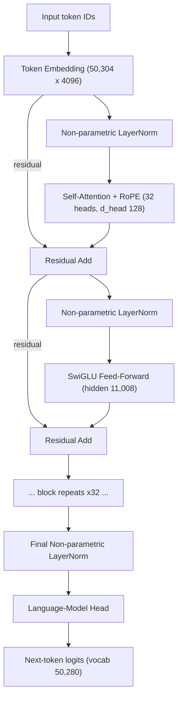

This is an engineering dissection of **OLMo (Open Language Model)** — the 2024 Allen Institute for AI release described in _"OLMo: Accelerating the Science of Language Models"_ (arXiv:2402.00838). The focus is not "here is another 7B model." The focus is what a **genuinely research-oriented open model** looks like as an end-to-end system: the data, the pipeline that turns raw sources into a corpus, the architecture, the training recipe, the evaluation, and the checkpoints — all released so the model can be _studied_, not just _used_.

Everything here is about the **original 2024 OLMo**, not OLMo 2 or later releases. Where a number comes from the paper it is tagged; where it is my reading of the paper it is tagged as interpretation.

**Attribution convention.** Because this article mixes what the paper states with engineering explanation and my own framing, every non-obvious claim is tagged:

- **[Paper]** — stated explicitly in OLMo (arXiv:2402.00838).
- **[Derived]** — a direct arithmetic/logical consequence of the paper's stated values.
- **[Interpretation]** — my explanation or engineering reasoning, written for the reader; not a claim the paper makes.

---

## Why OLMo Matters: Open Weights vs. Open Research

Most powerful language models are hard to study scientifically. The final weights (sometimes) ship, but the things a researcher actually needs to reason about the model — what data went in, how that data was processed, the exact training recipe, the evaluation harness, the intermediate checkpoints — are frequently not disclosed. The paper makes this contrast concretely: Mixtral shipped weights and a brief report, LLaMA shipped adaptation instructions, MPT shipped the dataset _distribution_ but not the data itself. **[Paper]**

That gap is the problem OLMo targets. The distinction that matters is:

> **Open weights** — you can run the model and fine-tune it.
> **Open research system** — you can reconstruct _how the model came to be_.

OLMo aims at the second. According to the paper, the release includes the whole framework "from data to training to evaluation tools": **model weights, the full training data (Dolma), the training and inference code, the evaluation framework, multiple intermediate checkpoints across different hardware types, and the training logs** — all under the Apache 2.0 license. **[Paper]**

The important restraint here: the value of this is not "everything about language models is now solved and open." The value is narrower and more useful — the specific artifacts required to _study_ the relationship between data, architecture, optimization, and behavior are on the table. **[Interpretation]**

## The Complete OLMo Pipeline

Before drilling into any single stage, it helps to see the whole path from raw bytes to a released artifact. The reader should be able to trace the entire system, not just the final checkpoint:

```
Raw public sources  (Common Crawl, GitHub, Reddit, Semantic Scholar,
        │            Project Gutenberg, Wikipedia)
        ▼
Language filtering
        ▼
Quality filtering
        ▼
Content filtering
        ▼
Deduplication
        ▼
Multi-source mixing
        ▼
Tokenization  (modified GPT-NeoX-20B BPE)
        │
        ▼
   ┌─────────────┐
   │    Dolma     │   ~2.67T-token public pretraining corpus
   └─────────────┘
        │
        ▼
Training batches  (~4M tokens/batch, sequence length 2048)
        ▼
OLMo decoder-only Transformer  (7B: 32 layers, d_model 4096)
        ▼
Pretraining  (ZeRO / PyTorch FSDP, mixed precision, AdamW)
        ▼
Intermediate checkpoints  (released, across hardware types)
        ▼
Evaluation  (online in-loop + offline: Catwalk, Paloma)
        ▼
Released model + artifacts  (weights, code, data, logs, eval — Apache 2.0)
```

The six stages inside the data box — language filtering → quality filtering → content filtering → deduplication → multi-source mixing → tokenization — are exactly the Dolma pipeline named in the paper. **[Paper]** Everything downstream of the corpus is the OLMo training and evaluation framework.

## Dolma: The Pretraining Corpus

Dolma is OLMo's pretraining dataset: a diverse, multi-source corpus of trillions of tokens across billions of documents, built from sources that are both (1) commonly used in large-scale pretraining and (2) accessible to the general public. **[Paper]**

The composition the paper reports (Table 2; token counts are computed with the GPT-NeoX tokenizer):

| Source | Type | UTF-8 bytes (GB) | Docs (millions) | Tokens (billions) |
|---|---|---|---|---|
| Common Crawl | web pages | 9,812 | 3,734 | 2,180 |
| GitHub | code | 1,043 | 210 | 342 |
| Reddit | social media | 339 | 377 | 80 |
| Semantic Scholar | papers | 268 | 38.8 | 57 |
| Project Gutenberg | books | 20.4 | 0.056 | 5.2 |
| Wikipedia | encyclopedic | 16.2 | 6.2 | 3.7 |
| **Total** | | **11,519** | **4,367** | **2,668** |

So Dolma as reported here is roughly **2.67 trillion tokens** across ~4.4 billion documents. **[Paper]** Web data (Common Crawl) dominates the token budget; code, social, scientific, book, and encyclopedic sources fill in the rest.

The engineering point is _not_ the headline token count. The point is that this corpus is **openly released along with the code that produces it and the tools used to analyze it** — the paper open-sources the WIMBD tooling for dataset analysis specifically so others can inspect what is actually in the data. **[Paper]** A token count you cannot audit tells you almost nothing; a corpus you can regenerate and interrogate is a research instrument. **[Interpretation]**

## The Dolma Data Pipeline

Dolma is not "raw internet." Between the source dumps and the corpus that OLMo trains on sits a defined pipeline of six stages. **[Paper]**

```
Raw multi-source data
   │
   ├─ 1. Language filtering    keep documents in the target language(s)
   │
   ├─ 2. Quality filtering     remove low-quality / boilerplate text
   │
   ├─ 3. Content filtering     remove undesirable content
   │
   ├─ 4. Deduplication         remove repeated / near-duplicate documents
   │
   ├─ 5. Multi-source mixing   combine the cleaned sources into one corpus
   │
   └─ 6. Tokenization          encode with the BPE tokenizer
   │
   ▼
Dolma (final training corpus)
```

The distinction the reader should internalize:

> **training data ≠ raw internet data.**

There is a real engineering pipeline between the two, and each stage is a design choice with consequences for the trained model. **[Interpretation]** The paper names these six stages as the Dolma pipeline; I am not adding filtering algorithms beyond what it describes — the value of the open release is precisely that the exact implementation of each stage is inspectable rather than something I have to guess at. **[Paper]**

## The OLMo Architecture

OLMo is a **decoder-only Transformer** — the same backbone family as GPT and LLaMA. **[Paper]** Rather than re-teach the Transformer, the useful thing is to state OLMo's _specific deviations from the vanilla architecture_ and, where the paper gives a reason, why they were made.

The paper lists its main changes over the vanilla Transformer as follows. **[Paper]**

1. **No bias terms.** Following LLaMA and PaLM, OLMo excludes all bias terms from the architecture — explicitly to **improve training stability**. **[Paper]**

2. **Non-parametric LayerNorm.** OLMo uses the non-parametric formulation of layer norm — there is no adaptive affine transformation (no learned gain or bias) inside the norm. The paper reports this was also the **fastest** option compared to the alternatives it considered: parametric layer norm and RMSNorm. **[Paper]** So this is a choice made for both simplicity and throughput. **[Interpretation]**

3. **SwiGLU activation.** Like LLaMA and PaLM, OLMo uses the SwiGLU activation function instead of ReLU. Following LLaMA, the activation hidden size is set to approximately $\tfrac{8}{3}\,d$, then rounded up to the nearest multiple of 128 (**11,008** for the 7B model) **to improve throughput**. Because SwiGLU is a _gated_ activation, its output is half the size of its input, so the input dimensionality to the SwiGLU projection is $2 \times 11{,}008 = 22{,}016$ for the 7B model. **[Paper]**

4. **Rotary positional embeddings (RoPE).** OLMo replaces absolute positional embeddings with RoPE, again following LLaMA and PaLM. **[Paper]** This encodes position through rotation of the query/key vectors rather than an additive position signal. **[Interpretation]**

5. **BPE-based vocabulary.** OLMo uses a modified version of the BPE tokenizer from **GPT-NeoX-20B**, with additional tokens for masking personally identifiable information (PII). The final vocabulary size is **50,280**; the embedding matrix is padded up to **50,304** (a multiple of 128) to maximize training throughput. **[Paper]**

Notice the recurring theme in the reasons the paper actually gives: **stability** (no biases) and **throughput** (non-parametric norm, SwiGLU hidden size rounded to a multiple of 128, vocab padded to a multiple of 128). These are engineering choices tuned for stable, fast large-scale training — not architectural novelties for their own sake. **[Interpretation]**

## Model Configuration

OLMo was released at two sizes in this paper. The exact values from Table 1: **[Paper]**

| | Layers ($L$) | $d_{model}$ ($D$) | Heads ($H$) | Training tokens | Peak LR | Warmup | Weight tying | Batch size |
|---|---|---|---|---|---|---|---|---|
| **OLMo-1B** | 16 | 2048 | 16 | 2.0T | 4.0e-4 | 2000 steps | yes | ~4M |
| **OLMo-7B** | 32 | 4096 | 32 | 2.46T | 3.0e-4 | 5000 steps | no | ~4M |

In every run the optimizer is **AdamW** with betas $(0.9,\, 0.95)$ and epsilon $1.0\text{e-}5$. **[Paper]**

_(Note: the arXiv HTML rendering shows the 7B hidden dimension as "4086"; that is an OCR artifact. The correct value is 4096, consistent with the per-head arithmetic below and with SwiGLU's 11,008 hidden size being ≈ $\tfrac{8}{3}\times 4096$.)_ **[Interpretation]**

The **7B model is the primary object of study** for the rest of this section. From its configuration, the per-head dimension follows directly:

$$
d_{head} = \frac{d_{model}}{H} = \frac{4096}{32} = 128
$$

So each of the 32 attention heads operates in a 128-dimensional subspace. **[Derived]** Other fixed values for the 7B model: sequence length **2048**, SwiGLU feed-forward hidden size **11,008**, and vocabulary **50,280** (embedding matrix **50,304**). **[Paper]**

## The Architecture, as a Diagram

The precise data flow through the model. This is OLMo specifically — pre-normalization with **non-parametric** LayerNorm, **RoPE** inside attention, a **SwiGLU** feed-forward, residual connections around each sub-layer, and **no bias terms** anywhere:



The sub-graph from the first LayerNorm through the second residual add is **one decoder block**. In the 7B model that block is stacked **32 times** before the final normalization and the language-model head. **[Paper]**

## Thirty-Two Blocks: Visualizing the Stack

A flat diagram undersells the actual model. OLMo-7B is a deep stack of **32 identical decoder blocks** — the depth _is_ the model. A layered view makes the scale explicit:

```
        tokens ──► token embedding (50,304 x 4096)
                        │
                        ▼
        ╔══════════════════════════════════════╗╲
        ║  Decoder Block 32                     ║ ╲
        ╠══════════════════════════════════════╣  ╲
        ║  Decoder Block 31                     ║   ║
        ╠══════════════════════════════════════╣   ║
        ║   ⋮   (all 32 blocks are identical)   ║   ║  32 stacked
        ╠══════════════════════════════════════╣   ║  decoder blocks
        ║  Decoder Block 2                      ║   ║
        ╠══════════════════════════════════════╣  ╱
        ║  Decoder Block 1                      ║ ╱
        ╚══════════════════════════════════════╝
                        │
                        ▼
        final non-parametric LayerNorm ──► LM head ──► logits
```

**Each of the 32 blocks contains exactly one self-attention layer and one SwiGLU feed-forward**, wrapped as:

```
Non-parametric LayerNorm → Self-Attention (+RoPE, 32 heads) → Residual Add
      → Non-parametric LayerNorm → SwiGLU FFN (11,008) → Residual Add
```

A note on honesty of representation: the site renders diagrams with Mermaid and monospaced text, not a 3D engine. Rather than fake a "3D" picture that distorts the architecture, the stack above is a plain layered depiction — it shows the **real** number of blocks (32) and what each contains, which is the information that actually matters. **[Interpretation]** The count is the paper's; I am not inventing extra layers. **[Paper]**

## Attention Inside One Block

Only enough attention detail to understand what one OLMo block does. Inside a block, the input representation $X$ is projected into queries, keys, and values (no bias terms, per OLMo's design):

$$
Q = X W_Q, \qquad K = X W_K, \qquad V = X W_V
$$

RoPE is applied to $Q$ and $K$ so that relative position is encoded through rotation before the scores are computed. The scaled dot-product attention is then:

$$
\mathrm{Attention}(Q, K, V) = \mathrm{softmax}\!\left( \frac{Q K^\top}{\sqrt{d_k}} \right) V
$$

with $d_k = d_{head} = 128$ for the 7B model. **[Derived]** OLMo-7B runs **32 such heads in parallel** per block, each in its own 128-dimensional subspace, and concatenates their outputs back to $d_{model} = 4096$. **[Paper]**

The scaling factor $\tfrac{1}{\sqrt{d_k}}$ keeps the dot products from growing with dimension and pushing the softmax into saturation. **[Interpretation]** That is the whole mechanism — the rest of the model is this block repeated:

> one attention layer → one decoder block → repeated **32 times** → final LayerNorm → LM head → next-token prediction.

The interesting scale claim is not any single equation; it is that this exact block, with 32 heads of dimension 128, is stacked 32 deep to make the 7B model. **[Interpretation]**

## How OLMo Was Trained

The paper is specific about the training setup, which is the entire point of an open model. What it states explicitly: **[Paper]**

- **Optimizer:** AdamW, betas $(0.9, 0.95)$, epsilon $1.0\text{e-}5$.
- **Learning rate:** peak $3.0\text{e-}4$ for 7B (with 5000 warmup steps); $4.0\text{e-}4$ for 1B (2000 warmup steps).
- **Sequence length:** 2048 tokens.
- **Global batch size:** ~4M tokens — 2048 instances, each of sequence length 2048.
- **Training tokens:** 2.46T for OLMo-7B; 2.0T for OLMo-1B.
- **Precision:** mixed-precision training via FSDP's built-in settings and PyTorch's `amp`.
- **Distributed training:** the **ZeRO** optimizer strategy via PyTorch's **FSDP** framework, which shards model weights and their optimizer state across GPUs to reduce per-device memory.

There is a small but important detail on the learning-rate schedule. Beyond the standard warmup-then-decay schedule, the paper reports that **annealing the final checkpoint on Dolma for 1000 additional steps with the learning rate linearly decayed to 0 boosts performance** on both perplexity and end-task evaluation. **[Paper]**

On hardware, OLMo makes a deliberately reproducible point: it was trained on **two different clusters** to show the codebase runs on both NVIDIA and AMD GPUs without loss in performance. **[Paper]**

- **LUMI** — up to 256 nodes, each with 4× AMD MI250X GPUs (128 GB).
- **MosaicML / Databricks** — 27 nodes, each with 8× NVIDIA A100 GPUs (40 GB), 800 Gbps interconnect.

Despite minor batch-size differences for throughput, both runs produced **nearly identical evaluation performance**. **[Paper]** That cross-vendor result is itself a research artifact — it is evidence, not a vibe, and it is checkable because the code is released. **[Interpretation]**

I am deliberately not adding "LLMs are usually trained with…" boilerplate here. Where the paper does not specify a detail, the honest statement is that it is not specified — the purpose of this section is to show what OLMo _actually did_. **[Interpretation]**

## From Base Model to Adapted Model

OLMo also demonstrates its value as a base model for adaptation. The paper's adaptation path is: **[Paper]**

```
OLMo (base) ──► instruction tuning ──► preference tuning (DPO) ──► OLMo-Instruct
                (Open Instruct / Tulu     (distilled preference
                 instruction + feedback     data, Rafailov et al.)
                 data)
```

Concretely, the paper uses **Open Instruct** (the Tulu line of work) to train with instruction and feedback data, then aligns the model with **distilled preference data using Direct Preference Optimization (DPO)**. **[Paper]** My raw notes frame this stage as "human preference (RLHF) + DPO"; to be precise to the paper, the released OLMo adaptation uses **instruction tuning followed by DPO-based preference tuning** — DPO is the preference-optimization method here, rather than a PPO-style RLHF loop. **[Paper]**

## The Evaluation Pipeline

OLMo evaluates base models at **two stages**, and releases the tooling for both. **[Paper]**

**Online (in-loop) evaluation.** Runs _during_ training — every 1000 steps (≈ 4B tokens) — to give an early, continuous signal used to make decisions about architecture, initialization, optimizer, learning-rate schedule, and data mixtures. **[Paper]** This is how the architectural choices above were actually ablated. **[Interpretation]**

**Offline evaluation.** Runs on saved checkpoints, built on two released frameworks: **[Paper]**

- **Catwalk** — downstream task evaluation. The suite reports **zero-shot performance on 8 core tasks**, closely matching the commonsense-reasoning task set used by LLaMA.
- **Paloma** — perplexity-based evaluation across **18 data sources** (e.g. C4), drawn in stratified samples so under-represented text domains are more equally represented.

For the **adapted** models, the paper additionally reports MMLU (knowledge), AlpacaEval (instruction-following win rate), ToxiGen (toxicity), and TruthfulQA. **[Paper]**

The reason to name these frameworks is that they ship with the model. "OLMo scores X" is only scientifically useful if the harness that produced X is inspectable and rerunnable — which, here, it is. **[Interpretation]**

## OLMo vs. Closed Models

The conceptual payoff. This is a **general contrast in the research ecosystem**, grounded in the paper's own motivation — not a blanket claim about every closed model, some of which disclose more than others. **[Interpretation]**

| Artifact | Typical limited-release model | OLMo (2024) |
|---|---|---|
| Model weights | Sometimes released | Released **[Paper]** |
| Training data | Often undisclosed | Released (Dolma) **[Paper]** |
| Data pipeline / tools | Rarely released | Released (pipeline + WIMBD analysis) **[Paper]** |
| Training code | Usually closed | Released **[Paper]** |
| Training recipe / logs | Often partial | Released (logs, configs) **[Paper]** |
| Evaluation framework | Limited / internal | Released (Catwalk, Paloma) **[Paper]** |
| Intermediate checkpoints | Usually unavailable | Released (across hardware types) **[Paper]** |
| License | Varies / restrictive | Apache 2.0 **[Paper]** |

The key point, stated plainly: **OLMo is not interesting merely because its weights are available.** It is interesting because the artifacts needed to study _how the model was built_ — the data, the pipeline, the code, the checkpoints, the evaluation — are released together. **[Interpretation]**

## The Engineering Takeaway

Strip it to the core mental model:

- The valuable thing OLMo ships is **not just the final 7B checkpoint.** It is the **entire reproducible pipeline**: data → preprocessing → tokenizer → architecture → training → checkpoints → evaluation → released artifacts. **[Interpretation]**
- The architecture itself is deliberately conservative — a decoder-only Transformer with **no biases, non-parametric LayerNorm, SwiGLU, and RoPE**, chosen for **stability and throughput**, not novelty. **[Paper]**
- The data story is where much of the openness lives: **Dolma**, a ~2.67T-token public corpus, released _with_ the six-stage pipeline and analysis tools that produced it. **[Paper]**
- The training story is checkable end-to-end: **ZeRO/FSDP, mixed precision, AdamW**, run on both AMD and NVIDIA clusters to near-identical results, with the schedule, logs, and intermediate checkpoints released. **[Paper]**

Read this way, OLMo's contribution is methodological. It lets researchers study the relationship between **data, architecture, optimization, and model behavior** by opening every stage of the pipeline — turning the trained model from a black box into an object of study. **[Interpretation]**
