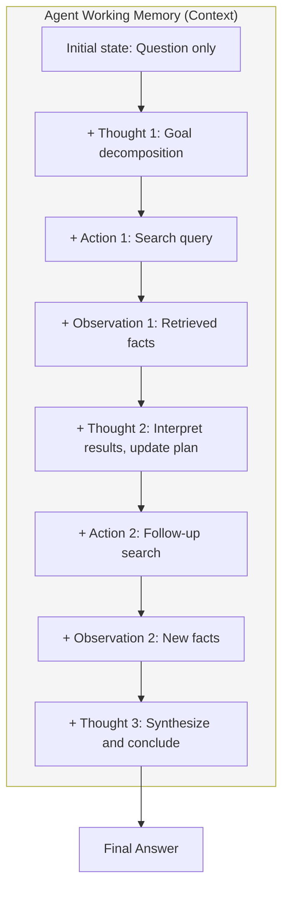
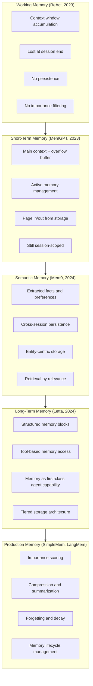
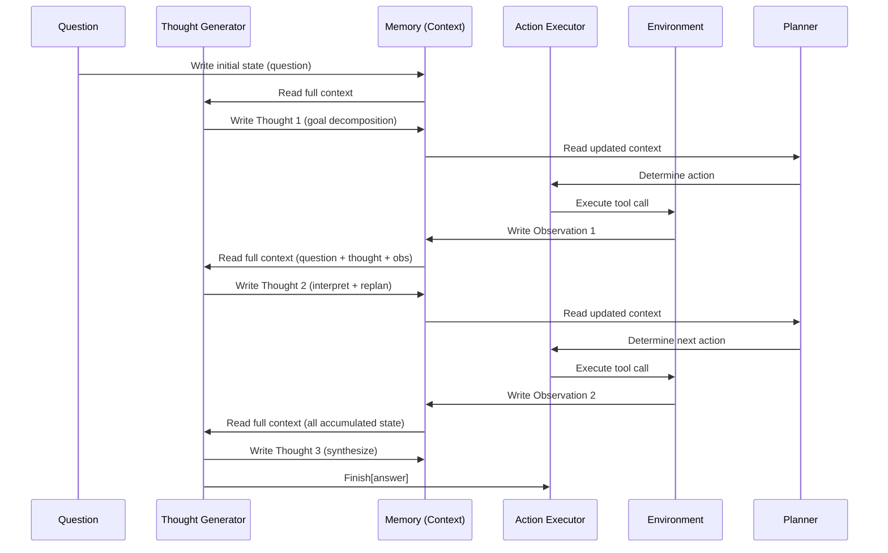
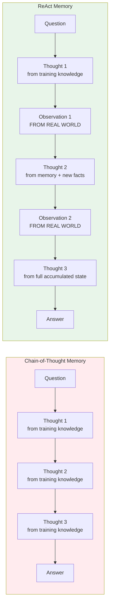
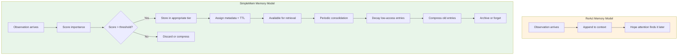
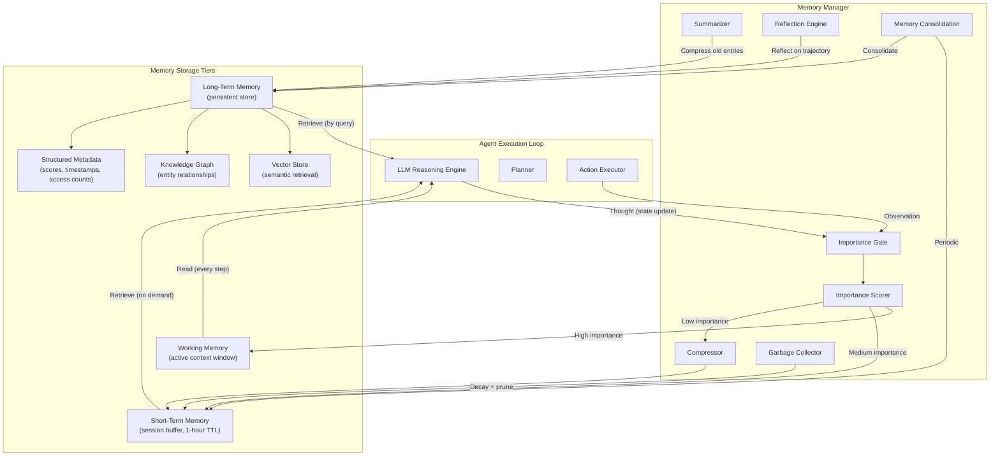
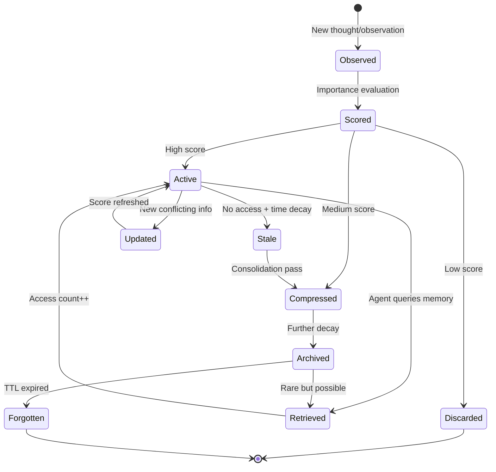

# ReAct and the Birth of Agent Memory: Why Reasoning Is Memory Creation

There are thousands of articles explaining ReAct as "reasoning plus acting." The model thinks, then acts, then observes, then thinks again. That description is correct but shallow. It misses the deeper architectural contribution — the one that actually explains why ReAct became the foundation for every modern AI agent.

ReAct did not merely combine reasoning with tool use. It introduced explicit working memory into LLM agents. Every thought the model generates updates its internal state. Every observation from the environment writes new information into that state. Every subsequent reasoning step reads from this accumulated memory to make better decisions. The context window becomes a living, evolving memory store that the agent reads from and writes to at every step.

This is the real reason ReAct works. Not because the model can call Wikipedia. Not because it can "think out loud." But because it maintains a persistent state representation that accumulates knowledge, tracks goals, records failures, and informs future decisions. The tight loop of thought-action-observation is not just a prompting format — it is a memory architecture.

Once I understood ReAct through this lens, the entire lineage of modern agent memory systems — MemGPT, Letta, SimpleMem, Mem0, LangMem — stopped looking like independent innovations and started looking like natural extensions of a single idea: agents need memory, and ReAct was the first paper to give it to them.

---

## The Missing Perspective

Ask any engineer what ReAct introduced, and they will say:

> "It combined chain-of-thought reasoning with tool calling in a single loop."

That answer is technically correct. It is also incomplete in a way that obscures the paper's most important contribution.

The standard framing:

```
ReAct = Reasoning + Acting
```

The more accurate framing:

```
ReAct = Reasoning + Memory + Acting
```

Without memory, an agent cannot:

- **Track goals** across multiple steps
- **Remember** what it already searched for
- **Avoid repeating** failed strategies
- **Know what worked** in earlier steps
- **Maintain progress** toward a complex objective
- **Ground reasoning** in previously observed facts
- **Recover** from uninformative results

Chain-of-thought alone cannot do any of this. CoT generates a static reasoning trace in one shot — it has no mechanism to update its beliefs based on new information. It reasons from the model's frozen training-time knowledge, never from runtime observations.

Action-only agents cannot do this either. They call tools and receive observations, but without intermediate reasoning, they have no mechanism to interpret observations, adjust strategy, or maintain goal-directed behavior across many steps.

ReAct's interleaved format solves both problems simultaneously by creating an evolving memory that accumulates with each step:



At step 1, the agent knows only the question. By step 8, it has accumulated a rich state representation containing decomposed subgoals, search results, interpretations, plan adjustments, and synthesized conclusions. Every token in that context is memory — and the model reads from all of it when generating each new step.

---

## Where Memory Appears Inside ReAct

The paper's formal notation reveals the memory mechanism explicitly, though it is not framed as such. The key formulation:

### The Augmented Action Space

Standard agents operate with action space **A** (tool calls that change the external environment). ReAct extends this to:

```
A-hat = A ∪ L
```

Where **L** is the space of natural language. A "thought" is an action in **L** — it does not change the external environment, but it changes the agent's internal state.

This is the critical distinction. A thought is not passive observation. It is an active state mutation. When the model writes:

> "Thought 3: The search for 'Front Row' returned a TV show, not the software application. I need to search for 'Front Row Apple software' instead."

This is not decoration. This is the agent:
1. **Reading** from memory (the previous observation)
2. **Interpreting** what went wrong (search returned wrong entity)
3. **Writing** a corrected plan to memory (try a more specific query)
4. **Committing** to this interpretation for all future steps

### The Context Update Rule

The paper defines the context update as:

```
c_(t+1) = (c_t, a_t, o_t)
```

For a thought (where a_t ∈ L), the observation o_t is empty — but the context still grows:

```
c_(t+1) = (c_t, thought_t)
```

For an action (where a_t ∈ A), the environment returns an observation:

```
c_(t+1) = (c_t, action_t, observation_t)
```

In both cases, **the context grows monotonically**. Every thought and every observation is permanently appended to the agent's memory. The policy at time t+1 conditions on the entire accumulated history:

```
π(a_(t+1) | c_(t+1)) = π(a_(t+1) | o_1, a_1, o_2, a_2, ..., o_t, a_t, o_(t+1))
```

This is working memory. The model's behavior at each step is conditioned not just on the question, but on every thought it has had and every observation it has received. The reasoning trace is not cosmetic — it is the state representation that the model uses to make decisions.

### A Concrete Example

From the paper's HotpotQA trajectory:

```
Question: What is the elevation range for the area that the eastern
sector of the Colorado orogeny extends into?

Thought 1: I need to search Colorado orogeny, find the area that the
eastern sector extends into, then find the elevation range of that area.

Action 1: Search[Colorado orogeny]

Observation 1: The Colorado orogeny was an episode of mountain building...
The eastern sector extends into the High Plains.

Thought 2: The eastern sector extends into the High Plains. I need to
search High Plains and find its elevation range.

Action 2: Search[High Plains]

Observation 2: High Plains refers to one of the two distinct land regions...
The High Plains rise in elevation from around 1,800 to 7,000 ft.

Thought 3: High Plains rise from around 1,800 to 7,000 ft, so the
elevation range is approximately 1,800 to 7,000 ft.

Action 3: Finish[approximately 1,800 to 7,000 ft]
```

Trace the memory state at each step:

| Step | Memory Contains | New Knowledge Written |
|------|----------------|----------------------|
| After Thought 1 | Decomposed subgoals: (1) find area, (2) find elevation | Goal structure |
| After Obs 1 | "Eastern sector extends into High Plains" | Entity resolution |
| After Thought 2 | Updated plan: search High Plains for elevation | Plan refinement |
| After Obs 2 | "1,800 to 7,000 ft" | Target fact |
| After Thought 3 | Synthesized answer from accumulated evidence | Conclusion |

Without Thought 1, the agent has no plan structure to guide retrieval. Without Thought 2, the agent cannot connect "High Plains" (from Observation 1) to the next search query. Without Thought 3, the agent cannot synthesize two observations into a final answer. Each thought reads from accumulated memory and writes a new state that future steps depend on.

---

## Working Memory vs Long-Term Memory

ReAct's memory has a fundamental limitation: it lives entirely within the context window. When the context fills up, the memory is gone. When a new conversation starts, all accumulated knowledge from the previous interaction is lost.

This is pure working memory — transient, bounded, and volatile. It is the equivalent of holding information "in mind" during a single problem-solving session.

The evolution from ReAct's working memory to modern agent memory systems follows a clear progression:



### Comparison of Memory Architectures

| System | Memory Type | Persistence | Capacity | Filtering | Retrieval |
|--------|------------|-------------|----------|-----------|-----------|
| **ReAct** | Working memory | Session only | Context window | None (store everything) | Sequential scan (attention) |
| **MemGPT** | Tiered working memory | Session + overflow | Context + external buffer | Page in/out by relevance | Explicit memory search tool |
| **Letta** | Structured memory blocks | Persistent across sessions | Unlimited (external DB) | Block-level management | Tool-based retrieval |
| **Mem0** | Semantic memory | Persistent | Vector store | Entity extraction | Similarity search |
| **LangMem** | Episodic + semantic | Persistent | Configurable stores | Importance scoring | Multi-strategy retrieval |
| **SimpleMem** | Production memory | Persistent + lifecycle | Scored and compressed | Importance + decay + compression | Relevance + recency |

The progression is clear: each system builds on ReAct's insight (agents need memory) while addressing its limitations (bounded capacity, no persistence, no filtering). But the primitive operation — writing state updates during reasoning — remains unchanged from ReAct.

---

## Memory Propagation: How State Evolves During Execution

Understanding exactly how memory propagates through a ReAct trajectory reveals why the pattern is so powerful and why it became the template for all subsequent agent architectures.

### The Propagation Pipeline



### Memory Operations

Each step in a ReAct trajectory performs one or more fundamental memory operations:

**Memory Accumulation:** Every thought and observation appends to the context. The memory grows monotonically — nothing is ever removed in the original formulation.

```python
# Memory accumulation in ReAct
context = [question]

# Step 1: Thought writes to memory
thought_1 = llm.generate(context)  # "I need to search..."
context.append(thought_1)          # Memory grows

# Step 2: Action + observation writes to memory
action_1 = parse_action(thought_1)
observation_1 = environment.execute(action_1)
context.append(f"Action: {action_1}")
context.append(f"Observation: {observation_1}")  # Memory grows again

# Step 3: Next thought reads ALL accumulated memory
thought_2 = llm.generate(context)  # Conditioned on everything above
context.append(thought_2)          # Memory grows further
```

**Memory Retrieval:** The transformer's attention mechanism performs retrieval implicitly. When generating Thought 2, the model attends to all prior tokens — question, Thought 1, Action 1, and Observation 1. This is unstructured retrieval: the model decides which parts of memory are relevant through learned attention patterns.

**Memory Mutation (via new thoughts):** The model cannot edit previous thoughts, but it can write new thoughts that supersede or refine earlier ones. "Thought 3: My earlier plan was wrong because X. The correct approach is Y." This is append-only mutation — the old state remains in context, but the new thought signals that the model's beliefs have changed.

**Memory-Informed Planning:** Each thought implicitly reads from accumulated memory to determine the next action. The model's attention over prior observations and thoughts informs what tool to call next and with what parameters.

### What Makes This Powerful

The power of ReAct's memory propagation comes from a property that pure CoT lacks: **grounded state updates**. In chain-of-thought, every reasoning step is conditioned only on the question and prior reasoning steps — all generated from the model's frozen training-time knowledge. In ReAct, observations inject new, runtime-specific information into memory. The reasoning at step t+1 is conditioned on facts that did not exist in the model's weights.



CoT hallucinates because its memory contains only model-generated content — there is no external grounding. ReAct's memory contains both model-generated reasoning and externally-sourced observations. The hallucination rate drops from 56% (CoT on HotpotQA) to effectively 0% for ReAct because every factual claim is grounded in a retrieved observation stored in memory.

---

## What Should Actually Be Stored?

ReAct stores everything. Every thought, every action, every observation — all appended to context without filtering. For short tasks (3-7 steps), this works. For longer tasks, it creates problems:

- Context fills with irrelevant observations from failed searches
- Early thoughts become stale as the plan evolves
- Noise accumulates, degrading reasoning quality
- Token cost grows linearly with trajectory length

The question that modern memory systems answer — and that ReAct does not — is: **what deserves to survive?**

### Signal vs Noise in Agent Memory

| Worth Storing (Signal) | Not Worth Storing (Noise) |
|----------------------|--------------------------|
| Confirmed facts from observations | Failed search queries that returned nothing |
| Active subgoals and their status | Superseded plan fragments |
| Key entities and their relationships | Verbose observation text (summarize instead) |
| Constraints discovered during execution | Intermediate arithmetic steps |
| Tool outputs that inform future decisions | Repeated information across observations |
| Error patterns (what failed and why) | Formatting tokens and boilerplate |
| User preferences and requirements | Standard tool call syntax |
| Execution history (what was tried) | Full raw API responses |

### The Filtering Problem

In production, an agent executing 50+ tool calls generates thousands of tokens of accumulated context. Most of it is noise by the time the agent reaches step 40. The challenge is identifying what to keep, what to compress, and what to discard — without losing information that later steps might need.

This is the problem that every post-ReAct memory system addresses:

- **MemGPT** pages information in and out of the active context based on relevance
- **Letta** structures memory into typed blocks with explicit read/write semantics
- **Mem0** extracts semantic facts and stores them in a queryable format
- **SimpleMem** scores importance, compresses low-value entries, and implements decay

All of them start from ReAct's insight (the agent needs memory) and add what ReAct lacks (memory management).

---

## Connection to SimpleMem

ReAct's memory philosophy is: **store everything, let attention sort it out.**

SimpleMem's philosophy is: **store deliberately, score importance, compress aggressively, forget intentionally.**

The gap between these two positions defines the evolution from research prototype to production memory system.

### What SimpleMem Adds Beyond ReAct



### Memory Lifecycle Comparison

| Operation | ReAct | SimpleMem |
|-----------|-------|-----------|
| **Write** | Always (append all) | Conditional (importance gate) |
| **Read** | Implicit (attention over full context) | Explicit (retrieval by query) |
| **Update** | Append-only (write new thought) | In-place (modify existing entry) |
| **Delete** | Never | Decay + TTL + explicit forget |
| **Compress** | Never | Summarize old entries |
| **Prioritize** | Recency bias (attention decay) | Importance score + recency + access frequency |
| **Persist** | Session only (context window) | Cross-session (external store) |

### The Importance Scoring Insight

SimpleMem's key addition is asking: "Given everything the agent observed and reasoned about, what is actually important enough to remember?"

Importance scoring in practice:

```python
def score_importance(memory_entry: str, context: dict) -> float:
    """
    Score how important a memory entry is for future reasoning.
    
    High importance:
    - Facts that resolve ambiguity
    - Constraints that limit future actions
    - Entity relationships central to the task
    - Error patterns (what failed and why)
    
    Low importance:
    - Intermediate computations already superseded
    - Verbose tool output (summarize instead)
    - Standard observations with no novel information
    - Duplicate information already stored
    """
    factors = {
        "novelty": compute_novelty(memory_entry, context["existing_memories"]),
        "task_relevance": compute_relevance(memory_entry, context["active_goals"]),
        "information_density": compute_density(memory_entry),
        "future_utility": estimate_future_use(memory_entry, context["remaining_plan"]),
    }
    
    return weighted_sum(factors)
```

This is the bridge from ReAct to production: not just "can the agent remember?" but "should the agent remember this specific thing, and for how long?"

---

## Production Memory Architecture

A production agent memory system builds on ReAct's working memory with persistence, filtering, tiering, and lifecycle management:



### Component Responsibilities

| Component | Role | Trigger |
|-----------|------|---------|
| **Importance Gate** | Decide whether to store, compress, or discard | Every new thought/observation |
| **Importance Scorer** | Assign numeric score based on novelty, relevance, density | On write |
| **Compressor** | Reduce verbose entries to essential information | Low-score entries |
| **Summarizer** | Collapse multiple related entries into one | Periodic consolidation |
| **Garbage Collector** | Remove entries below score threshold or past TTL | Scheduled |
| **Reflection Engine** | Generate meta-observations about patterns | End of task / periodic |
| **Memory Consolidation** | Move short-term entries to long-term storage | Session end / threshold |

---

## Memory Lifecycle

Every memory entry in a production agent system moves through a lifecycle:



### Lifecycle Operations in Detail

**Observe:** A new piece of information enters the system — either from the agent's own reasoning (thought) or from the external environment (observation).

**Score:** The importance scorer evaluates the entry. Scoring factors include:
- Novelty (does this tell us something we do not already know?)
- Task relevance (does this relate to active goals?)
- Information density (ratio of useful facts to total tokens)
- Future utility (will downstream reasoning need this?)
- Contradiction (does this conflict with existing memory — conflicts are high-value)

**Store:** High-score entries go to working memory (immediately available). Medium-score entries go to short-term memory (retrievable on demand). Low-score entries are either compressed or discarded.

**Compress:** Verbose entries are reduced to their essential content. A 200-token observation from Wikipedia might be compressed to a 30-token fact. The original is discarded; the compressed version persists.

**Archive:** Entries that have not been accessed recently and whose scores have decayed below a threshold move to long-term storage. They remain retrievable but are not automatically included in the agent's active context.

**Retrieve:** When the agent needs information, the memory manager searches across tiers. Working memory is always visible. Short-term and long-term memory are searched by relevance to the current reasoning state.

**Update:** When new information contradicts an existing memory entry, the entry is updated in place (or the old entry is marked stale and a new one created). Contradiction detection is itself a memory operation.

**Forget:** Entries whose importance has decayed below threshold and whose TTL has expired are permanently removed. Forgetting is not failure — it is essential for maintaining a high signal-to-noise ratio in memory.

---

## Engineering Implementation

A production-grade memory system for an AI agent, building from ReAct's primitive operations to a full lifecycle-managed architecture:

```python
from dataclasses import dataclass, field
from typing import Optional
from datetime import datetime, timedelta
import hashlib


@dataclass
class MemoryEntry:
    content: str
    entry_type: str  # "thought", "observation", "fact", "plan", "reflection"
    importance: float
    created_at: datetime
    last_accessed: datetime
    access_count: int = 0
    ttl: Optional[timedelta] = None
    source_step: int = 0
    compressed: bool = False
    tags: list[str] = field(default_factory=list)
    
    @property
    def id(self) -> str:
        return hashlib.sha256(
            f"{self.content}:{self.created_at.isoformat()}".encode()
        ).hexdigest()[:16]
    
    @property
    def is_expired(self) -> bool:
        if self.ttl is None:
            return False
        return datetime.now() - self.created_at > self.ttl
    
    @property
    def effective_importance(self) -> float:
        hours_since_access = (
            datetime.now() - self.last_accessed
        ).total_seconds() / 3600
        decay = 0.95 ** hours_since_access
        recency_bonus = min(self.access_count * 0.05, 0.3)
        return self.importance * decay + recency_bonus


class ImportanceScorer:
    def __init__(self, llm_client):
        self.llm = llm_client
    
    def score(
        self,
        entry: str,
        active_goals: list[str],
        existing_memories: list[MemoryEntry],
    ) -> float:
        novelty = self._compute_novelty(entry, existing_memories)
        relevance = self._compute_relevance(entry, active_goals)
        density = self._compute_density(entry)
        
        return (0.4 * relevance) + (0.35 * novelty) + (0.25 * density)
    
    def _compute_novelty(
        self, entry: str, existing: list[MemoryEntry]
    ) -> float:
        if not existing:
            return 1.0
        
        existing_content = " ".join(m.content for m in existing[-20:])
        overlap = len(
            set(entry.lower().split()) & set(existing_content.lower().split())
        )
        total = len(set(entry.lower().split()))
        
        if total == 0:
            return 0.0
        return 1.0 - (overlap / total)
    
    def _compute_relevance(
        self, entry: str, goals: list[str]
    ) -> float:
        if not goals:
            return 0.5
        
        goal_terms = set()
        for goal in goals:
            goal_terms.update(goal.lower().split())
        
        entry_terms = set(entry.lower().split())
        overlap = len(entry_terms & goal_terms)
        
        return min(overlap / max(len(goal_terms), 1), 1.0)
    
    def _compute_density(self, entry: str) -> float:
        words = entry.split()
        if len(words) == 0:
            return 0.0
        
        stopwords = {"the", "a", "an", "is", "are", "was", "were", "in", "on", "at"}
        content_words = [w for w in words if w.lower() not in stopwords]
        
        return len(content_words) / len(words)


class MemoryCompressor:
    def __init__(self, llm_client):
        self.llm = llm_client
    
    def compress(self, entry: MemoryEntry) -> MemoryEntry:
        if len(entry.content.split()) <= 30:
            return entry
        
        compressed_content = self._summarize(entry.content)
        
        return MemoryEntry(
            content=compressed_content,
            entry_type=entry.entry_type,
            importance=entry.importance * 0.9,
            created_at=entry.created_at,
            last_accessed=entry.last_accessed,
            access_count=entry.access_count,
            ttl=entry.ttl,
            source_step=entry.source_step,
            compressed=True,
            tags=entry.tags,
        )
    
    def _summarize(self, content: str) -> str:
        response = self.llm.generate(
            f"Compress to essential facts only (max 30 words): {content}"
        )
        return response.strip()


class WorkingMemory:
    """Immediate context — always visible to the agent."""
    
    def __init__(self, max_entries: int = 20):
        self.entries: list[MemoryEntry] = []
        self.max_entries = max_entries
    
    def add(self, entry: MemoryEntry):
        self.entries.append(entry)
        if len(self.entries) > self.max_entries:
            self._evict_lowest()
    
    def read_all(self) -> list[MemoryEntry]:
        for entry in self.entries:
            entry.last_accessed = datetime.now()
            entry.access_count += 1
        return self.entries
    
    def _evict_lowest(self):
        self.entries.sort(key=lambda e: e.effective_importance, reverse=True)
        evicted = self.entries[self.max_entries:]
        self.entries = self.entries[:self.max_entries]
        return evicted


class LongTermMemory:
    """Persistent storage — retrieved on demand."""
    
    def __init__(self):
        self.entries: list[MemoryEntry] = []
    
    def store(self, entry: MemoryEntry):
        self.entries.append(entry)
    
    def retrieve(self, query: str, top_k: int = 5) -> list[MemoryEntry]:
        scored = []
        query_terms = set(query.lower().split())
        
        for entry in self.entries:
            if entry.is_expired:
                continue
            entry_terms = set(entry.content.lower().split())
            relevance = len(query_terms & entry_terms) / max(len(query_terms), 1)
            scored.append((relevance * entry.effective_importance, entry))
        
        scored.sort(key=lambda x: x[0], reverse=True)
        
        results = [entry for _, entry in scored[:top_k]]
        for entry in results:
            entry.last_accessed = datetime.now()
            entry.access_count += 1
        
        return results
    
    def garbage_collect(self, min_importance: float = 0.1):
        self.entries = [
            e for e in self.entries
            if not e.is_expired and e.effective_importance >= min_importance
        ]


class MemoryManager:
    """
    Production memory manager implementing the full lifecycle.
    Extends ReAct's append-only context with importance scoring,
    tiered storage, compression, and decay.
    """
    
    def __init__(self, llm_client, config: dict = None):
        config = config or {}
        self.scorer = ImportanceScorer(llm_client)
        self.compressor = MemoryCompressor(llm_client)
        self.working = WorkingMemory(
            max_entries=config.get("working_memory_size", 20)
        )
        self.long_term = LongTermMemory()
        self.active_goals: list[str] = []
        self.importance_threshold = config.get("importance_threshold", 0.3)
        self.compression_threshold = config.get("compression_threshold", 0.5)
        self.step_counter = 0
    
    def observe(self, content: str, entry_type: str = "observation") -> Optional[MemoryEntry]:
        """Process a new thought or observation through the importance gate."""
        self.step_counter += 1
        
        score = self.scorer.score(
            content, self.active_goals, self.working.entries
        )
        
        if score < self.importance_threshold:
            return None
        
        entry = MemoryEntry(
            content=content,
            entry_type=entry_type,
            importance=score,
            created_at=datetime.now(),
            last_accessed=datetime.now(),
            source_step=self.step_counter,
            ttl=self._assign_ttl(score),
            tags=self._extract_tags(content),
        )
        
        if score >= self.compression_threshold:
            self.working.add(entry)
        else:
            compressed = self.compressor.compress(entry)
            self.working.add(compressed)
        
        return entry
    
    def retrieve_context(self, query: str = "") -> str:
        """Build context string from working + relevant long-term memory."""
        parts = []
        
        working_entries = self.working.read_all()
        if working_entries:
            parts.append("=== Active Memory ===")
            for entry in working_entries:
                parts.append(f"[{entry.entry_type}] {entry.content}")
        
        if query:
            long_term_entries = self.long_term.retrieve(query, top_k=5)
            if long_term_entries:
                parts.append("\n=== Retrieved Memory ===")
                for entry in long_term_entries:
                    parts.append(f"[{entry.entry_type}] {entry.content}")
        
        return "\n".join(parts)
    
    def consolidate(self):
        """Move stale working memory to long-term storage."""
        evicted = []
        remaining = []
        
        for entry in self.working.entries:
            if entry.effective_importance < self.compression_threshold:
                compressed = self.compressor.compress(entry)
                self.long_term.store(compressed)
                evicted.append(entry)
            else:
                remaining.append(entry)
        
        self.working.entries = remaining
        self.long_term.garbage_collect()
        
        return len(evicted)
    
    def set_goals(self, goals: list[str]):
        """Update active goals — affects importance scoring."""
        self.active_goals = goals
    
    def reflect(self, trajectory_summary: str) -> MemoryEntry:
        """Generate a reflection entry from the current trajectory."""
        entry = MemoryEntry(
            content=f"Reflection: {trajectory_summary}",
            entry_type="reflection",
            importance=0.8,
            created_at=datetime.now(),
            last_accessed=datetime.now(),
            source_step=self.step_counter,
            tags=["reflection", "meta"],
        )
        self.long_term.store(entry)
        return entry
    
    def _assign_ttl(self, importance: float) -> Optional[timedelta]:
        if importance >= 0.8:
            return None  # No expiry for high-importance entries
        elif importance >= 0.5:
            return timedelta(hours=24)
        else:
            return timedelta(hours=1)
    
    def _extract_tags(self, content: str) -> list[str]:
        tags = []
        if any(w in content.lower() for w in ["error", "failed", "wrong"]):
            tags.append("error")
        if any(w in content.lower() for w in ["plan", "goal", "next"]):
            tags.append("planning")
        if any(w in content.lower() for w in ["found", "result", "answer"]):
            tags.append("finding")
        return tags
```

### Using the Memory Manager in a ReAct Loop

```python
async def react_with_memory(
    question: str,
    tools: dict,
    llm_client,
    max_steps: int = 15,
) -> str:
    memory = MemoryManager(llm_client)
    memory.set_goals([question])
    
    memory.observe(f"Task: {question}", entry_type="thought")
    
    for step in range(max_steps):
        context = memory.retrieve_context(query=question)
        
        response = await llm_client.generate(
            system="You are a reasoning agent. Generate either a Thought or an Action.",
            user=f"Context:\n{context}\n\nStep {step + 1}:",
        )
        
        if response.startswith("Thought:"):
            thought_content = response[len("Thought:"):].strip()
            memory.observe(thought_content, entry_type="thought")
        
        elif response.startswith("Action:"):
            action_content = response[len("Action:"):].strip()
            tool_name, args = parse_action(action_content)
            
            if tool_name == "Finish":
                return args
            
            observation = await tools[tool_name].execute(args)
            memory.observe(
                f"Called {tool_name}({args}) -> {observation}",
                entry_type="observation",
            )
        
        if step % 5 == 4:
            memory.consolidate()
    
    memory.reflect(f"Failed to answer '{question}' in {max_steps} steps")
    return "Unable to determine answer within step limit."
```

---

## How Modern Agent Frameworks Handle Memory

Every major agent framework has adopted and extended ReAct's memory primitive. The implementations vary, but the core insight remains: agents need persistent, managed state that evolves during execution.

### Framework Comparison

| Framework | Memory Model | Persistence | Management Strategy |
|-----------|-------------|-------------|-------------------|
| **LangGraph** | State dict passed between nodes | Graph execution lifetime | Explicit state schema; checkpointing |
| **CrewAI** | Shared memory between agents | Task lifetime | Short-term (context) + long-term (external) + entity memory |
| **OpenAI Agents** | Conversation context + tool results | Conversation lifetime | Token-limited context; no explicit management |
| **Claude** | Extended thinking + conversation | Conversation lifetime | Internal reasoning (not visible to user) + visible context |
| **Google ADK** | Session state + memory services | Configurable | Tool-based memory access; explicit store/retrieve |
| **Microsoft AutoGen** | Message history between agents | Conversation lifetime | Teachability plugin for cross-session |
| **Letta** | Core memory blocks + archival | Persistent (database) | Agent manages own memory via tools |
| **MemGPT** | Main context + recall storage | Persistent | Virtual memory with page-in/page-out |

### LangGraph: Explicit State as Memory

LangGraph makes the memory graph-shaped: state is a typed dictionary that flows between processing nodes. Each node can read and write specific state fields.

```python
from langgraph.graph import StateGraph
from typing import TypedDict, Annotated

class AgentState(TypedDict):
    messages: list         # Working memory (conversation)
    findings: list         # Accumulated facts
    current_plan: str      # Active plan
    search_history: list   # What was already tried
    step_count: int        # Execution tracking

def reasoning_node(state: AgentState) -> AgentState:
    # Read from memory (all state fields visible)
    # Write to memory (return updated state)
    return {"current_plan": updated_plan, "step_count": state["step_count"] + 1}
```

### Letta: Memory as Agent Capability

Letta's key innovation is making memory management a tool that the agent itself calls — the agent decides what to remember:

```python
# The agent can call these memory tools during execution:
# core_memory_append(key, content)   - write to persistent memory
# core_memory_replace(key, old, new) - update existing memory
# archival_memory_insert(content)    - store in long-term archive
# archival_memory_search(query)      - retrieve from archive
# conversation_search(query)         - search past conversations
```

This is the logical endpoint of ReAct's insight: if thoughts are memory writes, then memory management should itself be an action the agent can take deliberately.

### The Common Thread

Despite implementation differences, every framework shares the same primitive that ReAct introduced:

1. **State accumulates** during execution (thoughts, observations, results)
2. **Future reasoning** conditions on accumulated state
3. **The agent's behavior changes** based on what it has seen and thought

The evolution is in how that state is managed: from ReAct's unmanaged append-only context, to MemGPT's virtual memory, to Letta's self-managed memory, to SimpleMem's lifecycle-managed production memory.

---

## My Engineering Perspective

One of the biggest insights I took away from ReAct was not that the model could call external tools. Tool calling is straightforward engineering — parse an action, call an API, return the result. What changed my thinking was the realization that every reasoning step modifies the agent's future behavior.

When the model writes "Thought 2: The search for Front Row returned a TV show, not the software application," it is not just generating text. It is updating its internal state in a way that causally determines what happens next. Without that thought in memory, the next action would be random or repetitive. With that thought, the next action is informed and corrective.

This means reasoning is not just inference. It is memory creation.

Every thought token generated by a ReAct agent is simultaneously:
- An inference step (computing what to think)
- A memory write (storing that thought for future use)
- A state transition (changing the distribution over future actions)

Once I viewed ReAct through that lens, the entire subsequent literature on agent memory became legible as a coherent research program rather than disconnected innovations:

- **MemGPT** asks: "What if the memory could overflow beyond the context window?"
- **Letta** asks: "What if the agent could deliberately manage its own memory?"
- **Mem0** asks: "What if we extracted structured facts from the memory stream?"
- **SimpleMem** asks: "What if we scored importance and let irrelevant memories decay?"
- **LangMem** asks: "What if we could consolidate episodic memory into semantic knowledge?"

These are all natural questions once you accept the premise that ReAct established: agents are memory-driven systems. The reasoning loop is not a chain of thoughts — it is a memory construction and retrieval pipeline that happens to use natural language as its encoding format.

Modern AI agents are no longer just tool callers. They are memory-driven systems whose behavior is determined not by a static prompt, but by an evolving internal state that accumulates through experience. ReAct was the first paper to make this architecture explicit. Everything built since is elaboration on that foundation.

---

## Key Takeaways

**Chain-of-thought taught LLMs to reason.** It demonstrated that intermediate reasoning steps before the answer dramatically improve accuracy on multi-step tasks. But CoT reasons in isolation — it never touches the external world, never updates its beliefs based on new information, and operates from frozen training-time knowledge.

**ReAct taught LLMs to remember while reasoning.** By interleaving thoughts with grounded observations, it created an evolving memory that accumulates runtime knowledge. Each step reads from and writes to this memory, producing goal-directed behavior that adapts to what the agent discovers.

**SimpleMem teaches agents what is worth remembering.** It introduces importance scoring, decay, compression, and lifecycle management — transforming ReAct's unbounded, unfiltered memory into a production-grade system that maintains high signal-to-noise over arbitrarily long task horizons.

That progression — **reason → remember → curate** — represents the evolution of modern AI agents. Each step builds on the previous one. Each addresses a limitation of its predecessor. And all three start from the same primitive: an LLM generating tokens that serve simultaneously as reasoning and as memory.

The next time you implement an agent system, ask yourself not just "what tools can it call?" but "what does it remember, how does it remember it, and how does that memory shape its future behavior?" That question — more than tool selection, more than prompt engineering, more than model choice — is what determines whether your agent can handle complex, multi-step tasks reliably.

ReAct answered it first. The rest of the field has been elaborating on that answer ever since.
