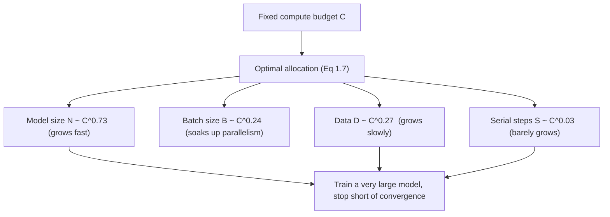

This is a technical dissection of **Scaling Laws for Neural Language Models** — Kaplan, McCandlish et al.'s empirical study of how language-model loss depends on model size, data, and compute. The focus is the engineering payoff: not the curve-fitting itself, but what the power laws let you *decide* — how big a model to build, how much data to feed it, and when to stop training, given a fixed compute budget.

We are not reproducing every figure. The exponents and equations matter here because they turn "how should I spend my GPUs?" from guesswork into a calculation. **[Interpretation]**

**Attribution convention.** Because this article mixes what the paper reports with my own reasoning, every non-obvious technical claim is tagged:

- **[Paper]** — stated explicitly in Kaplan et al. (arXiv:2001.08361).
- **[Derived]** — a mathematical or logical consequence of the paper's equations, worked out here.
- **[Interpretation]** — my explanation or engineering reasoning, written for the reader; not a claim the paper makes.

---

## Why This Paper Matters

Before this paper, "make it bigger" was a hunch. After it, it was a **forecast**. **[Interpretation]** The central finding is that a Transformer language model's cross-entropy loss falls as a **power law** in each of three scale factors — number of parameters $N$, dataset size $D$, and training compute $C$ — with trends holding smoothly across **more than seven orders of magnitude** and showing no sign of bending on the upper end. **[Paper]**

That predictability has a hard engineering consequence the paper draws out explicitly: for a fixed compute budget, the compute-efficient thing to do is train a **very large model on a relatively modest amount of data and stop well short of convergence.** **[Paper]** This is the counterintuitive result that reorganized how frontier models get built — and it is why the GPT-3-era strategy of "scale the model aggressively" was a calculated bet, not a gamble. **[Interpretation]**

## The Setup: What Is Being Measured

The methodology choices are what make the laws clean, so they are worth stating. **[Interpretation]**

- **Model:** decoder-only Transformers, trained to autoregressively model language; loss is cross-entropy in **nats**, averaged over a 1024-token context. **[Paper]**
- **Data:** WebText2 (an extended WebText — Reddit-outbound links with ≥3 karma), BPE-tokenized, $n_{\text{vocab}}=50257$, ~23B tokens. **[Paper]**
- **$N$ = non-embedding parameters.** The single most important definitional choice: embeddings and positional parameters are **excluded**. **[Paper]** For the standard shape,

$$
N \approx 12\, n_{\text{layer}}\, d_{\text{model}}^2
$$

Excluding embeddings is not cosmetic — it is what "produces significantly cleaner scaling laws." **[Paper]** Counting embedding parameters muddies the trend; dropping them straightens it. **[Interpretation]**

- **Compute rule of thumb:** $C \approx 6N$ FLOPs **per training token** (forward ≈ $2N$, backward ≈ $2\times$ forward), and total $C \approx 6NBS$ for batch size $B$ and $S$ steps, quoted in PF-days (1 PF-day $= 8.64\times10^{19}$ FLOPs). **[Paper]** This $6N$-per-token estimate is the back-of-envelope every practitioner still uses. **[Interpretation]**

## The Three Basic Power Laws

When performance is bottlenecked by **only one** factor (the other two made abundant), each law is a clean power law: **[Paper]**

$$
L(N) = \left(\frac{N_c}{N}\right)^{\alpha_N}, \quad \alpha_N \approx 0.076,\ N_c \approx 8.8\times10^{13}
$$

$$
L(D) = \left(\frac{D_c}{D}\right)^{\alpha_D}, \quad \alpha_D \approx 0.095,\ D_c \approx 5.4\times10^{13}\ \text{tokens}
$$

$$
L(C_{\min}) = \left(\frac{C_c^{\min}}{C_{\min}}\right)^{\alpha_C^{\min}}, \quad \alpha_C^{\min} \approx 0.050,\ C_c^{\min} \approx 3.1\times10^{8}\ \text{PF-days}
$$

Reading these:

- **$\alpha_N, \alpha_D, \alpha_C$** — the exponents; they set *how fast* loss drops as you scale that factor. **[Paper]** They are small, so returns are gradual: doubling $N$ multiplies loss by $2^{-0.076}\approx 0.95$ — a 5% improvement per doubling. **[Paper]**
- **$N_c, D_c, C_c$** — normalization constants that depend on vocabulary and tokenization and therefore **have no fundamental meaning**; only the exponents are universal. **[Paper]**
- **$C_{\min}$** — not raw compute but the *minimum* compute to reach a loss (compute at a batch size well below critical). Predictions should use $C_{\min}$, not $C$. **[Paper]**

The exponents are the transferable knowledge; the constants are dataset-specific bookkeeping. **[Interpretation]**

## Scale Dominates, Shape Barely Matters

The most liberating result for a practitioner: within wide limits, loss depends **strongly on scale** ($N, D, C$) and **very weakly on architectural shape** — depth vs. width, number of attention heads, feed-forward ratio. **[Paper]** A wide range of architectures reach nearly the same loss; changing shape while holding $N$ fixed moves loss by only a few percent, costing at most ~22% additional compute across a broad band. **[Paper]**

The engineering implication is that you should not agonize over depth/width tuning — you should spend that effort on getting $N$, $D$, and $C$ right. **[Interpretation]** This is what let later work (Switch, GPT-3) treat architecture as roughly fixed and push scale as the primary lever. **[Interpretation]**

## Combined Law and Overfitting: L(N, D)

The single-factor laws are limits; real training is bottlenecked by $N$ and $D$ **together**. One equation captures both and the overfitting between them: **[Paper]**

$$
L(N, D) = \left[\left(\frac{N_c}{N}\right)^{\alpha_N/\alpha_D} + \frac{D_c}{D}\right]^{\alpha_D}
$$

The key practical reading is the **ratio that controls overfitting**: the penalty depends predictably on $N^{0.74}/D$. **[Paper]** Concretely — **every time you grow the model 8×, you need only ~5× more data** to avoid an overfitting penalty. **[Paper]** Data must scale with model size, but **sublinearly** ($D \propto N^{0.74}$). **[Paper]**

## Training Curves Are Predictable Too: L(N, S)

Scaling isn't only about the final loss — the *trajectory* is lawful. In the infinite-data limit, after an initial transient, a model's learning curve fits: **[Paper]**

$$
L(N, S) = \left(\frac{N_c}{N}\right)^{\alpha_N} + \left(\frac{S_c}{S_{\min}}\right)^{\alpha_S}, \quad S_c \approx 2.1\times10^{3},\ \alpha_S \approx 0.76
$$

- **$S_{\min}$** — the minimum number of optimization steps to reach a loss (steps at a batch size well above critical). **[Paper]**
- The two terms separate cleanly: a **model-size floor** $(N_c/N)^{\alpha_N}$ you can't beat without a bigger model, plus a **training-time term** that decays with steps. **[Derived]**

"Universality of training": the curve parameters are roughly **independent of model size**, so by fitting the early part of a training run you can **extrapolate the loss you'd reach if you trained much longer.** **[Paper]** That is a budgeting superpower — you can decide whether a longer run is worth it before paying for it. **[Interpretation]**

## The Payoff: Compute-Optimal Allocation

This is the section that changed practice. Given a fixed compute budget $C$ and no other constraint, the optimal scaling of each quantity is: **[Paper]**

$$
N \propto C_{\min}^{0.73}, \quad B \propto C_{\min}^{0.24}, \quad S \propto C_{\min}^{0.03}, \quad D = B\cdot S \propto C_{\min}^{0.27}
$$

Read the exponents as a spending policy: **[Interpretation]**

- **Model size ($0.73$)** absorbs the lion's share of new compute — a billion-fold compute increase should go **overwhelmingly** into a bigger model. **[Paper]**
- **Batch size ($0.24$)** grows moderately — extra parallelism, not extra wall-clock. **[Paper]**
- **Serial steps ($0.03$)** barely grow — training time increases negligibly. **[Paper]**
- **Data ($0.27$)** grows slowly — data requirements rise far slower than model size. **[Paper]**

The conclusion the paper states plainly: **convergence is inefficient.** Maximally compute-efficient training trains very large models and stops **significantly short of convergence**, because a partially-trained large model beats a fully-converged small one at equal compute. **[Paper]** Larger models are simply **more sample-efficient** — they reach a given loss in fewer steps and on fewer tokens. **[Paper]** (In practice researchers under-size models relative to this optimum, because of hardware/memory constraints — which is exactly the wall that memory-partitioning systems attack.) **[Interpretation]**

## The Critical Batch Size

How much of the compute can be turned into parallelism (bigger batches) rather than serial time is itself lawful. The critical batch size — the sweet spot in the time/compute trade-off of data parallelism — depends only on the loss: **[Paper]**

$$
B_{\text{crit}}(L) = \frac{B_*}{L^{1/\alpha_B}}, \quad B_* \approx 2\times10^{8}\ \text{tokens},\ \alpha_B \approx 0.21
$$

At convergence for the largest models studied, this is roughly **1–2 million tokens** per batch. **[Paper]** It matters because it tells you how far you can scale batch size (buying speed via parallelism) before you start wasting compute. **[Interpretation]**

## Transfer Incurs a Constant Penalty

A quietly important result for anyone deploying models off-distribution: evaluating on a *different* text distribution than training yields loss that tracks the training-validation loss with a **roughly constant offset**. **[Paper]** Transfer costs a fixed penalty but otherwise **improves in lockstep** with in-distribution performance — so making the model better on its training distribution reliably makes it better everywhere, not just at home. **[Paper]**

## Engineering Trade-offs & Caveats

- **Exponents, not constants, transfer.** $N_c, D_c, C_c$ depend on tokenizer/vocabulary and carry no universal meaning; only the exponents generalize. **[Paper]**
- **The laws must bend eventually.** Power laws can't continue to zero loss forever; the paper sees no upper-end deviation in its range but expects flattening beyond it. **[Paper]**
- **Non-embedding bookkeeping is load-bearing.** The clean laws depend on measuring $N$ and $C$ *without* embeddings — a subtlety easy to get wrong. **[Paper]**
- **"Stop short of convergence" fights intuition and hardware.** The compute-optimal recipe leaves models visibly under-trained by classical standards, and memory limits often prevent building the optimally-large model in the first place. **[Interpretation]**

## A Later Revision Worth Knowing

The compute-optimal allocation here — data growing only as $C^{0.27}$ while model size grows as $C^{0.73}$ — was **revised by later work** (the "Chinchilla" scaling laws, Hoffmann et al. 2022), which found model size and data should scale in roughly **equal proportion**, implying earlier large models were substantially *under-trained* on data. **[Interpretation]** This does not undo Kaplan et al.'s core contribution — that loss is a predictable power law in scale — but it corrects the specific split between spending compute on parameters vs. tokens. **[Interpretation]** Reading the two together is the honest way to understand the field's trajectory. **[Interpretation]**

## How This Connects to the Rest of the Stack

- **[Switch Transformers](/engineering/switch-transformers-scaling-to-trillion-parameter-models/)** cites these laws directly: its whole premise — parameters are valuable independent of compute-per-token — is a bet on the $L(N)$ curve, pursued by decoupling $N$ from FLOPs via sparsity. **[Interpretation]**
- **[ZeRO](/engineering/zero-memory-optimization-training-large-models/)** is the systems answer to the practical caveat above: scaling laws say build a bigger model, ZeRO makes that model *fit* across devices. The two are complementary — one tells you *what* to build, the other makes it *buildable*. **[Interpretation]**

## Engineering Takeaway

The lasting value of this paper is that it converts model-building into an optimization problem with known coefficients: **[Interpretation]**

- Loss is a **power law** in $N$, $D$, and $C$ — smooth, extrapolable, and largely indifferent to architecture shape. **[Paper]**
- Data should scale **sublinearly** with model size ($D\propto N^{0.74}$); overfitting is governed by a single ratio. **[Paper]**
- Given compute, spend it **mostly on model size**, grow data slowly, and **stop before convergence** — because big models are more sample-efficient. **[Paper]**
- Training curves and batch sizes are themselves lawful, so you can **budget and forecast** rather than trial-and-error. **[Paper]**

The single sentence to carry away: **scale is predictable, and the compute-efficient move is to train large models and stop early** — a claim precise enough to plan a GPU cluster around, and the intellectual foundation the subsequent era of large models was built on. **[Interpretation]**
