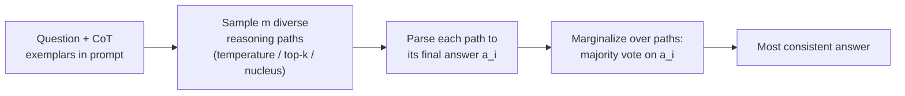

This is a technical dissection of **Self-Consistency** — Wang et al.'s "Self-Consistency Improves Chain of Thought Reasoning in Language Models." The engineering focus is a single, deceptively small change to the *decoding* step: instead of greedily decoding one chain-of-thought and reading off its answer, **sample many chains and let them vote**. No new architecture, no fine-tuning, no verifier — just a different way of spending inference compute. **[Interpretation]**

The paper's whole thesis fits in one sentence: **a hard reasoning problem admits many correct paths that converge on the same answer, but incorrect paths tend to scatter** — so the answer the paths agree on is probably right. **[Paper]**

**Attribution convention.** Because this article mixes what the paper reports with my own reasoning, every non-obvious technical claim is tagged:

- **[Paper]** — stated explicitly in Wang et al. (arXiv:2203.11171).
- **[Derived]** — a mathematical or logical consequence of the paper's setup, worked out here.
- **[Interpretation]** — my explanation or engineering reasoning, written for the reader; not a claim the paper makes.

---

## Why This Paper Matters

[Chain-of-thought prompting](/engineering/chain-of-thought-prompting-elicits-reasoning/) had shown that prompting a large model to write out its reasoning unlocks multi-step problem solving. **[Paper]** But CoT as originally used still decodes **greedily**: one reasoning path, one answer. Greedy decoding has two known failure modes — it gets stuck in local optima and can be repetitive, and if that single path takes a wrong turn early, the whole answer is lost. **[Paper]**

The prior fixes were heavy. To improve reasoning accuracy, earlier work **trained a verifier** to re-rank candidate solutions (Cobbe et al., 2021) or **trained a re-ranker from human annotations** (Thoppilan et al., 2022). **[Paper]** Both need extra models, extra data, extra training.

Self-consistency's contribution is that it gets most of that benefit for **free at inference time**: it is entirely **unsupervised**, works **off-the-shelf** on a frozen pretrained model, needs **no additional training, no auxiliary model, no fine-tuning, and no human annotation**. **[Paper]** It is the clean demonstration that you can trade *inference compute* for *reasoning accuracy* — the seed of the entire "test-time compute" line of work. **[Interpretation]**

## The Core Idea: Correct Paths Agree, Wrong Paths Scatter

The intuition is borrowed from how people reason: if several *different* ways of thinking about a problem all land on the same answer, you trust that answer more. **[Paper]**

Turned into a hypothesis about language models: **correct reasoning processes, even when diverse, tend to agree on the final answer; incorrect processes tend to disagree — each wrong path makes its own distinct mistake.** **[Paper]** A wrong chain can arrive at any of many wrong numbers; the correct chains all funnel to the one correct number. So if you sample enough paths, the correct answer accumulates the most votes even when *no single path* is the model's greedy favorite. **[Interpretation]**

This is why sampling *diverse* paths matters — the diversity is not a nuisance to be averaged away, it is the mechanism. **[Interpretation]**

## The Method: Sample and Marginalize

Three steps, replacing only the decode step of ordinary CoT: **[Paper]**

1. **Prompt** the model with the same manually written chain-of-thought exemplars used in CoT prompting. **[Paper]**
2. **Sample** a set of $m$ candidate outputs from the decoder — using ordinary stochastic decoding (temperature, top-$k$, or nucleus sampling), which produces a *diverse* set of reasoning paths instead of the single greedy one. **[Paper]**
3. **Marginalize** — parse each output into a final answer $a_i$ and take the answer that the most paths agree on. **[Paper]**

### The marginalization, symbol by symbol

The generated answers $a_i$ come from a fixed answer set, $a_i \in \mathcal{A}$, with $i = 1,\dots,m$ indexing the $m$ sampled outputs. **[Paper]** Each output couples a **reasoning path** $r_i$ (a token sequence) with its **answer** $a_i$; the reasoning path is a *latent* variable — only there to reach $a_i$. **[Paper]** Self-consistency marginalizes over the reasoning paths by voting on the answers:

$$
a^{*} = \arg\max_{a}\ \sum_{i=1}^{m}\ \mathbb{1}\!\left(a_i = a\right)
$$

Reading the symbols:

- **$a_i$** — the final answer parsed from the $i$-th sampled output (e.g. the first number after "The answer is "). **[Paper]**
- **$\mathbb{1}(a_i = a)$** — an indicator, 1 if path $i$ produced answer $a$, else 0. **[Paper]**
- **the sum** — the vote count for candidate answer $a$; $a^{*}$ is the answer with the most votes, i.e. the **most consistent** answer. **[Paper]**

The parser is task-dependent: for arithmetic, parse the first numeric span after "The answer is"; for commonsense, parse the string answer. **[Paper]**

### Why plain majority vote is enough

You *could* weight each vote by the model's probability of the path, $P(r_i, a_i \mid \text{prompt}, \text{question})$, normalized by output length: **[Paper]**

$$
P(r_i, a_i \mid \text{prompt}, \text{question}) = \exp\!\left(\frac{1}{K}\sum_{k=1}^{K} \log P\!\left(t_k \mid \text{prompt}, \text{question}, t_1,\dots,t_{k-1}\right)\right)
$$

where $t_k$ is the $k$-th token of $(r_i, a_i)$ and $K$ the total token count. **[Paper]** But the paper's Table 1 finding is the practically useful one: **the unweighted majority vote matches the normalized-weighted sum almost exactly** (e.g. 74.4 vs 74.1 on GSM8K, PaLM-540B). **[Paper]** The reason is revealing — for the sampled $(r_i, a_i)$, the normalized probabilities are all **close to each other**: the model regards its diverse correct paths as "similarly likely." **[Paper]**

That has a sharp corollary the paper states outright: the model is **not well calibrated** — it can't tell its good solutions from its bad ones by probability alone, which is exactly *why* earlier work had to train separate verifiers. Self-consistency sidesteps calibration entirely by voting on *answers* rather than trusting *probabilities*. **[Interpretation]** (The *unnormalized* weighted sum, by contrast, does noticeably worse — length bias — and a "weighted average" does worse still.) **[Paper]**

## Results: Large, and Larger with Scale

Evaluated on four models across scales — **UL2-20B, LaMDA-137B, GPT-3-175B (code-davinci-001/002), and PaLM-540B** — in the few-shot setting with **no training or fine-tuning**, using the *same* CoT prompts as Wei et al. **[Paper]** Results are averaged over 10 runs of **40 sampled paths** each. **[Paper]**

The headline arithmetic gains (best models): **[Paper]**

| Benchmark | CoT (greedy) → Self-Consistency | Gain |
|---|---|---|
| GSM8K (PaLM-540B) | 56.5 → 74.4 | **+17.9** |
| GSM8K (GPT-3 davinci-002) | 60.1 → 78.0 | **+17.9** |
| AQuA (GPT-3 davinci-002) | 39.8 → 52.0 | **+12.2** |
| SVAMP (GPT-3 davinci-002) | 75.8 → 86.8 | **+11.0** |
| ASDiv (PaLM-540B) | 74.0 → 81.9 | **+7.9** |
| MultiArith (LaMDA-137B) | 51.8 → 75.7 | **+23.9** |

On commonsense/symbolic tasks the gains are smaller but consistent: **StrategyQA +6.4, ARC-challenge +3.9** (GPT-3 davinci-002). **[Paper]** Across the board it set **new SOTA on almost all arithmetic tasks and 5 of 6 commonsense/symbolic tasks** — despite being unsupervised and task-agnostic, beating methods that fine-tune on thousands of examples. **[Paper]**

Two patterns matter more than any single number: **[Interpretation]**

- **Gains grow with model scale.** UL2-20B gets +3–6 points; LaMDA-137B and GPT-3 get +9–23. **[Paper]** Small models gain little because the underlying abilities (e.g. arithmetic) only emerge at scale — self-consistency amplifies a capability, it doesn't create one. **[Paper]**
- **Gains grow with the number of paths.** Accuracy rises monotonically from 1 → 5 → 10 → 20 → 40 sampled paths. **[Paper]** This is the test-time-compute knob: more samples, more accuracy, more cost. **[Interpretation]**

## Why Sampling Beats the Alternatives

The paper is careful to show the win comes from **answer-level diversity**, not just "more compute": **[Interpretation]**

- **vs. Sample-and-rank** (sample $N$, keep the highest log-prob sequence): self-consistency wins by a wide margin at the same $N$. **[Paper]** Ranking by probability inherits the model's bad calibration; voting on answers doesn't. **[Interpretation]**
- **vs. Beam search** (on UL2-20B): self-consistency-with-sampling clearly beats beam search, and beats even self-consistency-*with*-beam-search — because **beam search yields low-diversity outputs**, and diversity is the whole point. **[Paper]** Notably, top-beam accuracy *degrades* as beam size grows on these tasks, while sampling-based voting improves. **[Paper]**
- **vs. Prompt-ensembles** (permuting exemplar order, or hand-writing multiple prompt sets, then majority-voting greedy answers): these ensemble tricks give only small gains; self-consistency is much larger. **[Paper]** It's a "self-ensemble" over one model's sampled paths, not an ensemble of models or prompts. **[Paper]**

## Robustness and the Confidence Signal

- **Robust to sampling hyperparameters.** It improves across a wide range of $T$, $k$, and nucleus $p$ — you don't have to tune the sampler carefully. **[Paper]**
- **Robust to imperfect prompts.** Even when the CoT exemplars contain injected errors (wrong intermediate numbers), which drops greedy accuracy (17.1 → 14.9 on LaMDA GSM8K), self-consistency recovers and *exceeds* the clean-prompt greedy baseline (→ 23.4). **[Paper]**
- **Works beyond hand-written NL rationales.** It also helps with **equation-only** reasoning (smaller gain — shorter outputs leave less room for diversity) and with **zero-shot CoT** (Kojima et al.), where it adds +26.2 points on GSM8K for PaLM-540B. **[Paper]**
- **Helps even when CoT hurts.** On some NLP tasks (ANLI, e-SNLI, RTE) adding a chain-of-thought *lowers* accuracy vs. standard prompting; self-consistency reliably pulls it back above standard prompting. **[Paper]**
- **Consistency ≈ confidence.** The **fraction of sampled paths that agree** with the winning answer correlates strongly with accuracy — so low agreement is a usable "the model doesn't know" signal, a free uncertainty estimate. **[Paper]** This is arguably as important as the accuracy gain: it's calibration recovered from voting behavior rather than raw probabilities. **[Interpretation]**

## Engineering Trade-offs & Limitations

The method is almost pure upside on accuracy, so the costs are the interesting part. **[Interpretation]**

- **Inference cost multiplies.** $m$ paths means roughly $m\times$ the compute of a single CoT decode. **[Derived]** 40 samples for one answer is the literal price of the headline numbers — this is a *test-time-compute* trade, accuracy bought with FLOPs. **[Interpretation]**
- **Fixed-answer tasks only.** Marginalization needs answers you can compare for equality (a number, a label). **[Paper]** Open-ended generation doesn't fit unless you define a consistency metric between free-form outputs — the paper flags this as future work, not a solved case. **[Paper]**
- **Amplifies, doesn't create.** If the base model can't reach the answer on *any* path (small models, unfamiliar tasks), voting has nothing correct to concentrate on. **[Paper]**
- **Assumes wrong answers scatter.** If the model has a *systematic* bias — the same wrong answer across many paths — the majority vote confidently returns the wrong answer. **[Interpretation]** The method's guarantee is only as good as the "incorrect paths disagree" hypothesis. **[Interpretation]**

## How This Connects to the Rest of the Stack

- **[Chain-of-Thought](/engineering/chain-of-thought-prompting-elicits-reasoning/)** is the direct parent: self-consistency changes only CoT's *decoding* step (greedy → sample-and-vote) and keeps the exact same prompts. **[Interpretation]** Share several authors, and it's best read immediately after CoT. **[Interpretation]**
- **[GPT-3](/engineering/gpt-3-language-models-are-few-shot-learners/)** supplies both the few-shot in-context setting self-consistency runs in and the "abilities emerge with scale" observation that explains why gains grow with model size. **[Interpretation]**
- It's the conceptual ancestor of later **test-time-compute** methods (sampling budgets, best-of-$n$, verifier-guided search): the idea that you can *spend inference to buy reasoning* starts here, in its simplest possible form. **[Interpretation]**

## Engineering Takeaway

- Self-consistency replaces greedy CoT decoding with **sample many diverse paths, then majority-vote the answer** — unsupervised, no verifier, no fine-tuning. **[Paper]**
- **Diversity is the mechanism**, not noise: correct paths converge, wrong paths scatter, so sampling beats beam search and probability-ranking at equal budget. **[Paper]**
- A **plain majority vote** matches probability-weighted aggregation, because the model can't tell its good paths from bad ones by probability — voting routes around bad calibration. **[Paper]**
- Gains are large and **grow with both scale and sample count** (GSM8K +17.9), and the **agreement fraction doubles as a confidence estimate**. **[Paper]**
- The cost is honest: **$m\times$ inference** and **fixed-answer tasks only**. **[Derived]**

The single sentence to carry away: **stop trusting one reasoning path — sample a crowd of them and believe the answer they agree on.** **[Interpretation]**
