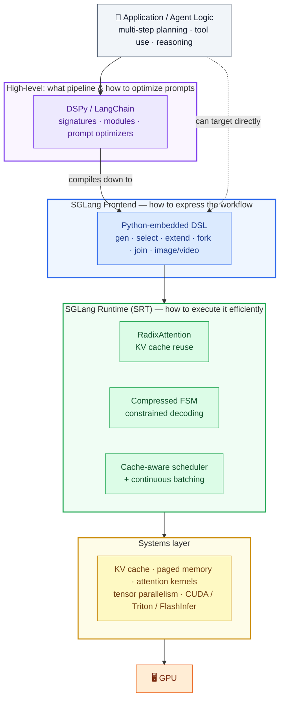
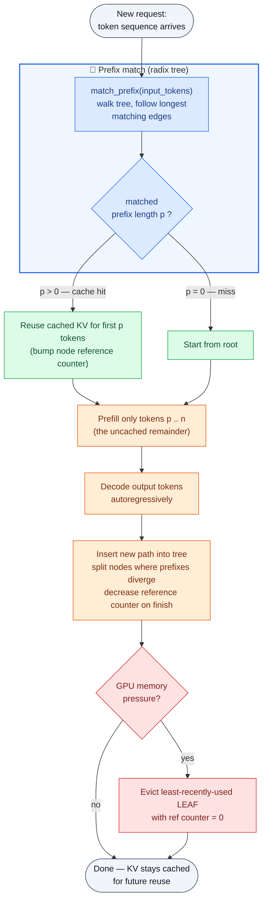
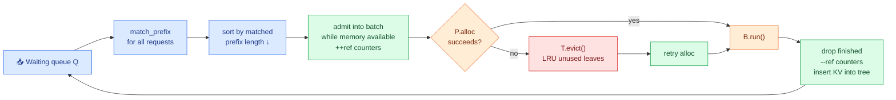

This is a technical dissection of **SGLang** — a system for **efficient execution of structured language model programs**. SGLang has two halves that are easy to confuse: a **frontend language** for *expressing* multi-call LLM workflows, and a **backend runtime** for *executing* them fast. The centre of gravity for this article is the runtime — specifically **RadixAttention**, the mechanism that turns "requests often share a prefix" into "then stop recomputing that prefix."

I am not reproducing the paper. The throughput and latency numbers matter here only as evidence that the runtime's design choices — reuse KV cache, schedule around it, decode constrained tokens in bulk — actually pay off.

**Attribution convention.** Because this article mixes what the paper says with my own reasoning, every non-obvious technical claim is tagged:

- **[Paper]** — stated explicitly in SGLang (NeurIPS 2024).
- **[Derived]** — a mathematical or logical consequence of the paper's definitions, worked out here.
- **[Interpretation]** — my explanation or engineering reasoning, written for the reader; not a claim the paper makes.

---

## Reasoning / Why I Studied This Paper

I have been studying **LLM inference systems** — how large models are actually served under real workloads — and SGLang kept coming up from two very different directions at once. **[Interpretation]**

The first time I met the name, it felt a lot like **DSPy**: both let you write an LLM application as a *program* instead of hand-concatenating strings, treating the interaction with the model as a computation graph rather than a single API call. **[Interpretation]** But that similarity is only skin-deep, and pinning down the difference is what made the paper click for me:

- **DSPy** is closer to an LLM **programming + optimization/compiler** framework. It asks *"what pipeline should I build, and how do I optimize the prompts?"* and largely stops at that level.
- **SGLang** is closer to an LLM **programming language + high-performance runtime**. It asks *"how do I express this workflow, and how do I execute it efficiently on an inference engine?"* — and it goes all the way down into KV cache management, scheduling, batching, and constrained decoding. **[Interpretation]**

The paper itself draws this line explicitly: high-level systems like LangChain and DSPy can be **compiled down to** low-level systems like SGLang, and the authors actually use SGLang as a **backend for DSPy** in their evaluation. **[Paper]** So the two are not rivals stacked side by side; they sit at different heights in the stack:



*My mental stack for placing SGLang. The frontend feels DSPy-like, but the value the paper is really chasing lives in the runtime layer — and that is where this article spends most of its time.* **[Interpretation]**

Because I had already worked through the KV-cache lifecycle in [vLLM's PagedAttention](/engineering/vllm-pagedattention-efficient-memory-management-for-llm-serving/) and [MOONCAKE](/engineering/mooncake-kvcache-centric-architecture-for-serving-llm-chatbot/), SGLang slotted into the same story from a new angle: **vLLM manages KV memory efficiently, MOONCAKE moves KV across a cluster, and SGLang is about not creating redundant KV in the first place.** **[Interpretation]**

## I. The Problem: LLM Programs Are Not `Request → LLM → Response`

The paper's starting observation is that modern LLM usage has moved past single chat turns into **"Language Model Programs" (LM programs)** — programs that schedule and control the generation process of one or more LLMs. **[Paper]** These programs have two defining properties: **[Paper]**

1. They contain **multiple LLM calls interspersed with control flow** — to complete complex tasks and improve quality.
2. They receive **structured inputs and produce structured outputs** — so LM programs can be composed and integrated into existing software.

Concretely, that means a real application is rarely one prompt. It is some mix of: **[Paper]** **[Interpretation]**

- multiple, often dependent, generation calls (agents, multi-turn planning),
- branching and parallel exploration (tree-of-thought, skeleton-of-thought),
- repeated prompts and shared prefixes (few-shot examples, a fixed system prompt, RAG context),
- constrained generation (JSON that must match a schema),
- programmatic control flow around all of it.

The paper identifies **two inefficiencies** that current systems suffer when they run these programs: **[Paper]**

- **Programming them is tedious.** The non-deterministic nature of LLMs forces extensive string manipulation, brittle output parsing, and manual parallelism — even simple programs become hard to read. **[Paper]**
- **Executing them is wasteful.** State-of-the-art engines (vLLM, TGI, TensorRT-LLM) are optimized *without knowledge of the workload*. They are general and robust but leave workload-specific opportunities on the table. **[Paper]** The prominent example: during batched execution of LM programs, **many calls share a common prefix**, yet the **KV cache is discarded after each request finishes**, so the shared prefix is recomputed again and again. **[Paper]** A second example: **constrained decoding** masks disallowed tokens one token at a time, even when many tokens are forced and could be emitted at once. **[Paper]**

> The question SGLang answers: *what is inefficient about running these LM programs the normal way, and what does a co-designed language + runtime change?* **[Interpretation]**

## II. The SGLang Programming Model (The Frontend)

SGLang is a **domain-specific language embedded in Python**. Because it is embedded, you keep Python's control flow and libraries and simply drop in primitives for generation and parallelism. **[Paper]** The primitives are: **[Paper]**

| Primitive | What it does |
|---|---|
| `gen("name", regex=…, stop=…)` | Call the model, store the result in a named variable; the optional `regex` **constrains** the output to a grammar (e.g. a JSON schema). |
| `select("name", choices=[…])` | Let the model **choose** the highest-probability option from a list. |
| `+=` / `extend` | **Append** a string (or primitive) to the prompt state. |
| `s["name"]` | **Fetch** the result of a generation. |
| `fork(k)` | Create **`k` parallel copies** of the prompt state. |
| `join` | **Rejoin** forked prompt states. |
| `image`, `video` | Take **multi-modal** inputs. |

**A running example.** The paper's showcase is a multi-dimensional essay judge built with the **branch-solve-merge** technique. Reading it top to bottom is the fastest way to feel the model: **[Paper]**

```python
@function
def multi_dimensional_judge(s, path, essay):
    s += system("Evaluate an essay about an image.")
    s += user(image(path) + "Essay:" + essay)
    s += assistant("Sure!")

    # Return early if the essay is not related to the image
    s += user("Is the essay related to the image?")
    s += assistant(select("related", choices=["yes", "no"]))
    if s["related"] == "no":
        return

    # Judge multiple dimensions IN PARALLEL (branch)
    forks = s.fork(len(dimensions))          # dimensions = ["Clarity","Originality","Evidence"]
    for f, dim in zip(forks, dimensions):
        f += user("Evaluate based on the following dimension:" + dim + ". End your judgment with 'END'")
        f += assistant("Judgment:" + gen("judgment", stop="END"))

    # Merge the judgments (merge)
    judgment = "\n".join(f["judgment"] for f in forks)

    # Summarize into a schema-constrained JSON (solve)
    s += user("Provide the judgment, summary, and a letter grade")
    s += assistant("In summary," + gen("summary", stop=".") + "The grade is" + gen("grade"))
    schema = r'\{"summary": "[\w\d\s]+\.", "grade": "[ABCD][+-]?"\}'
    s += user("Return in the JSON format.")
    s += assistant(gen("output", regex=schema))
```

Notice what each primitive quietly buys you, because these are exactly the hooks the runtime later exploits: **[Interpretation]**

- `select` and `if` mix model decisions with **Python control flow**.
- `fork` makes the three dimension-judgments **run in parallel** — and they all share the same long prefix (system + image + essay), which is a **KV-cache reuse** opportunity. **[Paper]**
- `gen(..., regex=schema)` is a **constrained decode** that the compressed FSM will accelerate. **[Paper]**

The paper reports that an equivalent program written against an OpenAI-style completion API would take about **2.1× as many lines**, because of all the manual string manipulation and parallelism plumbing. **[Paper]**

**Execution modes.** The default is an **interpreter**: the prompt is treated as an **asynchronous stream**, and primitives like `extend`, `gen`, and `select` are submitted to that stream **without blocking** — Python keeps running while generation happens in the background, "similar to launching CUDA kernels asynchronously." **[Paper]** Each prompt is managed by a **stream executor in a background thread**, which is what enables **intra-program parallelism** (the forks actually overlap). Fetching a result blocks until it is ready, preserving correctness. Programs can alternatively be **traced and compiled** into computational graphs for more optimization (Appendix D). **[Paper]**

**Where SGLang sits among LLM languages.** The paper's Table 1 compares it with LMQL and Guidance: **[Paper]**

| System | Syntax | Language primitives | Runtime backends |
|---|---|---|---|
| LMQL | Custom | `extend`, `gen`, `select` | HF Transformers, llama.cpp, OpenAI |
| Guidance | Python | `extend`, `gen`, `select`, `image` | HF Transformers, llama.cpp, OpenAI |
| **SGLang** | Python | `extend`, `gen`, `select`, **`image`, `video`, `fork`, `join`** | **SGLang Runtime (SRT)**, OpenAI, Anthropic |

The distinguishing move is not the surface syntax — it is that SGLang ships its **own co-designed runtime (SRT)** and adds **`fork`/`join`** so that intra-program parallelism becomes something the runtime can see and optimize. **[Paper]** **[Interpretation]**

## III. Runtime Architecture Overview

The paper's system diagram is deliberately simple: an **interpreter executes language primitives against an optimized runtime**. **[Paper]**

The frontend and backend can work together *or independently* — you can point the frontend at OpenAI, or drive SRT from another framework. **[Paper]** The runtime's leverage comes from **three optimizations**, each targeting one of the inefficiencies from Section I: **[Paper]**

```mermaid
flowchart LR
    subgraph CLIENT["🟦 SGLang Client (Frontend)"]
        PRIM["Language primitives<br/>gen · select · fork · join · image/video"]
    end

    INT["⚙️ Interpreter<br/>async prompt stream<br/>intra-program parallelism<br/>frontend hints"]

    subgraph BACKEND["🟩 SGLang Runtime (SRT — Backend)"]
        direction TB
        O1["① RadixAttention<br/>automatic KV cache reuse<br/>(Sec 3)"]
        O2["② Compressed FSM<br/>fast constrained decoding<br/>(Sec 4)"]
        O3["③ API Speculative Execution<br/>for API-only models<br/>(Sec 5)"]
    end

    GPU["🖥️ GPU execution<br/>paged KV · attention kernels · tensor parallelism"]

    PRIM --> INT --> BACKEND --> GPU

    classDef clientCls fill:#dbeafe,stroke:#2563eb,color:#1e3a8a;
    classDef intCls fill:#ede9fe,stroke:#7c3aed,color:#4c1d95;
    classDef backCls fill:#dcfce7,stroke:#16a34a,color:#14532d;
    classDef gpuCls fill:#ffedd5,stroke:#ea580c,color:#7c2d12;
    class PRIM clientCls;
    class INT intCls;
    class O1,O2,O3 backCls;
    class GPU gpuCls;
    style CLIENT fill:#eff6ff,stroke:#2563eb,stroke-width:2px;
    style BACKEND fill:#f0fdf4,stroke:#16a34a,stroke-width:2px;
```



*A richer rendering of the paper's Figure 1. Optimizations ① and ② require access to the model internals (open-weight models); ③ is for black-box API models.* **[Paper]** The rest of this article walks each one, starting with the KV cache it all revolves around.

## IV. KV Cache: The Resource Being Managed

Before RadixAttention makes sense, the object it manages has to be clear. **[Interpretation]**

Modern LLMs are **autoregressive Transformers**: they predict the next token from all preceding tokens. Inference has two phases — a **prefill** forward pass over the input tokens, then **decoding** one token at a time, each new token attending to all prior ones. **[Paper]** In self-attention, every token produces **key** and **value** tensors; caching them so future tokens don't recompute them is the **KV cache**. **[Paper]** (For the attention background itself, see [Attention Is All You Need](/engineering/attention-is-all-you-need/).)

The one property that the entire paper hinges on: **[Paper]**

> The KV cache of a token depends **only on the token and its prefix** — nothing after it.

Formally, for a prompt of length $n$, the attention output at positions after a cached prefix of length $p$ only needs the *new* queries against the *full* key/value sequence: **[Interpretation]**

$$
o[p{:}n] = \mathrm{Attn}\big(q[p{:}n],\; k[1{:}n],\; v[1{:}n]\big)
$$

where $k[1{:}p], v[1{:}p]$ can be **loaded from cache** and only $k[p{:}n], v[p{:}n]$ must be **computed**. The direct consequence is the reuse rule: **[Derived]**

$$
T_{\text{prefill}} \;\propto\; (n - p) \quad\text{instead of}\quad T_{\text{prefill}} \;\propto\; n
$$

If two sequences share a prefix, the second only has to prefill the part that is genuinely new. **[Derived]** That is the whole prize — and the reason it goes unclaimed in most systems is mundane: **they throw the KV cache away when a request finishes.** **[Paper]**

The prefixes are not hypothetical. The paper's Figure 9 (Appendix) catalogues four everyday sharing patterns, and they cover most of what LM programs actually do: **[Paper]**


*Figure 9 (from the paper). Blue = shareable prompt parts, green = non-shareable inputs, yellow = non-shareable model outputs. **(a)** Few-shot learning shares the example block across many questions; **(b)** self-consistency shares one question across many samples; **(c)** multi-turn chat makes each turn's history a prefix of the next; **(d)** tree-of-thought shares search history down each branch. None of the existing systems could automatically handle **all** of these — RadixAttention can.* **[Paper]** These map straight onto the reasoning workloads I studied earlier — [self-consistency](/engineering/self-consistency-improves-chain-of-thought-reasoning/), [chain-of-thought](/engineering/chain-of-thought-prompting-elicits-reasoning/), and [ReAct agents](/engineering/react-synergizing-reasoning-acting/). **[Interpretation]**

## V. RadixAttention: Automatic KV Cache Reuse

RadixAttention is the paper's headline runtime technique: **automatic and systematic KV cache reuse during runtime**. **[Paper]** Instead of discarding the KV cache when a request finishes, SGLang **retains it in an LRU cache organized as a radix tree**, enabling efficient prefix search, reuse, insertion, and eviction. **[Paper]**

### Why a radix tree

A **radix tree** is a space-efficient trie: its edges can be labelled with **sequences of tokens of varying length**, not just single tokens, which keeps the tree shallow and matching fast. **[Paper]** SGLang uses it to map **sequences of tokens → their KV cache tensors**. Crucially, those KV tensors are stored in a **non-contiguous, paged layout** where **each page holds one token** — the same paged idea as [vLLM's PagedAttention](/engineering/vllm-pagedattention-efficient-memory-management-for-llm-serving/), which lets the cache grow and be evicted at token granularity without fragmentation. **[Paper]** **[Interpretation]**



*The RadixAttention lifecycle for a single request: match → reuse → prefill-the-rest → decode → insert → maybe-evict.* **[Interpretation]**

### LRU eviction with reference counting

Two design decisions make this safe under real serving: **[Paper]**

- **Evict leaves first (LRU).** GPU memory fills quickly, so SGLang evicts the **least-recently-used leaf** first. Evicting leaves before their ancestors means shared ancestors (e.g. a system prompt) survive until they themselves become unused leaves. **[Paper]**
- **Reference counting for the running batch.** In a continuous-batching setting you cannot evict cache that a running request is still using. Each node carries a **reference counter** of how many running requests use it; a node is **evictable only when its counter is zero.** **[Paper]**

There is also a memory decision that surprised me and is worth calling out: SGLang does **not** preallocate a fixed cache pool. **The cached tokens and the currently running requests share the same memory pool.** **[Paper]** So the system dynamically trades cache for batch size: when enough waiting requests are ready to run, it will **evict all cached tokens in favour of a larger batch.** **[Paper]** Cache is a *tenant* of the same memory, not a walled-off region — which is exactly why the eviction policy has to be this careful. **[Interpretation]**

### Watching the tree evolve

Figure 3 is the figure to actually study, because it shows insertion, node **splitting**, and eviction happening on a live tree across nine time points:


*Figure 3 (from the paper). Green = newly added nodes, blue = cached nodes accessed at this step, red (dashed X) = evicted. **(1)** empty tree. **(2)** first chat turn ("You are a helpful assistant" + "Hello!" + "Hi!") becomes one edge. **(3)** a new prompt reuses that first turn's KV and appends a node. **(4)** a second chat session begins, so the shared system-prompt node **is split** so two sessions can branch off it. **(5)** memory pressure forces the LRU **eviction** of node "c". **(6)** a batch of few-shot queries arrives — the root splits because the new query shares no prefix. **(7)** more few-shot queries sharing the same examples split node "e" to enable sharing. **(8)–(9)** self-consistency sampling reuses a node many times while the least-recently-used chat nodes get evicted to make room.* **[Paper]**

The node **splitting** in step (4) is the mechanism that makes *partial* prefix sharing work: when a new sequence agrees with an existing edge for only part of its length, the edge is split at the divergence point so the shared part stays a single reusable node. **[Paper]** **[Interpretation]**

### Frontend–runtime co-design: the "frontend hint"

Here is where the two halves of SGLang stop being independent. During a `fork`, the interpreter **sends the shared prefix to the runtime first, as a hint**, so it is guaranteed to be inserted into the radix tree *before* the diverging branches arrive. Then it sends the remaining prompts. **[Paper]** The tree is stored on the **CPU** with negligible maintenance overhead. **[Paper]**

This "frontend hint" is small but telling: the frontend knows the *structure* of the program (these branches share a parent), and passing that structure down lets the runtime match and schedule better than it could by inference alone. **[Interpretation]** The ablation later confirms it matters.

## VI. Cache-Aware Scheduling and Continuous Batching

A radix tree of cached prefixes is only half the win. The **order** in which you run the waiting requests decides how much of that cache you actually hit. **[Paper]**

### The cache hit rate, and why order matters

The paper defines the cache hit rate simply: **[Paper]**

$$
\text{cache hit rate} = \frac{\text{number of cached prompt tokens}}{\text{number of prompt tokens}}
$$

If the scheduler keeps switching between unrelated requests, it thrashes the cache and the hit rate collapses. **[Paper]** So instead of first-come-first-served, SGLang sorts waiting requests by **matched prefix length** and runs the **longest-shared-prefix-first**. **[Paper]**

### The optimality result

The paper proves this greedy order is not just a heuristic — it is optimal in the batch (offline) setting: **[Paper]**

> **Theorem 3.1.** For a batch of requests, we can achieve an **optimal cache hit rate** by visiting the radix tree of the requests in **depth-first search (DFS) order**, with a cache size $\geq$ the maximum request length. The **longest-shared-prefix-first** order is equivalent to a DFS order. **[Paper]**

The intuition behind the proof is clean. If you visit the tree in DFS order, each edge's KV cache is computed **exactly once**: the first time you reach edge $e$ you compute it, then you finish its whole subtree while $e$ stays continuously "hit" (so it is never evicted, given enough cache), and you never return to it. **[Paper]** That gives the lower bound on total computation $C$: **[Paper]**

$$
C = \sum_{e \,\in\, \text{edges}(T)} |e|
$$

where $|e|$ is the number of tokens on edge $e$. Plugging that into the hit-rate definition, the achievable hit rate reaches its upper bound: **[Paper]**

$$
\text{cache hit rate} = 1 - \frac{C}{\sum_{r \in R}\text{(prefill tokens in }r)}
$$

In the **online** case the DFS order gets disrupted by arrivals, but the longest-shared-prefix schedule still approximates DFS on the newly-added part of the tree. **[Paper]** The honest caveat the authors flag: greedy cache-aware scheduling can cause **starvation**, and integrating it with fair scheduling is left as future work. **[Paper]**

### Putting it together with continuous batching

The scheduler runs inside a **continuous batching** loop — new sequences join the running batch as others finish, keeping the GPU busy. Algorithm 1 in the paper ties matching, sorting, admission, memory allocation, eviction, and insertion into one cycle: **[Paper]**

```text
Algorithm 1 — Cache-Aware Scheduling for RadixAttention with Continuous Batching
Input:  radix tree T, memory pool P, current running batch B, waiting queue Q

requests ← Q.get_all_requests()
for req in requests:                                  # match every waiting request
    req.prefix_node, req.prefix_len ← T.match_prefix(req.input_tokens)
requests.sort()                                       # longest matched prefix first

available_size ← T.evictable_size() + P.available_size()
current_size   ← 0
new_batch      ← []
for req in requests:                                  # admit until memory runs out
    if req.size() + current_size < available_size:
        new_batch.append(req)
        delta ← T.increase_ref_counter(req.prefix_node)   # protect reused nodes
        current_size ← current_size + delta
Q.remove_requests(new_batch)
B.merge(new_batch)

needed_size ← B.needed_size()                         # allocate, evicting if needed
success, buffer ← P.alloc(needed_size)
if not success:
    T.evict(needed_size)                              # LRU eviction of unused leaves
    success, buffer ← P.alloc(needed_size)
B.run(buffer)

finished_requests ← B.drop_finished_requests()
for req in finished_requests:
    T.decrease_ref_counter(req.prefix_node)           # release, and…
    T.insert(req)                                     # …insert its KV for future reuse
return finished_requests
```



*The continuous-batching loop. Every finished request feeds its KV back into the tree, so the cache is continuously refreshed by the workload itself.* **[Interpretation]** RadixAttention is compatible with continuous batching, paged attention, and tensor parallelism, and adds **negligible overhead** — more on the exact number in the evaluation. **[Paper]**

## VII. Distributed RadixAttention

The scheme extends to multiple GPUs without much ceremony: **[Paper]**

- **Tensor parallelism.** Each GPU keeps a **sharded** KV cache. No extra synchronization is needed because the tree operations are identical on every shard. **[Paper]**
- **Data parallelism.** With multiple replica workers, a **router** oversees a **meta-tree** — a trie tracking which sub-trees live on which worker — and does prefix matching on the meta-tree to dispatch each batch to the worker with the best **affinity** (longest shared prefix). Router and workers update their trees independently; evictions are queued to the router and applied during low activity. On four workers over MMLU this achieves **linear scaling** with an optimal cache hit rate under a weakly-consistent design. **[Paper]**

## VIII. Compressed Finite State Machine: Faster Constrained Decoding

The second runtime optimization tackles the JSON/regex case. Users constrain output to a format (a JSON schema) via the `regex` argument; the system compiles that regex into a **finite state machine (FSM)** and, during decoding, keeps the current FSM state and **masks out tokens** that would violate the next transition. **[Paper]**


*Figure 10 (from the paper, appendix). The base mechanism: a regex (here a Harry-Potter JSON schema) compiles into an FSM whose states and edges encode which characters are legal next. At each decoding step the FSM's current state defines an **allowed set**, and every token outside it is masked out of the logits (`age` ✓, `Age` ✗, `hou` ✗). The catch the paper highlights: constraints are expressed over **characters/strings**, but the model decodes **tokens**, and there is no clean one-to-one mapping between them.* **[Paper]**

The inefficiency: existing systems only ever apply this mask **one token at a time**, so even a stretch of text that is **completely forced** — like the literal `{"summary": "` at the start of the schema — is decoded token by token, one forward pass each. **[Paper]**

SGLang's fix is a **compressed FSM**. It analyzes the FSM and **compresses adjacent singular-transition edges into a single edge**, so the runtime can recognize when a run of tokens is forced and **decode them all in one forward pass**. **[Paper]**


*Figure 4 (from the paper). **(a)** The normal FSM for `{"summary": "` needs 13 states — one transition per character. **(b)** The compressed FSM collapses that whole forced run into a **single edge**. **(c)** Decoding with the normal FSM takes multiple LLM forward passes even though only one continuation is ever valid. **(d)** Decoding with the compressed FSM emits the forced multi-token span in a **single** forward pass, then only calls the model where the output genuinely branches (the actual summary text).* **[Paper]**

Two implementation details from Appendix B make this robust: the FSM is built over **characters/strings, not tokens**, then singular edges are recursively merged; and because the model's tokenizer doesn't align to character boundaries, a **retokenization / "jump forward"** step reconciles the forced string with the model's token vocabulary. **[Paper]** The payoff, quantified later, is a **1.6× throughput gain** on JSON decoding. **[Paper]**

## IX. API Speculative Execution

The third optimization is for **API-only models** (e.g. GPT-4/GPT-3.5) where you cannot touch the KV cache or the FSM at all. **[Paper]**

Consider a program that fills a template with two fields:

```python
s += context + "name:" + gen("name", stop="\n") + "job:" + gen("job", stop="\n")
```

Naively, the two `gen` calls are **two API calls**, and you pay the input-token fee for `context` **twice**. **[Paper]** SGLang instead enables **speculative execution**: on the first call it **ignores the stop condition** and lets the model continue generating a few more tokens; the interpreter keeps those extra outputs and, if a later primitive matches them, **reuses them** — saving both the latency and the input cost of a second API call. **[Paper]** With careful prompt engineering the model often continues the template correctly, so the speculation lands. **[Paper]**

## X. The Life of a Request (End-to-End Walkthrough)

Stitching the pieces together, here is what actually happens when an SGLang program runs on SRT: **[Interpretation]** **[Paper]**

1. The application writes an SGLang program; the **interpreter** streams its primitives asynchronously, forking where the program forks and emitting **frontend hints** for shared prefixes. **[Paper]**
2. Each request reaches the runtime and is **matched against the radix tree** to find its longest cached prefix. **[Paper]**
3. The **cache-aware scheduler** sorts the waiting requests longest-shared-prefix-first and admits as many as memory allows, **bumping reference counters** on reused nodes. **[Paper]**
4. For each admitted request, only the **uncached remainder** is prefilled; the cached prefix's KV is reused directly. **[Paper]**
5. If the output is **constrained**, the **compressed FSM** decodes forced spans in single forward passes. **[Paper]**
6. Decoding proceeds under **continuous batching**; finished requests **release their reference counts** and **insert their KV back into the tree** for future reuse. **[Paper]**
7. Under memory pressure, **LRU eviction** frees unused leaves — possibly evicting *all* cache to make room for a bigger batch. **[Paper]**

The chain the whole system is built to exploit: **[Interpretation]**

> structured program → visible shared prefixes → RadixAttention reuse → less redundant prefill → larger batches for the same memory → higher GPU utilization → more throughput at lower latency.

## XI. Does It Actually Work? The Evaluation

When I read the results I kept three questions in mind: **does reuse actually raise throughput and cut latency**, **which mechanism causes the win on each workload**, and **what does it cost**. **[Interpretation]**

### Setup

SGLang is implemented in **PyTorch** with custom CUDA kernels from **FlashInfer** and **Triton**. **[Paper]** Models span dense (**Llama-2 7B/70B**), MoE (**Mixtral-8×7B**), multi-modal (**LLaVA** image, **LLaVA-NeXT-34B** video), and an API model (**GPT-3.5**). **[Paper]** Hardware is mostly **AWS EC2 G5 (A10G 24GB)** — 7B on a single A10G, larger models on multiple A10Gs with tensor parallelism — plus some **A100 (80GB)** runs. **[Paper]**

The baselines are chosen so the comparison is fair, not a strawman: **Guidance v0.1.8** (llama.cpp), **vLLM v0.2.5** (its default API server), and **LMQL v0.7.3** (HF Transformers). Critically, the authors **do not enable any optimization that would change the computed results**, so all systems compute the same thing. **[Paper]** Two metrics: **throughput** (programs/second under a large batch) and **latency** (a single program, no batching). **[Paper]**

### End-to-end throughput and latency


*Figure 5 (from the paper). Normalized throughput on Llama-7B (higher is better). SGLang is at or near 1.0 on every workload; the baselines trail badly on agent, reasoning, JSON, and multi-turn tasks.* **[Paper]**


*Figure 6 (from the paper). Normalized latency on Llama-7B (lower is better). LMQL (grey) is consistently the slowest; SGLang (orange) is lowest except where decode time dominates.* **[Paper]**

Across these workloads SGLang improves **throughput by up to 6.4×** and reduces **latency by up to 3.7×**. **[Paper]** The gains come from three sources working together: **KV cache reuse, intra-program parallelism, and faster constrained decoding.** **[Paper]** The per-benchmark reasons are the interesting part, because they show *which* mechanism fires: **[Paper]**

- **MMLU** — reuse the KV cache of the **5-shot examples**; smaller memory footprint also allows a **larger batch**, and reuse cuts prefill so **first-token latency** drops.
- **HellaSwag** — **two-level sharing**: reuse the few-shot examples *and* the common question prefix across the multiple-choice options.
- **ReAct / generative agents** — reuse the **agent template and previous calls**.
- **Tree-of-thought / skeleton-of-thought** — **parallelize** the branches within one program *and* reuse as much KV as possible.
- **JSON decoding** — decode multiple tokens at once via the **compressed FSM**.
- **Multi-turn chat** — reuse the **chat history**. The speedup is larger for **short outputs** (reuse mostly helps the prefill); for **long outputs** decoding dominates and there is little cross-session sharing, so **almost no speedup**.
- **DSPy RAG pipeline** — reuse the KV cache of the **common context** example.

Across these, the achieved **cache hit rate ranges from 50% to 99%**, and the cache-aware scheduler reaches **~96% of the optimal hit rate** on average (Figure 13, appendix). **[Paper]** The honest note: LMQL and Guidance are excluded from some benchmarks because of slow token-level processing and missing features (Guidance lacks batching and parallelism). **[Paper]**

### It generalizes to larger models


*Figure 7 (from the paper). Normalized throughput on **Mixtral-8×7B** with tensor parallelism (higher is better). The same pattern as the 7B results holds, so the optimizations generalize to a larger MoE model. Guidance and LMQL are omitted here because they lack efficient tensor-parallel implementations.* **[Paper]** Llama-70B shows a similar trend (Figure 12, appendix). **[Paper]**

### Multi-modal models

RadixAttention extends to images: SGLang **hashes the input image and uses that hash as the key in the radix tree**, so the KV cache of image tokens is reused across requests about the same image. **[Paper]**


*Table 2 (from the paper). On **LLaVA-v1.5-7B (image)** SGLang lifts throughput from **0.18 → 1.15 image/s**, and on **LLaVA-NeXT-34B (video)** from **0.02 → 0.10 frame/s** — up to **6×** — versus the model authors' original HF Transformers implementation. On llava-bench-in-the-wild, where multiple questions target the same image, image-KV reuse is exactly what pays off.* **[Paper]**

### Ablation: which components matter


*Figure 8 (from the paper). **(a)(b)** On tree-of-thought, as the cache hit rate rises (by disabling matched tokens at runtime), **batch size and throughput go up and both total and first-token latency go down** — a clean, monotone relationship confirming reuse is the lever. **(c)** The per-component RadixAttention ablation: **No Cache**, **No Tree Structure** (a flat table cache instead of a tree), **FCFS Schedule**, **Random Schedule**, **No Frontend Parallelism**, and **No Frontend Hint** each fall short of **Full Optimization**.* **[Paper]**

Ablation (c) is the strongest evidence for the paper's co-design thesis: removing the tree structure, the cache-aware schedule, the frontend parallelism, **or** the frontend hint each degrades throughput. **[Paper]** The frontend hint mattering is the concrete proof that **frontend–runtime co-design isn't decoration** — the runtime genuinely schedules better when the language passes down what it knows about program structure. **[Interpretation]**

### What it costs

The overhead question is answered directly. On **ShareGPT** — a workload with essentially **no reuse opportunities** — 100 requests take **74.3s**, of which managing the RadixAttention data structures is only **0.2s: under 0.3%**. **[Paper]** Because the tree operations are **linear and small**, RadixAttention is safe to leave **on by default**. **[Paper]** For the compressed FSM, JSON throughput rises **1.6×**; the FSM preprocessing is reused across a batch, and skipping that reuse (redoing preprocessing per request) would make throughput **2.4× lower**. **[Paper]**

### It runs in production

SGLang was deployed on **Chatbot Arena**. After one month, the observed **RadixAttention cache hit rate was 52.4% for LLaVA-Next-34B and 74.1% for Vicuna-33B**, with hits coming from shared system messages, frequently-reused example images, and multi-turn histories — reducing first-token latency by an average of **1.7×** for Vicuna-33B. **[Paper]** On the API side, extracting three fields from a Wikipedia page via GPT-3.5 with speculative execution cuts input-token cost by about **threefold**. **[Paper]**

## XII. Where SGLang Sits (Related Work)

Plenty of systems reuse KV cache; the paper is careful about what is genuinely new. **[Paper]**

- **RadixAttention is the first to treat the KV cache as a tree-based LRU cache**, and the first to support **multi-level sharing**, **cache-aware scheduling**, **frontend–runtime co-design**, and **distributed cases** together. **[Paper]**
- **vLLM** and **ChunkedAttention** explore *simple* reuse (e.g. system-prompt sharing) but not multi-level tree-structured sharing or LRU caching. **[Paper]**
- **PromptCache** reuses cache beyond the strict prefix (modular reuse) but can **hurt accuracy by up to 43%**. **[Paper]**
- **HydraGen, FlashInfer, ChunkedAttention** focus on CUDA-kernel optimizations for shared prefixes but do **not** include an LRU cache concept. **[Paper]**
- Among **languages/frameworks** — Guidance, LMQL, DSPy, LangChain, AutoGen, LLM Compiler — Guidance and LMQL are the closest; SGLang's contribution is the **novel runtime**, and it stays **compatible** with the others (it even backs DSPy). **[Paper]** (See also the [LLM Compiler](/engineering/llm-compiler-parallel-function-calling/) for a different take on parallelizing multi-call programs.)

The clean way to place it against the serving systems I studied: **[Interpretation]**

- [**vLLM / PagedAttention**](/engineering/vllm-pagedattention-efficient-memory-management-for-llm-serving/) — manage KV memory *within a node* without fragmentation.
- [**MOONCAKE**](/engineering/mooncake-kvcache-centric-architecture-for-serving-llm-chatbot/) — pool and *move* KV across a *cluster* (global cache, P/D disaggregation).
- **SGLang / RadixAttention** — avoid *creating* redundant KV in the first place, by reusing shared prefixes and scheduling around them. MOONCAKE's own related-work section, in fact, cites SGLang/RadixAttention as the prefix-reuse line it builds on. **[Paper]**

## XIII. Limitations and Future Directions

The paper is candid about what is left open: **[Paper]**

- **Cache-aware scheduling can starve** requests with no shared prefix; integrating it with fair scheduling is future work.
- RadixAttention currently lives in GPU memory; extending it **across the memory hierarchy** (DRAM, disk) is future work — which is precisely the gap that hierarchical-cache systems fill.
- **Fuzzy semantic matching** within RadixAttention (reusing near-duplicate, not just identical, prefixes) is unexplored.
- Higher-level primitives atop SGLang, and a stronger **compiler** for static scheduling and memory planning, are proposed extensions.

## XIV. My Engineering Takeaway

What makes SGLang stick for me is the framing, not any single trick. **[Interpretation]** The paper reframes LLM serving for LM programs as a **KV-cache reuse problem**, and then insists that reuse only fully pays off when the **language and the runtime are designed together**: the frontend exposes structure (`fork`, shared prefixes, `regex`), and the runtime turns that structure into cache hits (RadixAttention), better batches (cache-aware scheduling), and fewer forward passes (compressed FSM).

Placed next to the other serving systems, it completes a layered picture of the KV-cache lifecycle: **don't create redundant KV (SGLang), store it without fragmentation (vLLM), and move it across the cluster when you must (MOONCAKE).** **[Interpretation]** Stacking these ideas — rather than simply buying more compute — is, I think, the actual path to cheaper inference. And the sub-0.3% overhead means the first of those wins is essentially free to turn on. **[Interpretation]**
