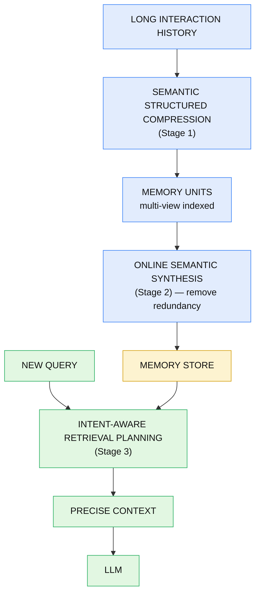
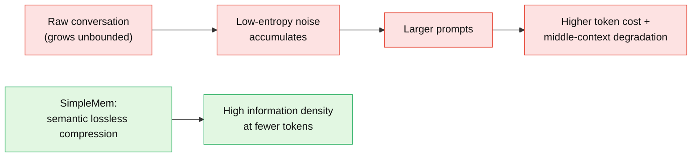
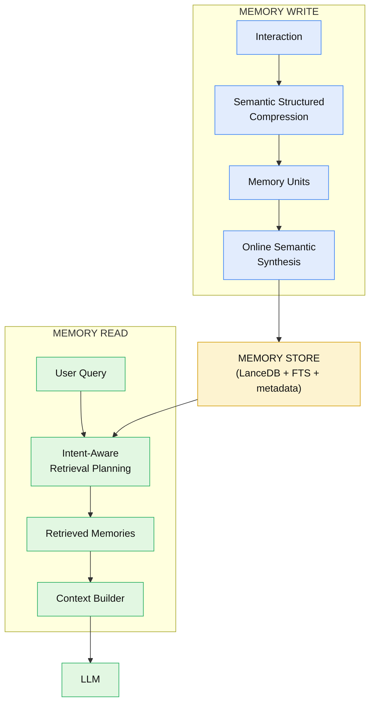
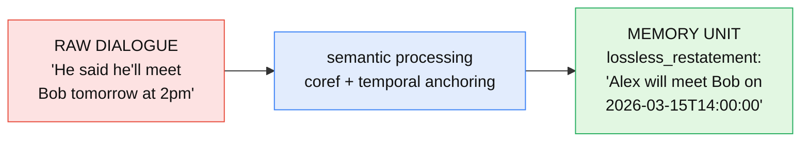
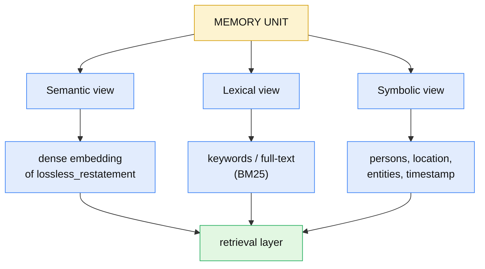
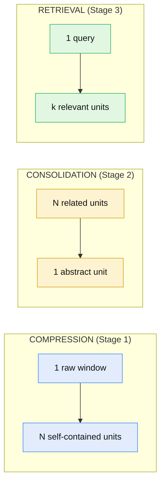
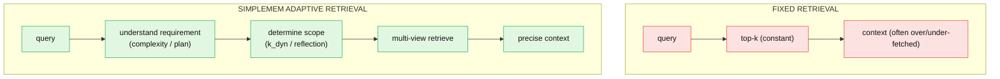
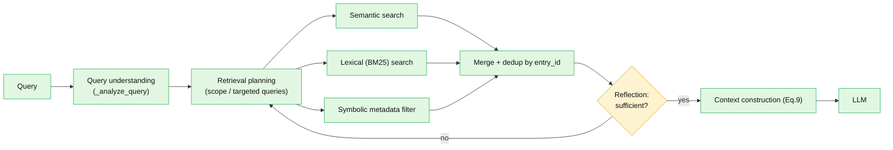
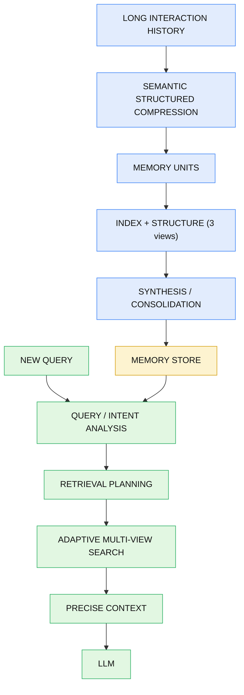

This is an engineering dissection of **SimpleMem** (Liu et al., arXiv:2601.02553) — a lifelong-memory framework for LLM agents built on **semantic lossless compression**. The focus is the *system*: how SimpleMem turns long, redundant interaction history into compact, structured, multi-view-indexed memory units, synthesizes related memories to kill redundancy, and then retrieves *only* what a new query needs — reporting **+26.4% average F1** over the strongest baseline on LoCoMo while cutting inference-time tokens **up to 30×**. **[Paper]**

The code is open at **[https://github.com/aiming-lab/SimpleMem](https://github.com/aiming-lab/SimpleMem)**, and this article connects each paper concept to the *actual released implementation* — including the places where the shipped engine and the paper's formalism differ.

**Attribution convention.** Every non-obvious claim is tagged:

- **[Paper]** — stated in the paper (extracted from the arXiv HTML; a few exact numbers are worth a final spot-check against the PDF).
- **[Code]** — verified in the released repository `aiming-lab/SimpleMem`.
- **[Interpretation]** — my engineering reasoning, written for the reader.
- **[Paper vs Code]** — a genuine divergence between the paper's description and the shipped engine; both are reported, neither is hidden.

This is not a "how RAG works" article. The central question throughout is the paper's own: **how do you convert long, redundant interaction history into a compact, semantically useful memory representation, and then retrieve only what the current query requires?** **[Interpretation]**

---

## The Central Reframing

SimpleMem is neither a vector database nor a summarizer. Its engineering value is a **pipeline** in which interaction history is transformed into compact structured memories, related memories are consolidated to remove redundancy, and retrieval scope is *dynamically chosen* so only the information required for the current query re-enters the model context. **[Interpretation]**



Two directions cross at the store: **write** (compress → structure → synthesize) and **read** (plan → retrieve → construct). Keep them separate — that separation is the spine of the whole article.

## I. The Memory Problem

An LLM agent in a long-running session accumulates history. There are two failing paradigms the paper positions against. **[Paper]**

**Full-history / passive context extension.** Keep everything and let the context window grow. During long-horizon interaction, "user inputs and model responses accumulate substantial low-entropy noise (e.g., repetitive logs, non-task-oriented dialogue)," which hurts retrieval and downstream reasoning ("middle-context degradation") and inflates cost. **[Paper]**

**Iterative-reasoning filtering.** Filter noise online via repeated reasoning cycles. This improves relevance but "rel[ies] on repeated inference cycles, resulting in substantial computational cost, including increased latency and token usage." **[Paper]**

The paper's framing: "neither paradigm achieves efficient allocation of memory and computation resources." **[Paper]**



The goal is not "store fewer tokens." It is **retain the useful semantic information at much higher information density** — *semantic lossless* compression: throw away the redundancy, keep the meaning. **[Paper]/[Interpretation]**

**What you should be able to explain:** *Why is storing full conversation history inefficient? Why is iterative-reasoning filtering also expensive? What does "semantic lossless compression" mean, and how is it different from "store fewer tokens"?*

## II. SimpleMem Architecture — Three Stages

SimpleMem is "a three-stage pipeline designed to maximize information density and token utilization." **[Paper]**

1. **Semantic Structured Compression** — distill unstructured interactions into compact, multi-view indexed memory units.
2. **Online Semantic Synthesis** — an *intra-session* process that integrates related context into unified abstract representations to eliminate redundancy.
3. **Intent-Aware Retrieval Planning** — infer search intent to dynamically determine retrieval scope and construct precise context.

> **A note on naming.** The paper uses slightly different labels in different places: Stage 2 also appears as "Recursive Consolidation," and Stage 3 as "Adaptive Query-Aware Retrieval." I use the abstract's names as canonical. **[Paper]**



**Code map** — the three stages land in the core `simplemem/` package: **[Code]**

| Stage | File / class | Key methods |
|---|---|---|
| 1. Compression | `simplemem/core/memory_builder.py` · `MemoryBuilder` | `_generate_memory_entries`, `_build_extraction_prompt`, `_parse_llm_response` |
| 2. Synthesis | same class | `process_window`, `process_remaining`, `_process_windows_parallel` |
| 3. Retrieval | `simplemem/core/hybrid_retriever.py` · `HybridRetriever` | `retrieve`, `_retrieve_with_planning`, `_analyze_query` |

**What you should be able to explain:** *Name the three stages and what each produces. Which are "write-side" and which is "read-side"?*

## III. Stage 1 — Semantic Structured Compression

Raw dialogue is chopped into **overlapping sliding windows**; each window is passed to an LLM that extracts self-contained, normalized **memory units**. **[Paper]/[Code]** Two normalization steps make units retrieval-friendly:

- **Coreference resolution** — pronouns → explicit entity names.
- **Temporal anchoring** — relative time ("tomorrow", "next Friday") → absolute ISO-8601 timestamps.

Before/after, the canonical example:



Three distinct things happen here — keep them separate: **[Interpretation]**

- **Compression** — drop conversational filler and low-entropy noise.
- **Information preservation** — the *meaning* survives ("semantic lossless").
- **Structural normalization** — coref + absolute time make each unit self-contained.

### The paper's formalism

The paper frames the window filter with an **entropy-aware gating** score (Eq. 1) and a segment/discard decision (Eq. 2): **[Paper]**

$$
H(W_t) = \alpha \cdot \frac{|\mathcal{E}_{new}|}{|W_t|} + (1-\alpha)\cdot\bigl(1-\cos(E(W_t),E(H_{prev}))\bigr)
$$

- $H(W_t)$ — information density of window $W_t$.
- $|\mathcal{E}_{new}|$ — count of *novel* named entities in the window; $|W_t|$ — window length.
- $E(\cdot)$ — semantic embedding function; $H_{prev}$ — embedding of prior history.
- $\alpha$ — balances entity-level novelty against semantic divergence from what's already known.

Intuitively: a window scores high when it introduces new entities *and* diverges from prior context — i.e. it carries new information. Low-scoring (redundant) windows are dropped:

$$
\text{Action}(W_t)=\begin{cases}\text{Segment}(W_t), & H(W_t)\ge \tau_{redundant}\\[4pt] \varnothing, & \text{otherwise}\end{cases}
$$

with redundancy threshold $\tau_{redundant}$ (paper: $\tau = 0.35$). **[Paper]** Extraction itself is the composite transform (Eq. 3):

$$
m_k = \mathcal{F}_\theta(W_t) = \Phi_{time}\circ\Phi_{coref}\circ\Phi_{extract}(W_t)
$$

where $\Phi_{extract}, \Phi_{coref}, \Phi_{time}$ are the extraction, coreference, and temporal-anchoring modules. **[Paper]**

### The memory unit schema

This is where paper and code diverge — I report both. **[Paper vs Code]**

**Paper's stated fields:** `content`, `entities`, `topic`, `timestamp`, `salience` (an "information importance level"). **[Paper]**

**Code's actual `MemoryEntry`** (`simplemem/core/models/memory_entry.py`, a Pydantic model): **[Code]**

```python
class MemoryEntry(BaseModel):
    entry_id: str = Field(default_factory=lambda: str(uuid.uuid4()))
    lossless_restatement: str          # self-contained fact: no pronouns, absolute time
    keywords: List[str] = []           # for lexical / BM25-style matching
    timestamp: Optional[str] = None    # ISO 8601 YYYY-MM-DDTHH:MM:SS
    location: Optional[str] = None
    persons: List[str] = []
    entities: List[str] = []
    topic: Optional[str] = None
```

The mapping: paper's `content` = code's **`lossless_restatement`**; both have `entities`, `topic`, `timestamp`. The code adds `keywords`, `persons`, `location`, `entry_id`. Notably, **the paper's `salience` field has no counterpart in the shipped core `MemoryEntry`** — treat "salience" as paper-described, not code-verified. **[Paper vs Code]**

The extraction prompt (`_build_extraction_prompt`) is strict: it *"Absolutely PROHIBIT[s] using pronouns (he, she, it, they, this, that) and relative time (yesterday, today, last week, tomorrow)"*, requires absolute ISO-8601 timestamps, and demands each `lossless_restatement` be a *"complete, independent, understandable sentence."* The LLM call runs at `temperature=0.1` with JSON output and up to 3 parse retries. **[Code]**

**What you should be able to explain:** *What is a memory unit, and why store structured units instead of raw dialogue? What do coreference resolution and temporal anchoring buy you at retrieval time? Which schema field is paper-only?*

## IV. Multi-View Memory Indexing

Each memory unit is indexed under **three complementary views** (Eq. 4) — not one "vector search." **[Paper]**

$$
\mathbb{M}(m_k)=\begin{cases}\mathbf{v}_k=E_{dense}(S_k)\in\mathbb{R}^d & \text{(Semantic)}\\[3pt] \mathbf{h}_k=\text{Sparse}(S_k)\in\mathbb{R}^{|V|} & \text{(Lexical)}\\[3pt] \mathcal{R}_k=\{(key,val)\} & \text{(Symbolic)}\end{cases}
$$

- $\mathbf{v}_k$ — dense embedding of the unit text $S_k$ (dimension $d$).
- $\mathbf{h}_k$ — sparse lexical vector over vocabulary $V$.
- $\mathcal{R}_k$ — symbolic metadata key-value set.



| View | Represents | Good for | Backed by |
|---|---|---|---|
| **Semantic** | meaning / paraphrase | "what did I say about my travel plans?" | dense embedding of `lossless_restatement` |
| **Lexical** | exact tokens | rare names, IDs, exact keywords | `keywords` / full-text index |
| **Symbolic** | structured facts | "events in March involving Bob" | `persons`, `location`, `entities`, `timestamp` |

They are complementary: semantic catches paraphrase but blurs exact tokens; lexical nails exact terms but misses synonyms; symbolic enforces hard constraints (who/when/where) that neither similarity handles well. **[Interpretation]**

**Paper vs Code on the backends:** the paper describes the dense view as `text-embedding-3-small` (1536-d) and lexical as "BM25"; the released code uses a **local `sentence-transformers` model, default `Qwen/Qwen3-Embedding-0.6B` (1024-d)**, and implements lexical search as **LanceDB full-text search over Tantivy** (`create_fts_index("lossless_restatement", use_tantivy=True, tokenizer_name="en_stem")`), which is a BM25-family scorer. **[Paper vs Code]**

**What you should be able to explain:** *Why three views instead of one vector index? Give a query each view wins on. What backs each view in the shipped code?*

## V. Memory Storage

**Paper:** a vector DB (LanceDB with IVF-PQ indexing) plus a SQL-based symbolic metadata store. **[Paper]**
**Code:** a `VectorStore` facade (`database/vector_store.py`) over a `LanceDBVectorStoreBackend` (`database/vector_store_backend.py`), storing vectors as `pyarrow.list_(float32, dim)`; the same LanceDB table carries the metadata columns and the Tantivy FTS index. Config: `LANCEDB_PATH="./lancedb_data"`, `MEMORY_TABLE_NAME="memory_entries"`. **[Code]**

The facade's surface is small and is exactly the read/write contract for everything else: **[Code]**

```python
def add_entries(self, entries: List[MemoryEntry]) -> None
def semantic_search(self, query: str, top_k: int = 5)
def keyword_search(self, keywords: List[str], top_k: int = 3)
def structured_search(self, persons=None, timestamp_range=None,
                      location=None, entities=None, top_k=None)
```

Each `MemoryEntry` is identified by its `entry_id` (UUID); the three views are all columns/indexes on the same row, so a retrieved hit from *any* view resolves to the same unit and can be de-duplicated by `entry_id`. **[Code]**

**What you should be able to explain:** *What is stored per memory unit, how is a unit identified, and how do the three views share storage?*

## VI. Stage 2 — Online Semantic Synthesis / Consolidation

This is the stage where **paper and code diverge most**, so I separate them cleanly. **[Paper vs Code]**

### The paper's mechanism

Synthesis runs "asynchronously as a background process" (intra-session). Pairwise **affinity** between units combines semantic similarity and temporal proximity (Eq. 5): **[Paper]**

$$
\omega_{ij}=\beta\cdot\cos(\mathbf{v}_i,\mathbf{v}_j)+(1-\beta)\cdot e^{-\lambda|t_i-t_j|}
$$

- $\omega_{ij}$ — affinity between units $i$ and $j$; $\mathbf{v}_i,\mathbf{v}_j$ — their dense embeddings; $t_i,t_j$ — timestamps.
- $\beta$ — weights semantic vs. temporal; $\lambda$ — temporal decay (paper: $\lambda = 0.1$). Two memories that are *both* semantically similar and close in time score highest.

When units form a **dense cluster** $\mathcal{C}$ (affinities above $\tau_{cluster}=0.85$), a synthesis function abstracts them (Eq. 6): **[Paper]**

$$
M_{abs}=\mathcal{G}_{syn}(\{m_i\mid m_i\in\mathcal{C}\})
$$

The cluster's fine-grained entries are archived (still recoverable) while the active index holds the compact abstract $M_{abs}$. The paper describes this as **recursive** — related units are "recursively integrated into higher-level abstract representations."

> **Recursion caveat:** the paper says "recursively," but I could not confirm it defines more than two levels (original units + consolidated abstracts). Treat "arbitrarily deep recursion" as unconfirmed. **[Paper]**

Concrete example (consistent with the paper's redundancy-elimination intent): **[Interpretation]**

```
Memory 1: User prefers X.
Memory 2: User selected X again.        →  Consolidated: "User consistently
Memory 3: User rejected Y in favor of X.     prefers X over Y."
```

### What the shipped core actually does

In the released **core** package, there is **no separate clustering/consolidation function**. Synthesis is realized as **windowed extraction with previous-entry dedup**: as each sliding window is processed (`process_window`, `_process_windows_parallel`), the prior entries' `lossless_restatement` values are injected into the extraction prompt under a header `[Previous Window Memory Entries (for reference to avoid duplication)]`, so the LLM **merges/deduplicates related context at construction time** rather than in a background clustering pass. A dedicated `consolidator.py` exists only in the *separate* `evolver/` (EvolveMem) and `cross/` subsystems — not in the core three-stage path. **[Code]**

So the paper's Eqs. 5–6 describe the *conceptual* consolidation; the core engine achieves the same redundancy-elimination goal through prompt-level dedup during windowed extraction. Both aim at the same outcome — a compact active index — via different mechanisms. **[Paper vs Code]/[Interpretation]**

**What you should be able to explain:** *What triggers consolidation in the paper (affinity + cluster threshold)? How does the shipped core achieve redundancy elimination instead? Why is consolidation different from compression?*

## VII. Compression vs Consolidation vs Retrieval

Three operations, constantly confused — the paper (and code) keep them distinct, and so must you: **[Interpretation]**



- **Compression** turns *one noisy window* into *several clean units* (structure ↑, noise ↓).
- **Consolidation** turns *several related units* into *one abstract unit* (redundancy ↓).
- **Retrieval** turns *one query* into *the few units it needs* (precision ↑).

Compression and consolidation are **write-side**; retrieval is **read-side**. They never share code paths. **[Interpretation]**

## VIII. Stage 3 — Intent-Aware / Adaptive Retrieval

A query does **not** get a fixed top-k. Retrieval scope is chosen from the query. Again, paper formalism first, then shipped code. **[Paper vs Code]**

### The paper's mechanism

The paper's proxy for "intent" is **query complexity** $C_q \in [0,1]$, predicted by a lightweight classifier (gpt-4o-mini) from "query features such as length, syntactic structure, and abstraction level." It is a binary taxonomy: **LOW** ($C_q\to0$, direct single-unit fact lookup) vs **HIGH** ($C_q\to1$, multi-step reasoning / temporal comparison / pattern synthesis). **[Paper]**

Hybrid relevance across the three views (Eq. 7): **[Paper]**

$$
\mathcal{S}(q,m_k)=\lambda_1\cos(\mathbf{e}_q,\mathbf{v}_k)+\lambda_2\,\text{BM25}(q_{lex},S_k)+\gamma\,\mathbb{I}(\mathcal{R}_k\models\mathcal{C}_{meta})
$$

- $\mathbf{e}_q$ — query embedding; $q_{lex}$ — lexical query form; $\mathcal{C}_{meta}$ — metadata constraints.
- $\mathbb{I}(\cdot)$ — indicator: 1 if the unit's metadata satisfies the constraints.
- $\lambda_1,\lambda_2,\gamma$ — weights for the semantic, lexical, and symbolic signals.

Dynamic retrieval depth scales with complexity (Eq. 8):

$$
k_{dyn}=\lfloor k_{base}\cdot(1+\delta\cdot C_q)\rfloor
$$

so a simple query pulls few units, a complex one expands toward $k_{max}$ (paper range $k\in[3,20]$). Final context is the concatenation of the top-$k_{dyn}$ units with their timestamps (Eq. 9):

$$
\mathcal{C}_{final}=\bigoplus_{m\in\text{Top-}k_{dyn}(\mathcal{S})}[t_m:\text{Content}(m)]
$$

### What the shipped code actually does

`HybridRetriever` implements planning + parallel search + reflection: **[Code]**

- **Planning:** `_analyze_information_requirements(query)`, `_generate_targeted_queries(...)`, `_analyze_query(query)` (an LLM extracts keywords / persons / time_expression / location / entities as JSON).
- **Parallel multi-view search** via a `ThreadPoolExecutor`: `_semantic_search` (LanceDB cosine), `_keyword_search` (Tantivy BM25), `_structured_search` (metadata filter; `_parse_time_range` uses `dateparser`).
- **Fusion:** `_merge_and_deduplicate` dedups by `entry_id` with a fixed **priority order structured > semantic > keyword** — *not* the learned weighted sum of Eq. 7. **[Paper vs Code]**
- **Reflection loop** (default `MAX_REFLECTION_ROUNDS=2`): `_check_answer_adequacy` returns `"sufficient" / "insufficient" / "no_results"`; if insufficient, `_generate_missing_info_queries` issues more searches. This iterative-completeness loop is a code feature not captured by Eqs. 7–9. **[Code]**

So: the paper models scope selection as a closed-form complexity→depth function with weighted fusion; the code uses **LLM planning + priority-merge + a bounded reflection loop**. Same objective (retrieve exactly what's needed), different machinery. **[Paper vs Code]/[Interpretation]**

**What you should be able to explain:** *Why should retrieval scope depend on the query? What is $C_q$ and how does it set $k_{dyn}$ in the paper? How does the shipped `HybridRetriever` decide scope instead, and what is the reflection loop?*

## IX. Fixed vs Adaptive Retrieval



Fixed top-k either **over-fetches** (wastes tokens, adds noise) on a simple query or **under-fetches** (misses evidence) on a complex one. Adaptive scope is where SimpleMem's **token efficiency** comes from: a "hi, what's my name?" query pulls a handful of units; a multi-hop temporal question expands. This directly serves the paper's efficiency objective — fewer, more relevant tokens back into the model. **[Paper]/[Interpretation]**

**What you should be able to explain:** *Why isn't fixed top-k always sufficient? Where does SimpleMem's token efficiency come from?*

## X. The Complete Write and Read Pipelines

**Write** — the lifecycle of a memory unit: **[Paper]/[Code]**


**Read** — query to context: **[Paper]/[Code]**



For each read step — *what enters → what happens → what leaves → why*: **[Interpretation]**

| Step | Enters | Happens | Leaves | Why |
|---|---|---|---|---|
| Query understanding | raw query | LLM extracts keywords/persons/time/entities | structured query analysis | to drive all three views |
| Planning | query analysis | scope + targeted sub-queries | search plan | avoid over/under-fetch |
| Multi-view search | plan | parallel semantic + BM25 + metadata | candidate hits | complementary recall |
| Merge/dedup | candidates | dedup by `entry_id`, priority order | ranked units | one unit per hit |
| Reflection | ranked units | adequacy check | more searches or stop | fill gaps, bound cost |
| Context construction | final units | concat `[timestamp: content]` | precise context | minimal tokens to LLM |

**What you should be able to explain:** *Trace a memory unit through the write pipeline, and a query through the read pipeline. Where do the two pipelines meet?*

## XI. End-to-End Execution Trace

One concrete pass, with actual intermediate representations. **[Educational — illustrative data, faithful to the pipeline]/[Code]**

**1. Raw dialogue** (session turn):
```
[2026-03-14 09:00] Alex: I'm thinking of going with the Kyoto trip. Bob suggested Osaka but I passed.
```

**2. Compression → `MemoryEntry`** (Stage 1 output):
```json
{
  "entry_id": "b1f0...c7",
  "lossless_restatement": "Alex chose the Kyoto trip and declined Bob's suggestion of Osaka on 2026-03-14.",
  "keywords": ["Kyoto", "Osaka", "trip", "declined"],
  "timestamp": "2026-03-14T09:00:00",
  "location": "Kyoto",
  "persons": ["Alex", "Bob"],
  "entities": ["Kyoto trip", "Osaka"],
  "topic": "travel planning"
}
```
Note: pronouns gone, time absolute, self-contained — exactly what the extraction prompt enforces. **[Code]**

**3. Synthesis (Stage 2):** if earlier units already said *"Alex prefers Kyoto"*, the windowed dedup context prevents a near-duplicate and the abstract trends toward *"Alex consistently prefers Kyoto over Osaka."* **[Code]/[Interpretation]**

**4. Later query:**
```
"Where did I decide to travel, and whose suggestion did I turn down?"
```

**5. Query analysis (Stage 3):**
```json
{ "keywords": ["travel", "decide", "turn down", "suggestion"],
  "persons": [], "entities": [], "time_expression": null }
```
This is a multi-hop question (decision + rejected alternative) → planning expands scope. **[Paper]/[Code]**

**6. Multi-view retrieval + merge:** semantic view matches the paraphrase; symbolic view is loose (no explicit person/time constraint); the merged, deduped top unit is the Kyoto/Osaka entry. Reflection checks adequacy → sufficient. **[Code]**

**7. Context construction (Eq. 9) → LLM:**
```
[2026-03-14T09:00:00: Alex chose the Kyoto trip and declined Bob's suggestion of Osaka.]
```
The model answers "Kyoto; you turned down Bob's Osaka suggestion" from a **single ~20-token** memory instead of the full conversation — the 30× token story in miniature. **[Interpretation]**

**What you should be able to explain:** *Walk one conversation turn to a stored unit, then one later query to the exact context the LLM sees. Where did the token savings come from?*

## XII. Evaluation

**Benchmark:** LoCoMo — 1,986 questions across four reasoning types (Multi-Hop, Temporal, Open-Domain, Single-Hop), conversations of 200–400 turns; "LoCoMo-10" subset for efficiency analysis. **[Paper]**
**Metrics:** F1 (primary), BLEU-1, and Token Cost (tokens/query) plus timing. **[Paper]**
**Baselines:** LoCoMo, ReadAgent, MemoryBank, MemGPT, A-Mem, LightMem, Mem0. **[Paper]**

Main results (Table 1, base LLM GPT-4.1-mini) — F1 by category and cost: **[Paper]**

| Method | Multi-Hop | Temporal | Open-Dom | Single-Hop | Avg F1 | Token Cost |
|---|---|---|---|---|---|---|
| LoCoMo (full ctx) | 25.02 | 12.04 | 19.05 | 18.68 | 18.70 | 16,910 |
| MemGPT | 17.72 | 19.44 | 11.29 | 25.59 | 18.51 | 16,977 |
| A-Mem | 25.06 | 51.01 | 13.22 | 41.02 | 32.58 | 2,520 |
| LightMem | 24.96 | 20.55 | 19.21 | 33.79 | 24.63 | 612 |
| Mem0 | 30.14 | 48.91 | 16.43 | 41.30 | 34.20 | 973 |
| **SimpleMem** | **43.46** | **58.62** | **19.76** | **51.12** | **43.24** | **531** |

The two headline numbers, and where they come from: **[Paper]/[Interpretation]**

- **+26.4% F1 over Mem0**: $(43.24 - 34.20)/34.20 = 26.4\%$. ✓
- **~30× fewer tokens**: full-context ≈ 16,910 tokens/query vs SimpleMem ≈ 531 → $16910/531 \approx 31.8\times$, reported as "up to 30×." ✓

SimpleMem is simultaneously the **most accurate** and the **second-cheapest** method (only ReadAgent/MemoryBank are cheaper, at far lower F1) — the "superior balance" the paper claims. **[Paper]/[Interpretation]**

**What you should be able to explain:** *What is LoCoMo, what metrics matter, and how are the +26.4% and 30× figures derived? Why is "accuracy AND cost" the real result?*

## XIII. Ablations

Each stage removed, effect on Avg F1 (Table 4, GPT-4.1-mini; full SimpleMem = 43.24): **[Paper]**

| Removed | Avg F1 | Δ | Hurts most |
|---|---|---|---|
| w/o Atomization (Stage 1 compression) | 31.29 | ↓27.6% | Temporal (↓56.7%) |
| w/o Consolidation (Stage 2) | 38.24 | ↓11.6% | Multi-Hop (↓31.3%) |
| w/o Adaptive Pruning (Stage 3) | 37.78 | ↓12.6% | Open-Domain (↓26.6%) |

Read back to the architecture: **[Paper]/[Interpretation]**

- **Compression** matters most for **temporal** reasoning — because temporal anchoring (relative → absolute ISO time) is what makes time-based questions answerable.
- **Consolidation** matters most for **multi-hop** — merging related facts is what lets a single retrieved abstract span a chain.
- **Adaptive retrieval** matters most for **open-domain** — where scope selection decides whether the right broad evidence is pulled.

Each ablation validates *why its stage exists*. Don't over-read causality beyond these deltas. **[Interpretation]**

**What you should be able to explain:** *Which stage, when removed, hurts which reasoning type — and why does that make architectural sense?*

## XIV. Engineering Implementation — Source Map

Paper concept → section/equation → engineering interpretation → source. **[Code]**

| Concept | Paper | Interpretation | Source (file · symbol) |
|---|---|---|---|
| Windowing + gating | §Stage 1, Eq.1–2 | drop low-info windows | `memory_builder.py` · `process_window`, `_process_windows_parallel` |
| Unit extraction | Eq.3 | coref + absolute time via prompt | `memory_builder.py` · `_generate_memory_entries`, `_build_extraction_prompt` |
| Memory unit | schema | structured, multi-view | `models/memory_entry.py` · `MemoryEntry` |
| Multi-view index | Eq.4 | dense + FTS + metadata columns | `database/vector_store_backend.py` · `LanceDBVectorStoreBackend` |
| Embeddings | dense view | local Qwen3 (code) | `utils/embedding.py` · `EmbeddingModel` |
| Synthesis | Eq.5–6 | prompt-level dedup (core) | `memory_builder.py` (previous-entry context) |
| Query analysis / plan | §Stage 3 | LLM extracts constraints | `hybrid_retriever.py` · `_analyze_query`, `_analyze_information_requirements` |
| Hybrid search | Eq.7 | parallel 3-view + priority merge | `hybrid_retriever.py` · `_semantic_search`, `_keyword_search`, `_structured_search`, `_merge_and_deduplicate` |
| Adaptive scope | Eq.8 | planning + reflection loop | `hybrid_retriever.py` · `_retrieve_with_planning`, `_check_answer_adequacy` |
| Context build | Eq.9 | concat ranked units | `hybrid_retriever.py` / `answer_generator.py` |

**Stack (code-verified):** LanceDB `0.25.3` + Tantivy FTS for storage/lexical; `sentence-transformers 5.1.1` (default `Qwen/Qwen3-Embedding-0.6B`, dim 1024) for embeddings; OpenAI-compatible `LLMClient` (default `gpt-4.1-mini`); Pydantic models; `ThreadPoolExecutor` for parallel windows/searches. **[Code]** I have **not** invented any class, function, or field name; every symbol above is from the repo, and every paper/code divergence is flagged inline. **[Interpretation]**

**What you should be able to explain:** *Given a stage, name the file and function that implements it, and whether it follows the paper's equation or a pragmatic variant.*

## XV. Distinctions to Keep Straight

The paper's value collapses if you blur these — so hold them apart: **[Interpretation]**

| | |
|---|---|
| **Raw history** | vs **Structured memory** (units) |
| **Compression** (window → units) | vs **Consolidation** (units → abstract) |
| **Memory write** (build) | vs **Memory read** (retrieve) |
| **Storage** (LanceDB rows) | vs **Retrieval** (search over them) |
| **Retrieval** (search) | vs **Retrieval planning** (scope/intent) |
| **Semantic / Lexical / Symbolic** | three *different* search signals |
| **Fixed top-k** | vs **Adaptive $k_{dyn}$ / reflection** |
| **Memory unit** | vs **Consolidated memory** |
| **Paper algorithm** (Eqs.1–9) | vs **Engineering implementation** (shipped variants) |

## XVI. The End-to-End Mental Model



**In one paragraph:** SimpleMem is not merely a vector database and not merely a summarizer. Its engineering value comes from treating long-term memory as a *pipeline*: interaction history is compressed into compact, structured, multi-view-indexed memory units (pronouns resolved, time absolute); related memories are synthesized to remove redundancy; and at query time the retrieval scope is chosen from the query's intent/complexity so that only the information required for the current question — retrieved across semantic, lexical, and symbolic views and merged into a precise context — is placed back into the model. That is what delivers higher accuracy *and* up to 30× fewer inference-time tokens at once. **[Paper]/[Interpretation]**

The code is open at **[https://github.com/aiming-lab/SimpleMem](https://github.com/aiming-lab/SimpleMem)**. This article is a companion to my [vLLM & PagedAttention](/engineering/vllm-pagedattention-efficient-memory-management-for-llm-serving/) and [TensorRT-LLM](/engineering/tensorrt-llm-inference-serving-engine-kv-cache-scheduling/) dissections — where those manage the *serving* memory wall, SimpleMem manages the *agent's* memory wall. **[Interpretation]**
