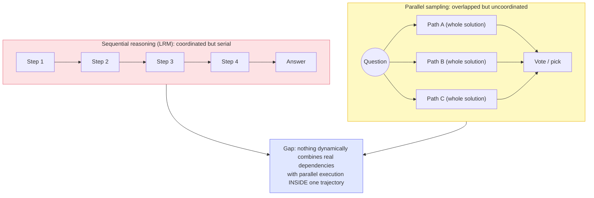
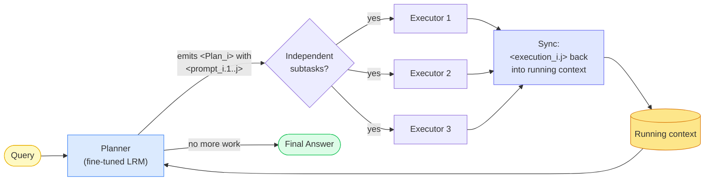
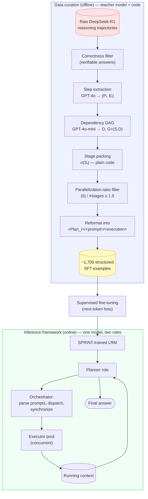
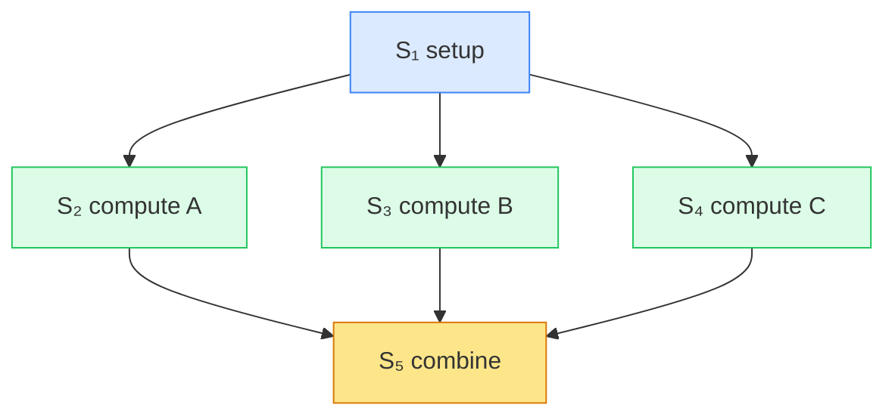
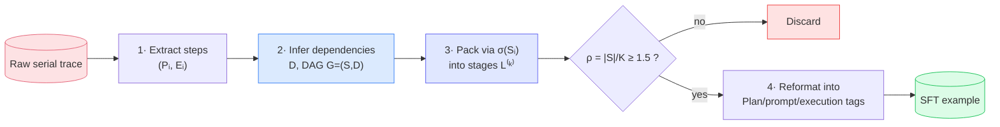
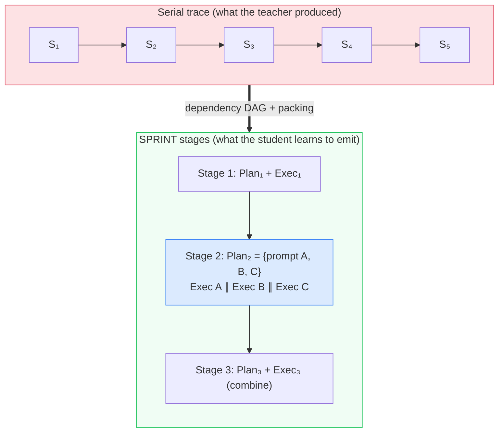
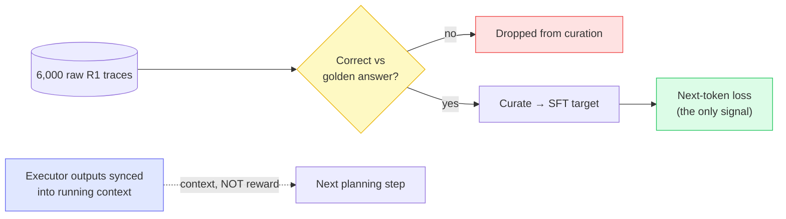
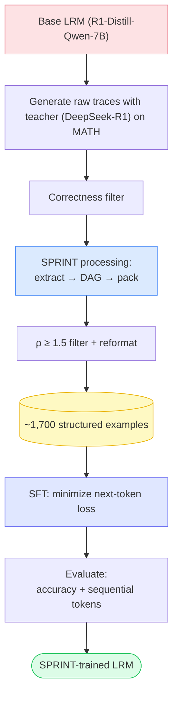
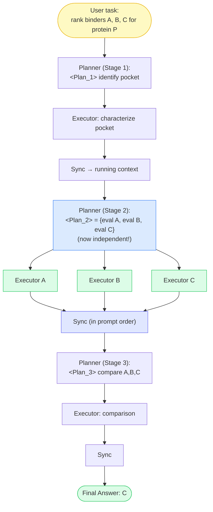

# SPRINT: Interleaved Planning and Parallelized Execution in Reasoning Models

A reasoning model earns its accuracy by writing a long scratchpad. It derives, checks, backtracks, and only then answers — and every token of that scratchpad is generated strictly left to right, each one conditioned on all the tokens before it. That is exactly the property that makes reasoning models slow: **wall-clock time to answer scales with the length of the sequential chain**, not with how much compute you own. Adding GPUs lets you run more requests; it cannot compress a chain of 20,000 dependent decoding steps into fewer steps.

But do all of those steps genuinely depend on each other? Often they do not. A model evaluating three independent cases, or checking several unrelated constraints, serializes them only because autoregressive decoding has no other gear. **SPRINT** is a training framework that gives the model that other gear: it teaches a reasoning model to *recognize which parts of its own reasoning are independent* and emit them as parallel subtasks, while keeping everything that has a real dependency in sequence.

This entry is an engineering breakdown of how you would actually build SPRINT: the inference orchestrator, the data-curation pipeline that manufactures the training set, the dependency DAG and stage-packing math, the (deliberately ordinary) training objective, and the module boundaries of a working system. The contribution is not a new optimizer or a new attention kernel — it is a **data transformation plus an orchestration loop** wrapped around a standard SFT run. That is the machinery we are here to reconstruct.

> **Scope and source discipline.** The mechanism — the interleaved planner/executor loop, step extraction into plan/execution phases, the dependency DAG, the stage-packing formula, the parallelization-ratio filter, and the SFT objective — is drawn from the SPRINT paper (Biju et al., 2025). The paper evaluates on **MATH-500, GPQA-Diamond, and Countdown**; the quoted numbers are from those experiments. A recurring **drug-discovery** example is used as an *applied* worked example — it is our framing of the mechanism, not a domain the paper trained or tested on, and it is labelled as such wherever it appears. Where the build needs a decision the paper does not specify, it is flagged as an **implementation choice**.

---

## 1. The Problem: Long-Horizon Reasoning Is Serialized by Default

Start with the shape of a normal multi-step reasoning agent. A task comes in, the model reasons, it may act, it observes, it reasons again, and eventually it commits to an outcome:

```text
Task
 ↓
LLM  ──►  Action  ──►  Environment  ──►  Observation
 ▲                                            │
 └────────────────  next reasoning step  ◄────┘
 ↓
Final Outcome
```

For a *reasoning* model the "action/observation" loop is often internal: the model's action is to write more of its own scratchpad, and its "observation" is the context it just extended. Either way the structural fact is the same — **the chain is walked one step at a time**, and each step waits for the one before it.

Three properties of long-horizon reasoning turn into the pain SPRINT attacks:

- **Longer traces reason better.** Letting a model write more is one of the most reliable ways to raise accuracy on hard problems. This is the entire premise of reasoning fine-tuning, so we cannot simply make traces shorter.
- **Longer traces cost more sequential decoding.** Every extra token of the scratchpad is another forward pass that cannot overlap with any other. Latency is paid in critical-path length.
- **Much of that serialization is an artifact.** Independent subtasks — three cases to evaluate, five candidates to screen — get forced into a single chain purely because generation is left-to-right, not because the problem requires it.

The two existing families of inference-time scaling each fix one half and break the other:

- **Sequential scaling** (the DeepSeek-R1 / o1 line) coordinates perfectly — every step sees all prior work — but serializes everything, so accuracy is bought with critical-path length.
- **Parallel scaling** (repeated sampling, self-consistency, best-of-N) overlaps beautifully in wall-clock time, but the paths are *uncoordinated*: each re-derives the same facts from scratch, so N paths cost N× compute and rarely deliver N× reasoning.

Structured methods like Tree-of-Thoughts and Graph-of-Thoughts sit in between, but they require a **predefined, hand-designed search structure** — the branching factor and evaluation function are properties of the harness, decided per task up front, not something the model discovers about the problem it was handed.



*Sequential methods coordinate perfectly but serialize everything; parallel methods overlap but coordinate poorly. The open question SPRINT answers: can a model, per problem, do both — branch where reasoning is independent, stay sequential where it isn't?*

The motivating question is therefore narrow and precise:

> **Do all reasoning steps actually need to happen sequentially — and can a model be trained to tell which ones don't?**

---

## 2. SPRINT: The Core Idea

**Intuitively:** SPRINT trains a reasoning model to work like a competent team lead instead of a lone worker. Faced with a problem, it first *plans* — reasons about what needs doing next. When it notices that several subtasks don't depend on one another, it doesn't grind through them one by one; it writes them down as separate assignments, hands them to a pool of workers who run them **at the same time**, waits for the results, folds them back into its notes, and plans the next move. Where a step genuinely needs an earlier result, it waits — exactly as a serial reasoner would.

In the authors' framing:

> SPRINT trains reasoning language models to **dynamically identify and exploit parallelization opportunities during inference**, achieving the accuracy of reasoning models while significantly reducing the number of *sequential* tokens needed to solve complex tasks.

Two words carry the weight. **Trains** — this lives in the weights, not in a prompt template or an external scaffold around a frozen model. **Dynamically** — the decomposition is produced per problem, mid-trajectory, which is precisely what the fixed structures of Tree-/Graph-of-Thoughts cannot do.

So a SPRINT trajectory interleaves two regimes:

- **Sequential planning** — the model reasons and decides what to do next, respecting real dependencies.
- **Parallel execution** — subtasks it has judged independent are dispatched and generated concurrently.

**Mechanically**, inference is a loop of *stages*. Each stage has three phases (this is the paper's Figure 1):



*High-level SPRINT inference loop. **Planner → parallel executors → sync → planner**, repeating until the planner produces the final answer. The planner and every executor are the **same** fine-tuned model playing different roles.*


*Figure 1 (SPRINT paper). One inference stage, three phases: **(1) Planning** — the planner reads the cumulative context and emits a `<Plan_i>` with one or more `<prompt_i.j>` subtasks (or terminates with the final answer). **(2) Parallel execution** — a pool of executors runs those prompts concurrently. **(3) Syncing** — the `<execution_i.j>` outputs are appended back into the running context, in prompt order, and control returns to the planner.*

How it differs from conventional multi-step RL / reasoning:

| Axis | Conventional serial LRM | SPRINT |
|---|---|---|
| Training method | RL or SFT on serial traces | **SFT on restructured serial traces** |
| Trajectory shape | one long left-to-right chain | interleaved sequential + parallel stages |
| Who decides the structure | decoding order (implicit) | the **model**, per problem, at inference |
| What is optimized | quality/length of the chain | reproducing a **parallelizable layout** |
| Latency lever | none (chain length is fixed) | shorten the **critical path**, not total work |

Why this helps training and inference: the parallel branches within a stage are **independent**, so an error in one cannot contaminate the others — the planner reconciles them afterward, which supplies a self-consistency-like diversity benefit *and* isolates errors. And because independent work moves off the critical path, the longest dependency chain the model must walk gets shorter — which is the quantity that determines latency.

---

## 3. SPRINT Architecture

SPRINT has two halves that must be kept distinct in your head, because they run at different times and use different machinery:

> **The curation pipeline builds the training data (offline, one time). The inference framework executes the learned behavior (online, per query).** Fine-tuning connects them.



*System boundaries. The teacher model (GPT-4o / GPT-4o-mini) and the packing code appear **only** in curation — never at inference. At serve time there is one model, an orchestrator, and a context store. Fine-tuning is the single bridge.*

Mapping the generic agent-RL skeleton onto SPRINT's actual components (using the paper's terminology):

| Generic stage | SPRINT component | Where |
|---|---|---|
| Task dataset | MATH training queries (→ R1 trajectories) | curation input |
| Agent / policy model | DeepSeek-R1-Distill-Qwen-7B (the LRM being trained) | training/inference |
| Agent runtime | the interleaved planner/executor **orchestrator** | inference |
| Reasoning / planning | the **planner** role emitting `<Plan_i>` | inference |
| Tool / environment | *(none in-paper — executors generate tokens; tool use is future work)* | — |
| Trajectory collection | DeepSeek-R1 produces raw reasoning traces | curation input |
| SPRINT processing | step extraction → DAG → packing → filter/reformat | curation |
| Training examples | ~1,700 structured plan/execution sequences | curation output |
| RL / policy optimization | **plain SFT** (no reward, no policy gradient) | training |
| Updated policy | the SPRINT-trained LRM | output |

The one row worth pausing on is *tool / environment*: **the paper's executors do not call tools** — they generate a chain-of-thought to accomplish a subtask. Parallel *tool* use (docking APIs, retrievers, ADMET predictors) is explicitly flagged as future work. If you build SPRINT with real tools, that is an extension, not the paper's system.

---

## 4. Trajectory Generation: Where the Raw Material Comes From

SPRINT does not collect "parallel reasoning" data — no teacher is ever prompted to reason in parallel. It starts from **ordinary long reasoning trajectories** and converts them into a parallel-aware format. So "trajectory generation" here means: run a strong reasoning model on a task and record its complete serial scratchpad.

```text
Task (a MATH problem Q)
 ↓
DeepSeek-R1 reasons (left-to-right chain-of-thought)
 ↓
line 1 … line 2 … "let's verify" … line 200: final answer
 ↓
Raw reasoning trajectory τ  (one long serial trace)
```

Formally, the paper works with the trace as a sequence of discrete reasoning **steps** rather than an RL state–action tuple. A trajectory $\tau$ for query $Q$ decomposes into

$$
S = \{S_1, S_2, \ldots, S_n\}, \qquad S_i = (P_i, E_i)
$$

where each step $S_i$ is split into a **planning phase** $P_i$ (the model deciding what to do — reframing the problem, naming a subtask, noting a constraint) and an **execution phase** $E_i$ (actually carrying that subtask out — the calculation or derivation). Some steps are **plan-only**: they have $E_i = \emptyset$ because there is nothing substantial to farm out.

What must be captured per step, and why:

- **$P_i$ — the plan text.** This is the part the planner will learn to emit and, when it names independent work, to *dispatch*.
- **$E_i$ — the execution text (or $\emptyset$).** This is the part an executor will learn to produce given a prompt. Empty for plan-only steps.
- **Order index $i$.** Dependencies can only point backward ($i < j$), so original order is needed to build a valid DAG.

In their experiment the scale is modest and worth internalizing: **6,000 DeepSeek-R1 trajectories on the MATH training set**, correctness-filtered and curated down to **~1,700** structured examples, used to fine-tune **DeepSeek-R1-Distill-Qwen-7B**.

> **Honest note on the word "trajectory."** SWiRL's trajectory is an *environment-interaction* sequence (tool call → observation → next action). SPRINT's raw trajectory is a *pure reasoning* trace with no environment. The `state → action → observation` loop from classical agent RL is **not** what SPRINT trains on — a point that matters when comparing the two methods (§14).

---

## 5. The SPRINT Data-Construction Process

This is the heart of the method. Raw serial reasoning goes in; a structured, parallelizable training example comes out. The pipeline (paper's Figure 2) is four stages after correctness filtering:

```text
Raw R1 trajectory
   ↓  (1) step extraction        — GPT-4o
Steps Sᵢ = (Pᵢ, Eᵢ), some plan-only
   ↓  (2) dependency DAG         — GPT-4o-mini
G = (S, D)
   ↓  (3) stage packing          — plain code (σ formula)
Stages L⁽¹⁾, L⁽²⁾, …
   ↓  (4) filter + reformat      — ratio ≥ 1.5, tag layout
Structured SFT example
```

![SPRINT training pipeline figure (paper Figure 2): five panels left to right — (0) a reasoning model's thinking trajectory shown as numbered lines from Query to Final Answer; (1) extraction of steps into Plan, prompt, and Execution line ranges; (2) a directed acyclic graph of the steps showing which depend on which; (3) the same steps packed into horizontal stages where independent steps share a row; (4) the packed, filtered, reformatted data being used to SFT the LRM into a SPRINT fine-tuned model](/assets/blogs/sprint/sprint-training-pipeline.png)

*Figure 2 (SPRINT paper). The curation pipeline. Notice the transformation in panels (2)→(3): the DAG's independent nodes (e.g. steps 2 and 4, or 3, 5 and 6) collapse into the **same stage**, while dependent nodes stay in separate rows. The parallel structure is read off the dependency graph, never off textual order.*

Let's walk it on a concrete multi-step example. Take a math-style trace (the paper's domain), then we mirror it with the drug-discovery application.

```text
Step 1 → Set up the problem; identify it needs three independent sub-quantities.
Step 2 → Compute quantity A.
Step 3 → Compute quantity B.
Step 4 → Compute quantity C.
Step 5 → Combine A, B, C into the result.
```

### Stage 1 — step extraction (GPT-4o)

An LLM reads the raw trace and splits each step into plan and execution:

```text
Step 2
  Plan (P₂):      "Compute quantity A."
  Execution (E₂): [the arithmetic / derivation for A]
```

Two curation rules matter here. First, **plan-only steps** (deciding, reframing) carry no executor call — they stay entirely on the planner side. Second, **very short executions are merged back into their plan**, becoming plan-only, so the planner handles trivial work itself instead of paying dispatch overhead to farm out one line.

### Stage 2 — dependency DAG (GPT-4o-mini)

A separate, smaller model is asked which steps depend on which. Dependencies are the edge set

$$
D = \{(S_i, S_j) \mid S_j \text{ depends on } S_i,\; i < j,\; S_i, S_j \in S\}
$$

forming a directed acyclic graph $G = (S, D)$. For our example:



The load-bearing discipline: **you establish dependencies first, and parallelism falls out as a consequence.** Textual adjacency is *not* independence — three consecutive steps could equally be a chain where each refines the last. S₂/S₃/S₄ are parallel only because the DAG has no edges among them.

### Stage 3 — pack the DAG into stages

Now group steps into stages such that everything in a stage can be planned together and executed concurrently. The paper defines a **stage number** $\sigma(S_i)$ for each step $S_i = (P_i, E_i)$:

$$
\sigma(S_i) =
\begin{cases}
1, & \text{if } S_i \text{ has no parents} \\[4pt]
\displaystyle\max_{S_p \in \text{Parents}(S_i)} \big(\sigma(S_p) + \mathbb{1}(E_p \neq \emptyset)\big), & \text{otherwise}
\end{cases}
$$

Read it carefully — the indicator $\mathbb{1}(E_p \neq \emptyset)$ is the clever part:

- A step with no parents lands in stage 1.
- Otherwise its stage is the max over its parents of *the parent's stage plus one — but only if the parent actually executed something*. If a parent $S_p$ is **plan-only** ($E_p = \emptyset$), you do **not** advance the stage. A plan-only parent produces no executor output to wait on, so its child can safely sit in the *same* stage. This is the "plan-only parent" optimization: it both guarantees the child has the context it needs and packs the schedule tighter.

The set of steps at stage $k$ is

$$
\mathcal{L}^{(k)} = \{S_i \in S \mid \sigma(S_i) = k\}
$$

Within a stage, the **combined plan** concatenates the plans (in original order) and the **execution set** collects every non-empty execution:

$$
\mathcal{P}^{(k)} = \text{concat}\big(P_i \mid S_i \in \mathcal{L}^{(k)}\big), \qquad
\mathcal{E}^{(k)} = \{E_i \mid S_i \in \mathcal{L}^{(k)},\; E_i \neq \emptyset\}
$$

Our five steps collapse from a chain of length 5 into a **critical path of length 3**:

```text
Stage 1:  S₁                       (setup)
Stage 2:  S₂ , S₃ , S₄   ← parallel (compute A, B, C together)
Stage 3:  S₅                       (combine)
```

That compression — five serial steps into a three-deep critical path — *is* the entire source of SPRINT's latency win. No work was removed; work was moved off the critical path.

### Stage 4 — filter and reformat

Not every trajectory is worth keeping. The **parallelization ratio**

$$
\rho = \frac{\#\text{reasoning steps}}{\#\text{stages}} = \frac{|S|}{K}
$$

must be **at least 1.5**, or the example is discarded. A pure chain scores $\rho = 1.0$ and teaches nothing about parallelism; our example scores $5/3 \approx 1.67$ and survives. (The paper's seven-step / four-stage illustration scores $1.75$.)

Survivors are reformatted into the tagged layout the model will learn to produce:

```text
<query> … </query>

<Plan_1> Set up the problem and identify the sub-quantities. </Plan_1>
<execution_1.1> … </execution_1.1>

<Plan_2>
  <prompt_2.1> Compute quantity A. </prompt_2.1>
  <prompt_2.2> Compute quantity B. </prompt_2.2>
  <prompt_2.3> Compute quantity C. </prompt_2.3>
</Plan_2>
<execution_2.1> [result A] </execution_2.1>
<execution_2.2> [result B] </execution_2.2>
<execution_2.3> [result C] </execution_2.3>

<Plan_3> Combine A, B, C into the final result. </Plan_3>
<execution_3.1> [combination] </execution_3.1>

<Final Answer> … </Final Answer>
```

The whole sequence is the training target — the model must learn *when to open a plan block, how many prompts to put in it, and when to stop and wait for results.*



> **Applied mirror (drug discovery, our framing).** The identical pipeline on *"given protein P and candidates A, B, C, find the strongest binder"*: setup + binding-pocket identification (Stage 1) → evaluate A, B, C against the pocket in parallel (Stage 2) → compare (Stage 3) → investigate the winner (Stage 4). The DAG is what encodes "A, B, C are independent, but *comparing* them must wait for all three." Same mechanism, scientific workload.

---

## 6. Step-Wise / Multi-Step Learning: What the Model Actually Internalizes

Make the relationships explicit, because "parallel reasoning" is easy to over-read:

| Concept | In SPRINT |
|---|---|
| **Task** | the query $Q$ |
| **Trajectory** | the full stage sequence: $Q \to (\mathcal{P}^{(1)}, \mathcal{E}^{(1)}) \to \cdots \to$ answer |
| **Intermediate state** | the **running context**: query + all prior plans + all prior executions |
| **Action (planner)** | emit `<Plan_i>` containing one or more `<prompt_i.j>` |
| **Action (executor)** | produce `<execution_i.j>` for one prompt, given the context snapshot |
| **Feedback** | synchronization: executor outputs appended back in prompt order |
| **Training unit** | the **stage** — a combined plan plus its concurrent executions |

The training unit is the **stage**, and that is the whole design move. A stage bundles a plan (which may assert "these $j$ subtasks are independent") with the executions that plan spawned. A plan block holding three sibling prompts *is a learned assertion that those three subtasks can run concurrently* — there is no separate `PARALLELIZE_THIS` label anywhere. **The supervision signal is format.** Ordinary SFT on the tagged layout teaches the branching behavior.



Why this representation improves long-horizon learning: because the states in the training set are drawn from real trajectories that *had to go somewhere*, learning to produce good local stage structure across that distribution also improves global behavior. And critically, packing is what makes the trace's critical path short — the model isn't just imitating text, it is imitating a text whose *shape* encodes parallelism. One clarification that avoids a common misread: this is **one policy** emitting a structured sequence, not a separate model per stage. "Planner" and "executor" are roles the single fine-tuned model plays, not distinct trained artifacts.

---

## 7. Reward / Feedback: There Is No Reward Model

This section exists mostly to prevent a wrong inference. Because SWiRL, PPO, GRPO and the rest of the RL family all revolve around a reward, it is tempting to assume SPRINT has one. **It does not.** SPRINT is supervised fine-tuning; there is no reward function, no advantage, no policy gradient, no reward model. Be precise about the three things that *could* be mistaken for a training signal:

- **Verifiable correctness — used only as a data filter.** Before curation, the 6,000 raw DeepSeek-R1 traces are filtered for correctness against MATH's golden answers. This selects *which traces are worth curating* — it never enters the loss. It is verifiable feedback applied to **data selection**, not reward optimization.
- **Synchronization — an inference-time information flow, not a reward.** When executors finish, their `<execution_i.j>` outputs are synced back into the running context in prompt order. This is how later planning "sees" earlier results — it is context assembly, not scoring. Nothing grades the executor.
- **The SFT target — the only training signal.** The model is optimized to reproduce the curated, restructured sequence token-for-token. That target sequence *is* the supervision.



*The correctness filter is a data gate; synchronization is inference-time context flow. Neither is a reward. If you want to see where reward-based post-training (RLHF, RLVR, PPO, GRPO, DPO) fits relative to this, that is the subject of the companion RL blog linked in §15.*

---

## 8. Mathematical Formulation

SPRINT's math is entirely in the **data transformation**; the learning objective is deliberately standard. Here are the equations that matter, each with its role in the pipeline.

**(1) Steps and phases.** Each reasoning step is a plan/execution pair:

$$
S_i = (P_i, E_i), \qquad E_i = \emptyset \text{ for plan-only steps}
$$

*Variables:* $P_i$ = planning text, $E_i$ = execution text (or empty). *Intuition:* separates the *dispatchable* part (plan) from the *farmable* part (execution). *Pipeline:* output of step extraction (§5, Stage 1). *Optimized:* nothing yet — this is data structure.

**(2) Dependency set and DAG.**

$$
D = \{(S_i, S_j) \mid S_j \text{ depends on } S_i,\; i<j\}, \qquad G = (S, D)
$$

*Variables:* an edge $(S_i,S_j)$ means $S_j$ needs $S_i$'s result; $i<j$ enforces acyclicity. *Intuition:* this is the ground truth of "what must stay sequential." *Pipeline:* output of DAG creation (§5, Stage 2). *Optimized:* nothing — but it constrains everything downstream.

**(3) Stage number (the packing rule).**

$$
\sigma(S_i) =
\begin{cases}
1, & S_i \text{ has no parents} \\
\max\limits_{S_p \in \text{Parents}(S_i)} \big(\sigma(S_p) + \mathbb{1}(E_p \neq \emptyset)\big), & \text{otherwise}
\end{cases}
$$

*Variables:* $\text{Parents}(S_i)$ = steps $S_i$ depends on; $\mathbb{1}(\cdot)$ = 1 if the parent had a real execution, else 0. *Intuition:* a child advances one stage past its parents *only* when a parent produced an execution result to wait on; a plan-only parent lets the child share its stage. *Pipeline:* the packing algorithm (§5, Stage 3) — plain code, not a model call. *Optimized:* minimizes stage count (critical-path depth) subject to dependencies.

**(4) Stage contents.**

$$
\mathcal{L}^{(k)} = \{S_i \mid \sigma(S_i)=k\}, \quad
\mathcal{P}^{(k)} = \text{concat}(P_i \mid S_i \in \mathcal{L}^{(k)}), \quad
\mathcal{E}^{(k)} = \{E_i \mid S_i \in \mathcal{L}^{(k)}, E_i \neq \emptyset\}
$$

*Intuition:* everything in stage $k$ is planned together and executed concurrently. *Pipeline:* defines the tagged training example.

**(5) Parallelization-ratio filter.**

$$
\rho = \frac{|S|}{K} \ge 1.5, \qquad K = \#\text{stages}
$$

*Intuition:* keep only trajectories with enough parallel structure to teach the behavior. *Pipeline:* the discard gate (§5, Stage 4).

**(6) The training objective — standard supervised fine-tuning.** Let $Y$ be the reformatted target sequence (all stage-wise plan/execution/answer tokens) for query $Q$. The model is trained by ordinary next-token cross-entropy:

$$
\mathcal{L}_{\text{SFT}}(\theta) = -\sum_{t=1}^{|Y|} \log \pi_\theta\big(y_t \mid y_{<t}, Q\big)
$$

*Variables:* $\pi_\theta$ = the LRM being fine-tuned; $y_t$ = the $t$-th target token; $Q$ = query. *Intuition:* teacher-forced imitation of the restructured trajectory — no reward, no advantage. *Pipeline:* the SFT stage. *Optimized:* the likelihood of producing the parallelizable layout, which is precisely the behavior SPRINT unlocks.

> **Implementation choice (labelled).** The paper states the objective as "fine-tune the LRM on the reformatted thinking patterns" and does not print a bespoke loss; the cross-entropy above is the standard SFT loss that phrasing denotes. Whether you mask loss on the query tokens, or weight plan vs. execution spans, is an ordinary SFT engineering decision the paper does not prescribe.

---

## 9. The Training Loop

Because SPRINT is offline SFT, "the training loop" splits into a **one-time curation loop** and a **standard SFT loop**. There is no online rollout-and-reward cycle.



**One "iteration" of the real training** is just one SFT step: sample a batch of structured examples, teacher-force the target sequences, backprop the cross-entropy, update $\theta$. Nothing samples fresh rollouts; nothing scores them. **Repeated iterations** simply fit the model to the parallelizable layout across the ~1,700 examples until it reliably (a) emits `<Plan_i>` blocks, (b) puts the right number of independent `<prompt>`s in them, and (c) stops to wait at synchronization points.

The clean part of the experimental design: an ordinary reasoning-fine-tuned (**RFT**) baseline is trained on the **same** ~1,700 trajectories, just without restructuring. Same content, same volume, same source — only the *structure* of the supervision differs. That isolates the question "does restructuring for parallel execution help?" and the answer (§13) is yes.

---

## 10. Engineering Implementation

Now from algorithm to software. Organize the build around the modules the paper's method actually requires. The curation modules run once; the runtime modules run per query.

### Task Manager
Holds the query set (MATH problems for training-data generation; the live query at inference). At curation time it also owns the correctness filter that gates raw traces. *Paper terms:* query $Q$, correctness filtering.

### Trajectory Generator (curation only)
Runs the **teacher** (DeepSeek-R1) to produce raw serial reasoning traces. Not needed at inference. *Implementation choice:* you can swap any strong reasoning model here; the paper uses R1.

### SPRINT Processor (curation only)
The core module, itself three sub-stages:

```python
def sprint_process(trace, extractor_llm, dag_llm):
    steps = extractor_llm.extract(trace)        # GPT-4o: [(P_i, E_i), ...], plan-only where E_i=None
    steps = merge_short_executions(steps)       # tiny E_i folded into P_i → plan-only
    D = dag_llm.infer_dependencies(steps)        # GPT-4o-mini: edge set {(i, j): j depends on i}
    stages = pack_stages(steps, D)               # plain code: the σ(S_i) recurrence
    if parallelization_ratio(steps, stages) < 1.5:
        return None                              # discard: not enough parallelism
    return reformat(steps, stages)               # tagged <Plan_i>/<prompt>/<execution> sequence
```

with the packing recurrence exactly mirroring the σ formula:

```python
def pack_stages(steps, D):
    parents = build_parents(D)                   # parents[i] = {p : (p, i) in D}
    sigma = {}
    for i in topological_order(steps, D):        # i < j guarantees a valid order
        if not parents[i]:
            sigma[i] = 1
        else:
            sigma[i] = max(
                sigma[p] + (0 if is_plan_only(steps[p]) else 1)   # 1(E_p != ∅)
                for p in parents[i]
            )
    stages = group_by_stage(sigma)               # L^(k) = {i : sigma[i] == k}
    return stages
```

*Note:* the extractor and DAG models are **prompted, not fine-tuned** — they are data curators. Prompting them is not the SFT.

### Training Worker
Standard SFT on the structured examples — the objective from §8. No RL infrastructure (no reward server, no rollout buffer). *Paper terms:* SFT of the LRM.

### Agent Runtime / Orchestrator (inference)
The interleaved-execution engine. Owns the stage loop: give the planner the running context, parse the emitted `<prompt_i.j>` tags, dispatch them to executors, await all, sync results back in order, repeat until a final answer.

```python
def sprint_infer(query, model, executor_pool):
    context = [query]
    while True:
        plan = model.plan(context)               # planner role: emits <Plan_i> with <prompt>s
        if plan.is_final_answer:
            return plan.answer
        prompts = plan.prompts                    # [] means plan-only → planner continues itself
        # THE PARALLEL STEP: independent subtasks run concurrently
        results = executor_pool.map(              # each executor = same model, executor role
            lambda p: model.execute(context_snapshot(context), p),
            prompts
        )
        # SYNC: append <execution_i.j> in prompt order
        context += [plan] + order_by_prompt(results)
```

### Environment / Tool Executor
In the paper, "execution" is token generation — **no external tools**. The `executor_pool.map` above dispatches to model instances. *Extension (future work, labelled):* replace `model.execute` with real tool calls (retriever, docking API, ADMET predictor) so independent *tool* invocations overlap — where the latency payoff is far larger than parallelizing token generation.

### Trajectory Store
Persists raw traces, extracted steps, DAGs, and packed stages during curation so the expensive teacher/curator calls are not repeated. *Implementation choice:* not specified by the paper; standard data-pipeline hygiene.

### Evaluation System
Measures the two quantities that define success: **accuracy** and **sequential tokens** (§13). Sequential tokens require the orchestrator to record, per stage, the *max* executor length rather than the sum.

### Hardware note (a real limitation, not a detail)
The authors are explicit: the *logical* parallelism SPRINT emits only becomes *wall-clock* speedup with an optimized serving stack — KV-cache mechanisms for concurrent branches, high-bandwidth GPU interconnect, and enough GPU slots to actually run the executors at once. They did not build that optimal system. **SPRINT creates the parallel workload; a serving system still has to execute it well.**

---

## 11. Data Structures

The raw trace and the structured training example are two different objects. First, what curation ingests and produces internally:

```python
raw_trajectory = {
    "query": "Given protein P and candidates A, B, C, find the strongest binder.",
    "trace": "<Reasoning> line 1 … line 200: final answer </Reasoning>",
    "correct": True,                       # correctness filter (data gate, not reward)
}

steps = [
    {"id": 1, "plan": "Identify the binding pocket of P.", "execution": "..."},
    {"id": 2, "plan": "Evaluate candidate A vs. pocket.", "execution": "..."},
    {"id": 3, "plan": "Evaluate candidate B vs. pocket.", "execution": "..."},
    {"id": 4, "plan": "Evaluate candidate C vs. pocket.", "execution": "..."},
    {"id": 5, "plan": "Compare A, B, C.",                "execution": "..."},
]

dependencies = [(1, 2), (1, 3), (1, 4), (2, 5), (3, 5), (4, 5)]   # edge set D
stages = {1: [1], 2: [2, 3, 4], 3: [5]}                            # L^(k) after packing
```

Then the **reformatted SFT target** — a single flat token sequence with the tag layout, which is what the model is trained on end to end:

```text
<query> Given protein P and candidates A, B, C, find the strongest binder. </query>

<Plan_1> Analyze P and identify the binding pocket.
  <prompt_1.1> Identify the pocket and key residues. </prompt_1.1>
</Plan_1>
<execution_1.1> …pocket characterized… </execution_1.1>

<Plan_2>
  <prompt_2.1> Evaluate A against the pocket. </prompt_2.1>
  <prompt_2.2> Evaluate B against the pocket. </prompt_2.2>
  <prompt_2.3> Evaluate C against the pocket. </prompt_2.3>
</Plan_2>
<execution_2.1> …A binds moderately… </execution_2.1>
<execution_2.2> …B binds weakly… </execution_2.2>
<execution_2.3> …C binds strongly… </execution_2.3>

<Plan_3> Compare A, B, C and pick the strongest. </Plan_3>
<execution_3.1> …C is strongest… </execution_3.1>

<Final Answer> Candidate C. </Final Answer>
```

The only fields that matter are the ones the paper defines: **plan** ($P_i$), **execution** ($E_i$, possibly empty), **step order**, **dependency edges**, and **stage assignment**. There is no reward field, no advantage, no value estimate — because there is no RL.

---

## 12. End-to-End Example

One complete pass, using the drug-discovery application (mechanism from the paper; workload is our framing).



Trace of the whole lifecycle:

```text
User Task           → rank candidate binders A, B, C for protein P
Planner (Stage 1)   → "identify the binding pocket first"  (nothing parallel yet)
Executor            → pocket characterized
Sync                → pocket added to running context
Planner (Stage 2)   → recognizes A, B, C are NOW independent → 3 prompts
Executors A ∥ B ∥ C → three concurrent evaluations (off the critical path)
Sync                → three results appended in prompt order
Planner (Stage 3)   → "compare" (must wait for all three — a real dependency)
Executor            → C is strongest
Final Outcome       → "Candidate C"
──────────────────────  (that trajectory, restructured, is a training example)  ──
SPRINT curation     → extract steps → DAG → pack (5 steps → 3 stages, ρ≈1.67)
Training example    → tagged <Plan>/<prompt>/<execution> sequence
Policy update       → SFT: model learns to emit this branch-then-wait structure
```

The pivotal detail, visible only in the trajectory: the independence of A/B/C was **state-dependent** — those evaluations were *not* independent before Stage 1 resolved the pocket. This is exactly why the decision has to be made *dynamically, mid-trajectory*, and cannot be baked into a fixed decomposition up front. That dynamism is what SPRINT trains into the weights.

---

## 13. SPRINT vs. Conventional Trajectory-Level RL / Reasoning

A conventional serial reasoner (or an RL method optimizing a whole trajectory) treats the reasoning as one indivisible left-to-right sequence. SPRINT restructures it.

```mermaid
flowchart LR
    subgraph CONV["Conventional: one serial critical path"]
        direction LR
        c1["Plan1·Exec1"] --> c2["Plan2·Exec2"] --> c3["Plan3·Exec3"] --> c4["Plan4·Exec4"] --> ca["Answer"]
    end
    subgraph SP["SPRINT: independent execs share a stage"]
        direction LR
        p1["Plan1·Plan2"] --> pex["Exec1 ∥ Exec2"] --> psync["Sync"] --> p3["Plan3·Plan4"] --> pex2["Exec3 ∥ Exec4"] --> pa["Answer"]
    end
    CONV -. "same total work, shorter critical path" .-> SP

    style CONV fill:#fde2e4,stroke:#e5677b
    style SP fill:#f0fdf4,stroke:#22c55e
    style pex fill:#dbeafe,stroke:#3b82f6
    style pex2 fill:#dbeafe,stroke:#3b82f6
```



![SPRINT sequential-tokens comparison figure (paper Figure 3): three horizontal timelines of the same reasoning. Top row 'Sequential Reasoning models' lays Plan 1, Exec 1, Plan 2, Exec 2, Plan 3, Exec 3, Plan 4, Exec 4 end to end with brackets marking which pairs are independent vs dependent. Middle row 'SPRINT's Fine-tuning Data' regroups them so independent plans are adjacent and executions follow. Bottom row 'SPRINT's Inference Framework' shows executions stacked vertically (running concurrently) with Sync markers, making the timeline visibly shorter](/assets/blogs/sprint/sprint-sequential-tokens.png)

*Figure 3 (SPRINT paper). Notice the bottom timeline: independent executions stack **vertically** (concurrent) instead of extending the line, and each stage ends at a **Sync**. Same steps, visibly shorter critical path.*

| Dimension | Conventional serial LRM / trajectory RL | SPRINT |
|---|---|---|
| **Training unit** | whole trajectory | a **stage** (combined plan + concurrent executions) |
| **Trajectory handling** | one serial chain, unaltered | restructured into a partially parallel stage graph |
| **Credit assignment** | reward spread over the chain (RL) / imitate the chain (SFT) | none needed — pure imitation of the layout |
| **Feedback** | reward or golden target | supervised target sequence; sync ≠ reward |
| **Data efficiency** | one example per trajectory | one example per trajectory, but each teaches *structure* (same ~1,700 traces beat RFT) |
| **Long-horizon learning** | latency grows with chain length | critical path shrinks as independence grows |
| **Engineering complexity** | decoding loop | decoding loop **+ orchestrator + curation pipeline** |

The measured payoff (paper's numbers; **sequential** tokens, not total):

| Benchmark | Baseline (RFT) | SPRINT | Seq-token reduction |
|---|---|---|---|
| MATH-500 (in-domain) | 91.0% · 2,880 | **92.5%** · **2,440** | ~15% |
| Countdown (OOD) | 84.9% · 4,917 | **85.9%** · **2,284** | ~53% |
| GPQA-Diamond (OOD) | 50.5% · 7,103 | **51.0%** · **6,336** | ~11% |

Three honest qualifiers, all from the paper. **(1)** SPRINT often generates *more total tokens* (e.g. MATH: 3,622 total vs. 2,440 sequential) — the win is critical-path length, not total work. **(2)** On the *shortest* problems the fixed protocol overhead makes SPRINT ~5% *worse*; the savings scale with trajectory length (up to ~39% on problems needing >8,000 tokens, and 45%/65% on the long-trajectory slices of GPQA/Countdown). **(3)** Wall-clock gains (~9% on MATH, ~38% on long chains) are *smaller* than the token reduction, because the optimal hardware-parallel serving system was not built. Do not claim superiority beyond that: SPRINT **matches** reasoning accuracy while cutting sequential tokens — it is a latency method, not an accuracy method (the small accuracy bumps come from error isolation across independent branches).

---

## 14. SPRINT vs. SWiRL

Both restructure multi-step reasoning for training, and they even share a co-author (Azalia Mirhoseini) — but they solve *different* problems and must not be conflated. See the full build in the [SWiRL engineering implementation](/engineering/swirl-step-wise-rl-multi-step-reasoning-tool-use/).

| | **SWiRL** | **SPRINT** |
|---|---|---|
| **Problem it addresses** | *quality* of each decision in a tool-using agent trajectory | *latency* of long serial reasoning (too many sequential tokens) |
| **Trajectory type** | environment-interaction: reason → tool call → observation → … | pure reasoning trace (no tools in-paper) |
| **How it structures experience** | **decompose** a trajectory into per-step `state → action` units | **restructure** a trace into plan/execution **stages** via a dependency DAG |
| **Training mechanism** | step-wise **RL** — a reward $R(a\mid s)$ on every action, optimized by policy gradient | plain **SFT** — next-token loss on the reformatted sequence; **no reward** |
| **Selection signal** | process filtering (a judge scores each step's reasonableness) | correctness filter on raw traces + parallelization-ratio ≥ 1.5 |
| **Changes inference?** | no — improves each step; loop stays sequential | **yes** — emits a parallel structure the orchestrator runs concurrently |
| **What it optimizes** | expected step-wise reward | reproducing a parallelizable layout |

The one-line distinction: **SWiRL makes each step *better*; SPRINT makes independent steps *concurrent*.** SWiRL keeps the loop sequential and sharpens per-step decision quality with reward; SPRINT keeps accuracy roughly fixed and shortens the critical path with a learned plan/parallel layout. They are, in principle, composable — you could sharpen steps *and* parallelize independent ones — but the paper does neither combine them nor claim to.

---

## 15. Where This Sits in the Post-Training Landscape

SPRINT is a **post-training** stage: it takes a model that already reasons (via prior reasoning fine-tuning) and teaches that reasoning a new *shape*. It is not a replacement for reasoning training, and — as §7 stressed — it is **not** an RL method. For the broader background on how reward-based post-training actually works — RLHF, RLAIF, RLVF, RLEF, SWiRL, and where PPO, GRPO, and DPO fit by feedback source — see the companion blog:

> [Reinforcement Learning for LLMs: RLHF, RLAIF, RLVF, RLEF & SWiRL Post-Training Explained](/ai%20engineering/2026/09/10/reinforcement-learning-for-llms-rlhf-rlaif-rlvf-rlef-swirl-post-training/)

The raw material for SPRINT is DeepSeek-R1 reasoning traces; the [DeepSeek-R1 engineering implementation](/engineering/deepseek-r1-incentivizing-reasoning-via-reinforcement-learning/) covers how those reasoning trajectories are produced in the first place. This article explains *how you would build SPRINT*; those two cover the training substrate it consumes and the reward machinery it deliberately avoids.

---

## Key Takeaways

- **SPRINT is a data-transformation + orchestration method, not a new optimizer or kernel.** It post-trains a reasoning model, via ordinary SFT, to emit an interleaved plan → parallel-execution → sync trajectory.
- **The parallelism is at the reasoning level.** A planner proposes independent subtasks; a pool of executors (the same model) runs them concurrently; results sync into a shared context. Turning that logical parallelism into wall-clock speedup is a separate, unsolved systems problem.
- **Parallelism is read off a dependency DAG, never off textual order.** Steps are extracted into plan/execution phases, wired into $G=(S,D)$, and packed into stages by the $\sigma(S_i)$ recurrence — with a plan-only-parent optimization that packs tighter.
- **The optimized quantity is sequential tokens.** SPRINT can generate more *total* tokens while cutting the critical path; savings scale with trajectory length (up to ~39% beyond 8k tokens; ~5% overhead on short problems).
- **There is no reward.** Correctness filtering only selects raw traces; the training signal is next-token loss on the restructured sequence. This is the sharpest line between SPRINT and reward-based methods like SWiRL, PPO, and GRPO.
- **It preserves dependencies by design.** SPRINT turns a *partially sequential* computation graph into a *partially parallel* execution graph — branching where reasoning is independent, staying serial where it isn't.
