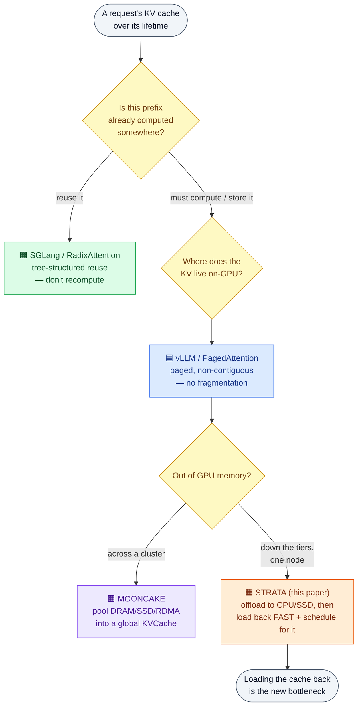
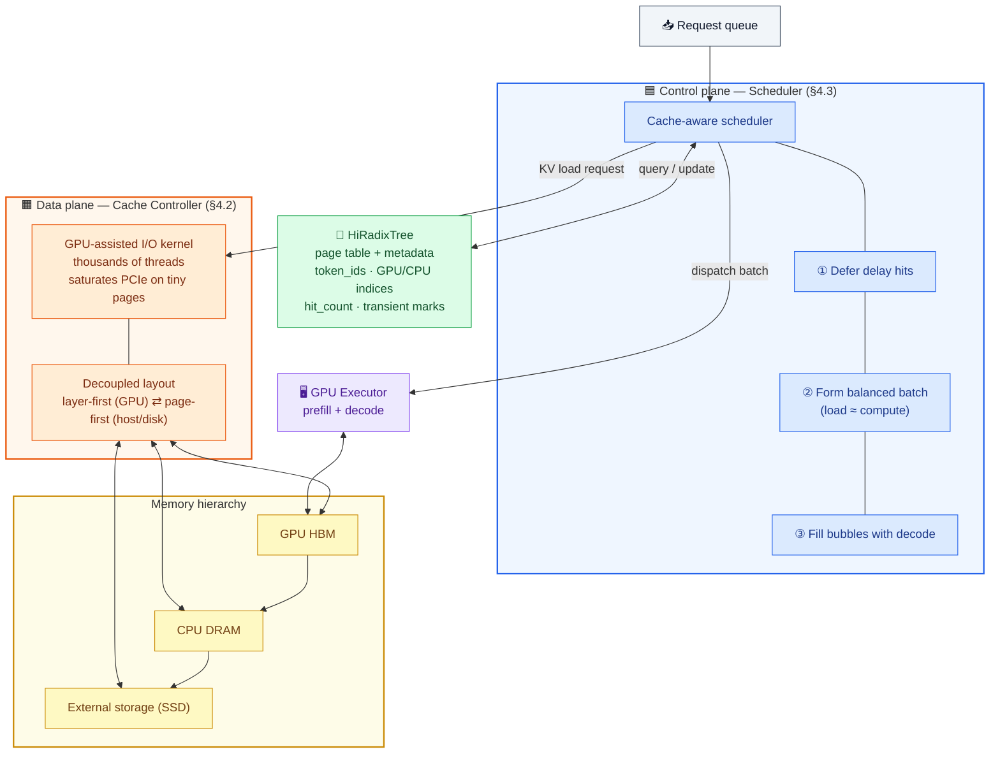
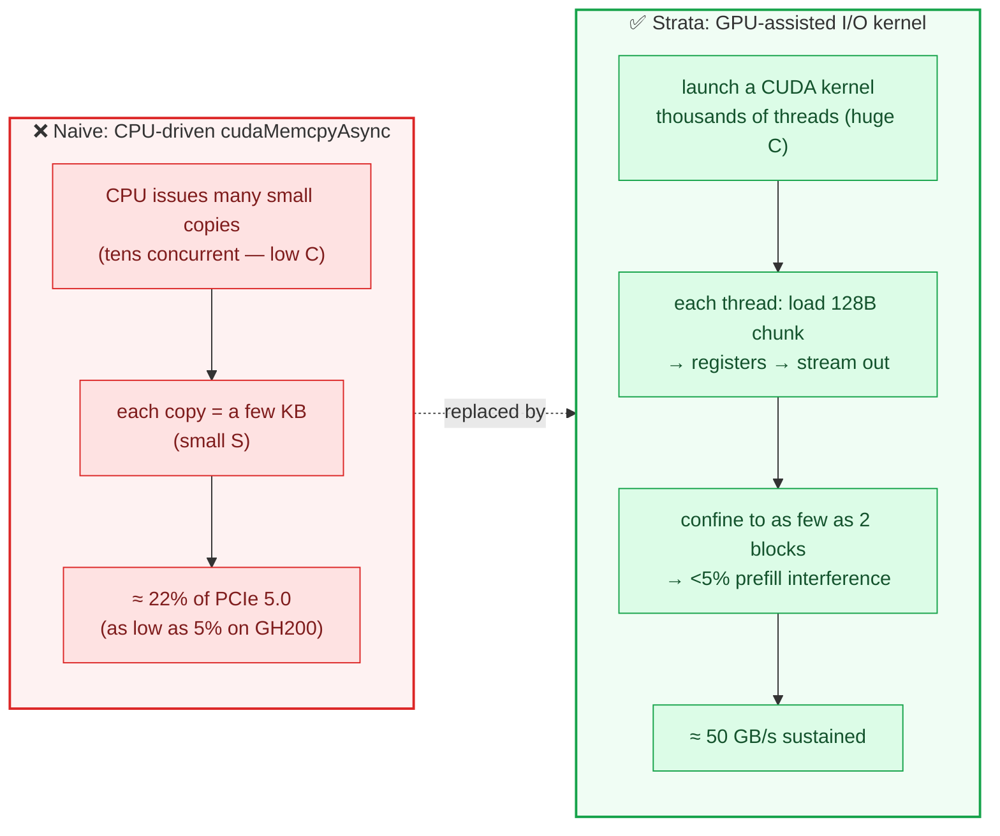

This is a technical dissection of **Strata** — a **hierarchical context caching framework for long-context LLM serving**. Strata answers a question the earlier serving papers left open: once you accept that the KV cache is too big to keep on the GPU and you push it down into CPU DRAM or SSD, **how do you get it back onto the GPU fast enough that caching is still a win?** The paper's uncomfortable finding is that on long-context workloads the naive answer — "just `cudaMemcpyAsync` it and overlap with compute" — quietly turns your compute-bound prefill into an **I/O-bound** one.

I am not reproducing the paper. The 5x/3.75x numbers matter here only as evidence that the two design choices — a **GPU-assisted I/O** path and a **cache-aware scheduler** — actually pay for themselves.

**Attribution convention.** Because this article mixes what the paper says with my own reasoning, every non-obvious technical claim is tagged:

- **[Paper]** — stated explicitly in Strata (arXiv 2508.18572, Aug 2025).
- **[Derived]** — a mathematical or logical consequence of the paper's definitions, worked out here.
- **[Interpretation]** — my explanation or engineering reasoning, written for the reader; not a claim the paper makes.

---

## Reasoning / Why I Studied This Paper

I have been walking the **KV-cache lifecycle** across serving systems, and each paper I read fills in one stage of the same story. **[Interpretation]** By the time I reached Strata I already had three of the four corners:

- [**SGLang / RadixAttention**](/engineering/sglang-radixattention-structured-lm-program-execution/) — *don't create redundant KV in the first place.* Keep finished requests' KV in a radix tree and reuse shared prefixes.
- [**vLLM / PagedAttention**](/engineering/vllm-pagedattention-efficient-memory-management-for-llm-serving/) — *store KV without fragmentation.* Page the cache so it grows and frees at token granularity.
- [**MOONCAKE**](/engineering/mooncake-kvcache-centric-architecture-for-serving-llm-chatbot/) — *move KV across a cluster.* Pool DRAM/SSD/RDMA into a global KVCache and schedule around cache hits.

Strata is the corner I was missing: **what happens to the KV cache when it doesn't fit on the GPU, and you have to fetch it back?** **[Interpretation]** SGLang's own limitations section names this gap almost exactly — RadixAttention lives in GPU memory, and extending it "across the memory hierarchy (DRAM, disk)" is left as future work. Strata is a direct answer to that sentence, and it is built **on top of SGLang**, extending SGLang's RadixTree into a **HiRadixTree**. **[Paper]**

The reason the problem is subtle — and the reason it needed its own paper — is that everyone *assumed* it was already solved. The folklore is: load layer $N{+}1$'s KV over PCIe while the GPU computes layer $N$, and the transfer hides for free. **[Paper]** That assumption holds when contexts are short. It **breaks** when contexts are long, because the thing you are loading (a huge cached prefix) dwarfs the thing you are computing (a few new tokens). Then there is no compute left to hide behind, and you are **loading-bound**. **[Paper]**



*Where Strata sits in the KV-cache lifecycle I have been tracing. The other three systems assume the cache is either reusable, resident, or poolable. Strata takes the case where it has been pushed to a slower tier and must be pulled back — and treats that pull as a first-class systems problem.* **[Interpretation]**

## I. The Problem: Long Context Makes Prefill I/O-Bound

Modern LLMs advertise context windows of **128K to 2M tokens** — Gemini, Qwen, DeepSeek-V3, Llama-3.1, Claude. **[Paper]** That unlocks RAG, document analysis, multi-turn agents, and coding assistants. It also creates a memory problem that is easy to under-appreciate: **[Paper]**

> 40 GB of GPU HBM can hold roughly **0.3M tokens** of KV cache for Llama-8B — which a handful of documents or a few hundred conversation turns will exhaust. **[Paper]**

So production systems do the obvious thing: they **offload** the KV cache to cheaper, larger tiers — CPU DRAM, local SSDs, or remote memory pools — and reload cached prefixes on demand instead of recomputing them. **[Paper]** This is **context caching** (a.k.a. prefix caching), and it is a genuinely good idea: caching a previously computed prefix avoids a prohibitively expensive re-prefill. **[Paper]**

The catch is the reload path. The paper's motivating measurement is blunt: serving the LooGLE dataset with SGLang offloading KV to CPU, **74% of prefill time is blocked on KV transfers**, resulting in a **4x throughput reduction**. **[Paper]** I/O, not compute, is the dominant cost. Strata traces this to **two independent sources**. **[Paper]**

### Source 1 — Fragmented I/O wastes bandwidth (§3.1)

Here is the irony the paper points out: the very thing that made GPU *memory* efficient makes *transfers* inefficient. **[Interpretation]** [PagedAttention](/engineering/vllm-pagedattention-efficient-memory-management-for-llm-serving/) stores the KV cache in **small, fixed-size, non-contiguous pages** (typically 1, 16, or 32 tokens) so memory never fragments. **[Paper]** But a sequence's KV is then scattered across many pages, so loading it back means **many tiny transfers of a few kilobytes each** — far too small to saturate PCIe. **[Paper]**

The paper formalizes *why* small transfers lose using **Little's Law**. Let $\lambda$ be the arrival rate of I/O operations, $C$ the average number of concurrent I/O operations, and $L$ the average latency per operation, so $C = \lambda \cdot L$. **[Paper]** If $S$ is the average data size per operation and $X$ the sustained throughput, then $X = \lambda \cdot S$, and substituting gives: **[Paper]**

$$
X = \frac{C \cdot S}{L}
$$

Read that as an engineering menu: to raise throughput $X$ you need **high concurrency $C$**, **large transfer size $S$**, or **low latency $L$**. **[Paper]** On a CPU-driven `cudaMemcpyAsync` path, $C$ is capped by CPU parallelism and driver queue depth (tens of concurrent ops), and $L$ carries fixed CPU–GPU scheduling overhead. That leaves **$S$ as the only practical lever** — and paged KV makes $S$ tiny. **[Paper]** Concretely, saturating 75–80% of PCIe 5.0 needs transfers in the **1–2 MB** range, but paged KV transfers are kilobytes: **[Paper]**


*Figure 1 (from the paper). The x-axis is the **load / compute ratio** per prefill batch — cached tokens loaded from CPU relative to new tokens actually computed. The blue CDF shows most long-context batches load far more than they compute. The red dashed curve is the resulting I/O stall with a naive page-size-32 path; it climbs to ~74%. The green (Strata-IO-only) and orange (Strata-Full) curves show how much of that stall Strata removes — the flat orange line is the goal: I/O effectively hidden.* **[Paper]**

You cannot fix this by just using bigger pages, because page size is a **three-way trade-off**: **[Paper]**


*Figure 2 (from the paper, Mistral-24B / ShareGPT on H200). Larger pages increase the effective transfer size $S$ — good for bandwidth — but **coarsen cache matching**, which is done per page. The cache hit rate (red) drops and TTFT (blue) climbs up to **2x average / 2.9x P90** at the largest sizes. So "just make $S$ bigger" sacrifices the reuse that made caching worthwhile in the first place.* **[Paper]**


*Figure 3 (from the paper). Loading 8192 tokens at page size 32 achieves only about **22% of theoretical PCIe 5.0 bandwidth**, and the gap **widens on faster interconnects** — falling to as low as **5% on Grace-Hopper**, whose NVLink C2C offers ~6x the peak bandwidth. Faster hardware does not save you; the fragmentation just leaves more of it on the table.* **[Paper]** **[Interpretation]**

### Source 2 — Schedulers ignore loading delay (§3.2)

The second source is a scheduling blind spot. Serving engines treat GPU compute and HBM as the only first-class resources and assume layer-wise overlap hides KV loading. **[Paper]** For long cached contexts with few new tokens, **bulk transfer latency exceeds what layer-level compute can hide**, so prefill degrades into a **PCIe bandwidth-bound task** — and even a well-tuned I/O path still leaves **up to 24% of prefill time stalled** (Figure 1). **[Paper]** A scheduler that builds batches without accounting for this produces **imbalanced, loading-bound batches**. **[Paper]**

There is a nastier, second-order effect the paper imports from the networking literature: the **delay hit**. **[Paper]** Under high traffic, several requests target the *same* context while its **initial cache miss is still being resolved**. If they land in the same batch (or the async scheduler prepares the next batch before the current one finishes), they each trigger a **redundant prefill** of a prefix that is about to become cached anyway. **[Paper]** Long contexts make this doubly painful — both the wasted recomputation and the miss-resolution window scale unfavorably. **[Paper]**

> The synthesis: **CPU–GPU bandwidth must become a first-class scheduling resource.** You have to balance compute against transfer when batching, and actively avoid redundant work while a cache line is warming up. **[Paper]**

## II. Strata's Architecture: A Data Plane and a Control Plane

Strata splits the job cleanly into two components, built on the SGLang runtime and deployed in production at "a leading AI company." **[Paper]**

- The **Cache Controller** (§4.2) is the **data plane**: it owns KV cache placement across GPU HBM → CPU DRAM → external storage, and it implements the fast transfer mechanism and the memory layouts.
- The **Scheduler** (§4.3) is the **control plane**: it forms batches in a cache-resource-aware way, referencing a **HiRadixTree** — an extension of SGLang's RadixTree that doubles as a **page table** and stores per-page metadata (`token_ids`, `GPU_indices`, `CPU_indices`, `hit_count`). **[Paper]**


*Figure 4 (from the paper). A request enters the waiting queue. While the current batch runs, the **Scheduler** continuously estimates available resources and each queued request's demands, selects the next batch, sends it to the **GPU Executor**, and fires a KV load request at the **Cache Controller**. During prefill the executor synchronizes with the controller so each layer's KV is present before it is needed. Finished prefills merge into a consolidated decode batch via continuous batching (a **P-D co-location** design that alternates prefill and decode on the same GPU). The controller backs up and evicts pages to lower tiers asynchronously.* **[Paper]**



*The two planes and how they meet at the HiRadixTree. The data plane makes each transfer fast; the control plane decides which transfers to issue and when — so compute is always available to hide them.* **[Interpretation]**

## III. The Data Plane: Efficient KV Cache I/O

### GPU-assisted I/O

The core move is to **stop using the CPU DMA path for tiny fragmented pages** and instead do the transfer *with the GPU itself*. **[Paper]** Rather than calling `cudaMemcpyAsync` repeatedly on small chunks, Strata launches a **CUDA kernel** that spawns **thousands of threads**; each thread loads a small chunk from the source (GPU global memory or CPU **registered pinned** memory) into its **registers**, then streams it to the destination. **[Paper]**

Map this straight back onto Little's Law $X = C\cdot S/L$: **[Derived]**

- **Concurrency $C$ explodes.** GPUs offer thousands of concurrent I/O operations vs tens on a CPU — so $C$ rises by orders of magnitude. **[Paper]**
- **Small $S$ is no longer fatal.** The granularity for efficient GPU-assisted I/O is only **~128 bytes**, which is finer than a single-page KV cache. So you **do not need to inflate page size** to get bandwidth — you keep small pages (good hit rate) *and* saturate the link. **[Paper]** This is the key escape from the Figure 2 trade-off. **[Interpretation]**
- **Layout transforms become free.** Because the per-thread compute is trivial, reorganizing data between GPU and CPU layouts costs "one additional arithmetic operation" per thread. **[Paper]**



*Why the GPU does its own I/O. The naive path is starved of concurrency and stuck with tiny transfers; the kernel path buys massive $C$ and tolerates small $S$, which is exactly the regime paged KV lives in.* **[Interpretation]**

The obvious worry with running an I/O kernel next to compute kernels is **interference** — the I/O threads consume register files and execution cycles and can pollute cache. **[Paper]** Strata's answer is counter-intuitive but clean: **launch only a small number of large CUDA blocks** (as few as **1–2**) so the GPU's hardware scheduler confines the I/O kernel to a tiny subset of SMs, and use low-level instructions to **bypass the cache**. **[Paper]** Microbenchmarks on H200 (the paper's Figure 5) show **two blocks of 1024 threads** sustain **~50 GB/s** with **<5% degradation on prefill and <10% on decode**. **[Paper]**

Based on this, the defaults are **2 blocks for CPU→GPU loads** (the critical path) and **1 block for GPU→CPU backups** (non-critical, where bandwidth is already sufficient and overhead must be minimized). **[Paper]** The kernels also work on the **ROCm backend**, so they are AMD-compatible. **[Paper]**

### Decoupled memory layout: layer-first vs page-first

LLM compute is **layer-wise**, so the GPU pool naturally uses a **layer-first** layout — all of layer 0's KV together, then layer 1, etc. — which lets you load "layer $N{+}1$" as a unit. **[Paper]** But layer-first **fragments** a single page's data across the whole pool, which is terrible for bulk transfer. **[Paper]** A **page-first** layout — all layers of one page laid out contiguously — is ideal for I/O but would need an indirection layer for compute, complicating kernels. **[Paper]**

Strata refuses to pick one. Because GPU-assisted I/O makes layout transformation nearly free, it keeps a **layer-first layout on the GPU** (compute-friendly) and a **page-first layout on host memory and disk** (transfer-friendly), transforming on the fly during the copy. **[Paper]**


*Figure 6 (from the paper). Left: the **layer-first** GPU pool groups KV by layer, matching how the model computes. Right: the **page-first** host/disk pool groups all of a page's layers together, producing the large contiguous blocks that saturate PCIe and SSD. The GPU-assisted kernel converts between them with a single arithmetic offset per thread.* **[Paper]** This decoupling is what lets disk caching work at all — it cuts KV load latency from disk by up to **4x** (Figure 12, later). **[Paper]**

Finally, when **external storage** is involved, the controller **opportunistically prefetches** from SSD to host memory the moment a storage-layer hit is detected, overlapping the prefetch with the request's queuing delay; if the scheduler dispatches before the prefetch finishes, it terminates the in-flight prefetch and uses whatever is already in host/GPU memory. **[Paper]** This is deliberately best-effort because storage latency is high and unpredictable, unlike the layer-wise-overlappable host↔GPU path. **[Paper]**

## IV. The Control Plane: Cache-Aware Scheduling

Fast transfers are necessary but not sufficient. The scheduler's job is to **maximize caching benefit by avoiding delay hits and loading stalls**, in three stages. **[Paper]** It works over the **HiRadixTree**, which tracks not just cached prefixes (like SGLang's RadixTree) but also **transient nodes** for prefixes that are *in the process* of being loaded or computed. **[Paper]**

### Stage 1 — Deferral on delay hit (§4.3.1)

To catch delay hits before they cause redundant work, Strata marks transient HiRadixTree nodes with one of two states: **[Paper]**

- **`in-queue`** — a request is *referencing* a new context (not yet computed).
- **`in-flight`** — the cache for those tokens is *currently under computation*.

When iterating the request queue, Strata inserts `in-queue` transient nodes as needed. **If a new request matches an existing transient node**, its context is about to become hot, so Strata **defers it to the next scheduling round but places it at the front of the waiting queue** — it will hit the soon-to-be-warm cache instead of redundantly recomputing it, and its TTFT impact is minimized. **[Paper]** When a request proceeds to execution its nodes are marked `in-flight`; on completion they convert to standard nodes pointing at the ready cache. **[Paper]** To avoid over-deferring, a request is deferred only when its token matches on transient nodes exceed a **configurable threshold (default 100 active token matches)**. **[Paper]**

### Stage 2 — Balanced batch formation (§4.3.2)

Default FIFO batching (take requests in arrival order until the batch is full) can produce a batch that is **loading-bound** — more bytes to load than compute to hide them. **[Paper]** Strata instead forms a batch whose **aggregate load is balanced against its aggregate compute**. It defines a per-request **`loading_bound`** predicate — roughly, whether adding the request pushes the batch's load-to-compute ratio past a threshold (default 100, the point where stalls appear in Figure 1) — and it exploits the **bundle hit** (the *opposite* of a delay hit): batching requests that share the same context reduces both GPU memory use and on-device bandwidth pressure. **[Paper]**

```text
Algorithm 1 — Balanced Batch Formation
procedure AddBundleHit(Q, B):
    for each r in Q:
        if B.is_bundle_hit(r):        # r shares context already in the batch
            B.add(r); Q ← Q − r       # free to add — no extra loading

function BatchFormation(Q):
    B ← Batch(); D ← []               # D = deprioritized (loading-bound) list
    B.add(Q.pop(0)); AddBundleHit(Q, B)   # seed with head of queue, pull its bundle
    while |Q| > 0 and not B.is_full():
        r ← Q.pop(0)
        if B.loading_bound(r):        # would make the batch loading-bound
            D.append(r)               # set aside for later
        else:
            B.add(r); AddBundleHit(Q, B)  # add it, and any of its bundle mates
    for each r in D:                  # backfill with deprioritized requests
        if B.is_full(): break         # (retain original order to avoid starvation)
        B.add(r)
    return B
```

The loading-bound requests are not dropped — they are **deprioritized and backfilled** in their original order once the compute-balanced core of the batch is set, which prevents starvation. **[Paper]** Each batch formation always begins with the first request in the queue, another anti-starvation guard. **[Paper]**

### Stage 3 — Bubble filling with decode work (§4.3.3)

Even a balanced batch can still be somewhat loading-bound. The last lever is **bubble filling**: when a prepared prefill batch is waiting on a long context load, the scheduler issues a **decoding batch** to run concurrently on the same GPU. **[Paper]** The two workloads contend minimally because they bottleneck on different resources — **decode saturates HBM bandwidth, loading saturates PCIe** — so they overlap almost for free. **[Paper]** This complements SGLang's default prefill-first policy and leans on the **P-D co-location** design; in a disaggregated (P/D-split) system you could instead insert a prefill batch into the bubble. **[Paper]**


*Figure 7 (from the paper). Top row is naive FIFO; bottom row is Strata's Compute/PCIe-IO timeline. The three stages in action: **Delay Hit** deferral turns a redundant recompute (A0+A1) into a cheap hit (A1+B1, green); **Balance Batch** pairs loads with enough compute so PCIe and Compute lanes both stay busy; **Stall Hiding** drops a gray decode batch (G) into what would otherwise be an idle compute bubble while C/D/G load over PCIe. The result is a tighter packing of the same work into less wall-clock time.* **[Paper]** **[Interpretation]**

## V. Does It Actually Work? The Evaluation

When I read the results I kept three questions in mind: **does hierarchical caching plus fast I/O actually raise long-context throughput**, **which of the two components causes the win**, and **does any of this hurt short-context requests**. **[Interpretation]**

### Setup

Strata is built on **SGLang v0.4.5**. **[Paper]** Two testbeds: an **H200** node (8×H200, NVLink, Sapphire Rapids CPU, 1.6 TB DRAM, PCIe 5.0 x16 ≈ 64 GB/s) and a **GH200** Grace-Hopper node (H100 + 64-core ARM, 464 GB LPDDR5X, up to 384 GB/s C2C). **[Paper]** Baselines are the strong ones: **vLLM + LMCache**, **TensorRT-LLM + HiCache**, and **SGLang-HiCache** (their own implementation of state-of-the-art layer-wise transfer overlap + hierarchical caching, in the spirit of CachedAttention/Pensieve/FlashGen). **[Paper]** Models span **Llama-3.1-8B**, **Qwen2.5-14B-1M**, and **Llama-3.1-70B** (tensor-parallel on 4 GPUs). **[Paper]** Datasets are four long/short-context workloads — **LooGLE, NarrativeQA, ReviewMT, ShareGPT** — with Poisson arrivals (Table 1). **[Paper]**

### End-to-end: long context


*Figure 8 (from the paper). Each panel plots **average TTFT (lower better) vs throughput (higher better)**; the ideal curve hugs the bottom-right. Columns are Llama-8B / Qwen-14B / Llama-70B; rows are LooGLE / NarrativeQA / ReviewMT / ShareGPT. **Strata (red) dominates on the three long-context rows** — the non-hierarchical baselines (dashed) collapse early because they exhaust GPU memory and recompute, while Strata holds ~95% cache hit rate via CPU memory.* **[Paper]**

The headline numbers: **[Paper]**

- **Up to 5x lower TTFT** vs vLLM+LMCache and **3.75x** vs TensorRT-LLM on long-context benchmarks.
- On LooGLE, up to **3.2x / 2.6x / 1.9x** higher throughput at matched TTFT vs SGLang-HiCache / vLLM-LMCache / TensorRT-HiCache (Llama-8B); Qwen-14B and Llama-70B show the same pattern (up to **3.9x / 2.1x / 1.9x**).
- Even on ReviewMT, where longer decoding dilutes prefill's share, Strata still beats vLLM-LMCache by **2.3x**, TensorRT-HiCache by **2.3x**, and SGLang-HiCache by **1.7x** (Llama-8B).

At **warm-cache steady state** (NarrativeQA, CPU memory pre-filled), Strata reaches **2.3x / 2.6x / 2.5x** throughput over vLLM-LMCache across the three models. **[Paper]**

### End-to-end: short context (the no-regression check)

The whole design is aimed at long context, so the important negative result is on **ShareGPT** (short context, bottom row of Figure 8): Strata shows **comparable performance** to vLLM and TensorRT-LLM. **[Paper]** The authors are honest that the underlying SGLang engine has a slight kernel disadvantage vs vLLM/TRT on Llama-8B/70B — accounting for that, **Strata does not regress short-context serving**. **[Paper]** That matters: a hierarchical-cache system that taxed short requests would be a hard sell for a mixed production fleet. **[Interpretation]**

### Ablations: which component matters


*Figure 11 (from the paper). Contributions depend on the workload's **cache distance** (how far apart requests sharing a context are in the queue). With **minimum** cache distance (similar requests adjacent), locality is already perfect, so **delay-hit mitigation** does the heavy lifting — **+42%** peak throughput. With **shuffle** and **maximum** cache distance, the **I/O efficiency** mechanisms drive the win — **+76%** and **+95%** — because larger distances mean more hits served from CPU DRAM. **Balance batch** adds +11% / +12% and **stall hiding** +8% / +3% on top. The lesson: no single trick wins everywhere; they cover complementary regimes.* **[Paper]** **[Interpretation]**

The breakdown figure (Figure 9) reinforces this: both **Strata-scheduling** and **Strata-IO** each independently lift the baseline hierarchical design by up to **1.8x** and **2.3x** peak throughput. At low request rates scheduling helps more (light I/O pressure); as the rate rises the I/O subsystem dominates and GPU-assisted I/O becomes essential. **[Paper]**

### Page size and disk


*Figure 12 (from the paper). The **page-first** disk layout enabled by the decoupled-layout design cuts KV load latency from disk by up to **4x** (1.687 s → 0.420 s for Llama-8B) by producing large contiguous reads. This is the concrete payoff of the layer-first⇄page-first transform being nearly free.* **[Paper]**

On page size, Strata-IO holds **consistently high throughput across page sizes 32–1024**, whereas SGLang-HiCache peaks at only **93%** of Strata-IO even at its best page size (512) — so GPU-assisted I/O effectively **removes the page-size tuning burden** that Figure 2 imposed. **[Paper]** On **GH200**, Strata-IO lifts sustained bandwidth from ~40 to ~150 GB/s, but the paper is candid that **scheduling** is still needed to fully exploit Grace-Hopper's bandwidth — I/O alone gets you closer to, but not to, the "infinite-bandwidth" oracle. **[Paper]**

## VI. Where Strata Sits (Related Work)

The paper places itself carefully against the KV-cache literature I have been mapping: **[Paper]**

- **Context caching & sharing** — SGLang's RadixTree, vLLM/MOONCAKE hashing, LMDeploy's hybrid tries. Strata **extends SGLang's RadixTree into the HiRadixTree**. Unlike approximate schemes (CacheGen, CacheBlend) that reuse *beyond* exact prefixes, **Strata does not touch accuracy**. **[Paper]**
- **KV cache offloading** — CachedAttention and Pensieve adopt layer-wise loading/compute overlap; FlashGen adds re-order execution scheduling (and is implemented in Strata's SGLang-HiCache baseline). Strata's contribution over these is the **GPU-assisted I/O path and bandwidth-aware scheduling** for the loading-bound regime they don't handle. **[Paper]**
- **Large-scale KV cache disaggregation** — [MOONCAKE](/engineering/mooncake-kvcache-centric-architecture-for-serving-llm-chatbot/) and MemServe build cluster-scale disaggregated pools with global coordinators. Strata is **complementary**: it focuses on memory management + scheduling **within a single compute instance**, and does **not** require specialized high-speed networking to realize its benefits. **[Paper]**

The clean way to place it against the systems I studied: **[Interpretation]**

- [**SGLang / RadixAttention**](/engineering/sglang-radixattention-structured-lm-program-execution/) — avoid *creating* redundant KV (reuse prefixes on-GPU).
- [**vLLM / PagedAttention**](/engineering/vllm-pagedattention-efficient-memory-management-for-llm-serving/) — *store* KV on-GPU without fragmentation.
- [**MOONCAKE**](/engineering/mooncake-kvcache-centric-architecture-for-serving-llm-chatbot/) — *move* KV across a cluster.
- **Strata** — *fetch* KV back from slower tiers fast, and schedule so the fetch is always hidden.

## VII. Limitations and Future Directions

The paper is candid about what is left open: **[Paper]**

- **GPU-assisted I/O still has overhead.** It consumes SMs and registers; the authors want to reduce this and, longer term, motivate **on-chip memory I/O accelerators** so the compute units aren't borrowed for data movement at all.
- **Scheduling can't fully exploit emerging bandwidth alone.** On GH200, I/O improvements raise the ceiling but only combined scheduling approaches the infinite-bandwidth oracle — there is headroom left on very fast interconnects.
- **Single-instance scope.** Strata deliberately stays within one compute instance; integrating its I/O engine with cluster-scale disaggregation (MOONCAKE/MemServe-style) is complementary future work.
- **Thresholds are profiled constants.** The `loading_bound` ratio (~100) and delay-hit deferral threshold (100 token matches) are hardware/model-dependent and set by profiling, not learned or adapted online. **[Interpretation]**

## VIII. My Engineering Takeaway

What makes Strata stick for me is that it **completes the KV-cache lifecycle story** I had been assembling, and it does so by taking seriously a step everyone waved away. **[Interpretation]** "Just offload the cache and load it back" sounds free until you measure it and find **74% of your prefill is stalled on PCIe**. Strata's insight is that the fix isn't one thing — it's a **data-plane and a control-plane fix that only work together**: GPU-assisted I/O makes each transfer fast enough to keep small pages (so you keep your hit rate), and cache-aware scheduling guarantees there's always compute available to hide the transfer behind (so the fast transfer actually lands off the critical path).

Placed next to the others, the layered picture is now whole: **[Interpretation]**

> Don't create redundant KV (**SGLang**), store it without fragmentation (**vLLM**), move it across the cluster when you must (**MOONCAKE**), and — when it overflows to CPU or SSD — **pull it back fast and schedule so the pull is always hidden (Strata).**

The detail I keep coming back to is the **layer-first ⇄ page-first** decoupling. It's a small idea — keep two layouts and transform on the fly — but it's only *affordable* because GPU-assisted I/O made the transform nearly free, which in turn was only *worth building* because the fragmentation problem was real. That chain — measure the true bottleneck, build the primitive that dissolves it, then let the primitive unlock a layout choice you couldn't afford before — is, I think, what good systems work actually looks like. **[Interpretation]**
