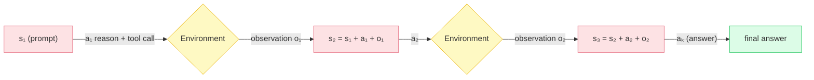
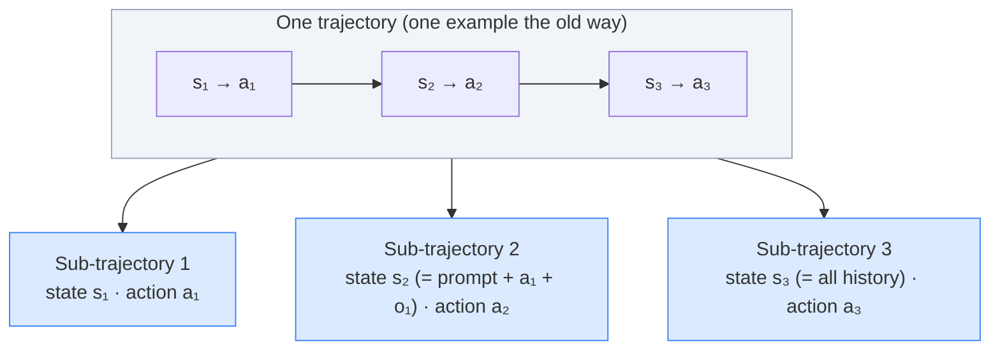
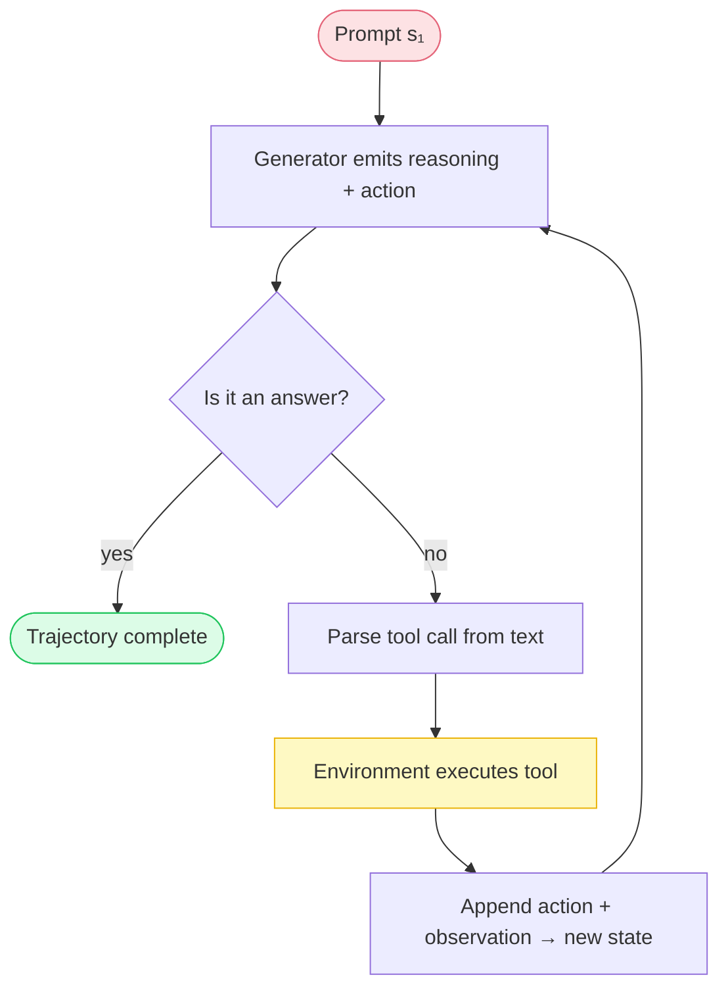
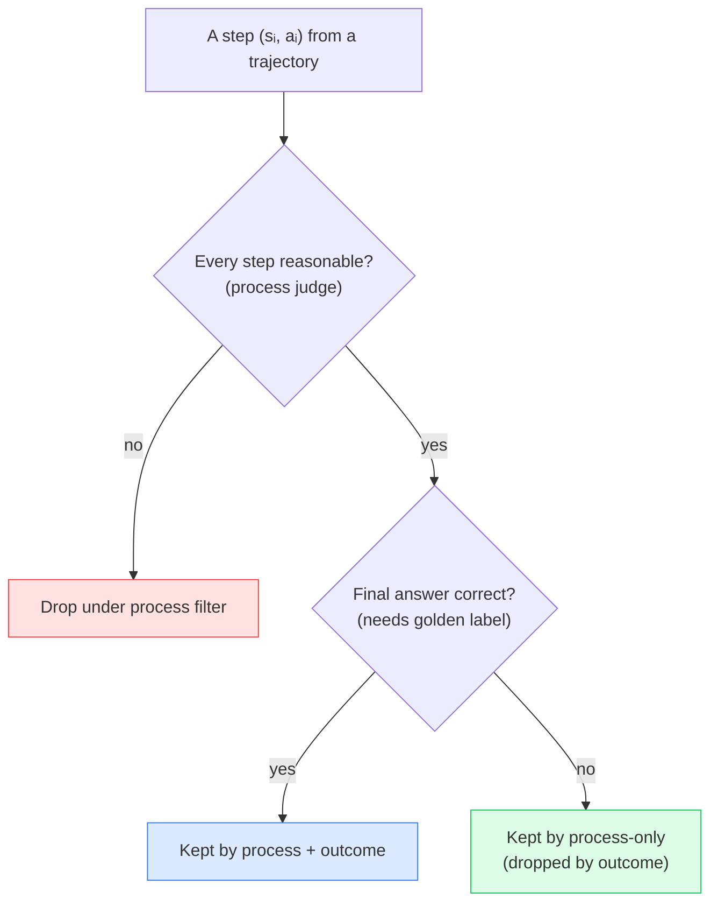
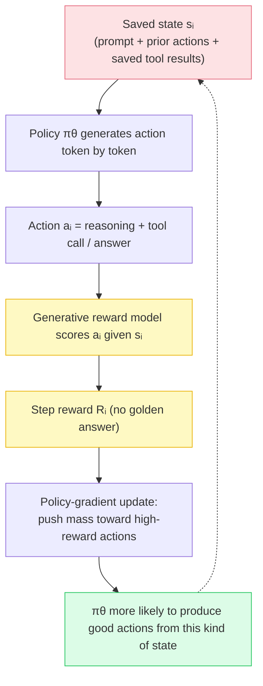
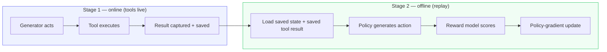
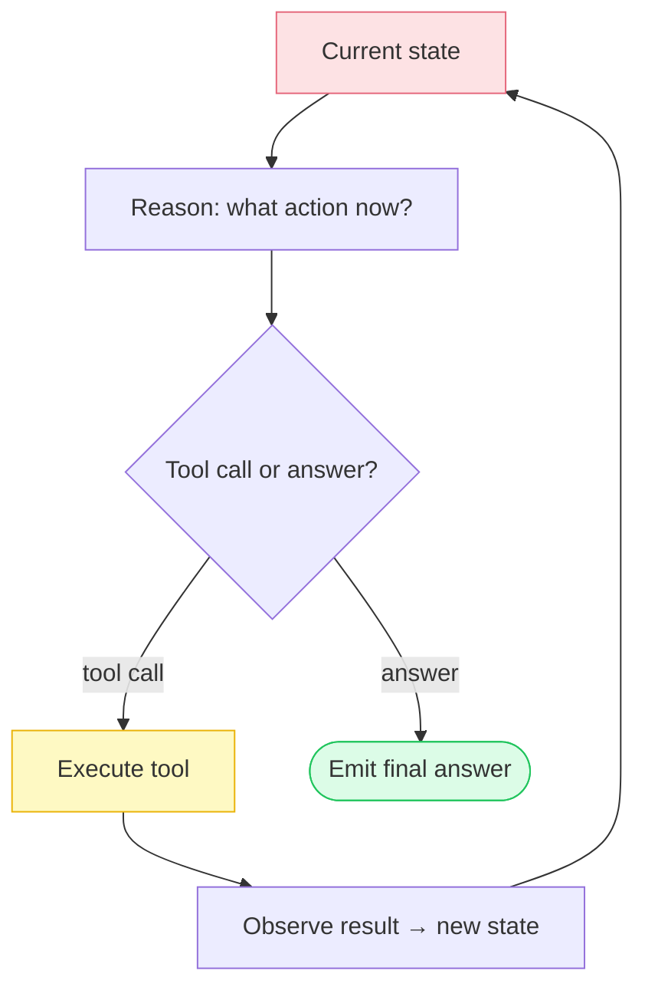
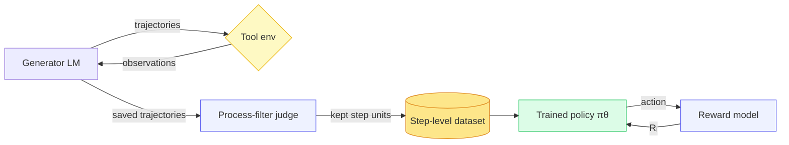

# SWiRL: Step-Wise Reinforcement Learning for Multi-Step Reasoning and Tool Use

Most of the models we train do one thing: a prompt goes in, a response comes out, and the training signal compares that response to a reference. Agentic systems do not have this shape. An agent reasons, calls a tool, reads what comes back, reasons again, calls another tool, and only eventually commits to an answer. What it produces is not a response — it is a **sequence of decisions**, each made from a state the previous decision created.

**Step-Wise Reinforcement Learning (SWiRL)** is a training methodology built for exactly that shape. This entry is an engineering breakdown of how you would actually build the SWiRL pipeline: the components, the execution flow, how state is carried, how the planning/reasoning loop is decomposed for training, and how the pieces interact. The paper's contribution is not "apply RL to agents" — it is the **data and reward machinery** around multi-step trajectories. That machinery is what we are here to reconstruct.

> **Scope.** The core mechanics — trajectory formulation, step-wise decomposition, process filtering, the step-wise reward objective, and offline replay — are drawn from the SWiRL paper (Goldie et al.). The worked examples throughout (the "who is older" retrieval question and the watermelon calculator problem) are the paper's own; the numbers quoted are from its experiments on HotPotQA, GSM8K, and the held-out QA datasets.

---

## The Core Problem: Training a Per-Step Policy

Start with a concrete task the model cannot answer from parameters alone:

> *"Who is older, Glenn Hughes or Ross Lynch?"*

To answer it the model must search for one person's age, read the result, search for the other, compare, and answer. What it emits is a **trajectory** — an alternating sequence of actions it authored and observations it did not:

$$
\tau = (s_1, a_1, s_2, a_2, \ldots, s_K, a_K)
$$

Three properties of this object are what make it hard to train on, and each one turns into an engineering requirement:

- **State accumulates.** Each state $s_i$ is not a summary — it is the *entire transcript so far*: the original prompt plus every prior action and every tool response. The decision at step $i$ is only meaningful relative to that accumulated context.
- **Actions interleave with foreign information.** Observations arrive from tools. The model has to interpret them and decide whether they answered the question it asked.
- **Later actions depend on earlier observations.** You cannot know what the second tool call should be until the first result is in. The dependency *is* the task — it is not a stylistic feature.

The behavior we actually want to train is therefore not "produce the answer." It is:

> **Given where I am in this task, what is the next useful action?**

That is a **per-step policy**. And here is the mismatch that motivates the whole method: if the training unit is a whole trajectory, the learning signal is one scalar spread across $K$ decisions. It cannot say *which* of the $K$ steps deserved credit or blame. Outcome-level reward is cheap to obtain and nearly useless per step.



*Each state carries the full history forward; the environment injects observations the model must react to. This is the sequential dependency SWiRL trains against — and, at inference time, never removes.*

---

## The Design Move: Decompose the Trajectory, Then Reward Each Step

SWiRL's central idea is a data transformation, and the name describes it exactly. Instead of treating a trajectory as one indivisible example, **decompose it into sub-trajectories, one per action** — each pairing the state the model was in with the action it took from that state.

So one multi-step interaction becomes several short training units:



Two things this buys, and both drive the rest of the build:

1. **The learning unit now matches the decision unit.** At inference the model picks one action given a state; after decomposition the training data is made of exactly that — `state → action`. Nothing has to be inferred about the state–action relationship from a long sequence.
2. **Selection and reward become fine-grained.** A useful step from an otherwise poor trajectory need not be discarded with it, and a lucky trajectory's weak steps need not be smuggled in with its success.

Structurally the method splits into two stages, and keeping them apart is the single most important thing to fix in your head:

> **Stage 1 builds the experience. Stage 2 learns from the experience.**

```mermaid
flowchart LR
    subgraph S1["Stage 1 — data collection + filtering (tools run here)"]
        G[Generator LM + tool] --> GEN[Generate K-step trajectory]
        GEN --> EXE[Execute tool calls live]
        EXE --> SAVE[Save states + tool results]
        SAVE --> DEC[Step-wise decomposition]
        DEC --> FILT[Process filter]
        FILT --> DS[(Step-level dataset)]
    end
    subgraph S2["Stage 2 — step-wise RL (offline, no live tools)"]
        DS --> POL[Policy πθ generates action for a saved state]
        POL --> RM[Reward model scores action in context]
        RM --> PG[Policy-gradient update]
        PG --> POL
    end

    style S1 fill:#eef2ff,stroke:#6366f1
    style S2 fill:#f0fdf4,stroke:#22c55e
    style DS fill:#fef9c3,stroke:#eab308
```



The rest of this deep-dive walks each box in build order.

---

## Stage 1 — Multi-Step Data Collection

Stage 1 trains nothing. Its job is to manufacture a large corpus of step-level units by letting a model *act* against real tools and recording everything.

### Component responsibilities

| Component | Responsibility |
|---|---|
| **Trajectory generator** | A base LM (Gemma 2-27B in the paper) with tool access. Emits reasoning + a tool call, or a final answer, at each step. |
| **Environment / tool executor** | Parses the tool call out of the generated text, executes it (retriever for QA, a SymPy calculator for math), and returns the result into the next state. |
| **State store** | Persists each `(state, action, observation)` so the trajectory can be replayed later without re-running tools. |
| **Process-filter judge** | A separate model (Gemini 1.5 Pro Thinking) that later scores each step for reasonableness. |

### The generation loop

At each step the generator sees the accumulated state, is free to produce a chain of thought, and either calls a tool or answers. The tool interface is textual and inline — the call lives inside tags in the middle of the reasoning:

```python
def generate_trajectory(prompt, model, env, max_steps):
    state = [prompt]                      # s₁ is just the prompt
    trajectory = []
    for step in range(max_steps):
        action = model.generate(state)    # reasoning + a tool call OR an answer
        trajectory.append((list(state), action))   # save (sᵢ, aᵢ)

        if is_answer(action):             # <answer>…</answer> terminates
            break

        query = parse_tool_call(action)   # e.g. <search_query>…</search_query>
        observation = env.execute(query)  # THE ONLY PLACE TOOLS ACTUALLY RUN
        state = state + [action, observation]   # sᵢ₊₁ = sᵢ + aᵢ + oᵢ
    return trajectory
```

Two engineering details matter here. First, **the state is append-only** — `s_{i+1}` literally equals `s_i` plus the action and its observation, so the full history is always available and never compressed. Second, **tools execute exactly once, here, during generation.** That single decision is what later makes Stage 2 offline.



### Sampling for variety, not correctness

The generator is run **multiple times per question** — five trajectories each in the paper (10,000 HotPotQA questions → 50,000 trajectories; 7,500 GSM8K questions → 37,500). This is deliberate: the raw material for step-level learning is *variety of behavior*, including the attempts that go wrong, not a single golden path. To keep trajectories tractable the paper caps step count (5 for HotPotQA, 10 for GSM8K) and drops "easy" questions answerable in a single search.

This is also why generation and training are separate stages. You want many attempts banked *before* you decide what to learn from — and, because tool calls can be issued in parallel across trajectories during generation, you can build a large fixed dataset without throttling on slow tool execution.


*Figure 1 (SWiRL paper). Stage 1 generates a multi-step trajectory and then assigns each step a process label given only its prior context. Two filtering paths diverge from the same trajectory: process filtering keeps trajectories whose every step is judged reasonable by the model judge; outcome filtering keeps only those whose final answer matches the golden label.*

---

## Step-Wise Decomposition as a Data Operation

Decomposition is not a modeling trick — it is a loop over a saved trajectory. Each action becomes one training row whose "input" is the state prefix at that point:

```python
def decompose(trajectory):
    units = []
    for i, (state_i, action_i) in enumerate(trajectory):
        units.append({
            "state":  state_i,       # prompt + all prior actions + observations
            "action": action_i,      # a single decision (reasoning + tool call/answer)
            "step":   i,
        })
    return units
```

Two properties worth internalizing:

- **The context grows; the action stays one action.** The last sub-trajectory has the most context and still corresponds to a single decision. The prefix is what makes that action interpretable — the same action from a different prefix is a different decision.
- **Nothing is discarded by decomposition.** Observations are not removed; they become part of later states. Decomposition changes how the trajectory is *packaged* for training, not what it contains.

A common misread worth killing early: SWiRL is **not** training a separate model for "step 1," another for "step 2," and so on. There is **one policy** evaluated repeatedly at different states — $s_1 \to a_1$, $s_2 \to a_2$, $s_3 \to a_3$. The step-wise structure lives in the data and the reward, never in the model.

---

## Process Filtering — The Data-Selection Decision

Now the corpus of step-level units is filtered, and this is arguably the most consequential engineering choice in the pipeline. A model judge is shown a single step $(s_i, a_i)$ and asked a binary question:

> *"Given everything that happened before, was this action reasonable?"*

```python
def process_filter(units, judge):
    kept = []
    for u in units:
        # judge sees the state prefix + the action; NO golden answer
        if judge.is_reasonable(u["state"], u["action"]):
            kept.append(u)
    return kept
```

The property that makes this more than an implementation detail: **process filtering does not require the golden answer.** The judge is not checking whether the trajectory reached the right result — it is assessing whether each action was a sensible move from the state it was taken in. That decouples the training signal from outcome correctness, which is the binding constraint in most real agentic domains.

The paper treats the choice of filter as an empirical question and compares four strategies:



The result is the non-obvious one: **process-only filtering works best** — better than no filtering, better than outcome filtering, and better than process *and* outcome combined. Adding the requirement that the final answer be correct makes things *worse*.

The consequence for the training set is the part to sit with:

> The best training set **contains trajectories that ended in the wrong answer**, retained because their intermediate actions were judged reasonable.

There is a coherent reason. What SWiRL trains is decision quality *at a state*, and a reasonable decision is still reasonable if a later step spoils the outcome. Outcome filtering conflates "this step was bad" with "something downstream went wrong," discarding good decisions on that conflation — and it does the reverse too, laundering sloppy steps into the set whenever a trajectory happens to land correctly. If you are logging your own agent's runs, the practical lesson is direct: **a failed run that reasoned well is more useful training data than a lucky run that stumbled into the answer.**

---

## Stage 2 — Step-Wise Reinforcement Learning

With a step-level, process-filtered dataset in hand, Stage 2 is comparatively conventional RL — the twist is entirely in *what* it optimizes over and *where* the reward lands.


*Figure 2 (SWiRL paper). Step-wise RL over the saved trajectories from Stage 1. Each step contains an action — a tool call or the final answer — and a generative reward model scores that action given the prior context. The environment responses were captured in Stage 1, so the reward is computed on saved states with no access to golden answers.*

### The reward and the objective

The policy $\pi_\theta$ (the same Gemma 2-27B being trained) sees a state $s_i$ and samples an action $a_i \sim \pi_\theta(a \mid s_i)$. A generative reward model (Gemini 1.5 Pro) then scores that action **in the context of the state it was taken from**, again without the golden answer:

$$
R(a_i \mid s_i)
$$

The objective is the expected step-wise reward over all intermediate states in the synthetic trajectories:

$$
J(\theta) = \mathbb{E}_{s \sim T,\; a \sim \pi_\theta(s)} \big[ R(a \mid s) \big]
$$

where $T$ is essentially the set of all states occurring throughout the trajectories. Read over a single trajectory this is approximately $\mathbb{E}\big[\sum_{i=1}^{K} R(a_i \mid s_i)\big]$ — so instead of one reward at the end, you get $R_1 + R_2 + \cdots + R_K$. That is the whole meaning of *step-wise*.

### How the update actually flows

Optimization uses the same policy-gradient algorithm used to train Gemma 2 — nothing exotic:

$$
\nabla_\theta J(\theta) \approx \mathbb{E}\big[ R(a_i \mid s_i)\, \nabla_\theta \log \pi_\theta(a_i \mid s_i) \big]
$$

The subtlety that trips people up: **an action is not one token.** It is a whole generated response — reasoning plus a tool call — produced token by token, $a_i = (y_{i,1}, \ldots, y_{i,T_i})$, so $\log \pi_\theta(a_i \mid s_i) = \sum_t \log \pi_\theta(y_{i,t} \mid s_i, y_{i,<t})$. The single step-level reward $R_i$ therefore reweights the probability of the *entire action*, with the gradient flowing through every token that produced it.



Because the states are drawn from real trajectories that had to go somewhere, optimizing good *local* decisions across that distribution also improves *global* trajectory behavior — the model learns both "what should I do right now?" and, implicitly, "how do I solve the whole thing?" The dichotomy between myopic step training and end-to-end trajectory training is softer than it looks, precisely because a state contains its own history.

### Why not just fine-tune on the filtered data?

A fair objection: if process filtering already produces a clean set of `state → action` units, why not simply supervise on it? The paper runs exactly that ablation — SFT on the *same* filtered trajectories — and it loses to SWiRL, sometimes landing *below* the base model. Imitating the filtered actions token-for-token is not the same as being rewarded for producing good actions: the reward signal is what pushes probability mass toward reasonable steps and away from the near-misses that survive filtering, and that is the part imitation cannot reproduce. The takeaway is sharp — **the step-wise reward, not the data alone, is doing the work.**

The mechanism is measurable, not just asserted: SWiRL raises the *per-step process correctness* of the policy (on HotPotQA, from 82.5% to 91.0% of steps judged reasonable), which is precisely the quantity the reward optimizes — the end-task gains follow from steps getting individually better.

---

## Why This Is Offline RL

The pipeline has one more property that ties the stages together and simplifies the build enormously. **Tool calls executed during Stage 1 are saved with the trajectories.** So Stage 2 never touches a live tool — it replays saved states that already contain saved tool responses, generates an action, scores it, and updates.



The engineering payoff is real: training does not depend on tool availability, latency, rate limits, or nondeterminism — anyone who has tried to run RL against a live API knows what that removes. The cost is the standard offline-RL trade-off: the policy trains on the states the *generating* model reached, not the states the improving policy would reach. Worth keeping in mind when reading the gains, but for most practical pipelines the reproducibility and throughput gains dominate.

---

## Inference-Time Execution: The Loop Is Still Sequential

A final clarification that the decomposition can obscure: **SWiRL does not change inference.** The decomposition is a transformation of *training data*. At serving time the task is still fundamentally sequential, because later actions genuinely depend on earlier observations — the second tool call cannot be formulated before the first result is in.


*Figure 3 (SWiRL paper). At inference the trained model iteratively calls a tool as many times as needed before answering. Here the calculator tool is invoked repeatedly on a word problem; the model interleaves reasoning with `<calculator>` calls, reads each result, and terminates with an `<answer>` tag.*

What a SWiRL-trained model changes is the **quality of each step**, not the structure of the loop:



The model is not optimized toward "what is the final answer?" It is optimized toward "given where I am in this trajectory, what is the next useful action?" — and that is why the training data had to be step-shaped in the first place.

---

## Component Interactions Across the Whole Pipeline

Four model/tool roles appear across the two stages, and it is worth keeping them distinct — especially because the generator and the trained policy are the *same* base model, while the judge and reward model are a stronger one.

| Role | Model / tool | Stage | Sees golden answer? |
|---|---|---|---|
| **Trajectory generator** | Gemma 2-27B + tool | Stage 1 | — |
| **Environment** | Retriever (QA) / SymPy (math) | Stage 1 | — |
| **Process-filter judge** | Gemini 1.5 Pro Thinking | Stage 1 | No |
| **Reward model** | Gemini 1.5 Pro | Stage 2 | No |
| **Trained policy** | Gemma 2-27B | Stage 2 | No |



That a stronger model supplies the reward raises the obvious suspicion — is this just distilling Gemini into Gemma? The paper's answer is no: SWiRL *outperforms* the reward model on held-out benchmarks (CofCA, BeerQA), and a student does not exceed its teacher on tasks neither was trained on. What transferred, when a model trained on multi-hop QA + retriever improved zero-shot on math + calculator, was the **shape of multi-step behavior** — act, read, decide again — not the content of any one task.

---

## Trade-offs and Practical Considerations

- **Offline distribution shift.** Training on generator-reached states, not policy-reached states, is the classic offline-RL caveat. The reproducibility and throughput gains usually justify it, but it bounds how far the policy can drift from the generator's behavior.
- **The pipeline is judge-bounded.** Both the filter judge and the reward model are large models scoring "reasonableness." The quality — and cost — of the whole pipeline inherits their judgment. The process-filtering result is, strictly, a result about *this judge's* notion of a reasonable step.
- **Generation is the expensive stage.** Sampling several trajectories per question and judging every step costs real compute. The paper's scaling trend (meaningful gains by ~1,000 trajectories, still improving at 10,000) is what tells you the spend is worth it — and where to stop is an empirical question for your own domain.
- **Failed runs are assets.** The single most actionable takeaway for anyone logging agent trajectories: do not discard failures wholesale. Filter on *process*, and keep the reasonable-but-unlucky runs.

---

## Key Takeaways

- **SWiRL is a data-and-reward pipeline, not a new optimizer.** The policy gradient is the one already used in Gemma 2; the leverage comes from restructuring the data into step-level units and moving the reward onto every step.
- **Two decoupled stages.** Stage 1 generates and filters trajectories with live tools; Stage 2 replays the saved states offline and applies step-wise RL. Tools run only in Stage 1.
- **Decomposition matches the learning unit to the decision unit** — `state → action` — so nothing about the state–action relationship has to be inferred from a long sequence.
- **Process filtering is the pivotal choice.** Keep a step if it was reasonable given its state, no golden answer required. Process-only beats outcome and process+outcome, so the best training set includes trajectories that ended wrong but reasoned well.
- **A reward on every step** — objective $J(\theta) = \mathbb{E}_{s\sim T,\,a\sim\pi_\theta(s)}[R(a\mid s)]$ — is what teaches per-step decision quality, and it flows through every token of the whole action.
- **Inference stays sequential.** SWiRL improves the quality of each step in the reason → act → observe → reason loop; it does not, and cannot, parallelize a loop whose later actions depend on earlier observations.
