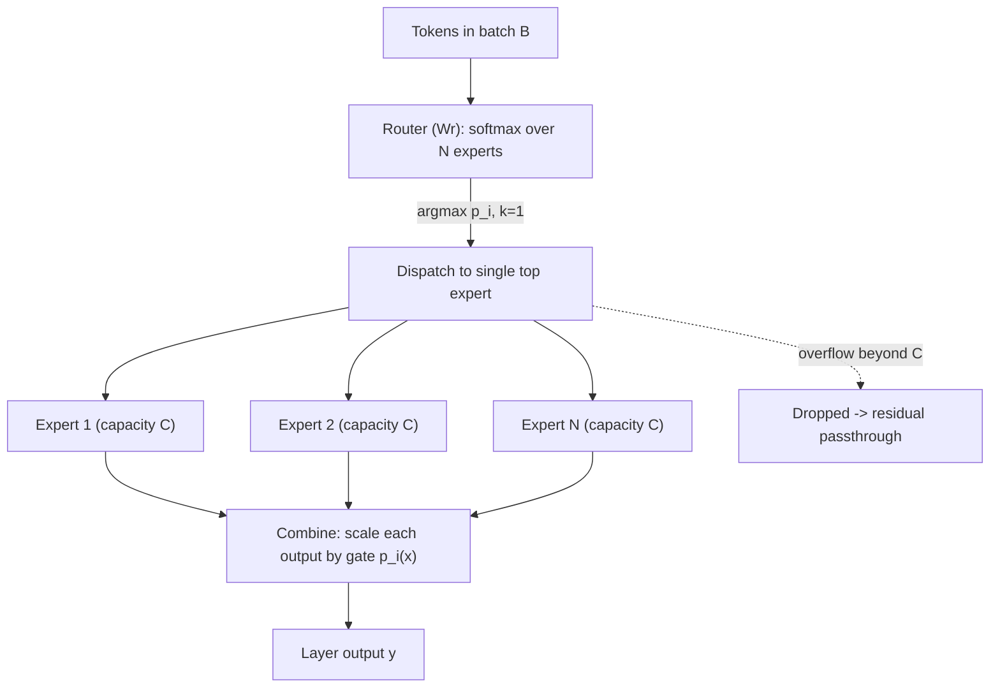
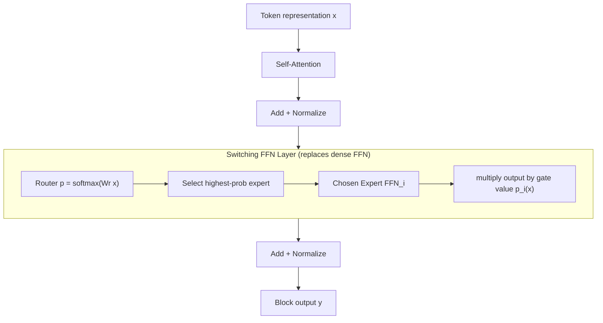

This is a technical dissection of the **Switch Transformer** — Fedus, Zoph, and Shazeer's sparsely-activated Mixture-of-Experts architecture. The focus is the engineering system: why densely scaling a Transformer couples two things you would rather separate, how routing decouples them, the routing simplification that makes it cheap, the capacity and load-balancing machinery that makes dynamic routing run on static hardware, the parallelism strategies that push it to a trillion parameters, and the trade-offs the design accepts.

We are not reproducing the full results suite. The scaling curves and benchmark tables matter here only as evidence that the sparsity actually buys what it promises.

**Attribution convention.** Because this article mixes what the paper says with my own reasoning, every non-obvious technical claim is tagged:

- **[Paper]** — stated explicitly in Switch Transformers (arXiv:2101.03961).
- **[Derived]** — a mathematical or logical consequence of the paper's equations, worked out here.
- **[Interpretation]** — my explanation or engineering reasoning, written for the reader; not a claim the paper makes.

---

## Why This Paper Matters

Dense Transformers scale by making every parameter participate in every token's computation. Double the parameters and you roughly double the FLOPs per token. **[Interpretation]** That coupling is the wall. The Switch Transformer's thesis is that **parameter count and compute per token are separate axes**, and you can scale the first while holding the second fixed. **[Paper]**

The payoff: a Switch model FLOP-matched to T5-Base trains **7×+** faster to the same quality, and the architecture scales to a **1.6-trillion-parameter** model (Switch-C) that beats T5-XXL's pre-training speed by **4×** — at the same compute budget. **[Paper]** The whole paper is about the engineering required to make "activate only a slice of a huge model per token" actually run efficiently on hardware built for dense matrix multiplies. **[Interpretation]**

## The Baseline Problem: Dense Scaling Couples Parameters to Compute

Scaling laws (Kaplan et al.) showed model quality improves with parameters, data, and compute — and, crucially, that it is compute-efficient to train **large models on relatively little data**. **[Paper]** The standard response was to grow $d_{\text{model}}$, $d_{ff}$, layers, and heads in tandem. That works but is "extremely computationally intensive": every added parameter is paid for on every token. **[Paper]**

Switch investigates a **fourth axis** — increase parameters while keeping FLOPs per example constant. **[Paper]** The hypothesis is that parameter count, independent of the computation performed, is separately valuable. **[Paper]** If true, you get the quality benefits of a bigger model without the per-token compute bill.

## The Core Idea: Sparse Activation via Routing

The mechanism is Mixture-of-Experts. **[Paper]** Replace the single dense feed-forward network (FFN) in a Transformer block with $N$ **experts** — $N$ independent FFNs — and a small **router** that decides which expert(s) each token goes to. Only the selected expert(s) run for a given token, so the compute per token stays flat as $N$ grows. **[Paper]** The parameters live in the experts; the sparsity lives in the routing.

## Switch Routing: From Top-k to k = 1

Classic MoE (Shazeer et al., 2017) routes each token to its **top-$k$** experts. The router produces logits $h(x) = W_r \cdot x$, softmaxed into gate values: **[Paper]**

$$
p_i(x) = \frac{e^{h(x)_i}}{\sum_{j}^{N} e^{h(x)_j}}
$$

and the layer output is the gate-weighted sum over the selected top-$k$ set $\mathcal{T}$: **[Paper]**

$$
y = \sum_{i \in \mathcal{T}} p_i(x)\, E_i(x)
$$

Prior work assumed $k \geq 2$ was **necessary** — the intuition being that you need to compare at least two experts to get a useful gradient into the router. **[Paper]** Switch's central simplification is to reject that: route each token to a **single** expert ($k = 1$), the "Switch layer." **[Paper]** The gate value $p_i(x)$ still multiplies the expert output, so the router remains differentiable even with one expert selected. **[Paper]**

Dropping to $k=1$ buys three concrete engineering wins: **[Paper]**

1. **Less router compute** — one routing decision per token, not $k$.
2. **Half the expert capacity** — each expert receives tokens from only one route, so its buffer can be at least halved (next section).
3. **Simpler routing, less communication** — fewer tokens crossing devices.

And it does this *without* losing quality — the paper shows $k=1$ preserves model quality and actually performs better. **[Paper]** This is the paper's cleanest result: a widely-assumed constraint was simply wrong. **[Interpretation]**

## Expert Capacity and the Capacity Factor

Here is the hardware tension. TPUs require **statically-declared tensor sizes** at compile time, but routing is **dynamic** — you don't know until runtime how many tokens will pick each expert. **[Paper]** Switch reconciles them by giving every expert a **fixed** buffer, the *expert capacity*: **[Paper]**

$$
\text{expert capacity} = \frac{\text{tokens per batch}}{\text{number of experts}} \times \text{capacity factor}
$$

- **tokens per batch / number of experts** — the capacity under perfectly uniform routing. **[Derived]**
- **capacity factor** — a multiplier $> 1.0$ that adds slack for imbalance. **[Paper]**

The consequence is a genuine trade-off with no free setting: **[Paper]**

- If more tokens route to an expert than its capacity, the overflow tokens are **dropped** — their computation is skipped and the representation passes straight through via the residual connection. **[Paper]**
- If capacity is set high, the unused slots are padding — **wasted compute and memory**. **[Paper]**

Empirically, keeping the drop rate low matters for scaling, and with the load-balancing loss the drop rate is typically **<1%**. **[Paper]** Switch performs best at **low** capacity factors (1.0, 1.25) — exactly the regime you want in the large-model setting where per-device memory is scarce. **[Paper]**

## The Load-Balancing Loss

Nothing in the objective naturally prevents the router from collapsing onto a few favorite experts — which would starve capacity and drop tokens. **[Interpretation]** Switch adds a differentiable auxiliary loss per Switch layer, summed into the total loss. For $N$ experts and a batch $B$ of $T$ tokens: **[Paper]**

$$
\text{loss} = \alpha \cdot N \cdot \sum_{i=1}^{N} f_i \cdot P_i
$$

where the two vectors are: **[Paper]**

$$
f_i = \frac{1}{T} \sum_{x \in B} \mathbb{1}\{\arg\max p(x) = i\}, \qquad P_i = \frac{1}{T} \sum_{x \in B} p_i(x)
$$

- **$f_i$** — the *fraction of tokens actually dispatched* to expert $i$ (a hard count; **not** differentiable). **[Paper]**
- **$P_i$** — the *fraction of router probability mass* assigned to expert $i$ (soft; **differentiable**). **[Paper]**
- **$\alpha$** — a small coefficient, set to $10^{-2}$ (swept $10^{-1}$ to $10^{-5}$): large enough to balance load, small enough not to overwhelm the cross-entropy objective. **[Paper]**
- **factor of $N$** — keeps the loss magnitude constant as the expert count varies, since under uniform routing $\sum_i f_i P_i = 1/N$. **[Paper]**

The design is a nice trick: you want to penalize the *hard* dispatch imbalance $f_i$, but it has no gradient, so you multiply it against the *soft*, differentiable $P_i$. The product is minimized exactly when both are uniform ($1/N$ each) — pushing the router toward balanced load through a gradient it can actually follow. **[Interpretation]**

## The Architecture in Place

The Switch FFN layer operates **independently per token** and typically replaces the dense FFN at **every other** layer (expert frequency 1/2); Switch-C uses every layer. **[Paper]** Everything else in the block — attention, residuals, norms — is unchanged. **[Paper]**

## Distributed Implementation and the Three Parallelisms

Switch is built in Mesh-TensorFlow, which abstracts physical cores into a logical mesh and shards tensors along named dimensions. **[Paper]** The key architectural fact for scaling: **expert weights are split across devices**, so total parameters grow with the number of devices while each device's memory and compute footprint stays manageable. **[Paper]** Three parallelism strategies compose: **[Paper]**

| Strategy | What is split | What is replicated | Communication |
|---|---|---|---|
| **Data parallelism** | the data batch | model weights (on every core) | gradient all-reduce |
| **Model parallelism** | model weights (a layer sharded across cores) | the data | activation all-reduce |
| **Expert parallelism** | experts (one/few per device) | non-expert weights | token **all-to-all** (route to expert's device) |

Expert parallelism is the one Switch adds: to run expert $i$, the tokens routed to it must be physically shipped to the device holding it — an **all-to-all** communication — and the results shipped back. **[Paper]** This is exactly why $k=1$ routing and low capacity factors matter: they directly shrink the volume of that all-to-all. **[Interpretation]** When model *and* expert parallelism are combined, you pay both the all-to-all (routing) and the all-reduce (model-parallel) costs, and the best mapping of the three axes onto hardware is determined empirically. **[Paper]**

This is the same design space as [ZeRO](/engineering/zero-memory-optimization-training-large-models/), from the opposite direction: ZeRO shards the *optimizer state, gradients, and parameters of a dense model* to fit it across devices; Switch shards *distinct expert parameters* so the model is large **by construction** and each device holds only its slice. **[Interpretation]** Both are answers to "the model no longer fits on one accelerator," and both live or die on communication cost.

## Making Sparse Training Stable

Sparse expert models are harder to train than dense ones — the hard routing decisions and low-precision softmax create instability. **[Paper]** Three techniques fix it.

**Selective precision.** `bfloat16` throughout diverges (quality collapses to $-3.780$). **[Paper]** Rather than fall back to full `float32` (stable but with expensive `float32` all-to-all traffic), Switch casts **only the router's input** to `float32`, does the routing math locally on-device, then recasts the dispatch/combine tensors back to `bfloat16` **before** any all-to-all communication. **[Paper]** The result: `float32` stability at nearly `bfloat16` speed. **[Paper]**

| Precision | Neg. Log Perp. | Speed (ex/s) |
|---|---|---|
| float32 | −1.718 | 1160 |
| bfloat16 | −3.780 (**diverged**) | 1390 |
| **selective** | **−1.716** | **1390** |

**Smaller initialization.** Weights are drawn from a truncated normal whose scale is set by a hyperparameter $s$; Switch reduces the default $s = 1.0$ by **10×**. **[Paper]** This dramatically improves quality and — the point — collapses the run-to-run variance: a 32-expert model early in training goes from $-3.60$ (std **0.68**) at the default scale to $-2.72$ (std **0.01**) at $0.1\times$. **[Paper]** The same scheme works from 223M to over a trillion parameters. **[Paper]**

**Expert dropout.** With far more parameters than the FLOP-matched dense baseline, Switch overfits small fine-tuning tasks. **[Paper]** Raising dropout everywhere hurts; instead Switch uses a **low** rate (0.1) at non-expert layers and a **high** rate (0.4) inside the experts — lifting GLUE to 85.2 vs 84.7 at uniform 0.1. **[Paper]**

## Scaling to a Trillion Parameters

Experts are "the most efficient dimension for scaling" because adding them leaves compute roughly fixed — the router's only extra cost is $O(d_{\text{model}} \times \text{num experts})$, a lightweight distribution over more choices. **[Paper]** Two flagship models: **[Paper]**

| Model | Params | Experts | FLOPs/seq | Parallelism |
|---|---|---|---|---|
| T5-XXL (dense baseline) | 11B | — | 6.3T | model + data |
| **Switch-XXL** | 395B | 64 | 6.3T | expert + model + data |
| **Switch-C** | **1.571T** | **2048** | 890B | **expert only** |

Both beat T5-XXL's C4 negative-log-perplexity by >0.061 at 250k steps; Switch-C is **4× faster** to a fixed perplexity. **[Paper]**

There is a counterintuitive stability result worth stating. The **larger** model, Switch-C (1.6T params, 2048 experts) exhibited **no** training instability, while the "smaller" Switch-XXL (395B, but ~10× the FLOPs per sequence) was sometimes unstable. **[Paper]** The lesson: instability tracks **FLOPs/compute density and model-parallel communication**, not raw parameter count — Switch-C is huge but computationally light and uses only expert parallelism (no model-parallel all-reduce), so it stays stable. **[Interpretation]**

## Distilling the Sparsity Away

A trillion-parameter model is inconvenient to deploy, so Switch distills sparse teachers back into small dense students. **[Paper]** Two techniques compound: initialize the dense student with the teacher's **non-expert weights** (possible precisely because student and teacher are FLOP-matched, so the shared layers have identical dimensions), and train on a **0.25 teacher / 0.75 ground-truth** label mixture. **[Paper]** Together they preserve **~30%** of the sparse model's quality gain at roughly **1/20th** the parameters; at 99% compression, ~28% of the gain survives. **[Paper]** The engineering reading: most of a sparse model's advantage is not recoverable in a small dense model, but a useful fraction is — enough to justify training big and serving small. **[Interpretation]**

## Engineering Trade-offs

- **Memory vs. dropped tokens.** The capacity factor trades wasted padding against dropped tokens; there is no setting that avoids both. **[Paper]**
- **Communication overhead.** Expert parallelism adds all-to-all traffic on every Switch layer — the reason $k=1$ and low capacity factors are load-bearing, not incidental. **[Paper]**
- **Parameter count vs. deployability.** You get a trillion parameters cheaply to *train*, but serving them is awkward, which is why distillation is part of the story. **[Interpretation]**
- **Stability engineering required.** Sparse models don't train stably out of the box; the three techniques above are prerequisites, not optional polish. **[Interpretation]**

## Engineering Takeaway

The Switch Transformer is a sequence of decisions that each remove a cost of Mixture-of-Experts:

- Route to **one** expert, not $k$ — killing the assumption that made MoE routing expensive, and halving expert capacity and communication. **[Paper]**
- Give each expert a **fixed capacity** with a tunable factor — reconciling dynamic routing with static-shape hardware. **[Paper]**
- Balance load with a loss that multiplies the **non-differentiable** dispatch fraction against the **differentiable** probability mass — so a hard constraint gets a soft gradient. **[Paper]**
- Stabilize with **local float32 routing**, **smaller init**, and **expert-only dropout** — the difference between diverging and training a trillion parameters. **[Paper]**
- Shard **experts across devices** so the parameter count scales with the hardware, then **distill** back down for deployment. **[Paper]**

The lasting idea is the decoupling: **parameters and compute-per-token are independent axes, and routing is the mechanism that separates them.** **[Interpretation]** Switch is the paper that made that separation practical at scale — and every sparse MoE model since has been built on this template.
