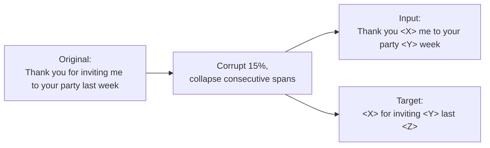

This is a technical dissection of **T5** — Raffel et al.'s "Text-to-Text Transfer Transformer." The focus is the engineering: the single design decision (everything is text-to-text) that lets one model cover every task, the span-corruption objective that pre-trains it, and — most importantly — the *systematic study* that turns "which of these dozens of transfer-learning tricks actually matter?" into a controlled experiment with answers.

T5's lasting value is not one clever mechanism; it is a rigorous ablation of the whole design space, plus the framing that made that ablation possible. We treat it that way. **[Interpretation]**

**Attribution convention.** Because this article mixes what the paper reports with my own reasoning, every non-obvious technical claim is tagged:

- **[Paper]** — stated explicitly in Raffel et al. (arXiv:1910.10683).
- **[Derived]** — a mathematical or logical consequence of the paper's setup, worked out here.
- **[Interpretation]** — my explanation or engineering reasoning, written for the reader; not a claim the paper makes.

---

## Why This Paper Matters

Before T5, comparing transfer-learning methods for NLP was apples-to-oranges: every paper changed the architecture, the objective, the data, and the fine-tuning recipe all at once, so you could never tell *which* change earned the gain. **[Interpretation]** T5's move is to build **one framework general enough to hold all of these constant** and vary a single factor at a time. **[Paper]**

The framework is the **text-to-text** format: every task takes text as input and produces text as output, so the same model, loss, hyperparameters, and decoding procedure apply everywhere. **[Paper]** On top of that, the paper runs a large, disciplined empirical survey — architectures, objectives, datasets, fine-tuning strategies, and scaling — and then combines the winning choices with scale (up to **11 billion parameters** trained on **~1 trillion tokens**) to reach state-of-the-art on many benchmarks. **[Paper]** The authors are explicit that their goal is **not to propose a new method** but to map where the field stands. **[Paper]**

## The Core Idea: Everything Is Text-to-Text

Cast every problem as "text in, text out." **[Paper]** A translation example becomes the input `translate English to German: That is good.` → target `Das ist gut.` A classification example becomes `cola sentence: The course is jumping well.` → target `not acceptable`. Even a *regression* task (STS-B similarity, a real number) is handled by emitting the number as a string like `3.8`. **[Paper]**

The payoff is uniformity: one model, one maximum-likelihood loss, one decoder — no task-specific heads, no task-specific loss functions. **[Paper]** The task is specified by a **text prefix** in the input, which is what lets a single set of weights serve translation, QA, summarization, and classification at once. **[Interpretation]** This framing is the enabling infrastructure for the entire study — it is *why* the ablations are comparable. **[Interpretation]**

## The Baseline Model

The baseline is a standard **encoder-decoder Transformer**, close to the original Vaswani et al. design, with the encoder and decoder each sized like `BERT_BASE`: 12 layers each, $d_{\text{model}}=768$, $d_{\text{ff}}=3072$, 12 heads — about **220M parameters** total (roughly twice `BERT_BASE`, because there are two stacks). **[Paper]** Key implementation specifics that matter for reproduction: **[Paper]**

- **Objective:** span-corruption denoising (below), trained with cross-entropy and teacher forcing.
- **Optimizer:** **AdaFactor** — chosen for sublinear memory, important at scale. **[Paper]**
- **LR schedule:** "inverse square root," $\text{lr} = 1/\sqrt{\max(n, k)}$ for step $n$ and warmup $k$. **[Paper]**
- **Tokenizer:** SentencePiece / WordPiece, **32,000** tokens, trained on a 10:1:1:1 mix of English/German/French/Romanian so the model can handle the translation tasks. **[Paper]**
- **Sequence/batch:** length 512, batch 128 during the baseline pre-training. **[Paper]**
- **Normalization & position:** a simplified LayerNorm (rescale only, **no additive bias**) placed **outside** the residual path, and **relative position embeddings** — 32 log-spaced buckets up to offset 128, shared across layers, added as a scalar to the attention logits. **[Paper]**

That LayerNorm-without-bias / outside-residual choice and the shared relative-position scheme are the only real deviations from the 2017 Transformer, and the paper deliberately does not ablate them. **[Paper]**

## The Span-Corruption Objective

The denoising objective is where the engineering economy lives. **[Interpretation]** Inspired by BERT's masked language modeling, T5 randomly corrupts **15% of tokens**, but with two efficiency twists: **[Paper]**

1. **Consecutive corrupted tokens are collapsed into a single sentinel** (a unique special token per span), rather than one mask per token.
2. **The target is only the dropped spans** — each prefixed by its sentinel, ending with a final sentinel — not the full reconstructed sequence.

The design intent is stated plainly: masking *spans* and predicting *only* the corrupted tokens both exist to **reduce compute** by producing short targets. **[Paper]** A shorter target sequence means less decoder self-attention and faster pre-training — a systems choice disguised as a modeling choice. **[Interpretation]**

## The Systematic Study — What Actually Matters

This is the heart of the paper: hold everything fixed, vary one axis, read the table. **[Interpretation]** The numbers below are the paper's validation-set scores (GLUE, SuperGLUE = SGLUE, SQuAD, etc.); a ★ marks the baseline configuration.

### Architecture: encoder-decoder wins

A subtlety the paper is careful about: an $L{+}L$-layer encoder-decoder has **~2× the parameters** of an $L$-layer decoder-only model but **roughly the same compute (FLOPs)**, because the two stacks each process their own (shorter) sequence. **[Paper]** So comparing them fairly means fixing FLOPs, not params. **[Interpretation]**

| Architecture | Objective | GLUE | SQuAD | SGLUE |
|---|---|---|---|---|
| ★ Encoder-decoder | Denoising | 83.28 | 80.88 | 71.36 |
| Enc-dec, shared params | Denoising | 82.81 | 80.63 | 70.73 |
| Language model (decoder-only) | Denoising | 74.70 | 61.14 | 55.02 |
| Prefix LM | Denoising | 81.82 | 78.94 | 68.11 |

The **encoder-decoder with a denoising objective wins across the board**; the decoder-only LM is far behind, and even the prefix-LM trails. **[Paper]** Sharing encoder/decoder parameters **halves the parameter count with only a small drop** — a useful lever when memory is tight. **[Paper]**

### Objective: most denoising variants tie — so pick the cheap one

| Objective | GLUE | SQuAD | SGLUE |
|---|---|---|---|
| Prefix language modeling | 80.69 | 77.99 | 65.27 |
| BERT-style (MLM) | 82.96 | 80.65 | 69.85 |
| Deshuffling | 73.17 | 67.61 | 58.47 |

Denoising clearly beats language-modeling and deshuffling. **[Paper]** But when the paper then compares *variants* of denoising (BERT-style, MASS-style, replace-spans, drop-tokens), **they all perform about the same**. **[Paper]** The engineering conclusion is pragmatic: since quality is a wash, **choose the variant with the shortest targets** for computational efficiency. **[Paper]**

- **Corruption rate:** 10/15/25% are near-identical; **50% degrades** GLUE and SQuAD. Stick with 15%. **[Paper]**
- **Span length:** average span length **3 is slightly but significantly best**; length 10 underperforms. **[Paper]**

### Data: C4, and don't repeat a small corpus

The paper introduces **C4 (Colossal Clean Crawled Corpus)** — ~750 GB of Common Crawl filtered by blunt but effective heuristics: keep lines ending in terminal punctuation, drop pages with `{` (removes code), drop bad-words / boilerplate / "lorem ipsum", deduplicate 3-sentence spans, keep only high-confidence English. **[Paper]** Two findings: in-domain data can help specific tasks, but constraining to one domain shrinks the set; and crucially, **repeating a small corpus many times measurably hurts** — the model starts memorizing, and training loss drops while downstream quality suffers. **[Paper]** This is the argument for a large, diverse corpus. **[Interpretation]**

### Training strategy: full fine-tuning still wins

| Fine-tuning method | GLUE | SGLUE | EnDe |
|---|---|---|---|
| ★ All parameters | 83.28 | 71.36 | 26.98 |
| Adapter layers ($d{=}512$) | 81.54 | 64.30 | 23.45 |
| Gradual unfreezing | 82.50 | 70.79 | 26.71 |

Updating **all** parameters beats parameter-efficient alternatives (adapters, gradual unfreezing) — at higher cost. **[Paper]** (This is the 2019 verdict; parameter-efficient methods like [LoRA](/engineering/lora-low-rank-adaptation-of-large-language-models/) later closed much of this gap — a reminder that ablation conclusions are dated to their moment.) **[Interpretation]** On multi-task learning, no mixing-proportion strategy matched plain pre-train-then-fine-tune — but **multi-task pre-training followed by fine-tuning matched unsupervised pre-training**, with the practical bonus of monitorable downstream metrics throughout training. **[Paper]**

### Scaling: "you got 4× compute — how do you spend it?"

The paper frames scaling as a budget question. **[Paper]** Starting from the 220M baseline:

| Strategy (all 4× compute) | GLUE | SQuAD | SGLUE |
|---|---|---|---|
| ★ Baseline (1×) | 83.28 | 80.88 | 71.36 |
| 1× size, 4× steps | 85.33 | 82.45 | 74.72 |
| 2× size, 2× steps | 86.18 | 84.18 | 77.18 |
| 4× size, 1× steps | 85.91 | 83.86 | 78.04 |
| 4× ensembled | 84.77 | 83.09 | 71.74 |

Every form of scaling helps; **bigger model and more steps are complementary** (2×-size-2×-steps ≈ 4×-size), and **ensembling is an orthogonal lever**. **[Paper]** The trade-off is deployment cost: a bigger model is expensive at inference forever, whereas a small model trained longer amortizes its cost across many downstream uses. **[Paper]** This "scale wins, spend it on size" story is the same empirical thesis as the [scaling laws](/engineering/scaling-laws-for-neural-language-models/) work, arrived at from a different direction. **[Interpretation]**

## Putting It All Together: T5-11B

The final models fold in the winning choices: **span-corruption** objective (mean span 3, 15%), **1 million steps × batch $2^{11}$ × length 512 ≈ 1 trillion tokens** on C4, **multi-task pre-training** then per-task fine-tuning, beam search for long-output tasks. **[Paper]** Sizes span **60M (Small) / 220M (Base) / 770M (Large) / ~2.8B (3B) / ~11B (11B)** — and notably the big models scale **$d_{\text{ff}}$** aggressively (up to 65,536) because **large dense feed-forward matmuls are what TPUs run most efficiently.** **[Paper]** That is a hardware-shaped architecture decision, not a modeling one. **[Interpretation]**

T5-11B reaches SOTA on many benchmarks and pushes **SuperGLUE from 84.6 to 88.9**, nearly matching the human baseline of 89.8. **[Paper]** Honest negatives: it **does not** beat SOTA on WMT translation — the authors attribute this to English-only pre-training and the competitors' use of backtranslation. **[Paper]**

## Is It Just Scale? A Controlled Answer

The paper asks the skeptical question directly and answers it with an experiment. **[Interpretation]** Comparing three configs on identical downstream tasks: **[Paper]**

| Model | GLUE | SQuAD | SGLUE |
|---|---|---|---|
| ★ Baseline | 83.28 | 80.88 | 71.36 |
| Baseline-1T (baseline recipe, but 1T tokens) | 84.80 | 83.01 | 73.90 |
| T5-Base (all the study's changes, 1T tokens) | 85.97 | 85.44 | 75.64 |

Baseline-1T isolates *pure extra pre-training*; T5-Base adds the study's **non-scaling** design choices on top. T5-Base **substantially beats** Baseline-1T on every task, so **scale is not the only factor** — the systematic-study choices contribute real gains independent of compute. **[Paper]** That is the paper defending its own thesis against the "it's all scale" critique. **[Interpretation]**

## Engineering Trade-offs

- **Encoder-decoder: 2× params, ~1× FLOPs.** You pay memory, not compute, for the second stack — and can reclaim half the params by sharing them at a small quality cost. **[Paper]**
- **Short targets are a compute lever.** Span-collapse-and-sentinel exists to shrink decoder sequences; the objective's *quality* is insensitive to the variant, so optimize for speed. **[Paper]**
- **Data quantity over repetition.** A large diverse corpus beats re-reading a small clean one; repetition induces memorization. **[Paper]**
- **Full fine-tuning was best in 2019 — but expensive.** The verdict predates modern PEFT; treat it as a snapshot, not a law. **[Interpretation]**
- **Architecture bent toward the accelerator.** Scaling $d_{\text{ff}}$ for TPU matmul efficiency is a systems choice baked into the model shape. **[Paper]**

## Engineering Takeaway

T5's contribution is method *and* discipline:

- **One framing — text-to-text — makes all tasks and all methods comparable**, which is what lets the rest of the study exist. **[Paper]**
- The **encoder-decoder + span-corruption denoising** combination wins, and among denoising variants you should pick the one with the **shortest targets**. **[Paper]**
- **C4** and the "don't repeat small data" finding shaped how pre-training corpora are built. **[Paper]**
- **Scale helps enormously and is spendable in complementary ways**, but a controlled experiment shows the **non-scaling design choices matter on top of scale**. **[Paper]**

## How This Connects to the Rest of the Stack

- **[BERT](/engineering/bert-pretraining-deep-bidirectional-transformers/)** is T5's foil and inspiration: T5's denoising objective descends from BERT's MLM, and T5's architecture study directly re-examines the encoder-only vs encoder-decoder question BERT popularized — concluding encoder-decoder wins for a *generative* text-to-text setup. **[Interpretation]**
- **[Switch Transformers](/engineering/switch-transformers-scaling-to-trillion-parameter-models/)** is built *on* this exact stack — the T5 encoder-decoder, the C4 corpus, and Mesh-TensorFlow model/data parallelism — replacing dense feed-forward layers with sparse experts. T5 is the dense backbone that MoE work scales. **[Interpretation]**
- **[Scaling Laws](/engineering/scaling-laws-for-neural-language-models/)** reaches the same "spend compute on scale" conclusion from power-law fits; T5's Section 3.6 is the same lesson observed empirically on a fixed budget. **[Interpretation]**

The single sentence to carry away: **make every task text-to-text, then let a controlled study — not intuition — pick the architecture, objective, and data — and scale the winner.** **[Interpretation]**
