This is an engineering dissection of **TensorRT-LLM** — NVIDIA's open-source library for building optimized LLM inference engines. The focus is the *serving system*, not the kernels: why serving an LLM is a fundamentally harder problem than a single forward pass, why the **KV cache** (not raw compute) is usually the wall, and how TensorRT-LLM's stack — **paged KV cache**, **in-flight batching**, a **two-level request scheduler**, chunked prefill, reuse, eviction, and offloading — all cooperate to keep a GPU busy under a *fixed memory budget*.

The engine is open at **[https://github.com/NVIDIA/TensorRT-LLM](https://github.com/NVIDIA/TensorRT-LLM)**, and this article connects each concept to the actual source tree so it is reconstructable in your head — and answerable in an interview.

**Attribution convention.** Because this mixes documented behavior, teaching examples, and my own reasoning, every non-obvious claim is tagged:

- **[Documented]** — described in TensorRT-LLM's docs or source (enum names and paths below were verified against the current repository where noted).
- **[Educational]** — a worked formula, example, or simulation written here to build intuition; not a verbatim NVIDIA specification.
- **[Interpretation]** — my engineering reasoning, written for the reader.
- **[Verify]** — plausible but version-sensitive (e.g. exact metric strings); check against your installed build before quoting it as fact.

TensorRT-LLM shares vocabulary and high-level techniques with vLLM, SGLang, and Mooncake, but it has its **own** KV-cache manager, scheduler, runtime, and execution path. I will not claim it is a copy of any of them.

---

## The Thesis: A Serving Engine Is a Memory Allocator With a Neural Network Attached

Here is the mental model this whole article defends. **[Interpretation]**

> A production LLM serving system is, first, a **memory allocator** — and second, a thing that runs matrix multiplications.

Almost every design decision in TensorRT-LLM — paging, block reuse, eviction policy, scheduler policy, chunking, offloading, quantization — is a **memory-management decision first and a compute decision second**. Once you see serving that way, the architecture stops looking like a bag of features and starts looking like one coherent loop:

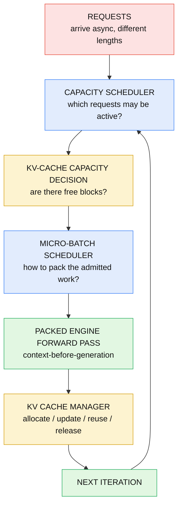

Keep this loop in mind — every section below is one box in it.

**What you should be able to explain:** *Why is it fair to call a serving engine "a memory allocator with a neural network attached"? What resource is being allocated, and why is it scarce?*

## I. The Inference Bottleneck: Why Serving Is Harder Than a Forward Pass

The naive mental model — the one most people carry in from a notebook — is:

```
load model → tokenize → generate() → return text
```

That model hides three brutal facts that dominate production serving. **[Interpretation]**

**1. Generation is sequential.** A model with billions of parameters produces *one* token per forward pass during decode. To write a 500-token answer you run the network ~500 times, and each pass depends on the last. You cannot parallelize step $t+1$ before step $t$ exists. **[Documented]**

**2. Memory — not compute — is usually the wall.** Each in-flight request carries a **KV cache** whose size grows *linearly* with its sequence length. Once you run out of KV-cache space, you cannot admit another request no matter how idle the compute units are. **[Interpretation]**

**3. Requests are heterogeneous and asynchronous.** One user sends a 4,000-token document to summarize; another sends "hi". They arrive at unpredictable times and generate wildly different output lengths. A naive batch that waits for the longest request leaves the GPU half-idle. **[Interpretation]**

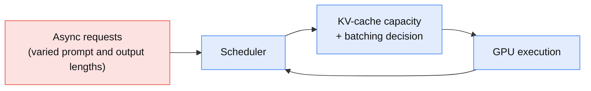

So there are really *three* distinct axes a serving engine must manage — and they are not the same problem:

- **Model computation** — the matmuls per forward pass.
- **Memory capacity** — how many sequences' KV caches fit at once.
- **Request scheduling** — who runs this iteration, and how they are packed.

**What you should be able to explain:** *Name the three facts the `generate()` mental model hides. Why can a GPU be compute-idle and still unable to admit a new request?*

## II. Prefill vs Decode: Two Phases With Opposite Hardware Behavior

Every request runs in **two phases**, and confusing them is the single most common serving mistake. **[Documented]**

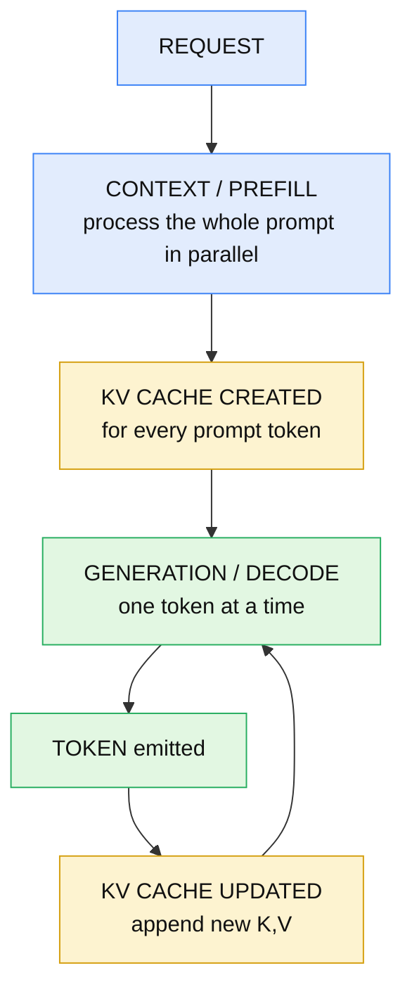

**Prefill / context.** The entire prompt is processed *together*. All positions are known, so the query/key/value projections and attention run as dense **matrix–matrix** multiplies — highly parallel and compute-efficient. Prefill populates the KV cache for the whole prompt and strongly influences **TTFT** (time to first token). **[Documented]**

**Decode / generation.** Output tokens are produced one at a time. At step $t$ only the newest key/value are computed; every earlier position is *read from the cache*. Each step is a thin **matrix–vector** multiply that cannot be parallelized across steps, so it **underutilizes the GPU and is memory-bandwidth-bound**. **[Documented]**

### What the KV cache actually stores

Inside each attention layer, every position $i$ is projected to a query, key and value:

$$
q_i = W_q x_i,\qquad k_i = W_k x_i,\qquad v_i = W_v x_i
$$

and the output attends over *all earlier positions*:

$$
o_i = \sum_{j=1}^{i} a_{ij}\, v_j,\qquad a_{ij} = \frac{\exp\!\left(q_i^\top k_j / \sqrt{d}\right)}{\sum_{t=1}^{i}\exp\!\left(q_i^\top k_t / \sqrt{d}\right)}
$$

That lower summation limit is the whole story: to compute position $i$ you need the $k_j, v_j$ of **every earlier position**. So the system caches them — per layer, because each layer has its own $W_k, W_v$. The cache **grows with sequence length** because each new token adds one more $(k,v)$ per layer, and during decode each step **appends** exactly one token's worth of K and V. **[Documented]/[Interpretation]**

This is why the KV cache matters more and more as requests get longer, and why it — not the weights — is the object that varies per request.

**What you should be able to explain:** *Why is prefill compute-bound but decode memory-bound? What exactly is stored in the KV cache, why per layer, and what gets appended each decode step?*

## III. Why Decode Is Bandwidth-Bound (and Why Batching Fixes It)

Take the simplest case: a dense model with $P$ parameters at 2 bytes each (FP16), batch size $B=1$. **[Educational]**

- To decode one token you must **read every weight once**: $\approx 2P$ bytes moved.
- The matmuls do $\approx 2P$ FLOPs (one multiply-add per parameter = 2 FLOPs).

So the **arithmetic intensity** is:

$$
\text{intensity} \approx \frac{2P \text{ FLOPs}}{2P \text{ bytes}} = 1 \ \text{FLOP/byte}
$$

A modern accelerator can do *hundreds* of FLOPs per byte of memory bandwidth. At 1 FLOP/byte the compute units sit idle waiting on memory — decode is **memory-bandwidth-bound**. **[Educational]/[Interpretation]**

Now batch $B$ requests. The **same weights** serve all $B$ tokens, so weight movement stays $\approx 2P$ bytes, but the FLOPs become $\approx 2P\cdot B$:

$$
\text{intensity} \approx \frac{2P \cdot B}{2P} = B \ \text{FLOPs/byte}
$$

Batching **amortizes the weight read** across $B$ tokens. This is the entire economic argument for batching in decode. **[Educational]**

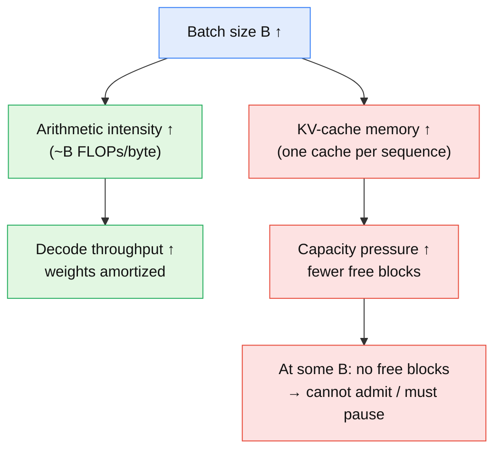

**Important honesty:** additional requests are **not free**. They amortize the weight read, but each one adds its own compute *and* its own KV-cache traffic and capacity cost. That is the central tension: bigger $B$ improves decode intensity, but bigger $B$ also means more KV-cache memory — and KV-cache capacity is finite. Everything downstream (paging, scheduling, eviction) exists to push $B$ as high as the memory budget safely allows. **[Interpretation]**

**What you should be able to explain:** *Why does batching improve arithmetic intensity? Why is an extra request not literally free? What caps how far you can batch?*

## IV. Naive Static Batching and Its Two Taxes

Take four heterogeneous requests: A (short), B (medium), C (short), D (long). Static batching — form a fixed group, run it to completion, then form the next — pays **two distinct taxes**. Keeping them separate is important. **[Interpretation]**

**Tax 1 — the padding tax.** A rectangular tensor forces every row to the longest length:

```
A A A A PAD PAD PAD
B B B B B B  PAD
C C C PAD PAD PAD PAD
D D D D D D D
```

Every `PAD` is wasted computation. TensorRT-LLM attacks this at the *tensor level* with **packed inputs / removal of input padding** (§VI). **[Documented]**

**Tax 2 — the head-of-line (synchronization) tax.** C finishes early but static batching keeps its slot occupied until the whole batch — gated by long request D — completes. The GPU does wasted *scheduling*: a finished sequence holds a slot it no longer needs. TensorRT-LLM attacks this with **in-flight batching** (§V). **[Documented]/[Interpretation]**

The clean way to remember it:

> **Packing removes the padding tax. In-flight batching removes the head-of-line tax.**

They are different problems: padding wastes *computation inside a tensor*; head-of-line wastes a *scheduling opportunity*.

**What you should be able to explain:** *Distinguish the padding tax from the head-of-line tax. Which TensorRT-LLM mechanism removes each?*

## V. In-Flight Batching: The Batch Is Not a Fixed Group

TensorRT-LLM's answer to the head-of-line tax is **in-flight batching** (also called continuous or iteration-level batching). The key reframing: **[Documented]**

> A batch is **not** a fixed group of requests. At *every iteration* the scheduler re-decides which sequences participate.

Each iteration:

1. The scheduler selects work.
2. **Context-phase** requests are placed *before* **generation-phase** requests in the packed input (§XVI explains why this ordering is mandatory).
3. One packed forward pass executes.
4. Active requests append their new K/V.
5. Finished requests release their KV blocks.
6. The next iteration can contain a *different* set of requests.

```
Iter 1        Iter 2        Iter 3
R1 G          R1 G          R1 G
R2 G          R2 G          R2 G
R3 G          R3 G          R4 G
R4 C          R4 G          R5 G
              R5 C          R6 C

C = context/prefill   G = generation/decode
```

Notice R3 finishes after iter 2 and simply drops out; R5, R6 stream in. No batch boundary ever blocks anyone. **[Educational]**

**The dependency you must not violate:** a request cannot decode until *its own* context/prefill has been processed. An un-prefilled request has no KV cache to attend over, so it can only be in the `C` state, never `G`. Different requests legitimately occupy different execution states in the same iteration — some prefilling, most decoding. **[Documented]/[Interpretation]**

**What you should be able to explain:** *Why can the batch composition change every iteration? Why can a request never decode before it has prefilled?*

## VI. Packed Inputs / Remove Input Padding

To make in-flight batching efficient, TensorRT-LLM represents the batch as **packed** (padding-removed) tensors: **[Documented]**

```
WITHOUT PACKING            WITH PACKING
A A A PAD PAD              A A A B B B B B C C
B B B B B                  + metadata: seq boundaries / offsets
C C PAD PAD PAD
```

Instead of a rectangular `[batch, max_len]` tensor, all real tokens are concatenated into one long sequence, and **metadata** (per-sequence lengths / offsets) tells the attention kernel where each sequence begins and ends. This is what the `remove_input_padding` build option enables, and it pairs with the context/fused-attention path. **[Documented]**

Packing matters *especially* for in-flight batching, because a mixed context+generation iteration has wildly different per-row lengths (a 4,000-token prefill next to dozens of single-token decodes); a rectangular tensor would be almost all padding. **[Interpretation]**

**What you should be able to explain:** *What does packing remove, and what metadata does the engine need to interpret a packed tensor correctly?*

## VII. The KV-Cache Math: Why It Dominates Serving Memory

Work it out concretely for a LLaMA-3.1-8B-style model. **[Educational]** Parameters:

- layers $L = 32$
- KV heads $H_{kv} = 8$ (this model uses **GQA** — grouped-query attention)
- head dimension $d = 128$
- bytes per element $= 2$ (FP16/BF16)
- factor $2$ for storing both **K** and **V**

KV bytes **per token**:

$$
2 \times L \times H_{kv} \times d \times 2 = 2 \times 32 \times 8 \times 128 \times 2 = 131{,}072 \text{ bytes} = 128\ \text{KB/token}
$$

For a single sequence of 8,192 tokens:

$$
128\ \text{KB} \times 8192 = 1\ \text{GiB}
$$

**One** long sequence costs a full gigabyte of KV cache. Now multiply by concurrency: 40 such sequences is 40 GiB — already blowing past most of a single GPU's spare memory *after* the weights. This is why KV capacity, not FLOPs, sets the batch ceiling. **[Educational]/[Interpretation]**

### MHA vs GQA vs MQA

The $H_{kv}$ term is the lever. Same model shape, different KV-head counts: **[Educational]**

| Scheme | KV heads | KV/token | vs MHA |
|---|---|---|---|
| **MHA** (one KV head per query head) | 32 | 512 KB | 1× |
| **GQA** (groups share KV heads) | 8 | 128 KB | **¼** |
| **MQA** (all query heads share one KV head) | 1 | 16 KB | **1/32** |

GQA and MQA exist largely *because* of this table: fewer KV heads means dramatically less KV memory per token, which means far higher concurrency for the same GPU. **[Interpretation]**

**What you should be able to explain:** *Compute KV bytes/token from the model dims. Why does GQA cut KV memory ~4× versus MHA, and how does that translate into concurrency?*

## VIII. Paged KV Cache / Paged Attention

If the KV cache is the scarce resource, how you *allocate* it decides everything. The naive approach — one contiguous max-length buffer per sequence — wastes most of it to reservation and fragmentation (the problem [vLLM's PagedAttention](/engineering/vllm-pagedattention-efficient-memory-management-for-llm-serving/) diagnosed). TensorRT-LLM uses the same **block-based** idea, with its own implementation. **[Documented]/[Interpretation]**

The KV cache is divided into fixed-size **blocks**; a sequence's *logical* view maps to scattered *physical* blocks through a **block table** — exactly the OS virtual-memory analogy:

```
OS:   virtual pages ──(page table)──► physical frames
LLM:  logical KV blocks ──(block table)──► physical KV blocks
```

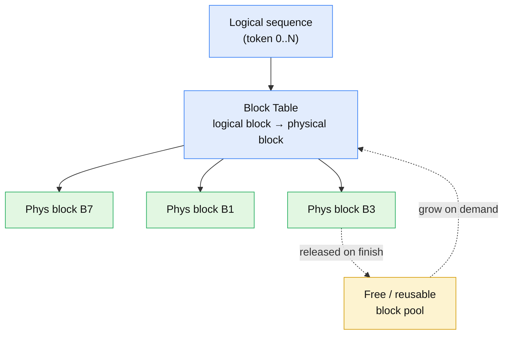

Consequences: **[Documented]/[Interpretation]**

- **No external fragmentation** — every block is the same size.
- **On-demand growth** — blocks are allocated only as the sequence lengthens, so internal waste is capped at <1 block per sequence.
- **Block sharing** — two sequences can point their logical blocks at the same physical block (the basis for reuse, §X).

Paged attention is a *shared serving technique* whose lineage traces to vLLM; TensorRT-LLM implements its own paged KV cache and kernels. **[Interpretation]**

**What you should be able to explain:** *What problem does paged KV cache solve? What are the logical block, physical block, and block table, and why does uniform block size kill external fragmentation?*

## IX. The KV Cache Manager

The component that owns the block pool and block tables is the **KV Cache Manager**. Its three core responsibilities: **[Documented]/[Interpretation]**

1. **Track** each sequence and its logical positions.
2. **Allocate** new physical blocks from the pool as sequences grow.
3. **Recycle** blocks when requests finish or blocks are released.

In the request lifecycle it sits directly under the scheduler:

```
scheduler decision
    ↓
KV-cache availability check   ← "are there enough free blocks?"
    ↓
allocate blocks
    ↓
packed forward pass
    ↓
append / update KV entries
    ↓
release / recycle on completion
```

**Where it lives in the source.** The C++ manager is under `cpp/include/tensorrt_llm/batch_manager/` — principally `kvCacheManager.h` (the block pool, block tables, `KVCacheBlock`-style structures and the manager class). In the PyTorch flow the equivalent lives under `tensorrt_llm/_torch/pyexecutor/` (resource-management and KV-cache-manager modules; the exact filenames have evolved across releases, so check your installed tree rather than trusting a fixed name). **[Documented]/[Verify]**

> Because the C++ and PyTorch backends and their file names shift between releases, treat the paths here as *the area to look in*, not a frozen API. The responsibilities above are stable; the class names may not be.

**What you should be able to explain:** *What three jobs does the KV Cache Manager do? Where does the "are there free blocks?" check sit in the per-iteration loop?*

## X. KV-Cache Reuse / Prefix Caching (Radix Tree)

Reuse answers: *can I avoid recomputing a prefix I have already computed?* **[Documented]**

Consider two requests sharing a system prompt:

```
Request A:  [system prompt][user A]
Request B:  [system prompt][user B]
```

If the `[system prompt]` blocks are already cached, TensorRT-LLM can **reuse** those KV blocks instead of recomputing that prefix. Crucially, reuse is based on **matching cached block content** (matching prefix tokens), not approximate similarity — and only *full* blocks can be shared. **[Documented]**

Filled blocks are organized in a **radix search tree**, so a new request walks the tree to find the longest matching prefix:

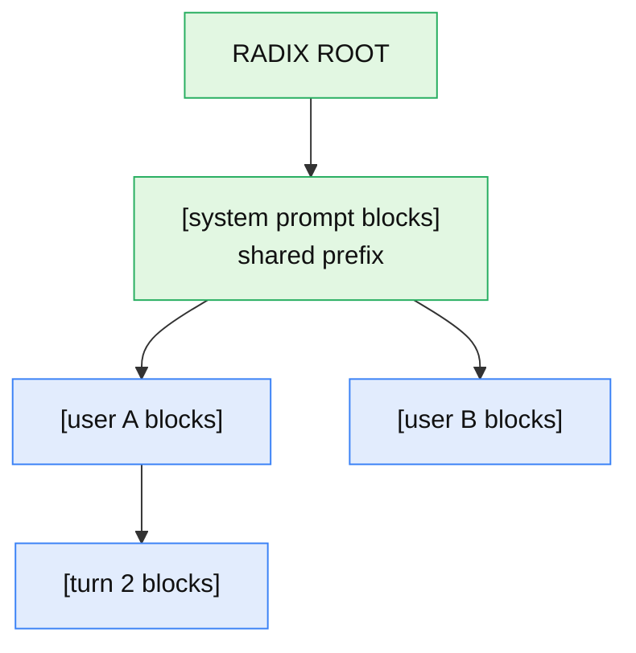

This is controlled by block-reuse configuration (`enable_block_reuse`), interacts with a reuse **priority**, and TensorRT-LLM tracks cache statistics so you can see the hit rate. **[Documented]/[Verify]**

**Reuse ≠ eviction — do not merge them:** **[Interpretation]**

- **Reuse** *preserves* already-computed KV so a later request can skip recomputation.
- **Eviction** (§XI) *discards* cached blocks to reclaim capacity under pressure.

**What you should be able to explain:** *How does prefix reuse avoid recomputation? Why can only full blocks be shared? What is the difference between reuse and eviction?*

## XI. KV-Cache Eviction: Prioritized LRU

When the pool is under memory pressure and a new block is needed, some reusable (cached-but-idle) block must be evicted. TensorRT-LLM's documented scheme is **prioritized LRU**: **[Documented]**

```
choose eviction victim:
  1. lowest priority first
  2. within the same priority → least recently used
```

So lower-priority cached blocks go first, and recency breaks ties within a priority. Eviction is driven by memory pressure, and the requirements of *active* requests constrain what may be evicted (you cannot evict blocks a live sequence still needs). **[Documented]/[Interpretation]**

This is *related to* the LRU-style eviction in SGLang/Mooncake at the conceptual level, but it is **not** the same implementation — TensorRT-LLM adds the priority dimension and has its own manager. Do not describe them as interchangeable. **[Interpretation]**

**What you should be able to explain:** *Describe prioritized LRU. What triggers eviction, and what constrains which blocks can be evicted?*

## XII. Offloading and KV-Cache Quantization

These are two *more* ways to stretch the same fixed budget — and they are distinct from reuse and eviction. **[Interpretation]**

**Host offloading.** Under memory pressure, reusable KV state can be moved from GPU memory into **host (CPU) memory** rather than destroyed outright, so it stays *reusable* later:

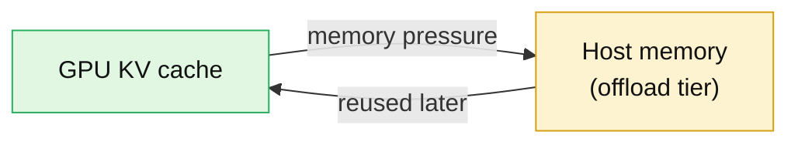

Offloading **extends effective cache capacity** beyond GPU memory, controlled by a host-cache size / priority setting, at the cost of transfer latency. A block offloaded to host is *not* the same as an evicted block — it can come back. **[Documented]/[Interpretation]**

**KV-cache quantization.** Store the cached K/V at lower precision:

```
FP16/BF16 KV  →  lower-precision KV (e.g. FP8)  →  fewer bytes/token  →  more concurrent sequences
```

This is *separate* from weight/activation quantization (§XXVIII). It directly attacks the bytes-per-token term from §VII, so it is especially valuable in the memory-bound regime. **[Documented]/[Interpretation]**

The full KV-cache toolbox, all attacking one budget:

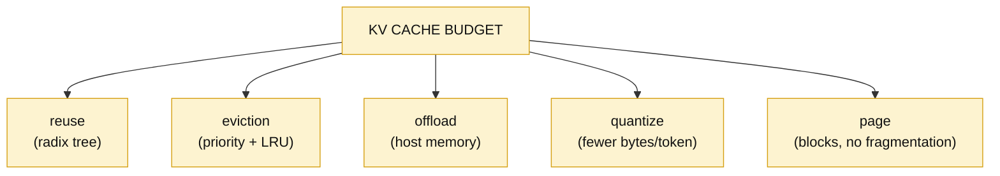

**What you should be able to explain:** *How does offloading differ from eviction? Why is KV quantization separate from weight quantization, and why is it especially useful when serving is memory-bound?*

## XIII. The Two-Level Request Scheduler

This is the heart of TensorRT-LLM's scheduling, and it is genuinely *two* cooperating schedulers. **[Documented]**

- **Level 1 — Capacity Scheduler:** *Which requests are allowed to be active this iteration?* (policy + KV availability)
- **Level 2 — Micro-Batch Scheduler:** *Exactly how are those admitted requests packed into the tensor sent to the engine?* (`max_batch_size`, `max_num_tokens`, context-before-generation)

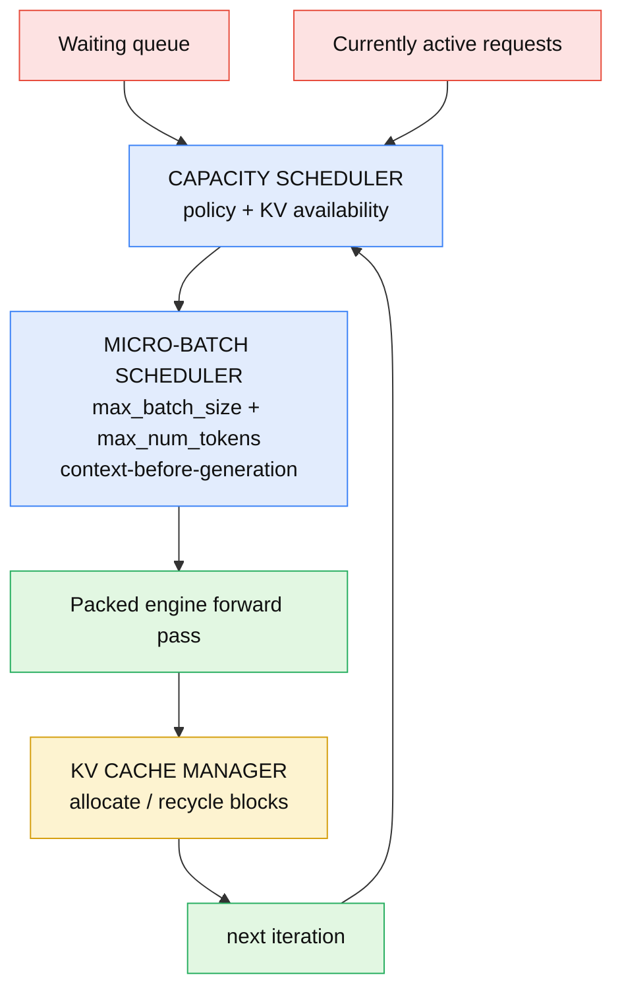

**Source:** `cpp/include/tensorrt_llm/batch_manager/capacityScheduler.h` and `microBatchScheduler.h`; the policy enums are in `cpp/include/tensorrt_llm/executor/types.h` and wired through `SchedulerConfig` in `executor.h`. **[Documented]**

**What you should be able to explain:** *What question does each scheduler level answer? Why is "who runs" a separate decision from "how they are packed"?*

## XIV. Capacity Scheduler Policies

The capacity scheduler's policy is a real enum. Verified from `executor/types.h`: **[Documented]**

```cpp
enum class CapacitySchedulerPolicy
{
    kMAX_UTILIZATION      = 0,
    kGUARANTEED_NO_EVICT  = 1,
    kSTATIC_BATCH         = 2
};
```

- **`kMAX_UTILIZATION`** — pack as many requests as possible to maximize throughput/utilization. Because it admits aggressively, it **may pause (and later resume) requests** when KV-cache capacity is exceeded. Highest throughput, but with the risk of pause/restart latency spikes. **[Documented]**
- **`kGUARANTEED_NO_EVICT`** — conservative: once a request is admitted, the scheduler guarantees it can run to completion **without being paused/evicted**. It reserves enough KV headroom up front, trading some utilization for predictable latency. **[Documented]**
- **`kSTATIC_BATCH`** — does not admit new requests until the current batch fully completes (classic static-batching behavior). **[Documented]**

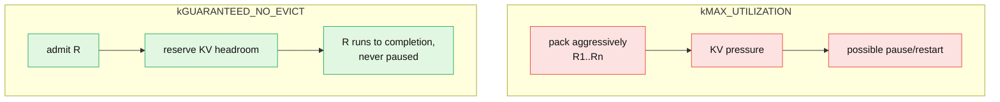

The choice is an **SLA decision**: `kMAX_UTILIZATION` for throughput-first offline/batch workloads; `kGUARANTEED_NO_EVICT` when tail latency must be predictable. **[Interpretation]**

**What you should be able to explain:** *Contrast `kMAX_UTILIZATION` and `kGUARANTEED_NO_EVICT`. When would you pick each, and what is the failure mode of each?*

## XV. The Micro-Batch Scheduler

The capacity scheduler decides *who*; the micro-batch scheduler shapes the actual engine input. It works under two build-time budgets and one ordering rule: **[Documented]**

- **`max_batch_size`** — how many requests may participate.
- **`max_num_tokens`** — the total token budget for the iteration (across all packed sequences).
- **context-before-generation ordering** — context sequences are placed *before* generation sequences in the packed tensor.

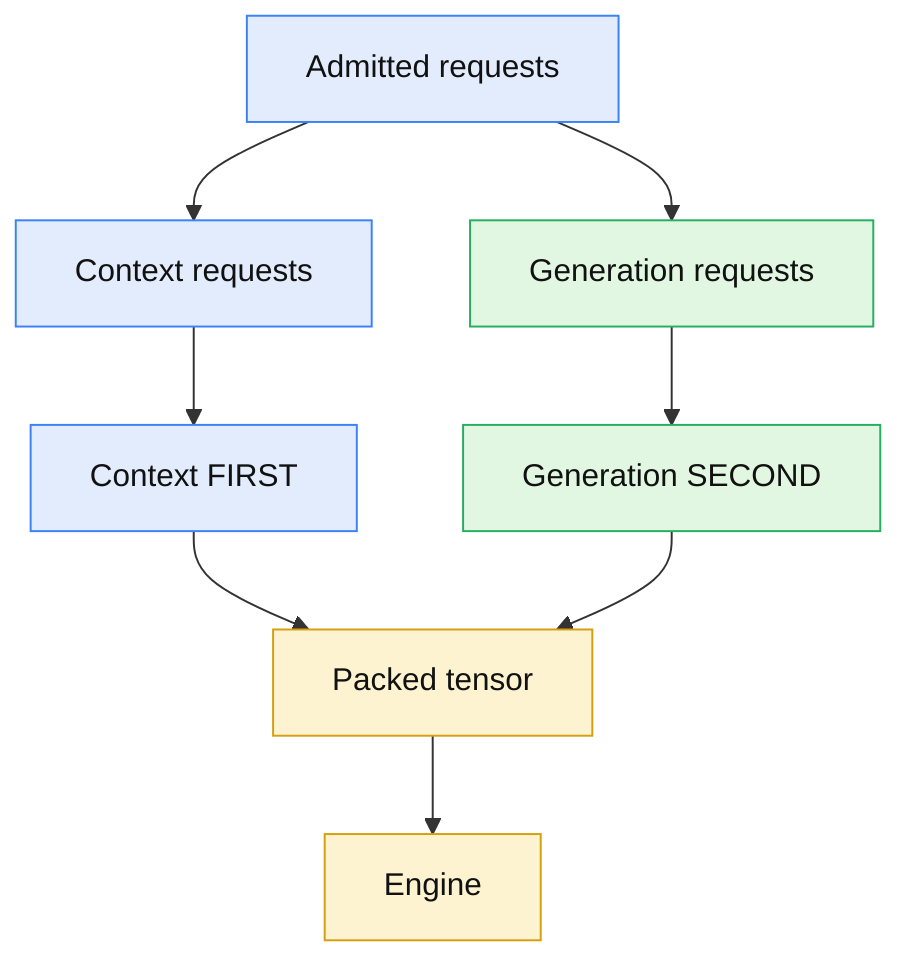

The ordering is not cosmetic: the packed-tensor layout and attention kernels expect context tokens (variable, long) grouped ahead of the single-token generation entries so the engine can dispatch the two regimes correctly. **[Documented]/[Interpretation]**

**Source:** `cpp/include/tensorrt_llm/batch_manager/microBatchScheduler.h`. **[Documented]**

**What you should be able to explain:** *What two budgets bound the micro-batch, and why must context sequences precede generation sequences in the packed input?*

## XVI. Chunked Prefill / Chunked Context

A very long prompt can **monopolize an iteration**. A 32K-token prefill done in one shot burns the whole token budget and stalls everyone else's decode. **[Documented]/[Interpretation]**

**Chunked context** splits that prompt across consecutive iterations:

```
32K-token prompt
    ↓
chunk 1 (2K) → iter t
chunk 2 (2K) → iter t+1
...
chunk 16      → iter t+15
```

Now each iteration processes a *slice* of the long prefill **alongside** ongoing decode work, instead of freezing generation:

```
Without chunking:        With chunking:
CCCCCCCCCCCCCCCC         CCCC
GGGG                     GGGG
GGGG                     CCCC
GGGG                     GGGG
                         CCCC
                         GGGG
```

The chunking behavior is governed by `ContextChunkingPolicy`, verified from `executor/types.h`: **[Documented]**

```cpp
enum class ContextChunkingPolicy
{
    kFIRST_COME_FIRST_SERVED = 0,
    kEQUAL_PROGRESS          = 1,
    kFORCE_CHUNK             = 2
};
```

> **On the enable flag:** the *policy* enum above is verified. The exact spelling of the *enable* switch (and whether it is on by default) is version-sensitive — confirm it against your installed build's config rather than hard-coding a flag name. **[Verify]**

**What you should be able to explain:** *Why does chunked prefill exist? How does it interact with ongoing decode, and what are the three `ContextChunkingPolicy` values?*

## XVII. Build-Time Budgets vs XVIII. Runtime KV Memory

Two different ceilings, set at two different times. **[Documented]**

**Build-time** (baked into the engine):

- `max_batch_size` — max requests per iteration.
- `max_num_tokens` — total token budget per iteration (especially important for generation and chunked prefill).
- `max_seq_len` — max total sequence length (input + output).

`max_num_tokens` is the subtle one: it is the *per-iteration* token budget the micro-batch scheduler spends on context chunks + generation tokens combined. **[Documented]/[Interpretation]**

**Runtime** (how the free memory becomes KV blocks):

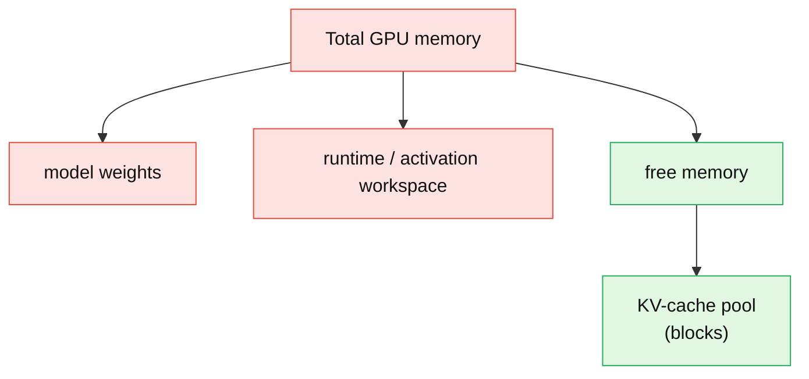

- **`free_gpu_memory_fraction`** — the fraction of *free* GPU memory (after weights + workspace) given to the KV-cache pool.
- **`max_tokens`** — an absolute ceiling on KV-cache tokens where set.
- If **both** are specified, the **lower effective limit applies**. **[Documented]**

**What you should be able to explain:** *Distinguish `max_num_tokens` (per-iteration budget) from `max_seq_len` (per-sequence length) from `free_gpu_memory_fraction` (how much free memory becomes KV cache). If both `free_gpu_memory_fraction` and `max_tokens` are set, which wins?*

## XIX. A Complete Scheduler Walkthrough

Put it together. **[Educational]** Setup:

- Policy: `kGUARANTEED_NO_EVICT`
- `max_batch_size = 4`, `max_num_tokens = 4096`
- Active: **R1, R2, R3** decoding (1 token each per step)
- Waiting: **R4** (a 9,000-token prompt), **R5** (a 20-token prompt)
- Chunked prefill on, chunk size 2,048; KV blocks are limited

| Iter | Active | KV free? | Capacity decision | Micro-batch (ctx→gen) | Tokens used | KV action | Who generates |
|---|---|---|---|---|---|---|---|
| 1 | R1,R2,R3 | yes | admit R4 (headroom OK) | **R4 chunk1 (2048C)** + R1,R2,R3 (3G) | 2051 | alloc R4 blocks | R1,R2,R3 |
| 2 | R1,R2,R3,R4 | yes | hold (batch full = 4) | **R4 chunk2 (2048C)** + R1,R2,R3 (3G) | 2051 | grow R4 blocks | R1,R2,R3 |
| 3 | R1,R2,R3,R4 | yes | hold | R4 chunk3+4+5 finish prefill + gen | ≤4096 | grow R4 | R1,R2,R3 |
| 4 | R1,R2,R3,R4 | yes | R4 now decoding | R1,R2,R3,R4 (4G) | 4 | append | all four |
| 5 | R2,R3,R4 | R1 done → freed | admit R5 | **R5 (20C)** + R2,R3,R4 (3G) | 23 | free R1, alloc R5 | R2,R3,R4 |

Read the story: R4's 9K prompt never freezes R1–R3 because it is **chunked** across iters 1–3 while decodes continue. R5 waits not because of FIFO but because `max_batch_size = 4` is full until R1 completes and frees its blocks. Under `kGUARANTEED_NO_EVICT`, R4 was only admitted once there was enough headroom to finish it without pausing anyone. **[Educational]/[Interpretation]**

**What you should be able to explain:** *Trace why R4 didn't stall the decoders, and why R5 waited. What would change under `kMAX_UTILIZATION`?*

## XX. An Educational Scheduler Simulator

> **This is educational pseudocode.** It does **not** call TensorRT-LLM APIs and is not the production implementation — it exists to make the loop above answerable. **[Educational]**

```python
# EDUCATIONAL SIMULATION — not TensorRT-LLM's real code.
# Models the two-level scheduler + paged KV to build intuition.

class SimKVCache:
    def __init__(self, total_blocks, tokens_per_block=64):
        self.free = total_blocks
        self.tpb = tokens_per_block

    def blocks_for(self, n_tokens):
        return (n_tokens + self.tpb - 1) // self.tpb

    def can_alloc(self, n_tokens):
        return self.free >= self.blocks_for(n_tokens)

    def alloc(self, n_tokens):
        self.free -= self.blocks_for(n_tokens)

    def release(self, n_tokens):
        self.free += self.blocks_for(n_tokens)

def schedule_iteration(active, waiting, kv, cfg):
    reasons = []

    # ---- LEVEL 1: capacity scheduler ----
    if cfg.policy == "GUARANTEED_NO_EVICT":
        while (waiting and len(active) < cfg.max_batch_size):
            r = waiting[0]
            # reserve worst-case headroom so it never gets paused
            if kv.can_alloc(r.prompt_len + r.max_new_tokens):
                kv.alloc(r.prompt_len)            # prompt blocks now
                active.append(waiting.pop(0))
                reasons.append(f"admit {r.id}: headroom guaranteed")
            else:
                reasons.append(f"hold {r.id}: not enough KV headroom")
                break
    elif cfg.policy == "MAX_UTILIZATION":
        while waiting and len(active) < cfg.max_batch_size:
            r = waiting[0]
            if kv.can_alloc(r.prompt_len):        # admit on current need only
                kv.alloc(r.prompt_len); active.append(waiting.pop(0))
                reasons.append(f"admit {r.id}: packed aggressively")
            else:
                reasons.append("pause a low-priority active request to fit")
                break

    # ---- LEVEL 2: micro-batch scheduler (context BEFORE generation) ----
    budget = cfg.max_num_tokens
    ctx, gen = [], []
    for r in active:
        if r.needs_prefill:
            chunk = min(r.remaining_prefill, cfg.chunk_size, budget)
            if chunk > 0:
                ctx.append((r.id, chunk)); budget -= chunk
        else:
            if budget >= 1:
                gen.append(r.id); budget -= 1

    packed = ctx + [(g, 1) for g in gen]          # context first, then generation
    return packed, reasons
```

Trace *any* iteration and the simulator tells you **why**: why a request was admitted (headroom), why one was held (`max_batch_size` full or no KV), why a long prompt got chunked (`chunk_size` vs remaining prefill), why a block was allocated/released, and why the batch composition changed. **[Educational]**

**What you should be able to explain:** *Using the simulator's structure, answer: why was this request admitted? Why paused? Why chunked? Why did batch composition change?*

## XXI. Performance Metrics: TTFT, TPOT, E2E, Throughput

The four numbers that matter, and which mechanism moves each: **[Documented]/[Interpretation]**

- **TTFT** (time to first token): submit → first token. Driven by **prefill length + queueing**. Fixed by chunked prefill, reuse, disaggregation.
- **TPOT / ITL** (time per output token / inter-token latency): steady-state gap between generated tokens. Driven by **decode memory bandwidth + batch size + scheduler pauses**.
- **E2E latency**: submit → final token. ≈ TTFT + (output_len − 1) × TPOT.
- **Throughput**: tokens/sec or requests/sec across all concurrent requests.

The core tension: raising `max_num_tokens` / batch size raises **throughput** but can raise **TTFT** (bigger prefills per iter) and **TPOT** (more decode work per step, or `kMAX_UTILIZATION` pauses). You are always choosing a point on the throughput–latency curve. **[Interpretation]**

**What you should be able to explain:** *Define TTFT and TPOT precisely. Why can increasing `max_num_tokens` raise throughput but hurt latency?*

## XXII. Observability

TensorRT-LLM exposes **iteration/runtime statistics** (per-iteration counts of scheduled/active/paused requests, KV-block usage, etc.) and, via `trtllm-serve`, a Prometheus metrics endpoint. **[Documented]**

The metric names your notes captured — e.g. `trtllm_request_count`, `trtllm_request_latency`, `trtllm_time_to_first_token`, `trtllm_time_per_output_token`, `trtllm_kv_cache_hit_rate`, `trtllm_kv_cache_reused_blocks_total`, `trtllm_kv_cache_missed_blocks_total`, `trtllm_kv_cache_utilization` — should be treated as **the shape of what's exposed, verified against your build's `/metrics`**, since exact strings move between releases. **[Verify]**

Observability answers the diagnostic questions directly: **[Interpretation]**

- Memory-bound? → KV-cache utilization near 100% + requests being paused.
- Reuse working? → KV hit rate / reused-vs-missed blocks.
- TTFT bad? → long prefills or deep queueing (iteration stats show scheduled context tokens).
- TPOT bad? → decode-phase memory pressure / pause-restart churn under `kMAX_UTILIZATION`.

**What you should be able to explain:** *Which metric tells you the service is memory-bound? How would you distinguish "TTFT is high because of prefill" from "TPOT is high because of decode pressure"?*

## XXIII. Benchmarking with trtllm-bench

Verified subcommands: `build`, `throughput`, `latency`; datasets are prepared with `benchmarks/cpp/prepare_dataset.py`. **[Documented]**

```bash
# 1. Prepare a production-like input/output length distribution
python benchmarks/cpp/prepare_dataset.py --stdout --tokenizer $MODEL \
    token-norm-dist --input-mean 1024 --output-mean 256 \
    --input-stdev 0 --output-stdev 0 --num-requests 1000 > data.json

# 2. Build a benchmark engine
trtllm-bench --model $MODEL build --dataset data.json --quantization FP8

# 3. Max-throughput and low-latency runs
trtllm-bench --model $MODEL throughput --dataset data.json --engine_dir $ENGINE
trtllm-bench --model $MODEL latency    --dataset data.json --engine_dir $ENGINE
```

**Methodology** (from the notes): use a **production-like length distribution**, not a uniform synthetic one, and sweep `max_batch_size`, `max_num_tokens`, scheduler policy, chunked prefill, and KV-cache config to find the **knee** of the throughput-vs-TPOT curve. **[Documented]/[Interpretation]**

**What you should be able to explain:** *What are the three `trtllm-bench` subcommands? Why benchmark with a realistic length distribution instead of a uniform one?*

## XXIV. Serving with trtllm-serve

`trtllm-serve` launches an **OpenAI-compatible** HTTP server (chat/completions endpoints), configured with the model, KV-cache settings, chunking, and — where enabled — disaggregation. **[Documented]** Confirm the exact flag names against your installed CLI (`trtllm-serve --help`), since options evolve between releases. **[Verify]**

**What you should be able to explain:** *What interface does `trtllm-serve` expose, and what serving-time knobs does it accept?*

## XXV. Disaggregated Serving

Because prefill is **compute-bound** and decode is **memory-bandwidth-bound** (§II–III), running both on the same GPU pool forces one compromise for two opposite workloads. **Disaggregated serving** splits them: **[Documented]**


Each pool can be sized and tuned for its own regime, improving rate-matching. **The tradeoff:** the KV cache must be **transferred** from prefill to decode workers, adding communication cost. Disaggregation is not universally better — it wins when prefill/decode imbalance and scale justify the transfer overhead. **[Documented]/[Interpretation]** This is the cluster-scale extension of the KV-centric premise that [Mooncake](/engineering/mooncake-kvcache-centric-architecture-for-serving-llm-chatbot/) pushes furthest.

**What you should be able to explain:** *Why can splitting prefill and decode across pools help? What is the cost that makes it not always worth it?*

## XXVI. Speculative Decoding

Speculative decoding attacks the sequential-decode bottleneck: instead of the expensive target model producing one token per step, a cheap **draft** proposes several tokens that the target **verifies in parallel**. **[Documented]**

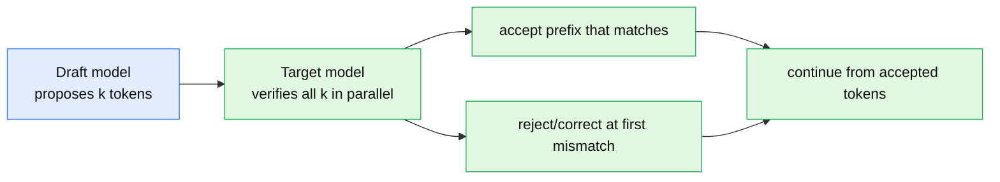

The win: **multiple output tokens per expensive target step** when acceptance is high. TensorRT-LLM supports several methods — Draft-Target, EAGLE / EAGLE-3, Medusa, ReDrafter, Lookahead, NGram, and MTP (multi-token prediction). **[Documented]/[Verify]** The exact set and names depend on your version and backend — confirm against the current docs before quoting. This is orthogonal to paged KV cache and batching. **[Interpretation]**

**What you should be able to explain:** *How does draft-then-verify reduce expensive target-model steps? Why does the benefit depend on the acceptance rate?*

## XXVII. CUDA Graphs and XXVIII. Quantization

**CUDA Graphs** reduce **CPU/driver launch overhead**: a repeated sequence of GPU ops (a decode step) is *captured* once and *replayed* as a single graph, instead of re-issuing dozens of kernel launches per step. It is a launch-overhead optimization — **not** a KV-cache or scheduling mechanism — and matters most for the small, repetitive decode step. **[Documented]/[Interpretation]**

```
Without CUDA Graph:              With CUDA Graph:
CPU → launch k1                  CPU → replay [GRAPH]
CPU → launch k2                          k1;k2;k3;k4 run
CPU → launch k3                          (one launch)
CPU → launch k4
```

**Quantization** has **two independent axes** — do not conflate them: **[Documented]/[Interpretation]**

- **Weight/activation quantization** (FP8, NVFP4, INT4 with AWQ/GPTQ, INT8): smaller, faster *model* representation → less weight bandwidth per step.
- **KV-cache quantization** (§XII): fewer *bytes per cached token* → more concurrent sequences.

One shrinks the model; the other shrinks the cache. They compose.

**What you should be able to explain:** *What overhead do CUDA Graphs remove, and why do they help decode most? What are the two independent quantization axes?*

## XXIX. TensorRT-LLM vs vLLM and Other Serving Stacks

These systems **share vocabulary and high-level techniques but differ in implementation**. Compare concepts, not "who copied whom." **[Interpretation]**

| Technique | TensorRT-LLM | Shared lineage |
|---|---|---|
| Paged KV cache | own block pool + manager | vLLM PagedAttention |
| Continuous / in-flight batching | iteration-level, context-first packing | Orca line |
| Prefix / block reuse | radix tree + prioritized-LRU | SGLang RadixAttention |
| Chunked prefill | `ContextChunkingPolicy` | common technique |
| Speculative decoding | Draft-Target/EAGLE/Medusa/… | widely shared |
| Disaggregated serving | prefill/decode pools + KV transfer | Mooncake, others |
| Compilation/runtime | TensorRT-optimized engines + C++/PyTorch runtimes | — |
| Hardware focus | NVIDIA GPUs (FP8/NVFP4 etc.) | — |

The honest summary: TensorRT-LLM's distinctive angle is **compiled, hardware-tuned engines on NVIDIA GPUs** with its own KV manager, two-level scheduler, and runtime — built around the *same* serving pressures everyone faces. No unsupported performance claims here. **[Interpretation]**

**What you should be able to explain:** *Name three techniques TensorRT-LLM shares in concept with vLLM/SGLang/Mooncake, and one thing that distinguishes its approach.*

## XXX. NVIDIA Source-Code Map

Connecting concepts to the real tree (verified paths/enums noted; treat evolving Python filenames as *areas*). **[Documented]/[Verify]**

| Concept | Source location | Role in the lifecycle |
|---|---|---|
| Scheduler policy enums | `cpp/include/tensorrt_llm/executor/types.h` ✓ | `CapacitySchedulerPolicy`, `ContextChunkingPolicy` |
| Scheduler config wiring | `cpp/include/tensorrt_llm/executor/executor.h` | `SchedulerConfig`, `KvCacheConfig` |
| Capacity scheduler | `cpp/include/tensorrt_llm/batch_manager/capacityScheduler.h` | Level-1: who is active |
| Micro-batch scheduler | `cpp/include/tensorrt_llm/batch_manager/microBatchScheduler.h` | Level-2: how they're packed |
| KV cache manager | `cpp/include/tensorrt_llm/batch_manager/kvCacheManager.h` | block pool, block tables, reuse/eviction |
| PyTorch executor | `tensorrt_llm/_torch/pyexecutor/` (e.g. `py_executor.py`, `scheduler.py`, `resource_manager.py`, KV-cache-manager module) | the Python serving loop; filenames vary by release |

For each component, the pattern is the same: it takes the scheduler's decision, checks/allocates KV blocks, participates in the packed forward pass, and updates/releases cache. I have **not** invented any class, function, flag, or metric name; where I was unsure I marked it `[Verify]`. **[Interpretation]**

**What you should be able to explain:** *Given a concept (say chunked prefill), name the file where its policy enum lives and the scheduler that consumes it.*

## XXXI. End-to-End Request Lifecycle

One request, start to finish — the section that ties everything together. **[Interpretation]**

1. Request **arrives** (async, unknown output length).
2. Enters the **waiting queue**.
3. **Capacity scheduler** evaluates admission under its policy.
4. **KV-cache availability** is checked (enough free blocks?).
5. **Micro-batch scheduler** selects & organizes the work.
6. **Context before generation** in the packed tensor.
7. Packed input **constructed** (padding removed).
8. **Engine forward pass** executes.
9. KV cache **allocated & populated** (prefill), or appended (decode).
10. Request enters **generation**.
11. **Decode iterations** continue, one token each.
12. New **K/V appended** every step.
13. **Prefix/block reuse** may skip recompute for eligible cached content.
14. On completion, **KV blocks released**.
15. Reusable blocks may **stay cached** (radix tree).
16. Under pressure, **eviction / offloading** can occur.
17. **Metrics emitted** (TTFT, TPOT, KV utilization).
18. Request **completes**.

**And when a new request arrives mid-generation:** it joins the waiting queue; at the next iteration the capacity scheduler decides if there's room (policy + free blocks); if admitted, its **prefill is chunked and interleaved** with the ongoing decodes via context-before-generation packing — so the in-flight request is never blocked to a batch boundary. That single behavior is what all thirty sections were building toward. **[Interpretation]**

## XXXII. Failure Modes, Tuning, and the Final Mental Model

### Failure modes → first moves

| Symptom | Likely cause | First tuning move |
|---|---|---|
| **OOM under load** | KV pool too large / runtime pressure | lower `free_gpu_memory_fraction` or set `max_tokens` |
| **High p99 TPOT** | `kMAX_UTILIZATION` pause/restart churn | switch to `kGUARANTEED_NO_EVICT` |
| **High TTFT** | long prefills / no reuse | enable chunked prefill; enable block reuse; consider disaggregation |
| **Low throughput / low KV util** | budgets too conservative | raise `max_num_tokens` / `max_batch_size` |
| **One long prompt freezes others** | unchunked context | enable chunked prefill |
| **Reuse not working** | unique prompts / unstable prefix | stabilize system prompt; check hit-rate metric |

### Tuning playbook (in order)

1. **Fix the memory ceiling first** (`free_gpu_memory_fraction` / `max_tokens`).
2. **Pick the scheduler policy by SLA** (throughput vs tail latency).
3. **Right-size token/request budgets** (`max_num_tokens`, `max_batch_size`).
4. **Turn on the cache levers** (block reuse, offloading, KV quantization).
5. **Then** consider speculative decoding / disaggregation.
6. **Watch the right metrics** at each step.

### The final mental model

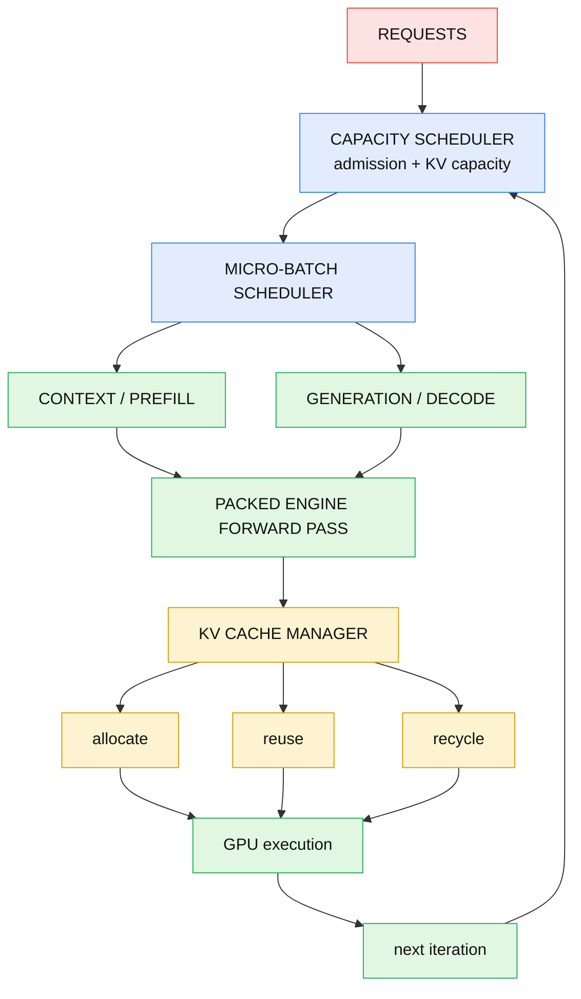

Each mechanism answers exactly one question:

- **Prefill:** "How do I process the new context?"
- **Decode:** "How do I generate the next token?"
- **In-flight batching:** "Which requests execute together this iteration?"
- **Capacity scheduling:** "Which requests can safely be active?"
- **Micro-batch scheduling:** "How do I pack the admitted work?"
- **Paged KV cache:** "How do I efficiently allocate KV memory?"
- **KV reuse:** "Can I avoid recomputing an existing prefix?"
- **Eviction:** "What cached state can I discard under pressure?"
- **Offloading:** "Can I move reusable KV state outside GPU memory?"
- **KV quantization:** "Can I reduce bytes per cached token?"
- **Chunked prefill:** "How do I stop a huge context from monopolizing an iteration?"
- **Disaggregation:** "Should context and generation use separate GPU pools?"
- **Speculative decoding:** "Can I emit multiple tokens with fewer expensive target steps?"
- **CUDA Graphs:** "Can I remove repeated launch overhead?"

And every one of them is, underneath, a decision about a **fixed KV-cache budget** — which is why a production serving engine really is a memory allocator with a neural network attached. **[Interpretation]**

The engine is open at **[https://github.com/NVIDIA/TensorRT-LLM](https://github.com/NVIDIA/TensorRT-LLM)**.
