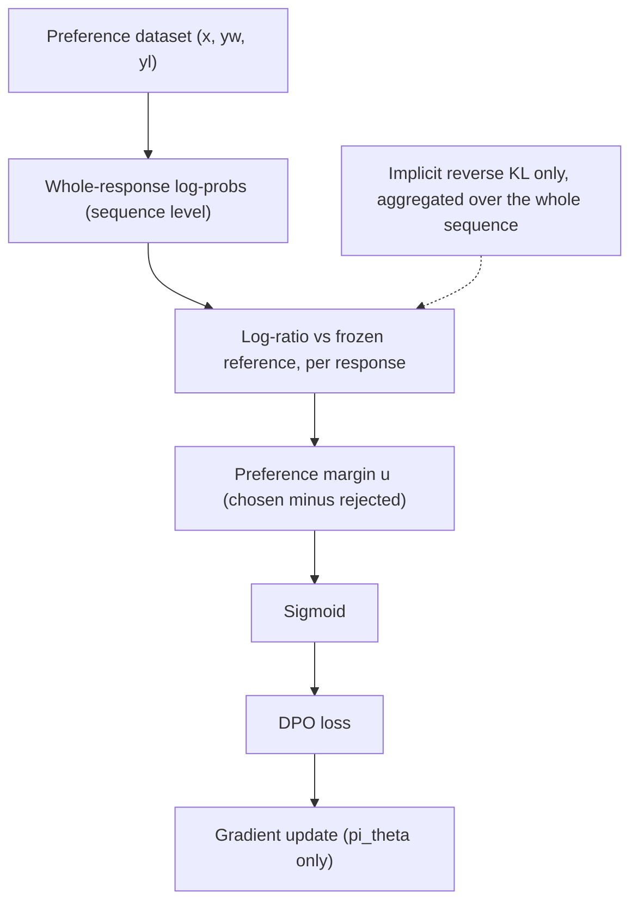
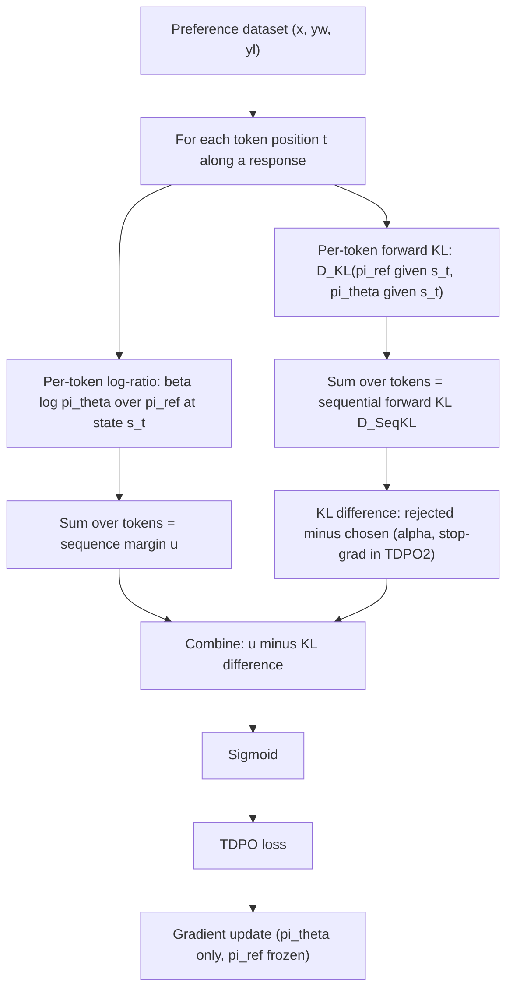
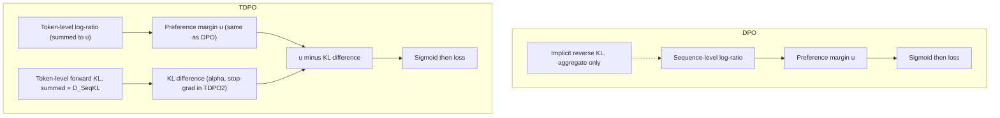

This is a technical dissection of **Token-level Direct Preference Optimization (TDPO)**, and it is written to be read **after** the [DPO entry](/engineering/direct-preference-optimization-your-lm-is-secretly-a-reward-model/). It does not re-explain DPO from scratch — it assumes you can already reconstruct what $\pi_\theta$ and $\pi_{ref}$ are, how the log-ratio becomes an implicit reward, and how the DPO loss is formed. What it explains is the **one thing TDPO changes**: DPO scores a whole response as a single sequence-level object, but a language model *generates* — and *drifts* — token by token, so TDPO moves the preference optimization, and especially the KL regularization, to the **token level**. **[Interpretation]**

The goal is that this page lets you reconstruct the full chain later: DPO → its limitation → why TDPO was proposed → what changes mathematically → what happens at the token level → how the KL constraint changes (forward vs reverse) → how the TDPO objective is built → how TDPO-1 and TDPO-2 differ → how it is trained → and why it improves the alignment-vs-diversity trade-off. **[Interpretation]**

**Attribution convention** (same as the DPO entry). Because this article mixes what the paper states with my own reasoning, every non-obvious technical claim is tagged:

- **[Paper]** — stated explicitly in Zeng et al. (arXiv:2404.11999).
- **[Derived]** — a mathematical or logical consequence of the paper's equations, worked out here.
- **[Interpretation]** — my explanation or engineering framing, written for the reader; not a claim the paper makes.

**Source discipline.** The equations below are verified against the TDPO paper (arXiv:2404.11999), which is the technical source of truth for this article; the engineering *framing* — where TDPO sits, when to reach for it — is my own. I do not invent hyperparameters, benchmark numbers, or implementation specifics; where the paper reports results I label them explicitly as such and keep them qualitative. **[Interpretation]**

---

## Starting From DPO

A one-paragraph reminder, only so the rest is self-contained. **[Interpretation]** DPO takes a static dataset of preference triples $(x, y_w, y_l)$ — prompt, chosen response, rejected response — and trains the policy with a single closed-form loss, with no separate reward model and no PPO rollout loop. Its objective is:

$$
\mathcal{L}_{DPO}(\pi_\theta;\, \pi_{ref}) = -\,\mathbb{E}_{(x,\, y_w,\, y_l)\sim \mathcal{D}} \left[ \log \sigma\!\left( \beta \log \frac{\pi_\theta(y_w \mid x)}{\pi_{ref}(y_w \mid x)} - \beta \log \frac{\pi_\theta(y_l \mid x)}{\pi_{ref}(y_l \mid x)} \right) \right]
$$

The reward is *implicit* in the policy's log-ratio against a frozen reference, $\hat r(x,y) = \beta \log \frac{\pi_\theta(y\mid x)}{\pi_{ref}(y\mid x)}$, and this whole loss falls out of solving the **KL-constrained** RLHF objective and substituting into the Bradley-Terry model, where the intractable partition function cancels. **[Paper]** (All of this is derived in full on the [DPO page](/engineering/direct-preference-optimization-your-lm-is-secretly-a-reward-model/); I will not repeat the derivation.) **[Interpretation]**

The word to hold onto from that recap is **sequence-level**. Every quantity in the DPO loss — $\pi_\theta(y_w\mid x)$, the log-ratio, the implicit reward — is attached to the **entire response** $y$, treated as one indivisible unit. **[Derived]** That is exactly the assumption TDPO revisits.

## The Core Problem: A Sequence-Level Objective on a Token-Level Process

Here is the tension TDPO is built to resolve. **[Interpretation]**

A preference label is genuinely sequence-level: a human read the *whole* chosen response and the *whole* rejected response and picked one. So Bradley-Terry over full sequences is the right model for the *preference signal*. **[Paper]**

But a language model does not produce a response as one atomic act. It generates **autoregressively, one token at a time**, and — just as importantly — it **drifts away from the reference one token at a time**. **[Interpretation]** DPO's KL regularization, inherited from the RLHF objective, constrains the *sequence-level* divergence $D_{KL}\big(\pi_\theta(y\mid x)\,\Vert\,\pi_{ref}(y\mid x)\big)$: it controls how far the policy's distribution over *whole responses* strays from the reference. It says nothing about *where along the response* that divergence accumulates. **[Derived]**

Two practical consequences follow, and both are what the reference notes and the paper flag as DPO's real-world failure symptoms: **[Interpretation]**

- **No per-token credit assignment.** A single scalar margin is spread across the entire response; the objective cannot tell that the drift concentrated in the first few tokens, or in one bad clause, versus being evenly spread. **[Interpretation]**
- **Diversity collapse.** DPO's sequence-level constraint, in practice, lets the policy sharpen onto a narrow set of high-margin continuations. The observed symptom is **mode collapse** — repetitive, low-diversity outputs — which is precisely the pain point that motivates reaching for TDPO. **[Interpretation]**

TDPO's thesis: **keep the preference model at the sequence level, but move the KL regularization to the token level**, so divergence is controlled *at each generation step* rather than only in aggregate. **[Paper]**

## DPO vs TDPO — The Big Picture

Before any equations, the high-level relationship, stated carefully because it is easy to get wrong: **[Interpretation]**

- **TDPO retains DPO's direct-preference philosophy in full.** It does **not** reintroduce a separately trained reward model. It does **not** go back to PPO or any online rollout loop. It keeps a **frozen reference policy** and trains offline on the same $(x, y_w, y_l)$ preference triples. **[Paper]**
- **What TDPO adds** is a token-level view of the KL divergence, and an explicit **forward-KL** regularization term folded into the loss. **[Paper]**
- **What TDPO does not do** is change the fundamental setup: it is still "a direct loss on preference pairs against a frozen reference," not "RL with a reward model." **[Interpretation]**

So the mental correction to make is: TDPO is **not** "DPO plus PPO," and it is **not** "DPO with a reward model bolted back on." It is **DPO with the KL constraint relocated from the whole sequence to each token, plus a forward-KL term that DPO lacked**. **[Interpretation]** If you are picturing rollouts, critics, or advantage estimation, you are picturing the wrong algorithm. **[Interpretation]**

## Autoregressive Generation, Revisited at the Token Level

DPO already used the autoregressive factorization to *compute* $\pi(y\mid x)$ as a sum of token log-probabilities. TDPO uses the same factorization but treats each step as a **decision point in a token-level process**, which is the framing that makes token-level KL meaningful. **[Interpretation]**

A response $y = (y_1, \dots, y_T)$ is generated token by token, each conditioned on the prompt and the prefix so far. It is natural to name the **state at step $t$** as the prompt plus everything generated up to that point, and the **action** as the next token: **[Paper]**

$$
s_t = [\,x,\; y_{<t}\,], \qquad a_t = y_t
$$

The policy at step $t$ is the next-token distribution $\pi(\cdot \mid s_t) = \pi(\cdot \mid x, y_{<t})$ — a full distribution over the vocabulary, not just the probability of the one token that was realized. **[Interpretation]** This distinction is the crux of what follows: **DPO only ever needs the log-probability of the *realized* token** (to sum into the sequence log-prob), whereas **TDPO's KL term needs the *whole* next-token distribution at each state**, because a KL divergence between two distributions is a sum over the entire vocabulary. **[Derived]** Hold that — it is where TDPO's extra compute comes from.

The sequence log-probability is unchanged from DPO:

$$
\log \pi(y \mid x) = \sum_{t=1}^{T} \log \pi(y_t \mid x,\, y_{<t}) = \sum_{t=1}^{T} \log \pi(a_t \mid s_t)
$$

## The Token-Level View: Reward Without a Reward Model

The reason TDPO can stay "direct" — no reward network — is that the same trick that gave DPO its implicit reward works at the token level. **[Interpretation]**

DPO's derivation solved a KL-constrained objective for a closed-form optimal policy and inverted it to write the reward as $\beta\log(\pi/\pi_{ref})$ plus a prompt-only term that cancels under Bradley-Terry. **[Paper]** TDPO does the analogous thing in the **token-level (max-entropy RL) formulation**: it works with the per-step objective and shows the sequence-level preference can be **decomposed across tokens**, so that the sequence log-ratio

$$
\beta \log \frac{\pi_\theta(y \mid x)}{\pi_{ref}(y \mid x)} = \sum_{t=1}^{T} \beta \log \frac{\pi_\theta(y_t \mid s_t)}{\pi_{ref}(y_t \mid s_t)}
$$

is itself a **sum of per-token reward contributions**. **[Derived]** Each token carries an implicit reward $\beta\log\frac{\pi_\theta(y_t\mid s_t)}{\pi_{ref}(y_t\mid s_t)}$; summing them recovers exactly the sequence-level implicit reward DPO uses. **[Derived]**

The consequence to state precisely, because it is on the DO-NOT-confuse list: **TDPO still uses no separate neural reward model.** The reward remains implicit in the policy's log-ratio against the frozen reference — now *read per token* rather than only per sequence — and the preference is still modeled with **Bradley-Terry** over the two full responses. **[Paper]** The token-level view is a re-reading of the *same* implicit reward, not a new reward source. **[Interpretation]**

## Forward KL vs Reverse KL — The Heart of TDPO

This is the conceptual center of the method, and the single distinction that explains why TDPO behaves differently from DPO. **[Interpretation]**

KL divergence is **not symmetric**: $D_{KL}(P\,\Vert\,Q) \neq D_{KL}(Q\,\Vert\,P)$, and the two directions have opposite failure modes. Applied to the policy $\pi_\theta$ and the reference $\pi_{ref}$: **[Interpretation]**

- **Reverse KL** — $D_{KL}(\pi_\theta \,\Vert\, \pi_{ref})$. This is the "policy-first" direction, and it is **mode-seeking**: it strongly penalizes the policy for putting probability mass where the reference has little, so the policy is driven to **concentrate on a few modes** the reference already favored. It is *zero-forcing* — the policy would rather abandon whole regions than spread mass thinly. The behavioral result is **alignment at the cost of diversity**: sharp, confident, but narrow output distributions. **[Interpretation]**
- **Forward KL** — $D_{KL}(\pi_{ref} \,\Vert\, \pi_\theta)$. This is the "reference-first" direction, and it is **mass-covering** (mean-seeking): it penalizes the policy for *failing to cover* mass the reference has, so the policy is pushed to **keep support everywhere the reference did**. The behavioral result is **preserved diversity** — the policy is discouraged from collapsing onto a handful of continuations. **[Interpretation]**

Now the DPO connection. The KL-constrained RLHF objective DPO inherits uses the **reverse** direction, $D_{KL}(\pi_\theta\,\Vert\,\pi_{ref})$ — mode-seeking — which is exactly why unconstrained-enough DPO tends toward **mode collapse and repetitive, low-diversity outputs**. **[Interpretation]** TDPO's remedy is to introduce an explicit **forward-KL** regularization at the token level, $D_{KL}(\pi_{ref}\,\Vert\,\pi_\theta)$ evaluated per state, whose mass-covering pressure counteracts the collapse and **restores diversity**. **[Paper]**

> The whole reason forward KL appears in TDPO is diversity: reverse KL (DPO's implicit direction) is mode-seeking and collapses; forward KL (TDPO's added term) is mass-covering and preserves coverage. **[Interpretation]**

**Do not swap these.** Reverse KL = $\pi_\theta$ first = mode-seeking = DPO's implicit, diversity-reducing direction. Forward KL = $\pi_{ref}$ first = mass-covering = TDPO's added, diversity-preserving term. Confusing the two inverts the entire story. **[Interpretation]**

### Why Regulate KL Per Token

Even granting forward KL, why apply it **per token** instead of once over the whole sequence? Because the drift TDPO wants to control is itself a token-level phenomenon. **[Interpretation]** A sequence-level KL is a single number for the whole response; a **sequential (per-token) forward KL** sums the divergence at *every generation step*, so the regularizer can push back on divergence *wherever it occurs* along the response — including the **first few tokens**, where early drift disproportionately steers the rest of the generation. **[Interpretation]** This is the finer-grained control DPO's aggregate KL cannot express. **[Derived]**

TDPO formalizes this as a **sequential KL divergence** — the forward KL at each prefix state, summed along the response: **[Paper]**

$$
D_{\text{SeqKL}}\big(x, y;\, \pi_{ref} \,\Vert\, \pi_\theta\big) = \sum_{t=1}^{T} D_{KL}\big(\pi_{ref}(\cdot \mid s_t)\,\Vert\,\pi_\theta(\cdot \mid s_t)\big)
$$

- **$s_t = [x, y_{<t}]$** — the state (prompt + prefix) at step $t$. **[Paper]**
- **$D_{KL}(\pi_{ref}(\cdot\mid s_t)\,\Vert\,\pi_\theta(\cdot\mid s_t))$** — the **forward** KL between the reference's and the policy's *full next-token distributions* at that state (a sum over the whole vocabulary). **[Paper]**
- **$\sum_{t=1}^{T}$** — accumulated over the response's tokens, so it is the total per-token forward divergence along $y$. **[Paper]**

Note the argument order: $\pi_{ref}$ is first — this is the mass-covering forward direction, on purpose. **[Derived]**

## The TDPO Objective

TDPO's loss keeps DPO's Bradley-Terry log-sigmoid margin and **adds the sequential-KL difference** into it. Define first the familiar DPO margin (the sequence log-ratio difference), which the paper writes as: **[Paper]**

$$
u(x, y_w, y_l) = \beta \log \frac{\pi_\theta(y_w \mid x)}{\pi_{ref}(y_w \mid x)} - \beta \log \frac{\pi_\theta(y_l \mid x)}{\pi_{ref}(y_l \mid x)}
$$

This is exactly DPO's inner term. **[Derived]** Then define the **sequential-KL difference** between the rejected and chosen responses:

$$
\delta(x, y_w, y_l) = \beta\, D_{\text{SeqKL}}\big(x, y_l;\, \pi_{ref}\Vert\pi_\theta\big) - \beta\, D_{\text{SeqKL}}\big(x, y_w;\, \pi_{ref}\Vert\pi_\theta\big)
$$

The **TDPO-1** objective is then: **[Paper]**

$$
\mathcal{L}_{\text{TDPO1}}(\pi_\theta;\pi_{ref}) = -\,\mathbb{E}_{(x,y_w,y_l)\sim\mathcal{D}}\Big[\log\sigma\big(u(x,y_w,y_l) - \delta(x,y_w,y_l)\big)\Big]
$$

Term by term: **[Paper]**

- **$u(x,y_w,y_l)$** — the DPO preference margin: chosen-vs-reference log-ratio minus rejected-vs-reference log-ratio. Unchanged from DPO. **[Paper]**
- **$D_{\text{SeqKL}}(x, y;\, \pi_{ref}\Vert\pi_\theta)$** — the token-level **forward** KL accumulated along a response, defined above. **[Paper]**
- **$\delta(x,y_w,y_l)$** — the difference of those sequential KLs (rejected minus chosen), scaled by $\beta$. It measures how the policy's token-level forward divergence on the *rejected* response compares with that on the *chosen* response. **[Derived]**
- **$u - \delta$** — the DPO margin **corrected by the KL-difference term**. Subtracting $\delta$ ties the preference margin to the token-level divergence, so the loss is minimized not just by ranking $y_w$ above $y_l$ but by doing so **while keeping the token-level forward-KL behavior balanced** between the two responses. **[Derived]**
- **$-\log\sigma(\cdot)$** — the same logistic (Bradley-Terry maximum-likelihood) loss as DPO. **[Paper]**

The reading in one sentence: **TDPO-1 is DPO's log-sigmoid preference loss with a token-level forward-KL difference subtracted inside the sigmoid, so the objective rewards both correct preference ranking and controlled per-token divergence.** **[Interpretation]** Set the KL term to zero and you recover DPO exactly — TDPO-1 is DPO *plus* the token-level forward-KL correction. **[Derived]**

## TDPO-1 vs TDPO-2

TDPO-1 and TDPO-2 are **two distinct variants**, and collapsing them loses the whole point of the second one. The paper introduces TDPO-2 because TDPO-1's KL term, while helpful, does not control divergence tightly enough. **[Paper]** TDPO-2 makes two changes: **[Paper]**

1. **A second coefficient $\alpha$.** TDPO-2 scales the KL-difference term by its own weight $\alpha$, separate from $\beta$. This gives an explicit dial on *how strongly* the token-level forward-KL is enforced, independent of the reward scale $\beta$. **[Paper]**
2. **A stop-gradient baseline on the chosen response.** TDPO-2 wraps the *chosen* response's sequential KL in a stop-gradient operator $\text{sg}[\cdot]$, so it acts as a **fixed baseline** rather than a term gradients flow through. This centers the regularization on driving the *rejected* response's token-level divergence relative to the chosen one, which the paper finds gives markedly tighter, more stable KL control. **[Paper]**

Concretely, the modified KL-difference term is:

$$
\delta_2(x, y_w, y_l) = \beta\, D_{\text{SeqKL}}\big(x, y_l;\, \pi_{ref}\Vert\pi_\theta\big) - \text{sg}\!\Big[\beta\, D_{\text{SeqKL}}\big(x, y_w;\, \pi_{ref}\Vert\pi_\theta\big)\Big]
$$

and the **TDPO-2** objective is: **[Paper]**

$$
\mathcal{L}_{\text{TDPO2}}(\pi_\theta;\pi_{ref}) = -\,\mathbb{E}_{(x,y_w,y_l)\sim\mathcal{D}}\Big[\log\sigma\big(u(x,y_w,y_l) - \alpha\,\delta_2(x,y_w,y_l)\big)\Big]
$$

- **$\text{sg}[\cdot]$** — stop-gradient: the chosen response's sequential KL is used as a numerical baseline but receives no gradient, so it does not itself get optimized. **[Paper]**
- **$\alpha$** — the KL-difference coefficient; larger $\alpha$ enforces the token-level forward-KL more aggressively. **[Paper]**

**The two KL coefficients, and the ratio between them.** TDPO thus has *two* knobs where DPO has one: **$\beta$** scales the reward/log-ratio margin (as in DPO), and **$\alpha$** scales the token-level forward-KL regularization (new in TDPO-2). The practically important quantity is the **ratio** of the two — it is what actually sets the **alignment-versus-diversity balance**: push $\alpha$ up relative to $\beta$ and you buy more diversity (stronger mass-covering pressure); push it down and you approach DPO's behavior. **[Interpretation]** TDPO-1 is effectively the special case with the KL term present but ungated and un-weighted (no $\alpha$, no stop-gradient); TDPO-2's extra control is why it generally gives the better reward-KL frontier. **[Interpretation]**

To be exact about the DO-NOT list: there are **exactly these two variants**, TDPO-1 and TDPO-2. I am not introducing any others. **[Interpretation]**

## DPO Equation Next to TDPO Equation

Placed side by side, with the change annotated: **[Interpretation]**

**DPO** (sequence-level, no explicit KL term):

$$
\mathcal{L}_{DPO} = -\,\mathbb{E}\Big[\log\sigma\big(\underbrace{\textstyle\beta\log\frac{\pi_\theta(y_w\mid x)}{\pi_{ref}(y_w\mid x)} - \beta\log\frac{\pi_\theta(y_l\mid x)}{\pi_{ref}(y_l\mid x)}}_{u:\ \text{preference margin}}\big)\Big]
$$

**TDPO-2** (adds the token-level forward-KL correction):

$$
\mathcal{L}_{\text{TDPO2}} = -\,\mathbb{E}\Big[\log\sigma\big(\underbrace{u\vphantom{\frac{\pi}{\pi}}}_{\text{same DPO margin}} - \underbrace{\alpha\big(\beta D_{\text{SeqKL}}(x,y_l;\pi_{ref}\Vert\pi_\theta) - \text{sg}[\beta D_{\text{SeqKL}}(x,y_w;\pi_{ref}\Vert\pi_\theta)]\big)}_{\text{new: token-level forward-KL difference}}\big)\Big]
$$

What changed, exactly: **[Derived]**

- The **preference margin $u$ is identical** — TDPO does not touch how the reward margin is formed. **[Derived]**
- A **new term** is subtracted inside the sigmoid: the **token-level forward-KL difference** between rejected and chosen responses, scaled by $\alpha$ (TDPO-2) or $1$ (TDPO-1), with a stop-gradient baseline in TDPO-2. **[Paper]**
- The KL is **forward** ($\pi_{ref}$ first) and **sequential** (summed per token), the two properties DPO's implicit, aggregate, reverse-KL constraint did not have. **[Derived]**
- Everything else — frozen reference, offline preference pairs, Bradley-Terry log-sigmoid, no reward model, no rollouts — is **unchanged**. **[Derived]**

## Three Diagrams

### Mermaid — DPO (sequence-level), for reference

This is the DPO pipeline in compressed form; the full version and its annotations live on the [DPO page](/engineering/direct-preference-optimization-your-lm-is-secretly-a-reward-model/). It is here only as the baseline TDPO modifies. **[Interpretation]**



### Mermaid — TDPO (token-level)



The token loop is the difference: TDPO reads *both* the per-token log-ratio (for the reward margin) *and* the per-token full-vocabulary forward KL (for the diversity-preserving regularizer) at every state $s_t$. **[Interpretation]**

### Mermaid — DPO vs TDPO



Same preference margin on both sides; TDPO adds the explicit **token-level forward-KL** branch that DPO leaves implicit and aggregate. **[Interpretation]**

## Engineering Implementation

How TDPO maps onto a training loop — deliberately the *shape*, not invented hyperparameters. **[Interpretation]** It is DPO's loop with one addition per step:

```
Load SFT model
        ↓
Copy and freeze it as the reference model  (πref)
        ↓
Initialize the trainable policy from the same checkpoint  (πθ)
        ↓
Load the preference dataset  (x, yw, yl)
        ↓
For each batch:
    forward pass through πθ  → per-token distributions for yw and yl
    forward pass through πref → per-token distributions for yw and yl   (no gradient)
        ↓
    from the realized-token log-probs: form the DPO margin u
        ↓
    from the full per-token distributions: compute per-token forward KL
        D_KL(πref(·|s_t) ‖ πθ(·|s_t)), sum along each response → D_SeqKL
        ↓
    form the KL difference (rejected minus chosen); in TDPO2 scale by α
        and stop-gradient the chosen baseline
        ↓
    loss = −log σ( u − [KL difference] )
        ↓
    backpropagate through πθ ONLY
        ↓
    update πθ ; keep πref frozen
```

The gradient-flow rule is identical to DPO and must be stated exactly: **[Interpretation]**

- **$\pi_\theta$ — trainable.** Receives all gradients, including through the (non-stop-gradient) parts of the sequential-KL term. **[Paper]**
- **$\pi_{ref}$ — frozen.** Used only to supply reference distributions for both the log-ratio and the forward-KL term. **No gradients flow into it** — it is a fixed reference exactly as in DPO. The reference model is **not** trainable. **[Paper]**

The one genuinely new *cost* relative to DPO: DPO needs only the log-probability of each **realized** token, but TDPO's forward-KL term needs the **full next-token distribution** at each state (a vocabulary-wide sum) for both $\pi_\theta$ and $\pi_{ref}$. **[Derived]** So TDPO does strictly more per-token work than DPO — the price of token-level KL control. **[Interpretation]**

**Variable-length handling.** The sequential KL is a sum over a response's token positions, so in a batched implementation it is accumulated over the **valid response tokens only** — prompt tokens and padding are masked out, exactly as the sequence log-prob sum already is. **[Derived]** (This is the natural batched form of the per-token sum; I flag it as a derived implementation detail rather than a distinct paper claim.) **[Interpretation]**

## Why TDPO Improves Diversity

Chaining the mechanism, since "it improves diversity" should be earned, not asserted: **[Interpretation]**

```
DPO's implicit KL is reverse KL  D_KL(πθ ‖ πref)
        ↓  (reverse KL is mode-seeking / zero-forcing)
policy concentrates on a few high-margin modes
        ↓
observed symptom: repetitive, low-diversity outputs (mode collapse)
        ↓
TDPO adds forward KL  D_KL(πref ‖ πθ)  at the token level
        ↓  (forward KL is mass-covering / mean-seeking)
policy is pushed to keep coverage where the reference had it
        ↓
per-token control lets this apply exactly where drift happens (esp. early tokens)
        ↓
result: comparable alignment with better-preserved diversity
```

Each link is the direct consequence of the forward-vs-reverse KL asymmetry from earlier: reverse KL removes mass (collapse), forward KL preserves it (diversity), and doing it per token is what makes the pressure precise. **[Derived]**

## Why TDPO Over DPO?

The honest, non-overstated version: **[Interpretation]**

- **You are observing DPO's mode collapse** — outputs are repetitive or low-diversity — and you want to keep DPO's alignment quality while restoring variety. This is the canonical reason to reach for TDPO. **[Interpretation]**
- **You want finer, per-token control of divergence** — e.g. to keep the policy from drifting in the first few tokens, or to get better credit assignment across a long response — which DPO's single aggregate KL cannot express. **[Interpretation]**
- **You want to stay fully offline and reward-model-free** — TDPO gives token-level KL control *without* going back to PPO's rollouts and critic, so it is far cheaper than online RL while addressing DPO's specific weakness. **[Interpretation]**
- **You have the extra per-token compute budget** — the forward-KL term costs full-vocabulary distributions per token, so TDPO is not free relative to DPO. **[Interpretation]**

When **DPO already works fine**, when you need **online exploration** (reach for PPO/GRPO instead), or when you cannot absorb the extra complexity, TDPO is not the right tool. **[Interpretation]** In practice it is a **research-stage / niche** refinement of DPO rather than a universal default — a targeted fix for the diversity problem, not a wholesale replacement. **[Interpretation]** It also **composes** with other DPO refinements (for example length-normalization à la SimPO, and reference-free variants), since it only modifies the KL-regularization part of the objective. **[Interpretation]**

## Results

Only enough to show the reformulation holds up, kept qualitative. **Results reported by the TDPO paper** (Zeng et al., arXiv:2404.11999), *not* experiments reproduced here: **[Paper]**

- On **controlled sentiment generation (IMDb)**, TDPO reaches a **better reward-KL frontier** than DPO — comparable or higher reward at lower divergence from the reference. **[Paper]**
- On **single-turn dialogue (Anthropic HH)**, TDPO improves the balance of alignment quality and **generation diversity** (higher entropy / less repetition) relative to DPO. **[Paper]**
- **TDPO-2 generally outperforms TDPO-1**, because its $\alpha$-weighted, stop-gradient KL term controls divergence more tightly. **[Paper]**

The takeaway the results support is the paper's central claim: **moving the KL regularization to the token level, in the forward direction, improves the alignment-vs-diversity trade-off over DPO** — without a reward model, rollouts, or PPO. **[Paper]** Specific benchmark numbers beyond these qualitative comparisons are not reproduced here, to avoid misattribution. **[Interpretation]**

## Limitations / Trade-offs

- **Extra per-token compute.** The forward-KL term requires full next-token distributions at every state for both models — strictly more work than DPO's realized-token log-probs. **[Derived]**
- **A second hyperparameter.** TDPO-2 adds $\alpha$ on top of $\beta$; the two must be tuned together, and it is the **ratio** that governs the alignment-diversity balance. More control means more to tune. **[Interpretation]**
- **Still offline.** Like DPO, TDPO optimizes a fixed preference set and inherits DPO's offline limitations — it does not add online exploration. **[Interpretation]**
- **Reference-policy dependence.** The forward-KL term is measured against $\pi_{ref}$, so a weak reference is still a weak anchor — and now it also anchors the diversity term. **[Interpretation]**
- **Not a universal win.** The paper does **not** claim TDPO dominates DPO everywhere; it targets DPO's diversity/KL-control weakness specifically, and it remains a mostly research-stage method. **[Interpretation]**

## How This Connects to the Rest of the Stack

- **[DPO](/engineering/direct-preference-optimization-your-lm-is-secretly-a-reward-model/)** is the direct parent. TDPO keeps DPO's entire setup — frozen reference, offline preference pairs, implicit reward, Bradley-Terry loss — and changes **only** the KL regularization: from implicit, aggregate, reverse KL to explicit, per-token, **forward** KL. Zero out TDPO's KL-difference term and you are back to DPO. **[Interpretation]**
- **[InstructGPT](/engineering/instructgpt-training-language-models-to-follow-instructions/)** is the RLHF pipeline DPO reformulated; TDPO does not touch that lineage — it never reintroduces a reward model or PPO. **[Interpretation]**
- **[GRPO](/engineering/grpo-deepseekmath-group-relative-policy-optimization/)** is the other point of comparison. A tempting but easily-overstated chain is **PPO → DPO → TDPO**: **[Interpretation]**
  - **DPO** changed PPO's *reward-and-rollout* side — removing the reward model and going offline. **[Interpretation]**
  - **TDPO** then refines *DPO's KL regularization* — relocating it to the token level and adding a forward-KL term for diversity. **[Interpretation]**
  - **GRPO** instead sits on PPO's *online* side and changes the *advantage/critic* — a different axis entirely. **[Interpretation]**

  These are **not simply three sequential versions of one algorithm.** DPO and TDPO are offline, reward-model-free, and share a frozen reference; GRPO is online RL with a reward signal and no critic. TDPO is best understood as a **refinement of DPO** (same family, token-level KL), *not* as a step back toward PPO or a variant of GRPO. **[Interpretation]**

## Engineering Takeaway

- TDPO keeps **everything** about DPO except *where the KL lives*: it moves regularization from an implicit, sequence-level, **reverse** KL to an explicit, **token-level, forward** KL — no reward model, no PPO, frozen reference, offline pairs. **[Paper]**
- The mechanism is the **forward-vs-reverse KL asymmetry**: reverse KL (DPO's implicit) is mode-seeking and collapses diversity; forward KL (TDPO's added term) is mass-covering and preserves it. Applying it **per token** puts the pressure exactly where drift accumulates. **[Interpretation]**
- The objective is **DPO's margin minus a token-level forward-KL difference**; **TDPO-2** adds a coefficient **$\alpha$** and a stop-gradient baseline on the chosen response for tighter control, and the **$\alpha/\beta$ ratio** is the alignment-vs-diversity dial DPO never had. **[Paper]**
- It costs **more per-token compute** (full-vocabulary KL at each step) and an **extra hyperparameter**, and it is a **targeted, research-stage fix** for DPO's mode collapse — not a universal replacement. **[Interpretation]**

The single sentence to carry away: **TDPO is DPO with the KL constraint moved to the token level and flipped to the mass-covering forward direction — a diversity-preserving refinement that stays fully offline and reward-model-free, tuned by a second coefficient DPO doesn't have.** **[Interpretation]**
