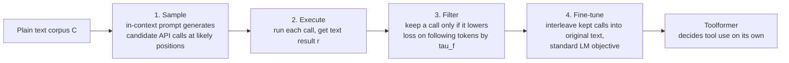

This is a technical dissection of **Toolformer** — Schick et al.'s method for teaching a language model to call external tools *by itself*, without human annotations of tool use. The engineering focus is the self-supervised loop that decides **which** API calls are worth learning, and the one criterion at its center: an API call earns a place in the training data only if it **measurably lowers the loss on the tokens that follow it**. Everything else — the token format, the inference-time interruption, the tool set — is scaffolding around that idea. **[Interpretation]**

**Attribution convention.** Because this article mixes what the paper reports with my own reasoning, every non-obvious technical claim is tagged:

- **[Paper]** — stated explicitly in Schick et al. (arXiv:2302.04761).
- **[Derived]** — a mathematical or logical consequence of the paper's setup, worked out here.
- **[Interpretation]** — my explanation or engineering reasoning, written for the reader; not a claim the paper makes.

---

## Why This Paper Matters

Large language models are paradoxical: superb at few-shot tasks, yet unreliable at things a pocket calculator or a lookup table nails — arithmetic, current facts, dates, low-resource translation. **[Paper]** The obvious fix is to give them tools. But prior tool-use methods needed either **heavy human annotation** or were **hard-wired to a single task** with hand-written prompts. **[Paper]**

Toolformer sets two desiderata that define its contribution: tool use should be learned **self-supervised** (no human tool-use labels — partly because what a *human* finds useful may differ from what the *model* finds useful), and it should be **general** — the model itself decides when, whether, and how to call which tool, not tied to any task. **[Paper]** The result: a 6.7B model that decides for itself to reach for a calculator or a search engine, and beats models 25× its size on the tasks where a tool helps. **[Paper]**

## The Core Idea: Let the Model Grade Its Own Tool Calls

The key move is using the model's **own future-token loss** as the label. **[Interpretation]** If inserting an API call *and its result* into the text makes the following tokens easier to predict, that call was useful and worth learning; if not, throw it away. No human ever says "this is a good place to call the calculator" — the perplexity signal says it instead. **[Paper]**

This turns tool-use supervision into something the model can generate at scale on any plain-text corpus. **[Interpretation]**

## The Method: Sample → Execute → Filter → Fine-tune

**API-call format.** A call is a tuple $c = (a_c, i_c)$ — API name and input. Two linearizations: **[Paper]**

$$
e(c) = \texttt{<API>}\ a_c(i_c)\ \texttt{</API>} \qquad e(c, r) = \texttt{<API>}\ a_c(i_c) \rightarrow r\ \texttt{</API>}
$$

A neat implementation detail: in practice `<API>`, `</API>`, and the result-separator are just the ordinary tokens `[`, `]`, and `->`, so **no vocabulary change is needed** — any pretrained LM can be augmented as-is. **[Paper]**

**Step 1 — Sample.** For each API, a short prompt $P(x)$ with a handful of human demonstrations encourages the model to annotate text. Candidate positions are found by where the model would plausibly *start* a call — keep positions $i$ where $p_M(\texttt{<API>} \mid P(x), x_{1:i-1})$ exceeds a threshold $\tau_s$, top-$k$ of them; then sample up to $m$ call candidates per position. **[Paper]** This is in-context learning (the [GPT-3](/engineering/gpt-3-language-models-are-few-shot-learners/) capability) used to bootstrap a training set from scratch. **[Interpretation]**

**Step 2 — Execute.** Run each call to get a single text result $r_i$ — the tool can be any process (another neural net, a Python script, a retriever) as long as input and output are text. **[Paper]**

**Step 3 — Filter (the heart).** For a call at position $i$ with result $r_i$, define a weighted cross-entropy over the following tokens given a prefix $z$: **[Paper]**

$$
L_i(z) = -\sum_{j=i}^{n} w_{j-i} \cdot \log p_M(x_j \mid z,\ x_{1:j-1})
$$

Then compare two conditions: **[Paper]**

$$
L_i^{+} = L_i\big(e(c_i, r_i)\big) \qquad L_i^{-} = \min\big(L_i(\varepsilon),\ L_i(e(c_i, \varepsilon))\big)
$$

Reading the symbols:

- **$L_i(z)$** — how hard the tokens $x_i,\dots,x_n$ are to predict when the model is prefixed with $z$; the weights $w_{j-i}$ decay with distance so a call is credited for helping *nearby* tokens. **[Paper]**
- **$L_i^{+}$** — the loss when the model is given **both the call and its result**. **[Paper]**
- **$L_i^{-}$** — the loss for the better of two baselines: **no call at all** ($\varepsilon$), or **the call without its result** ($e(c_i,\varepsilon)$). **[Paper]**

Keep the call only if it clears a threshold: **[Paper]**

$$
L_i^{-} - L_i^{+} \geq \tau_f
$$

In words: **an API call survives only if seeing its input *and output* reduces future-token loss by at least $\tau_f$, compared to not calling or calling blind.** **[Paper]** The paper shows this score correlates with human-judged usefulness — high $L_i^{-}-L_i^{+}$ calls are intuitively helpful; low ones are noise. **[Paper]**

**Step 4 — Fine-tune.** Kept calls are interleaved back into the original text and the model is fine-tuned with a plain LM objective. **[Paper]** The crucial property: **apart from the inserted calls, the augmented corpus $C^*$ is the exact same text as the original $C$** — so fine-tuning exposes the model to identical content and does not erode its general language-modeling ability. **[Paper]** And because calls sit exactly where they helped, the model learns *when and how* to call tools from its own feedback. **[Paper]**

## Inference: Interrupt, Call, Resume

At generation time, the model decodes normally until it emits the result-separator (`->`) token — its signal that it now expects a tool response. Decoding is **interrupted**, the API is called, and the response plus `</API>` is spliced in before decoding resumes. **[Paper]** Two decoding tweaks matter: the model is allowed to start a call when `<API>` is among the top-$k$ tokens (they use $k=10$ to encourage tool use, vs. $k=1$ = plain greedy), and it is capped at **one API call per input** to avoid loops. **[Paper]**

## The Tools

Five tools, each constrained only to have text input/output and a few demonstrations: **[Paper]**

- **Question Answering** — Atlas, a retrieval-augmented LM fine-tuned on Natural Questions.
- **Calculator** — four basic operations, rounded to 2 decimals.
- **Wikipedia Search** — a BM25 retriever over the KILT Wikipedia dump (returns text to be extracted from).
- **Machine Translation** — the 600M-parameter NLLB model (200 languages), source auto-detected, target English.
- **Calendar** — returns the current date; no input, pure temporal context.

The base model is **GPT-J (6.7B)**, augmented over a subset of CCNet, with per-tool heuristics to cut annotation cost (e.g. only feed the calculator texts containing ≥3 numbers). **[Paper]**

## Results: Small Model, Tools, Beats a Giant

All evaluations are **prompted zero-shot** — no in-context examples, so tool use must be genuinely learned, not prompted per task. **[Paper]**

- **Factual lookup (LAMA: SQuAD/Google-RE/T-REx):** Toolformer improves over the best same-size baseline by **11.7 / 5.2 / 18.6 points** and **beats GPT-3 (175B)** despite being ~25× smaller — it calls the QA tool in 98.1% of cases. **[Paper]**
- **Math (ASDiv/SVAMP/MAWPS):** using the calculator, Toolformer clearly **outperforms OPT-66B and GPT-3-175B**. **[Paper]** Interestingly it beats the baselines *even with API calls disabled* — fine-tuning on many calculator examples improved its own arithmetic — but enabling calls **more than doubles** performance. **[Paper]**
- **Multilingual QA (MLQA):** here it's weaker — GPT-J simply isn't very multilingual, so the translation tool can't fully close the gap. **[Paper]** An honest negative.
- **Language modeling (WikiText, CCNet):** perplexity does **not** degrade from the tool-augmented fine-tuning — the generality was preserved, as designed. **[Paper]**

## Tool Use Is Emergent

The scaling analysis is the most conceptually important result. **[Interpretation]** Applying the method across model sizes, the ability to actually **make good use of the provided tools only emerges at around 775M parameters**; below that, API calls don't help. **[Paper]** And it's not that small models catch up: as models grow they get better *both* at solving tasks without tools *and* at using tools well, so a **large gap between with-tool and without-tool predictions persists even for the biggest model**. **[Paper]** Tool use is a capability that switches on with scale, not a crutch that scale makes redundant. **[Interpretation]**

A related calibration observation: at $k=1$ (plain greedy), the model is somewhat **self-aware** — it chooses to call APIs on exactly the examples it would otherwise do badly on (its no-call accuracy on the examples where it *declines* to call is higher than its overall no-call accuracy). That calibration erodes as $k$ increases and calls become more indiscriminate. **[Paper]**

## Engineering Trade-offs & Limitations

The paper is candid, and the limits are exactly the seams where later agent work picks up. **[Interpretation]**

- **No chained tool use.** Calls are generated **independently**, so the fine-tuning set has no examples of feeding one tool's output into another — Toolformer can't compose tools. **[Paper]**
- **No interactive tool use.** It can't browse a search engine's many results or **refine a query** — it makes one call and takes what it gets. **[Paper]** This is precisely the interactive, multi-step loop that [ReAct](/engineering/react-synergizing-reasoning-acting/) performs at inference time via prompting. **[Interpretation]**
- **Prompt sensitivity.** Whether it decides to call an API is sensitive to exact input wording — an inherited LM fragility. **[Paper]**
- **Sample inefficiency.** Processing **>1M documents** yields only a few thousand useful calculator examples; the paper suggests iterating the bootstrap to fix this. **[Paper]**
- **No cost awareness.** The decision to call ignores the tool's computational cost — every call is treated as free. **[Paper]**

## Toolformer vs. ReAct: Two Philosophies of Tool Use

The cleanest way to place Toolformer is against [ReAct](/engineering/react-synergizing-reasoning-acting/): **[Interpretation]**

- **Toolformer bakes tool use into the weights.** Tool decisions are *learned* by self-supervised fine-tuning; at inference the model just emits a call token. One call, non-interactive, no chaining — but no per-task prompting needed and it generalizes zero-shot. **[Interpretation]**
- **ReAct keeps tool use in the context.** Tool decisions are *prompted* — the model interleaves reasoning traces and actions at inference, can observe results, refine, and loop, with no weight changes. **[Interpretation]**

They are complementary corners of the same design space: *learned-and-static* vs. *prompted-and-interactive*. Modern function-calling systems borrow from both — the learned "when to call" of Toolformer and the interactive multi-step loop of ReAct, which orchestration layers like [LLMCompiler](/engineering/llm-compiler-parallel-function-calling/) then schedule and parallelize. **[Interpretation]**

## Engineering Takeaway

- Tool-use supervision can be **generated by the model itself**: annotate text with candidate calls, and keep only those that **provably lower future-token loss**. **[Paper]**
- The API-call format needs **no vocabulary change**, and inference is a simple **decode-interrupt-call-resume** loop. **[Paper]**
- Fine-tuning on the *same text plus useful calls* teaches when/how to use tools **without harming general language modeling**. **[Paper]**
- Tool use is **emergent** (~775M params) and **not washed out by scale** — the with-tool advantage persists even for the largest models. **[Paper]**
- The honest limits — no chaining, no interaction, sample inefficiency — are the exact problems that prompted, interactive agent methods address. **[Interpretation]**

The single sentence to carry away: **let the model label its own tool calls by whether they help it predict the next tokens** — a self-supervised trick that turns "when should I use a calculator?" from a human annotation problem into a loss comparison. **[Interpretation]**
