This is an engineering dissection of **TurboQuant** (Zandieh, Daliri, Hadian, Mirrokni — arXiv:2504.19874) — an **online, data-oblivious vector quantizer** that compresses high-dimensional vectors to very low bit-widths while staying within a small constant factor of the information-theoretic optimum. The central question is not "how do we shrink a vector?" but **how do we shrink a vector while preserving the geometry that downstream systems actually consume** — reconstruction error for storage, and _inner products_ for attention and retrieval. **[Paper]**

The article does three things: (1) explains TurboQuant faithfully, tracing every matrix multiplication; (2) inspects a real community implementation; and (3) proposes — clearly labelled as _my_ engineering design, not the paper's — how TurboQuant could compress the dense embeddings in my earlier [SimpleMem](/engineering/simplemem-efficient-lifelong-memory-for-llm-agents/) memory system.

**Attribution convention.** Every non-obvious claim is tagged:

- **[Paper]** — stated/proved in TurboQuant (extracted from the PDF; the theorems and constants are quoted as written).
- **[Code]** — verified in the community implementation `github.com/0xsero/turboquant`. This is a **third-party** reimplementation with vLLM integration; the paper itself ships no official code. Its README carries an honest self-audit, which I preserve.
- **[SimpleMem]** — from my existing SimpleMem engineering dissection and the released `aiming-lab/SimpleMem` repo.
- **[Proposed]** — my engineering design for a TurboQuant × SimpleMem integration. **Not** part of the TurboQuant paper.
- **[Interpretation]** — my engineering reasoning to help the reader.

Nothing from the SimpleMem integration is presented as something TurboQuant claims. When categories could blur, I mark the boundary explicitly.

**Notation convention (used everywhere).** A vector $x \in \mathbb{R}^d$ is a **column vector**. Rotation is $y = \Pi x$; reconstruction is $\hat{x} = \Pi^\top \hat{y}$. For a batch, vectors are **rows** of $X \in \mathbb{R}^{n\times d}$, so the batched rotation is $Y = X\Pi^\top$. I never silently switch conventions. **[Interpretation]**

---

## 1. Introduction — Why TurboQuant Exists

Vector quantization (VQ) is the problem of encoding a floating-point vector $x \in \mathbb{R}^d$ as a short binary string and later reconstructing an approximation $\hat{x}$. Its roots are in Shannon's source-coding theory: there is a fundamental distortion-rate trade-off — fewer bits necessarily means more distortion, and the question is _how close to that limit can a practical algorithm get_. **[Paper]**

TurboQuant targets two modern workloads where this trade-off dominates cost: **[Paper]**

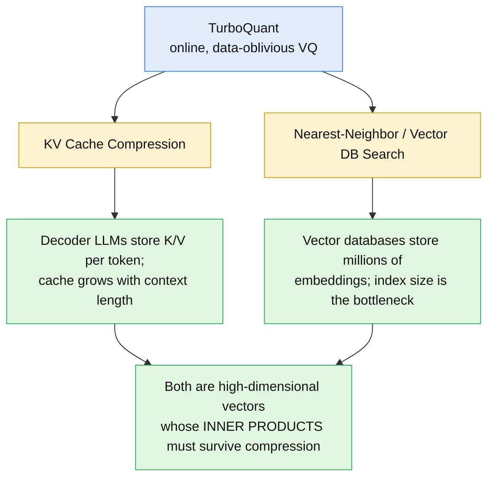

The paper's stated design goals are precise: TurboQuant must be **lightweight**, **online** (usable without a calibration pass over the dataset — "data-oblivious"), and **accelerator-friendly** (vectorizable on GPUs). Existing VQ methods, the paper argues, either lack vectorization (slow) or need heavy offline calibration (unsuitable for a dynamic KV cache). **[Paper]**

**What you should be able to explain:** _What two workloads motivate TurboQuant, and what three engineering properties (online, data-oblivious, accelerator-friendly) does it insist on — and why does a KV cache make offline calibration a non-starter?_

---

## 2. The Vector Quantization Problem

Formally, TurboQuant designs a quantization map and its inverse: **[Paper]**

$$
Q : \mathbb{R}^d \to \{0,1\}^{B}, \qquad Q^{-1} : \{0,1\}^{B} \to \mathbb{R}^d,
$$

with total bit budget $B = b \cdot d$, so **$b$ is the average number of bits per coordinate**. The map is inherently lossy ($Q$ is not a bijection), so the goal is to minimize distortion.

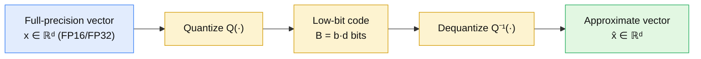

Concretely, full precision stores $d$ coordinates at 16 bits each; a $b$-bit quantizer stores $d$ coordinates at $b$ bits each, where each coordinate becomes an **index** into a codebook of $2^b$ scalar codewords: **[Paper]/[Interpretation]**

```
FULL PRECISION            QUANTIZED (b bits/coord)
x = [ x1  x2  …  xd ]      Q(x) = [ i1  i2  …  id ]
     └ 16 bits each             └ b bits each → 2^b codewords
```

Ignoring auxiliary metadata, the storage ratio is $16/b$: a 4-bit code is $4\times$ smaller, a 2-bit code $8\times$ smaller. (Real ratios are lower once norms and sign bits are counted — §12 and §13 are honest about this.) **[Interpretation]**

**What you should be able to explain:** _What are $Q$, $Q^{-1}$, and $B = b\cdot d$? Why is quantization lossy, and what does "$b$ bits per coordinate" buy you in storage?_

---

## 3. Two Different Goals — MSE vs. Inner-Product Distortion

This distinction is the intellectual core of the paper, so read it slowly. There are **two** ways to say "$\hat{x}$ is a good approximation of $x$." **[Paper]**

**(A) Reconstruct the vector itself** — minimize mean-squared error (Eq. 1):

$$
D_{\text{mse}} := \mathbb{E}_{Q}\Big[\; \lVert x - Q^{-1}(Q(x)) \rVert_2^2 \;\Big]
$$

**(B) Preserve how $x$ interacts with another vector $y$ through an inner product** (Eq. 2):

$$
D_{\text{prod}} := \mathbb{E}_{Q}\Big[\; \big| \langle y, x\rangle - \langle y, Q^{-1}(Q(x))\rangle \big|^2 \;\Big]
$$

- $x$ — the vector being stored (a key vector, or a memory embedding).
- $y$ — the vector it will be dotted with later (a query vector).
- $\mathbb{E}_Q$ — expectation over the quantizer's **randomness** (TurboQuant is a _randomized_ quantizer; its output is stochastic, so distortion is defined in expectation).

For inner-product quantizers the paper demands more than small $D_{\text{prod}}$ — it wants the estimator to be **unbiased**:

$$
\mathbb{E}_{Q}\big[\langle y, Q^{-1}(Q(x))\rangle\big] = \langle y, x\rangle .
$$

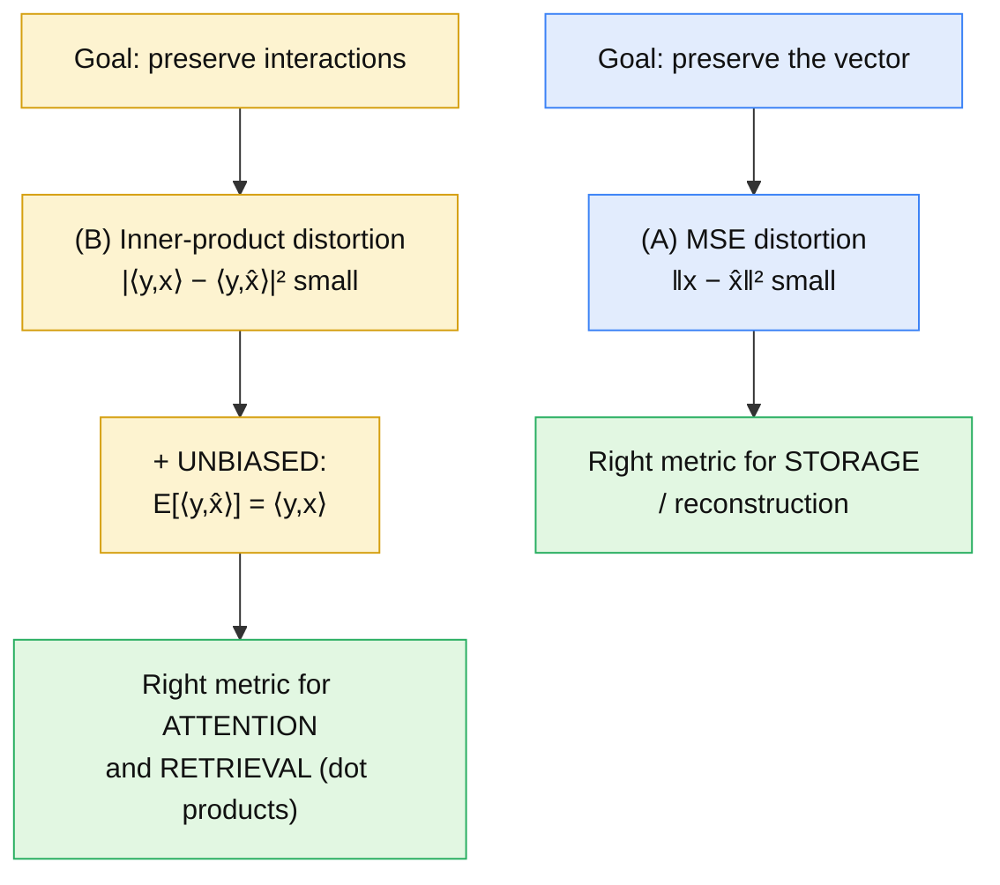

**The crucial fact:** minimizing MSE does _not_ guarantee unbiased inner products. A quantizer can reconstruct $x$ with small $\lVert x-\hat{x}\rVert$ yet **systematically shrink or inflate** every dot product $\langle y,\hat{x}\rangle$. The paper proves this with a clean example (§11). This is _the_ reason TurboQuant has two variants: `TurboQuant_mse` (goal A) and `TurboQuant_prod` (goal B). **[Paper]/[Interpretation]**

**What you should be able to explain:** _Write down $D_{\text{mse}}$ and $D_{\text{prod}}$. Why is "unbiased inner product" a stronger requirement than "small inner-product error"? Which metric matters for attention scores?_

---

## 4. TurboQuant's Core Idea

The whole method is one pipeline with a branch: **[Paper]**

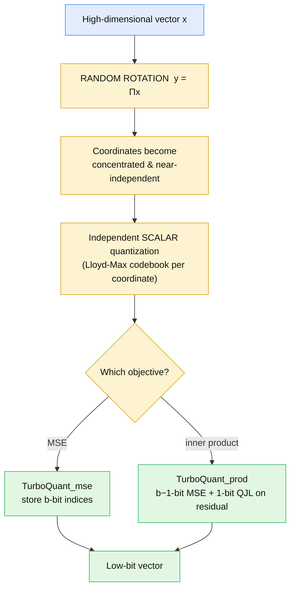

The single insight that makes everything tractable: **a hard $d$-dimensional quantization problem is turned into $d$ easy 1-dimensional problems by first rotating the vector.** After a random rotation, each coordinate follows a known, well-behaved distribution, and distinct coordinates become nearly independent — so quantizing each coordinate _separately_ with a small scalar codebook is close to optimal. Everything else (QJL, the residual trick) is about fixing the _inner-product bias_ that pure MSE quantization introduces. **[Paper]/[Interpretation]**

---

## 5. Random Rotation — the Matrix Operation

The first operation is a rotation by an orthogonal matrix $\Pi \in \mathbb{R}^{d\times d}$: **[Paper]**

$$
y = \Pi x .
$$

Written out, this is an ordinary matrix–vector product:

```
        ┌ π11  π12  …  π1d ┐   ┌ x1 ┐     ┌ y1 ┐
        │ π21  π22  …  π2d │   │ x2 │     │ y2 │
  Π  =  │  ⋮    ⋮       ⋮  │ × │ ⋮  │  =  │ ⋮  │  = y
        │ πd1  πd2  …  πdd │   │ xd │     │ yd │
        └                 ┘   └    ┘     └    ┘
     (d × d)                  (d × 1)    (d × 1)

  y_i = Σ_j  π_ij · x_j          # each output coord mixes all input coords
```

**Shapes:** $\Pi$ is $[d,d]$, $x$ is $[d]$, $y=\Pi x$ is $[d]$. **[Interpretation]**

How is $\Pi$ built? The paper takes the **QR decomposition of a random matrix with i.i.d. Normal entries** — the $Q$ factor is a uniformly-random orthogonal matrix. Because $\Pi$ is orthogonal, $\Pi^\top \Pi = I$, so it preserves length: $\lVert \Pi x\rVert_2 = \lVert x\rVert_2$. **The rotation adds no information and loses none** — it only _changes the coordinate system_. **[Paper]**

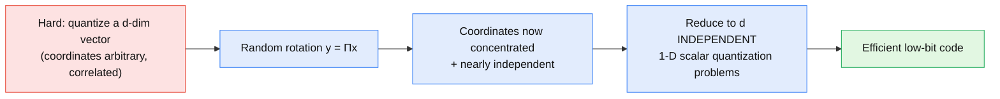

**What you should be able to explain:** _What is $y=\Pi x$ computationally? How is $\Pi$ generated, and why does orthogonality mean the rotation neither adds nor destroys information — only re-expresses it?_

---

## 6. Why Rotation Enables Scalar Quantization

The rotation is not magic — the paper gives a precise statistical argument. Don't over-simplify it to "rotation makes everything Gaussian." The actual chain is: **[Paper]**

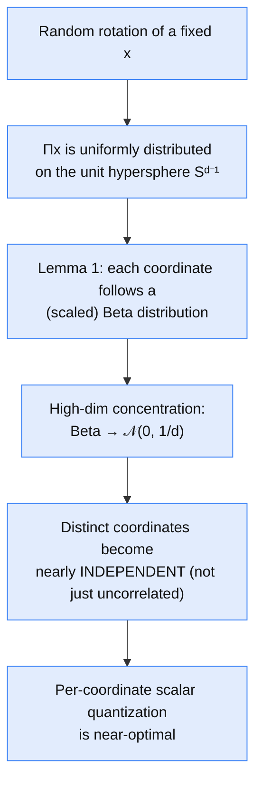

**Lemma 1** (coordinate distribution of a random point on the hypersphere). For $x$ uniform on $\mathbb{S}^{d-1}$, each coordinate $x_j$ has density **[Paper]**

$$
f_X(x) = \frac{\Gamma(d/2)}{\sqrt{\pi}\,\Gamma\!\big((d-1)/2\big)}\,\big(1-x^2\big)^{(d-3)/2}, \qquad x\in[-1,1],
$$

and in high dimensions this Beta density converges to $\mathcal{N}(0, 1/d)$.

Two consequences the design exploits: (1) after rotation the coordinate distribution is _known and identical_ across coordinates, so one precomputed codebook serves all coordinates; (2) coordinates are _nearly independent_, so quantizing them separately loses almost nothing versus a joint $d$-dimensional quantizer. That "near-independence" is the deeper result — uncorrelated would not be enough; the paper leans on the stronger near-independence property of high-dimensional sphere coordinates. **[Paper]/[Interpretation]**

**What you should be able to explain:** _State Lemma 1 in words. Why does "uniform on the sphere" give identically-distributed, near-independent coordinates, and why is that exactly what per-coordinate scalar quantization needs?_

---

## 7. Codebooks and Lloyd-Max Quantization

With the coordinate distribution $f_X$ known, quantizing one coordinate to $b$ bits means partitioning $[-1,1]$ into $2^b$ cells with centroids $c_1 \le c_2 \le \dots \le c_{2^b}$, chosen to minimize expected squared error. This is exactly **1-D k-means / Lloyd-Max quantization**. The paper writes it as a continuous k-means objective (Eq. 4): **[Paper]**

$$
\mathcal{C}(f_X, b) := \min_{-1\le c_1 \le \dots \le c_{2^b}\le 1}\; \sum_{i=1}^{2^b} \int_{\frac{c_{i-1}+c_i}{2}}^{\frac{c_i + c_{i+1}}{2}} |x - c_i|^2\, f_X(x)\, dx .
$$

- $c_i$ — the $i$-th centroid (codeword).
- The integration limits $\tfrac{c_{i-1}+c_i}{2}$ are the **Voronoi cell boundaries**: the optimal decision boundary between two centroids is their midpoint.
- The integrand $|x-c_i|^2 f_X(x)$ is squared error weighted by how likely that value is.

```
b bits  →  2^b centroids
b=1 → 2      b=2 → 4      b=3 → 8      b=4 → 16
```

Because $f_X$ depends only on $d$ (not on the data), the codebook is **precomputed once per $(d,b)$ and stored** — this is what makes TurboQuant _data-oblivious_ and online. For the near-Gaussian regime the paper gives explicit centroids, e.g. $b{=}1: \pm\frac{\sqrt{2/\pi}}{\sqrt{d}}$ and $b{=}2: \pm\frac{0.453}{\sqrt d}, \pm\frac{1.51}{\sqrt d}$. **[Paper]**

Quantizing one rotated coordinate is then a nearest-centroid lookup:

```
[y1  y2  y3  …  yd]                       # rotated vector
     │  for each y_j:  i_j = argmin_k |y_j − c_k|
     ▼
[i1  i2  i3  …  id]                        # b-bit index per coordinate
```

**What you should be able to explain:** _Why is scalar quantization a 1-D k-means problem? Why are cell boundaries the midpoints between centroids? Why can the codebook be precomputed and shared across all coordinates and all vectors?_

---

## 8. TurboQuant_mse — Algorithm 1

Putting rotation + scalar quantization together gives the MSE-optimal quantizer. **[Paper]**

```
Algorithm 1  TurboQuant_mse   (optimized for MSE)
── Setup (once) ──────────────────────────────────────────
  • Generate random rotation Π ∈ ℝ^{d×d}   (QR of Normal matrix)
  • Build codebook c_1..c_{2^b} ∈ [-1,1] minimizing Eq. 4
── Quant(x) ──────────────────────────────────────────────
  1. y   ← Π · x
  2. idx_j ← argmin_k |y_j − c_k|   for every j ∈ [d]     # b-bit ints
  3. return idx
── DeQuant(idx) ──────────────────────────────────────────
  4. ŷ_j ← c_{idx_j}   for every j ∈ [d]                  # centroid lookup
  5. x̂  ← Πᵀ · ŷ
  6. return x̂
```

The data flow, as a picture:

```
   x
   │  y = Π x                         (rotate: [d,d]·[d] → [d])
   ▼
   y
   │  scalar quantize each coord      (nearest centroid)
   ▼
  idx        ── stored: d × b bits
   │  ŷ_j = c_{idx_j}                 (centroid lookup)
   ▼
   ŷ
   │  x̂ = Πᵀ ŷ                        (rotate back: [d,d]·[d] → [d])
   ▼
   x̂
```

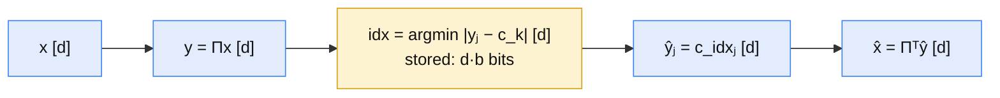

**Why $\Pi^\top$ on the way back?** Because $\Pi$ is orthogonal, $\Pi^\top\Pi = I$, so the exact inverse of $y=\Pi x$ is $x = \Pi^\top y$. Reconstruction applies the same inverse to the _quantized_ $\hat{y}$: $\hat{x} = \Pi^\top \hat{y}$. The rotation and its transpose bracket the quantization; the only lossy step is the scalar quantization in the middle. **[Paper]/[Interpretation]**

**Theorem 1 (MSE guarantee).** For any unit vector $x\in\mathbb{S}^{d-1}$, `TurboQuant_mse` at $b$ bits satisfies **[Paper]**

$$
D_{\text{mse}}(Q_{\text{mse}}) \;\le\; \frac{\sqrt{3}\,\pi}{2}\cdot\frac{1}{4^b}\quad\text{for any } b\ge 0,
$$

and for small bit-widths the refined values are $D_{\text{mse}} \approx \mathbf{0.36,\,0.117,\,0.03,\,0.009}$ for $b=1,2,3,4$. The proof reduces $D_{\text{mse}} = d\cdot\mathcal{C}(f_X,b)$ (since $\lVert x-\hat x\rVert = \lVert \Pi x - \hat y\rVert$ and all coordinates share $f_X$), then bounds the k-means cost via the Panter-Dite high-resolution formula. **[Paper]**

> **Non-unit vectors.** The unit-norm assumption is not restrictive: for general vectors store the L2 norm in floating point and rescale $\hat{x}$ by it after dequantization. **[Paper]**

**What you should be able to explain:** _Walk $x \to y \to \text{idx} \to \hat y \to \hat x$. Why is the reconstruction $\Pi^\top \hat y$ and not $\Pi^{-1}\hat y$ computed some other way? Where is the only lossy step?_

---

## 9. Memory Representation for TurboQuant_mse

What is physically stored per vector: **[Paper]/[Interpretation]**

```
Original (FP16):   d coordinates × 16 bits                    = 16d bits
TurboQuant_mse:    d indices     × b  bits   (+ 1 FP norm)     = bd  bits (+ ~16/32)
```

Ignoring the single stored norm, the compression ratio is $\approx 16/b$. The codebook and $\Pi$ are **shared across all vectors**, so they are amortized, not per-vector overhead. The paper also notes that **entropy-coding the indices** could shave a little more (at $b{=}4$ the index entropy is $\approx 3.8$ bits, giving $\approx5\%$ reduction) but deliberately skips it to keep the quantizer simple and fast. **[Paper]**

**Concrete numbers** ($d=1024$): **[Interpretation]**

| Format | Bits/coord | Total (metadata excl.)                    |
| ------ | ---------- | ----------------------------------------- |
| FP16   | 16         | $1024\times16 = 16{,}384$ bits $= 2048$ B |
| 4-bit  | 4          | $1024\times4 = 4096$ bits $= 512$ B       |
| 2-bit  | 2          | $1024\times2 = 2048$ bits $= 256$ B       |

**What you should be able to explain:** _What exactly is stored per vector, what is shared/amortized, and what is the (metadata-excluded) compression ratio at 2 and 4 bits?_

---

## 10. Why MSE Is Not Enough — the 2/π Bias

Now the pivot. `TurboQuant_mse` is MSE-optimal, but its inner products are **biased**. The paper's clean demonstration uses $b=1$. **[Paper]**

At 1 bit the optimal codebook is $\pm\sqrt{\tfrac{2}{\pi d}}$, so the 1-bit map is $Q_{\text{mse}}(x) = \operatorname{sign}(\Pi x)$ and its dequantizer is $Q_{\text{mse}}^{-1}(z) = \sqrt{\tfrac{2}{\pi d}}\cdot \Pi^\top z$. Plugging into the inner-product expectation gives **[Paper]**

$$
\mathbb{E}\big[\langle y, Q_{\text{mse}}^{-1}(Q_{\text{mse}}(x))\rangle\big] = \frac{2}{\pi}\,\langle y, x\rangle .
$$

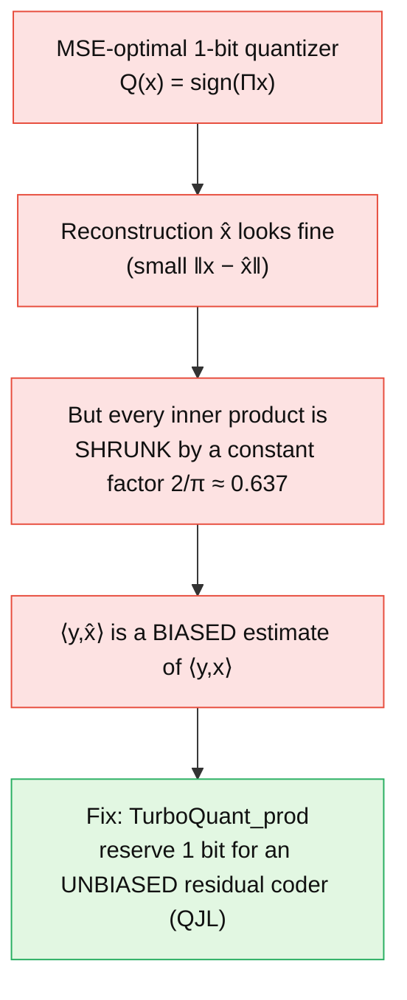

The bias is **multiplicative**: every dot product is scaled by $2/\pi \approx 0.637$. For pure reconstruction that is invisible; for attention scores or retrieval similarities it is a _systematic distortion of every comparison_. The bias shrinks as $b$ grows (the experiments confirm it converges to zero), but it never vanishes at low bit-widths — precisely the regime we care about. This is why TurboQuant needs a second, inner-product-aware construction. **[Paper]/[Interpretation]**

**What you should be able to explain:** _What is the 1-bit MSE quantizer, and why is $\mathbb{E}[\langle y,\hat x\rangle] = \frac{2}{\pi}\langle y,x\rangle$ a problem for retrieval even though $\hat x$ reconstructs $x$ well?_

---

## 11. QJL — 1-Bit Inner-Product Quantization

The fix borrows the **Quantized Johnson-Lindenstrauss (QJL)** transform: a data-oblivious way to encode a vector in **one bit per coordinate** that gives an _unbiased_ inner-product estimate. **[Paper]**

**Definition 1 (QJL).** With a random matrix $S \in \mathbb{R}^{d\times d}$, entries i.i.d. $\mathcal{N}(0,1)$: **[Paper]**

$$
Q_{\text{qjl}}(x) = \operatorname{sign}(S\,x) \in \{-1,+1\}^d .
$$

The matrix multiplication, drawn out:

```
        ┌ s11  s12  …  s1d ┐   ┌ r1 ┐     ┌ z1 ┐            ┌ q1 ┐
        │ s21  s22  …  s2d │   │ r2 │     │ z2 │  sign(·)   │ q2 │
  S  =  │  ⋮    ⋮       ⋮  │ × │ ⋮  │  =  │ ⋮  │  ───────▶  │ ⋮  │
        │ sd1  sd2  …  sdd │   │ rd │     │ zd │            │ qd │
        └                 ┘   └    ┘     └    ┘            └    ┘
     (d × d)                  (d × 1)    z = S r  [d]     qjl = sign(z) ∈ {−1,+1}^d

  q_i = sign( Σ_j s_ij · r_j )        # each bit = sign of a random projection
```

**Shapes:** $S$ is $[d,d]$, input is $[d]$, $Sr$ is $[d]$, and the output is $d$ sign bits — **exactly 1 bit per coordinate.** Each output bit is the _sign of a random linear projection_ of the input; a random projection preserves inner-product geometry (Johnson-Lindenstrauss), and keeping only the sign turns out to still carry an unbiased signal about the original inner product. **[Paper]/[Interpretation]**

**What you should be able to explain:** _What is $\operatorname{sign}(Sx)$ computationally? Why is each coordinate exactly 1 bit? What role does the random projection $S$ play?_

---

## 12. QJL Dequantization and Unbiasedness

The QJL inverse rescales the sign bits back through $S^\top$: **[Paper]**

$$
Q_{\text{qjl}}^{-1}(z) = \frac{\sqrt{\pi/2}}{d}\, S^\top z, \qquad z \in \{-1,+1\}^d .
$$

```
  qjl ∈ {−1,+1}^d
   │  Sᵀ · qjl                    (Sᵀ is [d,d], qjl is [d] → [d])
   ▼
  Sᵀqjl  [d]
   │  scale by  √(π/2) / d
   ▼
  reconstructed residual estimate  [d]
```

**Lemma 4 (QJL performance).** For any $x\in\mathbb{S}^{d-1}$ and any $y\in\mathbb{R}^d$: **[Paper]**

$$
\mathbb{E}\big[\langle y, Q_{\text{qjl}}^{-1}(Q_{\text{qjl}}(x))\rangle\big] = \langle y, x\rangle, \qquad
\operatorname{Var}\big(\langle y, Q_{\text{qjl}}^{-1}(Q_{\text{qjl}}(x))\rangle\big) \le \frac{\pi}{2d}\,\lVert y\rVert_2^2 .
$$

The estimator is a sum over the $d$ rows $s_i$ of $S$: $\langle y, Q_{\text{qjl}}^{-1}(Q_{\text{qjl}}(x))\rangle = \frac{1}{d}\sum_i \sqrt{\pi/2}\; s_i^\top y \cdot \operatorname{sign}(s_i^\top x)$. Each term is an unbiased 1-sample estimate of $\langle y,x\rangle$; averaging $d$ of them keeps it unbiased and drives the variance down as $1/d$. The scaling constant $\sqrt{\pi/2}/d$ is exactly what makes the expectation land on $\langle y,x\rangle$ rather than a scaled version — it's the antidote to the $2/\pi$ bias of §10. **[Paper]/[Interpretation]**

**Why $S^\top$?** Symmetrically to $\Pi^\top$: the forward map projects with $S$ (rows of $S$), and the estimator reads the signal back by projecting the query through the _same_ rows, i.e. $S^\top z$. **[Interpretation]**

**What you should be able to explain:** _Write the QJL dequantizer. Why is it unbiased where the 1-bit MSE quantizer was not? Where does the $\sqrt{\pi/2}/d$ constant come from and what does it fix?_

---

## 13. TurboQuant_prod — Algorithm 2

Now assemble the inner-product-optimal quantizer. The idea is a **two-stage residual decomposition**: spend $b-1$ bits on an MSE quantizer to capture most of the vector, then spend the **last 1 bit** on a QJL code of what's left over (the residual), which is small and can be coded unbiasedly. **[Paper]**

```
Algorithm 2  TurboQuant_prod   (optimized for inner product, budget b bits)
── Setup ─────────────────────────────────────────────────
  • Instantiate a TurboQuant_mse with bit-width (b − 1)
  • Generate random projection S ∈ ℝ^{d×d},  S_ij ~ 𝒩(0,1)
── Quant(x) ──────────────────────────────────────────────
  1. idx ← Quant_mse(x)                     # (b−1)-bit indices
  2. r   ← x − DeQuant_mse(idx)             # residual vector   [d]
  3. qjl ← sign(S · r)                      # 1-bit QJL on residual
  4. return (idx, qjl, ‖r‖₂)                # γ := ‖r‖₂  stored in FP
── DeQuant(idx, qjl, γ) ──────────────────────────────────
  5. x̂_mse ← DeQuant_mse(idx)
  6. x̂_qjl ← (√(π/2) / d) · γ · Sᵀ · qjl
  7. return x̂_mse + x̂_qjl
```

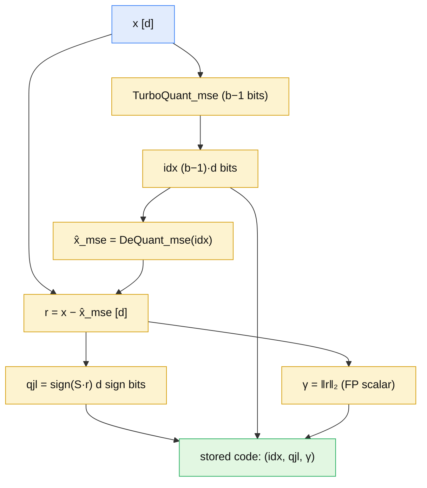

The stored representation is $Q_{\text{prod}}: \mathbb{R}^d \to [2^{b-1}]^d \times \{-1,+1\}^d \times \mathbb{R}$ — the MSE indices, the QJL sign vector, and the residual norm $\gamma=\lVert r\rVert$. **[Paper]**

**Why the decomposition works:** the first stage removes the bulk of $x$ (large MSE reduction), leaving a residual $r$ with _small_ norm — on expectation $\mathbb{E}[\lVert r\rVert] = \sqrt{\mathcal{C}(f_X, b-1)}$. QJL then only has to encode this small residual, and because QJL is unbiased, the residual's contribution to the inner product is captured _without bias_. Big cheap MSE stage + small unbiased correction = the best of both. **[Paper]/[Interpretation]**

**What you should be able to explain:** _Why does TurboQuant_prod split its budget as (b−1) MSE bits + 1 QJL bit rather than spending all $b$ bits on MSE? What are the three things stored, and why is the residual norm $\gamma$ needed?_

---

## 14. The Final Reconstruction, Written Out

The two components and their sum, exactly as in the paper: **[Paper]**

$$
\hat{x}_{\text{mse}} = \text{DeQuant}_{\text{mse}}(\text{idx}), \qquad r = x - \hat{x}_{\text{mse}}, \qquad \text{qjl} = \operatorname{sign}(S r),
$$

$$
\hat{x}_{\text{qjl}} = \frac{\sqrt{\pi/2}}{d}\,\lVert r\rVert\, S^\top\,\text{qjl}, \qquad \boxed{\;\hat{x} = \hat{x}_{\text{mse}} + \hat{x}_{\text{qjl}}\;}
$$

```
   x̂  =    x̂_mse        +        x̂_qjl
        (Πᵀ ŷ, the           (√(π/2)/d · ‖r‖ · Sᵀ qjl,
         MSE bulk)             the unbiased residual correction)
```

The residual norm $\gamma=\lVert r\rVert$ appears because the QJL sign bits only encode the _direction_ of the residual (signs of projections); the magnitude must be reinstated by the stored scalar $\gamma$. Store the direction in 1 bit/coord, store the length in one float. **[Paper]/[Interpretation]**

---

## 15. Why the Inner-Product Estimate Is Unbiased

The proof of **Theorem 2** is short once you see the decomposition. Split the vector, split the inner product: **[Paper]**

$$
x = \hat{x}_{\text{mse}} + r \;\Longrightarrow\; \langle y, x\rangle = \langle y, \hat{x}_{\text{mse}}\rangle + \langle y, r\rangle .
$$

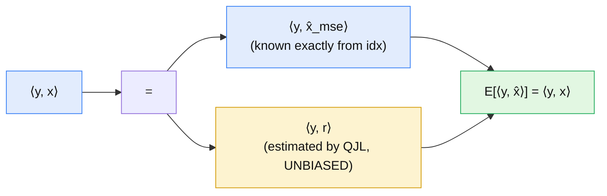

The reconstructed estimate is $\langle y, \hat{x}\rangle = \langle y, \hat{x}_{\text{mse}}\rangle + \langle y, \hat{x}_{\text{qjl}}\rangle$. The first term is a _deterministic_ known quantity (the MSE stage is fixed once idx is stored). By Lemma 4, the second term is an unbiased estimator of $\langle y, r\rangle$: $\mathbb{E}[\langle y,\hat{x}_{\text{qjl}}\rangle] = \langle y, r\rangle$. Therefore **[Paper]**

$$
\mathbb{E}\big[\langle y, \hat{x}\rangle\big] = \langle y, \hat{x}_{\text{mse}}\rangle + \langle y, r\rangle = \langle y, x\rangle .
$$

**Theorem 2 (inner-product guarantee).** Beyond unbiasedness, the distortion is bounded by **[Paper]**

$$
D_{\text{prod}}(Q_{\text{prod}}) \le \frac{\sqrt{3}\,\pi^2 \lVert y\rVert_2^2}{d}\cdot\frac{1}{4^b},
$$

with refined small-bit values $D_{\text{prod}} \approx \tfrac{\mathbf{1.57}}{d}, \tfrac{\mathbf{0.56}}{d}, \tfrac{\mathbf{0.18}}{d}, \tfrac{\mathbf{0.047}}{d}$ for $b=1,2,3,4$. The distortion proof conditions on $\hat{x}_{\text{mse}}$, uses the QJL variance bound $\tfrac{\pi}{2d}\lVert y\rVert^2$ scaled by $\gamma^2=\lVert r\rVert^2$, then takes expectation over the MSE stage where $\mathbb{E}[\lVert r\rVert^2] = D_{\text{mse}}$ at bit-width $b-1$. **[Paper]**

**What you should be able to explain:** _Decompose $\langle y,x\rangle$ into MSE and residual parts. Which part is deterministic and which is the unbiased QJL estimate? Why does that make $\mathbb{E}[\langle y,\hat x\rangle]=\langle y,x\rangle$?_

---

## 16. Information-Theoretic Lower Bounds — "Near-Optimal"

The word _near-optimal_ in the title is earned against a hard limit. **Theorem 3** proves that **no** randomized quantizer (with bit-width $b$) can beat: **[Paper]**

$$
D_{\text{mse}}(Q) \ge \frac{1}{4^b}, \qquad D_{\text{prod}}(Q) \ge \frac{\lVert y\rVert_2^2}{d}\cdot\frac{1}{4^b} .
$$

The lower bound is derived from **Shannon's Lower Bound** on distortion-rate (Lemma 2–3) combined with **Yao's minimax principle** (which relates worst-case-input randomized algorithms to average-case-input deterministic ones). Both bounds decay as $4^{-b}$ — the same exponential rate as TurboQuant's _upper_ bounds.

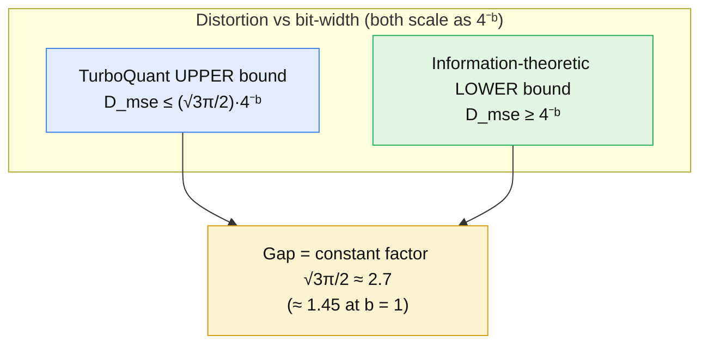

The gap is only a **constant factor** — $\tfrac{\sqrt3\pi}{2}\approx 2.7$ in the worst case, shrinking to $\approx 1.45$ at $b=1$. So TurboQuant matches the optimal _bit-width dependence_ ($4^{-b}$) and sits within a small multiplicative constant of the best possible distortion at every bit-width. That is what "near-optimal distortion rate" means precisely: same exponent, small constant. **[Paper]/[Interpretation]**

**What you should be able to explain:** _What do the lower bounds say, and what two tools prove them? Why does "same $4^{-b}$ rate, constant-factor gap" justify calling TurboQuant near-optimal?_

---

## 17. Experimental Results (Paper-Reported)

All experiments run on a single **NVIDIA A100**. I report them as the paper's results, not mine. **[Paper]**

**Distortion validation (§4.1).** On DBpedia entities encoded to 1536-d OpenAI embeddings, measured MSE and inner-product distortion track the theoretical curves between the lower and upper bounds. `TurboQuant_prod` stays **unbiased across all bit-widths**; `TurboQuant_mse` shows the predicted inner-product bias at low bits that vanishes as $b$ grows. `prod` wins at low bit-ratios; `mse` overtakes it at higher bit-ratios (its bias gone). **[Paper]**

**KV cache — needle-in-a-haystack (§4.2).** Llama-3.1-8B-Instruct, documents from 4k to 104k tokens, memory compression ratio 0.25 (25% of full KV). TurboQuant scores **0.997 — identical to the full-precision model** — at $>4\times$ compression, matching/beating PolarQuant, and clearly above SnapKV (0.858), PyramidKV (0.895), KIVI (0.981). **[Paper]**

**KV cache — LongBench-E (§4.3).** With outlier-aware bit splitting (e.g. 32 outlier channels at 3 bits + 96 channels at 2 bits $\Rightarrow$ 2.5 effective bits), TurboQuant at **2.5-bit and 3.5-bit** matches full-cache quality while compressing quantized vectors by **at least $4.5\times$**. On Llama-3.1-8B: Full Cache avg 50.06, TurboQuant-3.5 50.06, TurboQuant-2.5 49.44. **[Paper]**

**Nearest-neighbor search (§4.4).** Recall@k (1@k) on GloVe (d=200) and OpenAI3 (d=1536, 3072) vs Product Quantization and RabitQ. TurboQuant matches or beats them on recall, and its **indexing/quantization time is essentially zero** because it needs no codebook training: **[Paper]**

| Quantization time (s), 4-bit | d=200      | d=1536     | d=3072     |
| ---------------------------- | ---------- | ---------- | ---------- |
| Product Quantization         | 37.04      | 239.75     | 494.42     |
| RabitQ                       | 597.25     | 2267.59    | 3957.19    |
| **TurboQuant**               | **0.0007** | **0.0013** | **0.0021** |

That $\sim10^5$–$10^6\times$ gap in indexing time is the practical payoff of being data-oblivious: PQ/RabitQ must run k-means over the dataset; TurboQuant just rotates and looks up a precomputed codebook. **[Paper]/[Interpretation]**

**What you should be able to explain:** _For each of the three application experiments, what was measured and what did TurboQuant achieve — and why is the near-zero indexing time a structural consequence of data-obliviousness?_

---

## 18. KV Cache Compression — the Primary Application

Why a decoder LLM cares. During generation, every past token contributes a **key** and **value** vector per layer per head that must be kept in the **KV cache** so future tokens can attend to it. Cache size scales as: **[Paper]/[Interpretation]**

$$
\text{KV bytes} \;\propto\; (\text{layers}) \times (\text{KV heads}) \times (\text{context length}) \times (\text{head dim}) \times (\text{precision}).
$$

At long context this dominates memory and bandwidth. TurboQuant is a natural fit because (a) K/V are just high-dimensional vectors, (b) attention is _inner products_ $\langle q, k\rangle$ — exactly the geometry `TurboQuant_prod` preserves without bias, and (c) the cache is _dynamic_ (new tokens arrive constantly), so a _data-oblivious, online_ quantizer that needs no calibration is essential. **[Paper]**

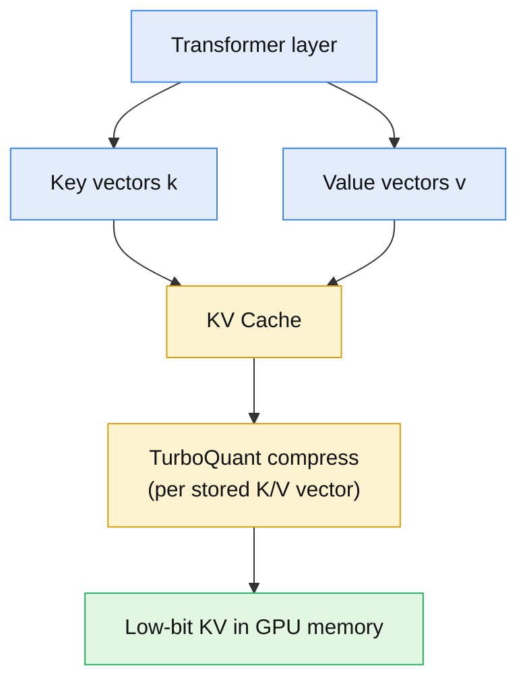

At decode time, the query attends against the _quantized_ keys:

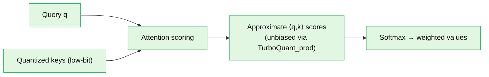

**Important scope note:** TurboQuant does **not** change the transformer or replace attention. It is a _compression codec_ applied to the stored K/V vectors; the attention math is unchanged, only the operands are quantized. The paper does not propose an attention kernel — where exactly dequantization happens (materialize $\hat k$, then dot; or fuse into the score) is an implementation choice. **[Paper]/[Interpretation]**

**What you should be able to explain:** _Why does the KV cache grow, and why are its vectors a good target for inner-product-preserving quantization? Why does TurboQuant not alter the transformer architecture?_

---

## 19. Online, Data-Oblivious Quantization — Why It Matters

The distinction the paper hammers: **[Paper]**

|                                   | Offline / data-dependent (e.g. PQ, GPTQ, AWQ) | Online / data-oblivious (TurboQuant) |
| --------------------------------- | --------------------------------------------- | ------------------------------------ |
| Needs calibration pass over data? | Yes (k-means / Hessian)                       | **No**                               |
| Suitable for dynamic KV cache?    | Awkward                                       | **Yes**                              |
| Indexing time                     | Seconds–minutes                               | ~zero                                |
| Vectorizable on GPU               | Often not                                     | **Yes** (dense matmul + lookup)      |

A KV cache is _created on the fly_ during generation — you cannot pre-train a quantizer on tokens that don't exist yet. TurboQuant's codebook depends only on $(d,b)$, not on data, so it quantizes new K/V the instant they appear. The same argument applies to any _streaming_ vector insertion — including, as I'll argue (clearly labelled), inserting new memories into an agent's store. **[Paper]/[Interpretation]**

**What you should be able to explain:** _Contrast offline vs. online quantization. Why is data-obliviousness not just a nice-to-have but a requirement for KV caches and streaming inserts?_

---

## 20. Nearest-Neighbor Search — the Second Application

Vector databases store millions of embeddings; the index size (memory + communication) is the bottleneck, classically mitigated by **Product Quantization (PQ)**, which trains per-subspace k-means codebooks. PQ's problem: the codebook must be _learned from data_ (slow indexing, unsuitable online) and stored separately. **[Paper]**

TurboQuant offers the same compression **without training**: rotate, look up the precomputed codebook, optionally add the QJL residual bit for unbiased inner products. The paper reports it matching/exceeding PQ and RabitQ on recall@k while reducing indexing time to virtually zero (§17 table). **[Paper]**

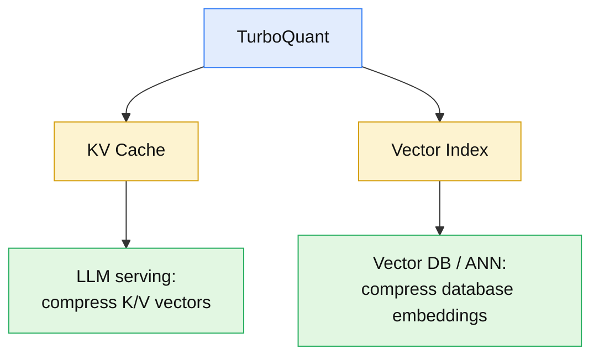

Both applications share the _same primitive_ (compress high-dim vectors, preserve inner products) but are **different data structures** — a serving-time K/V cache vs. a persistent search index. Do not conflate them. This distinction is the bridge to the SimpleMem section. **[Interpretation]**

**What you should be able to explain:** _Why is PQ ill-suited to online settings, and how does TurboQuant achieve comparable recall with near-zero indexing? Why are KV-cache compression and vector-index compression the same primitive on different data structures?_

---

## 21. The Community Implementation (Code)

The paper ships no official code, but a third-party implementation exists at **`github.com/0xsero/turboquant`** (Python 3.12, Triton kernels, vLLM 0.18 integration). I inspected its structure; the module layout maps cleanly onto the algorithms above: **[Code]**

| File                                         | Role                                                                | Maps to        |
| -------------------------------------------- | ------------------------------------------------------------------- | -------------- |
| `rotation.py`                                | orthogonal rotation $\Pi$ + QJL matrix $S$                          | §5, §11        |
| `codebook.py` + `codebooks/`                 | Lloyd-Max scalar quantizer, precomputed codebooks                   | §7             |
| `quantizer.py`                               | `TurboQuantMSE`, `TurboQuantProd` classes                           | Alg. 1, Alg. 2 |
| `kv_cache.py`                                | cache management + bit-packing (4-to-1 for 2-bit, 2-to-1 for 4-bit) | §9             |
| `capture.py` / `store.py` / `score.py`       | attention-layer hooks, compressed storage, scoring                  | §18            |
| `integration/vllm.py`                        | monkey-patch adapter: `free_kv_cache()`, `hybrid_decode()`          | §18            |
| `triton_kernels.py` / `vllm_attn_backend.py` | fused decode kernels + vLLM shim                                    | §18            |

Two honesty notes I preserve from the repo's own README audit — this is exactly the kind of gap between a paper's clean claims and a real implementation worth flagging: **[Code]**

- The advertised "5.1× compression" does **not** count the $\Pi$/$S$ matrices or ring buffer; the repo's honest figure is $\approx 4.6\times$ at 4k tokens, $\approx5\times$ at 32k+.
- "Hybrid decode saves memory" is true for **storage** but not compute — the repo's `hybrid_decode()` dequantizes history to float32 per decode step. And on hybrid/MoE models only the _full-attention_ layers are compressible (≈30% total KV savings), vs the ≈77% (4.4×) achievable on a pure dense transformer.

These are **third-party** measurements on specific hardware (RTX 3090/5090, Qwen3.5 models), not paper claims. I present them as such and do not fold them into TurboQuant's paper results. **[Code]/[Interpretation]**

**What you should be able to explain:** _Which repo module implements each algorithmic stage? Name two claims the repo's own audit flags as needing qualification, and why the $\Pi$/$S$ matrices matter for the honest compression ratio._

---

## 22. Educational Implementation (NumPy)

A clean, runnable reference implementation of the paper's algorithms. **This is my educational implementation of the paper's math — not an official or the community TurboQuant API.** Column-vector convention throughout. **[Interpretation]**

```python
"""Educational implementation of TurboQuant (arXiv:2504.19874).
NOT an official API. Column-vector convention: y = Π x, x̂ = Πᵀ ŷ.
"""
import numpy as np

# ---------- Setup primitives ----------
def generate_random_rotation(d, seed=0):
    """Uniform random orthogonal Π ∈ R^{d×d} via QR of a Normal matrix."""
    rng = np.random.default_rng(seed)
    G = rng.standard_normal((d, d))
    Q, R = np.linalg.qr(G)
    Q *= np.sign(np.diag(R))          # fix QR sign ambiguity → uniform Haar
    return Q                           # Π, shape [d, d], Πᵀ Π = I

def build_codebook(d, b, n_samples=200_000, iters=100, seed=1):
    """1-D Lloyd-Max centroids for the sphere-coordinate distribution.
    Samples coordinates of random unit vectors (~Beta, →N(0,1/d))."""
    rng = np.random.default_rng(seed)
    V = rng.standard_normal((n_samples, d))
    V /= np.linalg.norm(V, axis=1, keepdims=True)
    samples = V[:, 0]                                  # one coordinate
    k = 2 ** b
    c = np.quantile(samples, np.linspace(0, 1, k + 2)[1:-1])  # init
    for _ in range(iters):                              # Lloyd iterations
        idx = np.abs(samples[:, None] - c[None, :]).argmin(1)
        for j in range(k):
            m = idx == j
            if m.any():
                c[j] = samples[m].mean()
        c.sort()
    return c                                            # [2^b] centroids

# ---------- TurboQuant_mse (Algorithm 1) ----------
def turboquant_mse_quantize(x, Pi, codebook):
    y = Pi @ x                                          # [d]
    idx = np.abs(y[:, None] - codebook[None, :]).argmin(1)  # [d], b-bit ints
    return idx

def turboquant_mse_dequantize(idx, Pi, codebook):
    y_hat = codebook[idx]                               # centroid lookup [d]
    return Pi.T @ y_hat                                 # x̂ = Πᵀ ŷ  [d]

# ---------- QJL (Definition 1) ----------
def qjl_quantize(r, S):
    return np.sign(S @ r)                               # sign(S r) ∈ {−1,+1}^d

def qjl_dequantize(qjl, S, d):
    return (np.sqrt(np.pi / 2) / d) * (S.T @ qjl)       # √(π/2)/d · Sᵀ qjl

# ---------- TurboQuant_prod (Algorithm 2) ----------
def turboquant_prod_quantize(x, Pi, codebook_bm1, S):
    idx = turboquant_mse_quantize(x, Pi, codebook_bm1)  # (b−1)-bit MSE
    x_hat_mse = turboquant_mse_dequantize(idx, Pi, codebook_bm1)
    r = x - x_hat_mse                                   # residual [d]
    qjl = qjl_quantize(r, S)                            # 1-bit QJL
    gamma = np.linalg.norm(r)                           # residual norm
    return idx, qjl, gamma

def turboquant_prod_dequantize(idx, qjl, gamma, Pi, codebook_bm1, S):
    d = Pi.shape[0]
    x_hat_mse = turboquant_mse_dequantize(idx, Pi, codebook_bm1)
    x_hat_qjl = gamma * qjl_dequantize(qjl, S, d)       # scale by ‖r‖
    return x_hat_mse + x_hat_qjl                        # x̂ = x̂_mse + x̂_qjl

def estimate_inner_product(y, idx, qjl, gamma, Pi, codebook_bm1, S):
    x_hat = turboquant_prod_dequantize(idx, qjl, gamma, Pi, codebook_bm1, S)
    return y @ x_hat
```

### Batched matrix multiplication

For $n$ vectors stored as **rows** of $X\in\mathbb{R}^{n\times d}$, the single-vector $y=\Pi x$ generalizes — mind the transpose: **[Interpretation]**

```
Single vector:   y = Π x            Π:[d,d]  x:[d]      → y:[d]
Batch (rows):    Y = X Πᵀ           X:[n,d]  Πᵀ:[d,d]   → Y:[n,d]
```

```python
def turboquant_mse_quantize_batch(X, Pi, codebook):
    """X: [n, d] (vectors as rows).  Returns idx: [n, d]."""
    Y = X @ Pi.T                                        # [n, d]  =  X Πᵀ
    return np.abs(Y[:, :, None] - codebook[None, None, :]).argmin(2)
```

If you write `Y = X @ Pi` instead of `X @ Pi.T` you rotate by the _wrong_ operator — reconstruction will silently break. The single-vector column form $y=\Pi x$ and the batched row form $Y=X\Pi^\top$ describe the _same_ rotation; keep the convention straight. **[Interpretation]**

---

## 23. Tests

Statistical tests that verify the paper's guarantees rather than a fixed golden output. **[Interpretation]**

```python
import numpy as np

def test_rotation_preserves_norm():
    d = 256; Pi = generate_random_rotation(d, seed=3)
    x = np.random.default_rng(0).standard_normal(d)
    assert np.allclose(np.linalg.norm(Pi @ x), np.linalg.norm(x))          # ‖Πx‖ = ‖x‖
    assert np.allclose(Pi.T @ Pi, np.eye(d), atol=1e-10)                   # Πᵀ Π = I

def test_mse_decreases_with_bits():
    d = 256; Pi = generate_random_rotation(d, seed=3)
    rng = np.random.default_rng(1)
    X = rng.standard_normal((500, d)); X /= np.linalg.norm(X, axis=1, keepdims=True)
    prev = np.inf
    for b in (1, 2, 3, 4):
        cb = build_codebook(d, b)
        errs = []
        for x in X:
            xh = turboquant_mse_dequantize(turboquant_mse_quantize(x, Pi, cb), Pi, cb)
            errs.append(np.sum((x - xh) ** 2))
        mse = np.mean(errs)
        assert mse < prev, f"MSE should drop as b grows (b={b})"           # monotone ↓
        prev = mse

def test_qjl_is_binary():
    d = 128; S = np.random.default_rng(5).standard_normal((d, d))
    r = np.random.default_rng(6).standard_normal(d)
    q = qjl_quantize(r, S)
    assert set(np.unique(q)).issubset({-1.0, 1.0})                          # sign bits

def test_prod_inner_product_unbiased():
    """E[⟨y, x̂⟩] → ⟨y, x⟩ over the quantizer's randomness (many S draws)."""
    d = 512; b = 3
    Pi = generate_random_rotation(d, seed=3); cb = build_codebook(d, b - 1)
    rng = np.random.default_rng(7)
    x = rng.standard_normal(d); x /= np.linalg.norm(x)
    y = rng.standard_normal(d)
    true = y @ x
    ests = []
    for t in range(4000):                                                   # avg over S
        S = np.random.default_rng(1000 + t).standard_normal((d, d))
        idx, q, g = turboquant_prod_quantize(x, Pi, cb, S)
        ests.append(estimate_inner_product(y, idx, q, g, Pi, cb, S))
    assert abs(np.mean(ests) - true) < 0.02 * (abs(true) + 1e-6)            # unbiased

def test_mse_1bit_is_biased():
    """Contrast: pure 1-bit MSE inner product ≈ (2/π)·⟨y,x⟩ (biased)."""
    d = 512
    Pi = generate_random_rotation(d, seed=3); cb = build_codebook(d, 1)
    rng = np.random.default_rng(8)
    x = rng.standard_normal(d); x /= np.linalg.norm(x); y = rng.standard_normal(d)
    idx = turboquant_mse_quantize(x, Pi, cb)
    xh = turboquant_mse_dequantize(idx, Pi, cb)
    ratio = (y @ xh) / (y @ x)
    assert abs(ratio - 2 / np.pi) < 0.15                                    # ≈ 0.637
```

Test coverage maps to the required properties: norm preservation (A), MSE monotone in $b$ (B/C), QJL binary (D), `prod` unbiasedness (E/F), batch shapes (§22), and — as a deliberate contrast — the `mse` 1-bit bias of §10. **[Interpretation]**

---

## 24. Traditional Scalar Quant vs PQ vs TurboQuant

A concise comparison. Rows marked with a metric supported by the paper are `[Paper]`; broader engineering framing is `[Interpretation]`. **[Paper]/[Interpretation]**

| Property                | Scalar quant (fixed grid) | Product Quantization | TurboQuant                                                    |
| ----------------------- | ------------------------- | -------------------- | ------------------------------------------------------------- |
| Calibration / training  | none                      | k-means on data      | **none (data-oblivious)** `[Paper]`                           |
| Codebook construction   | fixed                     | learned per subspace | **precomputed per $(d,b)$** `[Paper]`                         |
| Online / streaming      | yes                       | poor                 | **yes** `[Paper]`                                             |
| Accelerator-friendly    | yes                       | often not            | **yes (matmul + lookup)** `[Paper]`                           |
| MSE objective           | crude                     | good                 | **near-optimal ($\le\!\frac{\sqrt3\pi}{2}4^{-b}$)** `[Paper]` |
| Inner-product objective | biased                    | biased-ish           | **unbiased (`prod`)** `[Paper]`                               |
| Indexing time           | ~0                        | seconds–minutes      | **~0** `[Paper]`                                              |
| Theoretical guarantee   | none                      | none                 | **within ≈2.7× of optimum** `[Paper]`                         |

**What you should be able to explain:** _On which axes does TurboQuant strictly dominate PQ, and which advantage (indexing time / online use) follows directly from being data-oblivious?_

---

## 25. Using TurboQuant with SimpleMem (Proposed Integration)

Everything from here is **[Proposed]** — my engineering design. It is **not** in the TurboQuant paper, which never mentions SimpleMem. First, recall what SimpleMem is. **[SimpleMem]**

SimpleMem turns long interaction history into compact, multi-view-indexed **memory units** and retrieves only what a query needs:


The **semantic view** stores a dense embedding $\mathbf{v}_k = E_{\text{dense}}(S_k) \in \mathbb{R}^d$ per unit (the released code uses `Qwen3-Embedding-0.6B`, $d=1024$). That is a large, growing collection of high-dimensional vectors — exactly TurboQuant's target. **[SimpleMem]**

The engineering question — and the whole point of this section — is **not** "can we quantize the embeddings?" (of course we can) but: **[Proposed]/[Interpretation]**

> **Can we shrink SimpleMem's semantic-memory storage and retrieval cost without materially damaging retrieval quality?**

**What you should be able to explain:** _Which single component of SimpleMem would TurboQuant touch, and which is the real engineering question — storage reduction or quality preservation?_

---

## 26. Two Different Vector-Compression Problems — Don't Conflate

TurboQuant's paper application (KV cache) and this proposed application (agent memory) are **related but distinct** data structures. Holding them apart is essential. **[Interpretation]**

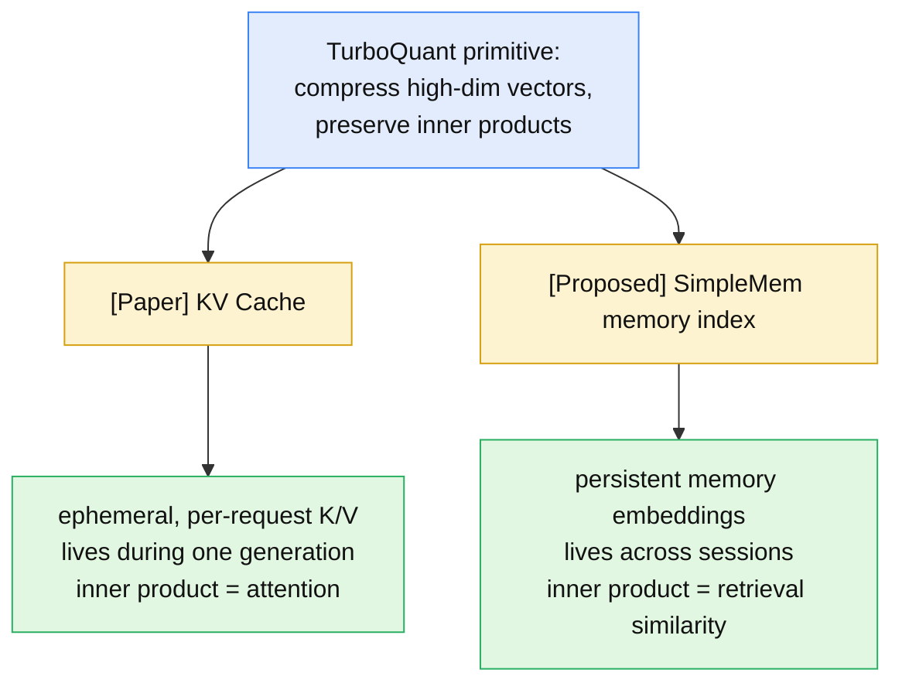

Same math, different lifecycle: KV vectors are ephemeral (one request) and attention-facing; memory embeddings are persistent (a durable index) and retrieval-facing. The KV application is paper-supported; the SimpleMem application is my proposal. **[Paper]/[Proposed]**

---

## 27. Proposed SimpleMem × TurboQuant Architecture

The write path, with TurboQuant inserted only at the dense-embedding step: **[Proposed]**

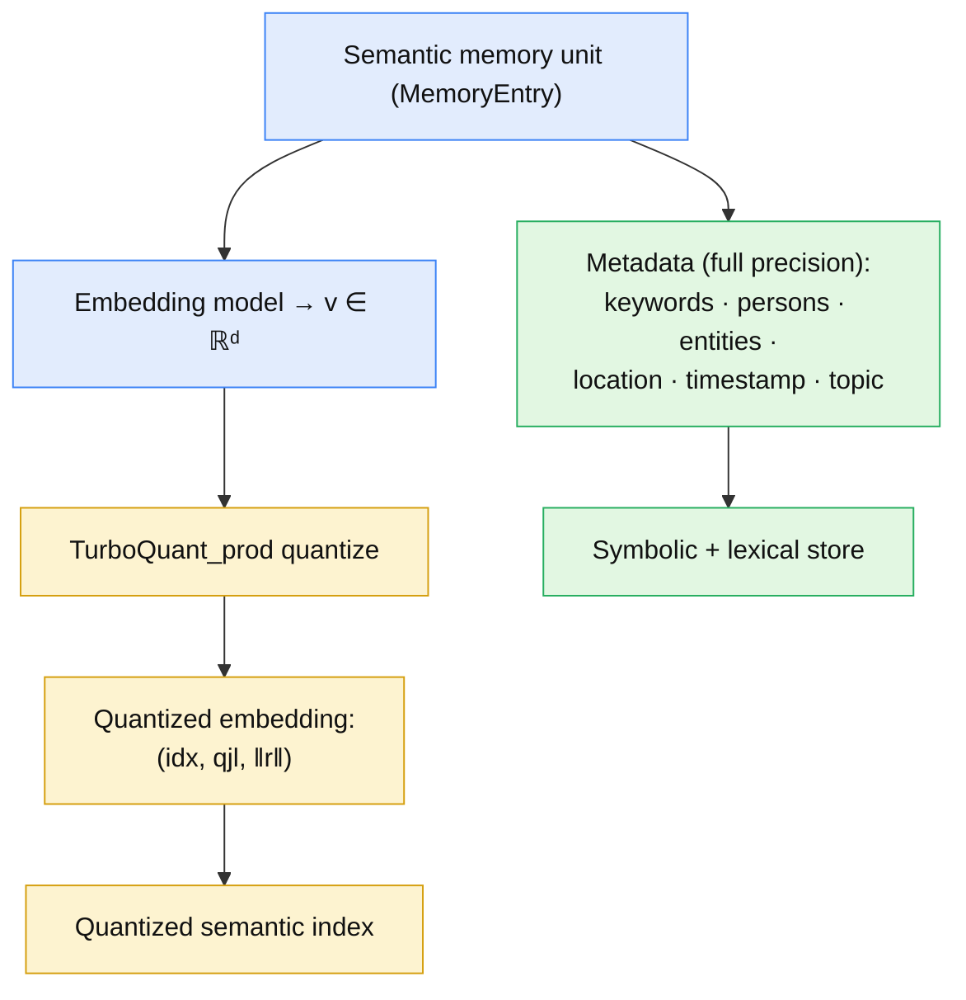

**Proposed `MemoryEntry` extension** — labelled clearly as a proposed schema, not SimpleMem's shipped one: **[Proposed]**

```
MemoryEntry (proposed extension)
├─ lossless_restatement      # FULL precision (text, never quantized)
├─ quantized_embedding
│    ├─ idx        # (b−1)-bit TurboQuant_mse indices, [d]
│    ├─ qjl        # 1-bit QJL sign vector, [d]
│    └─ residual_norm γ   # one FP32 scalar
├─ metadata (FULL precision)
│    ├─ keywords · persons · entities
│    └─ location · timestamp · topic
└─ entry_id                  # FULL precision (UUID)
```

The dense embedding is the **only** thing quantized. Everything the lexical and symbolic views depend on — text, keywords, metadata, IDs — stays in full precision. **[Proposed]/[Interpretation]**

**What you should be able to explain:** _In the proposed design, what is quantized and what stays full precision — and why must the metadata and restatement text remain untouched?_

---

## 28. Proposed Retrieval Pipeline

SimpleMem's hybrid retrieval is unchanged _except_ that the semantic view now searches over quantized vectors. **[SimpleMem]/[Proposed]**

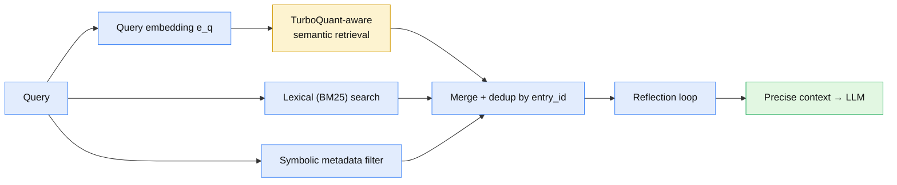

**Critical:** the lexical and symbolic views stay **independent and full-precision**. TurboQuant does not replace SimpleMem's retrieval architecture — it changes _one_ of three views (the dense semantic representation). The reflection loop, merge/dedup, and metadata filtering are untouched. This containment is what makes the integration low-risk: even if quantization hurt semantic recall, lexical + symbolic recall are unaffected. **[Proposed]/[Interpretation]**

**What you should be able to explain:** _Which retrieval views does the proposed integration change, and which are untouched? Why is that containment the safety property of the design?_

---

## 29. Where the Matrix Multiplications Live in the Combined System

The full chain of matrix/vector products, from memory embedding to retrieval score: **[Proposed]/[Interpretation]**

```
WRITE (per memory unit):
   v ∈ ℝᵈ                          embedding
   idx = Quant_mse(Πv)             rotation Πv:[d,d]·[d]  +  scalar quant
   r   = v − Πᵀ ŷ                  residual  [d]
   qjl = sign(S r)                 QJL projection S r:[d,d]·[d] → sign
   store (idx, qjl, ‖r‖)

READ (per query):
   e_q ∈ ℝᵈ                        query embedding (full precision)
   v̂  = Πᵀŷ + (√(π/2)/d)·‖r‖·Sᵀqjl   reconstruct memory vector
   score = e_qᵀ v̂                  the similarity we actually rank on
```

Decompose the score exactly as in §15:

```
   e_qᵀ v̂  =  e_qᵀ v̂_mse   +   e_qᵀ v̂_qjl
              (MSE bulk)        (unbiased residual correction)
   E[ e_qᵀ v̂ ] = e_qᵀ v        ← unbiased estimate of the TRUE similarity
```

This is the mathematical reason `TurboQuant_prod` (not `_mse`) is the right choice for retrieval: the thing SimpleMem ranks on is an **inner product** $e_q^\top v$, and `prod` estimates it _without systematic bias_, whereas `mse` would shrink every similarity by a bias factor — distorting the ranking in a data-dependent way. **[Proposed]/[Interpretation]**

> **Caveat — do not overclaim.** SimpleMem's semantic view (via LanceDB) uses **cosine** similarity, which is inner product _after L2 normalization_. TurboQuant's unbiasedness is proved for inner products of a unit-norm stored vector against an arbitrary query. Whether unbiased inner products translate to well-preserved _cosine rankings_ after both sides are normalized is an empirical question the integration **must benchmark** — it does not follow automatically. **[Interpretation]**

**What you should be able to explain:** _Trace $v$ to the retrieval score through every matmul. Why is `prod` more appropriate than `mse` for ranking, and why is "preserves inner product" not the same as "preserves cosine ranking"?_

---

## 30. Memory / Storage Analysis for SimpleMem

Concrete footprint, SimpleMem's $d=1024$ embedding, per memory unit (dense vector only): **[Proposed]/[Interpretation]**

| Representation         | Bits (dense vector)                           | Bytes         | vs FP32 |
| ---------------------- | --------------------------------------------- | ------------- | ------- |
| FP32 embedding         | $1024\times32$                                | 4096          | 1×      |
| FP16 embedding         | $1024\times16$                                | 2048          | 2×      |
| TurboQuant_mse, $b=4$  | $1024\times4$                                 | 512           | 8×      |
| TurboQuant_prod, $b=4$ | $1024\times3$ (idx) $+ 1024$ (qjl) $+ 32$ (γ) | $\approx 516$ | ~8×     |
| TurboQuant_prod, $b=2$ | $1024\times1$ (idx) $+ 1024$ (qjl) $+ 32$ (γ) | $\approx 260$ | ~16×    |

For `prod` at budget $b$: $(b-1)\cdot d$ index bits $+\, d$ QJL bits $+\, 32$ norm bits. At $b=4$ that's $3072 + 1024 + 32 = 4128$ bits $\approx 516$ B. The shared $\Pi, S$ matrices ($d^2$ floats) are amortized across the _entire_ store, so at scale they vanish per-unit. **A million memories drop from ~4 GB (FP32) to ~0.5 GB (4-bit).** **[Proposed]/[Interpretation]**

**What you should be able to explain:** _Compute the `prod` footprint at $b=4$ for $d=1024$, and explain why the $\Pi$/$S$ matrices don't count as per-unit overhead at scale._

---

## 31. Tradeoffs and a Proposed Benchmark

The system-level frontier: **[Interpretation]**

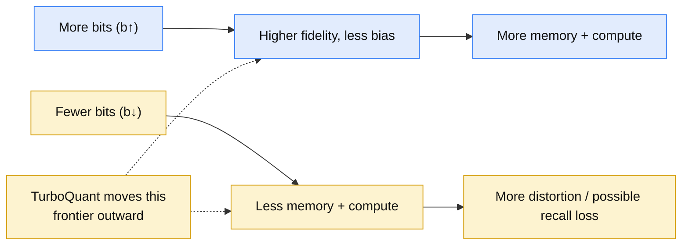

Because vector compression _only_ helps if it doesn't degrade the answers, the integration must be **measured, not assumed**. A proposed evaluation (results TBD — I make no claims here): **[Proposed]**

Compare three arms — **FP32/FP16 baseline** vs **TurboQuant_mse** vs **TurboQuant_prod** — across bit-widths $b\in\{2,3,4\}$, measuring:

1. Memory footprint / index size 2. Recall@K 3. Retrieval precision / F1
2. **LoCoMo** end-to-end F1 (SimpleMem's own benchmark) 5. MRR
3. Retrieval latency 7. Quantization time 8. Dequantization overhead
4. End-to-end agent latency 10. Answer quality 11. Number of retrieved tokens 12. Indexing time

The go/no-go criterion: does the compressed arm hold LoCoMo F1 and Recall@K within a small tolerance of the FP baseline while cutting index memory several-fold? If yes, ship it; if `prod`'s cosine ranking degrades, fall back to more bits or FP16. **[Proposed]/[Interpretation]**

**What you should be able to explain:** _Name the go/no-go metrics for the SimpleMem integration. Why is storage reduction alone insufficient justification?_

---

## 32. Paper vs Code vs SimpleMem vs Proposed — Boundary Table

The single most important discipline of this article, made explicit: **[Interpretation]**

| Claim                                                                                 | Category                        | Status                  |
| ------------------------------------------------------------------------------------- | ------------------------------- | ----------------------- |
| Random rotation + Lloyd-Max scalar quant achieves near-optimal MSE                    | **[Paper]**                     | Theorem 1               |
| QJL gives unbiased 1-bit inner-product estimate                                       | **[Paper]**                     | Lemma 4                 |
| Two-stage `prod` inner-product estimate is unbiased, within ≈2.7× of optimum          | **[Paper]**                     | Theorems 2–3            |
| Identical needle-in-haystack at $4\times$ KV compression; $\ge4.5\times$ on LongBench | **[Paper]**                     | §4.2–4.3                |
| Near-zero indexing time vs PQ/RabitQ                                                  | **[Paper]**                     | Table 2                 |
| `TurboQuantMSE`/`TurboQuantProd` classes, Triton kernels, vLLM monkey-patch           | **[Code]**                      | 0xsero repo (3rd-party) |
| Honest ≈4.6–5× (not 5.1×) compression; hybrid decode saves storage not compute        | **[Code]**                      | repo self-audit         |
| Three-stage pipeline, `MemoryEntry` schema, LanceDB+Tantivy, hybrid retriever         | **[SimpleMem]**                 | aiming-lab repo         |
| Quantize only the dense semantic embedding with `prod`; keep metadata FP              | **[Proposed]**                  | my design               |
| `prod` more appropriate than `mse` for retrieval ranking                              | **[Proposed]/[Interpretation]** | my reasoning            |
| Unbiased inner product ⟹ preserved cosine ranking                                     | **not claimed**                 | must be benchmarked     |

**What you should be able to explain:** _Given any claim in this article, state whether it is paper-proved, code-verified, from SimpleMem, my proposal, or explicitly unproven._

---

## 33. End-to-End Mental Model

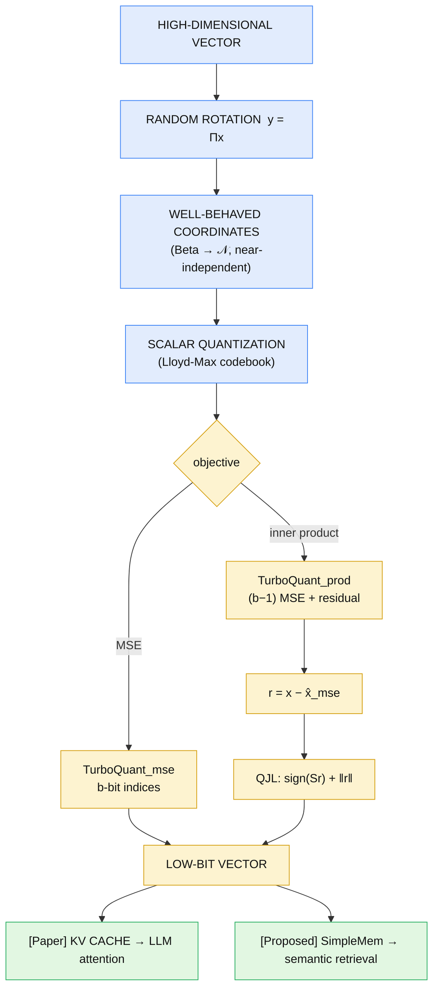

**In one paragraph.** Take a vector $x$. TurboQuant randomly _rotates_ it ($y=\Pi x$), which — because a random point on the sphere has known, near-independent Beta-distributed coordinates — turns one hard $d$-dimensional quantization problem into $d$ easy 1-dimensional ones, each solved by a precomputed Lloyd-Max codebook. That MSE-optimal path reconstructs $x$ well but _biases every inner product_ (the $2/\pi$ factor at 1 bit), so for retrieval and attention TurboQuant spends $b-1$ bits on the MSE stage and the last bit on a **QJL** sign code of the residual, whose unbiased estimator exactly cancels the bias: $\mathbb{E}[\langle y,\hat x\rangle]=\langle y,x\rangle$, within a $\approx2.7\times$ constant of the information-theoretic floor. Because the codebook is data-oblivious, this runs online with near-zero indexing time — which is why it fits a dynamic **KV cache** (paper-proved) and, I argue, could compress the dense embeddings of an agent memory system like **SimpleMem** (my proposal, to be benchmarked, not asserted). **[Paper]/[Proposed]/[Interpretation]**

---

**Related dissections on this site:** this is a companion to my [SimpleMem](/engineering/simplemem-efficient-lifelong-memory-for-llm-agents/) (agent memory), [vLLM & PagedAttention](/engineering/vllm-pagedattention-efficient-memory-management-for-llm-serving/) and [TensorRT-LLM](/engineering/tensorrt-llm-inference-serving-engine-kv-cache-scheduling/) dissections — where those manage the KV _cache_, TurboQuant compresses the _vectors inside it_, and the same primitive reaches back into agent memory. The paper is at [arXiv:2504.19874](https://arxiv.org/abs/2504.19874); the third-party implementation at [github.com/0xsero/turboquant](https://github.com/0xsero/turboquant). **[Interpretation]**
