This is a technical dissection of **vLLM** and its core algorithm **PagedAttention** — Kwon et al.'s serving system that manages the LLM key-value cache the way an operating system manages memory. The focus is the *system*: why the KV cache, and not raw compute, is what actually limits serving throughput; why the conventional habit of storing it in one contiguous chunk per request wastes most of the GPU's memory; how PagedAttention breaks that cache into non-contiguous blocks addressed through a lookup table; and how that single change cascades into cheaper memory sharing, larger batches, and 2-4x higher throughput.

I am not reproducing the full benchmark suite. The throughput and memory numbers matter here only as evidence for one claim: that treating the KV cache as pageable memory is a real win, not a micro-optimization.

The source code is open and is the same engine that most of the open LLM-serving ecosystem now runs on: **[https://github.com/vllm-project/vllm](https://github.com/vllm-project/vllm)**.

**Attribution convention.** Because this article mixes what the paper says with my own reasoning, every non-obvious technical claim is tagged:

- **[Paper]** — stated explicitly in vLLM/PagedAttention (SOSP '23, arXiv:2309.06180).
- **[Derived]** — a mathematical or logical consequence of the paper's equations, worked out here.
- **[Interpretation]** — my explanation or engineering reasoning, written for the reader; not a claim the paper makes.

---

## Reasoning / Why I Studied This Paper

I have been studying **LLM inference systems** — how large models are actually served under throughput and latency pressure — and vLLM is the paper that reframed serving as a **memory-management** problem rather than a compute problem. **[Interpretation]**

My mental model going in was this: a request runs in two stages. **[Interpretation]**

- **Prefill** processes the whole input prompt at once and produces the KV cache for every prompt token.
- **Decoding** then generates output tokens one at a time, and at each step it *reads back the entire KV cache* to attend over all previous positions before appending one new token's worth of cache.

The KV cache is the state that ties those stages together, and it has two awkward properties: it is **large**, and it is **dynamic** — it grows with every generated token, every request has a different length, and requests start and finish at different times. My hypothesis was that naively storing this in contiguous GPU memory must waste a lot of it, and that the waste — not a lack of FLOPs — is what caps how many requests you can serve at once. **[Interpretation]** vLLM confirms exactly that, and PagedAttention is the mechanism it uses to fix it. This article connects that intuition to what the paper actually implements.

## I. Why the KV Cache Is the Central Bottleneck

Serving LLMs is expensive, and the only real lever on cost-per-request is **throughput**: batch more requests together so the cost of streaming the model weights is amortized across all of them. **[Paper]** But you can only batch what fits in memory, and on a modern serving GPU the memory budget is dominated by two things.

*Figure 1 (from the paper). Left — serving a 13B model on a 40 GB A100, the weights take ~65% (26 GB) and stay fixed, activations are a small ephemeral slice, and the **KV cache is the >30% that is allocated and freed per request**. Right — throughput climbs with batch size until memory runs out; because existing systems waste most of the KV-cache region, their batch (orange) saturates early, while vLLM (blue) grows the batch far further and keeps throughput rising.* **[Paper]**

The weights are constant and activations are small, so **the way the KV cache is managed is what determines the maximum batch size, and therefore the throughput.** **[Paper]**

### How a request runs, and where the cache comes from

An LLM factorizes the probability of a sequence autoregressively — each token conditioned on all the ones before it: **[Paper]**

$$
P(x) = P(x_1)\cdot P(x_2 \mid x_1)\cdots P(x_n \mid x_1,\dots,x_{n-1})
$$

Inside each self-attention layer, every position $i$ is projected into a query, key, and value vector: **[Paper]**

$$
q_i = W_q x_i,\qquad k_i = W_k x_i,\qquad v_i = W_v x_i
$$

and the output at position $i$ is the softmax-weighted average of the value vectors of all positions up to $i$: **[Paper]**

$$
a_{ij} = \frac{\exp\!\left(q_i^\top k_j / \sqrt{d}\right)}{\sum_{t=1}^{i}\exp\!\left(q_i^\top k_t / \sqrt{d}\right)},
\qquad
o_i = \sum_{j=1}^{i} a_{ij}\, v_j
$$

The consequence of that lower summation limit is the whole story: to compute position $i$ you need the key and value vectors of **every earlier position**. So the system caches them — that is the **KV cache**. **[Paper]** This splits generation into two phases with completely different hardware behaviour: **[Paper]**

- The **prompt (prefill) phase** takes the entire prompt $(x_1,\dots,x_n)$ at once. All positions are known, so the $q,k,v$ projections and attention run as dense **matrix-matrix** multiplications — highly parallel, compute-efficient, GPU-friendly. It produces the KV cache for all $n$ prompt tokens plus the first output token.
- The **autoregressive generation (decoding) phase** produces the rest one token at a time. At step $t$ only the newest $k_{n+t}, v_{n+t}$ are computed; everything else is read from the cache. Each step is a thin **matrix-vector** multiply that cannot be parallelized across steps because of the data dependency, so it **underutilizes the GPU and is memory-bound** — and it accounts for most of a request's latency. **[Paper]**

That asymmetry is why batching matters so much: the decode phase leaves compute idle, and the only way to fill it is to run many sequences' decode steps together — which, again, is bounded by how much KV cache you can hold. **[Interpretation]**

### The cache is large *and* dynamic

Concretely, for a 13B OPT model the KV cache of a **single token** is: **[Paper]**

$$
\underbrace{2}_{K,\,V}\times\underbrace{5120}_{\text{hidden}}\times\underbrace{40}_{\text{layers}}\times\underbrace{2}_{\text{FP16 bytes}} = 800\text{ KB}
$$

Since OPT generates up to 2048 tokens, one request's KV cache can reach **~1.6 GB**, and with GPU memory in the tens of GB, **only a few dozen requests fit even if all memory went to cache**. **[Paper]** Worse, the trend is against us: from A100 to H100 the FLOPS more than doubled while memory stayed at 80 GB — so memory is becoming *more* of a bottleneck over time, not less. **[Paper]**

And unlike an ordinary tensor, this cache **does not have a known size when the request arrives**. Its length depends on how many tokens the model decides to generate, which nobody knows in advance; it grows one block at a time during decode and is freed when the request emits its end-of-sequence token. **[Paper]** A memory manager for the KV cache therefore has to cope with objects of unknown, changing size that enter and leave continuously — which is precisely what the conventional approach does badly.

## II. Why Conventional Serving Wastes the KV Cache

Because deep-learning frameworks want tensors in contiguous memory, prior serving systems (FasterTransformer, Orca) store each request's KV cache as **one contiguous block sized to the model's maximum possible length** — e.g. 2048 tokens — regardless of the actual prompt or output length. **[Paper]** That single decision produces three distinct kinds of waste.

*Figure 3 (from the paper). Two requests in a max-length contiguous scheme. **Reserved** slots are earmarked for tokens this request will generate later — real, but locked away from other requests for the whole lifetime. **Internal fragmentation** is the 2038 / 507 slots pre-allocated to the max length that this request will never fill. **External fragmentation** is the leftover gap between two differently-sized allocations that no request can use.* **[Paper]**

- **Internal fragmentation** — the request is sized for 2048 tokens but only uses a few hundred; the rest is pure waste, and you only learn how much once the request finishes. **[Paper]**
- **Reservation** — the slots the request *will* eventually use are still tied up for its whole lifetime, so shorter co-resident requests cannot borrow them meanwhile. **[Paper]**
- **External fragmentation** — because each request reserves a different-sized chunk, the buddy allocator leaves unusable gaps between them. **[Paper]**

How bad is it in practice? The paper profiles it directly:

*Figure 2 (from the paper). The green slice is the memory doing **useful work** (actual token states). In the Orca variants only **20.4%-38.2%** of the KV-cache region is useful; the rest evaporates into reservation and fragmentation. vLLM reaches **96.3%**.* **[Paper]**

This is the crux, and it is worth stating in the user's own terms: **you can have plenty of GPU compute and even plenty of GPU memory in theory, and still be unable to admit more requests, because the memory that exists is chopped into unusable fragments.** **[Interpretation]** The batch size is throttled by fragmentation, and throughput follows.

There is a second, separate loss: **no sharing**. Decoding algorithms like parallel sampling and beam search create several sequences from one prompt that could share the prompt's KV cache — but if each sequence lives in its own contiguous region, that shared prefix has to be duplicated. **[Paper]** Compaction (defragmenting) is not a real option either: moving the massive KV cache around during latency-sensitive serving is impractical, and it still would not enable sharing. **[Paper]**

## III. PagedAttention: Store the Cache in Blocks, Not One Contiguous Chunk

The fix is borrowed directly from operating systems. An OS beats fragmentation with **virtual memory and paging**: split memory into fixed-size pages, let a program's contiguous *logical* pages map to scattered *physical* pages, and allocate physical pages on demand instead of reserving them up front. **[Paper]** PagedAttention applies the same idea, with a clean correspondence: **blocks are pages, tokens are bytes, requests are processes.** **[Paper]**

Concretely, PagedAttention partitions each sequence's KV cache into **KV blocks**, each holding the keys and values for a fixed number of tokens $B$ (the *block size*). **[Paper]** Denote the key and value blocks:

$$
K_j = (k_{(j-1)B+1},\dots,k_{jB}),\qquad V_j = (v_{(j-1)B+1},\dots,v_{jB})
$$

Attention is then computed **one block at a time** rather than one token at a time: **[Paper]**

$$
A_{ij} = \frac{\exp\!\left(q_i^\top K_j / \sqrt{d}\right)}{\sum_{t=1}^{\lceil i/B\rceil}\exp\!\left(q_i^\top K_t \mathbf{1} / \sqrt{d}\right)},
\qquad
o_i = \sum_{j=1}^{\lceil i/B\rceil} V_j\, A_{ij}^\top
$$

Reading this in engineering terms: **[Interpretation]**

- $A_{ij} = (a_{i,(j-1)B+1},\dots,a_{i,jB})$ is the row of attention scores of query token $i$ against the $B$ keys in block $j$. **[Paper]**
- The kernel loops over the $\lceil i/B\rceil$ blocks that hold positions $1..i$; for each block it multiplies $q_i$ by that block's keys $K_j$ to get scores, then by that block's values $V_j$ to accumulate the output. The $\mathbf{1}$ in the denominator just sums the block's exponentiated scores for the softmax normalizer. **[Paper]/[Derived]**
- The key property: the kernel **fetches each block separately**, so the blocks do not have to be next to each other in memory. **[Paper]**

*Figure 5 (from the paper). The keys and values for one sequence are spread across three blocks that are **not contiguous in physical memory**. The PagedAttention kernel processes the query against each block in turn — e.g. against "Four score and seven" in block 0 — and this is exactly what lets the memory manager scatter blocks wherever there is free space.* **[Paper]**

Three concepts do all the work here, and keeping them distinct is the whole trick: **[Interpretation]**

- **Logical KV blocks** — the sequence's own left-to-right view of its cache (logical block 0, 1, 2, …), filled as tokens are generated. This is the "virtual" address space.
- **Physical KV blocks** — the actual fixed-size slots of GPU DRAM, carved out once by a *block engine*, that can be handed out in any order.
- **Block table** — the per-request map from logical block → physical block, plus how many slots of each block are filled. This is the page table.

Because every block is the same size, **external fragmentation disappears entirely**; because blocks are small and allocated only when needed, **internal fragmentation is capped at less than one block per sequence** (the partially-filled last block). **[Paper]** That is the 96.3% in Figure 2.

## IV. The vLLM Architecture and Its KV Cache Manager

vLLM is the serving engine built around PagedAttention. Its shape is a **centralized scheduler** driving a set of **distributed GPU workers**, with a **KV cache manager** in between that owns all the block bookkeeping.

*Figure 4 (from the paper). The **KV cache manager** holds the block tables and drives two allocators — a **GPU block allocator** for the live cache and a **CPU block allocator** for swapped-out blocks (see §VIII). Each worker runs a model shard plus a cache engine; the workers only ever see physical block IDs handed to them by the scheduler.* **[Paper]**

The manager's job is exactly the OS analogy: it maintains the logical↔physical block tables, and because logical and physical are separated, it can **grow a request's cache on demand without reserving anything up front** — which is what eliminates the waste from Figure 2. **[Paper]** (One implementation detail worth noting: keys/values across heads and layers get separate blocks and block tables; the paper found no performance difference and picked it for simplicity.) **[Paper]**

## V. How a Request Actually Runs Through vLLM

This is the request-flow walkthrough — the concrete life of one sequence's memory. Figure 6 traces a prompt *"Four score and seven years ago our"* (7 tokens) generating *"fathers" → "brought" → …*

*Figure 6 (from the paper). The **block table** in the middle is the page table: each entry records which physical block a logical block lives in and how many of its slots are filled. Logical blocks fill left-to-right; the last block's spare slots are reserved for the next few tokens.* **[Paper]**

The steps, following the paper: **[Paper]**

1. **Prefill.** The 7-token prompt needs 2 logical blocks (block size 4 here): logical 0 and 1, mapped to physical blocks 7 and 1. vLLM runs a normal prefill, writes the first 4 tokens' cache into logical block 0 and the next 3 into logical block 1, and leaves the last slot for the first generated token. Note it reserved **only what the prompt needs — not the max length**.
2. **First decode step.** The new token ("fathers") fits in the free slot of the last logical block; vLLM writes it there and bumps that block's `#filled` from 3 to 4. No new allocation.
3. **Second decode step.** The last logical block is now full, so vLLM allocates a **new** physical block (block 3), maps logical block 2 to it, records the mapping, and writes the new token's cache there.

Globally, each decoding iteration does the same loop: pick the batch of sequences to run, allocate physical blocks for any newly-needed logical blocks, concatenate all their current tokens (full prompts for prefill requests, single latest tokens for decode requests) into one batched forward pass, and let the PagedAttention kernel read old cache via the block tables and write new cache into the physical blocks. **[Paper]** When a request finishes, **its physical blocks are freed and immediately reusable** by other requests. **[Paper]**

*Figure 7 (from the paper). Two requests coexist in one physical block pool. Neither request's blocks are contiguous, and the two requests' blocks interleave freely — the physical space is packed tight regardless of how the logical sequences are laid out.* **[Paper]**

A subtle design knob lives here: **block size**. A larger block lets the kernel process more positions in parallel (better hardware utilization, lower latency), but it also raises internal fragmentation and lowers the odds of useful sharing. **[Paper]** vLLM's default is **16** — the ablation (§XII) shows it is large enough to keep the GPU busy and small enough to avoid waste. **[Paper]**

## VI. From Block Management to Continuous Batching

It is worth making the causal chain explicit, because "continuous batching" is often described as purely a scheduler feature — and the paper's real point is that **efficient KV-cache memory management is what makes it effective**. **[Interpretation]**

```mermaid
graph LR
    A["Requests arrive and finish<br/>at different times, with<br/>unknown, different lengths"] --> B["KV cache size is<br/>dynamic per sequence"]
    B --> C["Block-based allocation:<br/>grow on demand, waste < 1 block,<br/>no external fragmentation"]
    C --> D["Freed blocks are<br/>instantly reusable"]
    D --> E["More sequences' working<br/>sets fit in memory at once"]
    E --> F["Iteration-level continuous<br/>batching: add/remove requests<br/>every step, no padding"]
    F --> G["Larger effective batch →<br/>GPU stays busy →<br/>2-4x higher throughput"]

    classDef prob fill:#fde2e2,stroke:#e74c3c,color:#111;
    classDef mech fill:#e2ecfd,stroke:#3b82f6,color:#111;
    classDef win fill:#e2f7e2,stroke:#27ae60,color:#111;
    class A,B prob;
    class C,D,E,F mech;
    class G win;
```

Fine-grained **iteration-level scheduling** (from Orca's line of work) already lets a serving system add and remove requests *between* decode iterations instead of waiting for a whole batch to finish, and drop the padding that request-level batching wastes. **[Paper]** But that scheduler can only keep a large batch resident if the memory underneath it is packed efficiently. PagedAttention supplies that: near-zero waste means more sequences fit, which means the continuous-batching scheduler has more to work with, which is where the throughput comes from. The two are complementary — and the paper is explicit that fine-grained scheduling actually makes memory management *harder*, so vLLM's contribution is the more crucial half. **[Paper]**

## VII. Memory Sharing: Parallel Sampling, Beam Search, Shared Prefixes

Once the KV cache is addressed through a block table, **sharing becomes almost free** — two logical blocks (in the same request or different requests) can point at the same physical block. vLLM adds a **reference count** per physical block and a **copy-on-write** rule, exactly like an OS forking a process. **[Paper]**

**Parallel sampling** — one prompt, several sampled continuations the user chooses between.

*Figure 8 (from the paper). Both samples map their prompt's logical blocks to the **same** physical blocks (reference count 2). Only the prompt is stored once. When sample A1 needs to write into the last (shared) block, vLLM sees ref-count > 1, allocates a new physical block, copies the data, and decrements the count — **copy-on-write at block granularity**. A2 then writes into the original block, whose count is now 1. Everything except the final diverging block stays shared.* **[Paper]**

**Beam search** — the sharing is deeper and *dynamic*. Beam candidates share not just the prompt but large stretches of their generation history, and the sharing pattern shifts every step as beams are pruned, like a process tree built by repeated forks. **[Paper]**

*Figure 9 (from the paper). Width-4 beam search. All candidates share block 0 (prompt); groups share deeper blocks and diverge later. When candidates are pruned, the blocks only they referenced (2, 4, 5, 8) drop to ref-count 0 and are freed; new blocks (9-12) are allocated for survivors. Prior systems would **copy** large slices of KV cache between beams at every step — vLLM replaces that with pointer bookkeeping and copies only a single block when a write lands in a shared one.* **[Paper]**

**Shared prefix** — a common system prompt / few-shot preamble is shared across *different requests*. The provider stores the prefix's KV cache in a set of physical blocks once (like an OS sharing a library across processes), and each request maps its logical prefix blocks onto those cached physical blocks, marking the last one copy-on-write; the prompt-phase compute then only has to run over the request's own task input. **[Paper]**

Finally, all of this composes: because the block table hides sharing behind a uniform logical→physical mapping, the model kernels only ever see a list of physical block IDs and never have to reason about sharing patterns — so vLLM can **batch requests using different decoding methods together**, which prior systems could not. **[Paper]**

## VIII. Scheduling and Preemption

vLLM schedules requests **first-come-first-serve**, and when it must preempt, the latest-arrived requests are preempted first — simple, fair, starvation-free. **[Paper]** The hard case is running out of physical blocks mid-generation, since output lengths are unknown. Two questions: which blocks to evict, and how to bring them back. **[Paper]**

Because all blocks of a sequence are always needed together, vLLM uses **all-or-nothing eviction** — evict either all of a sequence's blocks or none. **[Paper]** Sequences that share memory (e.g. beam candidates of one request) are **gang-scheduled** as a group and preempted together. **[Paper]** For recovery there are two mechanisms, and the choice is a genuine trade-off: **[Paper]**

- **Swapping** — copy evicted blocks to CPU RAM (via the CPU block allocator in Figure 4) and bring them back later. The swap space is bounded by the GPU KV-cache size, since you can never swap out more than exists.
- **Recomputation** — just throw the blocks away and recompute the KV cache when the sequence is rescheduled. This is cheaper than it sounds, because the already-generated tokens can be concatenated with the original prompt and recomputed in a **single parallel prompt-phase pass** rather than token-by-token.

Which wins depends on block size and PCIe bandwidth — the paper's ablation (§XII) finds swapping suffers with small blocks (many tiny transfers) while recomputation is flat, and they are comparable for medium blocks. **[Paper]**

## IX. Distributed Execution

For models too big for one GPU, vLLM supports **Megatron-style tensor parallelism** in an SPMD fashion — linear layers are partitioned, attention is split across heads, and workers sync intermediate results with all-reduce. **[Paper]** The elegant part for memory management: since every model shard processes the **same tokens at the same positions**, they all need cache for the same positions. So vLLM keeps a **single KV cache manager and a single logical→physical mapping** shared by all workers. **[Paper]**

Each step, the scheduler broadcasts one control message — the input token IDs plus the block table for each request — to all workers. Workers execute, read cache according to the block table, all-reduce among themselves **without** the scheduler's involvement, and send sampled tokens back. Each worker stores only the cache for its own attention heads, but they all use the same physical block IDs. **[Paper]** Memory management stays centralized; the heavy compute and communication stay distributed.

## X. Implementation

vLLM is an end-to-end system: a FastAPI frontend extending the OpenAI API, and a GPU inference engine of **8.5K lines of Python** (scheduler, block manager) plus **2K lines of C++/CUDA** (custom kernels). **[Paper]** Three kernel-level details make PagedAttention's irregular access pattern fast: **[Paper]**

- **Fused reshape + block write** — splitting new KV into blocks, reshaping to a read-optimized layout, and writing them at block-table positions are fused into one kernel to cut launch overhead.
- **Fused block read + attention** — adapted from FasterTransformer's kernel to read cache by block table on the fly, with a GPU warp per block for coalesced access and support for variable sequence lengths in a batch.
- **Fused block copy** — the copy-on-write copies of scattered blocks are batched into a single kernel launch instead of many small `cudaMemcpyAsync` calls.

Decoding algorithms are all built from three primitives on sequences — **`fork`** (make a new sequence from an existing one), **`append`** (add a token), **`free`** (delete) — which is how parallel sampling, beam search, and prefix sharing are all expressed. **[Paper]**

## XI. Does It Actually Work? The Evaluation

The systems compared: **FasterTransformer** (latency-optimized, given a Triton-style dynamic batcher) and three variants of **Orca** — Oracle (knows true output lengths; an unachievable upper bound), Pow2 (over-reserves up to 2x), and Max (reserves the full 2048). **[Paper]** The metric is **normalized latency** (mean end-to-end latency per output token) versus **request rate**: a good system keeps latency flat as the rate climbs, then knees upward when it saturates. Workloads are synthesized from **ShareGPT** (long, high-variance conversations) and **Alpaca** (short instructions). **[Paper]**

*Figure 12 (from the paper). Across model sizes and both datasets, **vLLM's latency stays low up to a much higher request rate** before knee-ing upward — i.e. it sustains more load at the same latency. On ShareGPT vLLM sustains **1.7x-2.7x** the request rate of Orca (Oracle), **2.7x-8x** of Orca (Max), and up to **22x** of FasterTransformer. The one soft spot is OPT-175B on Alpaca (panel f), where short sequences + huge KV space make the regime compute-bound rather than memory-bound, so vLLM's memory advantage matters less.* **[Paper]**

*Why* it wins is the causal chain from §VI, and Figure 13 shows the middle link directly:

*Figure 13 (from the paper). The mechanism, made visible: vLLM holds **2.2x** more concurrent requests than Orca (Oracle) and **4.3x** more than Orca (Max) on OPT-13B. Better KV-cache utilization → more sequences resident → larger batch → the higher throughput in Figure 12. This is not a faster kernel; it is more work in flight.* **[Paper]**

The sharing mechanisms pay off exactly where the theory predicts — more sharing, more benefit:

*Figure 15 (from the paper). Memory saved by sharing blocks. **Parallel sampling** shares only the prompt → modest **6.1%-9.8%** saving. **Beam search** shares deep, evolving history → **37.6%-55.2%**. (On ShareGPT, with longer prompts, these rise to 16.2%-30.5% and 44.3%-66.3%.) The throughput gain over Orca (Oracle) on OPT-13B correspondingly grows from 1.3x in basic sampling to **2.3x** in width-6 beam search.* **[Paper]**

The shared-prefix and chatbot workloads confirm the same: with a 5-example shared prefix vLLM hits **3.58x** the throughput of Orca (Oracle), and on a ShareGPT-based chatbot workload **2x** — because Orca's buddy allocator reserves 1024 tokens per request while vLLM simply does not. **[Paper]**

## XII. Engineering Trade-offs & Limitations

The paper is honest about the costs, which is the part worth internalizing: **[Paper]**

- **The kernel is 20-26% slower.** PagedAttention's block-table indirection, extra branches, and variable-length handling make the attention *kernel* 20-26% slower than FasterTransformer's. But it only touches the attention operator (not the Linear layers), and the end-to-end throughput win from bigger batches dwarfs it. **[Paper]** This is the core bargain: **give up a little per-op speed to win a lot of memory efficiency.** **[Interpretation]**
- **Block size is a real tuning knob.** Too small starves GPU parallelism; too large brings back internal fragmentation and kills sharing. 16 is the sweet spot for most workloads; on short-sequence Alpaca, large blocks degrade sharply. **[Paper]**
- **Swap vs recompute has no universal winner.** Swapping is bad with small blocks (tiny PCIe transfers); recomputation is flat and never more than 20% costlier than swapping; they tie for medium blocks (16-64). **[Paper]**
- **Paging only helps this *kind* of workload.** The authors are careful: virtual-memory/paging helps because LLM serving has *dynamic, unknown-size* memory demand and is *memory-bound*. For DNN training (static shapes, plan-ahead allocation) or compute-bound non-LLM serving, the indirection overhead would only hurt. vLLM also *augments* the OS idea with LLM-specific tricks — all-or-nothing swap-out, recomputation (impossible for an OS), and kernel fusion to hide indirection. **[Paper]**

## XIII. Where vLLM Sits (Related Work)

General model-serving systems (Clipper, TF-Serving, Clockwork, AlpaServe, and preemption-focused ones like REEF/Shepherd) optimize batching, placement, and scheduling but **ignore the autoregressive, growing-token-state nature of LLMs** — so they miss the KV-cache opportunity entirely. **[Paper]** Transformer-specialized systems add kernel and batching optimizations, and the most relevant is **Orca**. **[Paper]**

The paper frames the Orca relationship precisely, and it is the cleanest way to place vLLM: **[Paper]**

> Orca's **iteration-level scheduling** and vLLM's **PagedAttention** are *complementary*. Orca raises GPU utilization by interleaving more requests in parallel; vLLM raises it by fitting more requests' working sets into memory. Orca attacks the *scheduling* axis, vLLM the *memory* axis — and reducing fragmentation + enabling sharing is what buys the 2-4x over Orca.

Against the memory-optimization lineage (swapping, recomputation, FlexGen, OLLA, FlashAttention), vLLM's novelty is **block-level KV-cache management in the online serving setting** — FlashAttention reduces attention's peak memory but does not manage the cache across requests; FlexGen swaps for offline throughput, not online serving. **[Paper]** This is also the natural companion to weight-side memory methods like [LLM.int8()](/engineering/llm-int8-8-bit-matrix-multiplication-for-transformers-at-scale/): quantization shrinks the *parameter* footprint (the gray 65% in Figure 1), while PagedAttention reclaims the *KV-cache* footprint (the red 30%) — orthogonal halves of the same memory wall. **[Interpretation]** And it sits directly upstream of KVCache-centric platforms like [MOONCAKE](/engineering/mooncake-kvcache-centric-architecture-for-serving-llm-chatbot/), which take the "manage the KV cache as first-class memory" premise and extend it across a whole disaggregated cluster. **[Interpretation]**

## XIV. My Engineering Takeaway

The contribution of vLLM is not "a faster attention kernel" — the kernel is actually *slower*. The real insight is a **reframing of what limits LLM serving**. **[Interpretation]**

- LLM serving is **memory-bound, not compute-bound**: the decode phase leaves the GPU underutilized, the only cure is a big batch, and the batch is capped by KV-cache memory. **[Paper]**
- The KV cache is a genuinely hard object to store — **large, and dynamic in a way ordinary tensors are not**: it grows per token, every request differs, and requests come and go. Storing it as one contiguous max-length chunk per request is what wastes 60-80% of it to fragmentation and reservation. **[Paper]**
- The fix is to stop treating it as a monolithic tensor and treat it as **pageable memory**: fixed-size blocks, a block table for logical→physical mapping, on-demand allocation, and reference-counted copy-on-write sharing — the OS virtual-memory playbook applied to attention. **[Paper]**

Everything else follows from that one move. Near-zero waste (96.3% useful) lets more sequences coexist; more coexisting sequences make continuous batching actually effective; sharing makes parallel sampling and beam search cheap; and the net result is **2-4x throughput at the same latency**. **[Paper]** The lasting lesson, in my own words: when a system is bounded by a resource, the highest-leverage engineering is often not to compute faster but to **stop wasting the resource** — and here that meant importing a fifty-year-old operating-systems idea into the attention kernel. **[Interpretation]**

The engine is open at **[https://github.com/vllm-project/vllm](https://github.com/vllm-project/vllm)**.
