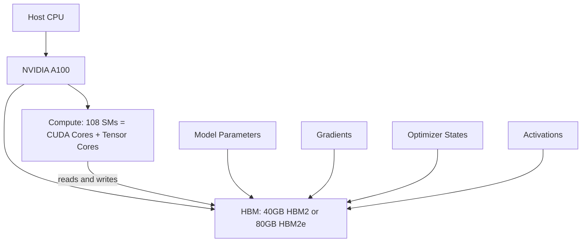
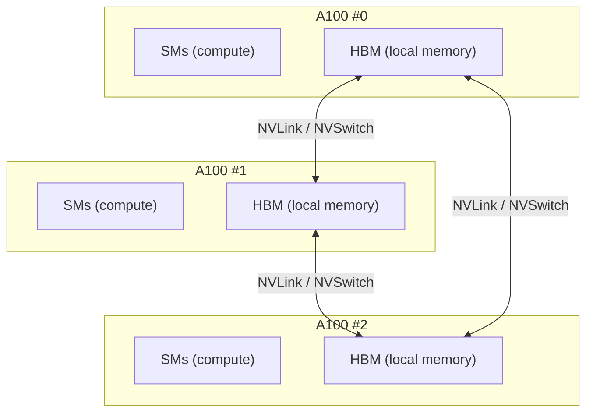
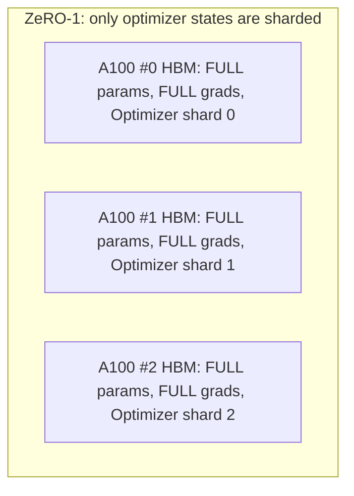
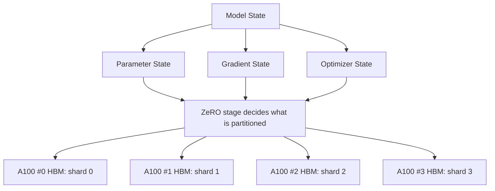
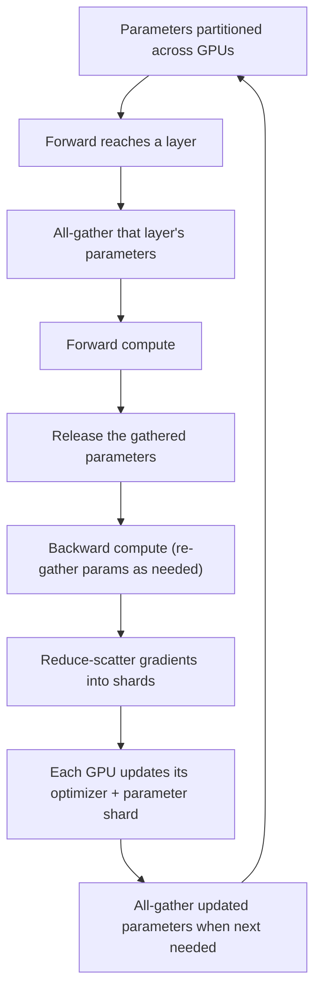

This is an engineering dissection of **ZeRO (Zero Redundancy Optimizer)** — the Microsoft/DeepSpeed memory-optimization technique from _"ZeRO: Memory Optimizations Toward Training Trillion Parameter Models"_ (arXiv:1910.02054). The focus is not a general distributed-training tutorial. The goal is to make the **memory problem physical first** — what actually sits on each GPU — and then show, stage by stage, how ZeRO partitions that state across GPUs instead of replicating it.

The narrative runs: **GPU hardware → GPU memory constraint → data parallelism → replicated training state → ZeRO-1 → ZeRO-2 → ZeRO-3.** By the end you should be able to look at each diagram and answer one question: _what is physically sitting in each GPU's memory, and what changes when ZeRO partitions it?_

**Attribution convention.** Every non-obvious claim is tagged:

- **[Paper]** — stated explicitly in ZeRO (arXiv:1910.02054).
- **[Derived]** — a direct arithmetic consequence of the paper's stated values.
- **[Hardware]** — general NVIDIA GPU facts used as modern context. **The 2019 ZeRO paper predates the A100 — its own experiments ran on V100 (32 GB) / DGX-2 with NVSwitch.** **[Paper]** I use the A100 only as a concrete representative GPU to make the memory picture tangible; the paper's own numbers remain the source of truth.
- **[Interpretation]** — my explanation or engineering reasoning.

---

## The Real Problem: Model State Doesn't Fit

Before any hardware or partitioning, understand _what consumes GPU memory during training_. The paper splits it into two parts: **[Paper]**

1. **Model states** — the optimizer states (momentum and variance in Adam), the gradients, and the parameters. For large models this dominates.
2. **Residual states** — activations, temporary buffers, and unusable fragmented memory.

The model-state cost is precise. Under mixed-precision (fp16/32) training with Adam, per parameter you store: **[Paper]**

$$
\underbrace{2\Psi}_{\text{fp16 params}} + \underbrace{2\Psi}_{\text{fp16 grads}} + \underbrace{K\Psi}_{\text{Adam states}} = 16\Psi \ \text{bytes}, \qquad K = 12
$$

where $\Psi$ is the number of parameters. The $K = 12$ comes from Adam holding, in fp32, a parameter copy ($4\Psi$), momentum ($4\Psi$), and variance ($4\Psi$). **[Paper]** So **every parameter costs about 16 bytes of model state**, not the 2 bytes its fp16 weight suggests.

The paper's own example makes the gap concrete: GPT-2 with **1.5 billion parameters** needs **at least 24 GB** of model-state memory — far above the mere **3 GB** required to hold just its fp16 weights. **[Paper]** The weights are the small part; the optimizer states are the bulk. **[Interpretation]**

That is the problem. Now let's see where it physically lives.

## The Hardware: What an NVIDIA A100 Actually Provides

To reason about "where the memory goes," pin it to a real GPU. The mental model is simple:

```
CPU
  ↓
GPU
  ├── SMs  → computation
  └── HBM  → model/training state storage
```

An NVIDIA A100 has two parts that matter here. **[Hardware]**

- **Compute — the Streaming Multiprocessors (SMs).** The A100 has 108 SMs, each packed with **CUDA cores** (general FP32/FP16 arithmetic) and **third-generation Tensor Cores** (the matrix-multiply units that do the heavy lifting for mixed-precision training). The SMs are where computation happens. **[Hardware]**

- **Memory — HBM.** High-Bandwidth Memory is the large on-package memory the model actually lives in during training. This is the capacity that runs out. Be precise about the variant: **[Hardware]**
  - **A100 40 GB** — 40 GB of **HBM2**, ~1.6 TB/s bandwidth.
  - **A100 80 GB** — 80 GB of **HBM2e**, ~2.0 TB/s bandwidth.

  (These are distinct SKUs; I won't mix their specifications.)

The key relationship: **the SMs compute, but the parameters, gradients, optimizer states, and activations must be stored in HBM** to be operated on. **[Interpretation]** When people say a model "doesn't fit," they mean its model states exceed a GPU's HBM capacity.



A caveat the diagram cannot show: these do not all occupy HBM identically at every instant — activations, for example, come and go across the forward/backward pass. But **model states persist**, and they are the memory ZeRO targets. **[Interpretation]**

## From One A100 to Many

Large-model training uses many GPUs. The critical structural fact for ZeRO: **each GPU has its own local HBM.** There is no shared memory pool — there are _N_ separate memory spaces, coordinated by communication over high-bandwidth interconnects (NVLink / NVSwitch between GPUs in a node). **[Hardware]**



This is the opportunity ZeRO exploits: **many separate HBM pools.** If the training state is redundantly copied into each, most of that aggregate memory is wasted. If it is _partitioned_ across them, the aggregate memory becomes useful. **[Interpretation]** The paper itself notes that going beyond a single node drops interconnect bandwidth sharply — from ~300 GB/s per NVSwitch link to ~12.5 GB/s per Infiniband link — which is exactly why communication volume matters later. **[Paper]**

## Traditional Data Parallelism: Everything, Everywhere, Redundantly

In standard data parallelism, each GPU processes a different slice of the batch but holds a **complete replica** of the model state. Every GPU stores the full parameters, full gradients, and full optimizer states:

```
                        DATA PARALLELISM

        A100 #0                A100 #1                A100 #2
   ┌──────────────┐      ┌──────────────┐      ┌──────────────┐
   │     HBM      │      │     HBM      │      │     HBM      │
   │              │      │              │      │              │
   │ Params  FULL │      │ Params  FULL │      │ Params  FULL │
   │ Grads   FULL │      │ Grads   FULL │      │ Grads   FULL │
   │ Optim.  FULL │      │ Optim.  FULL │      │ Optim.  FULL │
   │              │      │              │      │              │
   └──────────────┘      └──────────────┘      └──────────────┘
        16Ψ                   16Ψ                   16Ψ
     (identical)           (identical)           (identical)
```

The problem is not that the GPUs cannot _compute_ the model. It is that each GPU's finite HBM is spent storing a **redundant copy** of the same $16\Psi$ bytes of state. **[Interpretation]** With $N_d$ GPUs, the system pays for $N_d$ complete copies of the training state while only ever needing one. That redundancy is what ZeRO removes. **[Paper]**

## ZeRO's Core Idea: Partition, Don't Replicate

ZeRO = **Zero Redundancy Optimizer**. The central move is to **partition the training state across the data-parallel GPUs** rather than replicate it. **[Paper]**

```
Traditional DP                    ZeRO
GPU 0 → FULL state                GPU 0 → shard 0
GPU 1 → FULL state                GPU 1 → shard 1
GPU 2 → FULL state                GPU 2 → shard 2
GPU 3 → FULL state                GPU 3 → shard 3
```

Crucially, ZeRO stays **data parallel** — each GPU still handles its own data slice with the same compute pattern. It just stops keeping redundant copies of state. **[Paper]** Which states get partitioned defines the three cumulative stages: **[Paper]**

| Stage | Also called | Partitions |
|---|---|---|
| **ZeRO-1** | $P_{os}$ | Optimizer states |
| **ZeRO-2** | $P_{os+g}$ | Optimizer states + gradients |
| **ZeRO-3** | $P_{os+g+p}$ | Optimizer states + gradients + parameters |

## ZeRO-1: Partition the Optimizer States

**ZeRO-1 ($P_{os}$)** partitions only the optimizer states. Parameters and gradients stay fully replicated; each GPU owns just $1/N_d$ of the optimizer states. **[Paper]**

```
                          ZeRO-1  (P_os)

        A100 #0                A100 #1                A100 #2
   ┌──────────────┐      ┌──────────────┐      ┌──────────────┐
   │     HBM      │      │     HBM      │      │     HBM      │
   │ Params  FULL │      │ Params  FULL │      │ Params  FULL │
   │ Grads   FULL │      │ Grads   FULL │      │ Grads   FULL │
   │ Optim. shard0│      │ Optim. shard1│      │ Optim. shard2│
   └──────────────┘      └──────────────┘      └──────────────┘
```



**Why this saves so much.** Recall the split $16\Psi = \underbrace{4\Psi}_{\text{params + grads}} + \underbrace{12\Psi}_{\text{optimizer}}$. ZeRO-1 shards the $12\Psi$ piece — which is the _largest_ piece. Per-device memory becomes: **[Paper]**

$$
4\Psi + \frac{12\Psi}{N_d} \;\xrightarrow{\;N_d \text{ large}\;}\; 4\Psi
$$

For the paper's 7.5B example with $N_d = 64$: memory drops from **120 GB to 31.4 GB** — a **4× reduction** — while incurring **the same communication volume as standard DP**. **[Paper]** A 4× win at zero extra communication is why $P_{os}$ is the cheapest, safest stage. **[Interpretation]**

## ZeRO-2: Also Partition the Gradients

**ZeRO-2 ($P_{os+g}$)** keeps ZeRO-1 and additionally partitions the gradients. Now only the parameters stay fully replicated. **[Paper]**

```
                          ZeRO-2  (P_os+g)

        A100 #0                A100 #1                A100 #2
   ┌──────────────┐      ┌──────────────┐      ┌──────────────┐
   │     HBM      │      │     HBM      │      │     HBM      │
   │ Params  FULL │      │ Params  FULL │      │ Params  FULL │
   │ Grads  shard0│      │ Grads  shard1│      │ Grads  shard2│
   │ Optim. shard0│      │ Optim. shard1│      │ Optim. shard2│
   └──────────────┘      └──────────────┘      └──────────────┘
```

The progression from ZeRO-1 is exactly one row: **optimizer → sharded** becomes **optimizer + gradients → sharded**. **[Interpretation]** Per-device memory: **[Paper]**

$$
2\Psi + \frac{14\Psi}{N_d} \;\xrightarrow{\;N_d \text{ large}\;}\; 2\Psi
$$

For 7.5B at $N_d = 64$: **16.6 GB**, an **8× reduction** vs the 120 GB baseline. **[Paper]** And — this is the important part — ZeRO-2 **still incurs the same communication volume as baseline DP**. **[Paper]** The gradient reduction is done as a reduce-scatter (each GPU reduces only its shard) instead of a full all-reduce, so no extra bytes move. **[Interpretation]**

## ZeRO-3: Partition the Parameters Too

**ZeRO-3 ($P_{os+g+p}$)** is the most aggressive stage: it partitions parameters as well. Now **every** part of the model state — parameters, gradients, optimizer states — is sharded. **[Paper]**

```
                          ZeRO-3  (P_os+g+p)

        A100 #0                A100 #1                A100 #2
   ┌──────────────┐      ┌──────────────┐      ┌──────────────┐
   │     HBM      │      │     HBM      │      │     HBM      │
   │ Params shard0│      │ Params shard1│      │ Params shard2│
   │ Grads  shard0│      │ Grads  shard1│      │ Grads  shard2│
   │ Optim. shard0│      │ Optim. shard1│      │ Optim. shard2│
   └──────────────┘      └──────────────┘      └──────────────┘
```

This is the key conceptual moment: **the complete model exists collectively across the GPUs, not as a full replica on any single one.** **[Paper]**

But be careful about what that means for computation. A GPU does **not** simply compute forever using only its permanently-local parameter shard. The paper's insight is that **not all parameters are needed all the time**: **[Paper]** each data-parallel process stores only the parameters it owns, and when a layer's parameters are needed for the forward or backward pass, they are **gathered (all-gather) on demand**, used, and then released. **[Paper]** ZeRO-3 manages this distributed parameter state _during_ execution.

That on-demand movement is not free. ZeRO-3's total communication volume rises to $3\Psi$ — a **1.5× increase** over baseline DP's $2\Psi$ — because parameters must be communicated in addition to gradients. **[Paper]** In exchange, per-device model-state memory becomes: **[Paper]**

$$
\frac{16\Psi}{N_d}
$$

which shrinks **linearly with the number of GPUs**. For 7.5B at $N_d = 64$: **1.9 GB per device** vs 120 GB — a **64× reduction**. **[Paper]**

## The Full Progression, in One View

The single strongest way to see ZeRO is the FULL-vs-SHARD grid across the three states:

| | Parameters | Gradients | Optimizer states | Per-device memory | Comms |
|---|---|---|---|---|---|
| **Baseline DP** | FULL | FULL | FULL | $16\Psi$ | $2\Psi$ |
| **ZeRO-1** ($P_{os}$) | FULL | FULL | **SHARD** | $4\Psi + \tfrac{12\Psi}{N_d}$ | $2\Psi$ |
| **ZeRO-2** ($P_{os+g}$) | FULL | **SHARD** | **SHARD** | $2\Psi + \tfrac{14\Psi}{N_d}$ | $2\Psi$ |
| **ZeRO-3** ($P_{os+g+p}$) | **SHARD** | **SHARD** | **SHARD** | $\tfrac{16\Psi}{N_d}$ | $3\Psi$ |

Reading it in physical terms:

- **FULL** = each A100 stores the complete state → redundant across GPUs.
- **SHARD** = the state is partitioned across the data-parallel GPUs → each holds $1/N_d$.

And the paper's concrete 7.5B / $N_d = 64$ numbers make the columns real: **[Paper]**

```
                Per-device model state      Reduction    Communication
Baseline DP        120 GB                     1x            2Ψ  (baseline)
ZeRO-1              31.4 GB                    4x            2Ψ  (same)
ZeRO-2              16.6 GB                    8x            2Ψ  (same)
ZeRO-3              1.9 GB                    64x            3Ψ  (1.5x)
```

The story in one line: **the first two stages buy large memory savings for free; the third buys near-unlimited memory savings for a 1.5× communication cost.** **[Interpretation]**

## How ZeRO Distributes Model State Across A100s

The distribution, as an engineering flow — model state is decomposed into its three components, the chosen ZeRO stage decides which are partitioned, and the shards land in each A100's HBM:



Under **ZeRO-1** only the optimizer-state arrow partitions; under **ZeRO-2** the gradient arrow joins; under **ZeRO-3** all three partition, so each A100's HBM holds `parameter shard i + gradient shard i + optimizer shard i`. **[Paper]** The physical memory stays distributed across separate HBMs — ZeRO changes _what_ each HBM holds, from a full replica to a shard. **[Interpretation]**

## Forward/Backward Under ZeRO-3

Because ZeRO-3 shards the parameters themselves, a training step must gather them as computation reaches each part of the model, then release them — which is precisely why it communicates more than a full replica would:



The loop shows the trade being made: a full-replica DP setup never needs to gather parameters (it already has them all), whereas ZeRO-3 gathers-uses-frees them, paying communication to avoid storing them. **[Interpretation]** The paper describes exactly this — parameters the process does not own are gathered when required and the process performs a reduce-scatter on gradients and an all-gather to obtain updated parameters. **[Paper]**

## The Memory–Communication Trade-off

Here is the engineering insight, stated plainly:

```
More partitioning  →  less memory redundancy  →  more communication / coordination
```

ZeRO is **not** conjuring extra memory. It converts **memory redundancy** into **distributed state + communication**. **[Interpretation]** The paper quantifies the two ends of this trade: **[Paper]**

- ZeRO-1 and ZeRO-2 partition state while keeping communication volume **identical to baseline DP** ($2\Psi$) — the free lunch, made possible because gradient reduction can be reorganized as reduce-scatter without moving extra bytes.
- ZeRO-3 partitions parameters too, raising communication to $3\Psi$ (**1.5×**) — the only stage that pays for its memory savings in bandwidth.

The reason the free stages work at all is the same insight ZeRO-3 leans on harder: **not all states of gradients and parameters are needed all the time**, so they can be partitioned and communicated on demand rather than stored everywhere. **[Paper]** What ZeRO does _not_ do is remove all memory pressure or eliminate communication — it rebalances one against the other. **[Interpretation]**

## ZeRO Is Not Model Parallelism

A precise boundary, because it is easy to conflate. ZeRO-DP is **data parallelism with a partitioned training state.** Every GPU still runs the same computation over its own data slice, keeping data parallelism's high compute granularity. **[Paper]**

It is **not** tensor parallelism (splitting individual matrix multiplies across GPUs) and **not** pipeline parallelism (splitting layers into pipeline stages). Those split the _computation_; ZeRO-DP splits the _stored state_ of a data-parallel program. **[Interpretation]** The paper does combine ZeRO with model parallelism for its largest configurations, but ZeRO-DP itself is a data-parallel technique. **[Paper]**

(For completeness: the paper also defines **ZeRO-R** for the _residual_ states — activation partitioning, right-sized temporary buffers, and defragmentation. That is a separate axis from the three ZeRO-DP stages above and is not the focus here.) **[Paper]**

## The Engineering Takeaway

The whole method compresses to one progression:

```
Traditional Data Parallelism   →  every GPU stores  Params + Grads + Optimizer   (16Ψ each)
ZeRO-1  (P_os)                 →  Optimizer states                → partitioned
ZeRO-2  (P_os+g)               →  Optimizer states + Gradients     → partitioned
ZeRO-3  (P_os+g+p)             →  Optimizer states + Gradients + Parameters → partitioned
```

An illustrative way to feel it (using the paper's own 7.5B numbers, on a single representative A100 80 GB — no mixing of variants): a training state of ~120 GB **cannot** fit on one A100, and under baseline DP _every_ GPU would still need all 120 GB. Under ZeRO-3 across 64 GPUs, each device holds ~1.9 GB of model state **[Paper]** — which fits with room to spare. The model didn't shrink; its state got distributed. **[Interpretation]**

The conceptual takeaway, phrased carefully: **ZeRO turns the GPUs' separate HBM memories into a collectively useful pool for model training by eliminating redundant copies of training state.** But the GPUs do **not** literally become one shared HBM — they remain separate memory spaces coordinated through communication. **[Interpretation]** That distinction _is_ the technique: the memory is still physically distributed, but the training state is distributed across those HBMs rather than redundantly replicated on every one — bought, when parameters are also sharded, with a modest and precisely-bounded increase in communication. **[Paper]**
