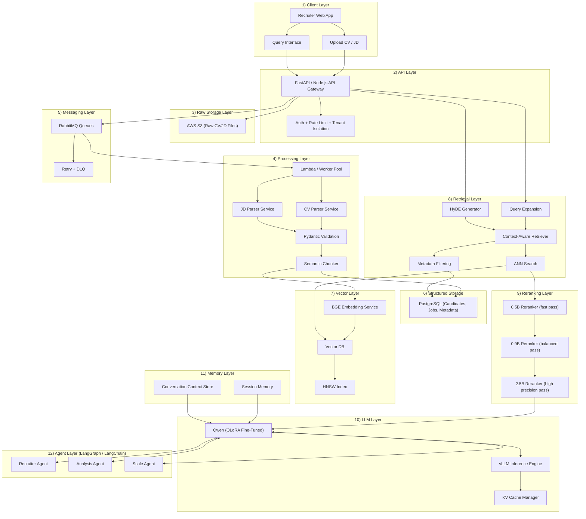
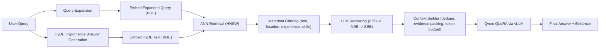
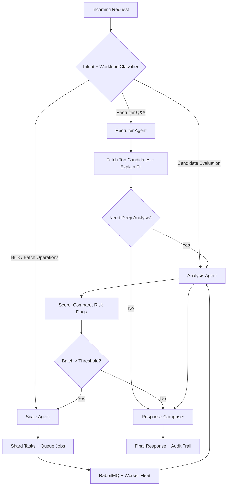
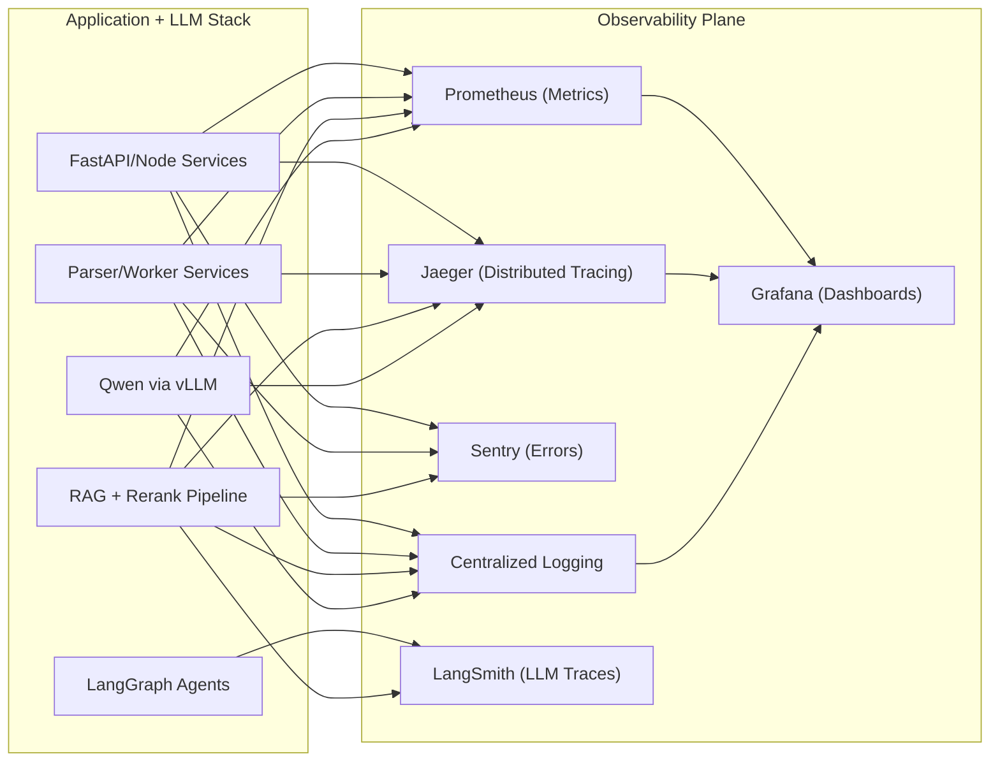

Building CV-job matching in production is not a single-model problem. It is a distributed systems problem with strict data contracts, asynchronous processing, retrieval quality constraints, and latency budgets that must hold under concurrent load.

This deep dive covers the architecture we deployed to support high-volume recruiter workflows with reliable, explainable candidate matching.

---

# System Architecture



The key reason for a dedicated reranking layer is that ANN retrieval optimizes vector proximity, not answer utility. In CV-job matching, top ANN hits often include near-duplicate or high-overlap chunks that are weak for decision support. Rerankers shift the objective from "semantic similarity" to "task relevance," improving precision at top-k and reducing hallucination pressure on the generator.

---

# Parsing and Structured Extraction

Both CV and JD parsing services run as independent workers and emit normalized records:

- candidate profile: identity, roles, seniority, total experience
- skill graph: technology, proficiency hint, recency
- employment timeline: company, title, start/end, duration
- education and certifications
- project evidence: impact statements, domains, tools

Each parser outputs strict JSON validated with Pydantic contracts before persistence. Invalid or incomplete payloads are rejected into DLQ with parse diagnostics. This made downstream retrieval deterministic and removed silent schema drift across model upgrades.

---

# Detailed RAG Pipeline



---

# Embeddings, Chunking, and Vector Search

We benchmarked multiple embedding families (e5, GTE, instructor variants, BGE). BGE performed best for this domain due to:

- stronger separation between adjacent but distinct hiring concepts (for example "hands-on Kubernetes ops" vs "basic exposure")
- better robustness on mixed CV language quality and bullet-list formatting
- stable cosine ranking under aggressive semantic chunking

Semantic chunking was mandatory. Fixed-size chunking split employment evidence from associated tech stacks, which reduced retrieval fidelity. We used structure-aware chunking keyed by section boundaries and timeline entities.

Vector retrieval used ANN over HNSW for low-latency top-k recall. HNSW parameters were tuned per tenant corpus size. For large hiring batches, recall saturation and latency were balanced using adaptive efSearch under p95 SLO targets.

---

# Advanced Retrieval Techniques

The retrieval stack combined four techniques:

- query expansion: rewrites recruiter language into skill, seniority, and domain facets
- HyDE: generates hypothetical "ideal candidate evidence" text to improve recall when recruiter query is underspecified
- metadata filtering: hard constraints on years, geography, mandatory skills, and notice period
- context-aware retrieval: session memory conditions retrieval with prior query intent

This combination reduced false positives in multi-role queries and improved consistency for follow-up questions.

---

# Why Multi-Stage Reranking Was Necessary

Single-pass retrieval was not enough for production quality. We introduced staged reranking:

- 0.5B model: cheap broad reorder on 100-200 candidates
- 0.9B model: sharper relevance pass on top 40-60
- 2.5B model: precision pass on top 10-20 with richer reasoning

Benefits:

- reduced irrelevant high-similarity chunks
- improved explanation quality because selected context had stronger causal evidence
- lowered final generation tokens by pruning noise early

Cost control:

- stages execute conditionally based on query difficulty and confidence thresholds
- easy questions stop at smaller models

---

# Fine-Tuning Strategy (QLoRA)

We fine-tuned Qwen with QLoRA because we needed domain adaptation without full-parameter training cost.

Why QLoRA:

- memory-efficient adapters allowed rapid iteration on ranking/explanation behavior
- enabled frequent refreshes as hiring ontology evolved
- practical to run multiple specialized heads (fit explanation, gap analysis, shortlist rationale)

Training data focused on:

- recruiter Q&A pairs
- structured candidate-job fit annotations
- contrastive examples (good fit vs superficially similar but weak fit)

---

# vLLM Inference, KV Cache, and Multi-User Memory Pressure

vLLM gave strong throughput via paged attention and continuous batching, but KV cache management became a first-order production concern.

Where KV issues appeared:

- long recruiter sessions with repeated follow-ups expanded active context windows
- parallel tenant traffic increased concurrent prefill and decode allocations
- large context packing from retrieval amplified per-request KV footprint

Mitigations we deployed:

- strict context compaction before generation (evidence dedupe + token caps)
- session TTL with memory summarization to prevent unbounded context growth
- per-tenant and per-user concurrency caps on long-context requests
- mixed precision and model-specific max token constraints
- fallback routing: heavy queries to larger GPU pool, short queries to latency pool

Operationally, KV exhaustion showed up as latency spikes before OOM, so we alert on KV utilization slope, not just absolute GPU memory.

---

# LangGraph Multi-Agent Orchestration



The agent split reduced coupling:

- Recruiter Agent optimized responsiveness and conversational clarity
- Analysis Agent optimized scoring depth and evidence grounding
- Scale Agent optimized throughput and queue economics for bulk evaluations

---

# Real Query Examples

Below are representative production-style interactions with retrieved evidence snippets and final outputs.

## 1) "Which candidate is the best match for this job?"

Retrieved context:

```text
JD: Senior Backend Engineer, Python, FastAPI, AWS, PostgreSQL, Kafka, 5+ years.
Candidate A: 6.8 years backend; Python/FastAPI in current role; AWS ECS + RDS; event pipelines with RabbitMQ.
Candidate B: 8.1 years Java/Spring; limited Python exposure.
Candidate C: 5.4 years Python; strong ML stack but limited distributed systems ownership.
```

Final answer:

```text
Best match: Candidate A.
Reason: Highest overlap on required stack (Python, FastAPI, AWS, PostgreSQL) with direct production ownership of API and async systems.
Risk note: Kafka is missing, but prior RabbitMQ eventing experience indicates transferable messaging expertise.
```

## 2) "Why is this candidate a good fit?"

Retrieved context:

```text
Candidate: Led migration from monolith to microservices, reduced API p95 from 620ms to 190ms.
Owned CI/CD and observability rollout (Prometheus + Grafana + Jaeger).
JD priority: performance tuning, service reliability, measurable impact.
```

Final answer:

```text
This candidate aligns with the role because their experience maps to your core success metrics:
1) proven latency optimization,
2) ownership of reliability tooling,
3) measurable backend performance outcomes in production.
```

## 3) "What relevant skills does the candidate have?"

Retrieved context:

```text
Skills extracted: Python, FastAPI, PostgreSQL, Redis, Docker, Kubernetes, AWS, RabbitMQ, Prometheus.
Recent usage (last 2 years): Python, FastAPI, AWS, Kubernetes, Prometheus.
```

Final answer:

```text
Relevant skills for this JD: Python, FastAPI, PostgreSQL, AWS, and production observability.
Secondary strengths: Kubernetes and RabbitMQ, useful for scaling and async workloads.
```

## 4) "How many years of experience does the candidate have?"

Retrieved context:

```text
Employment timeline:
2018-07 to 2021-12: Backend Engineer
2022-01 to 2024-06: Senior Backend Engineer
2024-07 to Present: Staff Engineer
Normalized total: 7.7 years
```

Final answer:

```text
The candidate has approximately 7.7 years of relevant backend engineering experience.
```

## 5) "Has the candidate worked with Kubernetes?"

Retrieved context:

```text
Project evidence:
- "Designed Helm charts and managed blue/green deployments on EKS."
- "On-call for Kubernetes cluster incidents; tuned autoscaling thresholds."
```

Final answer:

```text
Yes. The candidate has direct production Kubernetes experience, including EKS deployments and operational incident response.
```

---

# Observability and Monitoring Architecture



Core signals we track:

- ingestion throughput, queue lag, DLQ rate
- parse validation failure rate by schema version
- retrieval recall proxy and reranker agreement scores
- LLM latency split: prefill, decode, total
- GPU memory and KV cache utilization trends
- agent transition counts and failure edges in LangGraph

LangSmith traces are especially useful for diagnosing retrieval-to-generation mismatch and tool-call regressions in agent workflows.

---

# Performance and Latency Engineering

Primary latency contributors:

- embedding: cold starts and batch underutilization
- retrieval: ANN depth + metadata filters on large candidate pools
- reranking: cross-encoder/token-heavy inference
- LLM inference: prefill cost from long contexts and decode variance

What improved p95:

- asynchronous ingestion and pre-computation of document embeddings
- adaptive top-k and efSearch based on query complexity
- cascaded reranking to minimize expensive passes
- strict context budgeter before generation
- vLLM continuous batching with tenant-aware request queues

---

# Tradeoffs, Failures, and Lessons

Tradeoffs:

- aggressive chunk granularity improves recall but increases index size and retrieval noise
- stronger rerankers improve quality but add tail latency
- richer conversational memory improves continuity but inflates KV footprint

What broke in production:

- schema drift between parser versions and downstream matcher assumptions
- queue spikes causing delayed freshness for newly uploaded CVs
- memory pressure from long recruiter sessions under concurrent traffic

Lessons learned:

- enforce typed contracts at every boundary (Pydantic + versioned schemas)
- treat retrieval quality as an observable system metric, not an offline-only benchmark
- design for graceful degradation: smaller rerank model fallback, reduced context mode, and queue backpressure controls

---

# Tech Stack

<style>
.tech-grid {
  display: grid;
  grid-template-columns: repeat(auto-fit, minmax(140px, 1fr));
  gap: 12px;
  margin-top: 12px;
}
.tech-card {
  border: 1px solid #d9dee5;
  border-radius: 10px;
  padding: 12px;
  text-align: center;
  background: #ffffff;
}
.tech-card img {
  width: 30px;
  height: 30px;
  margin-bottom: 8px;
}
.tech-card div {
  font-size: 0.95rem;
  line-height: 1.2;
}
</style>

<div class="tech-grid">
  <div class="tech-card"><div>Python</div></div>
  <div class="tech-card"><div>FastAPI</div></div>
  <div class="tech-card"><div>Node.js</div></div>
  <div class="tech-card"><div>PostgreSQL</div></div>
  <div class="tech-card"><div>RabbitMQ</div></div>
  <div class="tech-card"><div>AWS S3</div></div>
  <div class="tech-card"><div>BGE Embeddings</div></div>
  <div class="tech-card"><div>Qwen</div></div>
  <div class="tech-card"><div>PyTorch</div></div>
  <div class="tech-card"><div>LangChain</div></div>
  <div class="tech-card"><div>LangGraph</div></div>
  <div class="tech-card"><div>Pydantic</div></div>
  <div class="tech-card"><div>vLLM</div></div>
  <div class="tech-card"><div>Prometheus</div></div>
  <div class="tech-card"><div>Grafana</div></div>
  <div class="tech-card"><div>Jaeger</div></div>
  <div class="tech-card"><div>Sentry</div></div>
</div>

---

Production RAG quality for hiring depends on architecture discipline more than model novelty. Typed parsing, retrieval controls, reranking strategy, and inference memory management were the levers that made this system stable under real recruiter traffic.
