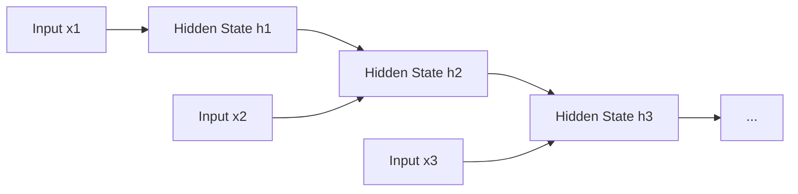
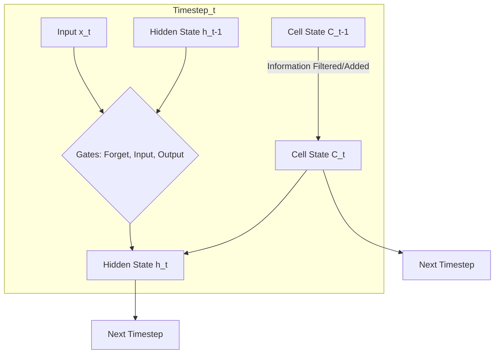
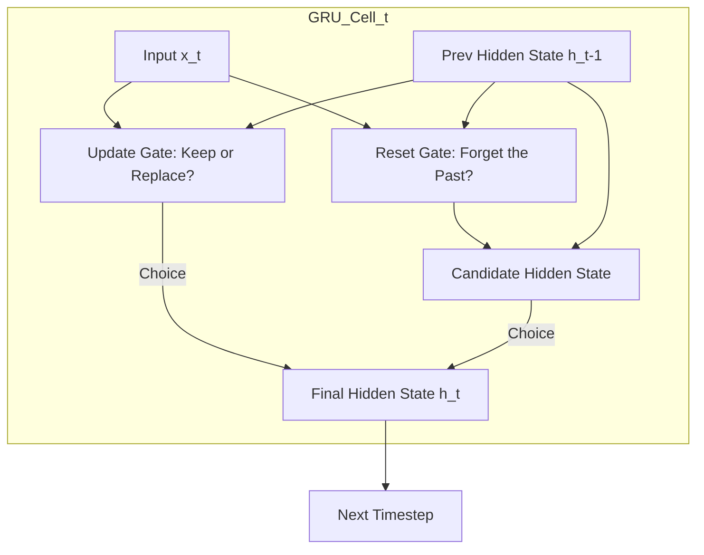
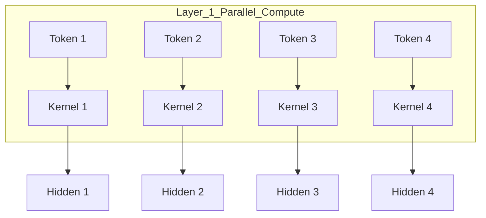
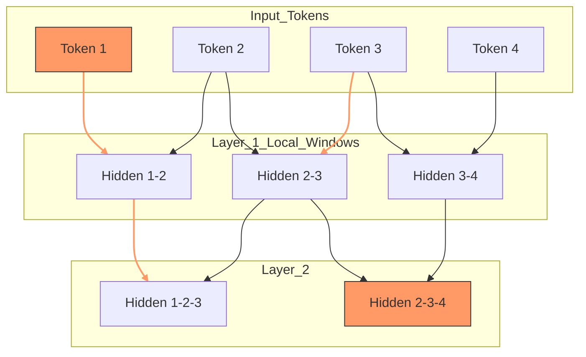
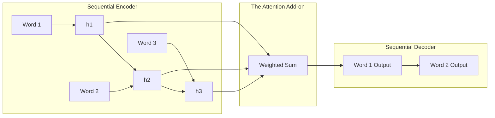
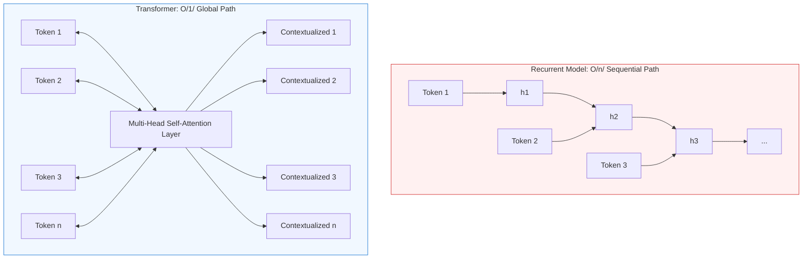
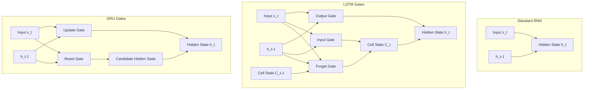

In 2017, the paper "Attention Is All You Need" reported 28.4 BLEU on WMT 2014 English-to-German translation — more than 2 points above the previous best result, including ensembles.

To understand why that number matters: a single design decision like collapsing to one attention head costs roughly 1 BLEU point. A 2-point gain is not incremental. It signals a fundamental shift in how the problem was framed.

This post traces what was broken before the Transformer and exactly how it fixed it.

---

## The Baseline: What Came Before

Before Transformers, sequence modeling ran on two dominant paradigms: recurrent models (RNNs, LSTMs, GRUs) and convolutional models (ByteNet, ConvS2S).

Each solved part of the problem. None solved all three.

The three problems that accumulated across years of research were:

1. **Parallelization** — can the model train efficiently on modern hardware?
2. **Long-range dependencies** — can distant tokens directly influence each other?
3. **Model size** — does solving the above require an impractically deep model?

---

## Problem 1: Sequential Computation

### Standard RNNs

A recurrent model computes hidden states step by step:

```
h_t = σ(W_h h_{t-1} + W_x x_t + b)
```

To compute `h_10`, you must first compute `h_1` through `h_9`. Every example in a batch is serialized. This creates an O(n) sequential bottleneck — the longer the sequence, the longer training takes, regardless of hardware.



RNNs are a word-by-word reader: expressive but inherently sequential.

---

## Problem 2: Long-Range Dependencies

### LSTMs: Gated Memory

LSTMs introduced a persistent cell state (C_t) to carry information across long distances. Three gates control what gets stored, forgotten, or output:

```
f_t = σ(W_f [h_{t-1}, x_t] + b_f)       # Forget gate
i_t = σ(W_i [h_{t-1}, x_t] + b_i)       # Input gate
C̃_t = tanh(W_C [h_{t-1}, x_t] + b_C)   # Candidate cell state
C_t = f_t ⊙ C_{t-1} + i_t ⊙ C̃_t       # Cell state update
o_t = σ(W_o [h_{t-1}, x_t] + b_o)       # Output gate
h_t = o_t ⊙ tanh(C_t)                   # Hidden state
```

The cell state acts as a conveyor belt — information can persist with minimal modification across many timesteps. This partially addressed vanishing gradients and long-range context.



**Critical limitation:** LSTMs reduced the problem but did not eliminate it. The signal from position 1 must still traverse n−1 recurrent links to reach position n. Path length remains O(n).

### GRUs: Streamlined Gating

GRUs merged the cell and hidden state, reducing to two gates instead of three:

```
z_t = σ(W_z [h_{t-1}, x_t] + b_z)        # Update gate
r_t = σ(W_r [h_{t-1}, x_t] + b_r)        # Reset gate
h̃_t = tanh(W [r_t ⊙ h_{t-1}, x_t] + b)  # Candidate hidden state
h_t = (1 - z_t) ⊙ h_{t-1} + z_t ⊙ h̃_t  # Final hidden state
```



More parameter-efficient than LSTMs. Still sequential. Still O(n) path length for signal propagation.

---

## Problem 3: The Depth Tax of Convolutional Models

ByteNet and ConvS2S replaced recurrence with parallelizable convolutions. A kernel of width k processes the entire sequence simultaneously — no waiting for the previous step. Parallelization problem: solved.



But a single convolutional layer with kernel width k (where k < n) cannot connect all token pairs. Token 1 and Token 50 cannot "see" each other without traversing multiple layers.

- ConvS2S: O(n/k) layers needed — linear growth
- ByteNet (dilated convolutions): O(log_k n) layers — logarithmic, but still not constant



More depth means more parameters. For long sequences at scale, the model becomes impractically large. Parallelism alone was not enough — models must also allow direct interaction between arbitrary positions without requiring many intermediate layers of computation.

CNNs are parallel scanners: fast, but need depth to connect far-apart positions.

---

## Attention as an Add-On (and Why It Still Wasn't Enough)

Attention mechanisms predated the Transformer. They were used as an add-on to RNN/LSTM encoder-decoders for machine translation.

The key contribution was breaking the fixed-length bottleneck. Before attention, an entire source sentence had to be compressed into a single context vector — like summarizing a 50-page document into one paragraph. Attention let the decoder look back at all encoder hidden states, weighted by relevance.



This fixed the memory problem. It did not fix the speed or distance problem.

The encoder was still recurrent. Sequential operations remained O(n). Path length for signal propagation remained O(n). Attention on top of recurrence is better than recurrence alone — it is not the same as replacing recurrence.

---

## The Transformer: Solving All Three

### The Conceptual Shift

The Transformer's core claim is not just that attention helps. It is that sequence modeling can be decomposed into two operations:

1. **Global, content-based routing** — self-attention
2. **Local non-linear transformation** — position-wise feed-forward networks (FFN)

These two operations, stacked in alternating sublayers, replace recurrence entirely.

### Self-Attention: O(1) Parallelism, O(1) Path Length

Self-attention computes relationships between all token pairs simultaneously. Every token attends to every other token in a single operation — O(1) sequential operations, O(1) path length.



The routing is content-based. Query (Q) and Key (K) vectors determine compatibility between tokens. Value (V) vectors carry the information that flows. The model learns what to attend to based on the task, not a fixed positional rule.

### Multi-Head Attention: Resolution Without Averaging

A single attention head risks collapsing into a broad average across all positions — contextually useful but low-resolution.

Multi-head attention runs h parallel attention functions over different representation subspaces. Each head can specialize: one might track syntactic agreement between subject and verb across a long sentence; another might handle coreference. The outputs are concatenated and linearly projected.

This is why the model does not sacrifice resolution in exchange for global access.

### The Position-Wise FFN: Where Computation Happens

Attention routes information. It does not transform it deeply.

Each token's contextualized representation passes through an independent two-layer MLP:

```
FFN(x) = max(0, xW_1 + b_1) W_2 + b_2
```

Applied identically to each position, independently. This sublayer is where most of the model's capacity resides — and likely most of its memorized factual associations.

Self-attention is the highway. The FFN is the processing plant at each exit. Together, they build the representation.

### Positional Encodings

Because the Transformer processes all tokens in parallel, it has no inherent notion of order. Positional encodings are added to the input embeddings to inject sequence position:

```
PE(pos, 2i)   = sin(pos / 10000^(2i/d_model))
PE(pos, 2i+1) = cos(pos / 10000^(2i/d_model))
```

Sinusoidal encodings allow the model to generalize to sequence lengths not seen during training and to reason about relative positions without requiring learned position parameters.

---

## All Three Architectures Side by Side



| Model | Sequential Ops | Max Path Length | Parallelizable |
|---|---|---|---|
| RNN / LSTM / GRU | O(n) | O(n) | No |
| CNN (ConvS2S) | O(1) | O(n/k) | Yes |
| CNN (ByteNet) | O(1) | O(log_k n) | Yes |
| **Transformer** | **O(1)** | **O(1)** | **Yes** |

---

## Trade-offs and Real-World Considerations

**Self-attention is quadratic in sequence length.**

Computing attention scores for every token pair requires O(n²) time and memory per layer. For sequences of 512 tokens this is manageable. For document-level tasks at 100k tokens it becomes expensive. This is why subsequent work — Longformer, Flash Attention, sparse attention variants — focused on approximating or restructuring the attention computation.

**RNNs are more memory-efficient for streaming inference.**

For online inference (one token at a time), a recurrent model has constant memory cost per step. Transformers require the full attention window. For constrained streaming applications, recurrent architectures remain relevant.

**Positional encodings are a workaround.**

The fact that position must be injected explicitly is a limitation of removing recurrence. Learned positional embeddings, relative positional encodings (ALiBi, RoPE), and hybrid approaches have all been explored in models that followed.

**The FFN dominates parameter count.**

In a standard Transformer, the FFN uses 4× the hidden dimension of the attention layer. Most parameters live in FFN sublayers. This has direct implications for efficient fine-tuning — LoRA targets attention weights, but the FFN holds most of the model's capacity.

---

## What the BLEU Score Actually Tells You

The paper evaluates on WMT 2014 English-to-German using BLEU (Bilingual Evaluation Understudy):

```
BLEU = BP · exp( Σ w_n · log p_n )
```

where BP is the brevity penalty and p_n are the modified n-gram precisions. BLEU measures n-gram overlap between a candidate translation and human reference translations.

The Big Transformer reported 28.4 BLEU — exceeding the previous best including ensembles by more than 2 points.

Calibration: a single design choice like reducing to one attention head costs roughly 1 BLEU. In competitive machine translation benchmarks, changes of even 1 BLEU are meaningful. A 2-point shift is a qualitative architectural leap, not a minor tweak.

---

## Conclusion

The Transformer did not just introduce a better model. It changed what sequence modeling looks like as a design space.

Three problems had accumulated across years of RNN and CNN research: sequential computation prevented parallelization, long-range dependencies required O(n) paths through recurrent chains or O(log n) through convolutional stacks, and solving distance without recurrence meant deeper models with more parameters.

The Transformer collapsed all three into a single architectural bet: replace recurrence with self-attention, process all positions simultaneously, add non-linear processing per token via the FFN.

Self-attention is the highway. The FFN is the processing plant at each exit. Together they build deep representations of language without ever processing one token at a time.

That bet paid off. Essentially everything built since — BERT, GPT, T5, LLaMA — is a variant of this design.
