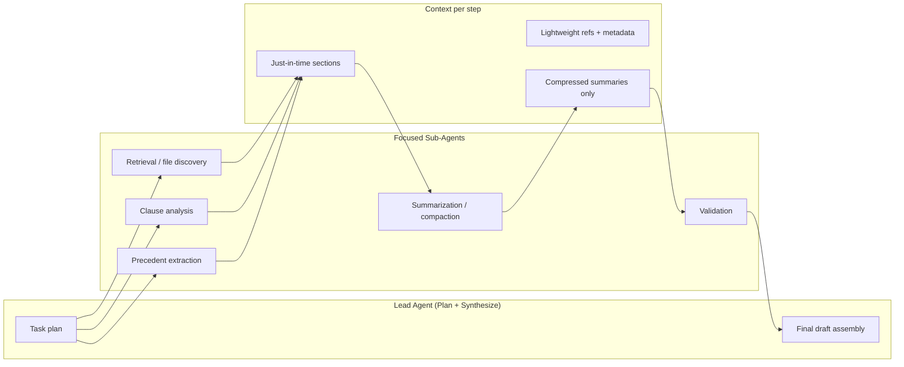

Over the last year, the conversation around AI systems has shifted from prompt engineering to something more fundamental: **context engineering for AI agents**.

That shift became obvious only after deploying agents into a real-world legal draft generation workflow — where hundreds of files, long-running loops, MCP tools, retrieval, and structured memory all compete for the same finite attention budget.

Early LLM applications often assumed: *if the prompt is good enough, the model will behave correctly.* That holds for small workflows. In production, the bottleneck is rarely wording. It is **what the model sees, when it sees it, and why it sees it**.

Anthropic’s [Effective Context Engineering for AI Agents](https://www.anthropic.com/engineering/effective-context-engineering-for-ai-agents) articulates this shift clearly. Many of the failure modes they describe — context rot, compaction, just-in-time retrieval, sub-agent architectures — were the same issues we hit scaling legal drafting past a handful of documents.

This post connects their framework to what broke in production, what fixed it, and how to think about context as infrastructure rather than a larger prompt.

---

## The Production Problem: Context Loss at Scale

The workflow required agents to process large document collections: contracts, precedents, clauses, exhibits, and cross-referenced obligations.

At **10–20 files**, the system was reliable:

- consistent reasoning,
- accurate legal references,
- stable cross-file dependencies.

Near **~200 files**, behavior degraded in predictable ways:

- forgotten earlier facts,
- repeated analysis,
- hallucinated citations,
- missed dependencies across files,
- inconsistent final drafts.

It looked random at first. It was not. It was **context degradation**.

Anthropic and others describe this as **context rot**: as token volume grows, the model’s ability to accurately use information across the full window declines — even when the window technically fits everything. Transformers have finite effective attention; more tokens often mean **diluted focus**, not stronger reasoning.

That is when the design question changes from *“How do I write a better prompt?”* to *“How do I curate the smallest high-signal context for this step?”*

---

## Prompt Engineering vs Context Engineering

**Prompt engineering** optimizes instructions: wording, examples, formatting, and technique (chain-of-thought, JSON schemas, role prompts).

**Context engineering** optimizes the **entire state** passed to the model at inference time:

- system prompts and sections,
- message history,
- memory and notes,
- retrieval chunks,
- tool and MCP outputs,
- file selection and metadata,
- compression and summarization,
- agent orchestration,
- token budgeting.

A production agent is not a single prompt. It is a **continuously evolving context system** — curated on every turn, not written once.

| Dimension | Prompt engineering | Context engineering |
|-----------|---------------------|---------------------|
| Scope | Instructions in the prompt | Full inference state |
| Lifecycle | Mostly static per task | Iterative, per agent step |
| Failure mode | Ambiguous instructions | Attention dilution, overlap, stale data |
| Primary lever | Wording and examples | Selection, timing, compression, architecture |

---

## The Biggest Mistake: One Agent, Everything Loaded

The first architecture was seductively simple:

- one agent,
- all files preloaded,
- all retrieval chunks appended,
- all tool outputs kept in history.

It worked until scale arrived.

Transformers attend across the full context. As length grows, pairwise relationships stretch and **effective recall precision drops** — a gradient, not always a hard cliff, but enough to break legal workflows where a missed cross-reference is costly.

The lesson was blunt:

**More tokens ≠ more intelligence.**

More often, the failure came from:

- irrelevant context,
- overlapping context,
- repeated context,
- poorly timed context.

The goal is not maximizing window usage. It is maximizing **signal density, relevance, timing, and attention efficiency**.

Context windows are not storage. They are **reasoning workspaces** — like human working memory under load.

---

## What Actually Improved the System

The largest gain came from one mindset shift:

> Give the model only what it needs **right now** for **this** reasoning step.

The tactics below map closely to Anthropic’s recommendations and our production fixes.

---

### 1. Context Partitioning (Multi-Agent Instead of Monolithic)

We replaced one giant agent with specialized agents:

- retrieval and file discovery,
- clause and obligation analysis,
- precedent extraction,
- summarization and compaction,
- validation and consistency checks,
- final draft synthesis.

Each agent received:

- a smaller context,
- fewer tools,
- a narrower objective.

This reduced **context pollution**: retrieval noise no longer sat beside draft-generation instructions, and validation did not inherit ten pages of raw tool dumps.

Sub-agents can explore heavily (many tokens internally) but return **condensed, high-signal summaries** to the lead agent — the same pattern Anthropic describes for multi-agent research systems.

---

### 2. Runtime Retrieval Instead of Preloading Everything

Preloading entire corpora was a mistake.

We moved to:

- file paths and IDs,
- metadata (type, date, party, section),
- dynamic fetch via tools,
- **just-in-time** loading of the section needed for the current step.

This mirrors **agentic search** and **progressive disclosure**: the agent discovers structure incrementally (names, folders, sizes, timestamps) instead of memorizing everything up front.

Trade-off: runtime exploration is slower than bulk preload. For legal and finance workflows — less dynamic corpora, high cost of wrong citations — a **hybrid** often wins: small high-value context up front (e.g. matter summary, key definitions), plus tools to pull the rest on demand.

---

### 3. Compaction and Summarization Pipelines

Long-horizon agents append tool results, retrieval blocks, and reasoning traces until the window fills.

**Compaction** — summarizing history and restarting with a distilled state — became mandatory, not optional.

We compressed:

- raw retrieval hits → structured findings,
- long tool outputs → obligations, entities, and clause maps,
- redundant reasoning → decision logs with open issues only.

Anthropic also highlights lighter-touch compaction such as **clearing old tool results** once their information is captured elsewhere. That alone cuts noise without losing task state.

Engineering note: tune compaction for **recall first**, then trim superfluous tokens. Aggressive compaction that drops a subtle dependency shows up three hours later as a wrong legal reference.

---

### 4. Tool Design as Context Design

Every tool response becomes **future context**.

Bad tools create bad agents:

- verbose payloads,
- overlapping semantics (“search” vs “fetch” vs “grep” doing the same thing),
- non-deterministic JSON shapes.

We redesigned MCP tools to:

- return only fields needed for the next step,
- use stable, minimal schemas,
- avoid duplicate capabilities,
- make the “which tool?” choice obvious to both humans and models.

If an engineer cannot say which tool to use in a situation, the model will not do better reliably.

---

### 5. Structured System Prompts (Right Altitude)

Anthropic’s “Goldilocks” prompt altitude applies directly:

- too rigid → brittle if-else logic in natural language,
- too vague → the model invents policy.

We split system prompts into clear sections:

- background and role,
- task instructions,
- tool guidance,
- constraints and safety,
- output format.

Markdown or XML-style section headers reduced ambiguity without over-specifying every edge case. **Minimal but sufficient** beat maximal prompt laundry lists.

---

### 6. Eliminating Context Overlap

A hidden production tax is **duplicated semantics**:

- retrieval chunks repeat memory,
- summaries restate full documents,
- multiple agents inject the same precedent paragraph,
- tool output re-states what the lead agent already decided.

We enforced: **each layer adds unique signal**.

Deduplication and ownership rules (who may write “source of truth” for a fact) improved stability more than another 2B-parameter upgrade would have at that stage.

---

## Context Engineering for Long-Horizon Legal Work

Legal drafting is a long-horizon task: tens of minutes to hours, many tool calls, strict coherence.

Three techniques matter most (often combined):

| Technique | Best for | Risk if done poorly |
|-----------|----------|---------------------|
| **Compaction** | Conversational threads, deep tool history | Drops subtle dependencies |
| **Structured note-taking** | Milestones, open issues, entity maps | Stale notes not refreshed |
| **Sub-agent architectures** | Parallel analysis across large corpora | Over-compression of sub-agent returns |

Waiting for larger context windows alone does not remove **relevance** and **pollution** problems. Even with bigger windows, curation still wins when accuracy is non-negotiable.

Pair context engineering with explicit **token and iteration budgets** — unbounded agent loops amplify rot and cost. See [Budget Forcing in RAG Systems](/2026/02/16/budget-forcing-in-rag-systems/) for the control-layer side of the same production problem.

---

## Trade-offs and Limitations

Context engineering is not free.

- **Just-in-time retrieval** adds latency and requires good tool heuristics; agents can chase dead ends.
- **Multi-agent setups** add orchestration complexity and failure modes at handoff boundaries.
- **Compaction** can delete context whose importance only appears later.
- **Minimal context** can under-specify when the model truly needs global view — hybrid preload + exploration remains necessary in many legal tasks.

The right design depends on task dynamics, error cost, and latency budget — not on copying one pattern from a blog post.

---

## Practical Applications Beyond Legal Drafting

The same principles apply wherever agents run long and environments grow:

- **Enterprise RAG** — cap chunks, rerank aggressively, clear stale tool results ([production RAG patterns](/2026/03/17/production-rag-cv-job-matching/)).
- **Document pipelines** — process at scale with async workers; keep LLM context for reasoning steps only ([CV processing architecture](/2026/03/11/cv-processing-architecture/)).
- **Coding agents** — references and grep/glob instead of loading full repos.
- **Research agents** — sub-agents explore; lead agent synthesizes.

As workflows become more agentic, **memory design, retrieval orchestration, compression, and multi-agent partitioning** become core engineering skills — closer to OS and distributed systems design than to prompt tweaking alone.

---

## Key Takeaways

- **Context engineering** curates the full inference state; prompt engineering is only one slice.
- **Context rot** explains many “random” production failures at scale — not model stupidity, attention economics.
- **Monolithic mega-context** agents degrade before the window is “full.”
- **Partition work**, load **just-in-time**, **compact** aggressively but carefully, and **design tools** as context payloads.
- **Remove duplicate signal** across retrieval, memory, tools, and agents.
- Treat the context window as a **scarce reasoning resource**, not a database.

---

## Related Reading

- [Budget Forcing in RAG Systems: Controlling Cost, Latency, and Runaway Reasoning](/2026/02/16/budget-forcing-in-rag-systems/)
- [Engineering a Production-Grade RAG System for CV-Job Matching](/2026/03/17/production-rag-cv-job-matching/)
- [Engineering a Scalable Resume Processing Pipeline](/2026/03/11-cv-processing-architecture/)
- Anthropic — [Effective Context Engineering for AI Agents](https://www.anthropic.com/engineering/effective-context-engineering-for-ai-agents)
- Anthropic — [Building Effective AI Agents](https://www.anthropic.com/research/building-effective-agents)

---

## Closing Thought

The best production systems I have worked on were not the ones with the largest prompts, the most tools, or the biggest context windows.

They were the systems that **managed context deliberately** — small, relevant, well-timed, and continuously refined.

Prompt engineering still matters. But for multi-step agents in real environments, **context engineering is the discipline that separates demos from dependable systems**.

Over the next few years, that skill — not a longer system prompt — is what will define mature AI engineering.
