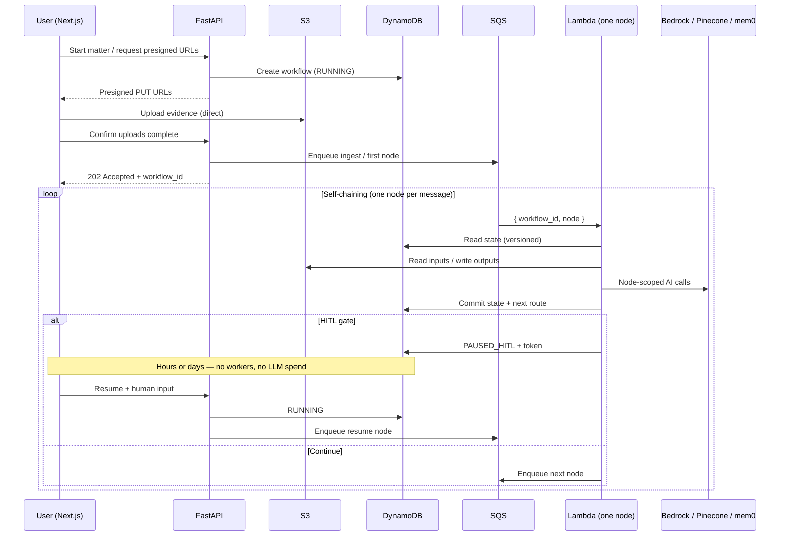
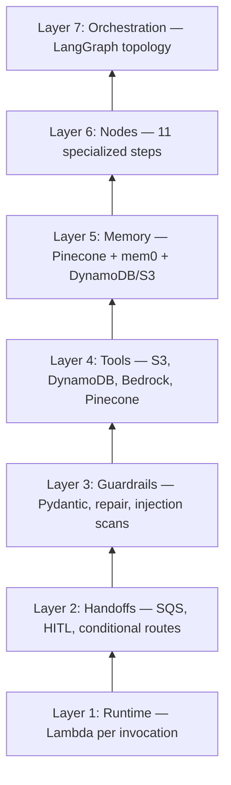
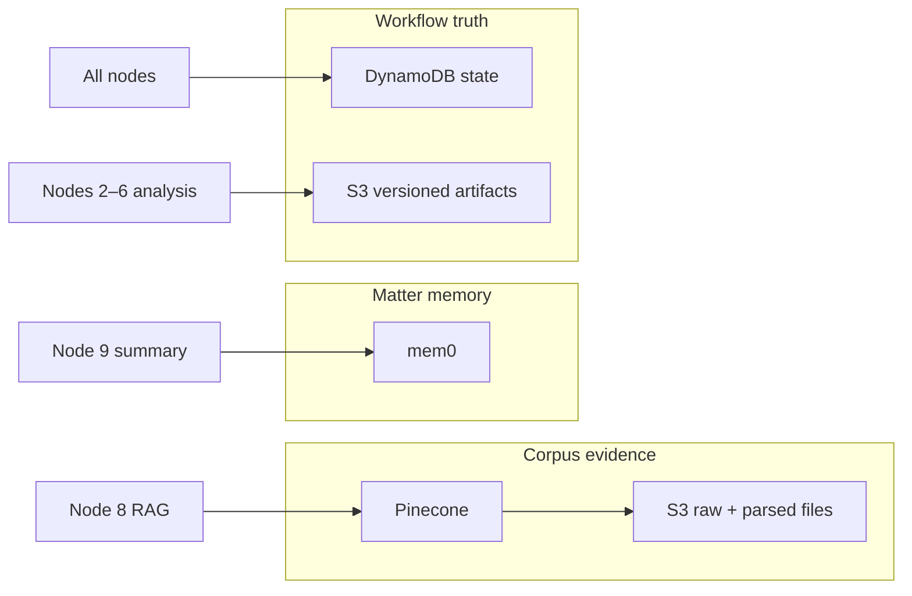
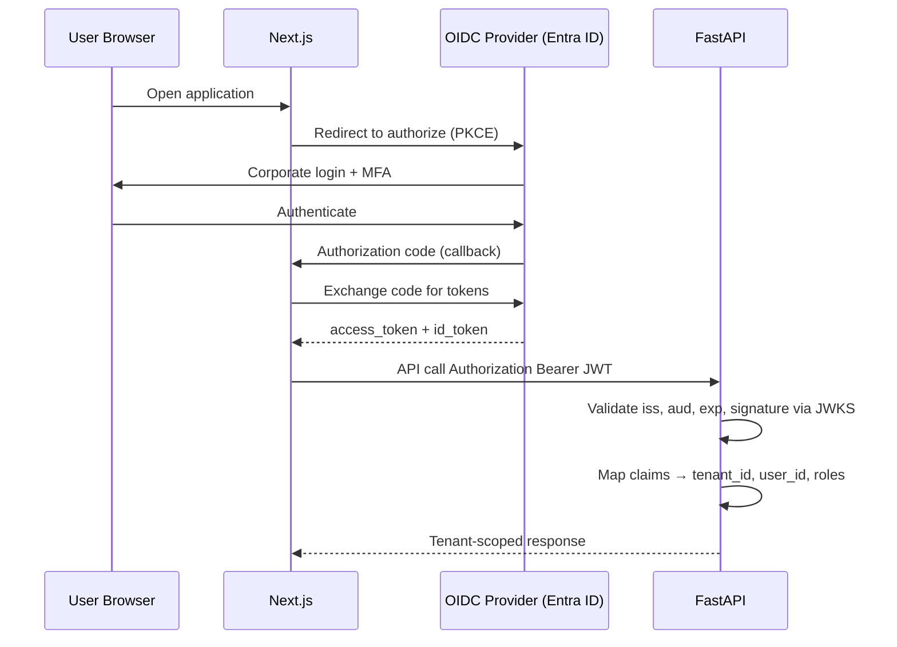

We built an application that turns messy enterprise evidence into a professionally structured legal grievance draft. Users upload PDFs, DOCX files, `.eml` exports, WhatsApp screenshots, images, and supporting attachments; the legal team expects a coherent draft that reflects **all** of it — dates, parties, chronology, and narrative — not a summary of whatever fit in context. The first implementation did what most teams try first: extract text from everything, concatenate it into one payload, and call **Claude Opus** once to write the draft. With **5–10 short files**, it worked reliably — coherent drafts, stable citations, acceptable latency. When matters grew to **~200 files** and total token volume climbed into the millions, the same approach failed. In production it was not a model problem. It was a **systems** problem.

At that scale, the monolithic prompt failed in predictable ways. Context rot and hallucinated citations showed up as the evidence set grew. We hit **token ceilings** and **Bedrock timeouts** on single invocations, with no clean way to retry only the step that failed. A run could not **pause** when a user needed to supply a missing date, or when counsel wanted to redirect narrative framing, and **resume days later** without restarting from scratch and risking inconsistent output. Failures were not **isolated** — one bad parse or one throttled call invalidated the entire job. Observability was effectively one blob of input and output, which made incidents painful to debug. Cost scaled with matter size because every retry re-paid for the full corpus. None of that is fixed by a better system prompt.

The product also had hard **human-in-the-loop (HITL)** requirements that a single long-running agent loop does not satisfy. Users must inject missing facts mid-workflow. Lawyers must approve or reshape narrative direction **before** final draft generation. Those gates can last hours or days. That rules out both the giant one-shot prompt and a fully autonomous “let the agent run until done” framework demo pattern. We needed **deterministic orchestration** — explicit stages, durable state, pausable execution, and node-scoped retries — with the LLM used only where judgment is required, not as the workflow engine. The rest of this post is how we productionised that pipeline.

---

# System Architecture

The replacement architecture treats the product as **composable services**, not one monolithic AI workflow. Ingestion, parsing, retrieval, reasoning, drafting, validation, and HITL gates are separate units with explicit contracts. That split is not ceremony — it is how we get **failure isolation** (a bad OCR pass does not poison draft synthesis), **node-scoped retries** (re-run one step without re-paying for 200 files of context), and **resumability** (a matter paused on Friday resumes on Monday without replaying completed work).

The **API layer stays thin** on purpose. **FastAPI** handles auth, tenancy, workflow metadata, presigned URL issuance, and HITL resume signals — nothing that blocks on Bedrock for minutes. Evidence uploads go **browser → S3** via **presigned URLs** (multipart where needed), so the API never proxies hundreds of PDFs, DOCX files, or screenshots. AI execution is **fully async and queue-driven**: the API commits intent to **DynamoDB**, enqueues **SQS**, and returns. **Lambda workers** execute one graph node per invocation; state and artifacts live in **DynamoDB + S3**, not in process memory. **LangGraph** defines routing topology only — the runtime is external.

> **Design invariant:** The LLM is a step executor. The workflow engine is durable storage + a message queue.


The diagram above is the production control plane we operate today. The sections below walk through each layer and the end-to-end request flow — still at the **system** level, before the agent graph internals.

---

## Architecture Layers

### Client: Next.js frontend

The **Next.js** app owns upload UX, matter status, and HITL forms. For large batches (~200 files), the client uses bounded concurrency (parallel multipart uploads) against presigned S3 URLs. The UI polls or subscribes to workflow status from the API; it does not wait on long-running model calls over HTTP.

### API: FastAPI (thin control plane)

**FastAPI** never performs heavy AI work directly. That constraint avoids Gunicorn worker exhaustion, API Gateway timeouts, and unrecoverable in-flight requests when Bedrock throttles or a single matter runs for tens of minutes.

Responsibilities:

- authenticate and isolate tenants,
- create/update workflow records in **DynamoDB**,
- mint presigned S3 URLs and validate upload completion,
- enqueue the first SQS message (or a resume message after HITL),
- expose read APIs for status, artifacts, and audit metadata.

If the API process restarts mid-day, nothing is lost — truth is in DynamoDB and S3.

### Storage: S3 + DynamoDB

**S3** holds raw evidence (PDF, DOCX, `.eml`, images) and **versioned node outputs** (parsed JSON, retrieval bundles, draft sections). Objects are immutable by convention; downstream steps reference explicit URIs and versions.

**DynamoDB** holds the workflow spine: `workflow_id`, current node, status (`RUNNING`, `PAUSED_HITL`, `FAILED`, `COMPLETED`), optimistic-lock version, HITL tokens, and compact state pointers — not multi-megabyte prompts. Large payloads stay in S3; the state row stores references.

This externalization is what makes **multi-hour and multi-day pauses** survivable. A `PAUSED_HITL` workflow consumes no Lambda time and no Bedrock spend while counsel reviews; resume is a conditional state flip plus one SQS message.

### Messaging: SQS

**SQS** decouples request ingestion from execution. Upload spikes and LLM throughput limits are absorbed by queue depth, not by thread pools inside the API.

Each node completion **self-chains**: the worker writes outputs, computes the next node (via compiled **LangGraph** routing rules), and enqueues `{ workflow_id, node, attempt, idempotency_key }`. No synchronous “call the next function” inside the same process.

| Property | Why it matters |
|----------|----------------|
| At-least-once delivery | Requires idempotent node handlers |
| Visibility timeout | Tuned per node class (parse vs draft) |
| DLQ | Poison messages without corrupting DynamoDB state |
| Per-tenant grouping | Fairness under concurrent matters |

### Execution: Lambda-per-node workers

**Lambda-per-node** was chosen over a long-lived async Python agent runtime:

- **Blast radius:** OOM or dependency failure affects one step, not every in-flight matter on a shared worker.
- **Timeout boundary:** Bedrock-heavy steps get their own 15-minute window instead of one unbounded process.
- **Scale:** Concurrency tracks queue depth; we do not size an always-on fleet for peak Opus load.
- **Deploy safety:** Shipping a new handler for `parse_eml` does not drain a monolithic agent container running 40 workflows.

Cold start is a real cost; we keep deployment packages small and use provisioned concurrency only on the hottest nodes.

### Intelligence services (invoked from workers, not from FastAPI)

Workers call external services per node — never the API:

- **Amazon Bedrock** (Haiku / Sonnet / Opus by task class) for classification, analysis, and drafting,
- **Pinecone** for corpus retrieval over chunked, metadata-filtered evidence,
- **mem0** for matter-scoped memory (decisions, open issues, entity maps) separate from raw retrieval hits.

Splitting Pinecone (evidence) from mem0 (session/matter memory) avoids duplicating the same text in two stores and reduces context pollution upstream.

---

## End-to-End Request Flow



**Typical path:**

1. User opens a matter in **Next.js**; **FastAPI** creates a DynamoDB workflow row.
2. Client uploads files **directly to S3**; API records keys and enqueues ingestion.
3. A **Lambda** runs the ingest/parse node, writes artifacts to S3, updates DynamoDB, enqueues the next message.
4. Retrieval nodes query **Pinecone**; memory nodes read/write **mem0**; reasoning nodes call **Bedrock** with bounded context.
5. On a HITL gate, status becomes `PAUSED_HITL`; execution stops until the API receives resume input and enqueues the appropriate node.
6. Final artifacts land in S3; DynamoDB marks `COMPLETED`.

---

## Why This Beats In-Memory Agent Runtimes

Framework demos often run **LangGraph (or similar) inside one Python process**: checkpoints in RAM, synchronous `invoke()` chains, uploads through the API, and “restart the agent” as the recovery model.

That breaks our constraints:

| Requirement | In-memory agent runtime | Queue + Lambda + DynamoDB |
|-------------|-------------------------|---------------------------|
| Pause days for HITL | Process dies or holds connections | `PAUSED_HITL` in DynamoDB, zero workers |
| Retry one failed step | Re-run entire graph / full prompt | Re-enqueue single node with idempotency key |
| 200-file upload burst | API becomes the bottleneck | Presigned S3 + client parallelism |
| Observability | One opaque trace | Per-node logs with `workflow_id` + artifact URIs |
| Cost on retry | Re-pay full corpus | Re-pay only the failed node’s inputs |

> **Trade-off we accept:** Higher moving parts and per-hop latency (SQS + Lambda cold start) versus a single-process demo. For legal grievance workflows measured in hours and days, operability wins.

The agent graph — individual nodes, model routing, and guardrails — is the next layer down. This post stops at the **system shell** that makes that graph deployable.

---

# The Agentic AI Stack — Layer by Layer

Toy agent demos collapse the entire problem into one box: a model, a prompt, and “tools.” That works in a notebook. In production — legal grievance matters with **~200 files**, multi-day **HITL** pauses, and audit expectations — you need **seven separable layers**, each with a single job. Skip a layer and you do not get a cheaper system; you get an incident class: runaway tool calls, unrecoverable pauses, schema drift in outputs, or a retry that rewrites an already-approved paragraph.

We did not ship “one AI agent.” We shipped a **distributed, deterministic orchestration system** where AI runs only inside **isolated execution nodes**, bounded by guardrails, explicit handoffs, and external state. The stack below is what that looks like in practice — technologies included, and what breaks when each layer is missing.

> **Core insight:** Orchestration is infrastructure. The LLM is a function call inside a node — not the workflow engine.


The diagram orders the stack from **foundation to control plane**. The following sections walk **Layer 1 → Layer 7** (runtime up to topology). That is the same direction you deploy and debug: fix the executor before you argue about routing.

---

## Layer 1 — Runtime

**What it does:** Executes one unit of work with hard resource boundaries — CPU, memory, timeout, and billing clock.

**Technologies:** **AWS Lambda** (one invocation per graph node), CloudWatch (or equivalent) for structured logs, per-node IAM where applicable.

**Why production needs it:** Legal workflows are long. A single OS process running “the agent” couples every matter’s fate: one memory leak, one dependency conflict, one deploy kills in-flight work.

**What breaks without it:** No **failure isolation** (parser OOM takes down drafting), no clean **retry boundary** (retry == restart everything), no **timeout safety** on Bedrock-heavy steps, and no honest **scaling** model under concurrent matters.

**Trade-offs:** Lambda cold starts and per-invocation overhead versus always-on workers. We accept latency on cold paths in exchange for blast-radius control and scale-to-zero on paused matters.

---

## Layer 2 — Handoffs

**What it does:** Moves control between nodes, the outside world (humans), and time — including pauses that last hours or days.

**Technologies:** **SQS self-chaining** (node N completes → enqueue N+1), **DynamoDB** workflow status, **FastAPI** resume endpoints, conditional routes compiled from **LangGraph** (topology only).

**Why production needs it:** Grievance drafting is not a single sitting. Users supply missing dates mid-run; lawyers redirect narrative before final synthesis. Handoffs must be **durable** and **explicit**, not `input()` in a Python loop.

**What breaks without it:** You cannot **pause/resume** safely; HITL becomes a hung HTTP request; “waiting for human” still burns workers or dies on deploy; retries skip or duplicate human-approved steps.

**Engineering choices:**

- **SQS self-chaining** decouples steps — no synchronous chain inside Lambda.
- **HITL** sets `PAUSED_HITL` in DynamoDB and **stops enqueueing** until resume — zero LLM spend while waiting.
- **Conditional routing** (e.g. missing facts → user input node → analysis) is data-driven from state, not model improvisation.

**Trade-offs:** More messages and state writes than a `while agent_running` loop; in return you get **auditability** (who resumed, when, on which artifact version).

---

## Layer 3 — Guardrails

**What it does:** Constrains what enters and leaves model steps so downstream code and humans can trust artifacts.

**Technologies:** **Pydantic** schema validation, JSON repair passes (typically Haiku-class), **truncation repair** when tool payloads exceed budgets, injection scanning on untrusted document text, graph rules that tie citations to retrieved chunk IDs.

**Why production needs it:** Stochastic generation is acceptable inside a node; **workflow state** must not be stochastic. Enterprise legal output needs reproducible structure for merge, diff, and audit.

**What breaks without it:** Silent schema drift breaks parsers; hallucinated clause references slip into “final” drafts; oversized tool dumps blow context and amplify **context rot**; prompt injection in `.eml` or scraped PDF text steers drafting.

**Trade-offs:** Strict validation increases retry rate on malformed model JSON — cheaper than poisoning S3 with bad artifacts. We repair once, then fail the node to DLQ with diagnostics.

---

## Layer 4 — Tools

**What it does:** Gives nodes deterministic access to the outside world — storage, retrieval, models — via **fixed interfaces**, not open-ended agency.

**Technologies:** **S3** (read/write artifacts), **DynamoDB** (read/write workflow fields), **Bedrock** (invoke with explicit model ID per node), **Pinecone** (retrieval with mandatory metadata filters). Tool dispatch is **code-defined per node** — no autonomous “pick a tool” loop.

**Why production needs it:** Tools are how agents touch reality. Uncontrolled tool selection is how demos become production outages.

**What breaks without it:** **ReAct-style** “the model decides what to call next” produces unbounded loops, duplicate retrievals, and non-reproducible runs — unacceptable when counsel must explain *why* a paragraph appeared.

**What we intentionally avoided:**

| Pattern | Risk in legal production |
|---------|--------------------------|
| Autonomous tool selection | Unbounded cost, untraceable evidence chain |
| Overlapping tools (search vs fetch vs grep) | Wrong tool choice, polluted context |
| Tools returning raw megabyte payloads | Context rot, timeout, cost |

**Trade-offs:** Less “flexible” than a general agent with 30 MCP tools; far more **auditable** — each node’s allowed tools are enumerable in code review.

---

## Layer 5 — Memory

**What it does:** Separates **what we know from evidence** from **what we decided during the matter** — scoped per tenant and workflow.

**Technologies:**

- **Pinecone** — corpus evidence (chunks, metadata filters: matter, doc type, date),
- **mem0** — matter/session memory (entities, open issues, prior decisions),
- **DynamoDB + S3** — durable pointers, summaries, and artifact versions (source of truth for replay).

**Why production needs it:** Monolithic prompts stuff retrieval, chat history, and summaries into one window. At ~200 files that guarantees **overlap, staleness, and attention dilution**.

**What breaks without it:** The model “forgets” early facts, re-derives the same entities every node, or contradicts an earlier HITL-approved decision. Cross-tenant leakage becomes possible if retrieval lacks hard filters.

**Trade-offs:** Two memory systems to operate (Pinecone + mem0) versus one blob in prompt. The split enforces **unique signal per layer** — Pinecone for provable evidence, mem0 for working conclusions, DynamoDB/S3 for what actually happened in the run.

---

## Layer 6 — Nodes / Agents

**What it does:** Encapsulates **one task, one responsibility, one primary model class** per step — ingest, parse, retrieve, analyze, compact, draft section, validate, HITL merge, etc.

**Our implementation:** **11 specialized nodes**, each with:

- a narrow input contract (S3 URIs + DynamoDB pointers),
- a bounded output schema (Pydantic),
- a fixed Bedrock tier (Haiku / Sonnet / Opus) chosen by task economics,
- **deterministic post-processing** (no “let the model merge human edits”).

**Why production needs it:** Monolithic prompts mix planning, retrieval, drafting, and validation. You cannot retry “just the validator” or prove which step introduced a hallucination.

**What breaks without it:** One bad step invalidates the entire run; model responsibilities blur (Opus doing chunk tagging); costs explode because every retry is a full-matter prompt.

**Trade-offs:** More graph edges and deployment surfaces than a single agent class; in return you get **reproducibility**, **per-node metrics**, and **parallelization** where the graph allows (e.g. per-file parse fan-out).

---

## Layer 7 — Orchestration

**What it does:** Answers only: *given current durable state, which node may run next?*

**Technologies:** **LangGraph** — compiled graph for branches, cycles (bounded), and HITL edges. Used **only for topology and routing**. Execution remains **Lambda + SQS + DynamoDB**; LangGraph is not the runtime executor.

**Why production needs it:** You need a verifiable state machine, not an LLM improvising “what to do next.” Lawyers and compliance care about **path**, not vibes.

**What breaks without it:** Ad-hoc `if` chains in Lambdas drift from the documented workflow; cyclic agent behavior becomes hard to cap; graph changes are undeployable artifacts in someone’s notebook.

**Trade-offs:** Maintaining a compiled graph version (`graph_version` on the workflow row) adds migration discipline when topology changes. Beats untraceable control flow in a 4,000-line agent script.

---

## What We Deliberately Did Not Build

| Approach | Why we rejected it |
|----------|-------------------|
| **Fully autonomous agents** | Non-deterministic control flow, unauditable paths, unbounded spend |
| **ReAct-style uncontrolled tool use** | Tool loops, duplicate retrieval, irreproducible evidence chains |
| **Long-running in-memory runtimes** | HITL pauses, deploys, and retries break process-bound state |
| **Monolithic Opus prompts** | Context rot at ~200 files; no isolation; full-corpus cost on every retry |

What we optimized for instead:

- **Deterministic execution** — explicit nodes, versioned artifacts, schema-bound outputs,
- **Auditability** — S3 object versions, DynamoDB status transitions, per-node logs,
- **Reproducibility** — same inputs + graph version → same allowed path (LLM variance contained inside nodes),
- **Failure isolation** — one node fails, not the matter,
- **Enterprise reliability** — DLQ, idempotency keys, tenant-scoped data planes,
- **Resumability** — `PAUSED_HITL` for days without workers or model spend.

---

## How the Layers Compose



A single SQS message triggers **Layer 1** (Lambda). **Layer 2** decides whether this invocation continues, pauses, or routes to HITL. **Layer 3** validates everything the model returns. **Layer 4** performs only the tools registered for that node. **Layer 5** supplies evidence and matter memory under tenant scope. **Layer 6** runs the actual task with one model responsibility. **Layer 7** computed the legal next node when the previous step committed — it does not run inside the same conceptual “agent thread.”

That composition is why this system survives production legal workloads while notebook agents do not. Scaling characteristics and cost controls sit on top of this stack; they depend on these boundaries being real, not decorative.

---

# Why LangGraph

We needed a **workflow definition layer** for an **11-node grievance pipeline** with conditional branches, two **HITL** gates, a verification retry loop, and routes that depend on structured state — not model prose. A wall of `if/else` in Lambda handlers would have worked for a week and become undeployable by month three. **AWS Step Functions** could orchestrate waits and retries, but our graph is dense with **state-driven routing** (validation outcomes, missing fields, risk flags) that we wanted to express in Python next to the node code, not in ASL JSON.

**LangGraph** won because it models the problem as what it actually is: a **directed graph** with explicit nodes, edges, and conditional transitions — close to how engineers whiteboard the system. It did **not** win as a long-running runtime we `invoke()` until the draft is done.

> **How we use LangGraph:** compile a graph that answers `next_node = route(current_state)` — then persist state in DynamoDB and hand execution to SQS + Lambda.


The diagram shows the split clearly. **LangGraph** sits in the **orchestration** lane: it defines the DAG (ingest → analysis → validate → RAG → narrative → draft → verify) and where **HITL #1** (missing information) and **HITL #2** (narrative direction) interrupt the flow. **AWS Lambda** runs each box. **SQS** chains invocations. **DynamoDB** holds checkpoints. LangGraph does not sit in the hot path holding sockets open while a lawyer is offline for two days.

---

## What LangGraph Gives Us

### 1. Explicit topology (the DAG is the contract)

Each of the **11 nodes** is a named vertex with a single responsibility — extraction per file, entity resolution, communication intelligence, timeline reconstruction, contradiction detection, classification, logic-only validation, Pinecone RAG, narrative summary, Opus draft generation, Haiku verification. Edges are **data dependencies and control dependencies**, not implicit “the agent decided to continue.”

That matters for legal production:

- **Audit:** “Why did we reach draft generation?” → trace the path through named nodes.
- **Change control:** topology diffs in code review, not buried in prompt edits.
- **Testing:** mock state in → assert `next_node` out, without calling Bedrock.

### 2. Conditional routing without LLM improvisation

Routes are **functions of structured state**, for example:

- validation node finds blocking gaps → **HITL #1** (user supplies missing dates/details),
- narrative gate not satisfied → **HITL #2** (lawyer sets strategy and tone),
- verification fails → bounded retry back to draft or escalate,
- all guards pass → forward along the happy path.

The model does not choose the branch. The graph does. That is **deterministic orchestration** with stochastic steps isolated inside nodes.

```python
def route_after_validate(state: WorkflowState) -> str:
    if state["validation"]["blocking_issues"]:
        return "hitl_missing_information"
    if not state["validation"]["timeline_complete"]:
        return "timeline_reconstruction"
    return "rag_retrieval"

# Compiled LangGraph used at end of each Lambda:
# next_node = router(state)  →  enqueue SQS message for next_node
```

### 3. First-class HITL as graph structure

LangGraph’s interrupt / breakpoint patterns align with how we think about **pause/resume**: a gate is an edge to a **wait state**, not a sleeping thread. In our deployment, “wait” means DynamoDB `PAUSED_HITL` and **no SQS messages** until the API enqueues a resume. LangGraph defined **where** pauses are legal; AWS primitives define **how** pauses survive days.

### 4. Bounded cycles (verification retry)

Node 11 (verification) can loop back to draft generation **with a cap** encoded in the graph and enforced in state (`retry_count`, `max_verification_attempts`). Framework demos often allow unbounded ReAct loops. We needed a **finite state machine** with an escape hatch to `FAILED` and DLQ.

---

## What We Do Not Use LangGraph For

This is the distinction most tutorials skip.

| LangGraph feature (typical tutorial) | Our production usage |
|--------------------------------------|----------------------|
| `graph.invoke()` in one Python process | **No** — one SQS message → one Lambda → one node |
| In-memory checkpointer | **No** — DynamoDB + S3 artifacts |
| Streaming UI loop in the same runtime | **No** — Next.js polls workflow status via FastAPI |
| “Agent” as the orchestrator | **No** — graph router is code; LLM runs inside nodes only |
| Tool autoselection | **No** — tools fixed per node |

LangGraph’s default **checkpoint + invoke** loop is designed for interactive sessions measured in minutes. Our matters are measured in **hours and days** with **deploys in between**. Externalizing state was not a preference — it was required for **resumability**, **failure isolation**, and **zero spend during HITL**.

> **Mental model:** LangGraph is the **compiled routing table**. Lambda is the **CPU**. DynamoDB is **RAM that survives reboots**. SQS is the **program counter**.

---

## How Routing Runs in Practice

At the end of every successful node:

1. Lambda reads workflow state from **DynamoDB** (with version check).
2. Loads the compiled graph for `graph_version` on that workflow.
3. Calls the router: `next_node = app.get_next_node(state)` (conceptually — exact API depends on compile shape).
4. Persists outputs to **S3**, updates DynamoDB (`current_node`, `status`, pointers).
5. If `next_node` is a HITL gate → set `PAUSED_HITL`, **do not enqueue**.
6. Else → **SQS self-chain** `{ workflow_id, node: next_node, idempotency_key }`.

LangGraph never owns the Bedrock call, the Pinecone query, or the mem0 write. Those happen **inside** the node handler. LangGraph only decides **what is allowed to run next** given honest structured state.

**`graph_version`** on the workflow row lets us ship topology changes without mutating in-flight matters — new matters pick up the new graph; old matters drain on the version they started with.

---

## Alternatives We Considered

| Option | Verdict |
|--------|---------|
| **Raw Lambda + if/else** | Fast initially; unmaintainable at 11 nodes + 2 HITL gates + retry loops |
| **Step Functions** | Strong for timers/retries; awkward for rich state-conditioned branching maintained by the same team shipping Python nodes |
| **Temporal / Cadence** | Excellent durability; heavier ops burden than we needed given SQS + DynamoDB already in stack |
| **LangChain AgentExecutor only** | Hides control flow inside model decisions — wrong for legal audit requirements |
| **LangGraph as full runtime** | Failed HITL pause, deploy, and per-node retry requirements in load testing |

LangGraph sat in the sweet spot: **expressive graph in code**, without forcing us to accept its in-process execution model.

---

## Trade-offs We Accept

**Pros:**

- Topology is readable, reviewable, and testable without invoking models.
- HITL and retry loops are explicit in the graph, not emergent from prompts.
- Same graph definition documents the system for engineering and compliance conversations.

**Cons:**

- Two sources of “truth” to keep aligned: **graph definition** and **Lambda handlers** (mitigated by naming discipline and contract tests on `next_node` for fixture states).
- LangGraph version upgrades require regression on routing fixtures.
- Slightly more ceremony than a 200-line script — justified at node 6+, painful by node 11.

---

## Closing Boundary

LangGraph answers **what path is legal next**. The sections below cover how each node is designed, how work chains through the queue, how prompts and guardrails bound model behavior, and how memory is split across stores.

---

# Node Design & Chaining Strategy

An agent graph is only as reliable as its **node boundaries**. We run **11 specialized nodes** across five phases — ingestion, analysis, validation, RAG/context, and generation — each mapped to **one Lambda invocation**, **one primary task**, and **one model tier** (or no model at all). That design is how we keep ~200-file matters debuggable: when verification fails, we know it was Node 11, not “the agent.”

**Chaining** is never synchronous `node_a()` → `node_b()` inside the same process. Every handoff is **SQS self-chaining**: commit state → compute `next_node` from LangGraph routing → enqueue. The program counter is the queue.

---

## The 11 Nodes (What Each One Owns)

| # | Node | Model | Responsibility |
|---|------|-------|----------------|
| 1 | Extraction (per file) | Haiku 4.5 | Text + metadata from PDF/DOCX/`.eml`/images |
| 2 | Entity resolution | Sonnet 4.6 | People, orgs, departments across files |
| 3 | Communication intelligence | Sonnet 4.6 | Email/WhatsApp thread patterns |
| 4 | Timeline reconstruction | Sonnet 4.6 | Chronological event ordering |
| 5 | Contradiction detection | Sonnet 4.6 | Cross-evidence inconsistencies |
| 6 | Classification | Haiku 4.5 | Issue categories, risk tags |
| 7 | Validate | **No LLM** | Required fields, logic rules, completeness |
| 8 | RAG retrieval | Titan embeddings + Pinecone | Precedents, similar matters |
| 9 | Narrative summary | Sonnet 4.6 | Synthesized findings for counsel |
| 10 | Draft generation | Opus 4.6 | UK employment-law structured draft |
| 11 | Verification | Haiku 4.5 | Format/quality check; bounded retry to Node 10 |

**Node 7 is intentional.** Validation is **pure code** over structured outputs — dates present, timeline closed, mandatory parties identified. Letting an LLM “validate” introduces a second stochastic layer on top of stochastic extraction. Logic-only validation also costs nothing in Bedrock tokens and completes in milliseconds.

---

## Chaining Patterns

### Per-file fan-out (ingestion)

Node 1 runs **once per evidence file** (or per batch shard), not once per matter with 200 files inlined. Each completion writes `s3://.../extractions/{file_id}/v1.json` and updates a manifest in DynamoDB. A aggregator/router node (or graph rule) proceeds when the manifest satisfies completeness — avoiding a single invocation that must fit all extractions in memory or context.

### Linear analysis chain (Nodes 2–6)

Analysis nodes consume **compressed artifacts**, not raw corpora. Each reads prior S3 outputs + pointers from DynamoDB, writes its own versioned JSON, enqueues the next analysis node. Failure on Node 5 does not re-run Nodes 2–4 if their outputs are already committed and idempotent keys match.

### HITL gates (control flow, not nodes that “think”)

Two lawyer gates sit on the graph:

- **HITL #1 — missing information** (after analysis, before validation proceeds to RAG): user supplies dates/details; resume enqueues the appropriate continuation node.
- **HITL #2 — narrative direction** (after RAG/summary, before Opus draft): lawyer sets strategy and tone; resume enqueues draft generation.

HITL steps are **orchestration states**, not LLM nodes. They produce structured human input artifacts in S3, then deterministic merge logic applies them.

### Verification loop (bounded)

Node 11 may route back to Node 10 with `retry_count < max_verification_attempts`. The graph encodes the loop; DynamoDB stores the counter. No unbounded “try again until good enough.”

---

## Node Contract (Every Handler Implements)

```python
class NodeInput(BaseModel):
    workflow_id: str
    tenant_id: str
    graph_version: str
    artifact_uris: dict[str, str]  # explicit versions
    idempotency_key: str

class NodeOutput(BaseModel):
    artifact_uris: dict[str, str]
    state_patch: dict[str, Any]   # small, DynamoDB-safe
    next_route_hint: str | None    # optional; graph may override
```

Rules enforced in code review:

- **One node = one Bedrock responsibility** — do not classify and draft in the same handler.
- **Outputs are versioned S3 objects** — never “update in place.”
- **Idempotency key** = `workflow_id:node_name:state_version` — duplicate SQS delivery must not double-write drafts.
- **No cross-node imports** — shared libraries OK; calling another node’s handler directly is not.

> **Chaining invariant:** A node finishes only when DynamoDB commit succeeds **before** SQS enqueue. If enqueue fails, retry must not re-execute Bedrock unless the idempotency check proves outputs are missing.

---

## Why This Chaining Model Scales

| Pattern | Benefit |
|---------|---------|
| SQS between every node | Backpressure, per-tenant fairness, DLQ per failure class |
| Lambda per node | Timeout and memory tuned per task (parse vs Opus draft) |
| S3 artifact chain | Replay, audit, diff human edits against model output |
| LangGraph routing only | Branch rules testable without invoking models |

What we avoided: a **single long chain** inside one Lambda (hits 15-minute cap, couples failures) and **ReAct loops** where the model chooses the next step (non-auditable, non-deterministic).

---

# Prompt Engineering

Prompt engineering in this system is **not** a hero system prompt at the top of the graph. It is **eleven small, versioned prompt templates** — each tied to a node, a schema, and a token budget. The monolithic Opus prompt failed at ~200 files because it mixed ingestion, analysis, retrieval, policy, and drafting in one attention pool. Production prompts are **node-local contracts**.

---

## Principles We Enforce

### 1. One prompt per node, one objective per prompt

Node 4’s prompt mentions timelines — not UK employment law drafting style. Node 10’s prompt assumes structured inputs from Nodes 2–6 and 8–9 already exist. **Separation of concerns applies to prompts** as much as to microservices.

### 2. Prompts are versioned infrastructure

Each workflow stores `prompt_id` / `prompt_version` per node in DynamoDB. Deploying prompt changes does not retroactively alter in-flight matters unless we explicitly migrate. Reproducibility for legal review requires knowing **which wording** produced an artifact.

### 3. Structured output first, prose second

Nodes 1–6 and 9–11 target **JSON schemas** (Pydantic models). The model fills fields; downstream code consumes fields — not freeform paragraphs buried in chat history. Node 10 is the exception that emits long-form draft text, and even it receives **pre-structured** narrative and evidence bundles, not 200 raw files.

### 4. Right altitude (minimal but sufficient)

Too rigid → brittle edge cases in natural language evidence. Too vague → the model invents policy. We use sectioned prompts (role, inputs, task, constraints, output schema) without encoding every branch as nested if-else prose — **branching belongs in LangGraph**, not in the prompt.

### 5. Context is curated per node, not inherited wholesale

A Node 4 timeline prompt receives:

- entity map excerpt (from Node 2),
- dated events already extracted,
- pointers to conflicting passages (from Node 5),

—not the entire mem0 history and not all Pinecone chunks. This mirrors [context engineering for legal drafting](/2026/05/24/context-engineering-ai-agents-legal-drafting/): **signal density over window size**.

---

## Model–Prompt Pairing

| Tier | Nodes | Prompt shape |
|------|-------|----------------|
| **Haiku** | 1, 6, 11 | Short instructions, strict JSON, low temperature |
| **Sonnet** | 2–5, 9 | Reasoning over structured prior artifacts |
| **Opus** | 10 only | Long-form draft with counsel direction from HITL #2 |

Opus prompts are the largest — but still bounded: draft section scope, narrative brief, retrieved precedent IDs, not the full corpus.

---

## Token and Iteration Budgets (Per Node)

Each handler declares max input/output tokens and max repair attempts. Exceeding budget does not “squeeze harder” — it routes to compaction nodes or fails with a diagnosable error. This pairs with [budget forcing](/2026/02/16/budget-forcing-in-rag-systems/) at the workflow level.

Example constraint block in a Sonnet analysis prompt:

```text
## Constraints
- Use ONLY entity_ids present in INPUT_JSON.
- If a date is missing, set "date": null — do not infer.
- Output MUST validate against schema v3; no preamble.
- Max 8 timeline events per employment period; overflow → summary field.
```

---

## What We Stopped Doing

- **Mega-prompts** that ask the model to extract, analyze, and draft in one call,
- **Chat history accumulation** across nodes (state is artifacts, not transcripts),
- **Prompt-as-router** (“if missing dates, ask the user”) — HITL is graph + API,
- **Latest prompt always** without version pins — audit nightmare.

Prompt engineering here is **distributed systems configuration**: small files, explicit versions, schema-bound outputs, aligned with the node graph.

---

# Guardrails & Anti-Hallucination

In legal grievance drafting, a confident hallucination is worse than an error message. Guardrails are **enforcement layers** — schema validation, retrieval binding, injection defense, and logic-only checks — not a single “be accurate” sentence in the system prompt.

---

## Layer 1: Input Guardrails

- **File type and size allowlists** per tenant,
- **Malware / content scanning hooks** on S3 upload completion,
- **PII and injection pattern scans** on extracted text (especially `.eml` and scraped PDFs),
- **Quarantine path** — suspicious files never reach Bedrock nodes.

Untrusted content is treated like untrusted user input on a public web form.

---

## Layer 2: Schema Guardrails (Pydantic)

Every LLM node returns JSON validated against a **strict Pydantic model**. On failure:

1. **JSON repair node** (Haiku) — one attempt to fix parse errors only,
2. Re-validate,
3. If still invalid → node `FAILED`, DLQ, last good state preserved.

We do not pass “almost JSON” to downstream nodes. A broken entity map must not reach draft generation.

---

## Layer 3: Truncation Repair

When tool or retrieval payloads exceed per-node byte/token caps, **truncation repair** runs deterministically before the model call:

- rank chunks by relevance score,
- drop duplicate near-matches,
- preserve mandatory fields (parties, dates, matter_id),
- log what was dropped to S3 for audit.

This prevents silent mid-prompt truncation — a common source of “the model ignored exhibit C.”

---

## Layer 4: Anti-Hallucination (Evidence Binding)

Legal claims in the draft must trace to evidence. Enforcement:

| Rule | Mechanism |
|------|-----------|
| Citations reference real chunks | `chunk_id` must exist in Node 8 retrieval manifest |
| No fabricated dates | Node 7 flags `null` dates; HITL #1 collects user input |
| Contradictions surfaced, not smoothed | Node 5 output attached to draft prompt as “unresolved conflicts” |
| Verification before ship | Node 11 checks format + required sections + citation presence |

The Opus draft prompt explicitly states: **do not introduce facts not present in INPUT_BUNDLE**. Node 11 re-checks programmatically where possible (section headers, date formats, required clauses).

---

## Layer 5: Output and Workflow Guardrails

- **Human merge is code** — lawyer edits apply via diff/merge handlers, not “ask Opus to merge,”
- **Workflow token budgets** in DynamoDB — hard stop enqueues terminal node,
- **Bedrock guardrails** (content policy) where applicable — supplemental to, not replacement for, legal logic checks.

---

## Failure Modes We Designed For

| Failure | Guardrail response |
|---------|-------------------|
| Model invents party name | Schema + entity_id cross-check against Node 2 output |
| Model cites missing precedent | Retrieval manifest validation fails Node 11 |
| Prompt injection in email body | Injection scan + instruction/data boundary in prompt template |
| Runaway output size | Output token cap + truncation before write to S3 |

> **Principle:** Stochastic generation is allowed **inside** a node; **transitions and artifacts** between nodes are deterministic and validated.

---

# Agent Memory System

“Memory” in production is not one vector database and not chat history. We operate **three stores**, each with a different contract — conflating them recreates the monolithic prompt failure mode at the architecture layer.

---

## Memory Topology



---

## 1. Pinecone — Evidence Memory

**Purpose:** Retrieve **provable** text — precedents, similar matters, statute excerpts — with metadata filters.

**Usage (Node 8):**

- embeddings via **Amazon Titan** (or equivalent) on chunked, tenant-scoped indexes,
- filters: `tenant_id`, `matter_id`, `doc_type`, date range,
- returns `chunk_id`, score, snippet — stored in S3 manifest for citation binding.

**Not for:** storing “what we decided yesterday” or chatty summaries — that belongs in mem0 or DynamoDB.

---

## 2. mem0 — Matter / Agent Memory

**Purpose:** Persistent **semantic memory** across the matter lifecycle — entity relationships the user confirmed, narrative direction from HITL #2, open issues, prior compaction summaries.

**Properties:**

- **Tenant-scoped** — no cross-matter retrieval,
- **Write-through after key nodes** (e.g. post–HITL #2, post–Node 9),
- **Read by reference** — nodes pull only the mem0 keys they need, not full history.

**Why mem0 alongside Pinecone:** Pinecone answers “what does the corpus say?” mem0 answers “what does **this matter** already establish?” Mixing both into one retrieval call polluted ranking and duplicated signal.

---

## 3. DynamoDB + S3 — Durable Workflow Memory

**Purpose:** **Source of truth** for orchestration and replay.

| Store | Holds |
|-------|--------|
| **DynamoDB** | Status, `current_node`, HITL tokens, `graph_version`, compact pointers, retry counters |
| **S3** | Immutable node outputs, human edit artifacts, extraction JSON per file |

This is the memory that survives **multi-day pauses** and **deploys**. mem0 complements it; it does not replace it.

---

## Compaction and Anti-Pollution Rules

- **No duplicate storage** — if a fact lives in S3 Node 2 output, mem0 stores a pointer/summary, not the full text again,
- **Compaction nodes** (where in graph) distill tool dumps before Sonnet/Opus steps,
- **Clear ownership** — only designated nodes may write mem0 keys (`narrative_direction`, `open_issues`, etc.),
- **Retrieval refresh** — Pinecone queries re-run when new files land; mem0 updated with “new evidence ingested” flags.

---

## What Breaks With a Single “Memory”

| Single-store approach | Failure mode |
|-----------------------|--------------|
| Everything in prompt | Context rot at ~200 files |
| Only Pinecone | No durable matter decisions or HITL context |
| Only chat history | Non-replayable, grows without bound |
| Only DynamoDB blobs | Poor semantic recall for narrative continuity |

---

## Tenant Isolation

Every read and write includes `tenant_id`. Pinecone namespaces, mem0 collection scope, DynamoDB partition keys, and S3 prefixes are aligned. Cross-tenant leakage is treated as a **severity-1** incident class — enforced at query construction time, not post-hoc filtering alone.

---

Nodes, chaining, prompts, guardrails, and memory are not separate “AI features.” They are the **production interface** between stochastic models and deterministic legal workflows. The sections below cover how the platform is deployed, stored, authenticated, secured, observed, and scaled.

---

# Deployment Architecture

Production deployment follows a simple rule from our engineering guidebook: **get the request path and worker path correct before adding agent complexity**. The API accepts work; workers execute graphs. Agents never run inside the FastAPI request lifecycle.

```text
Next.js (frontend)
       |
       v
FastAPI (stateless API) ---- presigned URLs ----> Amazon S3
       |                                              ^
       | enqueue                                      | direct multipart upload
       v                                              |
Amazon SQS  ------>  AWS Lambda (per-node workers) ---+
       |                    |
       |                    +----> Amazon Bedrock
       |                    +----> Pinecone / mem0
       v
Amazon DynamoDB (workflow state)
```

---

## Environment Topology

| Layer | Runtime | Notes |
|-------|---------|-------|
| **Frontend** | Next.js (hosted static/SSR) | Upload UX, matter status, HITL forms |
| **API** | FastAPI on container compute (ECS/Fargate or VM) | Horizontally scaled, stateless |
| **Workers** | AWS Lambda | One invocation per graph node; separate concurrency pools for parse vs draft |
| **Queue** | Amazon SQS (+ DLQ) | Standard queues; visibility timeout per node class |
| **Object store** | Amazon S3 | Raw evidence + versioned node artifacts |
| **Workflow state** | Amazon DynamoDB | Hot path for status, routing, HITL tokens |
| **Models** | Amazon Bedrock | Haiku / Sonnet / Opus by node |
| **Vectors** | Pinecone | Tenant-scoped indexes |

**Environments:** `dev` → `staging` → `production` with separate AWS accounts or strict resource prefixes per environment. Infrastructure is **Terraform**-managed; application config via environment variables and **Secrets Manager** — never secrets in images.

---

## Deployment Invariants

1. **API returns in milliseconds** — `202 Accepted` + `workflow_id` for pipeline starts; no blocking Bedrock calls.
2. **Workers pull from SQS** — LangGraph routing runs inside Lambda after state load, not in Gunicorn workers.
3. **Graph definitions versioned** — deployed with worker artifacts; `graph_version` pinned per workflow.
4. **Immutable artifacts** — S3 versioning enabled on evidence buckets; node outputs are write-once paths.
5. **Deploy order** — ingestion + state + queue stable before enabling Opus draft nodes in production.

> **Anti-pattern:** Running `graph.invoke()` in FastAPI to “simplify” local dev — it hides the production failure modes (timeout, memory, HITL pause) until the first real matter.

---

## CI/CD and Release

- PR checks: unit tests on routing fixtures, Pydantic schema tests, Terraform plan, dependency scan.
- Worker deploy: Lambda aliases (`live`) + gradual concurrency shift; rollback = alias revert.
- API deploy: rolling container deploy behind ALB health checks.
- **Record per release:** git SHA, Lambda version ARNs, `graph_version`, prompt template versions, Terraform state revision.

---

# DynamoDB Data Model

DynamoDB is the **workflow spine** — not a document store for 200 PDFs. Large payloads live in S3; the table stores **pointers, status, and routing state** with optimistic locking.

---

## Single-Table Design (Core)

| Attribute | Example | Purpose |
|-----------|---------|---------|
| `PK` | `TENANT#t_104#WORKFLOW#wf_8f2a91c` | Partition by tenant + workflow |
| `SK` | `STATE` | Primary workflow record |
| `status` | `RUNNING` \| `PAUSED_HITL` \| `FAILED` \| `COMPLETED` | Orchestration status |
| `current_node` | `analyze_clauses` | Last committed node |
| `graph_version` | `v3` | Compiled LangGraph version |
| `version` | `42` | Optimistic lock counter |
| `tenant_id` | `t_104` | Denormalized for GSIs |
| `matter_id` | `m_991` | Business key |
| `hitl` | `{ gate, token, assignee, requested_at }` | Pause metadata |
| `state_compact` | `{ ... }` | Small JSON — URIs, counters, flags only |
| `created_at` / `updated_at` | ISO timestamps | Audit + listings |

**Conditional writes:** `version` must match on update; mismatch → retry read-merge-write or fail safe to `FAILED` with diagnostic.

---

## Supporting Item Types (Same Table)

| `SK` pattern | Holds |
|--------------|--------|
| `STATE` | Canonical workflow row (above) |
| `FILE#<file_id>` | Per-file ingest status, S3 key, checksum, parse node idempotency |
| `AUDIT#<ts>#<event>` | Immutable audit events (resume, HITL approve, deploy replay) |

No multi-megabyte blobs in DynamoDB item bodies.

---

## Global Secondary Indexes

**GSI1 — `status-index`**

- `PK`: `TENANT#<tenant_id>`
- `SK`: `STATUS#<status>#UPDATED#<updated_at>`
- **Use:** ops dashboards — “all `PAUSED_HITL` > 48h”, stuck `RUNNING` workflows

**GSI2 — `tenant-matters`**

- `PK`: `TENANT#<tenant_id>`
- `SK`: `CREATED#<created_at>#WORKFLOW#<id>`
- **Use:** matter list UI, paginated history

---

## SQS Message Payload (Identifier-Only)

Messages stay small; workers hydrate from DynamoDB + S3:

```json
{
  "event_id": "evt_uuid",
  "event": "node.execute",
  "tenant_id": "t_104",
  "workflow_id": "wf_8f2a91c",
  "node": "extract_file",
  "attempt": 1,
  "correlation_id": "corr_uuid",
  "idempotency_key": "wf_8f2a91c:extract_file:v42",
  "occurred_at": "2026-05-30T12:00:00Z"
}
```

At-least-once delivery → **idempotency_key** required on every handler.

---

## S3 Key Conventions

```text
s3://{bucket}/{tenant_id}/{matter_id}/raw/{file_id}/{filename}
s3://{bucket}/{tenant_id}/{matter_id}/artifacts/{node}/{version}/output.json
s3://{bucket}/{tenant_id}/{matter_id}/hitl/{gate}/{timestamp}/decision.json
```

DynamoDB stores these URIs; Lambdas never pass full file contents through the queue.

---

# SSO Authentication Flow

Enterprise legal users expect **corporate SSO**, not bespoke passwords on an AI system. We use **OAuth 2.0 / OpenID Connect** (Microsoft Entra ID in production) with **JWT access tokens** presented to FastAPI on every API call.

---

## Flow (Browser → IdP → API)



---

## Token Validation (API)

On every protected route:

1. Extract Bearer JWT.
2. Validate **issuer**, **audience**, **expiry**, **signature** against JWKS (key rotation supported).
3. Enforce **scopes** / app roles (`counsel`, `paralegal`, `admin`).
4. Resolve **`tenant_id`** from claims — never trust `tenant_id` from request body alone.
5. Apply **case/matter ownership** checks in the service layer (user → team → matter).

---

## Authorization Model

| Layer | Enforcement |
|-------|-------------|
| **Gateway** | TLS 1.2+, WAF rules, rate limits |
| **API middleware** | JWT validity, coarse RBAC |
| **Service functions** | Matter-level IDOR checks on every `workflow_id` / S3 prefix |
| **Worker** | `tenant_id` from DynamoDB row, not from SQS body alone (cross-check) |

**Session hygiene:** short-lived access tokens, refresh rotation, logout/revocation for sensitive counsel actions, inactivity timeout on HITL approval screens.

---

## What We Do Not Do

- Trust frontend-sent `tenant_id` without claim binding,
- Log access tokens, refresh tokens, or JWT payloads in application logs,
- Share presigned URLs across tenants,
- Allow anonymous triggers of pipeline nodes.

---

# Security Architecture

Security is layered: identity, network, data, upload, LLM, and queue/worker boundaries. The guidebook’s checklist maps directly to this system — below is how we enforce it on AWS.

---

## Identity and Access

- **OIDC / Entra ID** with MFA for privileged roles,
- **RBAC** at API (`admin`, `counsel`, `viewer`),
- **ABAC-style** matter ownership in services,
- **IAM roles per Lambda** — least privilege (S3 prefix scoped, DynamoDB table + indexes, specific Bedrock models, SQS consume only),
- **No long-lived AWS keys** in application code — IRSA/instance roles only.

---

## Data Protection

| Control | Implementation |
|---------|----------------|
| Encryption in transit | TLS everywhere (CloudFront/ALB → API → AWS APIs) |
| Encryption at rest | S3 SSE-KMS, DynamoDB encryption, Pinecone provider encryption |
| Secrets | AWS Secrets Manager / SSM Parameter Store |
| PII in logs | Redacted — log `workflow_id`, artifact URI, hashes — not draft text |
| Audit | Immutable `AUDIT#` items + CloudTrail for control plane |

---

## Upload and Content Safety

- Allowlisted extensions (PDF, DOCX, `.eml`, images),
- Max size / max files per matter,
- Content-type sniffing on completion,
- Malware scan hook before nodes call Bedrock,
- **Presigned URLs** scoped to tenant prefix + short TTL,
- ZIP bomb and executable rejection.

---

## LLM and Pipeline Security

- **Prompt injection** defenses on extracted email/PDF text,
- **Retrieval scoping** — Pinecone filters always include `tenant_id` + `matter_id`,
- **Schema-constrained outputs** — no freeform JSON in structured nodes,
- **Queue messages** — identifiers only; no document bodies in SQS,
- **DLQ** monitoring with tenant-scoped replay audit,
- **Rate limits** on auth, upload, pipeline start, and resume endpoints (per user + per IP).

---

## Zero-Trust Posture

Verify at **every boundary**: API → DynamoDB, Lambda → S3, Lambda → Bedrock, Lambda → Pinecone, human resume → API. A valid JWT is necessary but not sufficient — **matter ownership** must still pass.

---

# Observability & Monitoring

You cannot operate **200-file / multi-day** workflows without knowing **which node** failed, for **which tenant**, on **which artifact version** — without logging the draft itself.

---

## Correlation and Tracing

- **`correlation_id`** generated at pipeline start; propagated API → SQS → Lambda → Bedrock/Pinecone calls,
- **`workflow_id`** on every log line and metric dimension,
- **AWS X-Ray** (or OpenTelemetry → X-Ray) for distributed traces across API and Lambda,
- **Structured JSON logs** in CloudWatch — `level`, `service`, `node`, `attempt`, `latency_ms`, `outcome`.

---

## Metrics (Prometheus-style via CloudWatch / ADOT)

| Surface | Metrics |
|---------|---------|
| **API** | request count, 4xx/5xx, p50/p95 latency per route |
| **SQS** | queue depth, age of oldest message, DLQ depth |
| **Lambda** | duration, errors, throttles, concurrent executions per node family |
| **Bedrock** | invocations, throttling, token usage (where available) per model |
| **DynamoDB** | conditional check failures, throttled requests |
| **Business** | matters `PAUSED_HITL`, verification retry rate, time-to-draft |

---

## LLM Observability

- **LangFuse** or **LangSmith** (where enabled) for sanitized traces:
  - `prompt_template_id`, `model_id`, token counts, latency, validation pass/fail,
  - **no** raw evidence text, **no** full drafts in trace payloads.

---

## Alerting

Alerts include **severity**, **owner**, **dashboard link**, and **runbook**:

- DLQ depth > 0 sustained,
- SQS oldest message age beyond SLO,
- Lambda error rate spike on `draft_generation`,
- Bedrock throttle rate,
- `PAUSED_HITL` age > business threshold (counsel queue stuck).

---

## What Never Gets Logged

- Raw PDFs, `.eml` bodies, WhatsApp screenshot OCR text,
- Full prompts with PII,
- JWTs, presigned query strings,
- Complete Opus draft output (store in S3; log URI only).

Secure error blobs (stack traces) may land in a **restricted S3 bucket** with admin-only IAM — still no document content.

---

# Scalability Design

Scaling this system is not “use a bigger GPU.” It is **separating upload scale from processing scale** and letting managed queues absorb spikes. The architecture target: **~200 concurrent users**, each uploading **~200 files**, while pipeline work fans out through SQS and Lambda without melting the API.

Upload throughput and job throughput scale **independently**. That separation is the core design.

> **Design goal:** Zero double-travel of file bytes through the API; unbounded job backlog in SQS; bounded blast radius per node in Lambda.


The diagram above is how we handle peak load in practice. The subsections map to the numbered blocks in that figure.

---

## 1. Fast Upload Layer (Browser → S3)

**Problem:** Proxying hundreds of files through FastAPI exhausts connections, memory, and API Gateway limits.

**Solution:**

1. Client requests **presigned multipart URLs** from FastAPI.
2. Browser **thread pool** uploads parts in parallel (typically **8–16 concurrent parts** per file, capped global concurrency per user).
3. Parts land directly in **S3**; API records completion metadata only.

**Why it matters:** No server in the middle of bytes; **5–10× faster** wall-clock upload vs sequential API proxy; bandwidth cost paid once.

---

## 2. Request Intake and Queuing

After uploads complete, the user starts (or resumes) a pipeline:

1. FastAPI writes workflow `STATE` to **DynamoDB**.
2. Enqueues **one SQS message** per initial node (or resume node).
3. Returns **`202 Accepted`** immediately.
4. UI polls **status** from DynamoDB (or WebSocket/SSE if enabled) — not blocking on Lambda.

Spikes in “Start matter” clicks become **queue depth**, not **thread pool exhaustion**.

---

## 3. Lambda Workers — Horizontal Scale

SQS drives **Lambda autoscaling**:

- Each message → one node execution,
- Concurrency limits tuned per node family (light parse vs Opus draft),
- **Reserved concurrency** on hot paths only where cold start SLOs demand it,
- Failures → retry with visibility timeout → **DLQ** after max attempts.

Workers call **Bedrock**, **Pinecone**, and **mem0**; persist to **S3** + **DynamoDB**; enqueue the next node. LangGraph routing is synchronous inside the Lambda, but **the platform is async** — that is the scaling win.

---

## 4. Capacity Example: 200 × 200

Peak upload arithmetic:

```text
200 users × 200 files = 40,000 files in flight (upload layer)
```

Upload layer scales with **browser parallelism + S3**. Processing layer scales with **SQS + Lambda**:

```text
40,000 files → N workflows / ingest messages → queue depth grows
                → Lambda concurrency rises (account limits permitting)
                → 11-node pipeline per matter, not one giant process
```

We set **account-level concurrency caps** and **per-tenant fair-use limits** so one customer cannot exhaust Bedrock TPS for others. Backpressure is visible as **queue age**, not silent OOM.

---

## 5. Why Lambda Fits LangGraph Nodes

LangGraph node handlers are **largely synchronous**: load state, call Bedrock, validate JSON, write artifacts. Async Python frameworks add complexity without benefit when each unit of work is already bounded to **one node**.

| Property | Benefit at scale |
|----------|------------------|
| **Isolated invocation** | Failure in file 187 does not kill files 1–186 in the same process |
| **Pay per invoke** | No idle GPU fleet during weekend HITL pauses |
| **Timeout per node** | Draft and parse get different limits |
| **Auto scale** | Concurrency follows queue depth |

---

## 6. End-to-End Scaling Path

```text
User uploads (scales with users)
  → multipart → S3
User starts pipeline (scales with API replicas)
  → DynamoDB + SQS enqueue
Workers (scale with queue)
  → 11 nodes × self-chain
  → artifacts → S3, state → DynamoDB
```

**Observability tie-in:** CloudWatch alarms on queue depth, Lambda throttles, and p95 node duration tell us which segment to tune — upload concurrency, worker concurrency, or Bedrock quotas.

---

## Key Takeaway

**Direct-to-S3 multipart uploads + SQS decoupling + Lambda per-node execution** gave us high throughput without sacrificing the deterministic, pausable workflow legal requires. The platform scales in two dimensions — **files in** and **jobs through** — instead of pretending one monolithic server can do both.

---
## Cost Optimization

Cost is not a side note in enterprise AI systems. It is one of the first questions any serious buyer asks after the demo works: **what does one matter cost, what happens when volume grows, and what happens when retries happen under load?** A workflow that looks elegant in a proof of concept can become commercially unviable once every large matter re-pays for the full context window.

Our architecture was designed around that reality. We do not use the most capable model for every step. We use the **cheapest model that can do each step reliably**, keep expensive prompts narrow, and make retries **node-scoped** instead of **workflow-scoped**.

### Cost Model

The cost model is simple:

```text
total cost per matter
= model inference
+ retry overhead
+ retrieval/storage overhead
+ workflow infrastructure
```

In practice, **model inference dominates**. S3, SQS, DynamoDB, and Lambda are real costs, but they are usually small compared with repeatedly sending large evidence bundles to a premium model.

That means the biggest savings do not come from shaving a few milliseconds off Lambda. They come from:

- reducing how often premium models see the full evidence set,
- shrinking the context sent to draft generation,
- routing simpler tasks to cheaper models,
- retrying only failed nodes instead of re-running the entire matter.

### Token Optimization Strategy

Our token strategy is architectural, not prompt-only:

- **Parse once, reuse many times:** extracted text and structured artifacts are written to S3 and referenced later.
- **Chunk early:** per-file and per-section analysis prevents one giant prompt from carrying unrelated evidence.
- **Retrieve late:** the final drafting node receives only the evidence slices, precedent snippets, and summaries that are relevant to that section.
- **Compact before premium reasoning:** Sonnet and Opus do not inherit raw tool dumps unless they are materially useful.
- **Bound outputs:** every node has a schema and output budget, so intermediate steps do not balloon.

This matters because enterprises do not pay for "intelligence" in the abstract. They pay for **tokens multiplied by traffic multiplied by retries**.

### Model Selection Economics

We deliberately assign models by economic role:

| Model | Typical role in our system | Why this is economical |
|------|-----------------------------|------------------------|
| **Haiku** | extraction, classification, lightweight verification | cheapest place to spend large evidence-volume tokens |
| **Sonnet** | synthesis, contradiction checks, retrieval-aware reasoning | better reasoning without paying Opus rates everywhere |
| **Opus** | final long-form draft generation only | premium model spend is reserved for the highest-value step |

This is the key difference from a naive design: **Opus is not the pipeline. Opus is one node in the pipeline.**

### Retry Economics

Retry behavior is where many AI systems quietly lose their margin.

In a monolithic "send everything to Opus" design, a timeout, malformed output, or downstream validation failure often means paying again for the **entire matter context**. In our architecture, a failed contradiction-check node or classification node is retried in isolation. The draft node is retried only if the draft node itself fails or if counsel changes direction at the final HITL gate.

That changes the economics from:

```text
failure cost = full workflow cost again
```

to:

```text
failure cost = failed node cost + small orchestration overhead
```

For enterprise workloads, that distinction matters more than benchmark deltas. Reliability and margin are coupled.

### Infrastructure Cost Optimization

The infrastructure layer also helps keep cost predictable:

- **Lambda-per-node** means we pay per execution instead of keeping an always-on worker fleet alive during HITL pauses.
- **SQS buffering** absorbs spikes without overprovisioning compute for peak upload windows.
- **DynamoDB + S3 state externalization** avoids keeping long-running agent processes resident just to preserve context.
- **Thin FastAPI control plane** prevents expensive model work from blocking API instances.

So even before model pricing enters the picture, the runtime is aligned with bursty enterprise behavior: large uploads, pause/resume workflows, and uneven daily demand.

## Direct Opus vs Our Architecture: Cost Comparison

This is the comparison industry teams usually care about most.

Using current Anthropic pricing as an illustrative baseline, **Claude Opus 4.8 is priced at $5 per million input tokens and $25 per million output tokens**. Anthropic's pricing documentation also lists **Claude Sonnet 4 at $3 / MTok input and $15 / MTok output**, and **Claude Haiku 3.5 at $0.80 / MTok input and $4 / MTok output**. These numbers change over time, so treat the example below as a **dated economic snapshot as of May 30, 2026**.

Assume one large matter produces roughly:

- **1,000,000 input tokens** of extracted evidence,
- **12,000 output tokens** for the final draft,
- one moderate retry during processing.

### Naive approach: send the whole matter directly to Opus

Per attempt:

```text
Input: 1,000,000 x $5 / MTok  = $5.00
Output: 12,000 x $25 / MTok   = $0.30
Total per full attempt        = $5.30
```

If the run needs one retry, or if a late-stage validation failure forces regeneration, cost becomes:

```text
2 x $5.30 = $10.60 per matter
```

And this still assumes the full matter can be sent as one workable prompt. In many real cases, that assumption already breaks on context, latency, or quality.

### Our architecture: cheaper models for broad processing, Opus only for final drafting

Illustrative split:

- **Haiku layer:** 600k input tokens + 60k output tokens for extraction/classification/verification
- **Sonnet layer:** 250k input tokens + 40k output tokens for synthesis/retrieval reasoning
- **Opus layer:** 120k input tokens + 12k output tokens for final draft generation

Approximate model cost:

```text
Haiku:  600k x $0.80 / MTok +  60k x $4  / MTok = $0.48 + $0.24 = $0.72
Sonnet: 250k x $3.00 / MTok +  40k x $15 / MTok = $0.75 + $0.60 = $1.35
Opus:   120k x $5.00 / MTok +  12k x $25 / MTok = $0.60 + $0.30 = $0.90

Total model cost per matter = $2.97
```

If one mid-pipeline Sonnet node needs a retry, you do **not** pay the full `$2.97` again. You might repay only a small fraction of the workflow, often measured in cents rather than dollars.

### What this means economically

| Approach | Approx. cost per matter | With one full retry / meaningful failure |
|----------|--------------------------|------------------------------------------|
| **Direct Opus with full context** | **$5.30** | **$10.60** |
| **Our routed architecture** | **$2.97** | usually **well below a full rerun** |

That is roughly:

- about **44% lower base model cost per matter** in this example,
- and a much larger savings once retries, validation failures, or HITL revisions enter the system.

The deeper point is not the exact dollar figure. The deeper point is that **architecture changes the cost curve**. When Opus only sees the distilled brief instead of the full corpus, premium reasoning is applied where it creates business value, not where it merely burns tokens.

For industry use, that is the difference between:

- a demo that looks impressive but becomes expensive with volume,
- and a production system with margins that survive real workload growth.

---

## Engineering Challenges & Resolutions

This is where the architecture stopped being theoretical. Most of the important design decisions in this system came from production failures, not from greenfield planning. The patterns that look obvious in hindsight only became obvious after we saw how long-running AI workflows actually break under real document volume, real retries, and real human pauses.

The challenges below came directly from the engineering guide for this platform in [guide.pdf](C:/Users/Trisham/Downloads/guide.pdf), but I have rewritten them here in a blog format focused on the underlying systems lessons.

### Challenge: Lambda 15-Minute Timeout vs. 11-Node Pipeline

The full pipeline could take anywhere from **8 to 25 minutes** end to end depending on document count. That immediately clashes with Lambda's hard **15-minute ceiling**. In larger cases, extraction alone could consume most of that budget.

Our first instinct was the obvious one: run the whole graph in one Lambda and push parallelism hard. That worked on small cases, then failed badly on real ones. Worse, the timeout point moved around. Sometimes extraction timed out. Sometimes draft generation timed out. That made the failure feel random when the real issue was architectural.

The fix was **per-node self-chaining through SQS**. Each invocation runs exactly one node, persists state, and enqueues the next node. That converts one long-lived process into a sequence of short, bounded invocations with fresh timeout budgets.

The important lesson is that Lambda timeout should protect you from runaway execution, not from your legitimate happy path. If your valid workflow can exceed the platform limit, the workflow shape is wrong for the platform.

### Challenge: LLM Output JSON Truncation

Several Sonnet analysis nodes returned large JSON payloads: entities, long timelines, contradiction sets, and communication summaries. When output crossed the effective token budget, Bedrock would cut the response mid-stream, leaving malformed JSON.

This is one of those failure modes that sounds small until you see the blast radius. One truncated brace in an upstream node can crash every downstream step that expects valid structured output.

Simply raising `max_tokens` helped a little but did not solve the real issue. It also made the system less economical because most calls did not need a huge output budget.

The production fix was a **multi-layer JSON repair guardrail**:

- trim likely truncation fragments,
- close open quotes, arrays, and objects,
- attempt parse recovery across several truncation points,
- retry only if repair fails.

According to the guidebook, this recovered roughly **90% of truncated outputs**, and with node retries the effective failure rate dropped from about **15% to below 0.5%**.

The broader lesson is simple: in production, do not treat LLM JSON as guaranteed JSON. Treat it as **possibly damaged structured output** that needs validation and repair before it earns the right to enter pipeline state.

### Challenge: DynamoDB Sort Key Mismatch (Production Bug)

One production bug looked deceptively strange: logs showed the case moving to `needs_input`, but the frontend still showed `processing`. Nothing had crashed. Nothing obvious was broken. The system was just disagreeing with itself.

The underlying issue was not a distributed systems mystery. It was a **DynamoDB update expression bug**. The Lambda updated the right record, but the expression handling around the `status` attribute was inconsistent enough that the write landed on the wrong attribute path. DynamoDB did not throw a useful error. It silently accepted the update.

That kind of bug is dangerous because it creates **status desynchronization** instead of obvious failure. The pipeline appears alive, but the user experience is wrong.

The fix was straightforward:

- normalize the status update expression,
- use explicit `ExpressionAttributeNames`,
- update `updated_at` in the same write,
- verify with read-after-write checks in staging.

The lesson here is not really about sort keys. It is about trusting DynamoDB writes too much. In workflow systems, metadata writes are part of control flow. They deserve the same verification discipline as business data.

### Challenge: State Corruption After HITL Resume

This was one of the nastier bugs because it appeared only after a human pause and resume. A user would provide missing fields, the pipeline would resume, and suddenly `chunks` would be empty even though extraction had already completed successfully.

The problem came from overloading DynamoDB as both fast state store and full state archive. Large pipeline state blobs can get uncomfortably close to the **400 KB item limit**, especially when extracted chunks are large. Once that line is crossed, bad things happen fast.

The resolution was to make **S3 the source of truth for full workflow state** and treat DynamoDB as the fast-path state index:

- always write the full pipeline state to S3,
- keep DynamoDB for workflow metadata and cached state,
- on resume, rebuild missing heavy fields such as `chunks` from S3 if DynamoDB state is incomplete.

That is a good example of a general production rule: do not force one storage system to do two incompatible jobs. DynamoDB is excellent for fast workflow coordination. It is not where I want irreplaceable large-state payloads to live.

### Challenge: LLM Format Drift Across Model Versions

Model upgrades are not just quality upgrades. They are also **output-shape changes**.

The guide documents a very real version drift problem: after a Sonnet upgrade, the entity extraction node stopped returning the expected `entities` list and instead produced a different structure with separate `people` and `organizations` keys. The pipeline had not changed, but the schema contract had.

This is exactly the sort of bug that blindsides teams who think "same task, newer model" is a drop-in replacement.

The fix was to make every LLM schema more defensive by default:

- validate in `mode="before"`,
- normalize known variant shapes into one canonical shape,
- unwrap nested response wrappers,
- keep the rest of the pipeline dependent only on the canonical contract.

The design principle is worth stating plainly: **LLM output format will drift**. If your pipeline assumes it will not, you are building on luck.

### Challenge: Bedrock Throttling During Parallel Extraction

Parallel extraction looks cheap on paper. In practice, sending one Haiku call per file across a large case can hammer Bedrock hard enough to trigger `ThrottlingException`, especially when document count spikes into the 40+ range.

The first version of the extractor pushed too much concurrency with too little retry logic. That meant some failed files were simply lost from the run.

The production answer was not "go fully sequential." It was **bounded concurrency**:

- cap parallel extraction workers at **10**,
- use boto3 retry behavior with exponential backoff,
- accumulate failed files explicitly instead of losing them silently.

That number matters because it reflects observed service behavior, not a round number chosen in advance. The guidebook notes that higher concurrency looked faster until throttling erased the gains, while lower concurrency was unnecessarily slow.

This is a recurring pattern in cloud AI systems: the fastest configuration in theory is often slower in practice once service limits and retries are accounted for.

### Challenge: Opus Draft Generation Read Timeout

Final draft generation is a different class of call from extraction or structured analysis. The Opus step produces long-form legal writing with heavy context, and in the guidebook it regularly took **90 to 180 seconds**, sometimes longer.

The default boto3 read timeout of **60 seconds** was therefore a hidden failure trap. The model could be doing exactly the right work, generating a valid draft, and the client would still sever the connection mid-stream.

The fix was to stop pretending all model calls are the same:

- **Haiku** clients got longer timeouts for large extraction payloads,
- **Sonnet** clients got moderate timeouts for structured reasoning,
- **Opus** clients got the largest timeout budget, up to **600 seconds**, with a stricter retry posture because an Opus retry is materially expensive.

That is one of the better examples of operational maturity in the system. Timeouts are not just technical defaults. They are economic and workload assumptions encoded in configuration.

### Challenge: SQS Visibility Timeout vs. Lambda Timeout Mismatch

This bug produced one of the most dangerous categories of failure: **duplicate processing without obvious alarms**.

Early on, the SQS visibility timeout was left at the default **30 seconds** while Lambda was allowed to run for **900 seconds**. That meant any legitimate long-running node became visible on the queue again before the first Lambda finished. SQS then delivered the same message to a second invocation, and both workers raced to write state.

The result was exactly what you would expect from duplicate execution in a stateful workflow:

- duplicate entities,
- repeated timeline events,
- multiple status transitions,
- corrupted state merges.

The fix was to align the queue contract with the compute contract:

- set SQS `VisibilityTimeout` to match Lambda timeout,
- use `BatchSize = 1`,
- ensure retries happen after the timeout window, not during valid execution.

That sounds mechanical, but it is deeply important. Queue configuration is not infrastructure trivia in a pipeline like this. It is part of the correctness model.

### Challenge: Pipeline Stalling Without Visible Error

Some of the hardest incidents were the quiet ones. A case would sit in `processing` forever. No CloudWatch errors. No DLQ activity. No visible failure. Just a spinner in the UI and a workflow that stopped moving.

The guide traces this to two different root causes:

- `_self_chain()` successfully sent the next SQS message, but the Lambda trigger had been disabled during deployment, so nothing consumed it.
- in other cases, `get_next_node()` returned `None` unexpectedly because the state did not match any routing condition, and the workflow stopped without setting a terminal status.

The fix had to be multi-layered because this was not one bug. It was a missing operational contract:

- every routing stop must correspond to an explicit user-visible terminal state,
- stalled `processing` states should trigger alarms,
- admins need a replay path that can re-inject a workflow from any node.

This is one of the clearest examples of why observability is more than logs. A healthy production workflow needs **detectable absence of progress**, not just detectable exceptions.

### Challenge Summary Table

| Challenge | Main impact | Resolution | Result |
|----------|-------------|------------|--------|
| **Lambda 15-minute timeout** | Whole pipeline could exceed one invocation | Per-node SQS self-chaining | Long workflows fit Lambda safely |
| **LLM JSON truncation** | Invalid structured output crashed downstream nodes | Repair guardrails plus retry | Failure rate dropped below 0.5% |
| **DynamoDB status write bug** | Frontend and backend status drifted apart | Explicit attribute mapping and safer writes | Status sync stabilized |
| **State corruption on resume** | HITL resumes lost extraction state | S3 source of truth with rebuild fallback | Resume reliability recovered |
| **LLM format drift** | Model updates broke schema assumptions | Canonical normalization validators | Output-shape changes stopped crashing the graph |
| **Bedrock throttling** | Parallel extraction lost files | Bounded concurrency plus retries | Extraction became stable under load |
| **Opus read timeout** | Expensive draft calls died mid-response | Model-specific timeout budgets | Timeout waste dropped sharply |
| **SQS/Lambda mismatch** | Duplicate processing corrupted state | Match visibility timeout to Lambda runtime | Duplicate execution stopped |
| **Silent pipeline stalls** | Cases hung in `processing` indefinitely | Explicit terminal states, alarms, replay | Stalls became diagnosable and recoverable |

## Key Takeaway

The engineering story here is not "we picked the right model." It is that **production AI systems fail at the boundaries**: queue visibility, schema drift, payload size, retry shape, timeout mismatches, and status synchronization. Once those boundaries are designed intentionally, the models become much easier to use safely.

This is also why enterprise teams care so much about architecture. The model may generate the text, but the system around it determines whether the product is debuggable, resumable, affordable, and trustworthy.

---

## Draft Generation Quality: Metrics & Evaluation

Architecture only matters if it improves the end artifact. In this system, the end artifact is not a chatbot response or a generic summary. It is a draft that an employment lawyer has to review, trust, and edit quickly. That changes how quality should be measured.

The right question is not "did the model produce something plausible?" The right question is: **did the system produce a draft that reduces lawyer effort without introducing legal or factual risk?**

This section is adapted from the draft-quality evaluation guidance in [guide.pdf](C:/Users/Trisham/Downloads/guide.pdf), but rewritten here to fit the engineering narrative of the post.

### Why Draft Quality Measurement Matters

The AI draft is not the final legal output. It is a starting point for human review. That means a superficially impressive draft can still be a failure if it forces a lawyer to spend more time fixing it than they would spend writing from scratch.

That is why draft evaluation in this system is operational, not cosmetic. We care about:

- whether all required arguments are present,
- whether names, dates, and references are grounded,
- whether the legal framing is appropriate,
- whether the output follows the requested tone and exclusions,
- whether the lawyer can trust it enough to edit rather than rebuild.

In other words, draft quality is really a **time-saved and trust-preserved** metric.

### Evaluation Framework

The guidebook evaluates draft quality along two axes: **automated verification on every draft** and **periodic human review with the legal team**.

The automated layer runs inside the pipeline itself. After draft generation, a verification node scores the result against seven criteria:

| Criterion | What it checks | Weight |
|----------|----------------|--------|
| **Completeness** | Did the draft address all lawyer-directed points? | 20% |
| **Accuracy** | Are names, dates, and document references grounded in evidence? | 25% |
| **Tone** | Does it match the requested register and posture? | 10% |
| **Legal compliance** | Does it follow the relevant UK employment-law conventions? | 20% |
| **Structure** | Is it shaped correctly for the document type? | 10% |
| **Exclusions** | Did it avoid content the lawyer explicitly excluded? | 10% |
| **ACAS alignment** | Does it align with the relevant ACAS guidance where applicable? | 5% |

The scoring thresholds are pragmatic:

- **8-10:** pass confidently,
- **7:** pass, but borderline,
- **5-6:** retry,
- **1-4:** fail and retry, then fall back to best effort after bounded attempts.

That automated score is only half the story. The second layer is human evaluation: periodic comparison against manually written legal responses for similar cases. That protects against a common failure mode in AI systems where automated metrics improve but practitioner trust does not.

### Comparing Draft Generation Methods

Before landing on the current architecture, the team compared three draft-generation strategies. This comparison matters because it shows that better quality did not come from "trying Opus harder." It came from giving the drafting model a better input representation.

#### Method A: Single-Shot (One LLM Call with All Documents)

This is the baseline most teams try first:

- concatenate the raw documents,
- add user direction,
- ask a strong model to generate the whole draft.

The guidebook reports roughly:

| Metric | Result |
|--------|--------|
| **Completeness** | 4/10 |
| **Accuracy** | 3/10 |
| **Legal compliance** | 6/10 |
| **Cost per draft** | about **$8** |
| **Latency** | **120-240 seconds** |
| **Token efficiency** | very poor |

Why it failed is exactly what you would expect in long-context systems. Raw evidence is dense, repetitive, and poorly organized for generation. Important facts disappear into the middle of the prompt, and the model has to do extraction, entity resolution, chronology, contradiction handling, and drafting all at once.

So even though the architecture looks simpler, the draft node is being asked to do too much cognitive work.

#### Method B: Two-Stage (Summarize then Draft)

The next approach was better:

1. summarize each document cheaply,
2. ask the premium drafting model to write from summaries plus direction.

The reported metrics improved:

| Metric | Result |
|--------|--------|
| **Completeness** | 6/10 |
| **Accuracy** | 7/10 |
| **Legal compliance** | 7/10 |
| **Cost per draft** | about **$5** |
| **Latency** | **60-120 seconds** |
| **Token efficiency** | good |

This reduced hallucinations and made the final prompt much smaller. But summaries are still **lossy compression**. They preserve obvious facts better than they preserve cross-document patterns.

That matters a lot in grievance workflows. A legal argument may depend less on one individual email and more on the escalation pattern across twelve emails. Independent summaries often erase exactly that kind of structure.

#### Method C: Multi-Agent Pipeline (Current Architecture)

The current system separates draft preparation into distinct stages:

1. per-file structured extraction,
2. cross-document reasoning,
3. retrieval of legal and policy context,
4. narrative synthesis for lawyer review,
5. final draft generation from structured context,
6. verification.

The guidebook metrics were strongest here:

| Metric | Result |
|--------|--------|
| **Completeness** | 9/10 |
| **Accuracy** | 9/10 |
| **Legal compliance** | 8/10 |
| **Cost per draft** | about **$10** |
| **Latency** | **8-15 minutes** |
| **Token efficiency** | excellent at the final draft step |

This is the key trade-off: the best architecture was **not** the cheapest and **not** the fastest. It won because it gave the premium drafting model pre-analyzed, entity-resolved, retrieval-grounded context instead of raw evidence chaos.

That distinction matters in production. The draft node should spend its intelligence budget on **writing well**, not on **reconstructing the case from scratch**.

### Accuracy Metrics Deep-Dive

The guidebook breaks quality into more precise measures. That is useful because "quality" becomes mushy fast unless it is decomposed.

#### Factual Accuracy (Hallucination Rate)

This was measured by checking draft claims against source documents and extraction artifacts. The practical definition was:

> A hallucination is a claim in the draft that does not appear in any source document or grounded extraction result.

The reported rates:

| Method | Hallucination rate |
|--------|--------------------|
| **Single-shot** | **12-18%** |
| **Two-stage** | **5-8%** |
| **Multi-agent** | **1-3%** |

That drop makes sense. The current architecture reduces hallucination structurally:

- entity resolution reduces name confusion,
- timeline reconstruction reduces date drift,
- contradiction detection stops the draft from collapsing disputed facts into one invented narrative,
- verification catches residual grounding failures.

#### Completeness Score

Completeness was measured against the lawyer's actual direction, not against vague human preference.

The practical formula was:

```text
completeness = addressed direction points / total direction points
```

That matters because the most frustrating failure mode for end users is not always a hallucination. Often it is omission: the model writes something polished, but quietly misses one critical requested point.

Reported averages:

| Method | Average completeness |
|--------|----------------------|
| **Single-shot** | **60-70%** |
| **Two-stage** | **75-85%** |
| **Multi-agent** | **90-95%** |

The improvement came from the pipeline's structure. By the time the draft is generated, direction, evidence, and narrative intent have already been mapped into a more stable shape.

#### Legal Precision

Legal precision was assessed with lawyer review and grounded retrieval, not just stylistic quality. The review considered whether the draft:

- cited the correct statute or regulation,
- referenced the right ACAS guidance,
- used appropriate legal language,
- drew supportable legal conclusions from the facts,
- avoided unsupported legal assertions.

Reported outcomes:

| Method | Legal precision |
|--------|-----------------|
| **Single-shot** | **5/10** |
| **Two-stage** | **6/10** |
| **Multi-agent** | **8/10** |

The important insight here is that **RAG unlocked legal precision more than model size alone**. Without retrieval, the model relies on training-time legal knowledge, which may be generic, incomplete, or stale. With retrieval, it reasons against the specific ACAS guidance and statutory material relevant to the case.

### The Verification Loop

One of the strongest parts of this design is that draft quality is not a one-pass judgment. It is part of the control flow.

The verification loop works like this:

1. Opus generates the draft.
2. Haiku scores it against the seven criteria.
3. If the score passes, the draft moves forward.
4. If it fails and retries remain, the identified issues are fed back into regeneration.
5. If retries are exhausted, the best draft is accepted with explicit notes.

The guidebook reports:

| Score range | Frequency | Action |
|-------------|-----------|--------|
| **8-10** | **72%** | pass on first attempt |
| **7** | **15%** | pass, borderline |
| **5-6** | **10%** | retry, often passes on second attempt |
| **1-4** | **3%** | retry twice, then accept best effort |

That yielded:

- **87%** first-pass acceptance,
- **97%** pass rate within two retries.

The subtle but important detail is that regeneration is **issue-guided**, not blind. The model is not simply told "try again." It is told what failed: missing ACAS reference, incorrect legal framing, incomplete direction coverage, and so on. That turns retries from random churn into targeted repair.

### Why Not Use a Single Quality Metric

A single quality number sounds neat and is usually misleading.

Legal drafts fail in orthogonal ways:

- one can be well written but factually wrong,
- another can be factually grounded but legally imprecise,
- another can be compliant and accurate but miss one required direction item.

That is why the seven-dimensional scoring model matters. It gives a reviewer and a regeneration loop something actionable, for example:

- completeness failed because one required ACAS reference was missing,
- legal compliance failed because the wrong statute was cited,
- tone passed,
- exclusions passed,
- accuracy passed.

This is a broader design lesson too: when the output is high stakes, evaluation needs to be **diagnostic**, not merely **comparative**.

### Draft Quality Over Time (Learning Curve)

The quality curve in the guidebook is refreshingly realistic. Improvement did not come from one magic prompt. It came in steps as the system gained better intermediate structure.

Reported progression:

| Period | Average score | Main change |
|--------|---------------|-------------|
| **Week 1-2** | **5.8** | generic prompts, no RAG, no verification |
| **Week 3-4** | **6.9** | entity resolution added |
| **Week 5-6** | **7.4** | RAG added |
| **Week 7-8** | **8.1** | verification loop added |
| **Week 9+** | **8.4** | stabilization and prompt tuning |

What moved the score most:

1. **Entity resolution** reduced name and role confusion.
2. **RAG** grounded legal references.
3. **Verification** caught remaining errors before handoff.
4. **Multi-model architecture** let the drafting model focus on writing rather than analysis.

That is a useful reminder that quality improvements often come more from better structure and better feedback loops than from endlessly rewording the final prompt.

### Cost vs. Quality Trade-off

This is where the evaluation becomes commercially meaningful.

The guidebook summarizes the quality/cost frontier like this:

| Method | Quality | Cost | Quality per dollar |
|--------|---------|------|--------------------|
| **Single-shot** | **4.5/10** | **$8** | **0.56** |
| **Two-stage** | **6.8/10** | **$5** | **1.36** |
| **Multi-agent** | **8.4/10** | **$10** | **0.84** |

At first glance, the two-stage method looks like the economic winner because its quality-per-dollar ratio is highest. But that framing misses the actual business metric.

The real question is:

> How much lawyer time does each draft save, and is the result trustworthy enough to enter a professional workflow?

That changes the decision:

- a **4.5/10** draft still forces heavy rewriting and creates trust risk,
- a **6.8/10** draft is useful but still needs significant editing,
- an **8.4/10** draft can reduce editing to a light review and targeted corrections.

The guidebook frames the ROI in practical terms: if the better draft saves roughly **2 hours** of lawyer time on a case, the AI cost difference between `$5` and `$10` is trivial relative to professional review cost.

That is why the most expensive AI architecture still won. It produced the first draft lawyers were willing to trust consistently. In enterprise systems, **trustworthy labor reduction** beats nominal model thrift.

## What This Evaluation Actually Proves

The most important result in this section is not that the final architecture scored highest on a table. It is that **quality improved when the drafting model stopped being responsible for upstream cognition**.

The system got better when:

- evidence was structured before drafting,
- cross-document reasoning happened before generation,
- legal references were retrieved before citation,
- and verification turned quality into a bounded feedback loop.

That is the deeper pattern behind the numbers. Better drafts did not come from a heroic prompt. They came from moving the right kinds of thinking into the right stages of the system.

---

## Productionizing AI Agents on Lambda

By the time we reached this stage, the interesting question was no longer "can the agent produce a good output?" It was "can this system survive production constraints without constant operator babysitting?"

That is a very different problem.

The material in this section comes from the Lambda production guidance in [guide.pdf](C:/Users/Trisham/Downloads/guide.pdf), but I have rewritten it here to focus on the engineering patterns rather than the internal handbook format.

### The Production Challenge

Running an AI agent locally is easy. You load some files, call a model, inspect the result, maybe retry a few times, and move on. That is a useful prototyping loop, but it hides nearly every production constraint that matters.

The guidebook captures that shift well:

| Local / tutorial mindset | Production reality |
|--------------------------|-------------------|
| one case at a time | many concurrent cases |
| retries are cheap | expensive retries compound fast |
| state lives in memory | state must survive crashes and multi-day pauses |
| observability is optional | every important model call must be traceable |
| LLM output is trusted optimistically | malformed output breaks downstream systems |
| data isolation is abstract | tenant boundaries are mandatory |

That table is the heart of production AI engineering. A notebook proves possibility. A deployed system has to satisfy timeouts, cost limits, compliance expectations, resumability, failure isolation, and multi-tenant safety all at once.

### Lambda as Production Agent Runtime

Lambda worked well here not because it is fashionable, but because it matched the operational shape of the workflow:

- bursts of work rather than steady always-on demand,
- bounded node executions,
- strong isolation needs,
- long idle gaps during HITL pauses,
- explicit queue-driven orchestration.

The guidebook frames the advantages clearly:

- **pay per invocation** instead of running idle workers,
- **per-node timeout boundaries** that fit individual LLM steps,
- **rapid horizontal scaling** for queue-driven workloads,
- **process-level isolation** between workflow invocations,
- **native IAM-based Bedrock access** instead of API key sprawl,
- **clean retry semantics** through SQS and DLQ patterns.

This is an important distinction: Lambda is not a good runtime for one giant, in-memory, conversational agent loop that wants to hold everything open. It is a very good runtime for **durable, checkpointed, node-bounded agent workflows**.

### Production Patterns We Implemented

The most useful part of this section is not the service choice. It is the set of patterns that made the system robust.

#### Pattern 1: Stateless Node Execution

Each Lambda invocation behaves like a pure workflow step:

```text
(current state) -> (partial state update)
```

That means a node does not depend on warm-memory residue from prior invocations. If AWS kills the process, nothing important disappears. If the same node runs again on a fresh container, it behaves the same way.

This statelessness is what makes retries, deployments, and operational recovery tractable.

#### Pattern 2: Checkpoint After Every Node

State is persisted **before** the next node is enqueued.

That order matters a lot. If the worker crashes after saving state but before self-chaining, the workflow may stall, but it is recoverable from a known good checkpoint. If it self-chains before saving, the next node may start from stale state and corrupt the run.

The lesson is simple: in workflow systems, persistence order is control flow.

#### Pattern 3: Idempotent Node Execution

SQS standard delivery is at-least-once, not exactly-once. So duplicate messages are not a rare edge case. They are part of the normal contract.

That means every node must be safe to receive twice. Otherwise:

- extraction duplicates chunks,
- analysis duplicates derived entities,
- draft generation wastes premium model spend,
- state merges become inconsistent.

The design answer is idempotency guards around state mutation so that re-delivery becomes harmless instead of expensive.

#### Pattern 4: Cost-Aware Retry Strategy

Not all retries are equal.

The guidebook uses a useful principle: **cheap nodes retry aggressively, expensive nodes retry conservatively, non-critical nodes may not retry at all**.

That is exactly right for production AI systems. A failed low-cost extraction pass is a very different economic event from a failed Opus draft call. Retry policy should reflect that difference directly.

This is one of the places where production engineering and financial discipline meet in code.

#### Pattern 5: Graceful Degradation

The pipeline is designed to keep going when non-critical dependencies degrade:

- no memory hit -> continue without memory context,
- no retrieval hit -> continue without precedent context,
- verification unavailable -> accept the draft with explicit note instead of halting.

That does not mean "ignore errors." It means the system understands which failures are quality-reducing versus workflow-blocking.

This is a deeply practical design choice. In production, a draft with reduced enrichment is often more useful than a perfectly blocked pipeline.

#### Pattern 6: Per-Node Observability

Every node emits structured execution data: duration, success/failure, token usage, retry count, and related metadata.

That enables the questions you actually need to answer in production:

- Which node is slowest?
- Which node fails most often?
- Which node is driving cost?
- Which case is stuck?
- Did the latest prompt version improve the right metric?

This is where "observability" stops being a slogan. In agent systems, it is how you turn a sequence of probabilistic model calls into something a team can debug and improve.

### Production Deployment Checklist

The guidebook closes the Lambda section with a practical checklist. The exact entries are less important than the pattern they represent: productionization is a stack of small operational decisions that each remove one class of failure.

| Concern | Implementation pattern | Why it matters |
|---------|------------------------|----------------|
| **Cold start** | initialize shared clients at module load | warm invocations get cheaper and faster |
| **Secret management** | fetch from SSM and cache at runtime | avoids sensitive values leaking through env-var surfaces |
| **Timeout safety** | keep each node well under the 15-minute ceiling | timeout becomes protection, not normal behavior |
| **Memory limits** | stream from S3 instead of loading everything eagerly | prevents large cases from exhausting worker memory |
| **Concurrency control** | reserved concurrency on hot paths | avoids runaway spend and Bedrock contention |
| **Failure visibility** | DLQ alarms and stuck-workflow alerts | prevents silent case loss |
| **Audit trail** | persist LLM-call metadata | supports enterprise compliance and forensics |
| **Data isolation** | propagate `tenant_id` through state and storage boundaries | enforces multi-tenant safety by design |

The recurring theme is that reliability comes from deliberate constraints, not from hoping the happy path holds.

## Capacity Planning — 100 DAU, 200 Files/User

A lot of architecture conversations stay abstract until someone asks the only question that really matters operationally: what happens under expected load?

This section answers that with concrete planning assumptions from [guide.pdf](C:/Users/Trisham/Downloads/guide.pdf). More importantly, it shows how to think about capacity in an agent pipeline where the unit of work is not just "one request," but "one workflow with multiple model calls, storage writes, queue hops, and possible retries."

### Workload Profile

The guidebook capacity model assumes roughly:

- **100 daily active users**
- up to **200 files per case**
- about **10-20 cases triggered per day**
- **5-8 peak concurrent pipelines**
- roughly **500-1000 RAG chat queries per day**

That profile is useful because it is not "internet scale" in the generic sense. It is a realistic enterprise internal-tool workload: modest user count, heavy per-case payloads, bursty activity, and high per-workflow complexity.

### Pipeline Scaling Model

The key mental shift is that user count does not map directly to agent throughput. Case triggers do.

At the planning point in the guidebook:

- **20 cases/day x 11 nodes** means about **220 Lambda node invocations per day**,
- **200 files x 20 cases** means roughly **4,000 extraction calls/day** just for the first phase,
- peak load is driven by **simultaneous active cases**, not total DAU.

That is exactly why the queue-driven design matters. It decouples user interaction volume from processing execution volume.

### Component Capacity at This Scale

The most revealing part of the guidebook is that many AWS components were not close to their limits at this scale.

At around 100 DAU:

- **SQS** was barely exercised,
- **DynamoDB on-demand** had plenty of headroom,
- **S3** was comfortably within service limits,
- **Pinecone** and **ElastiCache** were lightly utilized,
- the meaningful constraints were primarily around **Lambda concurrency** and **Bedrock model throughput**.

That is a healthy architecture signal. It means the system is bottlenecked by the expensive, value-producing AI steps rather than by commodity infrastructure plumbing.

### Bottleneck Analysis

The guidebook identifies the likely bottlenecks clearly:

1. **Lambda concurrency** if too many workflows need active node execution at once.
2. **Bedrock TPM / concurrency limits** during extraction or analysis bursts.
3. **Opus throughput** because draft generation is the slowest and most premium step.

Just as important, it identifies what is *not* a meaningful bottleneck at this scale:

- SQS throughput,
- DynamoDB baseline capacity,
- S3 request rate.

This is a good production lesson in itself. Teams often spend time "optimizing" the services that already scale effortlessly while ignoring the real constraints introduced by model throughput and workflow orchestration.

### Daily Cost at 100 DAU

The guidebook's example cost model for a heavy case, around **200 files**, looks roughly like this:

- **Haiku extraction:** about **$2.00**
- **Sonnet analysis:** about **$4.50**
- **Opus draft:** about **$3.00**
- **classification + verification:** about **$0.50**
- **Lambda, DynamoDB, S3, SQS:** comparatively tiny

That brings the example to roughly:

- **$10.09 per case**
- **$202/day** at **20 cases/day**
- about **$6,050/month** for case processing
- plus a relatively small additional amount for RAG chat

The big takeaway is the same one we saw in the cost-optimization section: **model inference dominates the economics**. Infrastructure matters operationally, but premium model usage shapes the cost curve.

### Scaling from 100 to 1000 DAU

One of the most encouraging parts of the guidebook is that scaling from **100 to 1000 DAU** did not require a re-architecture. Most of the changes were operational:

- raise Lambda concurrency,
- add more ECS API tasks,
- request higher Bedrock throughput,
- scale cache or NAT configuration if needed,
- optionally add VPC endpoints to improve networking cost posture.

That is what good architecture should buy you: growth by configuration and quota change, not growth by redesign.

The guidebook does note one future hard boundary: eventually **Opus throughput** becomes the limiting factor because each final draft consumes a relatively long premium model window. That is the right kind of bottleneck to hit last.

### 200 Files Per Case — Extraction Scaling

This subsection is useful because it grounds the abstract scaling story in one concrete heavy-case example.

With **200 files** and bounded parallel extraction:

- run about **10 files at a time**,
- process the workload in batches,
- finish the extraction phase in about **60 seconds** under the guidebook assumptions,
- record failed files explicitly instead of treating them as catastrophic pipeline failure.

That is a great illustration of the broader design style in this system:

- parallelize where it is safe,
- cap concurrency where the model provider becomes the real bottleneck,
- treat partial failure as data to surface, not a reason to lose the whole case.

## Conclusion

Most tutorials teach you how to run agents in notebooks. They show the exciting part: load some documents, call a strong model, get an answer, maybe add a tool, maybe add memory, and watch the demo work.

That is useful. It is also only the beginning.

Real industry deployment is a different discipline. Production AI systems have to survive:

- timeout ceilings,
- malformed model outputs,
- queue re-delivery,
- state corruption,
- retry economics,
- tenant isolation,
- audit requirements,
- stalled workflows,
- throughput bottlenecks,
- and the constant gap between "the model usually does the right thing" and "the system must be reliable when it does not."

What this project taught me is that production AI is not mainly about picking the fanciest model or writing the cleverest prompt. It is about deep understanding of the surrounding technology: storage systems, queues, orchestration, schema validation, deployment boundaries, observability, and cost control.

Tutorials can teach you how agents behave in a happy-path environment. Production teaches you how they fail, how they recover, how they scale, and how much engineering it takes to make them trustworthy.

That is the real work.

---
