<!--
  TITLE OPTIONS CONSIDERED (chosen: #1, matches the colon-led, keyword-rich
  style of existing posts such as the A2A and DSPy articles):
    1. Inside GenRec: How Netflix Turned an LLM into a Recommendation Ranker  ← selected
    2. From Feature Engineering to Context Engineering: Dissecting Netflix's GenRec
    3. How Netflix Is Reimagining Recommendations with LLMs — Inside GenRec
    4. GenRec: How Netflix Uses an LLM-Backed Ranker to Scale Its Catalog

  SEO
    Primary keyword:   Netflix GenRec / LLM recommendation ranker
    Secondary:         context engineering, decoder-only transformer, prefill-only
                       inference, catalog-aware ranking head, recommendation system,
                       foundation model, two-phase training, RecSys, reward signals
-->

# Inside GenRec: How Netflix Turned an LLM into a Recommendation Ranker


I have always been quietly fascinated by how Netflix seems to know what I want to watch before I do. For a long time I filed that away as "good recommendations" and moved on.

But as Netflix stopped being just movies and TV shows — and started absorbing games, live events, podcasts, and increasingly varied kinds of entertainment — that casual curiosity turned into a genuine engineering question. **How does a recommendation system keep evolving when the platform underneath it will not sit still?**

Every new content type is a new set of signals, a new notion of "relevance," a new surface to rank on. The traditional answer is to build more: more features, more specialized models, more retraining. At some point that stops scaling — not computationally, but *organizationally*. Someone has to maintain all of it.

That is the thread I pulled on, and it led me to Netflix's **GenRec** paper: *"GenRec: An LLM-Backed Recommendation Ranker at Netflix."* This article is my attempt to dissect the architecture, reason through the design decisions, and then think about what I would explore next.

<nav class="post-toc" aria-label="Table of contents">
  <p class="post-toc-title">On this page</p>
  <ol>
    <li><a href="#introduction">Introduction — The Question That Got Me Interested</a></li>
    <li><a href="#the-recommendation-problem">The Recommendation Problem Netflix Is Trying to Solve</a></li>
    <li><a href="#traditional-recommendation-systems">Traditional Recommendation Systems</a></li>
    <li><a href="#related-work">Before GenRec: From Sequential Models to LLM Recommenders</a></li>
    <li><a href="#problem-setting">The Full-Catalog Ranking Problem</a></li>
    <li><a href="#enter-genrec">Enter GenRec</a></li>
    <li><a href="#why-not-off-the-shelf-llm">Why Not Just Use an Out-of-the-Box LLM?</a></li>
    <li><a href="#two-phase-training">The Two-Phase Training Architecture</a></li>
    <li><a href="#context-engineering">From Feature Engineering to Context Engineering</a></li>
    <li><a href="#how-genrec-works">How GenRec Actually Ranks Netflix's Catalog</a></li>
    <li><a href="#decoder-only-not-generating">Why a Decoder-Only LLM Does Not Generate the Recommendation</a></li>
    <li><a href="#catalog-aware-ranking">The Catalog-Aware Ranking Head</a></li>
    <li><a href="#one-model-many-contexts">One Model, Millions of Personalized Contexts</a></li>
    <li><a href="#the-memory-question">The Question GenRec Left Me With</a></li>
    <li><a href="#training-objectives">Training Objectives and Reward Signals</a></li>
    <li><a href="#avoiding-autoregressive-decoding">Why Netflix Avoids Autoregressive Decoding</a></li>
    <li><a href="#prefill-only-inference">Prefill-Only Inference</a></li>
    <li><a href="#what-i-found-interesting">What I Found Most Interesting</a></li>
    <li><a href="#memory-layer">My Interpretation: A Memory Layer in Front of GenRec</a></li>
    <li><a href="#what-i-would-explore">What I Would Explore Differently</a></li>
    <li><a href="#the-bigger-shift">The Bigger Shift: From RecSys Infrastructure to LLM Infrastructure</a></li>
    <li><a href="#where-next">Where Does GenRec Go From Here?</a></li>
    <li><a href="#final-thoughts">Final Thoughts</a></li>
  </ol>
</nav>

---

## Introduction — The Question That Got Me Interested {#introduction}

Here is the version of the question that actually kept me up: a recommender is never really "done." The moment you ship one, the world it was trained on starts drifting.

New titles launch. Tastes shift. A user watches on a phone during a commute and on a TV at night, and those are almost different people. A brand-new content type — say, a game or a live event — shows up with no behavioral history at all.

The classic response is to encode each of these as engineered features and, when the problem gets gnarly enough, to build a new specialized model for it. That works, right up until the maintenance cost of *all those models and features* becomes the real bottleneck.

GenRec caught my attention because it proposes a different center of gravity. Instead of asking "what new feature or model do we need," it asks: **what if a single, adaptable foundation model could absorb this complexity as context, rather than as architecture?**

That reframing — from building models to shaping context — is what the rest of this teardown is about.

---

## The Recommendation Problem Netflix Is Trying to Solve {#the-recommendation-problem}

The first thing to get straight is what GenRec is *not* responding to. It is not a rescue mission for a broken recommender.

Before GenRec, Netflix already had a strong recommendation system — the kind of thing built from a combination of well-understood approaches, including **gradient-boosted trees (XGBoost)** and **neural networks**. It worked, and it worked well. So the interesting question is not "why did the old system fail?" It didn't. The question is subtler: **why would a system that works well still need to change?**

The answer, as I read it, isn't about model *quality* at all. It's about the cost of *scaling the engineering and learning process* as the recommendation problem itself keeps getting more complex. As Netflix kept adding content — and kept accumulating richer information about users, items, and context — two pressures started to dominate.

### Problem 1: Feature Engineering Does Not Scale Easily

A production recommender is, at its core, a ranking function fed by a lot of signals. At Netflix scale, a single ranking decision can lean on user interaction history, content metadata, contextual signals, entirely new content types, and a steady stream of additional behavioral signals.

The classic way to feed those signals into an XGBoost-and-neural-network stack is **feature engineering** — deliberately turning raw logs into engineered features, and hand-designing which of them interact. This is skilled, valuable work. The problem is that it grows with the platform.

As the number of signals, features, and interactions climbs, so does the human effort required to design, maintain, and improve the feature space. Engineers and domain experts have to keep answering questions like:

- Which signals should become features?
- How should those features be represented?
- Which feature interactions actually matter?
- How should new content types and new metadata be incorporated?
- How should the existing architecture evolve as the problem itself evolves?

None of these questions is hard in isolation. The trouble is that they never stop arriving, and the effort to keep answering them turns feature engineering into a bottleneck. The models weren't the limiting factor — the *pipeline of human decisions feeding them* was becoming increasingly expensive to scale.

### Problem 2: The Dependence on Large Amounts of Labeled Data

The second pressure sits on the learning side rather than the feature side.

Supervised recommendation models improve by being trained on labeled data — and improving accuracy, or adapting to a shifting problem, tends to demand *more* of it. As the problem space grows, so does the appetite for task-specific labeled examples.

That creates a scalability wall of a different kind:

> As the problem space grows, relying heavily on large quantities of task-specific labeled data makes each round of iteration slower and more expensive.

You end up paying for progress twice — once in engineering effort to shape the features, and again in the labeled data needed to (re)train models on top of them.

### The Core Question

Put those two pressures together and you get the question that leads directly into GenRec:

> **Can we stop manually engineering an ever-more-complex feature space, and instead let a system learn from a richer representation of user behavior, content, and context?**

And, at the same time:

> **Can we lean on the representation-learning capabilities of large pretrained models — models that already arrive with useful knowledge and learned representations — so we depend less on building every recommendation capability from scratch out of task-specific labeled data?**

That second half is the part I find easy to under-appreciate. A large pretrained model isn't a blank network waiting to be taught from labels; it *starts* with broad learned representations of language, entities, and relationships. If those representations transfer even partially to the recommendation problem, the marginal cost of a new capability drops — and both the feature-engineering bottleneck and the labeled-data appetite ease at once.

This is exactly the pressure that motivates the paper's central move: a shift from **feature engineering** to **context engineering**. If features are things you hand-design and maintain, context is something you *curate and feed* to a model that already knows a great deal. Hold onto that phrase — it's the spine of the whole design, and the rest of this teardown keeps returning to it.

---

## Traditional Recommendation Systems: The Architecture GenRec Is Trying to Simplify {#traditional-recommendation-systems}

To see why Netflix would even *consider* putting an LLM inside a recommendation stack, it helps to picture the thing GenRec is trying to simplify.

A traditional large-scale recommender tends to accumulate a few recognizable layers:

- **Hand-crafted features.** Raw logs get transformed into engineered signals — counts, recencies, embeddings, cross-features. This is skilled, deliberate work, and a lot of it.
- **Feature interactions.** Because raw features rarely capture "users who like X in context Y also like Z," systems add machinery (factorization, crosses, dedicated interaction layers) to model those combinations.
- **Specialized architectures.** Different objectives — retrieval, ranking, calibration — often get different model designs, each tuned to its slice of the problem.
- **Different models for different requirements.** New content type, new surface, new market? Frequently, a new model or a new head, with its own training and serving path.
- **Infrastructure complexity.** All of the above has to be trained, served, monitored, and kept in sync.

None of this is wrong — it's how excellent recommenders have been built for years. The point the paper makes (and the one I find compelling) is about *marginal cost*. In this world, each new demand on the system tends to add a new component. The architecture grows by accretion.

An LLM enters the picture as a bet: that a sufficiently capable, adaptable backbone can absorb much of this variety through its input and its adaptation, instead of through an ever-expanding roster of bespoke components.

---

## Before GenRec: From Sequential Models to LLM Recommenders {#related-work}

The previous section was about Netflix's *own* prior stack. This one is about the broader research landscape the paper situates GenRec in — and it's worth getting the names right, because several of them are easy to conflate.

### Sequential Recommendation: SASRec and BERT4Rec

The first big shift was learning directly from **sequences of interactions** rather than from entirely hand-engineered features. Two Transformer-based systems anchor this line of work, and they are *not* the same thing under the hood:

- **SASRec** (Self-Attentive Sequential Recommendation) is **causal / left-to-right**: it attends over a user's past interactions in order and predicts the *next* item in the sequence.
- **BERT4Rec** is **bidirectional**: borrowing BERT's masked-language-model trick, it *masks* items in the sequence and predicts them from context on *both* sides — a cloze-style objective, not left-to-right autoregression.

I'm labeling that distinction deliberately, because it's tempting to lump both together as "next-item prediction." The paper groups them as foundational **sequential recommenders**; their *prediction mechanisms* differ (causal next-item vs. bidirectional masked-item). What they share is the conceptual move:

```text
User Interaction History
        ↓
Item Representations / Item IDs
        ↓
Transformer
        ↓
Predict relevant / next items
```

### Generative Recommendation and Special Tokens

The next step was to treat recommendation more explicitly as **generation**. Industrial systems extended a Transformer's (or decoder's) vocabulary with tokens standing in for heterogeneous recommendation signals — item IDs, item metadata, locale, time, device, recommendation surface, and more — so the model could *condition on* all of them when producing recommendations.

A key refinement here is the **Semantic-ID** idea: instead of representing each item as an arbitrary, opaque identifier, items are encoded with **learned semantic codes** that capture relationships between items. The paper points to **TIGER** as an example of this Semantic-ID direction.

```text
User History
        ↓
Semantic / Item IDs
        ↓
Transformer
        ↓
Autoregressive Decoding
        ↓
Recommended Items
```

### The Autoregressive Bottleneck

Here's where this connects to a theme the article returns to later. Many of these generative approaches rely on **autoregressive decoding** at inference: predict one item, condition on it, predict the next, and so on — often with beam search on top.

```text
Predict Item 1 → condition on it → Predict Item 2 → Predict Item 3 → …
```

That sequential dependency is fine at small scale, but it introduces **inference dependencies that get expensive when recommendation lists or candidate spaces grow large** — and beam search compounds the cost. I want to be careful not to overstate this: it does *not* mean sequential recommenders can't be served at scale. The precise trade-off is narrower:

> Autoregressive decoding makes each output depend on the previous ones, which becomes costly when the candidate space or output list is large.

The paper identifies exactly this as a challenge, and it's the architectural motivation for GenRec's single-pass scoring. (I unpack the mechanics later in [Why Netflix Avoids Autoregressive Decoding](#avoiding-autoregressive-decoding) and [Why a Decoder-Only LLM Does Not Generate the Recommendation](#decoder-only-not-generating).)

### LLM-Based Recommendation: PLUM, GLIDE, OneRec-Think

A more recent line *starts from a pretrained language model* rather than training a recommendation-specific Transformer from scratch. The paper discusses three, from three different companies — and the names and associations matter:

- **PLUM (Google / YouTube)** — adapts a pretrained LLM to recommendation via **Semantic-ID tokenization**, domain-specific **continued pre-training**, and **task-specific fine-tuning**.
- **GLIDE (Spotify)** — an LLM-based approach to **podcast discovery**, using instruction following over a Semantic-ID catalog.
- **OneRec-Think (Kuaishou)** — extends the OneRec line with a **Qwen-based** model and explicit **reasoning steps**.

These don't all solve the problem the same way — the point is the *trajectory* of the field, not that each system descends directly from the previous one.

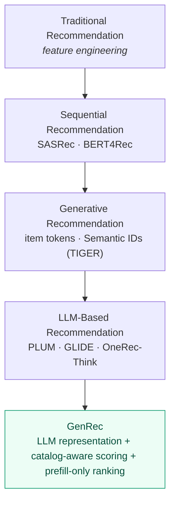

<p class="panel-note" style="text-align:center;">A conceptual evolution of the field — not a claim that each approach evolved directly from the one before it.</p>

The through-line: most of these approaches increasingly frame recommendation as *"generate the next item."* GenRec reframes it as something else entirely —

> Given a user, context, history, and catalog, directly **score and rank** the available items.

To make that reframing precise, it helps to see how the paper actually *defines* the problem.

---

## The Full-Catalog Ranking Problem {#problem-setting}

Underneath the architecture is a clean formal setup. Stripped to plain language, Netflix wants to answer:

> Given this member, at this moment, in this context, which items in the catalog should be ranked highest?

The paper makes that precise with a small amount of notation. (Unicode below — nothing here needs LaTeX.)

### The Ingredients

- **Users.** <code>U</code> is the set of users; a specific user is <code>u ∈ U</code>.
- **Catalog.** <code>C</code> is the catalog of items — movies, shows, games, live events, podcasts, and other supported content. A specific item is <code>i ∈ C</code>.
- **Context space.** <code>X</code> is the space of possible recommendation contexts; a specific context is <code>τ ∈ X</code>. Context can include device, recommendation surface, locale, and time of day — the *same* user may want different things in different situations.
- **Time.** A request happens at time <code>t</code>. This matters because preferences, availability, popularity, and recent behavior all drift over time.
- **Interaction history.** <code>H</code> is the user's interaction history *prior to* time <code>t</code> — the behavioral signals accumulated before this request.
- **Item metadata.** Each item <code>i ∈ C</code> carries metadata <code>Mᵢ</code> — title, genre, synopsis, release date, and other item information.

### The Request and the Ranking Function

A single recommendation request is then the tuple:

<div class="info-panel" role="group" aria-label="Recommendation request">
  <p class="panel-label">A Recommendation Request</p>
  <p class="panel-extra"><code>(u, τ, t, H)</code> &nbsp;=&nbsp; user + context + current time + history</p>
  <p class="panel-note">From this, the system must produce a ranking over the catalog.</p>
</div>

The recommender is a **ranking function** <code>π</code> over the catalog:

<code>π : C → {1, …, |C|}</code>, where <code>π(i)</code> is the **position** assigned to item <code>i</code>.

In plain English: <code>π</code> orders the catalog, and <code>π(i) = 1</code> means item <code>i</code> sits at the very top of the list. A quick but important distinction — this is the **full-catalog** ranking view; in practice, when a **candidate set** is supplied upstream, the same function ranks *within that set* rather than over all of <code>C</code>. The scoring machinery is identical; only the set it ranks over changes.

### The Objective: Expected Long-Term Member Utility

This is the part I'd underline. The goal is **not** "maximize clicks" or "maximize immediate watch time." The paper frames the objective as choosing the ranking that maximizes **expected long-term member utility** — a proxy for member satisfaction, continued engagement, and retention. Conceptually:

<div class="info-panel" role="group" aria-label="Objective">
  <p class="panel-label">The Objective (Paper's Framing)</p>
  <p class="panel-extra"><code>π* = arg max<sub>π</sub> &nbsp;E[ Long-Term Member Utility ]</code></p>
  <p class="panel-note">I'm writing the argmax as an intuitive formalization; the point the paper makes is the <em>target</em> — long-term utility, not short-term engagement.</p>
</div>

The reason this distinction matters:

> Short-term engagement is not the same as long-term member value.

A ranking optimized purely for immediate engagement could keep serving the most instantly-clickable content. A production system also has to care about discovery, catalog exploration, sustainable engagement, satisfaction, and retention. That's precisely the tension the paper's [reward signals](#training-objectives) are designed to resolve — this problem statement is where that later machinery gets its target.

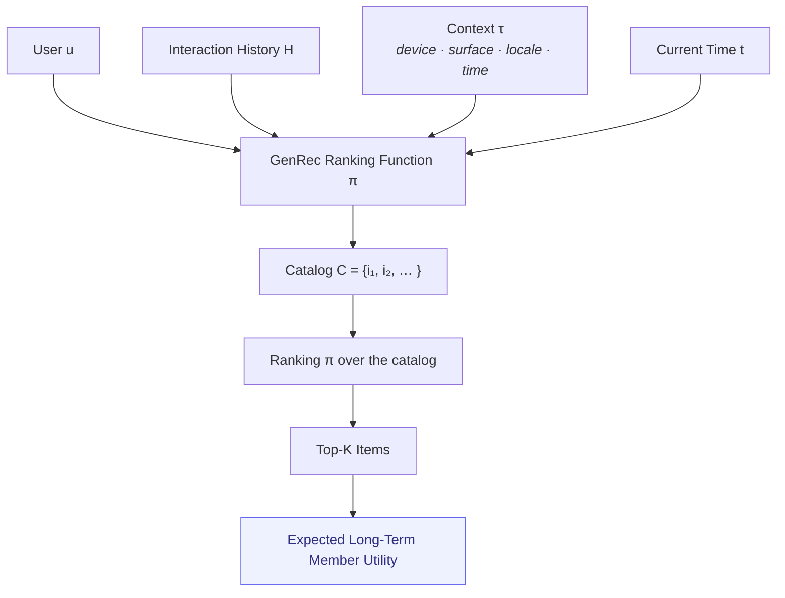

<p class="panel-note" style="text-align:center;">Recommendation here is <em>contextual</em>: not "user → favorite movie," but a ranking conditioned on user + history + context + time + catalog.</p>

### Why This Framing Clarified GenRec for Me

Seeing the problem stated this way made something click. Netflix isn't asking the model a generic question like *"what would this user enjoy?"* It's asking something far more specific:

> Given this member's history, this exact context, this moment in time, and the available catalog, how should the entire catalog be ordered — for long-term value, not just the next click?

With that target in hand, GenRec's design stops looking arbitrary and starts looking inevitable. So let's look at the design itself.

---

## Enter GenRec {#enter-genrec}

At a high level, GenRec's idea is almost disarmingly simple to state.

Rather than manually engineering every feature and interaction, Netflix transforms user history, item information, and context into **textual or lightly structured representations** that an LLM can process — and then adds a ranking mechanism on top of that model to score the catalog.

Conceptually, the flow looks like this:

```text
User History
      +
Item Metadata
      +
Context
      ↓
Verbalization / Context Engineering
      ↓
Tokens
      ↓
Netflix-Aware LLM
      ↓
Catalog-Aware Ranking Head
      ↓
Scores for the Catalog
      ↓
Ranked Recommendations
```

Two things are worth noticing before we go deeper.

First, the *inputs* to the model are no longer a fixed feature vector — they're a verbalized representation that can flex as the platform changes. Adding a new signal can look more like "describe it in the context" than "re-architect the model."

Second, the *output* is not a generated sentence. There's a dedicated ranking head that turns the model's internal representation into scores over catalog items. The LLM is doing understanding; the head is doing ranking.

The rest of this article is essentially an unpacking of that diagram — how the model is trained, how verbalization works, why the ranking head matters, and why the recommendation is *scored* rather than *generated*.

---

## Why Not Just Use an Out-of-the-Box LLM? {#why-not-off-the-shelf-llm}

Before unpacking how GenRec is trained, it's worth answering the obvious objection — the one the paper itself is really responding to.

Modern LLMs are extremely capable. So why not just hand one a member's viewing history and ask:

> "What should this member watch next?"

The paper's motivation is essentially a catalogue of why that intuitive approach breaks for a production recommender. Four problems stand out.

### Problem 1 — Global Popularity Doesn't Equal Personal Relevance

An off-the-shelf LLM is trained on broad, internet-scale text. Its sense of movies and shows is shaped by *global* popularity and by whatever is well-documented online. Ask it for "shows like a crime drama" and it will lean toward globally famous titles.

But recommendation isn't asking *"what is popular in general?"* It's asking:

> What is the best item for **this** member, in **this** context, from the **available** catalog?

A globally popular title can be a poor recommendation for a specific member. To rank well you need individual viewing behavior, member preferences, situational context, the actual Netflix catalog, and the platform's objectives — none of which a generic model holds by default.

### Problem 2 — Out-of-Catalog Recommendations

A generic model also knows about content that isn't relevant to the catalog it's supposed to rank from. Asked to *generate* a recommendation, it can happily name:

- A title that lives on a different streaming service
- Something no longer available
- Something not licensed in the member's market
- A title that simply isn't in the current candidate set

For a production system, that's disqualifying. A recommender must rank from **valid candidate items** — and this is exactly why GenRec doesn't ask the model to *say* a title. Its learned representation is instead used to **score candidates** from the catalog. That structural constraint is the whole point of the [catalog-aware ranking head](#catalog-aware-ranking) — generic text generation gives you no such guarantee.

### Problem 3 — Business and Platform Constraints

Ranking quality isn't a production system's only objective. Netflix has business and product constraints that have to be reflected in what gets recommended — the paper explicitly discusses aligning the model with **Netflix-specific objectives and long-term member satisfaction**, not just "predict the next click."

That's a fundamentally different target from the one a general-purpose LLM is trained on. A generic LLM is optimized to predict language; a production recommender needs ranking behavior aligned with the platform's goals. We unpack how the paper does this in [Training Objectives and Reward Signals](#training-objectives).

### Problem 4 — Limited Native Personalization

A general model may know *what* Mindhunter and Dark are, which genres they belong to, and who tends to like them. What it doesn't know is how a **specific member** actually behaves:

- Watches psychological thrillers mostly at night
- Reaches for documentaries on weekends
- Abandons long-running series but finishes short limited ones
- Follows particular patterns in particular sessions

These are platform-specific behavioral signals. The model has to *learn* how Netflix members interact with content — which is precisely where Netflix-specific adaptation comes in.

### The Core Solution — Adapt the LLM to Netflix

So GenRec's answer isn't "deploy a generic LLM as a recommender." It's to **adapt** the model — moving it from broad, generic world knowledge to a model grounded in Netflix's catalog, its members' behavior, the recommendation context, and the platform's objectives.

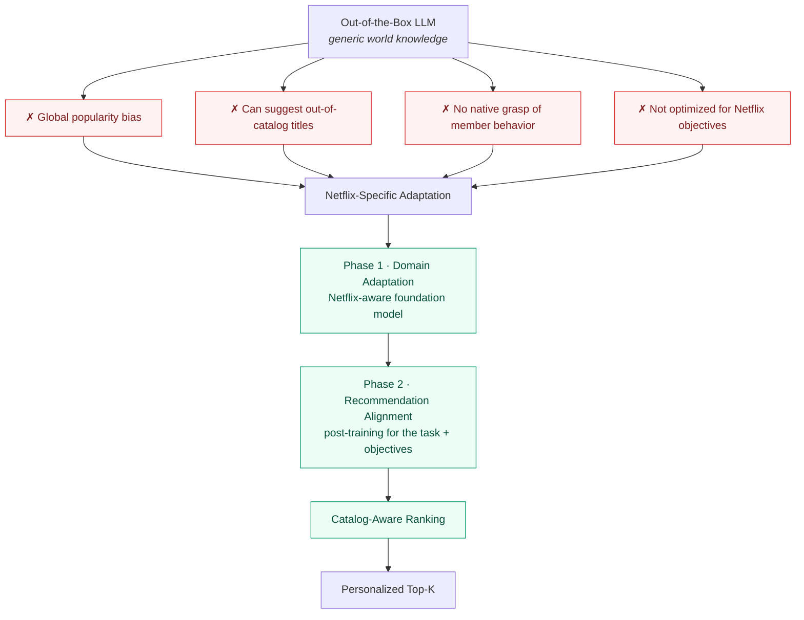

The paper frames this adaptation as an **LLM-centric, two-phase training framework**:

- **Phase 1 — Domain adaptation.** Teach the model the domain it will operate in: Netflix content, member interaction patterns, and recommendation-specific context. *(Unpacked in detail just below.)*
- **Phase 2 — Recommendation-specific post-training.** Further optimize the adapted model for the actual ranking task and Netflix's objectives, including long-term member satisfaction.

I'm keeping this deliberately brief here because the [next section](#two-phase-training) walks through both phases properly — this is just the *why* that motivates them.

### What Does GenRec Actually Contribute?

Stepping back, it's worth stating the paper's contributions plainly — a roadmap for the rest of this article:

1. **LLM-backed ranking.** The LLM acts as a powerful *representation backbone*, not a title generator; that representation is wired into catalog-aware scoring.
2. **A two-phase, LLM-centric training framework.** A clean separation between domain adaptation (continued training on Netflix data) and recommendation-specific post-training/alignment — [detailed next](#two-phase-training).
3. **Competitive performance against a mature production system.** The LLM-backed ranker reaches competitive results versus an established production recommender — reportedly with **~40× fewer Phase-2 labeled examples** and a **~+1.6% relative MRR** improvement in the paper's tested configuration. (Numbers and caveats live in [Does It Actually Work?](#training-objectives).)
4. **Catalog-aware scoring.** Combining a user + context representation with learned item/catalog representations to score candidates directly — avoiding unconstrained text generation. ([The mechanics](#catalog-aware-ranking).)
5. **A shift toward context-driven representation.** A move away from hand-engineered features toward verbalized behavioral and contextual information the model processes directly. *A note on terminology:* "context engineering" is the framing **I** use throughout this article for that shift — I'm not presenting it as an official contribution title from the paper.

The interesting thing about GenRec is that Netflix isn't trying to turn a chatbot into a recommender. It's taking what an LLM is exceptionally good at — building rich representations from heterogeneous contextual information — and connecting that representation to a recommendation-specific scoring architecture.

Which raises the natural next question: *how* do you turn a general-purpose LLM into a Netflix-specific recommendation model? That's the two-phase framework.

---

## The Two-Phase Training Architecture {#two-phase-training}

One of the most clarifying parts of the paper is how it separates training into two phases. This separation is doing a lot of quiet work.

### Phase 1 — Building a Netflix-Aware Foundation Model

Phase 1 does not start from scratch. Netflix takes an **open-source LLM** and adapts it on **proprietary Netflix data** to build a foundation model that understands the domain.

```text
[ Open-Source LLM ]
          +
[ Proprietary Netflix Data ]
          ↓
[ Netflix-Aware Foundation Model ]
```

The crucial thing to internalize is that Phase 1 is *not* building a recommendation ranker yet. It's building a broader, Netflix-aware base with capabilities like:

- **User understanding** — how behavior maps to preference
- **Content understanding** — what titles are and how they relate
- **Personalization** — conditioning on an individual's signals
- **General language capability** — the broad competence the base model already brings

Think of this as a shared substrate that understands the domain deeply, without being narrowly specialized to one task. Because it encodes durable knowledge about users and content, it's intended to be updated at a **relatively lower cadence** — it's the expensive, slow-moving part. Phase 2 then sits on top of it.

### What "Netflix Data" Actually Looks Like

It helps to make this concrete. A recommender's raw input is a stream of interaction signals — who watched what, when, on which device, and how they engaged. Something like this (fictional, and deliberately simplified):

<div class="info-panel" role="group" aria-label="Illustrative raw member interaction signals">
  <p class="panel-label">Raw Member Interaction Signals · Member: User_01</p>
  <div class="signal-grid">
    <div class="signal-item">
      <p class="signal-time">May 12 · 9:05 AM</p>
      <p class="signal-meta"><strong>Mindhunter</strong> · iPad · Played · 48 min</p>
    </div>
    <div class="signal-item">
      <p class="signal-time">May 12 · 10:02 PM</p>
      <p class="signal-meta"><strong>Mindhunter</strong> · TV · Played · 2 hr</p>
    </div>
    <div class="signal-item">
      <p class="signal-time">May 14 · 9:15 PM</p>
      <p class="signal-meta"><strong>Dark</strong> · TV · Played · 1 hr 35 min</p>
    </div>
    <div class="signal-item">
      <p class="signal-time">May 15 · 8:30 AM</p>
      <p class="signal-meta"><strong>Wednesday</strong> · Tablet · Added to My List</p>
    </div>
    <div class="signal-item">
      <p class="signal-time">May 17 · 11:00 PM</p>
      <p class="signal-meta"><strong>Stranger Things</strong> · TV · Played · 3 hr</p>
    </div>
    <div class="signal-item">
      <p class="signal-time">Ongoing</p>
      <p class="signal-meta">Thumbs up · abandoned playback · list adds · rewatches</p>
    </div>
  </div>
  <p class="panel-extra"><strong>Additional signals in the mix:</strong> time of day · device · locale · recommendation surface · historical viewing behavior · item metadata · popularity trends.</p>
  <p class="panel-note">Illustrative, fictional data for explanation only — not real Netflix member data.</p>
</div>

A traditional stack turns this stream into engineered features and feature interactions. GenRec takes a different route — but note *where* that route belongs.

### From Raw Signals to Language

The step that turns these logs into something an LLM consumes is **verbalization**, and it's worth being precise: the paper describes this transformation as part of the **Phase 2** recommendation-specific methodology, not a vague property of Phase 1. Interaction history, context, the user's profile/history, item-level information, and the recommendation task get folded into a single- or multi-turn **conversational (or lightly structured) representation**. The "assistant" side of that representation captures actual engagement or feedback — play, play duration, abandonment, thumb feedback — which is what becomes the training signal.

Conceptually:

```text
RAW INTERACTION LOGS
        ↓
VERBALIZATION / CONTEXT ENGINEERING
        ↓
```

<div class="info-panel" role="group" aria-label="Illustrative verbalized context">
  <p class="panel-label">Verbalized Context · Illustrative</p>
  <p class="verbalized">"On May 12 around 9 AM, the member watched <strong>Mindhunter</strong> on an iPad. Later that evening they continued <strong>Mindhunter</strong> on a TV for about two hours. Over the next few days they watched <strong>Dark</strong> and <strong>Stranger Things</strong>, mostly during late-evening sessions, and added <strong>Wednesday</strong> to their list."</p>
  <p class="panel-note">Illustrative phrasing to show the idea — not the literal production prompt used by Netflix.</p>
</div>

The contrast with the traditional path is the whole point:

```text
TRADITIONAL RECOMMENDER
Raw Logs → Feature Engineering → Feature Vectors → Discriminative Ranker

GENREC
Raw Logs → Verbalization / Context Engineering → Textual or Lightly
Structured Context → Netflix-Aware LLM → Recommendation Ranking
```

Both start from the same raw logs. One spends its effort hand-designing a feature vector; the other spends it deciding what the model should *read*. That decision — what deserves a place in the context — is a deep enough idea that I've given it [its own section below](#context-engineering); for now it's enough to see that verbalization is where feature engineering starts turning into context engineering.

### Phase 2 — Recommendation-Specific Post-Training

With the foundation model in place and interactions verbalized, Phase 2 post-trains the model specifically for **ranking**. This is where broad Netflix understanding gets pointed at a concrete task.

```text
PHASE 1                          PHASE 2
Build broad Netflix          →   Turn the foundation model
understanding                    into a recommendation ranker

• User understanding             • Ranking quality
• Content understanding          • Recommendation steering
• Personalization                • Recommendation-specific objectives
• Language capability            • Business alignment
                                 • Long-term member satisfaction
```

The two phases deliberately run at **different cadences**. Phase 1 — durable knowledge about users and content — changes slowly. Phase 2 can be refreshed far more often to track:

- **New content** launches
- **Evolving popularity** and trends
- **Changing member interests**

That split is the answer to the question that got me into the paper. Netflix doesn't have to rebuild a whole recommendation architecture every time the problem shifts. It can **reuse a shared foundation** and re-tune the lighter, faster-moving layer on top — a very different maintenance story from "new problem → new model."

Phase 2 isn't a single generic "fine-tune," either. The paper describes combining a **recommendation-ranking objective** with a **language-modeling objective**, and then shaping the ranking objective with **reward signals** so the system optimizes for the right outcomes rather than raw engagement. That objective-and-reward machinery is important enough that I unpack it in [Training Objectives and Reward Signals](#training-objectives) further down.

---

## From Feature Engineering to Context Engineering {#context-engineering}

This is the section I think matters most, so I want to slow down here.

**Context engineering** is the discipline of deciding what information to place into the model's input, and how to represent it, so that a finite context window carries the highest-signal picture of the user and situation.

Raw recommendation signals — logs, timestamps, IDs, interactions — get *verbalized* into a representation the LLM can reason over. But this is emphatically **not** "just dump everything into text." A context window is a budget, and every token spent on low-value information is a token not spent on something that matters.

So the real work becomes a set of editorial decisions:

- **Selecting important events** and dropping the noise
- **Removing low-signal interactions** that don't move the prediction
- **Compressing repetitive behavior** ("watched 40 episodes of one show" needn't be 40 lines)
- **Keeping richer detail for high-value interactions**
- **Prioritizing recent history**, which usually carries more predictive weight
- **Compressing older history** into something denser and more summary-like
- **Operating within a finite token budget** at all times

Here's the reframing that stuck with me:

> The prompt starts to behave like the new feature vector.

In the old world, the central question was *"what features should we engineer?"* In GenRec's world, it becomes *"what information deserves a token?"*

That's not a smaller problem — it's a *different* one, and arguably a more general one. Feature engineering asks you to anticipate every interaction in advance and encode it. Context engineering asks you to curate evidence and let a capable model do the interacting. The complexity doesn't vanish; it moves to a place where a single backbone can absorb it.

---

## How GenRec Actually Ranks Netflix's Catalog {#how-genrec-works}

Let's turn the diagram into a mechanism. I find it cleanest to think in three conceptual stages.

### Step 1: Verbalization

Interaction history, context, and item information are transformed into text (or lightly structured text). This is the context-engineering step from the previous section — the point where signals become tokens.

### Step 2: Pooled Representation

The decoder-only LLM processes that context and produces a **hidden representation** that summarizes the user's preferences and situation.

Intuitively: the model reads the whole verbalized context and distills it into a dense vector that says, in effect, *"this is what this user, right now, on this surface, is likely to want."* It's a learned summary of taste-in-context, not a sentence.

### Step 3: Catalog-Aware Scoring

Here's the key architectural insight: the model **does not need to generate** each recommended title token by token.

Instead, a ranking head takes that pooled representation and uses it to **score catalog items** — comparing the user/context vector against learned item representations to produce a relevance score per candidate. Rank by score, and you have your recommendations.

### The Full Architecture, End to End

Those three stages line up into a single inference path. This is the diagram I'd hand someone who wanted the whole picture on one screen — heterogeneous signals in at the top, a ranked list out at the bottom, and exactly one forward pass through the Transformer in between.

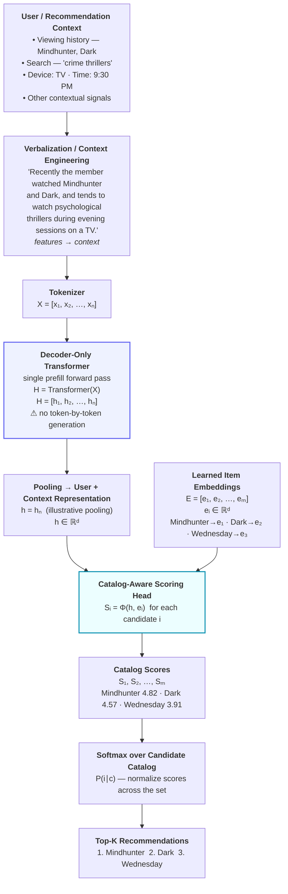

The exact formulation is the paper's to define, but here is the notation the diagram is compressing, written out precisely:

<div class="info-panel" role="group" aria-label="GenRec scoring notation">
  <p class="panel-label">The Scoring Path, Precisely</p>
  <p class="panel-extra"><strong>Encode:</strong> <code>H = Transformer(X)</code>, producing hidden states <code>H = [h₁, h₂, …, hₙ]</code> in one prefill pass over the token sequence <code>X = [x₁, …, xₙ]</code>.</p>
  <p class="panel-extra"><strong>Pool:</strong> a single user/context representation <code>h ∈ ℝᵈ</code> is taken from the processed sequence. I write it as the final position <code>h = hₙ</code> for concreteness — treat the exact pooling choice as the paper's to specify.</p>
  <p class="panel-extra"><strong>Score</strong> each candidate item <code>i</code> against learned item embeddings <code>eᵢ ∈ ℝᵈ</code>: &nbsp; <code>Sᵢ = Φ(h, eᵢ)</code>.</p>
  <p class="panel-extra"><strong>Normalize</strong> across the candidate catalog <code>C</code>: &nbsp; <code>P(i ∣ c) = exp(Sᵢ) ∕ Σⱼ exp(Sⱼ)</code>, &nbsp; summed over <code>j = 1 … |C|</code>.</p>
  <p class="panel-note">Note the denominator sums the item <em>scores</em> Sⱼ over the candidate catalog — not hidden states. Scores like 4.82 / 4.57 / 3.91 are illustrative, not real Netflix values, and <code>Φ</code> stands in for whatever scoring function the paper defines.</p>
</div>

Read top to bottom, the message is the one the rest of this section builds on: the model does **not** emit "M… i… n…" token by token. It reads the context once, pools a representation, and the [catalog-aware head](#catalog-aware-ranking) turns that representation into scores over the candidate set. Context → representation → scores → Top-K.

That third step is where GenRec quietly departs from the "LLM = text generator" mental model — which is exactly the confusion worth clearing up next.

---

## Why a Decoder-Only LLM Does Not Generate the Recommendation {#decoder-only-not-generating}

This is the point that trips people up, and it tripped me up too when I first reasoned through it.

The natural objection is:

> "If the backbone is a decoder-only, autoregressive Transformer, why isn't Netflix generating the recommendation one token at a time?"

The resolution comes from separating two ideas that the word "autoregressive" carelessly conflates:

**1. Autoregressive model architecture.** The Transformer is decoder-only and causal. During training, each position attends only to earlier positions, and the model is structured and pretrained in the usual autoregressive way. This is a property of *how the network is built and trained*.

**2. Autoregressive decoding during inference.** Generating text token-by-token — sample a token, append it, run the model again, repeat — is a *usage pattern at inference time*. It is one thing you can do with such a model. It is not the only thing.

GenRec keeps (1) and drops (2) for the ranking path. The backbone is still a causal decoder-only Transformer. But for ranking, the system **consumes the context and uses the resulting internal representation for scoring**, rather than entering a generation loop.

The ranking head is what makes this legitimate: it changes *what you do with the representation the backbone produces*. You don't need the model to spell out "M-i-n-d-h-u-n-t-e-r" to recommend Mindhunter. You need a representation of the user, and a way to score Mindhunter against it.

Say it once more, plainly, because it's the crux of the whole design:

**Autoregressive architecture ≠ autoregressive decoding.** GenRec keeps the former and, for ranking inference, skips the latter. Put differently, the *model architecture* and the *inference strategy* are two separate design decisions — a chatbot pairs an autoregressive backbone with autoregressive decoding, but nothing forces ranking to.

### The Moment This Architecture Clicked for Me

I'll be honest: when I first read "decoder-only LLM with a ranking head," my brain resisted it. My mental model of a decoder-only Transformer was welded to autoregressive text generation — that's what I'd seen it *do*.

What unstuck me was remembering how we actually use Transformers for most NLP tasks. We rarely ask the model to *generate* the answer as text. We take the backbone's learned representations and attach a small **task-specific head**:

```text
BERT / Transformer Backbone          Transformer Backbone
        ↓                                    ↓
  Classification Head                 Token Classification Head
        ↓                                    ↓
  Sentiment: Positive                 PERSON / LOCATION / ORG (per token)
```

In sequence classification you don't spell out "P-o-s-i-t-i-v-e" token by token — you pool a representation and run it through a classification layer. In named-entity recognition you attach a prediction layer to each token's representation. The backbone produces representations; the head decides what to do with them. (This is exactly the pattern from [my notes on BERT](/learning-lab/bert-pretraining-deep-bidirectional-transformers/) — a pretrained backbone plus a light head for the downstream task.)

Once I framed GenRec that way, it stopped being exotic:

```text
LLM Backbone                          LLM Backbone
        ↓                                    ↓
  Pooled Rep  →  Classification         Pooled User + Context Rep
        ↓                                    ↓
  Positive / Negative                   Catalog-Aware Ranking Head
                                              ↓
                                        Recommendation Scores
```

Same skeleton — backbone → representation → task head. The only thing that changes is the head's job: instead of predicting `Positive/Negative` or `PERSON/LOCATION/ORG`, it scores items from a catalog. I want to be careful not to overstate the analogy — GenRec is not literally a BERT classifier, and the backbone here is a causal decoder-only model, not a bidirectional encoder. But the *shape* of the idea transfers, and that's what made it click. **A Transformer being autoregressive does not mean every downstream application must generate outputs autoregressively.**

### Two Ways to Use the Same Transformer

The contrast is easiest to see side by side. First, classic autoregressive decoding — the output of one step becomes the input to the next:

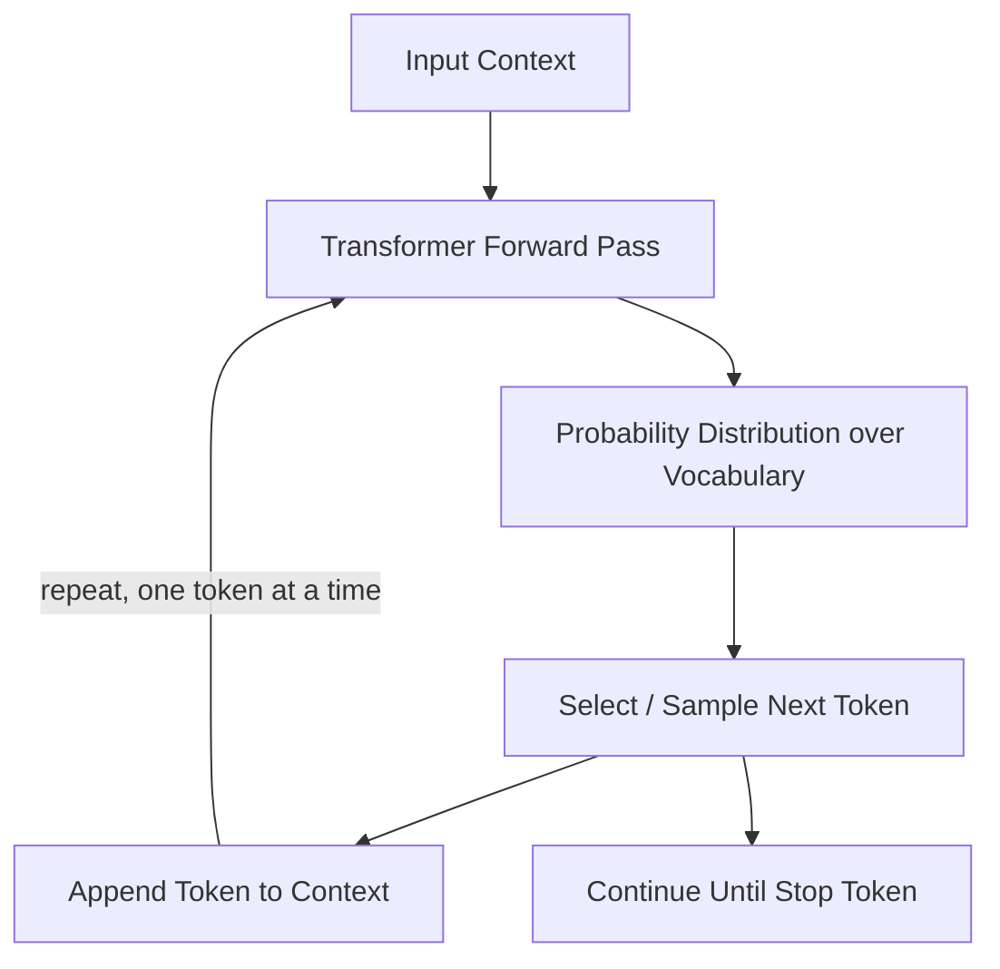

Each generated token depends on the growing sequence, so generation proceeds *sequentially*: token₁ → token₂ → token₃. Modern serving uses **KV caching** so each step doesn't recompute the entire past context — but it's still a step-by-step loop, because the next token genuinely depends on the ones already produced.

Now GenRec's ranking path, which never enters that loop:

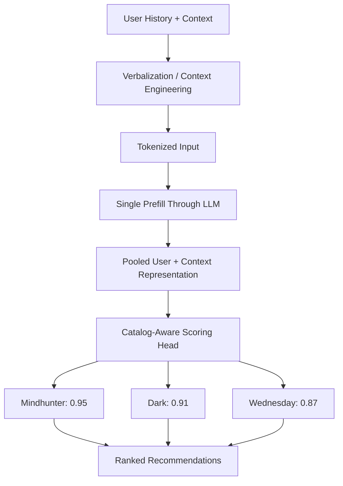

The whole context is processed in a **prefill / forward computation** to get the pooled representation; the head scores candidates from that representation directly. The two shapes reduce to:

```text
AUTOREGRESSIVE          Context → Forward Pass → Token → Forward Pass → Token → …

GENREC                  Context → Prefill / Representation → Catalog Scoring → Ranking
```

### What "Single Pass" Actually Means

To be precise: "single pass" or "prefill-only" doesn't mean the Transformer performs one tiny arithmetic operation. The input sequence is still processed through all the layers of the causal Transformer to produce hidden representations — that's real work over a potentially long context.

What it means is that the recommendation path **does not then enter a long autoregressive generation loop** — generate a token, append it, decode again, repeat. Instead, the relevant pooled representation is handed to the [catalog-aware ranking head](#catalog-aware-ranking), which scores the candidate set. The scores (illustratively, `Mindhunter 0.95 · Dark 0.91 · Wednesday 0.87`) are comparisons between the user/context representation and learned item embeddings — the exact scoring formulation is the paper's to define; those numbers are just for intuition.

The engineering payoff of skipping the loop — and why this matters at Netflix's request volume — is the subject of [Why Netflix Avoids Autoregressive Decoding](#avoiding-autoregressive-decoding) and [Prefill-Only Inference](#prefill-only-inference) just ahead. The point to carry out of *this* section is narrower and conceptual: GenRec uses a Transformer capable of autoregressive modeling, but for ranking it produces item scores directly from the prefill representation instead of generating a recommendation token by token.

---

## The Catalog-Aware Ranking Head {#catalog-aware-ranking}

So what is this "head," concretely? Intuitively, it's a scoring layer that sits on top of the backbone and turns understanding into an ordering.

The pieces fit together like this:

- The **LLM produces a representation** of the user's preference and context (the pooled vector from Step 2).
- Each **catalog item has a learned representation** — an embedding that captures what that title *is*.
- The **scoring head combines** the user/context representation with item representations — think of it as a compatibility score between "what this user wants now" and "what this title offers."
- The system produces **scores across the catalog** (or a candidate set).
- A **ranking** falls out of sorting by those scores.

Visually:

```text
                 User + Context
                       │
                       ▼
              ┌────────────────┐
              │ Decoder-Only   │
              │ Transformer    │
              └────────────────┘
                       │
                       ▼
             User Preference Vector
                       │
                       ▼
              Catalog-Aware Head
                 /     |     \
                ▼      ▼      ▼
            Mindhunter Dark  Wednesday
              0.95     0.91     0.87
```

The elegance here is the division of labor. The heavy, general work — understanding the user and the content — happens once, in the backbone. The head is comparatively cheap: given the user vector, scoring items is a matter of comparing against item representations. That's what makes scoring the *catalog* tractable in a way that generating titles never would be.

---

## One Model, Millions of Personalized Contexts {#one-model-many-contexts}

*This section is mostly my own interpretation and some outside research — an attempt to reason about the architecture, not a set of claims lifted from the paper. I'll flag what's paper-supported, what's a reasonable architectural inference, and what's my own reading.*

Here's the question that nagged at me once the mechanism clicked:

> Wait — if this is **one shared LLM**, how does it possibly know what *I personally* like? And how does it handle the fact that my catalog in one country isn't the same as someone else's in another?

Netflix has hundreds of millions of members across many countries. Training a separate model per user — or even per region — would be computationally impractical and structurally redundant. So the resolution has to be that the *weights are shared* and the *situation is supplied per request*. The paper's design (a shared backbone plus verbalized, context-driven inputs) is consistent with exactly that. Let me reason through how one model can still produce a different answer for each of us.

### Shared Weights, Different Context

The key realization is that a shared model does **not** imply a shared answer. The weights encode general capability — how to read behavior, how to relate titles. The *context* encodes the specific situation. Change the context, and the model's output changes, without touching a single weight.

```text
                 Shared LLM Backbone
                         │
          ┌──────────────┼──────────────┐
          ▼              ▼              ▼
        User A         User B         User C
        Context        Context        Context
          │              │              │
          ▼              ▼              ▼
      Personalized   Personalized   Personalized
      Representation Representation Representation
          │              │              │
          ▼              ▼              ▼
       Different       Different      Different
       Ranking         Ranking        Ranking
```

Crucially, this does **not** mean the model has memorized each member by storing a private network for them. It means the model receives a *different view of the world* on every request. Same weights, different input, different pooled representation — which is precisely the [pooled representation from Step 2](#how-genrec-works), just viewed from the angle of "who is this for?"

> Same model weights ≠ same recommendation.

### Personalization via In-Context History

Concretely, for a given request the system can assemble that member's own signals — what they watched, for how long, whether they finished or abandoned it, thumb feedback, time, device, recent behavior — and verbalize them into the context (the [verbalization step](#context-engineering) we walked through earlier). The model then distills that into a pooled representation summarizing *this* member's taste right now.

Two members, same model, different inputs:

```text
USER A                                USER B
"Recently watched Mindhunter and      "Recently watched Wednesday and
Dark. Tends toward crime and          Stranger Things. Leans supernatural
psychological thrillers in            and teen-oriented, mostly on
evening sessions."                    weekends."
        │                                     │
        ▼                                     ▼
   Same Shared LLM                       Same Shared LLM
        │                                     │
        ▼                                     ▼
   Representation A                      Representation B
```

The model isn't *remembering* User A by baking their history into its weights — I'm deliberately avoiding that word. It's *reading* User A's history at request time. That distinction is the whole trick: personalization lives in the input, not in a per-user copy of the network.

This is where a phrase from earlier in the article earns a sharper form. In a traditional system you'd assemble `User ID + Watch History + Device + Time + Locale + Item Features → feature vector → model`. In GenRec, that becomes `history + context + metadata → verbalization → tokens → shared LLM → user/context representation`. My own framing of it:

> The prompt becomes the personalized feature vector.

To be clear, that's *my* interpretation of the design, not necessarily terminology the GenRec authors use. But it captures the shift: the personalized "feature vector" is reconstructed on the fly, in text, for every request.

### Two Different Problems: Preference vs Availability

Regional behavior is where I want to be most careful, because it's tempting to collapse it into "just put the country in the prompt." I think it's actually two distinct problems, solved by two different mechanisms.

**1. Regional preference (a context problem).** If locale, language, or region is part of the information the model sees, the same backbone can produce region-flavored representations — reflecting local trends and culturally relevant tastes. The paper's context representation is documented to carry contextual metadata such as time and device; whether the literal production prompt always contains an explicit `Country: India` field is an implementation detail I can't confirm from the paper, so I'll frame it conceptually: *assuming regional signals are part of the context, the shared model can adapt its representation to them.*

**2. Content availability (a candidate-set problem).** This one is not about taste at all. Two members with identical preferences may simply have different catalogs — licensing and distribution differ by country, and deals shift over time (a title Netflix streams in one region may be licensed to a competing service, and therefore absent, in another). No amount of preference modeling should surface a title a member literally cannot play.

The cleanest way I've found to hold these apart:

```text
PREFERENCE                          AVAILABILITY
What is this member likely          Which titles are even valid
to enjoy?                           candidates for this request?
        │                                   │
        ▼                                   ▼
Handled via context →               Handled via the candidate
different pooled representation      set the scoring head ranks over
```

The paper describes a catalog-aware scoring head that scores items using the pooled user/context representation and learned item embeddings — and, notably, it already frames scoring as operating over the catalog *or a candidate set*. That candidate-set framing is the natural hook for availability. Here's how I'd reason about it, labeled clearly as a production-system interpretation rather than a documented GenRec detail:

```text
                     User Request
                          │
                          ▼
              User + Context Representation
                          │
                          ▼
              Relevant Candidate Catalog
                          │
                  ┌───────┴───────┐
                  ▼               ▼
             Available        Not Available
             Candidates        (excluded)
                  │
                  ▼
              Catalog-Aware Scoring
                  │
                  ▼
            Regionally Valid Ranking
```

> **Architectural interpretation, not a paper claim:** in a production recommender, regional availability can be enforced by *defining or filtering the candidate set* before or during ranking, so the head only scores titles that are actually licensed and available for that member. The paper describes the catalog-aware scoring head and the candidate set; it does not, as far as I can verify, state that this head filters titles by regional licensing. I'm inferring that a real deployment would enforce availability at the candidate-set boundary.

Keeping these two mechanisms separate matters because it makes the design *precise*: preference is shaped by what enters the context; availability is enforced by what enters the candidate set. Conflating them ("put the country in the prompt and hope") would be both weaker and less honest about how such systems actually stay correct.

### The Model Is Shared. The Context Is Personal.

Step back and the whole section reduces to one line:

> The model is shared. The context is personal.

The weights give the general learned capability. The context gives the situation — and, at the candidate-set boundary, the constraints. That's how a *single* unified model can, at least in principle, adapt to a different member, in a different country, at a different moment, largely on the strength of what it's reading.

And this is the same thesis the whole article keeps circling. The engineering question stops being *"how do I build a separate model for every user segment or region?"* and becomes *"how do I construct the right information — and the right candidate set — for this model, for this member, in this situation, right now?"* The model is shared; the feature representation is reconstructed, per request, through context.

---

## The Question GenRec Left Me With: What Should the Model Remember? {#the-memory-question}

<div class="info-panel" role="note" aria-label="My interpretation">
  <p class="panel-label">My Interpretation — Beyond the Paper</p>
  <p class="panel-extra">The section below builds on GenRec's architecture but goes past what the paper explicitly describes. These are my own observations — assembled from the paper, other technical reading, and my own reasoning — about how <strong>context, memory, and long-term preference</strong> could be handled in an LLM-based recommendation system. I'll flag which parts are paper-supported and which are my extension as I go.</p>
</div>

Understanding GenRec's architecture answered one question for me: how can a decoder-only LLM act as a recommendation ranker *without* generating the recommendation token by token? Once that clicked — context in, single forward pass, catalog-aware scoring out — it immediately created another question.

If personalization increasingly happens through **context** rather than through per-user models, then the interesting problem moves. It stops being *"how big can the context window get?"* and becomes:

> How much of a user's history should you actually put into that context — and in what form?

### Recent Intent vs Long-Term Interest

Here's the tension that makes this hard. A Netflix member can carry years of history — thousands of viewing events, shifting phases, temporary binges, and a few genuinely persistent preferences. You cannot pour all of it into every request. But if you keep only the *recent* slice, the model can quietly forget who the user is over the long run.

Concretely: suppose someone spent the last month on light comedies, reality TV, and romantic series — but across the previous few *years* returned again and again to true crime, psychological thrillers, and neo-noir. If a major new crime documentary drops tomorrow, a system looking only at the last month may rank it low. The recent window says "comedy person." The long arc says "this is exactly their thing."

So the design has to hold two different questions at once:

- **Recent history** answers: *What is this user into right now?* Is a session underway? Has behavior shifted? What's relevant this evening, on this device?
- **Long-term history** answers: *What has this user consistently returned to?* What dormant interests shouldn't be written off after one month of something else?

These aren't the same signal, and collapsing them loses information. One month of romantic comedies should not erase a multi-year affinity for true crime — it should sit *alongside* it as a temporary shift in intent.

### A Hierarchical Memory Strategy (My Framing)

The way I've come to think about it is as **information at different levels of granularity** — closer to a memory hierarchy than a flat log. To be clear: *this is my conceptual framing.* I'm not claiming the GenRec paper specifies this exact hierarchical-memory design.

**Recent history — high granularity.** Recent interactions stay detailed, because detail is what tells you about *current* intent:

<div class="info-panel" role="group" aria-label="Illustrative recent history">
  <p class="panel-label">Recent History · Detailed (Illustrative)</p>
  <p class="panel-extra"><strong>Yesterday</strong> — <span class="verbalized">Watched <em>Emily in Paris</em>, S4E1, 45 min, on iPad.</span></p>
  <p class="panel-extra"><strong>Three days ago</strong> — <span class="verbalized">Watched <em>The Good Place</em>, 20 min, on TV.</span></p>
  <p class="panel-note">Title, recency, duration, device, interaction type — the signals that capture active, session-level intent.</p>
</div>

**Older history — high compression.** Older events don't have to be deleted; they can be *compressed* into a small, persistent representation of long-term taste that costs very few tokens:

<div class="info-panel" role="group" aria-label="Illustrative long-term summary">
  <p class="panel-label">Long-Term Interest Summary · Compressed (Illustrative)</p>
  <p class="panel-extra"><span class="verbalized">Strong historical affinity for true-crime documentaries and neo-noir thrillers; occasional interest in psychological dramas.</span></p>
  <p class="panel-note">A dense signal that preserves identity without replaying every historical event.</p>
</div>

Put together, the constructed context carries both layers — persistent identity *and* immediate intent:

```text
Conceptual interpretation — not a direct reproduction of the GenRec architecture.
```

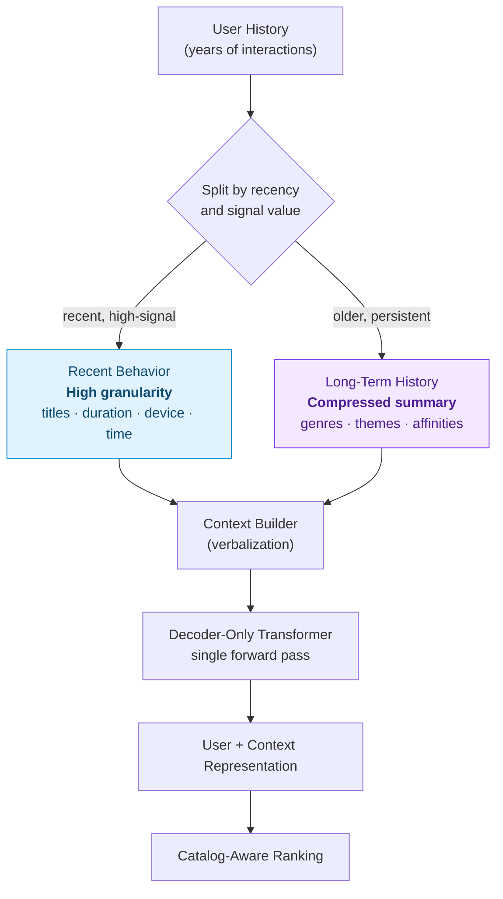

<p class="panel-note" style="text-align:center;">Recent = detailed. Long-term = compressed. Both feed one context. (My conceptual framing, not a paper diagram.)</p>

There's a nice reason a *compressed* long-term signal can still be powerful: the backbone has already learned a lot about the catalog itself — that *Nightcrawler* sits near crime, neo-noir, dark journalism, moral ambiguity. So a short phrase like "strong affinity for true crime and neo-noir" doesn't need the full watch log to be useful; it's enough to *activate* patterns the model already holds. The summary is a key, not the whole record.

### More Tokens ≠ More Useful Context

This reframes the whole context-engineering problem for me. With large context windows, the naive instinct is "include more history." But more tokens isn't automatically more signal.

<div class="info-panel" role="note" aria-label="Useful context callout">
  <p class="panel-label">The Real Objective</p>
  <p class="panel-extra"><strong>MORE TOKENS ≠ MORE USEFUL CONTEXT.</strong></p>
  <p class="panel-extra">Better selection + better compression + better signal filtering = more useful representation. The goal is to maximize <em>useful behavioral information per token</em>, not raw history length.</p>
</div>

Some historical events add noise, some are redundant, some are just low-signal — and every one of them spends context budget and compute.

#### Signal-Based Selection (Conceptual)

That suggests not every interaction deserves the same amount of space. Conceptually — and again, this is my reasoning, not a stated GenRec mechanism — context construction could weight detail by signal value:

```text
HIGH-SIGNAL event                     LOW-SIGNAL event
(long play, strong                    (very short play, accidental
 engagement, repeat interest)          click, weak/ambiguous signal)
        │                                     │
        ▼                                     ▼
   Detailed representation             Compressed — or omitted
```

Repetition can be compressed too: an entire binge could be summarized as one behavioral pattern ("watched 8 episodes of one series in two days") rather than eight near-identical entries.

### Where Should the System Stop Adding History?

The other half of the question is *quantity*: how far back is worth including? Adding history has real costs — more tokens, more compute, higher serving latency, and eventually more noise than signal.

The way I'd reason about it is an empirical sweep: vary the amount of history, measure ranking quality (say, MRR) at each length, and watch for the elbow.

```text
Ranking
quality
  │            ______________  ← diminishing returns
  │         __/
  │       _/     ▲ elbow: most of the benefit, before the cost curve bites
  │     _/
  │   _/
  │ _/
  └─────────────────────────────► amount of history in context
```

Before the elbow, more history genuinely helps the model understand the user. After it, extra events buy tiny gains while latency and cost keep climbing — and stale, off-phase history can start adding noise. The engineering move is to sit near that elbow: keep most of the recommendation benefit without paying for context you don't need.

> To be explicit: I'm not reporting this as an experiment the GenRec paper ran. This is how *I'd* go about finding a practical context boundary.

### Context Determines What the Model Sees; the Objective Determines What It Learns

There's one more distinction I keep coming back to, and it's the natural bridge into how GenRec is actually trained.

- **Context engineering** decides *what information the model sees.*
- **The training objective** decides *what behavior the model is rewarded for.*

They're separate levers. You can build a beautiful two-tier memory and still get short-sighted recommendations if the objective only rewards the next click — chasing immediate engagement can quietly trade away discovery, healthy exploration, and long-term satisfaction. Getting long-term behavior right isn't only a memory problem; it's also an *objective* problem.

And that's exactly the lever GenRec's post-training pulls. The paper *does* address long-term satisfaction directly — through reward signals and a reward-weighted ranking loss that lets high-value engagement pull harder than low-value behavior. That's not my interpretation; it's in the paper, and it's where this section hands off.

> My synthesis, stated plainly: as recommendation shifts from hand-built features toward dynamically constructed context, **context engineering starts to look like a form of memory management** — deciding what to keep in detail, what to compress, what to forget, and how much is enough. That framing is mine, not a conclusion the GenRec paper states outright. What the paper *does* make concrete is the other half of the equation — the objective — which is where we go next.

---

## Training Objectives and Reward Signals {#training-objectives}

GenRec isn't trained on a single loss. The paper describes **combining multiple objectives**, and the intuition for why is worth spelling out.

- A **recommendation ranking objective** — the core signal that teaches the model to order items well.
- A **language modeling objective** — which helps preserve the general language and understanding capabilities the backbone brings, so ranking adaptation doesn't erode them.
- **Other objectives** where applicable, folded in to shape behavior.

These are combined with **weighted losses** — the familiar pattern of balancing several goals so that optimizing one doesn't quietly destroy another.

### The Training-Time Architecture, End to End

The [inference diagram earlier](#how-genrec-works) showed the *scoring* path — context in, catalog scores out. This is the complementary **training-time** view: the same backbone feeds *two heads*, and their losses combine. It also makes the training-vs-inference split explicit — the same ranking branch that computes a loss during training simply *sorts and returns Top-K* at inference, with no autoregressive loop ([why that matters](#decoder-only-not-generating)).

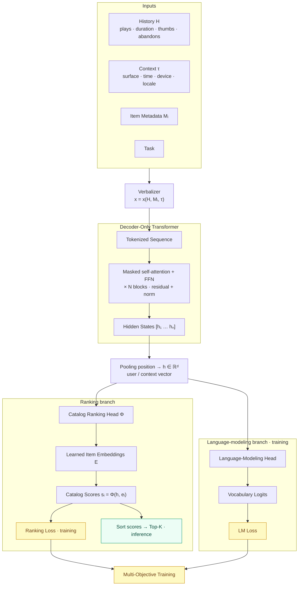

<p class="panel-note" style="text-align:center;">Conceptual reconstruction based on my reading of the GenRec architecture. The ranking objective is the paper's primary target; the language-modeling objective preserves the backbone's general capability. Notation (Φ, the exact pooling position, and the loss weighting) is illustrative — treat the paper as the source of truth for the precise formulation.</p>

Two things the diagram is built to make obvious. First, the **ranking head and the LM head share one backbone** — the trainable parts are, conceptually, the backbone weights, the scoring head, and the item embeddings, all shaped jointly by the combined loss. Second, the **ranking branch is the same at train and inference time**; only its *tail* differs (compute a loss vs. sort and return Top-K). The [catalog-aware head](#catalog-aware-ranking) is where the scoring actually happens.

I'm deliberately *not* writing the loss as a precise weighted sum with named coefficients, because I can't verify the exact form against the paper — "combined, weighted objectives" is the honest level of detail here.

### Reward Signals: Beyond "Did the User Click?"

The subtler issue is *what* the ranking objective should reward. Optimizing purely for immediate engagement is a classic trap: chase clicks and you drift toward clickbait ranking; chase short-term watch time and you can starve long-term satisfaction. The paper frames the reward story around two broad categories.

**1. Long-term member satisfaction proxies.** The goal isn't "did the member click?" — it's whether an engagement is associated with desirable *longer-term* outcomes: coming back to the service, sustained engagement, exploring more of the catalog. The catch is that true long-term outcomes are delayed and noisy — you can't wait months to score a single recommendation. So Netflix uses **learned proxies** for those outcomes as the reward signal. I want to be careful not to overstate this: it is not "if the member watches a show, they stay subscribed." It's that the reward estimates whether an interaction *correlates* with good long-term behavior.

**2. Business and content-rebalancing objectives.** Netflix spans movies, series, games, live content, podcasts, and titles at different launch stages. Left to optimize one immediate metric, a system might over-recommend whatever produces the strongest short-term engagement. To counteract that, the paper describes bringing in reward signals from **separate reward models** that encode these broader requirements.

Both categories are folded into training through a **reward-weighted ranking loss** — this is the paper's *primary* alignment mechanism. Conceptually:

```text
High-value training example        Low-value / undesirable behavior
        ↓                                   ↓
Higher reward weight               Lower reward weight
        ↓                                   ↓
Greater contribution               Reduced contribution
to the ranking loss                to the ranking loss
```

Rather than treating every interaction as an equal label, the loss lets high-value engagement pull harder on the model and low-value or undesirable behavior pull less.

#### What About Reinforcement Learning?

This is an easy point of confusion, so it's worth stating plainly. The paper reports that Netflix **explored RL-style approaches such as GRPO**, and that these preliminary experiments showed additional gains over supervised fine-tuning. But the **training overhead was high**, so the system described in the paper sticks with the reward-weighted loss as its primary mechanism — it's simpler, more stable, and more cost-effective.

(For readers pattern-matching to alignment literature: this is *not* DPO. DPO — Direct Preference Optimization — is a different preference-based method, and the paper does not present it as GenRec's production mechanism.)

### Does It Actually Work?

Two results from the paper are worth pinning down, both for the configuration it reports:

<div class="info-panel" role="group" aria-label="Reported GenRec results">
  <p class="panel-label">Reported Results · Paper's Tested Configuration</p>
  <p class="panel-extra"><strong>~40× fewer Phase-2 labeled examples</strong> than the production baseline — the LLM-backed ranker reaches its result on a fraction of the task-specific labeled data.</p>
  <p class="panel-extra"><strong>~+1.6% relative improvement in Mean Reciprocal Rank (MRR)</strong> offline, alongside statistically significant gains reported in online experiments.</p>
  <p class="panel-note">Figures are as reported in the paper for its tested setup, not universal guarantees.</p>
</div>

The two evaluation modes are easy to conflate, so to be precise:

- **Offline evaluation** — the model is scored on held-out data using ranking metrics such as MRR.
- **Online evaluation** — the system is measured in a real production **A/B test**, against actual user and product outcomes.

(Note it's online *evaluation* / experimentation, not "online training.") The point that makes the result credible is that the gains showed up in *both* — not just in an offline metric that might not transfer, but in live experimentation too.

And the **40× data-efficiency** number connects straight back to the second problem we started with. If adapting the old supervised ranker demanded large volumes of task-specific labeled data, a backbone that arrives already understanding users and content — and needs far less Phase-2 labeling to specialize — directly attacks that bottleneck. The interesting shift isn't that Netflix swapped one neural network for a larger Transformer; it's that **the place where engineering effort lives is beginning to move** — away from feature pipelines and label collection, toward context construction and objective design.

---

## Why Netflix Avoids Autoregressive Decoding {#avoiding-autoregressive-decoding}

We established *that* GenRec skips token-by-token generation for ranking. This section is about *why that's the right engineering call*.

Imagine you did try to recommend autoregressively:

### Autoregressive recommendation

```text
Token → Token → Token → Token
```

To produce a recommendation this way, you'd potentially be looking at:

- **Multiple decoding steps** per recommendation
- **Beam search** or similar to explore candidates
- **Latency** that scales with output length
- A **large candidate space** to navigate, one token at a time

Now compare GenRec:

### GenRec

```text
Full Context
     ↓
Single Prefill / Forward Pass
     ↓
Catalog Scores
     ↓
Ranking
```

The context goes in, one forward pass produces the representation, the head scores the catalog, and you rank. No generation loop.

At Netflix's request volume, this is not a minor optimization — it's what makes the whole approach *servable*. A ranking system has to return results fast, for enormous numbers of requests, continuously. A design whose cost grows with generated-token count would be fighting its own serving budget. Scoring in a single pass sidesteps that fight entirely.

---

## Prefill-Only Inference {#prefill-only-inference}

This deserves its own section because it's where the architecture meets the serving reality.

In LLM serving, a request has two cost centers: **prefill** (processing the input context in one pass) and **decode** (generating output tokens one at a time). Decode is the part that loops. GenRec's ranking path is essentially **prefill-only**:

- The model **processes the input context** in a forward pass.
- It **does not enter a long token-by-token generation loop** for this task.
- The **ranking head produces catalog scores** from the resulting representation.
- This makes **large-scale serving far more feasible**.

That framing exposes the real tradeoff surface, which is a balancing act between four dials:

- **Model size** — bigger backbones understand more, but cost more per pass.
- **Context length** — more context means richer understanding, but more prefill compute and memory.
- **Serving cost** — the budget that everything has to fit inside.
- **Recommendation quality** — the thing you're ultimately optimizing for.

This is exactly why **context compression matters** so much, and why it's not a side detail. The paper discusses reducing the effective context budget while maintaining ranking quality — trimming what a request has to process without meaningfully hurting how well it ranks.

Context engineering, then, isn't only about *what the model can understand*. It's also a lever on *what the system can afford*. Every token you don't spend is prefill compute you don't pay for. Understanding and cost are being optimized by the same mechanism — which is a rare and satisfying alignment.

---

## What I Found Most Interesting {#what-i-found-interesting}

*This section is my interpretation and synthesis — my reading of what's significant, not additional claims from the paper.*

### The prompt becomes the feature vector

Traditional systems ask: *"What features should we engineer?"* GenRec increasingly asks: *"What information should we put into the context?"*

I keep returning to this because it's a shift in *where the hard thinking lives*. It moves from anticipating interactions up front to curating evidence and trusting a capable model to interact with it. That's a more general, more forgiving abstraction.

### Architecture becomes more reusable

Instead of designing a brand-new model for every recommendation problem, a shared foundation model can potentially support many use cases, with a lighter task-specific layer on top. The two-phase split makes "adapt" the default response to change, rather than "rebuild."

### Scaling laws enter recommendation systems

Recommendation starts inheriting the scaling mindset of modern LLMs — the sense that a bigger, better-fed backbone can lift many downstream tasks at once. That's a different way to think about *where improvement comes from* than "add another engineered feature."

### RecSys starts looking like AI infrastructure

Maybe the part I find most telling: the *vocabulary* changes. The concerns start to look like LLM-serving concerns —

- GPU inference
- vLLM-style serving
- Prefill
- KV caching
- Context optimization
- Batching
- Model distillation

When your recommendation team starts caring about prefill and KV caching, something structural has shifted. The recommender isn't a bespoke ML pipeline anymore; it's an LLM system that happens to do ranking.

---

## My Interpretation: A Memory Layer in Front of GenRec {#memory-layer}

<div class="info-panel" role="note" aria-label="My proposed architecture">
  <p class="panel-label">My Interpretation / Proposed Architecture — Not in the Paper</p>
  <p class="panel-extra">The GenRec paper does <strong>not</strong> propose this architecture. But its context-centric design led me to a question: if personalization increasingly comes from context, could a dedicated <strong>memory layer</strong> sit <em>upstream</em> of the recommender and decide what history survives into that context? This section sketches that idea. To be explicit — none of the following implies that Netflix uses it, that GenRec includes it, or that the paper describes it.</p>
</div>

Earlier I argued for a two-tier view of user history — detailed recent behavior alongside a compressed long-term summary (see [The Question GenRec Left Me With](#the-memory-question)). The obvious next question is *who builds that split, and how?* My proposed answer: don't feed raw history to the model at all. Put a memory layer in between.

### The Core Idea

Instead of dumping a member's complete interaction log into the context window, insert a stage that curates it:

```text
Raw user interactions
        ↓
Signal evaluation        ← how much does this event matter?
        ↓
Semantic compression     ← turn events into compact memory units
        ↓
Memory consolidation     ← merge related events into abstractions
        ↓
Context-aware retrieval  ← pull only what this request needs
        ↓
Recommendation context
        ↓
GenRec → catalog-aware ranking
```

The recommendation context stops being "the last N events" and becomes the *output of a memory system.*

### Borrowing From SimpleMem

The cleanest existing blueprint I've found for this is **SimpleMem**, a memory architecture built for **LLM agents** — importantly, *not* a recommender. I'm borrowing its structure as an analogy, not claiming any Netflix connection. Its motivation maps almost exactly onto the recommendation problem: keeping an entire history is redundant and expensive, while selectively compressing and retrieving preserves the useful signal on a far smaller context budget. Three of its ideas carry over:

1. **Semantic structured compression** — raw records become compact, meaningful memory units. *"Watched Mindhunter for 48 minutes on Tuesday night"* becomes structured preference signal rather than a raw log line.
2. **Memory consolidation** — related events merge into higher-level abstractions. *Many* true-crime watches, repeated crime-related searches, and finished psychological thrillers consolidate into *"persistent affinity for true crime and psychological thrillers."*
3. **Adaptive retrieval** — the whole store never enters the context; the system retrieves the subset most relevant to the current request.

*(I'm describing SimpleMem's design at a conceptual level and deliberately not quoting benchmark numbers — the point here is the shape of the idea, not its leaderboard.)*

### The Proposed Architecture

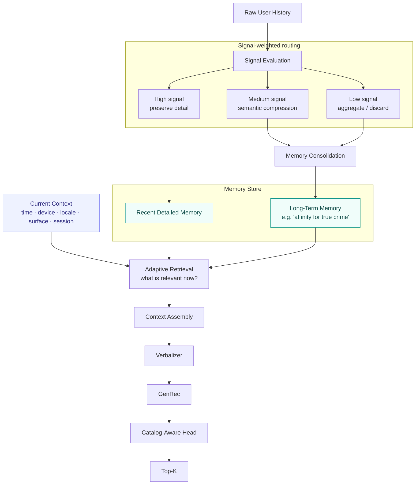

<p class="panel-note" style="text-align:center;">Proposed extension — not part of the GenRec paper. Conceptual, inspired by LLM memory systems (semantic compression, consolidation, adaptive retrieval). The <em>current request</em> drives what gets retrieved, so different situations assemble different contexts from the same store.</p>

The short-term / long-term split I described [earlier](#the-memory-question) still holds — recent memory stays detailed to capture current intent; long-term memory is progressively consolidated to preserve *identity* without replaying every event. The new part is everything *before* and *around* that split.

### My Extension: A Signal-Importance Layer

Here's where I go a step beyond SimpleMem. Before anything is compressed, I'd score each event's importance — because not every interaction deserves equal memory capacity.

<div class="info-panel" role="note" aria-label="Conceptual importance function">
  <p class="panel-label">Conceptual Formulation (Mine — Not a Netflix or SimpleMem Equation)</p>
  <p class="panel-extra"><code>Importance(event) = f(engagement, completion, feedback, recency, frequency, intent)</code></p>
  <p class="panel-note">A long, completed, repeated, recently-searched watch scores high; a 30-second accidental play scores low.</p>
</div>

That score then drives the branch in the diagram: **high-signal** events stay detailed longer, **medium-signal** events get semantically compressed, and **low-signal or redundant** events are eventually aggregated or discarded. Compression becomes *value-aware* rather than uniform.

### Adaptive Retrieval Is the Real Payoff

This is the part I find most compelling. The layer shouldn't retrieve "the last N events" — it should retrieve based on the *current recommendation situation.*

Say the request is **Friday night, on the TV, after three recent comedies.** The memory layer could pull recent comedy activity, relevant long-term comedy preferences, *and* a few dormant high-confidence interests that might support discovery. The context becomes dynamic:

<div class="info-panel" role="note" aria-label="Conceptual context equation">
  <p class="panel-label">My Conceptual Model — Not From the Paper</p>
  <p class="panel-extra"><code>Context = Current Situation + Recent Detailed Memory + Retrieved Long-Term Memory</code></p>
</div>

Different requests assemble different contexts from the same store — which is exactly SimpleMem's adaptive-retrieval principle applied to ranking.

### An Analogy: Context Compaction in Coding Agents

There's a useful parallel to how coding agents (Claude Code among them) manage long sessions — though I want to be careful: I'm drawing a *conceptual* analogy, not claiming the implementations are the same.

```text
Coding agent                          Recommendation memory
────────────                          ─────────────────────
Long conversation history             Years of user interactions
        ↓                                     ↓
Context grows too large               History grows too large
        ↓                                     ↓
Compress important decisions          Compress preference signals
        ↓                                     ↓
Drop redundant detail                 Consolidate long-term memories
        ↓                                     ↓
Reconstruct relevant context          Retrieve only what's relevant
        ↓                                     ↓
Continue the task                     Build the recommendation context
```

The key difference: recommendation memory should be *event- and preference-aware*, weighted by engagement signals — not just text summarization. That signal-weighting is what makes it a recommender's memory rather than a generic transcript compressor.

### The Key Insight

Underneath all of this is one idea:

> Context engineering and memory engineering may be two sides of the same problem.

Context engineering asks *what should the model see right now?* Memory engineering asks *what should survive long enough to potentially be seen later?* A memory layer is simply the thing that connects those two questions.

And that reframes the migration this whole article keeps tracing. Moving from feature engineering to context engineering doesn't *eliminate* the feature-selection problem — it moves it **upstream**. Instead of *"which handcrafted features should we give the ranking model?"* we now ask:

> Which parts of a user's history should survive, how should they be compressed, and when should they be retrieved?

In that light, the recommendation context itself becomes the final product of a memory system:

```text
Memory System → Context Construction → Transformer Representation → Catalog-Aware Scoring → Recommendation
```

Which lands us right back at GenRec's architecture — only now with an explicit story for where its context could come from.

---

## What I Would Explore Differently {#what-i-would-explore}

**These are my ideas, questions, and directions for exploration — not validated improvements, and not claims made by the paper.** If I were experimenting with the next iteration of this kind of architecture, these are the threads I'd be curious to pull.

I've already laid out the biggest one — a [dedicated memory layer](#memory-layer) with signal-weighted compression and adaptive retrieval. Two shorter threads sit alongside it.

### Personalized context compression

Beyond the memory layer's per-*event* weighting, I'd want to try per-*user* compression policies. A highly predictable member and an exploratory, hard-to-pin-down one probably don't benefit from the same context strategy — so the compression policy itself could be personalized, not just the content it compresses.

### Multi-level recommendation reasoning

I'd be curious whether recommendation could eventually separate concerns more explicitly:

- User understanding
- Preference representation
- Candidate scoring
- Optional reasoning or explanation

Not because separation is inherently better — but because it might make each part easier to improve and inspect independently.

### A possible future extension: specialist routing (mixture-of-experts)

This one deliberately pushes *against* my own earlier argument. In [One Model, Millions of Personalized Contexts](#one-model-many-contexts) I made the case that GenRec's strength is a *single shared model* adapted through context. The opposite bet is also worth considering: instead of one model, a **router** that dispatches a request to specialized models — by region, language, content type, surface, or user behavior — and then **fuses** their scores into a final ranking.

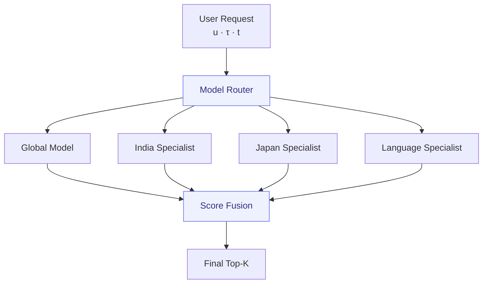

<p class="panel-note" style="text-align:center;">Proposed extension — not an architecture claimed by the GenRec paper. A conceptual mixture-of-experts alternative to the single-shared-model design.</p>

The honest tension: routing buys specialization but gives back much of the operational simplicity that made the shared-model bet attractive in the first place — now you're training, serving, and keeping *several* models (plus a router and a fusion step) in sync, which is close to the "different models for different requirements" cost the paper set out to escape. I find it interesting precisely *because* it's the counter-argument to the rest of this article, not because I think it's obviously better.

Again: I'm not claiming any of these beat the current design. They're the experiments I'd want to run if I were sitting inside this problem.

---

## The Bigger Shift: From RecSys Infrastructure to LLM Infrastructure {#the-bigger-shift}

Zoom out, and GenRec reads as one data point in a broader migration:

```text
Feature Engineering
        ↓
Context Engineering

Custom Models
        ↓
Foundation Backbones

Task-Specific Infrastructure
        ↓
Shared LLM Infrastructure

Autoregressive Generation
        ↓
Task-Specific Inference Paths
```

The headline isn't simply *"Netflix put an LLM in its recommender."* Swapping a neural network for a bigger one is not, by itself, interesting.

The interesting part is that **the engineering abstraction changes**. What used to be encoded as features becomes curated as context. What used to demand specialized architectures can lean on a shared foundation. And a generative model gets used through a *task-specific inference path* — scoring, not generating — rather than being forced into the generation loop it was pretrained for.

That last point is the one I'd underline. GenRec takes a decoder-only generative backbone and deliberately *doesn't* use it generatively for ranking. It borrows the understanding and leaves the decoding behind.

---

## Where Does GenRec Go From Here? {#where-next}

GenRec already represents a significant shift: Netflix has moved from thousands of manually engineered features toward a system where behavior, context, and metadata are turned into language and interpreted by a shared foundation model. But the most interesting part of the paper, for me, might be *where it stops* — and what comes next.

### 1. What Netflix is doing now

As covered in [Training Objectives](#training-objectives), GenRec is already past plain supervised ranking. Conceptually, the ranking loss is *reweighted* by a reward:

<div class="info-panel" role="group" aria-label="Reward-weighted training">
  <p class="panel-label">Reward-Weighted Ranking (Paper's Primary Mechanism)</p>
  <p class="panel-extra"><code>L<sub>ranking</sub> &nbsp;→&nbsp; w<sub>reward</sub> · L<sub>ranking</sub></code></p>
  <p class="panel-note">The reward captures signals beyond immediate engagement — proxies for long-term satisfaction and content rebalancing — giving a practical alignment mechanism without the full cost of RL.</p>
</div>

### 2. Where Netflix points next

The paper is explicit about the frontier: Netflix reports that **RL-style methods, including GRPO, showed additional gains — but at higher computational cost**, so full RL is left as future work. That's a clean trajectory:

```text
Supervised Ranking
        ↓
Reward-Weighted Training      ← where GenRec is today
        ↓
RL-Style Optimization (e.g. GRPO)
        ↓
Optimize Long-Term Member Utility
```

The direction of travel is from learning *what users engaged with* toward learning *which outcomes lead to better long-term member experiences* — exactly the [objective the problem setting named](#problem-setting).

### 3. My opinion: why DPO is an interesting fit

Here's a piece of my own technical opinion — clearly labeled as such, and *not* a claim from the paper. Earlier I noted that DPO (Direct Preference Optimization) is **not** GenRec's production mechanism. I still think it's an interesting *future* direction, for one specific reason:

> Recommendation is already, fundamentally, a preference problem.

A recommender is full of implicit comparisons: a member *preferred* one title over another, *completed* A but *abandoned* B, *repeatedly engaged* with X while *ignoring* Y. Those comparisons can, in principle, be turned into preference pairs `(x, y⁺, y⁻)` — where `x` is the user/context/history, `y⁺` the higher-value outcome, and `y⁻` the lower-value one — which is exactly the shape DPO optimizes.

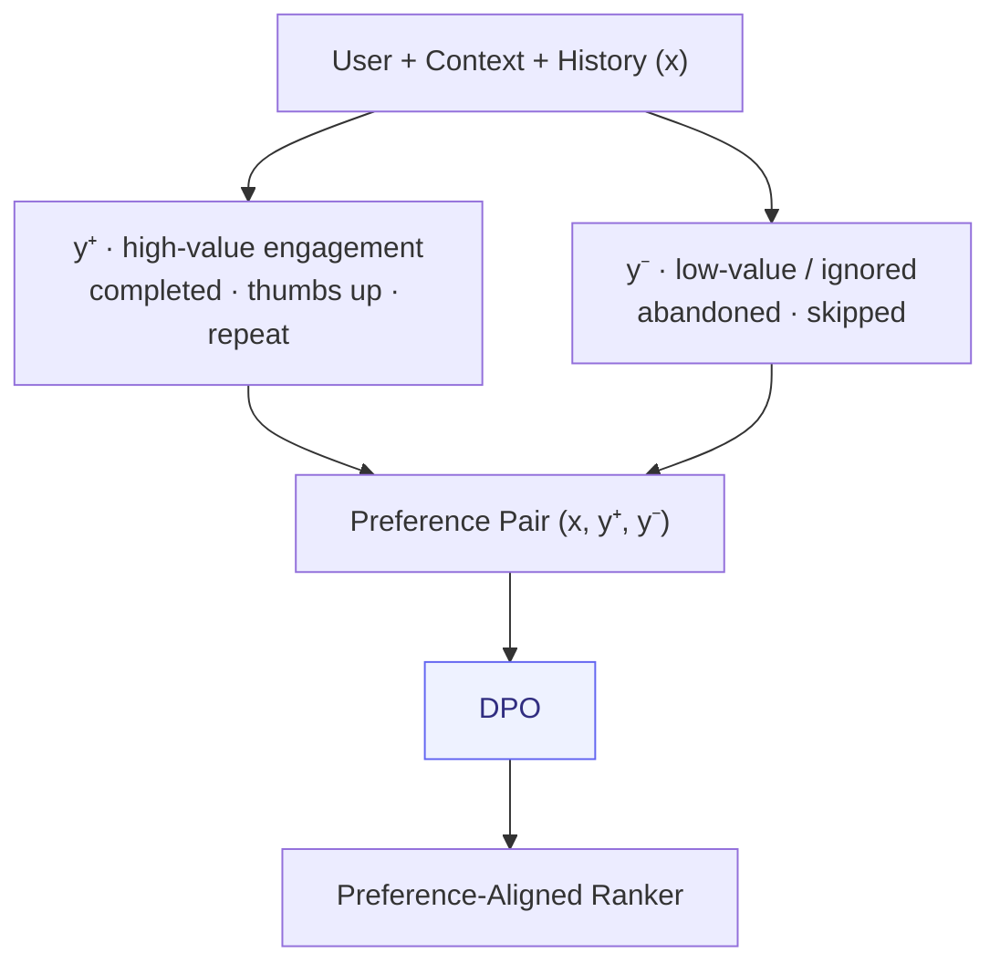

<p class="panel-note" style="text-align:center;">My interpretation, not the paper's roadmap. GRPO and DPO are different tools, not a ranking.</p>

I want to be careful not to overstate it. This is **not** "DPO beats GRPO." They suit different situations: GRPO is attractive when you want to optimize richer, outcome-level rewards and can sample multiple candidates; DPO is attractive when you already have reliable preference comparisons and want a simpler, direct offline procedure. Broad evaluations tend to find *both* among the stronger preference-based methods rather than crowning a universal winner. My only claim is that recommendation's built-in notion of preference makes the DPO framing *naturally applicable* — worth a look, not a foregone conclusion.

### The full-circle picture

Step all the way back and the article's through-line becomes a single pipeline — part paper, part my extension:

```text
USER HISTORY
      ↓   ┐
MEMORY COMPRESSION   │  my proposed
      ↓              │  memory layer
MEMORY RETRIEVAL     │  (not in the paper)
      ↓   ┘
CONTEXT ENGINEERING
      ↓
VERBALIZATION
      ↓
FOUNDATION MODEL         ┐  GenRec, as described
      ↓                  │  in the paper
CATALOG-AWARE RANKING    ┘
      ↓
PREFERENCE / REWARD ALIGNMENT   ← reward-weighted today; GRPO / DPO ahead
      ↓
LONG-TERM MEMBER UTILITY
```

Maybe the next step for LLM-backed recommendation isn't simply *reinforcement learning versus supervised learning*. It may be deciding **what form of human preference is most useful to optimize** — reward-driven optimization like GRPO for some problems, pairwise preference optimization like DPO for others.

And underneath both sits the question GenRec made impossible for me to ignore: if context is becoming the new feature representation, **how do we decide what information, memory, and preference signals the model should actually see?**

---

## Final Thoughts {#final-thoughts}

I started reading this paper for a fairly simple reason: I wanted to understand how Netflix could keep evolving its recommendation system while the platform beneath it kept getting more complex.

What I came away with was less about a specific model and more about a change in framing.

- What used to be **features** can become **context**.
- What used to require **specialized architectures** can potentially lean on a **shared foundation**.
- What used to require **token-by-token generation** doesn't necessarily need to be generated at all.

GenRec is not a story about replacing an old neural network with a larger Transformer. It's a story about *how a recommendation problem can be framed* — and the reframing is the part worth carrying forward.

Which leaves me with the question I'll keep chewing on: if the prompt is becoming the feature vector, then the next frontier isn't building better models — it's getting genuinely good at deciding **what information deserves a token**. That feels like a discipline we're only beginning to take seriously.

---

## Related Topics

If you found this useful, a few adjacent pieces I've written:

- [Context Engineering for AI Agents](/blog/) — the same "curate the input" discipline, applied to agents
- [LLM Inference Optimization](/blog/) — prefill, KV caching, and the serving concerns GenRec inherits
- [DSPy: Program, Don't Prompt](/blog/) — treating prompts/context as optimizable components rather than hand-tuned artifacts

*Grounding note: architecture, terminology, and claims about GenRec are drawn from the paper "GenRec: An LLM-Backed Recommendation Ranker at Netflix." Sections explicitly labeled as my interpretation or exploration are my own synthesis and should not be read as claims from the paper.*
