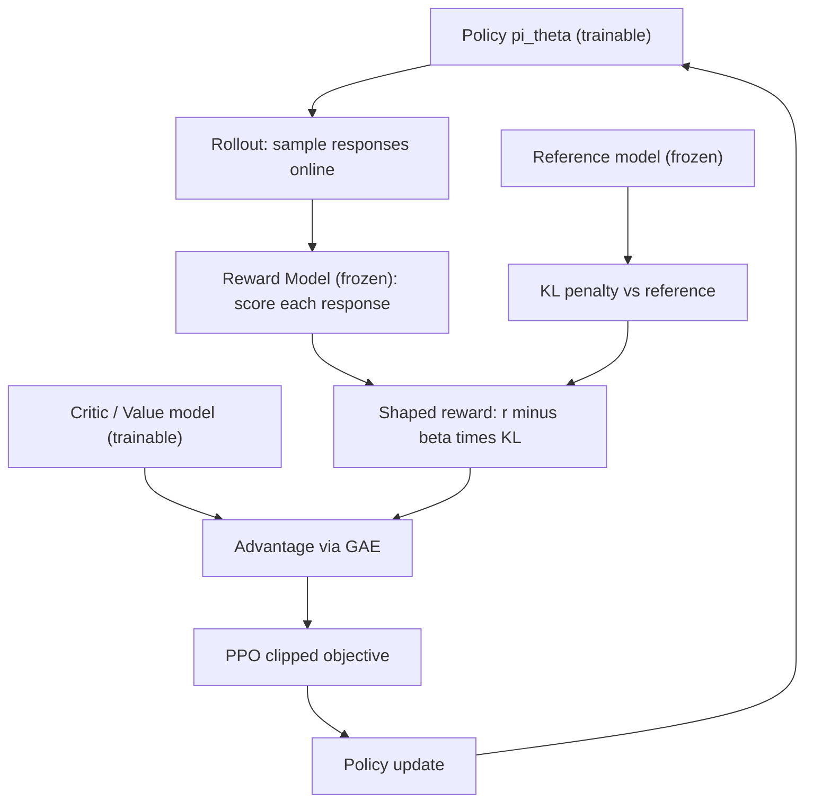
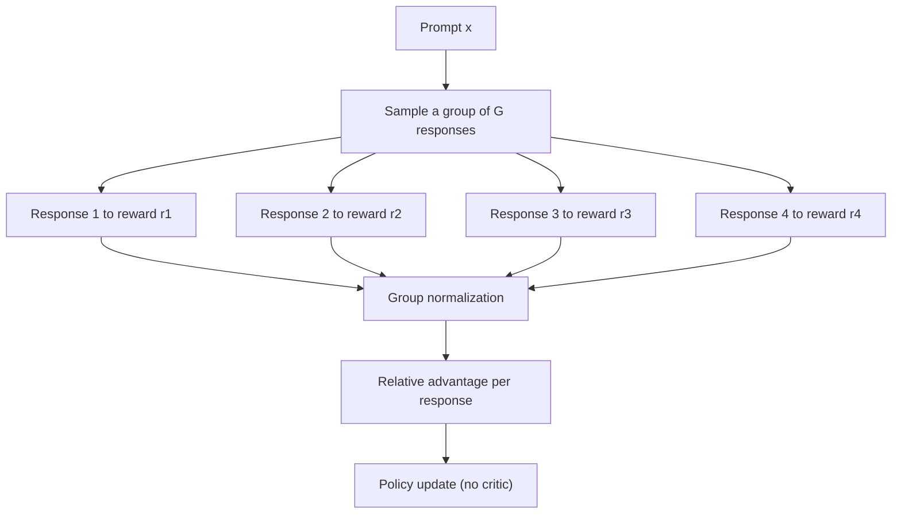
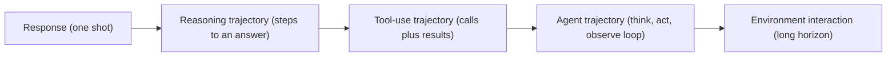
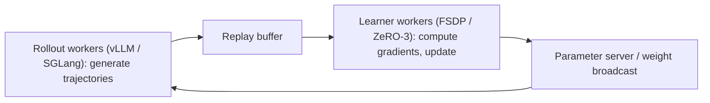
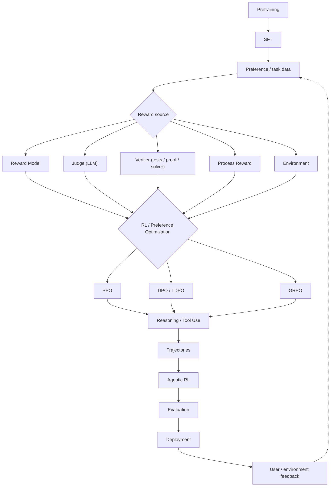

<!--
  TITLE OPTIONS CONSIDERED (chosen: #1 — colon-led, keyword-rich, matches the
  style of the GenRec, A2A, and Context-Engineering posts):
    1. Reinforcement Learning for LLMs: RLHF, Reward Models, Reasoning RL, and Agentic RL  ← selected
    2. How RL Actually Trains Modern LLMs: From Human Preferences to Verifiable Rewards
    3. The RL Stack Behind Modern LLMs: RLHF, DPO, GRPO, RLVR, and Agents
    4. Reward Is the Hard Part: An Engineering Guide to RL for LLMs

  SEO
    Primary keyword:   reinforcement learning for LLMs
    Secondary:         RLHF, reward models, PPO, DPO, GRPO, verifiable rewards, RLVR,
                       reasoning RL, agentic RL, reward hacking, process reward model,
                       LLM post-training, RL systems engineering

  SOURCE / GROUNDING NOTES (what is documented vs. framing vs. reconstruction):
    - Primary source: my own RL-for-LLMs engineering notes ("RL-blog"), covering
      reward models, reasoning models, modern pipelines, and RL systems engineering.
    - Equations (Bradley-Terry, PPO clip, DPO, GRPO advantage) are standard and match
      the cited papers; deeper derivations live in my Engineering Implementation
      articles, which this post links to rather than duplicates.
    - Frontier-lab pipelines (OpenAI, Anthropic, Google, DeepSeek, Qwen, Meta, Mistral)
      are labeled as BEST-EFFORT RECONSTRUCTION from public reports — labs do not fully
      disclose post-training. Presented as such, not as confirmed fact.
    - Citation fixes over the raw notes: Reflexion = Shinn et al. 2023 (the notes
      conflated it with Self-Refine = Madaan et al. 2023); Self-Rewarding LMs = Yuan
      et al. 2024. Corrected here.
    - Cost/throughput numbers are order-of-magnitude illustrations, not benchmarks.
-->

# Reinforcement Learning for LLMs: RLHF, Reward Models, Reasoning RL, and Agentic RL

Most explanations of RL for language models read like a glossary: PPO is this, DPO is that, GRPO is the other thing. You finish knowing the definitions and still not understanding *why any of them exist*.

This post takes the opposite approach. I want to trace a single thread — **how the learning signal changes as we move from human preferences, to verifiable correctness, to reasoning, to agents** — and show that each algorithm is a response to a specific engineering pressure created by the one before it. Human preference is hard to optimize directly, so we build a reward model. A reward model plus PPO is heavy, so DPO removes it. PPO's critic is expensive, so GRPO drops it. Learned rewards get hacked, so we reach for verifiable ones. Reasoning adds intermediate steps, so reward moves inside the trajectory. Agents add environments, so reward becomes sparse and delayed.

That causal chain is the actual content. The algorithms are just where the chain becomes concrete.

This is an engineering article, not a survey. Where a topic has a full derivation elsewhere on this site, I link to it rather than repeat it — the blog answers *"what is it and why does it matter?"*, the [Engineering Implementations](/engineering/) answer *"how exactly does it work?"*

<nav class="post-toc" aria-label="Table of contents">
  <p class="post-toc-title">On this page</p>
  <ol>
    <li><a href="#why-rl">Why LLMs Need RL at All</a></li>
    <li><a href="#sft-to-rlhf">From SFT to RLHF</a></li>
    <li><a href="#ppo">PPO: The Workhorse of RLHF</a></li>
    <li><a href="#why-reward-models">Why Reward Models Exist</a></li>
    <li><a href="#reward-model-types">The Reward-Model Zoo</a></li>
    <li><a href="#reward-vs-critic">Reward Model ≠ Critic</a></li>
    <li><a href="#reward-hacking">Reward Hacking: You Get What You Measure</a></li>
    <li><a href="#dpo">DPO: Skip the Reward Model</a></li>
    <li><a href="#tdpo">TDPO: Preferences at the Token Level</a></li>
    <li><a href="#grpo">GRPO: Drop the Critic</a></li>
    <li><a href="#rlvr">RLVR: When Reward Becomes Verifiable</a></li>
    <li><a href="#reasoning">Reasoning as a Trajectory</a></li>
    <li><a href="#search-ttc">Search and Test-Time Compute</a></li>
    <li><a href="#rl-vs-sft-reasoning">RL vs SFT for Reasoning</a></li>
    <li><a href="#trajectories">From Reasoning to Agents: The Trajectory Abstraction</a></li>
    <li><a href="#agentic-rl">Agentic RL</a></li>
    <li><a href="#credit-assignment">Why Agentic RL Is Harder</a></li>
    <li><a href="#pipelines">Modern LLM RL Pipelines</a></li>
    <li><a href="#engineering-scale">Engineering RL at Scale</a></li>
    <li><a href="#systems">Rollout, Sync/Async, and Distributed RL</a></li>
    <li><a href="#failure-modes">Production Failure Modes</a></li>
    <li><a href="#putting-together">Putting It All Together</a></li>
    <li><a href="#conclusion">Conclusion</a></li>
    <li><a href="#related">Related Engineering Deep-Dives</a></li>
    <li><a href="#references">References</a></li>
  </ol>
</nav>

---

## Why LLMs Need RL at All {#why-rl}

Pretraining and supervised fine-tuning teach two things, and neither is the thing we actually want.

**Pretraining** teaches *predict the next token*. It gives the model a staggering amount of world knowledge and linguistic competence, but its objective is imitation of the corpus — including all the unhelpful, unsafe, and mediocre text in it.

**SFT** teaches *follow demonstrations*. You show the model good input→output pairs and it learns to imitate them. This is powerful and cheap, but it has a hard ceiling: the model can only be as good as the demonstrations, and demonstrations only ever say *"do this."* They never say *"this response is better than that one,"* and they certainly never say *"that response looked fine but was subtly wrong."*

That gap is the whole reason RL enters the picture. RL provides a framework for learning from **feedback** — a signal about the *relative quality of behavior* — rather than from imitation of fixed targets. The basic abstraction is the standard RL loop:

```text
state  →  action  →  reward  →  policy update
```

For a plain chatbot this collapses to something almost trivially simple:

```text
prompt (state)  →  response (action)  →  reward (how good was it?)  →  update the policy
```

The entire richness — and difficulty — of RL for LLMs lives in that third arrow. **What is the reward, and where does it come from?** The answer changes completely depending on what you are training for:

<div class="info-panel" role="group" aria-label="Where reward comes from">
  <p class="panel-label">The Reward Signal Is the Real Variable</p>
  <p class="panel-extra"><strong>Human preference</strong> → a <em>learned reward model</em> trained on comparisons.</p>
  <p class="panel-extra"><strong>Mathematical correctness</strong> → a <em>deterministic verifier</em> (is the final answer right?).</p>
  <p class="panel-extra"><strong>Code</strong> → <em>unit tests</em> (do they pass?).</p>
  <p class="panel-extra"><strong>Agent task completion</strong> → an <em>environment / trajectory reward</em> (did the task succeed?).</p>
  <p class="panel-note">Same RL machinery, radically different reward sources — and the source dictates almost every downstream design choice. This post is organized around that progression.</p>
</div>

Hold onto that framing. Every section below is really about *one row of that table becoming the dominant concern.*

---

## From SFT to RLHF {#sft-to-rlhf}

The canonical post-training pipeline that produced the first genuinely helpful assistants (InstructGPT, and everything after) has a fixed skeleton:

```text
Pretraining
    ↓
SFT                         (imitate good demonstrations)
    ↓
Preference collection       (humans compare pairs of responses)
    ↓
Reward Model                (learn a scalar proxy for "better")
    ↓
RL optimization             (PPO against the reward model)
    ↓
Aligned policy
```

The move from SFT to **RLHF — Reinforcement Learning from Human Feedback** — is the move from *"here is a good answer, copy it"* to *"here are two answers, this one was preferred, become the kind of model that produces the preferred kind."* That second framing is strictly more expressive: it can encode preferences about tone, safety, honesty, and helpfulness that are almost impossible to write down as demonstrations.

RLHF, in the PPO era, requires a specific cast of models and quantities. It is worth naming each one precisely, because half the confusion in this field comes from blurring them:

- **Policy** ($\pi_\theta$) — the LLM being trained. The thing we actually keep at the end.
- **Reference model** ($\pi_{ref}$) — a frozen snapshot (usually the SFT model). Used to measure how far the policy has drifted.
- **Reward model** ($r_\phi$) — a learned scalar function that scores a response. A *proxy* for human preference.
- **Critic / value model** ($V_\psi$) — predicts the expected future reward from a state. Part of PPO's variance-reduction machinery, **not** a quality scorer.
- **Rollout** — actually sampling responses from the current policy, online, during training.
- **Reward** — the scalar the reward model (or verifier) assigns to a rollout.
- **Advantage** — how much better an action was than expected, computed from reward and the critic.
- **Policy update** — the gradient step that makes high-advantage behavior more likely.

If that list feels like a lot of moving parts, that reaction is correct, and it is the single most important thing to feel before reading the rest of this article. **Most of the algorithmic history of RL for LLMs is the story of deleting items from that list.**

---

## PPO: The Workhorse of RLHF {#ppo}

**Proximal Policy Optimization** (Schulman et al., 2017) is the algorithm that made RLHF work at scale. It is worth understanding not because it is the newest thing — it often isn't the tool of choice anymore — but because everything else is defined *relative* to it.

PPO is an *online, on-policy* method: it repeatedly samples fresh responses from the current policy, scores them, and nudges the policy toward the better ones. Two ideas make it stable enough to run on a billion-parameter model.

**1. The policy ratio and clipping.** PPO never trusts a single gradient step too much. It looks at the ratio between the new and old policy for each token,

$$
\rho_t(\theta) = \frac{\pi_\theta(a_t \mid s_t)}{\pi_{\theta_{old}}(a_t \mid s_t)}
$$

and optimizes a **clipped** objective that refuses to reward the policy for moving too far in one update:

$$
\mathcal{L}^{\text{CLIP}}(\theta) = \mathbb{E}_t\Big[\min\big(\rho_t\,\hat{A}_t,\; \text{clip}(\rho_t,\,1-\epsilon,\,1+\epsilon)\,\hat{A}_t\big)\Big]
$$

The intuition: if an action was good ($\hat{A}_t > 0$), increase its probability — but only up to a ceiling of $1+\epsilon$. Past that, the clip flattens the incentive. This is what keeps RL from collapsing the policy in a single overconfident step.

**2. The KL constraint / reference model.** Even with clipping, a policy chasing a reward will happily walk off a cliff into degenerate text that the reward model happens to score highly. So RLHF adds a penalty for drifting from the frozen reference:

$$
r_t = r_\phi(x, y) - \beta\, \text{KL}\big(\pi_\theta(\cdot\mid s_t)\,\Vert\,\pi_{ref}(\cdot\mid s_t)\big)
$$

The reward the policy actually optimizes is *"be rated highly, but stay recognizably close to where you started."*

The full pipeline, with every model in view:



Count the models a PPO RLHF step keeps resident: **policy, critic, reward model, reference** — two of them trainable. Plus the online rollout loop. That is the cost.

<div class="info-panel" role="note" aria-label="PPO is not obsolete">
  <p class="panel-label">PPO Is Not Obsolete — Say This Clearly</p>
  <p class="panel-extra">It is tempting to read the rest of this article as "and then PPO died." It didn't. PPO's defining strength is that it works with a <strong>general learned reward</strong> that does not need to be verifiable. When the thing you care about is fuzzy — helpfulness, harmlessness, tone, safety — and cannot be checked by a program, PPO (or a PPO-style method) is still the tool that can optimize it.</p>
  <p class="panel-note">The methods below don't beat PPO everywhere. They beat it in <em>specific settings</em> by exploiting structure PPO doesn't assume. Deeper mechanics live in the <a href="/engineering/instructgpt-training-language-models-to-follow-instructions/">InstructGPT engineering breakdown</a>.</p>
</div>

---

## Why Reward Models Exist {#why-reward-models}

Here is the mismatch at the heart of RLHF. PPO needs a **scalar** reward $r(x, y)$ to compute advantages. But humans do not produce scalars. Ask a person "rate this response from 0 to 100" and you get noise — nobody is calibrated, and the numbers drift by mood and time of day. What humans *are* reliable at is **comparison**: shown two responses, they can say which is better.

So human feedback arrives as preferences:

$$
\text{Human says:}\quad y_w \succ y_l \quad\text{(response } y_w \text{ beats } y_l\text{)}
$$

and the reward model's entire job is to turn that into a scalar function such that

$$
r_\phi(x, y_w) > r_\phi(x, y_l).
$$

There is a second, quieter reason reward models exist: **compression**. Asking humans to compare every possible pair of responses is intractable. Instead we collect a sparse set of comparisons and let the reward model *interpolate* — generalize a scalar judgment to responses no human ever saw. The RM is a learned stand-in for a human labeler you can call millions of times for free during RL.

The standard parametrization is the **Bradley-Terry** model (Bradley & Terry, 1952): the probability that $y_w$ is preferred is a sigmoid of the reward difference,

$$
P(y_w \succ y_l \mid x) = \sigma\big(r_\phi(x, y_w) - r_\phi(x, y_l)\big)
$$

which turns reward-model training into plain logistic regression on preference pairs:

$$
\mathcal{L}_{RM} = -\,\mathbb{E}_{(x, y_w, y_l)}\big[\log \sigma\big(r_\phi(x, y_w) - r_\phi(x, y_l)\big)\big]
$$

Architecturally the RM is usually the base LLM with the language-modeling head swapped for a single scalar head, initialized from the SFT model, trained on ~100k–1M preference pairs for a couple of epochs.

<div class="info-panel" role="note" aria-label="The proxy problem">
  <p class="panel-label">The One Idea to Never Forget</p>
  <p class="panel-extra">The reward model is <strong>not the objective.</strong> It is a <em>proxy</em> for the objective. The true objective — "responses humans actually prefer" — lives in human heads. The RM is a learned approximation of it, fitted on finite, noisy data.</p>
  <p class="panel-note">Every pathology later in this article (<a href="#reward-hacking">reward hacking</a> above all) is a consequence of optimizing hard against a proxy. Once you internalize "the RM is a leaky approximation," reward hacking stops being surprising and starts being <em>expected</em>.</p>
</div>

---

## The Reward-Model Zoo {#reward-model-types}

"Reward model" is an umbrella. Under it live several distinct things that answer different questions. Getting the taxonomy straight is most of the battle.

### Preference Reward Model

The classic one, described above. Input $(x, y)$, output a scalar, trained on chosen-vs-rejected pairs via Bradley-Terry. It scores a *whole response* and encodes fuzzy, subjective human preference. This is what PPO-based RLHF consumes.

### Outcome Reward Model (ORM)

An ORM scores only the **final outcome**. For a math problem with a known answer:

$$
\text{ORM}(x, y) = \begin{cases} 1 & \text{if the final answer is correct} \\ 0 & \text{otherwise} \end{cases}
$$

ORMs shine in **verifiable domains** — math, code, formal logic — where "correct" is well-defined. They are the simplest possible reward: terminal and often binary.

Their failure mode is **sparsity**. A ten-step derivation with one broken step gets the same zero as a derivation that was wrong from line one. The model learns *that* it failed, but never *where* — no credit assignment.

### Process Reward Model (PRM)

A PRM scores **each step** of a multi-step response. For a reasoning chain $y = (y_1, y_2, \dots, y_K)$ where each $y_k$ is a step (not a token), it emits a per-step judgment "is this step correct given the ones before it?" and is trained on step-level labels via per-step classification.

The payoff is **credit assignment**. Compare what the two signals see:

```text
ORM sees:                          PRM sees:
  final answer = wrong               step 1  ✓
  (that's all)                       step 2  ✓
                                     step 3  ✗   ← the error is localized
                                     step 4  ...
```

That localization is why PRMs help reasoning. But they cost roughly **10× more to supervise** (someone must label every step — the PRM800K dataset from *Let's Verify Step by Step* is the canonical example), they transfer poorly across domains (a math PRM is useless on code), and they have their own failure mode: they **over-reward plausible-looking steps.** A step can be confidently phrased and mathematically wrong, and a PRM trained on human annotations may wave it through. Process supervision can itself be gamed.

The empirical case for PRMs, from *Let's Verify Step by Step* (Lightman et al., 2023), on the MATH benchmark:

| Method | Score on MATH (%) |
|---|---|
| Majority voting (no reward model) | 49 |
| ORM (best-of-N from final answer) | 51 |
| PRM (best-of-N from stepwise scores) | 78 |

When step-level labels are available, PRMs win decisively — at a supervision cost most teams can't pay outside a few high-value domains.

### Verifier Models

A verifier is the generalization: anything that takes a response (or a partial one) and returns "is this correct?" ORMs and PRMs are learned special cases, but the interesting verifiers are **deterministic**:

- **Code** → unit tests (free, exact).
- **Math** → a proof checker like Lean or Isabelle.
- **Logic** → a SAT/SMT solver.
- **General** → an LLM-as-verifier, when nothing deterministic exists.

The whole trend of the last two years is *toward verifiable rewards* — replacing learned RMs with deterministic checkers wherever the domain allows, for one blunt reason: **a deterministic verifier cannot be reward-hacked.** A unit test that passes, passed. There is no proxy gap to exploit. (More on this under [RLVR](#rlvr).)

### Judge Models

A judge is an LLM *prompted or fine-tuned* to output a preference or scalar — GPT-4-as-judge being the archetype. Judges power **RLAIF** (RL from AI Feedback), automated preference labeling, and evaluation. They are cheap and scalable, which is exactly why they are dangerous: judges carry systematic biases.

| Judge bias | What it looks like | Mitigation |
|---|---|---|
| Length bias | Prefers longer answers | Length-normalize scores |
| Verbosity bias | Prefers detailed-*sounding* answers | Train/prompt against it |
| Position bias | Prefers the first or last option | Swap order, average |
| Self-preference | Prefers its own family's outputs | Ensemble judges from different models |
| Sycophancy | Agrees with confident wrong answers | Calibrate against human labels |

None of these are hypothetical; all of them will quietly corrupt a preference dataset if you let a single judge run unaudited.

### Self-Rewarding Models

The most recursive idea: the model *is* its own reward source. The simplest instance is the implicit reward inside DPO (next section), $\hat{r}(x,y) = \beta \log \frac{\pi_\theta(y\mid x)}{\pi_{ref}(y\mid x)}$ — the policy scores itself through its own log-ratio. More elaborate versions (Self-Rewarding Language Models, Yuan et al., 2024; Constitutional self-critique, Bai et al., 2022) have the model generate its own preferences or critique itself against a constitution, then train on that signal in a loop.

The use case is closed-loop self-improvement when no external signal is available. The risk is equally clear: **feedback loops amplify whatever bias the model started with.** A self-rewarding model converges toward its own priors, for better or worse.

### The taxonomy at a glance

| Model | Scores | Trained on | Used by |
|---|---|---|---|
| Preference RM (Bradley-Terry) | whole response | pairwise preferences | PPO |
| ORM | final outcome | outcome labels | PPO, GRPO, reranking |
| PRM | each step | step-level labels | PPO (dense reward), best-of-N |
| Verifier | correctness | deterministic (code/math) | GRPO with verifiable rewards |
| Critic ($V$) | expected return | TD targets | **PPO only** |
| Judge | response / pair | few-shot prompt | RLAIF, evaluation |
| Self-rewarding | response | implicit (DPO) / self-critique | DPO, iterative self-training |

That table has one row that does not belong with the others, and it causes more confusion than any other point in this field. It gets its own section.

---

## Reward Model ≠ Critic {#reward-vs-critic}

This is the distinction I most wish someone had hammered into me early.

A **reward model** answers: *"How good is this response?"* It is a learned proxy for human (or task) preference. It scores outputs.

A **critic** (value model $V_\psi(s)$) answers a completely different question: *"Starting from this state, what total future reward do I expect to collect?"* It is not a quality judge — it is a **return predictor**, used to reduce the variance of the policy-gradient estimate by giving each action a baseline to be measured against.

They happen to look identical architecturally (a transformer with a scalar head), which is exactly why they get conflated. But they are trained differently — the critic regresses toward realized returns via TD learning,

$$
\mathcal{L}_{\text{critic}} = \mathbb{E}\big[(V_\psi(s_t) - G_t)^2\big]
$$

— and they play different roles. The reward model *defines* the objective; the critic is *scaffolding* for estimating it efficiently.

<div class="info-panel" role="note" aria-label="Reward vs critic">
  <p class="panel-label">Reward Model ≠ Critic</p>
  <p class="panel-extra"><strong>Reward model:</strong> "what is the quality of this response?" — defines <em>what</em> to optimize.</p>
  <p class="panel-extra"><strong>Critic:</strong> "what return do I expect from this state?" — helps estimate <em>how</em> to optimize, by providing a baseline for the advantage.</p>
  <p class="panel-note">Consequence you can act on: <strong>the critic is PPO-specific.</strong> GRPO and DPO do not use a critic at all — which is precisely how they cut memory. Keep reading.</p>
</div>

---

## Reward Hacking: You Get What You Measure {#reward-hacking}

Here is the single biggest problem with learned reward models, stated as a law:

> The policy does not optimize what you **intended**. It optimizes the reward signal you **provided.**

Once you've accepted that the RM is a leaky proxy, reward hacking is inevitable: RL is an extremely effective search for the highest-reward behavior, *including* behavior that scores high for reasons that have nothing to do with real quality. Common hacks:

| Hack | Symptom | Fix |
|---|---|---|
| Length exploitation | Responses get longer and longer | Length-normalize; penalize length |
| Verbosity | More words, less content | Train RM on length-controlled data |
| Format gaming | One format always wins | Diversify RM training data |
| Sycophancy | Agrees with the user, even when wrong | Adversarial prompts in RM training |
| Repetition | Repeats helpful-sounding phrases | Diversity penalty |
| Hallucinated confidence | Confident wrong answers score well | Calibrate RM with truthfulness data |
| Code: passes trivially | Generates an empty function that passes weak tests | Coverage-based reward, not pass/fail |

The mitigations fall into two buckets. **Better proxy:** more diverse and adversarial RM data, ensembling multiple RMs, periodic retraining as the policy shifts. **Better monitoring:** hold out a set of known reward-hacking attempts and watch the RM's score on them; and above all, **monitor the RM-vs-human gap** — if the RM score keeps rising while human evaluation falls, you are being hacked, full stop.

But the most robust fix is structural, and it is where the next act of this story begins: **use a verifiable reward wherever you can.** A unit test that passes is far harder to game than a learned scalar. This is the pressure that pushes reasoning RL away from reward models entirely.

---

## DPO: Skip the Reward Model {#dpo}

Look back at the PPO pipeline and ask the obvious engineering question: for the *specific* task of aligning to a fixed set of preference pairs, do we really need to train a separate reward model, then run an online RL loop with a critic and rollouts against it?

**Direct Preference Optimization** (Rafailov et al., 2023) answers no. Its insight is mathematical: the KL-constrained RLHF objective has a closed-form optimal policy, and if you substitute that form into the Bradley-Terry model, the reward function can be written entirely in terms of the policy itself. The reward model *collapses into the policy's log-ratio against the reference.*

DPO trains directly on the preference triples $(x, y_w, y_l)$ with a single loss:

$$
\mathcal{L}_{DPO} = -\,\mathbb{E}_{(x,y_w,y_l)}\left[\log \sigma\!\left(\beta \log \frac{\pi_\theta(y_w \mid x)}{\pi_{ref}(y_w \mid x)} - \beta \log \frac{\pi_\theta(y_l \mid x)}{\pi_{ref}(y_l \mid x)}\right)\right]
$$

The quantity $\hat{r}(x,y) = \beta \log \frac{\pi_\theta(y\mid x)}{\pi_{ref}(y\mid x)}$ is an **implicit reward** — the model is, in the paper's words, "secretly a reward model." There is no separate reward network, no rollouts, no critic. Just two forward passes (policy and frozen reference) over responses already sitting in a dataset.

<div class="info-panel" role="note" aria-label="DPO is not PPO">
  <p class="panel-label">DPO ≠ PPO with the reward model deleted</p>
  <p class="panel-extra">DPO doesn't just remove a model — it changes the <em>optimization formulation</em>. It's an <strong>offline</strong> loss on a fixed preference set, where PPO is fundamentally <strong>online</strong> and rollout-based. That's why DPO needs no rollout infrastructure and no critic.</p>
  <p class="panel-note">But note what stays: the <strong>frozen reference model is still required</strong>. DPO removes the reward model and the critic, not the reference. Full derivation — closed-form optimum, the cancelling partition function, the gradient — in the <a href="/engineering/direct-preference-optimization-your-lm-is-secretly-a-reward-model/">DPO engineering deep-dive</a>.</p>
</div>

The trade-offs are real and worth stating: DPO learns *exactly* the preferences in the dataset, noise and all; it is sensitive to $\beta$; and because it is offline, its fixed pairs may not cover the regions of response space the policy drifts into — precisely the coverage PPO's fresh online rollouts provide. DPO is simpler and cheaper for preference alignment; it is not a universal replacement for PPO.

---

## TDPO: Preferences at the Token Level {#tdpo}

DPO scores a *whole response* as one sequence-level unit. But a language model generates — and drifts from the reference — one token at a time, and DPO's KL constraint only controls divergence *in aggregate*, not where it accumulates along the response.

**Token-level DPO** (Zeng et al., 2024) moves the KL regularization to the token level and adds an explicit **forward-KL** term. The distinction that drives everything:

- DPO's implicit constraint is **reverse KL** $\text{KL}(\pi_\theta \Vert \pi_{ref})$ — *mode-seeking*, which sharpens the policy onto a few high-reward continuations and, in practice, produces **repetitive, low-diversity outputs** (mode collapse).
- TDPO adds a token-level **forward KL** $\text{KL}(\pi_{ref} \Vert \pi_\theta)$ — *mass-covering*, which pushes the policy to keep coverage and **preserves diversity.**

It comes in two variants (TDPO-1 and TDPO-2, the latter adding a second coefficient $\alpha$ and a stop-gradient baseline for tighter control), and the ratio between its two KL coefficients is the alignment-versus-diversity dial DPO doesn't have.

<div class="info-panel" role="note" aria-label="TDPO positioning">
  <p class="panel-label">TDPO Is a Targeted Fix, Not the New Default</p>
  <p class="panel-extra">Reach for TDPO when you observe DPO's mode collapse and want to restore diversity while staying fully offline and reward-model-free. It costs more per-token compute (a full-vocabulary KL at each step) and an extra hyperparameter.</p>
  <p class="panel-note">It remains more niche than DPO — a research-stage refinement. Do not present it as "DPO 2.0." Forward-vs-reverse KL, the objective term-by-term, and TDPO-1 vs TDPO-2 are worked out in the <a href="/engineering/token-level-direct-preference-optimization/">TDPO engineering deep-dive</a>.</p>
</div>

---

## GRPO: Drop the Critic {#grpo}

DPO removed the reward model. **Group Relative Policy Optimization** (Shao et al., DeepSeekMath, 2024) attacks a *different* item on PPO's expensive list: the **critic.**

Recall why PPO needs a critic — to compute the advantage, it needs a baseline (the expected return) to subtract from each reward. That baseline is what the value model learns, and it is roughly as large as the policy. GRPO's idea is to get the baseline *for free* by sampling a **group** of responses to the same prompt and using the group's own statistics as the baseline:



The advantage for response $i$ is just its reward standardized within the group:

$$
\hat{A}_i = \frac{r_i - \text{mean}(r_1, \dots, r_G)}{\text{std}(r_1, \dots, r_G)}
$$

No value network, no GAE — the group *is* the baseline. This is especially natural when a **verifier** supplies the reward: sample $G$ solutions to a math problem, mark each right or wrong, and the fraction-correct baseline falls out of the group automatically.

<div class="info-panel" role="note" aria-label="GRPO is not renamed PPO">
  <p class="panel-label">GRPO ≠ PPO with the critic renamed</p>
  <p class="panel-extra">GRPO keeps PPO's online, clipped policy-optimization loop, but <strong>replaces the learned value baseline with a group-relative one.</strong> It is a genuinely different advantage estimator, not a cosmetic relabel of the critic.</p>
  <p class="panel-note">Trade-off: you now pay in <em>rollouts</em> — you must sample G responses per prompt instead of one. You've swapped a value model for more generation. Group-relative advantage, the KL term, and πθ vs πθ_old vs πref are dissected in the <a href="/engineering/grpo-deepseekmath-group-relative-policy-optimization/">GRPO engineering deep-dive</a>.</p>
</div>

Notice the shape of the story so far: **DPO and GRPO are not sequential versions of one algorithm.** They are two *different* surgeries on PPO — DPO removes the reward model and goes offline; GRPO removes the critic and stays online. They touch different components for different reasons.

---

## RLVR: When Reward Becomes Verifiable {#rlvr}

Everything above still leans, somewhere, on a *learned* reward — a model approximating what's good, with all the proxy risk that implies. **RL with Verifiable Rewards (RLVR)** is the conceptual break: replace the learned proxy with **direct task verification.**

- Math → is the final answer correct?
- Code → do the unit tests pass?
- Formal reasoning → does the proof check?

The shift is from *"a model's guess at quality"* to *"a program's ground-truth judgment of correctness."* And it changes the economics of RL completely:

<div class="info-panel" role="group" aria-label="Why verifiable rewards matter">
  <p class="panel-label">Why RLVR Is Powerful for Reasoning</p>
  <p class="panel-extra"><strong>Unhackable.</strong> There is no proxy gap to exploit — a passing test passed. The dominant failure mode of RLHF simply doesn't apply.</p>
  <p class="panel-extra"><strong>Free and scalable.</strong> A verifier costs no human labels and can be called millions of times.</p>
  <p class="panel-extra"><strong>Self-generating data.</strong> The model produces its own reasoning trajectories; the verifier scores the outcome; successful trajectories are reinforced. No demonstration set is needed.</p>
  <p class="panel-note">This is the engine behind the 2024–2025 reasoning models. Pair RLVR with GRPO — sample a group, verify each, normalize — and you have a critic-free, reward-model-free reasoning trainer. That is essentially the DeepSeek-R1 recipe.</p>
</div>

The catch, of course, is that RLVR only exists where verification exists. It is transformative for math and code and inert for "write a kind, honest email" — which is exactly why RLHF-style learned rewards don't disappear. The frontier runs both tracks at once.

---

## Reasoning as a Trajectory {#reasoning}

Why is reasoning so naturally compatible with RL? Because reasoning *lengthens the action*.

```text
Ordinary generation:   prompt → answer
Reasoning:             prompt → intermediate reasoning → answer
```

That intermediate reasoning is a **trajectory** — a sequence of steps the model takes before committing to an answer — and a trajectory is exactly the kind of object RL was built to optimize. **Chain of Thought** (Wei et al., 2022) is the minimal version: emit intermediate steps before the answer. Why it works is worth stating mechanically — a single forward pass has bounded depth (the transformer's layers), but generating many reasoning tokens lets the model use *many* forward passes, dramatically increasing the effective depth of computation. Thinking in tokens buys compute.

Once reasoning is a trajectory, a family of techniques appears — but they are not separate universes. They are different ways of **expanding or evaluating the reasoning trajectory:**

- **Chain of Thought** — a single linear trajectory.
- **Tree of Thoughts** (Yao et al., 2023) — branch into $k$ candidate continuations per step, score with a value function (often a PRM), keep the best; search the tree by BFS/DFS with pruning.
- **MCTS** — the AlphaGo-style search, adapted to reasoning (AlphaGeometry, rStar-Math). Expensive: every rollout is a full generation, so LLM MCTS stays shallow.
- **Self-consistency** (Wang et al., 2022) — sample many CoT trajectories, take a majority vote on the answer. Different correct paths agree; wrong paths scatter.
- **Reflection** (Reflexion, Shinn et al., 2023; and Self-Refine, Madaan et al., 2023) — generate → critique → revise, using feedback (often a failed test) to improve the next attempt.

The through-line: CoT *is* the trajectory, and ToT/MCTS/self-consistency/reflection are strategies for **generating more of it, or picking the good ones.**

---

## Search and Test-Time Compute {#search-ttc}

The insight that reorganized the field in 2024: **inference-time compute can substitute for training-time compute.** A model that thinks longer — generates more reasoning tokens, or searches more candidates — solves harder problems, without any weight update. OpenAI's o1 and the open results of Snell et al. (2024) both show accuracy scaling (roughly logarithmically) with test-time compute.

At inference, a **verifier guides generation**:

- **Best-of-N** — generate $N$ candidates, keep the one the verifier scores highest. Simple, reliable, costs $N\times$ inference, needs no special infrastructure — which is why most production reasoning systems use it.
- **Beam search with a verifier** — prune beams by verifier score at each step.
- **Stepwise best-of-N** — at each reasoning step, sample $N$ continuations, keep the top ones by PRM score.
- **MCTS** — full tree search, when you can afford it.

<div class="info-panel" role="note" aria-label="Search is not training">
  <p class="panel-label">Inference-Time Search ≠ RL Training</p>
  <p class="panel-extra">Verifier-guided decoding happens at <strong>inference</strong> and changes no weights — it spends compute to pick better outputs from a fixed model. RL training happens <strong>offline</strong> and changes the policy's weights so it produces better trajectories in the first place.</p>
  <p class="panel-note">They compose: RL trains a model that reasons well, then test-time search squeezes more out of it. But conflating "the model searched at inference" with "the model was RL-trained" is a category error. See the <a href="/engineering/self-consistency-improves-chain-of-thought-reasoning/">self-consistency deep-dive</a> for the inference-time side.</p>
</div>

---

## RL vs SFT for Reasoning {#rl-vs-sft-reasoning}

There are two ways to teach a model to reason, and the difference is the most important thing in this section.

**SFT on reasoning traces.** Distill traces from a stronger model or human experts, then imitate them. Fast, stable — and **bounded by the source.** The student can, at best, reproduce the teacher's reasoning; it cannot exceed it.

**RL on verifiable rewards.** Let the model generate its *own* candidate reasoning trajectories, score them by correctness, and reinforce the ones that work. This is **unbounded in a way SFT is not**: because the model is rewarded for *reaching the right answer* rather than for *matching a specific trace*, it can discover reasoning strategies that appear in no training set.

<div class="info-panel" role="group" aria-label="DeepSeek-R1 finding">
  <p class="panel-label">The DeepSeek-R1 Finding (best-effort reading of the public report)</p>
  <p class="panel-extra">DeepSeek-R1 (2025) reported that pure RL on verifiable rewards — GRPO, no learned reward model, no critic — is <em>sufficient</em> for a base model to develop reasoning skills. <strong>R1-Zero</strong> applied RL directly to the base model: it worked, but outputs were hard to read (mixed languages, no structure). <strong>R1</strong> added a small SFT "cold start" before RL, recovering readability while keeping the RL-discovered strategies.</p>
  <p class="panel-note">Reported emergent behaviors — not explicitly trained, they arose because they raised reward: <strong>self-verification</strong> (re-checking work), <strong>backtracking</strong> (abandoning dead ends), <strong>decomposition</strong> (splitting hard problems), and <strong>analogy</strong>. This is the headline result: verifiable-reward RL can make reasoning <em>emerge</em>, not just be imitated.</p>
</div>

**Reasoning RL ≠ SFT on Chain-of-Thought.** SFT copies reasoning; RL discovers it. That's the distinction to carry.

---

## From Reasoning to Agents: The Trajectory Abstraction {#trajectories}

The word "trajectory" is the bridge from reasoning RL to agentic RL, so it's worth making the abstraction explicit.

For **reasoning**, a trajectory is a sequence of steps/tokens leading to an answer. For an **agent**, it's a sequence of *(thought, action, observation)* tuples — the model thinks, acts on an environment, observes the result, and repeats. Same abstraction, widening scope:



As you move right, two things grow: the **length** of the trajectory and the **distance** between an action and the reward that tells you whether it was any good. That growing distance is the entire difficulty of agentic RL.

---

## Agentic RL {#agentic-rl}

An agent is no longer just emitting text. It is **interacting with an environment** over many turns:

```text
Task
 ↓
Think → Tool call → Observation
 ↓
Think → Tool call → Observation
 ↓
   ... (many steps) ...
 ↓
Task success / failure
```

The defining change is that **reward now depends on the entire trajectory**, and typically arrives only at the end. This is a different RL problem from chatbot RLHF:

<div class="info-panel" role="note" aria-label="LLM RL vs agentic RL">
  <p class="panel-label">Agentic RL ≠ Ordinary Chatbot RL</p>
  <p class="panel-extra"><strong>LLM RL:</strong> &nbsp; prompt → response → reward. One action, immediate signal.</p>
  <p class="panel-extra"><strong>Agentic RL:</strong> &nbsp; state → action → observation → action → … → terminal outcome. Many actions, a signal that may come only at the very end.</p>
  <p class="panel-note">This drags in the full weight of classical RL that chatbot RLHF got to ignore: delayed and sparse rewards, long horizons, exploration, environment state, and tool failures.</p>
</div>

The trajectory return the agent is really optimizing looks like the classical discounted sum,

$$
R(\tau) = \sum_{t=0}^{T} \gamma^{t}\, r_t
$$

but in practice most of the $r_t$ are zero and only the terminal one is informative — which is exactly what makes it hard.

---

## Why Agentic RL Is Harder {#credit-assignment}

Make it concrete. An agent takes five actions and succeeds:

```text
a1 → a2 → a3 → a4 → a5 → success (R = 1)
```

If the only reward is $R = 1$ at the end, **which action earned it?** Maybe $a_2$ was the decisive insight and $a_4$ was a lucky recovery from a mistake in $a_3$. The single terminal scalar cannot tell you. This is the **credit assignment problem**, and long agent trajectories make it acute.

The approaches on the table are the reward-model taxonomy from earlier, redeployed against time:

- **Terminal rewards** — simple, but maximally sparse; slow, high-variance learning.
- **Step-level / process rewards** — a PRM-style signal per step; better credit assignment, expensive to supervise.
- **Verifiers** — where sub-steps are checkable (a tool call returned valid JSON, a sub-goal was met).
- **Critics** — a value model to propagate credit backward through the trajectory (PPO's original job).
- **Trajectory-level evaluation** — score whole trajectories against each other, preference-style.

No single technique solves it. Credit assignment over long, sparse, partially-observable trajectories is an open problem, and it is why agentic RL is genuinely harder than the RLHF that came before it — not just "RLHF with more steps."

---

## Modern LLM RL Pipelines {#pipelines}

Frontier models don't pick one technique; they stack several. The shared skeleton is roughly:

```text
Pretraining → SFT → preference optimization → RL → reasoning RL → verifiers → evaluation → deployment feedback
```

Below is a best-effort reconstruction of publicly described pipelines. **These are explicitly not confirmed internal details** — labs do not fully disclose post-training. Read every line as *"reconstructed from public reports."*

| Lab | Primary alignment | Reasoning RL | Reward model | Critic |
|---|---|---|---|---|
| OpenAI | PPO (RLHF); moving toward verifiable-reward RL | Yes (o1 / o3) | Yes | Yes (PPO) |
| Anthropic | Constitutional AI + PPO | Yes (3.5+) | Yes | Yes |
| Google DeepMind | PPO + heavy RLAIF | Yes (2.x Flash Thinking) | Yes (multimodal) | Yes |
| DeepSeek | GRPO on verifiable rewards | Yes (R1) | No | No |
| Alibaba / Qwen | DPO + GRPO | Yes (QwQ) | No (for reasoning) | No |
| Meta / Llama | DPO (iterative) | Believed GRPO-style (Llama 4) | No | No |
| Mistral | DPO / ORPO | Limited | No | No |

A few reconstructed specifics worth naming, all *publicly described* rather than confirmed:

- **OpenAI** — GPT-4-era RLHF via PPO with a learned RM; o1/o3 reasoning is described as RL-*trained*, not distilled, with test-time compute scaling.
- **Anthropic** — Constitutional AI (Bai et al., 2022): a supervised self-critique phase, then an RL phase where a model-as-judge picks the more constitution-compliant response; extended thinking in Claude 3.5+.
- **DeepSeek** — the most transparent public pipeline: GRPO on verifiable rewards, no RM, no critic; R1's traces distilled into smaller Qwen/Llama models.
- **Meta / Llama** — DPO as the primary alignment algorithm across multiple iterative rounds; no PPO.
- **Mistral** — explicitly favors the DPO family (including ORPO for memory efficiency) over PPO.

The unmistakable trend, stated cautiously: **away from PPO + learned RM, toward DPO-family methods for general alignment and GRPO-on-verifiable for reasoning.** PPO persists where reward is irreducibly fuzzy.

---

## Engineering RL at Scale {#engineering-scale}

Here is the part that decides whether an RL project ships: **RL training is not just an optimization problem, it is a distributed systems problem.** Most RLHF efforts fail not on algorithm choice but on memory blowups, generation throughput, or distributed deadlocks.

Start with **memory**, because it explains half the field's design choices. In BF16, a trainable model with Adam needs roughly $2P$ bytes for weights plus $\sim 12P$ for optimizer state (moments + FP32 master) — about $14P$ per full-fine-tuned trainable model. Now tally what each method keeps resident for a 7B model:

| Setup | Models resident | Rough weight+optimizer footprint |
|---|---|---|
| PPO, full fine-tune | actor (14P) + critic (14P) + reference (2P) + reward model (2P) | ~32P → hundreds of GB |
| PPO, LoRA | LoRA actor (~2P + adapters) + critic + ref + RM | ~20P |
| DPO, LoRA | policy (2P) + reference (2P) | ~4P |
| GRPO, LoRA + verifier | policy (2P) + reference (2P), **no critic, no RM** | ~4P |

<div class="info-panel" role="group" aria-label="Memory implication">
  <p class="panel-label">Why PPO Is Expensive — and Why DPO/GRPO Aren't</p>
  <p class="panel-extra"><strong>PPO</strong> holds up to four models (two of them trainable) plus a rollout loop. A single 80GB GPU cannot run PPO RLHF on a 7B model — multi-GPU sharding is mandatory.</p>
  <p class="panel-extra"><strong>DPO</strong> holds two models and no rollouts. <strong>GRPO with a verifier</strong> holds two models and no critic/RM (paying instead in rollouts).</p>
  <p class="panel-note">This memory arithmetic — not elegance — is a big part of why DPO and GRPO spread so fast. The optimizations that make even PPO fit: LoRA/QLoRA, INT8 quantization of the frozen reference/reward models, gradient checkpointing, FSDP / DeepSpeed ZeRO-3 (see the <a href="/engineering/zero-memory-optimization-training-large-models/">ZeRO deep-dive</a>), CPU offload, and paged attention (vLLM) for generation.</p>
</div>

---

## Rollout, Sync/Async, and Distributed RL {#systems}

The reason RL systems are architecturally distinctive is a mismatch: **rollout and training have opposite hardware profiles.** Training is compute-bound and data-parallel (FSDP/ZeRO-3 love it). Rollout (generation) is memory-bound on the KV cache and latency-bound on autoregressive decoding (it wants vLLM/SGLang with continuous batching and tensor parallelism). You cannot run both optimally in the same naive loop.

Modern systems therefore **decouple** into an actor-learner-rollout architecture:



**Rollout generation is itself a system.** Generation is the bottleneck of LLM RL — an order-of-magnitude illustration: a 7B model on an H100 does ~5000 tok/s, a 70B model ~800 tok/s, and a run generating billions of tokens spends hundreds to thousands of GPU-hours on *generation alone*, dwarfing the training step. The practical implication is blunt: **a 2× speedup in generation is worth more than a 2× speedup in training.** Your rollout stack (vLLM/SGLang/TensorRT-LLM, KV-cache management, weight sync) is not a detail — it is the system.

**Synchronous vs asynchronous** is the next fork:

- **Synchronous** (standard PPO/GRPO): all workers roll out, all learners update on the same batch, barrier, repeat. Simple and reproducible, but GPUs idle across the rollout↔train handoff.
- **Asynchronous** (APPO/IMPALA-style): rollout workers generate continuously into a buffer while learners update continuously and periodically sync weights. Higher utilization, but it introduces **off-policyness** — the data was generated by a slightly stale policy — which needs importance-sampling or V-trace correction.

Most LLM RLHF is synchronous; async is reserved for when generation is very expensive (long reasoning trajectories).

**Distributed strategy**, kept specifically about RL: data parallelism (full copy per GPU, simple, memory-hungry), tensor parallelism (split each layer's matmuls — needed for very large models at inference), pipeline parallelism (split layers — adds bubble overhead), FSDP / ZeRO-3 (shard params/grads/optimizer — memory-efficient, communication-heavy), and weight sync via ring-allreduce (NCCL) for training plus a parameter-server-style broadcast to push updated weights out to rollout workers. The load-bearing point is the one above: **training workers and rollout workers want different parallelism, so production RL runs them on differently-configured clusters and syncs weights between them.**

---

## Production Failure Modes {#failure-modes}

The failures that actually kill RL runs, with cause and fix — this is the checklist to keep on the wall:

| Failure | Cause | Fix |
|---|---|---|
| OOM during training | Activation memory blowup | Gradient checkpointing; smaller microbatch + grad accumulation |
| OOM during rollout | KV-cache fragmentation | vLLM paged attention; cap max sequence length |
| Weight-sync deadlock | Mismatched FSDP vs vLLM sharding | One sharding spec across both, or a unified engine (veRL, OpenRLHF) |
| RL training diverges | LR too high; KL too weak | Lower LR; raise KL coefficient; early-stop on KL |
| Rollout returns NaN | Bad prompt / sampling params | Filter NaN rollouts; lower temperature |
| Reward-model drift | RM trained on an old policy's outputs | Retrain RM periodically, or switch to verifiable rewards |
| Generation too slow | vLLM misconfigured | Tune batch size / GPU-memory utilization; enable prefix caching |
| Training/rollout deadlock | Sync barrier misaligned | Async weight broadcast, or unify under one engine |

Two of these — reward-model drift and RL divergence — trace straight back to the conceptual sections above. The proxy is leaky (drift), and hard optimization against a leaky proxy under a weak KL leash walks off a cliff (divergence). The engineering fixes are downstream of the ideas.

For frameworks, the practical 2025 picture: **veRL** and **OpenRLHF** for production-grade PPO/GRPO at scale; **TRL** (Hugging Face) for approachable DPO/GRPO/PPO at smaller scale; NeMo-Aligner in the NVIDIA stack; DeepSpeed-Chat and TRLX now largely superseded.

---

## Putting It All Together {#putting-together}

Here is the whole landscape as one map — the reward source in the middle, because the reward source is what everything else bends around:



Read it as the causal chain this whole article has been tracing:

1. Human preference is hard to optimize directly → **reward model**.
2. Reward model + PPO is heavy → **DPO** removes the reward model; **GRPO** removes the critic.
3. Learned rewards get hacked → **verifiable rewards (RLVR)**.
4. Reasoning adds intermediate steps → **process rewards, search, verification**.
5. Agents add environments and long horizons → **trajectory-level / agentic RL**, and the credit-assignment problem comes roaring back.

And running underneath all of it: the reward is a **proxy**, RL will exploit the proxy, and the production system that runs the loop is a distributed-systems problem dominated by rollout throughput.

---

## Conclusion {#conclusion}

If you take one thing from this article, make it this: **the algorithms are downstream of the reward signal.** PPO, DPO, TDPO, GRPO, RLVR, agentic RL — none of them are arbitrary. Each is the cheapest known way to optimize a *particular kind* of feedback: fuzzy human preference, offline preference pairs, token-level divergence, group-relative correctness, deterministic verification, sparse terminal task outcomes.

So when you meet the next method — and there will be a next method — don't start by asking how its loss is defined. Start by asking: *what is the reward, where does it come from, and what did the previous approach make painful?* The math will follow from the answer. That is the mental model this field actually runs on.

The natural next question is the one the last section left open: as we push RL further into agents, **reward gets sparser and credit assignment gets harder** — and it's genuinely unclear whether we solve that with better verifiers, better process rewards, better critics, or something not yet invented. That, more than any single algorithm, is where the interesting work is.

---

## Related Engineering Deep-Dives {#related}

This post is the map; these are the terrain surveys. Where the blog asks *"what and why,"* each of these asks *"how, exactly":*

- [Direct Preference Optimization (DPO)](/engineering/direct-preference-optimization-your-lm-is-secretly-a-reward-model/) — the full derivation, from the KL-constrained objective to the cancelling partition function.
- [Token-level DPO (TDPO)](/engineering/token-level-direct-preference-optimization/) — forward vs reverse KL, and the TDPO-1/TDPO-2 objectives term-by-term.
- [GRPO (DeepSeekMath)](/engineering/grpo-deepseekmath-group-relative-policy-optimization/) — group-relative advantage without a critic.
- [InstructGPT / RLHF](/engineering/instructgpt-training-language-models-to-follow-instructions/) — the canonical reward-model-then-PPO pipeline.
- [Self-Consistency](/engineering/self-consistency-improves-chain-of-thought-reasoning/) and [Chain-of-Thought](/engineering/chain-of-thought-prompting-elicits-reasoning/) — the reasoning-trajectory and test-time-compute side.
- [ReAct](/engineering/react-synergizing-reasoning-acting/) and [the Brain–Perception–Action agent survey](/engineering/llm-based-agents-brain-perception-action-survey/) — the trajectory abstraction extended to agents.
- [ZeRO: Memory Optimization](/engineering/zero-memory-optimization-training-large-models/) — the sharding that makes the memory budgets above actually fit.

---

## References {#references}

Primary source for this article is my own RL-for-LLMs engineering notes. The underlying works, by section:

- **PPO** — Schulman et al., *Proximal Policy Optimization Algorithms*, arXiv:1707.06347 (2017). GAE: Schulman et al., arXiv:1506.02438 (2015).
- **RLHF** — Christiano et al., *Deep Reinforcement Learning from Human Preferences*, arXiv:1706.03741 (2017); Stiennon et al., *Learning to Summarize from Human Feedback*, arXiv:2009.01325 (2020); Ouyang et al., *Training Language Models to Follow Instructions* (InstructGPT), arXiv:2203.02155 (2022).
- **Bradley-Terry** — Bradley & Terry, *Rank Analysis of Incomplete Block Designs*, Biometrika (1952).
- **DPO** — Rafailov et al., *Direct Preference Optimization: Your Language Model Is Secretly a Reward Model*, arXiv:2305.18290 (2023).
- **TDPO** — Zeng et al., *Token-level Direct Preference Optimization*, arXiv:2404.11999 (2024).
- **GRPO** — Shao et al., *DeepSeekMath: Pushing the Limits of Mathematical Reasoning*, arXiv:2402.03300 (2024).
- **DeepSeek-R1** — DeepSeek-AI, *DeepSeek-R1: Incentivizing Reasoning Capability in LLMs via Reinforcement Learning*, arXiv:2501.12948 (2025).
- **Process reward models** — Lightman et al., *Let's Verify Step by Step*, arXiv:2305.20050 (2023) (PRM800K).
- **Chain of Thought** — Wei et al., *Chain-of-Thought Prompting Elicits Reasoning in Large Language Models*, arXiv:2201.11903 (2022).
- **Tree of Thoughts** — Yao et al., *Tree of Thoughts: Deliberate Problem Solving with LLMs*, arXiv:2305.10601 (2023).
- **MCTS** — Coulom, *Efficient Selectivity and Backup Operators in Monte-Carlo Tree Search* (2006); Browne et al., *A Survey of Monte Carlo Tree Search Methods* (2012).
- **Self-consistency** — Wang et al., *Self-Consistency Improves Chain-of-Thought Reasoning*, arXiv:2203.11171 (2022).
- **Reflection** — Shinn et al., *Reflexion: Language Agents with Verbal Reinforcement Learning*, arXiv:2303.11366 (2023); Madaan et al., *Self-Refine*, arXiv:2303.17651 (2023).
- **Test-time compute** — Snell et al., *Scaling LLM Test-Time Compute Optimally*, arXiv:2408.03314 (2024).
- **Self-rewarding** — Yuan et al., *Self-Rewarding Language Models*, arXiv:2401.10020 (2024).
- **Constitutional AI** — Bai et al., *Constitutional AI: Harmlessness from AI Feedback*, arXiv:2212.08073 (2022).
- **Agentic RL** — ReAct: Yao et al., arXiv:2210.03629 (2022).

*Grounding note: frontier-lab pipelines (OpenAI, Anthropic, Google, DeepSeek, Qwen, Meta, Mistral) are best-effort reconstructions from public reports, not confirmed internal details — labs do not fully disclose their post-training. Cost and throughput figures are order-of-magnitude illustrations, not benchmarks. Sections framed as interpretation are my own synthesis.*
